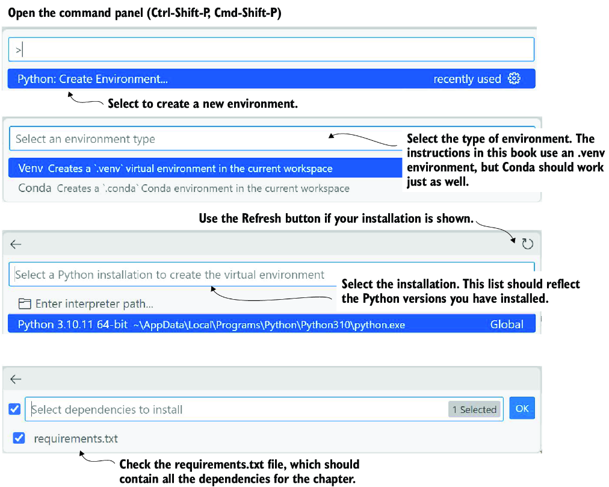

# appendix B Python development environment

While this book assumes readers are experienced Python developers, this could mean many different things. In this appendix, we look at configuring a Python development environment that will function with the code examples in this book. You can use other integrated development environments (IDEs), but not all tooling, especially extensions, will work in all IDEs.

## B.1 Downloading the source code

To download and run the source code, install Git, and then pull the repository locally. Here are the high-level steps to pull the code from the book’s GitHub repository:

1. Install Git if you need to. Git can be installed from multiple sources, but a good option is the main release, found here: [https://git-scm.com/downloads](https://git-scm.com/downloads). Follow the instructions to download and install the tool for your operating system.
2. Open a terminal in a folder you want to download the source to, and then enter the following command:

```
git clone https://github.com/cxbxmxcx/GPT-Agents.git
```

1. 3\. After the code is downloaded, you can begin by opening the chapter folder that you’re working on in Visual Studio Code (VS Code). If you need to install VS Code or understand how to load a chapter folder as a workspace, consult section B.5 in this appendix.

## B.2 Installing Python

Python is provided through different versions and deployments. This book relies on the standard Python installation, version 3.10. Anaconda is another deployment of Python that is very popular and could be used. However, all the material in this book has been run and tested with a Python 3.10 virtual environment:

1. Go to [www.python.org/downloads/](http://www.python.org/downloads/).
2. Locate and download the latest release of Python 3.10 for your operating system.
3. Install the release on your machine using the instructions for your operating system.
4. To confirm your installation, open a terminal, and execute the following command:

```
python –-version
```

The version should be 3.10, but if it isn’t, don't worry. You may have multiple Python versions installed. We’ll also confirm the installation when setting up VS Code.

## B.3 Installing VS Code

Installing VS Code is relatively straightforward and can be done in just a few steps:

1. Go to [https://code.visualstudio.com](https://code.visualstudio.com).
2. Download a stable release of VS Code for your operating system.
3. After the release is downloaded, follow the installation instructions for your operating system.
4. Launch VS Code for your operating system, and make sure no warnings or errors appear. If you encounter problems, try to restart your computer and/or reinstall.

With VS Code running, we can install the necessary extensions. We’ll cover those extensions next.

## B.4 Installing VS Code Python extensions

Thousands of extensions for VS Code can provide an excellent Python coding environment. The recommended ones are only the start of what you can explore independently. Beware, though, that not all extensions are created equally. When installing new extensions, look at the number of installs and ratings. Extensions with fewer than four stars are generally to be avoided. To install the extensions, follow these steps:

1. Launch VS Code, and open the Extensions panel, as shown in figure B.1.


##### Figure B.1 Installing VS Code extensions

1. 2\. Install the following list of extensions:
   
   - Python, for environment and language support
   - Python Extension Pack, for covering other extensions
   - Python Environment Manager, for managing environments
   - Python Indent, for code formatting
   - Flake8, for code formatting/linting
   - Prompt Flow, for testing LLM prompts
   - Semantic Kernel Tools, for working with the Semantic Kernel framework
   - Docker, for managing Docker containers
   - Dev Containers, for running development environments with containers

You’ll only need to install the extensions for each VS Code environment you’re running. Typically, this will mean installing for just your operating system installation of VS Code. However, if you run VS Code in containers, you must install extensions for each container you’re running. Working with Python in the Dev Containers extension will be covered later in this appendix.

## B.5 Creating a new Python environment with VS Code

When developing Python projects, you often want to create isolated virtual environments. This will help in managing multiple package dependencies across various tasks and tools. In this book, it’s recommended that a new virtual environment be created for each new chapter. VS Code can help you create and manage multiple Python environments quickly and efficiently via the following steps:

1. Press Ctrl-Shift-P (Cmd-Shift-P) to open the command panel, and select Python: Create Environment, as shown in figure B.2.



##### Figure B.2 The steps to set up the virtual environment for a chapter

1. 2\. Select the environment type, either Venv or Conda. This book demonstrates Venv but Conda should also work.
2. 3\. Select the Python installation. The code in this book has been run with Python 3.10 at a minimum. The agent tools and frameworks featured in this book are cutting edge, so they should support later versions of Python.
3. 4\. Check that the `requirements.txt` file in the chapter folder is selected. This will install all the requirements for the current chapter.

You should complete these steps for each new chapter of the book. The alternative is to use VS Code development containers, which will be covered in the next section.

## B.6 Using VS Code Dev Containers (Docker)

When working with advanced agents and agents that can generate and execute code, running them in isolated containers is generally recommended. Container isolation prevents operating system disruption or corruption and provides a base for deploying agents.

Getting familiar with containers and platforms such as Docker can be an extensive undertaking to grasp everything. Fortunately, it takes very little knowledge to start using containers, and VS Code extensions make this even more accessible.

You’ll first need to install a container toolset. Docker is free (provided you use the tool as a hobby or you’re a student) and the most accessible. Follow these instructions to install Docker and get started working with containers:

1. Go to the Docker Desktop download page at [www.docker.com/products/docker-desktop](http://www.docker.com/products/docker-desktop).
2. Download and install Docker for your operating system. Follow any other instructions as requested.
3. Launch the Docker desktop application. Completing this step will confirm you have Docker installed and working as expected.
4. Open VS Code, and confirm that the Docker extensions listed in section 1.4 are installed.

With Docker and VS Code configured, you can move on to using Dev Containers by following these steps:

1. Open a new instance of VS Code.
2. Select to open a remote window, as shown in figure B.3.


##### Figure B.3 Opening a remote window to a container in VS Code

1. 3\. Select Open Folder in Container to start a container from a folder, or select New Dev Container to start without a folder.

After the container is launched, your VS Code environment will be connected. This allows you to develop code on the container without worrying about dependencies not working.
