# 10 Agent reasoning and evaluation

### This chapter covers

- Using various prompt engineering techniques to extend large language model functions
- Engaging large language models with prompt engineering techniques that engage reasoning
- Employing an evaluation prompt to narrow and identify the solution to an unknown problem

Now that we’ve examined the patterns of memory and retrieval that define the semantic memory component in agents, we can take a look at the last and most instrumental component in agents: planning. Planning encompasses many facets, from reasoning, understanding, and evaluation to feedback.

To explore how LLMs can be prompted to reason, understand, and plan, we’ll demonstrate how to engage reasoning through prompt engineering and then expand that to planning. The planning solution provided by the Semantic Kernel (SK) encompasses multiple planning forms. We’ll finish the chapter by incorporating adaptive feedback into a new planner.

Figure 10.1 demonstrates the high-level prompt engineering strategies we’ll cover in this chapter and how they relate to the various techniques we’ll cover. Each of the methods showcased in the figure will be explored in this chapter, from the basics of solution/direct prompting, shown in the top-left corner, to self-consistency and tree of thought (ToT) prompting, in the bottom right.

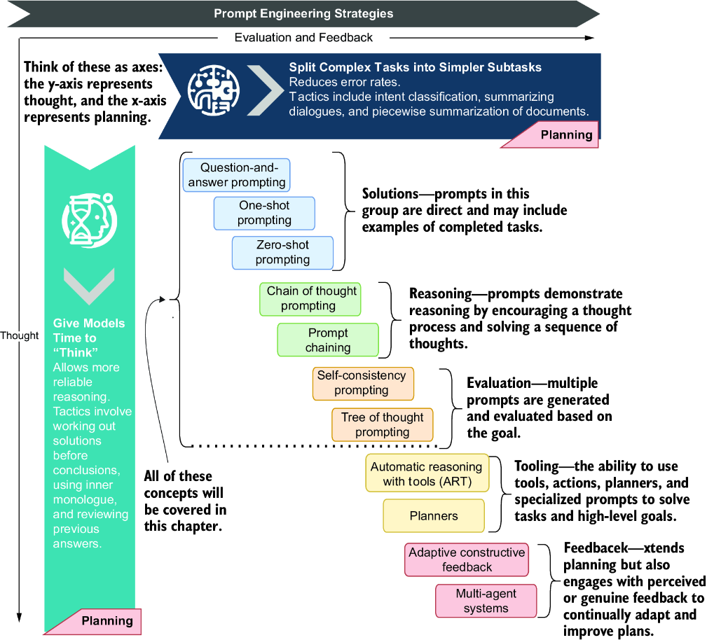

##### Figure 10.1 How the two planning prompt engineering strategies align with the various techniques

## 10.1 Understanding direct solution prompting

*Direct solution prompting* is generally the first form of prompt engineering that users employ when asking LLMs questions or solving a particular problem. Given any LLM use, these techniques may seem apparent, but they are worth reviewing to establish the foundation of thought and planning. In the next section, we’ll start from the beginning, asking questions and expecting answers.

### 10.1.1 Question-and-answer prompting

For the exercises in this chapter, we’ll employ prompt flow to build and evaluate the various techniques. (We already extensively covered this tool in chapter 9, so refer to that chapter if you need a review.) Prompt flow is an excellent tool for understanding how these techniques work and exploring the flow of the planning and reasoning process.

Open Visual Studio Code (VS Code) to the `chapter` `10` source folder. Create a new virtual environment for the folder, and install the `requirements.txt` file. If you need help setting up a chapter’s Python environment, refer to appendix B.

We’ll look at the first flow in the `prompt_flow/question-answering-prompting` folder. Open the `flow.dag.yaml` file in the visual editor, as shown in figure 10.2. On the right side, you’ll see the flow of components. At the top is the `question_answer` LLM prompt, followed by two `Embedding` components and a final LLM prompt to do the evaluation called `evaluate`.

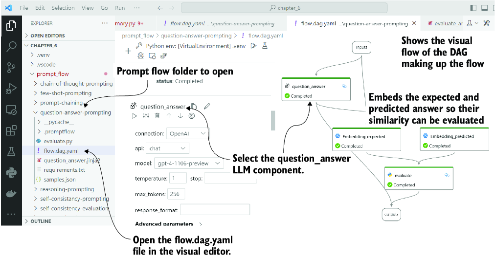

##### Figure 10.2 The `flow.dag.yaml` file, open in the visual editor, highlighting the various components of the flow

The breakdown in listing 10.1 shows the structure and components of the flow in more detail using a sort of YAML-shortened pseudocode. You can also see the input and outputs to the various components and a sample output from running the flow.

##### Listing 10.1 `question-answer-prompting` flow

```
   Inputs:
        context  : the content to ask the question about
        question : question asked specific to the content
        expected : the expected answer

   LLM: Question-Answer (the prompt used to ask the question)
        inputs:
               context and question
        outputs: 
               the prediction/answer to the question

   Embeddings: uses an LLM embedding model to create the embedding 
representation of the text

     Embedding_predicted: embeds the output of the Question-Answer LLM
     Embedding_expected: embeds the output of the expected answer

   Python: Evaluation (Python code to measure embedding similarity)
     Inputs:
            Embedding_predicted output
            Embedding_expected output
     Outputs: 
            the similarity score between predicted and expected

   Outputs:
        context: -> input.context
        question: -> input.question
     expected: -> input.expected
     predicted: -> output.question_answer
     evaluation_score: output.evaluation

### Example Output
{
    "context": "Back to the Future (1985)…",
    "evaluation_score": 0.9567478002354606,
    "expected": "Marty traveled back in time 30 years.",
    "predicted": "Marty traveled back in time 30 years from 1985 to 1955 
in the movie \"Back to the Future.\"",
    "question": "How far did Marty travel back in time in the movie 
Back to the Future (1985)"
}
```

Before running this flow, make sure your LLM block is configured correctly. This may require you to set up a connection to your chosen LLM. Again, refer to chapter 9 if you need a review on how to complete this. You’ll need to configure the LLM and `Embedding` blocks with your connection if you’re not using OpenAI.

After configuring your LLM connection, run the flow by clicking the Play button from the visual editor or using the Test (Shift-F5) link in the YAML editor window. If everything is connected and configured correctly, you should see output like that in listing 10.1.

Open the `question_answer.jinja2` file in VS Code, as shown in listing 10.2. This listing shows the basic question-and-answer-style prompt. In this style of prompt, the system message describes the basic rules and provides the context to answer the question. In chapter 4, we explored the retrieval augmented generation (RAG) pattern, and this prompt follows a similar pattern.

##### Listing 10.2 `question_answer.jinja2`

```
system:
Answer the users question based on the context below. Keep the answer 
short and concise. Respond "Unsure about answer" if not sure about the 
answer.

Context: {{context}}     #1

user:
Question: {{question}}     #2
```

#1 Replace with the content LLM should answer the question about.  
#2 Replace with the question.

This exercise shows the simple method of using an LLM to ask questions about a piece of content. Then, the question response is evaluated using a similarity matching score. We can see from the output in listing 10.1 that the LLM does a good job of answering a question about the context. In the next section, we’ll explore a similar technique that uses direct prompting.

### 10.1.2 Implementing few-shot prompting

*Few-shot prompting* is like question-and-answer prompting, but the makeup of the prompt is more about providing a few examples than about facts or context. This allows the LLM to bend to patterns or content not previously seen. While this approach sounds like question and answer, the implementation is quite different, and the results can be powerful.

##### Zero-shot, one-shot, and few-shot learning

One holy grail of machine learning and AI is the ability to train a model on as few items as possible. For example, in traditional vision models, millions of images are fed into the model to help identify the differences between a cat and a dog.

A *one-shot* model is a model that requires only a single image to train it. For example, a picture of a cat can be shown, and then the model can identify any cat image. A *few-shot* model requires only a few things to train the model. And, of course, *zero-shot* indicates the ability to identify something given no previous examples. LLMs are efficient learners and can do all three types of learning.

Open `prompt_flow/few-shot-prompting/flow.dag.yaml` in VS Code and the visual editor. Most of the flow looks like the one pictured earlier in figure 10.2, and the differences are highlighted in listing 10.3, which shows a YAML pseudocode representation. The main differences between this and the previous flow are the inputs and LLM prompt.

##### Listing 10.3 `few-shot-prompting` flow

```
   Inputs:
       statement  : introduces the context and then asks for output
       expected : the expected answer to the statement
   LLM: few_shot (the prompt used to ask the question)
       inputs:statement
       outputs: the prediction/answer to the statement

   Embeddings: uses an LLM embedding model to create the embedding 
representation of the text

        Embedding_predicted: embeds the output of the few_shot LLM
        Embedding_expected: embeds the output of the expected answer

   Python: Evaluation (Python code to measure embedding similarity)
        Inputs:
               Embedding_predicted output
               Embedding_expected output
        Outputs: the similarity score between predicted and expected

Outputs:
        statement: -> input.statement
        expected: -> input.expected
        predicted: -> output.few_shot
        evaluation_score: output.evaluation

### Example Output
{
    "evaluation_score": 0.906647282920417,     #1
    "expected": "We ate sunner and watched the setting sun.",
    "predicted": "After a long hike, we sat by the lake 
and enjoyed a peaceful sunner as the sky turned 
brilliant shades of orange and pink.",     #2
    "statement": "A sunner is a meal we eat in Cananda 
at sunset, please use the word in a sentence"     #3
}
```

#1 Evaluation score represents the similarity between expected and predicted.  
#2 Uses sunner in a sentence  
#3 This is a false statement but the intent is to get the LLM to use the word as if it was real.

Run the flow by pressing Shift-F5 or clicking the Play/Test button from the visual editor. You should see output like listing 10.3 where the LLM has used the word *sunner* (a made-up term) correctly in a sentence given the initial statement.

This exercise demonstrates the ability to use a prompt to alter the behavior of the LLM to be contrary to what it has learned. We’re changing what the LLM understands to be accurate. Furthermore, we then use that modified perspective to elicit the use of a made-up word.

Open the `few_shot.jinja2` prompt in VS Code, shown in listing 10.4. This listing demonstrates setting up a simple persona, that of an eccentric dictionary maker, and then providing examples of words it has defined and used before. The base of the prompt allows for the LLM to extend the examples and produce similar results using other words.

##### Listing 10.4 `few_shot.jinja2`

```
system:
You are an eccentric word dictionary maker. You will be asked to 

construct a sentence using the word.
The following are examples that demonstrate how to craft a sentence using 
the word.
A "whatpu" is a small, furry animal native to Tanzania. 
An example of a sentence that uses the word whatpu is:     #1
We were traveling in Africa and we saw these very cute whatpus.
To do a "farduddle" means to jump up and down really fast. An example of a 
sentence that uses the word farduddle is:
I was so excited that I started to farduddle.     #2

Please only return the sentence requested by the user.   #3

user:
{{statement}}    #4
```

#1 Demonstrates an example defining a made-up word and using it in a sentence  
#2 Demonstrates another example  
#3 A rule to prevent the LLM from outputting extra information  
#4 The input statement defines a new word and asks for the use.

You may say we’re forcing the LLM to hallucinate here, but this technique is the basis for modifying behavior. It allows prompts to be constructed to guide an LLM to do everything contrary to what it learned. This foundation of prompting also establishes techniques for other forms of altered behavior. From the ability to alter the perception and background of an LLM, we’ll move on to demonstrate a final example of a direct solution in the next section.

### 10.1.3 Extracting generalities with zero-shot prompting

*Zero-shot prompting or learning* is the ability to generate a prompt in such a manner that allows the LLM to generalize. This generalization is embedded within the LLM and demonstrated through zero-shot prompting, where no examples are given, but instead a set of guidelines or rules are given to guide the LLM.

Employing this technique is simple and works well to guide the LLM to generate replies given its internal knowledge and no other contexts. It’s a subtle yet powerful technique that applies the knowledge of the LLM to other applications. This technique, combined with other prompting strategies, is proving effective at replacing other language classification models—models that identify the emotion or sentiment in text, for example.

Open `prompt_flow/zero-shot-prompting/flow.dag.yaml` in the VS Code prompt flow visual editor. This flow is again almost identical to that shown earlier in figure 10.1 but differs slightly in implementation, as shown in listing 10.5.

##### Listing 10.5 `zero-shot-prompting` flow

```
   Inputs:
        statement  : the statement to be classified
        expected : the expected classification of the statement

    LLM: zero_shot (the prompt used to classify)
        inputs: statement
        outputs: the predicted class given the statement

    Embeddings: uses an LLM embedding model to create the embedding 
representation of the text

    Embedding_predicted: embeds the output of the zero_shot LLM
    Embedding_expected: embeds the output of the expected answer

    Python: Evaluation (Python code to measure embedding similarity)
        Inputs:
               Embedding_predicted output
             Embedding_expected output
          Outputs: the similarity score between predicted and expected

   Outputs:
        statement: -> input.statement
        expected: -> input.expected
        predicted: -> output.few_shot
        evaluation_score: output.evaluation

   ### Example Output
{
       "evaluation_score": 1,     #1
       "expected": "neutral",
       "predicted": "neutral",
       "statement": "I think the vacation is okay. "     #2
   }
```

#1 Shows a perfect evaluation score of 1.0  
#2 The statement we’re asking the LLM to classify

Run the flow by pressing Shift-F5 within the VS Code prompt flow visual editor. You should see output similar to that shown in listing 10.5.

Now open the `zero_shot.jinja2` prompt as shown in listing 10.6. The prompt is simple and uses no examples to extract the sentiment from the text. What is especially interesting to note is that the prompt doesn’t even mention the phrase sentiment, and the LLM seems to understand the intent.

##### Listing 10.6 `zero_shot.jinja2`

```
system:
Classify the text into neutral, negative or positive. 
Return on the result and nothing else.     #1

user:
{{statement}}     #2
```

#1 Provides essential guidance on performing the classification  
#2 The statement of text to classify

Zero-shot prompt engineering is about using the ability of the LLM to generalize broadly based on its training material. This exercise demonstrates how knowledge within the LLM can be put to work for other tasks. The LLM’s ability to self-contextualize and apply knowledge can extend beyond its training. In the next section, we extend this concept further by looking at how LLMs can reason.

## 10.2 Reasoning in prompt engineering

LLMs like ChatGPT were developed to function as chat completion models, where text content is fed into the model, whose responses align with completing that request. LLMs were never trained to reason, plan, think, or have thoughts.

However, much like we demonstrated with the examples in the previous section, LLMs can be prompted to extract their generalities and be extended beyond their initial design. While an LLM isn’t designed to reason, the training material fed into the model provides an understanding of reasoning, planning, and thought. Therefore, by extension, an LLM understands what reasoning is and can employ the concept of reasoning.

##### Reasoning and planning

*Reasoning* is the ability of an intellect, artificial or not, to understand the process of thought or thinking through a problem. An intellect can understand that actions have outcomes, and it can use this ability to reason through which action from a set of actions can be applied to solve a given task.

*Planning* is the ability of the intellect to reason out the order of actions or tasks and apply the correct parameters to achieve a goal or outcome—the extent to which an intellectual plan depends on the scope of the problem. An intellect may combine multiple levels of planning, from strategic and tactical to operational and contingent.

We’ll look at another set of prompt engineering techniques that allow or mimic reasoning behavior to demonstrate this reasoning ability. Typically, when evaluating the application of reasoning, we look to having the LLM solve challenging problems it wasn’t designed to solve. A good source of such is based on logic, math, and word problems.

Using the time travel theme, what class of unique problems could be better to solve than understanding time travel? Figure 10.3 depicts one example of a uniquely challenging time travel problem. Our goal is to acquire the ability to prompt the LLM in a manner that allows it to solve the problem correctly.

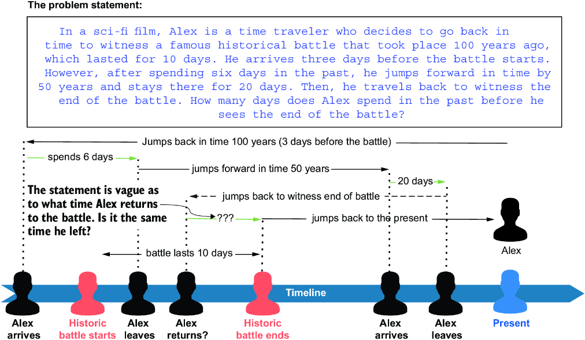

##### Figure 10.3 The complexity of the time travel problems we intend to solve using LLMs with reasoning and planning

Time travel problems are thought exercises that can be deceptively difficult to solve. The example in figure 10.3 is complicated to solve for an LLM, but the part it gets wrong may surprise you. The next section will use reasoning in prompts to solve these unique problems.

### 10.2.1 Chain of thought prompting

*Chain of thought* (CoT)prompting is a prompt engineering technique that employs the one-shot or few-shot examples that describe the reasoning and the steps to accomplish a desired goal. Through the demonstration of reasoning, the LLM can generalize this principle and reason through similar problems and goals. While the LLM isn’t trained with the goal of reasoning, we can elicit the model to reason, using prompt engineering.

Open `prompt_flow/chain-of-thought-prompting/flow.dag.yaml` in the VS Code prompt flow visual editor. The elements of this flow are simple, as shown in figure 10.4. With only two LLM blocks, the flow first uses a CoT prompt to solve a complex question; then, the second LLM prompt evaluates the answer.

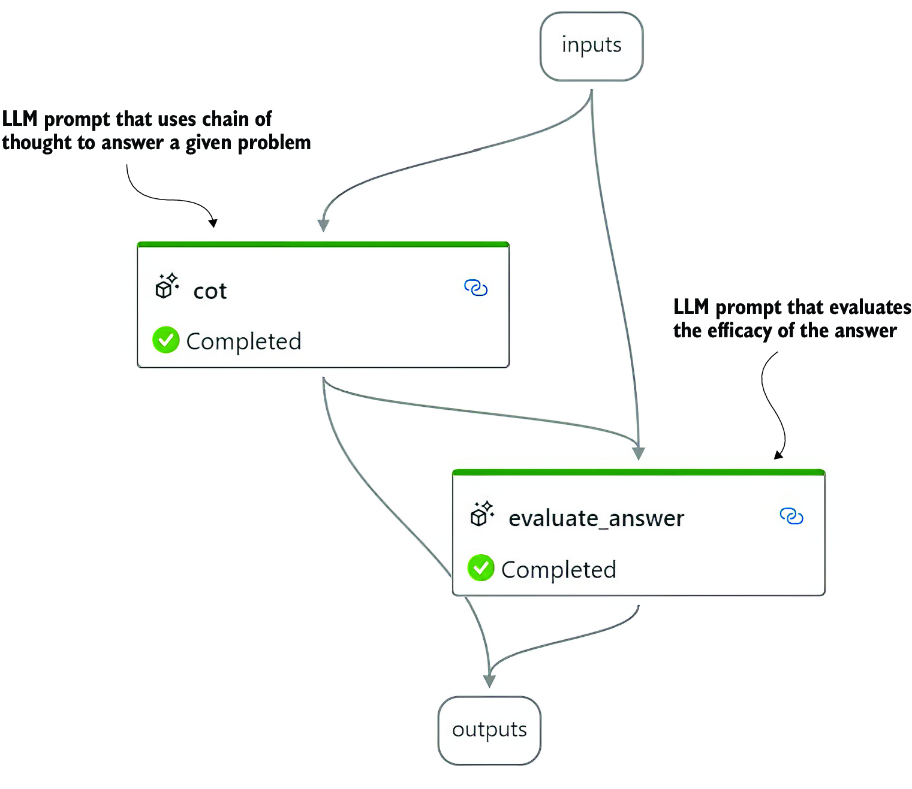

##### Figure 10.4 The flow of the CoT

Listing 10.7 shows the YAML pseudocode that describes the blocks and the inputs/outputs of the flow in more detail. The default problem statement in this example isn’t the same as in figure 10.3.

##### Listing 10.7 `chain-of-thought-prompting` flow

```
   Inputs:
        statement  : the statement problem to be solved
        expected : the expected solution to the problem

   LLM: cot (the prompt used to solve the problem)
        inputs: statement
        outputs: the predicted answer given the problem statement

   LLM: evaluate_answer (the prompt used to evaluate the solution)
        inputs:
               statement: -> input.statement
               expected: -> input.expected
               predicted: -> output.cot

        outputs: a score of how well the problem was answered


   Outputs:
        statement: -> input.statement
        expected: -> input.expected
        predicted: -> output.cot
        evaluation_score: output.evaluate_answer

   ### Example Output
{
    "evaluation_score": "0.5",     #1
    "expected": "After the final jump, Max finds himself 
in the year 1980 and he is 75 years old.",     #2
    "predicted": " Max starts in the year 2300 and 
travels backward in 40-year increments, spending 5 years 
in each period. The journeys will be as follows:
\n\n- From 2300 to 2260: Max is 25 + 5 = 30 years old.
\n- From 2260 to 2220: Max is 30 + 5 = 35 years old.
\n- From 2220 to 2180: Max is 35 + 5 = 40 years old.
\n- From 2180 to 2140: Max is 40 + 5 = 45 years old.
\n- From 2140 to 2100: Max is 45 + 5 = 50 years old.
\n- From 2100 to 2060: Max is 50 + 5 = 55 years old.
\n- From 2060 to 2020: Max is 55 + 5 = 60 years old.
\n- From 2020 to 1980: Max is 60 + 5 = 65 years old.
\n- From 1980 to 1940: Max is 65 + 5 = 70 years old.
\n- From 1940 to 1900: Max is 70 + 5"     #3
}
```

#1 The evaluated score for the given solution  
#2 The expected answer for the problem  
#3 The predicted answer shows the reasoning steps and output.

Dig into the inputs and check the problem statement; try to evaluate the problem yourself. Then, run the flow by pressing Shift-F5. You should see output similar to that shown in listing 10.7.

Open the `cot.jinja2` prompt file as shown in listing 10.8. This prompt gives a few examples of time travel problems and then the thought-out and reasoned solution. The process of showing the LLM the steps to complete the problem provides the reasoning mechanism.

##### Listing 10.8 `cot.jinja2`

```
system:
"In a time travel movie, Sarah travels back in time to 
prevent a historic event from happening. She arrives 
2 days before the event. After spending a day preparing, 
she attempts to change the event but realizes she has 
actually arrived 2 years early, not 2 days. She then 
decides to wait and live in the past until the event's 
original date. How many days does Sarah spend in the past 
before the day of the event?"     #1

Chain of Thought:     #2

    Initial Assumption: Sarah thinks she has arrived 2 days before the event.
    Time Spent on Preparation: 1 day spent preparing.
    Realization of Error: Sarah realizes she's actually 2 years early.
    Conversion of Years to Days: 
2 years = 2 × 365 = 730 days (assuming non-leap years).
    Adjust for the Day Spent Preparing: 730 - 1 = 729 days.
    Conclusion: Sarah spends 729 days in the past before the day of the event.

"In a sci-fi film, Alex is a time traveler who decides 
to go back in time to witness a famous historical battle 
that took place 100 years ago, which lasted for 10 days. 
He arrives three days before the battle starts. However, 
after spending six days in the past, he jumps forward in 
time by 50 years and stays there for 20 days. Then, he 
travels back to witness the end of the battle. How many 
days does Alex spend in the past before he sees the end of
 the battle?"     #3

Chain of Thought:     #4

    Initial Travel: Alex arrives three days before the battle starts.
    Time Spent Before Time Jump: Alex spends six days in the past. 
The battle has started and has been going on for 3 days (since he 
arrived 3 days early and has now spent 6 days, 3 + 3 = 6).
    First Time Jump: Alex jumps 50 years forward and stays for 20 days.
 This adds 20 days to the 6 days he's already spent in the past 
(6 + 20 = 26).
    Return to the Battle: When Alex returns, he arrives back on the same 
day he left (as per time travel logic). The battle has been going on for 
3 days now.
    Waiting for the Battle to End: The battle lasts 10 days. Since he's 
already witnessed 3 days of it, he needs to wait for 7 more days.
    Conclusion: Alex spends a total of 3 (initial wait) + 3 (before the 
first jump) + 20 (50 years ago) + 7 (after returning) = 33 days in the 
past before he sees the end of the battle.
Think step by step but only show the final answer to the statement.

user:
{{statement}}     #5
```

#1 A few example problem statements  
#2 The solution to the problem statement, output as a sequence of reasoning steps  
#3 A few example problem statements  
#4 The solution to the problem statement, output as a sequence of reasoning steps  
#5 The problem statement the LLM is directed to solve

You may note that the solution to figure 10.3 is also provided as an example in listing 10.8. It’s also helpful to go back and review listing 10.7 for the reply from the LLM about the problem. From this, you can see the reasoning steps the LLM applied to get its final answer.

Now, we can look at the prompt that evaluates how well the solution solved the problem. Open `evaluate_answer.jinja2`, shown in listing 10.9, to review the prompt used. The prompt is simple, uses zero-shot prompting, and allows the LLM to generalize how it should score the expected and predicted. We could provide examples and scores, thus changing this to an example of a few-shot classification.

##### Listing 10.9 `evaluate_answer.jinja2`

```
system:

Please confirm that expected and predicted results are 
the same for the given problem.     #1
Return a score from 0 to 1 where 1 is a perfect match and 0 is no match.
Please just return the score and not the explanation.     #2

user:
Problem: {{problem}}     #3

Expected result: {{expected}}     #4

Predicted result: {{predicted}}     #5
```

#1 The rules for evaluating the solution  
#2 Direction to only return the score and nothing else  
#3 The initial problem statement  
#4 The expected or grounded answer  
#5 The output from the CoT prompt earlier

Looking at the LLM output shown earlier in listing 10.7, you can see why the evaluation step may get confusing. Perhaps a fix to this could be suggesting to the LLM to provide the final answer in a single statement. In the next section, we move on to another example of prompt reasoning.

### 10.2.2 Zero-shot CoT prompting

As our time travel demonstrates, CoT prompting can be expensive in terms of prompt generation for a specific class of problem. While not as effective, there are techniques similar to CoT that don’t use examples and can be more generalized. This section will examine a straightforward phrase employed to elicit reasoning in LLMs.

Open `prompt_flow/zero-shot-cot-prompting/flow.dag.yaml` in the VS Code prompt flow visual editor. This flow is very similar to the previous CoT, as shown in figure 10.4. The next lsting shows the YAML pseudocode that describes the flow.

##### Listing 10.10 `zero-shot-CoT-prompting` flow

```
   Inputs:
        statement  : the statement problem to be solved
        expected : the expected solution to the problem

   LLM: cot (the prompt used to solve the problem)
        inputs: statement
        outputs: the predicted answer given the problem statement

   LLM: evaluate_answer (the prompt used to evaluate the solution)
        inputs:
               statement: -> input.statement
               expected: -> input.expected
               predicted: -> output.cot

         outputs: a score of how well the problem was answered


    Outputs:
        statement: -> input.statement
        expected: -> input.expected
        predicted: -> output.cot
        evaluation_score: output.evaluate_answer

    ### Example Output
   {
       "evaluation_score": "1",     #1
       "expected": "After the final jump, ↪
          ↪ Max finds himself in the year 1980 and 
   he is 75 years old.",     #2
       "predicted": "Max starts in… ↪
          ↪ Therefore, after the final jump, ↪
          ↪ Max is 75 years old and in the year 1980.",     #3
       "statement": "In a complex time travel …"     #4
   }
```

#1 The final evaluation score  
#2 The expected answer  
#3 The predicted answer (the steps have been omitted showing the final answer)  
#4 The initial problem statement

Run/test the flow in VS Code by pressing Shift-F5 while in the visual editor. The flow will run, and you should see output similar to that shown in listing 10.10. This exercise example performs better than the previous example on the same problem.

Open the `cot.jinja2` prompt in VS Code, as shown in listing 10.11. This is a much simpler prompt than the previous example because it only uses zero-shot. However, one key phrase turns this simple prompt into a powerful reasoning engine. The line in the prompt `Let’s` `think` `step` `by` `step` triggers the LLM to consider internal context showing reasoning. This, in turn, directs the LLM to reason out the problem in steps.

##### Listing 10.11 `cot.jinja2`

```
system:
You are an expert in solving time travel problems.
You are given a time travel problem and you have to solve it.
Let's think step by step.     #1
Please finalize your answer in a single statement.     #2

user:
{{statement}}     #3
```

#1 A magic line that formulates reasoning from the LLM  
#2 Asks the LLM to provide a final statement of the answer  
#3 The problem statement the LLM is asked to solve

Similar phrases asking the LLM to think about the steps or asking it to respond in steps also extract reasoning. We’ll demonstrate a similar but more elaborate technique in the next section.

### 10.2.3 Step by step with prompt chaining

We can extend the behavior of asking an LLM to think step by step into a chain of prompts that force the LLM to solve the problem in steps. In this section, we look at a technique called *prompt chaining* that forces an LLM to process problems in steps.

Open the `prompt_flow/prompt-chaining/flow.dag.yaml` file in the visual editor, as shown in figure 10.5. Prompt chaining breaks up the reasoning method used to solve a problem into chains of prompts. This technique forces the LLM to answer the problem in terms of steps.

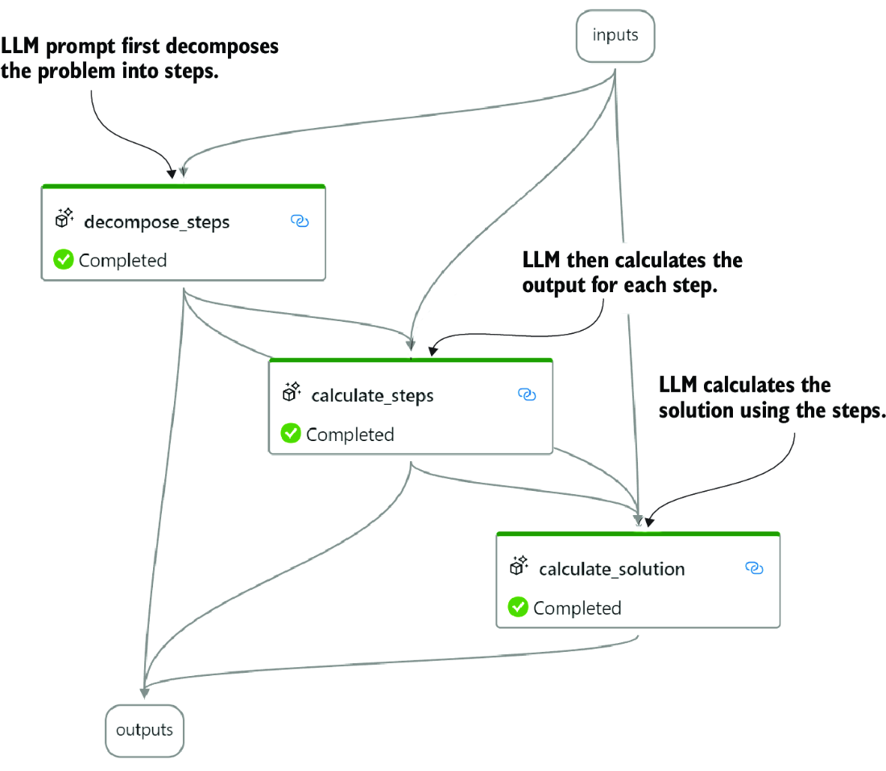

##### Figure 10.5 The prompt chaining flow

Listing 10.12 shows the YAML pseudocode that describes the flow in a few more details. This flow chains the output of the first LLM block into the second and then from the second into the third. Forcing the LLM to process the problem this way uncovers the reasoning pattern, but it can also be overly verbose.

##### Listing 10.12 `prompt-chaining` flow

```
   Inputs:
        statement  : the statement problem to be solved

   LLM: decompose_steps (the prompt used to decompose the problem)
        inputs: 
               statement: -> input.statement     #1

        outputs: the breakdown of steps to solve the problem

   LLM: calculate_steps (the prompt used to calculate the steps)
        inputs:
               statement: -> input.statement
               decompose_steps: -> output.decompose_steps     #2

               outputs: the calculation for each step
   LLM: calculate_solution (attempts to solve the problem)
        inputs:
               statement: -> input.statement
               decompose_steps: -> output.decompose_steps
               calculate_steps: -> output.calculate_steps     #3

         outputs: the final solution statement

   Outputs:
        statement: -> input.statement
        decompose_steps: -> output.decompose_steps
        calculate_steps: -> output.calculate_steps
        calculate_solution: -> output.calculate_solution

   ### Example Output
{
    "calculate_steps": "1. The days spent by Alex",
    "decompose_steps": "To figure out the …",
    "solution": "Alex spends 13 days in the ↪
           ↪ past before the end of the battle.",     #4
    "statement": "In a sci-fi film, Alex …"    
}
```

#1 Start of the chain of prompts  
#2 Output from the previous step injected into this step  
#3 Output from two previous steps injected into this step  
#4 The final solution statement, although wrong, is closer.

Run the flow by pressing Shift-F5 from the visual editor, and you’ll see the output as shown in listing 10.12. The answer is still not correct for the Alex problem, but we can see all the work the LLM is doing to reason out the problem.

Open up all three prompts: `decompose_steps.jinja2`, `calculate_steps.jinja2`, and `calculate_solution.jinja2` (see listings 10.13, 10.14, and 10.15, respectively). All three prompts shown in the listings can be compared to show how outputs chain together.

##### Listing 10.13 `decompose_steps.jinja2`

```
system:
You are a problem solving AI assistant.
Your job is to break the users problem down into smaller steps and list 
the steps in the order you would solve them.
Think step by step, not in generalities.
Do not attempt to solve the problem, just list the steps. #1

user:
{{statement}}     #2
```

#1 Forces the LLM to list only the steps and nothing else  
#2 The initial problem statement

##### Listing 10.14 `calculate_steps.jinja2`

```
system:
You are a problem solving AI assistant.
You will be given a list of steps that solve a problem.
Your job is to calculate the output for each of the steps in order.
Do not attempt to solve the whole problem,
just list output for each of the steps.     #1
Think step by step.     #2

user:
{{statement}}

{{steps}}     #3
```

#1 Requests that the LLM not solve the whole problem, just the steps  
#2 Uses the magic statement to extract reasoning  
#3 Injects the steps produced by the decompose\_steps step

##### Listing 10.15 `calculate_solution.jinja2`

```
system:
You are a problem solving AI assistant.
You will be given a list of steps and the calculated output for each step.
Use the calculated output from each step to determine the final 
solution to the problem.
Provide only the final solution to the problem in a 
single concise sentence. Do not include any steps 
in your answer.     #1

user:
{{statement}}

{{steps}}     #2

{{calculated}}     #3
```

#1 Requests that the LLM output the final answer and not any steps  
#2 The decomposed steps  
#3 The calculated steps

In this exercise example, we’re not performing any evaluation and scoring. Without the evaluation, we can see that this sequence of prompts still has problems solving our more challenging time travel problem shown earlier in figure 10.3. However, that doesn’t mean this technique doesn’t have value, and this prompting format solves some complex problems well.

What we want to find, however, is a reasoning and planning methodology that can solve such complex problems consistently. The following section moves from reasoning to evaluating the best solution.

## 10.3 Employing evaluation for consistent solutions

In the previous section, we learned that even the best-reasoned plans may not always derive the correct solution. Furthermore, we may not always have the answer to confirm if that solution is correct. The reality is that we often want to use some form of evaluation to determine the efficacy of a solution.

Figure 10.6 shows a comparison of the prompt engineering strategies that have been devised as a means of getting LLMs to reason and plan. We’ve already covered the two on the left: zero-shot direct prompting and CoT prompting. The following example exercises in this section will look at self-consistency with the CoT and ToT techniques.

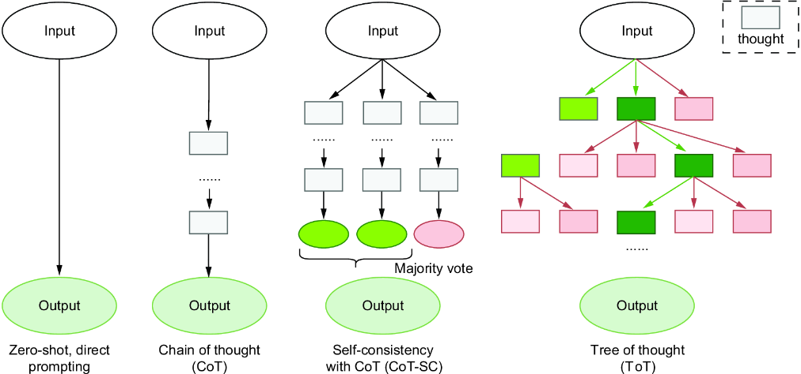

##### Figure 10.6 Comparing the various prompt engineering strategies to enable reasoning and planning from LLMs

We’ll continue to focus on the complex time travel problem to compare these more advanced methods that expand on reasoning and planning with evaluation. In the next section, we’ll evaluate self-consistency.

### 10.3.1 Evaluating self-consistency prompting

Consistency in prompting is more than just lowering the temperature parameter we send to an LLM. Often, we want to generate a consistent plan or solution and still use a high temperature to better evaluate all the variations to a plan. By evaluating multiple different plans, we can get a better sense of the overall value of a solution.

*Self-consistent prompting* is the technique of generating multiple plans/solutions for a given problem. Then, those plans are evaluated, and the more frequent or consistent plan is accepted. Imagine three plans generated, where two are similar, but the third is different. Using self-consistency, we evaluate the first two plans as the more consistent answer.

Open `prompt_flow/self-consistency-prompting/flow.dag.yaml` in the VS Code prompt flow visual editor. The flow diagram shows the simplicity of the prompt generation flow in figure 10.7. Next to it in the diagram is the self-consistency evaluation flow.

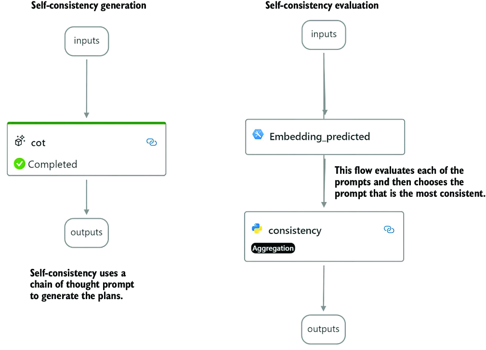

##### Figure 10.7 The self-consistency prompt generation beside the evaluation flow

Prompt flow uses a direct acyclic graph (DAG) format to execute the flow logic. DAGs are an excellent way of demonstrating and executing flow logic, but because they are *acyclic,* meaning they can’t repeat, they can’t execute loops. However, because prompt flow provides a batch processing mechanism, we can use that to simulate loops or repetition in a flow.

Referring to figure 10.6, we can see that self-consistency processes the input three times before collecting the results and determining the best plan/reply. We can apply this same pattern but use batch processing to generate the outputs. Then, the evaluation flow will aggregate the results and determine the best answer.

Open the `self-consistency-prompting/cot.jinja2` prompt template in VS Code (see listing 10.16). The listing was shortened, as we’ve seen parts before. This prompt uses two (few-shot prompt) examples of a CoT to demonstrate the thought reasoning to the LLM.

##### Listing 10.16 `self-consistency-prompting/cot.jinja2`

```
system:

"In a time travel movie, Sarah travels back… "     #1

Chain of Thought:

    Initial Assumption: …     #2
    Conclusion: Sarah spends 729 days in the past before the day of the event.

"In a complex time travel movie plot, Max, a 25 year old…"     #3

Chain of Thought:
    Starting Point: Max starts …     #4
    Conclusion: After the final jump, 
Max finds himself in the year 1980 and he is 75 years old.
Think step by step,
 but only show the final answer to the statement.     #5

user:
{{statement}}
```

#1 The Sarah time travel problem  
#2 Sample CoT, cut for brevity  
#3 The Max time travel problem  
#4 Sample CoT, cut for brevity  
#5 Final guide and statement to constrain output

Open the `self-consistency-prompting/flow.dag.yaml` file in VS Code. Run the example in batch mode by clicking Batch Run (the beaker icon) from the visual editor. Figure 10.8 shows the process step by step:

1. Click Batch Run.
2. Select the JSON Lines (JSONL) input.
3. Select `statements.jsonl`.
4. Click the Run link.

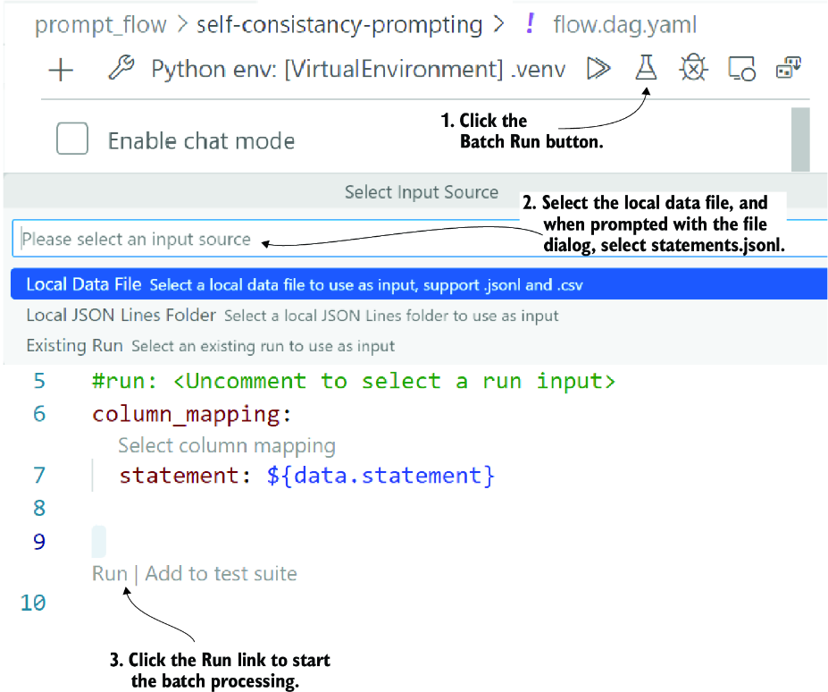

##### Figure 10.8 The step-by-step process of launching a batch process

TIP  If you need to review the process, refer to chapter 9, which covers this process in more detail.

Listing 10.17 shows the JSON output from executing the flow in batch mode. The `statements.jsonl` file has five identical Alex time travel problem entries. Using identical entries allows us to simulate the prompt executing five times on the duplicate entry.

##### Listing 10.17 `self-consistency-prompting` batch execution output

```
{
    "name": "self-consistency-prompting_default_20240203_100322_912000",
    "created_on": "2024-02-03T10:22:30.028558",
    "status": "Completed",
    "display_name": "self-consistency-prompting_variant_0_202402031022",
    "description": null,
    "tags": null,
    "properties": {
        "flow_path": "…prompt_flow/self-consistency-prompting",     #1
        "output_path": "…/.promptflow/.runs/self-
↪ consistency-prompting_default_20240203_100322_912000",     #2
        "system_metrics": {
            "total_tokens": 4649,
            "prompt_tokens": 3635,
            "completion_tokens": 1014,
            "duration": 30.033773
        }
    },
    "flow_name": "self-consistency-prompting",
    "data": "…/prompt_flow/self-consistency-prompting/
↪ statements.jsonl",     #3
    "output": "…/.promptflow/.runs/self-consistency-↪
↪ prompting_default_20240203_100322_912000/flow_outputs"
}
```

#1 The path where the flow was executed from  
#2 The folder containing the outputs of the flow (note this path)  
#3 The data used to run the flow in batch

You can view the flow produced by pressing the Ctrl key and clicking the output link, highlighted in listing 10.17. This will open another instance of VS Code, showing a folder with all the output from the run. We now want to check the most consistent answer. Fortunately, the evaluation feature in prompt flow can help us identify consistent answers using similarity matching.

Open `self-consistency-evaluation/flow.dag.yaml` in VS Code (see figure 10.7). This flow embeds the predicted answer and then uses an aggregation to determine the most consistent answer.

From the flow, open `consistency.py` in VS Code, as shown in listing 10.18. The code for this tool function calculates the cosine similarity for all pairs of answers. Then, it finds the most similar answer, logs it, and outputs that as the answer.

##### Listing 10.18 `consistency.py`

```
from promptflow import tool
from typing import List
import numpy as np
from scipy.spatial.distance import cosine
@tool
def consistency(texts: List[str],
                embeddings: List[List[float]]) -> str:
    if len(embeddings) != len(texts):
        raise ValueError("The number of embeddings ↪
       ↪ must match the number of texts.")

    mean_embedding = np.mean(embeddings, axis=0)     #1
    similarities = [1 - cosine(embedding, mean_embedding) ↪
                ↪ for embedding in embeddings]     #2
    most_similar_index = np.argmax(similarities)     #3

    from promptflow import log_metric
    log_metric(key="highest_ranked_output", value=texts[most_similar_index])     #4

    return texts[most_similar_index]     #5
```

#1 Calculates the mean of all the embeddings  
#2 Calculates cosine similarity for each pair of embeddings  
#3 Finds the index of the most similar answer  
#4 Logs the output as a metric  
#5 Returns the text for the most similar answer

We need to run the evaluation flow in batch mode as well. Open `self-consistency-evaluation/flow.dag.yaml` in VS Code and run the flow in batch mode (beaker icon). Then, select Existing Run as the flow input, and when prompted, choose the top or the last run you just executed as input.

Again, after the flow completes processing, you’ll see an output like that shown in listing 10.17. Ctrl-click on the output folder link to open a new instance of VS Code showing the results. Locate and open the `metric.json` file in VS Code, as shown in figure 10.9.

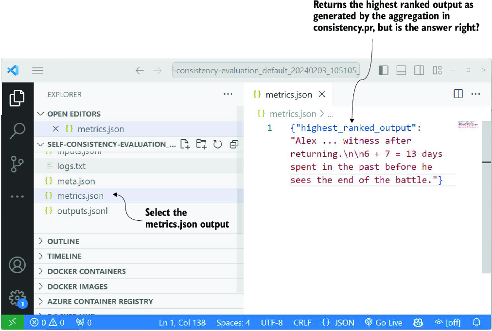

##### Figure 10.9 The VS Code is open to the batch run output folder. Highlighted are the `metrics.json` file and the output showing the most similar answer.

The answer shown in figure 10.9 is still incorrect for this run. You can continue a few more batch runs of the prompt and/or increase the number of runs in a batch and then evaluate flows to see if you get better answers. This technique is generally more helpful for more straightforward problems but still demonstrates an inability to reason out complex problems.

Self-consistency uses a reflective approach to evaluate the most likely thought. However, the most likely thing is certainly not always the best. Therefore, we must consider a more comprehensive approach in the next section.

### 10.3.2 Evaluating tree of thought prompting

As mentioned earlier, ToT prompting, as shown in figure 10.6, combines self-evaluation and prompt chaining techniques. As such, it breaks down the sequence of planning into a chain of prompts, but at each step in the chain, it provides for multiple evaluations. This creates a tree that can be executed and evaluated at each level, breadth-first, or from top to bottom, depth-first.

Figure 10.10 shows the difference between executing a tree using breadth-first or depth-first. Unfortunately, due to the DAG execution pattern of prompt flow, we can’t quickly implement the depth-first method, but breadth-first works just fine.

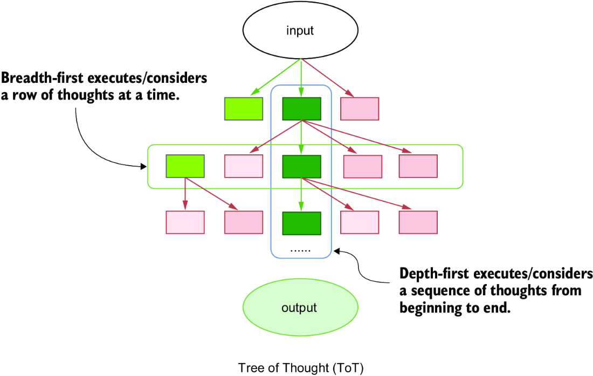

##### Figure 10.10 Breadth-first vs. depth-first execution on a ToT pattern

Open `tree-of-thought-evaluation/flow.dag.yaml` in VS Code. The visual of the flow is shown in figure 10.11. This flow functions like a breadth-first ToT pattern—the flow chains together a series of prompts asking the LLM to return multiple plans at each step.

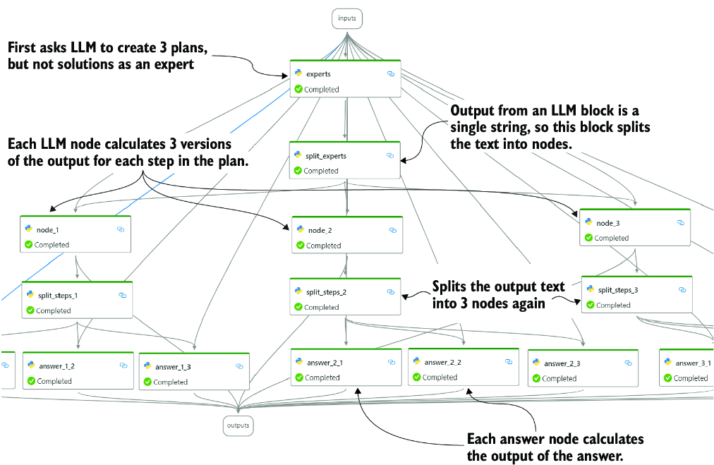

##### Figure 10.11 ToT pattern expressed and prompt flow

Because the flow executes in a breadth-first style, each level output of the nodes is also evaluated. Each node in the flow uses a pair of semantic functions—one to generate the answer and the other to evaluate the answer. The semantic function is a custom Python flow block that processes multiple inputs and generates multiple outputs.

Listing 10.19 shows the `semantic_function.py` tool. This general tool is reused for multiple blocks in this flow. It also demonstrates the embedding functionality from the SK for direct use within prompt flow.

##### Listing 10.19 `semantic_function.py`

```
@tool
def my_python_tool(
    input: str,
    input_node: int,
    history: str,
    semantic_function: str,
    evaluation_function: str,
    function_name: str,
    skill_name: str,
    max_tokens: int,
    temperature: float,
    deployment_name: str,
    connection: Union[OpenAIConnection, 
                      AzureOpenAIConnection],     #1
) -> str:
    if input is None or input == "":     #2
        return ""

    kernel = sk.Kernel(log=sk.NullLogger())
    # code for setting up the kernel and LLM connection omitted


    function = kernel.create_semantic_function(
                             semantic_function,                                               
                             function_name=function_name,
                             skill_name=skill_name,
                             max_tokens=max_tokens,
                             temperature=temperature,
                             top_p=0.5)     #3
    evaluation = kernel.create_semantic_function(
                             evaluation_function,        
                             function_name="Evaluation",
                             skill_name=skill_name,
                             max_tokens=max_tokens,
                             temperature=temperature,
                             top_p=0.5)     #4

    async def main():
        query = f"{history}\n{input}"
        try:
            eval = int((await evaluation.invoke_async(query)).result)
            if eval > 25:     #5
                return await function.invoke_async(query)    #6
        except Exception as e:
            raise Exception("Evaluation failed", e)

       try:
        result = asyncio.run(main()).result
        return result
    except Exception as e:
        print(e)
        return ""
```

#1 Uses a union to allow for different types of LLM connections  
#2 Checks to see if the input is empty or None; if so, the function shouldn’t be executed.  
#3 Sets up the generation function that creates a plan  
#4 Sets up the evaluation function  
#5 Runs the evaluate function and determines if the input is good enough to continue  
#6 If the evaluation score is high enough, generates the next step

The semantic function tool is used in the tree’s experts, nodes, and answer blocks. At each step, the function determines if any text is being input. If there is no text, the block returns with no execution. Passing no text to a block means that the previous block failed evaluation. By evaluating before each step, ToT short-circuits the execution of plans it deems as not being valid.

This may be a complex pattern to grasp at first, so go ahead and run the flow in VS Code. Listing 10.20 shows just the answer node output of a run; these results may vary from what you see but should be similar. Nodes that return no text either failed evaluation or their parents did.

##### Listing 10.20 Output from `tree-of-thought-evaluation` flow

```
{
    "answer_1_1": "",     #1
    "answer_1_2": "",
    "answer_1_3": "",
    "answer_2_1": "Alex spends a total of 29 days in the past before he 
sees the end of the battle.",
    "answer_2_2": "",     #2
    "answer_2_3": "Alex spends a total of 29 days in the past before he 
sees the end of the battle.",
    "answer_3_1": "",     #3
    "answer_3_2": "Alex spends a total of 29 days in the past before he 
sees the end of the battle.",
    "answer_3_3": "Alex spends a total of 9 days in the past before he 
sees the end of the battle.",
```

#1 Represents that the first node plans weren’t valid and not executed  
#2 The plan for node 2 and answer 2 failed evaluation and wasn’t run.  
#3 The plan for this node failed to evaluate and wasn’t run.

The output in listing 10.20 shows how only a select set of nodes was evaluated. In most cases, the evaluated nodes returned an answer that could be valid. Where no output was produced, it means that the node itself or its parent wasn’t valid. When sibling nodes all return empty, the parent node fails to evaluate.

As we can see, ToT is valid for complex problems but perhaps not very practical. The execution of this flow can take up to 27 calls to an LLM to generate an output. In practice, it may only do half that many calls, but that’s still a dozen or more calls to answer a single problem.

## 10.4 Exercises

Use the following exercises to improve your knowledge of the material:

- *Exercise 1*—Create Direct Prompting, Few-Shot Prompting, and Zero-Shot Prompting

*Objective* —Create three different prompts for an LLM to summarize a recent scientific article: one using direct prompting, one with few-shot prompting, and the last employing zero-shot prompting.

*Tasks:*

- - Compare the effectiveness of the summaries generated by each approach.
  - Compare the accuracy of the summaries generated by each approach.
- *Exercise 2*—Craft Reasoning Prompts

*Objective* —Design a set of prompts that require the LLM to solve logical puzzles or riddles.

*Tasks:*

- - Focus on how the structure of your prompt can influence the LLM’s reasoning process.
  - Focus on how the same can influence the correctness of its answers.
- *Exercise 3*—Evaluation Prompt Techniques

*Objective* —Develop an evaluation prompt that asks the LLM to predict the outcome of a hypothetical experiment.

*Task:*

- - Create a follow-up prompt that evaluates the LLM’s prediction for accuracy and provides feedback on its reasoning process.

## Summary

- Direct solution prompting is a foundational method of using prompts to direct LLMs toward solving specific problems or tasks, emphasizing the importance of clear question-and-answer structures.
- Few-shot prompting provides LLMs with a few examples to guide them in handling new or unseen content, highlighting its power in enabling the model to adapt to unfamiliar patterns.
- Zero-shot learning and prompting demonstrate how LLMs can generalize from their training to solve problems without needing explicit examples, showcasing their inherent ability to understand and apply knowledge in new contexts.
- Chain of thought prompting guides the LLMs through a reasoning process step by step to solve complex problems, illustrating how to elicit detailed reasoning from the model.
- Prompt chaining breaks down a problem into a series of prompts that build upon each other, showing how to structure complex problem-solving processes into manageable steps for LLMs.
- Self-consistency is a prompt technique that generates multiple solutions to a problem and selects the most consistent answer through evaluation, emphasizing the importance of consistency in achieving reliable outcomes.
- Tree of thought prompting combines self-evaluation and prompt chaining to create a comprehensive strategy for tackling complex problems, allowing for a systematic exploration of multiple solution paths.
- Advanced prompt engineering strategies provide insights into sophisticated techniques such as self-consistency with CoT and ToT, offering methods to increase the accuracy and reliability of LLM-generated solutions.
