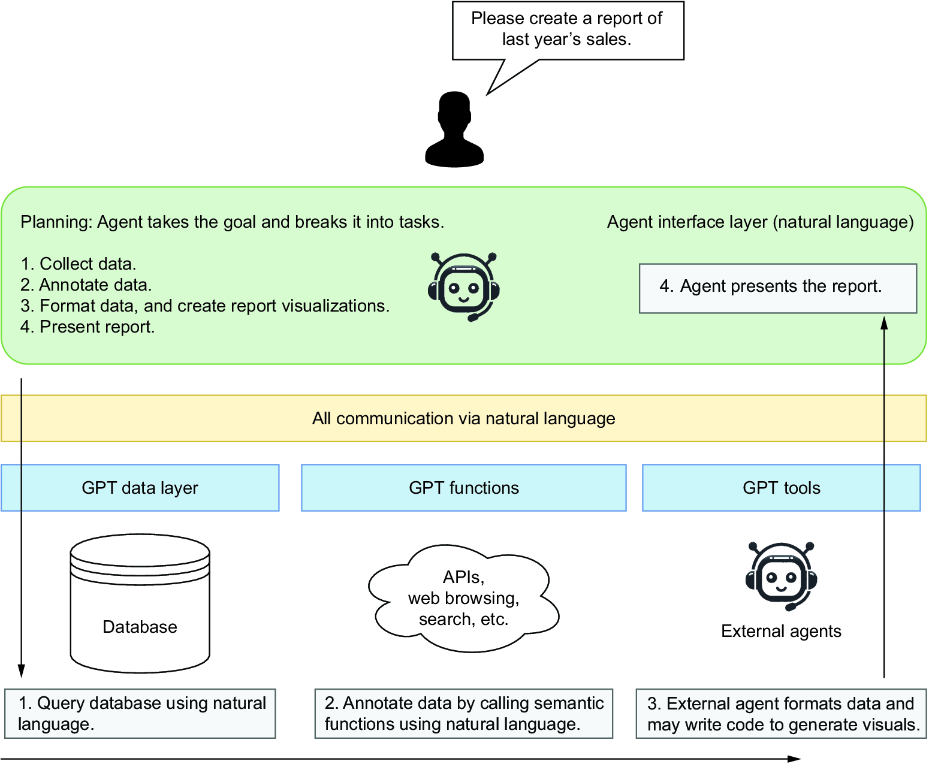
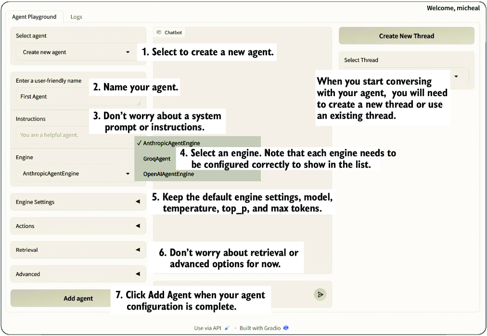
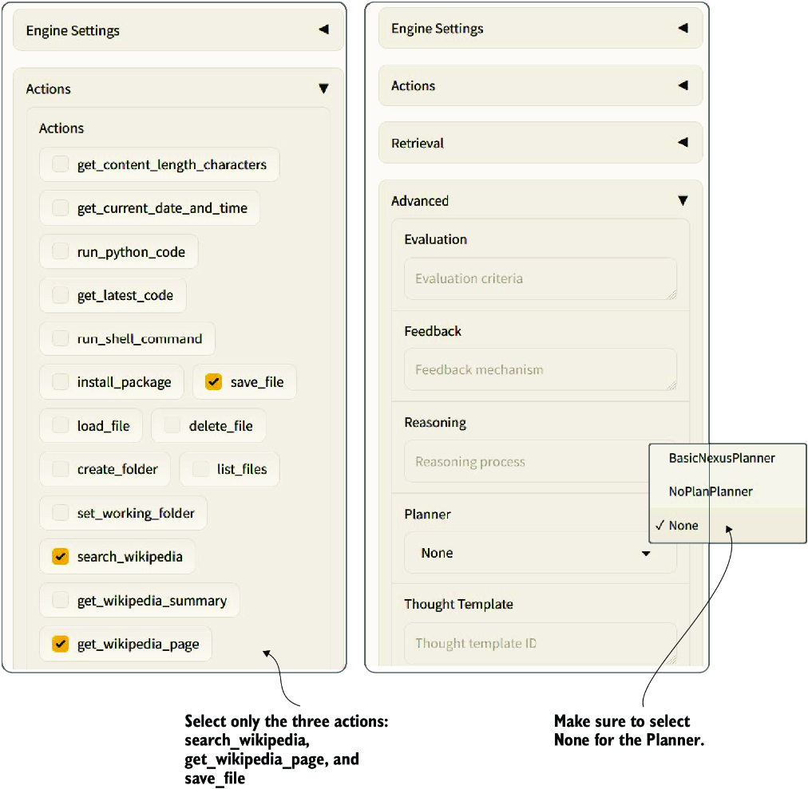
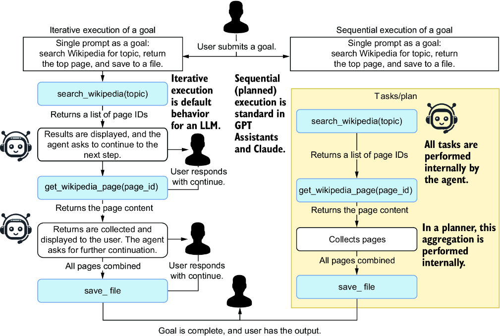
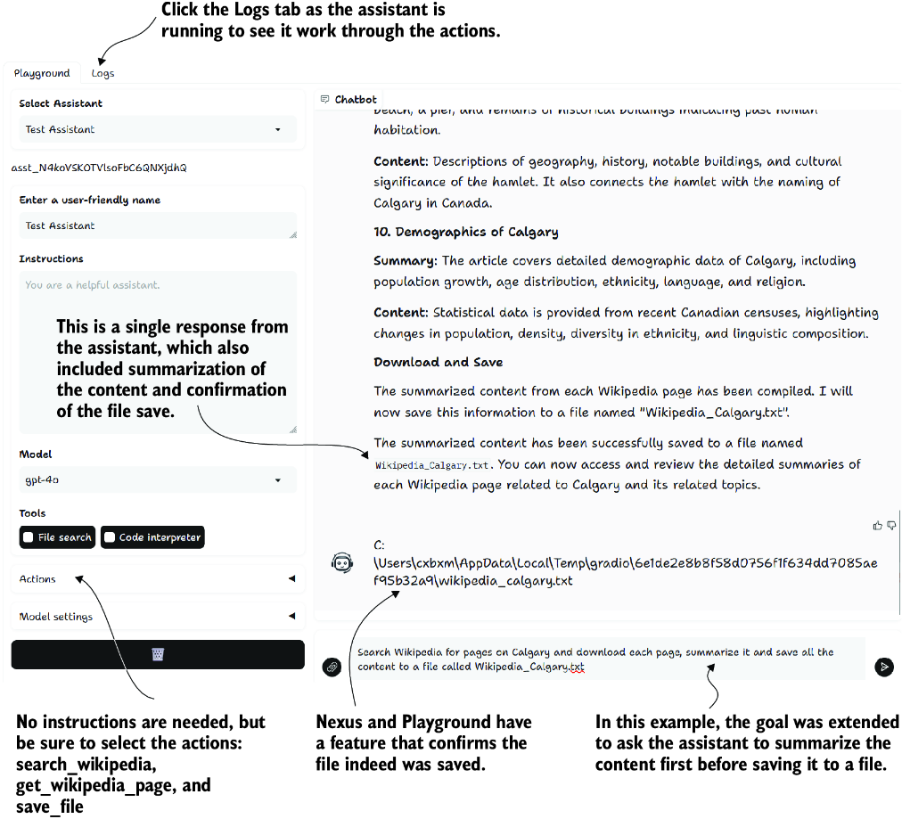
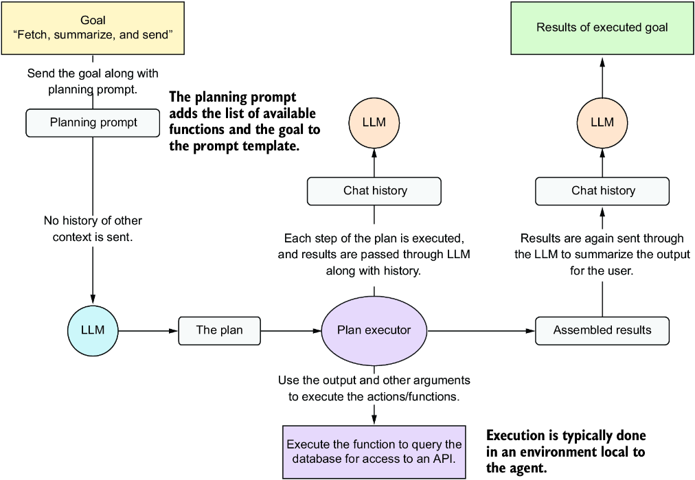
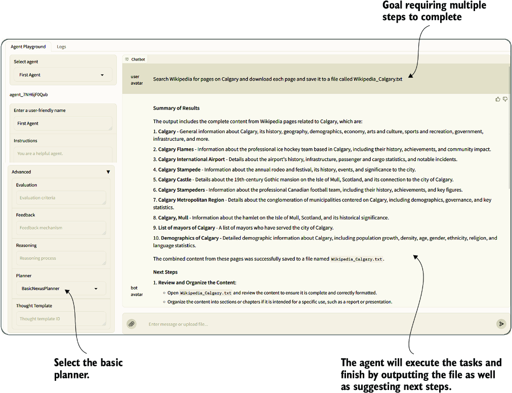
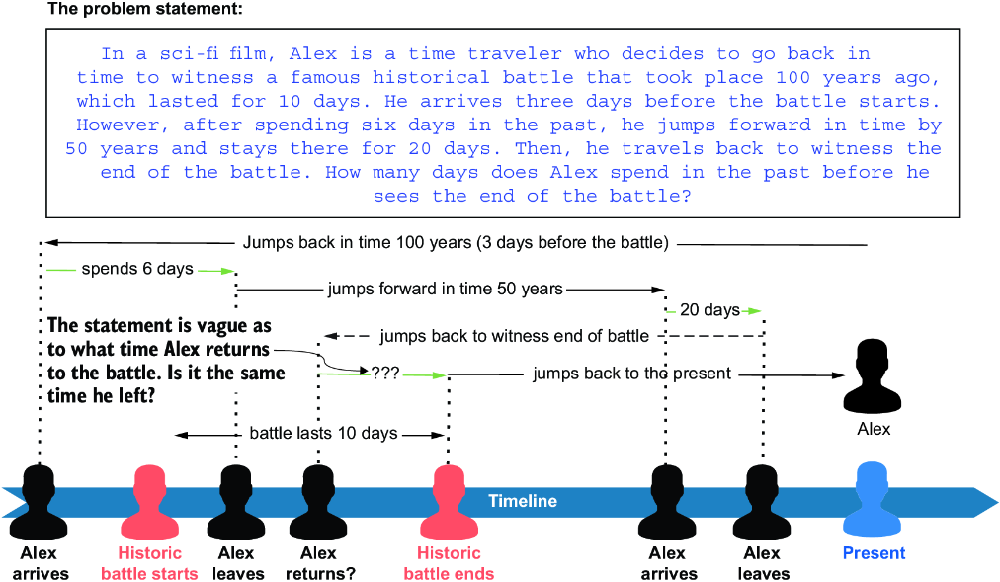

# 11 Agent planning and feedback

### This chapter covers

- Planning for an LLM and implementing it in agents and assistants
- Using the OpenAI Assistants platform via custom actions
- Implementing/testing a generic planner on LLMs
- Using the feedback mechanism in advanced models
- Planning, reasoning, evaluation, and feedback in building agentic systems

Now that we’ve examined how large language models (LLMs) can reason and plan, this chapter takes this concept a step further by employing planning within an agent framework. Planning should be at the core of any agent/assistant platform or toolkit. We’ll start by looking at the basics of planning and how to implement a planner through prompting. Then, we’ll see how planning operates using the OpenAI Assistants platform, which automatically incorporates planning. From there, we’ll build and implement a general planner for LLMs.

Planning can only go so far, and an often-unrecognized element is feedback. Therefore, in the last sections of the chapter, we explore feedback and implement it within a planner. You must be familiar with the content of chapter 10, so please review it if you need to, and when you’re ready, let’s begin planning.

## 11.1 Planning: The essential tool for all agents/assistants

Agents and assistants who can’t plan and only follow simple interactions are nothing more than chatbots. As we’ve seen throughout this book, our goal isn’t to build bots but rather to build autonomous thinking agents—agents that can take a goal, work out how to solve it, and then return with the results.

Figure 11.1 explains the overall planning process that the agent/assistant will undertake. This figure was also presented in chapter 1, but let’s review it now in more detail. At the top of the figure, a user submits a goal. In an agentic system, the agent takes the goal, constructs the plan, executes it, and then returns the results.



##### Figure 11.1 The agent planning process

Depending on your interaction with platforms such as ChatGPT and GPTs, Claude, and others, you may have already encountered a planning assistant and not even noticed. Planning is becoming ubiquitous and is now built into most commercial platforms to make the model appear more intelligent and capable. Therefore, in the next exercise, we’ll look at an example to set a baseline and differentiate between an LLM that can’t plan and an agent that can.

For the next exercise, we’ll use Nexus to demonstrate how raw LLMs can’t plan independently. If you need assistance installing, setting up, and running Nexus, refer to chapter 7. After you have Nexus installed and ready, we can begin running it with the Gradio interface, using the commands shown next.

##### Listing 11.1 Running Nexus with the Gradio interface

```
nexus run gradio
```

Gradio is an excellent web interface tool built to demonstrate Python machine learning projects. Figure 11.2 shows the Gradio Nexus interface and the process for creating an agent and using an agent engine (OpenAI, Azure, and Groq) of your choice. You can’t use LM Studio unless the model/server supports tool/action use. Anthropic’s Claude supports internal planning, so for the purposes of this exercise, avoid using this model.



##### Figure 11.2 Creating a new agent in Nexus

After creating the agent, we want to give it specific actions (tools) to undertake or complete a goal. Generally, providing only the actions an agent needs to complete its goal is best for a few reasons:

- More actions can confuse an agent into deciding which to use or even how to solve a goal.
- APIs have limits on the number of tools that can be submitted; at the time of writing, hitting this limit is relatively easy.
- Agents may use your actions in ways you didn’t intend unless that’s your goal. Be warned, however, that actions can have consequences.
- Safety and security need to be considered. LLMs aren’t going to take over the world, but they make mistakes and quickly get off track. Remember, these agents will operate independently and may perform any action.

WARNING  While writing this book and working with and building agents over many hours, I have encountered several instances of agents going rogue with actions, from downloading files to writing and executing code when not intended, continually iterating from tool to tool, and even deleting files they shouldn’t have. Watching an agent emerge new behaviors using actions can be fun, but things can quickly go astray.

For this exercise, we’ll define the goal described in the following listing.

##### Listing 11.2 Demonstrating planning: The goal

```
Search Wikipedia for pages on {topic} and download each page and save it 
to a file called Wikipedia_{topic}.txt
```

This goal will demonstrate the following actions:

- `search_wikipedia(topic)`—Searches Wikipedia and returns page IDs for the given search term.
- `get_wikipedia_page(page_id)`—Downloads the page content given the page ID.
- `save_file`—Saves the content to a file.

Set the actions on the agent, as shown in figure 11.3. You’ll also want to make sure the Planner is set to None. We’ll look at setting up and using planners soon. You don’t have to click Save; the interface automatically saves an agent’s changes.



##### Figure 11.3 Selecting the actions for the agent and disabling the planner

After you choose the actions and planner, enter the goal in listing 11.2. Then click Create New Thread to instantiate a new conversation. Substitute the topic you want to search for in the chat input, and wait for the agent to respond. Here’s an example of the goal filled with the topic, but again, use any topic you like:

```
Search Wikipedia for pages on Calgary and download each page and save it to 
a file called Wikipedia_Calgary.txt.
```

Figure 11.4 shows the results of submitting the goal to the plain agent. We see the agent executed the tool/action to search for the topic but couldn’t execute any steps beyond that. If you recall from our discussion and code example of actions in chapter 5, OpenAI, Groq, and Azure OpenAI all support parallel actions but not sequential or planned actions.


##### Figure 11.4 The results from trying to get the agent/LLM to complete the goal

The LLM can answer reasonably well if you submit a goal with several parallel tasks/actions. However, if the actions are sequential, requiring one step to be dependent on another, it will fail. Remember, parallel actions are standalone actions that can be run alongside others.

Anthropic’s Claude and OpenAI Assistants support sequential action planning. This means both models can be called with sequential plans, and the model will execute them and return the results. In the next section, we’ll explore sequential planning and then demonstrate it in action.

## 11.2 Understanding the sequential planning process

In the next exercise, we’ll ask an OpenAI assistant to solve the same goal. If you have Anthropic/Claude credentials and have the engine configured, you can also try this exercise with that model.

Figure 11.5 shows the difference between executing tasks sequentially (planning) and using iteration. If you’ve used GPTs, assistants, or Claude Sonnet 3.5, you’ve likely already experienced this difference. These advanced tools already incorporate planning by prompt annotations, advanced training, or combining both.



##### Figure 11.5 The difference between iterative and planned execution

As LLM and chat services evolve, most models will likely natively support some form of planning and tool use. However, most models, including GPT-4o, only support action/tool use today.

Let’s open the GPT Assistants Playground to demonstrate sequential planning in action. If you need help, refer to the setup guide in chapter 6. We’ll use the same goal but, this time, run it against an assistant (which has built-in planning).

After you launch the Playground, create a new assistant, and assign it the `search_ wikipedia,` `get_wikipedia_page`, and `save_file` actions. Figure 11.6 shows the results of entering the goal to the assistant. As you can see, the assistant completed all the tasks behind the scenes and responded with the user’s final requested output, achieving the goal.



##### Figure 11.6 The assistant processing the goal and outputting the results

To demonstrate the effectiveness of the OpenAI Assistant’s planner, we added another task, summarizing each page, to the goal. The inserted task didn’t have a function/tool, but the assistant was savvy enough to use its ability to summarize the content. You can see the output of what the assistant produced by opening the `[root` `folder]assistants_working_folder/Wikipedia_{topic}.txt` file and reviewing the contents. Now that we understand how LLMs function without planners and planning, we can move on to creating our planners in the next section.

## 11.3 Building a sequential planner

LLM tools such as LangChain and Semantic Kernel (SK) have many planners using various strategies. However, writing our planner is relatively easy, and Nexus also supports a plugin-style interface allowing you to add other planners from tools such as LangChain and SK, or your derivatives.

Planners may sound complicated, but they are easily implemented through prompt engineering strategies that incorporate planning and reasoning. In chapter 10, we covered the basics of reasoning and deriving plans, and now we can put those skills to good use.

Listing 11.3 shows a sequential planner derived from the SK, which is extended to incorporate iteration. Prompt annotation planners like those shown in the listing can be adapted to fit specific needs or be more general like those shown. This planner uses JSON, but planners could use any format an LLM understands, including code.

##### Listing 11.3 `basic_nexus_planner.py`

```
You are a planner for Nexus.     #1
Your job is to create a properly formatted JSON plan step by step, to 
satisfy the goal given.
Create a list of subtasks based off the [GOAL] provided.
Each subtask must be from within the [AVAILABLE FUNCTIONS] list. Do not 
use any functions that are not in the list.
Base your decisions on which functions to use from the description and the 
name of the function.
Sometimes, a function may take arguments. Provide them if necessary.
The plan should be as short as possible.
You will also be given a list of corrective, suggestive and epistemic 
feedback from previous plans to help you make your decision.
For example:

[SPECIAL FUNCTIONS]     #2
for-each- prefix
description: execute a function for each item in a list
args: 
- function: the function to execute
- list: the list of items to iterate over
- index: the arg name for the current item in the list

[AVAILABLE FUNCTIONS]
GetJokeTopics
description: Get a list ([str]) of joke topics

EmailTo
description: email the input text to a recipient
args:
- text: the text to email
- recipient: the recipient's email address. Multiple addresses may be 
included if separated by ';'.

Summarize
description: summarize input text
args:
- text: the text to summarize

Joke
description: Generate a funny joke
args:
- topic: the topic to generate a joke about

[GOAL]
"Get a list of joke topics and generate a different joke for each topic. 
Email the jokes to a friend."

[OUTPUT]
    {        
        "subtasks": [
            {"function": "GetJokeTopics"},
            {"function": "for-each",
             "args": {
                       "list": "output_GetJokeTopics",
                       "index": "topic", 
                       "function": 
                                  {
                                   "function": "Joke",
                                   "args": {"topic": "topic"}}}},
            {
             "function": "EmailTo",
              "args": {
                        "text": "for-each_output_GetJokeTopics"
                       ecipient": "friend"}}
        ]
    }
# 2 more examples are given but omitted from this listing

[SPECIAL FUNCTIONS]     #3
for-each
description: execute a function for each item in a list
args: 
- function: the function to execute
- iterator: the list of items to iterate over
- index: the arg name for the current item in the list  

[AVAILABLE FUNCTIONS]     #4
{{$available_functions}}

[GOAL]
{{$goal}}     #5

Be sure to only use functions from the list of available functions. 
The plan should be as short as possible. 
And only return the plan in JSON format.
[OUTPUT]     #6
```

#1 The preamble instructions telling the agent how to process the examples  
#2 Beginning of the three (few-shot) examples  
#3 Adds the for-each special iterative function  
#4 Available functions are autopopulated from the agent’s list of available functions.  
#5 The goal is inserted here.  
#6 Where the agent is expected to place the output

Figure 11.7 shows the process of building and running a planning prompt, from building to execution to finally returning the results to the user. Planners work by building a planning prompt, submitting it to an LLM to construct the plan, parsing and executing the plan locally, returning the results to an LLM to evaluate and summarize, and finally returning the final output back to the user.



##### Figure 11.7 The planning process for creating and executing a plan

It’s essential to notice a few subtle details about the planning process. Typically, the plan is built in isolation by not adding context history. This is done to focus on the goal because most planning prompts consume many tokens. Executing the functions within the executor is usually done in a local environment and may include calling APIs, executing code, or even running machine learning models.

Listing 11.4 shows the code for the `create_plan` function from the `BasicNexusPlanner` class; tools such as LangChain and SK use similar patterns. The process loads the agent’s actions as a string. The goal and available functions list are then inserted into the planner prompt template using the `PromptTemplateManager`, which is just a wrapper for the template-handling code. Template handling is done with simple regex but can also be more sophisticated using tools such as Jinja2, Handlebars, or Mustache.

##### Listing 11.4 `basic_nexus_planner.py` (`create_plan`)

```
def create_plan(self, nexus, agent, goal: str, prompt: str = PROMPT) -> Plan:
        selected_actions = nexus.get_actions(agent.actions)
        available_functions_string = "\n\n".join(
            format_action(action) for action in selected_actions
        )     #1

        context = {}     #2
        context["goal"] = goal
        context["available_functions"] = available_functions_string

        ptm = PromptTemplateManager()     #3
        prompt = ptm.render_prompt(prompt, context)

        plan_text = nexus.execute_prompt(agent, prompt)     #4
        return Plan(prompt=prompt, 
                    goal=goal, 
                    plan_text=plan_text)     #5
```

#1 Loads the agent’s available actions and formats the result string for the planner  
#2 The context will be injected into the planner prompt template.  
#3 A simple template manager, similar in concept to Jinja2, Handlebars, or Mustache  
#4 Sends the filled-in planner prompt to the LLM  
#5 The results (the plan) are wrapped in a Plan class and returned for execution.

The code to execute the plan, shown in listing 11.5, parses the JSON string and executes the functions. When executing the plan, the code detects the particular `for-each` function, which iterates through a list and executes each element in a function. The results of each function execution are added to the context. This context is passed to each function call and returned as the final output.

##### Listing 11.5 `basic_nexus_planner.py` (`execute_plan`)

```
def execute_plan(self, nexus, agent, plan: Plan) -> str:
        context = {}
        plan = plan.generated_plan
        for task in plan["subtasks"]:     #1
            if task["function"] == "for-each":     #2
                list_name = task["args"]["list"]
                index_name = task["args"]["index"]
                inner_task = task["args"]["function"]

                list_value = context.get(list_name, [])
                for item in list_value:
                    context[index_name] = item
                    result = nexus.execute_task(agent, inner_task, context)
                    context[f"for-each_{list_name}_{item}"] = result

                for_each_output = [     #2
                    context[f"for-each_{list_name}_{item}"] ↪
                      for item in list_value
                ]
                context[f"for-each_{list_name}"] = for_each_output

                for item in list_value:     #3
                    del context[f"for-each_{list_name}_{item}"]

            else:
                result = nexus.execute_task(agent,
                                            task,
                                            context)     #4
                context[f"output_{task['function']}"] = result

        return context     #5
```

#1 Iterates through each subtask in the plan  
#2 Handles functions that should be iterated over and adds full list of results to the context  
#3 Removes individual for-each context entries  
#4 General task execution  
#5 Returns the full context, which includes the results of each function call

The returned context from the entire execution is sent in a final call to the LLM, which summarizes the results and returns a response. If everything goes as planned, the LLM will respond with a summary of the results. If there is an error or something is missing, the LLM may try to fix the problem or inform the user of the error.

Let’s now open Nexus again and test a planner in operation. Load up the same agent you used last time, but select the planner under the Advanced options this time, as shown in figure 11.8. Then, enter the goal prompt as you did before, and let the agent take it away.



##### Figure 11.8 The results from requesting to complete the goal in Nexus using the basic planner

After a few minutes, the agent returns with the saved file, and in some cases, it may provide extra information, such as the next steps and what to do with the output. This is because the agent was given a high-level overview of what it accomplished. Remember, though, that plan execution is done at the local level, and only context, plan, and goal were sent to the LLM.

This means that plan execution can be completed by any process, not necessarily by the agent. Executing a plan outside the LLM reduces the tokens and tool use the agent needs to perform. This also means that an LLM doesn’t need to support tools usage to use a planner.

Internally, when a planner is enabled within Nexus, the agent engine tool is bypassed. Instead, the planner completes the action execution, and the agent is only aware of the actions through the passing of the output context. This can be good for models that support tool use but can’t plan. However, a planner may limit functionality for models that support both tool use and planning, such as Claude.

In general, you’ll want to understand the capabilities of the LLM you’re using. If you’re unsure of those details, then a little trial and error can also work. Ask the agent to complete a multistep goal with and without planning enabled, and then see the results.

Planning allows agents to complete multiple sequential tasks to achieve more complex goals. The problem with external or prompt planning is that it bypasses the feedback iteration loop, which can help correct problems quickly. Because of this, OpenAI and others are now directly integrating reasoning and planning at the LLM level, as we’ll see in the next section.

## 11.4 Reviewing a stepwise planner: OpenAI Strawberry

The release of the o1-preview model, code named Strawberry, introduced a dramatic shift in the type of LLMs becoming available for agentic systems. Strawberry was not only proclaimed to be more efficient at math, science, and general calculation tasks but also able to engage in reasoning, planning, evaluation, and feedback directly in the LLM.

Consider our time travel problem from chapter 10 and shown again in figure 11.9. If you recall, this problem was difficult to solve using GPT-4 and other similar LLMs. However, with the application of reasoning and feedback, we were able to produce output that was occasionally correct.



##### Figure 11.9 The time travel problem, revisited

As an experiment, enter this problem into ChatGPT using the o1-preview model, as shown in listing 11.6. Sit back for a few seconds and wait for the answer. Yep, the model still gets it wrong.

##### Listing 11.6 Time travel reasoning/planning problem

```
In a sci-fi film, Alex is a time traveler who decides to go back in time 
to witness a famous historical battle that took place 100 years ago, 
which lasted for 10 days. He arrives three days before the battle starts. 
However, after spending six days in the past, he jumps forward in time 
by 50 years and stays there for 20 days. Then, he travels back to 
witness the end of the battle. How many days does Alex spend in the past 
before he sees the end of the battle?
```

While it may be somewhat disappointing to see the model get the wrong answer, it does, however, do a far better job of breaking down the problem and demonstrating its answer. Listing 11.7 shows the sample output from posing the problem in listing 11.6 to the Strawberry model. Note, you may get a different answer because of the stochastic nature of the LLM.

##### Listing 11.7 o1-preview response to time travel problem

```
To determine how many days Alex spends in the past before witnessing the 
end of the battle, let's reconstruct the timeline step by step:
Arrival in the Past:
Alex arrives 3 days before the battle begins.
He spends these 3 days waiting for the battle to start.
During the Battle:
The battle starts, and Alex experiences the first 3 days of it.
At this point, he has spent a total of 6 days in the past (3 days before 
the battle and 3 days during the battle).
Time Jump Forward:     #1
After these 6 days, Alex jumps 50 years forward in time.
He spends 20 days in this future time.
Return to the Past:
Alex then returns to the past to witness the end of the battle.
Since the battle lasts 10 days and he left after day 3 of the battle, 
there are 7 days remaining in the battle.
However, because he was away for 20 days, which is longer than the 
remaining 7 days of the battle, he must return to a point in time before 
the battle ends to witness its conclusion.
To see the end of the battle, he returns to the past on the last day of 
the battle.
Final Days Spent Before the Battle Ends:
Upon returning, he spends 1 more day in the past to witness the battle's 
end.
Total Days Spent in the Past Before Seeing the End:
6 days before jumping forward in time.
1 day after returning to the past.
Total: 6 + 1 = 7 days.
Answer: 7
```

#1 It becomes obvious where the model is making the error.

Because we know the right answer is 27, we know the LLM is wrong, but if we didn’t, we could just as easily assume that the work and reasoning were all correct. Problems like this can happen when we remove feedback in LLM interactions and agentic systems. Feedback can guide the model to correct itself.

However, what if we didn’t know the correct answer was 27 (26, if you assume he doesn’t spend the day to witness the battle) and assumed the LLM or agent was correct? Well, this is a problem we can rectify with a couple of simple prompts that can engage the LLM in reasoning and planning feedback. However, these techniques are more effective with LLMs or wrappers such as the OpenAI Assistants, which provide reasoning and planning within the model.

What we want to do is provide feedback to the LLM, but understanding what that feedback is will likely be difficult for us. Fortunately, we can elicit feedback directly from the LLM, provided we give the correct answer. Listing 11.8 shows how to generate constructive feedback from the LLM concerning our time travel problem.

##### Listing 11.8 Generating feedback

```
the correct answer is 27, please review what you did wrong and suggest 
feedback you could give yourself when trying to solve similar future problems
```

Entering this after the model answers the question wrong will generate feedback that you can use to guide the model through prompting or as part of system instructions. Listing 11.9 shows an example of the feedback provided by o1-preview. You can then extract this feedback and augment the instructions the next time you want to tackle complex time travel problems.

##### Listing 11.9 Generated feedback

```
Feedback for Future Problems
Understanding Time Frames in Time Travel:
Relative Time Frames: Always consider the time periods relative to the 
original point of reference. In this problem, even though Alex jumps 
forward 50 years, he is still in the past relative to his original 
present time.
Including All Relevant Periods: 
Ensure that all time periods spent in the past (or future) are included 
in the total calculation, even if they involve moving to different 
points in time.
Time Continuity: 
Remember that while the traveler moves through time, events in other 
time periods continue to progress unless specified otherwise.
Application:
Careful Reading: 
Pay close attention to the details provided, such as the durations and 
the sequences of time jumps.
Visualization: 
It may help to draw a timeline to visualize the sequence of events and 
time periods involved.
Double-Checking Calculations: 
After solving, revisit each step to ensure all time periods are 
accounted for correctly.
```

This feedback technique will consistently work on models such as o1-preview, but other models may still struggle to answer correctly, even given this feedback. Over time, as models become smarter, this technique will likely generally work on most models. However, this feedback mechanism will likely be essential even as models get progressively brighter. because language is nuanced, and not every problem we challenge LLMs with may have an obvious absolute answer. Take our example problem, for instance. This problem is an excellent example of requiring the problem solver to make assumptions and draw correlations from the question. There are still plenty of areas in science, from geology to behavioral science, where answering the same problem may yield a range of answers. Let’s look next at a few techniques for how the application of reasoning, planning, evaluation, and feedback can be applied to agentic systems.

## 11.5 Applying planning, reasoning, evaluation, and feedback to assistant and agentic systems

In recent chapters, we’ve examined how the agentic components of planning, reasoning, feedback, and evaluation can be implemented. Now we look at how, when, and where those components can be integrated into assistant and agentic systems for real-time production, research, or development.

While not all of these components may fit the same into every application, it’s useful to understand where and when to apply which component. In the next section, we look at how planning can be integrated into assistant/agentic systems.

### 11.5.1 Application of assistant/agentic planning

Planning is the component where an assistant or agent can plan to undertake a set of tasks, whether they are in series, parallel, or some other combination. We typically associate planning with tool use, and, rightfully, any system using tools will likely want a capable planner. However, not all systems are created equally, so in table 11.1, we’ll review where, when, and how to implement planners.

##### Table 11.1 When and where planning is employed and used in various applications

Application

Implemented

Environment

Purpose

Timing

Configuration

Personal assistant  
At or within the LLM  
Personal device  
Facilitate tool use  
During the response  
As part of the prompt or LLM  
Customer service bot  
Not typical; restricted environment  
Restricted environment, no tool use  
Autonomous agent  
As part of the agent prompt and within the LLM  
Server or service  
Facilitate complex tool use and task planning  
As part of constructing the agent and/or during the response  
Within the agent or LLM  
Collaborative workflows  
As part of the LLM  
Shared canvas or coding  
Facilitate complex tool use  
During the response  
Within the LLM  
Game AI  
As part of the LLM  
Server or application  
Complex tool use and planning  
Before or during the response  
Within the LLM  
Research  
Anywhere  
Server  
Facilitate tool use and engage in complex task workflows  
Before, during, and after response generation  
Anywhere

Table 11.1 shows several varied application scenarios in which we may find an assistant or agent deployed to assist in some capacity. To provide further information and guidance, this list provides more details about how planning may be employed in each application:

- *Personal assistant*—While this application has been slow to roll out, LLM personal assistants promise to surpass Alexa and Siri in the future. Planning will be essential to these new assistants/agents to coordinate numerous complex tasks and execute tools (actions) in series or parallel.
- *Customer service bot*—Due to the controlled nature of this environment, it’s unlikely that assistants engaged directly with customers will have controlled and very specific tools use. This means that these types of assistants will likely not require extensive planning.
- *Autonomous agent*—As we’ve seen in previous chapters, agents with the ability to plan can complete a series of complex tasks for various goals. Planning will be an essential element of any autonomous agentic system.
- *Collaborative workflows*—Think of these as agents or assistants that sit alongside coders or writers. While these workflows are still in early development, think of a workflow where agents are automatically tasked with writing and executing test code alongside developers. Planning will be an essential part of executing these complex future workflows.
- *Game AI*—While applying LLMs to games is still in early stages, it isn’t hard to imagine in-game agents or assistants that can assist or challenge the player. Giving these agents the ability to plan and execute complex workflows could disrupt how and with whom we play games.
- *Research*—Similar to collaborative workflows, these agents will be responsible for deriving new ideas from existing sources of information. Finding that information will likely be facilitated through extensive tool use, which will benefit from coordination of planning.

As you can see, planning is an essential part of many LLM applications, whether through coordination of tool use or otherwise. In the next section, we look at the next component of reasoning and how it can be applied to the same application stack.

### 11.5.2 Application of assistant/agentic reasoning

Reasoning, while often strongly associated with planning and task completion, is a component that can also stand by itself. As LLMs mature and get smarter, reasoning is often included within the LLM itself. However, not all applications may benefit from extensive reasoning, as it often introduces a thinking cycle within the LLM response. Table 11.2 describes at a high level how the reasoning component can be integrated with various LLM application types.

##### Table 11.2 When and where reasoning is employed and used in various applications

Application

Implemented

Environment

Purpose

Timing

Configuration

Personal assistant  
Within the LLM  
Personal device  
Breaking down work into steps  
During the response  
As part of the prompt or LLM  
Customer service bot  
Not typical; usually just informational  
Limited tool use and need for composite tool use  
Autonomous agent  
As part of the agent prompt and within the LLM  
Server or service  
Facilitate complex tool use and task planning  
As part of LLM, external reasoning not well suited  
Within the agent or LLM  
Collaborative workflows  
As part of the LLM  
Shared canvas or coding  
Assists in breaking work down  
During the response  
Within the LLM  
Game AI  
As part of the LLM  
Server or application  
Essential for undertaking complex actions  
Before or during the response  
Within the LLM  
Research  
Anywhere  
Server  
Understand how to solve complex problems and engage in complex task workflows  
Before, during, and after response generation  
Anywhere

Table 11.2 shows several varied application scenarios in which we may find an assistant or agent deployed to assist in some capacity. To provide further information and guidance, this list provides more details about how reasoning may be employed in each application:

- *Personal assistant*—Depending on the application, the amount of reasoning an agent employs may be limited. Reasoning is a process that requires the LLM to think through a problem, and this often requires longer response times depending on the complexity of the problem and the extent of the prompt. In many situations, responses intended to be closer to real-time reasoning may be disabled or turned down. While this may limit the complexity at which an agent can interact, limited or no reasoning can improve response times and increase user enjoyment.
- *Customer service bot*—Again, because of the controlled nature of this environment, it’s unlikely that assistants engaged directly with customers will need to perform complex or any form of reasoning.
- *Autonomous agent*—While reasoning is a strong component of autonomous agents, we still don’t know how much reasoning is too much. As models such as Strawberry become available for agentic workflows, we can gauge at what point extensive reasoning may not be needed. This will surely be the case for well-defined autonomous agent workflows.
- *Collaborative workflows*—Again, applying reasoning creates an overhead in the LLM interaction. Extensive reasoning may provide benefits for some workflows, while other well-defined workflows may suffer. This may mean that these types of workflows will benefit from multiple agents—those with reasoning and those without.
- *Game AI*—Similar to other applications, heavy-reasoning applications may not be appropriate for most game AIs. Games will especially require LLM response times to be quick, and this will surely be the application of reasoning for general tactical agents. Of course, that doesn’t preclude the use of other reasoning agents that may provide more strategic control.
- *Research*—Reasoning will likely be essential to any complex research task for several reasons. A good example is the application of the Strawberry model, which we’ve already seen in research done in mathematics and the sciences.

While we often consider reasoning in tandem with planning, there may be conditions where the level at which each is implemented may differ. In the next section we consider the agent pillar of evaluation of various applications.

### 11.5.3 Application of evaluation to agentic systems

Evaluation is the component of agentic/assistant systems that can guide how well the system performs. While we demonstrated incorporating evaluation in some agentic workflows, evaluation is often an external component in agentic systems. However, it’s also a core component of most LLM applications and not something that should be overlooked in most developments. Table 11.3 describes at a high level how the evaluation component can be integrated with various LLM application types.

##### Table 11.3 When and where evaluation is employed and used in various applications

Application

Implemented

Environment

Purpose

Timing

Configuration

Personal assistant  
External  
Server  
Determine how well the system is working  
After the interaction  
Often developed externally  
Customer service bot  
External monitor  
Server  
Evaluate the success of each interaction  
After the interaction  
External to the agent system  
Autonomous agent  
External or internal  
Server or service  
Determine the success of the system after or during task completion  
After the interaction  
External or internal  
Collaborative workflows  
External  
Shared canvas or coding  
Evaluate the success of the collaboration  
After the interaction  
External service  
Game AI  
External or internal  
Server or application  
Evaluate the agent or evaluate the success of a strategy or action  
After the interaction  
External or as part of the agent or another agent  
Research  
Combined manual and LLM  
Server and human  
Evaluate the output of the research developed  
After the generated output  
Depends on the complexity of the problem and research undertaken

Table 11.3 shows several varied application scenarios in which we may find an assistant or agent deployed to assist in some capacity. To provide further information and guidance, this list provides more details about how evaluation may be employed in each application:

- *Personal assistant*—In most cases, an evaluation component will be used to process and guide the performance of agent responses. In systems primarily employing retrieval augmented generation (RAG) for document exploration, the evaluation indicates how well the assistant responds to information requests.
- *Customer service bot*—Evaluating service bots is critical to understanding how well the bot responds to customer requests. In many cases, a strong RAG knowledge element may be an element of the system that will require extensive and ongoing evaluation. Again, with most evaluation components, this element is external to the main working system and is often run as part of monitoring general performance over several metrics.
- *Autonomous agent*—In most cases, a manual review of agent output will be a primary guide to the success of an autonomous agent. However, in some cases, internal evaluation can help guide the agent when it’s undertaking complex tasks or as a means of improving the final output. Multiple agent systems, such as CrewAI and AutoGen, are examples of autonomous agents that use internal feedback to improve the generated output.
- *Collaborative workflows*—In most direct cases, manual evaluation is ongoing within these types of workflows. A user will often immediately and in near real time correct the assistant/agent by evaluating the output. Additional agents could be added similarly to autonomous agents for more extensive collaborative workflows.
- *Game AI*—Evaluation will often be broken down into development evaluation—evaluating how the agent interacts with the game—and in-game evaluation, evaluating how well an agent succeeded at a task. Implementing the later evaluation form is similar to autonomous agents but aims to improve some strategies or execution. Such in-game evaluations would also likely benefit from memory and a means of feedback.
- *Research*—Evaluation at this level generally occurs as a manual effort after completing the research task. An agent could employ some form of evaluation similar to autonomous agents to improve the generated output, perhaps even contemplating internally how evaluation of the output could be extended or further researched. Because this is currently a new area for agentic development, how well this will be executed remains to be seen.

Evaluation is an essential element to any agentic or assistant system, especially if that system provides real and fundamental information to users. Developing evaluation systems for agents and assistants is likely something that could or should have its own book. In the final section of this chapter, we’ll look at feedback implementation for various LLM applications.

### 11.5.4 Application of feedback to agentic/assistant applications

Feedback as a component of agentic systems is often, if not always, implemented as an external component—at least for now. Perhaps confidence in evaluation systems may improve to the point where feedback is regularly incorporated into such systems. Table 11.4 showcases how feedback can be implemented into various LLM applications.

##### Table 11.4 When and where feedback is employed and used in various applications

Application

Implemented

Environment

Purpose

Timing

Configuration

Personal assistant  
External or by the user  
Aggregated to the server or as part of the system  
Provides means of system improvement  
After or during the interaction  
Internal and external  
Customer service bot  
External monitor  
Aggregated to the server  
Qualifies and provides a means for system improvement  
After the interaction  
External to the agent system  
Autonomous agent  
External  
Aggregated at the server  
Provides a means for system improvement  
After the interaction  
External  
Collaborative workflows  
While interacting  
Shared canvas or coding  
Provides a mechanism for immediate feedback  
During the interaction  
External service  
Game AI  
External or internal  
Server or application  
As part of internal evaluation feedback provided for dynamic improvement  
After or during the interaction  
External or as part of the agent or another agent  
Research  
Combined manual and LLM  
Server and human  
Evaluate the output of the research developed  
After the generated output  
Depends on the complexity of the problem and the research undertaken

Table 11.4 shows several application scenarios in which we may find an assistant or agent deployed to assist in some capacity. To provide further information and guidance, this list provides more details about how feedback may be employed in each application:

- *Personal assistant*—If the assistant or agent interacts with the user in a chat-style interface, direct and immediate feedback can be applied by the user. Whether this feedback is sustained over future conversations or interactions, it usually develops within agentic memory. Assistants such as ChatGPT now incorporate memory and can benefit from explicit user feedback.
- *Customer service bot*—User or system feedback is typically provided through a survey after the interaction has completed. This usually means that feedback is regulated to an external system that aggregates the feedback for later improvements.
- *Autonomous agent*—Much like bots, feedback within autonomous agents is typically regulated to after the agent has completed a task that a user then reviews. The feedback mechanism may be harder to capture because many things can be subjective. Methods explored in this chapter for producing feedback can be used within prompt engineering improvements.
- *Collaborative workflows*—Similar to the personal assistant, these types of applications can benefit from immediate and direct feedback from the user. Again, how this information is persisted across sessions is often an implementation of agentic memory.
- *Game AI*—Feedback can be implemented alongside evaluation through additional and multiple agents. This feedback form may again be single-use and exist within the current interaction or may persist as memory. Imagine a game AI that can evaluate its actions, improve those with feedback, and remember those improvements. While this pattern isn’t ideal for games, it will certainly improve the gameplay experience.
- *Research*—Similar to evaluation in the context of research, feedback is typically performed offline after the output is evaluated. While some development has been done using multiple agent systems incorporating agents for evaluation and feedback, these systems don’t always perform well, at least not with the current state-of-the-art models. Instead, it’s often better to isolate feedback and evaluation at the end to avoid the common feedback looping problem.

Feedback is another powerful component of agentic and assistant systems, but it’s not always required on the first release. However, incorporating rigorous feedback and evaluation mechanisms can greatly benefit agentic systems in the long term concerning ongoing monitoring and providing the confidence to improve various aspects of the system.

How you implement each of these components in your agentic systems may, in part, be guided by the architecture of your chosen agentic platform. Now that you understand the nuances of each component, you also have the knowledge to guide you in selecting the right agent system that fits your application and business use case. Regardless of your application, you’ll want to employ several agentic components in almost all cases.

As agentic systems mature and LLMs themselves get smarter, some of the components we today consider external may be closely integrated. We’ve already seen reasoning and planning be integrated into a model such as Strawberry. Certainly, as we approach the theoretical artificial general intelligence milestone, we may see models capable of performing long-term self-evaluation and feedback.

In any case, I hope you enjoyed this journey with me into this incredible frontier of a new and emerging technology that will certainly alter our perception of work and how we undertake it through agents.

## 11.6 Exercises

Use the following exercises to improve your knowledge of the material:

- *Exercise 1*—Implement a Simple Planning Agent (Beginner)

*Objective* —Learn how to implement a basic planning agent using a prompt to generate a sequence of actions.

*Tasks:*

- - Create an agent that receives a goal, breaks it into steps, and executes those steps sequentially.
  - Define a simple goal, such as retrieving information from Wikipedia and saving it to a file.
  - Implement the agent using a basic planner prompt (refer to the planner example in section 11.3).
  - Run the agent, and evaluate how well it plans and executes each step.
- *Exercise 2*—Test Feedback Integration in a Planning Agent (Intermediate)

*Objective* —Understand how feedback mechanisms can improve the performance of an agentic system.

*Tasks:*

- - Modify the agent from exercise 1 to include a feedback loop after each task.
  - Use the feedback to adjust or correct the next task in the sequence.
  - Test the agent by giving it a more complex task, such as gathering data from multiple sources, and observe how the feedback improves its performance.
  - Document and compare the agent’s behavior before and after adding feedback.
- *Exercise 3*—Experiment with Parallel and Sequential Planning (Intermediate)

*Objective*—Learn the difference between parallel and sequential actions and how they affect agent behavior.

*Tasks:*

- - Set up two agents using Nexus: one that executes tasks in parallel and another that performs tasks sequentially.
  - Define a multistep goal where some actions depend on the results of previous actions (sequential), and some can be done simultaneously (parallel).
  - Compare the performance and output of both agents, noting any errors or inefficiencies in parallel execution when sequential steps are required.
- *Exercise 4*—Build and Integrate a Custom Planner into Nexus (Advanced)

*Objective* —Learn how to build a custom planner and integrate it into an agent platform.

*Tasks:*

- - Write a custom planner using prompt engineering strategies from section 11.3, ensuring it supports sequential task execution.
  - Integrate this planner into Nexus, and create an agent that uses it.
  - Test the planner with a complex goal that involves multiple steps and tools (e.g., data retrieval, processing, and saving).
  - Evaluate how the custom planner performs compared to built-in planners in Nexus or other platforms.
- *Exercise 5*—Implement Error Handling and Feedback in Sequential Planning (Advanced)

*Objective* —Learn how to implement error handling and feedback to refine sequential planning in an agentic system.

*Tasks:*

- - Using a sequential planner, set up an agent to perform a goal that may encounter common errors (e.g., a failed API call, missing data, or invalid input).
  - Implement error-handling mechanisms in the planner to recognize and respond to these errors.
  - Add feedback loops to adjust the plan or retry actions based on the error encountered.
  - Test the system by deliberately causing errors during execution, and observe how the agent recovers or adjusts its plan.

## Summary

- Planning is central to agents and assistants, allowing them to take a goal, break it into steps, and execute them. Without planning, agents are reduced to simple chatbot-like interactions.
- Agents must differentiate between parallel and sequential actions. Many LLMs can handle parallel actions, but only advanced models support sequential planning, critical for complex task completion.
- Feedback is crucial in guiding agents to correct their course and improve performance over time. This chapter demonstrates how feedback mechanisms can be integrated with agents to refine their decision-making processes.
- Platforms such as OpenAI Assistants and Anthropic’s Claude support internal planning and can execute complex, multistep tasks. Agents using these platforms can use sequential action planning for sophisticated workflows.
- Properly selecting and limiting agent actions is vital to avoid confusion and unintended behavior. Too many actions may overwhelm an agent, while unnecessary tools may be misused.
- Nexus allows for creating and managing agents through a flexible interface, where users can implement custom planners, set goals, and assign tools. The chapter includes practical examples using Nexus to highlight the difference between a raw LLM and a planner-enhanced agent.
- Writing custom planners is straightforward, using prompt engineering strategies. Tools such as LangChain and Semantic Kernel offer a variety of planners that can be adapted or extended to fit specific agentic needs.
- Models such as OpenAI Strawberry integrate reasoning, planning, evaluation, and feedback directly into the LLM, offering more accurate problem-solving capabilities.
- Evaluation helps determine how well an agentic system is performing and can be implemented internally or externally, depending on the use case.
- As LLMs evolve, reasoning, planning, and feedback mechanisms may become deeply integrated into models, paving the way for more autonomous and intelligent agent systems.
