# 2 Harnessing the power of large language models

### This chapter covers

- Understanding the basics of LLMs
- Connecting to and consuming the OpenAI API
- Exploring and using open source LLMs with LM Studio
- Prompting LLMs with prompt engineering
- Choosing the optimal LLM for your specific needs

The term *large language models* (LLMs) has now become a ubiquitous descriptor of a form of AI. These LLMs have been developed using generative pretrained transformers (GPTs). While other architectures also power LLMs, the GPT form is currently the most successful.

LLMs and GPTs are *generative* models, which means they are trained to *generate* rather than predict or classify content. To illustrate this further, consider figure 2.1, which shows the difference between generative and predictive/classification models. Generative models create something from the input, whereas predictive and classifying models classify it.

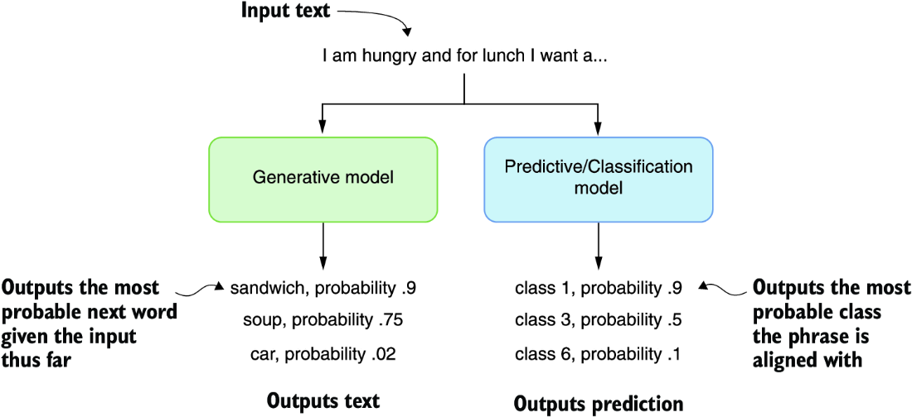

##### Figure 2.1 The difference between generative and predictive models

We can further define an LLM by its constituent parts, as shown in figure 2.2. In this diagram, *data* represents the content used to train the model, and *architecture* is an attribute of the model itself, such as the number of parameters or size of the model. Models are further trained specifically to the desired use case, including chat, completions, or instruction. Finally, *fine-tuning* is a feature added to models that refines the input data and model training to better match a particular use case or domain.

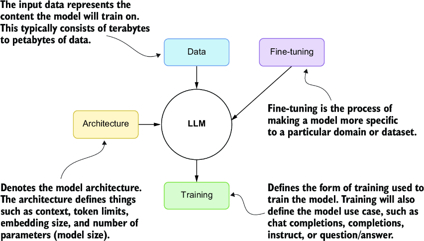

##### Figure 2.2 The main elements that describe an LLM

The transformer architecture of GPTs, which is a specific architecture of LLMs, allows the models to be scaled to billions of parameters in size. This requires these large models to be trained on terabytes of documents to build a foundation. From there, these models will be successively trained using various methods for the desired use case of the model.

ChatGPT, for example, is trained effectively on the public internet and then fine-tuned using several training strategies. The final fine-tuning training is completed using an advanced form called *reinforcement learning with human feedback* (RLHF). This produces a model use case called chat completions.

*Chat completions* LLMs are designed to improve through iteration and refinement—in other words, chatting. These models have also been benchmarked to be the best in task completion, reasoning, and planning, which makes them ideal for building agents and assistants. Completion models are trained/designed only to provide generated content on input text, so they don’t benefit from iteration.

For our journey to build powerful agents in this book, we focus on the class of LLMs called chat completions models. That, of course, doesn’t preclude you from trying other model forms for your agents. However, you may have to significantly alter the code samples provided to support other model forms.

We’ll uncover more details about LLMs and GPTs later in this chapter when we look at running an open source LLM locally. In the next section, we look at how to connect to an LLM using a growing standard from OpenAI.

## 2.1 Mastering the OpenAI API

Numerous AI agents and assistant projects use the OpenAI API SDK to connect to an LLM. While not standard, the basic concepts describing a connection now follow the OpenAI pattern. Therefore, we must understand the core concepts of an LLM connection using the OpenAI SDK.

This chapter will look at connecting to an LLM model using the OpenAI Python SDK/package. We’ll discuss connecting to a GPT-4 model, the model response, counting tokens, and how to define consistent messages. Starting in the following subsection, we’ll examine how to use OpenAI.

### 2.1.1 Connecting to the chat completions model

To complete the exercises in this section and subsequent ones, you must set up a Python developer environment and get access to an LLM. Appendix A walks you through setting up an OpenAI account and accessing GPT-4 or other models. Appendix B demonstrates setting up a Python development environment with Visual Studio Code (VS Code), including installing needed extensions. Review these sections if you want to follow along with the scenarios.

Start by opening the source code `chapter_2` folder in VS Code and creating a new Python virtual environment. Again, refer to appendix B if you need assistance.

Then, install the OpenAI and Python dot environment packages using the command in the following listing. This will install the required packages into the virtual environment.

##### Listing 2.1 `pip` installs

```
pip install openai python-dotenv
```

Next, open the `connecting.py` file in VS Code, and inspect the code shown in listing 2.2. Be sure to set the model’s name to an appropriate name—for example, gpt-4. At the time of writing, the `gpt-4-1106-preview` was used to represent GPT-4 Turbo.

##### Listing 2.2 `connecting.py`

```
import os
from openai import OpenAI
from dotenv import load_dotenv

load_dotenv()                           #1
api_key = os.getenv('OPENAI_API_KEY')
if not api_key:                             #2
    raise ValueError("No API key found. Please check your .env file.")
client = OpenAI(api_key=api_key)                        #3

def ask_chatgpt(user_message):
    response = client.chat.completions.create(      #4
        model="gpt-4-1106-preview",
        messages=[{"role": "system",
 "content": "You are a helpful assistant."},
        {"role": "user", "content": user_message}],
        temperature=0.7,
        )
    return response.choices[0].message.content     #5

user = "What is the capital of France?"
response = ask_chatgpt(user)                #6
print(response)
```

#1 Loads the secrets stored in the .env file  
#2 Checks to see whether the key is set  
#3 Creates a client with the key  
#4 Uses the create function to generate a response  
#5 Returns just the content of the response  
#6 Executes the request and returns the response

A lot is happening here, so let’s break it down by section, starting with the beginning and loading the environment variables. In the `chapter_2` folder is another file called `.env`, which holds environment variables. These variables are set automatically by calling the `load_dotenv` function.

You must set your OpenAI API key in the `.env` file, as shown in the next listing. Again, refer to appendix A to find out how to get a key and find a model name.

##### Listing 2.3 `.env`

```
OPENAI_API_KEY='your-openai-api-key'
```

After setting the key, you can debug the file by pressing the F5 key or selecting Run &gt; Start Debugging from the VS Code menu. This will run the code, and you should see something like “The capital of France is Paris.”

Remember that the response from a generative model depends on the probability. The model will probably give us a correct and consistent answer in this case.

You can play with these probabilities by adjusting the temperature of the request. If you want a model to be more consistent, turn the temperature down to 0, but if you want the model to produce more variation, turn the temperature up. We’ll explore setting the temperature further in the next section.

### 2.1.2 Understanding the request and response

Digging into the chat completions request and response features can be helpful. We’ll focus on the request first, as shown next. The request encapsulates the intended model, the messages, and the temperature.

##### Listing 2.4 The chat completions request

```
response = client.chat.completions.create(
    model="gpt-4-1106-preview",                 #1
    messages=[{"role": "system", 
"content": "You are a helpful assistant."},                     #2
              {"role": "user", "content": user_message}],      #3
    temperature=0.7,     #4
    )
```

#1 The model or deployment used to respond to the request  
#2 The system role message  
#3 The user role message  
#4 The temperature or variability of the request

Within the request, the `messages` block describes a set of messages and roles used in a request. Messages for a chat completions model can be defined in three roles:

- *System role* —A message that describes the request’s rules and guidelines. It can often be used to describe the role of the LLM in making the request.
- *User role* —Represents and contains the message from the user.
- *Assistant role* —Can be used to capture the message history of previous responses from the LLM. It can also inject a message history when perhaps none existed.

The message sent in a single request can encapsulate an entire conversation, as shown in the JSON in the following listing.

##### Listing 2.5 Messages with history

```
[
    {
        "role": "system",
        "content": "You are a helpful assistant."
    },
    {
        "role": "user",
        "content": "What is the capital of France?"
    },
    {
        "role": "assistant",
        "content": "The capital of France is Paris."
    },
    {
        "role": "user",
        "content": "What is an interesting fact of Paris."
    }
],
```

You can see how this can be applied by opening `message_history.py` in VS Code and debugging it by pressing F5. After the file runs, be sure to check the output. Then, try to run the sample a few more times to see how the results change.

The results will change from each run to the next due to the high temperature of `.7`. Go ahead and reduce the temperature to `.0`, and run the `message_history.py` sample a few more times. Keeping the temperature at `0` will show the same or similar results each time.

Setting a request’s temperature will often depend on your particular use case. Sometimes, you may want to limit the responses’ stochastic nature (randomness). Reducing the temperature to `0` will give consistent results. Likewise, a value of `1.0` will give the most variability in the responses.

Next, we also want to know what information is being returned for each request. The next listing shows the output format for the response. You can see this output by running the `message_history.py` file in VS Code.

##### Listing 2.6 Chat completions response

```
{
    "id": "chatcmpl-8WWL23up3IRfK1nrDFQ3EHQfhx0U6",
    "choices": [                                      #1
        {
            "finish_reason": "stop",
            "index": 0,
            "message": {
                "content": "… omitted",
                "role": "assistant",       #2
                "function_call": null,
                "tool_calls": null
            },
            "logprobs": null
        }
    ],
    "created": 1702761496,
    "model": "gpt-4-1106-preview",     #3
    "object": "chat.completion",
    "system_fingerprint": "fp_3905aa4f79",
    "usage": {
        "completion_tokens": 78,     #4
        "prompt_tokens": 48,         #4
        "total_tokens": 126          #4
    }
}
```

#1 A model may return more than one response.  
#2 Responses returned in the assistant role  
#3 Indicates the model used  
#4 Counts the number of input (prompt) and output (completion) tokens used

It can be helpful to track the number of *input tokens* (those used in prompts) and the *output tokens* (the number returned through completions). Sometimes, minimizing and reducing the number of tokens can be essential. Having fewer tokens typically means LLM interactions will be cheaper, respond faster, and produce better and more consistent results.

That covers the basics of connecting to an LLM and returning responses. Throughout this book, we’ll review and expand on how to interact with LLMs. Until then, we’ll explore in the next section how to load and use open source LLMs.

## 2.2 Exploring open source LLMs with LM Studio

Commercial LLMs, such as GPT-4 from OpenAI, are an excellent place to start to learn how to use modern AI and build agents. However, commercial agents are an external resource that comes at a cost, reduces data privacy and security, and introduces dependencies. Other external influences can further complicate these factors.

It’s unsurprising that the race to build comparable open source LLMs is growing more competitive every day. As a result, there are now open source LLMs that may be adequate for numerous tasks and agent systems. There have even been so many advances in tooling in just a year that hosting LLMs locally is now very easy, as we’ll see in the next section.

### 2.2.1 Installing and running LM Studio

LM Studio is a free download that supports downloading and hosting LLMs and other models locally for Windows, Mac, and Linux. The software is easy to use and offers several helpful features to get you started quickly. Here is a quick summary of steps to download and set up LM Studio:

1. Download LM Studio from [https://lmstudio.ai/](https://lmstudio.ai/).
2. After downloading, install the software per your operating system. Be aware that some versions of LM Studio may be in beta and require installation of additional tools or libraries.
3. Launch the software.

Figure 2.3 shows the LM Studio window running. From there, you can review the current list of hot models, search for others, and even download. The home page content can be handy for understanding the details and specifications of the top models.

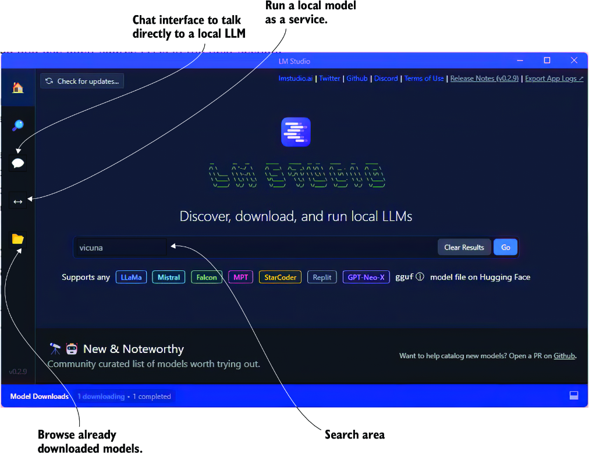

##### Figure 2.3 LM Studio software showing the main home page

An appealing feature of LM Studio is its ability to analyze your hardware and align it with the requirements of a given model. The software will let you know how well you can run a given model. This can be a great time saver in guiding what models you experiment with.

Enter some text to search for a model, and click Go. You’ll be taken to the search page interface, as shown in figure 2.4. From this page, you can see all the model variations and other specifications, such as context token size. After you click the Compatibility Guess button, the software will even tell you if the model will run on your system.

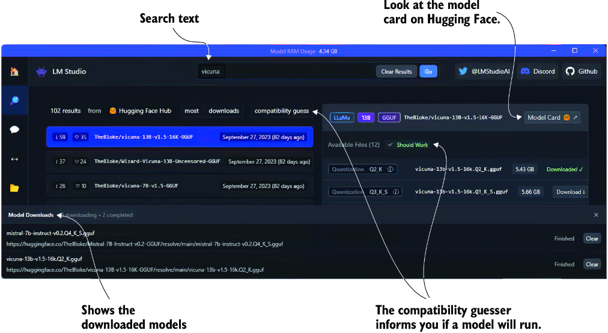

##### Figure 2.4 The LM Studio search page

Click to download any model that will run on your system. You may want to stick with models designed for chat completions, but if your system is limited, work with what you have. In addition, if you’re unsure of which model to use, go ahead and download to try them. LM Studio is a great way to explore and experiment with many models.

After the model is downloaded, you can then load and run the model on the chat page or as a server on the server page. Figure 2.5 shows loading and running a model on the chat page. It also shows the option for enabling and using a GPU if you have one.

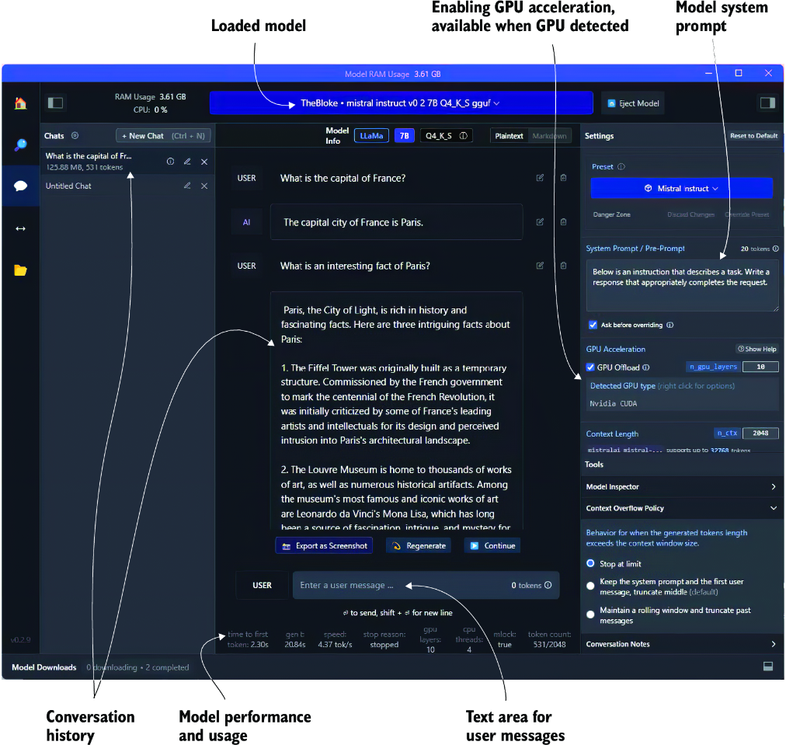

##### Figure 2.5 The LM Studio chat page with a loaded, locally running LLM

To load and run a model, open the drop-down menu at the top middle of the page, and select a downloaded model. A progress bar will appear showing the model loading, and when it’s ready, you can start typing into the UI.

The software even allows you to use some or all of your GPU, if detected, for the model inference. A GPU will generally speed up the model response times in some capacities. You can see how adding a GPU can affect the model’s performance by looking at the performance status at the bottom of the page, as shown in figure 2.5.

Chatting with a model and using or playing with various prompts can help you determine how well a model will work for your given use case. A more systematic approach is using the prompt flow tool for evaluating prompts and LLMs. We’ll describe how to use prompt flow in chapter 9.

LM Studio also allows a model to be run on a server and made accessible using the OpenAI package. We’ll see how to use the server feature and serve a model in the next section.

### 2.2.2 Serving an LLM locally with LM Studio

Running an LLM locally as a server is easy with LM Studio. Just open the server page, load a model, and then click the Start Server button, as shown in figure 2.6. From there, you can copy and paste any of the examples to connect with your model.

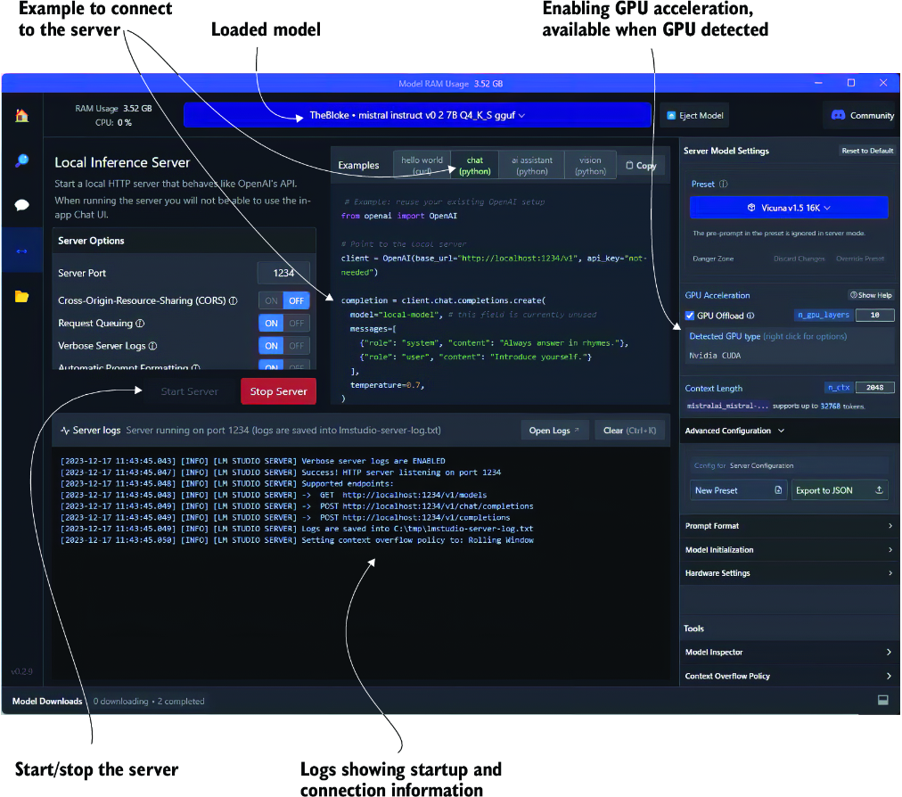

##### Figure 2.6 The LM Studio server page and a server running an LLM

You can review an example of the Python code by opening `chapter_2/lmstudio_ server.py` in VS Code. The code is also shown here in listing 2.7. Then, run the code in the VS Code debugger (press F5).

##### Listing 2.7 `lmstudio_server.py`

```
from openai import OpenAI

client = OpenAI(base_url="http://localhost:1234/v1", api_key="not-needed")

completion = client.chat.completions.create(
  model="local-model",                           #1
  messages=[
    {"role": "system", "content": "Always answer in rhymes."},
    {"role": "user", "content": "Introduce yourself."}       #2
  ],
  temperature=0.7,
)

print(completion.choices[0].message)      #3
```

#1 Currently not used; can be anything  
#2 Feel free to change the message as you like.  
#3 Default code outputs the whole message.

If you encounter problems connecting to the server or experience any other problems, be sure your configuration for the Server Model Settings matches the model type. For example, in figure 2.6, shown earlier, the loaded model differs from the server settings. The corrected settings are shown in figure 2.7.

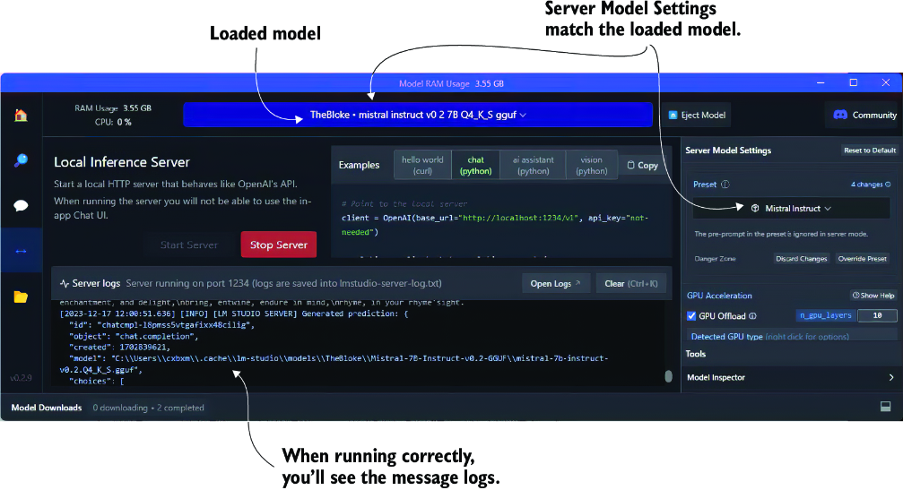

##### Figure 2.7 Choosing the correct Server Model Settings for the loaded model

Now, you can use a locally hosted LLM or a commercial model to build, test, and potentially even run your agents. The following section will examine how to build prompts using prompt engineering more effectively.

## 2.3 Prompting LLMs with prompt engineering

A prompt defined for LLMs is the message content used in the request for better response output. *Prompt engineering* is a new and emerging field that attempts to structure a methodology for building prompts. Unfortunately, prompt building isn’t a well-established science, and there is a growing and diverse set of methods defined as prompt engineering.

Fortunately, organizations such as OpenAI have begun documenting a universal set of strategies, as shown in figure 2.8. These strategies cover various tactics, some requiring additional infrastructure and considerations. As such, the prompt engineering strategies relating to more advanced concepts will be covered in the indicated chapters.

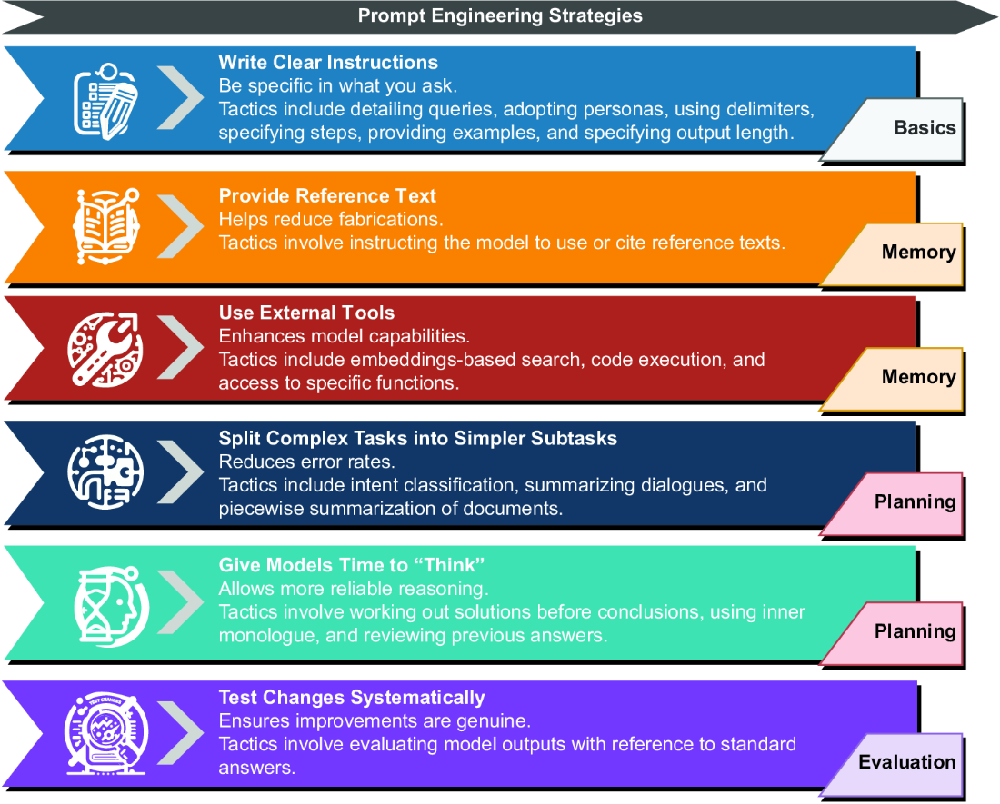

##### Figure 2.8 OpenAI prompt engineering strategies reviewed in this book, by chapter location

Each strategy in figure 2.8 unfolds into tactics that can further refine the specific method of prompt engineering. This chapter will examine the fundamental Write Clear Instructions strategy. Figure 2.9 shows the tactics for this strategy in more detail, along with examples for each tactic. We’ll look at running these examples using a code demo in the following sections.

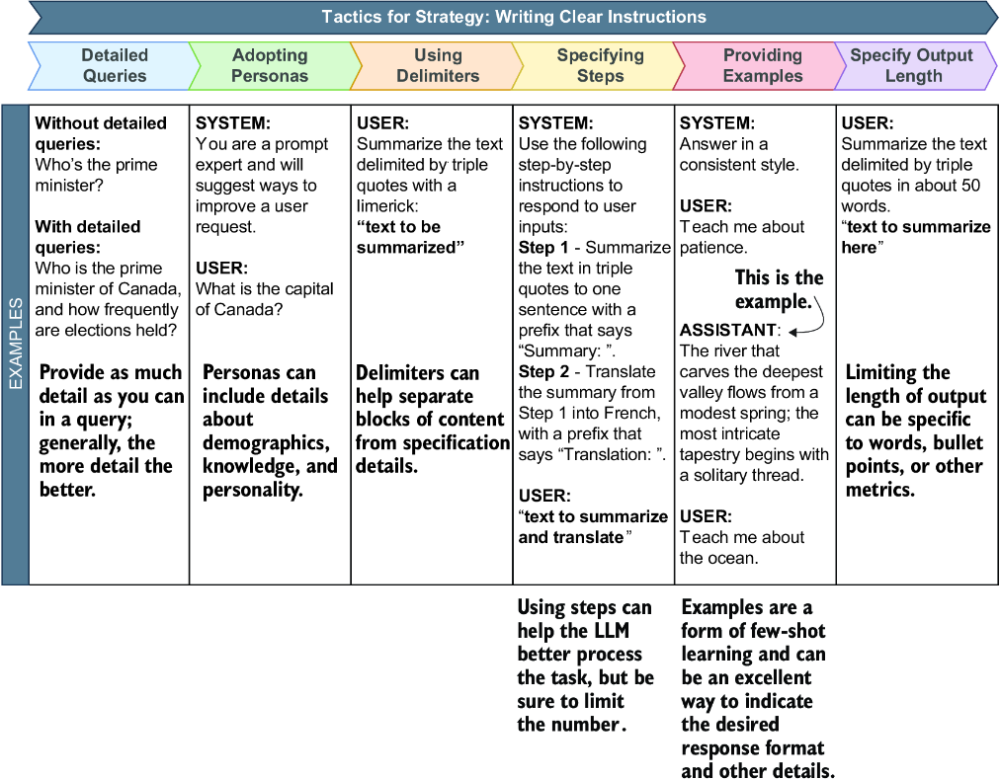

##### Figure 2.9 The tactics for the Write Clear Instructions strategy

The Write Clear Instructions strategy is about being careful and specific about what you ask for. Asking an LLM to perform a task is no different from asking a person to complete the same task. Generally, the more information and context relevant to a task you can specify in a request, the better the response.

This strategy has been broken down into specific tactics you can apply to prompts. To understand how to use those, a code demo (`prompt_engineering.py`) with various prompt examples is in the `chapter 2` source code folder.

Open the `prompt_engineering.py` file in VS Code, as shown in listing 2.8. This code starts by loading all the JSON Lines files in the `prompts` folder. Then, it displays the list of files as choices and allows the user to select a prompt option. After selecting the option, the prompts are submitted to an LLM, and the response is printed.

##### Listing 2.8 `prompt_engineering.py` `(main())`

```
def main():
    directory = "prompts"
    text_files = list_text_files_in_directory(directory)    #1

    if not text_files:
        print("No text files found in the directory.")
        return

    def print_available():                                     #2
        print("Available prompt tactics:")
        for i, filename in enumerate(text_files, start=1):
            print(f"{i}. {filename}")

    while True:
        try:
            print_available()                   #2              
            choice = int(input("Enter … 0 to exit): "))           #3
            if choice == 0:
                break
            elif 1 <= choice <= len(text_files):
                selected_file = text_files[choice - 1]
                file_path = os.path.join(directory,
      selected_file)
                prompts = 
↪ load_and_parse_json_file(file_path)                          #4
                print(f"Running prompts for {selected_file}")
                for i, prompt in enumerate(prompts):
                    print(f"PROMPT {i+1} --------------------")
                    print(prompt)
                    print(f"REPLY ---------------------------")
                    print(prompt_llm(prompt))                       #5
            else:
                print("Invalid choice. Please enter a valid number.")
        except ValueError:
            print("Invalid input. Please enter a number.")
```

#1 Collects all the files for the given folder  
#2 Prints the list of files as choices  
#3 Inputs the user’s choice  
#4 Loads the prompt and parses it into messages  
#5 Submits the prompt to an OpenAI LLM

A commented-out section from the listing demonstrates how to connect to a local LLM. This will allow you to explore the same prompt engineering tactics applied to open source LLMs running locally. By default, this example uses the OpenAI model we configured previously in section 2.1.1. If you didn’t complete that earlier, please go back and do it before running this one.

Figure 2.10 shows the output of running the prompt engineering tactics tester, the `prompt_engineering.py` file in VS Code. When you run the tester, you can enter a value for the tactic you want to test and watch it run.

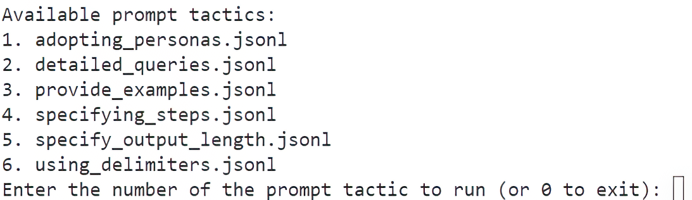

##### Figure 2.10 The output of the prompt engineering tactics tester

In the following sections, we’ll explore each prompt tactic in more detail. We’ll also examine the various examples.

### 2.3.1 Creating detailed queries

The basic premise of this tactic is to provide as much detail as possible but also to be careful not to give irrelevant details. The following listing shows the JSON Lines file examples for exploring this tactic.

##### Listing 2.9 `detailed_queries.jsonl`

```
[                        #1
    {
        "role": "system",
        "content": "You are a helpful assistant."
    },
    {
        "role": "user",
        "content": "What is an agent?"      #2
    }
]
[
    {
        "role": "system",
        "content": "You are a helpful assistant."
    },
    {
        "role": "user",
        "content": """
What is a GPT Agent? 
Please give me 3 examples of a GPT agent
"""                                        #3
    }
]
```

#1 The first example doesn’t use detailed queries.  
#2 First ask the LLM a very general question.  
#3 Ask a more specific question, and ask for examples.

This example demonstrates the difference between using detailed queries and not. It also goes a step further by asking for examples. Remember, the more relevance and context you can provide in your prompt, the better the overall response. Asking for examples is another way of enforcing the relationship between the question and the expected output.

### 2.3.2 Adopting personas

Adopting personas grants the ability to define an overarching context or set of rules to the LLM. The LLM can then use that context and/or rules to frame all later output responses. This is a compelling tactic and one that we’ll make heavy use of throughout this book.

Listing 2.10 shows an example of employing two personas to answer the same question. This can be an enjoyable technique for exploring a wide range of novel applications, from getting demographic feedback to specializing in a specific task or even rubber ducking.

##### GPT rubber ducking

*Rubber ducking* is a problem-solving technique in which a person explains a problem to an inanimate object, like a rubber duck, to understand or find a solution. This method is prevalent in programming and debugging, as articulating the problem aloud often helps clarify the problem and can lead to new insights or solutions.

GPT rubber ducking uses the same technique, but instead of an inanimate object, we use an LLM. This strategy can be expanded further by giving the LLM a persona specific to the desired solution domain.

##### Listing 2.10 `adopting_personas.jsonl`

```
[
    {
        "role": "system",
        "content": """
You are a 20 year old female who attends college 
in computer science. Answer all your replies as 
a junior programmer.
"""                         #1
    },
    {
        "role": "user",
        "content": "What is the best subject to study."
    }
]
[
    {
        "role": "system",
        "content": """
You are a 38 year old male registered nurse. 
Answer all replies as a medical professional.
"""                                             #2
    },
    {
        "role": "user",
        "content": "What is the best subject to study."
    }
]
```

#1 First persona  
#2 Second persona

A core element of agent profiles is the persona. We’ll employ various personas to assist agents in completing their tasks. When you run this tactic, pay particular attention to the way the LLM outputs the response.

### 2.3.3 Using delimiters

Delimiters are a useful way of isolating and getting the LLM to focus on some part of a message. This tactic is often combined with other tactics but can work well independently. The following listing demonstrates two examples, but there are several other ways of describing delimiters, from XML tags to using markdown.

##### Listing 2.11 `using_delimiters.jsonl`

```
[
    {
        "role": "system",
        "content": """
Summarize the text delimited by triple quotes 
with a haiku.
"""               #1
    },
    {
        "role": "user",
        "content": "A gold chain is cool '''but a silver chain is better'''"
    }
]
[
    {
        "role": "system",
        "content": """
You will be provided with a pair of statements 
(delimited with XML tags) about the same topic. 
First summarize the arguments of each statement. 
Then indicate which of them makes a better statement
 and explain why.
"""                        #2
    },
    {
        "role": "user",
        "content": """
<statement>gold chains are cool</statement>
<statement>silver chains are better</statement>
"""
    }
]
```

#1 The delimiter is defined by character type and repetition.  
#2 The delimiter is defined by XML standards.

When you run this tactic, pay attention to the parts of the text the LLM focuses on when it outputs the response. This tactic can be beneficial for describing information in a hierarchy or other relationship patterns.

### 2.3.4 Specifying steps

Specifying steps is another powerful tactic that can have many uses, including in agents, as shown in listing 2.12. It’s especially powerful when developing prompts or agent profiles for complex multistep tasks. You can specify steps to break down these complex prompts into a step-by-step process that the LLM can follow. In turn, these steps can guide the LLM through multiple interactions over a more extended conversation and many iterations.

##### Listing 2.12 `specifying_steps.jsonl`

```
[
    {
        "role": "system",
        "content": """
Use the following step-by-step instructions to respond to user inputs.
Step 1 - The user will provide you with text in triple single quotes. 
Summarize this text in one sentence with a prefix that says 'Summary: '.
Step 2 - Translate the summary from Step 1 into Spanish, 
with a prefix that says 'Translation: '.
"""                                          #1
    },
    {
        "role": "user",
        "content": "'''I am hungry and would like to order an appetizer.'''"
    }
]
[
    {
        "role": "system",
        "content": """
Use the following step-by-step instructions to respond to user inputs.
Step 1 - The user will provide you with text. Answer any questions in 
the text in one sentence with a prefix that says 'Answer: '.

Step 2 - Translate the Answer from Step 1 into a dad joke,
 with a prefix that says 'Dad Joke: '."""                      #2
    },
    {
        "role": "user",
        "content": "What is the tallest structure in Paris?"
    }
]
```

#1 Notice the tactic of using delimiters.  
#2 Steps can be completely different operations.

### 2.3.5 Providing examples

Providing examples is an excellent way to guide the desired output of an LLM. There are numerous ways to demonstrate examples to an LLM. The system message/prompt can be a helpful way to emphasize general output. In the following listing, the example is added as the last LLM assistant reply, given the prompt “Teach me about Python.”

##### Listing 2.13 `providing_examples.jsonl`

```
[
    {
        "role": "system",
        "content": """
Answer all replies in a consistent style that follows the format, 
length and style of your previous responses.
Example:
  user:
       Teach me about Python.
  assistant:                                                #1
       Python is a programming language developed in 1989
 by Guido van Rossum.

  Future replies:
       The response was only a sentence so limit
 all future replies to a single sentence.
"""                                           #2
    },
    {
        "role": "user",
        "content": "Teach me about Java."
    }
]
```

#1 Injects the sample output as the “previous” assistant reply  
#2 Adds a limit output tactic to restrict the size of the output and match the example

Providing examples can also be used to request a particular output format from a complex series of tasks that derive the output. For example, asking an LLM to produce code that matches a sample output is an excellent use of examples. We’ll employ this tactic throughout the book, but other methods exist for guiding output.

### 2.3.6 Specifying output length

The tactic of specifying output length can be helpful in not just limiting tokens but also in guiding the output to a desired format. Listing 2.14 shows an example of using two different techniques for this tactic. The first limits the output to fewer than 10 words. This can have the added benefit of making the response more concise and directed, which can be desirable for some use cases. The second example demonstrates limiting output to a concise set of bullet points. This method can help narrow down the output and keep answers short. More concise answers generally mean the output is more focused and contains less filler.

##### Listing 2.14 `specifying_output_length.jsonl`

```
[
    {
        "role": "system",
        "content": """
Summarize all replies into 10 or fewer words.
"""                                               #1
    },
    {
        "role": "user",
        "content": "Please tell me an exciting fact about Paris?"
    }
]
[
    {
        "role": "system",
        "content": """
Summarize all replies into 3 bullet points.
"""                                           #2
    },
    {
        "role": "user",
        "content": "Please tell me an exciting fact about Paris?"
    }
]
```

#1 Restricting the output makes the answer more concise.  
#2 Restricts the answer to a short set of bullets

Keeping answers brief can have additional benefits when developing multi-agent systems. Any agent system that converses with other agents can benefit from more concise and focused replies. It tends to keep the LLM more focused and reduces noisy communication.

Be sure to run through all the examples of the prompt tactics for this strategy. As mentioned, we’ll cover other prompt engineering strategies and tactics in future chapters. We’ll finish this chapter by looking at how to pick the best LLM for your use case.

## 2.4 Choosing the optimal LLM for your specific needs

While being a successful crafter of AI agents doesn’t require an in-depth understanding of LLMs, it’s helpful to be able to evaluate the specifications. Like a computer user, you don’t need to know how to build a processor to understand the differences in processor models. This analogy holds well for LLMs, and while the criteria may be different, it still depends on some primary considerations.

From our previous discussion and look at LM Studio, we can extract some fundamental criteria that will be important to us when considering LLMs. Figure 2.11 explains the essential criteria to define what makes an LLM worth considering for creating a GPT agent or any LLM task.

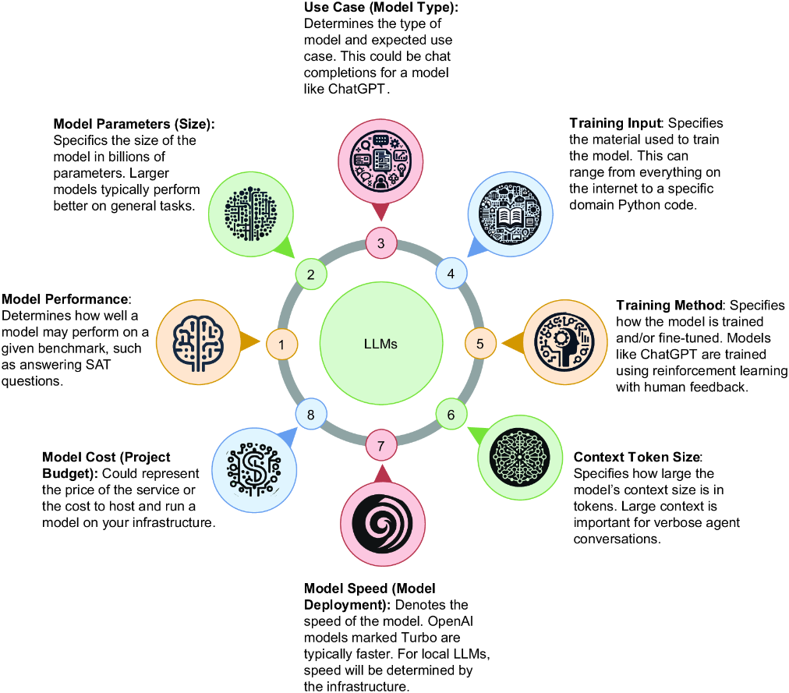

##### Figure 2.11 The important criteria to consider when consuming an LLM

For our purposes of building AI agents, we need to look at each of these criteria in terms related to the task. Model context size and speed could be considered the sixth and seventh criteria, but they are usually considered variations of a model deployment architecture and infrastructure. An eighth criterion to consider for an LLM is cost, but this depends on many other factors. Here is a summary of how these criteria relate to building AI agents:

- *Model performance* —You’ll generally want to understand the LLM’s performance for a given set of tasks. For example, if you’re building an agent specific to coding, then an LLM that performs well on code will be essential.
- *Model parameters (size)* —The size of a model is often an excellent indication of inference performance and how well the model responds. However, the size of a model will also dictate your hardware requirements. If you plan to use your own locally hosted model, the model size will also primarily dictate the computer and GPU you need. Fortunately, we’re seeing small, very capable open source models being released regularly.
- *Use case (model type)* —The type of model has several variations. Chat completions models such as ChatGPT are effective for iterating and reasoning through a problem, whereas models such as completion, question/answer, and instruct are more related to specific tasks. A chat completions model is essential for agent applications, especially those that iterate.
- *Training input* —Understanding the content used to train a model will often dictate the domain of a model. While general models can be effective across tasks, more specific or fine-tuned models can be more relevant to a domain. This may be a consideration for a domain-specific agent where a smaller, more fine-tuned model may perform as well as or better than a larger model such as GPT-4.
- *Training method* —It’s perhaps less of a concern, but it can be helpful to understand what method was used to train a model. How a model is trained can affect its ability to generalize, reason, and plan. This can be essential for planning agents but perhaps less significant for agents than for a more task-specific assistant.
- *Context token size* —The context size of a model is more specific to the model architecture and type. It dictates the size of context or memory the model may hold. A smaller context window of less than 4,000 tokens is typically more than enough for simple tasks. However, a large context window can be essential when using multiple agents—all conversing over a task. The models will typically be deployed with variations on the context window size.
- *Model speed (model deployment)* —The speed of a model is dictated by its *inference speed* (or how fast a model replies to a request), which in turn is dictated by the infrastructure it runs on. If your agent isn’t directly interacting with users, raw real-time speed may not be necessary. On the other hand, an LLM agent interacting in real time needs to be as quick as possible. For commercial models, speed will be determined and supported by the provider. Your infrastructure will determine the speed for those wanting to run their LLMs.
- *Model cost (project budget)* —The cost is often dictated by the project. Whether learning to build an agent or implementing enterprise software, cost is always a consideration. A significant tradeoff exists between running your LLMs versus using a commercial API.

There is a lot to consider when choosing which model you want to build a production agent system on. However, picking and working with a single model is usually best for research and learning purposes. If you’re new to LLMs and agents, you’ll likely want to choose a commercial option such as GPT-4 Turbo. Unless otherwise stated, the work in this book will depend on GPT-4 Turbo.

Over time, models will undoubtedly be replaced by better models. So you may need to upgrade or swap out models. To do this, though, you must understand the performance metrics of your LLMs and agents. Fortunately, in chapter 9, we’ll explore evaluating LLMs, prompts, and agent profiles with prompt flow.

## 2.5 Exercises

Use the following exercises to help you engage with the material in this chapter:

- *Exercise 1*—Consuming Different LLMs

*Objective* —Use the `connecting.py` code example to consume a different LLM from OpenAI or another provider.

*Tasks*:

- - Modify `connecting.py` to connect to a different LLM.
  - Choose an LLM from OpenAI or another provider.
  - Update the API keys and endpoints in the code.
  - Execute the modified code and validate the response.
- *Exercise 2*—Exploring Prompt Engineering Tactics

*Objective* —Explore various prompt engineering tactics, and create variations for each.

*Tasks:*

- - Review the prompt engineering tactics covered in the chapter.
  - Write variations for each tactic, experimenting with different phrasing and structures.
  - Test the variations with an LLM to observe different outcomes.
  - Document the results, and analyze the effectiveness of each variation.
- *Exercise 3*—Downloading and Running an LLM with LM Studio

*Objective* —Download an LLM using LM Studio, and connect it to prompt engineering tactics.

*Tasks:*

- - Install LM Studio on your machine.
  - Download an LLM using LM Studio.
  - Serve the model using LM Studio.
  - Write Python code to connect to the served model.
  - Integrate the prompt engineering tactics example with the served model.
- *Exercise 4*—Comparing Commercial and Open source LLMs

*Objective* —Compare the performance of a commercial LLM such as GPT-4 Turbo with an open source model using prompt engineering examples.

*Tasks:*

- - Implement the prompt engineering examples using GPT-4 Turbo.
  - Repeat the implementation using an open source LLM.
  - Evaluate the models based on criteria such as response accuracy, coherence, and speed.
  - Document the evaluation process, and summarize the findings.
- *Exercise 5*—Hosting Alternatives for LLMs

*Objective* —Contrast and compare alternatives for hosting an LLM versus using a commercial model.

*Tasks:*

- - Research different hosting options for LLMs (e.g., local servers, cloud services).
  - Evaluate the benefits and drawbacks of each hosting option.
  - Compare these options to using a commercial model in terms of cost, performance, and ease of use.
  - Write a report summarizing the comparison and recommending the best approach based on specific use cases.

## Summary

- LLMs use a type of architecture called generative pretrained transformers (GPTs).
- Generative models (e.g., LLMs and GPTs) differ from predictive/classification models by learning how to represent data and not simply classify it.
- LLMs are a collection of data, architecture, and training for specific use cases, called *fine-tuning.*
- The OpenAI API SDK can be used to connect to an LLM from models, such as GPT-4, and also used to consume open source LLMs.
- You can quickly set up Python environments and install the necessary packages for LLM integration.
- LLMs can handle various requests and generate unique responses that can be used to enhance programming skills related to LLM integration.
- Open source LLMs are an alternative to commercial models and can be hosted locally using tools such as LM Studio.
- Prompt engineering is a collection of techniques that help craft more effective prompts to improve LLM responses.
- LLMs can be used to power agents and assistants, from simple chatbots to fully capable autonomous workers.
- Selecting the most suitable LLM for specific needs depends on the performance, parameters, use case, training input, and other criteria.
- Running LLMs locally requires a variety of skills, from setting up GPUs to understanding various configuration options.
