# 4 Exploring multi-agent systems

### This chapter covers

- Building multi-agent systems using AutoGen Studio
- Building a simple multi-agent system
- Creating agents that can work collaboratively over a group chat
- Building an agent crew and multi-agent systems using CrewAI
- Extending the number of agents and exploring processing patterns with CrewAI

Now let’s take a journey from AutoGen to CrewAI, two well-established multi-agent platforms. We’ll start with AutoGen, a Microsoft project that supports multiple agents and provides a studio for working with them. We’ll explore a project from Microsoft called AutoGen, which supports multiple agents but also provides a studio to ease you into working with agents. From there, we’ll get more hands-on coding of AutoGen agents to solve tasks using conversations and group chat collaborations.

Then, we’ll transition to CrewAI, a self-proposed enterprise agentic system that takes a different approach. CrewAI balances role-based and autonomous agents that can be sequentially or hierarchically flexible task management systems. We’ll explore how CrewAI can solve diverse and complex problems.

Multi-agent systems incorporate many of the same tools single-agent systems use but benefit from the ability to provide outside feedback and evaluation to other agents. This ability to support and criticize agent solutions internally gives multi-agent systems more power. We’ll explore an introduction to multi-agent systems, beginning with AutoGen Studio in the next section.

## 4.1 Introducing multi-agent systems with AutoGen Studio

AutoGen Studio is a powerful tool that employs multiple agents behind the scenes to solve tasks and problems a user directs. This tool has been used to develop some of the more complex code in this book. For that reason and others, it’s an excellent introduction to a practical multi-agent system.

Figure 4.1 shows a schematic diagram of the agent connection/communication patterns AutoGen employs. AutoGen is a conversational multi-agent platform because communication is done using natural language. Natural language conversation seems to be the most natural pattern for agents to communicate, but it’s not the only method, as you’ll see later.

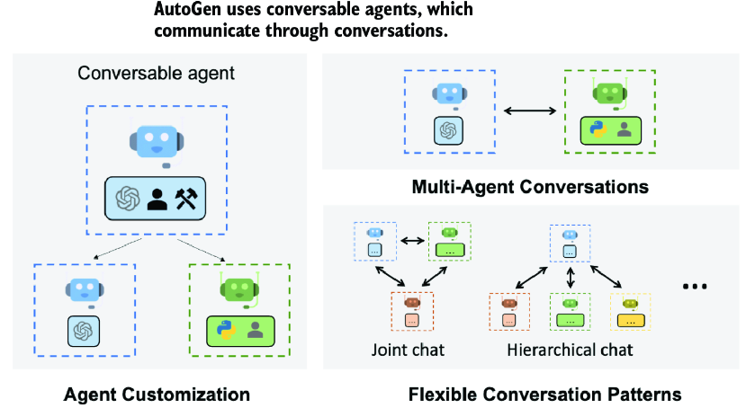

##### Figure 4.1 How AutoGen agents communicate through conversations (Source: AutoGen)

AutoGen supports various conversational patterns, from group and hierarchical to the more common and simpler proxy communication. In proxy communication, one agent acts as a proxy and directs communication to relevant agents to complete tasks. A proxy is similar to a waiter taking orders and delivering them to the kitchen, which cooks the food. Then, the waiter serves the cooked food.

The basic pattern in AutoGen uses a `UserProxy` and one or more assistant agents. Figure 4.2 shows the user proxy taking direction from a human and then directing an assistant agent enabled to write code to perform the tasks. Each time the assistant completes a task, the proxy agent reviews, evaluates, and provides feedback to the assistant. This iteration loop continues until the proxy is satisfied with the results.

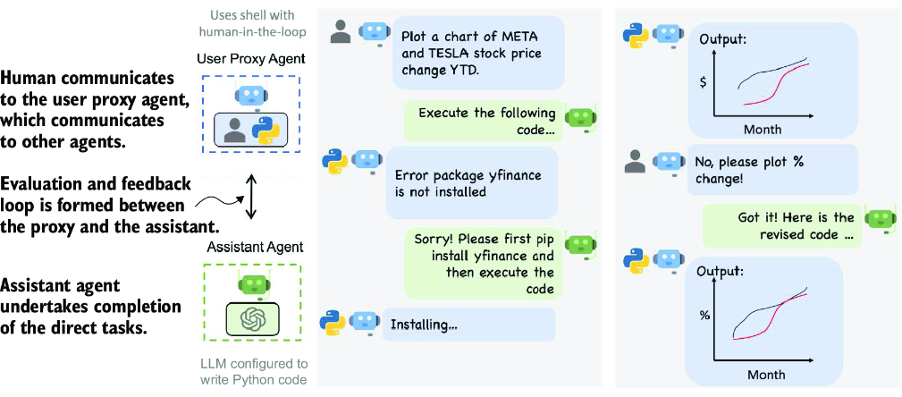

##### Figure 4.2 The user proxy agent and assistant agent communication (Source: AutoGen)

The benefit of the proxy is that it works to replace the required human feedback and evaluation, and, in most cases, it does a good job. While it doesn’t eliminate the need for human feedback and evaluation, it produces much more complete results overall. And, while the iteration loop is time consuming, it’s time you could be drinking a coffee or working on other tasks.

AutoGen Studio is a tool developed by the AutoGen team that provides a helpful introduction to conversable agents. In the next exercise, we’ll install Studio and run some experiments to see how well the platform performs. These tools are still in a rapid development cycle, so if you encounter any problems, consult the documentation on the AutoGen GitHub repository.

### 4.1.1 Installing and using AutoGen Studio

Open the `chapter_04` folder in Visual Studio Code (VS Code), create a local Python virtual environment, and install the `requirements.txt` file. If you need assistance with this, consult appendix B to install all of this chapter’s exercise requirements.

Open a terminal in VS Code (Ctrl-\`, Cmd-\`) pointing to your virtual environment, and run AutoGen Studio using the command shown in listing 4.1. You’ll first need to define an environment variable for your OpenAI key. Because ports 8080 and 8081 are popular, and if you have other services running, change the port to 8082 or something you choose.

##### Listing 4.1 Launching AutoGen Studio

```
# set environment variable on Bash (Git Bash)
export OPENAI_API_KEY=”<your API key>”          #1

# sent environment variable with PowerShell
$env:VAR_NAME =”<your API key>"                #1

autogenstudio ui --port 8081     #2
```

#1 Use the appropriate command for your terminal type.  
#2 Change the port if you expect or experience a conflict on your machine.

Navigate your browser to the AutoGen Studio interface shown in figure 4.3 (as of this writing). While there may be differences, one thing is for sure: the primary interface will still be chat. Enter a complex task that requires coding. The example used here is `Create` `a` `plot` `showing` `the` `popularity` `of` `the` `term` `GPT` `Agents` `in` `Google` `search.`

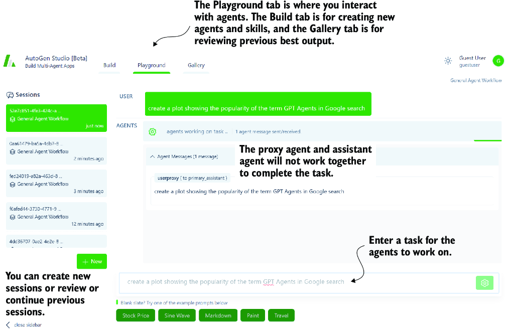

##### Figure 4.3 Entering a task for the agents to work on in the AutoGen interface

The agent assistant generates code snippets to perform or complete various subtasks as the agents work together through the task in the example. The user proxy agent then attempts to execute those code snippets and assesses the output. In many cases, proving the code runs and produces the required output is sufficient for the user proxy agent to approve the task’s completion.

If you encounter any problems with the assistant agent requests, ask the proxy agent to try a different method or another problem. This highlights a bigger problem with agentic systems using packages or libraries that have expired and no longer work. For this reason, it’s generally better to get agents to execute actions rather than build code to perform actions as tools.

Tip  Executing AutoGen and AutoGen Studio using Docker is recommended, especially when working with code that may affect the operating system. Docker can isolate and virtualize the agents’ environment, thus isolating potentially harmful code. Using Docker can help alleviate any secondary windows or websites that may block the agent process from running.

Figure 4.4 shows the agent’s completion of the task. The proxy agent will collect any generated code snippet, images, or other documents and append them to the message. You can also review the agent conversation by opening the Agent Messages expander. In many cases, if you ask the agent to generate plots or applications, secondary windows will open showing those results.

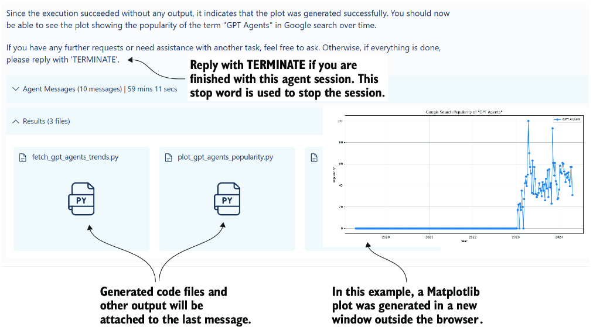

##### Figure 4.4 The output after the agents complete the task

Amazingly, the agents will perform most tasks nicely and complete them well. Depending on the complexity of the task, you may need to further iterate with the proxy. Sometimes, an agent may only go so far to complete a task because it lacks the required skills. In the next section, we’ll look at how to add skills to agents.

### 4.1.2 Adding skills in AutoGen Studio

Skills and tools, or *actions,* as we refer to them in this book, are the primary means by which agents can extend themselves. Actions give agents the ability to execute code, call APIs, or even further evaluate and inspect generated output. AutoGen Studio currently begins with just a basic set of tools to fetch web content or generate images.

Note  Many agentic systems employ the practice of allowing agents to code to solve goals. However, we discovered that code can be easily broken, needs to be maintained, and can change quickly. Therefore, as we’ll discuss in later chapters, it’s better to provide agents with skills/actions/tools to solve problems.

In the following exercise scenario, we’ll add a skill/action to inspect an image using the OpenAI vision model. This will allow the proxy agent to provide feedback if we ask the assistant to generate an image with particular content.

With AutoGen Studio running, go to the Build tab and click Skills, as shown in figure 4.5. Then, click the New Skill button to open a code panel where you can copy–paste code to. From this tab, you can also configure models, agents, and agent workflows.

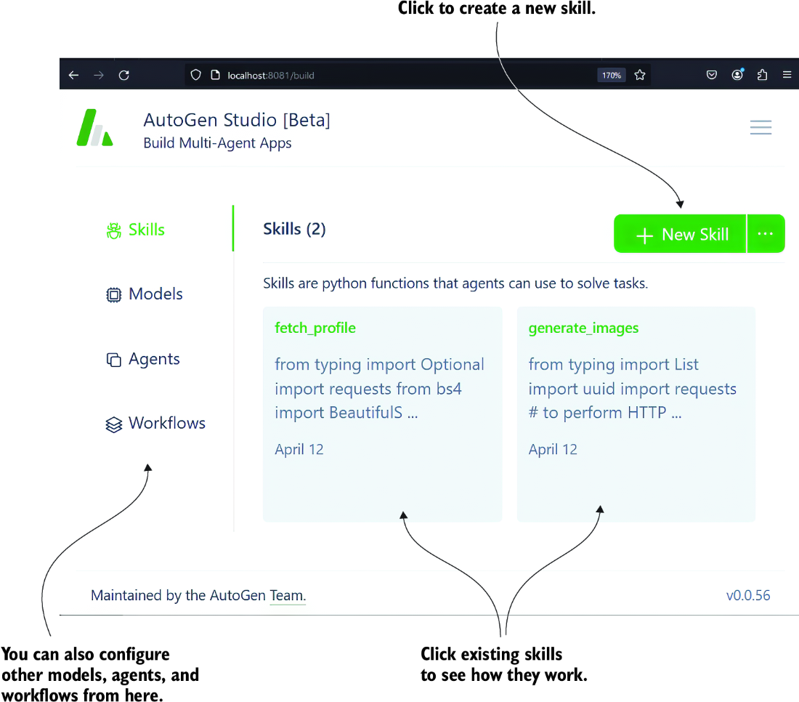

##### Figure 4.5 Steps to creating a new skill on the Build tab

Enter the code shown in listing 4.2 and also provided in the book’s source code as `describe_image.py`. Copy and paste this code into the editor window, and then click the Save button at the bottom.

##### Listing 4.2 `describe_image.py`

```
import base64
import requests
import os

def describe_image(image_path='animals.png') -> str:
    """
    Uses GPT-4 Vision to inspect and describe the contents of the image.

    :param input_path: str, the name of the PNG file to describe.
    """
    api_key = os.environ['OPEN_API_KEY']

    # Function to encode the image
    def encode_image(image_path):      #1
        with open(image_path, "rb") as image_file:
            return base64.b64encode(image_file.read()).decode('utf-8')
    # Getting the base64 string
    base64_image = encode_image(image_path)

    headers = {
    "Content-Type": "application/json",
    "Authorization": f"Bearer {api_key}"
    }

    payload = {
    "model": "gpt-4-turbo",
    "messages": [
        {
        "role": "user",
        "content": [
            {
            "type": "text",
            "text": "What’s in this image?"
            },
            {
            "type": "image_url",
            "image_url": {
         "url": f"data:image/jpeg;base64,{base64_image}"      #2
            }
            }
        ]
        }
    ],
    "max_tokens": 300
    }

    response = requests.post(
        "https://api.openai.com/v1/chat/completions",
        headers=headers,
        json=payload)

    return response.json()["choices"][0]["message"]  #3
["content"]                                          #3
```

#1 Function to load and encode the image as a Base64 string  
#2 Including the image string along with the JSON payload  
#3 Unpacking the response and returning the content of the reply

The `describe_image` function uses the OpenAI GPT-4 vision model to describe what is in the image. This skill can be paired with the existing generate\_image skill as a quality assessment. The agents can confirm that the generated image matches the user’s requirements.

After the skill is added, it must be added to the specific agent workflow and agent for use. Figure 4.6 demonstrates adding the new skill to the primary assistant agent in the general or default agent workflow.

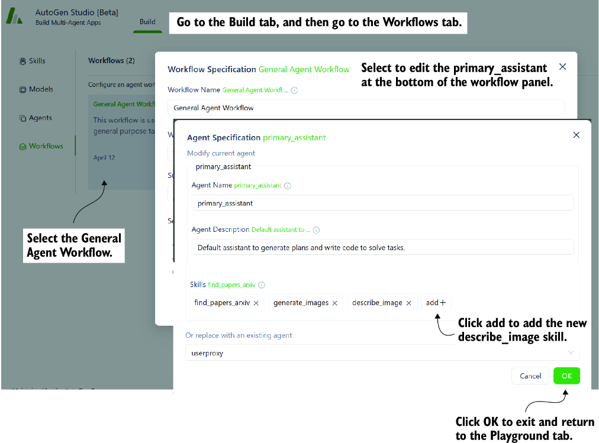

##### Figure 4.6 Configuring the primary\_assistant agent with the new skill

Now that the skill is added to the primary assistant, we can task the agent with creating a specific image and validating it using the new describe\_image skill. Because image generators notoriously struggle with correct text, we’ll create an exercise task to do just that.

Enter the text shown in listing 4.3 to prompt the agents to create a book image cover for this book. We’ll explicitly say that the text needs to be correct and insist that the agent uses the new `describe_image` function to verify the image.

##### Listing 4.3 Prompting for a book cover

```
Please create a cover for the book GPT Agents In Action, use the 
describe_image skill to make sure the title of the book is spelled 
correctly on the cover
```

After the prompt is entered, wait for a while, and you may get to see some dialogue exchanged about the image generation and verification process. In the end, though, if everything works correctly, the agents will return with the results shown in figure 4.7.

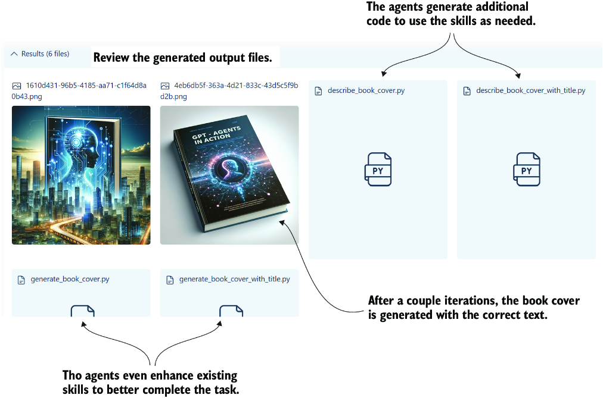

##### Figure 4.7 The generated file outputs from the agent work on the image generation task

Remarkably, the agent coordination completed the task in just a couple of iterations. Along with the images, you can also see the various helper code snippets generated to assist with task completion. AutoGen Studio is impressive in its ability to integrate skills that the agents can further adapt to complete some goal. The following section will show how these powerful agents are implemented in code.

## 4.2 Exploring AutoGen

While AutoGen Studio is a fantastic tool for understanding multi-agent systems, we must look into the code. Fortunately, coding multiple agent examples with AutoGen is simple and easy to run. We’ll cover the basic AutoGen setup in the next section.

### 4.2.1 Installing and consuming AutoGen

This next exercise will look at coding a basic multi-agent system that uses a user proxy and conversable agent. Before we do that, though, we want to make sure AutoGen is installed and configured correctly.

Open a terminal in VS Code, and run the entire chapter 4 install directions per appendix B, or run the `pip` command in listing 4.4. If you’ve installed the `requirements.txt` file, you’ll also be ready to run AutoGen.

##### Listing 4.4 Installing AutoGen

```
pip install pyautogen
```

Next, copy the `chapter_04/OAI_CONFIG_LIST.example` to `OAI_CONFIG_LIST`, removing `.example` from the file name. Then, open the new file in VS Code, and enter your OpenAI or Azure configuration in the `OAI_CONFIG_LIST` file in listing 4.5. Fill in your API key, model, and other details per your API service requirements. AutoGen will work with any model that adheres to the OpenAI client. That means you can use local LLMs via LM Studio or other services such as Groq, Hugging Face, and more.

##### Listing 4.5 `OAI_CONFIG_LIST`

```
[
    {
        "model": "gpt-4",                     #1
        "api_key": "<your OpenAI API key here>",            #2
        "tags": ["gpt-4", "tool"]
    },
    {
        "model": "<your Azure OpenAI deployment name>",      #3
        "api_key": "<your Azure OpenAI API key here>",      #4
        "base_url": "<your Azure OpenAI API base here>",     #5
        "api_type": "azure",
        "api_version": "2024-02-15-preview"
    }    
]
```

#1 Select the model; GPT-4 is recommended.  
#2 Use the service key you would typically use.  
#3 Select the model; GPT-4 is recommended.  
#4 Use the service key you would typically use.  
#5 Changing the base URL allows you to point to other services, not just Azure OpenAI.

Now, we can look at the code for a basic multi-agent chat using the out-of-the-box `UserProxy` and `ConversableAgent` agents. Open `autogen_start.py` in VS Code, shown in the following listing, and review the parts before running the file.

##### Listing 4.6 `autogen_start.py`

```
from autogen import ConversableAgent, UserProxyAgent, config_list_from_json


   config_list = config_list_from_json(
        env_or_file="OAI_CONFIG_LIST")      #1

   assistant = ConversableAgent(
        "agent", 
        llm_config={"config_list": config_list})      #2

   user_proxy = UserProxyAgent(      #3
        "user",
        code_execution_config={
            "work_dir": "working",
            "use_docker": False,
        },
        human_input_mode="ALWAYS",
        is_termination_msg=lambda x: x.get("content", "")
        .rstrip()
        .endswith("TERMINATE"),      #4
    )    
    user_proxy.initiate_chat(assistant, message="write a solution 
↪ for fizz buzz in one line?")     #5
```

#1 Loads your LLM configuration from the JSON file OAI\_CONFIG\_LIST  
#2 This agent talks directly to the LLM.  
#3 This agent proxies conversations from the user to the assistant.  
#4 Setting the termination message allows the agent to iterate.  
#5 A chat is initiated with the assistant through the user\_proxy to complete a task.

Run the code by running the file in VS Code in the debugger (F5). The code in listing 4.6 uses a simple task to demonstrate code writing. Listing 4.7 shows a few examples to choose from. These coding tasks are also some of the author’s regular baselines to assess an LLMs’ strength in coding.

##### Listing 4.7 Simple coding task examples

```
write a Python function to check if a number is prime
code a classic sname game using Pygame                   #1
code a classic asteroids game in Python using Pygame  #1
```

#1 To enjoy iterating over these tasks, use Windows Subsystem for Linux (WSL) on Windows, or use Docker.

After the code starts in a few seconds, the assistant will respond to the proxy with a solution. At this time, the proxy will prompt you for feedback. Press Enter, essentially giving no feedback, and this will prompt the proxy to run the code to verify it operates as expected.

Impressively, the proxy agent will even take cues to install required packages such as Pygame. Then it will run the code, and you’ll see the output in the terminal or as a new window or browser. You can play the game or use the interface if the code shelled a new window/browser.

Note that the spawned window/browser won’t close on Windows and will require exiting the entire program. To avoid this problem, run the code through Windows Subsystem for Linux (WSL) or Docker. AutoGen explicitly recommends using Docker for code execution agents, and if you’re comfortable with containers, this is a good option.

Either way, after the proxy generates and runs the code, the `working_dir` folder set earlier in listing 4.6 should now have a Python file with the code. This will allow you to run the code at your leisure, make changes, or even ask for improvements, as we’ll see. In the next section, we’ll look at how to improve the capabilities of the coding agents.

### 4.2.2 Enhancing code output with agent critics

One powerful benefit of multi-agent systems is the multiple roles/personas you can automatically assign when completing tasks. Generating or helping to write code can be an excellent advantage to any developer, but what if that code was also reviewed and tested? In the next exercise, we’ll add another agent critic to our agent system to help with coding tasks. Open `autogen_coding_critic.py`, as shown in the following listing.

##### Listing 4.8 `autogen_coding_critic.py`

```
from autogen import AssistantAgent, UserProxyAgent, config_list_from_json

config_list = config_list_from_json(env_or_file="OAI_CONFIG_LIST")

user_proxy = UserProxyAgent(
    "user",
    code_execution_config={
        "work_dir": "working",
        "use_docker": False,
        "last_n_messages": 1,
    },
    human_input_mode="ALWAYS",
    is_termination_msg=lambda x: 
x.get("content", "").rstrip().endswith("TERMINATE"),
)

engineer = AssistantAgent(
    name="Engineer",
    llm_config={"config_list": config_list},
    system_message="""
    You are a profession Python engineer, known for your expertise in 
software development.
    You use your skills to create software applications, tools, and 
games that are both functional and efficient.
    Your preference is to write clean, well-structured code that is easy 
to read and maintain.    
    """,      #1
)

critic = AssistantAgent(
    name="Reviewer",
    llm_config={"config_list": config_list},
    system_message="""
    You are a code reviewer, known for your thoroughness and commitment 
to standards.
    Your task is to scrutinize code content for any harmful or 
substandard elements.
    You ensure that the code is secure, efficient, and adheres to best 
practices.
    You will identify any issues or areas for improvement in the code 
and output them as a list.
    """,      #2
)

def review_code(recipient, messages, sender, config):      #3
    return f"""
            Review and critque the following code.

            {recipient.chat_messages_for_summary(sender)[-1]['content']}
            """                       #3                    

user_proxy.register_nested_chats(      #4
    [
        {
            "recipient": critic,
            "message": review_code,
            "summary_method": "last_msg",
            "max_turns": 1,
        }
    ],
    trigger=engineer,                 #4
)
task = """Write a snake game using Pygame."""

res = user_proxy.initiate_chat(
    recipient=engineer, 
    message=task, 
    max_turns=2, 
    summary_method="last_msg"      #5
)
```

#1 This time, the assistant is given a system/persona message.  
#2 A second assistant critic agent is created with a background.  
#3 A custom function helps extract the code for review by the critic.  
#4 A nested chat is created between the critic and the engineer.  
#5 The proxy agent initiates a chat with a max delay and explicit summary method.

Run the `autogen_coding_critic.py` file in VS Code in debug mode, and watch the dialog between the agents. This time, after the code returns, the critic will also be triggered to respond. Then, the critic will add comments and suggestions to improve the code.

Nested chats work well for supporting and controlling agent interactions, but we’ll see a better approach in the following section. Before that though, we’ll review the importance of the AutoGen cache in the next section.

### 4.2.3 Understanding the AutoGen cache

AutoGen can consume many tokens over chat iterations as a conversable multi-agent platform. If you ask AutoGen to work through complex or novel problems, you may even encounter token limits on your LLM; because of this, AutoGen supports several methods to reduce token usage.

AutoGen uses caching to store progress and reduce token usage. Caching is enabled by default, and you may have already encountered it. If you check your current working folder, you’ll notice a `.cache` folder, as shown in figure 4.8. Caching allows your agents to continue conversations if they get interrupted.

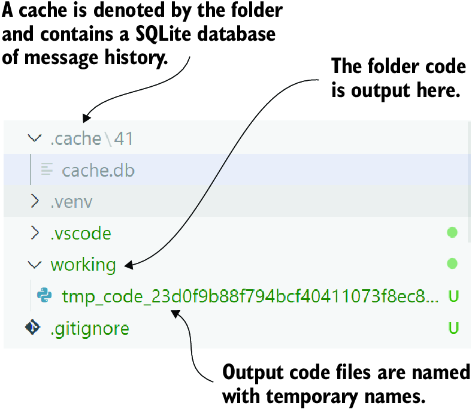

##### Figure 4.8 AutoGen cache and working folders

In code, you can control the cache folder for your agent’s run, as shown in listing 4.9. By wrapping the `initiate_chat` call with the `with` statement, you can control the location and seed for the cache. This will allow you to save and return to long-running AutoGen tasks in the future by just setting the `cache_seed` for the previous cache.

##### Listing 4.9 Setting the cache folder

```
with Cache.disk(cache_seed=42) as cache:     #1
    res = user_proxy.initiate_chat(
        recipient=engineer,
        message=task,
        max_turns=2,
        summary_method="last_msg",
        cache=cache,      #2
    )
```

#1 Setting the seed\_cache denotes the individual location.  
#2 Sets the cache as a parameter

This caching ability allows you to continue operations from the previous cache location and captures previous runs. It can also be a great way to demonstrate and inspect how an agent conversation generated the results. In the next section, we’ll look at another conversational pattern in which AutoGen supports group chat.

## 4.3 Group chat with agents and AutoGen

One problem with chat delegation and nested chats or conversations is the conveyance of information. If you’ve ever played the telephone game, you’ve witnessed this firsthand and experienced how quickly information can change over iterations. With agents, this is certainly no different, and chatting through nested or sequential conversations can alter the task or even the desired result.

##### The telephone game

The telephone game is a fun but educational game that demonstrates information and coherence loss. Children form a line, and the first child receives a message only they can hear. Then, in turn, the children verbally pass the message on to the next child, and so on. At the end, the last child announces the message to the whole group, which often isn’t even close to the same message.

To counter this, AutoGen provides a group chat, a mechanism by which agents participate in a shared conversation. This allows agents to review all past conversations and better collaborate on long-running and complex tasks.

Figure 4.9 shows the difference between nested and collaborative group chats. We used the nested chat feature in the previous section to build a nested agent chat. In this section, we use the group chat to provide a more collaborative experience.

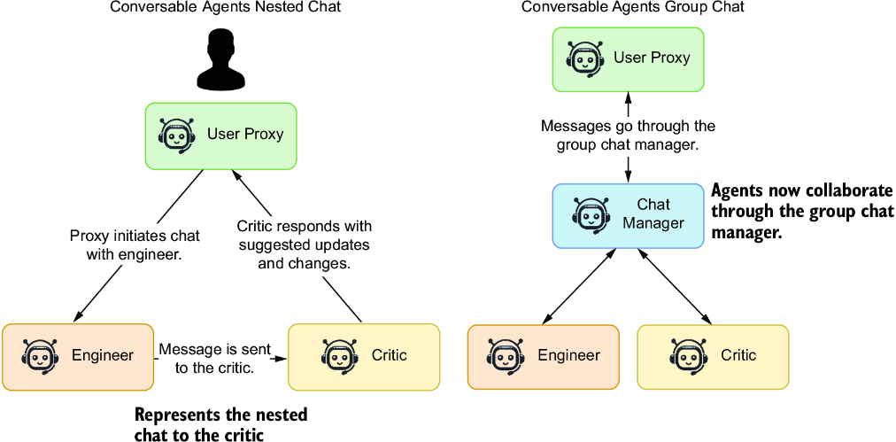

##### Figure 4.9 The difference between nested and group chat for conversable agents

Open `autogen_coding_group.py` with relevant parts, as shown in listing 4.10. The code is similar to the previous exercise but now introduces `GroupChat` and `GroupChatManager`. The agents and messages are held with the group chat, similar to a messaging channel in applications such as Slack or Discord. The chat manager coordinates the message responses to reduce conversation overlap.

##### Listing 4.10 `autoget_coding_group.py` (relevant sections)

```
user_proxy = UserProxyAgent(
    "user",
    code_execution_config={
        "work_dir": "working",
        "use_docker": False,
        "last_n_messages": 3,
    },
    human_input_mode="NEVER",     #1
)

llm_config = {"config_list": config_list}

engineer = AssistantAgent(…      #2


critic = AssistantAgent(…       #2


groupchat = GroupChat(agents=[user_proxy, 
                              engineer, 
                              critic], 
                              messages=[], 
                              max_round=20)      #3
manager = GroupChatManager(groupchat=groupchat, 
                           llm_config=llm_config)     #4

task = """Write a snake game using Pygame."""

with Cache.disk(cache_seed=43) as cache:
    res = user_proxy.initiate_chat(
        recipient=manager,
        message=task,
        cache=cache,
    )
```

#1 Human input is now set to never, so no human feedback.  
#2 Code omitted, but consult changes to the persona in the file  
#3 This object holds the connection to all the agents and stores the messages.  
#4 The manager coordinates the conversation as a moderator would.

Run this exercise, and you’ll see how the agents collaborate. The engineer will now take feedback from the critic and undertake operations to address the critic’s suggestions. This also allows the proxy to engage in all of the conversation.

Group conversations are an excellent way to strengthen your agents’ abilities as they collaborate on tasks. However, they are also substantially more verbose and token expensive. Of course, as LLMs mature, so do the size of their context token windows and the price of token processing. As token windows increase, concerns over token consumption may eventually go away.

AutoGen is a powerful multi-agent platform that can be experienced using a web interface or code. Whatever your preference, this agent collaboration tool is an excellent platform for building code or other complex tasks. Of course, it isn’t the only platform, as you’ll see in the next section, where we explore a newcomer called CrewAI.

## 4.4 Building an agent crew with CrewAI

CrewAI is relatively new to the realm of multi-agent systems. Where AutoGen was initially developed from research and then extended, CrewAI is built with enterprise systems in mind. As such, the platform is more robust, making it less extensible in some areas.

With CrewAI, you build a crew of agents to focus on specific areas of a task goal. Unlike AutoGen, CrewAI doesn’t require the use of the user proxy agent but instead assumes the agents only work among themselves.

Figure 4.10 shows the main elements of the CrewAI platform, how they connect together, and their primary function. It shows a sequential-processing agent system with generic researcher and writer agents. Agents are assigned tasks that may also include tools or memory to assist them.

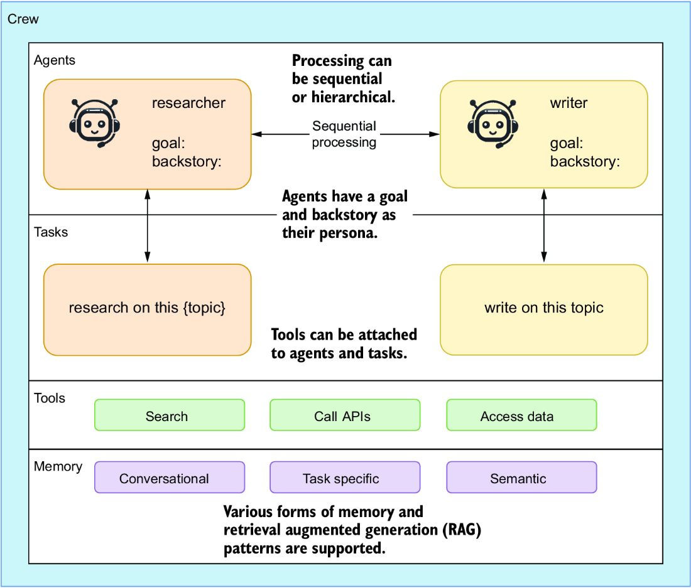

##### Figure 4.10 The composition of a CrewAI system

CrewAI supports two primary forms of processing: sequential and hierarchical. Figure 4.10 shows the sequential process by iterating across the given agents and their associated tasks. In the next section, we dig into some code to set up a crew and employ it to complete a goal and create a good joke.

### 4.4.1 Creating a jokester crew of CrewAI agents

CrewAI requires more setup than AutoGen, but this also allows for more control and additional guides, which provide more specific context to guide the agents in completing the given task. This isn’t without problems, but it does offer more control than AutoGen out of the box.

Open `crewai_introduction.py` in VS Code and look at the top section, as shown in listing 4.11. Many settings are required to configure an agent, including the role, goal, verboseness, memory, backstory, delegation, and even tools (not shown). In this example, we’re using two agents: a senior joke researcher and a joke writer.

##### Listing 4.11 `crewai_introduction.py` (agent section)

```
from crewai import Agent, Crew, Process, Task
from dotenv import load_dotenv

load_dotenv()

joke_researcher = Agent(      #1
    role="Senior Joke Researcher",
    goal="Research what makes things funny about the following {topic}",
    verbose=True,      #2
    memory=True,      #3
    backstory=(      #4
        "Driven by slapstick humor, you are a seasoned joke researcher"
        "who knows what makes people laugh. You have a knack for finding"
        "the funny in everyday situations and can turn a dull moment into"
        "a laugh riot."
    ),
    allow_delegation=True,     #5
)

joke_writer = Agent(     #6
    role="Joke Writer",
    goal="Write a humourous and funny joke on the following {topic}",
    verbose=True,     #7
    memory=True,      #8
    backstory=(     #9
        "You are a joke writer with a flair for humor. You can turn a"
        "simple idea into a laugh riot. You have a way with words and"
        "can make people laugh with just a few lines."
    ),
    allow_delegation=False,    #5
)
```

#1 Creates the agents and provides them a goal  
#2 verbose allows the agent to emit output to the terminal.  
#3 Supports the use of memory for the agents  
#4 The backstory is the agent’s background—its persona.  
#5 The agents can either be delegated to or are allowed to delegate; True means they can delegate.  
#6 Creates the agents and provides them a goal  
#7 verbose allows the agent to emit output to the terminal.  
#8 Supports the use of memory for the agents  
#9 The backstory is the agent’s background—its persona.

Moving down the code, we next see the tasks, as shown in listing 4.12. Tasks denote an agent’s process to complete the primary system goal. They also link an agent to work on a specific task, define the output from that task, and may include how it’s executed.

##### Listing 4.12 `crewai_introduction.py` (task section)

```
research_task = Task(         #1
    description=(
        "Identify what makes the following topic:{topic} so funny."
        "Be sure to include the key elements that make it humourous."
        "Also, provide an analysis of the current social trends,"
        "and how it impacts the perception of humor."
    ),
    expected_output="A comprehensive 3 paragraphs long report 
↪     on the latest jokes.",               #2
    agent=joke_researcher,      #3
)

write_task = Task(   #4
    description=(
        "Compose an insightful, humourous and socially aware joke on {topic}."
        "Be sure to include the key elements that make it funny and"
        "relevant to the current social trends."
    ),
    expected_output="A joke on {topic}.",   #5
    agent=joke_writer,        #3
    async_execution=False,          #6
    output_file="the_best_joke.md",      #7
)
```

#1 The Task description defines how the agent will complete the task.  
#2 Explicitly defines the expected output from performing the task  
#3 The agent assigned to work on the task  
#4 The Task description defines how the agent will complete the task.  
#5 Explicitly defines the expected output from performing the task  
#6 If the agent should execute asynchronously  
#7 Any output the agent will generate

Now, we can see how everything comes together as the `Crew` at the bottom of the file, as shown in listing 4.13. Again, many options can be set when building the `Crew`, including the agents, tasks, process type, memory, cache, maximum requests per minute (`max_rpm`), and whether the crew shares.

##### Listing 4.13 `crewai_introduction.py` (crew section)

```
crew = Crew(
    agents=[joke_researcher, joke_writer],    #1
    tasks=[research_task, write_task],     #2
    process=Process.sequential,      #3
    memory=True,      #4
    cache=True,     #5
    max_rpm=100,     #6
    share_crew=True,     #7
)

result = crew.kickoff(inputs={"topic": "AI engineer jokes"})
print(result)
```

#1 The agents assembled into the crew  
#2 The tasks the agents can work on  
#3 Defining how the agents will interact  
#4 Whether the system should use memory; needs to be set if agents/tasks have it on  
#5 Whether the system should use a cache, similar to AutoGen  
#6 Maximum requests per minute the system should limit itself to  
#7 Whether the crew should share information, similar to group chat

When you’re done reviewing, run the file in VS Code (F5), and watch the terminal for conversations and messages from the crew. As you can probably tell by now, the goal of this agent system is to craft jokes related to AI engineering. Here are some of the funnier jokes generated over a few runs of the agent system:

- Why was the computer cold? It left Windows open.
- Why don’t AI engineers play hide and seek with their algorithms? Because no matter where they hide, the algorithms always find them in the “overfitting” room!
- What is an AI engineer’s favorite song? “I just called to say I love yo… . and to collect more data for my voice recognition software.”
- Why was the AI engineer broke? Because he spent all his money on cookies, but his browser kept eating them.

Before you run more iterations of the joke crew, you should read the next section. This section shows how to add observability to the multi-agent system.

### 4.4.2 Observing agents working with AgentOps

Observing a complex assemblage such as a multi-agent system is critical to understanding the myriad of problems that can happen. Observability through application tracing is a key element of any complex system, especially one engaged in enterprise use.

CrewAI supports connecting to a specialized agent operations platform appropriately called AgentOps. This observability platform is generic and designed to support observability with any agent platform specific to LLM usage. Currently, no pricing or commercialization details are available.

Connecting to AgentOps is as simple as installing the package, getting an API key, and adding a line of code to your crew setup. This next exercise will go through the steps to connect and run AgentOps.

Listing 4.14 shows installing the `agentops` package using `pip`. You can install the package alone or as an additional component of the `crewai` package. Remember that AgentOps can also be connected to other agent platforms for observability.

##### Listing 4.14 Installing AgentOps

```
pip install agentops

or as an option with CrewAI

pip install crewai[agentops]
```

Before using AgentOps, you need to sign up for an API key. Following are the general steps to sign up for a key at the time of writing:

1. Visit [https://app.agentops.ai](https://app.agentops.ai) in your browser.
2. Sign up for an account.
3. Create a project, or use the default.
4. Go to Settings &gt; Projects and API Keys.
5. Copy and/or generate a new API key; this will copy the key to your browser.
6. Paste the key to your `.env` file in your project.

After the API key is copied, it should resemble the example shown in the following listing.

##### Listing 4.15 `env.`: Adding an AgentOps key

```
AGENTOPS_API_KEY="your API key"
```

Now, we need to add a few lines of code to the CrewAI script. Listing 4.16 shows the additions as they are added to the `crewai_agentops.py` file. When creating your own scripts, all you need to do is add the `agentops` package and initialize it when using CrewAI.

##### Listing 4.16 `crewai_agentops.py` (AgentOps additions)

```
import agentops      #1
from crewai import Agent, Crew, Process, Task
from dotenv import load_dotenv

load_dotenv()
agentops.init()     #2
```

#1 The addition of the required package  
#2 Make sure to initialize the package after the environment variables are loaded.

Run the `crewai_agentops.py` file in VS Code (F5), and watch the agents work as before. However, you can now go to the AgentOps dashboard and view the agent interactions at various levels.

Figure 4.11 shows the dashboard for running the joke crew to create the best joke. Several statistics include total duration, the run environment, prompt and completion tokens, LLM call timings, and estimated cost. Seeing the cost can be both sobering and indicative of how verbose agent conversations can become.

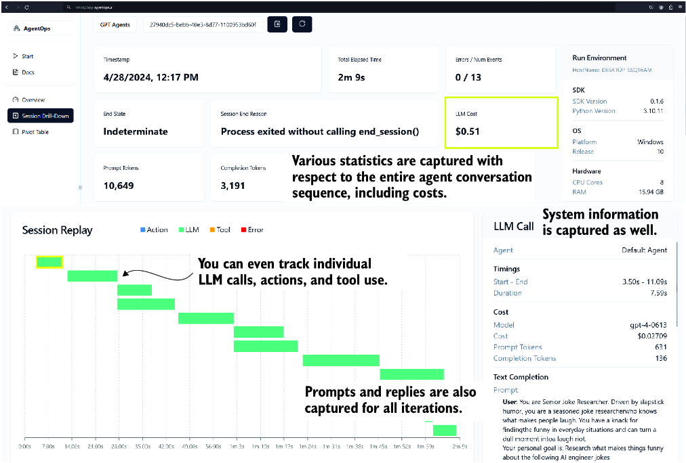

##### Figure 4.11 The AgentOps dashboard for running the joke crew

The AgentOps platform is an excellent addition to any agent platform. While it’s built into CrewAI, it’s helpful that the observability could be added to AutoGen or other frameworks. Another attractive thing about AgentOps is that it’s dedicated to observing agent interactions and not transforming from a machine learning operations platform. In the future, we’ll likely see the spawn of more agent observability patterns.

One benefit that can’t be overstated is the cost observation that an observability platform can provide. Did you notice in figure 4.11 that creating a single joke costs a little over 50 cents? Agents can be very powerful, but they can also become very costly, and it’s essential to observe what those costs are in terms of practicality and commercialization.

In the last section of this chapter, we’ll return to CrewAI and revisit building agents that can code games. This will provide an excellent comparison between the capabilities of AutoGen and CrewAI.

## 4.5 Revisiting coding agents with CrewAI

A great way to compare capabilities between multi-agent platforms is to implement similar tasks in a bot. In this next set of exercises, we’ll employ CrewAI as a game programming team. Of course, this could be adapted to other coding tasks as well.

Open `crewai_coding_crew.py` in VS Code, and we’ll first review the agent section in listing 4.17. Here, we’re creating a senior engineer, a QA engineer, and a chief QA engineer with a role, goal, and backstory.

##### Listing 4.17 `crewai_coding_crew.py` (agent section)

```
print("## Welcome to the Game Crew")      #1
print("-------------------------------")
game = input("What is the game you would like to build?
↪ What will be the mechanics?\n")


senior_engineer_agent = Agent(
    role="Senior Software Engineer",
    goal="Create software as needed",
    backstory=dedent(
        """
        You are a Senior Software Engineer at a leading tech think tank.
        Your expertise in programming in python. and do your best to
        produce perfect code
        """
    ),
    allow_delegation=False,
    verbose=True,
)

qa_engineer_agent = Agent(
    role="Software Quality Control Engineer",
    goal="create prefect code, by analizing the code 
↪ that is given for errors",
    backstory=dedent(
        """
        You are a software engineer that specializes in checking code
        for errors. You have an eye for detail and a knack for finding
        hidden bugs.
        You check for missing imports, variable declarations, mismatched
        brackets and syntax errors.
        You also check for security vulnerabilities, and logic errors
        """
    ),
    allow_delegation=False,
    verbose=True,
)

chief_qa_engineer_agent = Agent(
    role="Chief Software Quality Control Engineer",
    goal="Ensure that the code does the job that it is supposed to do",
    backstory=dedent(
        """
        You are a Chief Software Quality Control Engineer at a leading
        tech think tank. You are responsible for ensuring that the code
        that is written does the job that it is supposed to do.
        You are responsible for checking the code for errors and ensuring
        that it is of the highest quality.
        """
    ),
    allow_delegation=True,     #2
    verbose=True,
)
```

#1 Allows the user to input the instructions for their game  
#2 Only the chief QA engineer can delegate tasks.

Scrolling down in the file will display the agent tasks, as shown in listing 4.18. The task descriptions and expected output should be easy to follow. Again, each agent has a specific task to provide better context when working to complete the task.

##### Listing 4.18 `crewai_coding_crew.py` (task section)

```
code_task = Task(
    description=f"""
You will create a game using python, these are the instructions:
        Instructions
        ------------
        {game}             #1
        You will write the code for the game using python.""",
    expected_output="Your Final answer must be the 
↪ full python code, only the python code and nothing else.",
    agent=senior_engineer_agent,
)

qa_task = Task(
    description=f"""You are helping create a game 
↪ using python, these are the instructions:
        Instructions
        ------------
        {game}            #1
        Using the code you got, check for errors. Check for logic errors,
        syntax errors, missing imports, variable declarations, 
mismatched brackets,
        and security vulnerabilities.""",
    expected_output="Output a list of issues you found in the code.",
    agent=qa_engineer_agent,
)

evaluate_task = Task(
    description=f"""You are helping create a game 
↪ using python, these are the instructions:
        Instructions
        ------------
        {game}            #1
        You will look over the code to insure that it is complete and
        does the job that it is supposed to do. """,
    expected_output="Your Final answer must be the 
↪ corrected a full python code, only the python code and nothing else.",
    agent=chief_qa_engineer_agent,
)
```

#1 The game instructions are substituted into the prompt using Python formatting.

Finally, we can see how this comes together by going to the bottom of the file, as shown in listing 4.19. This crew configuration is much like what we’ve seen before. Each agent and task are added, as well as the verbose and process attributes. For this example, we’ll continue to use sequential methods.

##### Listing 4.19 `crewai_coding_crew.py` (crew section)

```
crew = Crew(
    agents=[senior_engineer_agent, 
            qa_engineer_agent, 
            chief_qa_engineer_agent],
    tasks=[code_task, qa_task, evaluate_task],
    verbose=2,  
    process=Process.sequential,      #1
)

# Get your crew to work!
result = crew.kickoff()    #2

print("######################")
print(result)
```

#1 Process is sequential.  
#2 No additional context is provided in the kickoff.

When you run the VS Code (F5) file, you’ll be prompted to enter the instructions for writing a game. Enter some instructions, perhaps the snake game or another game you choose. Then, let the agents work, and observe what they produce.

With the addition of the chief QA engineer, the results will generally look better than what was produced with AutoGen, at least out of the box. If you review the code, you’ll see that it generally follows good patterns and, in some cases, may even include tests and unit tests.

Before we finish the chapter, we’ll make one last change to the crew’s processing pattern. Previously, we employed sequential processing, as shown in figure 4.10. Figure 4.12 shows what hierarchical processing looks like in CrewAI.

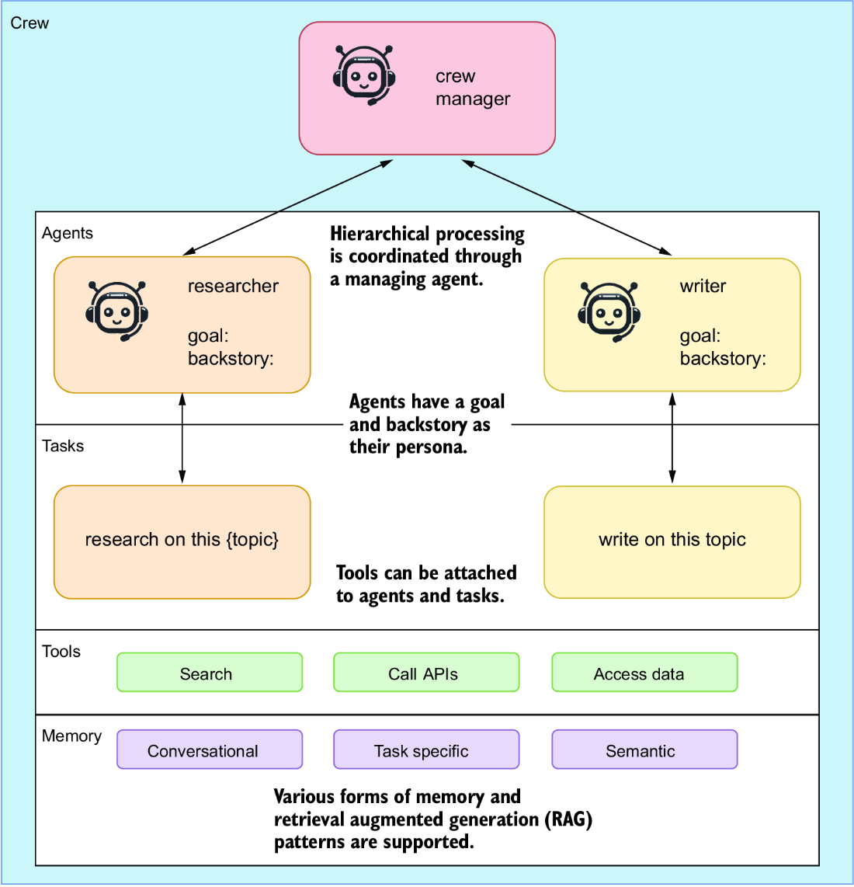

##### Figure 4.12 Hierarchical processing of agents coordinated through a crew manager

Adding this manager is a relatively simple process. Listing 4.20 shows the additional code changes to a new file that uses the coding crew in a hierarchical method. Aside from importing a class for connecting to OpenAI from LangChain, the other addition is adding this class as the crew manger, `manager_llm`.

##### Listing 4.20 `crewai_hierarchy.py` (crew manager sections)

```
from langchain_openai import ChatOpenAI      #1

crew = Crew(
    agents=[senior_engineer_agent, 
            qa_engineer_agent, 
            chief_qa_engineer_agent],
    tasks=[code_task, qa_task, evaluate_task],
    verbose=2,  
    process=Process.hierarchical,     #2
    manager_llm=ChatOpenAI(               #3
        temperature=0, model="gpt-4"      #3
    ),    #4
)         #4
```

#1 Imports the LLM connector from LangChain  
#2 You must set a crew manager when selecting hierarchical processing.  
#3 Sets the crew manager to be the LLM connector  
#4 You must set a crew manager when selecting hierarchical processing.

Run this file in VS Code (F5). When prompted, enter a game you want to create. Try using the same game you tried with AutoGen; the snake game is also a good baseline example. Observe the agents work through the code and review it repeatedly for problems.

After you run the file, you can also jump on AgentOps to review the cost of this run. Chances are, it will cost over double what it would have without the agent manager. The output will also likely not be significantly better. This is the trap of building agent systems without understanding how quickly things can spiral.

An example of this spiral that often happens when agents continually iterate over the same actions is frequently repeating tasks. You can view this problem in AgentOps, as shown in figure 4.13, by viewing the Repeat Thoughts plot.

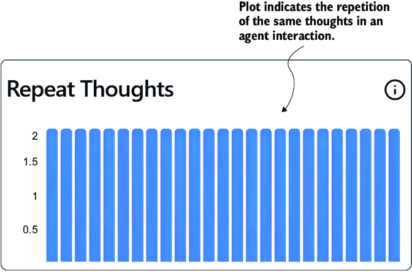

##### Figure 4.13 The repetition of thoughts as they occurred within an agent run

The Repeat Thoughts plot from AgentOps is an excellent way to measure the repetition your agent system encounters. Overly repetitive thought patterns typically mean the agent isn’t being decisive enough and instead keeps trying to generate a different answer. If you encounter this problem, you want to change the agents’ processing patterns, tasks, and goals. You may even want to alter the system’s type and number of agents.

Multi-agent systems are an excellent way to break up work in terms of work patterns of jobs and tasks. Generally, the job role is allocated to an agent role/persona, and the tasks it needs to complete may be implicit, as in AutoGen, or more explicit, as in CrewAI.

In this chapter, we covered many useful tools and platforms that you can use right away to improve your work, life, and more. That completes our journey through multi-agent platforms, but it doesn’t conclude our exploration and use of multiple agents, as we’ll discover in later chapters.

## 4.6 Exercises

Use the following exercises to improve your knowledge of the material:

- *Exercise 1* —Basic Agent Communication with AutoGen

*Objective* —Familiarize yourself with basic agent communications and setup in AutoGen.

*Tasks*:

- - Set up AutoGen Studio on your local machine, following the instructions provided in this chapter.
  - Create a simple multi-agent system with a user proxy and two assistant agents.
  - Implement a basic task where the user proxy coordinates between the assistant agents to generate a simple text output, such as summarizing a short paragraph.
- *Exercise 2* —Implementing Advanced Agent Skills in AutoGen Studio

*Objective* —Enhance agent capabilities by adding advanced skills.

*Tasks*:

- - Develop and integrate a new skill into an AutoGen agent that allows it to fetch and display real-time data from a public API (e.g., weather information or stock prices).
  - Ensure the agent can ask for user preferences (e.g., city for weather, type of stocks) and display the fetched data accordingly.
- *Exercise 3* —Role-Based Task Management with CrewAI

*Objective* —Explore role-based task management in CrewAI.

*Tasks*:

- - Design a CrewAI setup where multiple agents are assigned specific roles (e.g., data fetcher, analyzer, presenter).
  - Configure a task sequence where the data fetcher collects data, the analyzer processes the data, and the presenter generates a report.
  - Execute the sequence and observe the flow of information and task delegation among agents.
- *Exercise 4* —Multi-Agent Collaboration in Group Chat Using AutoGen

*Objective* —Understand and implement a group chat system in AutoGen to facilitate agent collaboration.

*Tasks*:

- - Set up a scenario where multiple agents need to collaborate to solve a complex problem (e.g., planning an itinerary for a business trip).
  - Use the group chat feature to allow agents to share information, ask questions, and provide updates to each other.
  - Monitor the agents’ interactions and effectiveness in collaborative problem solving.
- *Exercise 5* —Adding and Testing Observability with AgentOps in CrewAI

*Objective* —Implement and evaluate the observability of agents using AgentOps in a CrewAI environment.

*Tasks*:

- - Integrate AgentOps into a CrewAI multi-agent system.
  - Design a task for the agents that involves significant computation or data processing (e.g., analyzing customer reviews to determine sentiment trends).
  - Use AgentOps to monitor the performance, cost, and output accuracy of the agents. Identify any potential inefficiencies or errors in agent interactions.

## Summary

- AutoGen, developed by Microsoft, is a conversational multi-agent platform that employs a variety of agent types, such as user proxies and assistant agents, to facilitate task execution through natural language interactions.
- AutoGen Studio acts as a development environment that allows users to create, test, and manage multi-agent systems, enhancing the usability of AutoGen.
- AutoGen supports multiple communication patterns, including group chats and hierarchical and proxy communications. Proxy communication involves a primary agent (proxy) that interfaces between the user and other agents to streamline task completion.
- CrewAI offers a structured approach to building multi-agent systems with a focus on enterprise applications. It emphasizes role-based and autonomous agent functionalities, allowing for flexible, sequential, or hierarchical task management.
- Practical exercises in the chapter illustrate how to set up and use AutoGen Studio, including installing necessary components and running basic multi-agent systems.
- Agents in AutoGen can be equipped with specific skills to perform tasks such as code generation, image analysis, and data retrieval, thereby broadening their application scope.
- CrewAI is distinguished by its ability to structure agent interactions more rigidly than AutoGen, which can be advantageous in settings that require precise and controlled agent behavior.
- CrewAI supports integrating memory and tools for agents to consume through task completion.
- CrewAI supports integration with observability tools such as AgentOps, which provides insights into agent performance, interaction efficiency, and cost management.
- AgentOps is an agent observability platform that can help you easily monitor extensive agent interactions.
