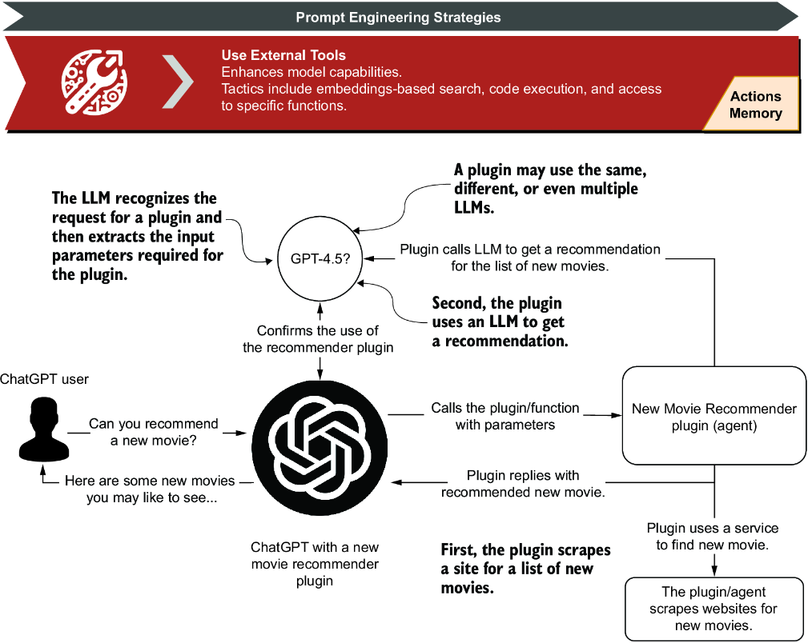
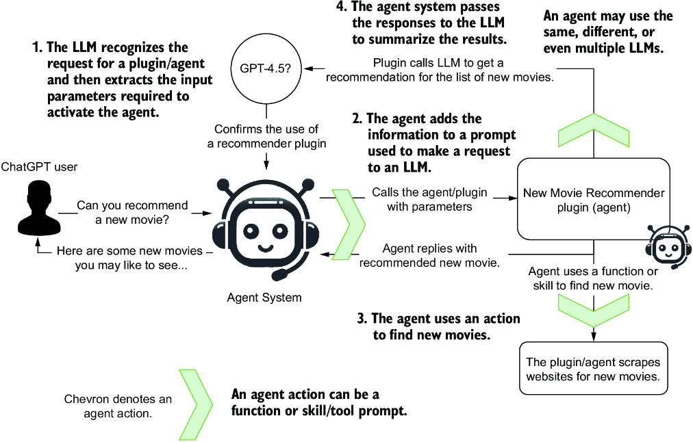
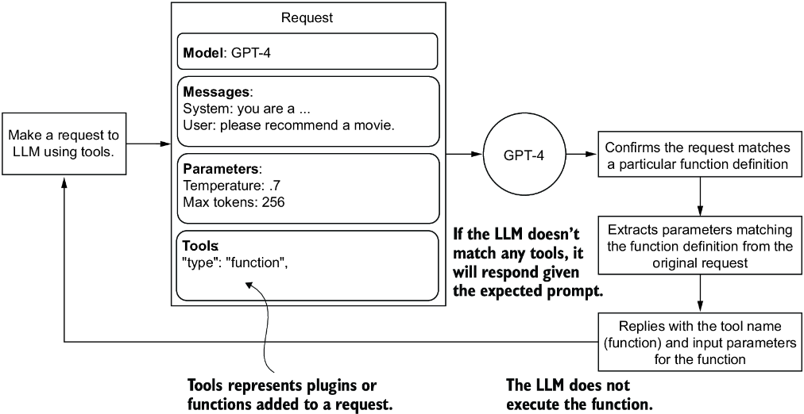
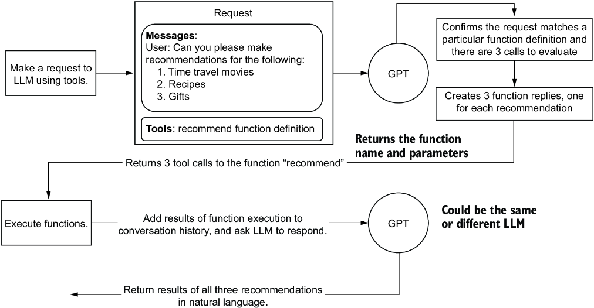
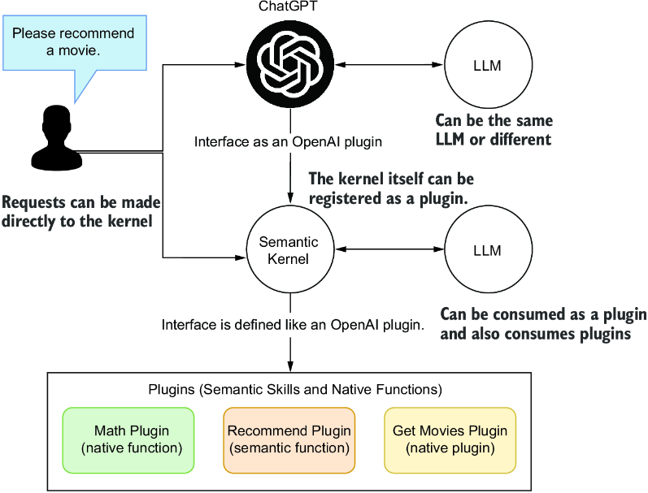
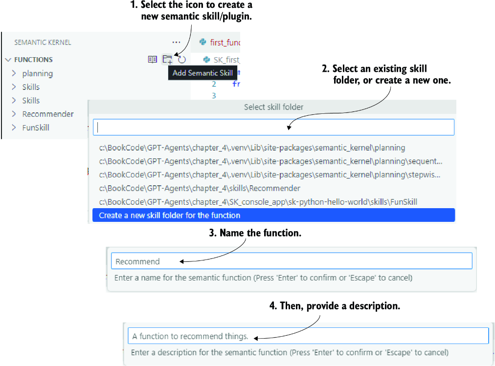
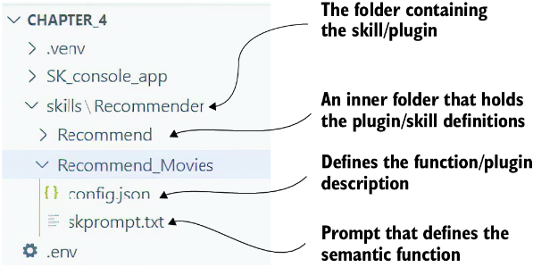
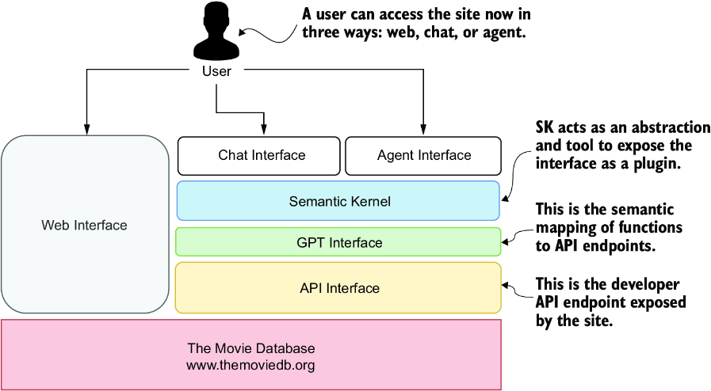
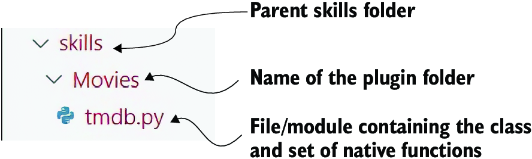

# 5 Empowering agents with actions

### This chapter covers

- How an agent acts outside of itself using actions
- Defining and using OpenAI functions
- The Semantic Kernel and how to use semantic functions
- Synergizing semantic and native functions
- Instantiating a GPT interface with Semantic Kernel

In this chapter, we explore actions through the use of functions and how agents can use them as well. We’ll start by looking at OpenAI function calling and then quickly move on to another project from Microsoft called Semantic Kernel (SK), which we’ll use to build and manage skills and functions for agents or as agents.

We’ll finish the chapter using SK to host our first agent system. This will be a complete chapter with plenty of annotated code examples.

## 5.1 Defining agent actions

ChatGPT plugins were first introduced to provide a session with abilities, skills, or tools. With a plugin, you can search the web or create spreadsheets or graphs. Plugins provide ChatGPT with the means to extend the platform.

Figure 5.1 shows how a ChatGPT plugin works. In this example, a new movie recommender plugin has been installed in ChatGPT. When a user asks ChatGPT to recommend a new movie, the large language model (LLM) recognizes that it has a plugin to manage that action. It then breaks down the user request into actionable parameters, which it passes to the new movie recommender.



##### Figure 5.1 How a ChatGPT plugin operates and how plugins and other external tools (e.g., APIs) align with the Use External Tools prompt engineering strategy

The recommender then scrapes a website showcasing new movies and appends that information to a new prompt request to an LLM. With this information, the LLM responds to the recommender, which passes this back to ChatGPT. ChatGPT then responds to the user with the recommended request.

We can think of plugins as proxies for actions. A plugin generally encapsulates one or more abilities, such as calling an API or scraping a website. Actions, therefore, are extensions of plugins—they give a plugin its abilities.

AI agents can be considered plugins and consumers of plugins, tools, skills, and other agents. Adding skills, functions, and tools to an agent/plugin allows it to execute well-defined actions—figure 5.2 highlights where agent actions occur and their interaction with LLMs and other systems.



##### Figure 5.2 How an agent uses actions to perform external tasks

An agent action is an ability that allows it to use a function, skill, or tool. What gets confusing is that different frameworks use different terminology. We’ll define an action as anything an agent can do to establish some basic definitions.

ChatGPT plugins and functions represent an actionable ability that ChatGPT or an agent system can use to perform additional actions. Now let’s examine the basis for OpenAI plugins and the function definition.

## 5.2 Executing OpenAI functions

OpenAI, with the enablement of plugins, introduced a structure specification for defining the interface between functions/plugins an LLM could action. This specification is becoming a standard that LLM systems can follow to provide actionable systems.

These same function definitions are now also being used to define plugins for ChatGPT and other systems. Next, we’ll explore how to use functions directly with an LLM call.

### 5.2.1 Adding functions to LLM API calls

Figure 5.3 demonstrates how an LLM recognizes and uses the function definition to cast its response as the function call.



##### Figure 5.3 How a single LLM request, including tools, gets interpreted by an LLM

Listing 5.1 shows the details of an LLM API call using tools and a function definition. Adding a function definition allows the LLM to reply regarding the function’s input parameters. This means the LLM will identify the correct function and parse the relevant parameters for the user’s request.

##### Listing 5.1 `first_function.py` (API call)

```
response = client.chat.completions.create(
        model="gpt-4-1106-preview",
        messages=[{"role": "system",
                   "content": "You are a helpful assistant."},
                  {"role": "user", "content": user_message}],
        temperature=0.7,
        tools=[     #1
            {
                "type": "function",     #2
                "function": {
                    "name": "recommend",
                    "description": "Provide a … topic.",     #3
                    "parameters": {
                        "type": "object",     #4
                        "properties": {
                            "topic": {
                                "type": "string",
                                "description": 
                                   "The topic,… for.",     #5
                            },
                            "rating": {
                                "type": "string",
                                "description": 
                          "The rating … given.",    #5
                                "enum": ["good",
                                         "bad", 
                                         "terrible"]     #6
                                },
                        },
                        "required": ["topic"],
                    },
                },
                }
            ]
        )
```

#1 New parameter called tools  
#2 Sets the type of tool to function  
#3 Provides an excellent description of what the function does  
#4 Defines the type of parameters for input; an object represents a JSON document.  
#5 Excellent descriptions for each input parameter  
#6 You can even describe in terms of enumerations.

To see how this works, open Visual Studio Code (VS Code) to the book’s source code folder: `chapter_4/first_function.py`. It’s a good practice to open the relevant chapter folder in VS Code to create a new Python environment and install the `requirements.txt` file. If you need assistance with this, consult appendix B.

Before starting, correctly set up an `.env` file in the `chapter_4` folder with your API credentials. Function calling is an extra capability provided by the LLM commercial service. At the time of writing, this feature wasn’t an option for open source LLM deployments.

Next, we’ll look at the bottom of the code in `first_function.py,` as shown in listing 5.2. Here are just two examples of calls made to an LLM using the request previously specified in listing 5.1. Here, each request shows the generated output from running the example.

##### Listing 5.2 `first_function.py` (exercising the API)

```
user = "Can you please recommend me a time travel movie?"
response = ask_chatgpt(user)     #1
print(response)

###Output
Function(arguments='{"topic":"time travel movie"}', 
                      name='recommend')     #2

user = "Can you please recommend me a good time travel movie?"
response = ask_chatgpt(user)     #3
print(response)

###Output
Function(arguments='{"topic":"time travel movie",
                     "rating":"good"}',
 name='recommend')     #4
```

#1 Previously defined function  
#2 Returned in the name of the function to call and the extracted input parameters  
#3 Previously defined function  
#4 Returned in the name of the function to call and the extracted input parameters

Run the `first_function.py` Python script in VS Code using the debugger (F5) or the terminal to see the same results. Here, the LLM parses the input request to match any registered tools. In this case, the tool is the single function definition, that is, the recommended function. The LLM extracts the input parameters from this function and parses those from the request. Then, it replies with the named function and designated input parameters.

NOTE  The actual function isn’t being called. The LLM only returns the suggested function and the relevant input parameters. The name and parameters must be extracted and passed into a function matching the signature to act on the function. We’ll look at an example of this in the next section.

### 5.2.2 Actioning function calls

Now that we understand that an LLM doesn’t execute the function or plugin directly, we can look at an example that executes the tools. Keeping with the recommender theme, we’ll look at another example that adds a Python function for simple recommendations.

Figure 5.4 shows how this simple example will work. We’ll submit a single request that includes a tool function definition, asking for three recommendations. The LLM, in turn, will reply with the three function calls with input parameters (time travel, recipe, and gift). The results from executing the functions are then passed back to the LLM, which converts them back to natural language and returns a reply.



##### Figure 5.4 A sample request returns three tool function calls and then submits the results back to the LLM to return a natural language response.

Now that we understand the example, open `parallel_functions.py` in VS Code. Listing 5.3 shows the Python function that you want to call to give recommendations.

##### Listing 5.3 `parallel_functions.py` (recommend function)

```
def recommend(topic, rating="good"):
    if "time travel" in topic.lower():     #1
        return json.dumps({"topic": "time travel",
                           "recommendation": "Back to the Future",
                           "rating": rating})
    elif "recipe" in topic.lower():    #1
        return json.dumps({"topic": "recipe",
                           "recommendation": "The best thing … ate.",
                           "rating": rating})
    elif "gift" in topic.lower():      #1
        return json.dumps({"topic": "gift",
                           "recommendation": "A glorious new...",
                           "rating": rating})
    else:     #2
        return json.dumps({"topic": topic,
                           "recommendation": "unknown"})     #3
```

#1 Checks to see if the string is contained within the topic input  
#2 If no topic is detected, returns the default  
#3 Returns a JSON object

Next, we’ll look at the function called `run_conversation`, where all the work starts with the request construction.

##### Listing 5.4 `parallel_functions.py` (`run_conversation`, `request`)

```
user = """Can you please make recommendations for the following:
1. Time travel movies
2. Recipes
3. Gifts"""     #1
messages = [{"role": "user", "content": user}]     #2
tools = [     #3
    {
        "type": "function",
        "function": {
            "name": "recommend",
            "description": 
                "Provide a recommendation for any topic.",
            "parameters": {
                "type": "object",
                "properties": {
                    "topic": {
                        "type": "string",
                        "description": 
                              "The topic, … recommendation for.",
                        },
                        "rating": {
                            "type": "string",
                            "description": "The rating … was given.",
                            "enum": ["good", "bad", "terrible"]
                            },
                        },
                "required": ["topic"],
                },
            },
        }
    ]
```

#1 The user message asks for three recommendations.  
#2 Note that there is no system message.  
#3 Adds the function definition to the tools part of the request

Listing 5.5 shows the request being made, which we’ve covered before, but there are a few things to note. This call uses a lower model such as GPT-3.5 because delegating functions is a more straightforward task and can be done using older, cheaper, less sophisticated language models.

##### Listing 5.5 `parallel_functions.py` (`run_conversation`, API call)

```
response = client.chat.completions.create(
    model="gpt-3.5-turbo-1106",     #1
    messages=messages,     #2
    tools=tools,     #2
    tool_choice="auto",   #3
)
response_message = response.choices[0].message     #4
```

#1 LLMs that delegate to functions can be simpler models.  
#2 Adds the messages and tools definitions  
#3 auto is the default.  
#4 The returned message from the LLM

At this point, after the API call, the response should hold the information for the required function calls. Remember, we asked the LLM to provide us with three recommendations, which means it should also provide us with three function call outputs, as shown in the following listing.

##### Listing 5.6 `parallel_functions.py` (`run_conversation`, `tool_calls`)

```
tool_calls = response_message.tool_calls     #1
if tool_calls:    #1
    available_functions = {
        "recommend": recommend,
    }     #2
    # Step 4: send the info for each function call and function response to 
the model
    for tool_call in tool_calls:     #3
        function_name = tool_call.function.name
        function_to_call = available_functions[function_name]
        function_args = json.loads(tool_call.function.arguments)
        function_response = function_to_call(
            topic=function_args.get("topic"),     #4
            rating=function_args.get("rating"),
        )
        messages.append(     #5
            {
                "tool_call_id": tool_call.id,
                "role": "tool",
                "name": function_name,
                "content": function_response,
            }
        )  # extend conversation with function response
    second_response = client.chat.completions.create(     #6
        model="gpt-3.5-turbo-1106",
        messages=messages,
    )
    return second_response.choices[0].message.content  #6
```

#1 If the response contains tool calls, execute them.  
#2 Only one function but could contain several  
#3 Loops through the calls and replays the content back to the LLM  
#4 Executes the recommend function from extracted parameters  
#5 Appends the results of each function call to the set of messages  
#6 Sends another request to the LLM with updated information and returns the message reply

The tool call outputs and the calls to the recommender function results are appended to the messages. Notice how messages now also contain the history of the first call. This is then passed back to the LLM to construct a reply in natural language.

Debug this example in VS Code by pressing the F5 key with the file open. The following listing shows the output of running `parallel_functions.py`.

##### Listing 5.7 `parallel_functions.py` (output)

```
Here are some recommendations for you:

1. Time travel movies: "Back to the Future"
2. Recipes: "The best thing you ever ate."
3. Gifts: "A glorious new..." (the recommendation was cut off, so I 
couldn't provide the full recommendation)

I hope you find these recommendations helpful! Let me know if you need 
more information.
```

This completes this simple demonstration. For more advanced applications, the functions could do any number of things, from scraping websites to calling search engines to completing far more complex tasks.

Functions are an excellent way to cast outputs for a particular task. However, the work of handling functions or tools and making secondary calls can be done in a cleaner and more efficient way. The following section will uncover a more robust system of adding actions to agents.

## 5.3 Introducing Semantic Kernel

Semantic Kernel (SK) is another open source project from Microsoft intended to help build AI applications, which we call agents. At its core, the project is best used to define actions, or what the platform calls *semantic plugins*, which are wrappers for skills and functions.

Figure 5.5 shows how the SK can be used as a plugin and a consumer of OpenAI plugins. The SK relies on the OpenAI plugin definition to define a plugin. That way, it can consume and publish itself or other plugins to other systems.



##### Figure 5.5 How the Semantic Kernel integrates as a plugin and can also consume plugins

An OpenAI plugin definition maps precisely to the function definitions in listing 5.4. This means that SK is the orchestrator of API tool calls, aka plugins. That also means that SK can help organize multiple plugins with a chat interface or an agent.

Note  The team at SK originally labeled the functional modules as *skills.* However, to be more consistent with OpenAI, they have since renamed *skills* to *plugins.* What is more confusing is that the code still uses the term *skills.* Therefore, throughout this chapter, we’ll use *skills* and *plugins* to mean the same thing.

SK is a useful tool for managing multiple plugins (actions for agents) and, as we’ll see later, can also assist with memory and planning tools. For this chapter, we’ll focus on the actions/plugins. In the next section, we look at how to get started using SK.

### 5.3.1 Getting started with SK semantic functions

SK is easy to install and works within Python, Java, and C#. This is excellent news as it also allows plugins developed in one language to be consumed in a different language. However, you can’t yet develop a native function in one language and use it in another.

We’ll continue from where we left off for the Python environment using the `chapter_4` workspace in VS Code. Be sure you have a workspace configured if you want to explore and run any examples.

Listing 5.8 shows how to install SK from a terminal within VS Code. You can also install the SK extension for VS Code. The extension can be a helpful tool to create plugins/skills, but it isn’t required.

##### Listing 5.8 Installing Semantic Kernel

```
pip uninstall semantic-kernel     #1

git clone https://github.com/microsoft/semantic-kernel.git     #2

cd semantic-kernel/python     #3

pip install -e .     #4
```

#1 Uninstalls any previous installations of SK  
#2 Clones the repository to a local folder  
#3 Changes to the source folder  
#4 Installs the editable package from the source folder

Once you finish the installation, open `SK_connecting.py` in VS Code. Listing 5.9 shows a demo of running an example quickly through SK. The example creates a chat completion service using either OpenAI or Azure OpenAI.

##### Listing 5.9 `SK_connecting.py`

```
import semantic_kernel as sk

selected_service = "OpenAI"     #1
kernel = sk.Kernel()     #2

service_id = None
if selected_service == "OpenAI":
    from semantic_kernel.connectors.ai.open_ai import OpenAIChatCompletion

    api_key, org_id = sk.openai_settings_from_dot_env()     #3
    service_id = "oai_chat_gpt"
    kernel.add_service(
        OpenAIChatCompletion(
            service_id=service_id,
            ai_model_id="gpt-3.5-turbo-1106",
            api_key=api_key,
            org_id=org_id,
        ),
    )
elif selected_service == "AzureOpenAI":
    from semantic_kernel.connectors.ai.open_ai import AzureChatCompletion

    deployment, api_key, endpoint = 
↪ sk.azure_openai_settings_from_dot_env()   #4
    service_id = "aoai_chat_completion"
    kernel.add_service(
        AzureChatCompletion(
            service_id=service_id,
            deployment_name=deployment,
            endpoint=endpoint,
            api_key=api_key,
        ),
    )

#This function is currently broken
async def run_prompt():
    result = await kernel.invoke_prompt( 
              ↪ prompt="recommend a movie about 
↪ time travel")     #5
    print(result)

# Use asyncio.run to execute the async function
asyncio.run(run_prompt())     #6

###Output
One highly recommended time travel movie is "Back to the Future" (1985) 
directed by Robert Zemeckis. This classic film follows the adventures of 
teenager Marty McFly (Michael J. Fox)…
```

#1 Sets the service you’re using (OpenAI or Azure OpenAI)  
#2 Creates the kernel  
#3 Loads secrets from the .env file and sets them on the chat service  
#4 Loads secrets from the .env file and sets them on the chat service  
#5 Invokes the prompt  
#6 Calls the function asynchronously

Run the example by pressing F5 (debugging), and you should see an output similar to listing 5.9. This example demonstrates how a semantic function can be created with SK and executed. A semantic function is the equivalent of a prompt template in prompt flow, another Microsoft tool. In this example, we define a simple prompt as a function.

It’s important to note that this semantic function isn’t defined as a plugin. However, the kernel can create the function as a self-contained semantic element that can be executed against an LLM. Semantic functions can be used alone or registered as plugins, as you’ll see later. Let’s jump to the next section, where we introduce contextual variables.

### 5.3.2 Semantic functions and context variables

Expanding on the previous example, we can look at adding contextual variables to the semantic function. This pattern of adding placeholders to prompt templates is one we’ll review over and over. In this example, we look at a prompt template that has placeholders for subject, genre, format, and custom.

Open `SK_context_variables.py` in VS Code, as shown in the next listing. The prompt is equivalent to setting aside a `system` and `user` section of the prompt.

##### Listing 5.10 `SK_context_variables.py`

```
#top section omitted…
prompt = """     #1
system:

You have vast knowledge of everything and can recommend anything provided 
you are given the following criteria, the subject, genre, format and any 
other custom information.

user:
Please recommend a {{$format}} with the subject {{$subject}} and {{$genre}}.
Include the following custom information: {{$custom}}
"""

prompt_template_config = sk.PromptTemplateConfig(     #2
    template=prompt,
    name="tldr",
    template_format="semantic-kernel",
    input_variables=[
        InputVariable(
            name="format", 
            description="The format to recommend", 
            is_required=True
        ),
        InputVariable(
            name="suject", 
            description="The subject to recommend", 
            is_required=True
        ),
        InputVariable(
            name="genre", 
            description="The genre to recommend", 
            is_required=True
        ),
        InputVariable(
            name="custom",
            description="Any custom information [CA]
                       to enhance the recommendation",
            is_required=True,
        ),
    ],
    execution_settings=execution_settings,
)

recommend_function = kernel.create_function_from_prompt(     #3
    prompt_template_config=prompt_template_config,
    function_name="Recommend_Movies",
    plugin_name="Recommendation",
)

async def run_recommendation(     #4
    subject="time travel",
    format="movie", 
    genre="medieval", 
           custom="must be a comedy"
):
    recommendation = await kernel.invoke(
        recommend_function,
        sk.KernelArguments(subject=subject,
                      format=format, 
                      genre=genre, 
                      custom=custom),     #5
    )
    print(recommendation)


# Use asyncio.run to execute the async function
asyncio.run(run_recommendation())    #5

###Output
One movie that fits the criteria of being about time travel, set in a 
medieval period, and being a comedy is "The Visitors" (Les Visiteurs) 
from 1993. This French film, directed by Jean-Marie Poiré, follows a 
knight and his squire who are transported to the modern era by a 
wizard’s spell gone wrong.…
```

#1 Defines a prompt with placeholders  
#2 Configures a prompt template and input variable definitions  
#3 Creates a kernel function from the prompt  
#4 Creates an asynchronous function to wrap the function call  
#5 Sets the kernel function arguments

Go ahead and debug this example (F5), and wait for the output to be generated. That is the basis for setting up SK and creating and exercising semantic functions. In the next section, we move on to see how a semantic function can be registered as a skill/plugin.

## 5.4 Synergizing semantic and native functions

Semantic functions encapsulate a prompt/profile and execute through interaction with an LLM. Native functions are the encapsulation of code that may perform anything from scraping websites to searching the web. Both semantic and native functions can register as plugins/skills in the SK kernel.

A function, semantic or native, can be registered as a plugin and used the same way we registered the earlier function directly with our API calls. When a function is registered as a plugin, it becomes accessible to chat or agent interfaces, depending on the use case. The next section looks at how a semantic function is created and registered with the kernel.

### 5.4.1 Creating and registering a semantic skill/plugin

The VS Code extension for SK provides helpful tools for creating plugins/skills. In this section, we’ll use the SK extension to create a plugin/skill and then edit the components of that extension. After that, we’ll register and execute the plugin in the SK.

Figure 5.6 shows the process for creating a new skill within VS Code using the SK extension. (Refer to appendix B for directions if you need to install this extension.) You’ll then be given the option for the skill/plugin folder to place the function. Always group functions that are similar together. After creating a skill, enter the name and description of the function you want to develop. Be sure to describe the function as if the LLM were going to use it.



##### Figure 5.6 The process of creating a new skill/plugin

You can see the completed skills and functions by opening the `skills/plugin` folder and reviewing the files. We’ll follow the previously constructed example, so open the `skills/Recommender/Recommend_Movies` folder, as shown in figure 5.7. Inside this folder is a `config.json` file, the function description, and the semantic function/prompt in a file called `skprompt.txt`.



##### Figure 5.7 The file and folder structure of a semantic function skill/plugin

Listing 5.11 shows the contents of the semantic function definition, also known as the plugin definition. Note that the type is marked as `completion` and not of type `function` because this is a semantic function. We would define a native function as a type function.

##### Listing 5.11 `Recommend_Movies/config.json`

```
{
    "schema": 1,
    "type": "completion",     #1
    "description": "A function to recommend movies based on users list of 
previously seen movies.",
    "completion": {     #2
        "max_tokens": 256,
        "temperature": 0,
        "top_p": 0,
        "presence_penalty": 0,
        "frequency_penalty": 0
    },
    "input": {
        "parameters": [
            {
                "name": "input",     #3
                "description": "The users list of previously seen movies.",
                "defaultValue": ""
            }
        ]
    },
    "default_backends": []
}
```

#1 Semantic functions are functions of type completion.  
#2 We can also set the completion parameters for how the function is called.  
#3 Defines the parameters input into the semantic function

Next, we can look at the definition of the semantic function prompt, as shown in listing 5.12. The format is a little different, but what we see here matches the earlier examples using templating. This prompt recommends movies based on a list of movies the user has previously seen.

##### Listing 5.12 `Recommend_Movies/skprompt.txt`

```
You are a wise movie recommender and you have been asked to recommend a 
movie to a user.
You are provided a list of movies that the user has watched before.
You want to recommend a movie that the user has not watched before.
[INPUT]
{{$input}}
[END INPUT]
```

Now, we’ll dive into the code that loads the skill/plugin and executes it in a simple example. Open the `SK_first_skill.py` file in VS Code. The following listing shows an abridged version highlighting the new sections.

##### Listing 5.13 SK\_first\_skill.py (abridged listing)

```
kernel = sk.Kernel()

plugins_directory = "plugins"

recommender = kernel.import_plugin_from_prompt_directory(
    plugins_directory,
    "Recommender",
)     #1

recommend = recommender["Recommend_Movies"]

seen_movie_list = [     #2
    "Back to the Future",
    "The Terminator",
    "12 Monkeys",
    "Looper",
    "Groundhog Day",
    "Primer",
    "Donnie Darko",
    "Interstellar",
    "Time Bandits",
    "Doctor Strange",
]


async def run():
    result = await kernel.invoke(
        recommend,
        sk.KernelArguments(     #3
            settings=execution_settings, input=", ".join(seen_movie_list)
        ),
    )
    print(result)


asyncio.run(run())     #4

###Output
Based on the list of movies you've provided, it seems you have an 
interest in science fiction, time travel, and mind-bending narratives. 
Given that you've watched a mix of classics and modern films in this 
genre, I would recommend the following movie that you have not watched 
before:

"Edge of Tomorrow" (also known as "Live Die Repeat: Edge of Tomorrow")…
```

#1 Loads the prompt from the plugins folder  
#2 List of user’s previously seen movies  
#3 Input is set to joined list of seen movies.  
#4 Function is executed asynchronously.

The code loads the skill/plugin from the `skills` directory and the `plugin` folder. When a skill is loaded into the kernel and not just created, it becomes a registered plugin. That means it can be executed directly as is done here or through an LLM chat conversation via the plugin interface.

Run the code (F5), and you should see an output like listing 5.13. We now have a simple semantic function that can be hosted as a plugin. However, this function requires users to input a complete list of movies they have watched. We’ll look at a means to fix this by introducing native functions in the next section.

### 5.4.2 Applying native functions

As stated, native functions are code that can do anything. In the following example, we’ll introduce a native function to assist the semantic function we built earlier.

This native function will load a list of movies the user has previously seen, from a file. While this function introduces the concept of memory, we’ll defer that discussion until chapter 8. Consider this new native function as any code that could virtually do anything.

Native functions can be created and registered using the SK extension. For this example, we’ll create a native function directly in code to make the example easier to follow.

Open `SK_native_functions.py` in VS Code. We’ll start by looking at how the native function is defined. A native function is typically defined within a class, which simplifies managing and instantiating native functions.

##### Listing 5.14 `SK_native_functions.py` (`MySeenMovieDatabase`)

```
class MySeenMoviesDatabase:
    """
    Description: Manages the list of users seen movies.     #1
    """
    @kernel_function(     #2
        description="Loads a list of movies … user has already seen",
        name="LoadSeenMovies",
    )
    def load_seen_movies(self) -> str:     #3
        try:
            with open("seen_movies.txt", 'r') as file:     #4
                lines = [line.strip() for line in file.readlines()]
                comma_separated_string = ', '.join(lines)
            return comma_separated_string
        except Exception as e:
            print(f"Error reading file: {e}")
            return None
```

#1 Provides a description for the container class  
#2 Uses a decorator to provide function description and name  
#3 The actual function returns a list of movies in a comma-separated string.  
#4 Loads seen movies from the text file

With the native function defined, we can see how it’s used by scrolling down in the file, as shown in the following listing.

##### Listing 5.15 `SK_native_functions` (remaining code)

```
plugins_directory = "plugins"

recommender = kernel.import_plugin_from_prompt_directory(
    plugins_directory,
    "Recommender",
)     #1

recommend = recommender["Recommend_Movies"]

seen_movies_plugin = kernel.import_plugin_from_object(
    MySeenMoviesDatabase(), "SeenMoviesPlugin"
)     #2

load_seen_movies = seen_movies_plugin["LoadSeenMovies"]     #3

async def show_seen_movies():
    seen_movie_list = await load_seen_movies(kernel)
    return seen_movie_list

seen_movie_list = asyncio.run(show_seen_movies())     #4
print(seen_movie_list)

async def run():      #5
    result = await kernel.invoke(
        recommend,
        sk.KernelArguments(
                settings=execution_settings,
                input=seen_movie_list),
    )
    print(result)


asyncio.run(run())    #5

###Output
The Matrix, The Matrix Reloaded, The Matrix Revolutions, The Matrix 
Resurrections – output from print statement
Based on your interest in the "The Matrix" series, it seems you enjoy 
science fiction films with a strong philosophical undertone and action 
elements. Given that you've watched all
```

#1 Loads the semantic function as shown previously  
#2 Imports the skill into the kernel and registers the function as a plugin  
#3 Loads the native function  
#4 Executes the function and returns the list as a string  
#5 Wraps the plugin call in an asynchronous function and executes

One important aspect to note is how the native function was imported into the kernel. The act of importing to the kernel registers that function as a plugin/skill. This means the function can be used as a skill from the kernel through other conversations or interactions. We’ll see how to embed a native function within a semantic function in the next section.

### 5.4.3 Embedding native functions within semantic functions

There are plenty of powerful features within SK, but one beneficial feature is the ability to embed native or semantic functions within other semantic functions. The following listing shows how a native function can be embedded within a semantic function.

##### Listing 5.16 `SK_semantic_native_functions.py` (`skprompt`)

```
sk_prompt = """
You are a wise movie recommender and you have been asked to recommend a 
movie to a user.
You have a list of movies that the user has watched before.
You want to recommend a movie that 
the user has not watched before.     #1
Movie List: {{MySeenMoviesDatabase.LoadSeenMovies}}.     #2
"""
```

#1 The exact instruction text as previous  
#2 The native function is referenced and identified by class name and function name.

The next example, `SK_semantic_native_functions.py`, uses inline native and semantic functions. Open the file in VS Code, and the following listing shows the code to create, register, and execute the functions.

##### Listing 5.17 `SK_semantic_native_functions.py` (abridged)

```
prompt_template_config = sk.PromptTemplateConfig(
    template=sk_prompt,
    name="tldr",
    template_format="semantic-kernel",
    execution_settings=execution_settings,
)     #1

recommend_function = kernel.create_function_from_prompt(
    prompt_template_config=prompt_template_config,
    function_name="Recommend_Movies",
    plugin_name="Recommendation",
)     #2


async def run_recommendation():     #3
    recommendation = await kernel.invoke(
        recommend_function,
        sk.KernelArguments(),
    )
    print(recommendation)


# Use asyncio.run to execute the async function
asyncio.run(run_recommendation())
###Output
Based on the list provided, it seems the user is a fan of the Matrix 
franchise. Since they have watched all four existing Matrix movies, I 
would recommend a…
```

#1 Creates the prompt template config for the prompt  
#2 Creates an inline semantic function from the prompt  
#3 Executes the semantic function asynchronously

Run the code, and you should see an output like listing 5.17. One important aspect to note is that the native function is registered with the kernel, but the semantic function is not. This is important because function creation doesn’t register a function.

For this example to work correctly, the native function must be registered with the kernel, which uses the `import_plugin` function call—the first line in listing 5.17. However, the semantic function itself isn’t registered. An easy way to register the function is to make it a plugin and import it.

These simple exercises showcase ways to integrate plugins and skills into chat or agent interfaces. In the next section, we’ll look at a complete example demonstrating adding a plugin representing a service or GPT interface to a chat function.

## 5.5 Semantic Kernel as an interactive service agent

In chapter 1, we introduced the concept of the GPT interface—a new paradigm in connecting services and other components to LLMs via plugins and semantic layers. SK provides an excellent abstraction for converting any service to a GPT interface.

Figure 5.8 shows a GPT interface constructed around an API service called The Movie Database (TMDB; [www.themoviedb.org](http://www.themoviedb.org)). The TMDB site provides a free API that exposes information about movies and TV shows.



##### Figure 5.8 This layer architecture diagram shows the role of a GPT interface and the Semantic Kernel being exposed to chat or agent interfaces.

To follow along with the exercises in this section, you must register for a free account from TMDB and create an API key. Instructions for getting an API key can be found at the TMDB website ([www.themoviedb.org](http://www.themoviedb.org)) or by asking a GPT-4 turbo or a more recent LLM.

Over the next set of subsections, we’ll create a GPT interface using an SK set of native functions. Then, we’ll use the SK kernel to test the interface and, later in this chapter, implement it as plugins into a chat function. In the next section, we look at building a GPT interface against the TMDB API.

### 5.5.1 Building a semantic GPT interface

TMDB is an excellent service, but it provides no semantic services or services that can be plugged into ChatGPT or an agent. To do that, we must wrap the API calls that TMDB exposes in a semantic service layer.

A semantic service layer is a GPT interface that exposes functions through natural language. As discussed, to expose functions to ChatGPT or other interfaces such as agents, they must be defined as plugins. Fortunately, SK can create the plugins for us automatically, given that we write our semantic service layer correctly.

A native plugin or set of skills can act as a semantic layer. To create a native plugin, create a new plugin folder, and put a Python file holding a class containing the set of native functions inside that folder. The SK extension currently doesn’t do this well, so manually creating the module works best.

Figure 5.9 shows the structure of the new plugin called `Movies` and the semantic service layer called `tmdb.py`. For native functions, the parent folder’s name (`Movies`) is used in the import.



##### Figure 5.9 The folder and file structure of the TMDB plugin

Open the `tmdb.py` file in VS Code, and look at the top of the file, as shown in listing 5.18. This file contains a class called `TMDbService`, which exposes several functions that map to API endpoint calls. The idea is to map the various relevant API function calls in this semantic service layer. This will expose the functions as plugins for a chat or agent interface.

##### Listing 5.18 `tmdb.py` (top of file)

```
from semantic_kernel.functions import kernel_funct
import requests
import inspect


def print_function_call():     #1
    #omitted …


class TMDbService:     #2
    def __init__(self):
        # enter your TMDb API key here
        self.api_key = "your-TMDb-api-key"


    @kernel_function(     #2
        description="Gets the movie genre ID for a given genre name",
        name="get_movie_genre_id",
        input_description="The movie genre name of the genre_id to get",
        )
    def get_movie_genre_id(self, genre_name: str) -> str:     #3
        print_function_call()
        base_url = "https://api.themoviedb.org/3"
        endpoint = f"{base_url}/genre/movie/list↪
                     ↪ ?api_key={self.api_key}&language=en-US"

        response = requests.get(endpoint)     #4
        if response.status_code == 200:    #4
            genres = response.json()['genres']
            for genre in genres:
                if genre_name.lower() in genre['name'].lower():
                    return str(genre['id'])     #5
        return None
```

#1 Prints the calls to the functions for debugging  
#2 Top-level service and decorator used to describe the function (good descriptions are important)  
#3 Function wrapped in semantic wrapper; should return str  
#4 Calls the API endpoint, and, if good (code 200), checks for matching genre  
#5 Found the genre, returns the id

The bulk of the code for the `TMDbService` and the functions to call the TMDB endpoints was written with the help of GPT-4 Turbo. Then, each function was wrapped with the `sk_function` decorator to expose it semantically.

A few of the TMDB API calls have been mapped semantically. Listing 5.19 shows another example of a function exposed to the semantic service layer. This function pulls a current top 10 list of movies playing for a particular genre.

##### Listing 5.19 `tmdb.py` (`get_top_movies_by_genre`)

```
@kernel_function(     #1
        description="””
Gets a list of currently playing movies for a given genre””",
        name="get_top_movies_by_genre",
        input_description="The genre of the movies to get",
        )
    def get_top_movies_by_genre(self, genre: str) -> str:
        print_function_call()
        genre_id = self.get_movie_genre_id(genre)     #2
        if genre_id:
            base_url = "https://api.themoviedb.org/3
            playing_movies_endpoint = f"{base_url}/movie/now_playing?↪
↪ api_key={self.api_key}&language=en-US"
            response = requests.get(
                          playing_movies_endpoint)     #3
            if response.status_code != 200:
                return ""

            playing_movies = response.json()['results'
            for movie in playing_movies:     #4
                movie['genre_ids'] = [str(genre_id)  
                      ↪ for genre_id in movie['genre_ids']]
            filtered_movies = [movie for movie ↪
↪ in playing_movies if genre_id ↪
↪ in movie['genre_ids']][:10]     #5
            results = ", ".join([movie['title'] for movie in filtered_movies])
            return results
        else:
            return ""
```

#1 Decorates the function with descriptions  
#2 Finds the genre id for the given genre name  
#3 Gets a list of currently playing movies  
#4 Converts genre\_ids to strings  
#5 Checks to see if the genre id matches movie genres

Look through the various other API calls mapped semantically. As you can see, there is a well-defined pattern for converting API calls to a semantic service. Before we run the full service, we’ll test each of the functions in the next section.

### 5.5.2 Testing semantic services

In a real-world application, you’ll likely want to write a complete set of unit or integration tests for each semantic service function. We won’t do that here; instead, we’ll write a quick helper script to test the various functions.

Open `test_tmdb_service.py` in VS Code, and review the code, as shown in listing 5.20. You can comment and uncomment any functions to test them in isolation. Be sure to have only one function uncommented at a time.

##### Listing 5.20 `test_tmdb_service.py`

```
import semantic_kernel as sk
from plugins.Movies.tmdb import TMDbService

async def main():
    kernel = sk.Kernel()     #1

    tmdb_service = kernel.import_plugin_from_object ↪
↪ (TMDbService(), "TMDBService")     #2

    print(
        await tmdb_service["get_movie_genre_id"](
            kernel, sk.KernelArguments(
                            genre_name="action")     #3
        )
    )     #4
    print(
        await tmdb_service["get_tv_show_genre_id"](
            kernel, sk.KernelArguments(
                            genre_name="action")     #5
        )
    )     #6
    print(
        await tmdb_service["get_top_movies_by_genre"](
            kernel, sk.KernelArguments(
                            genre_name="action")     #7
        )
    )     #8
    print(
        await tmdb_service["get_top_tv_shows_by_genre"](
            kernel, sk.KernelArguments(
                            genre_name="action")    #7
        )
    )
    print(await tmdb_service["get_movie_genres"](
kernel, sk.KernelArguments()))                        #9
    print(await tmdb_service["get_tv_show_genres"](
kernel, sk.KernelArguments()))                       #9


# Run the main function
if __name__ == "__main__":
    import asyncio

    asyncio.run(main())     #10

###Output
Function name: get_top_tv_shows_by_genre     #11
Arguments:
  self = <skills.Movies.tmdb.TMDbService object at 0x00000159F52090C0>
  genre = action
Function name: get_tv_show_genre_id    #11
Arguments:
  self = <skills.Movies.tmdb.TMDbService object at 0x00000159F52090C0>
  genre_name = action
Arcane, One Piece, Rick and Morty, Avatar: The Last Airbender, Fullmetal 
Alchemist: Brotherhood, Demon Slayer: Kimetsu no Yaiba, Invincible, 
Attack on Titan, My Hero Academia, Fighting Spirit, The Owl House
```

#1 Instantiates the kernel  
#2 Imports the plugin service  
#3 Inputs parameter to functions, when needed  
#4 Executes and tests the various functions  
#5 Inputs parameter to functions, when needed  
#6 Executes and tests the various functions  
#7 Inputs parameter to functions, when needed  
#8 Executes and tests the various functions  
#9 Executes and tests the various functions  
#10 Executes main asynchronously  
#11 Calls print function details to notify when the function is being called

The real power of SK is shown in this test. Notice how the `TMDbService` class is imported as a plugin, but we don’t have to define any plugin configurations other than what we already did? By just writing one class that wrapped a few API functions, we’ve exposed part of the TMDB API semantically. Now, with the functions exposed, we can look at how they can be used as plugins for a chat interface in the next section.

### 5.5.3 Interactive chat with the semantic service layer

With the TMDB functions exposed semantically, we can move on to integrating them into a chat interface. This will allow us to converse naturally in this interface to get various information, such as current top movies.

Open `SK_service_chat.py` in VS Code. Scroll down to the start of the new section of code that creates the functions, as shown in listing 5.21. The functions created here are now exposed as plugins, except we filter out the chat function, which we don’t want to expose as a plugin. The chat function here allows the user to converse directly with the LLM and shouldn’t be a plugin.

##### Listing 5.21 `SK_service_chat.py` (function setup)

```
system_message = "You are a helpful AI assistant."

tmdb_service = kernel.import_plugin_from_object(
TMDbService(), "TMDBService")     #1

# extracted section of code
execution_settings = sk_oai.OpenAIChatPromptExecutionSettings(
        service_id=service_id,
        ai_model_id=model_id,
        max_tokens=2000,
        temperature=0.7,
        top_p=0.8,
        tool_choice="auto",
        tools=get_tool_call_object(
            kernel, {"exclude_plugin": ["ChatBot"]}),     #2
    )

prompt_config = sk.PromptTemplateConfig.from_completion_parameters(
    max_tokens=2000,
    temperature=0.7,
    top_p=0.8,
    function_call="auto",
    chat_system_prompt=system_message,
)     #3
prompt_template = OpenAIChatPromptTemplate(
    "{{$user_input}}", kernel.prompt_template_engine, prompt_config
)     #4

history = ChatHistory()

history.add_system_message("You recommend movies and TV Shows.")
history.add_user_message("Hi there, who are you?")
history.add_assistant_message(
    "I am Rudy, the recommender chat bot. I'm trying to figure out what 
people need."
)     #5

chat_function = kernel.create_function_from_prompt(
    prompt_template_config=prompt_template,
    plugin_name="ChatBot",
    function_name="Chat",
)     #6
```

#1 Imports the TMDbService as a plugin  
#2 Configures the execution settings and adds filtered tools  
#3 Configures the prompt configuration  
#4 Defines the input template and takes full strings as user input  
#5 Adds the chat history object and populates some history  
#6 Creates the chat function

Next, we can continue by scrolling in the same file to review the chat function, as shown in the following listing.

##### Listing 5.22 `SK_service_chat.py` (chat function)

```
async def chat() -> bool:
    try:
        user_input = input("User:> ")     #1
    except KeyboardInterrupt:
        print("\n\nExiting chat...")
        return False
    except EOFError:
        print("\n\nExiting chat...")
        return False

    if user_input == "exit":     #2
        print("\n\nExiting chat...")
        return False
    arguments = sk.KernelArguments(     #3
        user_input=user_input,
        history=("\n").join(
           [f"{msg.role}: {msg.content}" for msg in history]),
    )
    result = await chat_completion_with_tool_call(     #4
        kernel=kernel,
        arguments=arguments,
        chat_plugin_name="ChatBot",
        chat_function_name="Chat",
        chat_history=history,
    )
    print(f"AI Agent:> {result}")
    return True
```

#1 Input is taken directly from the terminal/console.  
#2 If the user types exit, then exit the chat.  
#3 Creates arguments to pass to the function  
#4 Uses the utility function to call the function and execute the tool

Lastly, scroll down to the bottom of the file, and review the primary function. This is the code that calls the chat function in a loop.

##### Listing 5.23 `SK_service_chat.py` (main function)

```
async def main() -> None:
    chatting = True
    context = kernel.create_new_context()

    print("Welcome to your first AI Agent\     #1
\n  Type 'exit' to exit.\
\n  Ask to get a list of currently playing movies by genre."
    )
    while chatting:     #2
        chatting, context = await chat(context)     #3


if __name__ == "__main__":
    asyncio.run(main())
```

#1 Introduction to the user  
#2 Continues until chatting is False  
#3 Calls the chat function asynchronously

Run the chat interface, run the file (F5), and then ask about movies or television shows of a particular genre. An example conversation session is shown in listing 5.24. This output shows how a request to list movies from two genres made the chat interface make multiple calls to the `get_top_movie_by_genre` function.

##### Listing 5.24 `SK_service_chat.py` (example conversation)

```
Welcome to your first AI Agent
  Type 'exit' to exit.
  Ask to get a list of currently playing movies by genre.
User:> Input: can you give me list of the current top playing movies for 
the action and comedy genres?

Function name: get_top_movies_by_genre     #1
Arguments:
  genre = action
Function name: get_movie_genre_id     #2
Arguments:
  genre_name = action
Function name: get_top_movies_by_genre    #1
Arguments:
  genre = comedy
Function name: get_movie_genre_id    #2
Arguments:
  genre_name = comedy
Agent:> Here are the current top-playing movies 
for the action and comedy genres:

**Action:**     #3
1. The Hunger Games: The Ballad of Songbirds & Snakes
2. Rebel Moon - Part One: A Child of Fire
3. Aquaman and the Lost Kingdom
4. Silent Night
5. The Family Plan
6. Freelance
7. Migration
8. Sound of Freedom
9. Godzilla Minus One

**Comedy:**     #4
1. The Family Plan
2. Wonka
3. Freelance
4. Saltburn
5. Chicken Run: Dawn of the Nugget
6. Trolls Band Together
7. There's Something in the Barn
8. Migration

Please note that some movies may overlap in both genres, such as 
"The Family Plan" and "Freelance ."
```

#1 LLM makes two calls to get\_top\_movies\_by\_genre.  
#2 Internal call to get the genre id  
#3 List of the top current action movies  
#4 List of the top current comedy movies

Be sure to explore the chat interface’s boundaries and what you can ask for from the TMDB service. For example, try asking for a list of genres for movies or television shows. This service is a good first try, but we can perhaps do better, as we’ll see in the next section.

## 5.6 Thinking semantically when writing semantic services

Now we’ve seen an excellent demonstration of converting an API into a semantic service interface. As it is, the functions return the titles of the top movies and television shows currently playing. However, by just returning the titles, we’re limiting the ability of the LLM to parse the results on its own.

Therefore, we’ll create a v2 version of `TMDbService` to correct this and return the results as JSON strings. Open the file `tmdb_v2.py` in VS Code, and scroll down to the `get_top_movies_by_genre` function.

##### Listing 5.25 `tmdb_v2.py` (`get_top_movies_by_genre`)

```
def get_top_movies_by_genre(self, genre: str) -> str:
        print_function_call()
        genre_id = self.get_movie_genre_id(genre)
        if genre_id:
            #same code …

            return json.dumps(filtered_movies)     #1
        else:
            return ""
```

#1 Now returns a filtered list as a JSON string

Now open `SK_service_chat.py` in VS Code, and comment and uncomment the line shown in listing 5.26. This will then use version 2 of the `TMDbService` that outputs results as full JSON documents in a single string.

##### Listing 5.26 `SK_service_chat.py` (modifying imports)

```
#from skills.Movies.tmdb import TMDbService     #1
from skills.Movies.tmdb_v2 import TMDbService     #2
```

#1 Comment out this line.  
#2 Uncomment this line to use version 2 of the service.

Rerun the `SK_service_chat.py` file in VS Code, and alter your query slightly, as shown by the output in the following listing.

##### Listing 5.27 `SK_service_chat.py` (`TMDb_v2` service output)

```
User:> get a list of currently playing movies for the 
action genre and only return movies about space     #1
Agent:> To find currently playing action movies that are specifically 
about space, I will need to manually filter the provided list for those 
that have space-related themes in their overview. Here's what fits that 
criteria from the list:

1. **Rebel Moon - Part One: A Child of Fire**     #2
   - Release Date: 2023-12-15
   - Overview: When a peaceful colony on the edge of the galaxy finds 
itself threatened by the armies of the tyrannical Regent Balisarius, 
they dispatch Kora, a young woman with a mysterious past, to seek out 
warriors from neighboring planets to help them take a stand.

This is the only movie from the provided list that clearly mentions a 
space-related theme in its overview. …
```

#1 New query asks to include an additional filter for space  
#2 The LLM calls the service and then reviews the returned results that match the filter.

Because the semantic service functions now return the complete movie listing in JSON, the LLM can apply additional filtering. This is the real power of semantic services, allowing you to process the data through the LLM. We won’t see this power by just returning a list of titles.

This last exercise demonstrated the change in mentality you need to make when writing semantic service layers. Generally, you’ll typically want to return as much information as possible. Returning more information takes advantage of the LLM abilities to filter, sort, and transform data independently. In the next chapter, we’ll explore building autonomous agents using behavior trees.

## 5.7 Exercises

Complete the following exercises to improve your knowledge of the material:

- *Exercise 1*—Creating a Basic Plugin for Temperature Conversion

*Objective* —Familiarize yourself with creating a simple plugin for the OpenAI chat completions API.

*Tasks:*

- - Develop a plugin that converts temperatures between Celsius and Fahrenheit.
  - Test the plugin by integrating it into a simple OpenAI chat session where users can ask for temperature conversions.
- *Exercise 2*—Developing a Weather Information Plugin

*Objective* —Learn to create a plugin that performs a unique task.

*Tasks:*

- - Create a plugin for the OpenAI chat completions API that fetches weather information from a public API.
  - Ensure the plugin can handle user requests for current weather conditions in different cities.
- *Exercise 3*—Crafting a Creative Semantic Function

*Objective* —Explore the creation of semantic functions.

*Tasks:*

- - Develop a semantic function that writes a poem or tells a children’s story based on user input.
  - Test the function in a chat session to ensure it generates creative and coherent outputs.
- *Exercise 4*—Enhancing Semantic Functions with Native Functions

*Objective* —Understand how to combine semantic and native functions.

*Tasks:*

- - Create a semantic function that uses a native function to enhance its capabilities.
  - For example, develop a semantic function that generates a meal plan and uses a native function to fetch nutritional information for the ingredients.
- *Exercise 5*—Wrapping an Existing Web API with Semantic Kernel

*Objective* —Learn to wrap existing web APIs as semantic service plugins.

*Tasks:*

- - Use SK to wrap a news API and expose it as a semantic service plugin in a chat agent.
  - Ensure the plugin can handle user requests for the latest news articles on various topics.

## Summary

- Agent actions extend the capabilities of an agent system, such as ChatGPT. This includes the ability to add plugins to ChatGPT and LLMs to function as proxies for actions.
- OpenAI supports function definitions and plugins within an OpenAI API session. This includes adding function definitions to LLM API calls and understanding how these functions allow the LLM to perform additional actions.
- The Semantic Kernel (SK) is an open source project from Microsoft that can be used to build AI applications and agent systems. This includes the role of semantic plugins in defining native and semantic functions.
- Semantic functions encapsulate the prompt/profile template used to engage an LLM.
- Native functions encapsulate code that performs or executes an action using an API or other interface.
- Semantic functions can be combined with other semantic or native functions and layered within one another as execution stages.
- SK can be used to create a GPT interface over the top of API calls in a semantic service layer and expose them as chat or agent interface plugins.
- Semantic services represent the interaction between LLMs and plugins, as well as the practical implementation of these concepts in creating efficient AI agents.
