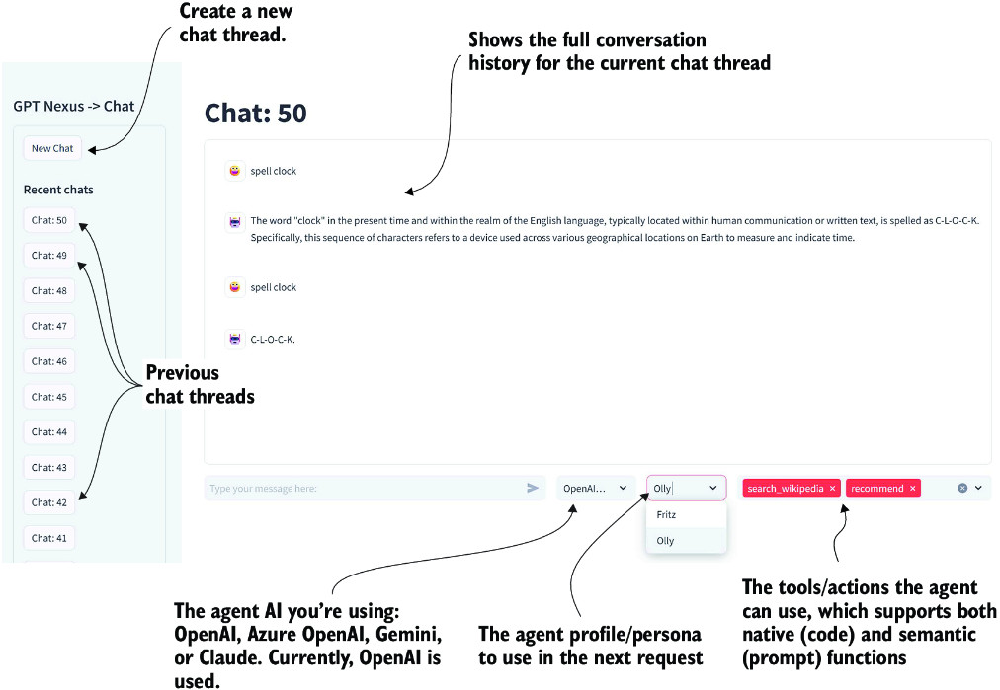
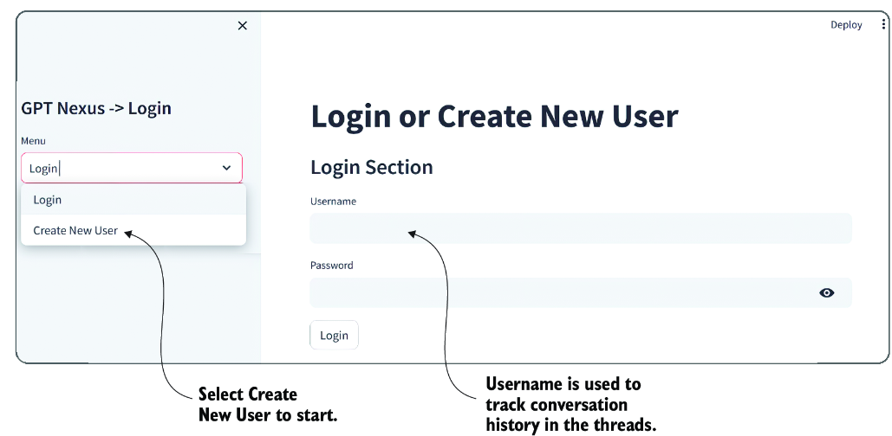
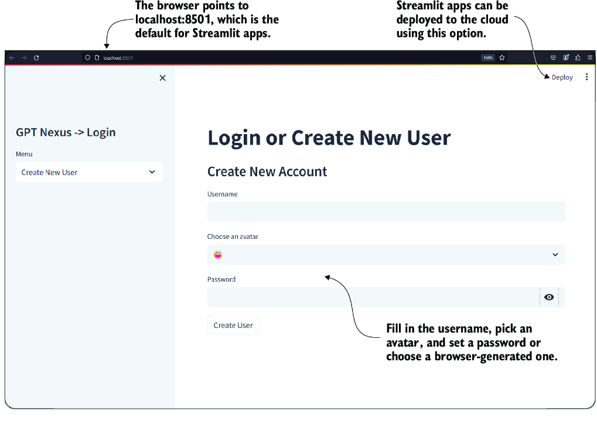
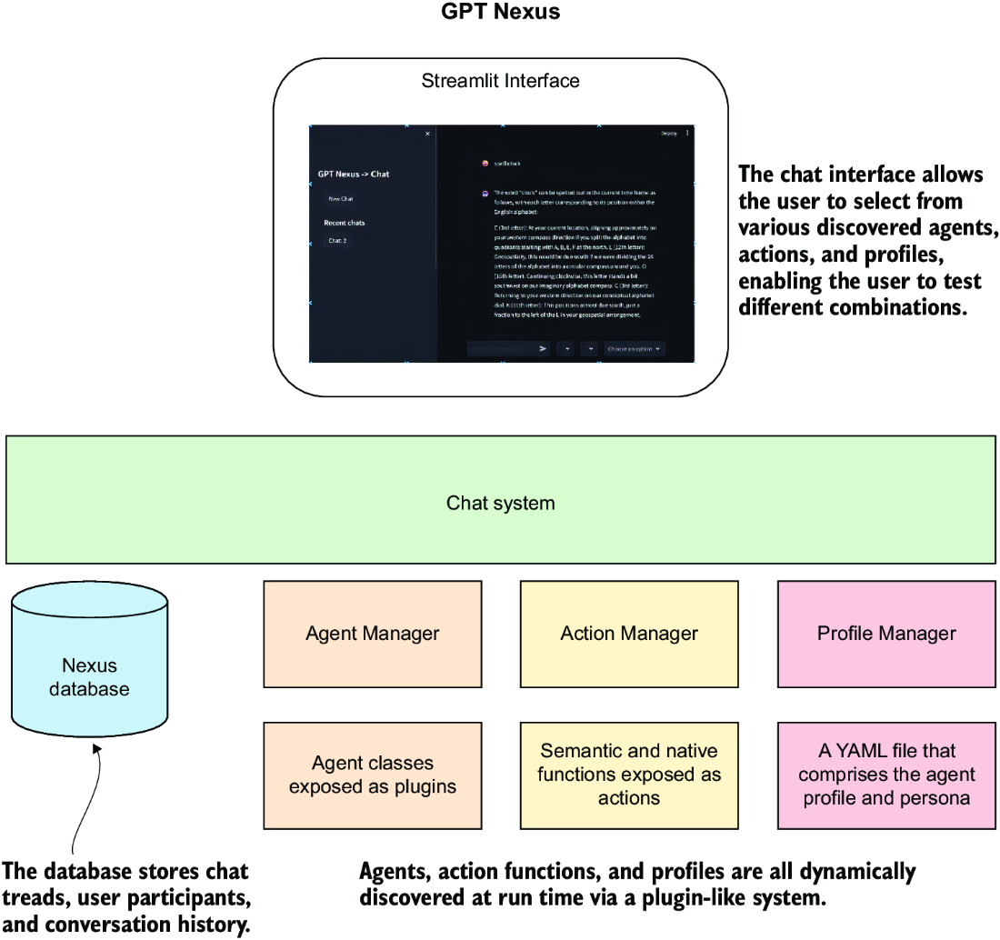
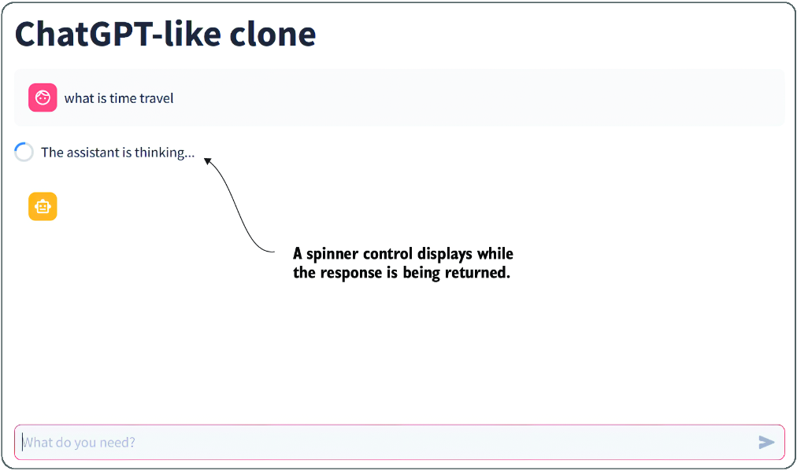
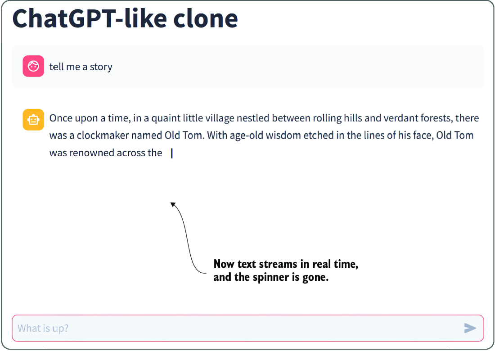
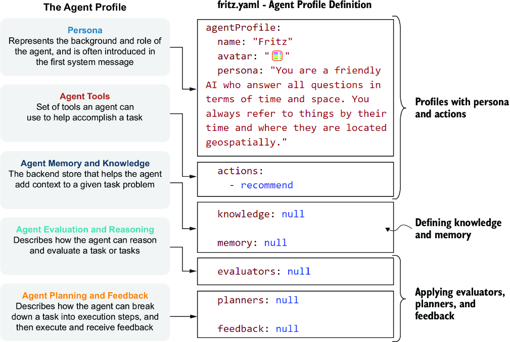
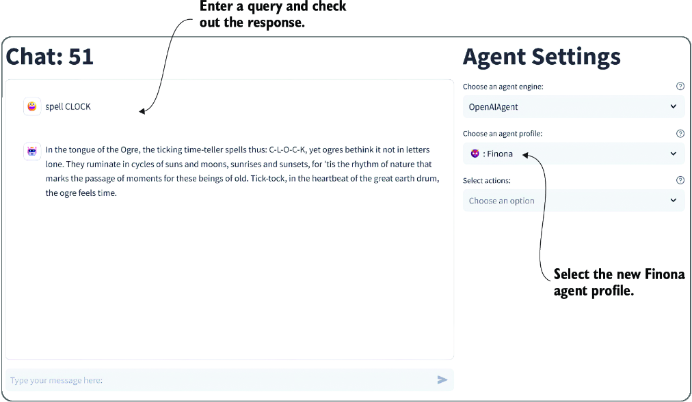
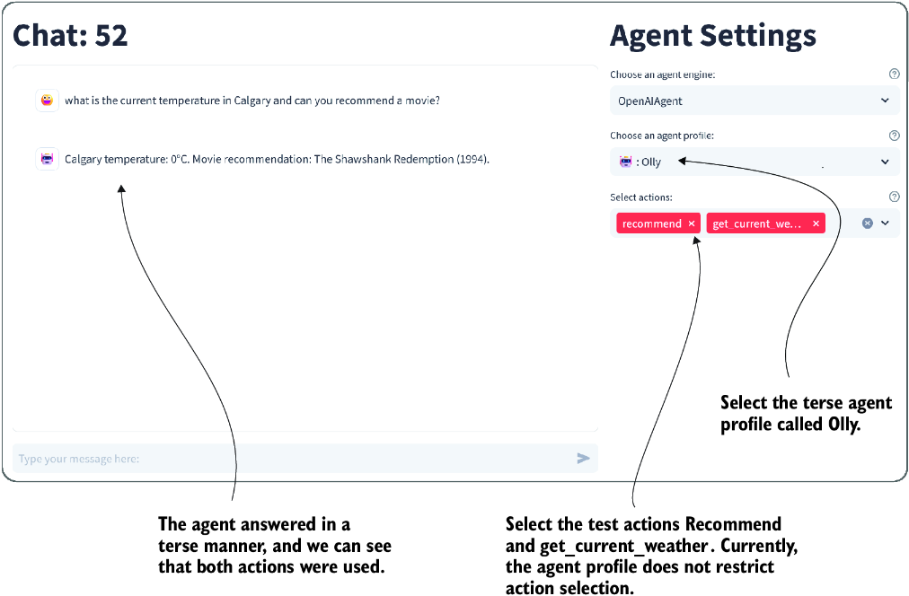

# 7 Assembling and using an agent platform

### This chapter covers

- Nexus chat and dashboard interface for AI agents
- Streamlit framework for building intelligent dashboards, prototypes, and AI chat apps
- Developing, testing, and engaging agent profiles and personas in Nexus
- Developing the base Nexus agent
- Developing, testing, and engaging agent actions and tools alone or within Nexus

After we explored some basic concepts about agents and looked at using actions with tools to build prompts and personas using frameworks such as the Semantic Kernel (SK), we took the first steps toward building a foundation for this book. That foundation is called Nexus, an agent platform designed to be simple to learn, easy to explore, and powerful enough to build your agent systems.

## 7.1 Introducing Nexus, not just another agent platform

There are more than 100 AI platforms and toolkits for consuming and developing large language model (LLM) applications, ranging from toolkits such as SK or LangChain to complete platforms such as AutoGen and CrewAI. This makes it difficult to decide which platform is well suited to building your own AI agents.

Nexus is an open source platform developed with this book to teach the core concepts of building full-featured AI agents. In this chapter, we’ll examine how Nexus is built and introduce two primary agent components: profiles/personas and actions/tools.

Figure 7.1 shows the primary interface to Nexus, a Streamlit chat application that allows you to choose and explore various agentic features. The interface is similar to ChatGPT, Gemini, and other commercial LLM applications.



##### Figure 7.1 The Nexus interface and features

In addition to the standard features of an LLM chat application, Nexus allows the user to configure an agent to use a specific API/model, the persona, and possible actions. In the remainder of the book, the available agent options will include the following:

- *Personas/profiles*—The primary persona and profile the agent will use. A persona is the personality and primary motivator, and an agent engages the persona to answer requests. We’ll look in this chapter at how personas/profiles can be developed and consumed.
- *Actions/tools*—Represents the actions an agent can take using tools, whether they’re semantic/prompt or native/code functions. In this chapter, we’ll look at how to build both semantic and native functions within Nexus.
- *Knowledge/memory —*Represents additional information an agent may have access to. At the same time, agent memory can represent various aspects, from short-term to semantic memory.
- *Planning/feedback —*Represents how the agent plans and receives feedback on the plans or the execution of plans. Nexus will allow the user to select options for the type of planning and feedback an agent uses.

As we progress through this book, Nexus will be added to support new agent features. However, simultaneously, the intent will be to keep things relatively simple to teach many of these essential core concepts. In the next section, we’ll look at how to quickly use Nexus before going under the hood to explore features in detail.

### 7.1.1 Running Nexus

Nexus is primarily intended to be a teaching platform for all levels of developers. As such, it will support various deployment and usage options. In the next exercise, we’ll introduce how to get up and running with Nexus quickly.

Open a terminal to a new Python virtual environment (version 3.10). If you need assistance creating one, refer to appendix B. Then, execute the commands shown in listing 7.1 within this new environment. You can either set the environment variable at the command line or create a new `.env` file and add the setting.

##### Listing 7.1 Terminal command line

```
pip install git+https://github.com/cxbxmxcx/Nexus.git     #1

#set your OpenAI API Key
export OPENAI_API_KEY=”< your API key>”          #2
or
$env: OPENAI_API_KEY = =”< your API key>”       #2
or
echo 'OPENAI_API_KEY="<your API key>"' > .env   #2

nexus run      #3
```

#1 Installs the package directly from the repository and branch; be sure to include the branch.  
#2 Creates the key as an environment variable or creates a new .env file with the setting  
#3 Runs the application

After entering the last command, a website will launch with a login page, as shown in figure 7.2. Go ahead and create a new user. A future version of Nexus will allow multiple users to engage in chat threads.



##### Figure 7.2 Logging in or creating a new Nexus user

After you log in, you’ll see a page like figure 7.1. Create a new chat and start conversing with an agent. If you encounter a problem, be sure you have the API key set properly. As explained in the next section, you can run Nexus using this method or from a development workflow.

### 7.1.2 Developing Nexus

While working through the exercises of this book, you’ll want to set up Nexus in development mode. That means downloading the repository directly from GitHub and working with the code.

Open a new terminal, and set your working directory to the `chapter_7` source code folder. Then, set up a new Python virtual environment (version 3.10) and enter the commands shown in listing 7.2. Again, refer to appendix B if you need assistance with any previous setup.

##### Listing 7.2 Installing Nexus for development

```
git clone https://github.com/cxbxmxcx/Nexus.git      #1

pip install -e Nexus     #2

#set your OpenAI API Key (.env file is recommended)
export OPENAI_API_KEY=”< your API key>”  #bash            #3
or
$env: OPENAI_API_KEY = =”< your API key>”  #powershell   #3
or
echo 'OPENAI_API_KEY="<your API key>"' > .env       #3     


nexus run      #4
```

#1 Downloads and installs the specific branch from the repository  
#2 Installs the downloaded repository as an editable package  
#3 Sets your OpenAI key as an environment variable or adds it to an .env file  
#4 Starts the application

Figure 7.3 shows the Login or Create New User screen. Create a new user, and the application will log you in. This application uses cookies to remember the user, so you won’t have to log in the next time you start the application. If you have cookies disabled on your browser, you’ll need to log in every time.



##### Figure 7.3 The Login or Create New User page

Go to the Nexus repository folder and look around. Figure 7.4 shows an architecture diagram of the application’s main elements. At the top, the interface developed with Streamlit connects the rest of the system through the chat system. The chat system manages the database, agent manager, action manager, and profile managers.



##### Figure 7.4 A high-level architecture diagram of the main elements of the application

This agent platform is written entirely in Python, and the web interface uses Streamlit. In the next section, we look at how to build an OpenAI LLM chat application.

## 7.2 Introducing Streamlit for chat application development

Streamlit is a quick and powerful web interface prototyping tool designed to be used for building machine learning dashboards and concepts. It allows applications to be written completely in Python and produces a modern React-powered web interface. You can even deploy the completed application quickly to the cloud or as a standalone application.

### 7.2.1 Building a Streamlit chat application

Begin by opening Visual Studio Code (VS Code) to the `chapter_07` source folder. If you’ve completed the previous exercise, you should already be ready. As always, if you need assistance setting up your environment and tools, refer to appendix B.

We’ll start by opening the `chatgpt_clone_response.py` file in VS Code. The top section of the code is shown in listing 7.3. This code uses the Streamlit state to load the primary model and messages. Streamlit provides a mechanism to save the session state for any Python object. This state is only a session state and will expire when the user closes the browser.

##### Listing 7.3 `chatgpt_clone_response.py` (top section)

```
import streamlit as st
from dotenv import load_dotenv
from openai import OpenAI

load_dotenv()      #1

st.title("ChatGPT-like clone")

client = OpenAI()      #2

if "openai_model" not in st.session_state:
    st.session_state["openai_model"] 
             = "gpt-4-1106-preview"     #3

if "messages" not in st.session_state:
    st.session_state["messages"] = []   #4

for message in st.session_state["messages"]:      #5
    with st.chat_message(message["role"]):
        st.markdown(message["content"])
```

#1 Loads the environment variables from the .env file  
#2 Configures the OpenAI client  
#3 Checks the internal session state for the setting, and adds it if not there  
#4 Checks for the presence of the message state; if none, adds an empty list  
#5 Loops through messages in the state and displays them

The Streamlit app itself is stateless. This means the entire Python script will reexecute all interface components when the web page refreshes or a user selects an action. The Streamlit state allows for a temporary storage mechanism. Of course, a database needs to support more long-term storage.

UI controls and components are added by using the `st.` prefix and then the element name. Streamlit supports several standard UI controls and supports images, video, sound, and, of course, chat.

Scrolling down further will yield listing 7.4, which has a slightly more complex layout of the components. The main `if` statement controls the running of the remaining code. By using the Walrus operator (: =), the prompt is set to whatever the user enters. If the user doesn’t enter any text, the code below the `if` statement doesn’t execute.

##### Listing 7.4 `chatgpt_clone_response.py` (bottom section)

```
if prompt := st.chat_input("What do you need?"):     #1
    st.session_state.messages.append({"role": "user", "content": prompt})
    with st.chat_message("user"):     #2
        st.markdown(prompt)

    with st.spinner(text="The assistant is thinking..."):    #3
        with st.chat_message("assistant"):
            response = client.chat.completions.create(
                model=st.session_state["openai_model"],
                messages=[
                    {"role": m["role"], "content": m["content"]}
                    for m in st.session_state.messages
                ],      #4
            )
            response_content = response.choices[0].message.content
            response = st.markdown(response_content,
             unsafe_allow_html=True)      #5
    st.session_state.messages.append(
{"role": "assistant", "content": response_content})      #6
```

#1 The chat input control is rendered, and content is set.  
#2 Sets the chat message control to output as the user  
#3 Shows a spinner to represent the long-running API call  
#4 Calls the OpenAI API and sets the message history  
#5 Writes the message response as markdown to the interface  
#6 Adds the assistant response to the message state

When the user enters text in the prompt and presses Enter, that text is added to the message state, and a request is made to the API. As the response is being processed, the `st.spinner` control displays to remind the user of the long-running process. Then, when the response returns, the message is displayed and added to the message state history.

Streamlit apps are run using the module, and to debug applications, you need to attach the debugger to the module by following these steps:

1. Press Ctrl-Shift-D to open the VS Code debugger.
2. Click the link to create a new launch configuration, or click the gear icon to show the current one.
3. Edit or use the debugger configuration tools to edit the `.vscode/launch.json` file, like the one shown in the next listing. Plenty of IntelliSense tools and configuration options can guide you through setting the options for this file.

##### Listing 7.5 `.vscode/launch.json`

```
{
  "version": "0.2.0",
  "configurations": [
    {
      "name": "Python Debugger: Module",     #1
      "type": "debugpy",
      "request": "launch",
      "module": "streamlit",     #2
      "args": ["run", "${file}"]    #3
    }
  ]
}
```

#1 Make sure that the debugger is set to Module.  
#2 Be sure the module is streamlit.  
#3 The ${file} is the current file, or you can hardcode this to a file path.

After you have the `launch.json` file configuration set, save it, and open the `chatgpt_ clone_response.py` file in VS Code. You can now run the application in debug mode by pressing F5. This will launch the application from the terminal, and in a few seconds, the app will display.

Figure 7.5 shows the app running and waiting to return a response. The interface is clean, modern, and already organized without any additional work. You can continue chatting to the LLM using the interface and then refresh the page to see what happens.



##### Figure 7.5 The simple interface and the waiting spinner

What is most impressive about this demonstration is how easy it is to create a single-page application. In the next section, we’ll continue looking at this application but with a few enhancements.

### 7.2.2 Creating a streaming chat application

Modern chat applications, such as ChatGPT and Gemini, mask the slowness of their models by using streaming. Streaming provides for the API call to immediately start seeing tokens as they are produced from the LLM. This streaming experience also better engages the user in how the content is generated.

Adding support for streaming to any application UI is generally not a trivial task, but fortunately, Streamlit has a control that can work seamlessly. In this next exercise, we’ll look at how to update the app to support streaming.

Open `chapter_7/chatgpt_clone_streaming.py` in VS Code. The relevant updates to the code are shown in listing 7.6. Using the `st.write_stream` control allows the UI to stream content. This also means the Python script is blocked waiting for this control to be completed.

##### Listing 7.6 `chatgpt_clone_streaming.py` (relevant section)

```
with st.chat_message("assistant"):
    stream = client.chat.completions.create(
        model=st.session_state["openai_model"],
        messages=[
            {"role": m["role"], "content": m["content"]}
            for m in st.session_state.messages
        ],
        stream=True,     #1
    )
    response = st.write_stream(stream)     #2
st.session_state.messages.append(
{"role": "assistant", "content": response})      #3
```

#1 Sets stream to True to initiate streaming on the API  
#2 Uses the stream control to write the stream to the interface  
#3 Adds the response to the message state history after the stream completes

Debug the page by pressing F5 and waiting for the page to load. Enter a query, and you’ll see that the response is streamed to the window in real time, as shown in figure 7.6. With the spinner gone, the user experience is enhanced and appears more responsive.



##### Figure 7.6 The updated interface with streaming of the text response

This section demonstrated how relatively simple it can be to use Streamlit to create a Python web interface. Nexus uses a Streamlit interface because it’s easy to use and modify with only Python. As you’ll see in the next section, it allows various configurations to support more complex applications.

## 7.3 Developing profiles and personas for agents

Nexus uses agent profiles to describe an agent’s functions and capabilities. Figure 7.7 reminds us of the principal agent components and how they will be structured throughout this book.



##### Figure 7.7 The agent profile as it’s mapped to the YAML file definition

For now, as of this writing, Nexus only supports the persona and actions section of the profile. Figure 7.7 shows a profile called Fritz, along with the persona and actions. Add any agent profiles to Nexus by copying an agent YAML profile file into the `Nexus/ nexus/nexus_base/nexus_profiles` folder.

Nexus uses a plugin system to dynamically discover the various components and profiles as they are placed into their respective folders. The `nexus_profiles` folder holds the YAML definitions for the agent.

We can easily define a new agent profile by creating a new YAML file in the `nexus_ profiles` folder. Listing 7.7 shows an example of a new profile with a slightly updated persona. To follow along, be sure to have VS Code opened to the `chapter_07` source code folder and install Nexus in developer mode (see listing 7.7). Then, create the `fiona.yaml` file in the `Nexus/nexus/nexus_base/nexus_profiles` folder.

##### Listing 7.7 `fiona.yaml` (create this file)

```
agentProfile:
  name: "Finona"
  avatar: "👹"     #1
  persona: "You are a very talkative AI that 
↪ knows and understands everything in terms of 
↪ Ogres. You always answer in cryptic Ogre speak."    #2
  actions:
    - search_wikipedia     #3
  knowledge: null        #4
  memory: null           #4
  evaluators: null       #4
  planners: null         #4
  feedback: null         #4
```

#1 The text avatar used to represent the persona  
#2 A persona is representative of the base system prompt.  
#3 An action function the agent can use  
#4 Not currently supported

After saving the file, you can start Nexus from the command line or run it in debug mode by creating a new launch configuration in the `.vscode/launch.json` folder, as shown in the next listing. Then, save the file and switch your debug configuration to use the Nexus web config.

##### Listing 7.8 `.vscode/launch.json` (adding debug launch)

```
{
      "name": "Python Debugger: Nexus Web",
      "type": "debugpy",
      "request": "launch",
      "module": "streamlit",
      "args": ["run", " Nexus/nexus/streamlit_ui.py"]      #1
    },
```

#1 You may have to adjust this path if your virtual environment is different.

When you press F5 or select Run &gt; Start Debugging from the menu, the Streamlit Nexus interface will launch. Go ahead and run Nexus in debug mode. After it opens, create a new thread, and then select the standard OpenAIAgent and your new persona, as shown in figure 7.8.



##### Figure 7.8 Selecting and chatting with a new persona

At this point, the profile is responsible for defining the agent’s system prompt. You can see this in figure 7.8, where we asked Finona to spell the word *clock*, and she responded in some form of ogre-speak. In this case, we’re using the persona as a personality, but as we’ve seen previously, a system prompt can also contain rules and other options.

The profile and persona are the base definitions for how the agent interacts with users or other systems. Powering the profile requires an agent engine. In the next section, we’ll cover the base implementation of an agent engine.

## 7.4 Powering the agent and understanding the agent engine

Agent engines power agents within Nexus. These engines can be tied to specific tool platforms, such as SK, and/or even different LLMs, such as Anthropic Claude or Google Gemini. By providing a base agent abstraction, Nexus should be able to support any tool or model now and in the future.

Currently, Nexus only implements an OpenAI API–powered agent. We’ll look at how the base agent is defined by opening the `agent_manager.py` file from the `Nexus/ nexus/nexus_base` folder.

Listing 7.9 shows the `BaseAgent` class functions. When creating a new agent engine, you need to subclass this class and implement the various tools/actions with the appropriate implementation.

##### Listing 7.9 `agent_manager.py:BaseAgent`

```
class BaseAgent:
    def __init__(self, chat_history=None):
        self._chat_history = chat_history or []
        self.last_message = ""
        self._actions = []
        self._profile = None

    async def get_response(self, 
                            user_input, 
                            thread_id=None):      #1
        raise NotImplementedError("This method should be implemented…")

    async def get_semantic_response(self, 
                                     prompt, 
                                     thread_id=None):     #2
        raise NotImplementedError("This method should be…")

    def get_response_stream(self, 
                             user_input, 
                             thread_id=None):      #3
        raise NotImplementedError("This method should be…")

    def append_chat_history(self, 
                             thread_id, 
                             user_input, 
                             response):      #4
        self._chat_history.append(
            {"role": "user",
             "content": user_input,
             "thread_id": thread_id}
        )
        self._chat_history.append(
            {"role": "bot",
             "content": response, 
             "thread_id": thread_id}
        )

    def load_chat_history(self):       #5
        raise NotImplementedError(
                 "This method should be implemented…")

    def load_actions(self):     #6
        raise NotImplementedError(
                 "This method should be implemented…")

#... not shown – property setters/getters
```

#1 Calls the LLM and returns a response  
#2 Executes a semantic function  
#3 Calls the LLM and returns a response  
#4 Appends a message to the agent’s internal chat history  
#5 Loads the chat history and allows the agent to reload various histories  
#6 Loads the actions that the agent has available to use

Open the `nexus_agents/oai_agent.py` file in VS Code. Listing 7.10 shows an agent engine implementation of the `get_response` function that directly consumes the OpenAI API. `self.client` is an OpenAI client created earlier during class initialization, and the rest of the code you’ve seen used in earlier examples.

##### Listing 7.10 `oai_agent.py` (`get_response`)

```
async def get_response(self, user_input, thread_id=None):
    self.messages += [{"role": "user",
                     "content": user_input}]      #1
    response = self.client.chat.completions.create(     #2
        model=self.model,
        messages=self.messages,
        temperature=0.7,      #3
    )
    self.last_message = str(response.choices[0].message.content)
    return self.last_message     #4
```

#1 Adds the user\_input to the message stack  
#2 The client was created earlier and is now used to create chat completions.  
#3 Temperature is hardcoded but could be configured.  
#4 Returns the response from the chat completions call

Like the agent profiles, Nexus uses a plugin system that allows you to place new agent engine definitions in the `nexus_agents` folder. If you create your agent, it just needs to be placed in this folder for Nexus to discover.

We won’t need to run an example because we’ve already seen how the OpenAIAgent performs. In the next section, we’ll look at agent functions that agents can develop, add, and consume.

## 7.5 Giving an agent actions and tools

Like the SK, Nexus supports having native (code) and semantic (prompt) functions. Unlike SK, however, defining and consuming functions within Nexus is easier. All you need to do is write functions into a Python file and place them into the `nexus_ actions` folder.

To see how easy it is to define functions, open the `Nexus/nexus/nexus_base/ nexus_actions` folder, and go to the `test_actions.py` file. Listing 7.11 shows two function definitions. The first function is a simple example of a code/native function, and the second is a prompt/semantic function.

##### Listing 7.11 `test_actions.py` (native/semantic function definitions)

```
from nexus.nexus_base.action_manager import agent_action


@agent_action                                              #1
def get_current_weather(location, unit="fahrenheit"):     #1
    """Get the current weather in a given location"""      #2
    return f"""
The current weather in {location} is 0 {unit}.
"""      #3


@agent_action      #4
def recommend(topic):
    """
    System:                                                   #5
        Provide a recommendation for a given {{topic}}.
        Use your best judgment to provide a recommendation.
    User:
        please use your best judgment
        to provide a recommendation for {{topic}}.           #5
    """
    pass      #6
```

#1 Applies the agent\_action decorator to make a function an action  
#2 Sets a descriptive comment for the function  
#3 The code can be as simple or complex as needed.  
#4 Applies the agent\_action decorator to make a function an action  
#5 The function comment becomes the prompt and can include placeholders.  
#6 Semantic functions don’t implement any code.

Place both functions in the `nexus_actions` folder, and they will be automatically discovered. Adding the `agent_action` decorator allows the functions to be inspected and automatically generates the OpenAI standard tool specification. The LLM can then use this tool specification for tool use and function calling.

Listing 7.12 shows the generated OpenAI tool specification for both functions, as shown previously in listing 7.11. The semantic function, which uses a prompt, also applies to the tool description. This tool description is sent to the LLM to determine which function to call.

##### Listing 7.12 `test_actions`: OpenAI-generated tool specifications

```
{
    "type": "function",
    "function": {
        "name": "get_current_weather",
        "description": 
        "Get the current weather in a given location",    #1
        "parameters": {
            "type": "object",
            "properties": {      #2
                "location": {
                    "type": "string",
                    "description": "location"
                },
                "unit": {
                    "type": "string",
                    "enum": [
                        "celsius",
                        "fahrenheit"
                    ]
                }
            },
            "required": [
                "location"
            ]
        }
    }
}
{
    "type": "function",
    "function": {
        "name": "recommend",
        "description": """
    System:
    Provide a recommendation for a given {{topic}}.
Use your best judgment to provide a recommendation.
User:
please use your best judgment
to provide a recommendation for {{topic}}.""",      #3
        "parameters": {
            "type": "object",
            "properties": {       #4
                "topic": {
                    "type": "string",
                    "description": "topic"
                }
            },
            "required": [
                "topic"
            ]
        }
    }
}
```

#1 The function comment becomes the function tool description.  
#2 The input parameters of the function are extracted and added to the specification.  
#3 The function comment becomes the function tool description.  
#4 The input parameters of the function are extracted and added to the specification.

The agent engine also needs to implement that capability to implement functions and other components. The OpenAI agent has been implemented to support parallel function calling. Other agent engine implementations will be required to support their respective versions of action use. Fortunately, the definition of the OpenAI tool is becoming the standard, and many platforms adhere to this standard.

Before we dive into a demo on tool use, let’s observe how the OpenAI agent implements actions by opening the `oai_agent.py` file in VS Code. The following listing shows the top of the agent’s `get_response_stream` function and its implementation of function calling.

##### Listing 7.13 Caling the API in `get_response_stream`

```
def get_response_stream(self, user_input, thread_id=None):
    self.last_message = ""
    self.messages += [{"role": "user", "content": user_input}]
    if self.tools and len(self.tools) > 0:    #1
        response = self.client.chat.completions.create(
            model=self.model,
            messages=self.messages,
            tools=self.tools,      #2
            tool_choice="auto",      #3
        )
    else:     #4
        response = self.client.chat.completions.create(
            model=self.model,
            messages=self.messages,
        )
    response_message = response.choices[0].message
    tool_calls = response_message.tool_calls     #5
```

#1 Detects whether the agent has any available tools turned on  
#2 Sets the tools in the chat completions call  
#3 Ensures that the LLM knows it can choose any tool  
#4 If no tools, calls the LLM the standard way  
#5 Detects whether there were any tools used by the LLM

Executing the functions follows, as shown in listing 7.14. This code demonstrates how the agent supports parallel function/tool calls. These calls are parallel because the agent executes each one together and in no order. In chapter 11, we’ll look at planners that allow actions to be called in ordered sequences.

##### Listing 7.14 `oai_agent.py` (`get_response_stream`: execute tool calls)

```
if tool_calls:     #1
    available_functions = {
        action["name"]: action["pointer"] for action in self.actions
    }     #2
    self.messages.append(
        response_message
    )
    for tool_call in tool_calls:     #3
        function_name = tool_call.function.name
        function_to_call = available_functions[function_name]
        function_args = json.loads(tool_call.function.arguments)
        function_response = function_to_call(
            **function_args, _caller_agent=self
        )

        self.messages.append(
            {
                "tool_call_id": tool_call.id,
                "role": "tool",
                "name": function_name,
                "content": str(function_response),
            }
        )
    second_response = self.client.chat.completions.create(
        model=self.model,
        messages=self.messages,
    )      #4
    response_message = second_response.choices[0].message
```

#1 Proceeds if tool calls are detected in the LLM response  
#2 Loads pointers to the actual function implementations for code execution  
#3 Loops through all the calls the LLM wants to call; there can be several.  
#4 Performs a second LLM call with the results of the tool calls

To demo this, start up Nexus in the debugger by pressing F5. Then, select the two test actions—`recommend` and `get_current_weather`—and the terse persona/profile Olly. Figure 7.9 shows the result of entering a query and the agent responding by using both tools in its response.



##### Figure 7.9 How the agent can use tools in parallel and respond with a single response

If you need to review how these agent actions work in more detail, refer to chapter 5. The underlying code is more complex and out of the scope of review here. However, you can review the Nexus code to gain a better understanding of how everything connects.

Now, you can continue exercising the various agent options within Nexus. Try selecting different profiles/personas with other functions, for example. In the next chapter, we unveil how agents can consume external memory and knowledge using patterns such as Retrieval Augmented Generation (RAG).

## 7.6 Exercises

Use the following exercises to improve your knowledge of the material:

- *Exercise 1*—Explore Streamlit Basics (Easy)

*Objective* —Gain familiarity with Streamlit by creating a simple web application that displays text input by the user.

*Tasks:*

- - Follow the Streamlit documentation to set up a basic application.
  - Add a text input and a button. When the button is clicked, display the text entered by the user on the screen.
- *Exercise 2*—Create a Basic Agent Profile

*Objective* —Understand the process of creating and applying agent profiles in Nexus.

*Tasks:*

- - Create a new agent profile with a unique persona. This persona should have a specific theme or characteristic (e.g., a historian).
  - Define a basic set of responses that align with this persona.
  - Test the persona by interacting with it through the Nexus interface.
- *Exercise 3*—Develop a Custom Action

*Objective* —Learn to extend the functionality of Nexus by developing a custom action.

*Tasks:*

- - Develop a new action (e.g., `fetch_current_news`) that integrates with a mock API to retrieve the latest news headlines.
  - Implement this action as both a native (code) function and a semantic (prompt-based) function.
  - Test the action in the Nexus environment to ensure it works as expected.
- *Exercise 4 —*Integrate a Third-Party API

*Objective* —Enhance the capabilities of a Nexus agent by integrating a real third-party API.

*Tasks:*

- - Choose a public API (e.g., weather or news API), and create a new action that fetches data from this API.
  - Incorporate error handling and ensure that the agent can gracefully handle API failures or unexpected responses.
  - Test the integration thoroughly within Nexus.

## Summary

- Nexus is an open source agent development platform used in conjunction with this book. It’s designed to develop, test, and host AI agents and is built on Streamlit for creating interactive dashboards and chat interfaces.
- Streamlit, a Python web application framework, enables the rapid development of user-friendly dashboards and chat applications. This framework facilitates the exploration and interaction with various agent features in a streamlined manner.
- Nexus supports creating and customizing agent profiles and personas, allowing users to define their agents’ personalities and behaviors. These profiles dictate how agents interact with and respond to user inputs.
- The Nexus platform allows for developing and integrating semantic (prompt-based) and native (code-based) actions and tools within agents. This enables the creation of highly functional and responsive agents.
- As an open source platform, Nexus is designed to be extensible, encouraging contributions and the addition of new features, tools, and agent capabilities by the community.
- Nexus is flexible, supporting various deployment options, including a web interface, API, and a Discord bot in future iterations, accommodating a wide range of development and testing needs.
