# 8 Understanding agent memory and knowledge

### This chapter covers

- Retrieval in knowledge/memory in AI functions
- Building retrieval augmented generation workflows with LangChain
- Retrieval augmented generation for agentic knowledge systems in Nexus
- Retrieval patterns for memory in agents
- Improving augmented retrieval systems with memory and knowledge compression

Now that we’ve explored agent actions using external tools, such as plugins in the form of native or semantic functions, we can look at the role of memory and knowledge using retrieval in agents and chat interfaces. We’ll describe memory and knowledge and how they relate to prompt engineering strategies, and then, to understand memory knowledge, we’ll investigate document indexing, construct retrieval systems with LangChain, use memory with LangChain, and build semantic memory using Nexus.

## 8.1 Understanding retrieval in AI applications

Retrieval in agent and chat applications is a mechanism for obtaining knowledge to keep in storage that is typically external and long-lived. Unstructured knowledge includes conversation or task histories, facts, preferences, or other items necessary for contextualizing a prompt. Structured knowledge, typically stored in databases or files, is accessed through native functions or plugins.

Memory and knowledge, as shown in figure 8.1, are elements used to add further context and relevant information to a prompt. Prompts can be augmented with everything from information about a document to previous tasks or conversations and other reference information.

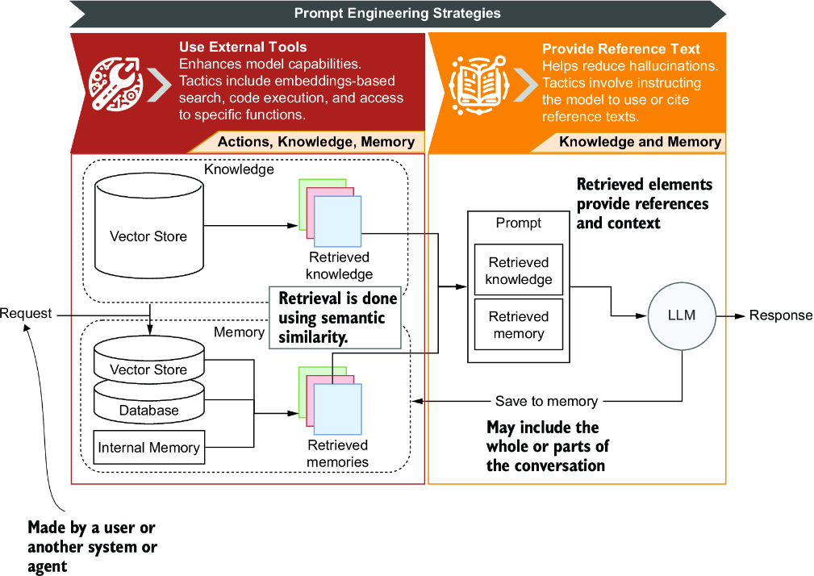

##### Figure 8.1 Memory, retrieval, and augmentation of the prompt using the following prompt engineering strategies: Use External Tools and Provide Reference Text.

The prompt engineering strategies shown in figure 8.1 can be applied to memory and knowledge. Knowledge isn’t considered memory but rather an augmentation of the prompt from existing documents. Both knowledge and memory use retrieval as the basis for how unstructured information can be queried.

The retrieval mechanism, called retrieval augmented generation (RAG), has become a standard for providing relevant context to a prompt. The exact mechanism that powers RAG also powers memory/knowledge, and it’s essential to understand how it works. In the next section, we’ll examine what RAG is.

## 8.2 The basics of retrieval augmented generation (RAG)

RAG has become a popular mechanism for supporting document chat or question-and-answer chat. The system typically works by a user supplying a relevant document, such as a PDF, and then using RAG and a large language model (LLM) to query the document.

Figure 8.2 shows how RAG can allow a document to be queried using an LLM. Before any document can be queried, it must first be loaded, transformed into context chunks, embedded into vectors, and stored in a vector database.

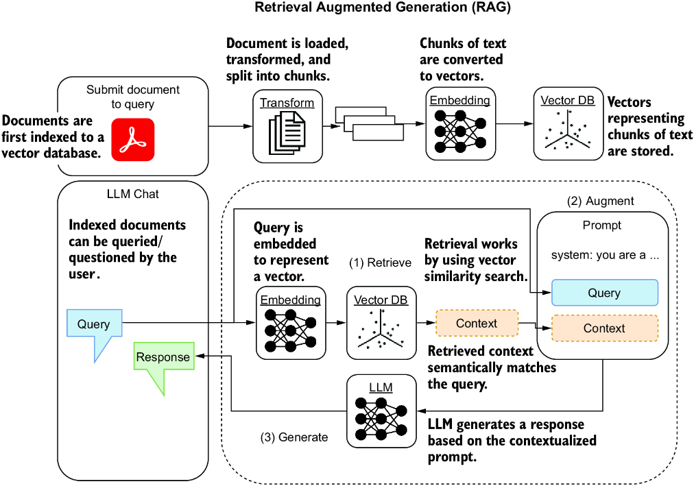

##### Figure 8.2 The two phases of RAG: first, documents must be loaded, transformed, embedded, and stored, and, second, they can be queried using augmented generation.

A user can query previously indexed documents by submitting a query. That query is then embedded into a vector representation to search for similar chunks in the vector database. Content similar to the query is then used as context and populated into the prompt as augmentation. The prompt is pushed to an LLM, which can use the context information to help answer the query.

*Unstructured* memory/knowledge concepts rely on some format of text-similarity search following the retrieval pattern shown in figure 8.2. Figure 8.3 shows how memory uses the same embedding and vector database components. Rather than preload documents, conversations or parts of a conversation are embedded and saved to a vector database.

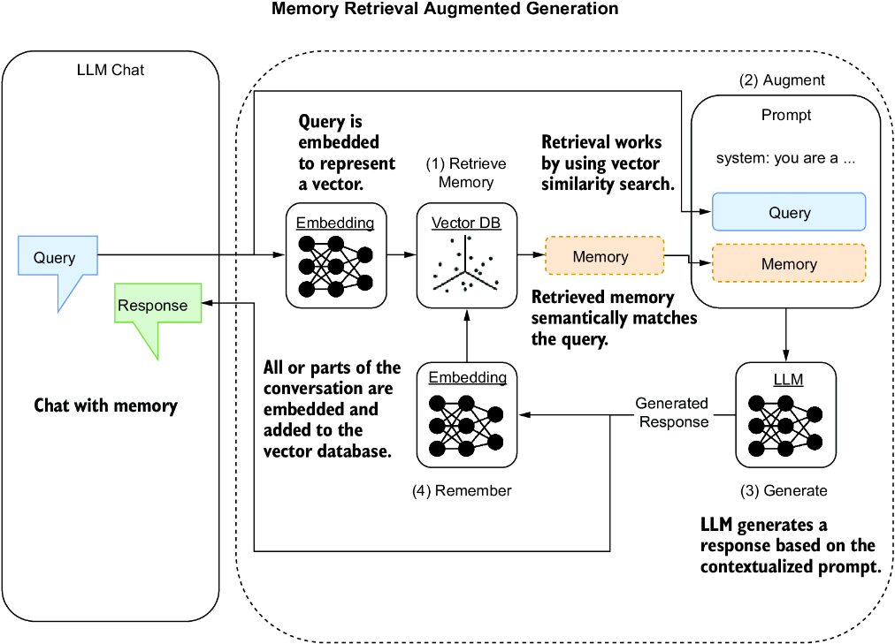

##### Figure 8.3 Memory retrieval for augmented generation uses the same embedding patterns to index items to a vector database.

The retrieval pattern and document indexing are nuanced and require careful consideration to be employed successfully. This requires understanding how data is stored and retrieved, which we’ll start to unfold in the next section.

## 8.3 Delving into semantic search and document indexing

Document indexing transforms a document’s information to be more easily recovered. How the index will be queried or searched also plays a factor, whether searching for a particular set of words or wanting to match phrase for phrase.

A *semantic* search is a search for content that matches the searched phrase by words and meaning. The ability to search by meaning, semantically, is potent and worth investigating in some detail. In the next section, we look at how vector similarity search can lay the framework for semantic search.

### 8.3.1 Applying vector similarity search

Let’s look now at how a document can be transformed into a *semantic vector,* or a representation of text that can then be used to perform distance or similarity matching. There are numerous ways to convert text into a semantic vector, so we’ll look at a simple one.

Open the `chapter_08` folder in a new Visual Studio Code (VS Code) workspace. Create a new environment and `pip` `install` the `requirements.txt` file for all the chapter dependencies. If you need help setting up a new Python environment, consult appendix B.

Now open the `document_vector_similarity.py` file in VS Code, and review the top section in listing 8.1. This example uses Term Frequency–Inverse Document Frequency (TF–IDF). This numerical statistic reflects how important a word is to a document in a collection or set of documents by increasing proportionally to the number of times a word appears in the document and offset by the frequency of the word in the document set. TF–IDF is a classic measure of understanding one document’s importance within a set of documents.

##### Listing 8.1 `document_vector_similarity` (transform to vector)

```
import plotly.graph_objects as go
from sklearn.feature_extraction.text import TfidfVectorizer
from sklearn.metrics.pairwise import cosine_similarity

documents = [      #1
    "The sky is blue and beautiful.",
    "Love this blue and beautiful sky!",
    "The quick brown fox jumps over the lazy dog.",
    "A king's breakfast has sausages, ham, bacon, eggs, toast, and beans",
    "I love green eggs, ham, sausages and bacon!",
    "The brown fox is quick and the blue dog is lazy!",
    "The sky is very blue and the sky is very beautiful today",
    "The dog is lazy but the brown fox is quick!"
]

vectorizer = TfidfVectorizer()     #2
X = vectorizer.fit_transform(documents)      #3
```

#1 Samples of documents  
#2 Vectorization using TF–IDF  
#3 Vectorize the documents.

Let’s break down TF–IDF into its two components using the sample sentence, “The sky is blue and beautiful,” and focusing on the word *blue*.

#### Term Frequency (TF)

*Term Frequency* measures how frequently a term occurs in a document. Because we’re considering only a single document (our sample sentence), the simplest form of the TF for *blue* can be calculated as the number of times *blue* appears in the document divided by the total number of words in the document. Let’s calculate it:

Number of times *blue* appears in the document: 1

Total number of words in the document: 6

TF = 1 ÷ 6TF = .16

#### Inverse Document Frequency (IDF)

*Inverse Document Frequency* measures how important a term is within the entire corpus. It’s calculated by dividing the total number of documents by the number of documents containing the term and then taking the logarithm of that quotient:

IDF = log(Total number of documents ÷ Number of documents containing the word)

In this example, the corpus is a small collection of eight documents, and *blue* appears in four of these documents.

IDF = log(8 ÷ 4)

#### TF–IDF calculation

Finally, the TF–IDF score for *blue* in our sample sentence is calculated by multiplying the TF and the IDF scores:

TF–IDF = TF × IDF

Let’s compute the actual values for TF–IDF for the word *blue* using the example provided; first, the term frequency (how often the word occurs in the document) is computed as follows:

TF = 1 ÷ 6

Assuming the base of the logarithm is 10 (commonly used), the inverse document frequency is computed as follows:

IDF = log10 (8 ÷ 4)

Now let’s calculate the exact TF–IDF value for the word *blue* in the sentence, “The sky is blue and beautiful”:

The Term Frequency (TF) is approximately 0.1670.

The Inverse Document Frequency (IDF) is approximately 0.301.

Thus, the TF–IDF (TF × IDF) score for *blue* is approximately 0.050.

This TF–IDF score indicates the relative importance of the word *blue* in the given document (the sample sentence) within the context of the specified corpus (eight documents, with *blue* appearing in four of them). Higher TF–IDF scores imply greater importance.

We use TF–IDF here because it’s simple to apply and understand. Now that we have the elements represented as vectors, we can measure document similarity using cosine similarity. Cosine similarity is a measure used to calculate the cosine of the angle between two nonzero vectors in a multidimensional space, indicating how similar they are, irrespective of their size.

Figure 8.4 shows how cosine distance compares the vector representations of two pieces or documents of text. Cosine similarity returns a value from –1 (not similar) to 1 (identical). *Cosine distance* is a normalized value ranging from 0 to 2, derived by taking 1 minus the cosine similarity. A cosine distance of 0 means identical items, and 2 indicates complete opposites.

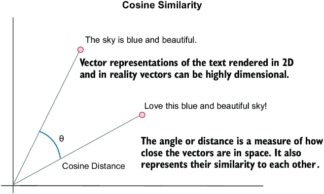

##### Figure 8.4 How cosine similarity is measured

Listing 8.2 shows how the cosine similarities are computed using the `cosine_similarity` function from scikit-learn. Similarities are calculated for each document against all other documents in the set. The computed matrix of similarities for documents is stored in the `cosine_similarities` variable. Then, in the input loop, the user can select the document to view its similarities to the other documents.

##### Listing 8.2 `document_vector_similarity` (cosine similarity)

```
cosine_similarities = cosine_similarity(X)      #1

while True:      #2
    selected_document_index = input(f"Enter a document number
↪ (0-{len(documents)-1}) or 'exit' to quit: ").strip()

    if selected_document_index.lower() == 'exit':
        break

    if not selected_document_index.isdigit() or 
↪ not 0 <= int(selected_document_index) < len(documents):
        print("Invalid input. Please enter a valid document number.")
        continue

    selected_document_index = int(selected_document_index)    #3

    selected_document_similarities = cosine_similarities[selected_document_index]     #4

# code to plot document similarities omitted
```

#1 Computes the document similarities for all vector pairs  
#2 The main input loop  
#3 Gets the selected document index to compare with  
#4 Extracts the computed similarities against all documents

Figure 8.5 shows the output of running the sample in VS Code (F5 for debugging mode). After you select a document, you’ll see the similarities between the various documents in the set. A document will have a cosine similarity of 1 with itself. Note that you won’t see a negative similarity because of the TF–IDF vectorization. We’ll look later at other, more sophisticated means of measuring semantic similarity.

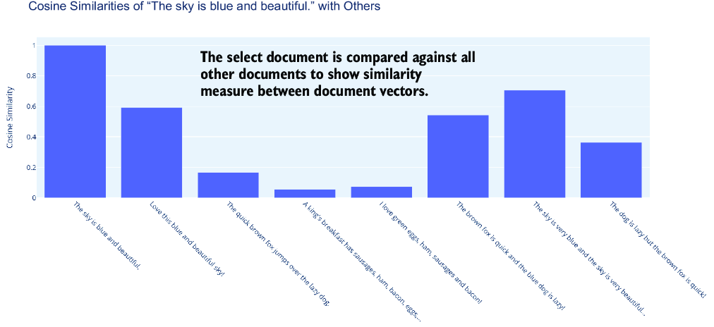

##### Figure 8.5 The cosine similarity between selected documents and the document set

The method of vectorization will dictate the measure of semantic similarity between documents. Before we move on to better methods of vectorizing documents, we’ll examine storing vectors to perform vector similarity searches.

### 8.3.2 Vector databases and similarity search

After vectorizing documents, they can be stored in a vector database for later similarity searches. To demonstrate how this works, we can efficiently replicate a simple vector database in Python code.

Open `document_vector_database.py` in VS Code, as shown in listing 8.3. This code demonstrates creating a vector database in memory and then allowing users to enter text to search the database and return results. The results returned show the document text and the similarity score.

##### Listing 8.3 `document_vector_database.py`

```
# code above omitted
vectorizer = TfidfVectorizer()
X = vectorizer.fit_transform(documents)
vector_database = X.toarray()     #1

def cosine_similarity_search(query,
                             database, 
                             vectorizer, 
                             top_n=5):     #2
    query_vec = vectorizer.transform([query]).toarray()
    similarities = cosine_similarity(query_vec, database)[0]
    top_indices = np.argsort(-similarities)[:top_n]  # Top n indices
    return [(idx, similarities[idx]) for idx in top_indices]

while True:      #3
    query = input("Enter a search query (or 'exit' to stop): ")
    if query.lower() == 'exit':
        break
    top_n = int(input("How many top matches do you want to see? "))
    search_results = cosine_similarity_search(query,
                                              vector_database, 
                                              vectorizer, 
                                              top_n)

    print("Top Matched Documents:")
    for idx, score in search_results:
        print(f"- {documents[idx]} (Score: {score:.4f})")   #4

    print("\n")
###Output
Enter a search query (or 'exit' to stop): blue
How many top matches do you want to see? 3
Top Matched Documents:
- The sky is blue and beautiful. (Score: 0.4080)
- Love this blue and beautiful sky! (Score: 0.3439)
- The brown fox is quick and the blue dog is lazy! (Score: 0.2560)
```

#1 Stores the document vectors into an array  
#2 The function to perform similarity matching on query returns, matches, and similarity scores  
#3 The main input loop  
#4 Loops through results and outputs text and similarity score

Run this exercise to see the output (F5 in VS Code). Enter any text you like, and see the results of documents being returned. This search form works well for matching words and phrases with similar words and phrases. This form of search misses the word context and meaning from the document. In the next section, we’ll look at a way of transforming documents into vectors that better preserves their semantic meaning.

### 8.3.3 Demystifying document embeddings

TF–IDF is a simple form that tries to capture semantic meaning in documents. However, it’s unreliable because it only counts word frequency and doesn’t understand the relationships between words. A better and more modern method uses document embedding, a form of document vectorizing that better preserves the semantic meaning of the document.

Embedding networks are constructed by training neural networks on large datasets to map words, sentences, or documents to high-dimensional vectors, capturing semantic and syntactic relationships based on context and relationships in the data. You typically use a pretrained model trained on massive datasets to embed documents and perform embeddings. Models are available from many sources, including Hugging Face and, of course, OpenAI.

In our next scenario, we’ll use an OpenAI embedding model. These models are typically perfect for capturing the semantic context of embedded documents. Listing 8.4 shows the relevant code that uses OpenAI to embed the documents into vectors that are then reduced to three dimensions and rendered into a plot.

##### Listing 8.4 `document_visualizing_embeddings.py` (relevant sections)

```
load_dotenv()      #1
api_key = os.getenv('OPENAI_API_KEY')
if not api_key:
    raise ValueError("No API key found. Please check your .env file.")
client = OpenAI(api_key=api_key)     #1            

def get_embedding(text, model="text-embedding-ada-002"):     #2
    text = text.replace("\n", " ")
    return client.embeddings.create(input=[text],
              model=model).data[0].embedding                #2

# Sample documents (omitted)

embeddings = [get_embedding(doc) for doc in documents]    #3
print(embeddings_array.shape)

embeddings_array = np.array(embeddings)    #4

pca = PCA(n_components=3)   #5
reduced_embeddings = pca.fit_transform(embeddings_array)
```

#1 Join all the items on the string ', '.  
#2 Uses the OpenAI client to create the embedding  
#3 Generates embeddings for each document of size 1536 dimensions  
#4 Converts embeddings to a NumPy array for PCA  
#5 Applies PCA to reduce dimensions to 3 for plotting

When a document is embedded using an OpenAI model, it transforms the text into a vector with dimensions of 1536. We can’t visualize this number of dimensions, so we use a dimensionality reduction technique via principal component analysis (PCA) to convert the vector of size 1536 to 3 dimensions.

Figure 8.6 shows the output generated from running the file in VS Code. By reducing the embeddings to 3D, we can plot the output to show how semantically similar documents are now grouped.

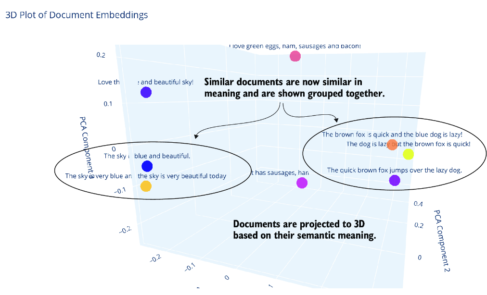

##### Figure 8.6 Embeddings in 3D, showing how similar semantic documents are grouped

The choice of which embedding model or service you use is up to you. The OpenAI embedding models are considered the best for general semantic similarity. This has made these models the standard for most memory and retrieval applications. With our understanding of how text can be vectorized with embeddings and stored in a vector database, we can move on to a more realistic example in the next section.

### 8.3.4 Querying document embeddings from Chroma

We can combine all the pieces and look at a complete example using a local vector database called Chroma DB. Many vector database options exist, but Chroma DB is an excellent local vector store for development or small-scale projects. There are also plenty of more robust options that you can consider later.

Listing 8.5 shows the new and relevant code sections from the `document_query_ chromadb.py` file. Note that the results are scored by distance and not by similarity. Cosine distance is determined by this equation:

Cosine Distance(A,B) = 1 – Cosine Similarity(A,B)

This means that cosine distance will range from 0 for most similar to 2 for semantically opposite in meaning.

##### Listing 8.5 `document_query_chromadb.py` (relevant code sections)

```
embeddings = [get_embedding(doc) for doc in documents]     #1
ids = [f"id{i}" for i in range(len(documents))]           #1

chroma_client = chromadb.Client()               #2
collection = chroma_client.create_collection(
                       name="documents")       #2
collection.add(     #3
    embeddings=embeddings,
    documents=documents,
    ids=ids
)

def query_chromadb(query, top_n=2):      #4
    query_embedding = get_embedding(query)
    results = collection.query(
        query_embeddings=[query_embedding],
        n_results=top_n
    )
    return [(id, score, text) for id, score, text in
            zip(results['ids'][0],
                results['distances'][0], 
                results['documents'][0])]

while True:     #5
    query = input("Enter a search query (or 'exit' to stop): ")
    if query.lower() == 'exit':
        break
    top_n = int(input("How many top matches do you want to see? "))
    search_results = query_chromadb(query, top_n)

    print("Top Matched Documents:")
    for id, score, text in search_results:
        print(f"""
ID:{id} TEXT: {text} SCORE: {round(score, 2)}
""")    #5

    print("\n")
###Output
Enter a search query (or 'exit' to stop): dogs are lazy
How many top matches do you want to see? 3
Top Matched Documents:
ID:id7 TEXT: The dog is lazy but the brown fox is quick! SCORE: 0.24
ID:id5 TEXT: The brown fox is quick and the blue dog is lazy! SCORE: 0.28
ID:id2 TEXT: The quick brown fox jumps over the lazy dog. SCORE: 0.29
```

#1 Generates embeddings for each document and assigns an ID  
#2 Creates a Chroma DB client and a collection  
#3 Adds document embeddings to the collection  
#4 Queries the datastore and returns the top n relevant documents  
#5 The input loop for user input and output of relevant documents/scores

As the earlier scenario demonstrated, you can now query the documents using semantic meaning rather than just key terms or phrases. These scenarios should now provide the background to see how the retrieval pattern works at a low level. In the next section, we’ll see how the retrieval pattern can be employed using LangChain.

## 8.4 Constructing RAG with LangChain

LangChain began as an open source project specializing in abstracting the retrieval pattern across multiple data sources and vector stores. It has since morphed into much more, but foundationally, it still provides excellent options for implementing retrieval.

Figure 8.7 shows a diagram from LangChain that identifies the process of storing documents for retrieval. These same steps may be replicated in whole or in part to implement memory retrieval. The critical difference between document and memory retrieval is the source and how content is transformed.

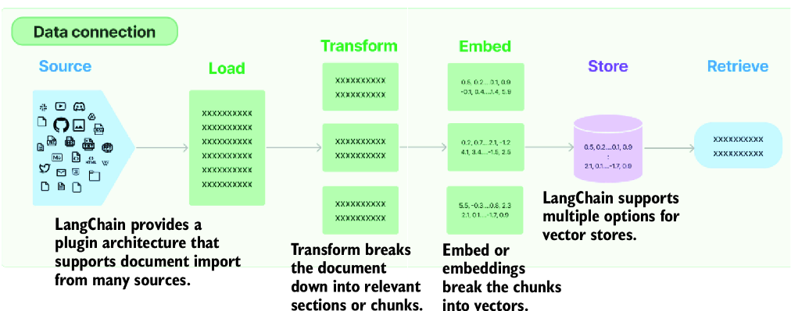

##### Figure 8.7 Load, transform, embed, and store steps in storing documents for later retrieval

We’ll examine how to implement each of these steps using LangChain and understand the nuances and details accompanying this implementation. In the next section, we’ll start by splitting and loading documents with LangChain.

### 8.4.1 Splitting and loading documents with LangChain

Retrieval mechanisms augment the context of a given prompt with specific information relevant to the request. For example, you may request detailed information about a local document. With earlier language models, submitting the whole document as part of the prompt wasn’t an option due to token limitations.

Today, we could submit a whole document for many commercial LLMs, such as GPT-4 Turbo, as part of a prompt request. However, the results may not be better and would likely cost more because of the increased number of tokens. Therefore, a better option is to split the document and use the relevant parts to request context—precisely what RAG and memory do.

Splitting a document is essential in breaking down content into semantically and specifically relevant sections. Figure 8.8 shows how to break down an HTML document containing the Mother Goose nursery rhymes. Often, splitting a document into contextual semantic chunks requires careful consideration.

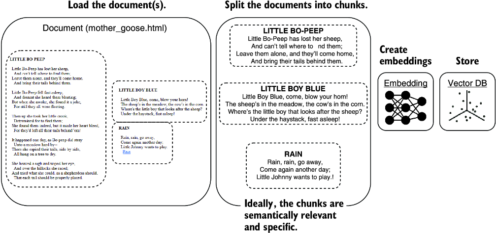

##### Figure 8.8 How the document would ideally be split into chunks for better semantic and contextual meaning

Ideally, when we split documents into chunks, they are broken down by relevance and semantic meaning. While an LLM or agent could help us with this, we’ll look at current toolkit options within LangChain for splitting documents. Later in this chapter, we’ll look at a semantic function that can assist us in semantically dividing content for embeddings.

For the next exercise, open `langchain_load_splitting.py` in VS Code, as shown in listing 8.6. This code shows where we left off from listing 8.5, in the previous section. Instead of using the sample documents, we’re loading the Mother Goose nursery rhymes this time.

##### Listing 8.6 `langchain_load_splitting.py` (sections and output)

```
From langchain_community.document_loaders 
                     ↪ import UnstructuredHTMLLoader    #1
from langchain.text_splitter import RecursiveCharacterTextSplitter
#previous code

loader = UnstructuredHTMLLoader(
                   "sample_documents/mother_goose.xhtml")   #2
data = loader.load    #3

text_splitter = RecursiveCharacterTextSplitter(
    chunk_size=100,
    chunk_overlap=25,     #4
    length_function=len,
    add_start_index=True,
)
documents = text_splitter.split_documents(data)

documents = [doc.page_content 
                ↪ for doc in documents] [100:350]   #5

embeddings = [get_embedding(doc) for doc in documents]     #6
ids = [f"id{i}" for i in range(len(documents))]
###Output
Enter a search query (or 'exit' to stop): who kissed the girls and made 
them cry?
How many top matches do you want to see? 3
Top Matched Documents:
ID:id233 TEXT: And chid her daughter,
        And kissed my sister instead of me. SCORE: 0.4…
```

#1 New LangChain imports  
#2 Loads the document as HTML  
#3 Loads the document  
#4 Splits the document into blocks of text 100 characters long with a 25-character overlap  
#5 Embeds only 250 chunks, which is cheaper and faster  
#6 Returns the embedding for each document

Note in listing 8.6 that the HTML document gets split into 100-character chunks with a 25-character overlap. The overlap allows the document’s parts not to cut off specific thoughts. We selected the splitter for this exercise because it was easy to use, set up, and understand.

Go ahead and run the `langchain_load_splitting.py` file in VS Code (F5). Enter a query, and see what results you get. The output in listing 8.6 shows good results given a specific example. Remember that we only embedded 250 document chunks to reduce costs and keep the exercise short. Of course, you can always try to embed the entire document or use a minor input document example.

Perhaps the most critical element to building proper retrieval is the process of document splitting. You can use numerous methods to split a document, including multiple concurrent methods. More than one method passes and splits the document for numerous embedding views of the same document. In the next section, we’ll examine a more general technique for splitting documents, using tokens and tokenization.

### 8.4.2 Splitting documents by token with LangChain

*Tokenization* is the process of breaking text into word tokens. Where a word token represents a succinct element in the text, a token could be a word like *hold* or even a symbol like the left curly brace ({), depending on what’s relevant.

Splitting documents using tokenization provides a better base for how the text will be interpreted by language models and for semantic similarity. Tokenization also allows the removal of irrelevant characters, such as whitespace, making the similarity matching of documents more relevant and generally providing better results.

For the next code exercise, open the `langchain_token_splitting.py` file in VS Code, as shown in listing 8.7. Now we split the document using tokenization, which breaks the document into sections of unequal size. The unequal size results from the large sections of whitespace of the original document.

##### Listing 8.7 `langchain_token_splitting.py` (relevant new code)

```
loader = UnstructuredHTMLLoader("sample_documents/mother_goose.xhtml")
data = loader.load()
text_splitter = CharacterTextSplitter.from_tiktoken_encoder(
    chunk_size=50, chunk_overlap=10      #1
)

documents = text_splitter.split_documents(data)
documents = [doc for doc in documents][8:94]      #2

db = Chroma.from_documents(documents, OpenAIEmbeddings())

def query_documents(query, top_n=2):
    docs = db.similarity_search(query, top_n)      #3
    return docs
###Output
Created a chunk of size 68, 
which is longer than the specified 50
Created a chunk of size 67, 
which is longer than the specified 50     #4
Enter a search query (or 'exit' to stop): 
                     who kissed the girls and made them cry?
How many top matches do you want to see? 3
Top Matched Documents:
Document 1: GEORGY PORGY

        Georgy Porgy, pudding and pie,
        Kissed the girls and made them cry.
```

#1 Updates to 50 tokens and overlap of 10 tokens  
#2 Selects just the documents that contain rhymes  
#3 Uses the database’s similarity search  
#4 Breaks into irregular size chunks because of the whitespace

Run the `langchain_token_splitting.py` code in VS Code (F5). You can use the query we used last time or your own. Notice how the results are significantly better than the previous exercise. However, the results are still suspect because the query uses several similar words in the same order.

A better test would be to try a semantically similar phrase but one that uses different words and check the results. With the code still running, enter a new phrase to query: `Why` `are` `the` `girls` `crying?` Listing 8.8 shows the results of executing that query. If you run this example yourself and scroll down over the output, you’ll see Georgy Porgy appear in either the second or third returned document.

##### Listing 8.8 Query: Who made the girls cry?

```
Enter a search query (or 'exit' to stop): Who made the girls cry?
How many top matches do you want to see? 3
Top Matched Documents:
Document 1: WILLY, WILLY

        Willy, Willy Wilkin…
```

This exercise shows how various retrieval methods can be employed to return documents semantically. With this base established, we can see how RAG can be applied to knowledge and memory systems. The following section will discuss RAG as it applies to knowledge of agents and agentic systems.

## 8.5 Applying RAG to building agent knowledge

Knowledge in agents encompasses employing RAG to search semantically across unstructured documents. These documents could be anything from PDFs to Microsoft Word documents and all text, including code. Agentic knowledge also includes using unstructured documents for Q&amp;A, reference lookup, information augmentation, and other future patterns.

Nexus, the agent platform developed in tandem with this book and introduced in the previous chapter, employs complete knowledge and memory systems for agents. In this section, we’ll uncover how the knowledge system works.

To install Nexus for just this chapter, see listing 8.9. Open a terminal within the `chapter_08` folder, and execute the commands in the listing to download, install, and run Nexus in normal or development mode. If you want to refer to the code, you should install the project in development and configure the debugger to run the Streamlit app from VS Code. Refer to chapter 7 if you need a refresher on any of these steps.

##### Listing 8.9 Installing Nexus

```
# to install and run
pip install git+https://github.com/cxbxmxcx/Nexus.git

nexus run
# install in development mode
git clone https://github.com/cxbxmxcx/Nexus.git

# Install the cloned repository in editable mode
pip install -e Nexus
```

Regardless of which method you decide to run the app in after you log in, navigate to the Knowledge Store Manager page, as shown in figure 8.9. Create a new Knowledge Store, and then upload the `sample_documents/back_to_the_future.txt` movie script.

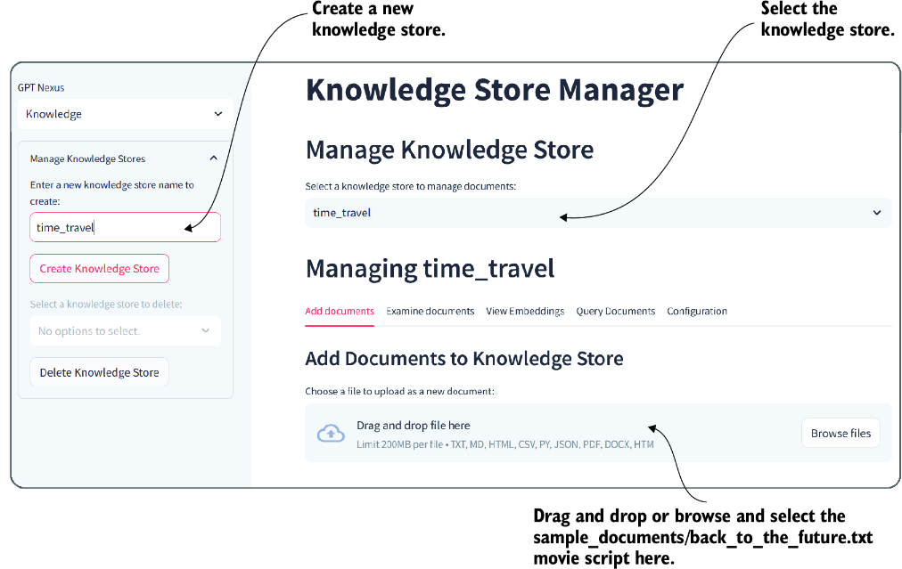

##### Figure 8.9 Adding a new knowledge store and populating it with a document

The script is a large document, and it may take a while to load, chunk, and embed the parts into the Chroma DB vector database. Wait for the indexing to complete, and then you can inspect the embeddings and run a query, as shown in figure 8.10.

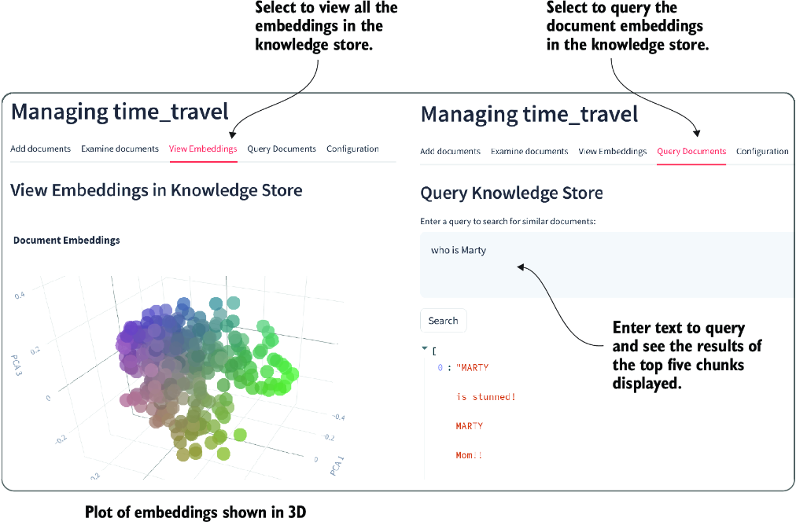

##### Figure 8.10 The embeddings and document query views

Now, we can connect the knowledge store to a supported agent and ask questions. Use the top-left selector to choose the chat page within the Nexus interface. Then, select an agent and the `time_travel` knowledge store, as shown in figure 8.11. You will also need to select an agent engine that supports knowledge. Each of the multiple agent engines requires the proper configuration to be accessible.

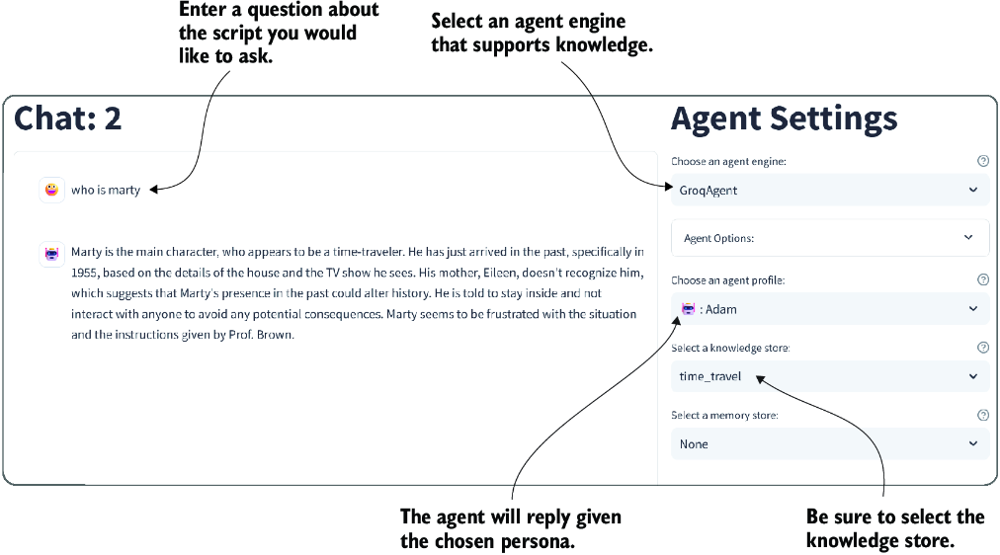

##### Figure 8.11 Enabling the knowledge store for agent use

Currently, as of this chapter, Nexus supports access to only a single knowledge store at a time. In a future version, agents may be able to select multiple knowledge stores at a time. This may include more advanced options, from semantic knowledge to employing other forms of RAG.

You can also configure the RAG settings within the Configuration tab of the Knowledge Store Manager page, as shown in figure 8.12. As of now, you can select from the type of splitter (Chunking Option field) to chunk the document, along with the Chunk Size field and Overlap field.

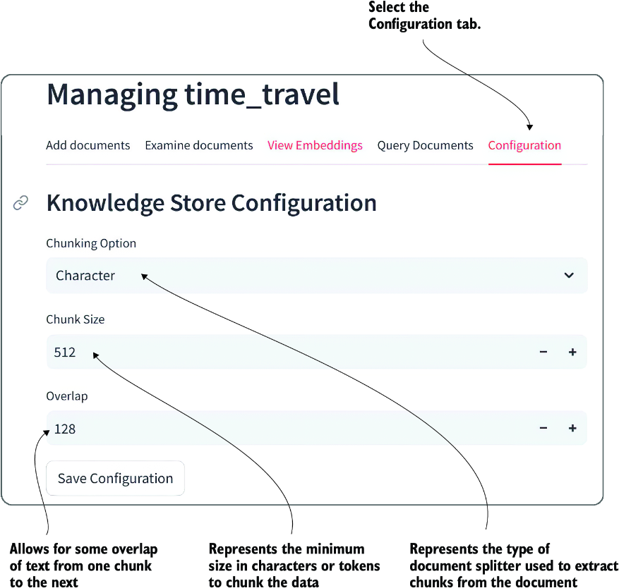

##### Figure 8.12 Managing the knowledge store splitting and chunking options

The loading, splitting, chunking, and embedding options provided are the only basic options supported by LangChain for now. In future versions of Nexus, more options and patterns will be offered. The code to support other options can be added directly to Nexus.

We won’t cover the code that performs the RAG as it’s very similar to what we already covered. Feel free to review the Nexus code, particularly the `KnowledgeManager` class in the `knowledge_manager.py` file.

While the retrieval patterns for knowledge and memory are quite similar for augmentation, the two patterns differ when it comes to populating the stores. In the next section, we’ll explore what makes memory in agents unique.

## 8.6 Implementing memory in agentic systems

Memory in agents and AI applications is often described in the same terms as cognitive memory functions. *Cognitive* memory describes the type of memory we use to remember what we did 30 seconds ago or how tall we were 30 years ago. Computer memory is also an essential element of agent memory, but one we won’t consider in this section.

Figure 8.13 shows how memory is broken down into sensory, short-term, and long-term memory. This memory can be applied to AI agents, and this list describes how each form of memory maps to agent functions:

- *Sensory memory in AI* —Functions such as RAG but with images/audio/haptic data forms. Briefly holds input data (e.g., text and images) for immediate processing but not long-term storage.
- *Short-term/working memory in AI* —Acts as an active memory buffer of conversation history. We’re holding a limited amount of recent input and context for immediate analysis and response generation. Within Nexus, short- and long-term conversational memory is also held in the context of the thread.
- *Long-term memory in AI* —Longer-term memory storage relevant to the agent’s or user’s life. Semantic memory provides a robust capacity to store and retrieve relevant global or local facts and concepts.

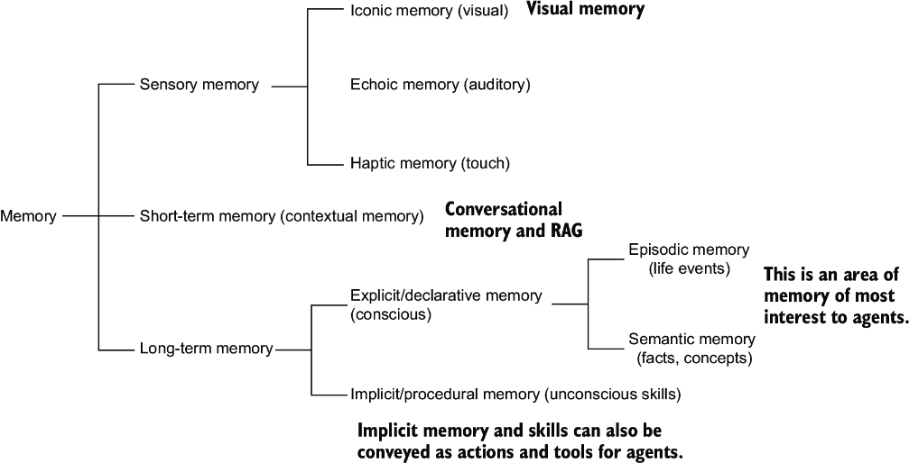

##### Figure 8.13 How memory is broken down into various forms

While memory uses the exact same retrieval and augmentation mechanisms as knowledge, it typically differs significantly when updating or appending memories. Figure 8.14 highlights the process of capturing and using memories to augment prompts. Because memories are often different from the size of complete documents, we can avoid using any splitting or chunking mechanisms.

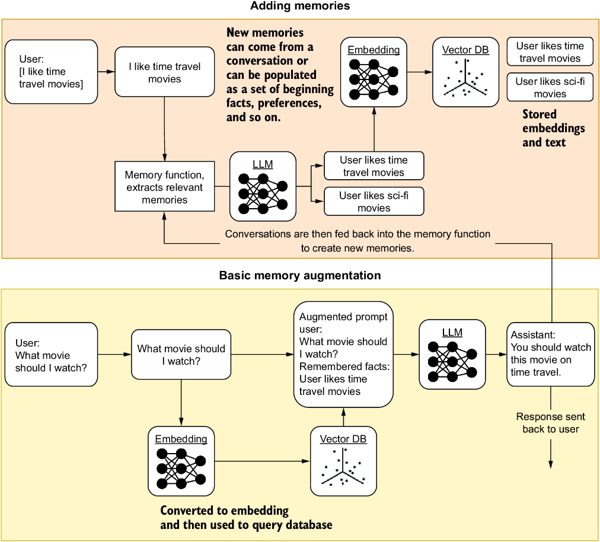

##### Figure 8.14 Basic memory retrieval and augmentation workflow

Nexus provides a mechanism like the knowledge store, allowing users to create memory stores that can be configured for various uses and applications. It also supports some of the more advanced memory forms highlighted in figure 8.13. The following section will examine how basic memory stores work in Nexus.

### 8.6.1 Consuming memory stores in Nexus

Memory stores operate and are constructed like knowledge stores in Nexus. They both heavily rely on the retrieval pattern. What differs is the extra steps memory systems take to build new memories.

Go ahead and start Nexus, and refer to listing 8.9 if you need to install it. After logging in, select the Memory page, and create a new memory store, as shown in figure 8.15. Select an agent engine, and then add a few personal facts and preferences about yourself.

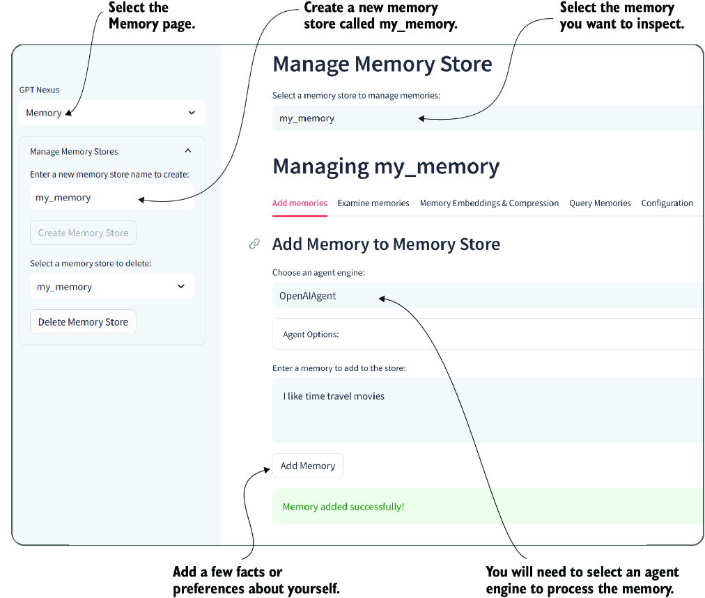

##### Figure 8.15 Adding memories to a newly created memory store

The reason we need an agent (LLM) was shown in figure 8.14 earlier. When information is fed into a memory store, it’s generally processed through an LLM using a memory function, whose purpose is to process the statements/conversations into semantically relevant information related to the type of memory.

Listing 8.10 shows the conversational memory function used to extract information from a conversation into memories. Yes, this is just the header portion of the prompt sent to the LLM, instructing it how to extract information from a conversation.

##### Listing 8.10 Conversational memory function

```
Summarize the conversation and create a set of statements that summarize 
the conversation. Return a JSON object with the following keys: 'summary'. 
Each key should have a list of statements that are relevant to that 
category. Return only the JSON object and nothing else.
```

After you generate a few relevant memories about yourself, return to the Chat area in Nexus, enable the `my_memory` memory store, and see how well the agent knows you. Figure 8.16 shows a sample conversation using a different agent engine.

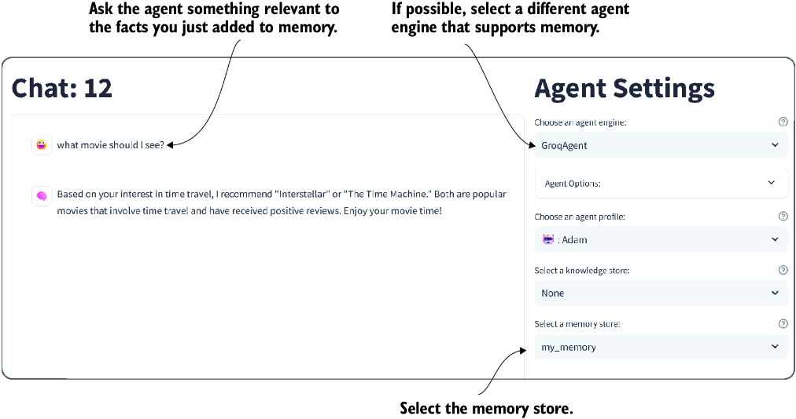

##### Figure 8.16 Conversing with a different agent on the same memory store

This is an example of a basic memory pattern that extracts facts/preferences from conversations and stores them in a vector database as memories. Numerous other implementations of memory follow those displayed earlier in figure 8.13. We’ll implement those in the next section.

### 8.6.2 Semantic memory and applications to semantic, episodic, and procedural memory

Psychologists categorize memory into multiple forms, depending on what information is remembered. Semantic, episodic, and procedural memory all represent different types of information. *Episodic* memories are about events, *procedural* memories are about the process or steps, and *semantic* represents the meaning and could include feelings or emotions. Other forms of memory (geospatial is another), aren’t described here but could be.

Because these memories rely on an additional level of categorization, they also rely on another level of semantic categorization. Some platforms, such as Semantic Kernel (SK), refer to this as *semantic memory*. This can be confusing because semantic categorization is also applied to extract episodic and procedural memories.

Figure 8.17 shows the semantic memory categorization process, also sometimes called semantic memory. The difference between semantic memory and regular memory is the additional step of processing the input semantically and extracting relevant questions that can be used to query the memory-relevant vector database.

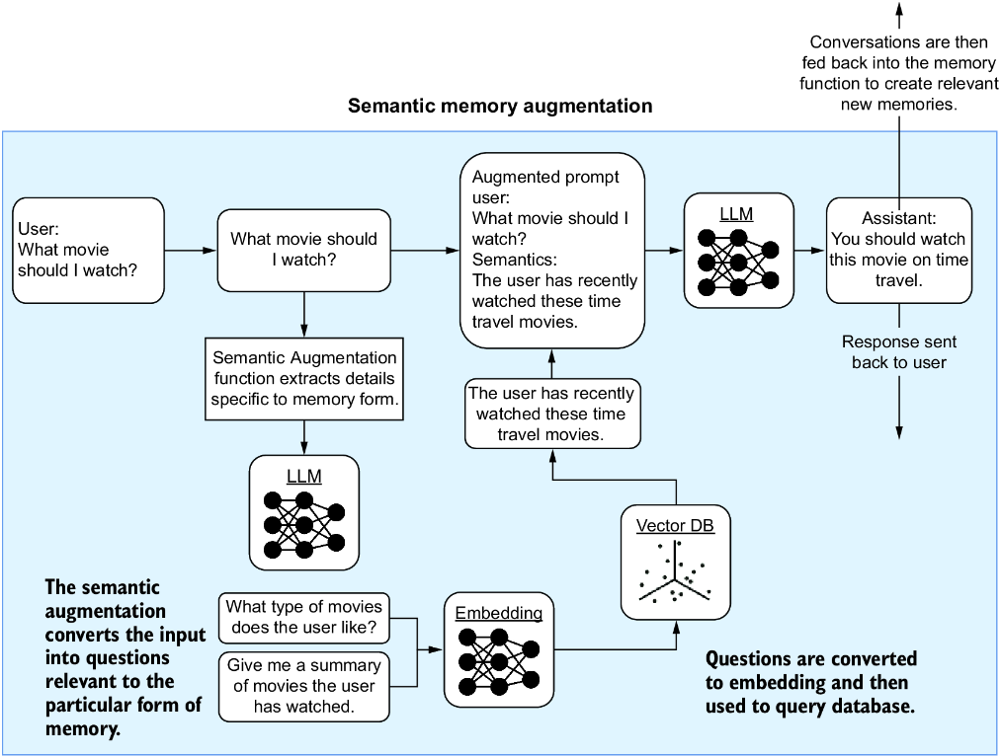

##### Figure 8.17 How semantic memory augmentation works

The benefit of using semantic augmentation is the increased ability to extract more relevant memories. We can see this in operation by jumping back into Nexus and creating a new semantic memory store.

Figure 8.18 shows how to configure a new memory store using semantic memory. As of yet, you can’t configure the specific function prompts for memory, augmentation, and summarization. However, it can be useful to read through each of the function prompts to gain a sense of how they work.

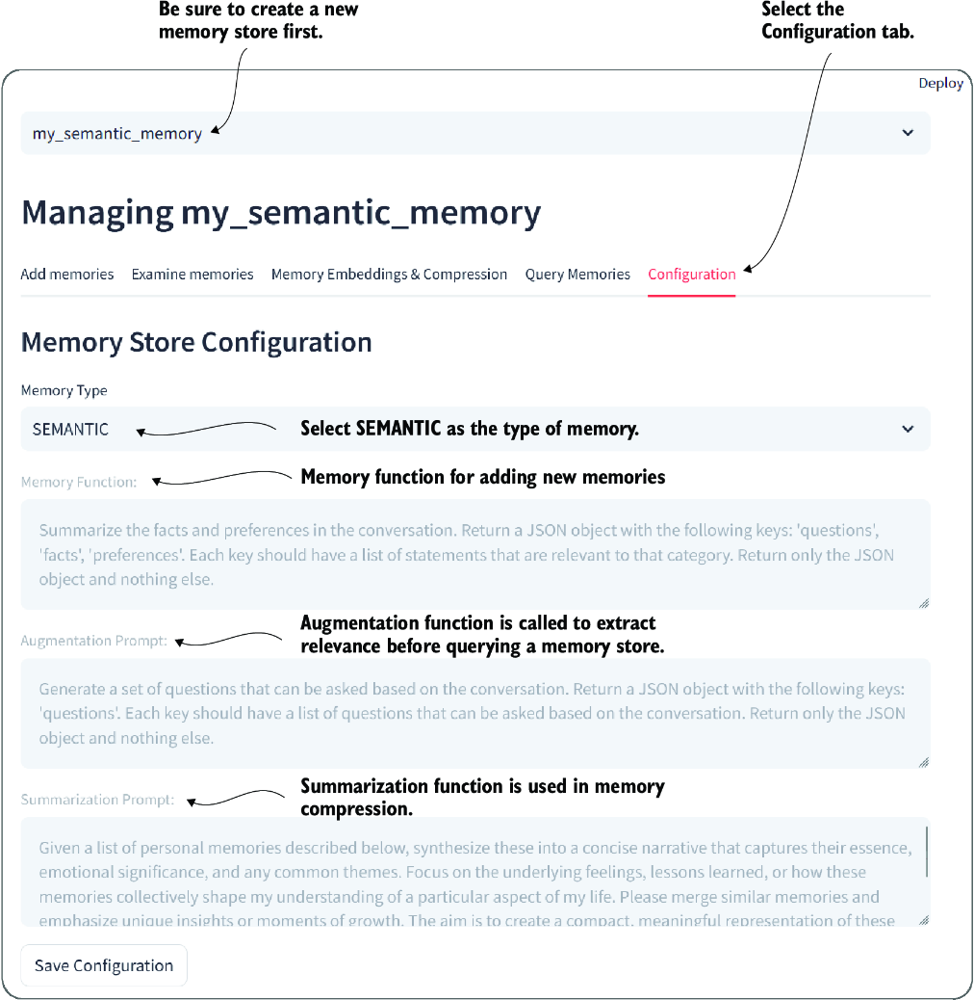

##### Figure 8.18 Configuration for changing the memory store type to semantic

Now, if you go back and add facts and preferences, they will convert to the semantics of the relevant memory type. Figure 8.19 shows an example of memories being populated for the same set of statements into two different forms of memory. Generally, the statements entered into memory would be more specific to the form of memory.

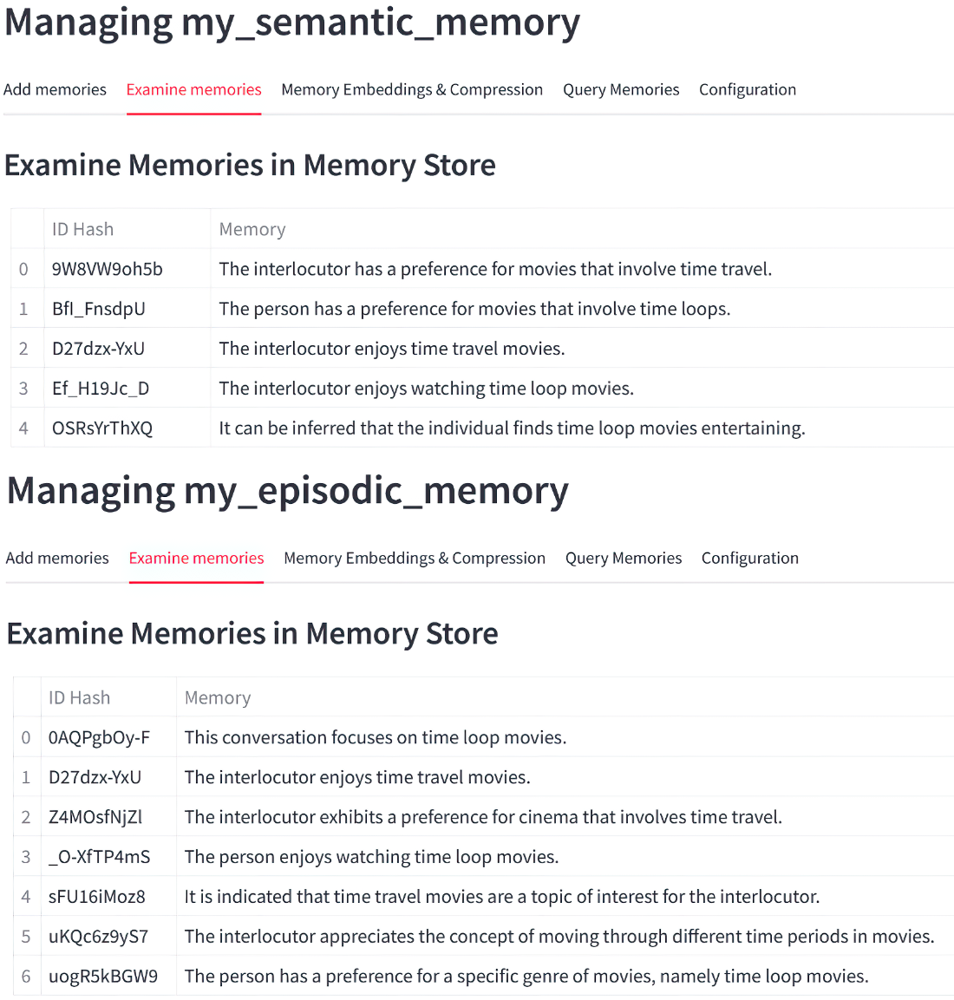

##### Figure 8.19 Comparing memories for the same information given two different memory types

Memory and knowledge can significantly assist an agent with various application types. Indeed, a single memory/knowledge store could feed one or multiple agents, allowing for further specialized interpretations of both types of stores. We’ll finish out the chapter by discussing memory/knowledge compression next.

## 8.7 Understanding memory and knowledge compression

Much like our own memory, memory stores can become cluttered with redundant information and numerous unrelated details over time. Internally, our minds deal with memory clutter by compressing or summarizing memories. Our minds remember more significant details over less important ones, and memories accessed more frequently.

We can apply similar principles of memory compression to agent memory and other retrieval systems to extract significant details. The principle of compression is similar to semantic augmentation but adds another layer to the preclusters groups of related memories that can collectively be summarized.

Figure 8.20 shows the process of memory/knowledge compression. Memories or knowledge are first clustered using an algorithm such as k-means. Then, the groups of memories are passed through a compression function, which summarizes and collects the items into more succinct representations.

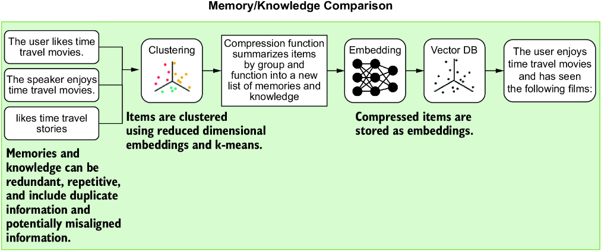

##### Figure 8.20 The process of memory and knowledge compression

Nexus provides for both knowledge and memory store compression using k-means optimal clustering. Figure 8.21 shows the compression interface for memory. Within the compression interface, you’ll see the items displayed in 3D and clustered. The size (number of items) of the clusters is shown in the left table.

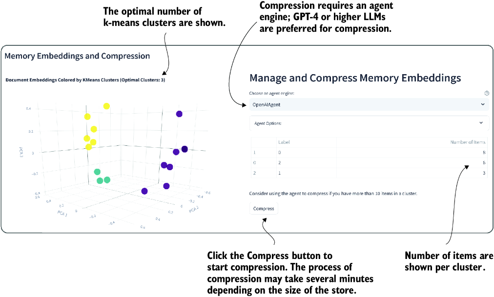

##### Figure 8.21 The interface for compressing memories

Compressing memories and even knowledge is generally recommended if the number of items in a cluster is large or unbalanced. Each use case for compression may vary depending on the use and application of memories. Generally, though, if an inspection of the items in a store contains repetitive or duplicate information, it’s a good time for compression. The following is a summary of use cases for applications that would benefit from compression.

#### The case for knowledge compression

Knowledge retrieval and augmentation have also been shown to benefit significantly from compression. Results will vary by use case, but generally, the more verbose the source of knowledge, the more it will benefit from compression. Documents that feature literary prose, such as stories and novels, will benefit more than, say, a base of code. However, if the code is likewise very repetitive, compression could also be shown to be beneficial.

#### The case for how often you apply compression

Memory will often benefit from the periodic compression application, whereas knowledge stores typically only help on the first load. How frequently you apply compression will greatly depend on the memory use, frequency, and quantity.

#### The case for applying compression more than once

Multiple passes of compression at the same time has been shown to improve retrieval performance. Other patterns have also suggested using memory or knowledge at various levels of compression. For example, a knowledge store is compressed two times, resulting in three different levels of knowledge.

#### The case for blending knowledge and memory compression

If a system is specialized to a particular source of knowledge and that system also employs memories, there may be further optimization to consolidate stores. Another approach is to populate memory with the starting knowledge of a document directly.

#### The case for multiple memory or knowledge stores

In more advanced systems, we’ll look at agents employing multiple memory and knowledge stores relevant to their workflow. For example, an agent could employ individual memory stores as part of its conversations with individual users, perhaps including the ability to share different groups of memory with different groups of individuals. Memory and knowledge retrieval are cornerstones of agentic systems, and we can now summarize what we covered and review some learning exercises in the next section.

## 8.8 Exercises

Use the following exercises to improve your knowledge of the material:

- *Exercise 1* —Load and Split a Different Document (Intermediate)

*Objective* *—*Understand the effect of document splitting on retrieval efficiency by using LangChain.

*Tasks*:

- - Select a different document (e.g., a news article, a scientific paper, or a short story).
  - Use LangChain to load and split the document into chunks.
  - Analyze how the document is split into chunks and how it affects the retrieval process.
- *Exercise 2* —Experiment with Semantic Search (Intermediate)

*Objective* *—*Compare the effectiveness of various vectorization techniques by performing semantic searches.

*Tasks*:

- - Choose a set of documents for semantic search.
  - Use a vectorization method such as Word2Vec or BERT embeddings instead of TF–IDF.
  - Perform the semantic search, and compare the results with those obtained using TF–IDF to understand the differences and effectiveness.
- *Exercise 3* —Implement a Custom RAG Workflow (Advanced)

*Objective* *—*Apply theoretical knowledge of RAG in a practical context using LangChain.

*Tasks*:

- - Choose a specific application (e.g., customer service inquiries or academic research queries).
  - Design and implement a custom RAG workflow using LangChain.
  - Tailor the workflow to suit the chosen application, and test its effectiveness.
- *Exercise 4* —Build a Knowledge Store and Experiment with Splitting Patterns (Intermediate)

*Objective* *—*Understand how different splitting patterns and compression affect knowledge retrieval.

*Tasks*:

- - Build a knowledge store, and populate it with a couple of documents.
  - Experiment with different forms of splitting/chunking patterns, and analyze their effect on retrieval.
  - Compress the knowledge store, and observe the effects on query performance.
- *Exercise 5* —Build and Test Various Memory Stores (Advanced)

*Objective* *—*Understand the uniqueness and use cases of different memory store types.

*Tasks*:

- - Build various forms of memory stores (conversational, semantic, episodic, and procedural).
  - Interact with an agent using each type of memory store, and observe the differences.
  - Compress the memory store, and analyze the effect on memory retrieval.

## Summary

- Memory in AI applications differentiates between unstructured and structured memory, highlighting their use in contextualizing prompts for more relevant interactions.
- Retrieval augmented generation (RAG) is a mechanism for enhancing prompts with context from external documents, using vector embeddings and similarity search to retrieve relevant content.
- Semantic search with document indexing converts documents into semantic vectors using TF–IDF and cosine similarity, enhancing the capability to perform semantic searches across indexed documents.
- Vector databases and similarity search stores document vectors in a vector database, facilitating efficient similarity searches and improving retrieval accuracy.
- Document embeddings capture semantic meanings, using models such as OpenAI’s models to generate embeddings that preserve a document’s context and facilitate semantic similarity searches.
- LangChain provides several tools for performing RAG, and it abstracts the retrieval process, allowing for easy implementation of RAG and memory systems across various data sources and vector stores.
- Short-term and long-term memory in LangChain implements conversational memory within LangChain, distinguishing between short-term buffering patterns and long-term storage solutions.
- Storing document vectors in databases for efficient similarity searches is crucial for implementing scalable retrieval systems in AI applications.
- Agent knowledge directly relates to the general RAG pattern of performing question and answer on documents or other textual information.
- Agent memory is a pattern related to RAG that captures the agentic interactions with users, itself, and other systems.
- Nexus is a platform that implements agentic knowledge and memory systems, including setting up knowledge stores for document retrieval and memory stores for various forms of memory.
- Semantic memory augmentation (semantic memory) differentiates between various types of memories (semantic, episodic, procedural). It implements them through semantic augmentation, enhancing agents’ ability to recall and use information relevantly specific to the nature of the memories.
- Memory and knowledge compression are techniques for condensing information stored in memory and knowledge systems, improving retrieval efficiency and relevancy through clustering and summarization.
