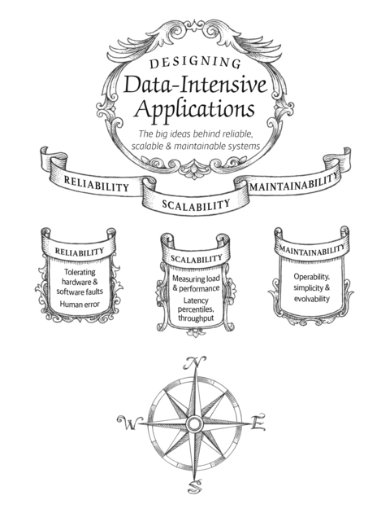
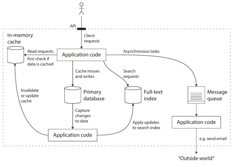
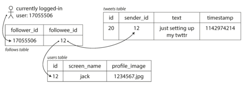
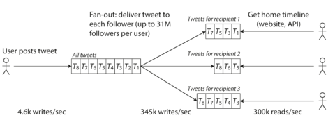
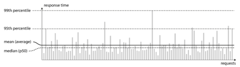
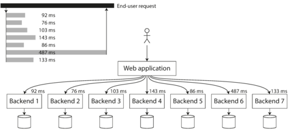

# Chapter 1. Reliable, Scalable, and Maintainable Applications

> *The Internet was done so well that most people think of it as a natural resource like the Pacific Ocean, rather than something that was man-made. When was the last time a technology with a scale like that was so error-free?*
> 
> [Alan Kay](http://www.drdobbs.com/architecture-and-design/interview-with-alan-kay/240003442), in interview with *Dr Dobb’s Journal* (2012)



Many applications today are *data-intensive*, as opposed to *compute-intensive*. Raw CPU power is rarely a limiting factor for these applications—bigger problems are usually the amount of data, the complexity of data, and the speed at which it is changing.

A data-intensive application is typically built from standard building blocks that provide commonly needed functionality. For example, many applications need to:

- Store data so that they, or another application, can find it again later (*databases*)
- Remember the result of an expensive operation, to speed up reads (*caches*)
- Allow users to search data by keyword or filter it in various ways (*search indexes*)
- Send a message to another process, to be handled asynchronously (*stream processing*)
- Periodically crunch a large amount of accumulated data (*batch processing*)

If that sounds painfully obvious, that’s just because these *data systems* are such a successful abstraction: we use them all the time without thinking too much. When building an application, most engineers wouldn’t dream of writing a new data storage engine from scratch, because databases are a perfectly good tool for the job.

But reality is not that simple. There are many database systems with different characteristics, because different applications have different requirements. There are various approaches to caching, several ways of building search indexes, and so on. When building an application, we still need to figure out which tools and which approaches are the most appropriate for the task at hand. And it can be hard to combine tools when you need to do something that a single tool cannot do alone.

This book is a journey through both the principles and the practicalities of data systems, and how you can use them to build data-intensive applications. We will explore what different tools have in common, what distinguishes them, and how they achieve their characteristics.

In this chapter, we will start by exploring the fundamentals of what we are trying to achieve: reliable, scalable, and maintainable data systems. We’ll clarify what those things mean, outline some ways of thinking about them, and go over the basics that we will need for later chapters. In the following chapters we will continue layer by layer, looking at different design decisions that need to be considered when working on a data-intensive application.

# Thinking About Data Systems

We typically think of databases, queues, caches, etc. as being very different categories of tools. Although a database and a message queue have some superficial similarity—both store data for some time—they have very different access patterns, which means different performance characteristics, and thus very different implementations.

So why should we lump them all together under an umbrella term like *data systems*?

Many new tools for data storage and processing have emerged in recent years. They are optimized for a variety of different use cases, and they no longer neatly fit into traditional categories \[[1](ch01.md)]. For example, there are datastores that are also used as message queues (Redis), and there are message queues with database-like durability guarantees (Apache Kafka). The boundaries between the categories are becoming blurred.

Secondly, increasingly many applications now have such demanding or wide-ranging requirements that a single tool can no longer meet all of its data processing and storage needs. Instead, the work is broken down into tasks that *can* be performed efficiently on a single tool, and those different tools are stitched together using application code.

For example, if you have an application-managed caching layer (using Memcached or similar), or a full-text search server (such as Elasticsearch or Solr) separate from your main database, it is normally the application code’s responsibility to keep those caches and indexes in sync with the main database. [Figure 1-1](#fig_introduction_composite) gives a glimpse of what this may look like (we will go into detail in later chapters).



###### Figure 1-1. One possible architecture for a data system that combines several components.

When you combine several tools in order to provide a service, the service’s interface or application programming interface (API) usually hides those implementation details from clients. Now you have essentially created a new, special-purpose data system from smaller, general-purpose components. Your composite data system may provide certain guarantees: e.g., that the cache will be correctly invalidated or updated on writes so that outside clients see consistent results. You are now not only an application developer, but also a data system designer.

If you are designing a data system or service, a lot of tricky questions arise. How do you ensure that the data remains correct and complete, even when things go wrong internally? How do you provide consistently good performance to clients, even when parts of your system are degraded? How do you scale to handle an increase in load? What does a good API for the service look like?

There are many factors that may influence the design of a data system, including the skills and experience of the people involved, legacy system dependencies, the timescale for delivery, your organization’s tolerance of different kinds of risk, regulatory constraints, etc. Those factors depend very much on the situation.

In this book, we focus on three concerns that are important in most software systems:

Reliability

The system should continue to work *correctly* (performing the correct function at the desired level of performance) even in the face of *adversity* (hardware or software faults, and even human error). See [“Reliability”](#sec_introduction_reliability).

Scalability

As the system *grows* (in data volume, traffic volume, or complexity), there should be reasonable ways of dealing with that growth. See [“Scalability”](#sec_introduction_scalability).

Maintainability

Over time, many different people will work on the system (engineering and operations, both maintaining current behavior and adapting the system to new use cases), and they should all be able to work on it *productively*. See [“Maintainability”](#sec_introduction_maintainability).

These words are often cast around without a clear understanding of what they mean. In the interest of thoughtful engineering, we will spend the rest of this chapter exploring ways of thinking about reliability, scalability, and maintainability. Then, in the following chapters, we will look at various techniques, architectures, and algorithms that are used in order to achieve those goals.

# Reliability

Everybody has an intuitive idea of what it means for something to be reliable or unreliable. For software, typical expectations include:

- The application performs the function that the user expected.
- It can tolerate the user making mistakes or using the software in unexpected ways.
- Its performance is good enough for the required use case, under the expected load and data volume.
- The system prevents any unauthorized access and abuse.

If all those things together mean “working correctly,” then we can understand *reliability* as meaning, roughly, “continuing to work correctly, even when things go wrong.”

The things that can go wrong are called *faults*, and systems that anticipate faults and can cope with them are called *fault-tolerant* or *resilient*. The former term is slightly misleading: it suggests that we could make a system tolerant of every possible kind of fault, which in reality is not feasible. If the entire planet Earth (and all servers on it) were swallowed by a black hole, tolerance of that fault would require web hosting in space—good luck getting that budget item approved. So it only makes sense to talk about tolerating *certain types* of faults.

Note that a fault is not the same as a failure \[[2](ch01.md)]. A fault is usually defined as one component of the system deviating from its spec, whereas a *failure* is when the system as a whole stops providing the required service to the user. It is impossible to reduce the probability of a fault to zero; therefore it is usually best to design fault-tolerance mechanisms that prevent faults from causing failures. In this book we cover several techniques for building reliable systems from unreliable parts.

Counterintuitively, in such fault-tolerant systems, it can make sense to *increase* the rate of faults by triggering them deliberately—for example, by randomly killing individual processes without warning. Many critical bugs are actually due to poor error handling \[[3](ch01.md)]; by deliberately inducing faults, you ensure that the fault-tolerance machinery is continually exercised and tested, which can increase your confidence that faults will be handled correctly when they occur naturally. The Netflix *Chaos Monkey* \[[4](ch01.md)] is an example of this approach.

Although we generally prefer tolerating faults over preventing faults, there are cases where prevention is better than cure (e.g., because no cure exists). This is the case with security matters, for example: if an attacker has compromised a system and gained access to sensitive data, that event cannot be undone. However, this book mostly deals with the kinds of faults that can be cured, as described in the following sections.

## Hardware Faults

When we think of causes of system failure, hardware faults quickly come to mind. Hard disks crash, RAM becomes faulty, the power grid has a blackout, someone unplugs the wrong network cable. Anyone who has worked with large datacenters can tell you that these things happen *all the time* when you have a lot of machines.

Hard disks are reported as having a mean time to failure (MTTF) of about 10 to 50 years \[[5](ch01.md), [6](ch01.md)]. Thus, on a storage cluster with 10,000 disks, we should expect on average one disk to die per day.

Our first response is usually to add redundancy to the individual hardware components in order to reduce the failure rate of the system. Disks may be set up in a RAID configuration, servers may have dual power supplies and hot-swappable CPUs, and datacenters may have batteries and diesel generators for backup power. When one component dies, the redundant component can take its place while the broken component is replaced. This approach cannot completely prevent hardware problems from causing failures, but it is well understood and can often keep a machine running uninterrupted for years.

Until recently, redundancy of hardware components was sufficient for most applications, since it makes total failure of a single machine fairly rare. As long as you can restore a backup onto a new machine fairly quickly, the downtime in case of failure is not catastrophic in most applications. Thus, multi-machine redundancy was only required by a small number of applications for which high availability was absolutely essential.

However, as data volumes and applications’ computing demands have increased, more applications have begun using larger numbers of machines, which proportionally increases the rate of hardware faults. Moreover, in some cloud platforms such as Amazon Web Services (AWS) it is fairly common for virtual machine instances to become unavailable without warning \[[7](ch01.md)], as the platforms are designed to prioritize flexibility and elasticity[i](ch01.md) over single-machine reliability.

Hence there is a move toward systems that can tolerate the loss of entire machines, by using software fault-tolerance techniques in preference or in addition to hardware redundancy. Such systems also have operational advantages: a single-server system requires planned downtime if you need to reboot the machine (to apply operating system security patches, for example), whereas a system that can tolerate machine failure can be patched one node at a time, without downtime of the entire system (a *rolling upgrade*; see [Chapter 4](ch04.md)).

## Software Errors

We usually think of hardware faults as being random and independent from each other: one machine’s disk failing does not imply that another machine’s disk is going to fail. There may be weak correlations (for example due to a common cause, such as the temperature in the server rack), but otherwise it is unlikely that a large number of hardware components will fail at the same time.

Another class of fault is a systematic error within the system \[[8](ch01.md)]. Such faults are harder to anticipate, and because they are correlated across nodes, they tend to cause many more system failures than uncorrelated hardware faults \[[5](ch01.md)]. Examples include:

- A software bug that causes every instance of an application server to crash when given a particular bad input. For example, consider the leap second on June 30, 2012, that caused many applications to hang simultaneously due to a bug in the Linux kernel \[[9](ch01.md)].
- A runaway process that uses up some shared resource—CPU time, memory, disk space, or network bandwidth.
- A service that the system depends on that slows down, becomes unresponsive, or starts returning corrupted responses.
- Cascading failures, where a small fault in one component triggers a fault in another component, which in turn triggers further faults \[[10](ch01.md)].

The bugs that cause these kinds of software faults often lie dormant for a long time until they are triggered by an unusual set of circumstances. In those circumstances, it is revealed that the software is making some kind of assumption about its environment—and while that assumption is usually true, it eventually stops being true for some reason \[[11](ch01.md)].

There is no quick solution to the problem of systematic faults in software. Lots of small things can help: carefully thinking about assumptions and interactions in the system; thorough testing; process isolation; allowing processes to crash and restart; measuring, monitoring, and analyzing system behavior in production. If a system is expected to provide some guarantee (for example, in a message queue, that the number of incoming messages equals the number of outgoing messages), it can constantly check itself while it is running and raise an alert if a discrepancy is found \[[12](ch01.md)].

## Human Errors

Humans design and build software systems, and the operators who keep the systems running are also human. Even when they have the best intentions, humans are known to be unreliable. For example, one study of large internet services found that configuration errors by operators were the leading cause of outages, whereas hardware faults (servers or network) played a role in only 10–25% of outages \[[13](ch01.md)].

How do we make our systems reliable, in spite of unreliable humans? The best systems combine several approaches:

- Design systems in a way that minimizes opportunities for error. For example, well-designed abstractions, APIs, and admin interfaces make it easy to do “the right thing” and discourage “the wrong thing.” However, if the interfaces are too restrictive people will work around them, negating their benefit, so this is a tricky balance to get right.
- Decouple the places where people make the most mistakes from the places where they can cause failures. In particular, provide fully featured non-production *sandbox* environments where people can explore and experiment safely, using real data, without affecting real users.
- Test thoroughly at all levels, from unit tests to whole-system integration tests and manual tests \[[3](ch01.md)]. Automated testing is widely used, well understood, and especially valuable for covering corner cases that rarely arise in normal operation.
- Allow quick and easy recovery from human errors, to minimize the impact in the case of a failure. For example, make it fast to roll back configuration changes, roll out new code gradually (so that any unexpected bugs affect only a small subset of users), and provide tools to recompute data (in case it turns out that the old computation was incorrect).
- Set up detailed and clear monitoring, such as performance metrics and error rates. In other engineering disciplines this is referred to as *telemetry*. (Once a rocket has left the ground, telemetry is essential for tracking what is happening, and for understanding failures \[[14](ch01.md)].) Monitoring can show us early warning signals and allow us to check whether any assumptions or constraints are being violated. When a problem occurs, metrics can be invaluable in diagnosing the issue.
- Implement good management practices and training—a complex and important aspect, and beyond the scope of this book.

## How Important Is Reliability?

Reliability is not just for nuclear power stations and air traffic control software—more mundane applications are also expected to work reliably. Bugs in business applications cause lost productivity (and legal risks if figures are reported incorrectly), and outages of ecommerce sites can have huge costs in terms of lost revenue and damage to reputation.

Even in “noncritical” applications we have a responsibility to our users. Consider a parent who stores all their pictures and videos of their children in your photo application \[[15](ch01.md)]. How would they feel if that database was suddenly corrupted? Would they know how to restore it from a backup?

There are situations in which we may choose to sacrifice reliability in order to reduce development cost (e.g., when developing a prototype product for an unproven market) or operational cost (e.g., for a service with a very narrow profit margin)—but we should be very conscious of when we are cutting corners.

# Scalability

Even if a system is working reliably today, that doesn’t mean it will necessarily work reliably in the future. One common reason for degradation is increased load: perhaps the system has grown from 10,000 concurrent users to 100,000 concurrent users, or from 1 million to 10 million. Perhaps it is processing much larger volumes of data than it did before.

*Scalability* is the term we use to describe a system’s ability to cope with increased load. Note, however, that it is not a one-dimensional label that we can attach to a system: it is meaningless to say “X is scalable” or “Y doesn’t scale.” Rather, discussing scalability means considering questions like “If the system grows in a particular way, what are our options for coping with the growth?” and “How can we add computing resources to handle the additional load?”

## Describing Load

First, we need to succinctly describe the current load on the system; only then can we discuss growth questions (what happens if our load doubles?). Load can be described with a few numbers which we call *load parameters*. The best choice of parameters depends on the architecture of your system: it may be requests per second to a web server, the ratio of reads to writes in a database, the number of simultaneously active users in a chat room, the hit rate on a cache, or something else. Perhaps the average case is what matters for you, or perhaps your bottleneck is dominated by a small number of extreme cases.

To make this idea more concrete, let’s consider Twitter as an example, using data published in November 2012 \[[16](ch01.md)]. Two of Twitter’s main operations are:

Post tweet

A user can publish a new message to their followers (4.6k requests/sec on average, over 12k requests/sec at peak).

Home timeline

A user can view tweets posted by the people they follow (300k requests/sec).

Simply handling 12,000 writes per second (the peak rate for posting tweets) would be fairly easy. However, Twitter’s scaling challenge is not primarily due to tweet volume, but due to *fan-out*[ii](ch01.md)—each user follows many people, and each user is followed by many people. There are broadly two ways of implementing these two operations:

1. Posting a tweet simply inserts the new tweet into a global collection of tweets. When a user requests their home timeline, look up all the people they follow, find all the tweets for each of those users, and merge them (sorted by time). In a relational database like in [Figure 1-2](#fig_twitter_relational), you could write a query such as:
   
   ```
   SELECT tweets.*, users.* FROM tweets
     JOIN users   ON tweets.sender_id    = users.id
     JOIN follows ON follows.followee_id = users.id
     WHERE follows.follower_id = current_user
   ```
2. Maintain a cache for each user’s home timeline—like a mailbox of tweets for each recipient user (see [Figure 1-3](#fig_twitter_timelines)). When a user *posts a tweet*, look up all the people who follow that user, and insert the new tweet into each of their home timeline caches. The request to read the home timeline is then cheap, because its result has been computed ahead of time.



###### Figure 1-2. Simple relational schema for implementing a Twitter home timeline.



###### Figure 1-3. Twitter’s data pipeline for delivering tweets to followers, with load parameters as of November 2012 \[[16](ch01.md)].

The first version of Twitter used approach 1, but the systems struggled to keep up with the load of home timeline queries, so the company switched to approach 2. This works better because the average rate of published tweets is almost two orders of magnitude lower than the rate of home timeline reads, and so in this case it’s preferable to do more work at write time and less at read time.

However, the downside of approach 2 is that posting a tweet now requires a lot of extra work. On average, a tweet is delivered to about 75 followers, so 4.6k tweets per second become 345k writes per second to the home timeline caches. But this average hides the fact that the number of followers per user varies wildly, and some users have over 30 million followers. This means that a single tweet may result in over 30 million writes to home timelines! Doing this in a timely manner—Twitter tries to deliver tweets to followers within five seconds—is a significant challenge.

In the example of Twitter, the distribution of followers per user (maybe weighted by how often those users tweet) is a key load parameter for discussing scalability, since it determines the fan-out load. Your application may have very different characteristics, but you can apply similar principles to reasoning about its load.

The final twist of the Twitter anecdote: now that approach 2 is robustly implemented, Twitter is moving to a hybrid of both approaches. Most users’ tweets continue to be fanned out to home timelines at the time when they are posted, but a small number of users with a very large number of followers (i.e., celebrities) are excepted from this fan-out. Tweets from any celebrities that a user may follow are fetched separately and merged with that user’s home timeline when it is read, like in approach 1. This hybrid approach is able to deliver consistently good performance. We will revisit this example in [Chapter 12](ch12.md) after we have covered some more technical ground.

## Describing Performance

Once you have described the load on your system, you can investigate what happens when the load increases. You can look at it in two ways:

- When you increase a load parameter and keep the system resources (CPU, memory, network bandwidth, etc.) unchanged, how is the performance of your system affected?
- When you increase a load parameter, how much do you need to increase the resources if you want to keep performance unchanged?

Both questions require performance numbers, so let’s look briefly at describing the performance of a system.

In a batch processing system such as Hadoop, we usually care about *throughput*—the number of records we can process per second, or the total time it takes to run a job on a dataset of a certain size.[iii](ch01.md) In online systems, what’s usually more important is the service’s *response time*—that is, the time between a client sending a request and receiving a response.

# Latency and response time

*Latency* and *response time* are often used synonymously, but they are not the same. The response time is what the client sees: besides the actual time to process the request (the *service time*), it includes network delays and queueing delays. Latency is the duration that a request is waiting to be handled—during which it is *latent*, awaiting service \[[17](ch01.md)].

Even if you only make the same request over and over again, you’ll get a slightly different response time on every try. In practice, in a system handling a variety of requests, the response time can vary a lot. We therefore need to think of response time not as a single number, but as a *distribution* of values that you can measure.

In [Figure 1-4](#fig_lognormal), each gray bar represents a request to a service, and its height shows how long that request took. Most requests are reasonably fast, but there are occasional *outliers* that take much longer. Perhaps the slow requests are intrinsically more expensive, e.g., because they process more data. But even in a scenario where you’d think all requests should take the same time, you get variation: random additional latency could be introduced by a context switch to a background process, the loss of a network packet and TCP retransmission, a garbage collection pause, a page fault forcing a read from disk, mechanical vibrations in the server rack \[[18](ch01.md)], or many other causes.



###### Figure 1-4. Illustrating mean and percentiles: response times for a sample of 100 requests to a service.

It’s common to see the *average* response time of a service reported. (Strictly speaking, the term “average” doesn’t refer to any particular formula, but in practice it is usually understood as the *arithmetic mean*: given *n* values, add up all the values, and divide by *n*.) However, the mean is not a very good metric if you want to know your “typical” response time, because it doesn’t tell you how many users actually experienced that delay.

Usually it is better to use *percentiles*. If you take your list of response times and sort it from fastest to slowest, then the *median* is the halfway point: for example, if your median response time is 200 ms, that means half your requests return in less than 200 ms, and half your requests take longer than that.

This makes the median a good metric if you want to know how long users typically have to wait: half of user requests are served in less than the median response time, and the other half take longer than the median. The median is also known as the *50th percentile*, and sometimes abbreviated as *p50*. Note that the median refers to a single request; if the user makes several requests (over the course of a session, or because several resources are included in a single page), the probability that at least one of them is slower than the median is much greater than 50%.

In order to figure out how bad your outliers are, you can look at higher percentiles: the *95th*, *99th*, and *99.9th* percentiles are common (abbreviated *p95*, *p99*, and *p999*). They are the response time thresholds at which 95%, 99%, or 99.9% of requests are faster than that particular threshold. For example, if the 95th percentile response time is 1.5 seconds, that means 95 out of 100 requests take less than 1.5 seconds, and 5 out of 100 requests take 1.5 seconds or more. This is illustrated in [Figure 1-4](#fig_lognormal).

High percentiles of response times, also known as *tail latencies*, are important because they directly affect users’ experience of the service. For example, Amazon describes response time requirements for internal services in terms of the 99.9th percentile, even though it only affects 1 in 1,000 requests. This is because the customers with the slowest requests are often those who have the most data on their accounts because they have made many purchases—that is, they’re the most valuable customers \[[19](ch01.md)]. It’s important to keep those customers happy by ensuring the website is fast for them: Amazon has also observed that a 100 ms increase in response time reduces sales by 1% \[[20](ch01.md)], and others report that a 1-second slowdown reduces a customer satisfaction metric by 16% \[[21](ch01.md), [22](ch01.md)].

On the other hand, optimizing the 99.99th percentile (the slowest 1 in 10,000 requests) was deemed too expensive and to not yield enough benefit for Amazon’s purposes. Reducing response times at very high percentiles is difficult because they are easily affected by random events outside of your control, and the benefits are diminishing.

For example, percentiles are often used in *service level objectives* (SLOs) and *service level agreements* (SLAs), contracts that define the expected performance and availability of a service. An SLA may state that the service is considered to be up if it has a median response time of less than 200 ms and a 99th percentile under 1 s (if the response time is longer, it might as well be down), and the service may be required to be up at least 99.9% of the time. These metrics set expectations for clients of the service and allow customers to demand a refund if the SLA is not met.

Queueing delays often account for a large part of the response time at high percentiles. As a server can only process a small number of things in parallel (limited, for example, by its number of CPU cores), it only takes a small number of slow requests to hold up the processing of subsequent requests—an effect sometimes known as *head-of-line blocking*. Even if those subsequent requests are fast to process on the server, the client will see a slow overall response time due to the time waiting for the prior request to complete. Due to this effect, it is important to measure response times on the client side.

When generating load artificially in order to test the scalability of a system, the load-generating client needs to keep sending requests independently of the response time. If the client waits for the previous request to complete before sending the next one, that behavior has the effect of artificially keeping the queues shorter in the test than they would be in reality, which skews the measurements \[[23](ch01.md)].

##### Percentiles in Practice

High percentiles become especially important in backend services that are called multiple times as part of serving a single end-user request. Even if you make the calls in parallel, the end-user request still needs to wait for the slowest of the parallel calls to complete. It takes just one slow call to make the entire end-user request slow, as illustrated in [Figure 1-5](#fig_tail_amplification). Even if only a small percentage of backend calls are slow, the chance of getting a slow call increases if an end-user request requires multiple backend calls, and so a higher proportion of end-user requests end up being slow (an effect known as *tail latency amplification* \[[24](ch01.md)]).

If you want to add response time percentiles to the monitoring dashboards for your services, you need to efficiently calculate them on an ongoing basis. For example, you may want to keep a rolling window of response times of requests in the last 10 minutes. Every minute, you calculate the median and various percentiles over the values in that window and plot those metrics on a graph.

The naïve implementation is to keep a list of response times for all requests within the time window and to sort that list every minute. If that is too inefficient for you, there are algorithms that can calculate a good approximation of percentiles at minimal CPU and memory cost, such as forward decay \[[25](ch01.md)], t-digest \[[26](ch01.md)], or HdrHistogram \[[27](ch01.md)]. Beware that averaging percentiles, e.g., to reduce the time resolution or to combine data from several machines, is mathematically meaningless—the right way of aggregating response time data is to add the histograms \[[28](ch01.md)].



###### Figure 1-5. When several backend calls are needed to serve a request, it takes just a single slow backend request to slow down the entire end-user request.

## Approaches for Coping with Load

Now that we have discussed the parameters for describing load and metrics for measuring performance, we can start discussing scalability in earnest: how do we maintain good performance even when our load parameters increase by some amount?

An architecture that is appropriate for one level of load is unlikely to cope with 10 times that load. If you are working on a fast-growing service, it is therefore likely that you will need to rethink your architecture on every order of magnitude load increase—or perhaps even more often than that.

People often talk of a dichotomy between *scaling up* (*vertical scaling*, moving to a more powerful machine) and *scaling out* (*horizontal scaling*, distributing the load across multiple smaller machines). Distributing load across multiple machines is also known as a *shared-nothing* architecture. A system that can run on a single machine is often simpler, but high-end machines can become very expensive, so very intensive workloads often can’t avoid scaling out. In reality, good architectures usually involve a pragmatic mixture of approaches: for example, using several fairly powerful machines can still be simpler and cheaper than a large number of small virtual machines.

Some systems are *elastic*, meaning that they can automatically add computing resources when they detect a load increase, whereas other systems are scaled manually (a human analyzes the capacity and decides to add more machines to the system). An elastic system can be useful if load is highly unpredictable, but manually scaled systems are simpler and may have fewer operational surprises (see [“Rebalancing Partitions”](ch06.md)).

While distributing stateless services across multiple machines is fairly straightforward, taking stateful data systems from a single node to a distributed setup can introduce a lot of additional complexity. For this reason, common wisdom until recently was to keep your database on a single node (scale up) until scaling cost or high-availability requirements forced you to make it distributed.

As the tools and abstractions for distributed systems get better, this common wisdom may change, at least for some kinds of applications. It is conceivable that distributed data systems will become the default in the future, even for use cases that don’t handle large volumes of data or traffic. Over the course of the rest of this book we will cover many kinds of distributed data systems, and discuss how they fare not just in terms of scalability, but also ease of use and maintainability.

The architecture of systems that operate at large scale is usually highly specific to the application—there is no such thing as a generic, one-size-fits-all scalable architecture (informally known as *magic scaling sauce*). The problem may be the volume of reads, the volume of writes, the volume of data to store, the complexity of the data, the response time requirements, the access patterns, or (usually) some mixture of all of these plus many more issues.

For example, a system that is designed to handle 100,000 requests per second, each 1 kB in size, looks very different from a system that is designed for 3 requests per minute, each 2 GB in size—even though the two systems have the same data throughput.

An architecture that scales well for a particular application is built around assumptions of which operations will be common and which will be rare—the load parameters. If those assumptions turn out to be wrong, the engineering effort for scaling is at best wasted, and at worst counterproductive. In an early-stage startup or an unproven product it’s usually more important to be able to iterate quickly on product features than it is to scale to some hypothetical future load.

Even though they are specific to a particular application, scalable architectures are nevertheless usually built from general-purpose building blocks, arranged in familiar patterns. In this book we discuss those building blocks and patterns.

# Maintainability

It is well known that the majority of the cost of software is not in its initial development, but in its ongoing maintenance—fixing bugs, keeping its systems operational, investigating failures, adapting it to new platforms, modifying it for new use cases, repaying technical debt, and adding new features.

Yet, unfortunately, many people working on software systems dislike maintenance of so-called *legacy* systems—perhaps it involves fixing other people’s mistakes, or working with platforms that are now outdated, or systems that were forced to do things they were never intended for. Every legacy system is unpleasant in its own way, and so it is difficult to give general recommendations for dealing with them.

However, we can and should design software in such a way that it will hopefully minimize pain during maintenance, and thus avoid creating legacy software ourselves. To this end, we will pay particular attention to three design principles for software systems:

Operability

Make it easy for operations teams to keep the system running smoothly.

Simplicity

Make it easy for new engineers to understand the system, by removing as much complexity as possible from the system. (Note this is not the same as simplicity of the user interface.)

Evolvability

Make it easy for engineers to make changes to the system in the future, adapting it for unanticipated use cases as requirements change. Also known as *extensibility*, *modifiability*, or *plasticity*.

As previously with reliability and scalability, there are no easy solutions for achieving these goals. Rather, we will try to think about systems with operability, simplicity, and evolvability in mind.

## Operability: Making Life Easy for Operations

It has been suggested that “good operations can often work around the limitations of bad (or incomplete) software, but good software cannot run reliably with bad operations” \[[12](ch01.md)]. While some aspects of operations can and should be automated, it is still up to humans to set up that automation in the first place and to make sure it’s working correctly.

Operations teams are vital to keeping a software system running smoothly. A good operations team typically is responsible for the following, and more \[[29](ch01.md)]:

- Monitoring the health of the system and quickly restoring service if it goes into a bad state
- Tracking down the cause of problems, such as system failures or degraded performance
- Keeping software and platforms up to date, including security patches
- Keeping tabs on how different systems affect each other, so that a problematic change can be avoided before it causes damage
- Anticipating future problems and solving them before they occur (e.g., capacity planning)
- Establishing good practices and tools for deployment, configuration management, and more
- Performing complex maintenance tasks, such as moving an application from one platform to another
- Maintaining the security of the system as configuration changes are made
- Defining processes that make operations predictable and help keep the production environment stable
- Preserving the organization’s knowledge about the system, even as individual people come and go

Good operability means making routine tasks easy, allowing the operations team to focus their efforts on high-value activities. Data systems can do various things to make routine tasks easy, including:

- Providing visibility into the runtime behavior and internals of the system, with good monitoring
- Providing good support for automation and integration with standard tools
- Avoiding dependency on individual machines (allowing machines to be taken down for maintenance while the system as a whole continues running uninterrupted)
- Providing good documentation and an easy-to-understand operational model (“If I do X, Y will happen”)
- Providing good default behavior, but also giving administrators the freedom to override defaults when needed
- Self-healing where appropriate, but also giving administrators manual control over the system state when needed
- Exhibiting predictable behavior, minimizing surprises

## Simplicity: Managing Complexity

Small software projects can have delightfully simple and expressive code, but as projects get larger, they often become very complex and difficult to understand. This complexity slows down everyone who needs to work on the system, further increasing the cost of maintenance. A software project mired in complexity is sometimes described as a *big ball of mud* \[[30](ch01.md)].

There are various possible symptoms of complexity: explosion of the state space, tight coupling of modules, tangled dependencies, inconsistent naming and terminology, hacks aimed at solving performance problems, special-casing to work around issues elsewhere, and many more. Much has been said on this topic already \[[31](ch01.md), [32](ch01.md), [33](ch01.md)].

When complexity makes maintenance hard, budgets and schedules are often overrun. In complex software, there is also a greater risk of introducing bugs when making a change: when the system is harder for developers to understand and reason about, hidden assumptions, unintended consequences, and unexpected interactions are more easily overlooked. Conversely, reducing complexity greatly improves the maintainability of software, and thus simplicity should be a key goal for the systems we build.

Making a system simpler does not necessarily mean reducing its functionality; it can also mean removing *accidental* complexity. Moseley and Marks \[[32](ch01.md)] define complexity as accidental if it is not inherent in the problem that the software solves (as seen by the users) but arises only from the implementation.

One of the best tools we have for removing accidental complexity is *abstraction*. A good abstraction can hide a great deal of implementation detail behind a clean, simple-to-understand façade. A good abstraction can also be used for a wide range of different applications. Not only is this reuse more efficient than reimplementing a similar thing multiple times, but it also leads to higher-quality software, as quality improvements in the abstracted component benefit all applications that use it.

For example, high-level programming languages are abstractions that hide machine code, CPU registers, and syscalls. SQL is an abstraction that hides complex on-disk and in-memory data structures, concurrent requests from other clients, and inconsistencies after crashes. Of course, when programming in a high-level language, we are still using machine code; we are just not using it *directly*, because the programming language abstraction saves us from having to think about it.

However, finding good abstractions is very hard. In the field of distributed systems, although there are many good algorithms, it is much less clear how we should be packaging them into abstractions that help us keep the complexity of the system at a manageable level.

Throughout this book, we will keep our eyes open for good abstractions that allow us to extract parts of a large system into well-defined, reusable components.

## Evolvability: Making Change Easy

It’s extremely unlikely that your system’s requirements will remain unchanged forever. They are much more likely to be in constant flux: you learn new facts, previously unanticipated use cases emerge, business priorities change, users request new features, new platforms replace old platforms, legal or regulatory requirements change, growth of the system forces architectural changes, etc.

In terms of organizational processes, *Agile* working patterns provide a framework for adapting to change. The Agile community has also developed technical tools and patterns that are helpful when developing software in a frequently changing environment, such as test-driven development (TDD) and refactoring.

Most discussions of these Agile techniques focus on a fairly small, local scale (a couple of source code files within the same application). In this book, we search for ways of increasing agility on the level of a larger data system, perhaps consisting of several different applications or services with different characteristics. For example, how would you “refactor” Twitter’s architecture for assembling home timelines ([“Describing Load”](#sec_introduction_scalability_load)) from approach 1 to approach 2?

The ease with which you can modify a data system, and adapt it to changing requirements, is closely linked to its simplicity and its abstractions: simple and easy-to-understand systems are usually easier to modify than complex ones. But since this is such an important idea, we will use a different word to refer to agility on a data system level: *evolvability* \[[34](ch01.md)].

# Summary

In this chapter, we have explored some fundamental ways of thinking about data-intensive applications. These principles will guide us through the rest of the book, where we dive into deep technical detail.

An application has to meet various requirements in order to be useful. There are *functional requirements* (what it should do, such as allowing data to be stored, retrieved, searched, and processed in various ways), and some *nonfunctional requirements* (general properties like security, reliability, compliance, scalability, compatibility, and maintainability). In this chapter we discussed reliability, scalability, and maintainability in detail.

*Reliability* means making systems work correctly, even when faults occur. Faults can be in hardware (typically random and uncorrelated), software (bugs are typically systematic and hard to deal with), and humans (who inevitably make mistakes from time to time). Fault-tolerance techniques can hide certain types of faults from the end user.

*Scalability* means having strategies for keeping performance good, even when load increases. In order to discuss scalability, we first need ways of describing load and performance quantitatively. We briefly looked at Twitter’s home timelines as an example of describing load, and response time percentiles as a way of measuring performance. In a scalable system, you can add processing capacity in order to remain reliable under high load.

*Maintainability* has many facets, but in essence it’s about making life better for the engineering and operations teams who need to work with the system. Good abstractions can help reduce complexity and make the system easier to modify and adapt for new use cases. Good operability means having good visibility into the system’s health, and having effective ways of managing it.

There is unfortunately no easy fix for making applications reliable, scalable, or maintainable. However, there are certain patterns and techniques that keep reappearing in different kinds of applications. In the next few chapters we will take a look at some examples of data systems and analyze how they work toward those goals.

Later in the book, in [Part III](part03.md), we will look at patterns for systems that consist of several components working together, such as the one in [Figure 1-1](#fig_introduction_composite).

##### Footnotes

[i](ch01.md) Defined in [“Approaches for Coping with Load”](#sec_introduction_load).

[ii](ch01.md) A term borrowed from electronic engineering, where it describes the number of logic gate inputs that are attached to another gate’s output. The output needs to supply enough current to drive all the attached inputs. In transaction processing systems, we use it to describe the number of requests to other services that we need to make in order to serve one incoming request.

[iii](ch01.md) In an ideal world, the running time of a batch job is the size of the dataset divided by the throughput. In practice, the running time is often longer, due to skew (data not being spread evenly across worker processes) and needing to wait for the slowest task to complete.

##### References

\[[1](ch01.md)] Michael Stonebraker and Uğur Çetintemel: “[‘One Size Fits All’: An Idea Whose Time Has Come and Gone](http://citeseerx.ist.psu.edu/viewdoc/download?doi=10.1.1.68.9136&rep=rep1&type=pdf),” at *21st International Conference on Data Engineering* (ICDE), April 2005.

\[[2](ch01.md)] Walter L. Heimerdinger and Charles B. Weinstock: “[A Conceptual Framework for System Fault Tolerance](http://www.sei.cmu.edu/reports/92tr033.pdf),” Technical Report CMU/SEI-92-TR-033, Software Engineering Institute, Carnegie Mellon University, October 1992.

\[[3](ch01.md)] Ding Yuan, Yu Luo, Xin Zhuang, et al.: “[Simple Testing Can Prevent Most Critical Failures: An Analysis of Production Failures in Distributed Data-Intensive Systems](https://www.usenix.org/system/files/conference/osdi14/osdi14-paper-yuan.pdf),” at *11th USENIX Symposium on Operating Systems Design and Implementation* (OSDI), October 2014.

\[[4](ch01.md)] Yury Izrailevsky and Ariel Tseitlin: “[The Netflix Simian Army](http://techblog.netflix.com/2011/07/netflix-simian-army.html),” *techblog.netflix.com*, July 19, 2011.

\[[5](ch01.md)] Daniel Ford, François Labelle, Florentina I. Popovici, et al.: “[Availability in Globally Distributed Storage Systems](http://research.google.com/pubs/archive/36737.pdf),” at *9th USENIX Symposium on Operating Systems Design and Implementation* (OSDI), October 2010.

\[[6](ch01.md)] Brian Beach: “[Hard Drive Reliability Update – Sep 2014](https://www.backblaze.com/blog/hard-drive-reliability-update-september-2014/),” *backblaze.com*, September 23, 2014.

\[[7](ch01.md)] Laurie Voss: “[AWS: The Good, the Bad and the Ugly](https://web.archive.org/web/20160429075023/http://blog.awe.sm/2012/12/18/aws-the-good-the-bad-and-the-ugly/),” *blog.awe.sm*, December 18, 2012.

\[[8](ch01.md)] Haryadi S. Gunawi, Mingzhe Hao, Tanakorn Leesatapornwongsa, et al.: “[What Bugs Live in the Cloud?](http://ucare.cs.uchicago.edu/pdf/socc14-cbs.pdf),” at *5th ACM Symposium on Cloud Computing* (SoCC), November 2014. [doi:10.1145/2670979.2670986](http://dx.doi.org/10.1145/2670979.2670986)

\[[9](ch01.md)] Nelson Minar: “[Leap Second Crashes Half the Internet](http://www.somebits.com/weblog/tech/bad/leap-second-2012.html),” *somebits.com*, July 3, 2012.

\[[10](ch01.md)] Amazon Web Services: “[Summary of the Amazon EC2 and Amazon RDS Service Disruption in the US East Region](http://aws.amazon.com/message/65648/),” *aws.amazon.com*, April 29, 2011.

\[[11](ch01.md)] Richard I. Cook: “[How Complex Systems Fail](http://web.mit.edu/2.75/resources/random/How%20Complex%20Systems%20Fail.pdf),” Cognitive Technologies Laboratory, April 2000.

\[[12](ch01.md)] Jay Kreps: “[Getting Real About Distributed System Reliability](http://blog.empathybox.com/post/19574936361/getting-real-about-distributed-system-reliability),” *blog.empathybox.com*, March 19, 2012.

\[[13](ch01.md)] David Oppenheimer, Archana Ganapathi, and David A. Patterson: “[Why Do Internet Services Fail, and What Can Be Done About It?](http://static.usenix.org/legacy/events/usits03/tech/full_papers/oppenheimer/oppenheimer.pdf),” at *4th USENIX Symposium on Internet Technologies and Systems* (USITS), March 2003.

\[[14](ch01.md)] Nathan Marz: “[Principles of Software Engineering, Part 1](http://nathanmarz.com/blog/principles-of-software-engineering-part-1.html),” *nathanmarz.com*, April 2, 2013.

\[[15](ch01.md)] Michael Jurewitz: “[The Human Impact of Bugs](http://jury.me/blog/2013/3/14/the-human-impact-of-bugs),” *jury.me*, March 15, 2013.

\[[16](ch01.md)] Raffi Krikorian: “[Timelines at Scale](http://www.infoq.com/presentations/Twitter-Timeline-Scalability),” at *QCon San Francisco*, November 2012.

\[[17](ch01.md)] Martin Fowler: *Patterns of Enterprise Application Architecture*. Addison Wesley, 2002. ISBN: 978-0-321-12742-6

\[[18](ch01.md)] Kelly Sommers: “[After all that run around, what caused 500ms disk latency even when we replaced physical server?](https://twitter.com/kellabyte/status/532930540777635840)” *twitter.com*, November 13, 2014.

\[[19](ch01.md)] Giuseppe DeCandia, Deniz Hastorun, Madan Jampani, et al.: “[Dynamo: Amazon’s Highly Available Key-Value Store](http://www.allthingsdistributed.com/files/amazon-dynamo-sosp2007.pdf),” at *21st ACM Symposium on Operating Systems Principles* (SOSP), October 2007.

\[[20](ch01.md)] Greg Linden: “[Make Data Useful](http://glinden.blogspot.co.uk/2006/12/slides-from-my-talk-at-stanford.html),” slides from presentation at Stanford University Data Mining class (CS345), December 2006.

\[[21](ch01.md)] Tammy Everts: “[The Real Cost of Slow Time vs Downtime](http://www.webperformancetoday.com/2014/11/12/real-cost-slow-time-vs-downtime-slides/),” *webperformancetoday.com*, November 12, 2014.

\[[22](ch01.md)] Jake Brutlag: “[Speed Matters for Google Web Search](http://googleresearch.blogspot.co.uk/2009/06/speed-matters.html),” *googleresearch.blogspot.co.uk*, June 22, 2009.

\[[23](ch01.md)] Tyler Treat: “[Everything You Know About Latency Is Wrong](http://bravenewgeek.com/everything-you-know-about-latency-is-wrong/),” *bravenewgeek.com*, December 12, 2015.

\[[24](ch01.md)] Jeffrey Dean and Luiz André Barroso: “[The Tail at Scale](http://cacm.acm.org/magazines/2013/2/160173-the-tail-at-scale/fulltext),” *Communications of the ACM*, volume 56, number 2, pages 74–80, February 2013. [doi:10.1145/2408776.2408794](http://dx.doi.org/10.1145/2408776.2408794)

\[[25](ch01.md)] Graham Cormode, Vladislav Shkapenyuk, Divesh Srivastava, and Bojian Xu: “[Forward Decay: A Practical Time Decay Model for Streaming Systems](http://dimacs.rutgers.edu/~graham/pubs/papers/fwddecay.pdf),” at *25th IEEE International Conference on Data Engineering* (ICDE), March 2009.

\[[26](ch01.md)] Ted Dunning and Otmar Ertl: “[Computing Extremely Accurate Quantiles Using t-Digests](https://github.com/tdunning/t-digest),” *github.com*, March 2014.

\[[27](ch01.md)] Gil Tene: “[HdrHistogram](http://www.hdrhistogram.org/),” *hdrhistogram.org*.

\[[28](ch01.md)] Baron Schwartz: “[Why Percentiles Don’t Work the Way You Think](https://www.vividcortex.com/blog/why-percentiles-dont-work-the-way-you-think),” *vividcortex.com*, December 7, 2015.

\[[29](ch01.md)] James Hamilton: “[On Designing and Deploying Internet-Scale Services](https://www.usenix.org/legacy/events/lisa07/tech/full_papers/hamilton/hamilton.pdf),” at *21st Large Installation System Administration Conference* (LISA), November 2007.

\[[30](ch01.md)] Brian Foote and Joseph Yoder: “[Big Ball of Mud](http://www.laputan.org/pub/foote/mud.pdf),” at *4th Conference on Pattern Languages of Programs* (PLoP), September 1997.

\[[31](ch01.md)] Frederick P Brooks: “No Silver Bullet – Essence and Accident in Software Engineering,” in *The Mythical Man-Month*, Anniversary edition, Addison-Wesley, 1995. ISBN: 978-0-201-83595-3

\[[32](ch01.md)] Ben Moseley and Peter Marks: “[Out of the Tar Pit](http://citeseerx.ist.psu.edu/viewdoc/summary?doi=10.1.1.93.8928),” at *BCS Software Practice Advancement* (SPA), 2006.

\[[33](ch01.md)] Rich Hickey: “[Simple Made Easy](http://www.infoq.com/presentations/Simple-Made-Easy),” at *Strange Loop*, September 2011.

\[[34](ch01.md)] Hongyu Pei Breivold, Ivica Crnkovic, and Peter J. Eriksson: “[Analyzing Software Evolvability](http://www.mrtc.mdh.se/publications/1478.pdf),” at *32nd Annual IEEE International Computer Software and Applications Conference* (COMPSAC), July 2008. [doi:10.1109/COMPSAC.2008.50](http://dx.doi.org/10.1109/COMPSAC.2008.50)
