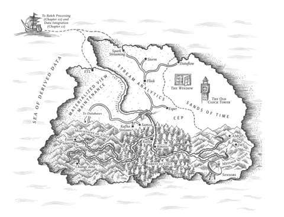
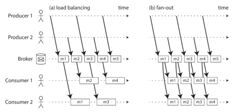
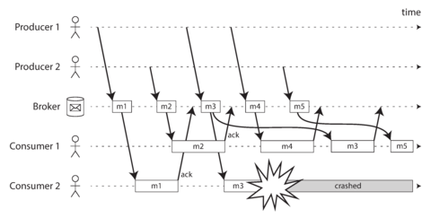
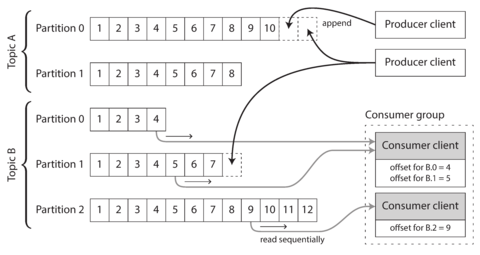
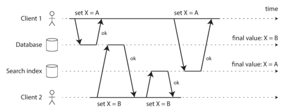
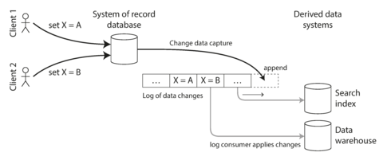
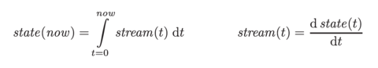
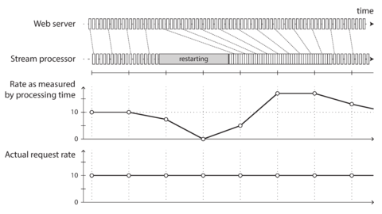

# Chapter 11. Stream Processing

> *A complex system that works is invariably found to have evolved from a simple system that works. The inverse proposition also appears to be true: A complex system designed from scratch never works and cannot be made to work.*
> 
> John Gall, *Systemantics* (1975)



In [Chapter 10](ch10.md) we discussed batch processing—techniques that read a set of files as input and produce a new set of output files. The output is a form of *derived data*; that is, a dataset that can be recreated by running the batch process again if necessary. We saw how this simple but powerful idea can be used to create search indexes, recommendation systems, analytics, and more.

However, one big assumption remained throughout [Chapter 10](ch10.md): namely, that the input is bounded—i.e., of a known and finite size—so the batch process knows when it has finished reading its input. For example, the sorting operation that is central to MapReduce must read its entire input before it can start producing output: it could happen that the very last input record is the one with the lowest key, and thus needs to be the very first output record, so starting the output early is not an option.

In reality, a lot of data is unbounded because it arrives gradually over time: your users produced data yesterday and today, and they will continue to produce more data tomorrow. Unless you go out of business, this process never ends, and so the dataset is never “complete” in any meaningful way \[[1](ch11.md)]. Thus, batch processors must artificially divide the data into chunks of fixed duration: for example, processing a day’s worth of data at the end of every day, or processing an hour’s worth of data at the end of every hour.

The problem with daily batch processes is that changes in the input are only reflected in the output a day later, which is too slow for many impatient users. To reduce the delay, we can run the processing more frequently—say, processing a second’s worth of data at the end of every second—or even continuously, abandoning the fixed time slices entirely and simply processing every event as it happens. That is the idea behind *stream processing*.

In general, a “stream” refers to data that is incrementally made available over time. The concept appears in many places: in the `stdin` and `stdout` of Unix, programming languages (lazy lists) \[[2](ch11.md)], filesystem APIs (such as Java’s `FileInputStream`), TCP connections, delivering audio and video over the internet, and so on.

In this chapter we will look at *event streams* as a data management mechanism: the unbounded, incrementally processed counterpart to the batch data we saw in the last chapter. We will first discuss how streams are represented, stored, and transmitted over a network. In [“Databases and Streams”](#sec_stream_databases) we will investigate the relationship between streams and databases. And finally, in [“Processing Streams”](#sec_stream_processing) we will explore approaches and tools for processing those streams continually, and ways that they can be used to build applications.

# Transmitting Event Streams

In the batch processing world, the inputs and outputs of a job are files (perhaps on a distributed filesystem). What does the streaming equivalent look like?

When the input is a file (a sequence of bytes), the first processing step is usually to parse it into a sequence of records. In a stream processing context, a record is more commonly known as an *event*, but it is essentially the same thing: a small, self-contained, immutable object containing the details of something that happened at some point in time. An event usually contains a timestamp indicating when it happened according to a time-of-day clock (see [“Monotonic Versus Time-of-Day Clocks”](ch08.md)).

For example, the thing that happened might be an action that a user took, such as viewing a page or making a purchase. It might also originate from a machine, such as a periodic measurement from a temperature sensor, or a CPU utilization metric. In the example of [“Batch Processing with Unix Tools”](ch10.md), each line of the web server log is an event.

An event may be encoded as a text string, or JSON, or perhaps in some binary form, as discussed in [Chapter 4](ch04.md). This encoding allows you to store an event, for example by appending it to a file, inserting it into a relational table, or writing it to a document database. It also allows you to send the event over the network to another node in order to process it.

In batch processing, a file is written once and then potentially read by multiple jobs. Analogously, in streaming terminology, an event is generated once by a *producer* (also known as a *publisher* or *sender*), and then potentially processed by multiple *consumers* (*subscribers* or *recipients*) \[[3](ch11.md)]. In a filesystem, a filename identifies a set of related records; in a streaming system, related events are usually grouped together into a *topic* or *stream*.

In principle, a file or database is sufficient to connect producers and consumers: a producer writes every event that it generates to the datastore, and each consumer periodically polls the datastore to check for events that have appeared since it last ran. This is essentially what a batch process does when it processes a day’s worth of data at the end of every day.

However, when moving toward continual processing with low delays, polling becomes expensive if the datastore is not designed for this kind of usage. The more often you poll, the lower the percentage of requests that return new events, and thus the higher the overheads become. Instead, it is better for consumers to be notified when new events appear.

Databases have traditionally not supported this kind of notification mechanism very well: relational databases commonly have *triggers*, which can react to a change (e.g., a row being inserted into a table), but they are very limited in what they can do and have been somewhat of an afterthought in database design \[[4](ch11.md), [5](ch11.md)]. Instead, specialized tools have been developed for the purpose of delivering event notifications.

## Messaging Systems

A common approach for notifying consumers about new events is to use a *messaging system*: a producer sends a message containing the event, which is then pushed to consumers. We touched on these systems previously in [“Message-Passing Dataflow”](ch04.md), but we will now go into more detail.

A direct communication channel like a Unix pipe or TCP connection between producer and consumer would be a simple way of implementing a messaging system. However, most messaging systems expand on this basic model. In particular, Unix pipes and TCP connect exactly one sender with one recipient, whereas a messaging system allows multiple producer nodes to send messages to the same topic and allows multiple consumer nodes to receive messages in a topic.

Within this *publish/subscribe* model, different systems take a wide range of approaches, and there is no one right answer for all purposes. To differentiate the systems, it is particularly helpful to ask the following two questions:

1. *What happens if the producers send messages faster than the consumers can process them?* Broadly speaking, there are three options: the system can drop messages, buffer messages in a queue, or apply *backpressure* (also known as *flow control*; i.e., blocking the producer from sending more messages). For example, Unix pipes and TCP use backpressure: they have a small fixed-size buffer, and if it fills up, the sender is blocked until the recipient takes data out of the buffer (see [“Network congestion and queueing”](ch08.md)).
   
   If messages are buffered in a queue, it is important to understand what happens as that queue grows. Does the system crash if the queue no longer fits in memory, or does it write messages to disk? If so, how does the disk access affect the performance of the messaging system \[[6](ch11.md)]?
2. *What happens if nodes crash or temporarily go offline—are any messages lost?* As with databases, durability may require some combination of writing to disk and/or replication (see the sidebar [“Replication and Durability”](ch07.md)), which has a cost. If you can afford to sometimes lose messages, you can probably get higher throughput and lower latency on the same hardware.

Whether message loss is acceptable depends very much on the application. For example, with sensor readings and metrics that are transmitted periodically, an occasional missing data point is perhaps not important, since an updated value will be sent a short time later anyway. However, beware that if a large number of messages are dropped, it may not be immediately apparent that the metrics are incorrect \[[7](ch11.md)]. If you are counting events, it is more important that they are delivered reliably, since every lost message means incorrect counters.

A nice property of the batch processing systems we explored in [Chapter 10](ch10.md) is that they provide a strong reliability guarantee: failed tasks are automatically retried, and partial output from failed tasks is automatically discarded. This means the output is the same as if no failures had occurred, which helps simplify the programming model. Later in this chapter we will examine how we can provide similar guarantees in a streaming context.

### Direct messaging from producers to consumers

A number of messaging systems use direct network communication between producers and consumers without going via intermediary nodes:

- UDP multicast is widely used in the financial industry for streams such as stock market feeds, where low latency is important \[[8](ch11.md)]. Although UDP itself is unreliable, application-level protocols can recover lost packets (the producer must remember packets it has sent so that it can retransmit them on demand).
- Brokerless messaging libraries such as ZeroMQ \[[9](ch11.md)] and nanomsg take a similar approach, implementing publish/subscribe messaging over TCP or IP multicast.
- StatsD \[[10](ch11.md)] and Brubeck \[[7](ch11.md)] use unreliable UDP messaging for collecting metrics from all machines on the network and monitoring them. (In the StatsD protocol, counter metrics are only correct if all messages are received; using UDP makes the metrics at best approximate \[[11](ch11.md)]. See also [“TCP Versus UDP”](ch08.md).)
- If the consumer exposes a service on the network, producers can make a direct HTTP or RPC request (see [“Dataflow Through Services: REST and RPC”](ch04.md)) to push messages to the consumer. This is the idea behind webhooks \[[12](ch11.md)], a pattern in which a callback URL of one service is registered with another service, and it makes a request to that URL whenever an event occurs.

Although these direct messaging systems work well in the situations for which they are designed, they generally require the application code to be aware of the possibility of message loss. The faults they can tolerate are quite limited: even if the protocols detect and retransmit packets that are lost in the network, they generally assume that producers and consumers are constantly online.

If a consumer is offline, it may miss messages that were sent while it is unreachable. Some protocols allow the producer to retry failed message deliveries, but this approach may break down if the producer crashes, losing the buffer of messages that it was supposed to retry.

### Message brokers

A widely used alternative is to send messages via a *message broker* (also known as a *message queue*), which is essentially a kind of database that is optimized for handling message streams \[[13](ch11.md)]. It runs as a server, with producers and consumers connecting to it as clients. Producers write messages to the broker, and consumers receive them by reading them from the broker.

By centralizing the data in the broker, these systems can more easily tolerate clients that come and go (connect, disconnect, and crash), and the question of durability is moved to the broker instead. Some message brokers only keep messages in memory, while others (depending on configuration) write them to disk so that they are not lost in case of a broker crash. Faced with slow consumers, they generally allow unbounded queueing (as opposed to dropping messages or backpressure), although this choice may also depend on the configuration.

A consequence of queueing is also that consumers are generally *asynchronous*: when a producer sends a message, it normally only waits for the broker to confirm that it has buffered the message and does not wait for the message to be processed by consumers. The delivery to consumers will happen at some undetermined future point in time—often within a fraction of a second, but sometimes significantly later if there is a queue backlog.

### Message brokers compared to databases

Some message brokers can even participate in two-phase commit protocols using XA or JTA (see [“Distributed Transactions in Practice”](ch09.md)). This feature makes them quite similar in nature to databases, although there are still important practical differences between message brokers and databases:

- Databases usually keep data until it is explicitly deleted, whereas most message brokers automatically delete a message when it has been successfully delivered to its consumers. Such message brokers are not suitable for long-term data storage.
- Since they quickly delete messages, most message brokers assume that their working set is fairly small—i.e., the queues are short. If the broker needs to buffer a lot of messages because the consumers are slow (perhaps spilling messages to disk if they no longer fit in memory), each individual message takes longer to process, and the overall throughput may degrade \[[6](ch11.md)].
- Databases often support secondary indexes and various ways of searching for data, while message brokers often support some way of subscribing to a subset of topics matching some pattern. The mechanisms are different, but both are essentially ways for a client to select the portion of the data that it wants to know about.
- When querying a database, the result is typically based on a point-in-time snapshot of the data; if another client subsequently writes something to the database that changes the query result, the first client does not find out that its prior result is now outdated (unless it repeats the query, or polls for changes). By contrast, message brokers do not support arbitrary queries, but they do notify clients when data changes (i.e., when new messages become available).

This is the traditional view of message brokers, which is encapsulated in standards like JMS \[[14](ch11.md)] and AMQP \[[15](ch11.md)] and implemented in software like RabbitMQ, ActiveMQ, HornetQ, Qpid, TIBCO Enterprise Message Service, IBM MQ, Azure Service Bus, and Google Cloud Pub/Sub \[[16](ch11.md)].

### Multiple consumers

When multiple consumers read messages in the same topic, two main patterns of messaging are used, as illustrated in [Figure 11-1](#fig_stream_multi_consumer):

Load balancing

Each message is delivered to *one* of the consumers, so the consumers can share the work of processing the messages in the topic. The broker may assign messages to consumers arbitrarily. This pattern is useful when the messages are expensive to process, and so you want to be able to add consumers to parallelize the processing. (In AMQP, you can implement load balancing by having multiple clients consuming from the same queue, and in JMS it is called a *shared* *subscription*.)

Fan-out

Each message is delivered to *all* of the consumers. Fan-out allows several independent consumers to each “tune in” to the same broadcast of messages, without affecting each other—the streaming equivalent of having several different batch jobs that read the same input file. (This feature is provided by topic subscriptions in JMS, and exchange bindings in AMQP.)



###### Figure 11-1. (a) Load balancing: sharing the work of consuming a topic among consumers; (b) fan-out: delivering each message to multiple consumers.

The two patterns can be combined: for example, two separate groups of consumers may each subscribe to a topic, such that each group collectively receives all messages, but within each group only one of the nodes receives each message.

### Acknowledgments and redelivery

Consumers may crash at any time, so it could happen that a broker delivers a message to a consumer but the consumer never processes it, or only partially processes it before crashing. In order to ensure that the message is not lost, message brokers use *acknowledgments*: a client must explicitly tell the broker when it has finished processing a message so that the broker can remove it from the queue.

If the connection to a client is closed or times out without the broker receiving an acknowledgment, it assumes that the message was not processed, and therefore it delivers the message again to another consumer. (Note that it could happen that the message actually *was* fully processed, but the acknowledgment was lost in the network. Handling this case requires an atomic commit protocol, as discussed in [“Distributed Transactions in Practice”](ch09.md).)

When combined with load balancing, this redelivery behavior has an interesting effect on the ordering of messages. In [Figure 11-2](#fig_stream_redelivery), the consumers generally process messages in the order they were sent by producers. However, consumer 2 crashes while processing message *m3*, at the same time as consumer 1 is processing message *m4*. The unacknowledged message *m3* is subsequently redelivered to consumer 1, with the result that consumer 1 processes messages in the order *m4*, *m3*, *m5*. Thus, *m3* and *m4* are not delivered in the same order as they were sent by producer 1.



###### Figure 11-2. Consumer 2 crashes while processing m3, so it is redelivered to consumer 1 at a later time.

Even if the message broker otherwise tries to preserve the order of messages (as required by both the JMS and AMQP standards), the combination of load balancing with redelivery inevitably leads to messages being reordered. To avoid this issue, you can use a separate queue per consumer (i.e., not use the load balancing feature). Message reordering is not a problem if messages are completely independent of each other, but it can be important if there are causal dependencies between messages, as we shall see later in the chapter.

## Partitioned Logs

Sending a packet over a network or making a request to a network service is normally a transient operation that leaves no permanent trace. Although it is possible to record it permanently (using packet capture and logging), we normally don’t think of it that way. Even message brokers that durably write messages to disk quickly delete them again after they have been delivered to consumers, because they are built around a transient messaging mindset.

Databases and filesystems take the opposite approach: everything that is written to a database or file is normally expected to be permanently recorded, at least until someone explicitly chooses to delete it again.

This difference in mindset has a big impact on how derived data is created. A key feature of batch processes, as discussed in [Chapter 10](ch10.md), is that you can run them repeatedly, experimenting with the processing steps, without risk of damaging the input (since the input is read-only). This is not the case with AMQP/JMS-style messaging: receiving a message is destructive if the acknowledgment causes it to be deleted from the broker, so you cannot run the same consumer again and expect to get the same result.

If you add a new consumer to a messaging system, it typically only starts receiving messages sent after the time it was registered; any prior messages are already gone and cannot be recovered. Contrast this with files and databases, where you can add a new client at any time, and it can read data written arbitrarily far in the past (as long as it has not been explicitly overwritten or deleted by the application).

Why can we not have a hybrid, combining the durable storage approach of databases with the low-latency notification facilities of messaging? This is the idea behind *log-based message brokers*.

### Using logs for message storage

A log is simply an append-only sequence of records on disk. We previously discussed logs in the context of log-structured storage engines and write-ahead logs in [Chapter 3](ch03.md), and in the context of replication in [Chapter 5](ch05.md).

The same structure can be used to implement a message broker: a producer sends a message by appending it to the end of the log, and a consumer receives messages by reading the log sequentially. If a consumer reaches the end of the log, it waits for a notification that a new message has been appended. The Unix tool `tail -f`, which watches a file for data being appended, essentially works like this.

In order to scale to higher throughput than a single disk can offer, the log can be *partitioned* (in the sense of [Chapter 6](ch06.md)). Different partitions can then be hosted on different machines, making each partition a separate log that can be read and written independently from other partitions. A topic can then be defined as a group of partitions that all carry messages of the same type. This approach is illustrated in [Figure 11-3](#fig_stream_kafka_partitions).

Within each partition, the broker assigns a monotonically increasing sequence number, or *offset*, to every message (in [Figure 11-3](#fig_stream_kafka_partitions), the numbers in boxes are message offsets). Such a sequence number makes sense because a partition is append-only, so the messages within a partition are totally ordered. There is no ordering guarantee across different partitions.



###### Figure 11-3. Producers send messages by appending them to a topic-partition file, and consumers read these files sequentially.

Apache Kafka \[[17](ch11.md), [18](ch11.md)], Amazon Kinesis Streams \[[19](ch11.md)], and Twitter’s DistributedLog \[[20](ch11.md), [21](ch11.md)] are log-based message brokers that work like this. Google Cloud Pub/Sub is architecturally similar but exposes a JMS-style API rather than a log abstraction \[[16](ch11.md)]. Even though these message brokers write all messages to disk, they are able to achieve throughput of millions of messages per second by partitioning across multiple machines, and fault tolerance by replicating messages \[[22](ch11.md), [23](ch11.md)].

### Logs compared to traditional messaging

The log-based approach trivially supports fan-out messaging, because several consumers can independently read the log without affecting each other—reading a message does not delete it from the log. To achieve load balancing across a group of consumers, instead of assigning individual messages to consumer clients, the broker can assign entire partitions to nodes in the consumer group.

Each client then consumes *all* the messages in the partitions it has been assigned. Typically, when a consumer has been assigned a log partition, it reads the messages in the partition sequentially, in a straightforward single-threaded manner. This coarse-grained load balancing approach has some downsides:

- The number of nodes sharing the work of consuming a topic can be at most the number of log partitions in that topic, because messages within the same partition are delivered to the same node.[i](ch11.md)
- If a single message is slow to process, it holds up the processing of subsequent messages in that partition (a form of head-of-line blocking; see [“Describing Performance”](ch01.md)).

Thus, in situations where messages may be expensive to process and you want to parallelize processing on a message-by-message basis, and where message ordering is not so important, the JMS/AMQP style of message broker is preferable. On the other hand, in situations with high message throughput, where each message is fast to process and where message ordering is important, the log-based approach works very well.

### Consumer offsets

Consuming a partition sequentially makes it easy to tell which messages have been processed: all messages with an offset less than a consumer’s current offset have already been processed, and all messages with a greater offset have not yet been seen. Thus, the broker does not need to track acknowledgments for every single message—it only needs to periodically record the consumer offsets. The reduced bookkeeping overhead and the opportunities for batching and pipelining in this approach help increase the throughput of log-based systems.

This offset is in fact very similar to the *log sequence number* that is commonly found in single-leader database replication, and which we discussed in [“Setting Up New Followers”](ch05.md). In database replication, the log sequence number allows a follower to reconnect to a leader after it has become disconnected, and resume replication without skipping any writes. Exactly the same principle is used here: the message broker behaves like a leader database, and the consumer like a follower.

If a consumer node fails, another node in the consumer group is assigned the failed consumer’s partitions, and it starts consuming messages at the last recorded offset. If the consumer had processed subsequent messages but not yet recorded their offset, those messages will be processed a second time upon restart. We will discuss ways of dealing with this issue later in the chapter.

### Disk space usage

If you only ever append to the log, you will eventually run out of disk space. To reclaim disk space, the log is actually divided into segments, and from time to time old segments are deleted or moved to archive storage. (We’ll discuss a more sophisticated way of freeing disk space later.)

This means that if a slow consumer cannot keep up with the rate of messages, and it falls so far behind that its consumer offset points to a deleted segment, it will miss some of the messages. Effectively, the log implements a bounded-size buffer that discards old messages when it gets full, also known as a *circular buffer* or *ring buffer*. However, since that buffer is on disk, it can be quite large.

Let’s do a back-of-the-envelope calculation. At the time of writing, a typical large hard drive has a capacity of 6 TB and a sequential write throughput of 150 MB/s. If you are writing messages at the fastest possible rate, it takes about 11 hours to fill the drive. Thus, the disk can buffer 11 hours’ worth of messages, after which it will start overwriting old messages. This ratio remains the same, even if you use many hard drives and machines. In practice, deployments rarely use the full write bandwidth of the disk, so the log can typically keep a buffer of several days’ or even weeks’ worth of messages.

Regardless of how long you retain messages, the throughput of a log remains more or less constant, since every message is written to disk anyway \[[18](ch11.md)]. This behavior is in contrast to messaging systems that keep messages in memory by default and only write them to disk if the queue grows too large: such systems are fast when queues are short and become much slower when they start writing to disk, so the throughput depends on the amount of history retained.

### When consumers cannot keep up with producers

At the beginning of [“Messaging Systems”](#sec_stream_messaging) we discussed three choices of what to do if a consumer cannot keep up with the rate at which producers are sending messages: dropping messages, buffering, or applying backpressure. In this taxonomy, the log-based approach is a form of buffering with a large but fixed-size buffer (limited by the available disk space).

If a consumer falls so far behind that the messages it requires are older than what is retained on disk, it will not be able to read those messages—so the broker effectively drops old messages that go back further than the size of the buffer can accommodate. You can monitor how far a consumer is behind the head of the log, and raise an alert if it falls behind significantly. As the buffer is large, there is enough time for a human operator to fix the slow consumer and allow it to catch up before it starts missing messages.

Even if a consumer does fall too far behind and starts missing messages, only that consumer is affected; it does not disrupt the service for other consumers. This fact is a big operational advantage: you can experimentally consume a production log for development, testing, or debugging purposes, without having to worry much about disrupting production services. When a consumer is shut down or crashes, it stops consuming resources—the only thing that remains is its consumer offset.

This behavior also contrasts with traditional message brokers, where you need to be careful to delete any queues whose consumers have been shut down—otherwise they continue unnecessarily accumulating messages and taking away memory from consumers that are still active.

### Replaying old messages

We noted previously that with AMQP- and JMS-style message brokers, processing and acknowledging messages is a destructive operation, since it causes the messages to be deleted on the broker. On the other hand, in a log-based message broker, consuming messages is more like reading from a file: it is a read-only operation that does not change the log.

The only side effect of processing, besides any output of the consumer, is that the consumer offset moves forward. But the offset is under the consumer’s control, so it can easily be manipulated if necessary: for example, you can start a copy of a consumer with yesterday’s offsets and write the output to a different location, in order to reprocess the last day’s worth of messages. You can repeat this any number of times, varying the processing code.

This aspect makes log-based messaging more like the batch processes of the last chapter, where derived data is clearly separated from input data through a repeatable transformation process. It allows more experimentation and easier recovery from errors and bugs, making it a good tool for integrating dataflows within an organization \[[24](ch11.md)].

# Databases and Streams

We have drawn some comparisons between message brokers and databases. Even though they have traditionally been considered separate categories of tools, we saw that log-based message brokers have been successful in taking ideas from databases and applying them to messaging. We can also go in reverse: take ideas from messaging and streams, and apply them to databases.

We said previously that an event is a record of something that happened at some point in time. The thing that happened may be a user action (e.g., typing a search query), or a sensor reading, but it may also be a *write to a database*. The fact that something was written to a database is an event that can be captured, stored, and processed. This observation suggests that the connection between databases and streams runs deeper than just the physical storage of logs on disk—it is quite fundamental.

In fact, a replication log (see [“Implementation of Replication Logs”](ch05.md)) is a stream of database write events, produced by the leader as it processes transactions. The followers apply that stream of writes to their own copy of the database and thus end up with an accurate copy of the same data. The events in the replication log describe the data changes that occurred.

We also came across the *state machine replication* principle in [“Total Order Broadcast”](ch09.md), which states: if every event represents a write to the database, and every replica processes the same events in the same order, then the replicas will all end up in the same final state. (Processing an event is assumed to be a deterministic operation.) It’s just another case of event streams!

In this section we will first look at a problem that arises in heterogeneous data systems, and then explore how we can solve it by bringing ideas from event streams to databases.

## Keeping Systems in Sync

As we have seen throughout this book, there is no single system that can satisfy all data storage, querying, and processing needs. In practice, most nontrivial applications need to combine several different technologies in order to satisfy their requirements: for example, using an OLTP database to serve user requests, a cache to speed up common requests, a full-text index to handle search queries, and a data warehouse for analytics. Each of these has its own copy of the data, stored in its own representation that is optimized for its own purposes.

As the same or related data appears in several different places, they need to be kept in sync with one another: if an item is updated in the database, it also needs to be updated in the cache, search indexes, and data warehouse. With data warehouses this synchronization is usually performed by ETL processes (see [“Data Warehousing”](ch03.md)), often by taking a full copy of a database, transforming it, and bulk-loading it into the data warehouse—in other words, a batch process. Similarly, we saw in [“The Output of Batch Workflows”](ch10.md) how search indexes, recommendation systems, and other derived data systems might be created using batch processes.

If periodic full database dumps are too slow, an alternative that is sometimes used is *dual writes*, in which the application code explicitly writes to each of the systems when data changes: for example, first writing to the database, then updating the search index, then invalidating the cache entries (or even performing those writes concurrently).

However, dual writes have some serious problems, one of which is a race condition illustrated in [Figure 11-4](#fig_stream_write_order). In this example, two clients concurrently want to update an item X: client 1 wants to set the value to A, and client 2 wants to set it to B. Both clients first write the new value to the database, then write it to the search index. Due to unlucky timing, the requests are interleaved: the database first sees the write from client 1 setting the value to A, then the write from client 2 setting the value to B, so the final value in the database is B. The search index first sees the write from client 2, then client 1, so the final value in the search index is A. The two systems are now permanently inconsistent with each other, even though no error occurred.



###### Figure 11-4. In the database, X is first set to A and then to B, while at the search index the writes arrive in the opposite order.

Unless you have some additional concurrency detection mechanism, such as the version vectors we discussed in [“Detecting Concurrent Writes”](ch05.md), you will not even notice that concurrent writes occurred—one value will simply silently overwrite another value.

Another problem with dual writes is that one of the writes may fail while the other succeeds. This is a fault-tolerance problem rather than a concurrency problem, but it also has the effect of the two systems becoming inconsistent with each other. Ensuring that they either both succeed or both fail is a case of the atomic commit problem, which is expensive to solve (see [“Atomic Commit and Two-Phase Commit (2PC)”](ch09.md)).

If you only have one replicated database with a single leader, then that leader determines the order of writes, so the state machine replication approach works among replicas of the database. However, in [Figure 11-4](#fig_stream_write_order) there isn’t a single leader: the database may have a leader and the search index may have a leader, but neither follows the other, and so conflicts can occur (see [“Multi-Leader Replication”](ch05.md)).

The situation would be better if there really was only one leader—for example, the database—and if we could make the search index a follower of the database. But is this possible in practice?

## Change Data Capture

The problem with most databases’ replication logs is that they have long been considered to be an internal implementation detail of the database, not a public API. Clients are supposed to query the database through its data model and query language, not parse the replication logs and try to extract data from them.

For decades, many databases simply did not have a documented way of getting the log of changes written to them. For this reason it was difficult to take all the changes made in a database and replicate them to a different storage technology such as a search index, cache, or data warehouse.

More recently, there has been growing interest in *change data capture* (CDC), which is the process of observing all data changes written to a database and extracting them in a form in which they can be replicated to other systems. CDC is especially interesting if changes are made available as a stream, immediately as they are written.

For example, you can capture the changes in a database and continually apply the same changes to a search index. If the log of changes is applied in the same order, you can expect the data in the search index to match the data in the database. The search index and any other derived data systems are just consumers of the change stream, as illustrated in [Figure 11-5](#fig_stream_change_capture).



###### Figure 11-5. Taking data in the order it was written to one database, and applying the changes to other systems in the same order.

### Implementing change data capture

We can call the log consumers *derived data systems*, as discussed in the introduction to [Part III](part03.md): the data stored in the search index and the data warehouse is just another view onto the data in the system of record. Change data capture is a mechanism for ensuring that all changes made to the system of record are also reflected in the derived data systems so that the derived systems have an accurate copy of the data.

Essentially, change data capture makes one database the leader (the one from which the changes are captured), and turns the others into followers. A log-based message broker is well suited for transporting the change events from the source database, since it preserves the ordering of messages (avoiding the reordering issue of [Figure 11-2](#fig_stream_redelivery)).

Database triggers can be used to implement change data capture (see [“Trigger-based replication”](ch05.md)) by registering triggers that observe all changes to data tables and add corresponding entries to a changelog table. However, they tend to be fragile and have significant performance overheads. Parsing the replication log can be a more robust approach, although it also comes with challenges, such as handling schema changes.

LinkedIn’s Databus \[[25](ch11.md)], Facebook’s Wormhole \[[26](ch11.md)], and Yahoo!’s Sherpa \[[27](ch11.md)] use this idea at large scale. Bottled Water implements CDC for PostgreSQL using an API that decodes the write-ahead log \[[28](ch11.md)], Maxwell and Debezium do something similar for MySQL by parsing the binlog \[[29](ch11.md), [30](ch11.md), [31](ch11.md)], Mongoriver reads the MongoDB oplog \[[32](ch11.md), [33](ch11.md)], and GoldenGate provides similar facilities for Oracle \[[34](ch11.md), [35](ch11.md)].

Like message brokers, change data capture is usually asynchronous: the system of record database does not wait for the change to be applied to consumers before committing it. This design has the operational advantage that adding a slow consumer does not affect the system of record too much, but it has the downside that all the issues of replication lag apply (see [“Problems with Replication Lag”](ch05.md)).

### Initial snapshot

If you have the log of all changes that were ever made to a database, you can reconstruct the entire state of the database by replaying the log. However, in many cases, keeping all changes forever would require too much disk space, and replaying it would take too long, so the log needs to be truncated.

Building a new full-text index, for example, requires a full copy of the entire database—it is not sufficient to only apply a log of recent changes, since it would be missing items that were not recently updated. Thus, if you don’t have the entire log history, you need to start with a consistent snapshot, as previously discussed in [“Setting Up New Followers”](ch05.md).

The snapshot of the database must correspond to a known position or offset in the change log, so that you know at which point to start applying changes after the snapshot has been processed. Some CDC tools integrate this snapshot facility, while others leave it as a manual operation.

### Log compaction

If you can only keep a limited amount of log history, you need to go through the snapshot process every time you want to add a new derived data system. However, *log compaction* provides a good alternative.

We discussed log compaction previously in [“Hash Indexes”](ch03.md), in the context of log-structured storage engines (see [Figure 3-2](ch03.md) for an example). The principle is simple: the storage engine periodically looks for log records with the same key, throws away any duplicates, and keeps only the most recent update for each key. This compaction and merging process runs in the background.

In a log-structured storage engine, an update with a special null value (a *tombstone*) indicates that a key was deleted, and causes it to be removed during log compaction. But as long as a key is not overwritten or deleted, it stays in the log forever. The disk space required for such a compacted log depends only on the current contents of the database, not the number of writes that have ever occurred in the database. If the same key is frequently overwritten, previous values will eventually be garbage-collected, and only the latest value will be retained.

The same idea works in the context of log-based message brokers and change data capture. If the CDC system is set up such that every change has a primary key, and every update for a key replaces the previous value for that key, then it’s sufficient to keep just the most recent write for a particular key.

Now, whenever you want to rebuild a derived data system such as a search index, you can start a new consumer from offset 0 of the log-compacted topic, and sequentially scan over all messages in the log. The log is guaranteed to contain the most recent value for every key in the database (and maybe some older values)—in other words, you can use it to obtain a full copy of the database contents without having to take another snapshot of the CDC source database.

This log compaction feature is supported by Apache Kafka. As we shall see later in this chapter, it allows the message broker to be used for durable storage, not just for transient messaging.

### API support for change streams

Increasingly, databases are beginning to support change streams as a first-class interface, rather than the typical retrofitted and reverse-engineered CDC efforts. For example, RethinkDB allows queries to subscribe to notifications when the results of a query change \[[36](ch11.md)], Firebase \[[37](ch11.md)] and CouchDB \[[38](ch11.md)] provide data synchronization based on a change feed that is also made available to applications, and Meteor uses the MongoDB oplog to subscribe to data changes and update the user interface \[[39](ch11.md)].

VoltDB allows transactions to continuously export data from a database in the form of a stream \[[40](ch11.md)]. The database represents an output stream in the relational data model as a table into which transactions can insert tuples, but which cannot be queried. The stream then consists of the log of tuples that committed transactions have written to this special table, in the order they were committed. External consumers can asynchronously consume this log and use it to update derived data systems.

Kafka Connect \[[41](ch11.md)] is an effort to integrate change data capture tools for a wide range of database systems with Kafka. Once the stream of change events is in Kafka, it can be used to update derived data systems such as search indexes, and also feed into stream processing systems as discussed later in this chapter.

## Event Sourcing

There are some parallels between the ideas we’ve discussed here and *event sourcing*, a technique that was developed in the domain-driven design (DDD) community \[[42](ch11.md), [43](ch11.md), [44](ch11.md)]. We will discuss event sourcing briefly, because it incorporates some useful and relevant ideas for streaming systems.

Similarly to change data capture, event sourcing involves storing all changes to the application state as a log of change events. The biggest difference is that event sourcing applies the idea at a different level of abstraction:

- In change data capture, the application uses the database in a mutable way, updating and deleting records at will. The log of changes is extracted from the database at a low level (e.g., by parsing the replication log), which ensures that the order of writes extracted from the database matches the order in which they were actually written, avoiding the race condition in [Figure 11-4](#fig_stream_write_order). The application writing to the database does not need to be aware that CDC is occurring.
- In event sourcing, the application logic is explicitly built on the basis of immutable events that are written to an event log. In this case, the event store is append-only, and updates or deletes are discouraged or prohibited. Events are designed to reflect things that happened at the application level, rather than low-level state changes.

Event sourcing is a powerful technique for data modeling: from an application point of view it is more meaningful to record the user’s actions as immutable events, rather than recording the effect of those actions on a mutable database. Event sourcing makes it easier to evolve applications over time, helps with debugging by making it easier to understand after the fact why something happened, and guards against application bugs (see [“Advantages of immutable events”](#sec_stream_immutability_pros)).

For example, storing the event “student cancelled their course enrollment” clearly expresses the intent of a single action in a neutral fashion, whereas the side effects “one entry was deleted from the enrollments table, and one cancellation reason was added to the student feedback table” embed a lot of assumptions about the way the data is later going to be used. If a new application feature is introduced—for example, “the place is offered to the next person on the waiting list”—the event sourcing approach allows that new side effect to easily be chained off the existing event.

Event sourcing is similar to the chronicle data model \[[45](ch11.md)], and there are also similarities between an event log and the fact table that you find in a star schema (see [“Stars and Snowflakes: Schemas for Analytics”](ch03.md)).

Specialized databases such as Event Store \[[46](ch11.md)] have been developed to support applications using event sourcing, but in general the approach is independent of any particular tool. A conventional database or a log-based message broker can also be used to build applications in this style.

### Deriving current state from the event log

An event log by itself is not very useful, because users generally expect to see the current state of a system, not the history of modifications. For example, on a shopping website, users expect to be able to see the current contents of their cart, not an append-only list of all the changes they have ever made to their cart.

Thus, applications that use event sourcing need to take the log of events (representing the data *written* to the system) and transform it into application state that is suitable for showing to a user (the way in which data is *read* from the system \[[47](ch11.md)]). This transformation can use arbitrary logic, but it should be deterministic so that you can run it again and derive the same application state from the event log.

Like with change data capture, replaying the event log allows you to reconstruct the current state of the system. However, log compaction needs to be handled differently:

- A CDC event for the update of a record typically contains the entire new version of the record, so the current value for a primary key is entirely determined by the most recent event for that primary key, and log compaction can discard previous events for the same key.
- On the other hand, with event sourcing, events are modeled at a higher level: an event typically expresses the intent of a user action, not the mechanics of the state update that occurred as a result of the action. In this case, later events typically do not override prior events, and so you need the full history of events to reconstruct the final state. Log compaction is not possible in the same way.

Applications that use event sourcing typically have some mechanism for storing snapshots of the current state that is derived from the log of events, so they don’t need to repeatedly reprocess the full log. However, this is only a performance optimization to speed up reads and recovery from crashes; the intention is that the system is able to store all raw events forever and reprocess the full event log whenever required. We discuss this assumption in [“Limitations of immutability”](#sec_stream_immutability_limitations).

### Commands and events

The event sourcing philosophy is careful to distinguish between *events* and *commands* \[[48](ch11.md)]. When a request from a user first arrives, it is initially a command: at this point it may still fail, for example because some integrity condition is violated. The application must first validate that it can execute the command. If the validation is successful and the command is accepted, it becomes an event, which is durable and immutable.

For example, if a user tries to register a particular username, or reserve a seat on an airplane or in a theater, then the application needs to check that the username or seat is not already taken. (We previously discussed this example in [“Fault-Tolerant Consensus”](ch09.md).) When that check has succeeded, the application can generate an event to indicate that a particular username was registered by a particular user ID, or that a particular seat has been reserved for a particular customer.

At the point when the event is generated, it becomes a *fact*. Even if the customer later decides to change or cancel the reservation, the fact remains true that they formerly held a reservation for a particular seat, and the change or cancellation is a separate event that is added later.

A consumer of the event stream is not allowed to reject an event: by the time the consumer sees the event, it is already an immutable part of the log, and it may have already been seen by other consumers. Thus, any validation of a command needs to happen synchronously, before it becomes an event—for example, by using a serializable transaction that atomically validates the command and publishes the event.

Alternatively, the user request to reserve a seat could be split into two events: first a tentative reservation, and then a separate confirmation event once the reservation has been validated (as discussed in [“Implementing linearizable storage using total order broadcast”](ch09.md)). This split allows the validation to take place in an asynchronous process.

## State, Streams, and Immutability

We saw in [Chapter 10](ch10.md) that batch processing benefits from the immutability of its input files, so you can run experimental processing jobs on existing input files without fear of damaging them. This principle of immutability is also what makes event sourcing and change data capture so powerful.

We normally think of databases as storing the current state of the application—this representation is optimized for reads, and it is usually the most convenient for serving queries. The nature of state is that it changes, so databases support updating and deleting data as well as inserting it. How does this fit with immutability?

Whenever you have state that changes, that state is the result of the events that mutated it over time. For example, your list of currently available seats is the result of the reservations you have processed, the current account balance is the result of the credits and debits on the account, and the response time graph for your web server is an aggregation of the individual response times of all web requests that have occurred.

No matter how the state changes, there was always a sequence of events that caused those changes. Even as things are done and undone, the fact remains true that those events occurred. The key idea is that mutable state and an append-only log of immutable events do not contradict each other: they are two sides of the same coin. The log of all changes, the *changelog*, represents the evolution of state over time.

If you are mathematically inclined, you might say that the application state is what you get when you integrate an event stream over time, and a change stream is what you get when you differentiate the state by time, as shown in [Figure 11-6](#fig_stream_integral) \[[49](ch11.md), [50](ch11.md), [51](ch11.md)]. The analogy has limitations (for example, the second derivative of state does not seem to be meaningful), but it’s a useful starting point for thinking about data.



###### Figure 11-6. The relationship between the current application state and an event stream.

If you store the changelog durably, that simply has the effect of making the state reproducible. If you consider the log of events to be your system of record, and any mutable state as being derived from it, it becomes easier to reason about the flow of data through a system. As Pat Helland puts it \[[52](ch11.md)]:

> Transaction logs record all the changes made to the database. High-speed appends are the only way to change the log. From this perspective, the contents of the database hold a caching of the latest record values in the logs. The truth is the log. The database is a cache of a subset of the log. That cached subset happens to be the latest value of each record and index value from the log.

Log compaction, as discussed in [“Log compaction”](#sec_stream_log_compaction), is one way of bridging the distinction between log and database state: it retains only the latest version of each record, and discards overwritten versions.

### Advantages of immutable events

Immutability in databases is an old idea. For example, accountants have been using immutability for centuries in financial bookkeeping. When a transaction occurs, it is recorded in an append-only *ledger*, which is essentially a log of events describing money, goods, or services that have changed hands. The accounts, such as profit and loss or the balance sheet, are derived from the transactions in the ledger by adding them up \[[53](ch11.md)].

If a mistake is made, accountants don’t erase or change the incorrect transaction in the ledger—instead, they add another transaction that compensates for the mistake, for example refunding an incorrect charge. The incorrect transaction still remains in the ledger forever, because it might be important for auditing reasons. If incorrect figures, derived from the incorrect ledger, have already been published, then the figures for the next accounting period include a correction. This process is entirely normal in accounting \[[54](ch11.md)].

Although such auditability is particularly important in financial systems, it is also beneficial for many other systems that are not subject to such strict regulation. As discussed in [“Philosophy of batch process outputs”](ch10.md), if you accidentally deploy buggy code that writes bad data to a database, recovery is much harder if the code is able to destructively overwrite data. With an append-only log of immutable events, it is much easier to diagnose what happened and recover from the problem.

Immutable events also capture more information than just the current state. For example, on a shopping website, a customer may add an item to their cart and then remove it again. Although the second event cancels out the first event from the point of view of order fulfillment, it may be useful to know for analytics purposes that the customer was considering a particular item but then decided against it. Perhaps they will choose to buy it in the future, or perhaps they found a substitute. This information is recorded in an event log, but would be lost in a database that deletes items when they are removed from the cart \[[42](ch11.md)].

### Deriving several views from the same event log

Moreover, by separating mutable state from the immutable event log, you can derive several different read-oriented representations from the same log of events. This works just like having multiple consumers of a stream ([Figure 11-5](#fig_stream_change_capture)): for example, the analytic database Druid ingests directly from Kafka using this approach \[[55](ch11.md)], Pistachio is a distributed key-value store that uses Kafka as a commit log \[[56](ch11.md)], and Kafka Connect sinks can export data from Kafka to various different databases and indexes \[[41](ch11.md)]. It would make sense for many other storage and indexing systems, such as search servers, to similarly take their input from a distributed log (see [“Keeping Systems in Sync”](#sec_stream_sync)).

Having an explicit translation step from an event log to a database makes it easier to evolve your application over time: if you want to introduce a new feature that presents your existing data in some new way, you can use the event log to build a separate read-optimized view for the new feature, and run it alongside the existing systems without having to modify them. Running old and new systems side by side is often easier than performing a complicated schema migration in an existing system. Once the old system is no longer needed, you can simply shut it down and reclaim its resources \[[47](ch11.md), [57](ch11.md)].

Storing data is normally quite straightforward if you don’t have to worry about how it is going to be queried and accessed; many of the complexities of schema design, indexing, and storage engines are the result of wanting to support certain query and access patterns (see [Chapter 3](ch03.md)). For this reason, you gain a lot of flexibility by separating the form in which data is written from the form it is read, and by allowing several different read views. This idea is sometimes known as *command query responsibility segregation* (CQRS) \[[42](ch11.md), [58](ch11.md), [59](ch11.md)].

The traditional approach to database and schema design is based on the fallacy that data must be written in the same form as it will be queried. Debates about normalization and denormalization (see [“Many-to-One and Many-to-Many Relationships”](ch02.md)) become largely irrelevant if you can translate data from a write-optimized event log to read-optimized application state: it is entirely reasonable to denormalize data in the read-optimized views, as the translation process gives you a mechanism for keeping it consistent with the event log.

In [“Describing Load”](ch01.md) we discussed Twitter’s home timelines, a cache of recently written tweets by the people a particular user is following (like a mailbox). This is another example of read-optimized state: home timelines are highly denormalized, since your tweets are duplicated in all of the timelines of the people following you. However, the fan-out service keeps this duplicated state in sync with new tweets and new following relationships, which keeps the duplication manageable.

### Concurrency control

The biggest downside of event sourcing and change data capture is that the consumers of the event log are usually asynchronous, so there is a possibility that a user may make a write to the log, then read from a log-derived view and find that their write has not yet been reflected in the read view. We discussed this problem and potential solutions previously in [“Reading Your Own Writes”](ch05.md).

One solution would be to perform the updates of the read view synchronously with appending the event to the log. This requires a transaction to combine the writes into an atomic unit, so either you need to keep the event log and the read view in the same storage system, or you need a distributed transaction across the different systems. Alternatively, you could use the approach discussed in [“Implementing linearizable storage using total order broadcast”](ch09.md).

On the other hand, deriving the current state from an event log also simplifies some aspects of concurrency control. Much of the need for multi-object transactions (see [“Single-Object and Multi-Object Operations”](ch07.md)) stems from a single user action requiring data to be changed in several different places. With event sourcing, you can design an event such that it is a self-contained description of a user action. The user action then requires only a single write in one place—namely appending the events to the log—which is easy to make atomic.

If the event log and the application state are partitioned in the same way (for example, processing an event for a customer in partition 3 only requires updating partition 3 of the application state), then a straightforward single-threaded log consumer needs no concurrency control for writes—by construction, it only processes a single event at a time (see also [“Actual Serial Execution”](ch07.md)). The log removes the nondeterminism of concurrency by defining a serial order of events in a partition \[[24](ch11.md)]. If an event touches multiple state partitions, a bit more work is required, which we will discuss in [Chapter 12](ch12.md).

### Limitations of immutability

Many systems that don’t use an event-sourced model nevertheless rely on immutability: various databases internally use immutable data structures or multi-version data to support point-in-time snapshots (see [“Indexes and snapshot isolation”](ch07.md)). Version control systems such as Git, Mercurial, and Fossil also rely on immutable data to preserve version history of files.

To what extent is it feasible to keep an immutable history of all changes forever? The answer depends on the amount of churn in the dataset. Some workloads mostly add data and rarely update or delete; they are easy to make immutable. Other workloads have a high rate of updates and deletes on a comparatively small dataset; in these cases, the immutable history may grow prohibitively large, fragmentation may become an issue, and the performance of compaction and garbage collection becomes crucial for operational robustness \[[60](ch11.md), [61](ch11.md)].

Besides the performance reasons, there may also be circumstances in which you need data to be deleted for administrative reasons, in spite of all immutability. For example, privacy regulations may require deleting a user’s personal information after they close their account, data protection legislation may require erroneous information to be removed, or an accidental leak of sensitive information may need to be contained.

In these circumstances, it’s not sufficient to just append another event to the log to indicate that the prior data should be considered deleted—you actually want to rewrite history and pretend that the data was never written in the first place. For example, Datomic calls this feature *excision* \[[62](ch11.md)], and the Fossil version control system has a similar concept called *shunning* \[[63](ch11.md)].

Truly deleting data is surprisingly hard \[[64](ch11.md)], since copies can live in many places: for example, storage engines, filesystems, and SSDs often write to a new location rather than overwriting in place \[[52](ch11.md)], and backups are often deliberately immutable to prevent accidental deletion or corruption. Deletion is more a matter of “making it harder to retrieve the data” than actually “making it impossible to retrieve the data.” Nevertheless, you sometimes have to try, as we shall see in [“Legislation and self-regulation”](ch12.md).

# Processing Streams

So far in this chapter we have talked about where streams come from (user activity events, sensors, and writes to databases), and we have talked about how streams are transported (through direct messaging, via message brokers, and in event logs).

What remains is to discuss what you can do with the stream once you have it—namely, you can process it. Broadly, there are three options:

1. You can take the data in the events and write it to a database, cache, search index, or similar storage system, from where it can then be queried by other clients. As shown in [Figure 11-5](#fig_stream_change_capture), this is a good way of keeping a database in sync with changes happening in other parts of the system—especially if the stream consumer is the only client writing to the database. Writing to a storage system is the streaming equivalent of what we discussed in [“The Output of Batch Workflows”](ch10.md).
2. You can push the events to users in some way, for example by sending email alerts or push notifications, or by streaming the events to a real-time dashboard where they are visualized. In this case, a human is the ultimate consumer of the stream.
3. You can process one or more input streams to produce one or more output streams. Streams may go through a pipeline consisting of several such processing stages before they eventually end up at an output (option 1 or 2).

In the rest of this chapter, we will discuss option 3: processing streams to produce other, derived streams. A piece of code that processes streams like this is known as an *operator* or a *job*. It is closely related to the Unix processes and MapReduce jobs we discussed in [Chapter 10](ch10.md), and the pattern of dataflow is similar: a stream processor consumes input streams in a read-only fashion and writes its output to a different location in an append-only fashion.

The patterns for partitioning and parallelization in stream processors are also very similar to those in MapReduce and the dataflow engines we saw in [Chapter 10](ch10.md), so we won’t repeat those topics here. Basic mapping operations such as transforming and filtering records also work the same.

The one crucial difference to batch jobs is that a stream never ends. This difference has many implications: as discussed at the start of this chapter, sorting does not make sense with an unbounded dataset, and so sort-merge joins (see [“Reduce-Side Joins and Grouping”](ch10.md)) cannot be used. Fault-tolerance mechanisms must also change: with a batch job that has been running for a few minutes, a failed task can simply be restarted from the beginning, but with a stream job that has been running for several years, restarting from the beginning after a crash may not be a viable option.

## Uses of Stream Processing

Stream processing has long been used for monitoring purposes, where an organization wants to be alerted if certain things happen. For example:

- Fraud detection systems need to determine if the usage patterns of a credit card have unexpectedly changed, and block the card if it is likely to have been stolen.
- Trading systems need to examine price changes in a financial market and execute trades according to specified rules.
- Manufacturing systems need to monitor the status of machines in a factory, and quickly identify the problem if there is a malfunction.
- Military and intelligence systems need to track the activities of a potential aggressor, and raise the alarm if there are signs of an attack.

These kinds of applications require quite sophisticated pattern matching and correlations. However, other uses of stream processing have also emerged over time. In this section we will briefly compare and contrast some of these applications.

### Complex event processing

*Complex event processing* (CEP) is an approach developed in the 1990s for analyzing event streams, especially geared toward the kind of application that requires searching for certain event patterns \[[65](ch11.md), [66](ch11.md)]. Similarly to the way that a regular expression allows you to search for certain patterns of characters in a string, CEP allows you to specify rules to search for certain patterns of events in a stream.

CEP systems often use a high-level declarative query language like SQL, or a graphical user interface, to describe the patterns of events that should be detected. These queries are submitted to a processing engine that consumes the input streams and internally maintains a state machine that performs the required matching. When a match is found, the engine emits a *complex event* (hence the name) with the details of the event pattern that was detected \[[67](ch11.md)].

In these systems, the relationship between queries and data is reversed compared to normal databases. Usually, a database stores data persistently and treats queries as transient: when a query comes in, the database searches for data matching the query, and then forgets about the query when it has finished. CEP engines reverse these roles: queries are stored long-term, and events from the input streams continuously flow past them in search of a query that matches an event pattern \[[68](ch11.md)].

Implementations of CEP include Esper \[[69](ch11.md)], IBM InfoSphere Streams \[[70](ch11.md)], Apama, TIBCO StreamBase, and SQLstream. Distributed stream processors like Samza are also gaining SQL support for declarative queries on streams \[[71](ch11.md)].

### Stream analytics

Another area in which stream processing is used is for *analytics* on streams. The boundary between CEP and stream analytics is blurry, but as a general rule, analytics tends to be less interested in finding specific event sequences and is more oriented toward aggregations and statistical metrics over a large number of events—for example:

- Measuring the rate of some type of event (how often it occurs per time interval)
- Calculating the rolling average of a value over some time period
- Comparing current statistics to previous time intervals (e.g., to detect trends or to alert on metrics that are unusually high or low compared to the same time last week)

Such statistics are usually computed over fixed time intervals—for example, you might want to know the average number of queries per second to a service over the last 5 minutes, and their 99th percentile response time during that period. Averaging over a few minutes smoothes out irrelevant fluctuations from one second to the next, while still giving you a timely picture of any changes in traffic pattern. The time interval over which you aggregate is known as a *window*, and we will look into windowing in more detail in [“Reasoning About Time”](#sec_stream_time).

Stream analytics systems sometimes use probabilistic algorithms, such as Bloom filters (which we encountered in [“Performance optimizations”](ch03.md)) for set membership, HyperLogLog \[[72](ch11.md)] for cardinality estimation, and various percentile estimation algorithms (see [“Percentiles in Practice”](ch01.md)). Probabilistic algorithms produce approximate results, but have the advantage of requiring significantly less memory in the stream processor than exact algorithms. This use of approximation algorithms sometimes leads people to believe that stream processing systems are always lossy and inexact, but that is wrong: there is nothing inherently approximate about stream processing, and probabilistic algorithms are merely an optimization \[[73](ch11.md)].

Many open source distributed stream processing frameworks are designed with analytics in mind: for example, Apache Storm, Spark Streaming, Flink, Concord, Samza, and Kafka Streams \[[74](ch11.md)]. Hosted services include Google Cloud Dataflow and Azure Stream Analytics.

### Maintaining materialized views

We saw in [“Databases and Streams”](#sec_stream_databases) that a stream of changes to a database can be used to keep derived data systems, such as caches, search indexes, and data warehouses, up to date with a source database. We can regard these examples as specific cases of maintaining *materialized views* (see [“Aggregation: Data Cubes and Materialized Views”](ch03.md)): deriving an alternative view onto some dataset so that you can query it efficiently, and updating that view whenever the underlying data changes \[[50](ch11.md)].

Similarly, in event sourcing, application state is maintained by applying a log of events; here the application state is also a kind of materialized view. Unlike stream analytics scenarios, it is usually not sufficient to consider only events within some time window: building the materialized view potentially requires *all* events over an arbitrary time period, apart from any obsolete events that may be discarded by log compaction (see [“Log compaction”](#sec_stream_log_compaction)). In effect, you need a window that stretches all the way back to the beginning of time.

In principle, any stream processor could be used for materialized view maintenance, although the need to maintain events forever runs counter to the assumptions of some analytics-oriented frameworks that mostly operate on windows of a limited duration. Samza and Kafka Streams support this kind of usage, building upon Kafka’s support for log compaction \[[75](ch11.md)].

### Search on streams

Besides CEP, which allows searching for patterns consisting of multiple events, there is also sometimes a need to search for individual events based on complex criteria, such as full-text search queries.

For example, media monitoring services subscribe to feeds of news articles and broadcasts from media outlets, and search for any news mentioning companies, products, or topics of interest. This is done by formulating a search query in advance, and then continually matching the stream of news items against this query. Similar features exist on some websites: for example, users of real estate websites can ask to be notified when a new property matching their search criteria appears on the market. The percolator feature of Elasticsearch \[[76](ch11.md)] is one option for implementing this kind of stream search.

Conventional search engines first index the documents and then run queries over the index. By contrast, searching a stream turns the processing on its head: the queries are stored, and the documents run past the queries, like in CEP. In the simplest case, you can test every document against every query, although this can get slow if you have a large number of queries. To optimize the process, it is possible to index the queries as well as the documents, and thus narrow down the set of queries that may match \[[77](ch11.md)].

### Message passing and RPC

In [“Message-Passing Dataflow”](ch04.md) we discussed message-passing systems as an alternative to RPC—i.e., as a mechanism for services to communicate, as used for example in the actor model. Although these systems are also based on messages and events, we normally don’t think of them as stream processors:

- Actor frameworks are primarily a mechanism for managing concurrency and distributed execution of communicating modules, whereas stream processing is primarily a data management technique.
- Communication between actors is often ephemeral and one-to-one, whereas event logs are durable and multi-subscriber.
- Actors can communicate in arbitrary ways (including cyclic request/response patterns), but stream processors are usually set up in acyclic pipelines where every stream is the output of one particular job, and derived from a well-defined set of input streams.

That said, there is some crossover area between RPC-like systems and stream processing. For example, Apache Storm has a feature called *distributed RPC*, which allows user queries to be farmed out to a set of nodes that also process event streams; these queries are then interleaved with events from the input streams, and results can be aggregated and sent back to the user \[[78](ch11.md)]. (See also [“Multi-partition data processing”](ch12.md).)

It is also possible to process streams using actor frameworks. However, many such frameworks do not guarantee message delivery in the case of crashes, so the processing is not fault-tolerant unless you implement additional retry logic.

## Reasoning About Time

Stream processors often need to deal with time, especially when used for analytics purposes, which frequently use time windows such as “the average over the last five minutes.” It might seem that the meaning of “the last five minutes” should be unambiguous and clear, but unfortunately the notion is surprisingly tricky.

In a batch process, the processing tasks rapidly crunch through a large collection of historical events. If some kind of breakdown by time needs to happen, the batch process needs to look at the timestamp embedded in each event. There is no point in looking at the system clock of the machine running the batch process, because the time at which the process is run has nothing to do with the time at which the events actually occurred.

A batch process may read a year’s worth of historical events within a few minutes; in most cases, the timeline of interest is the year of history, not the few minutes of processing. Moreover, using the timestamps in the events allows the processing to be deterministic: running the same process again on the same input yields the same result (see [“Fault tolerance”](ch10.md)).

On the other hand, many stream processing frameworks use the local system clock on the processing machine (the *processing time*) to determine windowing \[[79](ch11.md)]. This approach has the advantage of being simple, and it is reasonable if the delay between event creation and event processing is negligibly short. However, it breaks down if there is any significant processing lag—i.e., if the processing may happen noticeably later than the time at which the event actually occurred.

### Event time versus processing time

There are many reasons why processing may be delayed: queueing, network faults (see [“Unreliable Networks”](ch08.md)), a performance issue leading to contention in the message broker or processor, a restart of the stream consumer, or reprocessing of past events (see [“Replaying old messages”](#sec_stream_replay)) while recovering from a fault or after fixing a bug in the code.

Moreover, message delays can also lead to unpredictable ordering of messages. For example, say a user first makes one web request (which is handled by web server A), and then a second request (which is handled by server B). A and B emit events describing the requests they handled, but B’s event reaches the message broker before A’s event does. Now stream processors will first see the B event and then the A event, even though they actually occurred in the opposite order.

If it helps to have an analogy, consider the *Star Wars* movies: Episode IV was released in 1977, Episode V in 1980, and Episode VI in 1983, followed by Episodes I, II, and III in 1999, 2002, and 2005, respectively, and Episode VII in 2015 \[[80](ch11.md)].[ii](ch11.md) If you watched the movies in the order they came out, the order in which you processed the movies is inconsistent with the order of their narrative. (The episode number is like the event timestamp, and the date when you watched the movie is the processing time.) As humans, we are able to cope with such discontinuities, but stream processing algorithms need to be specifically written to accommodate such timing and ordering issues.

Confusing event time and processing time leads to bad data. For example, say you have a stream processor that measures the rate of requests (counting the number of requests per second). If you redeploy the stream processor, it may be shut down for a minute and process the backlog of events when it comes back up. If you measure the rate based on the processing time, it will look as if there was a sudden anomalous spike of requests while processing the backlog, when in fact the real rate of requests was steady ([Figure 11-7](#fig_stream_processing_time)).



###### Figure 11-7. Windowing by processing time introduces artifacts due to variations in processing rate.

### Knowing when you’re ready

A tricky problem when defining windows in terms of event time is that you can never be sure when you have received all of the events for a particular window, or whether there are some events still to come.

For example, say you’re grouping events into one-minute windows so that you can count the number of requests per minute. You have counted some number of events with timestamps that fall in the 37th minute of the hour, and time has moved on; now most of the incoming events fall within the 38th and 39th minutes of the hour. When do you declare that you have finished the window for the 37th minute, and output its counter value?

You can time out and declare a window ready after you have not seen any new events for a while, but it could still happen that some events were buffered on another machine somewhere, delayed due to a network interruption. You need to be able to handle such *straggler* events that arrive after the window has already been declared complete. Broadly, you have two options \[[1](ch11.md)]:

1. Ignore the straggler events, as they are probably a small percentage of events in normal circumstances. You can track the number of dropped events as a metric, and alert if you start dropping a significant amount of data.
2. Publish a *correction*, an updated value for the window with stragglers included. You may also need to retract the previous output.

In some cases it is possible to use a special message to indicate, “From now on there will be no more messages with a timestamp earlier than *t*,” which can be used by consumers to trigger windows \[[81](ch11.md)]. However, if several producers on different machines are generating events, each with their own minimum timestamp thresholds, the consumers need to keep track of each producer individually. Adding and removing producers is trickier in this case.

### Whose clock are you using, anyway?

Assigning timestamps to events is even more difficult when events can be buffered at several points in the system. For example, consider a mobile app that reports events for usage metrics to a server. The app may be used while the device is offline, in which case it will buffer events locally on the device and send them to a server when an internet connection is next available (which may be hours or even days later). To any consumers of this stream, the events will appear as extremely delayed stragglers.

In this context, the timestamp on the events should really be the time at which the user interaction occurred, according to the mobile device’s local clock. However, the clock on a user-controlled device often cannot be trusted, as it may be accidentally or deliberately set to the wrong time (see [“Clock Synchronization and Accuracy”](ch08.md)). The time at which the event was received by the server (according to the server’s clock) is more likely to be accurate, since the server is under your control, but less meaningful in terms of describing the user interaction.

To adjust for incorrect device clocks, one approach is to log three timestamps \[[82](ch11.md)]:

- The time at which the event occurred, according to the device clock
- The time at which the event was sent to the server, according to the device clock
- The time at which the event was received by the server, according to the server clock

By subtracting the second timestamp from the third, you can estimate the offset between the device clock and the server clock (assuming the network delay is negligible compared to the required timestamp accuracy). You can then apply that offset to the event timestamp, and thus estimate the true time at which the event actually occurred (assuming the device clock offset did not change between the time the event occurred and the time it was sent to the server).

This problem is not unique to stream processing—batch processing suffers from exactly the same issues of reasoning about time. It is just more noticeable in a streaming context, where we are more aware of the passage of time.

### Types of windows

Once you know how the timestamp of an event should be determined, the next step is to decide how windows over time periods should be defined. The window can then be used for aggregations, for example to count events, or to calculate the average of values within the window. Several types of windows are in common use \[[79](ch11.md), [83](ch11.md)]:

Tumbling window

A tumbling window has a fixed length, and every event belongs to exactly one window. For example, if you have a 1-minute tumbling window, all the events with timestamps between 10:03:00 and 10:03:59 are grouped into one window, events between 10:04:00 and 10:04:59 into the next window, and so on. You could implement a 1-minute tumbling window by taking each event timestamp and rounding it down to the nearest minute to determine the window that it belongs to.

Hopping window

A hopping window also has a fixed length, but allows windows to overlap in order to provide some smoothing. For example, a 5-minute window with a hop size of 1 minute would contain the events between 10:03:00 and 10:07:59, then the next window would cover events between 10:04:00 and 10:08:59, and so on. You can implement this hopping window by first calculating 1-minute tumbling windows, and then aggregating over several adjacent windows.

Sliding window

A sliding window contains all the events that occur within some interval of each other. For example, a 5-minute sliding window would cover events at 10:03:39 and 10:08:12, because they are less than 5 minutes apart (note that tumbling and hopping 5-minute windows would not have put these two events in the same window, as they use fixed boundaries). A sliding window can be implemented by keeping a buffer of events sorted by time and removing old events when they expire from the window.

Session window

Unlike the other window types, a session window has no fixed duration. Instead, it is defined by grouping together all events for the same user that occur closely together in time, and the window ends when the user has been inactive for some time (for example, if there have been no events for 30 minutes). Sessionization is a common requirement for website analytics (see [“GROUP BY”](ch10.md)).

## Stream Joins

In [Chapter 10](ch10.md) we discussed how batch jobs can join datasets by key, and how such joins form an important part of data pipelines. Since stream processing generalizes data pipelines to incremental processing of unbounded datasets, there is exactly the same need for joins on streams.

However, the fact that new events can appear anytime on a stream makes joins on streams more challenging than in batch jobs. To understand the situation better, let’s distinguish three different types of joins: *stream-stream* joins, *stream-table* joins, and *table-table* joins \[[84](ch11.md)]. In the following sections we’ll illustrate each by example.

### Stream-stream join (window join)

Say you have a search feature on your website, and you want to detect recent trends in searched-for URLs. Every time someone types a search query, you log an event containing the query and the results returned. Every time someone clicks one of the search results, you log another event recording the click. In order to calculate the click-through rate for each URL in the search results, you need to bring together the events for the search action and the click action, which are connected by having the same session ID. Similar analyses are needed in advertising systems \[[85](ch11.md)].

The click may never come if the user abandons their search, and even if it comes, the time between the search and the click may be highly variable: in many cases it might be a few seconds, but it could be as long as days or weeks (if a user runs a search, forgets about that browser tab, and then returns to the tab and clicks a result sometime later). Due to variable network delays, the click event may even arrive before the search event. You can choose a suitable window for the join—for example, you may choose to join a click with a search if they occur at most one hour apart.

Note that embedding the details of the search in the click event is not equivalent to joining the events: doing so would only tell you about the cases where the user clicked a search result, not about the searches where the user did not click any of the results. In order to measure search quality, you need accurate click-through rates, for which you need both the search events and the click events.

To implement this type of join, a stream processor needs to maintain *state*: for example, all the events that occurred in the last hour, indexed by session ID. Whenever a search event or click event occurs, it is added to the appropriate index, and the stream processor also checks the other index to see if another event for the same session ID has already arrived. If there is a matching event, you emit an event saying which search result was clicked. If the search event expires without you seeing a matching click event, you emit an event saying which search results were not clicked.

### Stream-table join (stream enrichment)

In [“Example: analysis of user activity events”](ch10.md) ([Figure 10-2](ch10.md)) we saw an example of a batch job joining two datasets: a set of user activity events and a database of user profiles. It is natural to think of the user activity events as a stream, and to perform the same join on a continuous basis in a stream processor: the input is a stream of activity events containing a user ID, and the output is a stream of activity events in which the user ID has been augmented with profile information about the user. This process is sometimes known as *enriching* the activity events with information from the database.

To perform this join, the stream process needs to look at one activity event at a time, look up the event’s user ID in the database, and add the profile information to the activity event. The database lookup could be implemented by querying a remote database; however, as discussed in [“Example: analysis of user activity events”](ch10.md), such remote queries are likely to be slow and risk overloading the database \[[75](ch11.md)].

Another approach is to load a copy of the database into the stream processor so that it can be queried locally without a network round-trip. This technique is very similar to the hash joins we discussed in [“Map-Side Joins”](ch10.md): the local copy of the database might be an in-memory hash table if it is small enough, or an index on the local disk.

The difference to batch jobs is that a batch job uses a point-in-time snapshot of the database as input, whereas a stream processor is long-running, and the contents of the database are likely to change over time, so the stream processor’s local copy of the database needs to be kept up to date. This issue can be solved by change data capture: the stream processor can subscribe to a changelog of the user profile database as well as the stream of activity events. When a profile is created or modified, the stream processor updates its local copy. Thus, we obtain a join between two streams: the activity events and the profile updates.

A stream-table join is actually very similar to a stream-stream join; the biggest difference is that for the table changelog stream, the join uses a window that reaches back to the “beginning of time” (a conceptually infinite window), with newer versions of records overwriting older ones. For the stream input, the join might not maintain a window at all.

### Table-table join (materialized view maintenance)

Consider the Twitter timeline example that we discussed in [“Describing Load”](ch01.md). We said that when a user wants to view their home timeline, it is too expensive to iterate over all the people the user is following, find their recent tweets, and merge them.

Instead, we want a timeline cache: a kind of per-user “inbox” to which tweets are written as they are sent, so that reading the timeline is a single lookup. Materializing and maintaining this cache requires the following event processing:

- When user *u* sends a new tweet, it is added to the timeline of every user who is following *u*.
- When a user deletes a tweet, it is removed from all users’ timelines.
- When user *u*1 starts following user *u*2, recent tweets by *u*2 are added to *u*1’s timeline.
- When user *u*1 unfollows user *u*2, tweets by *u*2 are removed from *u*1’s timeline.

To implement this cache maintenance in a stream processor, you need streams of events for tweets (sending and deleting) and for follow relationships (following and unfollowing). The stream process needs to maintain a database containing the set of followers for each user so that it knows which timelines need to be updated when a new tweet arrives \[[86](ch11.md)].

Another way of looking at this stream process is that it maintains a materialized view for a query that joins two tables (tweets and follows), something like the following:

```
SELECT follows.follower_id AS timeline_id,
  array_agg(tweets.* ORDER BY tweets.timestamp DESC)
FROM tweets
JOIN follows ON follows.followee_id = tweets.sender_id
GROUP BY follows.follower_id
```

The join of the streams corresponds directly to the join of the tables in that query. The timelines are effectively a cache of the result of this query, updated every time the underlying tables change.[iii](ch11.md)

### Time-dependence of joins

The three types of joins described here (stream-stream, stream-table, and table-table) have a lot in common: they all require the stream processor to maintain some state (search and click events, user profiles, or follower list) based on one join input, and query that state on messages from the other join input.

The order of the events that maintain the state is important (it matters whether you first follow and then unfollow, or the other way round). In a partitioned log, the ordering of events within a single partition is preserved, but there is typically no ordering guarantee across different streams or partitions.

This raises a question: if events on different streams happen around a similar time, in which order are they processed? In the stream-table join example, if a user updates their profile, which activity events are joined with the old profile (processed before the profile update), and which are joined with the new profile (processed after the profile update)? Put another way: if state changes over time, and you join with some state, what point in time do you use for the join \[[45](ch11.md)]?

Such time dependence can occur in many places. For example, if you sell things, you need to apply the right tax rate to invoices, which depends on the country or state, the type of product, and the date of sale (since tax rates change from time to time). When joining sales to a table of tax rates, you probably want to join with the tax rate at the time of the sale, which may be different from the current tax rate if you are reprocessing historical data.

If the ordering of events across streams is undetermined, the join becomes nondeterministic \[[87](ch11.md)], which means you cannot rerun the same job on the same input and necessarily get the same result: the events on the input streams may be interleaved in a different way when you run the job again.

In data warehouses, this issue is known as a *slowly changing dimension* (SCD), and it is often addressed by using a unique identifier for a particular version of the joined record: for example, every time the tax rate changes, it is given a new identifier, and the invoice includes the identifier for the tax rate at the time of sale \[[88](ch11.md), [89](ch11.md)]. This change makes the join deterministic, but has the consequence that log compaction is not possible, since all versions of the records in the table need to be retained.

## Fault Tolerance

In the final section of this chapter, let’s consider how stream processors can tolerate faults. We saw in [Chapter 10](ch10.md) that batch processing frameworks can tolerate faults fairly easily: if a task in a MapReduce job fails, it can simply be started again on another machine, and the output of the failed task is discarded. This transparent retry is possible because input files are immutable, each task writes its output to a separate file on HDFS, and output is only made visible when a task completes successfully.

In particular, the batch approach to fault tolerance ensures that the output of the batch job is the same as if nothing had gone wrong, even if in fact some tasks did fail. It appears as though every input record was processed exactly once—no records are skipped, and none are processed twice. Although restarting tasks means that records may in fact be processed multiple times, the visible effect in the output is as if they had only been processed once. This principle is known as *exactly-once semantics*, although *effectively-once* would be a more descriptive term \[[90](ch11.md)].

The same issue of fault tolerance arises in stream processing, but it is less straightforward to handle: waiting until a task is finished before making its output visible is not an option, because a stream is infinite and so you can never finish processing it.

### Microbatching and checkpointing

One solution is to break the stream into small blocks, and treat each block like a miniature batch process. This approach is called *microbatching*, and it is used in Spark Streaming \[[91](ch11.md)]. The batch size is typically around one second, which is the result of a performance compromise: smaller batches incur greater scheduling and coordination overhead, while larger batches mean a longer delay before results of the stream processor become visible.

Microbatching also implicitly provides a tumbling window equal to the batch size (windowed by processing time, not event timestamps); any jobs that require larger windows need to explicitly carry over state from one microbatch to the next.

A variant approach, used in Apache Flink, is to periodically generate rolling checkpoints of state and write them to durable storage \[[92](ch11.md), [93](ch11.md)]. If a stream operator crashes, it can restart from its most recent checkpoint and discard any output generated between the last checkpoint and the crash. The checkpoints are triggered by barriers in the message stream, similar to the boundaries between microbatches, but without forcing a particular window size.

Within the confines of the stream processing framework, the microbatching and checkpointing approaches provide the same exactly-once semantics as batch processing. However, as soon as output leaves the stream processor (for example, by writing to a database, sending messages to an external message broker, or sending emails), the framework is no longer able to discard the output of a failed batch. In this case, restarting a failed task causes the external side effect to happen twice, and microbatching or checkpointing alone is not sufficient to prevent this problem.

### Atomic commit revisited

In order to give the appearance of exactly-once processing in the presence of faults, we need to ensure that all outputs and side effects of processing an event take effect *if and only if* the processing is successful. Those effects include any messages sent to downstream operators or external messaging systems (including email or push notifications), any database writes, any changes to operator state, and any acknowledgment of input messages (including moving the consumer offset forward in a log-based message broker).

Those things either all need to happen atomically, or none of them must happen, but they should not go out of sync with each other. If this approach sounds familiar, it is because we discussed it in [“Exactly-once message processing”](ch09.md) in the context of distributed transactions and two-phase commit.

In [Chapter 9](ch09.md) we discussed the problems in the traditional implementations of distributed transactions, such as XA. However, in more restricted environments it is possible to implement such an atomic commit facility efficiently. This approach is used in Google Cloud Dataflow \[[81](ch11.md), [92](ch11.md)] and VoltDB \[[94](ch11.md)], and there are plans to add similar features to Apache Kafka \[[95](ch11.md), [96](ch11.md)]. Unlike XA, these implementations do not attempt to provide transactions across heterogeneous technologies, but instead keep them internal by managing both state changes and messaging within the stream processing framework. The overhead of the transaction protocol can be amortized by processing several input messages within a single transaction.

### Idempotence

Our goal is to discard the partial output of any failed tasks so that they can be safely retried without taking effect twice. Distributed transactions are one way of achieving that goal, but another way is to rely on *idempotence* \[[97](ch11.md)].

An idempotent operation is one that you can perform multiple times, and it has the same effect as if you performed it only once. For example, setting a key in a key-value store to some fixed value is idempotent (writing the value again simply overwrites the value with an identical value), whereas incrementing a counter is not idempotent (performing the increment again means the value is incremented twice).

Even if an operation is not naturally idempotent, it can often be made idempotent with a bit of extra metadata. For example, when consuming messages from Kafka, every message has a persistent, monotonically increasing offset. When writing a value to an external database, you can include the offset of the message that triggered the last write with the value. Thus, you can tell whether an update has already been applied, and avoid performing the same update again.

The state handling in Storm’s Trident is based on a similar idea \[[78](ch11.md)]. Relying on idempotence implies several assumptions: restarting a failed task must replay the same messages in the same order (a log-based message broker does this), the processing must be deterministic, and no other node may concurrently update the same value \[[98](ch11.md), [99](ch11.md)].

When failing over from one processing node to another, fencing may be required (see [“The leader and the lock”](ch08.md)) to prevent interference from a node that is thought to be dead but is actually alive. Despite all those caveats, idempotent operations can be an effective way of achieving exactly-once semantics with only a small overhead.

### Rebuilding state after a failure

Any stream process that requires state—for example, any windowed aggregations (such as counters, averages, and histograms) and any tables and indexes used for joins—must ensure that this state can be recovered after a failure.

One option is to keep the state in a remote datastore and replicate it, although having to query a remote database for each individual message can be slow, as discussed in [“Stream-table join (stream enrichment)”](#sec_stream_table_joins). An alternative is to keep state local to the stream processor, and replicate it periodically. Then, when the stream processor is recovering from a failure, the new task can read the replicated state and resume processing without data loss.

For example, Flink periodically captures snapshots of operator state and writes them to durable storage such as HDFS \[[92](ch11.md), [93](ch11.md)]; Samza and Kafka Streams replicate state changes by sending them to a dedicated Kafka topic with log compaction, similar to change data capture \[[84](ch11.md), [100](ch11.md)]. VoltDB replicates state by redundantly processing each input message on several nodes (see [“Actual Serial Execution”](ch07.md)).

In some cases, it may not even be necessary to replicate the state, because it can be rebuilt from the input streams. For example, if the state consists of aggregations over a fairly short window, it may be fast enough to simply replay the input events corresponding to that window. If the state is a local replica of a database, maintained by change data capture, the database can also be rebuilt from the log-compacted change stream (see [“Log compaction”](#sec_stream_log_compaction)).

However, all of these trade-offs depend on the performance characteristics of the underlying infrastructure: in some systems, network delay may be lower than disk access latency, and network bandwidth may be comparable to disk bandwidth. There is no universally ideal trade-off for all situations, and the merits of local versus remote state may also shift as storage and networking technologies evolve.

# Summary

In this chapter we have discussed event streams, what purposes they serve, and how to process them. In some ways, stream processing is very much like the batch processing we discussed in [Chapter 10](ch10.md), but done continuously on unbounded (never-ending) streams rather than on a fixed-size input. From this perspective, message brokers and event logs serve as the streaming equivalent of a filesystem.

We spent some time comparing two types of message brokers:

AMQP/JMS-style message broker

The broker assigns individual messages to consumers, and consumers acknowledge individual messages when they have been successfully processed. Messages are deleted from the broker once they have been acknowledged. This approach is appropriate as an asynchronous form of RPC (see also [“Message-Passing Dataflow”](ch04.md)), for example in a task queue, where the exact order of message processing is not important and where there is no need to go back and read old messages again after they have been processed.

Log-based message broker

The broker assigns all messages in a partition to the same consumer node, and always delivers messages in the same order. Parallelism is achieved through partitioning, and consumers track their progress by checkpointing the offset of the last message they have processed. The broker retains messages on disk, so it is possible to jump back and reread old messages if necessary.

The log-based approach has similarities to the replication logs found in databases (see [Chapter 5](ch05.md)) and log-structured storage engines (see [Chapter 3](ch03.md)). We saw that this approach is especially appropriate for stream processing systems that consume input streams and generate derived state or derived output streams.

In terms of where streams come from, we discussed several possibilities: user activity events, sensors providing periodic readings, and data feeds (e.g., market data in finance) are naturally represented as streams. We saw that it can also be useful to think of the writes to a database as a stream: we can capture the changelog—i.e., the history of all changes made to a database—either implicitly through change data capture or explicitly through event sourcing. Log compaction allows the stream to retain a full copy of the contents of a database.

Representing databases as streams opens up powerful opportunities for integrating systems. You can keep derived data systems such as search indexes, caches, and analytics systems continually up to date by consuming the log of changes and applying them to the derived system. You can even build fresh views onto existing data by starting from scratch and consuming the log of changes from the beginning all the way to the present.

The facilities for maintaining state as streams and replaying messages are also the basis for the techniques that enable stream joins and fault tolerance in various stream processing frameworks. We discussed several purposes of stream processing, including searching for event patterns (complex event processing), computing windowed aggregations (stream analytics), and keeping derived data systems up to date (materialized views).

We then discussed the difficulties of reasoning about time in a stream processor, including the distinction between processing time and event timestamps, and the problem of dealing with straggler events that arrive after you thought your window was complete.

We distinguished three types of joins that may appear in stream processes:

Stream-stream joins

Both input streams consist of activity events, and the join operator searches for related events that occur within some window of time. For example, it may match two actions taken by the same user within 30 minutes of each other. The two join inputs may in fact be the same stream (a *self-join*) if you want to find related events within that one stream.

Stream-table joins

One input stream consists of activity events, while the other is a database changelog. The changelog keeps a local copy of the database up to date. For each activity event, the join operator queries the database and outputs an enriched activity event.

Table-table joins

Both input streams are database changelogs. In this case, every change on one side is joined with the latest state of the other side. The result is a stream of changes to the materialized view of the join between the two tables.

Finally, we discussed techniques for achieving fault tolerance and exactly-once semantics in a stream processor. As with batch processing, we need to discard the partial output of any failed tasks. However, since a stream process is long-running and produces output continuously, we can’t simply discard all output. Instead, a finer-grained recovery mechanism can be used, based on microbatching, checkpointing, transactions, or idempotent writes.

##### Footnotes

[i](ch11.md) It’s possible to create a load balancing scheme in which two consumers share the work of processing a partition by having both read the full set of messages, but one of them only considers messages with even-numbered offsets while the other deals with the odd-numbered offsets. Alternatively, you could spread message processing over a thread pool, but that approach complicates consumer offset management. In general, single-threaded processing of a partition is preferable, and parallelism can be increased by using more partitions.

[ii](ch11.md) Thank you to Kostas Kloudas from the Flink community for coming up with this analogy.

[iii](ch11.md) If you regard a stream as the derivative of a table, as in [Figure 11-6](#fig_stream_integral), and regard a join as a product of two tables *u·v*, something interesting happens: the stream of changes to the materialized join follows the product rule (*u·v*)′ = *u*′*v* + *uv*′. In words: any change of tweets is joined with the current followers, and any change of followers is joined with the current tweets \[[49](ch11.md), [50](ch11.md)].

##### References

\[[1](ch11.md)] Tyler Akidau, Robert Bradshaw, Craig Chambers, et al.: “[The Dataflow Model: A Practical Approach to Balancing Correctness, Latency, and Cost in Massive-Scale, Unbounded, Out-of-Order Data Processing](http://www.vldb.org/pvldb/vol8/p1792-Akidau.pdf),” *Proceedings of the VLDB Endowment*, volume 8, number 12, pages 1792–1803, August 2015. [doi:10.14778/2824032.2824076](http://dx.doi.org/10.14778/2824032.2824076)

\[[2](ch11.md)] Harold Abelson, Gerald Jay Sussman, and Julie Sussman: [*Structure and Interpretation of Computer Programs*](https://mitpress.mit.edu/sicp/), 2nd edition. MIT Press, 1996. ISBN: 978-0-262-51087-5, available online at *mitpress.mit.edu*

\[[3](ch11.md)] Patrick Th. Eugster, Pascal A. Felber, Rachid Guerraoui, and Anne-Marie Kermarrec: “[The Many Faces of Publish/Subscribe](http://www.cs.ru.nl/~pieter/oss/manyfaces.pdf),” *ACM Computing Surveys*, volume 35, number 2, pages 114–131, June 2003. [doi:10.1145/857076.857078](http://dx.doi.org/10.1145/857076.857078)

\[[4](ch11.md)] Joseph M. Hellerstein and Michael Stonebraker: [*Readings in Database Systems*](http://redbook.cs.berkeley.edu/), 4th edition. MIT Press, 2005. ISBN: 978-0-262-69314-1, available online at *redbook.cs.berkeley.edu*

\[[5](ch11.md)] Don Carney, Uğur Çetintemel, Mitch Cherniack, et al.: “[Monitoring Streams – A New Class of Data Management Applications](http://www.vldb.org/conf/2002/S07P02.pdf),” at *28th International Conference on Very Large Data Bases* (VLDB), August 2002.

\[[6](ch11.md)] Matthew Sackman: “[Pushing Back](http://www.lshift.net/blog/2016/05/05/pushing-back/),” *lshift.net*, May 5, 2016.

\[[7](ch11.md)] Vicent Martí: “[Brubeck, a statsd-Compatible Metrics Aggregator](http://githubengineering.com/brubeck/),” *githubengineering.com*, June 15, 2015.

\[[8](ch11.md)] Seth Lowenberger: “[MoldUDP64 Protocol Specification V 1.00](http://www.nasdaqtrader.com/content/technicalsupport/specifications/dataproducts/moldudp64.pdf),” *nasdaqtrader.com*, July 2009.

\[[9](ch11.md)] Pieter Hintjens: [*ZeroMQ – The Guide*](http://zguide.zeromq.org/page:all). O’Reilly Media, 2013. ISBN: 978-1-449-33404-8

\[[10](ch11.md)] Ian Malpass: “[Measure Anything, Measure Everything](https://codeascraft.com/2011/02/15/measure-anything-measure-everything/),” *codeascraft.com*, February 15, 2011.

\[[11](ch11.md)] Dieter Plaetinck: “[25 Graphite, Grafana and statsd Gotchas](https://blog.raintank.io/25-graphite-grafana-and-statsd-gotchas/),” *blog.raintank.io*, March 3, 2016.

\[[12](ch11.md)] Jeff Lindsay: “[Web Hooks to Revolutionize the Web](http://progrium.com/blog/2007/05/03/web-hooks-to-revolutionize-the-web/),” *progrium.com*, May 3, 2007.

\[[13](ch11.md)] Jim N. Gray: “[Queues Are Databases](http://research.microsoft.com/pubs/69641/tr-95-56.pdf),” Microsoft Research Technical Report MSR-TR-95-56, December 1995.

\[[14](ch11.md)] Mark Hapner, Rich Burridge, Rahul Sharma, et al.: “[JSR-343 Java Message Service (JMS) 2.0 Specification](https://jcp.org/en/jsr/detail?id=343),” *jms-spec.java.net*, March 2013.

\[[15](ch11.md)] Sanjay Aiyagari, Matthew Arrott, Mark Atwell, et al.: “[AMQP: Advanced Message Queuing Protocol Specification](http://www.rabbitmq.com/resources/specs/amqp0-9-1.pdf),” Version 0-9-1, November 2008.

\[[16](ch11.md)] “[Google Cloud Pub/Sub: A Google-Scale Messaging Service](https://cloud.google.com/pubsub/architecture),” *cloud.google.com*, 2016.

\[[17](ch11.md)] “[Apache Kafka 0.9 Documentation](http://kafka.apache.org/documentation.html),” *kafka.apache.org*, November 2015.

\[[18](ch11.md)] Jay Kreps, Neha Narkhede, and Jun Rao: “[Kafka: A Distributed Messaging System for Log Processing](http://www.longyu23.com/doc/Kafka.pdf),” at *6th International Workshop on Networking Meets Databases* (NetDB), June 2011.

\[[19](ch11.md)] “[Amazon Kinesis Streams Developer Guide](http://docs.aws.amazon.com/streams/latest/dev/introduction.html),” *docs.aws.amazon.com*, April 2016.

\[[20](ch11.md)] Leigh Stewart and Sijie Guo: “[Building DistributedLog: Twitter’s High-Performance Replicated Log Service](https://blog.twitter.com/2015/building-distributedlog-twitter-s-high-performance-replicated-log-service),” *blog.twitter.com*, September 16, 2015.

\[[21](ch11.md)] “[DistributedLog Documentation](http://distributedlog.incubator.apache.org/docs/latest/),” Twitter, Inc., *distributedlog.io*, May 2016.

\[[22](ch11.md)] Jay Kreps: “[Benchmarking Apache Kafka: 2 Million Writes Per Second (On Three Cheap Machines)](https://engineering.linkedin.com/kafka/benchmarking-apache-kafka-2-million-writes-second-three-cheap-machines),” *engineering.linkedin.com*, April 27, 2014.

\[[23](ch11.md)] Kartik Paramasivam: “[How We’re Improving and Advancing Kafka at LinkedIn](https://engineering.linkedin.com/apache-kafka/how-we_re-improving-and-advancing-kafka-linkedin),” *engineering.linkedin.com*, September 2, 2015.

\[[24](ch11.md)] Jay Kreps: “[The Log: What Every Software Engineer Should Know About Real-Time Data’s Unifying Abstraction](http://engineering.linkedin.com/distributed-systems/log-what-every-software-engineer-should-know-about-real-time-datas-unifying),” *engineering.linkedin.com*, December 16, 2013.

\[[25](ch11.md)] Shirshanka Das, Chavdar Botev, Kapil Surlaker, et al.: “[All Aboard the Databus!](http://www.socc2012.org/s18-das.pdf),” at *3rd ACM Symposium on Cloud Computing* (SoCC), October 2012.

\[[26](ch11.md)] Yogeshwer Sharma, Philippe Ajoux, Petchean Ang, et al.: “[Wormhole: Reliable Pub-Sub to Support Geo-Replicated Internet Services](https://www.usenix.org/system/files/conference/nsdi15/nsdi15-paper-sharma.pdf),” at *12th USENIX Symposium on Networked Systems Design and Implementation* (NSDI), May 2015.

\[[27](ch11.md)] P. P. S. Narayan: “[Sherpa Update](http://web.archive.org/web/20160801221400/https://developer.yahoo.com/blogs/ydn/sherpa-7992.html),” *developer.yahoo.com*, June 8, .

\[[28](ch11.md)] Martin Kleppmann: “[Bottled Water: Real-Time Integration of PostgreSQL and Kafka](http://martin.kleppmann.com/2015/04/23/bottled-water-real-time-postgresql-kafka.html),” *martin.kleppmann.com*, April 23, 2015.

\[[29](ch11.md)] Ben Osheroff: “[Introducing Maxwell, a mysql-to-kafka Binlog Processor](https://developer.zendesk.com/blog/introducing-maxwell-a-mysql-to-kafka-binlog-processor),” *developer.zendesk.com*, August 20, 2015.

\[[30](ch11.md)] Randall Hauch: “[Debezium 0.2.1 Released](http://debezium.io/blog/2016/06/10/Debezium-0/),” *debezium.io*, June 10, 2016.

\[[31](ch11.md)] Prem Santosh Udaya Shankar: “[Streaming MySQL Tables in Real-Time to Kafka](https://engineeringblog.yelp.com/2016/08/streaming-mysql-tables-in-real-time-to-kafka.html),” *engineeringblog.yelp.com*, August 1, 2016.

\[[32](ch11.md)] “[Mongoriver](https://github.com/stripe/mongoriver),” Stripe, Inc., *github.com*, September 2014.

\[[33](ch11.md)] Dan Harvey: “[Change Data Capture with Mongo + Kafka](http://www.slideshare.net/danharvey/change-data-capture-with-mongodb-and-kafka),” at *Hadoop Users Group UK*, August 2015.

\[[34](ch11.md)] “[Oracle GoldenGate 12c: Real-Time Access to Real-Time Information](http://www.oracle.com/us/products/middleware/data-integration/oracle-goldengate-realtime-access-2031152.pdf),” Oracle White Paper, March 2015.

\[[35](ch11.md)] “[Oracle GoldenGate Fundamentals: How Oracle GoldenGate Works](https://www.youtube.com/watch?v=6H9NibIiPQE),” Oracle Corporation, *youtube.com*, November 2012.

\[[36](ch11.md)] Slava Akhmechet: “[Advancing the Realtime Web](http://rethinkdb.com/blog/realtime-web/),” *rethinkdb.com*, January 27, 2015.

\[[37](ch11.md)] “[Firebase Realtime Database Documentation](https://firebase.google.com/docs/database/),” Google, Inc., *firebase.google.com*, May 2016.

\[[38](ch11.md)] “[Apache CouchDB 1.6 Documentation](http://docs.couchdb.org/en/latest/),” *docs.couchdb.org*, 2014.

\[[39](ch11.md)] Matt DeBergalis: “[Meteor 0.7.0: Scalable Database Queries Using MongoDB Oplog Instead of Poll-and-Diff](http://info.meteor.com/blog/meteor-070-scalable-database-queries-using-mongodb-oplog-instead-of-poll-and-diff),” *info.meteor.com*, December 17, 2013.

\[[40](ch11.md)] “[Chapter 15. Importing and Exporting Live Data](https://docs.voltdb.com/UsingVoltDB/ChapExport.php),” VoltDB 6.4 User Manual, *docs.voltdb.com*, June 2016.

\[[41](ch11.md)] Neha Narkhede: “[Announcing Kafka Connect: Building Large-Scale Low-Latency Data Pipelines](http://www.confluent.io/blog/announcing-kafka-connect-building-large-scale-low-latency-data-pipelines),” *confluent.io*, February 18, 2016.

\[[42](ch11.md)] Greg Young: “[CQRS and Event Sourcing](https://www.youtube.com/watch?v=JHGkaShoyNs),” at *Code on the Beach*, August 2014.

\[[43](ch11.md)] Martin Fowler: “[Event Sourcing](http://martinfowler.com/eaaDev/EventSourcing.html),” *martinfowler.com*, December 12, 2005.

\[[44](ch11.md)] Vaughn Vernon: [*Implementing Domain-Driven Design*](https://vaughnvernon.co/?page_id=168). Addison-Wesley Professional, 2013. ISBN: 978-0-321-83457-7

\[[45](ch11.md)] H. V. Jagadish, Inderpal Singh Mumick, and Abraham Silberschatz: “[View Maintenance Issues for the Chronicle Data Model](http://www.mathcs.emory.edu/~cheung/papers/StreamDB/Histogram/1995-Jagadish-Histo.pdf),” at *14th ACM SIGACT-SIGMOD-SIGART Symposium on Principles of Database Systems* (PODS), May 1995. [doi:10.1145/212433.220201](http://dx.doi.org/10.1145/212433.220201)

\[[46](ch11.md)] “[Event Store 3.5.0 Documentation](http://docs.geteventstore.com/),” Event Store LLP, *docs.geteventstore.com*, February 2016.

\[[47](ch11.md)] Martin Kleppmann: [*Making Sense of Stream Processing*](http://www.oreilly.com/data/free/stream-processing.csp). Report, O’Reilly Media, May 2016.

\[[48](ch11.md)] Sander Mak: “[Event-Sourced Architectures with Akka](http://www.slideshare.net/SanderMak/eventsourced-architectures-with-akka),” at *JavaOne*, September 2014.

\[[49](ch11.md)] Julian Hyde: [personal communication](https://twitter.com/julianhyde/status/743374145006641153), June 2016.

\[[50](ch11.md)] Ashish Gupta and Inderpal Singh Mumick: *Materialized Views: Techniques, Implementations, and Applications*. MIT Press, 1999. ISBN: 978-0-262-57122-7

\[[51](ch11.md)] Timothy Griffin and Leonid Libkin: “[Incremental Maintenance of Views with Duplicates](http://homepages.inf.ed.ac.uk/libkin/papers/sigmod95.pdf),” at *ACM International Conference on Management of Data* (SIGMOD), May 1995. [doi:10.1145/223784.223849](http://dx.doi.org/10.1145/223784.223849)

\[[52](ch11.md)] Pat Helland: “[Immutability Changes Everything](http://www.cidrdb.org/cidr2015/Papers/CIDR15_Paper16.pdf),” at *7th Biennial Conference on Innovative Data Systems Research* (CIDR), January 2015.

\[[53](ch11.md)] Martin Kleppmann: “[Accounting for Computer Scientists](http://martin.kleppmann.com/2011/03/07/accounting-for-computer-scientists.html),” *martin.kleppmann.com*, March 7, 2011.

\[[54](ch11.md)] Pat Helland: “[Accountants Don’t Use Erasers](https://blogs.msdn.microsoft.com/pathelland/2007/06/14/accountants-dont-use-erasers/),” *blogs.msdn.com*, June 14, 2007.

\[[55](ch11.md)] Fangjin Yang: “[Dogfooding with Druid, Samza, and Kafka: Metametrics at Metamarkets](https://metamarkets.com/2015/dogfooding-with-druid-samza-and-kafka-metametrics-at-metamarkets/),” *metamarkets.com*, June 3, 2015.

\[[56](ch11.md)] Gavin Li, Jianqiu Lv, and Hang Qi: “[Pistachio: Co-Locate the Data and Compute for Fastest Cloud Compute](http://yahoohadoop.tumblr.com/post/116365275781/pistachio-co-locate-the-data-and-compute-for),” *yahoohadoop.tumblr.com*, April 13, 2015.

\[[57](ch11.md)] Kartik Paramasivam: “[Stream Processing Hard Problems – Part 1: Killing Lambda](https://engineering.linkedin.com/blog/2016/06/stream-processing-hard-problems-part-1-killing-lambda),” *engineering.linkedin.com*, June 27, 2016.

\[[58](ch11.md)] Martin Fowler: “[CQRS](http://martinfowler.com/bliki/CQRS.html),” *martinfowler.com*, July 14, 2011.

\[[59](ch11.md)] Greg Young: “[CQRS Documents](https://cqrs.files.wordpress.com/2010/11/cqrs_documents.pdf),” *cqrs.files.wordpress.com*, November 2010.

\[[60](ch11.md)] Baron Schwartz: “[Immutability, MVCC, and Garbage Collection](http://www.xaprb.com/blog/2013/12/28/immutability-mvcc-and-garbage-collection/),” *xaprb.com*, December 28, 2013.

\[[61](ch11.md)] Daniel Eloff, Slava Akhmechet, Jay Kreps, et al.: [“Re: Turning the Database Inside-out with Apache Samza](https://news.ycombinator.com/item?id=9145197),” Hacker News discussion, *news.ycombinator.com*, March 4, 2015.

\[[62](ch11.md)] “[Datomic Development Resources: Excision](http://docs.datomic.com/excision.html),” Cognitect, Inc., *docs.datomic.com*.

\[[63](ch11.md)] “[Fossil Documentation: Deleting Content from Fossil](http://fossil-scm.org/index.html/doc/trunk/www/shunning.wiki),” *fossil-scm.org*, 2016.

\[[64](ch11.md)] Jay Kreps: “[The irony of distributed systems is that data loss is really easy but deleting data is surprisingly hard,](https://twitter.com/jaykreps/status/582580836425330688)” *twitter.com*, March 30, 2015.

\[[65](ch11.md)] David C. Luckham: “[What’s the Difference Between ESP and CEP?](http://www.complexevents.com/2006/08/01/what%E2%80%99s-the-difference-between-esp-and-cep/),” *complexevents.com*, August 1, 2006.

\[[66](ch11.md)] Srinath Perera: “[How Is Stream Processing and Complex Event Processing (CEP) Different?](https://www.quora.com/How-is-stream-processing-and-complex-event-processing-CEP-different),” *quora.com*, December 3, 2015.

\[[67](ch11.md)] Arvind Arasu, Shivnath Babu, and Jennifer Widom: “[The CQL Continuous Query Language: Semantic Foundations and Query Execution](http://research.microsoft.com/pubs/77607/cql.pdf),” *The VLDB Journal*, volume 15, number 2, pages 121–142, June 2006. [doi:10.1007/s00778-004-0147-z](http://dx.doi.org/10.1007/s00778-004-0147-z)

\[[68](ch11.md)] Julian Hyde: “[Data in Flight: How Streaming SQL Technology Can Help Solve the Web 2.0 Data Crunch](http://queue.acm.org/detail.cfm?id=1667562),” *ACM Queue*, volume 7, number 11, December 2009. [doi:10.1145/1661785.1667562](http://dx.doi.org/10.1145/1661785.1667562)

\[[69](ch11.md)] “[Esper Reference, Version 5.4.0](http://www.espertech.com/esper/release-5.4.0/esper-reference/html_single/index.html),” EsperTech, Inc., *espertech.com*, April 2016.

\[[70](ch11.md)] Zubair Nabi, Eric Bouillet, Andrew Bainbridge, and Chris Thomas: “[Of Streams and Storms](https://developer.ibm.com/streamsdev/wp-content/uploads/sites/15/2014/04/Streams-and-Storm-April-2014-Final.pdf),” IBM technical report, *developer.ibm.com*, April 2014.

\[[71](ch11.md)] Milinda Pathirage, Julian Hyde, Yi Pan, and Beth Plale: “[SamzaSQL: Scalable Fast Data Management with Streaming SQL](https://github.com/milinda/samzasql-hpbdc2016/blob/master/samzasql-hpbdc2016.pdf),” at *IEEE International Workshop on High-Performance Big Data Computing* (HPBDC), May 2016. [doi:10.1109/IPDPSW.2016.141](http://dx.doi.org/10.1109/IPDPSW.2016.141)

\[[72](ch11.md)] Philippe Flajolet, Éric Fusy, Olivier Gandouet, and Frédéric Meunier: “[HyperLo⁠g​Log: The Analysis of a Near-Optimal Cardinality Estimation Algorithm](http://algo.inria.fr/flajolet/Publications/FlFuGaMe07.pdf),” at *Conference on Analysis of Algorithms* (AofA), June 2007.

\[[73](ch11.md)] Jay Kreps: “[Questioning the Lambda Architecture](https://www.oreilly.com/ideas/questioning-the-lambda-architecture),” *oreilly.com*, July 2, 2014.

\[[74](ch11.md)] Ian Hellström: “[An Overview of Apache Streaming Technologies](https://databaseline.wordpress.com/2016/03/12/an-overview-of-apache-streaming-technologies/),” *databaseline.wordpress.com*, March 12, 2016.

\[[75](ch11.md)] Jay Kreps: “[Why Local State Is a Fundamental Primitive in Stream Processing](https://www.oreilly.com/ideas/why-local-state-is-a-fundamental-primitive-in-stream-processing),” *oreilly.com*, July 31, 2014.

\[[76](ch11.md)] Shay Banon: “[Percolator](https://www.elastic.co/blog/percolator),” *elastic.co*, February 8, 2011.

\[[77](ch11.md)] Alan Woodward and Martin Kleppmann: “[Real-Time Full-Text Search with Luwak and Samza](http://martin.kleppmann.com/2015/04/13/real-time-full-text-search-luwak-samza.html),” *martin.kleppmann.com*, April 13, 2015.

\[[78](ch11.md)] “[Apache Storm 1.0.1 Documentation](https://storm.apache.org/releases/1.0.1/index.html),” *storm.apache.org*, May 2016.

\[[79](ch11.md)] Tyler Akidau: “[The World Beyond Batch: Streaming 102](https://www.oreilly.com/ideas/the-world-beyond-batch-streaming-102),” *oreilly.com*, January 20, 2016.

\[[80](ch11.md)] Stephan Ewen: “[Streaming Analytics with Apache Flink](http://www.confluent.io/kafka-summit-2016-systems-advanced-streaming-analytics-with-apache-flink-and-apache-kafka),” at *Kafka Summit*, April 2016.

\[[81](ch11.md)] Tyler Akidau, Alex Balikov, Kaya Bekiroğlu, et al.: “[MillWheel: Fault-Tolerant Stream Processing at Internet Scale](http://research.google.com/pubs/pub41378.html),” at *39th International Conference on Very Large Data Bases* (VLDB), August 2013.

\[[82](ch11.md)] Alex Dean: “[Improving Snowplow’s Understanding of Time](http://snowplowanalytics.com/blog/2015/09/15/improving-snowplows-understanding-of-time/),” *snowplowanalytics.com*, September 15, 2015.

\[[83](ch11.md)] “[Windowing (Azure Stream Analytics)](https://msdn.microsoft.com/en-us/library/azure/dn835019.aspx),” Microsoft Azure Reference, *msdn.microsoft.com*, April 2016.

\[[84](ch11.md)] “[State Management](http://samza.apache.org/learn/documentation/0.10/container/state-management.html),” Apache Samza 0.10 Documentation, *samza.apache.org*, December 2015.

\[[85](ch11.md)] Rajagopal Ananthanarayanan, Venkatesh Basker, Sumit Das, et al.: “[Photon: Fault-Tolerant and Scalable Joining of Continuous Data Streams](http://research.google.com/pubs/pub41318.html),” at *ACM International Conference on Management of Data* (SIGMOD), June 2013. [doi:10.1145/2463676.2465272](http://dx.doi.org/10.1145/2463676.2465272)

\[[86](ch11.md)] Martin Kleppmann: “[Samza Newsfeed Demo](https://github.com/ept/newsfeed),” *github.com*, September 2014.

\[[87](ch11.md)] Ben Kirwin: “[Doing the Impossible: Exactly-Once Messaging Patterns in Kafka](http://ben.kirw.in/2014/11/28/kafka-patterns/),” *ben.kirw.in*, November 28, 2014.

\[[88](ch11.md)] Pat Helland: “[Data on the Outside Versus Data on the Inside](http://cidrdb.org/cidr2005/papers/P12.pdf),” at *2nd Biennial Conference on Innovative Data Systems Research* (CIDR), January 2005.

\[[89](ch11.md)] Ralph Kimball and Margy Ross: *The Data Warehouse Toolkit: The Definitive Guide to Dimensional Modeling*, 3rd edition. John Wiley &amp; Sons, 2013. ISBN: 978-1-118-53080-1

\[[90](ch11.md)] Viktor Klang: “[I’m coining the phrase ‘effectively-once’ for message processing with at-least-once + idempotent operations](https://twitter.com/viktorklang/status/789036133434978304),” *twitter.com*, October 20, 2016.

\[[91](ch11.md)] Matei Zaharia, Tathagata Das, Haoyuan Li, et al.: “[Discretized Streams: An Efficient and Fault-Tolerant Model for Stream Processing on Large Clusters](https://www.usenix.org/system/files/conference/hotcloud12/hotcloud12-final28.pdf),” at *4th USENIX Conference in Hot Topics in Cloud Computing* (HotCloud), June 2012.

\[[92](ch11.md)] Kostas Tzoumas, Stephan Ewen, and Robert Metzger: “[High-Throughput, Low-Latency, and Exactly-Once Stream Processing with Apache Flink](http://data-artisans.com/high-throughput-low-latency-and-exactly-once-stream-processing-with-apache-flink/),” *data-artisans.com*, August 5, 2015.

\[[93](ch11.md)] Paris Carbone, Gyula Fóra, Stephan Ewen, et al.: “[Lightweight Asynchronous Snapshots for Distributed Dataflows](http://arxiv.org/abs/1506.08603),” arXiv:1506.08603 \[cs.DC], June 29, 2015.

\[[94](ch11.md)] Ryan Betts and John Hugg: [*Fast Data: Smart and at Scale*](http://www.oreilly.com/data/free/fast-data-smart-and-at-scale.csp). Report, O’Reilly Media, October 2015.

\[[95](ch11.md)] Flavio Junqueira: “[Making Sense of Exactly-Once Semantics](http://conferences.oreilly.com/strata/hadoop-big-data-eu/public/schedule/detail/49690),” at *Strata+Hadoop World London*, June 2016.

\[[96](ch11.md)] Jason Gustafson, Flavio Junqueira, Apurva Mehta, Sriram Subramanian, and Guozhang Wang: “[KIP-98 – Exactly Once Delivery and Transactional Messaging](https://cwiki.apache.org/confluence/display/KAFKA/KIP-98+-+Exactly+Once+Delivery+and+Transactional+Messaging),” *cwiki.apache.org*, November 2016.

\[[97](ch11.md)] Pat Helland: “[Idempotence Is Not a Medical Condition](http://citeseerx.ist.psu.edu/viewdoc/download?doi=10.1.1.401.1539&rep=rep1&type=pdf),” *Communications of the ACM*, volume 55, number 5, page 56, May 2012. [doi:10.1145/2160718.2160734](http://dx.doi.org/10.1145/2160718.2160734)

\[[98](ch11.md)] Jay Kreps: “[Re: Trying to Achieve Deterministic Behavior on Recovery/Rewind](http://mail-archives.apache.org/mod_mbox/samza-dev/201409.mbox/%3CCAOeJiJg%2Bc7Ei%3DgzCuOz30DD3G5Hm9yFY%3DUJ6SafdNUFbvRgorg%40mail.gmail.com%3E),” email to *samza-dev* mailing list, September 9, 2014.

\[[99](ch11.md)] E. N. (Mootaz) Elnozahy, Lorenzo Alvisi, Yi-Min Wang, and David B. Johnson: “[A Survey of Rollback-Recovery Protocols in Message-Passing Systems](http://www.cs.utexas.edu/~lorenzo/papers/SurveyFinal.pdf),” *ACM Computing Surveys*, volume 34, number 3, pages 375–408, September 2002. [doi:10.1145/568522.568525](http://dx.doi.org/10.1145/568522.568525)

\[[100](ch11.md)] Adam Warski: “[Kafka Streams – How Does It Fit the Stream Processing Landscape?](https://softwaremill.com/kafka-streams-how-does-it-fit-stream-landscape/),” *softwaremill.com*, June 1, 2016.
