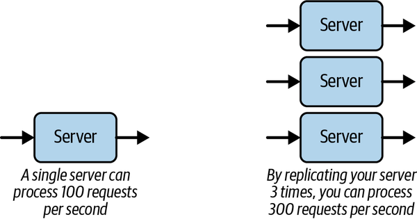
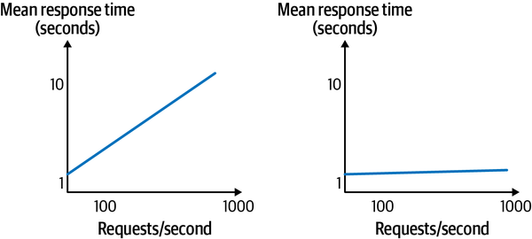

# Chapter 1. Introduction to Scalable Systems

The last 20 years have seen unprecedented growth in the size, complexity, and capacity of software systems. This rate of growth is hardly likely to slow in the next 20 years—what future systems will look like is close to unimaginable right now. However, one thing we can guarantee is that more and more software systems will need to be built with constant growth—more requests, more data, and more analysis—as a primary design driver.

*Scalable* is the term used in software engineering to describe software systems that can accommodate growth. In this chapter I’ll explore what precisely is meant by the ability to scale, known (not surprisingly) as *scalability*. I’ll also describe a few examples that put hard numbers on the capabilities and characteristics of contemporary applications and give a brief history of the origins of the massive systems we routinely build today. Finally, I’ll describe two general principles for achieving scalability, replication and optimization, which will recur in various forms throughout the rest of this book, and examine the indelible link between scalability and other software architecture quality attributes.

# What Is Scalability?

Intuitively, scalability is a pretty straightforward concept. If we ask Wikipedia for a [definition](https://oreil.ly/JsYXf), it tells us, “Scalability is the property of a system to handle a growing amount of work by adding resources to the system.” We all know how we scale a highway system—we add more traffic lanes so it can handle a greater number of vehicles. Some of my favorite people know how to scale beer production—they add more capacity in terms of the number and size of brewing vessels, the number of staff to perform and manage the brewing process, and the number of kegs they can fill with fresh, tasty brews. Think of any physical system—a transit system, an airport, elevators in a building—and how we increase capacity is pretty obvious.

Unlike physical systems, software systems are somewhat amorphous. They are not something you can point at, see, touch, feel, and get a sense of how it behaves internally from external observation. A software system is a digital artifact. At its core, the stream of 1s and 0s that make up executable code and data are hard for anyone to tell apart. So, what does scalability mean in terms of a software system?

Put very simply, and without getting into definition wars, scalability defines a software system’s capability to handle growth in some dimension of its operations. Examples of operational dimensions are:

- The number of simultaneous user or external (e.g., sensor) requests a system can process
- The amount of data a system can effectively process and manage
- The value that can be derived from the data a system stores through predictive analytics
- The ability to maintain a stable, consistent response time as the request load grows

For example, imagine a major supermarket chain is rapidly opening new stores and increasing the number of self-checkout kiosks in every store. This requires the core supermarket software systems to perform the following functions:

- Handle increased volume from item scanning without decreased response time. Instantaneous responses to item scans are necessary to keep customers happy.
- Process and store the greater data volumes generated from increased sales. This data is needed for inventory management, accounting, planning, and likely many other functions.
- Derive “real-time” (e.g., hourly) sales data summaries from each store, region, and country and compare to historical trends. This trend data can help highlight unusual events in regions (unexpected weather conditions, large crowds at events, etc.) and help affected stores to quickly respond.
- Evolve the stock ordering prediction subsystem to be able to correctly anticipate sales (and hence the need for stock reordering) as the number of stores and customers grow.

These dimensions are effectively the scalability requirements of the system. If, over a year, the supermarket chain opens 100 new stores and grows sales by 400 times (some of the new stores are big!), then the software system needs to scale to provide the necessary processing capacity to enable the supermarket to operate efficiently. If the systems don’t scale, we could lose sales when customers become unhappy. We might hold stock that will not be sold quickly, increasing costs. We might miss opportunities to increase sales by responding to local circumstances with special offerings. All these factors reduce customer satisfaction and profits. None are good for business.

Successfully scaling is therefore crucial for our imaginary supermarket’s business growth, and likewise is in fact the lifeblood of many modern internet applications. But for most business and government systems, scalability is not a primary quality requirement in the early stages of development and deployment. New features to enhance usability and utility become the drivers of our development cycles. As long as performance is adequate under normal loads, we keep adding user-facing features to enhance the system’s business value. In fact, introducing some of the sophisticated distributed technologies I’ll describe in this book before there is a clear requirement can actually be deleterious to a project, with the additional complexity causing development inertia.

Still, it’s not uncommon for systems to evolve into a state where enhanced performance and scalability become a matter of urgency, or even survival. Attractive features and high utility breed success, which brings more requests to handle and more data to manage. This often heralds a tipping point, wherein design decisions that made sense under light loads suddenly become technical debt.[1](ch01.md) External trigger events often cause these tipping points: look in the March/April 2020 media for the many reports of government unemployment and supermarket online ordering sites crashing under demand caused by the coronavirus pandemic.

Increasing a system’s capacity in some dimension by increasing resources is called *scaling up* or *scaling out*—I’ll explore the difference between these later. In addition, unlike physical systems, it is often equally important to be able to *scale down* the capacity of a system to reduce costs.

The canonical example of this is Netflix, which has a predictable regional diurnal load that it needs to process. Simply, a lot more people are watching Netflix in any geographical region at 9 p.m. than are at 5 a.m. This enables Netflix to reduce its processing resources during times of lower load. This saves the cost of running the processing nodes that are used in the Amazon cloud, as well as societally worthy things such as reducing data center power consumption. Compare this to a highway. At night when few cars are on the road, we don’t retract lanes (except to make repairs). The full road capacity is available for the few drivers to go as fast as they like. In software systems, we can expand and contract our processing capacity in a matter of seconds to meet instantaneous load. Compared to physical systems, the strategies we deploy are vastly different.

There’s a lot more to consider about scalability in software systems, but let’s come back to these issues after examining the scale of some contemporary software systems circa 2021.

# Examples of System Scale in the Early 2000s

Looking ahead in this technology game is always fraught with danger. In 2008 I wrote:

> “While petabyte datasets and gigabit data streams are today’s frontiers for data-intensive applications, no doubt 10 years from now we’ll fondly reminisce about problems of this scale and be worrying about the difficulties that looming exascale applications are posing.”[2](ch01.md)

Reasonable sentiments, it is true, but exascale? That’s almost commonplace in today’s world. Google reported multiple exabytes of [Gmail in 2014](https://oreil.ly/vQ7M3), and by now, do all Google services manage a yottabyte or more? I don’t know. I’m not even sure I know what a yottabyte is! Google won’t tell us about their storage, but I wouldn’t bet against it. Similarly, how much data does Amazon store in the various AWS data stores for their clients? And how many requests does, say, DynamoDB process per second, collectively, for all supported client applications? Think about these things for too long and your head will explode.

A great source of information that sometimes gives insights into contemporary operational scales are the major internet companies’ technical blogs. There are also websites analyzing internet traffic that are highly illustrative of traffic volumes. Let’s take a couple of point-in-time examples to illustrate a few things we do know today. Bear in mind these will look almost quaint in a year or four:

- Facebook’s engineering blog describes [Scribe](https://oreil.ly/omAo8), their solution for collecting, aggregating, and delivering petabytes of log data per hour, with low latency and high throughput. Facebook’s computing infrastructure comprises millions of machines, each of which generates log files that capture important events relating to system and application health. Processing these log files, for example from a web server, can give development teams insights into their application’s behavior and performance, and support faultfinding. Scribe is a custom buffered queuing solution that can transport logs from servers at a rate of several terabytes per second and deliver them to downstream analysis and data warehousing systems. That, my friends, is a lot of data!
- You can see live internet traffic for numerous services at [Internet Live Stats](https://oreil.ly/9Acav). Dig around and you’ll find some staggering statistics; for example, Google handles around 3.5 billion search requests per day, Instagram users upload about 65 million photos per day, and there are something like 1.7 billion websites. It is a fun site with lots of information. Note that the data is not real, but rather estimates based on statistical analyses of multiple data sources.
- In 2016, Google published a paper describing the [characteristics of its codebase](https://oreil.ly/hyMgl). Among the many startling facts reported is the fact that “The repository contains 86 TBs of data, including approximately two billion lines of code in nine million unique source files.” Remember, this was 2016.[3](ch01.md)

Still, real, concrete data on the scale of the services provided by major internet sites remain shrouded in commercial-in-confidence secrecy. Luckily, we can get some deep insights into the request and data volumes handled at internet scale through the annual usage report from one tech company. Beware though, as it is from Pornhub.[4](ch01.md) You can browse their incredibly detailed [usage statistics from 2019](https://oreil.ly/hOxsP) here. It’s a fascinating glimpse into the capabilities of massive-scale systems.

# How Did We Get Here? A Brief History of System Growth

I am sure many readers will have trouble believing there was civilized life before internet searching, YouTube, and social media. In fact, the first video [upload to YouTube](https://oreil.ly/a8i1b) occurred in 2005. Yep, it is hard even for me to believe. So, let’s take a brief look back in time at how we arrived at the scale of today’s systems. Below are some historical milestones of note:

1980s

An age dominated by time-shared mainframes and minicomputers. PCs emerged in the early 1980s but were rarely networked. By the end of the 1980s, development labs, universities, and (increasingly) businesses had email and access to primitive internet resources.

1990–95

Networks became more pervasive, creating an environment ripe for the creation of the World Wide Web (WWW) with HTTP/HTML technology that had been [pioneered at CERN by Tim Berners-Lee](https://oreil.ly/IULsL) during the 1980s. By 1995, the number of websites was tiny, but the seeds of the future were planted with companies like Yahoo! in 1994 and Amazon and eBay in 1995.

1996–2000

The number of websites grew from [around 10,000 to 10 million](https://oreil.ly/ikPrg), a truly explosive growth period. Networking bandwidth and access also grew rapidly. Companies like Amazon, eBay, Google, and Yahoo! were pioneering many of the design principles and early versions of advanced technologies for highly scalable systems that we know and use today. Everyday businesses rushed to exploit the new opportunities that e-business offered, and this brought system scalability to prominence, as explained in the sidebar [“How Scale Impacted Business Systems”](#how_scale_impacted_business_systems).

2000–2006

The number of websites grew from around 10 million to 80 million during this period, and new service and business models emerged. In 2005, YouTube was launched. 2006 saw Facebook become available to the public. In the same year, Amazon Web Services (AWS), which had low-key beginnings in 2004, relaunched with its S3 and EC2 services.

2007–today

We now live in a world with around 2 billion websites, of which about 20% are active. There are something like [4 billion internet users](https://oreil.ly/LEU3c). Huge data centers operated by public cloud operators like AWS, Google Cloud Platform (GCP), and Microsoft Azure, along with a myriad of private data centers, for example, [Twitter’s operational infrastructure](https://oreil.ly/lUXMu), are scattered around the planet. Clouds host millions of applications, with engineers provisioning and operating their computational and data storage systems using sophisticated cloud management portals. Powerful cloud services make it possible for us to build, deploy, and scale our systems literally with a few clicks of a mouse. All companies have to do is pay their cloud provider bill at the end of the month.

This is the world that this book targets. A world where our applications need to exploit the key principles for building scalable systems and leverage highly scalable infrastructure platforms. Bear in mind, in modern applications, most of the code executed is not written by your organization. It is part of the containers, databases, messaging systems, and other components that you compose into your application through API calls and build directives. This makes the selection and use of these components at least as important as the design and development of your own business logic. They are architectural decisions that are not easy to change.

##### How Scale Impacted Business Systems

The surge of users with internet access in the 1990s brought new online moneymaking opportunities for businesses. There was a huge rush to expose business functions (sales, services, etc.) to users through a web browser. This heralded a profound change in how we had to think about building systems.

Take, for example, a retail bank. Before providing online services, it was possible to accurately predict the loads the bank’s business systems would experience. We knew how many people worked in the bank and used the internal systems, how many terminals/PCs were connected to the bank’s networks, how many ATMs you had to support, and the number and nature of connections to other financial institutions. Armed with this knowledge, we could build systems that support, say, a maximum of 3,000 concurrent users, safe in the knowledge that this number could not be exceeded. Growth would also be relatively slow, and most of the time (i.e., outside business hours) the load would be a lot less than the peak. This made our software design decisions and hardware provisioning a lot easier.

Now, imagine our retail bank decides to let all customers have internet banking access and the bank has five million customers. What is the maximum load now? How will load be dispersed during a business day? When are the peak periods? What happens if we run a limited time promotion to try and sign up new customers? Suddenly, our relatively simple and constrained business systems environment is disrupted by the higher average and peak loads and unpredictability you see from internet-based user populations.

# Scalability Basic Design Principles

The basic aim of scaling a system is to increase its capacity in some application-specific dimension. A common dimension is increasing the number of requests that a system can process in a given time period. This is known as the system’s throughput. Let’s use an analogy to explore two basic principles we have available to us for scaling our systems and increasing throughput: replication and optimization.

In 1932, one of the world’s iconic wonders of engineering, the [Sydney Harbour Bridge](https://oreil.ly/u7bOH), was opened. Now, it is a fairly safe assumption that traffic volumes in 2021 are somewhat higher than in 1932. If by any chance you have driven over the bridge at peak hour in the last 30 years, then you know that its capacity is exceeded considerably every day. So how do we increase throughput on physical infrastructures such as bridges?

This issue became very prominent in Sydney in the 1980s, when it was realized that the capacity of the harbor crossing had to be increased. The solution was the rather less iconic [Sydney Harbour Tunnel](https://oreil.ly/1VWm7), which essentially follows the same route underneath the harbor. This provides four additional lanes of traffic and hence added roughly one-third more capacity to harbor crossings. In not-too-far-away Auckland, their [harbor bridge](https://oreil.ly/E7yJz) also had a capacity problem as it was built in 1959 with only four lanes. In essence, they adopted the same solution as Sydney, namely, to increase capacity. But rather than build a tunnel, they ingeniously doubled the number of lanes by expanding the bridge with the hilariously named [“Nippon clip-ons”](https://oreil.ly/g7QBu), which widened the bridge on each side.

These examples illustrate the first strategy we have in software systems to increase capacity. We basically replicate the software processing resources to provide more capacity to handle requests and thus increase throughput, as shown in [Figure 1-1](#increasing_capacity_through_replication). These replicated processing resources are analogous to the traffic lanes on bridges, providing a mostly independent processing pathway for a stream of arriving requests.

Luckily, in cloud-based software systems, replication can be achieved at the click of a mouse, and we can effectively replicate our processing resources thousands of times. We have it a lot easier than bridge builders in that respect. Still, we need to take care to replicate resources in order to alleviate real bottlenecks. Adding capacity to processing paths that are not overwhelmed will add needless costs without providing scalability benefit.

###### Figure 1-1. Increasing capacity through replication

The second strategy for scalability can also be illustrated with our bridge example. In Sydney, some observant person realized that in the mornings a lot more vehicles cross the bridge from north to south, and in the afternoon we see the reverse pattern. A smart solution was therefore devised—allocate more of the lanes to the high-demand direction in the morning, and sometime in the afternoon, switch this around. This effectively increased the capacity of the bridge without allocating any new resources—we *optimized* the resources we already had available.

We can follow this same approach in software to scale our systems. If we can somehow optimize our processing by using more efficient algorithms, adding extra indexes in our databases to speed up queries, or even rewriting our server in a faster programming language, we can increase our capacity without increasing our resources. The canonical example of this is Facebook’s creation of (the now discontinued) [HipHop for PHP](https://oreil.ly/d2JFX), which increased the speed of Facebook’s web page generation by up to six times by compiling PHP code to C++.

I’ll revisit these two design principles—namely replication and optimization—throughout this book. You will see that there are many complex implications of adopting these principles, arising from the fact that we are building distributed systems. Distributed systems have properties that make building scalable systems *interesting*, which in this context has both positive and negative connotations.

# Scalability and Costs

Let’s take a trivial hypothetical example to examine the relationship between scalability and costs. Assume we have a web-based (e.g., web server and database) system that can service a load of 100 concurrent requests with a mean response time of 1 second. We get a business requirement to scale up this system to handle 1,000 concurrent requests with the same response time. Without making any changes, a simple load test of this system reveals the performance shown in [Figure 1-2](#scaling_an_applicationsemicolon_non-sca) (left). As the request load increases, we see the mean response time steadily grow to 10 seconds with the projected load. Clearly this does not satisfy our requirements in its current deployment configuration. The system doesn’t scale.

###### Figure 1-2. Scaling an application; non-scalable performance is represented on the left, and scalable performance on the right

Some engineering effort is needed in order to achieve the required performance. [Figure 1-2](#scaling_an_applicationsemicolon_non-sca) (right) shows the system’s performance after this effort has been modified. It now provides the specified response time with 1,000 concurrent requests. And so, we have successfully scaled the system. Party time!

A major question looms, however. Namely, how much effort and resources were required to achieve this performance? Perhaps it was simply a case of running the web server on a more powerful (virtual) machine. Performing such reprovisioning on a cloud might take 30 minutes at most. Slightly more complex would be reconfiguring the system to run multiple instances of the web server to increase capacity. Again, this should be a simple, low-cost configuration change for the application, with no code changes needed. These would be excellent outcomes.

However, scaling a system isn’t always so easy. The reasons for this are many and varied, but here are some possibilities:

- The database becomes less responsive with 1,000 requests per second, requiring an upgrade to a new machine.
- The web server generates a lot of content dynamically and this reduces response time under load. A possible solution is to alter the code to more efficiently generate the content, thus reducing processing time per request.
- The request load creates hotspots in the database when many requests try to access and update the same records simultaneously. This requires a schema redesign and subsequent reloading of the database, as well as code changes to the data access layer.
- The web server framework that was selected emphasized ease of development over scalability. The model it enforces means that the code simply cannot be scaled to meet the requested load requirements, and a complete rewrite is required. Use another framework? Use another programming language even?

There’s a myriad of other potential causes, but hopefully these illustrate the increasing effort that might be required as we move from possibility (1) to possibility (4).

Now let’s assume option (1), upgrading the database server, requires 15 hours of effort and a thousand dollars in extra cloud costs per month for a more powerful server. This is not prohibitively expensive. And let’s assume option (4), a rewrite of the web application layer, requires 10,000 hours of development due to implementing a new language (e.g., Java instead of Ruby). Options (2) and (3) fall somewhere in between options (1) and (4). The cost of 10,000 hours of development is seriously significant. Even worse, while the development is underway, the application may be losing market share and hence money due to its inability to satisfy client requests’ loads. These kinds of situations can cause systems and businesses to fail.

This simple scenario illustrates how the dimensions of resource and effort costs are inextricably tied to scalability. If a system is not designed intrinsically to scale, then the downstream costs and resources of increasing its capacity to meet requirements may be massive. For some applications, such as [HealthCare.gov](https://oreil.ly/P7nyc), these (more than $2 billion) costs are borne and the system is modified to eventually meet business needs. For others, such as [Oregon’s health care exchange](https://oreil.ly/fTDcc), an inability to scale rapidly at low cost can be an expensive ($303 million, in Oregon’s case) death knell.

We would never expect someone would attempt to scale up the capacity of a suburban home to become a 50-floor office building. The home doesn’t have the architecture, materials, and foundations for this to be even a remote possibility without being completely demolished and rebuilt. Similarly, we shouldn’t expect software systems that do not employ scalable architectures, mechanisms, and technologies to be quickly evolved to meet greater capacity needs. The foundations of scale need to be built in from the beginning, with the recognition that the components will evolve over time. By employing design and development principles that promote scalability, we can more rapidly and cheaply scale up systems to meet rapidly growing demands. I’ll explain these principles in [Part II](part02.md) of this book.

Software systems that can be scaled exponentially while costs grow linearly are known as hyperscale systems, which I define as follows: “Hyper scalable systems exhibit exponential growth in computational and storage capabilities while exhibiting linear growth rates in the costs of resources required to build, operate, support, and evolve the required software and hardware resources.” You can read more about hyperscale systems [in this article](https://oreil.ly/WwHqX).

# Scalability and Architecture Trade-Offs

Scalability is just one of the many quality attributes, or nonfunctional requirements, that are the lingua franca of the discipline of software architecture. One of the enduring complexities of software architecture is the necessity of quality attribute trade-offs. Basically, a design that favors one quality attribute may negatively or positively affect others. For example, we may want to write log messages when certain events occur in our services so we can do forensics and support debugging of our code. We need to be careful, however, how many events we capture, because logging introduces overheads and negatively affects performance and cost.

Experienced software architects constantly tread a fine line, crafting their designs to satisfy high-priority quality attributes, while minimizing the negative effects on other quality attributes.

Scalability is no different. When we point the spotlight at the ability of a system to scale, we have to carefully consider how our design influences other highly desirable properties such as performance, availability, security, and the oft overlooked manageability. I’ll briefly discuss some of these inherent trade-offs in the following sections.

## Performance

There’s a simple way to think about the difference between performance and scalability. When we target performance, we attempt to satisfy some desired metrics for individual requests. This might be a mean response time of less than 2 seconds, or a worst-case performance target such as the 99th percentile response time less than 3 seconds.

Improving performance is in general a good thing for scalability. If we improve the performance of individual requests, we create more capacity in our system, which helps us with scalability as we can use the unused capacity to process more requests.

However, it’s not always that simple. We may reduce response times in a number of ways. We might carefully optimize our code by, for example, removing unnecessary object copying, using a faster JSON serialization library, or even completely rewriting code in a faster programming language. These approaches optimize performance without increasing resource usage.

An alternative approach might be to optimize individual requests by keeping commonly accessed state in memory rather than writing to the database on each request. Eliminating a database access nearly always speeds things up. However, if our system maintains large amounts of state in memory for prolonged periods, we may (and in a heavily loaded system, will) have to carefully manage the number of requests our system can handle. This will likely reduce scalability as our optimization approach for individual requests uses more resources (in this case, memory) than the original solution, and thus reduces system capacity.

We’ll see this tension between performance and scalability reappear throughout this book. In fact, it’s sometimes judicious to make individual requests slightly slower so we can utilize additional system capacity. A great example of this is described when I discuss load balancing in the next chapter.

## Availability

Availability and scalability are in general highly compatible partners. As we scale our systems through replicating resources, we create multiple instances of services that can be used to handle requests from any users. If one of our instances fails, the others remain available. The system just suffers from reduced capacity due to a failed, unavailable resource. Similar thinking holds for replicating network links, network routers, disks, and pretty much any resource in a computing system.

Things get complicated with scalability and availability when state is involved. Think of a database. If our single database server becomes overloaded, we can replicate it and send requests to either instance. This also increases availability as we can tolerate the failure of one instance. This scheme works great if our databases are read only. But as soon as we update one instance, we somehow have to figure out how and when to update the other instance. This is where the issue of replica consistency raises its ugly head.

In fact, whenever state is replicated for scalability and availability, we have to deal with consistency. This will be a major topic when I discuss distributed databases in [Part III](part03.md) of this book.

## Security

Security is a complex, highly technical topic worthy of its own book. No one wants to use an insecure system, and systems that are hacked and compromise user data cause CTOs to resign, and in extreme cases, companies to fail.

The basic elements of a secure system are authentication, authorization, and integrity. We need to ensure data cannot be intercepted in transit over networks, and data at rest (persistent store) cannot be accessed by anyone who does not have permission to access that data. Basically, I don’t want anyone seeing my credit card number as it is communicated between systems or stored in a company’s database.

Hence, security is a necessary quality attribute for any internet-facing systems. The costs of building secure systems cannot be avoided, so let’s briefly examine how these affect performance and scalability.

At the network level, systems routinely exploit the [Transport Layer Security (TLS) protocol](https://oreil.ly/pG2eg), which runs on top of TCP/IP (see [Chapter 3](ch03.md)). TLS provides encryption, authentication, and integrity using [asymmetric cryptography](https://oreil.ly/FqPSm). This has a performance cost for establishing a secure connection as both parties need to generate and exchange keys. TLS connection establishment also includes an exchange of certificates to verify the identity of the server (and optionally client), and the selection of an algorithm to check that the data is not tampered with in transit. Once a connection is established, in-flight data is encrypted using symmetric cryptography, which has a negligible performance penalty as modern CPUs have dedicated encryption hardware. Connection establishment usually requires two message exchanges between client and server, and is thus comparatively slow. Reusing connections as much as possible minimizes these performance overheads.

There are multiple options for protecting data at rest. Popular database engines such as SQL Server and Oracle have features such as transparent data encryption (TDE) that provides efficient file-level encryption. Finer-grain encryption mechanisms, down to field level, are increasingly required in regulated industries such as finance. Cloud providers offer various features too, ensuring data stored in cloud-based data stores is secure. The overheads of secure data at rest are simply costs that must be borne to achieve security—studies suggest the overheads are in the 5–10% range.

Another perspective on security is the [CIA triad](https://oreil.ly/building-secure), which stands for *confidentiality*, *integrity*, and *availability*. The first two are pretty much what I have described above. Availability refers to a system’s ability to operate reliably under attack from adversaries. Such attacks might be attempts to exploit a system design weakness to bring the system down. Another attack is the classic distributed denial-of-service (DDoS), in which an adversary gains control over multitudes of systems and devices and coordinates a flood of requests that effectively make a system unavailable.

In general, security and scalability are opposing forces. Security necessarily introduces performance degradation. The more layers of security a system encompasses, then a greater burden is placed on performance, and hence scalability. This eventually affects the bottom line—more powerful and expensive resources are required to achieve a system’s performance and scalability requirements.

## Manageability

As the systems we build become more distributed and complex in their interactions, their management and operations come to the fore. We need to pay attention to ensuring every component is operating as expected, and the performance is continuing to meet expectations.

The platforms and technologies we use to build our systems provide a multitude of standards-based and proprietary monitoring tools that can be used for these purposes. Monitoring dashboards can be used to check the ongoing health and behavior of each system component. These dashboards, built using highly customizable and open tools such as [Grafana](https://oreil.ly/PNaBs), can display system metrics and send alerts when various thresholds or events occur that need operator attention. The term used for this sophisticated monitoring capability is [*observability*](https://oreil.ly/xcuLd).

There are various APIs such as Java’s [MBeans](https://oreil.ly/vtTUT), AWS [CloudWatch](https://oreil.ly/cvviZ) and Python’s [AppMetrics](https://oreil.ly/oa9MT) that engineers can utilize to capture custom metrics for their systems—a typical example is request response times. Using these APIs, monitoring dashboards can be tailored to provide live charts and graphs that give deep insights into a system’s behavior. Such insights are invaluable to ensure ongoing operations and highlight parts of the system that may need optimization or replication.

Scaling a system invariably means adding new system components—hardware and software. As the number of components grows, we have more moving parts to monitor and manage. This is never effort-free. It adds complexity to the operations of the system and costs in terms of monitoring code that requires developing and observability platform evolution.

The only way to control the costs and complexity of manageability as we scale is through automation. This is where the world of DevOps enters the scene. [*DevOps*](https://oreil.ly/effective-devops) is a set of practices and tooling that combine software development and system operations. DevOps reduces the development lifecycle for new features and automates ongoing test, deployment, management, upgrade, and monitoring of the system. It’s an integral part of any successful scalable system.

# Summary and Further Reading

The ability to scale an application quickly and cost-effectively should be a defining quality of the software architecture of contemporary internet-facing applications. We have two basic ways to achieve scalability, namely increasing system capacity, typically through replication, and performance optimization of system components.

Like any software architecture quality attribute, scalability cannot be achieved in isolation. It inevitably involves complex trade-offs that need to be tuned to an application’s requirements. I’ll be discussing these fundamental trade-offs throughout the remainder of this book, starting in the next chapter when I describe concrete architecture approaches to achieve scalability.

[1](ch01.md) Neil Ernst et al., *Technical Debt in Practice: How to Find It and Fix It* (MIT Press, 2021).

[2](ch01.md) Ian Gorton et al., “Data-Intensive Computing in the 21st Century,” *Computer* 41, no. 4 (April 2008): 30–32.

[3](ch01.md) Rachel Potvin and Josh Levenberg, “Why Google Stores Billions of Lines of Code in a Single Repository,” *Communications of the ACM* 59, 7 (July 2016): 78–87.

[4](ch01.md) The report is not for the squeamish. Here’s one illustrative PG-13 data point—the site had 42 billion visits in 2019! Some of the statistics will definitely make your eyes bulge.
