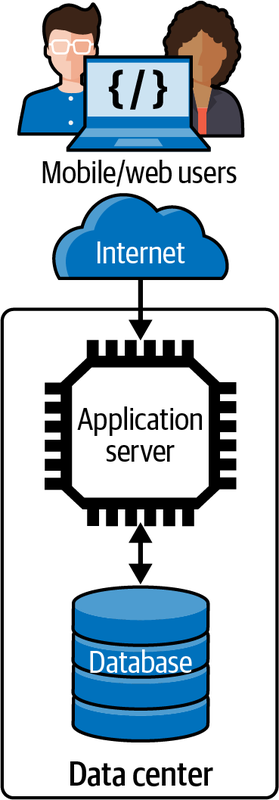
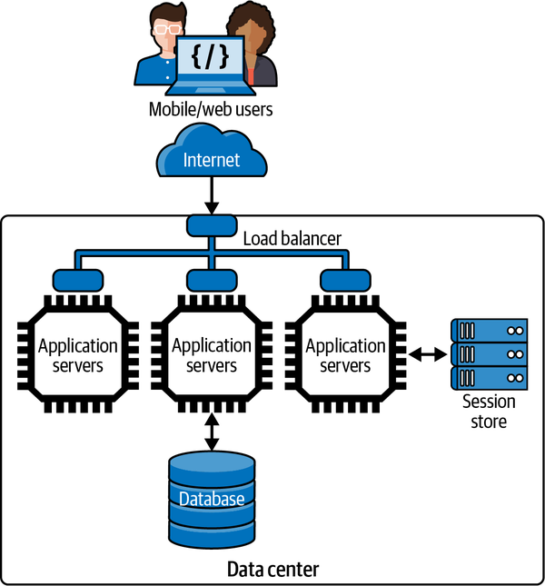
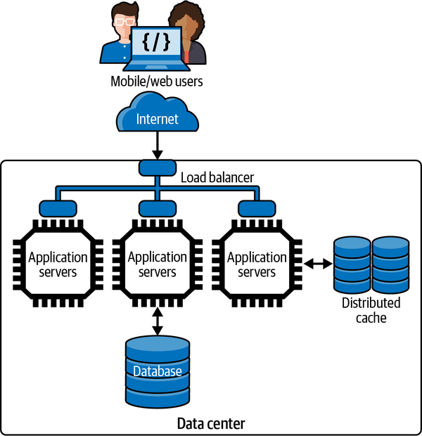
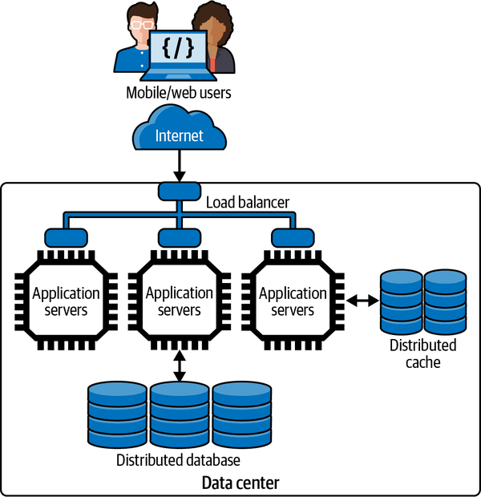
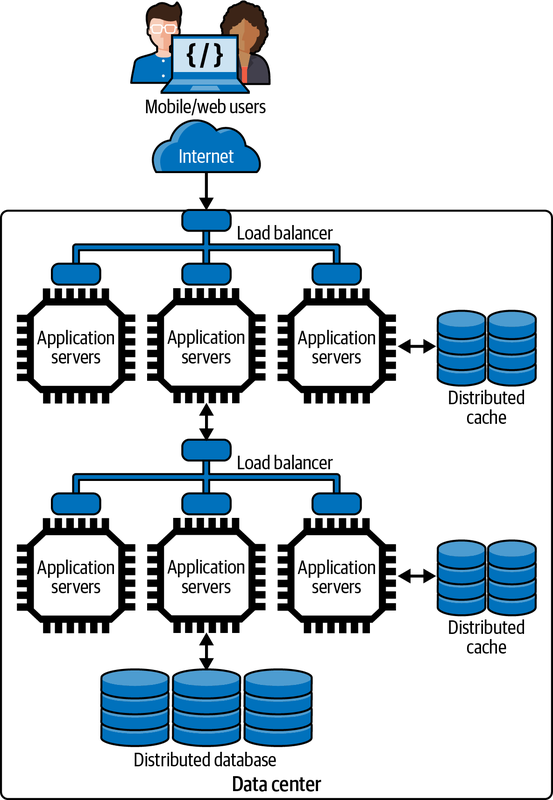
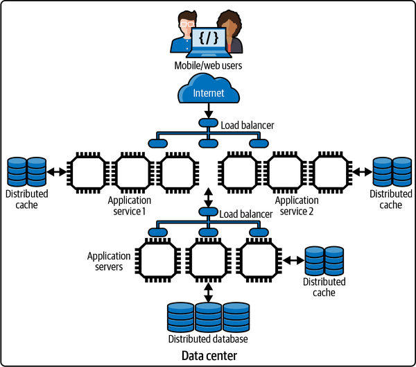
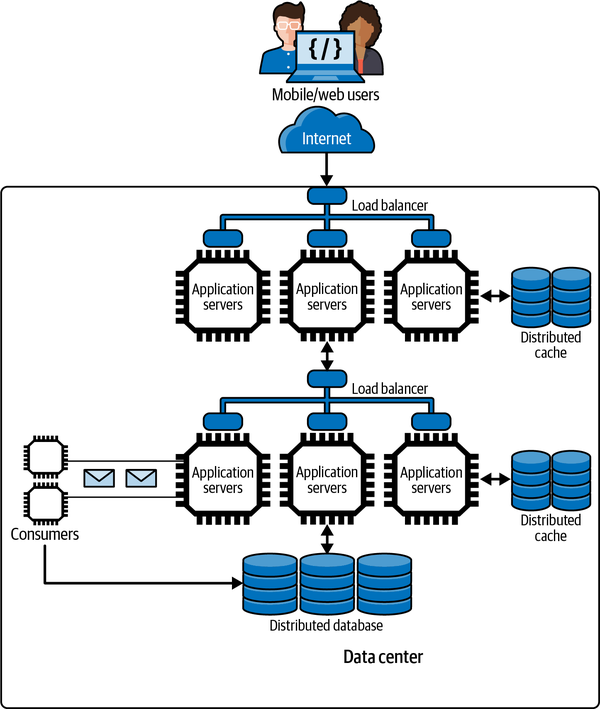
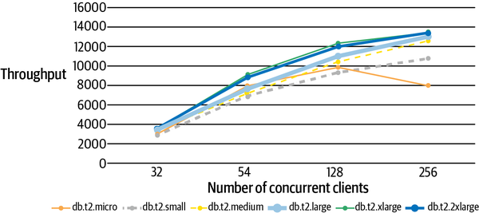

# Chapter 2. Distributed Systems Architectures: An Introduction

In this chapter, I’ll broadly cover some of the fundamental approaches to scaling a software system. You can regard this as a 30,000-foot view of the content that is covered in [Part II](part02.md), [Part III](part03.md), and [Part IV](part04.md) of this book. I’ll take you on a tour of the main architectural approaches used for scaling a system, and give pointers to later chapters where these issues are dealt with in depth. You can think of this as an overview of why we need these architectural tactics, with the remainder of the book explaining the how.

The type of systems this book is oriented toward are the internet-facing systems we all utilize every day. I’ll let you name your favorite. These systems accept requests from users through web and mobile interfaces, store and retrieve data based on user requests or events (e.g., a GPS-based system), and have some *intelligent* features such as providing recommendations or notifications based on previous user interactions.

I’ll start with a simple system design and show how it can be scaled. In the process, I’ll introduce several concepts that will be covered in much more detail later in this book. This chapter just gives a broad overview of these concepts and how they aid in scalability—truly a whirlwind tour!

# Basic System Architecture

Virtually all massive-scale systems start off small and grow due to their success. It’s common, and sensible, to start with a development framework such as Ruby on Rails, Django, or equivalent, which promotes rapid development to get a system quickly up and running. A typical very simple software architecture for “starter” systems, which closely resembles what you get with rapid development frameworks, is shown in [Figure 2-1](#basic_multitier_distributed_systems_arc). This comprises a client tier, application service tier, and a database tier. If you use Rails or equivalent, you also get a framework which hardwires a model–view–controller (MVC) pattern for web application processing and an object–relational mapper (ORM) that generates SQL queries.

###### Figure 2-1. Basic multitier distributed systems architecture

With this architecture, users submit requests to the application from their mobile app or web browser. The magic of internet networking (see [Chapter 3](ch03.md)) delivers these requests to the application service which is running on a machine hosted in some corporate or commercial cloud data center. Communications uses a standard application-level network protocol, typically HTTP.

The application service runs code supporting an API that clients use to send HTTP requests. Upon receipt of a request, the service executes the code associated with the requested API. In the process, it may read from or write to a database or some other external system, depending on the semantics of the API. When the request is complete, the service sends the results to the client to display in their app or browser.

Many, if not most systems conceptually look exactly like this. The application service code exploits a server execution environment that enables multiple requests from multiple users to be processed simultaneously. There’s a myriad of these application server technologies—for example, Java EE and the Spring Framework for Java, [Flask](https://oreil.ly/8FYu5) for Python—that are widely used in this scenario.

This approach leads to what is generally known as a monolithic architecture.[1](ch02.md) Monoliths tend to grow in complexity as the application becomes more feature-rich. All API handlers are built into the same server code body. This eventually makes it hard to modify and test rapidly, and the execution footprint can become extremely heavyweight as all the API implementations run in the same application service.

Still, if request loads stay relatively low, this application architecture can suffice. The service has the capacity to process requests with consistently low latency. But if request loads keep growing, this means latencies will increase as the service has insufficient CPU/memory capacity for the concurrent request volume and therefore requests will take longer to process. In these circumstances, our single server is overloaded and has become a bottleneck.

In this case, the first strategy for scaling is usually to “scale up” the application service hardware. For example, if your application is running on AWS, you might upgrade your server from a modest t3.xlarge instance with four (virtual) CPUs and 16 GB of memory to a t3.2xlarge instance, which doubles the number of CPUs and memory available for the application.[2](ch02.md)

Scaling up is simple. It gets many real-world applications a long way to supporting larger workloads. It obviously costs more money for hardware, but that’s scaling for you.

It’s inevitable, however, that for many applications the load will grow to a level which will swamp a single server node, no matter how many CPUs and how much memory you have. That’s when you need a new strategy—namely, scaling out, or horizontal scaling, which I touched on in [Chapter 1](ch01.md).

# Scale Out

Scaling out relies on the ability to replicate a service in the architecture and run multiple copies on multiple server nodes. Requests from clients are distributed across the replicas so that in theory, if we have N replicas and R requests, each server node processes R/N requests. This simple strategy increases an application’s capacity and hence scalability.

To successfully scale out an application, you need two fundamental elements in your design. As illustrated in [Figure 2-2](#scale-out_architecture), these are:

A load balancer

All user requests are sent to a load balancer, which chooses a service replica target to process the request. Various strategies exist for choosing a target service, all with the core aim of keeping each resource equally busy. The load balancer also relays the responses from the service back to the client. Most load balancers belong to a class of internet components known as [reverse proxies](https://oreil.ly/78lLN). These control access to server resources for client requests. As an intermediary, reverse proxies add an extra network hop for a request; they need to be extremely low latency to minimize the overheads they introduce. There are many off-the-shelf load balancing solutions as well as cloud provider–specific ones, and I’ll cover the general characteristics of these in much more detail in [Chapter 5](ch05.md).

Stateless services

For load balancing to be effective and share requests evenly, the load balancer must be free to send consecutive requests from the same client to different service instances for processing. This means the API implementations in the services must retain no knowledge, or state, associated with an individual client’s session. When a user accesses an application, a user session is created by the service and a unique session is managed internally to identify the sequence of user interactions and track session state. A classic example of session state is a shopping cart. To use a load balancer effectively, the data representing the current contents of a user’s cart must be stored somewhere—typically a data store—such that any service replica can access this state when it receives a request as part of a user session. In [Figure 2-2](#scale-out_architecture), this is labeled as a “Session store.”

Scaling out is attractive as, in theory, you can keep adding new (virtual) hardware and services to handle increased request loads and keep request latencies consistent and low. As soon as you see latencies rising, you deploy another server instance. This requires no code changes with stateless services and is relatively cheap as a result—you just pay for the hardware you deploy.

Scaling out has another highly attractive feature. If one of the services fails, the requests it is processing will be lost. But as the failed service manages no session state, these requests can be simply reissued by the client and sent to another service instance for processing. This means the application is resilient to failures in the service software and hardware, thus enhancing the application’s availability.

Unfortunately, as with any engineering solution, simple scaling out has limits. As you add new service instances, the request processing capacity grows, potentially infinitely. At some stage, however, reality will bite and the capability of your single database to provide low-latency query responses will diminish. Slow queries will mean longer response times for clients. If requests keep arriving faster than they are being processed, some system components will become overloaded and fail due to resource exhaustion, and clients will see exceptions and request timeouts. Essentially, your database becomes a bottleneck that you must engineer away in order to scale your application further.

###### Figure 2-2. Scale-out architecture

# Scaling the Database with Caching

Scaling up by increasing the number of CPUs, memory, and disks in a database server can go a long way to scaling a system. For example, at the time of writing, GCP can provision a SQL database on a db-n1-highmem-96 node, which has 96 virtual CPUs (vCPUs), 624 GB of memory, 30 TB of disk, and can support 4,000 connections. This will cost somewhere between $6K and $16K per year, which sounds like a good deal to me! Scaling up is a common database scalability strategy.

Large databases need constant care and attention from highly skilled database administrators to keep them tuned and running fast. There’s a lot of wizardry in this job—e.g., query tuning, disk partitioning, indexing, on-node caching, and so on—and hence database administrators are valuable people you want to be very nice to. They can make your application services highly responsive.

In conjunction with scaling up, a highly effective approach is querying the database as infrequently as possible from your services. This can be achieved by employing *distributed caching* in the scaled-out service tier. Caching stores recently retrieved and commonly accessed database results in memory so they can be quickly retrieved without placing a burden on the database. For example, the weather forecast for the next hour won’t change, but may be queried by hundreds or thousands of clients. You can use a cache to store the forecast once it is issued. All client requests will read from the cache until the forecast expires.

For data that is frequently read and changes rarely, your processing logic can be modified to first check a distributed cache, such as a [Redis](https://redis.io) or [memcached](https://memcached.org) store. These cache technologies are essentially distributed key-value stores with very simple APIs. This scheme is illustrated in [Figure 2-3](#introducing_distributed_caching). Note that the session store from [Figure 2-2](#scale-out_architecture) has disappeared. This is because you can use a general-purpose distributed cache to store session identifiers along with application data.

###### Figure 2-3. Introducing distributed caching

Accessing the cache requires a remote call from your service. If the data you need is in the cache, on a fast network you can expect submillisecond cache reads. This is far less expensive than querying the shared database instance, and also doesn’t require a query to contend for typically scarce database connections.

Introducing a caching layer also requires your processing logic to be modified to check for cached data. If what you want is not in the cache, your code must still query the database and load the results into the cache as well as return it to the caller. You also need to decide when to remove, or invalidate, cached results—your course of action depends on the nature of your data (e.g., weather forecasts expire naturally) and your application’s tolerance to serving out-of-date—also known as *stale*—results to clients.

A well-designed caching scheme can be invaluable in scaling a system. Caching works great for data that rarely changes and is accessed frequently, such as inventory catalogs, event information, and contact data. If you can handle a large percentage, say, 80% or more, of read requests from your cache, then you effectively buy extra capacity at your databases as they never see a large proportion of requests.

Still, many systems need to rapidly access terabytes and larger data stores that make a single database effectively prohibitive. In these systems, a distributed database is needed.

# Distributing the Database

There are more distributed database technologies around in 2022 than you probably want to imagine. It’s a complex area, and one I’ll cover extensively in [Part III](part03.md). In very general terms, there are two major categories:

Distributed SQL stores

These enable organizations to scale out their SQL database relatively seamlessly by storing the data across multiple disks that are queried by multiple database engine replicas. These multiple engines logically appear to the application as a single database, hence minimizing code changes. There is also a class of “born distributed” SQL databases that are commonly known as NewSQL stores that fit in this category.

Distributed so-called “NoSQL” stores (from a whole array of vendors)

These products use a variety of data models and query languages to distribute data across multiple nodes running the database engine, each with their own locally attached storage. Again, the location of the data is transparent to the application, and typically controlled by the design of the data model using hashing functions on database keys. Leading products in this category are Cassandra, MongoDB, and Neo4j.

[Figure 2-4](#scaling_the_data_tier_using_a_distribut) shows how our architecture incorporates a distributed database. As the data volumes grow, a distributed database can increase the number of storage nodes. As nodes are added (or removed), the data managed across all nodes is rebalanced to attempt to ensure the processing and storage capacity of each node is equally utilized.

###### Figure 2-4. Scaling the data tier using a distributed database

Distributed databases also promote availability. They support replicating each data storage node so if one fails or cannot be accessed due to network problems, another copy of the data is available. The models utilized for replication and the trade-offs these require (spoiler alert: consistency) are covered in later chapters.

If you are utilizing a major cloud provider, there are also two deployment choices for your data tier. You can deploy your own virtual resources and build, configure, and administer your own distributed database servers. Alternatively, you can utilize cloud-hosted databases. The latter simplifies the administrative effort associated with managing, monitoring, and scaling the database, as many of these tasks essentially become the responsibility of the cloud provider you choose. As usual, the no free lunch principle applies. You always pay, whichever approach you choose.

# Multiple Processing Tiers

Any realistic system that you need to scale will have many different services that interact to process a request. For example, accessing a web page on [Amazon.com](http://amazon.com) can require in excess of 100 different services being called before a response is returned to the user.[3](ch02.md)

The beauty of the stateless, load-balanced, cached architecture I am elaborating in this chapter is that it’s possible to extend the core design principles and build a multitiered application. In fulfilling a request, a service can call one or more dependent services, which in turn are replicated and load-balanced. A simple example is shown in [Figure 2-5](#scaling_processing_capacity_with_multip). There are many nuances in how the services interact, and how applications ensure rapid responses from dependent services. Again, I’ll cover these in detail in later chapters.

###### Figure 2-5. Scaling processing capacity with multiple tiers

This design also promotes having different, load-balanced services at each tier in the architecture. For example, [Figure 2-6](#scalable_architecture_with_multiple_ser) illustrates two replicated internet-facing services that both utilized a core service that provides database access. Each service is load balanced and employs caching to provide high performance and availability. This design is often used to provide a service for web clients and a service for mobile clients, each of which can be scaled independently based on the load they experience. It’s commonly called the Backend for Frontend (BFF) pattern.[4](ch02.md)

###### Figure 2-6. Scalable architecture with multiple services

In addition, by breaking the application into multiple independent services, you can scale each based on the service demand. If, for example, you see an increasing volume of requests from mobile users and decreasing volumes from web users, it’s possible to provision different numbers of instances for each service to satisfy demand. This is a major advantage of refactoring monolithic applications into multiple independent services, which can be separately built, tested, deployed, and scaled. I’ll explore some of the major issues in designing systems based on such services, known as microservices, in [Chapter 9](ch09.md).

# Increasing Responsiveness

Most client application requests expect a response. A user might want to see all auction items for a given product category or see the real estate that is available for sale in a given location. In these examples, the client sends a request and waits until a response is received. This time interval between sending the request and receiving the result is the response time of the request. You can decrease response times by using caching and precalculated responses, but many requests will still result in database accesses.

A similar scenario exists for requests that update data in an application. If a user updates their delivery address immediately prior to placing an order, the new delivery address must be persisted so that the user can confirm the address before they hit the “purchase” button. The response time in this case includes the time for the database write, which is confirmed by the response the user receives.

Some update requests, however, can be successfully responded to without fully persisting the data in a database. For example, the skiers and snowboarders among you will be familiar with lift ticket scanning systems that check you have a valid pass to ride the lifts that day. They also record which lifts you take, the time you get on, and so on. Nerdy skiers/snowboarders can then use the resort’s mobile app to see how many lifts they ride in a day.

As a person waits to get on a lift, a scanner device validates the pass using an RFID (radio-frequency identification) chip reader. The information about the rider, lift, and time are then sent over the internet to a data capture service operated by the ski resort. The lift rider doesn’t have to wait for this to occur, as the response time could slow down the lift-loading process. There’s also no expectation from the lift rider that they can instantly use their app to ensure this data has been captured. They just get on the lift, talk smack with their friends, and plan their next run.

Service implementations can exploit this type of scenario to improve responsiveness. The data about the event is sent to the service, which acknowledges receipt and concurrently stores the data in a remote queue for subsequent writing to the database. Distributed queueing platforms can be used to reliably send data from one service to another, typically but not always in a first-in, first-out (FIFO) manner.

Writing a message to a queue is typically much faster than writing to a database, and this enables the request to be successfully acknowledged much more quickly. Another service is deployed to read messages from the queue and write the data to the database. When a skier checks their lift rides—maybe three hours or three days later—the data has been persisted successfully in the database.

The basic architecture to implement this approach is illustrated in [Figure 2-7](#increasing_responsiveness_with_queueing).

###### Figure 2-7. Increasing responsiveness with queueing

Whenever the results of a write operation are not immediately needed, an application can use this approach to improve responsiveness and, as a result, scalability. Many queueing technologies exist that applications can utilize, and I’ll discuss how these operate in [Chapter 7](ch07.md). These queueing platforms all provide asynchronous communications. A *producer* service writes to the queue, which acts as temporary storage, while another *consumer* service removes messages from the queue and makes the necessary updates to, in our example, a database that stores skier lift ride details.

The key is that the data *eventually* gets persisted. Eventually typically means a few seconds at most but use cases that employ this design should be resilient to longer delays without impacting the user experience.

# Systems and Hardware Scalability

Even the most carefully crafted software architecture and code will be limited in terms of scalability if the services and data stores run on inadequate hardware. The open source and commercial platforms that are commonly deployed in scalable systems are designed to utilize additional hardware resources in terms of CPU cores, memory, and disks. It’s a balancing act between achieving the performance and scalability you require, and keeping your costs as low as possible.

That said, there are some cases where upgrading the number of CPU cores and available memory is not going to buy you more scalability. For example, if code is single threaded, running it on a node with more cores is not going to improve performance. It’ll just use one core at any time. The rest are simply not used. If multithreaded code contains many serialized sections, only one threaded core can proceed at a time to ensure the results are correct. This phenomenon is described by [Amdahl’s law](https://oreil.ly/w8Z5l). This gives us a way to calculate the theoretical acceleration of code when adding more CPU cores based on the amount of code that executes serially.

Two data points from Amdahl’s law are:

- If only 5% of a code executes serially, the rest in parallel, adding more than 2,048 cores has essentially no effect.
- If 50% of a code executes serially, the rest in parallel, adding more than 8 cores has essentially no effect.

This demonstrates why efficient, multithreaded code is essential to achieving scalability. If your code is not running as highly independent tasks implemented as threads, then not even money will buy you scalability. That’s why I devote [Chapter 4](ch04.md) to the topic of multithreading—it’s a core knowledge component for building scalable distributed systems.

To illustrate the effect of upgrading hardware, [Figure 2-8](#an_example_of_scaling_up_a_database_ser) shows how the throughput of a benchmark system improves as the database is deployed on more powerful (and expensive) hardware.[5](ch02.md) The benchmark employs a Java service that accepts requests from a load generating client, queries a database, and returns the results to the client. The client, service, and database run on different hardware resources deployed in the same regions in the AWS cloud.

###### Figure 2-8. An example of scaling up a database server

In the tests, the number of concurrent requests grows from 32 to 256 (*x*-axis) and each line represents the system throughput (*y*-axis) for a different hardware configuration on the AWS EC2’s Relational Database Service (RDS). The different configurations are listed at the bottom of the chart, with the least powerful on the left and most powerful on the right. Each client sends a fixed number of requests synchronously over HTTP, with no pause between receiving results from one request and sending the next. This consequently exerts a high request load on the server.

From this chart, it’s possible to make some straightforward observations:

- In general, the more powerful the hardware selected for the database, the higher the throughput. That is good.
- The difference between the db.t2.xlarge and db.t2.2xlarge instances in terms of throughput is minimal. This could be because the service tier is becoming a bottleneck, or our database model and queries are not exploiting the additional resources of the db.t2.2xlarge RDS instance. Regardless—more bucks, no bang.
- The two least powerful instances perform pretty well until the request load is increased to 256 concurrent clients. The dip in throughput for these two instances indicates they are overloaded and things will only get worse if the request load increases.

Hopefully, this simple example illustrates why scaling through simple upgrading of hardware needs to be approached carefully. Adding more hardware always increases costs, but may not always give the performance improvement you expect. Running simple experiments and taking measurements is essential for assessing the effects of hardware upgrades. It gives you solid data to guide your design and justify costs to stakeholders.

# Summary and Further Reading

In this chapter I’ve provided a whirlwind tour of the major approaches you can utilize to scale out a system as a collection of communicating services and distributed databases. Much detail has been brushed over, and as you have no doubt realized—in software systems the devil is in the detail. Subsequent chapters will therefore progressively start to explore these details, starting with some fundamental characteristics of distributed systems in [Chapter 3](ch03.md) that everyone should be aware of.

Another area this chapter has skirted around is the subject of software architecture. I’ve used the term *services* for distributed components in an architecture that implement application business logic and database access. These services are independently deployed processes that communicate using remote communications mechanisms such as HTTP. In architectural terms, these services are most closely mirrored by those in the service-oriented architecture (SOA) pattern, an established architectural approach for building distributed systems. A more modern evolution of this approach revolves around microservices. These tend to be more cohesive, encapsulated services that promote continuous development and deployment.

If you’d like a much more in-depth discussion of these issues, and software architecture concepts in general, then Mark Richards’ and Neal Ford’s book [*Fundamentals of Software Architecture: An Engineering Approach*](https://oreil.ly/soft-arch) (O’Reilly, 2020) is an excellent place to start.

Finally, there’s a class of *big data* software architectures that address some of the issues that come to the fore with very large data collections. One of the most prominent is data reprocessing. This occurs when data that has already been stored and analyzed needs to be reanalyzed due to code or business rule changes. This reprocessing may occur due to software fixes, or the introduction of new algorithms that can derive more insights from the original raw data. There’s a good discussion of the Lambda and Kappa architectures, both of which are prominent in this space, in Jay Krepps’ 2014 article [“Questioning the Lambda Architecture”](https://oreil.ly/zkUBT) on the O’Reilly Radar blog.

[1](ch02.md) Mark Richards and Neal Ford. *Fundamentals of Software Architecture: An Engineering Approach* (O’Reilly Media, 2020).

[2](ch02.md) See [Amazon EC2 Instance Types](https://oreil.ly/rtYaJ) for a description of AWS instances.

[3](ch02.md) Werner Vogels, “Modern Applications at AWS,” All Things Distributed, 28 Aug. 2019, [*https://oreil.ly/FXOep*](https://oreil.ly/FXOep).

[4](ch02.md) Sam Newman, “Pattern: Backends For Frontends,” Sam Newman &amp; Associates, November 18, 2015. [*https://oreil.ly/1KR1z*](https://oreil.ly/1KR1z).

[5](ch02.md) Results are courtesy of Ruijie Xiao from Northeastern University, Seattle.
