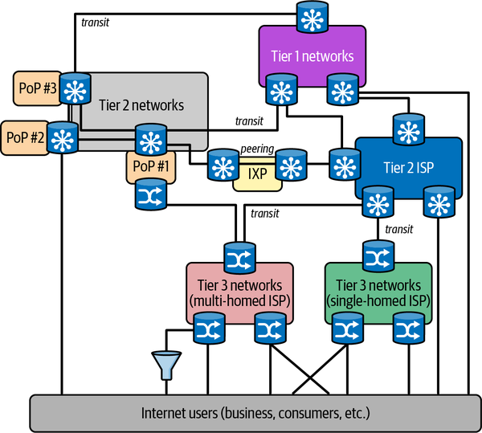
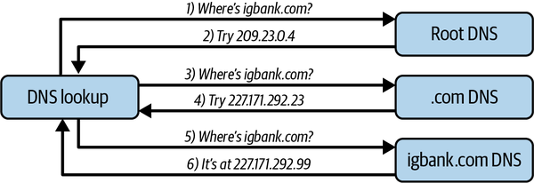
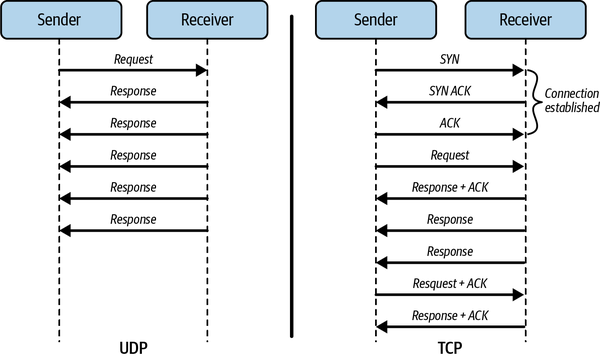
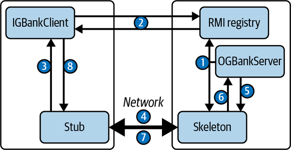
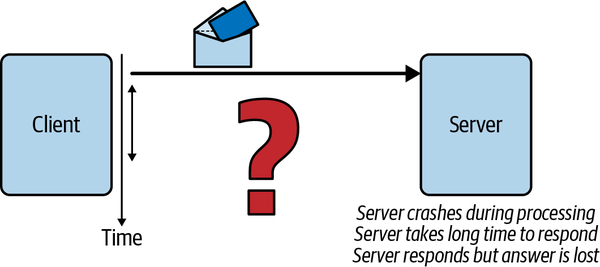
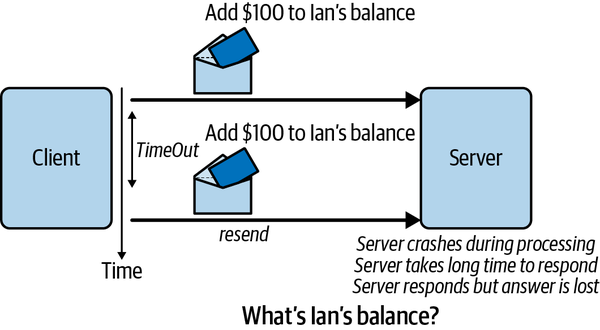
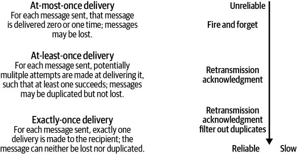
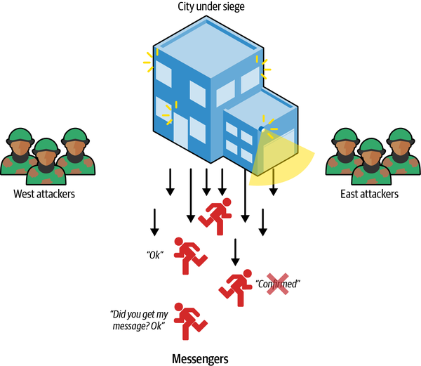
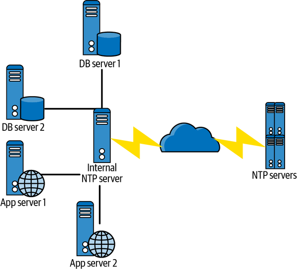

# Chapter 3. Distributed Systems Essentials

As I described in [Chapter 2](ch02.md), scaling a system naturally involves adding multiple independently moving parts. We run our software components on multiple machines and our databases across multiple storage nodes, all in the quest of adding more processing capacity. Consequently, our solutions are distributed across multiple machines in multiple locations, with each machine processing events concurrently, and exchanging messages over a network.

This fundamental nature of distributed systems has some profound implications on the way we design, build, and operate our solutions. This chapter provides the basic information you need to know to appreciate the issues and complexities of distributed software systems. I’ll briefly cover communications networks hardware and software, remote method invocation, how to deal with the implications of communications failures, distributed coordination, and the thorny issue of time in distributed systems.

# Communications Basics

Every distributed system has software components that communicate over a network. If a mobile banking app requests the user’s current bank account balance, a (very simplified) sequence of communications occurs along the lines of:

1. The mobile banking app sends a request over the cellular network addressed to the bank to retrieve the user’s bank balance.
2. The request is routed across the internet to where the bank’s web servers are located.
3. The bank’s web server authenticates the request (confirms that it originated from the supposed user) and sends a request to a database server for the account balance.
4. The database server reads the account balance from disk and returns it to the web server.
5. The web server sends the balance in a reply message addressed to the app, which is routed over the internet and the cellular network until the balance magically appears on the screen of the mobile device.

It almost sounds simple when you read the above, but in reality, there’s a huge amount of complexity hidden beneath this sequence of communications. Let’s examine some of these complexities in the following sections.

## Communications Hardware

The bank balance request example above will inevitably traverse multiple different networking technologies and devices. The global internet is a heterogeneous machine, comprising different types of network communications channels and devices that shuttle many millions of messages per second across networks to their intended destinations.

Different types of communications channels exist. The most obvious categorization is wired versus wireless. For each category there are multiple network transmission hardware technologies that can ship bits from one machine to another. Each technology has different characteristics, and the ones we typically care about are speed and range.

For physically wired networks, the two most common types are local area networks (LANs) and wide area networks (WANs). LANs are networks that can connect devices at “building scale,” being able to transmit data over a small number (e.g., 1–2) of kilometers. Contemporary LANs in data centers can transport between 10 and 100 gigabits per second (Gbps). This is known as the network’s bandwidth, or capacity. The time taken to transmit a message across a LAN—the network’s latency—is submillisecond with modern LAN technologies.

WANs are networks that traverse the globe and make up what we collectively call the internet. These long-distance connections are the high speed data pipelines connecting cities, countries, and continents with fiber optic cables. These cables support a networking technology known as [wavelength division multiplexing](https://oreil.ly/H7uwR) which makes it possible to transmit up to 171 Gbps over 400 different channels, giving more than 70 terabits per second (Tbps) of total bandwidth for a single fiber link. The fiber cables that span the world normally comprise four or more strands of fiber, giving bandwidth capacity of hundreds of Tbps for each cable.

Latency is more complicated with WANs, however. WANs transmit data over hundreds and thousands of kilometers, and the maximum speed that the data can travel in fiber optic cables is the theoretical speed of light. In reality, these cables can’t reach the speed of light, but do get pretty close to it, as shown in [Table 3-1](#wan_speeds).

Table 3-1. WAN speeds Path Distance Travel time (speed of light) Travel time (fiber optic cable) New York to San Francisco 4,148 km 14 ms 21 ms New York to London 5,585 km 19 ms 28 ms New York to Sydney 15,993 km 53 ms 80 ms

Actual times will be slower than the fiber optic travel times in [Table 3-1](#wan_speeds) as the data needs to pass through networking equipment known as [routers](https://oreil.ly/t7I0Y). The global internet has a complex hub-and-spoke topology with many potential paths between nodes in the network. Routers are therefore responsible for transmitting data on the physical network connections to ensure data is transmitted across the internet from source to destination.

Routers are specialized, high-speed devices that can handle several hundred Gbps of network traffic, pulling data off incoming connections and sending the data out to different outgoing network connections based on their destination. Routers at the core of the internet comprise racks of these devices and can process tens to hundreds of Tbps. This is how you and thousands of your friends get to watch a steady video stream on Netflix at the same time.

Wireless technologies have different range and bandwidth characteristics. WiFi routers that we are all familiar with in our homes and offices are wireless Ethernet networks and use 802.11 protocols to send and receive data. The most widely used WiFi protocol, 802.11ac, allows for maximum (theoretical) data rates of up to 5,400 Mbps. The most recent 802.11ax protocol, also known as WiFi 6, is an evolution of 802.11ac technology that promises increased throughput speeds of up to 9.6 Gbps. The range of WiFi routers is of the order of tens of meters and of course is affected by physical impediments like walls and floors.

Cellular wireless technology uses radio waves to send data from our phones to routers mounted on cell towers, which are generally connected by wires to the core internet for message routing. Each cellular technology introduces improved bandwidth and other dimensions of performance. The most common technology at the time of writing is 4G LTE wireless broadband. 4G LTE is around 10 times faster than the older 3G, able to handle sustained download speeds around 10 Mbps (peak download speeds are nearer 50 Mbps) and upload speeds between 2 and 5 Mbps.

Emerging 5G cellular networks promise 10x bandwidth improvements over existing 4G, with 1–2 millisecond latencies between devices and cell towers. This is a great improvement over 4G latencies, which are in the 20–40 millisecond range. The trade-off is range. 5G base station range operates at about 500 meters maximum, whereas 4G provides reliable reception at distances of 10–15 km.

This whole collection of different hardware types for networking comes together in the global internet. The internet is a heterogeneous network, with many different operators around the world and every type of hardware imaginable. [Figure 3-1](#simplified_view_of_the_internet) shows a simplified view of the major components that comprise the internet. Tier 1 networks are the global high-speed internet backbone. There are around 20 Tier 1 internet service providers (ISPs) who manage and control global traffic. Tier 2 ISPs are typically regional (e.g., one country), have lower bandwidth than Tier 1 ISPs, and deliver content to customers through Tier 3 ISPs. Tier 3 ISPs are the ones that charge you exorbitant fees for your home internet every month.



###### Figure 3-1. Simplified view of the internet

There’s a lot more complexity to how the internet works than described here. That level of networking and protocol complexity is beyond the scope of this chapter. From a distributed systems software perspective, we need to understand more about the “magic” that enables all this hardware to route messages from, say, my cell phone to my bank and back. This is where the *Internet Protocol (IP)* comes in.

## Communications Software

Software systems on the internet communicate using the [Internet Protocol (IP) suite](https://oreil.ly/DJf0L). The IP suite specifies host addressing, data transmission formats, message routing, and delivery characteristics. There are four abstract layers, which contain related protocols that support the functionality required at that layer. These are, from lowest to highest:

1. The data link layer, specifying communication methods for data across a single network segment. This is implemented by the device drivers and network cards that live inside your devices.
2. The internet layer specifies addressing and routing protocols that make it possible for traffic to traverse the independently managed and controlled networks that comprise the internet. This is the IP layer in the internet protocol suite.
3. The transport layer, specifying protocols for reliable and best-effort, host-to-host communications. This is where the well-known Transmission Control Protocol (TCP) and User Datagram Protocol (UDP) live.
4. The application layer, which comprises several application-level protocols such as HTTP and the secure copy protocol (SCP).

Each of the higher-layer protocols builds on the features of the lower layers. In the following section, I’ll briefly cover IP for host discovery and message routing, and TCP and UDP that can be utilized by distributed applications.

### Internet Protocol (IP)

IP defines how hosts are assigned addresses on the internet and how messages are transmitted between two hosts who know each other’s addresses.

Every device on the internet has its own address. These are known as Internet Protocol (IP) addresses. The location of an IP address can be found using an internet-wide directory service known as Domain Name System (DNS). DNS is a widely distributed, hierarchical database that acts as the address book of the internet.

The technology currently used to assign IP addresses, known as Internet Protocol version 4 (IPv4), will eventually be replaced by its successor, IPv6. IPv4 is a 32-bit addressing scheme that before long will run out of addresses due to the number of devices connecting to the internet. IPv6 is a 128-bit scheme that will offer an (almost) infinite number of IP addresses. As an indicator, in July 2020 about [33% of the traffic processed by Google.com](https://oreil.ly/3ix6W) is IPv6.

DNS servers are organized hierarchically. A small number of root DNS servers, which are highly replicated, are the starting point for resolving an IP address. When an internet browser tries to find a website, a network host known as the local DNS server (managed by your employer or ISP) will contact a root DNS server with the requested hostname. The root server replies with a referral to a so-called *authoritative* DNS server that manages name resolution for, in our banking example, *.com* addresses. There is an authoritative name server for each top-level internet domain (*.com*, *.org*, *.net*, etc.).

Next, the local DNS server will query the *.com* DNS server, which will reply with the address of the DNS server that knows about all the IP addresses managed by *igbank.com*. This DNS is queried, and it returns the actual IP address we need to communicate with the application. The overall scheme is illustrated in [Figure 3-2](#example_dns_lookup_for_igbankdotcom).



###### Figure 3-2. Example DNS lookup for igbank.com

The whole DNS database is highly geographically replicated so there are no single points of failure, and requests are spread across multiple physical servers. Local DNS servers also remember the IP addresses of recently contacted hosts, which is possible as IP addresses don’t change very often. This means the complete name resolution process doesn’t occur for every site we contact.

Armed with a destination IP address, a host can start sending data across the network as a series of IP data packets. IP delivers data from the source to the destination host based on the IP addresses in the packet headers. IP defines a packet structure that contains the data to be delivered, along with header data including source and destination IP addresses. Data sent by an application is broken up into a series of packets which are independently transmitted across the internet.

IP is known as a best-effort delivery protocol. This means it does not attempt to compensate for the various error conditions that can occur during packet transmission. Possible transmission errors include data corruption, packet loss, and duplication. In addition, every packet is routed across the internet from source to destination independently. Treating every packet independently is known as packet switching. This allows the network to dynamically respond to conditions such as network link failure and congestion, and hence is a defining characteristic of the internet. This does mean, however, that different packets may be delivered to the same destination via different network paths, resulting in out-of-order delivery to the receiver.

Because of this design, the IP is unreliable. If two hosts require reliable data transmission, they need to add additional features to make this occur. This is where the next layer in the IP protocol suite, the transport layer, enters the scene.

### Transmission Control Protocol (TCP)

Once an application or browser has discovered the IP address of the server it wishes to communicate with, it can send messages using a transport protocol API. This is achieved using TCP or UDP, which are the popular standard transport protocols for the IP network stack.

Distributed applications can choose which of these protocols to use. Implementations are widely available in mainstream programming languages such as Java, Python, and C++. In reality, use of these APIs is not common as higher-level programming abstractions hide the details from most applications. In fact, the IP protocol suite application layer contains several of these application-level APIs, including HTTP, which is very widely used in mainstream distributed systems.

Still, it’s important to understand TCP, UDP, and their differences. Most requests on the internet are sent using TCP. TCP is:

- Connection-oriented
- Stream-oriented
- Reliable

I’ll explain each of these qualities, and why they matter, below.

TCP is known as a connection-oriented protocol. Before any messages are exchanged between applications, TCP uses a three-step handshake to establish a two-way connection between the client and server applications. The connection stays open until the TCP client calls `close()` to terminate the connection with the TCP server. The server responds by acknowledging the `close()` request before the connection is dropped.

Once a connection is established, a client sends a sequence of requests to the server as a data stream. When a data stream is sent over TCP, it is broken up into individual network packets, with a maximum packet size of 65,535 bytes. Each packet contains a source and destination address, which is used by the underlying IP protocol to route the messages across the network.

The internet is a packet switched network, which means every packet is individually routed across the network. The route each packet traverses can vary dynamically based on the conditions in the network, such as link congestion or failure. This means the packets may not arrive at the server in the same order they are sent from the client. To solve this problem, a TCP sender includes a sequence number in each packet so the receiver can reassemble packets into a stream that is identical to the order they were sent.

Reliability is needed as network packets can be lost or delayed during transmission between sender and receiver. To achieve reliable packet delivery, TCP uses a cumulative acknowledgment mechanism. This means a receiver will periodically send an acknowledgment packet that contains the highest sequence number of the packets received without gaps in the packet stream. This implicitly acknowledges all packets sent with a lower sequence number, meaning all have been successfully received. If a sender doesn’t receive an acknowledgment within a timeout period, the packet is resent.

TCP has many other features, such as checksums to check packet integrity, and dynamic flow control to ensure a sender doesn’t overwhelm a slow receiver by sending data too quickly. Along with connection establishment and acknowledgments, this makes TCP a relatively heavyweight protocol, which trades off reliability over efficiency.

This is where UDP comes into the picture. UDP is a simple, connectionless protocol, which exposes the user’s program to any unreliability of the underlying network. There is no guarantee that delivery will occur in a prescribed order, or that it will happen at all. It can be thought of as a thin veneer (layer) on top of the underlying IP protocol, and deliberately trades off raw performance over reliability.

This, however, is highly appropriate for many modern applications where the odd lost packet has very little effect. Think streaming movies, video conferencing, and gaming, where one lost packet is unlikely to be perceptible by a user.

[Figure 3-3](#comparing_tcp_and_udp) depicts some of the major differences between TCP and UDP. TCP incorporates a connection establishment three-packet handshake (SYN, SYN ACK, ACK), and piggybacks acknowledgments (ACK) of packets so that any packet loss can be handled by the protocol. There’s also a TCP connection close phase involving a four-way handshake that is not shown in the diagram. UDP dispenses with connection establishment, tear down, acknowledgments, and retries. Therefore, applications using UDP need to be tolerant of packet loss and client or server failures (and behave accordingly).



###### Figure 3-3. Comparing TCP and UDP

# Remote Method Invocation

It’s perfectly feasible to write our distributed applications using low-level APIs that interact directly with the transport layer protocols TCP and UDP. The most common approach is the standardized sockets library—see the brief overview in the sidebar. This is something you’ll hopefully never need to do, as sockets are complex and error prone. Essentially, sockets create a bidirectional pipe between two nodes that you can use to send streams of data. There are (luckily) much better ways to build distributed communications, as I’ll describe in this section. These approaches abstract away much of the complexity of using sockets. However, sockets still lurk underneath, so some knowledge is necessary.

##### An Overview of Sockets

A socket is one endpoint of a two-way network connection between a client and a server. Sockets are identified by a combination of the node’s IP address and an abstraction known as a *port*. A port is a unique numeric identifier, which allows a node to support communications for multiple applications running on the node.

Each IP address can support 65,535 TCP ports and another 65,535 UDP ports. On a server, each *{&lt;IP Address&gt;, &lt;port&gt;}* combination can be associated with an application. This combination forms a unique endpoint that the transport layer uses to deliver data to the desired server.

A socket connection is identified by a unique combination of client and server IP addresses and ports, namely *&lt;client IP address, client port, server IP address, server port&gt;*. Each unique connection also allocates a socket descriptor on both the client and the server. Once the connection is created, the client sends data to the server in a stream, and the server responds with results. The sockets library supports both protocols, with the `SOCK_STREAM` option for TCP, and the `SOCK_DGRAM` for UDP.

You can write distributed applications directly to the sockets API, which is an operating system core component. Socket APIs are available in all mainstream programming languages. However, the sockets library is a low-level, hard-to-use API. You should avoid it unless you have a real need to write system-level code.

In our mobile banking example, the client might request a balance for the user’s checking account using sockets. Ignoring specific language issues (and security!), the client could send a message payload as follows over a connection to the server:

> *{“balance”, “000169990”}*

In this message, “balance” represents the operation we want the server to execute, and “000169990” is the bank account number.

In the server, we need to know that the first string in the message is the operation identifier, and based on this value being “balance”, the second is the bank account number. The server then uses these values to presumably query a database, retrieve the balance, and send back the results, perhaps as a message formatted with the account number and current balance, as below:

> *{“000169990”, “220.77”}*

In any complex system, the server will support many operations. In *igbank.com*, there might be for example “login”, “transfer”, “address”, “statement”, “transactions”, and so on. Each will be followed by different message payloads that the server needs to interpret correctly to fulfill the client’s request.

What we are defining here is an application-specific protocol. As long as we send the necessary values in the correct order for each operation, the server will be able to respond correctly. If we have an erroneous client that doesn’t adhere to our application protocol, well, our server needs to do thorough error checking. The socket library provides a primitive, low-level method for client/server communications. It provides highly efficient communications but is difficult to correctly implement and evolve the application protocol to handle all possibilities. There are better mechanisms.

Stepping back, if we were defining the *igbank.com* server interface in an object-oriented language such as Java, we would have each operation it can process as a method. Each method is passed an appropriate parameter list for that operation, as shown in this example code:

```
// Simple igbank.com server interface
public interface IGBank {
    public float balance  (String accNo);
    public boolean  statement(String month) ;
    // other operations
}
```

There are several advantages of having such an interface, namely:

- Calls from the client to the server can be statically checked by the compiler to ensure they are of the correct format and argument types.
- Changes in the server interface (e.g., adding a new parameter) force changes in the client code to adhere to the new method signature.
- The interface is clearly defined by the class definition and thus straightforward for a client programmer to understand and utilize.

These benefits of an explicit interface are of course well known in software engineering. The whole discipline of object-oriented design is pretty much based upon these foundations, where an interface defines a contract between the caller and callee. Compared to the implicit application protocol we need to follow with sockets, the advantages are significant.

This fact was recognized reasonably early in the creation of distributed systems. Since the early 1990s, we have seen an evolution of technologies that enable us to define explicit server interfaces and call these across the network using essentially the same syntax as we would in a sequential program. A summary of the major approaches is given in [Table 3-2](#summary_of_major_rpcsolidusrmi_technolo). Collectively, they are known as Remote Procedure Call (RPC), or Remote Method Invocation (RMI) technologies.

Table 3-2. Summary of major RPC/RMI technologies Technology Date Main features [Distributed Computing Environment (DCE)](https://oreil.ly/bvbR3) Early 1990s DCE RPC provides a standardized approach for client/server systems. Primary languages were C/C++. [Common Object Request Broker Architecture (CORBA)](https://oreil.ly/IO9qD) Early 1990s Facilitates language-neutral client/server communications based on an object-oriented interface definition language (IDL). Primary language support in C/C++, Java, Python, and Ada. [Java Remote Method Invocation (RMI)](https://oreil.ly/1fvGm) Late 1990s A pure Java-based remote method invocation that facilitates distributed client/server systems with the same semantics as Java objects. XML web services 2000 Supports client/server communications based on HTTP and XML. Servers define their remote interface in the Web Services Description Language (WSDL). gRPC 2015 Open source, based on HTTP/2 for transport, and uses [Protocol Buffers (Protobuf)](https://oreil.ly/ytHhl) as the interface description language

While the syntax and semantics of these RPC/RMI technologies vary, the essence of how each operates is the same. Let’s continue with our Java example of *igbank.com* to examine the whole class of approaches. Java offers a Remote Method Invocation (RMI) API for building client/server applications.

Using Java RMI, we can trivially make our `IGBank` interface example from above into a remote interface, as illustrated in the following code:

```
import java.rmi.*;
// Simple igbank.com server interface
public interface IGBank extends Remote{
    public float balance  (String accNo)
         throws RemoteException;
    public boolean  statement(String month)
         throws RemoteException ;
    // other operations
 }
```

The `java.rmi.Remote` interface serves as a marker to inform the Java compiler we are creating an RMI server. In addition, each method must throw `java.rmi.RemoteException`. These exceptions represent errors that can occur when a distributed call between two objects is invoked over a network. The most common reasons for such an exception would be a communications failure or the server object having crashed.

We then must provide a class that implements this remote interface. The sample code below shows an extract of the server implementation:

```
public class IGBankServer extends UnicastRemoteObject 
                          implements IGBank  {
   // constructor/method implementations omitted
   public static void main(String args[]){  
        try{  
          IGBankServer server=new IGBankServer();  
          // create a registry in local JVM on default port
          Registry registry = LocateRegistry.createRegistry(1099);
          registry.bind("IGBankServer", server);
          System.out.println("server ready");
        }catch(Exception e){
                 // code omitted for brevity}  
        }  
   }
```

Points to note are:

- The server extends the `UnicastRemoteObject` class. This essentially provides the functionality to instantiate a remotely callable object.
- Once the server object is constructed, its availability must be advertised to remote clients. This is achieved by storing a reference to the object in a system service known as the *RMI registry*, and associating a logical name with it—in this example, “*IGBankServer*.” The registry is a simple directory service that enables clients to look up the location (network address and object reference) of and obtain a reference to an RMI server by simply supplying the logical name it is associated with in the registry.

An extract from the client code to connect to the server is shown in the following example. It obtains a reference to the remote object by performing a `lookup` operation in the RMI registry and specifying the logical name that identifies the server. The reference returned by the lookup operation can then be used to call the server object in the same manner as a local object. However, there is a difference—the client must be ready to catch a `RemoteException` that will be thrown by the Java runtime when the server object cannot be reached:

```
 // obtain a remote reference to the server
 IGBank bankServer=
        (IGBank)Naming.lookup("rmi://localhost:1099/IGBankServer");  
 //now we can call the server
 System.out.println(bankServer.balance("00169990"));
```

[Figure 3-4](#schematic_depicting_the_call_sequence_f) depicts the call sequence among the components that comprise an RMI system. The `Stub` and `Skeleton` are objects generated by the compiler from the RMI interface definition, and these facilitate the actual remote communications. The skeleton is in fact a TCP network endpoint (*host, port*) that listens for calls to the associated server.



###### Figure 3-4. Schematic depicting the call sequence for establishing a connection and making a call to an RMI server object

The sequence of operations is as follows:

1. When the server starts, its logical reference is stored in the RMI registry. This entry contains the Java client stub that can be used to make remote calls to the server.
2. The client queries the registry, and the stub for the server is returned.
3. The client stub accepts a method call to the server interface from the Java client implementation.
4. The stub transforms the request into one or more network packets that are sent to the server host. This transformation process is known as marshalling.
5. The skeleton accepts network requests from the client, and unmarshalls the network packet data into a valid call to the RMI server object implementation. Unmarshalling is the opposite of marshalling—it takes a sequence of network packets and transforms them into a call to an object.
6. The skeleton waits for the method to return a response.
7. The skeleton marshalls the method results into a network reply packet that is returned to the client.
8. The stub unmarshalls the data and passes the result to the Java client call site.

This Java RMI example illustrates the basics that are used for implementing any RPC/RMI mechanism, even in modern languages like [Erlang](https://oreil.ly/D5biM) and [Go](https://oreil.ly/zD8dS). You are most likely to encounter Java RMI when using the Java Enterprise JavaBeans (EJB) technology. EJBs are a server-side component model built on RMI, which have seen wide usage in the last 20 or so years in enterprise systems.

Regardless of the precise implementation, the basic attraction of RPC/RMI approaches is to provide an abstract calling mechanism that supports *location transparency* for clients making remote server calls. Location transparency is provided by the registry, or in general any mechanism that enables a client to locate a server through a directory service. This means it is possible for the server to update its network location in the directory without affecting the client implementation.

RPC/RMI is not without its flaws. Marshalling and unmarshalling can become inefficient for complex object parameters. Cross-language marshalling—client in one language, server in another—can cause problems due to types being represented differently in different languages, causing subtle incompatibilities. And if a remote method signature changes, all clients need to obtain a new compatible stub, which can be cumbersome in large deployments.

For these reasons, most modern systems are built around simpler protocols based on HTTP and using JSON for parameter representation. Instead of operation names, HTTP verbs (`PUT`, `GET`, `POST`, etc.) have associated semantics that are mapped to a specific URL. This approach originated in the work by Roy Fielding on the REST approach.[1](ch03.md) REST has a set of semantics that comprise a *RESTful* architecture style, and in reality most systems do not adhere to these. We’ll discuss REST and HTTP API mechanisms in [Chapter 5](ch05.md).

# Partial Failures

The components of distributed systems communicate over a network. In communications technology terminology, the shared local and wide area networks that our systems communicate over are known as *asynchronous* networks.

With asynchronous networks:

- Nodes can choose to send data to other nodes at any time.
- The network is *half-duplex*, meaning that one node sends a request and must wait for a response from the other. These are two separate communications.
- The time for data to be communicated between nodes is variable, due to reasons like network congestion, dynamic packet routing, and transient network connection failures.
- The receiving node may not be available due to a software or machine crash.
- Data can be lost. In wireless networks, packets can be corrupted and hence dropped due to weak signals or interference. Internet routers can drop packets during congestion.
- Nodes do not have identical internal clocks; hence they are not synchronized.

###### Note

This is in contrast with synchronous networks, which essentially are full duplex, transmitting data in both directions at the same time with each node having an [identical clock for synchronization](https://oreil.ly/SEPCs).

What does this mean for our applications? Well, put simply, when a client sends a request to a server, how long does it wait until it receives a reply? Is the server node just being slow? Is the network congested and the packet has been dropped by a router? If the client doesn’t get a reply, what should it do?

Let’s explore these scenarios in detail. The core problem here, namely whether and when a response is received, is known as handling partial failures, and the general situation is depicted in [Figure 3-5](#handling_partial_failures).



###### Figure 3-5. Handling partial failures

When a client wishes to connect to a server and exchanges messages, the following outcomes may occur:

- The request succeeds and a rapid response is received. All is well. (In reality, this outcome occurs for almost every request. *Almost* is the operative word here.)
- The destination IP address lookup may fail. In this case, the client rapidly receives an error message and can act accordingly.
- The IP address is valid but the destination node or target server process has failed. The sender will receive a timeout error message and can inform the user.
- The request is received by the target server, which fails while processing the request and no response is ever sent.
- The request is received by the target server, which is heavily loaded. It processes the request but takes a long time (e.g., 34 seconds) to respond.
- The request is received by the target server and a response is sent. However, the response is not received by the client due to a network failure.

The first three points are easy for the client to handle, as a response is received rapidly. A result from the server or an error message—either allows the client to proceed. Failures that can be detected quickly are easy to deal with.

The rest of the outcomes pose a problem for the client. They do not provide any insight into the reason why a response has not been received. From the client’s perspective, these three outcomes look exactly the same. The client cannot know without waiting (potentially forever) whether the response will arrive eventually or never arrive; waiting forever doesn’t get much work done.

More insidiously, the client cannot know if the operation succeeded and a server or network failure caused the result to never arrive, or if the request is on its way—delayed simply due to congestion in the network/server. These faults are collectively known as [*crash faults*](https://oreil.ly/AAc9M).

The typical solution that clients adopt to handle crash faults is to resend the request after a configured timeout period. However, this is fraught with danger, as [Figure 3-6](#client_retries_a_request_after_timeout) illustrates. The client sends a request to the server to deposit money in a bank account. When it receives no response after a timeout period, it resends the request. What is the resulting balance? The server may have applied the deposit, or it may not, depending on the partial failure scenario.



###### Figure 3-6. Client retries a request after timeout

The chance that the deposit may occur twice is a fine outcome for the customer, but the bank is unlikely to be amused by this possibility. Therefore, we need a way to ensure in our server operations implementation that retried, duplicate requests from clients only result in the request being applied once. This is necessary to maintain correct application semantics.

This property is known as *idempotence*. Idempotent operations can be applied multiple times without changing the result beyond the initial application. This means that for the example in [Figure 3-6](#client_retries_a_request_after_timeout), the client can retry the request as many times as it likes, and the account will only be increased by $100.

Requests that make no persistent state changes are naturally idempotent. This means all read requests are inherently safe and no extra work is needed on the server. Updates are a different matter. The system needs to devise a mechanism such that duplicate client requests do not cause any state changes and can be detected by the server. In API terms, these endpoints cause mutation of the server state and must therefore be idempotent.

The general approach to building idempotent operations is as follows:

- Clients include a unique *idempotency key* in all requests that mutate state. The key identifies a single operation from the specific client or event source. It is usually a composite of a user identifier, such as the session key, and a unique value such as a local timestamp, UUID, or a sequence number.
- When the server receives a request, it checks to see if it has previously seen the idempotency key value by reading from a database that is uniquely designed for implementing idempotence. If the key is not in the database, this is a new request. The server therefore performs the business logic to update the application state. It also stores the idempotency key in a database to indicate that the operation has been successfully applied.
- If the idempotency key is in the database, this indicates that this request is a retry from the client and hence should not be processed. In this case the server returns a valid response for the operation so that (hopefully) the client won’t retry again.

The database used to store idempotency keys can be implemented in, for example:

- A separate database table or collection in the transactional database used for the application data
- A dedicated database that provides very low latency lookups, such as a simple key-value store

Unlike application data, idempotency keys don’t have to be retained forever. Once a client receives an acknowledgment of a success for an individual operation, the idempotency key can be discarded. The simplest way to achieve this is to automatically remove idempotency keys from the store after a specific time period, such as 60 minutes or 24 hours, depending on application needs and request volumes.

In addition, an idempotent API implementation must ensure that the application state is modified *and* the idempotency key is stored. Both must occur for success. If the application state is modified and, due to some failure, the idempotent key is not stored, then a retry will cause the operation to be applied twice. If the idempotency key is stored but for some reason the application state is not modified, then the operation has not been applied. If a retry arrives, it will be filtered out as duplicate as the idempotency key already exists, and the update will be lost.

The implication here is that the updates to the application state and idempotency key store must *both* occur, or *neither* must occur. If you know your databases, you’ll recognize this as a requirement for transactional semantics. We’ll discuss how distributed transactions are achieved in [Chapter 12](ch12.md). Essentially, transactions ensure *exactly-once semantics for operations*, which guarantees that all messages will always be processed exactly once—precisely what we need for idempotence.

Exactly once does not mean that there are no message transmission failures, retries, and application crashes. These are all inevitable. The important thing is that the retries eventually succeed and the result is always the same.

We’ll return to the issue of communications delivery guarantees in later chapters. As [Figure 3-7](#communications_delivery_guarantees) illustrates, there’s a spectrum of semantics, each with different guarantees and performance characteristics. *At-most-once* delivery is fast and unreliable—this is what the UDP protocol provides. *At-least-once* delivery is the guarantee provided by TCP/IP, meaning duplicates are inevitable. *Exactly-once* delivery, as we’ve discussed here, requires guarding against duplicates and hence trades off reliability against slower performance.



###### Figure 3-7. Communications delivery guarantees

As we’ll see, some advanced communications mechanisms can provide our applications with exactly-once semantics. However, these don’t operate at internet scale because of the performance implications. That is why, as our applications are built on the at-least-once semantics of TCP/IP, we must implement exactly-once semantics in our APIs that cause state mutation.

# Consensus in Distributed Systems

Crash faults have another implication for the way we build distributed systems. This is best illustrated by the [Two Generals’ Problem](https://oreil.ly/ap5eq), which is depicted in [Figure 3-8](#the_two_generalsapostrophe_problem).



###### Figure 3-8. The Two Generals’ Problem

Imagine a city under siege by two armies. The armies lie on opposite sides of the city, and the terrain surrounding the city is difficult to travel through and visible to snipers in the city. In order to overwhelm the city, it’s crucial that both armies attack at the same time. This will stretch the city’s defenses and make victory more likely for the attackers. If only one army attacks, then they will likely be repelled.

Given these constraints, how can the two generals reach agreement on the exact time to attack, such that both generals know for certain that agreement has been reached? They both need certainty that the other army will attack at the agreed time, or disaster will ensue.

To coordinate an attack, the first general sends a messenger to the other, with instructions to attack at a specific time. As the messenger may be captured or killed by snipers, the sending general cannot be certain the message has arrived unless they get an acknowledgment messenger from the second general. Of course, the acknowledgment messenger may be captured or killed, so even if the original messenger does get through, the first general may never know. And even if the acknowledgment message arrives, how does the second general know this, unless they get an acknowledgment from the first general?

Hopefully the problem is apparent. With messengers being randomly captured or extinguished, there is no guarantee the two generals will ever reach consensus on the attack time. In fact, it can be proven that it is not possible to *guarantee* agreement will be reached. There are solutions that increase the likelihood of reaching consensus. For example, *Game of Thrones* style, each general may send 100 different messengers every time, and even if most are killed, this increases the probability that at least one will make the perilous journey to the other friendly army and successfully deliver the message.

The Two Generals’ Problem is analogous to two nodes in a distributed system wishing to reach agreement on some state, such as the value of a data item that can be updated at either. Partial failures are analogous to losing messages and acknowledgments. Messages may be lost or delayed for an indeterminate period of time—the characteristics of asynchronous networks, as I described earlier in this chapter.

In fact it can be demonstrated that consensus on an asynchronous network in the presence of crash faults, where messages can be delayed but not lost, is impossible to achieve within bounded time. This is known as the FLP Impossibility Theorem.[2](ch03.md)

Luckily, this is only a theoretical limitation, demonstrating it’s not possible to *guarantee* consensus will be reached with unbounded message delays on an asynchronous network. In reality, distributed systems reach consensus all the time. This is possible because while our networks are asynchronous, we can establish sensible practical bounds on message delays and retry after a timeout period. FLP is therefore a worst-case scenario, and as such I’ll discuss algorithms for establishing consensus in distributed databases in [Chapter 12](ch12.md).

Finally, we should note the issue of Byzantine failures. Imagine extending the Two Generals’ Problem to *N* generals who need to agree on a time to attack. However, in this scenario, traitorous messengers may change the value of the time of the attack, or a traitorous general may send false information to other generals.

This class of *malicious* failures are known as Byzantine faults and are particularly sinister in distributed systems. Luckily, the systems we discuss in this book typically live behind well-protected, secure enterprise networks and administrative environments. This means we can in practice exclude handling Byzantine faults. Algorithms that do address such malicious behaviors exist, and if you are interested in a practical example, take a look at [blockchain consensus mechanisms](https://oreil.ly/r3vQT) and [Bitcoin](https://oreil.ly/IPohu).

# Time in Distributed Systems

Every node in a distributed system has its own internal clock. If all the clocks on every machine were perfectly synchronized, we could always simply compare the timestamps on events across nodes to determine the precise order they occurred in. If this were reality, many of the problems I’ll discuss with distributed systems would pretty much go away.

Unfortunately, this is not the case. Clocks on individual nodes *drift* due to environmental conditions like changes in temperature or voltage. The amount of drift varies on every machine, but values such as 10–20 seconds per day are not uncommon. (Or with my current coffee machine at home, about 5 minutes per day!)

If left unchecked, clock drift would render the time on a node meaningless—like the time on my coffee machine if I don’t correct it every few days. To address this problem, a number of *time services* exist. A time service represents an accurate time source, such as a GPS or atomic clock, which can be used to periodically reset the clock on a node to correct for drift on packet-switched, variable-latency data networks.

The most widely used time service is [Network Time Protocol (NTP)](http://www.ntp.org), which provides a hierarchically organized collection of time servers spanning the globe. The root servers, of which there are around 300 worldwide, are the most accurate. Time servers in the next level of the hierarchy (approximately 20,000) synchronize to within a few milliseconds of the root server periodically, and so on throughout the hierarchy, with a maximum of 15 levels. Globally, there are more than 175,000 NTP servers.

Using the NTP protocol, a node in an application running an NTP client can synchronize to an NTP server. The time on a node is set by a UDP message exchange with one or more NTP servers. Messages are time stamped, and through the message exchange the time taken for message transit is estimated. This becomes a factor in the algorithm used by NTP to establish what the time on the client should be reset to. A simple NTP configuration is shown in [Figure 3-9](#illustrating_using_the_ntp_service). On a LAN, machines can synchronize to an NTP server within a small number of milliseconds accuracy.

One interesting effect of NTP synchronization for our applications is that the resetting of the clock can move the local node time forward or backward. This means that if our application is measuring the time taken for events to occur (e.g., to calculate event response times), it is possible that the end time of the event may be earlier than the start time if the `NTP` protocol has set the local time backward.



###### Figure 3-9. Illustrating using the NTP service

In fact, a compute node has two clocks. These are:

Time of day clock

This represents the number of milliseconds since midnight, January 1st 1970. In Java, you can get the current time using `System.currentTimeMillis()`. This is the clock that can be reset by NTP, and hence may jump forward or backward if it is a long way behind or ahead of NTP time.

Monotonic clock

This represents the amount of time (in seconds and nanoseconds) since an unspecified point in the past, such as the last time the system was restarted. It will only ever move forward; however, it again may not be a totally accurate measure of elapsed time because it stalls during an event such as virtual machine suspension. In Java, you can get the current monotonic clock time using `Sys⁠tem.nanoTime()`.

Applications can use an NTP service to ensure the clocks on every node in the system are closely synchronized. It’s typical for an application to resynchronize clocks on anything from a one hour to one day time interval. This ensures the clocks remain close in value. Still, if an application really needs to precisely know the order of events that occur on different nodes, clock drift is going to make this fraught with danger.

There are other time services that provide higher accuracy than NTP. [Chrony](https://oreil.ly/ylrw3) supports the NTP protocol but provides much higher accuracy and greater scalability than NTP—the reason it has been [adopted by Facebook](https://oreil.ly/JqKHP). Amazon has built the Amazon Time Sync Service by installing GPS and atomic clocks in its data centers. This service is available for free to all AWS customers.

The takeaway from this discussion is that our applications cannot rely on timestamps of events on different nodes to represent the actual order of these events. Clock drift even by a second or two makes cross-node timestamps meaningless to compare. The implications of this will become clear when we start to discuss distributed databases in detail.

# Summary and Further Reading

This chapter has covered a lot of ground to explain some of the essential characteristics of communications and time in distributed systems. These characteristics are important for application designers and developers to understand.

The key issues that should resonate from this chapter are as follows:

1. Communications in distributed systems can transparently traverse many different types of underlying physical networks, including WiFi, wireless, WANs, and LANs. Communication latencies are hence highly variable, and influenced by the physical distance between nodes, physical network properties, and transient network congestion. At large scale, latencies between application components are something that should be minimized as much as possible (within the laws of physics, of course).
2. The Internet Protocol stack ensures reliable communications across heterogeneous networks through a combination of the IP and TCP protocols. Communications can fail due to network communications fabric and router failures that make nodes unavailable, as well as individual node failure. Your code will experience various TCP/IP overheads, for example, for connection establishment, and errors when network failures occur. Hence, understanding the basics of the IP suite is important for design and debugging.
3. RMI/RPC technologies build the TCP/IP layer to provide abstractions for client/server communications that mirror making local method/procedure calls. However, these more abstract programming approaches still need to be resilient to network issues such as failures and retransmissions. This is most apparent in application APIs that mutate state on the server, and must be designed to be idempotent.
4. Achieving agreement, or consensus on state across multiple nodes in the presence of crash faults is not possible in bounded time on asynchronous networks. Luckily, real networks, especially LANs, are fast and mostly reliable, meaning we can devise algorithms that achieve consensus in practice. I’ll cover these in [Part III](part03.md) of the book when we discuss distributed databases.
5. There is no reliable global time source that nodes in an application can rely upon to synchronize their behavior. Clocks on individual nodes vary and cannot be used for meaningful comparisons. This means applications cannot meaningfully compare clocks on different nodes to determine the order of events.

These issues will pervade the discussions in the rest of this book. Many of the unique problems and solutions that are adopted in distributed systems stem from these fundamentals. There’s no escaping them!

An excellent source for more detailed, more theoretical coverage of all aspects of distributed systems is George Coulouris et al., *Distributed Systems: Concepts and Design*, 5th ed. (Pearson, 2001).

Likewise for computer networking, you’ll find out all you wanted to know and no doubt more in James Kurose and Keith Ross’s *Computer Networking: A Top-Down Approach*, 7th ed. (Pearson, 2017).

[1](ch03.md) Roy T. Fielding, “Architectural Styles and the Design of Network-Based Software Architectures.” Dissertation, University of California, Irvine, 2000.

[2](ch03.md) Michael J. Fischer et al., “Impossibility of Distributed Consensus with One Faulty Process,” *Journal of the ACM* 32, no. 2 (1985): 374–82. [*https://doi.org/10.1145/3149.214121*](https://doi.org/10.1145/3149.214121).
