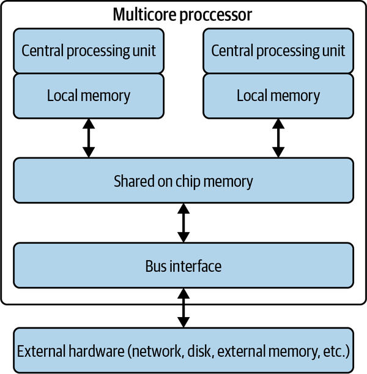
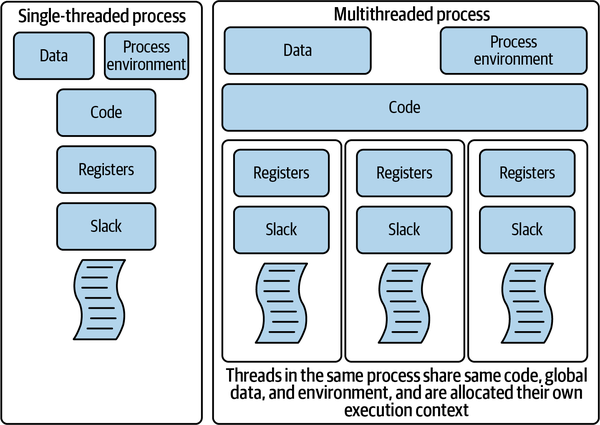
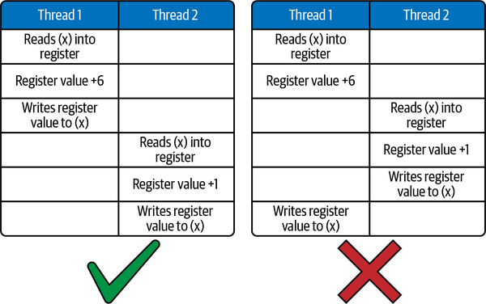
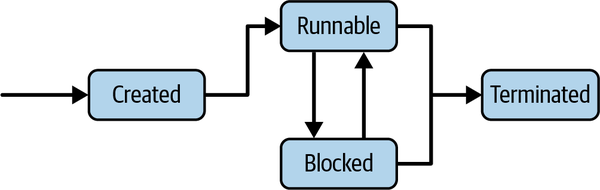
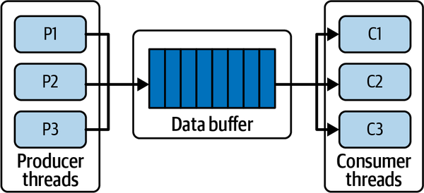
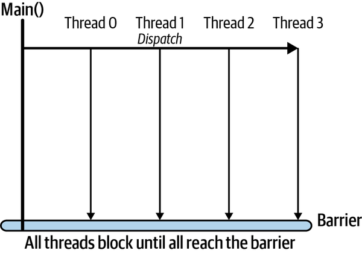

# Chapter 4. An Overview of Concurrent Systems

Distributed systems comprise multiple independent pieces of code executing in parallel, or concurrently, on many processing nodes across multiple locations. Any distributed system is hence by definition a concurrent system, even if each node is processing events one at a time. The behavior of the various nodes must of course be coordinated in order to make the application behave as desired.

As I described in [Chapter 3](ch03.md), coordinating nodes in a distributed system is fraught with danger. Luckily, our industry has matured sufficiently to provide complex, powerful software frameworks that hide many of these distributed system perils from our applications (most of the time, anyway). The majority of this book focuses on describing how we can utilize these frameworks to build scalable distributed systems.

This chapter, however, is concerned with concurrent behavior in our systems on a single node. By explicitly writing our software to perform multiple actions concurrently, we can optimize the processing and resource utilization on a single node, and hence increase our processing capacity both locally and system-wide.

I’ll use the Java 7.0 concurrency capabilities for examples, as these are at a lower level of abstraction than those introduced in Java 8.0. Knowing how concurrent systems operate “closer to the machine” is essential foundational knowledge when building concurrent and distributed systems. Once you understand the lower-level mechanisms for building concurrent systems, the more abstract approaches are easier to optimally exploit. And while this chapter is Java-specific, the fundamental problems of concurrent systems don’t change when you write systems in other languages. Mechanisms for handling concurrency exist in all mainstream programming languages. [“Concurrency Models”](#concurrency_models) gives some more details on alternative approaches and how they are implemented in modern languages.

One final point. This chapter is a concurrency *primer*. It won’t teach you everything you need to know to build complex, high-performance concurrent systems. It will also be useful if your experience writing concurrent programs is rusty, or you have some exposure to concurrent code in another programming language. The further reading section at the end of the chapter points to more comprehensive coverage of this topic for those who wish to delve deeper.

# Why Concurrency?

Think of a busy coffee shop. If everyone orders a simple coffee, then the barista can quickly and consistently deliver each drink. Suddenly, the person in front of you orders a soy, vanilla, no sugar, quadruple-shot iced brew. Everyone in line sighs and starts reading their social media. In two minutes the line is out of the door.

Processing requests in web applications is analogous to our coffee example. In a coffee shop, we enlist the help of a new barista to simultaneously make coffees on a different machine to keep the line length in control and serve customers quickly. In software, to make applications responsive, we need to somehow process requests in our server in an overlapping manner, handling requests concurrently.

In the good old days of computing, each CPU was only able to execute a single machine instruction at any instant. If our server application runs on such a CPU, why do we need to structure our software systems to potentially execute multiple instructions concurrently? It all seems slightly pointless.

There is actually a very good reason. Virtually every program does more than just execute machine instructions. For example, when a program attempts to read from a file or send a message on the network, it must interact with the hardware subsystem (disk, network card) that is peripheral to the CPU. Reading data from a magnetic hard disk takes around 10 milliseconds (ms). During this time, the program must wait for the data to be available for processing.

Now, even an ancient CPU such as a [1988 Intel 80386](https://oreil.ly/NK6NC) can execute [more than 10 million instructions per second (mips)](https://oreil.ly/8jWH5). 10 ms is one hundredth of a second. How many instructions could our 80386 execute in a hundredth second? Do the math. (Hint—it’s a lot!) A lot of wasted processing capacity, in fact.

This is how operating systems such as Linux can run multiple programs on a single CPU. While one program is waiting for an I/O event, the operating system schedules another program to execute. By explicitly structuring our software to have multiple activities that can be executed in parallel, the operating system can schedule tasks that have work to do while others wait for I/O. We’ll see in more detail how this works with Java later in this chapter.

In 2001, IBM introduced the world’s first multicore processor, a chip with two CPUs—see [Figure 4-1](#simplified_view_of_a_multicore_processo) for a simplified illustration. Today, even my laptop has 16 CPUs, or “cores,” as they are commonly known. With a multicore chip, a software system that is structured to have multiple parallel activities can be executed concurrently on each core, up to the number of available cores. In this way, we can fully utilize the processing resources on a multicore chip, and thus increase our application’s processing capacity.



###### Figure 4-1. Simplified view of a multicore processor

The primary way to structure a software system as concurrent activities is to use *threads*. Virtually every programming language has its own threading mechanism. The underlying semantics of all these mechanisms are similar—there are only a few primary threading models in mainstream use—but obviously the syntax varies by language. In the following sections, I’ll explain how threads are supported in Java, and how we need to design our programs to be safe (i.e., correct) and efficient when executing in parallel. Armed with this knowledge, leaping into the concurrency features supported in other languages shouldn’t be too arduous.

##### Concurrency Models

This chapter describes one model for concurrent systems, based on independently executing threads using locks to operate on shared, mutable resources. Concurrency models have been a much studied and explored topic in computer science for roughly the last 50 years. Many theoretical proposals have been put forward, and some of these are implemented in modern programming languages. These models provide alternative approaches for structuring and coordinating concurrent activities in programs. Here’s a sampler that you might well encounter in your work:

Go

The communicating sequential processes (CSP) model [forms the basis of Go’s concurrency features](https://oreil.ly/29b49). In CSP, processes synchronize by sending messages using communication abstractions known as channels. In Go, the unit of concurrency is a goroutine, and goroutines communicate by sending messages using unbuffered or buffered channels. Unbuffered channels are used to synchronize senders and receivers, as communications only occur when both goroutines are ready to exchange data.

Erlang

Erlang implements the [actor model of concurrency](https://oreil.ly/TcoyK). Actors are lightweight processes that have no shared state, and communicate by asynchronously sending messages to other actors. Actors use a mailbox, or queue, to buffer messages and can use pattern matching to choose which messages to process.

Node.js

Node.js eschews anything resembling multiple threads and instead utilizes a single-threaded [nonblocking](https://oreil.ly/xaQB2) model managed by an event loop. This means when an I/O operation is required, such as accessing a database, Node.js instigates the operation but does not wait until it completes. Operations are delegated to the operating system to execute asynchronously, and upon completion the results are placed on the main thread’s stack as callbacks. These callbacks are subsequently executed in the event loop. This model works well for codes performing frequent I/O requests, as it avoids the overheads associated with thread creation and management. However, if your code needs to perform a CPU-intensive operation, such as sorting a large list, you only have one thread. This will therefore block all other requests until the sort is complete. Rarely an ideal situation.

Hopefully this gives you a feel for the diversity of concurrency models and primitives in modern programming languages. Luckily, when you know the fundamentals and one model, the rest are straightforward to learn.

# Threads

Every software process has a single thread of execution by default. This is the thread that the operating system manages when it schedules the process for execution. In Java, for example, the `main()` function you specify as the entry point to your code defines the behavior of this thread. This single thread has access to the program’s environment and resources such as open file handles and network connections. As the program calls methods in objects instantiated in the code, the program’s runtime stack is used to pass parameters and manage variable scopes. Standard programming language runtime stuff, that we all know and love. This is a sequential process.

In your systems, you can use programming language features to create and execute additional threads. Each thread is an independent sequence of execution and has its own runtime stack to manage local object creation and method calls. Each thread also has access to the process’ global data and environment. A simple depiction of this scheme is shown in [Figure 4-2](#comparing_a_single_threaded_and_multith).



###### Figure 4-2. Comparing a single-threaded and multithreaded process

In Java, we can define a thread using a class that implements the `Runnable` interface and defines the `run()` method. Let’s look at a simple example:

```
class NamingThread implements Runnable {

private String name;
       
public NamingThread(String threadName) {
      name = threadName ;
           System.out.println("Constructor called: " + threadName) ;
       }
        
       public void run() {
      //Display info about this  thread
           System.out.println("Run called : " + name);
           System.out.println(name + " : " + Thread.currentThread());
           // and now terminate  ....
    }
}
```

To execute the thread, we need to construct a `Thread` object using an instance of our `Runnable` and call the `start()` method to invoke the code in its own execution context. This is shown in the next code example, along with the output of running the code in bold text. Note this example has two threads: the `main()` thread and the `NamingThread`. The main thread starts the `NamingThread`, which executes asynchronously, and then waits for 1 second to give our `run()` method in `NamingThread` ample time to complete:

```
public static void main(String[] args) {
      
  NamingThread name0 = new NamingThread("My first thread");
    
  //Create the thread
  Thread t0 = new Thread (name0);
    
  // start the threads
  t0.start();
      
  //delay the main thread for a second (1000 milliseconds)
  try {
    Thread.currentThread().sleep(1000);
  } catch (InterruptedException e) {}

      //Display info about the main thread and terminate
      System.out.println(Thread.currentThread());
    
}

===EXECUTION OUTPUT===
Constructor called: My first thread
Run called : My first thread
My first thread : Thread[Thread-0,5,main]
Thread[main,5,main]
```

For illustration, we also call the static `currentThread()` method, which returns a string containing:

- The system-generated thread identifier.
- The thread priority, which by default is 5 for all threads. We’ll cover thread priorities later.
- The identifier of the parent thread—in this example both parent threads are the `main thread`.

Note that to instantiate a thread, we call the `start()` method, not the `run()` method we define in the `Runnable`. The `start()` method contains the internal system magic to create the execution context for a separate thread to execute. If we call `run()` directly, the code will execute, but no new thread will be created. The `run()` method will execute as part of the `main` thread, just like any other Java method invocation that you know and love. You will still have a single-threaded code.

In the example, we use `sleep()` to pause the execution of the `main` thread and make sure it does not terminate before the `NamimgThread`. This approach, namely coordinating two threads by delaying for an absolute time period (1 second in the example) is not a very robust mechanism. What if for some reason—a slower CPU, a long delay reading disk, additional complex logic in the method—our thread doesn’t terminate in the expected timeframe? In this case, `main` will terminate first—this is not what we intend. In general, if you are using absolute times for thread coordination, you are doing it wrong. Almost always. Like 99.99999% of the time.

A simple and robust mechanism for one thread to wait until another has completed its work is to use the `join()` method. We could replace the `try-catch` block in the above example with:

```
t0.join();
```

This method causes the calling thread (in this case, `main`) to block until the thread referenced by `t0` terminates. If the referenced thread has terminated before the call to `join()`, then the method call returns immediately. In this way we can coordinate, or synchronize, the behavior of multiple threads. Synchronization of multiple threads is in fact the major focus of the rest of this chapter.

# Order of Thread Execution

The system scheduler (in Java, this lives in the Java virtual machine \[JVM]) controls the order of thread execution. From the programmer’s perspective, the order of execution is *nondeterministic*. Get used to that term, I’ll use it a lot. The concept of nondeterminism is fundamental to understanding multithreaded code.

I’ll illustrate this by building on the earlier `NamingThread` example. Instead of creating a single `NamingThread`, I’ll create and start up a few. Three, in fact, as shown in the following code example. Again, sample output from running the code is in bold text beneath the code itself:

```
      NamingThread name0 = new NamingThread("thread0");
      NamingThread name1 = new NamingThread("thread1");
      NamingThread name2 = new NamingThread("thread2");
    
      //Create the threads
      Thread t0 = new Thread (name0);
      Thread t1 = new Thread (name1);
      Thread t2 = new Thread (name2);    
      
      // start the threads
      t0.start();  
      t1.start();  
      t2.start();  

===EXECUTION OUTPUT===
Run called : thread0
thread0 : Thread[Thread-0,5,main]  
Run called : thread2  
Run called : thread1
thread1 : Thread[Thread-1,5,main]  
thread2 : Thread[Thread-2,5,main]
Thread[main,5,main]
```

The output shown is a sample from just one execution. You can see the code starts three threads sequentially, namely *t0*, *t1*, and *t2* (see [](#comarker1_4_1)). Looking at the output, we see thread *t0* completes (see [](#comarker2_4_1)) before the others start. Next *t2*’s `run()` method is called (see [](#comarker3_4_1)) followed by *t1*’s `run()` method, even though *t1* was started before *t2*. Thread *t1* then runs to completion (see [](#comarker4_4_1)) before *t2*, and eventually the *main* thread and the program terminate.

This is just one possible order of execution. If we run this program again, we will almost certainly see a different execution trace. This is because the JVM scheduler is deciding which thread to execute, and for how long. Put very simply, once the scheduler has given a thread an execution time slot on a CPU, it can interrupt the thread after a specified time period and schedule another one to run. This interruption is known as preemption. Preemption ensures each thread is given an opportunity to make progress. Hence the threads run independently and asynchronously until completion, and the scheduler decides which thread runs when based on a scheduling algorithm.

There’s more to thread scheduling than this, and I’ll explain the basic scheduling algorithm used later in this chapter. For now, there is a major implication for programmers; regardless of the order of thread execution—which you don’t control—your code should produce correct results. Sounds easy? Read on.

# Problems with Threads

The basic problem in concurrent programming is coordinating the execution of multiple threads so that whatever order they are executed in, they produce the correct answer. Given that threads can be started and preempted nondeterministically, any moderately complex program will have essentially an infinite number of possible orders of execution. These systems aren’t easy to test.

There are two fundamental problems that all concurrent programs need to avoid. These are race conditions and deadlocks, and these topics are covered in the next two subsections.

## Race Conditions

Nondeterministic execution of threads implies that the code statements that comprise the threads:

- Will execute sequentially as defined within each thread.
- Can be overlapped in any order across threads. This is because the number of statements that are executed for each thread execution slot is determined by the scheduler.

Hence, when many threads are executed on a single processor, their execution is *interleaved*. The CPU executes some steps from one thread, then performs some steps from another, and so on. If we are executing on a multicore CPU, then we can execute one thread per core. The statements of each thread execution are still however interleaved in a nondeterministic manner.

Now, if every thread simply does its own thing and is completely independent, this is not a problem. Each thread executes until it terminates, as in our trivial `Naming​Thread` example. This stuff is a piece of cake! Why are these thread things meant to be complex?

Unfortunately, totally independent threads are not how most multithreaded systems behave. If you refer back to [Figure 4-2](#comparing_a_single_threaded_and_multith), you will see that multiple threads share the global data within a process. In Java this is both global and static data.

Threads can use shared data structures to coordinate their work and communicate status across threads. For example, we may have threads handling requests from web clients, one thread per request. We also want to keep a running total of how many requests we process each day. When a thread completes a request, it increments a global `RequestCounter` object that all threads share and update after each request. At the end of the day, we know how many requests were processed. A simple and elegant solution indeed. Well, maybe?

The code below shows a very simple implementation that mimics the request counter example scenario. It creates 50,000 threads to update a shared counter. Note we use a lambda function for brevity to create the threads, and a (really bad idea) 5-second delay in `main` to allow the threads to finish:[1](ch04.md)

```
public class RequestCounter {
  final static private int NUMTHREADS = 50000;
  private int count = 0;
    
  public  void inc() {
    count++;
  }
    
  public int getVal() {
    return this.count;
  }
    
  public static void main(String[] args) throws InterruptedException {
    final RequestCounter counter = new RequestCounter();
          
    for (int i = 0; i < NUMTHREADS; i++) {
      // lambda runnable creation 
      Runnable thread = () -> {counter.inc(); };
        new Thread(thread).start();
    }
          
    Thread.sleep(5000);
    System.out.println("Value should be " + NUMTHREADS + "It is: " +     counter.getVal());
  }
}
```

What you can do at home is clone this code from [the book’s GitHub repo](https://oreil.ly/fss-git-repo), run this code a few times, and see what results you get. In 10 executions my mean was 49,995. I didn’t once get the correct answer of 50,000. Weird.

Why?

The answer lies in how abstract, high-level programming language statements, in Java in this case, are executed on a machine. In this example, to perform an increment of a counter, the CPU must:

- Load the current value into a register.
- Increment the register value.
- Write the results back to the original memory location.

This simple increment is actually a sequence of three machine-level operations.

As [Figure 4-3](#increments_are_not_atomic_at_the_machin) shows, at the machine level these three operations are independent and not treated as a single *atomic* operation. By atomic, we mean an operation that cannot be interrupted and hence once started will run to completion.

As the increment operation is not atomic at the machine level, one thread can load the counter value into a CPU register from memory, but before it writes the incremented value back, the scheduler preempts the thread and allows another thread to start. This thread loads the old value of the counter from memory and writes back the incremented value. Eventually the original thread executes again and writes back its incremented value, which just happens to be the same as what is already in memory.

This means we’ve lost an update. From our 10 tests of the counter code above, we see this is happening on average 5 times in 50,000 increments. Hence such events are rare, but even if it happens 1 time in 10 million, you still have an incorrect result.



###### Figure 4-3. Increments are not atomic at the machine level

When we lose updates in this manner, it is called a race condition. Race conditions can occur whenever multiple threads make changes to some shared state, in this case a simple counter. Essentially, different interleavings of the threads can produce different results.

Race conditions are insidious, evil errors, because their occurrence is typically rare, and they can be hard to detect as most of the time the answer will be correct. Try running the multithreaded counter code example with 1,000 threads instead of 50,000, and you will see this in action. I got the correct answer nine times out of ten.

So, this situation can be summarized as “same code, occasionally different results.” Like I said, race conditions are evil! Luckily, eradicating them is straightforward if you take a few precautions.

The key is to identify and protect *critical sections*. A critical section is a section of code that updates shared data structures and hence must be executed atomically if accessed by multiple threads. The example of incrementing a shared counter is an example of a critical section. Another is removing an item from a list. We need to delete the head node of the list and move the reference to the head of the list from the removed node to the next node in the list. Both operations must be performed atomically to maintain the integrity of the list. This is a critical section.

In Java, the `synchronized` keyword defines a critical section. If used to decorate a method, then when multiple threads attempt to call that method on the same shared object, only one is permitted to enter the critical section. All others block until the thread exits the synchronized method, at which point the scheduler chooses the next thread to execute the critical section. We say the execution of the critical section is serialized, as only one thread at a time can be executing the code inside it.

To fix the counterexample, you therefore just need to identify the `inc()` method as a critical section and make it a synchronized method, i.e.:

```
synchronized public void inc() {
    count++;
  }
```

Test it out as many times as you like. You’ll always get the correct answer. Slightly more formally, this means any interleaving of the threads that the scheduler throws at us will always produce the correct results.

The `synchronized` keyword can also be applied to blocks of statements within a method. For example, we could rewrite the above example as:

```
public void inc() {
        synchronized(this){
           count++;   
        }
}
```

Underneath the covers, every Java object has a *monitor lock*, sometimes known as an intrinsic lock, as part of its runtime representation. The monitor is like the bathroom on a long-distance bus—only one person is allowed to (and should!) enter at once, and the door lock stops others from entering when in use.

In our totally sanitary Java runtime environment, a thread must acquire the monitor lock to enter a synchronized method or synchronized block of statements. Only one thread can own the lock at any time, and hence execution is serialized. This, very basically, is how Java and similar languages implement critical sections.

As a rule of thumb, you should keep critical sections as small as possible so that the serialized code is minimized. This can have positive impacts on performance and hence scalability. I’ll return to this topic later, but I’m really talking about [Amdahl’s law](https://oreil.ly/kLFs1) again, as introduced in [Chapter 2](ch02.md). Synchronized blocks are the serialized parts of a system as described by Amdahl, and the longer they execute for, then the less potential we have for system scalability.

## Deadlocks

To ensure correct results in multithreaded code, I explained that we have to restrict the inherent nondeterminism to serialize access to critical sections. This avoids race conditions. However, if we are not careful, we can write code that restricts nondeterminism so much that our program stops. And never continues. This is formally known as a deadlock.

A deadlock occurs when two or more threads are blocked forever, and none can proceed. This happens when threads need exclusive access to a shared set of resources and the threads acquire locks in different orders. This is illustrated in the example below in which two threads need exclusive access to critical sections A and B. Thread 1 acquires the lock for critical section A, and thread 2 acquires the lock for critical section B. Both then block forever as they cannot acquire the locks they need to continue.

Two threads sharing access to two shared variables via synchronized blocks:

- Thread 1: enters critical section A.
- Thread 2: enters critical section B.
- Thread 1: blocks on entry to critical section B.
- Thread 2: blocks on entry to critical section A.
- Both threads wait forever.

A deadlock, also known as a deadly embrace, causes a program to stop. It doesn’t take a vivid imagination to realize that this can cause all sorts of undesirable outcomes. I’m happily texting away while my autonomous vehicle drives me to the bar. Suddenly, the vehicle code deadlocks. It won’t end well.

Deadlocks occur in more subtle circumstances than the simple example above. The classic example is the dining philosophers problem. The story goes like this.

Five philosophers sit around a shared table. Being philosophers, they spend a lot of time thinking deeply. In between bouts of deep thinking, they replenish their brain function by eating from a plate of food that sits in front of them. Hence a philosopher is either eating or thinking or transitioning between these two states.

In addition, the philosophers must all be physically very close, highly dexterous, and COVID-19 vaccinated friends, as they share chopsticks to eat. Only five chopsticks are on the table, placed between each philosopher. When one philosopher wishes to eat, they follow a protocol of picking up their left chopstick first, then their right chopstick. Once they are ready to think again, they first return the right chopstick, then the left.

[Figure 4-4](#the_dining_philosophers_problem) depicts our philosophers, each identified by a unique number. As each is either concurrently eating or thinking, we can model each philosopher as a thread.


###### Figure 4-4. The dining philosophers problem

The code is shown in [Example 4-1](#example_four-onedot_the_philosopher_thr). The shared chopsticks are represented by instances of the Java `Object` class. As only one object can hold the monitor lock on an object at any time, they are used as entry conditions to the critical sections in which the philosophers acquire the chopsticks they need to eat. After eating, the chopsticks are returned to the table and the lock is released on each so that neighboring philosophers can eat whenever they are ready.

##### Example 4-1. The philosopher thread

```
public class Philosopher implements Runnable {

  private final Object leftChopStick;
  private final Object rightChopStick;

  Philosopher(Object leftChopStick, Object rightChopStick) {
    this.leftChopStick = leftChopStick;
    this.rightChopStick = rightChopStick;
  }
  private void LogEvent(String event) throws InterruptedException {
    System.out.println(Thread.currentThread()
                                  .getName() + " " + event);
    Thread.sleep(1000);
  }

  public void run() {
    try {
      while (true) {
        LogEvent(": Thinking deeply"); 
        synchronized (leftChopStick) {
          LogEvent( ": Picked up left chopstick");
          synchronized (rightChopStick) {
            LogEvent(": Picked up right chopstick – eating");
            LogEvent(": Put down right chopstick");
          }
          LogEvent(": Put down left chopstick. Ate too much");
        }
      } // end while
    } catch (InterruptedException e) {
       Thread.currentThread().interrupt();
  }
 }
}
```

To bring the philosophers described in [Example 4-1](#example_four-onedot_the_philosopher_thr) to life, we must instantiate a thread for each and give each philosopher access to their neighboring chopsticks. This is done through the thread constructor call at [](#comarker1_4_2) in [Example 4-2](#example_four-twodot_dining_philosophers). In the `for` loop we create five philosophers and start these as independent threads, where each chopstick is accessible to two threads, one as a left chopstick, and one as a right.

##### Example 4-2. Dining philosophers—deadlocked version

```
private final static int NUMCHOPSTICKS = 5 ;
private final static int NUMPHILOSOPHERS = 5; 
public static void main(String[] args) throws Exception {
 
  final Philosopher[] ph = new Philosopher[NUMPHILOSOPHERS];
  Object[] chopSticks = new Object[NUMCHOPSTICKS];
 
  for (int i = 0; i < NUMCHOPSTICKS; i++) {
    chopSticks[i] = new Object();
  }
 
  for (int i = 0; i < NUMPHILOSOPHERS; i++) {
    Object leftChopStick = chopSticks[i];
    Object rightChopStick = chopSticks[(i + 1) % chopSticks.length];
    
    ph[i] = new Philosopher(leftChopStick, rightChopStick);  
          
    Thread th = new Thread(ph[i], "Philosopher " + i);
    th.start();
  }
}
```

Running this code produces the following output on my first attempt. If you run the code you will almost certainly see different outputs, but the final outcome will be the same:

```
Philosopher 3 : Thinking deeply
Philosopher 4 : Thinking deeply
Philosopher 0 : Thinking deeply
Philosopher 1 : Thinking deeply
Philosopher 2 : Thinking deeply
Philosopher 3 : Picked up left chopstick
Philosopher 0 : Picked up left chopstick
Philosopher 2 : Picked up left chopstick
Philosopher 4 : Picked up left chopstick
Philosopher 1 : Picked up left chopstick
```

Ten lines of output, then…nothing! We have a deadlock. This is a classic circular waiting deadlock. Imagine the following scenario:

- Each philosopher indulges in a long thinking session.
- Simultaneously, they all decide they are hungry and reach for their left chopstick.
- No philosopher can eat (proceed) as none can pick up their right chopstick.

Real philosophers in this situation would figure out some way to proceed by putting down a chopstick or two until one or more of their colleagues can eat. We can sometimes do this in our software by using timeouts on blocking operations. When the timeout expires, a thread releases the critical section and retries, allowing other blocked threads a chance to proceed. This is not optimal though, as blocked threads hurt performance and setting timeout values is an inexact science.

It is much better, therefore, to design a solution to be deadlock-free. This means that one or more threads will always be able to make progress. With circular wait deadlocks, this can be achieved by imposing a resource allocation protocol on the shared resources, so that threads will not always request resources in the same order.

In the dining philosophers problem, we can do this by making sure one of our philosophers picks up their right chopstick first. Let’s assume we instruct Philosopher 4 to do this. This leads to a possible sequence of operations such as below:

- Philosopher 0 picks up left chopstick (`chopStick[0]`) then right (`chopStick[1]`)
- Philosopher 1 picks up left chopstick (`chopStick[1]`) then right (`chopStick[2]`)
- Philosopher 2 picks up left chopstick (`chopStick[2]`) then right (`chopStick[3]`)
- Philosopher 3 picks up left chopstick (`chopStick[3]`) then right (`chopStick[4]`)
- Philosopher 4 picks up right chopstick (`chopStick[0]`) then left (`chopStick[4]`)

In this example, Philosopher 4 must block, as Philosopher 0 already has acquired access to `chopstick[0]`. With Philosopher 4 blocked, Philosopher 3 is assured access to `chopstick[4]` and can then proceed to satisfy their appetite.

The fix for the dining philosophers solution is shown in [Example 4-3](#example_four-threedot_solving_the_dinin).

##### Example 4-3. Solving the dining philosophers deadlock

```
if (i == NUMPHILOSOPHERS - 1) {
  // The last philosopher picks up the right chopstick first
  ph[i] = new Philosopher(rightChopStick, leftChopStick); 
} else {
  // all others pick up the left chopstick first 
  ph[i] = new Philosopher(leftChopStick, rightChopStick);
}
```

More formally we are imposing an ordering on the acquisition of shared resources, such that:

`chopStick[0]` &lt; `chopStick[1]` &lt; `chopStick[2]` &lt; `chopStick[3]` &lt; `chopStick[4]`

This means each thread will always attempt to acquire `chopstick[0]` before `chopstick[1]`, and `chopstick[1]` before `chopstick[2]`, and so on. For Philosopher 4, this means they will attempt to acquire `chopstick[0]` before `chopstick[4]`, thus breaking the potential for a circular wait deadlock.

Deadlocks are a complicated topic and this section has just scratched the surface. You’ll see deadlocks in many distributed systems. For example, a user request acquires a lock on some data in a *Students* database table, and must then update rows in the *Classes* table to reflect student attendance. Simultaneously another user request acquires locks on the *Classes* table, and next must update some information in the *Students* table. If these requests interleave such that each request acquires locks in an overlapping fashion, we have a deadlock.

# Thread States

Multithreaded systems have a system scheduler that decides which threads to run when. In Java, the scheduler is known as a preemptive, priority-based scheduler. In short, this means it chooses to execute the highest priority thread which wishes to run.

Every thread has a priority (by default 5, range 0 to 10). A thread inherits its priority from its parent thread. Higher priority threads get scheduled more frequently than lower priority threads, but in most applications having all threads as the default priority suffices.

The scheduler cycles threads through four distinct states, based on their behavior. These are:

Created

A thread object has been created but its `start()` method has not been invoked. Once `start()` is invoked, the thread enters the runnable state.

Runnable

A thread is able to run. The scheduler will choose which thread(s) to execute in a first-in, first-out (FIFO) manner—one thread can be allocated at any time to each core in the node. Threads then execute until they block (e.g., on a `synchronized` statement), execute a `yield()`, `suspend()`, or `sleep()` statement, the `run()` method terminates, or they are preempted by the scheduler. Preemption occurs when a higher priority thread becomes runnable, or when a system-specific time period, known as a time slice, expires. Preemption based on time slicing allows the scheduler to ensure that all threads eventually get a chance to execute—no execution-hungry threads can hog the CPU.

Blocked

A thread is blocked if it is waiting for a lock, a notification event to occur (e.g., sleep timer to expire, `resume()` method executed), or is waiting for a network or disk request to complete. When the specific event a blocked thread is waiting for occurs, it moves back to the runnable state.

Terminated

A thread’s `run()` method has completed or it has called the `stop()` method. The thread will no longer be scheduled.

An illustration of this scheme is in [Figure 4-5](#threads_states_and_transitions). The scheduler effectively maintains FIFO queue in the runnable state for each thread priority. High-priority threads are typically used to respond to events (e.g., an emergency timer) and execute for a short period of time. Low-priority threads are used for background, ongoing tasks like checking for corruption of files on disk through recalculating checksums. Background threads basically use up idle CPU cycles.



###### Figure 4-5. Threads states and transitions

# Thread Coordination

There are many problems that require threads with different roles to coordinate their activities. Imagine a collection of threads that each accept documents from users, do some processing on the documents (e.g., generate a PDF), and then send the processed document to a shared printer pool. Each printer can only print one document at a time, so they read from a shared print queue, grabbing and printing documents in the order they arrive.

This printing problem is an illustration of the classic producer-consumer problem. Producers generate and send messages via a shared FIFO buffer to consumers. Consumers retrieve these messages, process them, and then ask for more work from the buffer. A simple illustration of this problem is shown in [Figure 4-6](#the_producer-consumer_problem). It’s a bit like a 24-hour, 365-day buffet restaurant—the kitchen keeps producing, the waitstaff collect the food and put it in the buffet, and hungry diners help themselves. Forever.



###### Figure 4-6. The producer-consumer problem

Like virtually all real resources, the buffer has a limited capacity. Producers generate new items, but if the buffer is full, they must wait until some item(s) have been consumed before they can add the new item to the buffer. Similarly, if the consumers are consuming faster than the producers are producing, then they must wait if there are no items in the buffer, and somehow get alerted when new items arrive.

One way for a producer to wait for space in the buffer, or a consumer to wait for an item, is to keep retrying an operation. A producer could sleep for a second, and then retry the put operation until it succeeds. A consumer could do likewise.

This solution is called *polling*, or busy waiting. It works fine, but as the second name implies, each producer and consumer are using resources (CPU, memory, maybe network?) each time they retry and fail. If this is not a concern, then cool, but in scalable systems we are always aiming to optimize resource usage, and polling can be wasteful.

A better solution is for producers and consumers to block until their desired operation, put or get respectively, can succeed. Blocked threads consume no resources and hence provide an efficient solution. To facilitate this, thread programming models provide blocking operations that enable threads to signal to other threads when an event occurs. With the producer-consumer problem, the basic scheme is as follows:

- When a producer adds an item to the buffer, it sends a signal to any blocked consumers to notify them that there is an item in the buffer.
- When a consumer retrieves an item from the buffer, it sends a signal to any blocked producers to notify them there is capacity in the buffer for new items.

In Java, there are two basic primitives, namely `wait()` and `notify()`, that can be used to implement this signaling scheme. Briefly, they work like this:

- A thread may call `wait()` within a synchronized block if some condition it requires to hold is not true. For example, a thread may attempt to retrieve a message from a buffer, but if the buffer has no messages to retrieve, it calls `wait()` and blocks until another thread adds a message, sets the condition to `true`, and calls `notify()` on the same object.
- `notify()` wakes up a thread that has called `wait()` on the object.

These Java primitives are used to implement *guarded blocks*. Guarded blocks use a condition as a guard that must hold before a thread resumes the execution. The following code snippet shows how the guard condition, *empty*, is used to block a thread that is attempting to retrieve a message from an empty buffer:

```
while (empty) {
  try {
    System.out.println("Waiting for a message");
    wait();
  } catch (InterruptedException e) {}
}
```

When another thread adds a message to the buffer, it executes `notify()` as follows:

```
// Store message.
this.message = message;
empty = false;
// Notify consumer that message is available
notify();
```

The full implementation of this example is given in the code examples in the [book Git repository](https://oreil.ly/fss-git-repo). There are a number of variations of the `wait()` and `notify()` methods, but these go beyond the scope of what I can cover in this overview. And luckily, Java provides us with thread-safe abstractions that hide this complexity from your code.

An example that is pertinent to the producer-consumer problem is the `BlockingQueue` interface in `java.util.concurrent.BlockingQueue`. A `BlockingQueue` implementation provides a thread-safe object that can be used as the buffer in a producer-consumer scenario. There are 5 different implementations of the `BlockingQueue` interface. I’ll use one of these, the `LinkedBlockingQueue`, to implement the producer-consumer. This is shown in [Example 4-4](#example_four-fourdot_producer-consumer).

##### Example 4-4. Producer-consumer with a `LinkedBlockingQueue`

```
class ProducerConsumer {
   public static void main(String[] args)
     BlockingQueue buffer = new LinkedBlockingQueue();
     Producer p = new Producer(buffer);
     Consumer c = new Consumer(buffer);
     new Thread(p).start();
     new Thread(c).start();
   }
 }

class Producer implements Runnable {
   private boolean active = true;
   private final BlockingQueue buffer;
   public Producer(BlockingQueue q) { buffer = q; }
   public void run() {
     
     try {
       while (active) { buffer.put(produce()); }
     } catch (InterruptedException ex) { // handle exception}
   }
   Object produce() { // details omitted, sets active=false }
 }

 class Consumer implements Runnable {
   private boolean active = true;  
   private final BlockingQueue buffer;
   public Consumer(BlockingQueue q) { buffer = q; }
   public void run() {
     
     try {
       while (active) { consume(buffer.take()); }
     } catch (InterruptedException ex) { // handle exception }
   }
   void consume(Object x) {  // details omitted, sets active=false }
 }
```

This solution absolves the programmer from being concerned with the implementation of coordinating access to the shared buffer, and greatly simplifies the code.

The `java.util.concurrent` [package](https://oreil.ly/XGEsn) is a treasure trove for building multithreaded Java solutions. In the following sections, I will briefly highlight a few of these powerful and extremely useful capabilities.

# Thread Pools

Many multithreaded systems need to create and manage a collection of threads that perform similar tasks. For example, in the producer-consumer problem, we can have a collection of producer threads and a collection of consumer threads, all simultaneously adding and removing items, with coordinated access to the shared buffer.

These collections are known as thread pools. Thread pools comprise several worker threads, which typically perform a similar purpose and are managed as a collection. We could create a pool of producer threads which all wait for an item to process, write the final product to the buffer, and then wait to accept another item to process. When we stop producing items, the pool can be shut down in a safe manner, so no partially processed items are lost through an unanticipated exception.

In the `java.util.concurrent` package, thread pools are supported by the `ExecutorService` interface. This extends the base `Executor` interface with a set of methods to manage and terminate threads in the pool. A simple producer-consumer example using a fixed size thread pool is shown in Examples [4-5](#example_four-fivedot_producer_and_consu) and [4-6](#example_four-sixdot_thread_pool_based_p). The `Producer` class in [Example 4-5](#example_four-fivedot_producer_and_consu) is a `Runnable` that sends a single message to the buffer and then terminates. The `Consumer` simply takes messages from the buffer until an empty string is received, upon which it terminates.

##### Example 4-5. Producer and consumer for thread pool implementation

```
class Producer implements Runnable {
  
  private final BlockingQueue buffer;

  public Producer(BlockingQueue q) { buffer = q; }

  @Override
  public void run() {
     
  try {
    sleep(1000);
    buffer.put("hello world");
              
  } catch (InterruptedException ex) {
    // handle exception
  }
 } 
}

class Consumer implements Runnable {
  private final BlockingQueue buffer;

  public Consumer(BlockingQueue q) { buffer = q; }

  @Override
   public void run() {
      boolean active = true; 
      while (active) {
          try {
             String  s = (String) buffer.take();
             System.out.println(s);
             if (s.equals("")) active = false;
          } catch (InterruptedException ex) {
              / handle exception
          }
      } /
      System.out.println("Consumer terminating");
    }
 }
```

In [Example 4-6](#example_four-sixdot_thread_pool_based_p), we create a single consumer to take messages from the buffer. We then create a fixed size thread pool of size 5 to manage our producers. This causes the JVM to preallocate five threads that can be used to execute any `Runnable` objects that are executed by the pool.

In the `for()` loop, we then use the `ExecutorService` to run 20 producers. As there are only 5 threads available in the thread pool, only a maximum of 5 producers will be executed simultaneously. All others are placed in a wait queue which is managed by the thread pool. When a producer terminates, the next `Runnable` in the wait queue is executed using any available thread in the pool.

Once we have requested all the producers to be executed by the thread pool, we call the `shutdown()` method on the pool. This tells the `ExecutorService` not to accept any more tasks to run. We next call the `awaitTermination()` method, which blocks the calling thread until all the threads managed by the thread pool are idle and no more work is waiting in the wait queue. Once `awaitTermination()` returns, we know all messages have been sent to the buffer, and hence send an empty string to the buffer which will act as a termination value for the consumer.

##### Example 4-6. Thread pool–based producer-consumer solution

```
public static void main(String[] args) throws InterruptedException 
  {
    BlockingQueue buffer = new LinkedBlockingQueue();
    
    //start a single consumer 
    (new Thread(new Consumer(buffer))).start();

    ExecutorService producerPool = Executors.newFixedThreadPool(5);
    for (int i = 0; i < 20; i++) 
      {
        Producer producer = new Producer(buffer) ;
        System.out.println("Producer created" );
        producerPool.execute(producer);
      }

      producerPool.shutdown();
      producerPool.awaitTermination(10, TimeUnit.SECONDS);
        
      //send termination message to consumer 
      buffer.put("");        
    }
```

As with most topics in this chapter, there are many more sophisticated features in the `Executor` framework that can be used to create multithreaded programs. This description has just covered the basics. Thread pools are important as they enable our systems to rationalize the use of resources for threads. Every thread consumes memory; for example, the stack size for a thread is typically around 1 MB. Also, when we switch execution context to run a new thread, this consumes CPU cycles. If our systems create threads in an undisciplined manner, we will eventually run out of memory and the system will crash. Thread pools allow us to control the number of threads we create and utilize them efficiently.

I’ll discuss thread pools throughout the remainder of this book, as they are a key concept for efficient and scalable management of the ever-increasing request loads that servers must satisfy.

# Barrier Synchronization

I had a high school friend whose family, at dinnertime, would not allow anyone to start eating until the whole family was seated at the table. I thought this was weird, but many years later it serves as a good analogy for the concept known as barrier synchronization. Eating commenced only after all family members arrived at the table.

Multithreaded systems often need to follow such a pattern of behavior. Imagine a multithreaded image-processing system. An image arrives and a distinct segment of the image is passed to each thread to perform some transformation upon—think Instagram filters on steroids. The image is only fully processed when all threads have completed. In software systems, we use a mechanism called barrier synchronization to achieve this style of thread coordination.

The general scheme is shown in [Figure 4-7](#barrier_synchronization). In this example, the `main()` thread creates four new threads and all proceed independently until they reach the point of execution defined by the barrier. As each thread arrives, it blocks. When all threads have arrived at this point, the barrier is released, and each thread can continue with its processing.



###### Figure 4-7. Barrier synchronization

Java provides three primitives for barrier synchronization. I’ll show here how one of the three, `CountDownLatch`, works. The basic concepts apply to other barrier synchronization primitives.

When you create a `CountDownLatch`, you pass a value to its constructor that represents the number of threads that must block at the barrier before they are all allowed to continue. This is called in the thread which is managing the barrier points for the system—in [Figure 4-7](#barrier_synchronization) this would be `main()`:

```
CountDownLatch  nextPhaseSignal = new CountDownLatch(numThreads);
```

Next, you create the worker threads that will perform some actions and then block at the barrier until they all complete. To do this, you need to pass each thread a reference to `CountDownLatch`:

```
for (int i = 0; i < numThreads; i++) {
            Thread worker = new Thread(new WorkerThread(nextPhaseSignal));
            worker.start();
        }
```

After launching the worker threads, the `main()` thread will call the `.await()` method to block until the latch is triggered by the worker threads:

```
nextPhaseSignal.await();
```

Each worker thread will complete its task and, before exiting, call the `.countDown()` method on the latch. This decrements the latch value. When the last thread calls `.countDown()` and the latch value becomes zero, all threads that have called `.await()` on the latch transition from the *blocked* to the *runnable* state. At this stage we are assured that all workers have completed their assigned task:

```
nextPhaseSignal.countDown();
```

Any subsequent calls to `.countDown()` will return immediately as the latch has been effectively triggered. Note `.countDown()` is nonblocking, which is a useful property for applications in which threads have more work to do after reaching the barrier.

This example illustrates using a `CountDownLatch` to block a single thread until a collection of threads have completed their work. You can invert this use case with a latch, however, if you initialize its value to one. Multiple threads could call `.await()` and block until another thread calls `.countDown()` to release all waiting threads. This example is analogous to a simple gate, which one thread opens to allow a collection of others to continue.

`CountDownLatch` is a simple barrier synchronizer. It’s a single-use tool, as the initializer value cannot be reset. More sophisticated features are provided by the `CyclicBarrier` and `Phaser` classes in Java. Armed with the knowledge of how barrier synchronization works from this section, these will be straightforward to understand.

# Thread-Safe Collections

Many Java programmers, once they delve into the wonders of multithreaded programs, are surprised to discover that the collections in the `java.util` package are not thread safe.[2](ch04.md) Why, I hear you ask? The answer, luckily, is simple. It has to do with performance. Calling synchronized methods incurs overheads. Hence, to attain faster execution for single-threaded programs, the collections are not thread safe.

If you want to share an `ArrayList`, `Map`, or your favorite data structure from `java.util` across multiple threads, you must ensure modifications to the structure are placed in critical sections. This approach places the burden on the client of the collection to safely make updates, and hence is error prone—a programmer might forget to make modifications in a `synchronized` block.

It’s always safer to use inherently thread-safe collections in your multithreaded code. For this reason, the Java collections framework provides a factory method that creates a thread-safe version of `java.util` collections. Here’s an example of creating a thread-safe list:

```
List<String> list = Collections.synchronizedList(new ArrayList<>());
```

What is really happening here is that you are creating a wrapper around the base collection class, which has `synchronized` methods. These delegate the actual work to the original class, in a thread-safe manner of course. You can use this approach for any collection in the `java.util` package, and the general form is:

```
Collections.synchronized....(new collection<>())
```

where “`....`” is `List`, `Map`, `Set`, and so on.

Of course, when using the synchronized wrappers, you pay the performance penalty for acquiring the monitor lock and serializing access from multiple threads. This means the whole collection is locked while a single thread makes a modification, greatly limiting concurrent performance (Amdahl’s law again). For this reason, Java 5.0 included the concurrent collections package, namely `java.util.concurrent`. It contains a rich collection of classes specifically designed for efficient multithreaded access.

In fact, we’ve already seen one of these classes—the `LinkedBlockingQueue`. This uses a locking mechanism that enables items to be added to and removed from the queue in parallel. This finer grain locking mechanism utilizes the `java.util.concurrent.lock.Lock` class rather than the monitor lock approach. This allows multiple locks to be utilized on the same collection, hence enabling safe concurrent access.

Another extremely useful collection that provides this finer-grain locking is the `ConcurrentHashMap`. This provides the similar methods as the non–thread safe `HashMap`, but allows nonblocking reads and concurrent writes based on a `concurrencyLevel` value you can pass to the constructor (the default value is 16):

```
ConcurrentHashMap (int initialCapacity, float loadFactor, 
                     int concurrencyLevel)
```

Internally, the hash table is divided into individually lockable segments, often known as shards. Locks are associated with each shard rather than the whole collection. This means updates can be made concurrently to hash table entries in different shards of the collection, increasing performance.

Retrieval operations are nonblocking for performance reasons, meaning they can overlap with multiple concurrent updates. This means retrievals only reflect the results of the most recently completed update operations at the time the retrieval is executed.

For similar reasons, iterators for a `ConcurrentHashMap` are what is known as weakly consistent. This means the iterator contains a copy of the hash map that reflects its state at the time the iterator is created. While the iterator is in use, new nodes may be added and existing nodes removed from the underlying hash map. However, these state changes are not reflected in the iterator.

If you need an iterator that always reflects the current hashmap state while being updated by multiple threads, then there are performance penalties to pay, and a `ConcurrentHashMap` is not the right approach. This is an example of favoring performance over consistency—a classic design trade-off.

# Summary and Further Reading

I’ll draw upon the major concepts introduced in this chapter throughout the remainder of this book. Threads are inherently components of the data processing and database platforms that we use to build scalable distributed systems. In many cases, you may not be writing explicitly multithreaded code. However, the code you write will be invoked in a multithreaded environment, which means you need to be aware of thread safety. Many platforms also expose their concurrency through configuration parameters, meaning that to tune the system’s performance, you need to understand the effects of changing the various threading and thread pool settings. Basically, there’s no escaping concurrency in the world of scalable distributed systems.

Finally, it is worth mentioning that while concurrent programming primitives vary across programming languages, the foundational issues don’t change, and carefully designed multithreaded code to avoid race conditions and deadlocks is needed. Whether you grapple with the [`pthreads` library](https://oreil.ly/1pu8N) in C/C++, or the classic CSP-inspired Go concurrency model, the problems you need to avoid are the same. The knowledge you have gained from this chapter will regardless set you on the right track, whatever language you are using.

This chapter has only brushed the surface of concurrency in general and its support in Java. The best book to continue learning more about the basic concepts of concurrency is the classic *Java Concurrency in Practice* (*JCiP*) by Brian Goetz et al. (Addison-Wesley Professional, 2006). If you understand everything in the book, you’ll be writing pretty great concurrent code.

Java concurrency support has moved on considerably since Java 5. In the world of Java 12 (or whatever version is current when you read this), there are new features such as CompletableFutures, lambda expressions, and parallel streams. The functional programming style introduced in Java 8.0 makes it easy to create concurrent solutions without directly creating and managing threads. A good source of knowledge for Java 8.0 features is *Mastering Concurrency Programming with Java 8* by Javier Fernández González (Packt, 2017).

Other excellent sources include:

- Doug Lea, *Concurrent Programming in Java: Design Principles and Patterns*, 2nd ed. (Addison-Wesley Professional, 1996)
- Raoul-Gabriel Urma, Mario Fusco, and Alan Mycroft, *Modern Java in Action: Lambdas, Streams, Functional and Reactive Programming* (Manning, 2019)
- The [Baeldung website](https://oreil.ly/TmCV1) has a comprehensive collection of articles for learning about Java concurrency and served as the basis for the dining philosophers example in this chapter.

[1](ch04.md) The correct way to handle these problems, namely barrier synchronization, is covered later in this chapter.

[2](ch04.md) Except `Vector` and `HashTable`, which are legacy classes; thread safe and slow!
