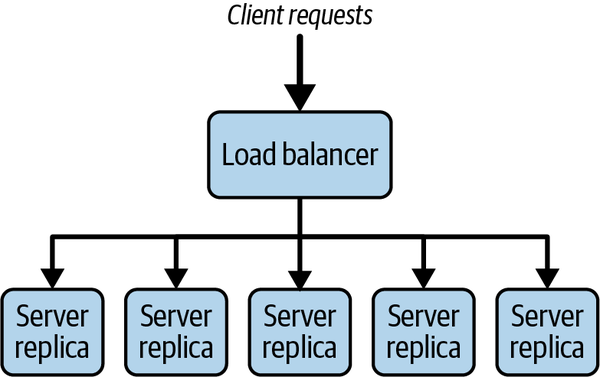

# Chapter 5. Application Services

At the heart of any system lies the unique business logic that implements the application requirements. In distributed systems, this is exposed to clients through APIs and executed within a runtime environment designed to efficiently support concurrent remote calls. An API and its implementation comprise the fundamental elements of the services an application supports.

In this chapter, I’m going to focus on the pertinent issues for achieving scalability for the services tier in an application. I’ll explain APIs and service design and describe the salient features of application servers that provide the execution environment for services. I’ll also elaborate on topics such as horizontal scaling, load balancing, and state management that I introduced briefly in [Chapter 2](ch02.md).

# Service Design

In the simplest case, an application comprises one internet facing service that persists data to a local data store, as shown in [Figure 5-1](#a_simple_service). Clients interact with the service through its published API, which is accessible across the internet.


###### Figure 5-1. A simple service

Let’s look at the API and service implementation in more detail.

## Application Programming Interface (API)

An API defines a contract between the client and server. The API specifies the types of requests that are possible, the data that is needed to accompany the requests, and the results that will be obtained. APIs have many different variations, as I explained in RPC/RMI discussions in [Chapter 3](ch03.md). While there remains some API diversity in modern applications, the predominant style relies on HTTP APIs. These are typically, although not particularly accurately, classified as RESTful.

REST is an architectural style defined by Roy Fielding in his PhD thesis.[1](ch05.md) A great source of knowledge on RESTful APIs and the various degrees to which web technologies can be exploited is *REST in Practice* by Jim Webber et al. (O’Reilly, 2010). Here I’ll just briefly touch on the HTTP create, read, update, delete (CRUD) API pattern. This pattern does not fully implement the principles of REST, but it is widely adopted in internet systems today. It exploits the four code HTTP verbs, namely `POST`, `GET`, `PUT`, and `DELETE`.

A CRUD API specifies how clients perform create, read, update, and delete operations in a specific business context. For example, a user might *create* a profile (`POST`), *read* catalog items (`GET`), *update* their shopping cart (`PUT`), and *delete* items from their order (`DELETE`).

An example HTTP CRUD API for the example ski resort system (briefly introduced in [Chapter 2](ch02.md)) that uses these four core HTTP verbs is shown in [Table 5-1](#http_crud_verbs). In this example, parameter values are passed as part of the request address and are identified by the {} notation.

Table 5-1. HTTP CRUD verbs Verb Uniform Resource Identifier (URI) example Purpose `POST` */skico.com/skiers/* Create a new skier profile, with skier details provided in the JSON request payload. The new skier profile is returned in the JSON response. `GET` */skico.com/skiers/{skierID}* Get the profile information for a skier, returned in a JSON response payload. `PUT` */skico.com/skiers/{skierID}* Update skier profile. `DELETE` */skico.com/skiers/{skierID}* Delete a skier’s profile as they didn’t renew their pass!

Additional parameter values can be passed and returned in HTTP request and response bodies, respectively. For example, a successful request to:

```
GET /skico.com/skiers/12345
```

will return an HTTP 200 response code and the following results formatted in JSON:

```
{
    "username": "Ian123",
    "email": "i.gorton@somewhere.com"
    "city": "Seattle"
}
```

To change the skier’s city, the client could issue the following `PUT` request to the same URI along with a request body representing the updated skier profile:

```
PUT  /skico.com/skiers/12345
{
    "username": "Ian123",
    "email": "i.gorton@somewhere.com"
    "city": "Wenatchee"
}
```

More formally, an HTTP CRUD API applies HTTP verbs on *resources* identified by URIs. In [Table 5-1](#http_crud_verbs), for example, a URI that identifies skier 768934 would be:

```
/skico.com/skiers/768934
```

An HTTP `GET` request to this resource would return the complete profile information for a skier in the response payload, such as name, address, number of days visited, and so on. If a client subsequently sends an HTTP `PUT` request to this URI, we are expressing the intent to update the resource for skier 768934—in this example it would be the skier’s profile. The `PUT` request would provide the complete representation for the skier’s profile as returned by the `GET` request. Again, this would be as a payload with the request. Payloads are typically formatted as JSON, although XML and other formats are also possible. If a client sends a `DELETE` request to the same URI, then the skier’s profile will be deleted.

Hence the combination of the HTTP verb and URI define the semantics of the API operation. Resources, represented by URIs, are conceptually like objects in object-oriented design (OOD) or entities in entity–relationship model (ER model). Resource identification and modeling hence follows similar methods to OOD and ER modeling. The focus however is on resources that need to be exposed to clients in the API. [“Summary and Further Reading”](#summary_and_further_reading-id000053) points to useful sources of information for resource design.

HTTP APIs can be specified using a notation called [OpenAPI](https://oreil.ly/Dt1P1). At the time of writing, the latest version is 3.0. A tool called [SwaggerHub](https://oreil.ly/Xsh39) is the de facto standard to specify APIs in OpenAPI. The specification is defined in Yet Another Markup Language (YAML), and an example is shown in the following API definition extract. It defines the `GET` operation on the URI `/resorts`. If the operation is successful, a 200 response code is returned along with a list of resorts in a format defined by a JSON schema that appears later in the specification. If for some reason the query to get a list of resorts operated by `skico.com` returns no entries, a 404 response code is returned along with an error message that is also defined by a JSON schema:

```
paths:
  /resorts:
    get:
      tags:
        - resorts
      summary: get a list of ski resorts in the database
      operationId: getResorts
      responses:
        '200':
          description: successful operation
          content:
            application/json:
              schema:
                $ref: '#/components/schemas/ResortsList'
        '404':
          description: Resorts not found. Unlikely unless we go broke
          content:
            application/json:
              schema:
                $ref: '#/components/schemas/responseMsg
```

API design is a complex topic in itself and delving deeply into this area is beyond the scope of this book. From a scalability perspective, there are some issues that should, however, be borne in mind:

- Each API request requires a round trip to a service, which incurs network latency. A common antipattern is known as a chatty API, in which multiple API requests are used to perform one logical operation. This commonly occurs when an API is designed following pure object-oriented design approaches. Imagine exposing `get()` and `set()` methods for individual resource properties as HTTP APIs. Accessing a resource would require multiple API requests, one for each property. This is not scalable. Use `GET` to retrieve the whole resource and `PUT` to send back an updated resource. You can also use the HTTP [`PATCH` verb](https://oreil.ly/ERLY3) to update individual properties of a resource. `PATCH` allows partial modification of a resource representation, in contrast to `PUT` that replaces the complete resource representation with new values.
- Consider using compression for HTTP APIs that pass large payloads. All modern web servers and browsers [support compressed content](https://oreil.ly/laBxS) using the HTTP `Accept-Encoding` and `Content-Encoding` headers. Specific API requests and responses can utilize these headers by specifying the compression algorithm that is used for the content—for example, `gzip`. Compression can reduce network bandwidth and latencies by 50% or more. The trade-off cost is the compute cycles to compress and decompress the content. This is typically small compared to the savings in network transit times.

## Designing Services

An application server container receives requests and routes them to the appropriate handler function to process the request. The handler is defined by the application service code and implements the business logic required to generate results for the request. As multiple simultaneous requests arrive at a service instance, each is typically allocated an individual thread context to execute the request.[2](ch05.md) The issue of thread handling in application servers is one I’ll discuss in more detail later in this chapter.

The sophistication of the routing functionality varies widely by technology platform and language. For example, in Express.js, the container calls a specified function for requests that match an API signature—known as a route path—and HTTP method. The code example below illustrates this with a method that will be called when the client sends a `GET` request for a specific skier’s profile, as identified by the value of `:skierID`:

```
app.get('/skiers/:skierID', function (req, res) {
  // process the GET request
  ProcessRequest(req.params)
})
```

In Java, the widely used Spring Framework provides an equally sophisticated method routing technique. It leverages a set of annotations that define dependencies and implement dependency injection to simplify the service code. The code snippet below shows an example of annotations usage:

```
@RestController
public class SkierController {
     @GetMapping("/skiers/{skierID}", 
                produces = “application/json”)
    public Profile GetSkierProfile(@PathVariable String skierID) {
        // DB query method omitted for brevity
        return GetProfileFromDB(skierID);
    }
}
```

These annotations provide the following functionality:

`@RestController`

Identifies the class as a controller that implements an API and automatically serializes the return object into the `HttpResponse` returned from the API

`@GetMapping`

Maps the API signature to the specific method, and defines the format of the response body

`@PathVariable`

Identifies the parameter as a value that originates in the path for a URI that maps to this method

Another Java technology, JEE servlets, also provides annotations, as shown in [Example 5-1](#example_five-onedot_java_servlet_exampl), but these are simplistic compared to Spring and other higher-level frameworks. The `@WebServlet` annotation identifies the base pattern for the URI which should cause a particular servlet to be invoked. This is `/skiers` in our example. The class that implements the API method must extend the `HttpServlet` abstract class from the `javax.servlet.http` package and override at least one method that implements an HTTP request handler. The four core HTTP verbs map to methods as follows:

`doGet`

For HTTP `GET` requests

`doPost`

For HTTP `POST` requests

`doPut`

For HTTP `PUT` requests

`doDelete`

For HTTP `DELETE` requests

Each method is passed two parameters, namely an `HttpServletRequest` and `HttpServletResponse` object. The servlet container creates the `HttpServletRequest` object, which contains members that represent the components of the incoming HTTP request. This object contains the complete URI path for the call, and it is the servlet’s responsibility to explicitly parse and validate this, and extract path and query parameters if valid. Likewise, the servlet must explicitly set the properties of the response using the `HttpServletResponse` object.

Servlets therefore require more code from the application service programmer to implement. However, they are likely to provide a more efficient implementation as there is less generated code “plumbing” involved in request processing compared to the more powerful annotation approaches of Spring et al. This is a classic performance versus ease-of-use trade-off. You’ll see lots of these in this book.

##### Example 5-1. Java servlet example

```
import javax.servlet.http.*;
@WebServlet(
    name = “SkiersServlet“,
    urlPatterns = “/skiers”
)
public class SkierServlet extends HttpServlet (

protected void doGet(HttpServletRequest request,   
                     HttpServletResponse response) {  
  // handles requests to /skiers/{skierID}
  try {
     // extract skierID from the request URI (not shown for brevity)
     String skierID  = getSkierIDFromRequest(request);    
     if(skierID == null) {  
        // request was poorly formatted, return error code
        response.setStatus(HttpServletResponse.SC_BAD_REQUEST);    }
     else {      
        // read the skier profile from the database 
        Profile profile = GetSkierProfile (skierID);
        // add skier profile as JSON to HTTP response and return 200
        response.setContentType("application/json");
        response.getWriter().write(gson.toJson(Profile);
        response.setStatus(HttpServletResponse.SC_OK); 
     } catch(Exception ex) {         
         response.setStatus
           (HttpServletResponse.SC_INTERNAL_SERVER_ERROR);    }
    
       }
} }
```

## State Management

State management is a tricky, nuanced topic. The bottom line is that service implementations that need to scale should avoid storing conversational state.

What on earth does that mean? Let’s start by examining the topic of state management with HTTP.

HTTP is known as *stateless* protocol. This means each request is executed independently, without any knowledge of the requests that were executed before it from the same client. Statelessness implies that every request needs to be self-contained, with sufficient information provided by the client for the web server to satisfy the request regardless of previous activity from that client.

The picture is a little more complicated that this simple description portrays, however. For example:

- The underlying socket connection between a client and server is kept open so that the overheads of connection creation are amortized across multiple requests from a client. This is the default behavior for versions HTTP/1 and above.
- HTTP supports cookies, which are known as the [HTTP State Management Mechanism](https://oreil.ly/9eGyC). The name gives it away, really!
- HTTP/2 supports streams, compression, and encryption, all of which require state management.

So, originally HTTP was stateless, but perhaps not anymore? Armed with this confusion, I’ll move on to state management in application services APIs that are built on top of HTTP.

When a user or application connects to a service, it will typically send a series of requests to retrieve and update information. *Conversational state* represents any information that is retained between requests such that a subsequent request can assume the service has retained knowledge about the previous interactions. I’ll explore what this means in a simple example.

In the skier service API, a user may request their profile by submitting a `GET` request to the following URI:

```
GET /skico.com/skiers/768934
```

They may then use their app to modify their `city` attribute and send a `PUT` request to update the resource:

```
PUT /skico.com/skiers/
{
    "username": "Ian123",
    "email": "i.gorton@somewhere.com"
    "city": "Wenatchee"
}
```

As this URI does not identify the skier, the service must know the unique identifier of the resource to update, namely 768934. Hence, for this update operation to succeed, the service must have retained conversational state from the previous `GET` request.

Implementing this approach is relatively straightforward. When the service receives the initial `GET` request, it creates a session state object that uniquely identifies the client connection. In reality, this is often performed when a user first connects to or logs in to a service. The service can then read the skier profile from the database and utilize the session state object to store conversational state—in our example this would be `skierID` and likely values associated with the skier profile. When the subsequent `PUT` request arrives from the client, it uses the session state object to look up the `skierID` associated with this session and uses that to update the skier’s home city.

Services that maintain conversational state are known as stateful services. Stateful services are attractive from a design perspective as they can minimize the number of times a service retrieves data (state) from the database and reduce the amount of data that is passed between clients and the services.

For services with light request loads, they make eminent sense and are promoted by many frameworks to make services easy to build and deploy. For example, JEE servlets support session management using the `HttpSession` object, and similar capabilities are offered by the `Session` object in ASP.NET.

As you scale the service implementations however, the stateful approach becomes problematic. For a single service instance, you have two problems to consider:

- If you have multiple client sessions all maintaining session state, this will utilize available service memory. The amount of memory utilized will be proportional to the number of clients the service is maintaining state for. If a sudden spike of requests arrives, how can you be certain we will not exhaust available memory and cause the service to fail?
- You also must be mindful about how long to keep session state available. A client may stop sending requests but not cleanly close their connection to allow the state to be reclaimed. All session management approaches support a default session timeout. If you set this to a short time interval, clients may see their state disappear unexpectedly. If you set the session timeout period to be too long, you may degrade service performance as it runs low on resources.

In contrast, stateless services do not assume that any conversational state from previous calls has been preserved. The service should not maintain any knowledge from earlier requests, so that each request can be processed individually. This requires the client to provide all the necessary information for the service to process the request and provide a response. This is in fact how the skier API is specified in [Table 5-1](#http_crud_verbs), namely:

```
PUT /skico.com/skiers/768934
{
    "username": "Ian123",
    "email": "i.gorton@somewhere.com"
    "city": "Wenatchee"
}
```

A sequence diagram illustrating this stateless design is shown in [Figure 5-2](#stateless_api_example).


###### Figure 5-2. Stateless API example

Any scalable service will need stateless APIs. The reason why will become clear when I explain horizontal scaling later in this chapter. For now, the most important design implication is that for a service that needs to retain state pertaining to client sessions—the classic shopping cart example—this state must be stored externally to the service. This invariably means an external data store.

# Applications Servers

Application servers are the heart of a scalable application, hosting the business services that compose an application. Their basic role is to accept requests from clients, apply application logic to the requests, and reply to the client with the request results. Clients may be external or internal, as in other services in the application that require to use the functionality of a specific service.

The technological landscape of application servers is broad and complex, depending on the language you want to use and the specific capabilities that each offers. In Java, the [Java Enterprise Edition (JEE)](https://oreil.ly/we6BN) defines a comprehensive, feature rich, standards-based platform for application servers, with multiple different vendor and open source implementations.

In other languages, the [Express.js](https://expressjs.com) server supports Node, [Flask](https://oreil.ly/mDZqO) supports Python, and in Go a service can be created by incorporating the `net/http` package. These implementations are much more minimal and lightweight than JEE and are typically classified as web application frameworks. In Java, the [Apache Tomcat server](https://oreil.ly/6A2uP) is a somewhat equivalent technology. Tomcat is an open source implementation of a subset of the JEE platform, namely the Java servlet, JavaServer Pages (JSP), Java Expression Language (EL), and Java WebSocket technologies.

[Figure 5-3](#anatomy_of_a_web_application_server) depicts a simplified view of the anatomy of Tomcat. Tomcat implements a *servlet container*, which is an execution environment for application-defined servlets. Servlets are dynamically loaded into this container, which provides life cycle management and a multithreaded runtime environment.


###### Figure 5-3. Anatomy of a web application server

Requests arrive at the IP address of the server, which is listening for traffic on specific ports. For example, by default Tomcat listens on port 8080 for HTTP requests and 8443 for HTTPS requests. Incoming requests are processed by one or more listener threads. These create a TCP/IP socket connection between the client and server. If network requests arrive at a frequency that cannot be processed by the TCP listener, pending requests are queued up in the *Sockets Backlog*. The size of the backlog is operating system dependent. In most Linux versions the default is 100.

Once a connection is established, the TCP requests are marshalled by, in this example, an *HTTP Connector* which generates the HTTP request (`HttpServletRequest` object as in [Figure 5-2](#stateless_api_example)) that the servlet can process. The HTTP request is then dispatched to an application container thread to process.

Application container threads are managed in a thread pool, essentially a Java `Executor`, which by default in Tomcat is a minimum size of 25 threads and a maximum of 200. If there are no available threads to handle a request, the container maintains them in a queue of runnable tasks and dispatches these as soon as a thread becomes available. This queue by default is size `Integer.MAX_VALUE`—that is, essentially unbounded.[3](ch05.md) By default, if a thread remains idle for 60 seconds, it is killed to free up resources in the Java virtual machine.

For each request, the method that corresponds with the HTTP request is invoked in a thread. The servlet method processes the HTTP request headers, executes the business logic, and constructs a response that is marshalled by the container back into a TCP/IP packet and sent over the network to the client.

In processing the business logic, servlets often need to query an external database. This requires each thread executing the servlet methods to obtain a database connection and execute database queries. In many databases, especially relational ones, connections are limited resources as they consume memory and system resources in both the client and database server. For this reason, a fixed-size database connection pool is typically utilized. The pool hands out open connections to requesting threads on demand.

When a servlet wishes to submit a query to the database, it requests a connection from the pool. If one is available, access to the connection is granted to the servlet until it indicates it has completed its work. At that stage the connection is returned to the pool and made available for another servlet to utilize. As the container thread pool is typically larger than the database connection pool, a servlet may request a connection when none are available. To handle this, the connection pool maintains a request queue and hands out open connections on a FIFO basis, and threads in the queue are blocked until there is availability or a timeout occurs.

An application server framework such as Tomcat is hence highly configurable for different workloads. For example, the size of the thread and database connection pools can be specified in configuration files that are read at startup.

The complete Tomcat container environment runs within a single JVM, and hence processing capacity is limited by the number of vCPUs available and the amount of memory allocated as heap size. Each allocated thread consumes memory, and the various queues in the request-processing pipeline consume resources while requests are waiting. This means that request response time will be governed by both the request-processing time in the servlet business logic as well as the time spent waiting in queues for threads and connections to become available.

In a heavily loaded server with many threads allocated, context switching may start to degrade performance, and available memory may become limited. If performance degrades, queues grow as requests wait for resources. This consumes more memory. If more requests are received than can be queued up and processed by the server, then new TCP/IP connections will be refused, and clients will see errors. Eventually, an overloaded server may run out of resources and start throwing exceptions and crash.

Consequently, time spent tuning configuration parameters to efficiently handle anticipated loads is rarely wasted. Systems tend to degrade in performance [well before they reach 100% utilization](https://oreil.ly/iq25y). Once any resource—CPU utilization, memory usage, network, disk accesses, etc.—gets close to full utilization, systems exhibit less predictable performance. This is because more time is spent on time-wasting tasks such as thread context switching and memory garbage collecting. This inevitably affects latencies and throughput. Thus, having a utilization target is essential. Exactly what these thresholds should be is extremely application dependent.

Monitoring tools available with web application frameworks enable engineers to gather a range of important metrics, including latencies, active requests, queue sizes, and so on. These are invaluable for carrying out data-driven experiments that lead to performance optimization.

Java-based application frameworks such as Tomcat support the [Java Management Extensions (JMX) framework](https://oreil.ly/P06Wc), which is a standard part of the Java Standard Edition platform. JMX enables frameworks to expose monitoring information based on the capabilities of MBeans, which represent a resource of interest (e.g., thread pool, database connections usage). This enables an ecosystem of tools to offer capabilities for monitoring JMX-supported platforms. These range from [JConsole](https://oreil.ly/xCxjh), which is available in the Java Development Kit (JDK) by default, to powerful open source technologies such as [JavaMelody](https://oreil.ly/RAWfY) and many expensive commercial offerings.

# Horizontal Scaling

A core principle of scaling a system is being able to easily add new processing capacity to handle increased load. For most systems, a simple and effective approach is deploying multiple instances of stateless server resources and using a load balancer to distribute the requests across these instances. This is known as horizontal scaling and is illustrated in [Figure 5-4](#simple_load_balancing_example). Stateless service replicas and a load balancer are both necessary for horizontal scaling.



###### Figure 5-4. Simple load balancing example

Service replicas are deployed on their own (virtual) hardware. If we have two replicas, we double our processing capacity. If we have ten replicas, we have potentially 10x capacity. This enables our system to handle increased loads. The aim of horizontal scaling is to create a system-processing capacity that is the sum of the total resources available.

The servers need to be stateless, so that any request can be sent to any service replica to handle. This decision is made by the load balancer, which can use various policies to distribute requests. If the load balancer can keep each service replica equally busy, then we are effectively using the processing capacity provided by the service replicas.

If our services are stateful, the load balancer needs to always route requests from the same server to the same service replica. As client sessions have indeterminate durations, this can lead to some replicas being much more heavily loaded than others. This creates an imbalance and is not effective in using the available capacity evenly across replicas. I’ll return to this issue in more detail in the next section on load balancing.

###### Note

Technologies like Spring Session and plugins to Tomcat’s clustering platform allow session state to be externalized in general purpose distributed caches like Redis and memcached. This effectively makes our services stateless. Load balancers can distribute requests across all replicated services without concern for state management. I’ll cover the topic of distributed caches in [Chapter 6](ch06.md).

Horizontal scaling also increases availability. With one service instance, if it fails, the service is unavailable. This is known as a *single point of failure (SPoF)*—a bad thing, and something to avoid in any scalable distributed system. Multiple replicas increase availability. If one replica fails, requests can be directed to any replica—remember, they are stateless. The system will have reduced capacity until the failed server is replaced, but it will still be available. The ability to scale is crucial, but if a system is unavailable, then the most scalable system ever built is still somewhat ineffective!

# Load Balancing

Load balancing aims to effectively utilize the capacity of a collection of services to optimize the response time for each request. This is achieved by distributing requests across the available services to ideally utilize the collective service capacity. The objective is to avoid overloading some services while underutilizing others.

Clients send requests to the IP address of the load balancer, which redirects requests to target services, and relays the results back to the client. This means clients never contact the target services directly, which is also beneficial for security as the services can live behind a security perimeter and not be exposed to the internet.

Load balancers may act at the *network level* or the *application level*. These are often called *layer 4* and *layer 7* load balancers, respectively. The names refer to network transport layer at layer 4 in the [Open Systems Interconnection (OSI) reference model](https://oreil.ly/6ctRe), and the application layer at layer 7. The OSI model defines network functions in seven abstract layers. Each layer defines standards for how data is packaged and transported.

Network-level load balancers distribute requests at the network connection level, operating on individual TCP or UDP packets. Routing decisions are made on the basis of client IP addresses. Once a target service is chosen, the load balancer uses a technique called network address translation (NAT). This changes the destination IP address in the client request packet from that of the load balancer to that of the chosen target. When a response is received from the target, the load balancer changes the source address recorded in the packet header from the target’s IP address to its own. Network load balancers are relatively simple as they operate on the individual packet level. This means they are extremely fast, as they provide few features beyond choosing a target service and performing NAT functionality.

In contrast, application-level load balancers reassemble the complete HTTP request and base their routing decisions on the values of the HTTP headers and on the actual contents of the message. For example, a load balancer can be configured to send all `POST` requests to a subset of available services, or distribute requests based on a query string in the URI. Application load balancers are sophisticated reverse proxies. The richer capabilities they offer means they are slightly slower than network load balancers, but the powerful features they offer can be utilized to more than make up for the overheads incurred.

To give you some idea of the raw performance difference between network- and application-layer load balancers, [Figure 5-7](#load_imbalance_with_sticky_sessions) compares the two in a simple application scenario. The load balancing technology under test is the AWS Application and Network [Elastic Load Balancers (ELBs)](https://oreil.ly/imwKF). Each load balancer routes requests to one of 4 replicas. These execute the business logic and return results to the clients via the load balancer. Client load varies from a lightly loaded 32 concurrent clients to a moderate 256 concurrent clients. Each client sends a sequence of requests with no delay between receiving the results from one request and sending the next request to the server.

You can see from [Figure 5-5](#comparing_load_balancer_performanceexpe) that the network load balancer delivers on average around 20% higher performance for the 32, 64, and 128 client tests. This validates the expected higher performance from the less sophisticated network load balancer. For 256 clients, the performance of the two load balancers is essentially the same. This is because the capacity of the 4 replicas is exceeded and the system has a bottleneck. At this stage the load balancers make no difference to the system performance. You need to add more replicas to the load balancing group to increase system capacity, and hence throughput.


###### Figure 5-5. Comparing load balancer performance[4](ch05.md)

In general, a load balancer has the following features that will be explained in the following sections:

- Load distribution policies
- Health monitoring
- Elasticity
- Session affinity

## Load Distribution Policies

Load distribution policies dictate how the load balancer chooses a target service to process a request. Any load balancer worth its salt will offer several load distribution policies—[HAProxy offers 10](https://oreil.ly/AYawR). The following are four of the most commonly supported across all load balancers:

Round robin

The load balancer distributes requests to available servers in a round-robin fashion.

Least connections

The load balancer distributes new requests to the server with the least open connections.

HTTP header field

The load balancer directs requests based on the contents of a specific HTTP header field. For example, all requests with the header field `X-Client-Location:US,Seattle` could be routed to a specific set of servers.

HTTP operation

The load balancer directs requests based on the HTTP verb in the request.

Load balancers will also allow services to be allocated weights. For example, standard service instances in the load balancing pool may have 4 vCPUs and each is allocated a weight of 1. If a service replica running on 8 vCPUs is added, it can be assigned a weight of 2 so the load balancer will send twice as many requests its way.

## Health Monitoring

A load balancer will periodically send pings and attempt connections to test the health of each service in the load balancing pool. These tests are called health checks. If a service becomes unresponsive or fails connection attempts, it will be removed from the load balancing pool and no requests will be sent to that host. If the connection to the service has experienced a transient failure, the load balancer will reincorporate the service once it becomes available and healthy. If, however, it has failed, the service will be removed from the load balancer target pool.

## Elasticity

Spikes in request loads can cause the service capacity available to a load balancer to become saturated, leading to longer response times and eventually request and connection failures. *Elasticity* is the capability of an application to dynamically provision new service capacity to handle an increase in requests. As load increases, new replicas are started and the load balancer directs requests to these. As load decreases, the load balancer stops services that are no longer needed.

Elasticity requires a load balancer to be tightly integrated with application monitoring, so that scaling policies can be defined to determine when to scale up and down. Policies may specify, for example, that capacity for a service should be increased when the average service CPU utilization across all instances is over 70%, and decreased when average CPU utilization is below 40%. Scaling policies can typically be defined using any metrics that are available through the monitoring system.

An example of elastic load balancing is the AWS Auto Scaling groups. An Auto Scaling group is a collection of service instances available to a load balancer that is defined with a minimum and maximum size. The load balancer will ensure the group always has the minimum numbers of services available, and the group will never exceed the maximum number. This scheme is illustrated in [Figure 5-6](#elastic_load_balancing).


###### Figure 5-6. Elastic load balancing

Typically, there are two ways to control the number of replicas in a group. The first is based on a schedule, when the request load increases and decreases are predictable. For example, you may have an online entertainment guide and publish the weekend events for a set of major cities at 6 p.m. on Thursday. This generates a higher load until Sunday at noon. An Auto Scaling group could easily be configured to provision new services at 6 p.m. Thursday and reduce the group size to the minimum at noon Sunday.

If increased load spikes are not predictable, elasticity can be controlled dynamically by defined scaling policies based on application metrics such as average CPU and memory usage and number of messages in a queue. If the upper threshold of the policy is exceeded, the load balancer will start one or more new service instances until performance drops below the metric threshold. Instances need time to start—often a minute or more—and hence a *warm-up* period can be defined until the new instance is considered to be contributing to the group’s capacity. When the observed metric value drops below the lower threshold defined in the scaling policy, *scale in* or *scale down* commences and instances will be automatically stopped and removed from the pool.

Elasticity is a key feature that allows services to scale dynamically as demand grows. For highly scalable systems with fluctuating workloads, it is pretty much a mandatory capability for providing the necessary capacity at minimum costs.

## Session Affinity

Session affinity, or sticky sessions, are a load balancer feature for stateful services. With sticky sessions, the load balancer sends all requests from the same client to the same service instance. This enables the service to maintain in-memory state about each specific client session.

There are various ways to implement sticky sessions. For example, HAProxy provides a [comprehensive set of capabilities](https://oreil.ly/Nt7EH) to maintain client requests on the same service in the face of service additions, removals, and failures. AWS Elastic Load Balancing (ELB) generates an HTTP cookie that identifies the service replica a client’s session is associated with. This cookie is returned to the client, which must send it in subsequent requests to ensure session affinity is maintained.

Sticky sessions can be problematic for highly scalable systems. They lead to a load imbalance problem, in which, over time, clients are not evenly distributed across services. This is illustrated in [Figure 5-7](#load_imbalance_with_sticky_sessions), where two clients are connected to one service while another service remains idle.


###### Figure 5-7. Load imbalance with sticky sessions

Load imbalance occurs because client sessions last for varying amounts of time. Even if sessions are evenly distributed initially, some will terminate quickly while others will persist. In a lightly loaded system, this tends to not be an issue. However, in a system with millions of sessions being created and destroyed constantly, load imbalance is inevitable. This will lead to some service replicas being underutilized, while others are overwhelmed and may potentially fail due to resource exhaustion. To help alleviate load imbalance, load balancers usually provide policies such as sending new sessions to instances with the least connections or fastest response times. These help direct new sessions away from heavily loaded services.

Stateful services have other downsides. When a service inevitably fails, how do the clients connected to that server recover the state that was being managed? If a service instance becomes slow due to high load, how do clients respond? In general, stateful servers create problems that in large scale systems can be difficult to design around and manage.

Stateless services have none of these downsides. If one fails, clients get an exception and retry, with their request routed to another live service replica. If a service is slow due to a transient network outage, the load balancer takes it out of the service group until it passes health checks or fails. All application state is either externalized or provided by the client in each request, so service failures can be handled easily by the load balancer.

Stateless services enhance scalability, simplify failure scenarios, and ease the burden of service management. For scalable applications, these advantages far outweigh the disadvantages, and hence their [adoption in most major, large-scale internet sites such as Netflix](https://oreil.ly/3F1Is).

Finally, bear in mind that scaling one collection of services through load balancing may well overwhelm downstream services or databases that the load balanced services depend on. Just like with highways, adding eight traffic lanes for 50 miles will just cause bigger traffic chaos if the highway ends at a set of traffic lights with a one-lane road on the other side. We’ve all been there, I’m sure. I’ll address these issues in [Chapter 9](ch09.md).

# Summary and Further Reading

Services are the heart of a scalable software system. They define the contract as an API that specifies their capabilities to clients. Services execute in an application server container environment that hosts the service code and routes incoming API requests to the appropriate processing logic. Application servers are highly programming language dependent, but in general provide a multithreaded programming model that allows services to process many requests simultaneously. If the threads in the container thread pool are all utilized, the application server queues up requests until a thread becomes available.

As request loads grow on a service, we can scale it out horizontally using a load balancer to distribute requests across multiple instances. This architecture also provides high availability as the multiple-service configuration means the application can tolerate failures of individual instances. The service instances are managed as a pool by the load balancer, which utilizes a load distribution policy to choose a target service replica for each request. Stateless services scale easily and simplify failure scenarios by allowing the load balancer to simply resend requests to responsive targets. Although most load balancers will support stateful services using a feature called sticky sessions, stateful services make load balancing and handling failures more complex. Hence, they are not recommended for highly scalable services.

###### Note

API design is a topic of great complexity and debate. An excellent overview of basic API design and resource modeling is available on the [Thoughtworks blog](https://oreil.ly/qCl1B).

The Java Enterprise Edition (JEE) is an established and widely deployed server-side technology. It has a wide range of abstractions for building rich and powerful services. The [Oracle tutorial](https://oreil.ly/IGW1N) is an excellent starting point for appreciating this platform.

Much of the knowledge and information about load balancers is buried in the documentation provided by the technology suppliers. You choose your load balancer and then dive into the manuals. For an excellent, broad perspective on the complete field of load balancing, *Server Load Balancing* by Tony Bourke (O’Reilly, 2001) is a good resource.

[1](ch05.md) Roy T. Fielding, [“Architectural Styles and the Design of Network-Based Software Architectures”](https://oreil.ly/9dQbd). Dissertation. University of California, Irvine, 2000.

[2](ch05.md) Node.js is a notable exception here as it is single threaded. However, it employs an asynchronous programming model for blocking I/O that supports handling many simultaneous requests.

[3](ch05.md) See [Apache Tomcat 9 Configuration Reference](https://oreil.ly/QYgQ0) for default Tomcat Executor configuration settings.

[4](ch05.md) Experimental results by Ruijie Xiao, from Northeastern University’s MS program in computer science in Seattle.
