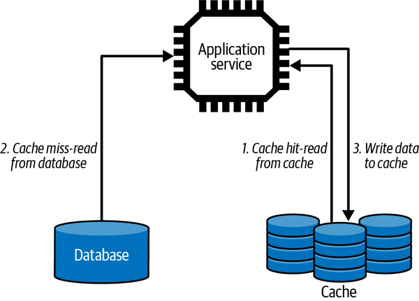
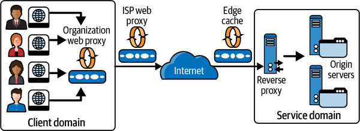

# Chapter 6. Distributed Caching

Caches exist in many places in an application. The CPUs that run your applications have fast, multilevel hardware caches to reduce relatively slow main memory accesses. Database engines can make use of main memory to cache the contents of the data store so that in many cases queries do not have to touch relatively slow disks.

Distributed caching is an essential ingredient of a scalable system. Caching makes the results of expensive queries and computations available for reuse by subsequent requests at low cost. By not having to reconstruct the cached results for every request, the capacity of the system is increased, and it can scale to handle greater workloads.

I’ll cover two flavors of caching in this chapter. Application caching requires business logic that incorporates the caching and access of precomputed results using distributed caches. Web caching exploits mechanisms built into the HTTP protocol to enable caching of results within the infrastructure provided by the internet. When used effectively, both will protect your services and databases from heavy read traffic loads.

# Application Caching

Application caching is designed to improve request responsiveness by storing the results of queries and computations in memory so they can be subsequently served by later requests. For example, think of an online newspaper site where readers can leave comments. Once posted, articles change infrequently, if ever. New comments tend to get posted soon after an article is published, but the frequency drops quickly with the age of the article. Hence an article can be cached on first access and reused by all subsequent requests until the article is updated, new comments are posted, or no one wants to read it anymore.

In general, caching relieves databases of heavy read traffic, as many queries can be served directly from the cache. It also reduces computation costs for objects that are expensive to construct, for example, those needing queries that span several different databases. The net effect is to reduce the computational load on our services and databases and create headroom, or capacity for more requests.

Caching requires additional resources, and hence cost, to store cached results. However, well-designed caching schemes are low cost compared to upgrading database and service nodes to cope with higher request loads. As an indication of the value of caches, approximately [3% of infrastructure at Twitter](https://oreil.ly/OdvXp) is dedicated to application-level caches. At Twitter scale, operating hundreds of clusters, that is a lot of infrastructure!

Application-level caching exploits dedicated distributed cache engines. The two predominant technologies in this area are [memcached](https://memcached.org) and [Redis](https://redis.io). Both are essentially distributed in-memory hash tables designed for arbitrary data (strings, objects) representing the results of database queries or downstream service API calls. Common use cases for caches are storing user session data, dynamic web pages, and results of database queries. The cache appears to application services as a single store, and objects are allocated to individual cache servers using a hash function on the object key.

The basic scheme is shown in [Figure 6-1](#application-level_caching). The service first checks the cache to see if the data it requires is available. If so, it returns the cached contents as the results—this is known as a *cache hit*. If the data is not in the cache—a *cache miss*—the service retrieves the requested data from the database and writes the query results to the cache so it is available for subsequent client requests without querying the database.



###### Figure 6-1. Application-level caching

For example, at a busy winter resort, skiers and snowboarders can use their mobile app to get an estimate of the lift wait times across the resort. This enables them to plan and avoid congested areas where they will have to wait to ride a lift for 15 minutes or more!

Every time a skier loads a lift, a message is sent to the company’s service that collects data about skier traffic patterns. Using this data, the system can estimate lift wait times from the number of skiers who ride a lift and the rate they are arriving. This is an expensive calculation, taking maybe a second or more at busy times, as it requires aggregating potentially tens of thousands of lift ride records and performing the wait time calculation. For this reason, once the results are calculated, they are deemed valid for five minutes. Only after this time has elapsed is a new calculation performed and results produced.

The following code example shows how a stateless `LiftWaitService` might work. When a request arrives, the service first checks the cache to see if the latest wait times are available. If they are, the results are immediately returned to the client. If the results are not in the cache, the service calls a downstream service which performs the lift wait calculations and returns them as a `List`. These results are then stored in the cache and then returned to the client:

```
public class LiftWaitService {
  public List getLiftWaits(String resort) { 
    List liftWaitTimes = cache.get(“liftwaittimes:” + resort); 
      if (liftWaitTimes == null) { 
         liftWaitTimes = skiCo.getLiftWaitTimes(resort); 
         // add result to cache, expire in 300 seconds 
         cache.put("liftwaittimes:" + resort, liftWaitTimes, 300); 
      } 
    return liftWaitTimes; 
     } 
   }
```

Cache access requires a key with which to associate the results. In this example, the key is constructed with the string `“liftwaittimes:”` concatenated with the resort identifier that is passed by the client to the service. This key is then hashed by the cache to identify the server where the cached value resides.

When a new value is written to the cache, a value of 300 seconds is passed as a parameter to the `put` operation. This is known as a *time to live* (TTL) value. It tells the cache that after 300 seconds this key-value pair should be evicted from the cache as the value is no longer current (also known as stale).

While the cache value is valid, all requests will utilize it. This means there is no need to perform the expensive lift wait time calculation for every call. A cache hit on a fast network will take maybe a millisecond—much faster than the lift wait times calculation. When the cache value is evicted after 300 seconds, the next request will result in a cache miss. This will result in the calculation of the new values to be stored in the cache. Therefore, if we get *N* requests in a 5-minute period, *N*-1 requests are served from the cache. Imagine if *N* is 10,000? This is a lot of expensive calculations saved, and CPU cycles that your database can use to process other queries.

Using an expiry time like the TTL is a common way to invalidate cache contents. It ensures a service doesn’t deliver stale, out-of-date results to a client. It also enables the system to have some control over cache contents, which are typically limited. If cached items are not flushed periodically, the cache will fill up. In this case, a cache will adopt a policy such as *least recently used* or *least accessed* to choose cache entries to evict and create space for more current, timely results.

Application caching can provide significant throughput boosts, reduced latencies, and increased client application responsiveness. The key to achieving these desirable qualities is to satisfy as many requests as possible from the cache. The general design principle is to maximize the cache hit rate and minimize the cache miss rate. When a cache miss occurs, the request must be satisfied through querying databases or downstream services. The results of the request can then be written to the cache and hence be available for further accesses.

There’s no hard-and-fast rule on what the cache hit rate should be, as it depends on the cost of constructing the cache contents and the update rate of cached items. Ideal cache designs have many more reads than updates. This is because when an item must be updated, the application needs to invalidate cache entries that are now stale because of the update. This means the next request will result in a cache miss.[1](ch06.md)

When items are updated regularly, the cost of cache misses can negate the benefits of the cache. Service designers therefore need to carefully consider query and update patterns an application experiences, and construct caching mechanisms that yield the most benefit. It is also crucial to monitor the cache usage once a service is in production to ensure the hit and miss rates are in line with design expectations. Caches will provide both management utilities and APIs to enable monitoring of the cache usage characteristics. For example, memcached makes a large number of statistics available, including the hit and miss counts as shown in the snippet of output below:

```
STAT get_hits 98567
STAT get_misses 11001
STAT evictions 0
```

Application-level caching is also known as the [*cache-aside* pattern](https://oreil.ly/3Ip0A). The name references the fact that the application code effectively bypasses the data storage systems if the required results are available in the cache. This contrasts with other caching patterns in which the application always reads from and writes to the cache. These are known as *read-through*, *write-through*, and *write-behind* caches, defined as follows:

Read-through

The application satisfies all requests by accessing the cache. If the data required is not available in the cache, a loader is invoked to access the data systems and load the results in the cache for the application to utilize.

Write-through

The application always writes updates to the cache. When the cache is updated, a writer is invoked to write the new cache values to the database. When the database is updated, the application can complete the request.

Write-behind

Like write-through, except the application does not wait for the value to be written to the database from the cache. This increases request responsiveness at the expense of possible lost updates if the cache server crashes before a database update is completed. This is also known as a write-back cache, and internally is the strategy used by most database engines.

The beauty of these caching approaches is that they simplify application logic. Applications always utilize the cache for reads and writes, and the cache provides the “magic” to ensure the cache interacts appropriately with the backend storage systems. This contrasts with the cache-aside pattern, in which application logic must be cognizant of cache misses.

Read-through, write-through, and write-behind strategies require a cache technology that can be augmented with an application-specific handler to perform database reads and writes when the application accesses the cache. For example, [NCache](https://oreil.ly/v6Xio) supports *provider interfaces* that the application implements. These are invoked automatically on cache misses for read-through caches and on writes for write-through caches. Other such caches are essentially dedicated database caches, and hence require cache access to be identical to the underlying database model. An example of this is Amazon’s [DynamoDB Accelerator (DAX)](https://oreil.ly/lfltM). DAX sits between the application code and DynamoDB, and transparently acts as a high-speed, in-memory cache to reduce database access times.

One significant advantage of the cache-aside strategy is that it is resilient to cache failure. In circumstances when the cache is unavailable, all requests are essentially handled as a cache miss. Performance will suffer, but services will still be able to satisfy requests. In addition, scaling cache-aside platforms such as Redis and mem­cached is straightforward due to their simple, distributed hash table model. For these reasons, the cache-aside pattern is the primary approach seen in massively scalable systems.

# Web Caching

One of the reasons that websites are so highly responsive is that the internet is littered with web caches. Web caches store a copy of a given resource—for example, a web page or an image, for a defined time period. The caches intercept client requests and if they have a requested resource cached locally, they return the copy rather than forwarding the request to the target service. Hence, many requests can be satisfied without placing a burden on the service. Also, as the caches are physically closer to the client, the requests will have lower latencies.

[Figure 6-2](#web_caches_in_the_internet) gives an overview of the web caching architecture. Multiple levels of caches exist, starting with the client’s web browser cache and local organization-based caches. ISPs will also implement general web proxy caches, and reverse proxy caches can be deployed within the application services execution domain. Web browser caches are also known as private caches (for a single user). Organizational and ISP proxy caches are shared caches that support requests from multiple users.



###### Figure 6-2. Web caches in the internet

Edge caches, also known as content delivery networks (CDNs), live at various strategic geographical locations globally, so that they cache frequently accessed data close to clients. For example, a video streaming provider may configure an edge cache in Sydney, Australia to serve video content to Australasian users rather than streaming content across the Pacific Ocean from US-based origin servers. Edge caches are deployed globally by CDN providers. Akamai, the original CDN provider, has over 2,000 locations and delivers [up to 30% of internet traffic globally](https://oreil.ly/s73lC). For media-rich sites with global users, edge caches are essential.

Caches typically store the results of `GET` requests only, and the cache key is the URI of the associated `GET`. When a client sends a `GET` request, it may be intercepted by one or more caches along the request path. Any cache with a fresh copy of the requested resource may respond to the request. If no cached content is found, the request is served by the service endpoint, which is also called the origin server in web technology parlance.

Services can control what results are cached and for how long they are stored by using HTTP caching directives. Services set these directives in various HTTP response headers, as shown in this simple example:

```
Response:
HTTP/1.1 200 OK Content-Length: 9842
Content-Type: application/json 
Cache-Control: public 
Date: Fri, 26 Mar 2019 09:33:49 GMT 
Expires: Fri, 26 Mar 2019 09:38:49 GMT
```

I will describe these directives in the following subsections.

## Cache-Control

The `Cache-Control` HTTP header can be used by client requests and service responses to specify how the caching should be utilized for the resources of interest. Possible values are:

`no-store`

Specifies that a resource from a request response should not be cached. This is typically used for sensitive data that needs to be retrieved from the origin servers each request.

`no-cache`

Specifies that a cached resource must be revalidated with an origin server before use. I discuss revalidation in the section [“Etag”](#etag).

`private`

Specifies a resource can be cached only by a user-specific device such as a web browser.

`public`

Specifies a resource can be cached by any proxy server.

`max-age`

Defines the length of time in seconds a cached copy of a resource should be retained. After expiration, a cache must refresh the resource by sending a request to the origin server.

## Expires and Last-Modified

The `Expires` and `Last-Modified` HTTP headers interact with the `max-age` directive to control how long cached data is retained.

Caches have limited storage resources and hence must periodically evict items from memory to create space. To influence cache eviction, services can specify how long resources in the cache should remain valid, or *fresh*. When a request arrives for a fresh resource, the cache serves the locally stored results without contacting the origin server. Once any specified retention period for a cached resource expires, it becomes stale and becomes a candidate for eviction.

Freshness is calculated using a combination of header values. The `"Cache-Control: max-age=N"` header is the primary directive, and this value specifies the freshness period in seconds.

If `max-age` is not specified, the `Expires` header is checked next. If this header exists, then it is used to calculate the freshness period. The `Expires` header specifies an explicit date and time after which the resource should be considered stale. For example:

```
Expires: Wed, 26 Oct 2022 09:39:00 GMT
```

As a last resort, the `Last-Modified` header can be used to calculate resource retention periods. This header is set by the origin server to specify when a resource was last updated, and uses the same format as the `Expires` header. A cache server can use `Last-Modified` to determine the freshness lifetime of a resource based on a heuristic calculation that the cache supports. The calculation uses the `Date` header, which specifies the time a response message was sent from an origin server. A resource retention period subsequently becomes equal to the value of the `Date` header minus the value of the `Last-Modified` header divided by 10.

## Etag

HTTP provides another directive that can be used to control cache item freshness. This is known as an `Etag`. An `Etag` is an opaque value that can be used by a web cache to check if a cached resource is still valid. I’ll explain this using an example in the following.

Going back to our winter resort example, the resort produces a weather report at 6 a.m. every day during the winter season. If the weather changes during the day, the resort updates the report. Sometimes this happens two or three times each day, and sometimes not at all if the weather is stable. When a request arrives for the weather report, the service responds with a maximum age to define cache freshness, and also an `Etag` that represents the version of the weather report that was last issued. This is shown in the following HTTP example, which tells a cache to treat the weather report resource as fresh for at least 3,600 seconds, or 60 minutes. The `Etag` value, namely `"blackstone-weather-03/26/19-v1"`, is simply generated using a label that the service defines for this particular resource. In this example, the `Etag` represents the first version of the report for the Blackstone Resort on March 26th, 2019. Other common strategies are to generate the `Etag` using a hash algorithm such as MD5:

```
Request:
GET /skico.com/weather/Blackstone

Response:
HTTP/1.1 200 OK Content-Length: ...
Content-Type: application/json 
Date: Fri, 26 Mar 2019 09:33:49 GMT 
Cache-Control: public, max-age=3600 
ETag: “blackstone-weather-03/26/19-v1"
<!-- Content omitted -->
```

For the next hour, the web cache simply serves this cached weather report to all clients who issue a `GET` request. This means the origin servers are freed from processing these requests—the outcome that we want from effective caching. After an hour though, the resource becomes stale. Now, when a request arrives for a stale resource, the cache forwards it to the origin server with a `If-None-Match` directive along with the `Etag` to inquire if the resource, in our case the weather report, is still valid. This is known as *revalidation*.

There are two possible responses to this request:

- If the `Etag` in the request matches the value associated with the resource in the service, the cached value is still valid. The origin server can therefore return a `304 (Not Modified)` response, as shown in the following example. No response body is needed as the cached value is still current, thus saving bandwidth, especially for large resources. The response may also include new cache directives to update the freshness of the cached resource.
- The origin server may ignore the revalidation request and respond with a `200 OK` response code, a response body and `Etag` representing the latest version of the weather report:

```
Request: 
GET /upic.com/weather/Blackstone 
If-None-Match: “blackstone-weather-03/26/19-v1"
Response:
HTTP/1.1 304 Not Modified
Cache-Control: public, max-age=3600
```

In the service implementation, a mechanism is needed to support revalidation. In our weather report example, one strategy is as follows:

Generate a new daily report

The weather report is constructed and stored in a database, with the `Etag` as an attribute.

`GET` requests

When any `GET` request arrives, the service returns the weather report and the `Etag`. This will also populate web caches along the network response path.

Conditional `GET` requests

For conditional requests with the `If-None-Match:` directive, look up the `Etag` value in the database and return `304` if the value has not changed. If the stored `Etag` has changed, return `200` along with the latest weather report and a new `Etag` value.

Update the weather report

A new version of the weather report is stored in the database and the `Etag` value is modified to represent this new version of the response.

When used effectively, web caching can significantly reduce latencies and save network bandwidth. This is especially true for large items such as images and documents. Further, as web caches handle requests rather than application services, this reduces the request load on origin servers, creating additional capacity.

Proxy caches such as [Squid](https://oreil.ly/wZGrG) and [Varnish](https://oreil.ly/NvvwX) are extensively deployed on the internet. Web caching is most effective when deployed for static data (images, videos, and audio streams) as well as infrequently changing data such as weather reports. The powerful facilities provided by HTTP caching in conjunction with proxy and edge caches are therefore invaluable tools for building scalable applications.

# Summary and Further Reading

Caching is an essential component of any scalable distribution. Caching stores information that is requested by many clients in memory and serves this information as the results to client requests. While the information is still valid, it can be served potentially millions of times without the cost of re-creation.

Application caching using a distributed cache is the most common approach to caching in scalable systems. This approach requires the application logic to check for cached values when a client request arrives and return these if available. If the cache hit rate is high, with most requests being satisfied with cached results, the load on backend services and databases can be considerably reduced.

The internet also has a built in, multilevel caching infrastructure. Applications can exploit this through the use of cache directives that are part of HTTP headers. These directives enable a service to specify what information can be cached, for how long it should be cached, and employ a protocol for checking to see if a stale cache entry is still valid. Used wisely, HTTP caching can significantly reduce request loads on downstream services and databases.

Caching is a well established area of software and systems, and the literature tends to be scattered across many generic and product-specific sources. A great source of “all things caching” is Gerardus Blokdyk’s *Memcached*, 3rd ed. (5StarCooks, 2021). While the title gives away the product-focused content, the knowledge contained can be translated easily to cache designs with other competing technologies.

A great source of information on HTTP/2 in general is *Learning HTTP/2: A Practical Guide for Beginners* by Stephen Ludin and Javier Garza (O’Reilly, 2017). And while dated, *Web Caching* by Duane Wessels (O’Reilly, 2001) contains enough generic wisdom to remain a very useful reference.

CDNs are a complex, vendor-specific topic in themselves. They come into their own for media-rich websites with a geographically dispersed group of users that require fast content delivery. For a highly readable overview of CDNs, [Ogi Djuraskovic’s site](https://oreil.ly/I4K5L) is worth checking out.

[1](ch06.md) Some application use cases may make it possible for a new cache entry to be created at the same time an update is made. This can be useful if some keys are “hot” and will have a great likelihood of being accessed again before the next update. This is known as an “eager” cache update.
