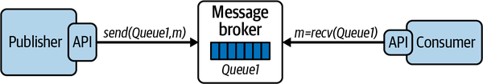
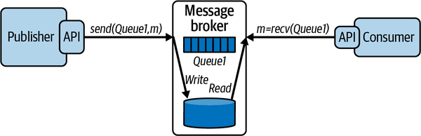
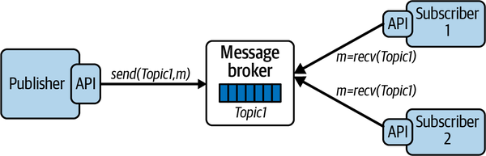
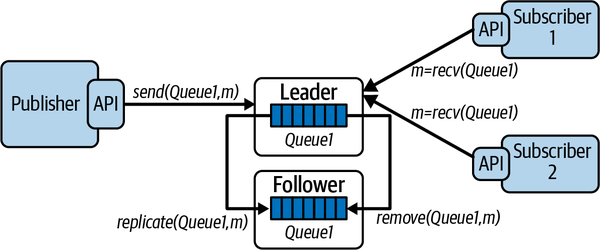
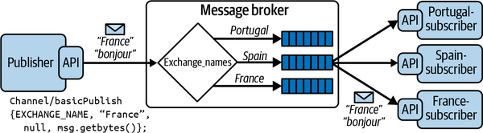
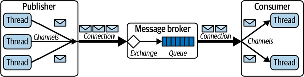
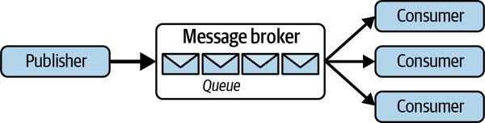

# Chapter 7. Asynchronous Messaging

Inevitably for a distributed systems book, I’ve spent a fair bit of time in the preceding chapters discussing communications issues. Communication is fundamental to distributed systems, and it is a major issue that architects need to incorporate into their system designs.

So far, these discussions have assumed a synchronous messaging style. A client sends a response and waits for a server to respond. This is how most distributed communications are designed to occur, as the client requires an instantaneous response to proceed.

Not all systems have this requirement. For example, when I return some goods I’ve purchased online, I take them to my local UPS or FedEx store. They scan my QR code, and I give them the package to process. I do not then wait in the store for confirmation that the product has been successfully received by the vendor and my payment returned. That would be dull and unproductive. I trust the shipping service to deliver my unwanted goods to the vendor and expect to get a message a few days later when it has been processed.

We can design our distributed systems to emulate this behavior. Using an asynchronous communications style, clients, known as producers, send their requests to an intermediary messaging service. This acts as a delivery mechanism to relay the request to the intended destination, known as the consumer, for processing. Producers “fire and forget” the requests they send. Once a request is delivered to the messaging service, the producer moves on to the next step in their logic, confident that the requests it sends will eventually get processed. This improves system responsiveness, in that producers do not have to wait until the request processing is completed.

In this chapter I’ll describe the basic communication mechanisms that an asynchronous messaging system supports. I’ll also discuss the inherent trade-offs between throughput and data safety—basically, making sure your systems don’t lose messages. I’ll also cover three key messaging patterns that are commonly deployed in highly scalable distributed systems.

To make these concepts concrete, I’ll describe [RabbitMQ](https://oreil.ly/j9eHD), a widely deployed open source messaging system. After introducing the basics of the technology, I’ll focus on the core set of features you need to be aware of in order to design a high-throughput messaging system.

# Introduction to Messaging

Asynchronous messaging platforms are a mature area of technology, with multiple products in the space.[1](ch07.md) The venerable IBM MQ Series appeared in 1993 and is still a mainstay of enterprise systems. The Java Messaging Service (JMS), an API-level specification, is supported by multiple JEE vendor implementations. RabbitMQ, which I’ll use as an illustration later in this chapter, is arguably the most widely deployed open source messaging system. In the messaging world, you will never be short of choice.

While the specific features and APIs vary across all these competing products, the foundational concepts are pretty much identical. I’ll cover these in the following subsections, and then describe how they are implemented in RabbitMQ in the next section. Once you appreciate how one messaging platform works, it is relatively straightforward to understand the similarities and differences inherent in the competition.

## Messaging Primitives

Conceptually, a messaging system comprises the following:

Message queues

Queues that store a sequence of messages

Producers

Send messages to queues

Consumers

Retrieve messages from queues

Message broker

Manages one or more queues

This scheme is illustrated in [Figure 7-1](#a_simple_messaging_system).



###### Figure 7-1. A simple messaging system

A message broker is a service that manages one or more queues. When messages are sent from producers to a queue, the broker adds messages to the queue in the order they arrive—basically a FIFO approach. The broker is responsible for efficiently managing message receipt and retention until one or more consumers retrieve the messages, which are then removed from the queue. Message brokers that manage many queues and many requests can effectively utilize many vCPUs and memory to provide low latency accesses.

Producers send messages to a named queue on a broker. Many producers can send messages to the same queue. A producer will wait until an acknowledgment message is received from the broker before the send operation is considered complete.

Many consumers can take messages from the same queue. Each message is retrieved by exactly one consumer. There are two modes of behavior for consumers to retrieve messages, known as *pull* or *push*. While the exact mechanisms are product-specific, the basic semantics are common across technologies:

- In pull mode, also known as polling, consumers send a request to the broker, which responds with the next message available for processing. If there are no messages available, the consumer must poll the queue until messages arrive.
- In push mode, a consumer informs the broker that it wishes to receive messages from a queue. The consumer provides a callback function that should be invoked when a message is available. The consumer then blocks (or does other work) and the message broker delivers messages to the callback function for processing when they are available.

Generally, utilizing the push mode when available is much more efficient and recommended. It avoids the broker being potentially swamped by requests from multiple consumers and makes it possible to implement message delivery more efficiently in the broker.

Consumers will also acknowledge message receipt. Upon consumer acknowledgment, the broker is free to mark a message as delivered and remove it from the queue. Acknowledgment may be done automatically or manually.

If automatic acknowledgment is used, messages are acknowledged as soon as they are delivered to the consumer, and before they are processed. This provides the lowest latency message delivery as the acknowledgment can be sent back to the broker before the message is processed.

Often a consumer will want to ensure a message is fully processed before acknowledgment. In this case, it will utilize manual acknowledgments. This guards against the possibility of a message being delivered to a consumer but not being processed due to a consumer crash. It does, of course, increase message acknowledgment latency. Regardless of the acknowledgment mode selected, unacknowledged messages effectively remain on the queue and will be delivered at some later time to another consumer for processing.

## Message Persistence

Message brokers can manage multiple queues on the same hardware. By default, message queues are typically memory based, in order to provide the fastest possible service to producers and consumers. Managing queues in memory has minimal overheads, as long as memory is plentiful. It does, however, risk message loss if the server were to crash.

To guard against message loss—a practice known as data safety—queues can be configured to be persistent. When a message is placed on a queue by a producer, the operation does not complete until the message is written to disk. This scheme is depicted in [Figure 7-2](#persisting_messages_to_disk). Now, if a message broker should fail, on reboot it can recover the queue contents to the state they existed in before the failure, and no messages will be lost. Many applications can’t afford to lose messages, and hence persistent queues are necessary to provide data safety and fault tolerance.



###### Figure 7-2. Persisting messages to disk

Persistent queues have an inherent increase in the response time for send operations, with the trade-off being enhanced data safety. Brokers will usually maintain the queue contents in memory as well as on disk so messages can be delivered to consumers with minimal overhead during normal operations.

## Publish–Subscribe

Message queues deliver each message to exactly one consumer. For many use cases, this is exactly what you want—my online purchase return needs to be consumed just once by the originating vendor—so that I get my money back.

Let’s extend this use case. Assume the online retailer wants to do an analysis of all purchase returns so it can detect vendors who have a high rate of returns and take some remedial action. To implement this, you could simply deliver all purchase return messages to the respective vendor *and* the new analysis service. This creates a one-to-many messaging requirement, which is known as a publish–subscribe architecture pattern. In publish–subscribe systems, message queues are known as *topics*. A topic is basically a message queue that delivers each published message to one of more subscribers, as illustrated in [Figure 7-3](#a_publishen_dashsubscribe_broker_archit).



###### Figure 7-3. A publish–subscribe broker architecture

With publish–subscribe, you can create highly flexible and dynamic systems. Publishers are decoupled from subscribers, and the number of subscribers can vary dynamically. This makes the architecture highly extensible as new subscribers can be added without any changes to the existing system. It also makes it possible to perform message processing by a number of consumers in parallel, thus enhancing performance.

Publish–subscribe places an additional performance burden on the message broker. The broker is obliged to deliver each message to all active subscribers. As subscribers will inevitably process and acknowledge messages at different times, the broker needs to keep messages available until all subscribers have consumed each message. Utilizing a push model for message consumption provides the most efficient solution for publish–subscribe architectures.

Publish–subscribe messaging is a key component for building distributed, event-driven architectures. In event-driven architectures, multiple services can publish events related to some state changes using message broker topics. Services can register interest in various event types by subscribing to a topic. Each event published on the topic is then delivered to all interested consumer services. I’ll return to event-driven architectures when microservices are covered in [Chapter 9](ch09.md).[2](ch07.md)

## Message Replication

In an asynchronous system, the message broker is potentially a single point of failure. A system or network failure can cause the broker to be unavailable, making it impossible for the systems to operate normally. This is rarely a desirable situation.

For this reason, most message brokers enable logical queues and topics to be physically replicated across multiple brokers, each running on their own node. If one broker fails, then producers and consumers can continue to process messages using one of the replicas. This architecture is illustrated in [Figure 7-4](#message_queue_replication). Messages published to the leader are mirrored to the follower, and messages consumed from the leader are removed from the follower.



###### Figure 7-4. Message queue replication

The most common approach to message queue replication is known as a leader-follower architecture. One broker is designated as the leader, and producers and consumers send and receive messages respectively from this leader. In the background, the leader replicates (or mirrors) all messages it receives to the follower, and removes messages that are successfully delivered. This is shown in [Figure 7-4](#message_queue_replication) with the *replicate* and *remove* operations. How precisely this scheme behaves and the effects it has on broker performance is inherently implementation, and hence product dependent.

With leader-follower message replication, the follower is known as a hot standby, basically a replica of the leader that is available if the leader fails. In such a failure scenario, producers and consumers can continue to operate by switching over to accessing the follower. This is also called *failover*. Failover is implemented in the client libraries for the message broker, and hence occurs transparently to producers and consumers.

Implementing a broker that performs queue replication is a complicated affair. There are numerous subtle failure cases that the broker needs to handle when duplicating messages. I’ll start to raise these issues and describe some solutions in Chapters [10](ch10.md) and [11](ch11.md) when discussions turn to scalable data management.

###### Warning

Some advice: don’t contemplate *rolling your own* replication scheme, or any other complex distributed algorithm for that matter. The software world is littered with failed attempts to build application-specific distributed systems infrastructure, just because the solutions available “don’t do it quite right for our needs” or “cost too much.” Trust me—your solution will not work as well as existing solutions and development will cost more than you could ever anticipate. You will probably end up throwing your code away. These algorithms are really hard to implement correctly at scale.

# Example: RabbitMQ

RabbitMQ is one of the most widely utilized message brokers in distributed systems. You’ll encounter deployments in all application domains, from finance to telecommunications to building environment control systems. It was first released around 2009 and has developed into a full-featured, open source distributed message broker platform with support for building clients in most mainstream languages.

The RabbitMQ broker is built in Erlang, and primarily provides support for the Advanced Message Queuing Protocol (AMQP) open standard.[3](ch07.md) AMQP emerged from the finance industry as a cooperative protocol definition effort. It is a binary protocol, providing interoperability between different products that implement the protocol. Out of the box, RabbitMQ supports AMQP v0-9-1, with v1.0 support via a plugin.

## Messages, Exchanges, and Queues

In RabbitMQ, producers and consumers use a client API to send and receive messages from the broker. The broker provides the store-and-forward functionality for messages, which are processed in a FIFO manner using queues. The broker implements a messaging model based on a concept called exchanges, which provide a flexible mechanism for creating messaging topologies.

An exchange is an abstraction that receives messages from producers and delivers them to queues in the broker. Producers only ever write messages to an exchange. Messages contain a message payload and various attributes known as message metadata. One element of this metadata is the *routing key*, which is a value used by the exchange to deliver messages to the intended queues.

Exchanges can be configured to deliver a message to one or more queues. The message delivery algorithm depends on the exchange type and rules called bindings, which establish a relationship between an exchange and a queue using the routing key. The three most commonly used exchange types are shown in [Table 7-1](#exchange_types).

Table 7-1. Exchange types Exchange type Message routing behavior Direct Delivers a message to a queue based on matching the value of a routing key which is published with each message Topic Delivers a message to one or more queues based on matching the routing key and a pattern used to bind a queue to the exchange Fanout Delivers a message to all queues that are bound to the exchange, and the routing key is ignored

Direct exchanges are typically used to deliver each message to one destination queue based on matching the routing key.[4](ch07.md) Topic exchanges are a more flexible mechanism based on pattern matching that can be used to implement sophisticated publish–subscribe messaging topologies. Fanout exchanges provide a simple one-to-many broadcast mechanism, in which every message is sent to all attached queues.

[Figure 7-5](#an_example_of_a_rabbitmq_direct_exchang) depicts how a direct exchange operates. Queues are bound to the exchange by consumers with three values, namely “France,” “Spain,” and “Portugal.” When a message arrives from a publisher, the exchange uses the attached routing key to deliver the message to one of the three attached queues.



###### Figure 7-5. An example of a RabbitMQ direct exchange

The following code shows an excerpt of how a direct exchange is configured and utilized in Java. RabbitMQ clients, namely producer and consumer processes, use a *channel* abstraction to establish communications with the broker (more on channels in the next section). The producer creates the exchange in the broker and publishes a message to the exchange with the routing key set to “France.” A consumer creates an anonymous queue in the broker, binds the queue to the exchange created by the publisher, and specifies that messages published with the routing key “France'' should be delivered to this queue.

Producer:

```
channel.exchangeDeclare(EXCHANGE_NAME, "direct");
channel.basicPublish(EXCHANGE_NAME, “France”, null, message.getBytes());
```

Consumer:

```
String queueName = channel.queueDeclare().getQueue();
channel.queueBind(queueName, EXCHANGE_NAME, “France”);
```

## Distribution and Concurrency

To get the most from RabbitMQ in terms of performance and scalability, you must understand how the platform works under the covers. The issues of concern relate to how clients and the broker communicate, and how threads are managed.

Each RabbitMQ client connects to a broker using a RabbitMQ connection. This is basically an abstraction on top of TCP/IP, and can be secured using user credentials or TLS. Creating connections is a heavyweight operation, requiring multiple round trips between the client and server, and hence a single long-lived connection per client is the common usage pattern.

To send or receive messages, clients use the connection to create a RabbitMQ channel. Channels are a logical connection between a client and the broker, and only exist in the context of a RabbitMQ connection, as shown in the following code snippet:

```
ConnectionFactory connFactory = new ConnectionFactory();
Connection rmqConn = connFactory.createConnection();
Channel channel = rmqConn.createChannel();
```

Multiple channels can be created in the same client to establish multiple logical broker connections. All communications over these channels are multiplexed over the same RabbitMQ (TCP) connection, as shown in [Figure 7-6](#rabbitmq_connections_and_channels). Creating a channel requires a network round trip to the broker. Hence for performance reasons, channels should ideally be long-lived, with channel churn, namely constantly creating and destroying channels, avoided.



###### Figure 7-6. RabbitMQ connections and channels

To increase the throughput of RabbitMQ clients, a common strategy is to implement multithreaded producers and consumers. Channels, however, are not thread safe, meaning every thread requires exclusive access to a channel. This is not a concern if your client has long-lived, stateful threads and can create a channel per thread, as shown in [Figure 7-6](#rabbitmq_connections_and_channels). You start a thread, create a channel, and publish or consume away. This is a channel-per-thread model.

In application servers such as Tomcat or Spring however, the solution is not so simple. The life cycle and invocation of threads is controlled by the server platform, not your code. The solution is to create a global channel pool upon server initialization. This precreated collection of channels can be used on demand by server threads without the overheads of channel creation and deletion per request. Each time a request arrives for processing, a server thread takes the following steps:

- Retrieves a channel from the pool
- Sends the message to the broker
- Returns the channel to pool for subsequent reuse

While there is no native RabbitMQ capability to do this, in Java you can utilize the [Apache Commons Pool library](https://oreil.ly/zcxvE) to implement a channel pool. The complete code for this implementation is included in the accompanying code repository for this book. The following code snippet shows how a server thread uses the `borrowObject()` and `returnObject()` methods of the Apache [`GenericObjectPool` class](https://oreil.ly/lVPId). You can tune the minimum and maximum size of this object pool using setter methods to provide the throughput your application desires:

```
private boolean sendMessageToQueue(JsonObject message) {
  try {
    Channel channel = pool.borrowObject();
      channel.basicPublish(// arguments omitted for brevity)
      pool.returnObject(channel);
      return true;
    } catch (Exception e) {
      logger.info("Failed to send message to RabbitMQ");
      return false;
    }
  }
```

On the consumer side, clients create channels that can be used to receive messages. Consumers can explicitly retrieve messages on demand from a queue using the `basicGet()` API, as shown in the following example:

```
boolean autoAck = true;
GetResponse response = channel.basicGet(queueName, autoAck);
if (response == null) {
    // No message available. Decide what to do …
} else {
    // process message
}
```

This approach uses the *pull* model (polling). Polling is inefficient as it involves busy-waiting, obliging the consumer to continually ask for messages even if none are available. In high-performance systems, this is not the approach to use.

The alternative and preferable method is the *push* model. The consumer specifies a callback function that is invoked for each message the RabbitMQ broker sends, or pushes, to the consumer. Consumers issue a call to the `basicConsume()` API. When a message is available for the consumer from the queue, the RabbitMQ client library on the consumer invokes the callback in another thread associated with the channel. The following code example shows how to receive messages using an object of type `DefaultConsumer` that is passed to `basicConsume()` to establish a connection:

```
boolean autoAck = true;
channel.basicConsume(queueName, autoAck, "tag",
     new DefaultConsumer(channel) {
         @Override
         public void handleDelivery(String consumerTag,
                                    Envelope envelope,
                                    AMQP.BasicProperties properties,
                                    byte[] body)
             throws IOException
         {
             // process the message
         }
     });
```

Reception of messages on a single channel is single threaded. This makes it necessary to create multiple threads and allocate a channel-per-thread or channel pool in order to obtain high message consumption rates. The following Java code extract shows how this can be done. Each thread creates and configures its own channel and specifies the callback function—`threadCallback()`—that should be called by the RabbitMQ client when a new message is delivered:

```
Runnable runnable = () -> {
      try {
        final Channel channel = connection.createChannel();
        channel.queueDeclare(QUEUE_NAME, true, false, false, null);
        // max one message per receiver
        
        final DeliverCallback threadCallback = (consumerTag, delivery) 
         -> {
             String message = 
                 new String(delivery.getBody(), StandardCharsets.UTF_8);
             // process the message 
        };
        channel.basicConsume(QUEUE_NAME, 
                             false, threadCallback, consumerTag -> {});
        // 
      } catch (IOException e) {
        logger.info(e.getMessage());
      }
```

Another important aspect of RabbitMQ to appreciate in order to obtain high performance and scalability is the thread model used by the message broker. In the broker, each queue is managed by a single thread. This means you can increase throughput on a multicore node if you have at least as many queues as cores on the underlying node. Conversely, if you have many more highly utilized queues than cores on your broker node, you are likely to see some performance degradation.

Like most message brokers, RabbitMQ performs best when consumption rates keep up with production rates. When queues grow long, in the order of tens of thousands of messages, the thread managing a queue will experience more overheads. By default, the broker will utilize 40% of the available memory of the node it is running on. When this limit is reached, the broker will start to throttle producers, slowing down the rate at which the broker accepts messages, until the memory usage drops below the 40% threshold. The memory threshold is configurable and again, this is a setting that can be tuned to your workload to optimize message throughput.[5](ch07.md)

## Data Safety and Performance Trade-offs

All messaging systems present a dilemma around a performance versus reliability trade-off. In this particular case, the core issue is the reliability of message delivery, commonly known as data safety. You want your messages to transit between producer and consumer with minimum latency, and of course you don’t want to lose any messages along the way. Ever. If only it were that simple. These are distributed systems, remember.

When a message transits from producer to consumer, there are multiple failure scenarios you have to understand and cater for in your design. These are:

- A producer sends a message to a broker and message is not successfully accepted by the broker.
- A message is in a queue and the broker crashes.
- A message is successfully delivered to the consumer but the consumer fails before fully processing the message.

If your application can tolerate message loss, then you can choose options that maximize performance. It probably doesn’t matter if occasionally you lose a message from an instant messaging application. In this case your system can ignore message safety issues and run full throttle. This isn’t the case for, say, a purchasing system. If purchase orders are lost, the business loses money and customers. You need to put safeguards in place to ensure data safety.

RabbitMQ, like basically all message brokers, has features that you can utilize to guarantee end-to-end message delivery. These are:

Publisher-confirms

A publisher can specify that it wishes to receive acknowledgments from the broker that a message has been successfully received. This is not default publisher behavior and must be set as a channel attribute by calling the `confirmSelect()` method. Publishers can wait for acknowledgments synchronously, or asynchronously by registering a callback function.

Persistent messages and message queues

If a message broker fails, all messages stored in memory for each queue are lost. To survive a broker crash, queues need to be configured as persistent (durable). This means messages are written to disk as soon as they arrive from publishers. When a broker is restarted after a crash, it recovers all persistent queues and messages. In RabbitMQ, both queues and individual messages need to be configured as persistent to provide a high level of data safety.

Consumer manual acknowledgments

A broker needs to know when it can consider a message successfully delivered to a consumer so it can remove the message from the queue. In RabbitMQ, this occurs either immediately after a message is written to a TCP socket, or when the broker receives an explicit client acknowledgment. These two modes are known as automatic and manual acknowledgments, respectively. Automatic acknowledgments risk data safety as a connection or a consumer may fail before the consumer processes the message. For data safety, it is therefore important to utilize manual acknowledgments to make sure a message has been both received and processed before it is evicted from the queue.

In a nutshell, you need publisher acknowledgments, persistent queues and messages, and manual consumer acknowledgments for complete data safety. Your system will almost certainly take a performance hit, but you won’t lose messages.

## Availability and Performance Trade-Offs

Another classic messaging system trade-off is between availability and performance. A single broker is a single point of failure, and hence the system will be unavailable if the broker crashes or experiences a transient network failure. The solution, as is typical for increasing availability, is broker and queue replication.

RabbitMQ provides two ways to support high availability, known as mirrored queues and quorum queues. While the details in implementation differ, the basics are the same, namely:

- Two or more RabbitMQ brokers need to be deployed and configured as a cluster.
- Each queue has a leader version, and one or more followers.
- Publishers send messages to the leader, and the leader takes responsibility for replicating each message to the followers.
- Consumers also connect to the leader, and when messages are successfully acknowledged at the leader, they are also removed from followers.
- As all publisher and consumer activity is processed by the leader, both quorum and mirrored queues enhance availability but do not support load balancing. Message throughput is limited by the performance possible for the leader replica.

There are numerous differences in the [exact features](https://oreil.ly/UNy9z) supported by quorum and mirrored queues. The key difference, however, revolves around how messages are replicated and how a new leader is selected in case of leader failure. Quorum in this context essentially means a majority. If there are five queue replicas, then at least three replicas—the leader and two followers—need to persist a newly published message. Quorum queues implement an algorithm known as RAFT to manage replication and elect a new leader when a leader becomes available. I’ll discuss RAFT in some detail in [Chapter 12](ch12.md).

Quorum queues must be persistent and are therefore designed to be utilized in use cases when data safety and availability take priority over performance. They have other advantages over the mirrored queue implementation in terms of failure handling. For these reasons, the mirrored queue implementation will be deprecated in future versions.

# Messaging Patterns

With a long history of usage in enterprise systems, a [comprehensive catalog of design patterns](https://oreil.ly/DuhYA) exists for applications that utilize messaging. While many of these are concerned with best design practices for ease of construction and modification of systems and message security, a number apply directly to scalability in distributed systems. I’ll explain three of the most commonly utilized patterns in the next sections.

## Competing Consumers

A common requirement for messaging systems is to consume messages from a queue as quickly as possible. With the [competing consumers pattern](https://oreil.ly/WHatQ), this is achieved by running multiple consumer threads and/or processes that concurrently processes messages. This enables an application to scale out message processing by horizontally scaling the consumers as needed. The general design is shown in [Figure 7-7](#the_competing_consumers_pattern).



###### Figure 7-7. The competing consumers pattern

Using this pattern, messages can be distributed across consumers dynamically using either the push or a pull model. Using the push approach, the broker is responsible for choosing a consumer to deliver a message to. A common method, which, for example, is implemented in RabbitMQ and ActiveMQ, is a simple round-robin distribution algorithm. This ensures an even distribution of messages to consumers.

With the pull approach, consumers simply consume messages as quickly as they can process them. Assuming a multithreaded consumer, if one consumer is running on an 8-core node and another on a 2-core node, we’d expect the former would process approximately four times the amount of messages of the latter. Hence, load balancing occurs naturally with the pull approach.

There are three key advantages to this pattern, namely:

Availability

If one consumer fails, the system remains available, and its share of messages is simply distributed to the other competing consumers.

Failure handling

If a consumer fails, unacknowledged messages are delivered to another queue consumer.

Dynamic load balancing

New consumers can be started under periods of high load and stopped when load is reduced, without the need to change any queue or consumer configurations.

Support for competing consumers will be found in any production-quality messaging platform. It is a powerful way to scale out message processing from a single queue.

## Exactly-Once Processing

As I discussed in [Chapter 3](ch03.md), transient network failures and delayed responses can cause a client to resend a message. This can potentially lead to duplicate messages being received by a server. To alleviate this issue, we need to put in place measures to ensure idempotent processing.

In asynchronous messaging systems, there are two sources for duplicate messages being processed. The first is duplicates from the publisher, and the second is consumers processing a message more than once. Both need to be addressed to ensure exactly-once processing of every message.

The publisher part of the problem originates from a publisher retrying a message when it does not receive an acknowledgment from the message broker. If the original message was received and the acknowledgment lost or delayed, this may lead to duplicates on the queue. Fortunately, some message brokers provide support for this duplicate detection, and thus ensure duplicates do not get published to a queue. For example, the ActiveMQ Artemis release can [remove duplicates](https://oreil.ly/WZnGm) that are sent from the publisher to the broker. The approach is based on the solution I described in [Chapter 3](ch03.md), using client-generated, unique *idempotency key* values for each message. Publishers simply need to set a specific message property to a unique value, as shown in the following code:

```
ClientMessage msg = session.createMessage(true);
UUID idKey = UUID.randomUUID();  // use as idempotence key
msg.setStringProperty(HDR_DUPLICATE_DETECTION_ID, idKey.toString() );
```

The broker utilizes a cache to store idempotency key values and detect duplicates. This effectively eliminates duplicate messages from the queue, solving the first part of your problem.

On the consumer side, duplicates occur when the broker delivers a message to a consumer, which processes it and then fails to send an acknowledgment (consumer crashes or the network loses the acknowledgment). The broker therefore redelivers the message, potentially to a different consumer if the application utilizes the competing consumer pattern.

It’s the obligation of consumers to guard against duplicate processing. Again, the mechanisms I described in [Chapter 3](ch03.md), namely maintaining a cache or database of idempotency keys for messages that have been processed. Most brokers will set a message header that indicates if a message is a redelivery. This can be used in the consumer implementation of idempotence. It doesn’t guarantee a consumer has seen the message already. It just tells you that the broker delivered it and the message remains unacknowledged.

## Poison Messages

Sometimes messages delivered to consumers can’t be processed. There are numerous possible reasons for this. Probably most common are errors in producers that send messages that cannot be handled by consumers. This could be for reasons such as a malformed JSON payload or some unanticipated state change, for example, a *StudentID* field in a message for a student who has just dropped out from the institution and is no longer active in the database. Regardless of the reason, these *poison messages* have one of two effects:

- They cause the consumer to crash. This is probably most common in systems under development and test. Sometimes, though, these issues sneak into production, when failing consumers are sure to cause some serious operational headaches.
- They cause the consumer to reject the message as it is not able to successfully process the payload.

In either case, assuming consumer acknowledgments are required, the message remains on the queue in an unacknowledged state. After some broker-specific mechanism, typically a timeout or a negative acknowledgment, the poison message will be delivered to another consumer for processing, with predictable, undesirable results.

If poison messages are not somehow detected, they can be delivered indefinitely. This at best takes up processing capacity and hence reduces system throughput. At worst it can bring a system to its knees by crashing consumers every time a poison message is received.

The solution to poison message handling is to limit the number of times a message can be redelivered. When the redelivery limit is reached, the message is automatically moved to a queue where problematic requests are collected. This queue is traditionally and rather macabrely known as the *dead-letter queue*.

As you no doubt expect by now, the exact mechanism for implementing poison message handling varies across messaging platforms. For example, Amazon Simple Queue Service (SQS) defines a policy that specifies the dead-letter queue that is associated with an application-defined queue. The policy also states after how many redeliveries a message should be automatically moved from the application queue to the dead-letter queue. This value is known as the `maxReceiveCount`.

In SQS, each message has a `ReceiveCount` attribute, which is incremented when a message is not successfully processed by a consumer. When the `ReceiveCount` exceeds the defined `maxReceiveCount` value for a queue, SQS moves the message to the dead-letter queue. Sensible values for redelivery vary with application characteristics, but a range of three to five is common.

The final part of poison message handling is diagnosing the cause for messages being redirected to the dead-letter queue. First, you need to set some form of monitoring alert that sends a notification to engineers that a message has failed processing. At that stage, diagnosis will comprise examining logs for exceptions that caused processing to fail and analyzing the message contents to identify producer or consumer issues.

# Summary and Further Reading

Asynchronous messaging is an integral component of scalable system architectures. Messaging is particularly attractive in systems that experience peaks and troughs in request. During peak times, producers can add requests to queues and respond rapidly to clients, without having to wait for the requests to be processed.

Messaging decouples producers from consumers, making it possible to scale them independently. Architectures can take advantage of this by elastically scaling producers and consumers to match traffic patterns and balance message throughput requirements with costs. Message queues can be distributed across multiple brokers to scale message throughput. Queues can also be replicated to enhance availability.

Messaging is not without its dangers. Duplicates can be placed on queues, and messages can be lost if queues are maintained in memory. Deliveries to consumers can be lost, and a message can be consumed more than once if acknowledgments are lost. These data safety issues require attention to detail in design so that tolerance for duplicate messages and message loss is matched to the system requirements.

If you are interested in acquiring a broad and deep knowledge of messaging architectures and systems, the classic book *Enterprise Integration Patterns* by Gregor Hohpe and Bobby Woolf (Addison-Wesley Professional, 2003) should be your first stop. Other excellent sources of knowledge tend to be messaging platform specific, and as there are a lot of competing platforms, there’s a lot of books to choose from. My favorite RabbitMQ books for general messaging wisdom and RabbitMQ-specific information are *RabbitMQ Essentials*, 2nd ed., by David Dossot and Lovisa Johansson (Packt, 2014) and *RabbitMQ in Depth* by Gavin M. Roy (Manning, 2017).

On a final note, the theme of asynchronous communications and the attendant advantages and problems will permeate the remainder of this book. Messaging is a key component of microservice-based architectures ([Chapter 9](ch09.md)) and is foundational to how distributed databases function. And you’ll certainly recognize the topics of this chapter when I cover streaming systems and event-driven processing in [Part IV](part04.md).

[1](ch07.md) A helpful overview of the messaging technologies landscape can be found at [*https://oreil.ly/KMvTp*](https://oreil.ly/KMvTp).

[2](ch07.md) [Chapter 14](ch14.md) of *Fundamentals of Software Architecture* by Mark Richards and Neal Ford is an excellent source of knowledge for event-driven architectures.

[3](ch07.md) Other protocols such as STOMP and MQTT are supported via plugins.

[4](ch07.md) Consumers can call `queueBind()` multiple times to specify that their destination should receive messages for more than one routing key value. This approach can be used to create one-to-many message distribution. Topic exchanges are more powerful for one-to-many messaging.

[5](ch07.md) A complete description of how the RabbitMQ server memory can be configured is available at [the RabbitMQ Memory Alarms page](https://oreil.ly/Ayp2I).
