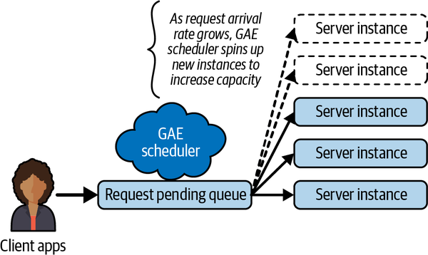
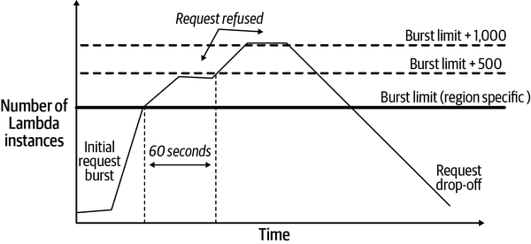

# Chapter 8. Serverless Processing Systems

Scalable systems experience widely varying patterns of usage. For some applications, load may be high during business hours and low or nonexistent during nonbusiness hours. Other applications, for example, an online concert ticket sales system, might have low background traffic 99% of the time. But when tickets for a major series of shows are released, the demand can spike by 10,000 times the average load for a number of hours before dropping back down to normal levels.

Elastic load balancing, as described in [Chapter 5](ch05.md), is one approach for handling these spikes. Another is serverless computing, which I’ll examine in this chapter.

# The Attractions of Serverless

The transition of major organizational IT systems from on-premises to public cloud platforms deployments seems inexorable. Organizations from startups to government agencies to multinationals see clouds as digital transformation platforms and a foundational technology to improve business continuity.

Two of the great attractions of cloud platforms are their pay-as-you-go billing and ability to rapidly scale up (and down) virtual resources to meet fluctuating workloads and data volumes. This ability to scale, of course, doesn’t come for free. Your applications need to be architected to leverage the [scalable services](https://oreil.ly/lbMBp) provided by cloud platforms. And of course, as I discussed in [Chapter 1](ch01.md), cost and scale are indelibly connected. The more resources a system utilizes for extended periods, the larger your cloud bills will be at the end of the month.

Monthly cloud bills can be big. Really big. Even worse, unexpectedly big! Cases of “sticker shock” for significant cloud overspend are rife—in one survey, 69% of respondents regularly [overspent on their cloud budget by more than 25%](https://oreil.ly/har0N). In one well-known case, [$500K was spent on an Azure task before it was noticed](https://oreil.ly/flEER). Reasons attributed to overspending are many, including lack of deployment of autoscaling solutions, poor long-term capacity planning, and inadequate exploitation of cloud architectures leading to bloated system footprints.

On a cloud platform, architects are confronted with a myriad of architectural decisions. These decisions are both broad, in terms of the overall architectural patterns or styles the systems adopts—for example, microservices, N-tier, event driven—and narrow, specific to individual components and the cloud services that the system is built upon.

In this sense, architecturally significant decisions pervade all aspects of the system design and deployment on the cloud. And the collective consequences of these decisions are highly apparent when you receive your monthly cloud spending bill.

Traditionally, cloud applications have been deployed on an infrastructure as a service (IaaS) platform utilizing virtual machines (VMs). In this case, you pay for the resources you deploy regardless of how highly utilized they are. If load increases, elastic applications can spin up new virtual machines to increase capacity, typically using the cloud-provided load balancing service. Your costs are essentially proportional to the type of VMs you choose, the duration they are deployed for, and the amount of data the application stores and transmits.

Major cloud providers offer an alternative to explicitly provisioning virtual processing resources. Known as *serverless* platforms, they do not require any compute resources to be statically provisioned. Using technologies such as AWS Lambda or Google App Engine (GAE), the application code is loaded and executed on demand, when requests arrive. If there are no active requests, there are essentially no resources in use and no charges to meet.

Serverless platforms also manage autoscaling (up and down) for you. As simultaneous requests arrive, additional processing capacity is created to handle requests and, ideally, provide consistently low response times. When request loads drop, additional processing capacity is decommissioned, and no charges are incurred.

Every serverless platform varies in the details of its implementation. For example, a limited number of mainstream programming languages and application server frameworks are typically supported. Platforms provide multiple configuration settings that can be used to balance performance, scalability and costs. In general, costs are proportional to the following factors:

- The type of processing instance chosen to execute a request
- The number of requests and processing duration for each request
- How long each application server instance remains resident on the serverless infrastructure

However, the exact parameters used vary considerably across vendors. Every platform is proprietary and different in subtle ways. The devil lurks, as usual, in the details. So, let’s explore some of those devilish details specifically for the GAE and AWS Lambda platforms.

# Google App Engine

Google App Engine (GAE) was the first offering from Google as part of what is now known as the Google Cloud Platform (GCP). It has been in general release since 2011 and enables developers to upload and execute HTTP-based application services on Google’s managed cloud infrastructure.

## The Basics

GAE supports developing applications in Go, Java, Python, Node.js, PHP, .NET, and Ruby. To build an application on GAE, developers can utilize common HTTP-based application frameworks that are built with the GAE runtime libraries provided by Google. For example, in Python, applications can utilize Flask, Django, and web2py, and in Java the primary supported platform is servlets built on the Jetty JEE web container.

Application execution is managed dynamically by GAE, which launches compute resources to match request demand levels. Applications generally access a managed persistent storage platform such as Google’s [Firestore](https://oreil.ly/XWhwm) or [Google Cloud SQL](https://oreil.ly/7boAD), or interact with a messaging service like Google’s [Cloud Pub/Sub](https://oreil.ly/T5Zn7).

GAE comes in two flavors, known as the standard environment and the flexible environment. The basic difference is that the standard environment is more closely managed by GAE, with development restrictions in terms of language versions supported. This tight management makes it possible to scale services rapidly in response to increased loads. In contrast, the flexible environment is essentially a tailored version of Google Compute Engine (GCE), which runs applications in [Docker containers](https://www.docker.com) on VMs. As its name suggests, it gives more options in terms of development capabilities that can be used, but is not as suitable for rapid scaling.

In the rest of this chapter, I’ll focus on the highly scalable standard environment.

## GAE Standard Environment

In the standard environment, developers upload their application code to a GAE project that is associated with a base project URL. This code must define HTTP endpoints that can be invoked by clients making requests to the URL. When a request is received, GAE will route it to a processing instance to execute the application code. These are known as resident instances for the application and are the major component of the cost incurred for utilizing GAE.

Each project configuration can specify a collection of parameters that control when GAE loads a new instance or invokes a resident instance. The two simplest settings control the minimum and maximum instances that GAE will have resident at any instant. The minimum can be zero, which is perfect for applications that have long periods of inactivity, as this incurs no costs.

When a request arrives and there are no resident instances, GAE dynamically loads an application instance and invokes the processing for the endpoint. Multiple simultaneous requests can be sent to the same instance, up to some configured limit (more on this when I discuss autoscaling later in this chapter). GAE will then load additional instances on demand until the specified maximum instance value is reached. By setting the maximum, an application can put a lid on costs, albeit with the potential for increased latencies if load continues to grow.

As mentioned previously, standard environment applications can be built in Go, Java, Python, Node.js, PHP, and Ruby. As GAE itself is responsible for loading the runtime environment for an application, it restricts the [supported versions](https://oreil.ly/HEoR0) to a small number per programming language. The language used also affects the time to load a new instance on GAE. For example, a lightweight runtime environment such as Go will start on a new instance in less than a second. In comparison, a more bulky JVM is on the order of 1–3 seconds on average. This load time is also influenced by the number of external libraries that the application incorporates.

Hence, while there is variability across languages, loading new instances is relatively fast. Much faster than booting a virtual machine, anyway. This makes the standard environment extremely well suited for applications that experience rapid spikes in load. GAE is able to quickly add new resident instances as request volumes increase. Requests are dynamically routed to instances based on load, and hence assume a purely stateless application model to support effective load distribution. Subsequently, instances are released with little delay once the load drops, again reducing costs.

GAE’s standard environment is an extremely powerful platform for scalable applications, and one I’ll explore in more detail in the case study later in this chapter.

## Autoscaling

Autoscaling is an option that you specify in an `app.yaml` file that is passed to GAE when you upload your server code. An autoscaled application is managed by GAE according to a collection of default parameter values, which you can override in your `app.yaml`. The basic scheme is shown in [Figure 8-1](#gae_autoscaling).



###### Figure 8-1. GAE autoscaling

GAE basically manages the number of deployed processing instances for an application based on incoming traffic load. If there are no incoming requests, then GAE will not schedule any instances. When a request arrives, GAE deploys an instance to process the request.

Deploying an instance can take anywhere between a few hundred ms to a few seconds [depending on the programming language you are using](https://oreil.ly/VLKTO). This means latency can be high for initial requests if there are no resident instances. To mitigate this instance loading latency effects, you can specify a minimum number of instances to keep available for processing requests. This, of course, costs money.

As the request load grows, the GAE scheduler will dynamically load more instances to handle requests. Three parameters control precisely how scaling operates, namely:

Target CPU utilization

Sets the CPU utilization threshold above which more instances will be started to handle traffic. The range is 0.5 (50%) to 0.95 (95%). The default is 0.6 (60%).

Maximum concurrent requests

Sets the maximum number of concurrent requests an instance can accept before the scheduler spawns a new instance. The default value is 10, and the maximum is 80. The [documentation](https://oreil.ly/QcuzZ) doesn’t state the minimum allowed value, but presumably 1 would define a single-threaded service.

Target throughput utilization

This is used in conjunction with the value specified for maximum concurrent requests to specify when a new instance is started. The range is 0.5 (50%) to 0.95 (95%). The default is 0.6 (60%). It works like this: when the number of concurrent requests for an instance reaches a value equal to maximum concurrent requests value multiplied by the target throughput utilization, the scheduler tries to start a new instance.

Got that? As is hopefully apparent, these three settings interact with each other, making configuration somewhat complex. By default, an instance will handle 10 × 0.6 = 6 concurrent requests before a new instance is created. And if these 6 (or fewer) requests cause the CPU utilization for an instance to go over 60%, the scheduler will also try to create a new instance.

But wait, there’s more!

You can also specify values to control when GAE adds new instances based on the time requests spend in the request pending queue (see [Figure 8-1](#gae_autoscaling)) waiting to be dispatched to an instance for processing. The `max-pending-latency` parameter specifies the maximum amount of time that GAE should allow a request to wait in the pending queue before starting additional instances to handle requests and reduce latency. The default value is 30 ms. The lower the value, the quicker an application will scale. And the more it will probably cost you.[1](ch08.md)

These auto-scaling parameter settings give us the ability to fine-tune a service’s behavior to balance performance and cost. How modifying these parameters will affect an application’s behavior is, of course, dependent on the precise functionality of the service. The fact that there are subtle interplays between these parameters makes this tuning exercise somewhat complicated, however. I’ll return to this topic in the case study section later in this chapter, and explain a simple, platform-agnostic approach you can take to service tuning.

# AWS Lambda

AWS Lambda is Amazon’s serverless platform. The underlying design principles and major features echo that of GAE and other serverless platforms. Developers upload code which is deployed as services known as Lambda functions. When invoked, Lambda supplies a language-specific execution environment to run the function code.

A simple example of a Python Lambda function is shown in the following code. This function simply extracts a message from the input event and returns it unaltered as part of an HTTP `200` response. In general, you implement a function that takes an event and a context parameter. The event is a JSON-formatted document encapsulating data for a Lambda function to process. For example, if the Lambda function handles HTTP requests, the event will contain HTTP headers and the request body. The context contains metadata about the function and runtime environment, such as the function version number and available memory in the execution environment:

```
import json

def lambda_handler(event, context):
     event_body = json.loads(event[‘body’])
     response = {
        'statusCode': 200,
        'body': json.dumps({ event_body[‘message’] })
    }

    return response
```

Lambda functions can be invoked by external clients over HTTP. They can also be tightly integrated with other AWS services. For example, this enables Lambda functions to be dynamically triggered when new data is written to the AWS S3 storage service or a monitoring event is sent to the AWS CloudWatch service. If your application is deeply embedded in the AWS ecosystem, Lambda functions can be of great utility in designing and deploying your architecture.

Given the core similarities between serverless platforms, in this section I’ll just focus on the differentiating features of Lambda from a scalability and cost perspective.

## Lambda Function Life Cycle

Lambda functions can be built in a number of languages and support common service containers such as Spring for Java and Flask for Python. For each supported language, namely Node.js, Python, Ruby, Java, Go, and .NET-based code, Lambda supports a number of runtime versions. The runtime environment version is specified at deployment time along with the code, which is uploaded to Lambda in a compressed format.[2](ch08.md)

Lambda functions must be designed to be stateless so that the Lambda runtime environment can scale the service on demand. When a request first arrives for the API defined by the Lambda function, Lambda downloads the code for the function, initializes a runtime environment and any instance specific initialization (e.g., creating a database connection), and finally invokes the function code handler.

This initial invocation is known as a cold start, and the time taken is dependent on the language environment selected, the size of the function code, and time taken to initialize the function. Like in GAE, lightweight languages such as Node.js and Go will typically take a few hundred milliseconds to initialize, whereas Java or .NET are heavier weight and can take a second or more.

Once an API execution is completed, Lambda can use the deployed function runtime environment for subsequent requests. This means cold start costs are not incurred. However, if a burst of requests arrive simultaneously, multiple runtime instances will be initialized, [one for each request](https://oreil.ly/0XixC). Unlike GAE, Lambda does not send multiple concurrent requests to the same runtime instance. This means all these simultaneous requests will incur additional response times due to cold start costs.

If a new request does not arrive and a resident runtime instance is not immediately reutilized, Lambda *freezes* the execution environment. If subsequent requests arrive, the environment is *thawed* and reused. If more requests do not arrive for the function, after a platform-controlled number of minutes Lambda will deactivate a frozen instance so it does not continue to consume platform resources.[3](ch08.md)

Cold start costs can be mitigated by using *provisioned concurrency*. This tells Lambda to keep a minimum number of runtime instances resident and ready to process requests with no cold start overheads. The “no free lunch” principle applies of course, and charges increase based on the number of provisioned instances. You can also make a Lambda function a target of an AWS Application Load Balancer (ALB), in a similar fashion to that discussed in [Chapter 5](ch05.md). For example, a load balancer policy that increases the provisioned concurrency for a function at a specified time, in anticipation of an increase in traffic, can be defined.

## Execution Considerations

When you define a Lambda function, you specify the amount of memory that should be allocated to its runtime environment. Unlike GAE, you do not specify the number of vCPUs to utilize. Rather, the computation power is allocated in proportion to the memory specified, which is between 128 MB and 10 GB.

Lambda functions are charged for each millisecond of execution. The cost per millisecond grows with the amount of memory allocated to the runtime environment. For example, at the time of writing the costs per millisecond for a 2 GB instance are [twice that of a 1 GB instance](https://oreil.ly/dRuvn). Lambda does not specify precisely how much more compute capacity this additional memory buys your function, however. Still, the larger the amount of memory allocated, then the faster your Lambda functions will likely execute.[4](ch08.md)

This situation creates a subtle trade-off between performance and costs. Let’s examine a simple example based on the costs for 1 GB and 2 GB instances mentioned above, and assume that 1 millisecond of execution on a 1 GB instance incurs 1 mythical cost unit, and a millisecond on a 2 GB instance incurs 2 mythical cost units.

With 1 GB of memory, I’ll assume this function executes in 40 milliseconds, thus incurring 40 cost units. With 2 GB of memory allocated, and commensurately more CPU allocation, the same function takes 10 milliseconds, meaning you part with 20 cost units from your AWS wallet. Hence your bills will be reduced by 50% and you will get 4x faster execution by allocating more memory to the function. Tuning can surely pay dividends.

This is obviously very dependent on the actual processing your Lambda function performs. Still, if your service is executed several billion times a month, this kind of somewhat nonintuitive tuning exercise may result in significant cost savings and greater scalability.

Finding this sweet spot that provides faster response times at similar or lower costs is a performance tuning experiment that can pay high dividends at scale. Lambda makes this a relatively straightforward experiment to perform as there is only one parameter (memory allocation) to vary. The case study later in this chapter will explain an approach that can be used for platforms such as GAE, which have multiple interdependent parameters that control scalability and costs.

## Scalability

As the number of concurrent requests for a function increases, Lambda will deploy more runtime instances to scale the processing. If the request load continues to grow, Lambda reuses available instances and creates new instances as needed. Eventually, when the request load falls, Lambda scales down by stopping unused instances. That’s the simple version, anyway. In reality, it is a tad more complicated.

All Lambda functions have a built-in concurrency limit for request bursts. Interestingly, this default burst limit varies depending on the AWS region where the function is deployed. For example, in US West (Oregon), a function can scale up to 3,000 instances to handle a burst of requests, whereas in Europe (Frankfurt) the limit is 1,000 instances.[5](ch08.md)

Regardless of the region, once the burst limit is reached, a function can scale at a rate of 500 instances per minute. This continues until the demand is satisfied and requests start to drop off. If the request load exceeds the capacity that can be processed by 500 additional instances per minute, Lambda throttles the function and returns an HTTP 429 to clients, who must retry the request.

This behavior is depicted in [Figure 8-2](#scaling_an_aws_lambda_function). During the request burst, the number of instances grows rapidly up to the region-defined burst limit. After that, only 500 new instances can be deployed per minute. During this time, requests that cannot be satisfied by the available instances are throttled. As the request load drops, instances are removed from the platform until a steady state of traffic resumes.

Precisely how many concurrent client requests a function can handle depends on the processing time for the function. For example, assume we have 3,000 deployed instances, and each request takes on average 100 milliseconds to process. This means that each instance can process 10 requests per second, giving a maximum throughput of (3,000 × 10) = 30,000 requests per second.



###### Figure 8-2. Scaling an AWS Lambda function

To complete the picture, you need to be aware that the burst concurrency limit actually applies to all functions in the region associated with a single AWS account. So, if you deploy three different Lambda functions in the same region under one account, their *collective number* of deployed instances is controlled by the burst limit that determines the scaling behavior. This means if one function is suddenly and unexpectedly heavily loaded, it can consume the burst limit and negatively impact the availability of other functions that wish to scale at the same time.

To address this potential conflict, you can fine-tune the concurrency levels associated with each individual Lambda function deployed under the same AWS account in the same region.[6](ch08.md) This is known as *reserved concurrency*. Each individual function can be associated with a value that is less than the burst limit.[7](ch08.md) This value defines the maximum number of instances of that function that can be executed concurrently.

Reserved concurrency has two implications:

- The Lambda function with reserved concurrency always has execution capacity available exclusively for its own invocations. It cannot be unexpectedly starved by concurrent invocations of other functions in the region.
- The reserved capacity caps the maximum number of resident instances for that function. Requests that cannot be processed when the number of instances is at the reserved value fail with an HTTP 429 error.

As should be apparent from this discussion, AWS Lambda provides a powerful and flexible serverless environment. With care, the runtime environment can be configured to scale effectively to handle high-volume, bursty request loads. It has become an integral part of the AWS toolbox for many organizations’ internal and customer-facing applications.[8](ch08.md)

# Case Study: Balancing Throughput and Costs

Getting the required performance and scalability at lowest cost from a serverless platform almost always requires tweaking of the runtime parameter settings. When your application is potentially processing many millions of requests per day, even a 10% cost reduction can result in significant monetary savings. Certainly, enough to make your boss and clients happy.

All serverless platforms vary in the parameter settings you can tune. Some are relatively straightforward, such as AWS Lambda in which choosing the amount of memory for a function is the dominant tuning parameter. The other extreme is perhaps Azure Functions, which has multiple parameter settings and deployment limits that differ based on which of three hosting plans are selected.[9](ch08.md)

GAE sits between these two, with a handful of parameters that govern autoscaling behavior. I’ll use this as an example of how to approach application tuning.

## Choosing Parameter Values

There are three main parameters that govern how GAE autoscales an application, as I explained earlier in this chapter. [Table 8-1](#gae_auto_scaling_parameters) lists these parameters along with possible values ranges.

Table 8-1. GAE autoscaling parameters Parameter name Minimum Maximum Default `target_throughput_utilization` 0.5 0.95 0.6 `target_cpu_utilization` 0.5 0.95 0.6 `max_concurrent_requests` 1 80 10

Given these ranges, the question for a software architect is, simply, how do you choose the parameter values that provide the required performance and scalability at lowest cost? Probably the hardest part is figuring out where to start.

Even with three parameters, there is a large combination of possible settings that, potentially, interact with each other. How do you know that you have parameter settings that are serving both your users and your budgets as close to optimal as possible? There’s some good [general advice available](https://oreil.ly/W2pJl), but you are still left with the problem of choosing parameter values for your application.

For just the three parameters listed in [Table 8-1](#gae_auto_scaling_parameters), there are approximately 170K different configurations. You can’t test all of them. If you put your engineering hat on, and just consider values in increments of 0.05 for throughput and CPU utilization, and increments of 10 for maximum concurrent requests, you still end up with around 648 possible configurations. That is totally impractical to explore, especially as we really don’t know a priori how sensitive our service behavior is going to be to any parameter value setting. So, what can you do?

One way to approach tuning a system is to undertake a [parameter study](https://oreil.ly/l6his). Also known as a parametric study, the approach comprises three basic steps:

- Nominate the parameters for evaluation.
- Define the parameter ranges and discrete values within those ranges.
- Analyze and compare the results of each parameter variation.

To illustrate this approach, I’ll lead you through an example based on the three parameters in [Table 8-1](#gae_auto_scaling_parameters). The aim is to find the parameter settings that give ideally the highest throughput at the lowest cost. The application under test was a GAE Go service that performs reads and writes to a Google Firestore database. The application logic was straightforward, basically performing three steps:

- Input parameter validation
- Database access
- Formatting and returning results

The ratio of write to read requests was 80% to 20%, thus defining a write-heavy workload. I also used a load tester that generated an uninterrupted stream of requests from 512 concurrent client threads at peak load, with short warm-up and cooldown phases of 128 client threads.

## GAE Autoscaling Parameter Study Design

For a well-defined parameter study, you need to:

- Choose the parameter ranges of interest.
- Within the defined ranges for each parameter, choose one or two intermediate values.

For the example Go application with simple business logic and database access, intuition seems to point to the default GAE CPU utilization and concurrent request settings to be on the low side. Therefore, I chose these two parameters to vary, with the following values:

- `target_cpu_utilization`: {0.6, 0.7. 0.8}
- `max_concurrent_requests`: {10, 35, 60, 80}

This defines 12 different application configurations, as shown by the entries in [Table 8-2](#parameter_study_selected_values).

Table 8-2. Parameter study selected values `cpu_utilization` **0.6** 10 35 60 80 **0.7** 10 35 60 80 **0.8** 10 35 60 80

The next step is to run load tests on each of the 12 configurations. This was straightforward and took a few hours over two days. Your load-testing tool will capture various test statistics. In this example, you are most interested in overall average throughput obtained and the cost of executing each test. The latter should be straightforward to obtain from the serverless monitoring tools available.

Now, I’ll move on to the really interesting part—the results.

## Results

[Table 8-3](#mean_throughput_for_each_test_configura) shows the mean throughput for each test configuration. The highest throughput of 6,178 requests per second is provided by the {CPU80, max10} configuration. This value is 1.7% higher than that provided by the default settings {CPU60, max10}, and around 9% higher than the lowest throughput of 5,605 requests per second. So the results show a roughly 10% variation from lowest to highest throughput. Same code. Same request load. Different configuration parameters.

Table 8-3. Mean throughput for each test configuration Throughput max10 max35 max60 max80 CPU60 6,006 6,067 5,860 5,636 CPU70 6,064 6,121 5,993 5,793 CPU80 6,178 5,988 5,989 5,605

Now I’ll factor in cost. In [Table 8-4](#mean_cost_for_each_test_configuration_n), I’ve normalized the cost for each test run by the cost of the default GAE configuration {CPU60, max10}. So, for example, the cost of the {CPU70, max10} configuration was 18% higher than the default, and the cost of the {CPU80, max80} configuration was 45% lower than the default.

Table 8-4. Mean cost for each test configuration normalized to default configuration cost Normalized instance hours max10 max35 max60 max80 CPU60 100% 72% 63% 63% CPU70 118% 82% 63% 55% CPU80 100% 72% 82% 55%

There are several rather interesting observations we can make from these results:

- The default settings {CPU60, max10} give neither the highest performance nor lowest cost. This configuration makes Google happy, but maybe not your client.
- We obtain 3% higher performance with the {CPU80, max10} configuration at the same cost of the default configuration.
- We obtain marginally (approximately 2%) higher performance with 18% lower costs from the {CPU70, max35} configuration as compared to the default configuration settings.
- We obtain 96% of the default configuration performance at 55% of the costs with the {CPU70, max80} test configuration. That is a pretty decent cost saving for slightly lower throughput.

Armed with this information, you can choose the configuration settings that best balance your costs and performance needs. With multiple, dependent configuration parameters, you are unlikely to find the “best” setting through intuition and expertise. There are too many intertwined factors at play for that to happen. Parameter studies let you quickly and rigorously explore a range of parameter settings. With two or three parameters and three or four values for each, you can explore the parameter space quickly and cheaply. This enables you to see the effects of the combinations of values and make educated decisions on how to deploy your application.

# Summary and Further Reading

Serverless platforms are a powerful tool for building scalable applications. They eliminate many of the deployment complexities associated with managing and updating clusters of explicitly allocated virtual machines. Deployment is as simple as developing the service’s code, and uploading it to the platform along with a configuration file. The serverless platform you are using takes care of the rest.

In theory, anyway.

In practice, of course, there are important dials and knobs that you can use to tune the way the underlying serverless platforms manage your functions. These are all platform-specific, but many relate to performance and scalability, and ultimately the amount of money you pay. The case study in this chapter illustrated this relationship and provided you with an approach you can utilize to find that elusive sweet spot that provides the required performance at lower costs than the default platform parameter settings provide.

Exploiting the benefits of serverless computing requires you to buy into a cloud service provider. There are many to choose from, but all come with the attendant vendor lock-in and downstream pain and suffering if you ever decide to migrate to a new platform.

There are open source serverless platforms such as [Apache OpenWhisk](https://oreil.ly/YaXC3) that can be deployed to on-premises hardware or cloud-provisioned virtual resources. There are also solutions such as the [Serverless Framework](https://oreil.ly/1EpoR) that are provider-independent. These make it possible to deploy applications written in Serverless to a number of mainstream cloud providers, including all the usual suspects. This delivers code portability but does not insulate the system from the complexities of different provider deployment environments. Inevitably, achieving the required performance, scalability, and security on a new platform is not going to be a walk in the park.

A great source of information on serverless computing is Jason Katzer’s *Learning Serverless* (O’Reilly, 2020). I’d also recommend two extremely interesting articles that discuss the current state of the art and future possibilities for serverless computing. These are:

- D. Taibi et al., “Serverless Computing: Where Are We Now, and Where Are We Heading?” *IEEE Software*. 38, no. 1 (Jan.–Feb. 2021): 25–31, doi: 10.1109/MS.2020.3028708.
- J. Schleier-Smith et al., “What Serverless Computing Is and Should Become: The Next Phase of Cloud Computing,” *Communications of the ACM* 64, no. 5 (May 2021): 76–84.

Finally, serverless platforms are a common technology for implementing *microservices architectures*. Microservices are an architectural pattern for decomposing an application into multiple independently deployable and scalable parts. This design approach is highly amenable to a serverless-based implementation, and conveniently, is the topic we cover in the next chapter.

[1](ch08.md) There’s also an optional `min-pending-latency` parameter, with a default value of zero. If you are brave, how the minimum and maximum values work together is explained in [this documentation](https://oreil.ly/GKbDR).

[2](ch08.md) As of 2021, Lambda also supports services that are built using Docker containers. This gives the developer the scope to choose language runtime when creating the container image.

[3](ch08.md) [This experiment](https://oreil.ly/ziptj) describes how long idle functions are kept resident.

[4](ch08.md) Per the [AWS Lambda documentation](https://oreil.ly/9mydQ), “At 1,769 MB, a function has the equivalent of one vCPU (one vCPU-second of credits per second).”

[5](ch08.md) Established customers can negotiate with AWS to increase these limits.

[6](ch08.md) Alternatively, if the Lambda usage is across different applications, it could be separated into different accounts. AWS account design and usage is, however, outside the scope of this book.

[7](ch08.md) Actually, this maximum reserved concurrency for a function is the (Burst Limit –100). AWS reserves 100 concurrent instances for all functions that are not associated with explicit concurrency limits. This ensures that all functions have access to some spare capacity to execute.

[8](ch08.md) See [*https://oreil.ly/nVnNe*](https://oreil.ly/nVnNe) for an interesting set of curated case studies from Lambda users.

[9](ch08.md) Scaling Azure functions is covered in the [documentation](https://oreil.ly/Uz7lX).
