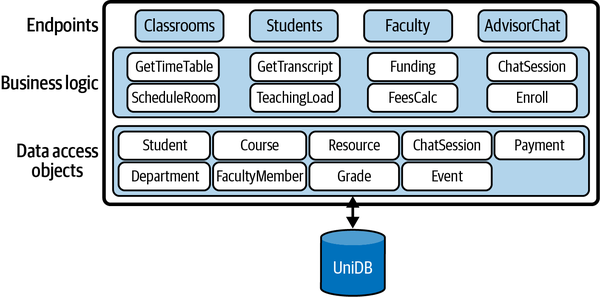
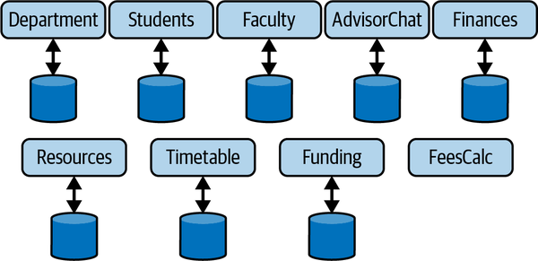
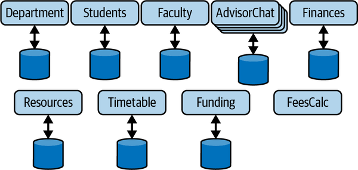
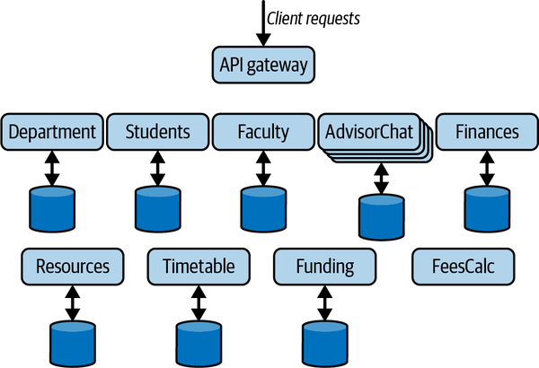
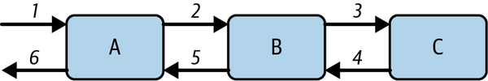
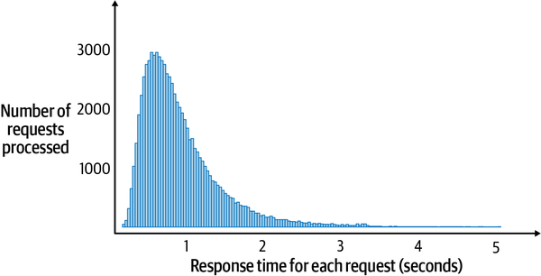
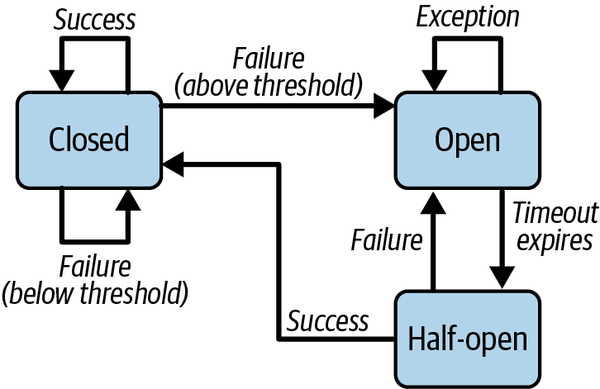

# Chapter 9. Microservices

You don’t often see strong links between a mainstream software architectural style and an Italian-inspired, globally popular cuisine. This is, however, the case with microservices and pizza. The roots of microservices can be traced back to around 2008 when the approach was pioneered at scale by the internet giants we all know. At Amazon, the [“two-pizza rule”](https://oreil.ly/F2xjL) emerged as a governing principle of team size for a single system component, which subsequently became known as a microservice. What is the two-pizza rule? Very simply, every internal team should be small enough that it can be fed with two pizzas.

It is a misconception, however, that microservices are in some sense smaller than a service. The [defining characteristic of a microservice](https://oreil.ly/7e0Cj) is their scope, organized around a business capability. Put very simply, microservices are an approach to designing and deploying fine-grained, highly cohesive, and loosely coupled services that are composed to fulfill the system’s requirements. These fine-grained services, or microservices, are independently deployed and must communicate and coordinate when necessary to handle individual system requests. Hence, by their very nature, microservices architectures are distributed systems, and must deal with the various scalability, performance, and availability issues I have described in previous chapters.

Microservices are a popular, modern architectural style with plenty of engineering advantages in the right context. For example, small, agile teams with single microservice responsibilities can iterate and evolve features quickly, and deploy updated versions independently. Each microservice is a black box to the rest of the system and can choose an architecture and technology stack internally that best suits the team’s and application’s needs. Major new system functionalities can be built as microservices and composed into the application architecture with minimal impact on the rest of the system.

In this chapter, I’ll briefly describe microservices and explain their key characteristics. I’ll touch on the major engineering and architectural principles behind a microservices approach and provide pointers to excellent sources of general design knowledge. The main focus of the chapter, given the topic of this book, is the inherently distributed nature of microservices and how they behave at scale. I will describe some problems that emerge as coupled microservices are placed under load and solutions that you need to design into your architecture to build scalable, resilient applications.

# The Movement to Microservices

In many ways, microservice-based architectures have benefited from a confluence of software engineering and technology innovation that has emerged over the last decade. Small, agile teams, continuous development and integration practices, and deployment technologies have collectively provided fertile ground for the fine-grained architectural approach embodied by microservices. Microservice-based architectures are a catalyst for exploiting these advances to deploy flexible, extensible, and scalable systems. Let’s examine their origins and some features.

## Monolithic Applications

Since the dawn of IT systems, the monolithic architectural style has dominated enterprise applications. Essentially, this style decomposes an application into multiple logical modules or services, which are built and deployed as a single application. These services offer endpoints that can be called by external clients. Endpoints provide security and input validation and then delegate the requests to shared business logic, which in turn will access a persistent store through a data access objects (DAO) layer. This design is depicted in [Figure 9-1](#example_monolithic_application) for an example university management system that has capabilities to handle student course assignments and timetables, room scheduling, fee payments, and faculty and advisor interactions

This architecture encourages the creation of reusable business logic and DAOs that can be shared across service implementations. DAOs are mapped to database entities, and all service implementations share a single database.

Popular platforms such as IBM WebSphere and Microsoft .NET enable all the services to be built and deployed as a single executable package. This is where the term *monolith*—the complete application—originates. APIs, business logic, data access, and so forth are all wrapped up in a single deployment artifact.



###### Figure 9-1. Example monolithic application

Monolithic applications, unsurprisingly given the longevity of the approach, have many advantages. The architectural approach is well understood and provides a solid foundation for new applications. It enjoys extensive automation in development frameworks in many languages. Testing is straightforward, as is deployment as there is just a single application package to manage. System and error monitoring is also simplified as the application runs on one (probably quite powerful) server.

Scaling up is the simplest way to improve responsiveness and capacity for monolithic applications. Scaling out is also possible. Two or more copies of the monolith can be provisioned, and a load balancer utilized to distribute requests. This works for both stateful and stateless services, as long as the load balancer supports session affinity for stateful designs.

Monoliths can start to become problematic as system features and request volumes grow. This problem has two fundamental elements:

Code base complexity

As the size of the application and engineering team grows, adding new features, testing, and refactoring become progressively more difficult. Technical debt inevitably builds, and without significant investments in engineering, the code becomes more and more fragile. Engineering becomes harder without continual and concerted refactoring efforts to maintain architectural integrity and code quality. Development cadence increases for rolling out new features.

Scaling out

You can scale out by replicating the application on multiple nodes to add capacity. But this means replicating the *entire* application (the monolith) every time. In the university management system, assume a sudden spike in the use of the `AdvisorChat` service occurs as support for mobile devices is released to the students. You can deploy new replicas to handle the chat message volume, but the new nodes need to be powerful and numerous enough to run the complete application. You can’t easily just pull out the chat service functionality and scale it independently.

This is where microservices enter the scene. They provide solutions to engineering and scale out challenges that monoliths almost inevitably face as the volume of requests grows rapidly.

## Breaking Up the Monolith

A microservice architecture decomposes the application functionality into multiple independent services that communicate and coordinate when necessary. [Figure 9-2](#a_microservice_architecture_example) shows how the university management system from [Figure 9-1](#example_monolithic_application) might be designed using microservices. Each microservice is totally self-contained, encapsulating its own data storage where needed, and offers an API for communications.



###### Figure 9-2. A microservice architecture example

Microservices offer the following advantages as systems grow in code size and request load:

Code base

Following the two-pizza rule, an individual service should not be more complex than a small team size can build, evolve, and manage. As a microservice is a black box, the team has full autonomy to choose their own development stack and data management platform.[1](ch09.md) Given the narrower, highly cohesive scope of functionality that a well-designed microservice supports, this should result in lower code complexity and higher development cadence for new features. In addition, revisions of the microservice can be independently deployed as needed. If the API the microservice supports is stable, the change is transparent to dependent services.

Scale out

Individual microservices can be scaled out to meet request volume and latency requirements. For example, to satisfy the ever-demanding and chatting students, the `AdvisorChat` microservice can be replicated as needed behind its own load balancer to provide low response times. This is depicted in [Figure 9-3](#independently_scaling_a_microservice). Other services that experience light loads can simply run on a single node or be replicated at low cost to eliminate single points of failure and enhance availability.



###### Figure 9-3. Independently scaling a microservice

One of the key design decisions when moving to a microservices architecture is how to decompose the system functionality into individual services. [Domain-driven design (DDD)](https://oreil.ly/cS9GJ) provides a suitable method for identifying microservices, as the necessarily self-contained nature of microservices maps well to the notion of bounded contexts in DDD. These topics are beyond the scope of this chapter but are essential knowledge for architects of microservice-based applications.

There is always a balancing act though. Microservices are by their very nature distributed. Often, the purity of the domain model needs to be analyzed and adjusted to meet the reality of the costs of distributed communications and the complexity of system management and monitoring. You need to factor in request loads and the interactions needed to serve these requests, so that excessive latencies aren’t incurred by multiple interactions between microservices.

For example, `Faculty` and `Funding` are excellent candidates for microservices. However, if satisfying requests such as “get funding by faculty” or “find funding opportunities for faculty” incur excessive communications, performance and reliability could be impacted. Merging microservices may be a sensible option in such circumstances. Another common approach is to duplicate data across coupled microservices. This enables a service to access the data it needs locally, simplifying the design and reducing data access response times.

Duplicate data is, of course, a trade-off. It takes additional storage capacity and development effort to ensure all duplicated data converges to a consistent state. Duplicate data updates can be initiated immediately when data changes to attempt to minimize the time interval that the duplicates are inconsistent. Alternatively, if the business context allows, periodic duplication (e.g., hourly or daily) can operate, perhaps executed by a scheduled task that is invoked when request loads are low. As the demands on performance and scalability on an application grow, the cost and complexity of duplicate data is typically small compared to the problems that a major refactoring of the system would present.

## Deploying Microservices

To support frequent updates and benefit from the agility afforded by small teams, you need to be able to deploy new microservice versions easily and quickly. This is where we start to infringe on the world of continuous deployment and DevOps, which is way beyond the scope of this book (see [“Summary and Further Reading”](#summary_and_further_reading-id000057) for reading recommendations). Still, deployment options impinge on the ease of scalability for a microservice. I’ll just describe one common approach for deploying microservices in this section.

Serverless processing platforms, as I described in [Chapter 8](ch08.md), are an attractive microservices deployment approach. A microservice can be built to expose its API on the serverless platform of your choice. The serverless option has three advantages:

Deployment is simple

Just upload the new executable package for your microservice to the endpoint you have configured for your function.

Pay by usage

If your service has periods of low-volume requests, your costs are low, even zero.

Ease of scaling

The platform you choose handles scaling of your function. You control precisely how this works through configuration parameters, but the serverless option takes the heavy lifting out of scalability.

When you deploy all your microservices on a serverless platform, you expose multiple endpoints that clients need to invoke. This introduces complexity as clients need to be able to discover the location (host IP address and port) of each microservice. What if you decide to refactor your microservices by perhaps combining two in or order to eliminate network calls? Or move an API implementation from one microservice to another? Or even change the endpoint (IP address and port) of an API?

Exposing backend changes directly to clients is never a good idea. The Gang of Four book taught us this many years ago with the façade pattern in object-oriented systems.[2](ch09.md) In microservices, you can exploit an analogous approach using the [API gateway pattern](https://oreil.ly/7aJ7h). An API gateway essentially acts as a single entry point for all client requests, as shown in [Figure 9-4](#the_api_gateway_pattern). It insulates clients from the underlying architecture of the microservices that implement the application functionality. Now, if you refactor your underlying APIs or even choose to deploy on a radically different platform such as a private cloud, clients are oblivious to changes.



###### Figure 9-4. The API gateway pattern

There are multiple API gateway implementations you can exploit in your systems. These range from powerful open source solutions such as the [NGINX Plus](https://oreil.ly/8JXlJ) and [Kong](https://oreil.ly/2fcNb) API gateways to cloud vendor–specific managed offerings. The general range of functions, listed as follows, is similar:

- Proxy incoming client API requests with low millisecond latencies to backend microservices that implement the API. Mapping between client-facing APIs, handled by the API gateway, and backend microservice APIs is performed through admin tools or configuration files. Capabilities and performance vary across products, sometimes quite significantly, especially under high request loads.[3](ch09.md)
- Provide authentication and authorization for requests.
- Define rules for throttling each API. Setting the maximum number of requests a microservice can handle per second can be used to ensure backend processing is not overwhelmed.
- Support a cache for API results so that requests can be handled without invoking backend services.
- Integrate with monitoring tools to support analysis of API usage, latencies, and error metrics.

Under heavy request spikes, there is, of course, the danger of the API gateway becoming a bottleneck. How this is handled by your API gateway is product-specific. For example, AWS API Gateway has a 10K requests per second limit, with an additional burst quota of up to 5K requests/second.[4](ch09.md) The Kong API gateway is stateless, hence it is possible to deploy multiple instances and distribute the requests using a load balancer.

## Principles of Microservices

There’s considerably more to the art and science of designing, deploying, and evolving microservices-based architectures. I’ve just scratched the surface in the discussions so far in this chapter. Before I move on to address some of the scalability and availability challenges of microservices that must be addressed due to their distributed nature, it’s worth briefly thinking about the core principles of microservices as defined by Sam Newman in his excellent *Building Microservices* book (O’Reilly, 2015). I’ve listed them here with some additional commentary alluding to performance and scalability aspects.

Microservices should be:

Modeled around a business domain

The notion of bounded contexts provides a starting point for the scope of a microservice. Business domain boundaries may need rethinking in the context of coupling between microservices and the performance overheads it may introduce.

Highly observable

Monitoring of each service is essential to ensure they are behaving as expected, processing requests with low latencies, and error conditions are logged. In distributed systems, observability is an essential characteristic for effective operations.

Hide implementation details

Microservices are black boxes. Their API is a contract which they are guaranteed to support, but how this is carried out is not exposed externally. This gives freedom for each team to choose development stacks that can be optimized to the requirements of the microservice.

Decentralize all the things

One thing to decentralize is the processing of client requests that require multiple calls to downstream microservices. These are often called workflows. There are two basic approaches to achieving this, namely orchestration and choreography. [“Workflows”](#workflows) describes these topics.

Isolate failure

The failure of one microservice should not propagate to others and bring down the application. The system should continue to operate, although probably with some degraded service quality. Much of the rest of this chapter addresses this principle specifically.

Deploy independently

Every microservice should be independently deployable, to enable teams to roll out enhancements and modifications without any dependency on the progress of other teams.

Culture of automation

Development and DevOps tooling and practices are absolutely essential to gain the benefits of microservices. Automation makes it faster and more robust to make changes to the deployed system frequently. This frequency may be, for example, hourly or daily, depending on the system and the pace of development.

##### Workflows

Orchestration and choreography are commonly used for implementing use cases that require access to more than one microservice (e.g., in [Figure 9-4](#the_api_gateway_pattern)). A faculty member may wish to get a list of the classes they are teaching in a semester and the resources available for audio-visual within each classroom they have been allocated to. Implementing this use case requires access to the *Faculty*, *Timetable*, and *Resources* microservices.

There are two basic approaches to implement this workflow:

Peer-to-peer choreography

The required microservices communicate directly to satisfy the request. This shares the responsibility and knowledge of processing the workflow across each autonomous microservice. Communications may be synchronous or utilize an asynchronous, typically publish–subscribe approach.

Centralized orchestration

The logic to implement the workflow is embedded in a single component, often a dedicated microservice. This communicates with the domain services and sends the results back to the user.

There are trade-offs with both approaches. For example, orchestration makes it simpler to monitor the progress of a request as the logic is in one place. It may, however, create bottlenecks if the request load is high, and you must be careful to ensure the orchestrator doesn’t become a single point of failure.

A good discussion of these trade-offs can be found on [page 256 of *The Fundamentals of Software Architecture* book](https://oreil.ly/82uJo) I recommended in [Chapter 1](ch01.md). An excellent example of these trade-offs and solutions at scale is Netflix’s [Conductor](https://oreil.ly/D2Px6) orchestration engine.

# Resilience in Microservices

One of the frequently unstated truisms of distributed systems is that, for the vast amount of the time, systems operate without catastrophic errors. Networks are fast and reliable, machines and disks rarely crash, the foundational platforms you use for hosting microservices and messaging and databases are incredibly robust. This is especially true when systems are handling low request volumes, and have plenty of CPU, memory, and network bandwidth to keep their users extremely happy. Of course, your system still has to be prepared for intermittent failures that will occur, usually at the most inconvenient of times!

Things start to get really fun when request frequencies and volumes increase. Threads contend for processing time, memory becomes scarce, network connections become saturated, and latencies increase. This is when individual microservices start behaving unpredictably. Then, all bets are off.

To ensure your systems don’t fail suddenly as loads increase, there are a number of necessary precautions you need to take. I’ll explain the nature of the problems that you need to be aware of, and the solutions available, in the following subsections.

## Cascading Failures

[Figure 9-5](#microservices_with_dependencies) depicts a simple microservices architecture. A request arrives at microservice A. To process this request, it calls microservice B, which in turn calls microservice C. Once microservice C responds, B can return the results to A, which in turn can respond to the client. The numbers in the figure represent this sequence for an individual request.



###### Figure 9-5. Microservices with dependencies

Now I’ll assume that the request load on microservice A grows. This means A will exert more load on B, which will in turn exert more load on C. For some reason, such as lack of processing capacity or database contention, this causes the response times from microservice C to increase, which creates back pressure on B and causes it to respond more slowly to A.

If the increased load is sustained for a period of time, threads in the microservices A and B are blocked waiting for requests to be handled by downstream processing. Let’s assume microservice C becomes overloaded—perhaps the request pattern causes database deadlocks on frequently updated keys, or the network connection to C’s database becomes unstable. In an overloaded state, response times increase and B’s threads become blocked waiting for results. Remember from [Chapter 2](ch02.md), application servers have fixed-size thread pools. Once all threads in B are occupied making calls to C, if requests continue to arrive at high volumes, they will be queued until a thread is available. Response times from B to A start to grow, and in an instant all of A’s threads will be blocked waiting for B to respond.

At this stage, things will likely start to break. TCP requests will time out and throw an error to the caller. New connections will be refused as the dependent service is overloaded. Microservices may fail if memory is exhausted, or the increased load uncovers subtle bugs that weren’t revealed during testing. These errors ripple, or cascade back through the call chain. In the example in [Figure 9-5](#microservices_with_dependencies), the slow responses from C can cause requests to A and B to fail.

The insidious nature of cascading failures is that they are triggered by slow response times of dependent services. If a downstream service simply fails or is unavailable due to a system crash or transient network failure, the caller gets an error immediately and can respond accordingly. This is not the case with services that gradually slow down. Requests return results, just with longer response times. If the overwhelmed component continues to be bombarded with requests, it has no time to recover and response times continue to grow.

This situation is often exacerbated by clients that, upon request failure, immediately retry the operation, as illustrated in the following code snippet:

```
int retries = RETRY_COUNT;
while (retries > 0) {
   try {
       callDependentService();
       return true;
    } catch (RemoteCallException ex) {
        logError(e);
        retries = retries – 1;
  }
  return false;
```

Immediate retries simply maintain the load on the overwhelmed microservice, with very predictable results, namely another exception. Overload situations don’t disappear in a few milliseconds. In fact, they are likely to persist for many seconds or even minutes. Retries just keep the pressure on.

The retry example can be improved by techniques such as [exponential backoff](https://oreil.ly/CzCdE), namely inserting a growing delay between retries. This potentially can help relieve the downstream overload, but the delay becomes part of the latency experienced by the caller, which often doesn’t help matters.

Cascading failures are common in distributed systems. Whether caused by overwhelmed services, or error conditions such as bugs or network problems, there are explicit steps you need to take to guard against them.

### Fail fast pattern

The core problem with slow services is that they utilize system resources for requests for extended periods. A requesting thread is stalled until it receives a response. For example, let’s assume we have an API that normally responds within 50 ms. This means each thread can process around 20 requests per second. If one request is stalled for 3 seconds due to an outlier response time, then that’s (3 × 20) – 1 = 59 requests that could have been processed.

Even with the best designed APIs for a microservice, there will be outlier responses. Real workloads exhibit a long-tail response time profile, as illustrated in [Figure 9-6](#typical_long-tail_response_time). A small number of requests takes significantly longer—sometimes 20 or a 100 times more—than the average response time. This can be for a number of reasons. Garbage collection in the server, database contention, excessive context switching, system page faults, and dropped network requests are all common causes for this long tail.



###### Figure 9-6. Typical long-tail response time

As you can observe from this graph, the vast majority of requests have low response times, which is great. However, a significant number are over one second and a small number much, much slower—over 4 seconds, in fact.

We can quantify the percentage of slow requests using percentiles. Percentiles give a far richer and more accurate view of response times from a microservice than averages. For example, if we measure response times and calculate percentiles under expected loads, we may get the following:

- P50: 200 milliseconds
- P95: 1,200 milliseconds
- P99: 3,000 milliseconds

This means that 50% of requests are served in less than 200 milliseconds, 95% are served within 1,200 milliseconds, and 99% percent within 3,000 milliseconds. These numbers in general look pretty good. But let’s assume our API handles 200 million requests per day (approximately 2,314 requests per second). This means 1%, or 2 million requests, take greater than 3 seconds, which is 15 times slower than the 50th percentile (the median). And some requests will be significantly longer than 3 seconds given the long-tail response time pattern we see in [Figure 9-6](#typical_long-tail_response_time).

Long response times are never good things, technically or for client engagement. In fact, many studies have shown how longer response times have negative effects on system usage. For example, the [BBC reported](https://oreil.ly/A6atg) that it sees 10% less users for every additional second a page takes to load. Fast, stable response times are great for business, and one way to achieve this is to reduce the long tail. This also has the effect of decreasing the overall average response time for a service, as the average is skewed heavily by a small number of slow responses.

A common way to eliminate long response times is to fail fast. There are [two main ways](https://oreil.ly/qwUcg) to achieve this:

- When a request takes longer than some predefined time limit, instead of waiting for it to complete, the client returns an error to its caller. This releases the thread and other resources associated with the request.
- Enable throttling on a server. If the request load exceeds some threshold, immediately fail the request with an HTTP 503 error. This indicates to the client that the service is unavailable.

Exactly how these strategies are put into action is extremely technology-specific. For example, a client making an HTTP request can configure the [TCP read timeout](https://oreil.ly/CGEg2). This specifies how long a client should wait for to receive a response from the server. In our example in [Figure 9-6](#typical_long-tail_response_time), we could configure the read timeout to the P99 value, namely 3 seconds or a little higher. Then, if a client hasn’t received any response within the read timeout period, an exception is raised. In Java, it’s a `java.net.SocketTimeoutException`.

Throttling, or rate limiting, is a feature available in many load balancers and API gateway technologies. When some defined limits are reached, the load balancer will simply reject requests, protecting the resources it controls from overload. This enables the service to process requests with consistent low response times. It’s also possible to implement some lightweight monitoring logic inside your microservice to implement throttling. You might keep a count of in-flight requests, and if the count exceeds a defined maximum, new requests are rejected. A slightly more sophisticated approach could track a metric like the average response time, or P99s, using a sliding window algorithm. If the metric of interest is increasing, or exceeds some defined threshold, again requests can be immediately rejected.

There’s one more thing to consider when failing requests. A principle of microservices is fault isolation. This means the failure of part of the system doesn’t make the whole application unavailable. Requests can continue to be processed, but with some degraded capabilities.

A key thing to consider is whether it is necessary to propagate the error back to the original caller. Or can some canned, default response be sent that masks the fact that the request was not correctly processed? For example, when you sign into a streaming video service, the first page will show your watchlist so you can return to your favorite shows as quickly as possible. If, however, the request to retrieve your watchlist fails, or takes too long, a default collection of popular “shows you might like” can be returned. The application is still available.

This approach works really well for transient, ephemeral failures. By the time the request is issued again by the users, the problem will probably be resolved. And there’s a good chance the user won’t even have noticed. Some transient errors, however, don’t resolve in a second or two. That’s when you need a more robust approach.

### Circuit breaker pattern

If a microservice starts to throw errors due to an overload situation, or a flaky network, it makes little sense to keep trying to send requests to the API. Rather than failing fast, which still incurs a timeout delay, it is better to back off immediately from sending further requests and allow some time for the error situation to resolve. This can be achieved using the circuit breaker pattern, which protects remote endpoints from being overwhelmed when some error conditions occur.

Just like in electrical systems, clients can use a circuit breaker to protect a server from overload. The circuit breaker is configured to monitor some condition, such as error response rates from an endpoint, or the number of requests sent per second. If the configured threshold is reached—for example, 25% of requests are throwing errors—the circuit breaker is triggered. This moves the circuit breaker into an `OPEN` state, in which all calls return with an error immediately, and no attempt is made to call the unstable or unavailable endpoint.

The circuit breaker then rejects all calls until some suitably configured timeout period expires. At that stage, the circuit breaker moves to the `HALF_OPEN` state. Now, the circuit breaker allows client calls to be issued to the protected endpoint. If the requests still fail, the timeout period is reset and the circuit breaker stays open. However, if the request succeeds, the circuit breaker transitions to the `CLOSED` state and requests start to flow to the target endpoint. This scheme is illustrated in [Figure 9-7](#circuit_breaker_pattern).



###### Figure 9-7. Circuit breaker pattern

Circuit breakers are essential to reduce the resources utilized for operations that are almost certain to fail. The client fails fast, and the `OPEN` circuit breaker relieves load on an overwhelmed server by ensuring requests do not reach it. For overloaded services, this creates an opportunity to stabilize. When the service (hopefully) recovers, the circuit breaker resets automatically and normal operations resume.

There are numerous libraries available for incorporating circuit breakers into your applications. One popular library for Python, [CircuitBreaker](https://oreil.ly/mZJiw), is illustrated in the following code example. You simply decorate the external call you want to protect with `@circuit`, and specify the value of the parameters you wish to set to customize the circuit breaker behavior. In this example, we trigger the circuit breaker after 20 successive failures are detected, and the circuit breaker stays open for 5 seconds until it transitions to the half open state:

```
from circuitbreaker import circuit

@circuit(failure_threshold=20,expected_exception=RequestException,
         recovery_timeout=5)
def api_call():
```

Circuit breakers are highly effective for fault isolation. They protect clients from faulty operations of dependent services and allow services to recover. In read-heavy scenarios, requests can often return default or cached results when the circuit breaker is open. This effectively hides the fault from clients and doesn’t degrade service throughput and response times. Ensure you tie circuit breaker triggers into your monitoring and logging infrastructure so that the cause of faults can be diagnosed.

## Bulkhead Pattern

The term bulkhead is inspired by large shipbuilding practices. Internally the ship is divided into several physical partitions, ensuring if a leak occurs in one part of the boat’s hull, only a single partition is flooded and the boat, rather importantly, continues to float. Basically, bulkheads are a damage limitation strategy.

Imagine a microservice with two endpoints. One enables clients to request the status of their current orders placed through the service. The other enables clients to create new orders for products. In normal operations, the majority of requests are status requests, entailing a fast cache or database read. Occasionally, when a popular new product is released, a flood of new order requests can arrive simultaneously. These are much more heavyweight, requiring database inserts and writes to queues.

Requests for these two endpoints share a common thread pool in the application server platform they are deployed on in the microservice. When a new order surge arrives, all threads in the thread pool become occupied by new order creations and status requests are essentially starved from gaining resources. This leads to unacceptable response times and potentially client calls seeing exceptions if a fail fast approach is used.

Bulkheads help us solve this problem. We can reserve a number of threads in a microservice to handle specific requests. In our example, we could specify that the new order request has a maximum of 150 threads of the shared thread pool available for its exclusive use. This ensures that when a new order request burst occurs, we can still handle status requests with acceptable response times because there is additional capacity in the thread pool.

The Java [Resilience4j library](https://oreil.ly/UeMAA) provides an implementation of the bulkhead pattern using the functional programming features of Java 8 onward. The bulkhead pattern segregates remote resource calls in their own thread pools so that a single overloaded or failing service does not consume all threads available in the application server.

The following example code shows how to create a bulkhead that allows a maximum of 150 concurrent requests. If 150 threads are in use for the service that you wish to restrict with the bulkhead, requests will wait a maximum of 1 second before the default `BulkheadFullException` exception is thrown:

```
// configure the bulkhead
BulkheadConfig config = BulkheadConfig.custom()
            .maxConcurrentCalls(150)
            .maxWaitDuration(Duration.ofSeconds(1))
            .build();
BulkheadRegistry registry = BulkheadRegistry.of(config);
// create the bulkhead
Bulkhead newOrderBulkhead = registry.bulkhead("newOrder");
```

Next, you specify that the `OrderService.newOrder()` method should be decorated with the bulkhead. This ensures that a maximum of 150 invocations of this method can occur concurrently:

```
// decorate the OrderService.newOrder method with the bulkhead 
Supplier<OrderOutcome> orderSupplier = () -> 
    OrderService.newOrder(OrderInfo);
// decorate NewOrder with the bulkhead configuration
Supplier<OrderOutcome> bukheadOrderSupplier = 
    bulkhead.decorateSupplier(bulkhead, orderSupplier);
```

Spring-boot simplifies the creation of a bulkhead using its dependency injection capabilities. You can specify the configuration of the bulkhead in the `application.yml` file, shown as follows:

```
server:
  tomcat:
    threads:
      max: 200
resilience4j.bulkhead:
  instances:
    OrderService:
      maxConcurrentCalls: 150
      maxWaitDuration: 1000ms
```

In the code, you simply use the `@Bulkhead` decorator to specify the method that should be subject to the bulkhead behavior. In the following example, a fallback method is also specified. This will be invoked when the bulkhead capacity is reached, and requests wait for more than 1 second:

```
@Bulkhead(name = "OrderService", fallbackMethod = “newOrderBusy”)
   public OrderOutcome newOrder(OrderInfo inf){// details omitted}
```

##### In the Wild: Scaling Microservices

Amazon and Netflix were among the early pioneers, around 2009, of microservice-based architectures at scale. Since then, much has been learned, and of course the scale of the systems built on microservices has grown incredibly. To deal with modern systems scale, Uber has evolved its microservice architecture to be based around collections of related services, known as domains, as described in [this excellent technical blog post](https://oreil.ly/XXW1J).

Sam Newton’s book chapter [“Microservices at Scale”](https://oreil.ly/sBR7Z) includes a case study that illustrates the importance of the fail fast, circuit breaker, and bulkhead patterns. It is a forensic description of how cascading failures occur when slow service responses are encountered.

Finally, it should be emphasized that sometimes microservices are not always the right approach. A [case study](https://oreil.ly/rKMc1) describing how the benefits of microservices added unnecessary complexity at Istio is well worth a read.

# Summary and Further Reading

Embracing microservices requires you to adopt new design and development practices to create a collection of fine-grained, cohesive components to satisfy your application requirements. In addition, you also need to confront the new opportunities and complexities of distributed systems. If you adopt microservices, you simply have no choice.

This chapter has given a brief overview of the motivations for microservices and the advantages they can afford. In the context of this book, the ability to independently scale individual microservices to match increasing demand is often invaluable.

Microservices are frequently coupled, needing to communicate to satisfy a single request. This makes them susceptible to cascading failures. These occur when a microservice starts to return requests with increasing response times—caused, for example, by an overload in requests or transient network errors. Slow response times cause back pressure in the calling services, and eventually a failure in one can cause all dependent services to crash.

Patterns for avoiding cascading failures include failing fast using timeouts and circuit breakers. These essentially give the stressed microservice time to recover and stop cascading failures from occurring. The bulkhead pattern is similar in intent. It can be used to ensure requests to one API in a microservice don’t utilize all available resources during a request burst. By setting a maximum limit on the number of threads in the application server a particular API can demand, processing capacity for other APIs can be guaranteed.

Microservices are a major topic in software architecture. For a complete and comprehensive coverage of the topic, there is no better source than Sam Newman’s *Building Microservices*, 2nd Edition (O’Reilly, 2021). This will take you on an in-depth journey following the design, development, and deployment of microservices-based systems.

Microservices require extensive automation of the development process. The 2011 classic *Continuous Delivery: Reliable Software Releases through Build, Test, and Deployment Automation* by Jez Humble and David Farley (Addison-Wesley Professional) is an ideal place to start for a comprehensive introduction to the topic. Another excellent source of information is *DevOps: A Software Architect’s Perspective* by Len Bass, Ingo Weber, and Liming Zhu (Addison-Wesley Professional, 2015). The world of DevOps is a fast-moving and technologically rich domain, and your favorite search engine is the best place to find information on the various build, configuration, test, deployment, and monitoring platforms that comprise modern DevOps pipelines.

Next, [Part III](part03.md) of this book focuses on the topic of the storage layer. I’ll be describing the core principles and algorithms that determine how we can distribute data stores to achieve scalability, availability, and consistency. The theory will be complemented by examining how a number of widely used databases operate in distributed systems, and the various approaches and architectural trade-offs they take.

[1](ch09.md) Standardization of the development stack across microservices does, of course, have advantages, as Susan Fowler explains in *Production-Ready Microservices* (O’Reilly, 2016).

[2](ch09.md) Erich Gamma et al., *Design Patterns: Elements of Reusable Object-Oriented Software* (Addison Wesley Professional, 1994).

[3](ch09.md) [An excellent NGINX study](https://oreil.ly/sBNNM) benchmarks the performance of API gateways. It is performed by one of the vendors, so a hint of caution in interpreting results is required. Studies like this are valuable in assessing potential solutions.

[4](ch09.md) This limit can be [increased](https://oreil.ly/GzaL7).
