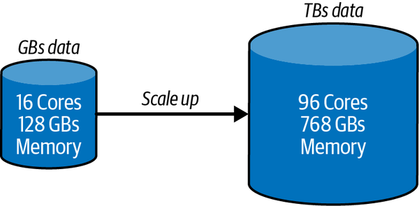
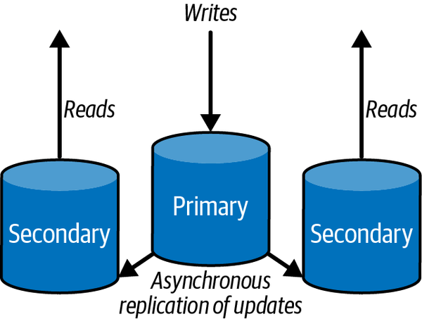
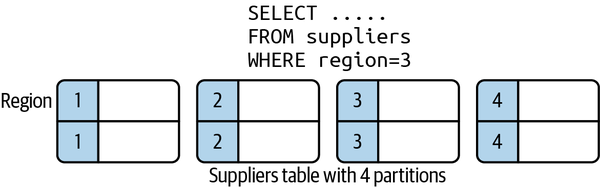
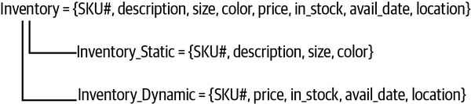
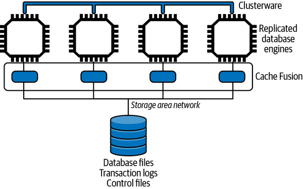
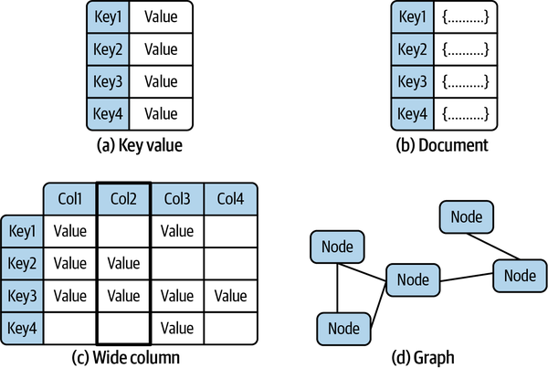
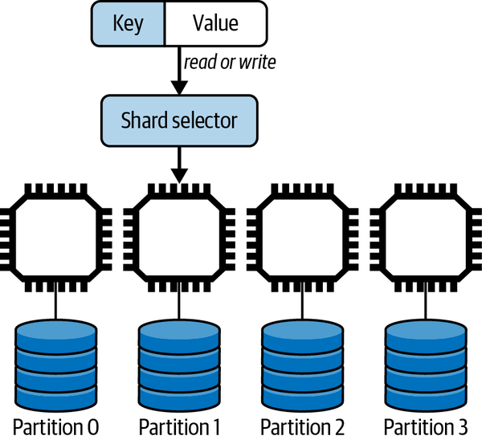
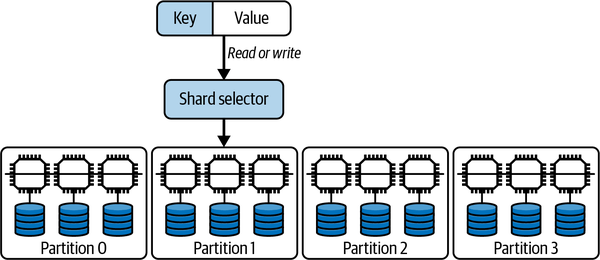

# Chapter 10. Scalable Database Fundamentals

In the early 2000s, the world of databases was a comparatively calm and straightforward place. There were a few exceptions, but the vast majority of applications were built on relational database technologies. Systems leveraged one of a handful of relational databases from the major vendors, and these still dominate the top ten spots in [database market share ranking today](https://oreil.ly/sa8qD).

If you could jump into a time machine and look at a similar ranking from 2001, you’d probably find 7 of the current top 10—all relational databases—in similar places to the ones they occupy in 2022. But if you examine the top 20 in 2022, at least 10 of the current database engines listed did not exist 20 years ago, and most of these are not relational. The market has expanded and diversified.

This chapter is the first of four in [Part III](part03.md) that focuses on the data—or persistent storage—tier. I’ll cover the ever-changing and evolving scalable database landscape, including distributed nonrelational and relational approaches, and the fundamental approaches that underpin these technologies.

In this chapter, I’ll explain how traditional relational databases have evolved to adopt distributed architectures to address scalability. I’ll then introduce some of the main characteristics of the new generation of databases that have emerged to natively support distribution. Finally, I’ll describe the architectures utilized for distributing data across multiple database nodes and the trade-offs inherent with these approaches regardless of the data models they support.

# Distributed Databases

The data systems we build today dwarf those of 20 years ago, when relational databases ruled the earth. This growth in data set size and complexity has been driven by internet-scale applications. These create and manage vast quantities of heterogeneous data for literally tens of millions of users. This includes, for example, user profiles, user preferences, behavioral data, images and videos, sales data, advertising, sensor readings, monitoring data, and much more. Many data sets are simply far too big to fit on a single machine.

This has necessitated the evolution of database engines to manage massive collections of distributed data. New generations of relational and nonrelational database platforms have emerged, with a wide range of competing capabilities aimed at satisfying different use cases and scalability requirements. Simultaneously, the development of low-cost, powerful hardware has made it possible to cost-effectively distribute data across literally hundreds or even thousands of nodes and disks. This enhances both scalability and, by replicating data, availability.

Another major driver of database engine innovation has been the changing nature of the application requirements that populate the internet today. The inherent strengths of relational databases, namely transactions and consistency, come at a performance cost that is not always justified in sites like Twitter and Facebook. These don’t have requirements for every user to always see the same version of, for example, my tweets or timeline updates. Who cares if the latest photo of my delicious dinner is seen immediately by some of my followers and friends, while others have to wait a few seconds to admire the artful dish I’m consuming?

With tens of thousands to millions of users, it is possible to relax the various data constraints that relational databases support and attain enhanced performance and scalability. This enables the creation of new, nonrelational data models and natively distributed database engines, designed to support the variety of use cases for today’s applications. There are trade-offs, of course. These manifest themselves in the range of features a database supports and the complexity of its programming model.

# Scaling Relational Databases

Databases that support the relational model and SQL query language represent some of the most mature, stable, and powerful software platforms that exist today. You’ll find relational databases lurking behind systems in every type of application domain you can imagine. They are incredibly complex and amazingly successful technologies.

Relational database technology was designed and matured when data sets were relatively small by today’s standards, and the database could run on a single machine. As data sets have grown, approaches to scale databases have emerged. I’ll briefly cover these with some examples in the following subsections.

## Scaling Up

Relational databases were designed to run on a single machine, which enables shared memory and disks to be exploited to store data and process queries. This makes it possible for database engines to be customized to run on machines with multiple CPUs, disks, and large shared memories. Database engines can exploit these resources to execute many thousands of queries in parallel to provide extremely high throughput.

[Figure 10-1](#example_relational_database_scale-up_sc) depicts the scale-up scenario. The database is migrated to new, more powerful (virtual) hardware. While there is database administration magic to perform the migration and tune the database configuration to effectively exploit the new resources, the application code should require no changes.

There are three main downsides to this approach:

Cost

Hardware costs tend to grow exponentially as the computational resources offered grow.

Availability

You still have a single database node, albeit a powerful one. If it becomes unavailable, your system is down. A multitude of high availability (HA) solutions exist that offer mechanisms to detect unavailability and failover to a backup copy of the database. Many HA solutions are database vendor dependent.

Growth

If your database continues to grow, another migration to more powerful hardware is inevitable.



###### Figure 10-1. Example of a relational database scale-up scenario

Scaling up is indeed attractive in many applications. Still, in high-volume applications, there are two common scenarios in which scaling up becomes problematic. First, the database grows to exceed the processing capability of a single node. Second, low latency database accesses are required to service clients spread around the globe. Traversing intercontinental networks just doesn’t cut it.

In both cases, distributing a database is necessary.

## Scaling Out: Read Replicas

A common first step to increasing a database’s processing capacity is to scale out using read replicas. You configure one or more nodes as read replicas of the main database. The main database node is known as the primary, and read replicas are known as secondaries. The secondaries maintain a copy of the main database. Writes are only possible to the primary, and all changes are then asynchronously replicated to secondaries. Secondaries may be physically located in different data centers or different continents to support global clients.

This architecture is shown in [Figure 10-2](#distribution_through_read_replication).



###### Figure 10-2. Distribution through read replication

This approach enhances scalability by directing all reads to the read replicas.[1](ch10.md) It is hence highly effective for applications that must support read-heavy workloads. Reads can be scaled by adding more secondaries, reducing the load on the primary. This enables it to more efficiently handle writes. In addition, if the primary becomes unavailable due to a transient failure, read requests directed to secondaries are not interrupted.

As there is a delay between when data is written to the primary and then successfully replicated to the secondaries, there is a chance that clients may read stale data from secondaries. Application must therefore be aware of this possibility. In normal operations, the time between updating the primary and the secondaries should be small, for example, a few milliseconds. The smaller this time window, then the less chance there is of a stale read.

Read replication and primary/secondary–based database architectures are topics I’ll return to in much more detail in this and the following chapters.

## Scale Out: Partitioning Data

Splitting up, or partitioning data in a relational database, is a technique for distributing the database over multiple independent disk partitions and database engines. Precisely how partitioning is supported is highly product-specific. In general, there are two strategies: horizontal partitioning and vertical partitioning.

Horizontal partitioning splits a logical table into multiple physical partitions. Individual rows are allocated to a partition based on some partitioning strategy. Common partitioning strategies are to allocate rows to partitions based on some value in the row, or to use a hash function on the primary key. As shown in [Figure 10-3](#horizontal_database_partitioning), you can allocate a row to a partition based on the value of the *region* field in each row.



###### Figure 10-3. Horizontal database partitioning

Vertical partitioning, also known as row splitting, partitions a table by the columns in a row. Like normalization, vertical partitioning splits a row into one or more parts, but for the reasons of physical rather than conceptual optimization. A common strategy is to partition a row between static, read-only data and dynamic data. [Figure 10-4](#vertical_database_partitioning) shows a simple vertical partitioning for an inventory system that employs this scheme.



###### Figure 10-4. Vertical database partitioning

Relational database engines will have various levels of support for data partitioning. Some facilitate partitioning tables on disk. Others support partitioning data across nodes to scale horizontally in a distributed system.

Regardless, the very nature of relational schemas, with data split across multiple tables, makes it problematic to devise a general partitioning strategy for distribution. Horizontal partitions of data ideally distribute tables across multiple nodes. However, if a single request needs to access data from multiple nodes, or join data from distributed partitioned tables, a high level of network traffic and request coordination is required. This may not give the performance benefits you expect. These issues are briefly covered in the following sidebar.

##### Distributed Joins

SQL joins are complex to implement in distributed relational databases. The longevity of SQL engines means they are highly optimized for joins on a single database, as Franck Pachot describes in his excellent *The myth of NoSQL (vs. RDBMS) “joins don’t scale”* [blog post](https://oreil.ly/ZHszB). However, when relational tables are partitioned and spread around a large cluster of machines, distributed joins need to be carefully designed to minimize data movement and hence reduce latencies. Common strategies to achieve this are:

- Define reference tables that are relatively small, rarely change, and need to be joined against frequently. These reference tables can be copied to each node so that join operations can execute locally and in parallel on each partitioned node. The results of each partition’s join are then sent to the request coordinator to merge and return the result set.
- Use partition keys or secondary indexes in joins. Again, this allows joins to execute locally and in parallel on each partition using the indexed fields.
- Ensure one side of the join has a highly selective filter that reduces the set of rows to a small collection. This can then be sent to each partitioned node and the join proceeds as in a reference table join. This approach minimizes data movement.

Joins that involve large collections of data on each side of the join, don’t join on partition keys, and create large result sets require data shuffling and movement between nodes. This is required to move data to nodes to perform the partition, and subsequently gather and merge the results. These are the joins that are most difficult to scale.

The bottom line is that high throughput queries need to carefully design schema and choose appropriate join algorithms. A great example is Google’s Cloud Spanner distributed relational database. Spanner has multiple join algorithms and will choose algorithms automatically. But as the [documentation states](https://oreil.ly/uCdhx):

> Join operations can be expensive. This is because `JOIN`s can significantly increase the number of rows your query needs to scan, which results in slower queries. Google advises you to test with different join algorithms. Choosing the right join algorithm can improve latency, memory consumption, or both. For queries that are critical for your workload, you are advised to specify the most performant join method and join order in your SQL statements for more consistent performance.

## Example: Oracle RAC

Despite the inherent problems of partitioning relational models and the complexities of SQL queries at scale, vendors have worked in the last two decades to scale out relational databases. One notable example is Oracle’s [Real Applications Cluster (RAC) database](https://oreil.ly/i0p6D).

Oracle’s RAC database was released in 2001 to provide a distributed version of the Oracle database engine for high-volume, highly available systems. Essentially, Oracle makes it possible to deploy a cluster of up to 100 Oracle database engines that all access the same physical database.

To avoid the data partitioning problem, Oracle RAC is an example of a *shared-everything* database. The clustered database engines access a single, shared data store of the data files, logs, and configuration files that comprise an Oracle database. To the database client, the clustered deployment is transparent and appears as a single database engine.

The physical storage needs to be accessible to all nodes using a network-accessible storage solution known as Storage Area Network (SAN). SANs provide high-speed network access to the Oracle database. SANs also must provide hardware-level disk mirroring to create multiple copies of application and system data in order to survive disk failure. Under high load, the SAN can potentially become a bottleneck. High-end SANs are extremely specialized storage devices that are expensive beasts to acquire.

Two proprietary software components are required for Oracle RAC deployments, namely:

Clusterware

Supports communications and coordination between the clustered database engines. It manages, for example, cluster node membership, node failover, and high availability.

Cache Fusion

Enables the individual caches in each clustered database node to be effectively shared so that accesses to the persistent store are minimized.

An overview of a RAC system is shown in [Figure 10-5](#oracle_rac_overview).



###### Figure 10-5. Oracle RAC overview

Oracle RAC illustrates one architectural approach, namely shared everything, to scaling a relational database. It adds processing capacity and high availability to an Oracle deployment while requiring (in theory anyway) no application code changes. The database requires multiple proprietary Oracle software components and expensive redundant storage and interconnect hardware. Add Oracle license costs, and you don’t have a low-cost solution by any means.

Many Oracle customers have adopted this technology in the last 20 years. It’s mature and proven, but through the lens of today’s technology landscape, is based on an architecture that offers limited on-demand scalability at high costs. The alternative, namely a shared-nothing architecture that exploits the widely available low-cost commodity compute nodes and storage is the approach I’ll focus on going forward.

# The Movement to NoSQL

I’m not brave enough to try and construct a coherent narrative describing the forces that brought about the creation of a new generation of NoSQL database technologies.[2](ch10.md) My personal inclination is that this innovation was driven by a confluence of reasons that started to gather momentum in the early 2000s. In no particular order, some of these reasons were:

- The development of powerful, low-cost, commodity hardware, including multicore CPUs, faster, larger disks, and increased network speeds.
- The emergence of applications that dealt with unstructured data types and rapidly evolving business and data models. No longer was the “one size fits all” approach of relational adherents applicable to these new use cases.
- Increased need for scalability and availability for internet-facing applications.
- New opportunities to gather raw data and utilize this for new business insights and analytics.

Combined with the complexities of scaling relational databases for massive data sets that I’ve described in this chapter, the time was rife for a new database paradigm. Much of the database and distributed systems theory that was needed for such innovation was known, and this created fertile ground for the emergence of a whole collection of new database platforms.

The NoSQL database ecosystem that blossomed to address the evolving business and technological landscape of the early 2000s is by no means a homogeneous place. Several different approaches emerged and were implemented to some extent in various (mostly open source) databases. In general, however, the core characteristics of the NoSQL movement are:

- Simplified data models that can be easily evolved
- Proprietary query languages with limited or no support for joins
- Native support for horizontal scaling on low-cost, commodity hardware

I’ll look at each of these characteristics in turn in the following subsections. But before that, consider this: how do NoSQL databases survive without the capability to execute JOIN-like queries? The answer lies in how you model data with NoSQL.

### NoSQL JOIN

For illustration, and at the time of writing, CouchBase, Oracle NoSQL, and MongoDB support some form of joins, often with limitations. Oracle NoSQL joins are limited to hierarchically related tables only. MongoDB’s `$lookup` operation allows only one of the collections to be partitioned. Cassandra, DynamoDB, Riak, and Redis have no support for join operations. Graph databases like Neo4j and OrientDB use graph traversal algorithms and operations and hence have no need for joins.

Data model normalization, as encouraged by relational databases, provides a proven technique for modeling the *problem domain*. It creates models with a single entry for every data item, which can be referenced when needed. Updates just need to modify the canonical data reference, and the update is then available to all queries that reference the data. Due to the power of SQL and joins, you don’t have to think too hard about all the weird and wonderful ways the data will be accessed, both immediately and in the future. Your normalized model should (in theory) support any reasonable query for the application domain, and SQL is there to make it possible.

With NoSQL, the emphasis changes from problem domain modeling to modeling the *solution domain*. Solution domain modeling requires you to think about the common data access patterns the application must support, and to devise a data model that supports these accesses. For reading data, this means your data model must *prejoin* the data you need to service a request. Essentially, you produce what relational modelers deem a denormalized data model. You are trading off flexibility for efficiency.

Another way of thinking about solution domain modeling is to create a table per use case. As an example, skiers and snowboarders love to use their apps to list how many days they have visited their favorite mountains each season, how many lifts they rode, and what the weather was like. Using normalization, you’d probably produce something like the following as a logical data model and create tables that implement the model:

```
SnowSportPerson = {ssp_id, ssp_name, address, dob, ……….}
Resort = {resort_id, resort_name, location, …..}
Visit = {ssp_id, resort_id, date, numLifts, vertical, …..}
Weather = {resort_id, date, maxtemp, mintemp, wind, …}
```

Using SQL, it’s straightforward `JOIN` wizardry to generate a list of visits for a specific person that looks like the following:

- **Summary** Ian Gorton *Number of days:* 2

Date Resort Number of lifts Total vertical feet Max/min temperature (F) Wind speed (mph) Dec 2nd 2021 49 Degrees North 17 27,200 27/19 11 Dec 9th Silver Mt. 14 22,007 32/16 3

In NoSQL data modeling, you create a data model that has the results the query needs all together in a table. As shown in the following, a `VisitDay` has all the data items needed to generate each line in the list above. You just have to sum the number of `VisitDay` objects in the results set to calculate the number of days for a single person.[3](ch10.md)

```
VisitDay = {date, resort_name, ssp_id, ssp_name, numLifts, vertical, maxtemp, mintemp, wind}
```

The *SnowSportPerson*, *Resort*, and *Weather* tables would remain unchanged from your original model. This means we have duplicated data across your logical tables. In this example, most of the data in these tables is write-once and never changes (e.g., weather conditions for a particular day), so duplication just uses more disk space—not a major problem in modern systems.

Imagine, though, if a resort name changes. It does actually happen occasionally. This update would have to retrieve all *VisitDay* entries for that resort and update the resort name in every entry. In a very large database, this update might take a few tens of seconds or more, but as it’s a data maintenance operation, it can be run one dark night so that the new name appears magically to users the next day.

So there you have it. If you design your data model to efficiently process requests based on major use cases, complex operations like joins are unnecessary. Add to this that it becomes easier to partition and distribute data and the benefits start to stack up at scale. The trade-offs are that, typically, reads are faster and writes are slower. You also have to think carefully about how to implement updates to duplicate data and maintain data integrity.

##### Normalization

The design of relational databases encourages normalization. Normalization structures the business domain data to eliminate data redundancy and support data integrity. Normalization is a complex topic that is beyond the scope of this book. In a nutshell, the result of normalization is a data model that adheres to the rules described by one of six—yes, six—major normal forms.[4](ch10.md) Each normal form defines rules for how the domain data should be organized into a collection of tables and columns.

In reality, many databases I have seen over many years are designed to the rules defined by third normal form (3NF). I’ve heard rumors of fourth normal form databases, but suspect any higher normal forms have never left the environs of academia.

Essentially, 3NF data models are designed to simplify data management. Domain data is split among multiple relations such that every data item has a single entry that can be referenced by a unique identifier when required. Data in 3NF data models can be mechanically translated into a relational schema and instantiated by a relational database engine. Applications can then use the SQL query language to `INSERT`, `UPDATE`, `SELECT`, and `DELETE` data from the database.

It’s not uncommon, however, for relational data models to be demoralized to enhance query performance and application scalability. This insight is one of the key tenets that underpins the simpler data models that are supported by NoSQL databases.

## NoSQL Data Models

As illustrated in [Figure 10-6](#nosql_data_models), there are four main NoSQL data models, all of which are somewhat simpler than the relational model.



###### Figure 10-6. NoSQL data models

Fundamentally there are subtle overlaps between these models. But ignoring these subtleties, the four are:

Key-value

Key-value (KV) databases are basically a hash map. Every object in the database has a unique key that is used to retrieve data associated with that key. To the database, the data associated with the key is typically opaque to the database engine. It can be a string, JSON, image, or whatever else the business problem demands. Examples of KV databases include [Redis](https://redis.io) and [Oracle NoSQL](https://oreil.ly/pYcfy).

Document

A document database builds on the KV model, again with each document in the database requiring a unique key. The value associated with the key is not opaque to the database. Rather it is encoded, typically in JSON, making it possible to reference individual elements in a document in queries and for the database to build indexes on document fields. Documents are usually organized into logical collections analogous to relational tables, but there is no requirement for all documents in the collection to have the same format. Leading document databases are [MongoDB](https://www.mongodb.com) and [Couchbase](https://www.couchbase.com).

Wide column

A wide column database extends the KV model by organizing data associated with a key in named columns. It’s essentially a two-dimensional hash map, enabling columns within a row to be uniquely identified and sorted using the column name. Like a document database, each row in a collection can have different columns. Apache [Cassandra](https://oreil.ly/hgvAg) and Google [Bigtable](https://oreil.ly/rvR9n) are examples of wide column databases.

Graph

Graphs are well understood data structures for storing and querying highly connected data. Think of your friends on Facebook, or the routes flown by an airline between airports. Graphs treat relationships between database objects as first-class citizens, and hence enable a wide range of graph-based algorithms to be efficiently implemented. Conceptually closest to relational databases, prominent examples are [Neo4j](https://neo4j.com) and [Amazon Neptune](https://oreil.ly/n1sCR).

Regardless of data model, NoSQL databases are usually termed as *schemaless* databases. Unlike relational databases, the format of every object you write into the database does not have to be defined up front. This makes it possible to easily evolve data object formats as there is no need for every object in a logical collection to have the same format.

The inevitable trade-off for this flexibility is that it becomes the responsibility of the application to discover the structure of the data it reads. This requires data objects to be stored in the database along with metadata (basically field names) that make structure discovery possible. You’ll often see these two approaches called schema-on-write (defined schema) and schema-on-read (schemaless).

## Query Languages

NoSQL database query languages are nearly always proprietary to a specific database, and vary between explicit API-based capabilities and SQL-like declarative languages. Client libraries in various languages, implemented by the vendor as well as third parties, are available for utilization in applications. For example, MongoDB officially [supports twelve client libraries](https://oreil.ly/1xJfN) for different languages and [has third-party offerings for many more](https://oreil.ly/GxWb2).

KV databases may offer little more than APIs that support CRUD operations based on individual key values. Document databases normally support indexing of individual document fields. This enables efficient implementations of queries that retrieve results sets and apply updates to documents that satisfy various search criteria. For example, the following is a MongoDB query that retrieves all the documents from the *skiers* database collection for individuals older than 16 who have not renewed their ski pass:

```
db.skiers.find( {
   age: { $gt:  16},
   renew: { $exists: false }} 
)
```

Wide column databases have a variety of query capabilities. [HBase supports a Java CRUD API](https://oreil.ly/VwMCo) with the ability to retrieve result sets using filters. Cassandra Query Language (CQL) is modeled on SQL and provides a declarative language for accessing the underlying wide column store. If you are familiar with SQL, CQL will look very familiar. CQL by no means implements the full set of SQL features. For example, the CQL `SELECT` statement can only apply to a single table and doesn’t support joins or subqueries.

Graph databases support much richer query capabilities. OrientDB uses SQL as the basic query language and [implements extensions to support graph queries](https://oreil.ly/3E5zK). Another example is Cypher, originally designed for the Neo4j graph database, and open sourced through the [openCypher project](https://opencypher.org). Cypher provides capabilities to match patterns of nodes and relationships in the graph, with powerful query and insert statements analogous to SQL. The following example returns the emails of everyone who has a *visited* relationship to the ski resort node with a name property of *Mission Ridge*:

```
MATCH (p:Person)-[rel:VISITED]->(c:Skiresort)
WHERE c.name = ‘Mission Ridge’
RETURN p.email
```

## Data Distribution

NoSQL databases are in general designed to natively scale horizontally across distributed compute nodes equipped with local storage. This is a *shared nothing* architecture, as opposed to the *shared everything* approach I described with Oracle RAC. With no shared state, bottlenecks and single points of failure are eliminated,[5](ch10.md) and performance, scalability, and availability enhanced. There’s one notable exception to this rule, and that is graph databases, as I describe in the following sidebar.

##### Distributing Graph Databases

Graph databases are commonly included in the NoSQL database categorization. They are, however, a little bit of an outsider. Graph data structures, as implemented by graph databases, explicitly represent relationships between nodes in the graph. This means that, just like with relational databases, how to partition the data is not obvious.

The core of the problem is: how can a graph be partitioned into subgraphs that can then be distributed across multiple nodes and support efficient query processing? This is both theoretically and practically a challenging problem, especially at the scale of contemporary graphs with billions of nodes and relationships. A solution would have to take into account, for example, access patterns to try and ensure queries don’t constantly follow relationships that point to remote data.

For these reasons, partitioning a graph database can benefit from human guidance. For example, Neo4j’s [Fabric extension](https://oreil.ly/dw5zd) allows a graph to be manually partitioned. Fabric creates what is essentially a proxy database to support queries that traverse relationships between nodes on different servers.

In summary, graph databases are nontrivial to scale out to improve performance. But give one enough compute resources, memory, and disk in a single big server, and graph database engines can do some remarkable things.

Partitioning, commonly known as sharding, requires an algorithm to distribute the data objects in a logical database collection across multiple server nodes. Ideally, a sharding algorithm should evenly distribute data across the available resources. Namely, if you have one hundred million objects and ten identical database servers, each shard will have ten million objects resident locally.

Sharding requires a shard or partition key that is used to allocate a given data object to a specific partition. When a new object is created, the shard key maps the object to a specific partition that resides on a server. When a query needs to access an object, it supplies the shard key so the database engine can locate the object on the server it resides. This is illustrated in [Figure 10-7](#data_partitioning).



###### Figure 10-7. Data partitioning

Three main techniques exist for sharding, and all distributed databases will implement one or more of these approaches:

Hash key

The partition for any given data object is chosen as the result of applying a hash function to the shard key. The result of the hash is then mapped to a partition. There are two main ways of doing this, using a modulus approach or an algorithm known as consistent hashing.

Value-based

The partition is chosen based on the value of the shard key. For example, you might want to partition your data on customers based on their country of residence. Choosing the country field as the shard key would ensure all data objects for customers who live in China reside in the same partition, all Finland customers are allocated to the same partition, and so on.

Range-based

Partitions host data objects where the shard key resides within a specific range of the shard key value. For example, you might use zip code/post code ranges to allocate all customer objects who reside in the same geographical area to the same partition.

Partitioning makes it possible to scale out a database by adding processing and disk capacity and distributing data across these additional resources. However, if one of the partitions is unavailable due to a network error or disk crash, then a chunk of the database cannot be accessed.

Solving this availability problem requires the introduction of replication. The data objects in each partition are replicated to typically two or more nodes. If one node becomes unavailable, the application can continue to execute by accessing one of the replicas. This partitioned, replicated architecture is shown in [Figure 10-8](#data_partitioning_and_replication_with). Each partition has three replicas, with each replica hosted on a different node.



###### Figure 10-8. Data partitioning and replication with three replicas per partition

Replication enhances both availability and scalability. The additional resources that store replicas can be used to handle both read and write requests from applications.

There is however, as always with distributed systems, a complication to address. When a data update request occurs, the database needs to update all replicas. This ensures the replicas are consistent and all clients will read the same value regardless of the replica they access.

There are two basic architectures for managing distributed database replication. These are:

Leader-follower

One replica is designated the leader and it always holds the latest value of any data object. All writes are directed to the leader, which is responsible for propagating updates to the replicas. The followers are read-only replicas. Application reads can be load balanced across the followers to scale out read performance.

Leaderless

Any replica can handle both reads and updates. When an update is sent to a replica, it becomes the request coordinator for that update and is responsible for ensuring the other replicas get correctly updated. As writes can be handled by any replica, the leaderless approach tends to be more scalable for write-heavy applications.

Replica consistency turns out to be a thorny distributed systems issue. The core of the problem revolves around how and when updates are propagated to replicas to ensure they have the same values. The usual issues of varying latencies and network and hardware failures make this totally nontrivial.

If a database can ensure all replicas always have the same value, then it is said to provide *strong consistency*, as all client accesses will return the same value for every data object. This implies the client must wait until all replicas are modified before an update is acknowledged as successful.

In contrast, a client may only want to wait for one replica to be updated, and trust the database to update the others as soon as it can. This means you have a window of time when replicas are inconsistent and reads may or may not return the latest value. Databases that allow replica inconsistency are known as *eventually consistent*. The trade-offs between strong and eventual consistency and how design choices affect scalability and availability are dealt with in detail in the next three chapters.

# The CAP Theorem

Eric Brewer’s famous CAP theorem[6](ch10.md) elegantly encapsulates the options you have for replica consistency and availability when utilizing distributed databases. It describes the choices a database system has if there is a network partition, namely when the network drops or delays messages sent between the nodes in the database.

Basically, if the network is operating correctly, a system can be both consistent and available. If a network partition occurs, a system can be either consistent (CP) or available (AP).

This situation arises because a network partition means some nodes in the database are not accessible to others—the partition splits the database into two groups of nodes. If an update occurs and the replicas for the updated data object reside on both sides of the partition, then the database can either:

- Return an error as it cannot ensure replica consistency (CP).
- Apply the update to the subset of replicas that are visible (AP). This means there is replica inconsistency until the partition heals and the database can make all replicas consistent. Until the inconsistency is resolved, clients may see different values for the same data object.

You’ll see the AP or CP categorization used for different NoSQL databases. It’s useful but not totally meaningful as most databases, as I’ll explain in [Chapter 13](ch13.md), make it possible to tune configuration parameters to achieve AP or CP to meet application requirements.

##### In the Wild: Internet-Scale Database Examples

Facebook is well known for using MySQL to manage petabytes of social-related activities such as user comments and likes. The basic architecture is based on replica sets, with a single primary that handles all writes. Updates are replicated asynchronously to geographically distributed read-only replicas. Facebook engineering has made multiple updates to the MySQL code base, including building their own storage technology, [MyRocks](https://oreil.ly/kicaw), to replace MySQL’s InnoDB default storage engine. MyRocks improves write performance and uses 50% less storage than a compressed InnoDB database. At Facebook scale, this provides a major storage saving. Porting to MyRocks for MySQL version 8.0 took two years and 1,500 code patches.[7](ch10.md)

MongoDB has many large-scale deployments. One of the highest-profile ones is Baidu, China’s largest internet services company. It has utilized MongoDB since 2012 and now uses MongoDB to manage data for multiple services including maps, messaging, and photo sharing. Collectively, this amounts to 200 billion documents and more than 1 petabyte of data. This is managed by 600 nodes and is distributed across multiple locations for availability.[8](ch10.md)

# Summary and Further Reading

As the scale of systems has grown, a revolution has taken place in the database realm. Databases must store massive volumes of data, provide rapid query response times for globally distributed clients and be available 24/7. This has required database technologies to become distributed and adopt new data models that are more amenable to the unstructured, ever changing data types necessitated by modern applications.

In this chapter, I’ve explained why relational databases and SQL can become problematic at scale. In contrast, NoSQL databases adopt simple data models that can be replicated and partitioned to support massive data sets and request volumes. As always, there are trade-offs. NoSQL databases do not support the rich query features of SQL, placing a greater burden on the application. Distributed database designers also need to be aware of the consistency and availability trade-offs that are enumerated by the CAP theorem.

With these foundations, the following three chapters focus on the complexities of the trade-offs inferred by the CAP theorem. I’ll explain the approaches that have been devised and implemented in various databases to enable applications to balance consistency, availability, and performance to meet their requirements.

For an excellent introduction to NoSQL databases, it’s still hard to beat *NoSQL Distilled: A Brief Guide to the Emerging World of Polyglot Persistence* by Pramod Sadalage and Martin Fowler (Addison-Wesley Professional, 2013). For broader coverage of the database landscape, including both SQL and NoSQL, *SQL and NoSQL Databases: Models, Languages, Consistency Options and Architectures for Big Data Management* by Andreas Meier and Michael Kaufmann (Springer, 2019) is well worth a read. Finally, if this chapter has whetted your appetite for learning about how databases work in depth, Alex Petrov’s *Database Internals* (O’Reilly, 2019) is highly recommended.

[1](ch10.md) The primary can typically be configured to handle reads as well as writes. This is all highly application-dependent.

[2](ch10.md) NoSQL probably stands for Not Only SQL, but this is somewhat vacuous. It’s best to regard NoSQL as a simple label rather than an acronym.

[3](ch10.md) Most NoSQL databases support embedded or nested data objects. This makes it possible to create a single database object for a person’s resort visits and update this object every time a new visit occurs. This simplifies reads as a query just retrieves one object that contains all the visit data needed. Depending on the database, updates may not be as efficient as inserts. This is a very database-specific issue.

[4](ch10.md) Chris Date, *Database Design and Relational Theory: Normal Forms and All That Jazz*, 2nd ed. (Apress, 2012).

[5](ch10.md) Again, this is in fact database implementation dependent. Shared-nothing architecture theoretically removes single points of failure and bottlenecks, but some implementations add them back!

[6](ch10.md) Eric Brewer, “CAP Twelve Years Later: How the ‘Rules’ Have Changed,” *Computer*, Volume 45, Issue 2 (2012), 23–29.

[7](ch10.md) The [story](https://oreil.ly/JALXm) of the move to MyRocks and MySQL version 8.0 is well worth a few minutes’ reading.

[8](ch10.md) MongoDB’s usage at Baidu is [briefly described here](https://oreil.ly/ZOM0C), and links to an excellent presentation with more details.
