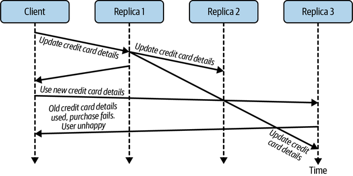
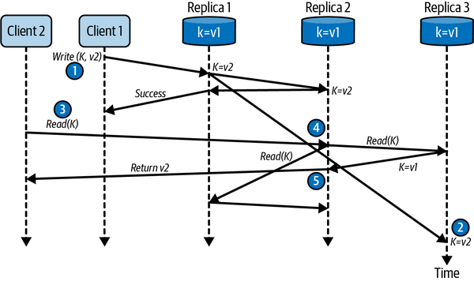
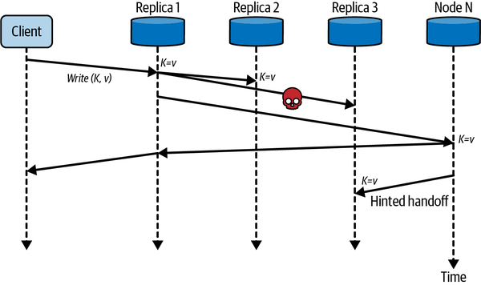
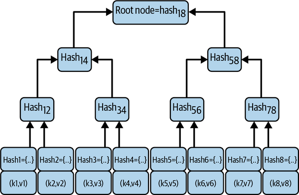
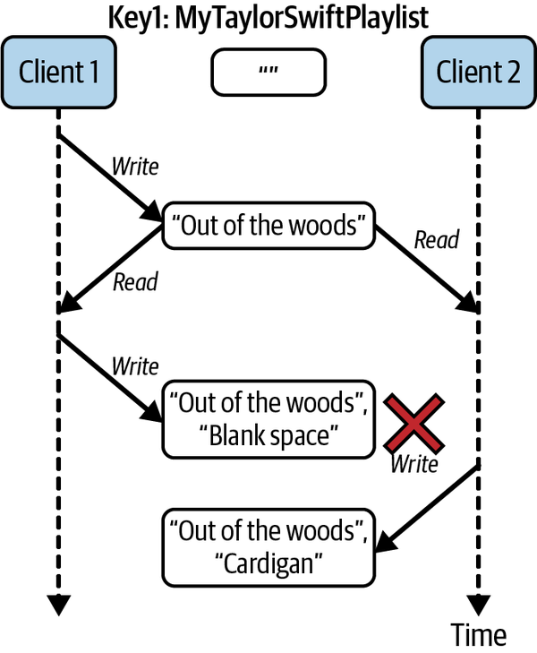
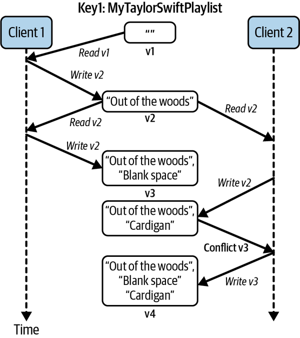

# Chapter 11. Eventual Consistency

Eventual consistency has risen in prominence with the emergence of distributed, NoSQL databases. It’s still a concept that has been and remains heretical to some, raised in the era of transactions with relational databases. In some application domains, with banking and finance usually cited, eventual consistency simply isn’t appropriate. So goes the argument, anyway.

In fact, eventual consistency has been used in the banking industry for many years. Anyone remember writing checks? Checks take days to be reconciled on your account, and you can easily write checks for more money than you have in your account. When the checks get processed, and consistency is established, you might see some consequences, however.

It is similar with ATM transactions. If an ATM is partitioned from the network and cannot check your balance, you will still usually be able to get cash, albeit limited to a small amount. At this stage your account balance is inconsistent. When the partition heals, the ATM will send the transactions to be processed by the backend systems and the correct value for your account will be calculated.

In the era of scalable internet systems, eventual consistency has found many suitable use cases. In this chapter, I’ll delve into the major issues that you need to be aware of when building eventually consistent systems with distributed databases at scale.

# What Is Eventual Consistency?

In the good old days, when systems had a single source of truth for all data items—the database—replica consistency was not a problem. There simply were no replicas. But as I explained in [Chapter 10](ch10.md), many systems need to scale out their databases across multiple nodes to provide the necessary processing and storage capacity. In addition, to ensure the data for each node is highly available, you also need to replicate the contents of each node to eliminate single points of failure.

Suddenly your database has become a distributed system. When the database nodes and networks are fast and working reliably, your users have no idea they are interacting with a distributed system. Replicas are updated seemingly instantaneously, and user requests are processed with low response times. Inconsistent reads are rare.

But as you know by now, distributed systems need to be able to handle various failure modes. This means the database has to deal with all the issues inherent with highly variable network latencies, and communication and machine failures. These failures mean your database replicas may remain inconsistent for longer periods than your application may wish to tolerate. This creates issues you need to understand and be able to address.

## Inconsistency Window

The inconsistency window in an eventually consistent system is the duration it takes for an update to a data object to propagate to all replicas. In a leader-based system, the leader coordinates the updating of other replicas. In a leaderless system, any replica (or potentially any database node—this is implementation dependent) coordinates the update. The inconsistency window ends when all replicas have the same value.

Several factors affect the duration of the inconsistency window. These are outlined in the following:

The number of replicas

The more replicas you have, the more replica updates need to be coordinated. The inconsistency window only closes when all replicas are identical. If you have three replicas, then only three updates are needed. The more replicas you have, the chances of one of your replicas responding slowly and elongating the inconsistency window increases.

Operational environment

Any instantaneous operational glitches, such as a transient network failure or lost packets, can extend the inconsistency window. Probably the main cause for replica update delays is a heavy read/write workload at a node. This causes replicas to become overloaded and introduces additional data propagation latency. Hence the more load your database is experiencing, the longer the inconsistency window is likely to be.

Distance between replicas

If all replicas are on the same local area network subnet, communications latencies can be submillisecond. If one of your replicas is across the continent or across the world, the minimum value of the inconsistency window will be the round-trip time between replicas. With geographical distribution, this could be relatively large, several tens of milliseconds, in fact.[1](ch11.md) It all depends on the distance as I explained in [Chapter 3](ch03.md).

All these issues mean that you don’t have control over the duration of the inconsistency window. You can’t provide or know an upper bound. With eventually consistent systems that communicate state changes asynchronously, this is a fact of life you have to live with.

## Read Your Own Writes

Not too long ago, while booking a flight, I had to update my credit card information as a new one had been issued due to a hack at a major store. I duly added my new card information, saved it, and continued the checkout process to pay for my flight. To my surprise, the payment was rejected because I hadn’t updated my credit card information. Wait a minute, I thought, and checked my profile. The new card details were in my profile marked as the default card. So, I tried the transaction again, and everything worked fine.

I don’t know exactly how this system was implemented, but I’m betting it uses an eventually consistent database and does not support *read your own writes (RYOWs)*. RYOWs is a property of a system that ensures if a client makes a persistent change to data, the updated data value is guaranteed to be returned by any subsequent reads from the same client.

In an eventually consistent system, the inconsistency window makes it possible for a client to:

- Issue an update to a database object key.
- Issue a subsequent read for the same database object key and see the old value as it accesses a replica that has not yet persisted the prior update.

This is illustrated in [Figure 11-1](#eventual_consistency_leads_to_stale_rea). The client request to update their credit card details is coordinated by *Replica 1*, which sends the new card details asynchronously to the other replicas. The update to *Replica 3* incurs a delay however. Before the update is applied, the same client issues a read which is directed to *Replica 3*. The result is a stale read.



###### Figure 11-1. Eventual consistency leads to stale reads

To avoid this situation, a system needs to provide RYOWs consistency.[2](ch11.md) This guarantees, for an individual user, that any updates made by the user will be visible in subsequent reads. The guarantee doesn’t hold for other users. If I add a comment to an online article, when I reload the page, I will see my comment. Other users who load the page at the same time may or may not see my comments immediately. They will see it eventually.

With leader-follower replication, implementing read your writes consistency is straightforward. For use cases that require RYOWs, you simply ensure the subsequent read is handled by the leader replica. This is guaranteed to hold the latest data object value.

The implementation of RYOWs, if supported, varies by database platform. With MongoDB, a database I’ll describe in more detail in [Chapter 13](ch13.md), this is the default behavior achieved by accessing the master replica.[3](ch11.md) In [Neo4j clusters](https://oreil.ly/f7yXy), all writes are handled by the leader, which asynchronously updates read-only followers. Reads, however, may be handled by replicas. To implement RYOWs consistency, any write transaction can request that a *bookmark* is returned that uniquely identifies that update. A subsequent read request passes the bookmark to Neo4j, enabling the cluster to ensure that only replicas that have received the bookmarked transaction process the read.

# Tunable Consistency

Many eventually consistent databases provide configuration options and API parameters to enable you to tailor the database’s eventually consistent behavior. This makes it possible to trade off the performance of individual read and write operations based on the level of eventual replica consistency a use case can tolerate. The basic approach is known as tunable consistency.

Tunable consistency is based on specifying the number of replicas that a request must access to complete a database request. To explain how this works, let’s define the following:

N

Total number of replicas

W

Number of replicas to update before confirming the update to the client

R

Number or replicas to read from before returning a value

As an example, assume *N* = 3, and there is a leaderless database in which any individual request can be handled by any one of the replicas. The replica handling the request is called the coordinator. You can tune write operation performance and the extent of the inconsistency window by specifying the W value as shown in the following examples:

W = 3

The request coordinator will wait until all three replicas are updated before returning success to the client.

W = 1

The request coordinator will confirm the update locally and return success to the client. The other two replicas will be updated asynchronously.

This means if *W* = 3, all replicas will be consistent after the write completes. This is sometimes called immediate consistency. In this case, clients can issue reads with a value of *R* = 1 (or quorum—see next section) and they should receive the latest value, as long as reads are not concurrent with the replica updates. Reads that occur while the replicas are being updated may still see different values depending on the replicas they access. Only once the replica values have converged will all reads see the same value. Hence immediate consistency is not the same as strong consistency (see [Chapter 12](ch12.md)) as stale reads are still possible.[4](ch11.md)

If *W* = 1, then you have an inconsistency window as only one replica, the request coordinator in our example, is guaranteed to have the latest value. If you issue a read with *R* = 1, the result may or may not be the latest value.

Remember the CAP theorem from [Chapter 10](ch10.md)? There are some consistency-availability trade-offs to consider here. If we set *W* = *N*, then there are two consequences:

- All replicas are consistent. This option favors replica consistency. Note that writes will be slower. The client must wait for updates to be acknowledged by all replicas, and this will add latency to writes, especially if one replica is slow to respond.
- Writes may fail if a replica is not accessible. This would make it impossible for the request coordinator to update all replicas, and hence the request will throw an exception. This negatively affects availability (see discussion of hinted handoffs later in this chapter).

This option is *CP* in CAP terminology.

Alternatively, if we set *W* = 1, writes succeed if any replica is available. There will be an inconsistency window that will last until all replicas are updated. The write will succeed even if one or more replicas are partitioned or have failed. This option therefore favors availability over replica consistency, or *AP* in CAP parlance.

To combat this inconsistency window, a client can specify how many replicas should be read before a result is returned. If we set *R* = *N*, then the request coordinator will read from all replicas, determine which is the latest update, and return that value to the client (I’ll return to precisely how the coordinator determines which replica holds the latest value later in this chapter. For now just assume it is possible). The result is that by reading from all replicas, you are guaranteed to access the one that holds the latest updated value.

Another way to look at the trade-offs involved is *read optimized* versus *write optimized*. The (*W* = *N*, *R* = 1) setting favors both consistency and read latencies, as only one replica needs to be accessed. The trade-off is longer write times. The (*W* = 1, *R* = *N*) option favors both availability and write latencies, as writes succeed after any replica is updated. The trade-off is slower reads.

These settings enable you to tune individual database requests to match your requirements. If inconsistent reads are not desirable, choose either *W* = *N* and *R* = 1, which will add latency to writes but make reads as fast as possible, or *W* = 1 and *R* = *N*, to optimize writes at the expense of reads. If your use cases can tolerate inconsistency, set *W* = *R* = 1 and benefit from fast reads and writes. Or, if you want to balance performance and consistency, there’s another option, as I’ll explain in the next section.

# Quorum Reads and Writes

There’s an option that lies between the alternatives discussed in the previous section. These are known as *quorum* reads and writes. Quorum simply means the majority, which is (*N* / 2) + 1.[5](ch11.md) For our three replicas, the majority is two. For five replicas, the majority is three, and so on.

If we configure both the *W* and *R* value to be the quorum, we can balance the performance of reads and writes and still provide access to the latest updated value of a data object. [Figure 11-2](#quorum_reads_and_writes) illustrates how quorums work. With three replicas, a quorum means a write must succeed at two replicas, and a read must access two replicas. Initially all three replicas have a data object *K* with value *v1,* and the following sequence of actions takes place:

1. *Client 1* updates the object to hold value *v2* and the write is acknowledged as successful once a quorum—in this case *Replica 1* and *Replica 2*—are updated.
2. The command to update to *Replica 3* is delayed (slow network? busy node?).
3. *Client 2* issues a read on object *K*.
4. *Replica 2* acts as the request coordinator and sends a read request to the other two replicas for their value for *K*. *Replica 3* is first to respond with *K* = *v1*.
5. *Replica 2* compares its value for *K* with that returned from *Replica 3* and determines that *v2* is the most recently updated value. It returns value *v2* to *Client 2*.

The basic intuition of quorums is that by always reading and writing from the majority of replicas, read requests will see the latest version of a database object. This is because the majority that is written to and the majority that are read from must overlap. In [Figure 11-2](#quorum_reads_and_writes), even though *Replica 3* is not updated before the read takes place, the read accesses *Replica 2*, which does hold the updated value. The request coordinator can then ensure the latest value is returned to the client.



###### Figure 11-2. Quorum reads and writes

So, what’s the inevitable trade-off here? Simply, writes and reads will fail if a quorum of nodes is not available. A network failure that partitions a group of replicas such that the partition visible to a client does not contain a quorum will cause that client’s requests to fail.

In some database systems designed to favor availability over consistency, the concept of a *sloppy quorum* is supported. Sloppy quorums were first described in Amazon’s original Dynamo paper,[6](ch11.md) and are implemented in several databases including DynamoDB, Cassandra, Riak, and Voldemort.

The idea is simple. If a given write cannot achieve quorum due to the unavailability of replicas nodes, the update can be stored temporarily on another reachable node. When the home node(s) for the replica(s) become available again, the node storing the update performs what is called a *hinted handoff.* A hinted handoff sends the latest value of the replica to the home nodes from its temporary location.

This scheme is depicted in [Figure 11-3](#sloppy_quorum_and_hinted_handoff). The client sends an update to *Replica 1*. *Replica 1* attempts to update *Replica 2* and *Replica 3,* but *Replica 3* is unavailable due to a transient network partition. *Replica 1* therefore sends the update to another database node, *Node N*, which temporarily stores the update. Sometime later, *Node N* sends the update to *Replica 3*, and the value for the updated object becomes consistent across all replicas.



###### Figure 11-3. Sloppy quorum and hinted handoff

Sloppy quorums have two main implications. First, a write that has achieved a sloppy quorum guarantees durability on *W* nodes, but the *W* nodes are not all nodes that hold replica values of the updated data object. This means a client may still read a stale value, even with quorums configured (i.e., *R* + *W* &gt; *N*), as it may access *R* nodes that have not been updated by the previous write operation.

Second, sloppy quorums increase write availability for a system. The trade-off is the potential for stale reads until the hinted handoff has occurred. Databases that support these features typically allow the system designer to turn these capabilities on or off to suit application needs.

# Replica Repair

In a distributed, replicated database, you expect every replica will be consistent. Replication may take a while, but consistency is always the ultimate outcome. Unfortunately, in operational databases, replica drift occurs. Network failures, node stalls, disk crashes, or (heaven forbid!) a bug in the database code can cause replicas to become inconsistent over time.

A term from thermodynamics, entropy, is used to describe this situation. Basically, systems tend to entropy (disorder) over time. Because of entropy, databases need to take active measures to ensure replicas remain consistent. These measures are known collectively as anti-entropy repair.

There are basically two strategies for anti-entropy repair. One is an active strategy that is applied when objects are accessed. This works effectively for database objects that are read reasonably frequently. For infrequently accessed objects, most likely the vast majority of your data, a passive repair strategy is used. This runs in the background and searches for inconsistent replicas to fix.

## Active Repair

Also known as *read repair*, active replica repair takes place in response to database read requests. When a read arrives at a coordinator node, it requests the latest value for each replica. If any of the values are inconsistent, the coordinator sends back the latest value to update the stale replicas. This can be done in a blocking or nonblocking mode. Blocking waits for the replicas to confirm updates before responding to the client, whereas nonblocking returns the latest value to the client immediately and updates stale replicas asynchronously.

Precisely how read repair works is implementation dependent. Factors to consider are how many replicas are accessed on each read—perhaps all, quorum or specific *R* value—and how replica divergence is detected and fixed. For detection, instead of requesting and comparing a complete, potentially large object with a complex structure, a hash value of the object can be used. If replica hashes match, then there is no need to perform a repair operation. Reading hashes, known as digest reads, reduces network traffic and latency. You’ll find digest read implementations in several NoSQL databases, for example, [ScyllaDB](https://oreil.ly/HNSvp) and Cassandra.

## Passive Repair

Passive anti-entropy repair is a process that typically runs periodically and is targeted at fixing replicas that are infrequently accessed. Essentially, the approach builds a hash value that represents each replicated collection of objects and compares the hashes of each collection. If the hashes match, no repair is needed. If they don’t, you know some replicas in the collection are inconsistent and further action is needed.

To create an efficient hash representation of a potentially very large collection of data objects, a data structure called a Merkle tree[7](ch11.md) is typically utilized. A Merkle tree is a binary hash tree whose leaf nodes are hashes of individual data objects. Each parent node in the tree stores a hash of its pair of children nodes, such that the root node hash provides a compact representation of the entire data collection. [Figure 11-4](#merkle_tree_example) shows a representation of a simple Merkle tree.



###### Figure 11-4. Merkle tree example

Once a Merkle tree for a collection of objects has been constructed, it can be efficiently utilized to compare Merkle trees for each replica collection. Two nodes can exchange the root node hash, and if the root node values are equal, then the objects stored in the partitions are consistent. If they are not, the two child nodes of the root must be compared. One (or maybe both) of the child node hashes must be different as the root node hashes were different. The traversal and data exchange algorithm basically continues down the tree, following branches where hashes are not equal between replica trees, until leaf nodes are identified. Once identified, the stale data objects can be updated on the appropriate replica node.

Merkle tree construction is a CPU- and memory-intensive operation. For these reasons, the process is either initiated on demand, initiated by an administration tool, or scheduled periodically. This enables anti-entropy repair to occur when the database is experiencing a low request load, and hence doesn’t cause increased latencies on database accesses during production. Examples of NoSQL databases that implement anti-entropy repair are [Riak](https://oreil.ly/1ZKIt) and Cassandra.

# Handling Conflicts

Up until now in this chapter, I’ve assumed that a database has some mechanism to discern the latest value for any given replicated database object. For example, when reading from three replicas, the database will somehow be able to decide which replica is the most recently updated and return that value as the query result.

In a leaderless system, writes can be handled by any replica. This makes it possible for two clients to concurrently apply independent updates to the same database key on different replicas. When this occurs, in what order should the updates be applied? What should be the final value that all replicas hold? You need some mechanism to make this decision possible.

## Last Writer Wins

One way to decide final, definitive values is to use timestamps. A timestamp is generated for the update request and the database ensures that when concurrent writes occur, the update with the most recent timestamp becomes the final version. This is simple and fast from the database perspective.

Unfortunately, there’s a problem with this approach. In what order did the updates really happen? As I described in [Chapter 3](ch03.md), clocks on machines drift. This means one node’s clock may be ahead of others, making comparing timestamps meaningless. In reality, we can’t determine the order of the events. They are executed on different replicas of the same data object by two or more independent processes. These updates must be considered as simultaneous, or concurrent. The timestamps attached to the updates simply impose an arbitrary order on the updates for conflict resolution.

The consequence of this is when concurrent updates occur using last writer wins, updates will be silently discarded. [Figure 11-5](#concurrent_writes_cause_lost_updates_wi) depicts one scenario where updates are lost using a shared playlist as an example. *Client 1* writes the first entry to the playlist, and this entry is subsequently read at some time later by both *Client 1* and *Client 2*. Both clients then write a new entry to the playlist, but as *Client 2*’s update is timestamped later than *Client 1*’s, the updates made by *Client 1* are lost.



###### Figure 11-5. Concurrent writes cause lost updates with last writer wins

Data loss with a last writer wins conflict resolution policy is inevitable. There are mitigation strategies such as timestamps on individual fields and conditional writes (which I’ll discuss in [Chapter 13](ch13.md)) that can minimize or mitigate the likelihood of data loss. However, the only way to safely utilize a database that employs purely a last writer wins policy is to ensure all writes store data objects with a unique key, and objects are subsequently immutable. Any changes to data in the database require the existing data object to be read and the new contents written to the database with a new key.

## Version Vectors

To handle concurrent updates and not lose data, we need a way to identify and resolve conflicts. [Figure 11-6](#conflict_identification_with_versioning) shows an approach to achieving this for a single replica using versioning. Each unique database object is stored along with a version number.



###### Figure 11-6. Conflict identification with versioning

Reading and writing data from the database proceeds as follows:

- When a client reads a database object, the object and its version are returned.
- When a client updates a database object, it writes the new data values and the version of the object that was received from the previous read.
- The database checks that the version in the write request is the same as the object’s version in the database, and if it is, it accepts the write and increments the version number.
- If the version number accompanying a write does not match the database object version, a conflict has occurred, and the database must take remedial action to ensure data is not lost. It may return an error to the client and make it reread the new version. Alternatively, it may store both updates and inform the client that a conflict has occurred.

In [Figure 11-6](#conflict_identification_with_versioning), the remedial action depicted is based on the [Riak database](https://oreil.ly/RRLQu). When a conflict occurs in Riak, the database stores both versions of the database object and returns the conflicts to the client. In this example, the resolution is for the client to simply merge the two updates, which are known as *siblings* in Riak.

With multiple replicas, however, the situation is somewhat more complex than in [Figure 11-6](#conflict_identification_with_versioning). As writes may be handled by any replica, we need to maintain the version number for each unique object and each replica. Replicas maintain their own version as writes are processed, and also keep track of the versions of the other replicas it has seen. This creates what is known as a *version vector*.

When a replica accepts a write from a client, it updates its own version number and sends the update request along with its version vector to the other replicas. The version vector is used by a replica to decide whether the update should be accepted or if siblings should be created.

The management of version vectors is the responsibility of the database. Database clients just need to present the latest version with updates and be able to handle conflicts when they occur. The following sidebar gives a brief overview of some of the theory behind the conflict resolution approach represented by version vectors.

##### Logical Clocks

Physical, CPU-measured time is not a reliable source of reference in distributed systems (see [Chapter 3](ch03.md)). Consequently, you need another approach to make sense of the order that database accesses occur. This is where logical clocks enter the scene.

Logical clocks were first described by Leslie Lamport in his seminal paper.[8](ch11.md) The essence of the work is the definition of a *happens-before* relationship. This means:

- If a process issues operation *a* (e.g., a database request), and after it completes, issues operation *b*, then *a happens-before b*. This is denoted by *a* → *b*.
- If a process sends a message *m* to another process, the send *happens-before* the receipt.
- If two independent processes perform operations *a* → *b* and *c* → *d*, then it is not possible to define an order between the {*a*, *b*} and {*c*, *d*}. In this case, the operations are concurrent.
- The *happens-before* relationship is transitive, such that if *a* → *b* and *b* → *c*, then *a* → *c*.

Systems can capture the *happens-before* relationship using a logical clock. This is done using a simple counter and algorithm. Each process has a local clock, which it initializes to zero on startup. The following shows pseudocode for when a process sends a message to another:

```
# increment local clock
local_clock ++;
# send message to another process
send(msg, local_clock);
```

When the receiving process accepts the message, it sets its own local clock as follows:

```
(msg, clock_msg) = receive();
local_clock = max(clock_msg, local_clock) + 1;
```

This ensures the value of `local_clock` in the receiving process is greater than the value sent in the message. This reflects that the send operation *happens-before* the receive operation. Whenever there is a cause and effect, or causal relationship between two events, such that *a* → *b*, then *clock(a)* &lt; *clock(b).*

Lamport clocks define a partial order between events as they cannot discern between concurrent requests with no causal relationship. Hence, they cannot be used to detect database conflicts. This is where version vectors enter the scene. Version vectors define an array of logical clocks, with one element for each database object replica. This is shown in the following for a newly created object with three replicas:

```
r1, r2, r3 = [ [r1,0], [r2,0], [r3,0] ]
```

When an update is processed by a coordinator node, in the following this is *r2*, it increments its own clock in the vector, and sends the updated vector to the other replicas:

```
r2 = [ [r1,0], [r2,1], [r3,0] ]
```

When a replica receives an update and version vector from the coordinator, it compares the vector with its local copy. If every clock value for the updated object version vector is greater than or equal to the clock values stored by the replicas, the write is accepted. All replicas synchronize and will have identical version vectors.

If concurrent updates occur at replicas two and three, as shown in the following, each replica will update its own clock:

```
r2 = [ [r1,0], [r2,2], [r3,0] ]
r3 = [ [r1,0], [r2,1], [r3,1] ]
```

When the version vectors are exchanged and compared by *r2* and *r3*, the conflict is detected as all the clock values do not obey the *greater than or equal to* rule. This is how version vectors enable conflict detection in replicated databases.

As [Figure 11-6](#conflict_identification_with_versioning) illustrates, when a database detects a conflict, the client typically needs to do some work to resolve it. If the database throws an error, the client can reread the latest version of the database object and attempt the update again. If siblings are returned, the client must perform some form of merge. These situations are very use case–specific and hence impossible to generalize.

Luckily, there are circumstances when a database can automatically resolve conflicts. Some databases, including Redis, Cosmos DB, and Riak, are leveraging recent results from the research community to support a collection of data types known as conflict-free replicated data types (CRDTs). CRDTs have semantics such that they can be concurrently updated and any conflicts can be resolved sensibly by the database. The value of a CRDT will always converge to a final state that is consistent on all replicas.

A simple example of a CRDT is a counter that could be used to maintain the number of followers for a user on a social media site. Increments and decrements to a counter can be applied in any order on different replicas, and the resulting value should eventually converge on all replicas.

Common CRDTs include sets, hash tables, lists and logs. These data structures behave identically to their nondistributed counterparts, with minor caveats.[9](ch11.md) Importantly, they alleviate the application from the burden of conflict handling. This simplifies application logic, saving you time and money, and will probably make your applications less error prone.

##### In the Wild: Eventual Consistency

Eventually consistent databases are widely used in large-scale systems. For example, at Netflix, the Cassandra database underpins the user experience when viewing content. In 2019, Netflix reported over six petabytes of subscriber related content in Cassandra, stored in tens of thousands of database instances and hundreds of globally distributed clusters.[10](ch11.md) Cassandra’s low write latencies provide an excellent solution for use cases that have a 9:1 write-to-read ratio. Netflix also exploits Cassandra’s tunable consistency and global data replication to support its most time-critical use cases for its more than 100 million subscribers.[11](ch11.md)

Netflix benchmarks results from Cassandra testing are really useful for quantifying the latencies that are achievable with eventually consistent technologies.[12](ch11.md) For example, one benchmark test achieved 1 million writes per second with an average latency of 6 milliseconds and a P95 of 17 milliseconds. These results were produced using a Cassandra cluster with 285 nodes. Like all benchmark studies, you need to delve into the details on the Netflix technical blog to make full sense of the results.

The online betting and gaming industry relies on high availability and low latencies. It’s not hard to imagine the effect of downtime and slow responses when huge amounts of bets are being placed on high-profile events such as a world championship boxing match or the soccer world cup. bet365 is one of the largest online gambling sites and built its site based on the Riak KV database.[13](ch11.md) bet365 calculates odds, takes bets, and manages account and transaction data for millions of concurrent users, generating gigabytes of data for processing every second. Odds change constantly and must be recalculated with low latencies to capture the effect of in-game variables. Data written to Riak KV is automatically written to multiple replicas across globally distributed clusters with tunable consistency. This provides high availability and low latencies through enabling users to access replicas that are physically close to their location.

# Summary and Further Reading

Eventually consistent databases have become an established part of the landscape of scalable distributed systems. Simple, evolvable data models that are naturally partitioned and replicated for scalability and availability provide an excellent solution for many internet-scale systems.

Eventual consistency inevitably creates opportunities for systems to deliver stale reads. As a consequence, most databases provide tunable consistency. This allows the system designer to balance latencies for read and writes, and trade off availability and consistency to meet application needs.

Concurrent writes to different replicas of the same database object can cause conflicts. These cause the database to have inconsistent replicas and to silently lose updates, neither of which are desirable in most systems. To address this problem, conflict resolution mechanisms are required. These often need application logic (and/or users) to resolve conflicts and ensure updates are not lost. This can cause additional application complexity. New research is coming to the rescue, however, and some databases support data types that have semantics to automatically resolve conflicts.

The classic reference for eventually consistent databases and the inspiration for many of today’s implementations is the [original Dynamo paper](https://oreil.ly/xmR5O). It is still a great read over a decade after its 2007 publication.

If you want to know more about how eventually consistent databases—and massive data stores in general—are built, I can think of no better source than *Designing Data-Intensive Applications* by Martin Kleppman (O’Reilly, 2017). I also enjoy *NoSQL for Mere Mortals* by Dan Sullivan (Addison-Wesley Professional, 2015) for solid basic information. And if you want to know more about CRDTs, [this review paper](https://oreil.ly/zbU7G) is a great place to start.[14](ch11.md)

[1](ch11.md) The quantum communications systems of the future may well [overcome distance-induced latencies](https://oreil.ly/Zje4h).

[2](ch11.md) For an excellent description of eventual consistency models, see [*https://oreil.ly/2qUQh*](https://oreil.ly/2qUQh).

[3](ch11.md) MongoDB enables you to tune which replica [handles reads](https://oreil.ly/2hsiW).

[4](ch11.md) Immediate consistency should not be confused with strong consistency, as described in the next chapter. Databases that favor availability over consistency and use *W* = *N* for writes still have an inconsistency window. Also, writes may not be completed on every replica if one or more is unreachable. To understand why, see discussion of hinted handoffs later in this chapter.

[5](ch11.md) This formula uses integer division, such that the fractional part is discarded. For example, 5 / 2 = 2.

[6](ch11.md) Giuseppe DeCandia et al., “Dynamo: Amazon’s Highly Available Key-Value Store,” in the Proceedings of the 21st ACM Symposium on Operating Systems Principles, Stevenson, WA, October 2007.

[7](ch11.md) Merkle trees are useful in [many use cases](https://oreil.ly/rr8Yh), including Bitcoin/blockchain transaction verifications.

[8](ch11.md) Leslie Lamport, “Time, Clocks, and the Ordering of Events in a Distributed System,” *Communications of the ACM* 21, no. 7 (1978): 558–65. [*https://doi.org/10.1145/359545.359563*](https://doi.org/10.1145/359545.359563).

[9](ch11.md) For example, if one process removes an element from a set concurrently with another node adding the same elements, the “add wins.”

[10](ch11.md) For more details on how Netflix’s cloud data engineering team uses Cassandra to manage data at petabyte scale, check out this [excellent presentation](https://oreil.ly/qVSYB).

[11](ch11.md) This [Netflix technical blog entry](https://oreil.ly/tUaqS) explains how the Cassandra-based solution for scaling the user viewing history database evolved over time.

[12](ch11.md) Cassandra benchmarks are indicative of the [capabilities of eventually consistent data stores](https://oreil.ly/HkFmB).

[13](ch11.md) bet365 relies so heavily on Riak KV, it actually bought the technology! An overview of its business challenges is described [here](https://oreil.ly/NGOUW).

[14](ch11.md) Marc Shapiro et al., “Convergent and Commutative Replicated Data Types,” *European Association for Theoretical Computer Science*; 1999, 2011, 67–88. [⟨hal-00932833⟩](https://oreil.ly/2g2QH).
