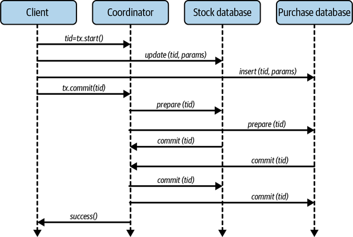
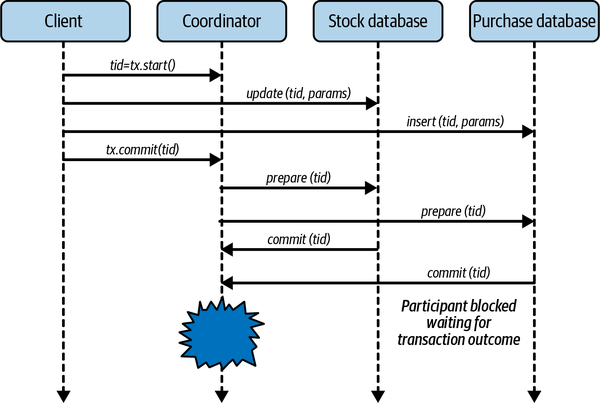
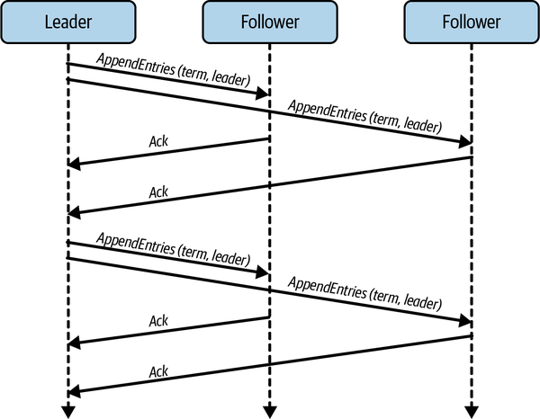
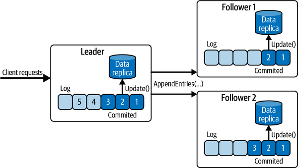
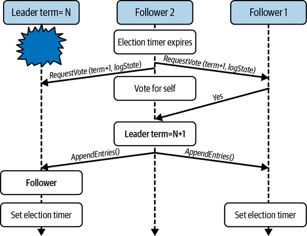
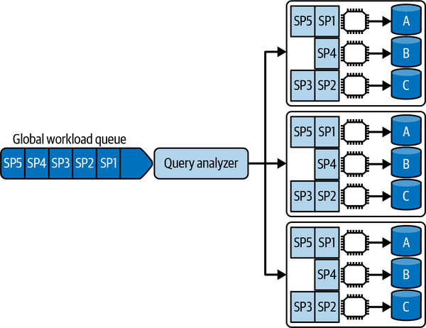
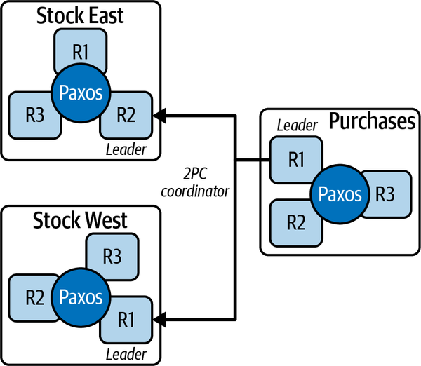
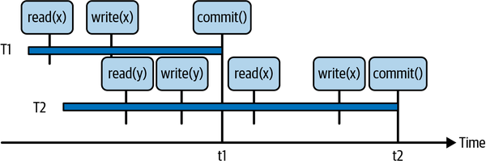

# Chapter 12. Strong Consistency

As I described in [Chapter 11](ch11.md), eventually consistent databases are designed to scale by allowing data sets to be partitioned and replicated across multiple machines. Scalability is achieved at the expense of maintaining strong data consistency across replicas, and allowing conflicting writes.

The consequences of these trade-offs are twofold. First, after a data object has been updated, different clients may see either the old or new value for the object until all replicas converge on the latest value. Second, when multiple clients update an object concurrently, the application is responsible for ensuring data is not lost and the final object state reflects the intent of the concurrent update operations. Depending on your system’s requirements, handling inconsistency and conflicts can be straightforward, or add considerable complexity to application code.

Another class of distributed databases provides an alternative model, namely strongly consistent data systems. Also known as NewSQL or, more recently, distributed SQL, strongly consistent systems attempt to ensure all clients see the same, consistent value of a data object once it has been updated. They also deliver the well-known benefits of atomicity, consistency, isolation, durability (ACID) database transactions to handle conflicting updates.

Transactions and data consistency, the characteristics everyone is familiar with in existing single-node relational databases, eliminate many of the complexities inherent in eventually consistent systems. Together they can significantly simplify application logic. As stated in Google’s original Spanner distributed database paper: “We believe it is better to have application programmers deal with performance problems due to overuse of transactions as bottlenecks arise, rather than always coding around the lack of transactions.”[1](ch12.md)

For internet-scale systems, the trick of course is to provide the benefits of strongly consistent databases, along with the performance and availability that eventually consistent systems can achieve. This is the challenge that distributed SQL databases are tackling. In this chapter, I’ll explain the characteristics of these strongly consistent systems and the algorithms required to make it possible for consistent data systems to be partitioned and replicated for scalability and availability.

# Introduction to Strong Consistency

In sequential programs, once you write a value (x) to a variable, you expect all subsequent reads will return (x). If this guarantee didn’t hold, as it doesn’t for concurrent programs without careful thread synchronization, writing software systems would be a lot more fraught.

This, however, is the case when you use an eventually consistent database system. A client may think it has written a new value to a data object, but other clients may access the same object and receive a stale value until the inconsistency window closes and all replica values have converged. In fact, as I described in [Chapter 11](ch11.md), a client may even access an object it successfully updated and receive a stale value unless RYOWs consistency is supported.

In systems based on eventually consistent databases, applications must be aware of the precise consistency guarantees of the underlying data store, and be designed to deal with these accordingly. Handling inconsistent reads and concurrent write conflicts can add considerable complexity to code bases and test cases. If you do not take appropriate care, difficult-to-reproduce errors can creep into applications. Following Murphy’s law, these will inevitably only become apparent when the system experiences high load or unexpected failures.

In contrast, strongly consistent databases aim to deliver the same consistency guarantees as single-node systems. With strong consistency, you can write applications with assurances that once an update has been confirmed by the database, all subsequent reads by all clients will see the new value. And if concurrent clients attempt to update the same object, the updates behave as if one happens before the other. They do not occur concurrently and cause data loss or corruption.

Slightly confusingly, the technical community uses strong consistency to describe two subtly different concepts in distributed databases. These are:

Transactional consistency

This is the “C” in ACID transactions (see [“ACID Transactions”](#acid_transactions)) as supported by relational databases. In a distributed database that supports ACID transactions, you need an algorithm that makes it possible to maintain consistency when data objects from different physical data partitions and nodes are updated within a single transaction. Consistency in this case is defined by the semantics of the business logic executed within the transaction.

Replica consistency

Strong replica consistency implies that clients all see the same value for a data object after it has been updated, regardless of which replica they access. Basically, this eliminates the inconsistency window I covered in [Chapter 11](ch11.md) in eventually consistent systems. There are various subtleties inherent in supporting strong replica consistency that I will explore later in this chapter.

The algorithms used for transactional and replica consistency are known as *consensus algorithms*. These algorithms enable nodes in a distributed system to reach consensus, or agreement, on the value of some shared state. For transactional consistency, all participants in the transaction must agree to commit or abort the changes executed within the transaction. For replica consistency, all replicas need to agree on the same order of updates for replicated data objects.

Solutions for transactional and replica consistency were developed by different technical communities at different times. For transactional consistency, the two-phase commit algorithm originated from work by Jim Gray, one of the pioneers of database systems, in 1978.[2](ch12.md) The classic replica consistency algorithm, Paxos, was first described in 1998 by Leslie Lamport.[3](ch12.md) I’ll spend the rest of this chapter exploring transaction and replica consistency and how these algorithms are used in distributed SQL databases.

##### ACID Transactions

Transactions in database systems may modify multiple database objects. Such transactions support ACID properties, namely:

Atomicity

All changes to the database must be executed as if they are a single operation. This means all updates must succeed (commit), or all must fail (roll back). For example, for a purchase I make online, if my credit card is successfully charged, my order details are recorded and sent for processing. If I have no credit, my purchase is refused.

Consistency

Transactions will leave the database in a consistent state. If my online purchase succeeds, the number of items in stock for the products I have purchased is decreased by the number of items I selected. This property is defined by the specific business logic the transaction executes.

Isolation

While a transaction is in progress, any data modified by the transaction is invisible to other concurrent transactions. Transactions that compete for resources are isolated from each other, and the results of a transaction are not accessible to other concurrent transactions until the transaction completes. A database achieves this by acquiring locks on the data objects that a transaction accesses, and releasing the locks when the transaction completes.

Durability

If a transaction commits, the changes are permanent and recoverable in the event of a system failure.

The isolation property in ACID requires transactions to execute as if they were [serialized](https://oreil.ly/0dnJQ). Serializability guarantees that concurrent transactions appear to execute in some sequential, or total, order.

# Consistency Models

The database and distributed systems communities have studied consistency for more than four decades. Each has developed several different consistency models that have subtly different semantics and guarantees. This has led to a somewhat confusing and complex landscape of definitions and overloaded terminology. If you are interested in the full details, there is an excellent depiction of the different models and their relationships organized as a hierarchy on the [Jepsen website](https://oreil.ly/Z3zu7). I’ll just focus on the strongest consistency model in this chapter. This is known variously as strict consistency, strict serializability or external consistency, and implies the combination of the two most restrictive consistency models defined by the database and distributed systems communities. These are serializability and linearizability respectively, as explained in the following:

Serializability

This is commonly referred to as *transactional* consistency, the “C” in ACID. Transactions perform one or more reads and writes on multiple data objects. Serializability guarantees that the execution of a set of concurrent transactions over multiple items is equivalent to some sequential execution order of the transactions.

Linearizability

This is concerned with reads and writes to single data objects. Basically, it says that all clients should always see the most recent value of a data object. Once a write to a data object succeeds, all subsequent reads that occur after the write must return the value of that write, until the object is modified again. Linearizability defines the order of operations using wall clock time, such that an operation with a more recent wall clock time occurs after any operations with lower wall clock times. In distributed databases with multiple data object replicas, linearizable consistency is concerned with *replica* consistency, essentially the “C” in the CAP theorem.

Combining these two models gives the strongest possible data consistency. The basic effect is that transactions execute in a serial order (serializability), and that order is defined by the wall clock times of the transactions (linearizability). For simplicity, I’ll refer to this as *strong consistency*.

Anyway, that’s a summary of the theory. To support these consistency models in distributed SQL databases, we require consensus algorithms, as I explain in the rest of this chapter.

# Distributed Transactions

From an application developer’s perspective, the simplest way to think of transactions is as a tool to simplify failure scenarios in distributed systems. The application simply defines which operations must be carried out with ACID properties, and the database does the rest. This greatly reduces the application complexity, as you can ignore the subtle and numerous failure possibilities. Your code simply waits for the database to inform it of the transaction outcome (commit or abort) and behaves accordingly.

[Example 12-1](#example_onetwo-onedot_an_example_yugaby) shows a simple example of a purchasing transaction using the SQL variant of YugabyteDB.[4](ch12.md) The transaction modifies the `stock` table to reflect the number of items ordered by the customer, and inserts a new row in the `purchases` table to represent the customer’s order. These operations are defined with a transaction boundary, marked by the `BEGIN/END TRANSACTION` syntax.

##### Example 12-1. An example YugabyteDB transaction

```
BEGIN TRANSACTION
UPDATE stock SET in_stock = in_stock - purchase_amount 
WHERE stock_id = purchase_stock_id;
    INSERT INTO purchases (cust_id, stock_id, amount) 
           VALUES (customer, purchase_stock_id, purchase_amount);
END TRANSACTION;
```

Transactional semantics ensure that both operations either succeed or fail. If a database does not support transactions, as in most NoSQL databases, the application programmer would effectively have to break the transaction down into two individual updates and define potentially complex exception handling. Basically, this would mean:

- Performing each update separately, and checking that each succeeds.
- If the `INSERT` fails after the `UPDATE` succeeds, the stock table updates must be undone using another SQL statement. This is known as a compensating action.
- If the compensating action fails, or the service executing the code fails, you need to take remedial actions. This is where things start to get really complicated!

In a single node database, committing a transaction is relatively straightforward. The database engine ensures transaction modifications and state are persisted to disk in a transaction log file. Should the database engine fail, the transaction log can be utilized on restart to restore the database to a consistent state. However, if the `purchases` and `stock` tables from [Example 12-1](#example_onetwo-onedot_an_example_yugaby) reside in different databases or different partitions in a distributed database, the process is somewhat more complex. You need an algorithm to ensure that both nodes agree on the transaction outcome.

## Two-Phase Commit

Two-phase commit (2PC) is the classic distributed transaction consensus algorithm. It is widely implemented in established relational databases like SQL Server and Oracle, as well as contemporary distributed SQL platforms including VoltDB and Cloud Spanner. 2PC is also supported by external middleware platforms such as the Java Enterprise Edition, which includes the [Java Transaction API (JTA) and Java Transaction Service (JTS)](https://oreil.ly/BaYmu). These external coordinators can drive distributed transactions across heterogeneous databases using the XA protocol.[5](ch12.md)

[Figure 12-1](#two-phase_commit-id000071) illustrates an example of the basic 2PC protocol based on [Example 12-1](#example_onetwo-onedot_an_example_yugaby). The protocol is driven by a coordinator, or leader. The coordinator can be an external service, for example the JTS, or an internal database service. In a distributed SQL database, the coordinator can be one of the partitions that is being updated as part of a multipartition transactional update.

When a database client starts a transaction (e.g., the `BEGIN TRANSACTION` statement in [Example 12-1](#example_onetwo-onedot_an_example_yugaby)), a coordinator is selected. The coordinator allocates a globally unique transaction identifier (*tid*) and returns this to the client. The *tid* identifies a data structure maintained by the coordinator known as the transaction context. The transaction context records the database partitions, or participants, that take part in the transaction and the state of their communications. The context is persisted by the coordinator, so that it durably maintains the state of the transaction.

The client then executes the operations defined by the transaction, passing the *tid* to each participant that performs the database operations. Each participant acquires locks on mutated objects and executes the operations locally. It also durably associates the *tid* with the updates in a local transaction log. These database updates are not completed at this stage—this only occurs if the transaction commits.



###### Figure 12-1. Two-phase commit

Once all the operations in the transaction are completed successfully, the client tries to commit the transaction. This is when the 2PC algorithm commences on the coordinator, which drives two rounds of votes with the participants:

Prepare phase

The coordinator sends a message to all participants to tell them to prepare to commit the transaction. When a participant successfully prepares, it guarantees that it can commit the transaction and make it durable. After this, it can no longer unilaterally decide to abort the transaction. If a participant cannot prepare, that is, if it cannot guarantee to commit the transaction, it must abort. Each participant then informs the coordinator about its decision to commit or abort by returning a message that contains its decision.

Resolve phase

When all the participants have replied to the *prepare* phase, the coordinator examines the results. If all the participants can commit, the whole transaction can commit, and the coordinator sends a commit message to each participant. If any participant has decided that it must abort the transaction, or doesn’t reply to the coordinator within a specified time period, the coordinator sends an abort message to each participant.

## 2PC Failure Modes

2PC has two main failure modes. These are participant failure and coordinator failure. As usual, failures can be caused by systems crashing, or being partitioned from the rest of the application. From the perspective of 2PC, the crashes and partitions are indistinguishable:

Participant failure

When a participant crashes before the *prepare* phase completes, the transaction is aborted by the coordinator. This is a straightforward failure scenario. It’s also possible for a participant to reply to the *prepare* message and then fail. In either case, when the participant restarts, it needs to communicate with the coordinator to discover transaction outcomes. The coordinator can use its transaction log to look up the outcomes and inform the recovered participant accordingly. The participant then completes the transaction locally. Essentially then, participant failure doesn’t threaten consistency, as the correct transaction outcome is reached.

Coordinator failure

Should the coordinator fail after sending the *prepare* message, participants have a dilemma. Participants that have voted to commit must block until the coordinator informs them of the transaction outcome. If the coordinator crashes before or during sending out the commit messages, participants cannot proceed, as the coordinator has failed and will not send the transaction outcome until it recovers. This is illustrated in [Figure 12-2](#coordinator_failures_causes_transaction), where the coordinator crashes after receiving the participant responses from the *prepare* phase.



###### Figure 12-2. Coordinator failures causes transaction outcome to be uncertain and participants to block

There is no simple resolution to this problem. A participant cannot autonomously decide to commit as it does not know how other participants voted. If one participant has voted to roll back, and others to commit, this would violate transaction semantics. The only practical resolution is for participants to wait until the coordinator recovers and examines its transaction log.[6](ch12.md) The log enables the coordinator to resolve all incomplete transactions. If it has logged a commit entry for an incomplete transaction, it will inform the participants to commit. Otherwise, it will roll back the transaction.

Transaction coordinator recovery and the transaction log make it possible to finalize incomplete transactions and ensure the system maintains consistency. The downside is that participants must block while the coordinator recovers. How long this takes is implementation dependent, but is likely to be at least a few seconds. This negatively impacts availability.

In addition, during this time, participants must hold locks on the data objects mutated by the transaction. The locks are necessary to ensure transaction isolation. If other concurrent transactions try to access these locked data items, they will be blocked. This results in increased response times and may cause requests to time out. In heavily loaded systems or during request spikes, this can cause cascading failures, circuit breakers to open, and other generally undesirable outcomes depending on the characteristics of the system design.

In summary, the weakness of 2PC is that it is not tolerant of coordinator failure. One possible way to fix this, as with all single point of failure problems, is to replicate the coordinator and transaction state across participants. If the coordinator fails, a participant can be promoted to coordinator and complete the transaction. Taking this path leads to a solution that requires a distributed consensus algorithm, as I describe in the next section.

# Distributed Consensus Algorithms

Implementing replica consistency such that all clients see a consistent view of a data object’s replica values requires consensus, or agreement, on every replica value. All updates to replicas for an object must be applied in the same order at every replica. Making this possible requires a distributed consensus algorithm.

Much intellectual effort has been devoted to distributed consensus algorithms in the last 40 years or so. While consensus is simple conceptually, it turns out many subtle problems arise because messages between participants can be lost or delayed, and participants can crash at inconvenient times.

As an example of the need for consensus, imagine what could happen at the end of an online auction when multiple last second bids are submitted. This is equivalent to multiple clients sending update requests that can be handled by different replicas of the same *auction* data object. In an eventually consistent system, this could lead to replicas with different bid values and potentially the loss of the highest bid.

A consensus algorithm makes sure such problems cannot occur. More specifically:

- All replicas must agree on the same winning bid. This is a correctness (or safety) property. Safety properties ensure *nothing bad happens*. In this case, two winning bids would be bad.
- A single winning bid is eventually selected. This is a liveness property. Liveness ensures *something good happens* and the system makes progress. In this case consensus is eventually reached on a single winning bid. Consensus algorithms that guarantee liveness are known as fault-tolerant consensus algorithms.
- The winning bid is one of the bids that was submitted. This ensures the algorithm can’t simply be hardcoded to agree on a predetermined value.

The basis of fault-tolerant consensus approaches are a class of algorithms called atomic broadcast, total order broadcast, or replicated state machines.[7](ch12.md) These guarantee that a set of values, or states, are delivered to multiple nodes exactly once, and in the same order. 2PC is also a consensus algorithm. However, as I explained earlier in this chapter, it is not fault tolerant as it cannot make progress when the transaction coordinator, or leader, fails.

A number of well-known consensus algorithms exist. For example, [Raft](https://oreil.ly/xqDOj) is a leader-based atomic broadcast algorithm.[8](ch12.md) A single leader receives clients requests, establishes their order, and performs an atomic broadcast to the followers to ensure a consistent order of updates.

In contrast, Leslie Lamport’s Paxos, probably the best known consensus algorithm, is leaderless. This, along with other complexities, make it notoriously tricky to implement.[9](ch12.md) As a consequence, a variant known as Multi-Paxos[10](ch12.md) was developed. Multi-Paxos has much in common with leader-based approaches like Raft and is the basis of implementations in distributed relational databases like Google Cloud Spanner.

To be fault tolerant, a consensus algorithm must make progress in the event of both leader and follower failures. When a leader fails, a single new leader must be elected and all followers must agree on the same leader. New leader election approaches vary across algorithms, but at their core they require:

- Detection of the failed leader
- One or more followers to nominate themselves as leaders
- Voting, with potentially multiple rounds, to select a new leader
- A recovery protocol to ensure all replicas attain a consistent state after a new leader is elected

Of course, followers may also be unavailable. Fault-tolerant consensus algorithms are therefore designed to operate with just a quorum, or majority, of participants. Quorums are used both for acknowledging atomic broadcasts and for leader election. As long as a quorum of the participating nodes are available and agree, the algorithm can make progress. I’ll explore these issues in more detail in the following subsections, which use the Raft algorithm as an example.

## Raft

Raft was designed as a direct response to the complexity inherent in the Paxos algorithm. Termed “an understandable consensus algorithm,” it was first published in 2013.[11](ch12.md) Importantly, a reference implementation was also published. This provides a concrete description of the concepts in Raft, and acts as a basis for implementers to leverage in their own systems.

Raft is a leader-based algorithm. The leader accepts all updates and defines an order for their execution. It then takes responsibility for sending these updates to all replicas in the defined order, such that all replicas maintain identical committed states. The updates are maintained as a log, and Raft essentially replicates this log to all members of the system.

A Raft cluster has an odd number of nodes, for example, three or five. This enables consensus to proceed based on quorums. At any instant, each node is either a leader, a follower, or a candidate for leader if a leader failure has been detected. The leader sends periodic heartbeat messages to followers to signal that it is still alive. The message flow in a basic Raft cluster architecture is shown in [Figure 12-3](#message_exchange_in_a_raft_clustercomma). The time period for leader heartbeats is typically around 300–500 milliseconds.

Each leader is associated with a monotonically increasing value known as a *term*. The term is a logical clock, and each valid term value is associated with a single leader. The current term value is persisted locally by every node in the cluster, and is essential for leader election, as I’ll soon explain. Each heartbeat message contains the current term value and leader identity and is delivered using an `AppendEntries()` message. `AppendEntries()` is also utilized to deliver new entries to commit on the log. During idle periods when the leader has no new requests from clients, an empty `AppendEntries()` simply suffices as the heartbeat.



###### Figure 12-3. Message exchange in a Raft cluster, with one leader and two followers

During normal operations, all client updates are sent to the leader. The leader orders the updates and appends them to a local log. Initially, all log entries are marked as uncommitted. The leader then sends the updates to all followers using an `AppendEntries` message, which also identifies the term and the position of the updates in the log. When a follower receives this message, it persists the update to its local log as uncommitted and sends an acknowledgment to the leader. Once the leader has received positive acknowledgments from a majority of followers, it marks the update as committed and communicates the decision to all followers.

This protocol is depicted in [Figure 12-4](#log_replication_with_raft). Log entries 1 and 2 are committed on all three replicas, and the corresponding mutations are applied to the database partitions to become visible to clients. Log entry 3 is only committed on the leader and one follower. *Follower 1* will eventually commit this update.

Clients also have sent updates to the leader represented by log entries 4 and 5. The leader writes these to its local log and marks them as uncommitted. It will then send `AppendEntries()` messages to the followers and if no exceptions occur, followers will acknowledge these updates and they will be committed at all the replicas.



###### Figure 12-4. Log replication with Raft

Only a majority of followers are required to commit an entry on the log. This means the committed log entries may not be identical at every follower at any instant. If a follower falls behind or is partitioned, and is not acknowledging `AppendEntries` requests, the leader continues to resend messages until the follower responds. Duplicated messages to followers can be recognized using the term and sequence numbers in the messages and safely discarded.

## Leader Election

The leader in Raft sends periodic heartbeat messages to followers. Each follower maintains an election timer, which it starts after receiving a heartbeat message. If the timer expires before another heartbeat is received, the follower starts an election. Election timers are randomized to minimize the likelihood that multiple followers time out simultaneously and call an election.

If a follower’s election timeout expires, it changes its state to candidate, increments the election term value, and sends a `RequestVote` message to all nodes. It also votes for itself. The `RequestVote` message contains the candidate’s identifier, the new term value, and information about the state of the committed entries in the candidate’s log. The candidate then waits until it receives replies. If it receives a majority of positive votes, it will transition to leader, and start sending out heartbeats to inform the other nodes in the cluster about its newly acquired status. If a majority of votes are not received, it remains a candidate and resets its election timer.

When followers receive a `RequestVote` message, they perform one of the following actions:

- If the term in the incoming message is greater than the locally persisted term, and the candidate’s log is at least as up to date as the follower’s, it votes for the candidate.
- If the term is less than or equal to the local term, or the follower’s log has committed log entries that are not present in the candidate’s log, it denies the leadership request.

For example, *Follower 1* in [Figure 12-4](#log_replication_with_raft) could not become leader as its committed log entries are not up to date. *Follower 2* does have all committed log entries and could become leader. To illustrate this, [Figure 12-5](#leader_election_in_raft) shows how *Follower-2* can transition to leader when its election timer expires.



###### Figure 12-5. Leader election in Raft

These conditions on Raft’s leader election ensure that any elected leader has all the committed entries from previous terms in its log. If a candidate does not have all committed entries in its log, it cannot receive a positive vote from more up-to-date followers. The candidate will then back down, another election will be started, and eventually a candidate with the most up-to-date log entries will win.

It’s also possible for the election timers of two or more followers to expire simultaneously. When this happens, each follower will transition to a candidate, increment the term, and send `RequestVote` messages. Raft enforces a rule whereby any node can only vote once within a single term. Hence, when multiple candidates start an election:

- One may receive a majority of votes and win an election.
- None may receive a majority. In this case, candidates reset their election timers and another election will be initiated. Eventually a leader will be elected.

Raft has attracted considerable interest due to its relative simplicity. It is implemented in multiple production systems that require consensus. These include databases such as the Neo4j and YugabyteDB databases, the etcd key-value store, and Hazelcast, a distributed in-memory object store.

## Strong Consistency in Practice

Distributed SQL databases have undergone a rapid evolution since around 2011, when the term NewSQL was [first coined](https://oreil.ly/62Aji). The manner in which these databases support strong consistency varies quite considerably across this class of technologies, so it pays to dig into the often-murky details to understand the consistency guarantees provided. In the following two sections, I’ll briefly highlight the different approaches taken by two contemporary examples.

## VoltDB

[VoltDB](https://www.voltdb.com) is one of the original NewSQL databases. It is built upon a shared-nothing architecture, in which relational tables are sharded using a partition key and replicated across nodes. Low latencies are achieved by maintaining tables in memory and asynchronously writing snapshots of the data to disk. This limits the database size to the total memory available in the cluster of VoltDB nodes. The primary deployments of VoltDB are in the telecommunication industry.

Each VoltDB table partition is associated with a single CPU core. A core is responsible for executing all read and write requests at its associated partitions, and these are ordered sequentially by a Single Partition Initiator (SPI) process that runs on the core. This means each core executes database requests on its associated partitions in a strict single-threaded manner. Single-threaded execution alleviates contention concerns and the overheads of locking, and is an important mechanism that facilitates VoltDB’s ACID consistency support. The SPI for a partition also ensures write requests are executed in the same order for each partition replica.

Clients submit requests as SQL stored procedures. A stored procedure is regarded as a transactional unit. When a client request arrives at VoltDB, the SQL query analyzer generates an execution plan based on the database schema and the partition keys and indexes available for the tables. Based on this execution plan, VoltDB sends requests to the partition or partitions that the query needs to access.

Importantly, VoltDB delivers queries to each partition replica for execution in exactly the same order. The SPI associated with a partition simply accepts requests into a local command log and executes them one at a time, as illustrated in [Figure 12-6](#voltdb_single_partition_transaction_exe). The query analyzer determines which table a stored procedure wishes to access. It then dispatches the stored procedures to be executed serially by the CPU core that is associated with the table partitions necessary to execute the transaction.



###### Figure 12-6. VoltDB single partition transaction execution architecture

This has important implications for write transactions, based on whether the transaction mutates data in one or multiple partitions. If a transaction only modifies data in a single partition, as in [Figure 12-6](#voltdb_single_partition_transaction_exe), it can execute at each SPI and commit unimpeded at each replica. As VoltDB sends transactions to execute at each partition replica in exactly the same order, this guarantees serializability without the need for data object locking and 2PC. Simply, you don’t have isolation concerns in a single-threaded system. Hence, single partition transactions can execute with extremely low latency.

However, if the query planner determines a transaction mutates data in two or more partitions, VoltDB sends the request for coordination across multiple cores. A cluster-wide Multi-Partition Initiator (MPI) acts as the coordinator and drives a 2PC algorithm to ensure the transaction commits or aborts atomically at all partitions. This introduces higher overheads and hence lower performance for multipartition transactions.

As VoltDB is an in-memory database, it must take additional measures to provide data safety and durability. You can configure two mechanisms, periodic command logging and partition snapshots, to meet application performance and safety requirements as described in the following:

- Each SPI writes the entries in its command log to persistent storage. If a node fails, VoltDB can restore the partition by reading the latest snapshot of the partition and sequentially executing the commands in the command log. Command log durability hence facilitates recoverability. The frequency with which the command log is persisted is controlled by a system-defined interval value. The shorter the interval (on the scale of a few milliseconds), the lower risk of losing updates if a node should crash. There’s an inherent trade-off here between performance and safety.
- Each partition also defines a snapshot interval. This defines how often the local partition’s data is written to disk. Typically, this is configured in the seconds-to-minutes range, depending on transaction load.

These two settings have an important interaction. When VoltDB successfully writes a partition to persistent storage, the command log can be truncated. This is because the outcome of all the transactions in the command log are durable in the latest partition snapshot, and hence the commands can be discarded.

Finally, since version 6.4, VoltDB supports linearizability, and hence the strongest consistency level, within the same database cluster. VoltDB achieves linearizability because it reaches consensus on the order of writes at all partitions, and transactions do not interleave because they are executed sequentially. However, up until this version, stale reads were possible as read-only transactions were not strictly ordered with write transactions, and could be served by out-of-date replicas. The root cause of this issue was an optimization that tried to load balance reads across partitions. You can read all about the details of the tests that exposed these problems and the fixes at the Jepsen website.[12](ch12.md)

## Google Cloud Spanner

In 2013, Google published the Spanner database paper.[13](ch12.md) Spanner is designed as a strongly consistent, globally distributed SQL database. Google refers to this strong consistency as *external consistency*. Essentially, from the programmer’s perspective, Spanner behaves indistinguishably from a single machine database. Spanner is exposed to Google clients through the Cloud Spanner service. Cloud Spanner is a cloud-based database as a service (DBaaS) platform.

To scale out, Cloud Spanner partitions database tables into splits (shards). Splits contain a contiguous key range for a table, and one machine can host multiple splits. Splits are also replicated across multiple availability zones to provide fault tolerance. Cloud Spanner keeps replicas consistent using the Paxos consensus algorithm. Like Raft, Paxos enables a set of replicas to agree on the order of a sequence of updates. The Cloud Spanner Paxos implementation has long-lived elected leaders and commits replica updates upon a majority vote from the replica set.

Cloud Spanner hides the details of table partitioning from the programmer. It will dynamically repartition data across machines as data volumes grow or shrink and migrate data to new locations to balance load. An *API layer* processes user requests. This utilizes an optimized, fault tolerant lookup service to find the machines that host the key ranges a query accesses.

Cloud Spanner supports ACID transactions. If a transaction only updates data in a single split, the Paxos leader for the split processes the request. It first acquires locks on the rows that are modified, and communicates the mutations to each replica. When a majority of replicas vote to commit, in parallel the leader responds to the client and tells the replicas to apply the changes to the persistent storage.

Transactions that modify data in multiple splits are more complex, and incur more overhead. When the client attempts to commit the transaction, it selects the leader of one of the modified splits as the transaction coordinator to drive a 2PC algorithm. The other split leaders become participants in the transaction. This architecture is depicted in [Figure 12-7](#cloud_spanner_twopc). The *Purchases* table leader is selected as the 2PC coordinator, and it communicates with the leaders from the modified *Stock West* and *Stock East* table splits as 2PC participants. Cloud Spanner uses Paxos to ensure consensus on the order of replica updates within each replica group.



###### Figure 12-7. Cloud Spanner 2PC

The coordinator communicates the client request to each participant. As each participant is the Paxos leader for the split, it acquires locks for the rows modified on a majority of split replicas. When all participants confirm they have acquired the necessary locks, the coordinator chooses a commit timestamp and tells the participants to commit. The participants subsequently communicate the commit decision and timestamp to each of their replicas, and all replicas apply the updates to the database. Should a participant be unable to prepare to commit, the coordinator directs all participants to abort the transaction.

Importantly, the 2PC implementation behaves as a Paxos group. The coordinator replicates the state of the transaction to the participants using Paxos. Should the coordinator fail, one of the participants can take over as leader and complete the transaction. This eliminates the problem I described earlier in this chapter of coordinator failure leading to blocked transactions, at the cost of additional coordination using Paxos.

Cloud Spanner also supports linearizability of transactions. This basically means that if transaction T1 commits before transaction T2, then transaction T2 can only commit at a later time, enforcing real-time ordering. T2 can also observe the results of T1 after it commits.

[Figure 12-8](#linearizability_of_transactions_in_clou) demonstrates how this works in Spanner. Transaction T1 reads and modifies data object (x). It then successfully commits, and the commit occurs at time t1. Transaction T2 starts after T1 but before T1 commits. T2 reads and modifies data object (y), then reads and modifies (x), and finally commits at time t2. When T2 reads (x), it sees the effects of T1 on (x) as the read occurs after T1 commits.

Cloud Spanner uses the commit time for a transaction to timestamp all the objects modified within the transaction scope. This means all the effects of a transaction appear to have occurred at exactly the same instant in time. In addition, the order of the transactions is reflected in the commit timestamps, as t1 &lt; t2.



###### Figure 12-8. Linearizability of transactions in Cloud Spanner

Achieving linearizability requires a reliable time source across all nodes.[14](ch12.md) This is not possible using the NTP-style time services, as clock skew across nodes can be of the order of a few hundred milliseconds. From [Figure 12-8](#linearizability_of_transactions_in_clou), transaction T2 may commit at an earlier time than transaction T1 if T2 is using a time source that is behind that of T1.

Cloud Spanner implements a unique solution to this problem, namely the TrueTime service. TrueTime equips Google data centers with satellite connected GPS and atomic clocks, and provides closely synchronized clocks with a known upper bound clock skew, reportedly around 7 milliseconds. All data objects in Spanner are associated with a TrueTime timestamp that represents the commit time of the transaction that last mutated the object.

As TrueTime still has an inherent, albeit small, clock skew, Cloud Spanner introduces a *commit wait* period. A commit timestamp is generated from TrueTime and the coordinator then waits for a period that is equal to the known upper bound clock skew. By introducing this wait period, all transaction locks are held and the data mutated by the transaction is not visible to other transactions until TrueTime is guaranteed to report a higher timestamp at all nodes. This ensures any concurrent transactions will be blocked on the locks and hence must use a higher commit timestamp, and all clients will always see commit timestamps that are in the past.

There’s one more ingredient needed for strong consistency in Cloud Spanner. As updates are replicated by Paxos and committed when a majority of nodes agree, it is possible for a client read request to access a replica that has not received the latest update for a data object. By default, Cloud Spanner provides strongly consistent reads. When a replica receives a read, it communicates with the Paxos leader for its replica split and checks it has the most up-to-date value for all objects accessed by the read. Again, this mechanism introduces overheads to guarantee clients do not see stale data.

Cloud Spanner is an integral component of GCP. Its customer base spans industries such as financial services, retail, and gaming, all attracted by the strong consistency guarantees as well as high availability and globally distributed deployment capabilities. Interestingly, Cloud Spanner has inspired open source implementations based on the Spanner architecture, but which do not require custom TrueTime-style hardware. The trade-off, of course, is lower consistency guarantees.[15](ch12.md) Notable examples are [CockroachDB](https://oreil.ly/jIQlw) and [YugabyteDB](https://oreil.ly/QtOgO).

# Summary and Further Reading

For many application areas, a scalable and highly available distributed database with the consistency guarantees and ease of programming of a single machine is the holy grail of data management systems. Building such a database turns out to be rather difficult. Additional coordination and consensus mechanisms need to be incorporated to provide the data consistency expected of a sequential system. These database platforms are complex to build correctly and even more complex to make highly available and provide low response times.

Consistency in general is a complex topic, with overloaded terminology generated separately by the database and distributed systems communities. In this chapter, I’ve focused on the two strongest consistency guarantees from each community, serializability and linearizability, and explained consensus algorithms that are fundamental to achieving these levels of consistency. Using VoltDB and Cloud Spanner as examples, I’ve shown how distributed databases at scale utilize these algorithms along with innovative design approaches to achieve strong consistency.

Distributed systems consistency remains a topic of active research and innovation. A unique approach for a strongly consistent database is embodied in the Calvin database system.[16](ch12.md) Calvin preprocesses and sequences transactions so that they are executed by replicas in the same order. This is known as deterministic transaction execution. It essentially reduces the coordination overheads of transaction execution as every replica sees the same inputs and hence will produce the same outputs. [Fauna](https://fauna.com) is the most notable database implementation of the Calvin architecture.

If you really want to deep dive into the world of consistency, the [Jepsen website](https://jepsen.io) is a wonderful resource. There are around 30 detailed analyses of adherence to promised consistency levels for multiple distributed databases. These analyses are often extremely revealing and expose areas where promises don’t always meet reality.

[1](ch12.md) James C. Corbett et al., “Spanner: Google’s Globally Distributed Database.” ACM Transactions on Computer Systems (TOCS) 31.3 (2013), 1–22. [*https://oreil.ly/QYX8y*](https://oreil.ly/QYX8y).

[2](ch12.md) Jim Gray, “Notes on Database Operating Systems.” In R. Bayer et al. *Operating Systems: An Advanced Course*. Vol. 60. Lecture Notes in Computer Science. Berlin: Springer, 1978.

[3](ch12.md) Leslie Lamport, “The Part-Time Parliament.” *ACM Transactions on Computer Systems* 16, no. 2 (1998), 133–69. [*https://doi.org/10.1145/279227.279229*](https://doi.org/10.1145/279227.279229).

[4](ch12.md) [YugabyteDB](https://oreil.ly/YKoYw) is a distributed relational database.

[5](ch12.md) Support for XA is mixed across platforms, and it is rarely used in large-scale systems. If you want to learn more, yours truly wrote a book on it: Ian Gorton, *Enterprise Transaction Processing Systems: Putting the Corba OTS, Encina++ and OrbixOTM to Work* (Addison-Wesley, 2000).

[6](ch12.md) It is possible to introduce another phase of voting to get around the problem of 2PC blocking when the coordinator fails. This is known as a three-phase commit. However, it adds even more overheads to those already inherent in 2PC, and is hence rarely used in practice.

[7](ch12.md) The elements replicated are the commands which cause transitions in the replicated state machines to execute in the same order at each replica.

[8](ch12.md) Diego Ongaro and John Ousterhout, “In Search of an Understandable Consensus Algorithm.” In Proceedings of the 2014 USENIX conference on USENIX Annual Technical Conference (USENIX ATC’14), 305–320. USA: USENIX Association.

[9](ch12.md) Tushar D. Chandra et al., “Paxos Made Live: An Engineering Perspective.” In *Proceedings of the Twenty-Sixth Annual ACM Symposium on Principles of Distributed Computing (PODC ’07)*, 398–407. New York, NY, USA: Association for Computing Machinery.

[10](ch12.md) Robbert Van Renesse and Deniz Altinbuken, “Paxos Made Moderately Complex,” ACM Computing Surveys 47, no. 3 (2015), 1–36. [*https://doi.org/10.1145/2673577*](https://doi.org/10.1145/2673577).

[11](ch12.md) Diego Ongaro and John Ousterhout, “In Search of an Understandable Consensus Algorithm.” In Proceedings of the 2014 USENIX conference on USENIX Annual Technical Conference (USENIX ATC’14), 305–320. USA: USENIX Association.

[12](ch12.md) Kyle Kingsbury provides distributed database consistency testing using the Jepsen test suite. The [results for testing VoltDB 6.3](https://oreil.ly/eCj8P) are a fascinating read.

[13](ch12.md) James C. Corbett et al., “Spanner: Google’s Globally Distributed Database.” ACM Transactions on Computer Systems (TOCS) 31.3 (2013), 1–22. [*https://dl.acm.org/doi/10.1145/2491245*](https://dl.acm.org/doi/10.1145/2491245).

[14](ch12.md) Or serialized execution of transactions based on a globally agreed order—see [“VoltDB”](#voltdb).

[15](ch12.md) This [blog post](https://oreil.ly/lUUSp) by Spencer Kimball and Irhan Sharif is an excellent analysis of how distributed SQL databases can approach the highest consistency guarantees with NTP-based clocks.

[16](ch12.md) Alexander Thompson et al, 2012. “Calvin: Fast Distributed Transactions for Partitioned Database Systems.” In Proceedings of the 2012 ACM SIGMOD International Conference on Management of Data (SIGMOD ’12), 1–12. New York, NY, USA: Association for Computing Machinery.
