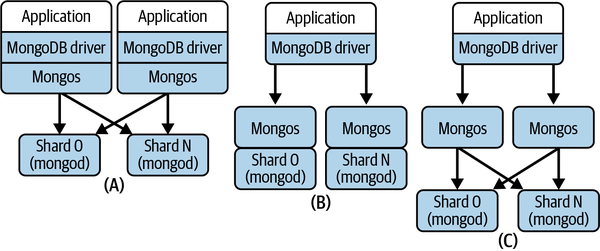

# Chapter 13. Distributed Database Implementations

In the previous three chapters, I’ve described the various distributed system principles and architectures that are widely employed in scalable distributed databases. These make it possible to partition and replicate data over multiple storage nodes, and support different consistency and availability models for replicated data objects.

Precisely how specific databases build on these principles is highly database dependent. Different database providers pick and choose among well-understood approaches, as well as designing their own proprietary mechanisms, to implement the software architecture quality attributes they wish to promote in their products. This means databases that are superficially similar in their architectures and features will likely behave very differently. Even implementations of the same feature—for example, primary election—can vary significantly in terms of their performance and robustness across databases.

Evaluating a database technology for a specific use case therefore requires both knowledge and diligence. You need to understand how the basic architecture and data model of a candidate technology match your requirements in terms of scalability, availability, consistency, and of course other qualities such as security that are beyond the scope of this book. To do this effectively, you need to delve under the hood and gain insights into precisely how high-priority features for your application work. I don’t think I’d surprise anyone by telling you about the dangers of faithfully believing marketing materials. With apologies to George Orwell, all databases are scalable, but some are more scalable than others.

In this chapter I’ll briefly review the salient features of three widely deployed distributed databases, namely Redis, MongoDB, and DynamoDB. Each of these implementations support different data models and make very different trade-offs on the consistency-versus-availability continuum. These design decisions percolate through to the performance and scalability each system offers.

The approach I take can work as a blueprint for carrying out your own database platform comparisons. You’ll see many of the concepts already discussed in this book raising their heads here again. You’ll also see product-specific approaches to solving some of the problems faced in distributed databases. As always, the devil lurks deeply in the details.

# Redis

Since its initial release in 2009, [Redis](https://redis.io) has grown in popularity to become one of the most widely deployed distributed databases. The main attraction of Redis is its ability to act as both a distributed cache and data store. Redis maintains an in-memory data store, known as a *data structure store*. Clients send commands to a Redis server to manipulate the data structures it holds.

Redis is implemented in C and uses a single-threaded event loop to process client requests. In version 6.0, this event loop was augmented with additional threads to handle network operations in order to provide more bandwidth for the event loop to process client requests. This enables a Redis server to better exploit multicore nodes and provide higher throughput.

To provide data safety, the in-memory data structure maintained by a single Redis server can be made durable using two approaches. In one, you can configure a periodic background thread to dump the memory contents to disk. This snapshot process uses the `fork()` system call, and hence can be expensive if the memory contents are large. In high-throughput systems, snapshots are typically configured at intervals of tens of seconds. Snapshots can also be triggered after a configurable number of writes to provide a known bound of potential data loss.

The other approach is to configure Redis to log every command to an append-only file (AOF). This is essentially an operation log, and is persisted by default every second. Using both approaches, namely snapshots and operation logging, provides the greatest data safety guarantees. In the event of a server crash, the AOF can be replayed against the latest snapshot to recreate the server data contents in memory.

## Data Model and API

Redis is a key-value store. It offers a small collection of data structures that applications can use to create data objects associated with unique keys. Each data structure has a set of defined commands that applications use to create, manipulate, and delete data objects. Commands are simple and operate on a single object identified by the key.

The core Redis structures are:

Strings

Strings are versatile in Redis and are able to store both text and binary data with a maximum of 512 MB in length. For example, you can use strings as a random access vector using `get()` and `set()` operations on specified subranges. Strings can also be used to represent and manipulate counters.

Linked lists

These are lists of strings, with operations to manipulate elements at the head, tail, and in the body of the list.

Sets and sorted sets

Sets represent a collection of unique strings. Sorted sets associate a *score* value with each element and maintain the strings in ascending score order. This makes it possible to efficiently access elements in the set by score or rank order.

Hashes

Like a Python map, a Redis hash maps a key value represented as a string to one or more string values. Hashes are the primary Redis structure for representing application data objects such as user profiles or stock inventory.

Operations on a single key are atomic. You can also specify a group of operations as requiring atomic execution using the `multi` and `exec` commands. All commands you place between `multi` and `exec` are called Redis transactions, and are serialized and executed in order. An example of a Redis transaction is in the code example below, which defines a transaction with two operations. The first adds a string representing a new customer order to a `neworders` list. The second modifies the value of the key `lastorder` in the hashmap for the user. A Redis server queues these commands until it receives the `exec` command, and then executes them in sequence:

```
multi
lpush neworders “orderid 600066 customer 89788 item 788990 amount 11 date 12/24/21”
hmset user:89788 lastorder 600066
exec
```

Transactions are essentially the only way to perform operations that move or compute data across multiple types. They are limited, however, in that they only provide atomicity when all commands succeed. If a command fails, there are no rollback capabilities. This means that even if one command fails, the remaining commands in the transaction will still be executed. Similarly, if a crash occurs while the server is executing the transaction, the server is left in an unknown state. Using the AOF durability mechanism, you can fix the state administratively on restart. In reality, Redis transactions are somewhat of a misnomer; they certainly aren’t ACID.

## Distribution and Replication

In its original version, Redis was a single server data store, which somewhat limited its scalability. In 2015, [Redis Cluster](https://oreil.ly/Ut17g) was released to facilitate partitioning and replication of a Redis data store across multiple nodes. Redis Cluster defines 16,384 hash slots for a cluster. Every key is hashed modulo 16,384 to a specific slot, which is configured to reside on a host in the cluster. This is illustrated in [Figure 13-1](#sharding_in_redis_using_hash_slots), in which four nodes with unique identifiers comprise the cluster and an equal range of hash slots is assigned to each.


###### Figure 13-1. Sharding in Redis using hash slots

Each node in the cluster runs a Redis server and an additional component that handles internode communications in the cluster. Redis uses a protocol known as the *Cluster bus* to enable direct TCP communications between every node in the cluster. Nodes maintain state information about all other nodes in the cluster, including the hash slots that each node serves. Redis implements this capability using a gossip protocol that efficiently enables nodes to track the state of all the nodes in the cluster.

Clients can connect to any node in the cluster and submit commands to manipulate specified keys. If a command arrives at a node that does not manage the hash slot for a given object, it looks up the address of the server that hosts the required hash slot. It then responds to the client with a `MOVED` error and the address of the node where the keys in the hash slot reside. The client must then resend the command to the correct node. Typically, Redis client drivers will maintain an internal directory that maps hash slots to server nodes so that redirections do not occur when the cluster is stable.

Another implication of this architecture is that commands in transactions must access keys that reside in the same hash slot. Redis does not have capabilities to execute commands on objects that reside in different hash slots and different nodes. This requires careful data modeling to work around this limitation. Redis does provide support for a workaround using a concept known as hash tags which force keys into the same hash slot based on a substring of the key which is identical for different objects.

You can resize a Redis Cluster to add new nodes or remove nodes from the cluster. When this occurs, hash slots must be assigned to the new nodes or moved from the deleted nodes to existing nodes. You perform this action using the `CLUSTER` administrative command that modifies a node’s cluster configuration information. Once hash slots are reassigned to a different node, Redis migrates the objects in the migrated hash slots automatically. Objects are serialized and sent from their existing home node to the new home node. When an object is successfully acknowledged, it is removed from the original home node and becomes visible to clients at its new location.

You can also replicate every node in a cluster using a primary-replica architecture. The primary updates replicas asynchronously to provide data safety. To scale out read workloads, you can configure replicas to handle read commands. By default, the primary does not wait until replicas acknowledge an update before returning success to the client.

Optionally, the client can issue a `WAIT` command after an update. This specifies the number of replicas that should acknowledge the update and a timeout period after which the `WAIT` should return. A timeout period of zero specifies that the client should block indefinitely. In the following example, the client blocks until two replicas have acknowledged updates, or a 500 milliseconds timeout expires. In either case, Redis returns the number of replicas that have been updated:

```
WAIT 2 500
```

In the event of a primary failure, a replica is promoted to primary. Redis uses a custom primary election algorithm. A replica that detects its primary has failed starts an election and attempts to obtain a vote from a majority of primary nodes in the cluster. If it obtains a majority, it promotes itself to primary and informs the nodes in the cluster. The election algorithm enables replicas to exchange information to try and determine which replica is most up to date. There is no guarantee, however, that the most up-to-date replica will eventually be promoted to primary. Hence some data loss is possible if an out-of-date replica becomes primary.

## Strengths and Weaknesses

One way to think about Redis, and in fact most in-memory databases, is that it is essentially a disk-backed cache with trailing persistence. This architecture has an inherent performance versus data safety trade-off. I’ll dig into how this manifests in Redis in the following subsections.

### Performance

Redis is designed for low latency responses and high throughput. The primary data store is main memory, making for fast data object access. The limited collection of data structures and operations also make it possible for Redis to optimize requests and use space-efficient data object representations. As long as you can design your data model within the constraints of the Redis data types, you should see some very impressive performance.

### Data safety

Redis trades off data safety for performance. In the default configuration, there is a 1-second window between AOF writes during which a crash can cause data loss. You can improve data safety by persisting the AOF on every write. Unfortunately, the performance hit of this configuration is substantial under heavy write loads.

Redis also uses a proprietary replication and primary election algorithm. A replica that is not up to date can be elected as leader, and hence data persisted at the previous leader may be lost.

The bottom line is that you probably don’t want to use Redis (or any in-memory database) as your primary data store if data loss is not an option.[1](ch13.md) But if you can tolerate occasional data loss, Redis can provide very impressive throughput indeed.

### Scalability

Redis Cluster is the primary scalability mechanism for Redis. It allows up to 1,000 nodes to host sharded databases distributed across 16,384 hash slots. Replicas for each primary can also serve read requests, enabling scaling of read workloads. If you need more than 1,000 primary nodes, then you must design your data store accordingly.

### Consistency

Redis replication provides eventual consistency by default based on asynchronous replication. Stale reads from replicas are therefore possible. Using the `WAIT` command, the replication approach becomes effectively synchronous, as the primary does not respond to the client until the requested number of replicas have acknowledged the update. The trade-off of `WAIT` is longer latencies. In addition, it only guarantees data resides in memory in replicas. A replica crash before the next snapshot of AOF write could lead to the update being lost.

### Availability

Redis Cluster implements a tried-and-tested primary-replica architecture for individual database shards. Write availability is inevitably impacted by leader failure. Writes will be unavailable for a given shard until a replica is promoted to leader.

Network faults can split a Redis Cluster deployment into majority and minority partitions. This has implications for both availability and data safety. Client writes can continue to all leader nodes in both partitions as long as they have at least one replica available. If a leader is split from its replicas in a minority partition, writes are still initially available for clients that also reside in the minority partition. After a timeout period, the partitioned leader will stop accepting writes as it cannot send updates to its replicas. Concurrently, a leader election will occur in the majority partition and a replica will be promoted to primary. When the partition heals, the write modifications made to the previous leader while partitioned will be lost.

# MongoDB

MongoDB has been at the forefront of the NoSQL database movement since its first release in 2009. It directly addressed the well-known object-relational impedance mismatch by essentially harmonizing the database model with object models. The resulting document database can be best thought of as a JSON database. You can transform your business objects to JSON and store, query, and manipulate your data directly as a document. No elaborate object-relational mapper is needed. The result is intuitive and simpler business logic.

The initial popularity of MongoDB was driven by its ease of programming and use. The underlying storage engine in the early releases, known as MMAPv1,[2](ch13.md) left something to be desired. MMAPv1 implements memory-mapped files using the `mmap()` system call. Documents in the same logical groupings, known as *collections*, are allocated contiguously on disk. This is great for sequential read performance. But if an object grows in size, new space has to be allocated and all document indexes updated. This can be a costly operation, and leads to disk fragmentation.

To minimize this cost, MMAPv1 initially allocates documents with additional space to accommodate growth. A solution indeed, but perhaps not the most space efficient and scalable. In addition, document locks for updates are obtained at very coarse grain levels (e.g., in various releases, server, database, collection), causing less than spectacular write performance.

Around 2015, the development team reengineered MongoDB to support a pluggable storage engine architecture. Soon after, a new storage engine, WiredTiger, became default in MongoDB v3.2. WiredTiger addresses many of the shortcomings of MMAPv1.[3](ch13.md) It introduces optimistic concurrency control and document-level locking, compression, operational journaling and checkpointing for crash recovery, and its own internal cache for improved performance.

## Data Model and API

MongoDB documents are basically JSON objects with a set of extended types defined in the Binary JSON (BSON) specification. Documents are stored in BSON format and organized in databases comprising one or more collections. Collections are equivalent to a relational database table, but without a defined schema. This means MongoDB collections do not enforce a structure on documents. Documents with different structures can be stored in the same collection. This is a schemaless, or schema-on-read approach that requires the application to interpret a document structure on access.

MongoDB documents are composed of name-value pairs. The value of a field may be any BSON data type. Documents can also incorporate other documents, known as embedded or nested documents, and arrays of values or documents. Every document has an `_id` field which acts as the primary key. Applications can set this key value on document creation, or allow the MongoDB client to automatically allocate a unique value. You can also define secondary indexes on any field, subfield or on multiple fields—a compound key—in a collection.

An example document that you might find in a skier management system is shown in the code below. The field `skiresorts` is represented as an array of strings, and each different ski day is represented by an element in an array of nested documents:

```
{
    _id: 6788321471
    name: { first: "Ian", last: "Gorton" }
    location: "USA-WA-Seattle",
    skiresorts: ["Crystal Mountain", “Mission Ridge”]
    numdays: 2
    season21 {
          {
               day: 1 
               resort: "Crystal Mountain",
               vertical: 30701
               lifts: 27
               date: “12/1/2021”
          }
          {
               day: 2
               resort: "Mission Ridge",
               vertical: 17021
               lifts: 10  
               date: “12/8/2021”
          }
    }     
}
```

As there is no uniform document structure in a collection, the storage engine needs to persist field names and values for every document. For small documents, long field names may end up representing the majority of the document size. Shorter field names can reduce the size of the document on disk, and at scale, in a collection with many millions of documents, this saving will become significant.[4](ch13.md) Optimized document sizes reduce disk usage, memory and cache consumption, and network bandwidth. As usual, at scale, small optimizations can pay back many times in minimizing resource utilization.

To manipulate documents, MongoDB provides APIs for basic CRUD operations. There is a `.find()` method with an extensive set of conditions and operators that emulate an SQL `SELECT` statement for documents in a single collection. MongoDB supports aggregate queries with the `$match` and `$group` operators, and the `$lookup` operator provides SQL `JOIN`-like behavior across collections in the same database. A simple example of querying a collection is shown in the following. The `.find()` operation returns all documents for skiers who have registered more than 20 ski days from the `skiers2021` collection:

```
db.skiers2021.find({ numdays: { $gt: 20 } })
```

Write operations to a single document in MongoDB are atomic. For this reason, if you denormalize your data model to make extensive use of nested documents, you can avoid the complexities of updating multiple documents and distributed transactions in your application code. Before MongoDB version 4.0, this was essentially the only way to ensure consistency for multidocument updates without complex application logic to handle failures.

Since version 4.0, support for ACID, multidocument transactions has been implemented. MongoDB transactions [use two-phase commit](https://oreil.ly/3K2XG) and leverage the underlying WiredTiger storage engine’s snapshot isolation capabilities. Snapshot isolation is a weaker guarantee than the serialization implied by the ACID semantics. This enables higher performance than serialization and avoids most, but not all, of the concurrency anomalies that serializability avoids. Snapshot isolation is actually the default in many relational databases, including Oracle and PostgreSQL.

## Distribution and Replication

To scale horizontally, you can choose between two data partitioning or sharding strategies with MongoDB. These are hash-based and range-based sharding, respectively. You define a shard key for each document based on one or more field values. Upon document creation, MongoDB then chooses a database shard to store the document based on either:

- The result of a hash function applied to the shard key
- The shard that is defined to store the shard key range within which the key resides

Sharded deployments in MongoDB require you to deploy several distinct database components. The *mongod* process is the MongoDB database daemon that must run on every shard. The *mongos* process is responsible for processing database client queries by routing requests to the targeted shard(s) and returning the results to the client. Clients issue MongoDB API calls using a MongoDB driver. *Config servers* store database cluster configuration metadata, which the *mongos* uses to route queries to the correct shards based on shard key values. This architecture is depicted in [Figure 13-2](#mongodb_database_partitioning_architect).


###### Figure 13-2. MongoDB database partitioning architecture

The *mongos* process acts as a proxy between the client’s MongoDB driver and the database shards. All client requests must pass through a *mongos* instance. A *mongos* has no persistent state, and simply caches the cluster configuration information it obtains from the *config servers*.

The *mongos* process is the client’s only query interface. It is therefore critical for performance and scalability that sufficient *mongos* processing capacity is available. Precisely how you configure *mongos* deployments is highly dependent on your applications needs, and MongoDB provides you with flexibility to design your system to satisfy the required workload. There are three basic alternatives, as depicted in [Figure 13-3](#mongodb_database_deployment_alternative):



###### Figure 13-3. MongoDB database deployment alternatives

Configuration (A)

Deploy a *mongos* on each application server that acts as a MongoDB client. This reduces latency by making every client request to *mongos* a local call.

Configuration (B)

Deploy a *mongos* on every database shard. In this configuration, a *mongos* can communicate with the shard locally.

Configuration (C)

Deploy a collection of *mongos* on their own dedicated hardware. You incur additional network latency communicating with the client and database shards. The trade-off is that the *mongos* load is eliminated from the application server and database nodes, and the *mongos* processes are allocated more exclusive processing capacity.

Within each shard, MongoDB stores documents in storage units known as chunks. By default a chunk is a maximum of 64 MB. When a chunk grows beyond its maximum configured size, MongoDB automatically splits the chunk into two or more new chunks. Chunk splitting is a metadata change, triggered by inserts or updates, and does not involve any data movement.

As the data grows across the cluster, the data distribution across shards can become unbalanced. This creates uneven loads on shards and can produce hotspots—shards that are heavily loaded with requests for commonly accessed keys. Hotspots impair query performance. For this reason, MongoDB runs a cluster balancer process on the primary *config server*. The cluster balancer monitors the data distribution across shards and if it detects that a (configurable) migration threshold has been reached, it triggers a chunk migration. Migration thresholds are based on the difference between the number of data chunks between the shard with the most chunks and the shard with the least chunks for a collection.

Chunk migration is initiated by the balancer. It sends a `moveChunk` command to the source shard. The source shard takes responsibility for copying the chunk to the destination. While migration is occurring, the source shard handles any updates to the chunk, and it ensures these updates are synchronized to the destination shard after the migration has completed. Finally, the source shard updates the cluster configuration metadata at the *config server* with the migrated chunk’s new location, and deletes its copy of the chunk.

MongoDB also supports enhanced availability and read query capacity through shard replication. Each primary shard can have multiple secondaries, and collectively these are known as a replica set. All client writes are processed by the primary, and it logs all changes to an *operations log (oplog)* data structure. Periodically, the primary ships its oplog to the secondaries, which in turn apply the modifications in the oplog to their local database copy. This approach is illustrated in [Figure 13-4](#mongodb_replica_sets).


###### Figure 13-4. MongoDB replica sets

Nodes in a replica set send periodic heartbeat messages, by default every two seconds, to confirm member availability. If a secondary node does not receive a heartbeat message from a primary in a (by default) 10-second period, it commences a leader election. The leader election algorithm is [based on Raft](https://oreil.ly/ymXl5). In addition, if a leader is partitioned in a minority partition, it will step down as leader. A new leader will subsequently be elected from the majority partition or when the partition heals. In either case, writes are not available to the replica set while the new leader is elected.

MongoDB supports tunable consistency. You can control replica consistency for writes using MongoDB *write concerns*. In version 5.0, the default is *majority*, which ensures writes are durable at the majority of nodes in a replica set before success is acknowledged. In earlier versions, the default setting only waited for the primary to make a write durable, trading off performance against data safety.

Similarly, *read preferences* make it possible to configure which nodes in a replica set may handle reads. By default, requests are sent to primaries, ensuring consistent reads. You can modify this to trade off read performance and consistency. For example, you can specify reads may be handled by any replica (see [Figure 13-4](#mongodb_replica_sets)) or the nearest replica as measured by shortest round-trip time. In either case, stale reads are possible. Reading from the nearest replica is especially useful in widely geographically distributed deployments. You can locate the primary in one data center and place replicas in other data center locations that are closer to the origins of client read requests. This reduces network latency costs for replica reads.

## Strengths and Weaknesses

MongoDB has matured massively since its initial releases. The attractive programming model drove initial popularity, and the core platform has been evolved by MongoDB engineers over more than a decade to improve performance, availability, scalability, and consistency. This has resulted in a powerful distributed database platform that applications can configure and tune to meet their requirements.

### Performance

Initial MongoDB releases suffered from poor write performance. This has improved dramatically over the last decade, fueled to a large extent by the WiredTiger storage layer. Like most databases, each node’s performance benefits greatly from large local memory space allocated for internal caching. You can also choose read preferences and write concerns that favor raw performance over consistency if application requirements allow.

### Data safety

The default *majority* write concern ensures updates are durable on a quorum of nodes in the replica set. You can achieve greater write performance by specifying that updates must only be made durable on the primary. This creates the potential for data loss if the primary crashes before updates are replicated. The Raft-based leader election algorithm ensures that only an up-to-date secondary can be promoted to leader, again guarding against data loss.

### Scalability

You can scale data collections horizontally using sharding and by deploying multiple *mongos* query router processes. Automatic data rebalancing across nodes helps spread requests evenly across the cluster, utilizing cluster capacity. You can add new and retire existing nodes, and the MongoDB cluster balancer automatically moves chunks across the cluster to utilize capacity. You can scale read loads by enabling reads to secondaries in a replica set.

### Consistency

The availability of ACID transactions across multiple sharded collections provides developers with transaction consistency capabilities. You can also achieve replica consistency using appropriate write concerns settings. Session-based causal consistency provides RYOWs capabilities. You can also ensure linearizable reads and writes for single documents. This requires a read concern setting of *linearizable* and a write concern value of *majority*.[5](ch13.md)

### Availability

Replica sets are the primary mechanism to ensure data availability. You should configure *config servers* as a replica set to ensure the cluster metadata remains available in the face of node failures and partitions. Your configurations also need to deploy sufficient *mongos* query router processes, as clients cannot query the database if a *mongos* process is not reachable.

# Amazon DynamoDB

Amazon’s DynamoDB is a core service offering in the AWS Cloud. Its origins go back to the original research published by Werner Vogels and his team on the Dynamo database.[6](ch13.md) Dynamo was built for usage on Amazon’s website. Lessons learned internally, especially about the need for ease of management, led to the evolution of Dynamo to become the publicly available, fully managed DynamoDB database service in 2012.

As a fully managed database, DynamoDB minimizes the database administration effort required for applications. Replicated database partitions are automatically managed by DynamoDB, and data is repartitioned to satisfy size and performance requirements. Data items are hashed across partitions based on a user-defined partition key. Individual data items comprise nested, key-value pairs, and are replicated three times for data safety. The point-in-time recovery feature automatically performs incremental backups and stores them for a rolling 35-day period. Full backups can be run at any time with minimal effect on production systems.

As part of AWS, you are charged based on both the amount of storage used and the application’s DynamoDB usage. Storage charges are straightforward. You basically pay for each GB of data storage. Charging for application usage is more complex, and affects both performance and scalability. Basically you pay for every read and write you make to your database. You can choose between two modes, known as capacity modes. The on-demand capacity mode is intended for applications that experience unpredictable traffic profiles with rapid spikes and troughs. DynamoDB employs its adaptive capacity capabilities to attempt to ensure the database deployment is able to satisfy performance and scalability requirements. You are [charged for every operation](https://oreil.ly/vqtqw).

For applications with more predictable load profiles, you can choose *provisioned* capacity mode. You specify the number of reads and writes per second that your DynamoDB database should provide in terms of read and write capacity units. Should your application exceed this read/write capacity, requests may be throttled. DynamoDB provides burst capacity, based on recently unused provisioned capacity, to try to avoid throttling. You can also define a database to utilize autoscaling based on minimum and maximum provisioned capacity limits. Autoscaling dynamically adjusts the provisioned capacity on your behalf, within the specified limits, in response to observed traffic load.

DynamoDB has many optional features that either make it easier for you to write applications or provide your applications with higher levels of management automation. In general, the rule of thumb is that the more you ask DynamoDB to do for you, the more you pay. For example, if you enable point-in-time backups, then you pay per GB per month. If you disable this feature, you pay nothing. This is pretty much the way the world works with all cloud-based managed services. Caution is needed in how prolifically you use these options, especially at scale. But in most cases, your costs are reduced considerably due to the reduction in administrative and management effort.

## Data Model and API

DynamoDB organizes data items in logical collections known as tables. Tables contain multiple items, which are uniquely identified by a primary key. Each item has a collection of uniquely identified attributes, which can optionally be nested. An individual item is restricted to 400 KB in size. DynamoDB is schemaless—items in the same table can have a different set of attributes.

In terms of data types, DynamoDB is fairly limited. Scalar types supported include strings, binary, numbers, and Booleans. You can build documents using list and map data types, and these can be nested up to 32 levels deep. You can also use sets to create a named attribute containing unique values. The code below depicts a DynamoDB item as an example. The primary key is `skierID`. The `skiresorts` field is represented by a list, and `season21` is a map containing nested documents representing each of the skier’s visits to a resort:

```
{
 "skierID": "6788321471",
    "Name": {
          "last": "Gorton",
          "first": "Ian"
    },
 "location": "USA-WA-Seattle",
 "skiresorts": [
          "Crystal Mountain",
          "Mission Ridge"
 ],
 "numdays": "2",
 "season21": {
    "day1": {
          "date": "12/1/2021",
          "vertical ": 30701,
          "lifts": 27,
          "resort": "Crystal Mountain"
  },
    "day2": {
          "date": "12/8/2021",
          "vertical": "17021",
          "lifts": 10,
          "resort": "Mission Ridge"
    }
 }
}
```

The primary key value for an item acts as the partition key, which is hashed to map each item to a distinct database partition. You can also create composite primary keys by defining a sort key using items in the table. This creates the ability to group logically related items in the same partition by using the same primary key and a unique sort key; DynamoDB still hashes the primary key to locate the partition, and it then stores all items with the same partition key value together, in sorted order by sort key value.[7](ch13.md)

As a simple example using the skier item in the code above, you could create a unique composite key using the `location` as the primary key and the `skierID` as the sort key. This would group together all skiers in the same location in the same partition, and store them in sorted order.

To support alternative efficient query paths, you can create multiple secondary indexes on a table, referred to as the base table. There are two types of secondary indexes, local and global.

A local secondary index must have the same partition key as the base table, and a different sort key. Local indexes are built and maintained on the same partition as the items to which they refer. Local index reads and writes consume the capacity units allocated to the base table.

Global secondary indexes can have different primary and sort keys to the base table. This means index entries can span all partitions for the table, hence the global terminology. A global secondary index is created and maintained in its own partition, and requires capacity to be provisioned separately from the base table.

For data access, you have two choices for APIs in DynamoDB. The so-called *classic* API provides single- and multiple-item CRUD capabilities using variations of four core operations, namely `PutItem`, `GetItem`, `DeleteItem`, and `UpdateItem` operations. The following Java example shows a `GetItem` API. It retrieves the complete document identified by the `skierID` primary key value specified in the API:

```
Table table = dynamoDB.getTable("Skiers");  
Item item = table.getItem("skierID", “6788321471”);
```

If you want to read or write to multiple items at the same time, you can use the `BatchGetItem` and `BatchWriteItem` operations. These are essentially wrappers around individual `GetItem` and `PutItem`/`DeleteItem`/`UpdateItem` APIs. The advantage of using these batch versions is that all the requests are submitted in a single API call. This reduces the number of network round trips from your client to DynamoDB. Your performance also benefits because DynamoDB executes each individual read or write operation in parallel.

The more recently available alternative API, known as PartiQL, is an SQL-derived dialect. You submit SQL statements using the `ExecuteStatement` and `BatchExecuteStatement` APIs. DynamoDB translates your SQL statements into individual API calls as defined in the classic API.

You also have ACID transaction capabilities using the `ExecuteTransaction` API. This enables you to group multiple CRUD operations to multiple items both within and across tables, with guarantees that all will succeed, or none will. Under the hood, DynamoDB uses the 2PC algorithm to coordinate transactions across distributed partitions.

Transactions [have an impact](https://oreil.ly/adQml) on capacity provisioning. In provisioned mode, each transaction will incur two reads or writes to each data item accessed in the transaction. This means you have to plan your read and write capacity units accordingly. If sufficient provisioned capacity is not available for any of the tables accessed in the transaction, the transactions may fail.

## Distribution and Replication

As a managed service, DynamoDB simplifies data distribution and replication from the application’s perspective. You define a partition key for items, and DynamoDB hashes the key to store three copies of every item. To enhance availability, the nodes that host each partition are in different availability zones within a single AWS region. Availability zones are designed to fail independently of others within each AWS region.

Each partition has a leader and two followers. When you issue an update request to an item, you receive an HTTP 200 response code when the update is made durable on the leader. Updates then propagate asynchronously to replicas.

By default, read operations can access any replica, leading to the potential for stale reads. If you want to ensure you read the latest value of an item, you can set the `ConsistentRead` parameter in read APIs to `true`. This directs writes to the leader node, which has the latest value. Strongly consistent reads consume more capacity units than eventually consistent reads, and may fail if the leader partition is unavailable.

DynamoDB manages your partitions, and its adaptive capacity capabilities will automatically repartition data, while maintaining availability, under the following circumstances:

- A partition exceeds the size limits for partitions, which is approximately 10 GB.
- You increase the provisioned throughput capacity for a table, requiring performance that is higher than the existing partitions can support.
- A table configured to use on-demand capacity experiences a spike in requests that exceeds the throughput it is able to sustain.

By default, DynamoDB tables reside in a single AWS region. AWS regions are tied to physical resources known as data centers that are located in different places around the world. For applications that serve large-scale, globally distributed user populations, latencies can be potentially prohibitive if requests must travel long distances to the region where your DynamoDB database resides.

As an example, imagine the skier management system from earlier in this chapter has ski resorts all over the globe, and uses a DynamoDB database located in the US west coast region (e.g., us-west-1). Skiers at European and Australian resorts would experience considerably longer latencies to access the system than those located in North America.

You can address these latencies by deploying your tables across multiple regions using DynamoDB global tables. Global tables maintain additional replicas in multiple AWS regions, and replicate all items across all the regions you wish to locate the table. Updates made in one region propagate to other replicas asynchronously. You also pay storage charges at each region, increasing the overall application costs. This scheme is shown in [Figure 13-5](#dynamodb_global_tables), with global tables located in the US, India, and Italy.


###### Figure 13-5. DynamoDB global tables

Importantly, global tables are multileader, meaning you can update the leader replica in any region. This creates the potential for conflicts if the same item is concurrently updated in two regions. In this case, DynamoDB uses a last writer wins conflict resolution strategy to converge replicas on a single value.

Global tables have some subtle restrictions you need to be aware of. These concern strongly consistent reads and transactions, which both operate at the scope of a single region:

- A strongly consistent read returns the latest value for an item within the region that the read takes place. If the same item key has been more recently updated in another region, this value will not be returned. It may take several seconds for the latest version to be replicated across regions.
- The ACID properties of transactions are only guaranteed within the region that processes the transaction. Once the transaction has been committed in this source region, DynamoDB replicates the resulting updates to the other regions. The updates flow using the standard replication protocol, meaning you may see partial updates in destination regions while all the updates from the transaction are applied.

## Strengths and Weaknesses

It’s not easy to divorce the increasing popularity of DynamoDB from the ever-growing usage of the AWS Cloud. DynamoDB exists as part of the powerful AWS ecosystem of tools and technologies. The benefits of this can be considerable. For example, AWS provides integrated performance monitoring for DynamoDB using CloudWatch, and integrates seamlessly with AWS Lambda serverless functions. If you are deploying your systems to AWS, DynamoDB can be an excellent candidate for your persistence layer. Like any database of course, there are things you need to carefully assess. And as always with public cloud-based systems, you have to be aware of the costs your applications accrue.

### Performance

The DynamoDB APIs are relatively primitive and hence can be generally executed with very low latencies. Your data model can also exploit composite keys and secondary indexes to provide efficient access to your data. Queries that exploit indexes rather than performing table scans will execute faster and consume fewer capacity units, which also reduces costs. Crafting an appropriate data model that supports low latency queries is undoubtedly not a straightforward exercise[8](ch13.md) and requires care to achieve performance requirements. At additional cost, you can deploy the [DynamoDB Accelerator (DAX) in-memory cache](https://oreil.ly/N2Q9K) that can further reduce query latencies.

### Data safety

Updates are acknowledged when the leader partition makes the modification durable, and all items in tables are replicated across three partitions in the local region. Using global tables increases the replication factor, but does introduce the potential for data loss if the same item is concurrently updated in two different regions. Point-in-time and on-demand backups are fully integrated with the AWS environment.

### Scalability

DynamoDB’s adaptive capacity is designed to rebalance large databases to provide sufficient partitions to match observed demand. This provides excellent scalability for workloads that exert relatively even loads across partitions.

A well-known problem revolves around hotkeys. Provisioned capacity is allocated on a per-table basis. This means if your application has 10 partitions, each partition receives a tenth of the overall table capacity. If requests disproportionately access a small number of *hot keys*, the partitions that host those items can consume the provisioned capacity for the table. This can cause requests to be rejected due to a lack of provisioned capacity.

[Adaptive capacity](https://oreil.ly/gHIuz) in extreme cases may create a partition that holds a single item with a hotkey. In this case, requests to the item are limited to the maximum throughput a single partition can deliver of 3,000 read capacity units or 1,000 write capacity units per second.

### Consistency

Replicas are eventually consistent, so stale reads from nonleader replicas are possible. You can obtain the latest replica value using strongly consistent reads at the cost of additional capacity unit usage and latency. Reads from global indexes are always eventually consistent. You can also use ACID transactions to perform multi-item updates.[9](ch13.md) Both strongly consistent reads and transactions are scoped to a region and hence do not provide consistency guarantees with global tables.

### Availability

DynamoDB provides users with a service-level agreement (SLA). This basically guarantees 99.999% availability for global tables and 99.99% availability for single-region tables. AWS outages do occur occasionally; for example, a major one [brought down many applications in December 2021](https://oreil.ly/Wc58e) and it’s possible a failure in a part of the AWS ecosystem could make your data unavailable. It’s basically a risk you take when you adopt a cloud-based service, and the reason that deployment strategies like hybrid and multicloud are becoming more and more popular.

# Summary and Further Reading

In this chapter, I’ve described some of the major architectural features of three prominent NoSQL databases, namely Redis, MongoDB, and DynamoDB. Each is a powerful distributed platform in its own right, with large user communities. Underneath the hood, the implementations vary considerably. This affects the performance, scalability, availability, and consistency you can expect from applications built on each platform.

Redis favors raw performance and simplicity over data safety and consistency. MongoDB has a richer feature set and is suited to a broad range of business applications that require future growth. DynamoDB is a fully managed service and supports low-latency key-value lookups. It is deeply integrated into the AWS Cloud infrastructure, providing automatic scalability and availability guarantees. Similarly, you can use cloud-hosted implementations of both MongoDB and Redis (and several other databases) that are supported by major cloud vendors to simplify your operations and management.

In reality, there’s no perfect solution or approach for choosing a distributed database to match your application needs. There are simply too many dimensions and features to thoroughly evaluate even for a small number of candidate platforms. The best you can do most of the time is serious due diligence, and ideally build a proof-of-technology prototype that lets you test-drive one or two platforms. There will always be unexpected roadblocks that make you curse your chosen platform. Software engineering at scale is an imperfect practice, I’m afraid, but with deep knowledge of the issues involved, you can usually avoid most disasters!

For a book with excellent coverage (both breadth and depth) of distributed database systems, *Principles of Distributed Database Systems*, 4th ed. (Springer, 2020) by M. Tamer Özsu and Patrick Valduriez is one to have on your bookshelf.

An excellent place for gaining insights into how some of the largest systems on the internet operate is [*highscalability.com*](https://highscalability.com). For example, recent posts [describe the design of Tinder](https://oreil.ly/h12rc), which uses DynamoDB among a whole collection of technologies, and [Instagram](https://oreil.ly/4tPfh), built upon Cassandra and Neo4j.

Finally, the complexity of managing distributed databases at scale is driving many businesses to use managed services such as DynamoDB. Platforms providing equivalent “serverless database” capabilities are emerging for many popular databases. Examples are MongoDB Atlas, Astra DB for Cassandra, and Yugabyte Cloud.

[1](ch13.md) Emil Koutanov goes into more detail with an [excellent analysis of data safety in Redis](https://oreil.ly/MOBIq).

[2](ch13.md) MMAPv1 was deprecated in MongoDB version 4.0. You can find its documentation at [*https://oreil.ly/uWiNx*](https://oreil.ly/uWiNx).

[3](ch13.md) A good comparison of the two file systems can be found on the [Percona blog](https://oreil.ly/NVLTb).

[4](ch13.md) This [blog post](https://oreil.ly/SFe45) by David Murphy illustrates how a 25% reduction in document size can be achieved with shorter field names.

[5](ch13.md) A slightly out-of-date but still fascinating analysis of MongoDB consistency is provided by [this Jepsen report](https://oreil.ly/Elw1M).

[6](ch13.md) G. Decandia et al. “Dynamo: Amazon’s Highly Available Key-Value Store.”. In Proceedings of Twenty-First ACM SIGOPS Symposium on Operating Systems Principles—SOSP ’07, p. 205. New York, NY, USA: ACM.

[7](ch13.md) For more examples of the power of sort keys, see [*https://oreil.ly/5G5le*](https://oreil.ly/5G5le).

[8](ch13.md) Best practices for data modeling are described in the [AWS documentation](https://oreil.ly/Dr1eb).

[9](ch13.md) An explanation of transaction isolation levels is at [*https://oreil.ly/kDRnC*](https://oreil.ly/kDRnC).
