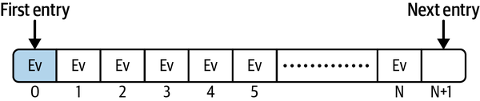
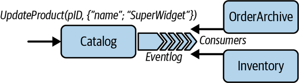
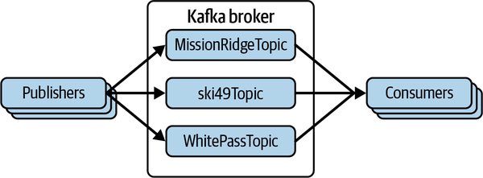
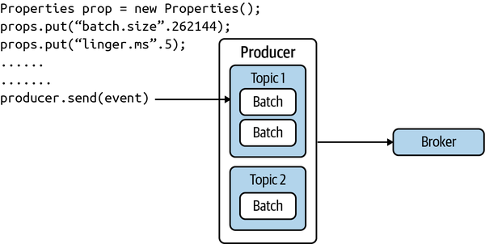
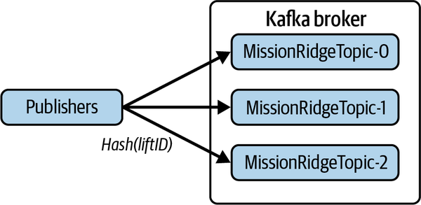
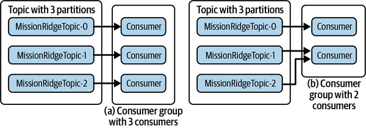
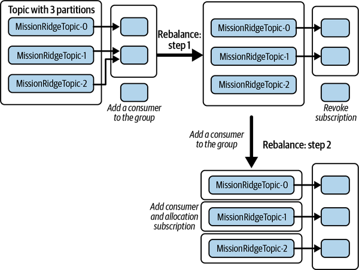
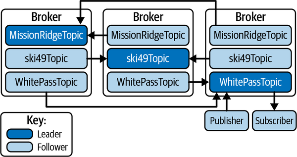

# Chapter 14. Scalable Event-Driven Processing

In [Chapter 7](ch07.md), I described the benefits and basic primitives of asynchronous messaging systems. By utilizing a messaging system for communications, you can create loosely coupled architectures. Message producers simply store a message on a queue, without concern about how it is processed by consumers. There can be one or many consumers, and the collection of producers and consumers can evolve over time. This buys you immense architectural flexibility and has benefits in improving service responsiveness, smoothing out request arrival spikes through buffering, and maintaining system processing in the face of unavailable consumers.

Traditionally, the message broker technologies used to implement asynchronous systems focus on message transit. A broker platform such as RabbitMQ or ActiveMQ supports collections of queues that are used as temporary FIFO-based memory or disk-based storage. When a consumer accesses a message from a queue, the message is removed from the broker. This is known as *destructive consumer semantics*. If publish-subscribe messaging is used, brokers implement mechanisms to maintain messages in queues until all active subscribers have consumed each message. New subscribers do not see old messages. Brokers also typically implement some additional features for message filtering and routing.

In this chapter I’m going to revisit asynchronous systems through the lens of event-driven architectures. Event-driven systems have some attractive features for scalable distributed applications. I’ll briefly explain these attractions, and then focus on the Apache Kafka platform. Kafka is designed to support event-driven systems at scale, utilizing a simple persistent message log data structure and nondestructive consumer semantics.

# Event-Driven Architectures

Events represent that *something interesting* has happened in the application context. This might be an external event that is captured by the system, or an internally generated event due to some state change. For example, in a package shipping application, when a package arrives at a new location, a barcode scan generates an event containing the package identifier, location, and time. A microservice in a car hire system that manages driver details could emit an event when it detects a driver’s license has expired. Both these examples demonstrate using events for notifications. The event source simply emits the event and has no expectations on how the event might be processed by other components in the system.

Events are typically published to a messaging system. Interested parties can register to receive events and process them accordingly. A package shipping barcode scan might be consumed by a microservice that sends a text to the customer awaiting the package. Another microservice might update the package’s delivery state, noting its current location. The expired license event may be utilized to send the driver an email to remind them to update their information. The important thing is that the event source is oblivious to the actions that are triggered by event generation. The resulting architecture is loosely coupled and affords high levels of flexibility for incorporating new consumers of events.

You can implement an event-based architecture using messaging systems like RabbitMQ’s publish/subscribe features. Once every subscriber has consumed an event, the event is removed from the broker. This frees up broker resources, but also has the effect of destroying any explicit record of the event.

It turns out that keeping a permanent record of immutable events in a simple log data structure has some useful characteristics. In contrast to FIFO queues managed by most message brokers, an event log is an append-only data structure, as shown in [Figure 14-1](#a_log_data_structure). Records are appended to the end of the log and each log entry has a unique entry number. The sequence numbers explicitly capture the order of events in the system. Events with a lower sequence number are defined to have occurred before entries with a higher sequence number. This order is especially useful in distributed systems and can be exploited to produce useful application insights and behaviors.



###### Figure 14-1. A log data structure

For example, in the package shipping example, you could process the log to discover the number of packages at each location at any instant, and the duration that packages reside at locations before being loaded onto the next stage of delivery. If a package gets misplaced or delayed, you can generate another event to trigger some remedial action to get a package moving again. These analyses become straightforward to implement as the log is the single source of truth about where every package is (and was) at any instant.

Another common use case for event-based systems is keeping replicated data synchronized across microservices. For example, a manufacturer might change the name of a product by sending an update request to the *Catalog* microservice. Internally, this microservice updates the product name in its local data store and emits an event to an event log shared with other microservices in the application. Any microservice that stores product details can read the event and update its own copy of the product name. As shown in [Figure 14-2](#using_an_event_log_to_replicate_state_c), the event log is essentially being used for replication across microservices to implement state transfer.



###### Figure 14-2. Using an event log to replicate state changes across microservices

The persistent nature of the event log has some key advantages:

- You can introduce new event consumers at any time. The log stores a permanent, immutable record of events and a new consumer has access to this complete history of events. It can process both existing and new events.
- You can modify existing event-processing logic, either to add new features or fix bugs. You can then execute the new logic on the complete log to enrich results or fix errors.
- If a server or disk failure occurs, you can restore the last known state and replay events from the log to restore the data set. This is analogous to the role of the transaction log in database systems.

As with all things, there are downsides to immutable, append-only logs. I briefly describe one of these, deleting events, and Apache Kafka’s related capabilities in the following sidebar. You can read an awful lot more about designing event-driven architectures and patterns such as event collaboration and event sourcing. I’ll point you to several excellent sources in [“Summary and Further Reading”](#summary_and_further_reading-id000064). For the remainder of this chapter, however, I want to explore the features of the Apache Kafka platform.

##### Deleting Events from a Log

Some use cases require log entries to be deleted. A prominent one is the *right to be forgotten* regulatory requirements of the European Union’s General Data Protection Regulation (GDPR) laws. Append-only immutable logs are not designed for deletion of entries, which can make deleting entries problematic.

Apache Kafka provides two main mechanisms for log entry deletion. There are:

Time to live

Log entries are deleted after a default period of two weeks. You can adjust this to meet your requirements for log entry retention and deletion.

Compacted topics

Topics can be configured to only retain the most recent entry for a given event key. If you need to delete an existing log entry, you simply write a new one with the same key and a null value. Kafka will then mark the older entry for deletion. Events are actually marked for deletion in compacted topics and removed at some time later when a period log compaction task runs. Again, the frequency of this task is configurable.

# Apache Kafka

At its core, Kafka is a distributed persistent log store. Kafka employs what is often called a *dumb broker/smart clients* architecture. The broker’s main capabilities revolve around efficiently appending new events to persistent logs, delivering events to consumers, and managing log partitioning and replication for scalability and availability. Log entries are stored durably and can be read multiple times by multiple consumers. Consumers simply specify the log offset, or index, of the entries they wish to read. This frees the broker from maintaining any complex consumer-related state.

The resulting architecture has proven to be incredibly scalable and to provide very high throughput. For these reasons, Kafka has become one of the most widely used open source messaging platforms in use in modern systems.

Kafka originated at LinkedIn from efforts to streamline their system integration efforts.[1](ch14.md) It migrated to become an [Apache project](https://oreil.ly/Z4RvD) in 2012. The Kafka broker, which is the focus of the following subsections, sits at the core of a suite of related technologies. These are:

Kafka Connect

This is a framework designed for building connectors to link external data systems to the Kafka broker. You can use the framework to build high-performance connectors that produce or consume Kafka messages from your own systems. Multiple vendors also provide prefabricated connectors for pretty much any data management system most of you can probably think of\

Kafka Streams

This is a lightweight client library for building streaming applications from events stored in the Kafka broker. A data stream represents an unbounded, continuously updating data set. Streaming applications provide useful real-time insights by processing data in batches or time windows. For example, a supermarket may process a stream of incoming item purchases to discover the highest selling items in the last hour. This could be used to trigger reordering or restocking of items that are unexpectedly selling quickly. Streaming applications and platforms are the topic I cover in depth in [Chapter 15](ch15.md), so I won’t return to Kafka Streams here.

Kafka supports highly distributed cluster deployments in which brokers communicate to distribute and replicate event logs. This requires management of cluster metadata, which essentially specifies where the multiple event logs live in the cluster, and various other elements of cluster state. Kafka delegates this metadata management to [Apache ZooKeeper](https://oreil.ly/OOsna).

ZooKeeper is a highly available service that is used by many distributed platforms to manage configuration information and support group coordination. ZooKeeper provides a hierarchical namespace similar to a normal filesystem that Kafka uses to maintain the cluster state externally, making it available to all brokers. This means you must create a ZooKeeper cluster (for availability) and make this accessible to the brokers in your Kafka cluster.[3](ch14.md) After that, Kafka’s use of ZooKeeper is transparent to your application.

## Topics

Kafka topics are the equivalent of queues in general messaging technologies. In Kafka, topics are managed by a broker and are always persistent, or durable. One or more producers send events to a topic. Topics are implemented as append-only logs, meaning new events are always written to the end of the log. Consumers read events by specifying the name of the topic they wish to access and the index, or offset, of the message they want to read.

Reading an event from a topic is nondestructive. Each topic persists all events until a topic-specific configurable event retention period expires. When events have been stored for longer than this retention period, they are automatically removed from the topic.

Brokers take advantage of the append-only nature of logs to exploit the linear read and write performance capabilities of disks. Operating systems are heavily optimized for these data access patterns, and use techniques such as prefetching and caching of data. This enables Kafka to provide constant access times regardless of the number of events stored in a topic.

Returning to the skier management system example from [Chapter 13](ch13.md), [Figure 14-3](#a_kafka_broker_managing_topics_for_thre) shows a Kafka broker that supports three topics used to capture ski lift ride events from three different ski resorts. Each time a skier rides a lift, an event is generated and written to the corresponding topic for that resort by a Kafka producer. Consumers can read events from the topic to update the skier’s profile, send alerts for high-traffic lifts, and various other useful analytical functions related to the ski resort management business.



###### Figure 14-3. A Kafka broker managing topics for three ski resorts

## Producers and Consumers

Kafka provides APIs for both producers to write events and consumers to read events from a topic. An event has an application-defined key and an associated value, and a publisher-supplied timestamp. For a lift ride event, the key might be the *skierID* and the value would embed the *skiLiftID* and a timestamp for when the skier rode the lift. The publisher would then send the event to the topic for the appropriate resort.

Kafka producers send events to brokers asynchronously. Calling the `pro⁠ducer​.send()` operation causes the event to be written to a local buffer in the producer. Producers create batches of pending events until one of a configurable pair of parameters is triggered. The whole event batch is then sent in one network request. You can, for example, use these parameters to send the batch to the broker as soon as the batch size exceeds a specified value (e.g., 256 K) or some latency bound (e.g., 5 ms) expires. This is illustrated in [Figure 14-4](#kafka_producer) along with how to set these configuration parameter values using a `Properties` object. Producers build independent batches in local buffers for each topic they deliver events to. Batches are maintained in the buffer until they are successfully acknowledged by the broker.



###### Figure 14-4. Kafka producer

Accumulating events in batches enables Kafka to incur less network round trips to the broker to deliver events. It also enables the broker to perform fewer, larger writes when appending event batches to the topic. Together, these efficiency measures are responsible for much of the high throughput that a Kafka system can achieve. Buffering events on producers allows you to trade off the additional latency that is incurred while batches are accumulated (the `linger.ms` value) for improved system throughput.

The following code snippet shows a simple method that sends a ski lift ride event to a topic that represents the resort on the broker. The `send()` method returns a `Future` of type `RecordMetaData`. Calls to `Future.get()` will block until the broker has appended the event to the topic and returns a `RecordMetaData` object. This contains information about the event in the log such as its timestamp and offset:

```
public Future<RecordMetadata> sendToBroker(final String skierID, final String 
                                                 liftRideEvent) {

       // initialization of producer and resortTopic omitted for brevity
       final ProducerRecord<String, String> producerRecord = new    
          ProducerRecord<>(resortTopic, skierID, liftRideEvent);  
       return producer.send(producerRecord);                 
}
```

Kafka supports different event delivery guarantees for producers through the `acks` configuration parameter. A value of zero provides no delivery guarantee. This is a “fire-and-forget” option—events can be lost. A value of one means an event will be acknowledged by the broker once it has been persisted to the destination topic. Transient network failures may cause the producer to retry failed events, leading to duplicates. If you can’t accept duplicates, you can set the `enable-idempotence` configuration parameter to `true`. This causes the broker to filter out duplicate events and provide exactly-once delivery semantics.

Kafka consumers utilize the pull model to retrieve events in batches from a topic. When a consumer first subscribes to a topic, its offset is set to the first event in the log. You then call the `poll()` method of the consumer object in an event loop. The `poll()` method returns one or more events starting from the current offset. Similarly to producers, you can tune consumer throughput using configuration parameters that specify how long a consumer waits for events to be available and the number of events returned on each call to `poll()`.

The following simple consumer code example shows an event loop that retrieves and processes a batch of events:

```
while (alive) {
  ConsumerRecords<K, V> liftRideEvents = consumer.poll(LIFT_TOPIC_TIMEOUT);
  analyze(liftRideEvents); 
  consumer.commitSync();
}
```

Kafka increments the consumer’s offset in the topic automatically to point to the next unprocessed event in the topic. By default Kafka will automatically commit this value such that the next request to fetch events will commence at the new offset. The commit message is actually sent as part of the `poll()` method, and this commits the offset returned by the previous `poll()` request. Should your consumer fail while processing the batch of events, the offset is not committed as `poll()` is not called. This gives your consumer at-least-once delivery guarantees, as the next fetch will start at the same offset as the previous one.

You can also choose to manually commit the offset in consumers. You do this by calling the `consumer.commitSync()` API, as shown in the example. If you call `commitSync()` before you process the events in a batch, the new offset will be committed. This means if the consumer fails while processing the event batch, the batch will not be redelivered. Your consumers now have at-most-once delivery guarantees.

Calling `commitSync()` after you have processed all the events in a batch, as in the example, gives your consumers at-least-once delivery guarantees. If your consumer crashes while processing a batch of events, the offset will not be committed and when the consumer restarts the events will be redelivered. Consumers can also at any time explicitly set the offset for the topic using the `consumer.seek(topic, offset)` API.

Note the Kafka consumer API is not thread safe. All network interactions with the broker occur in the same client thread that retrieves events. To process events concurrently, the consumer needs to implement a threading scheme. A common approach is a thread-per-consumer model, which provides a simple solution at the cost of managing more TCP connections and fetch requests at the broker. An alternative is to have a single thread fetch events and offload event processing to a pool of processing threads. This potentially provides greater scalability, but makes manually committing events more complex as the threads somehow need to coordinate to ensure all events are processed for a topic before a commit is issued.

## Scalability

The primary scalability mechanism in Kafka is topic partitioning. When you create a topic, you specify the number of partitions that should be used for storing events and Kafka distributes partitions across the brokers in a cluster. This provides horizontal scalability, as producers and consumers respectively can write to and read from different partitions in parallel.

When a producer starts, you specify a list of host/port pairs to connect to the cluster using the `Properties` object, as shown in the following Java snippet:

```
Properties props = new Properties();
props.put("bootstrap.servers", "IPbroker1,IPBroker2");
```

The producer connects to these servers to discover the cluster configuration in terms of broker IP addresses and which partitions are allocated to which brokers.

In tune with the “dumb broker” architecture that Kafka implements, producers, not the broker, are responsible for choosing the partition that an event is allocated to. This enables the broker to focus on its primary purpose of receiving, storing, and delivering events. By default, your producers use the `DefaultPartitioner` class provided by the Kafka API.

If you do not specify an event key (i.e., the key is `null`), the `DefaultPartitioner` sends batches of messages to topic partitions in a round-robin fashion. When you specify an event key, the partitioner uses a hash function on the key value to choose a partition. This directs events with the same key to the same partition, which can be useful for consumers that process events in aggregates. For example, in the ski resort system, you could use a `liftID` as a key to ensure all lift ride events on the same lift at the same resort are sent to the same partition. Or you could use `skierID` to ensure all lift rides for the same skier are sent to the same partition. This is commonly called semantic partitioning.

Partitioning a topic has an implication for event ordering. Kafka will write events to a single partition in the order they are generated by a producer, and events will be consumed from the partition in the order they are written. This means events in each partition are ordered by time, and provide a partial ordering of the event stream.[4](ch14.md)

However, there is no total order of events across partitions. You have to design your applications to be cognizant of this restriction. In [Figure 14-5](#distributing_events_to_topic_partitions), consumers will see lift ride events for each lift hashed to a partition in order, but determining the lift ride event order across partitions is not possible.



###### Figure 14-5. Distributing events to topic partitions using hashing

You can also increase—but not decrease—the number of topic partitions after initial deployment. Existing events in the partitions remain in place, but new events with the same keys may potentially be hashed to a different partition. In the example, suddenly lift rides with the key value `liftID` `=` `2` could be hashed to a different partition. You must therefore design your consumers so that they do not expect to process the same set of key values indefinitely from a partition.[5](ch14.md)

Partitions also enable concurrent event delivery to multiple consumers. To achieve this, Kafka introduces the concept of consumer groups for a topic. A consumer group comprises one or more consumers for a topic, up to a maximum of the number of partitions configured for a topic. There are basically three consumer allocation alternatives depending on the number of topic partitions and the number of subscribers in the group:

- If the number of consumers in the group is equal to the number of partitions, Kafka allocates each consumer in the group to exactly one partition.
- If the number of consumers in the group is less than the number of partitions, some consumers will be allocated to consume messages from multiple partitions.
- If the number of consumers in the group exceeds the number of partitions, some consumers will not be allocated a partition and remain idle.

[Figure 14-6](#kafka_consumer_groups_where_left_parent) illustrates these allocation possibilities when (a) the consumer group size is equal to the number of partitions and (b) the consumer group size is less than the number of partitions.



###### Figure 14-6. Kafka consumer groups where (a) group size = number of partitions, and (b) group size &lt; number of partitions

Kafka implements a rebalancing mechanism for consumer groups.[6](ch14.md) This is triggered when a new consumer joins or an existing consumer leaves the group, or new partitions are added to a topic. For each consumer group, Kafka allocates one broker as the group coordinator. The coordinator tracks the partitions of topics and the members and subscriptions in the consumer group. If the number of topic partitions or group membership changes, the coordinator commences a rebalance. The rebalance must ensure that all topic partitions are allocated to a consumer from the group and all consumer group members are allocated one or more partitions.

To perform a rebalance, Kafka chooses one consumer from a group chosen as the group leader. When the rebalance is invoked, the group coordinator on the broker informs the consumer group leader of the existing partition assignments to the group members and the configuration changes needed. The consumer group leader decides how to allocate new partitions and group members, and may need to reassign existing partitions across group members. Moving a partition between consumers requires the current owner to first relinquish its subscription. To trigger this change, the group leader simply removes these subscriptions from the consumer’s allocations and sends the new partition assignments to each consumer.

Each consumer processes the new allocation from the leader:

- For partitions that are not moved between consumers, event processing can continue with no downtime.
- New partitions that are allocated to the consumer are simply added.
- For any of the consumer’s existing partitions that do not appear in their new allocation, consumers complete processing the current batch of messages, commit the offset, and relinquish their subscription.

Once a consumer relinquishes a subscription, that partition is marked as unassigned. A second round of rebalancing then proceeds to allocate the unassigned partitions, ensuring each partition is assigned to a member of the group. [Figure 14-7](#kafka_partition_rebalancing_when_a_new) shows how the rebalancing occurs when you add a consumer to a group.



###### Figure 14-7. Kafka partition rebalancing when a new consumer is added to a group

In reality, most rebalances require very few partition reassignments. Kafka’s rebalancing approach exploits this fact and enables consumers to keep processing messages while the rebalance proceeds. The group coordinator on the broker also has minimal involvement, basically just orchestrating the rebalances. The group leader is responsible for making partition reassignments. This simplifies the broker—dumb broker architecture, remember—and makes it possible to inject custom partition allocation algorithms for groups through a pluggable client framework. Kafka provides a `CooperativeStickyAssignor` out of the box, which maintains as many existing partition assignments as possible during a rebalance.

## Availability

When you create a topic in Kafka, you can specify a replication factor of *N*. This causes Kafka to replicate every partition in the topic *N* times using a leader-follower architecture. Kafka attempts to allocate leaders to different brokers and deploy replicas to different broker instances to provide crash resilience. An example of a replicated partition for the skier management system topics with *N* = 3 is shown in [Figure 14-8](#kafka_topic_replication).



###### Figure 14-8. Kafka topic replication

Producers and consumers always write and read from the leader partitions, as shown just for the `WhitePassTopic` in [Figure 14-8](#kafka_topic_replication). Followers also behave as consumers from their associated leader, fetching messages at a period specified by the `replica.fetch.wait.max.ms` configuration parameter (default 500 ms).

If a leader fails, Kafka can automatically failover to one of the followers so that the partition remains available. The leader broker dynamically maintains a list of replicas that are up to date with the leader. This list, known as the in-sync replica (ISR) list, is persisted in ZooKeeper so that it is available in the event of leader failure. Kafka’s custom leader election algorithm ensures that only members of the ISR can become leaders.

In a replicated deployment, producers can specify `acks=all` for data safety when publishing events. With this setting, the leader will not acknowledge a batch of events until they have been persisted by all ISRs. A topic can specify the minimum ISRs (`min.insync.replicas`) required to acknowledge a successful write. If the number of ISRs falls below this value, writes will fail. For example, you can create a topic with a replication factor of 3, and set `min.insync.replicas` to 2. Send operations will succeed as long as the majority, namely the leader and one follower, have received the write. Applications can therefore trade off data safety and latency versus availability by tuning the minimum ISRs value to meet requirements.

##### In the Wild: Event-Processing Systems

Kafka is widely deployed as the underlying messaging fabric for event-processing systems across multiple business verticals. Here are two prominent examples:

- Big Fish Games is a leading producer of consumer games. Big Fish [uses Kafka](https://oreil.ly/uELcV) for high throughput event capture from game usage. This data is known as game telemetry, and includes a diverse set of events such as game device and session information, in-app purchases and responses to marketing campaigns, and game-specific events. This stream of events is fed into a series of downstream analytics to provide Big Fish with real-time insights into game feature usage and patterns of user behavior.
- Slack utilizes Kafka to capture events from their web clients that are too expensive to process synchronously. A custom web-facing gateway writes events to Kafka partitions and consumers retrieve these events and relay them to the appropriate processing logic. When an event surge occurs, and events cannot be processed as quickly as they arrive, Kafka topic partitions act as a buffer, protecting the downstream processing from overload until the arrival rate drops and processing can catch up. The [2018 iteration of this system](https://oreil.ly/bbFWi) was able to process more than a billion messages per day on 16 brokers deployed on AWS, with 32 partitions per topic.

# Summary and Further Reading

Event-driven architectures are suitable for many use cases in the modern business landscape. You can use events to capture external activities and stream these into analytical systems to give real-time insights into user and system behaviors. You can also use events to describe state changes that are published to support integration across disparate systems or coupled microservices.

Event-processing systems require a reliable, robust, and scalable platform to capture and disseminate events. In this chapter, I’ve focused on Apache Kafka because it has been widely adopted in recent years and is suitable for high-throughput, scalable application deployments. In contrast to most messaging systems, Kafka persists events in topics that are processed in a nondestructive manner by consumers. You can partition and replicate topics to provide greater scalability and availability.

There’s no better source of Kafka knowledge than *Kafka: The Definitive Guide: Real-Time Data and Stream Processing at Scale*, 2nd ed., by Gwen Shapira, Todd Palino, Rajini Sivaram, and Krit Petty (O’Reilly, 2021). For more general information on event-based architectures, Adam Bellemare’s *Building Event-Driven Microservices: Leveraging Organizational Data at Scale* (O’Reilly, 2020) is full of insights and wisdom.

Kafka is a particularly highly configurable platform. This can be both a blessing and a curse. By changing various configuration parameters, you can tune throughput, scalability, data safety, retention, and topic size. But with so many interdependent parameters at your disposal, the best approach is not always obvious. This is why I recommend looking at some of the studies that have been conducted on Kafka performance and tuning. The list below are really interesting reads, and can help guide you tune Kafka’s behavior to meet your needs:

- Paul Brebner’s blog post [*The Power of Apache Kafka Partitions: How to Get the Most Out of Your Kafka Cluster*](https://oreil.ly/Bhf3w) shows results from a series of experiments that explore the various configuration options for topic partitioning.
- Konstantine Karantasis’ blog post [*Incremental Cooperative Rebalancing in Apache Kafka: Why Stop the World When You Can Change It?*](https://oreil.ly/Vo7IG) provides a great overview of rebalancing and explores through experiments the impact of rebalancing on Kafka systems.
- For a performance comparison, Alok Nikhil and Vinoth Chandar’s benchmarking study, [*Benchmarking Apache Kafka, Apache Pulsar, and RabbitMQ: Which Is the Fastest?*](https://oreil.ly/w5FrI), has some pearls of wisdom on Kafka performance tuning. This is an excellent, thorough study, but the usual proviso for benchmarks applies. This study was performed by a Kafka vendor, so results should be viewed through that lens. Remember there are lies, damn lies, and benchmarks!

[1](ch14.md) Jay Kreps, one of the inventors of Kafka, wrote this [excellent article](https://oreil.ly/LwseT) going into detail about logs and the project’s development.

[2](ch14.md) Confluent is a major provider of [Kafka connectors](https://oreil.ly/buaM9).

[3](ch14.md) The ZooKeeper dependency is [likely to be removed in a future version](https://oreil.ly/EhtIv).

[4](ch14.md) Kafka producers will retry sending events that are not acknowledged by the broker. This may lead to events being stored in a different order from that in which they were originally produced.

[5](ch14.md) To avoid this complexity completely, it is common for systems to slightly overprovision (e.g., 20%) the number of partitions for a topic so you can accommodate growth without increasing partitions post-deployment.

[6](ch14.md) Kafka rebalancing is a complex process; [this blog post](https://oreil.ly/Of3nG) by Konstantine Karantasis gives a good description of how it works.
