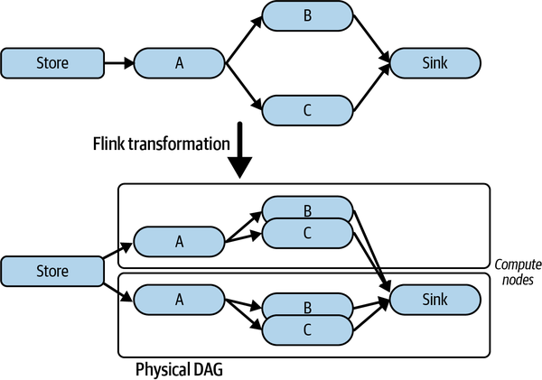

# Chapter 15. Stream Processing Systems

Time is money. The faster you can extract insights and knowledge from your data, the more quickly you can respond to the changing state of the world your systems are observing. Think of credit card fraud detection, catching anomalous network traffic for cybersecurity, real-time route planning in GPS-enabled driving applications, and identifying trending topics on social media sites. For all of these use cases, speed is of the essence.

These disparate applications have the common requirement of needing to perform computations on the most recent set of observations. Do you care if there was a minor accident that caused a 3-hour traffic backlog on your usual driving route earlier in the day, or that yesterday a snowstorm closed the road overnight? As long as your driving app tells you the highway is clear, you’re on the way. Such computations are time sensitive and need access to recent data to be relevant.

Traditionally, you build such applications by persisting data from external feeds into a database and devising queries that can extract the information you need. As the arrival rate of the information your systems process increases, this becomes progressively harder to do. You need fast, scalable write performance from your database, and indexes to achieve low latency aggregate reads and joins for recent data points. After the database writes and the reads complete, you are finally ready to perform useful analysis. Sometimes, “finally” comes after a long wait, and in today’s world, late results—even a few seconds late—are as bad as no results at all.

In the face of an ever-growing number of high-volume data sources from sensors, devices, and users, we’ve seen the emergence of a new class of technologies known as stream processing systems. These aim to provide you with the capabilities to process data streams in memory, without the need to persist the data to get the required results. This is often called *data-in-motion*, or real-time analytics. Stream processing platforms are becoming common parts of scalable systems. Not surprisingly, there’s a highly competitive technology landscape that gives you plenty of choice about how to design and deploy your systems.

In this chapter I’ll describe the basic concepts of stream processing platforms, and the common application architectures they enable. I’ll then illustrate these concepts using Apache Flink, which is one of the leading open source streaming technologies.

# Introduction to Stream Processing

Since the dawn of time in software systems, batch processing has played a major role in the processing of newly available data. In a batch processing system, raw data representing new and updated objects are accumulated into files. Periodically, a software component known as a batch data load job processes this newly available data and inserts it into the application’s databases. This is commonly known as an extract, transform, load (ETL) process. ETL means the batch files containing new data are processed, aggregating and transforming the data into a format amenable for insertion into your storage layer.

Once a batch has been processed, the data is available to your analytics and external users. You can fire off queries to your databases that produce useful insights from the newly inserted data. This scheme is shown in [Figure 15-1](#batch_processing).

A good example of batch processing is a real estate website. All new listings, rentals, and sales are accumulated from various data sources into a batch. This batch is applied periodically to the underlying databases and subsequently becomes visible to users. The new information also feeds analytics like how many new listings are available each day in each region, and how homes have sold in the previous day.


###### Figure 15-1. Batch processing

Batch processing is reliable, effective, and a vital component of large-scale systems. The downside, however, is the time lag between new data arriving and it being available for querying and analysis. Once you have accumulated a new batch of data, which might take an hour or a day depending on your use case, you must wait until:

- Your ETL job has finished ingesting the new data into your repository
- Your analysis job(s) complete(s)

At scale, it can take anywhere from several minutes to several hours for this whole process to run. This is not a problem for many use cases where absolute data freshness is not required. If you put your home on the market, it’s not the end of the world if your listing doesn’t appear on your favorite real estate site for a few hours. Even the next day works. But if someone steals your credit card information, waiting up to 24 hours to identify the fraud can cost your credit card provider a lot of money, and everyone a lot of inconvenience. For such use cases, you need streaming analytics.

Streaming systems process new data and events in *real time*. When you make a credit card purchase, the credit provider can utilize streaming analytics to run your transaction through a fraud detection model. This will use a fast statistical model prediction technique such as a support vector machine to evaluate whether a transaction is potentially fraudulent. The system can then flag and deny these transactions instantaneously. In this case, time really is money. “Real time” here is highly application dependent, and can mean processing latencies from less than a second to a few seconds.

Streaming systems can also work on batches, or windows of new data. These are sometimes called microbatches. For example, a public transportation monitoring system wants to update the location of all buses every 30 seconds. Buses send location updates every few seconds, and these are processed as a stream. The stream processor aggregates all the updates from each bus. Every 30 seconds the latest location is used to update the location that is made visible to transportation customers on their app. The series of updates for each bus can also be sent for further processing to calculate speed and predict arrival times at locations on the route. You can see an overview of how such a streaming system looks in [Figure 15-2](#stream_processing_example).


###### Figure 15-2. Stream processing example

Both batch and stream processing architectures, as well as hybrids like the Lambda architecture (see [“The Lambda Architecture”](#the_lambda_architecture)) have their place in modern scalable systems. [Table 15-1](#comparing_stream_and_batch_processing) summarizes the batch and streaming approaches, highlighting their essential characteristics.

Table 15-1. Comparing stream and batch processing Characteristic Stream processing Batch processing Batch size From individual events to microbatches, typically thousands to tens of thousands in size Essentially unlimited and commonly millions to billions of records at scale Latency Subsecond to seconds Minutes to hours Analytics Relatively simple event detection, event aggregation, and metric calculations over rolling time intervals for newly arrived data Complex, incorporating both new batch data and existing data

##### The Lambda Architecture

The [Lambda architecture](https://oreil.ly/JOWCb) emerged around 2011 as a hybrid incorporating both traditional batch and emerging stream processing approaches. It comprises three layers:

The batch layer

This layer periodically processes massive quantities of new event data and updates the application’s databases. At the time Lambda emerged, the dominant technology used for scalable batch processing was Apache Hadoop. As with any batch system, database update frequencies are on the order of minutes to hours depending on how often batches are processed.

The speed layer

This layer complements the batch layer by providing low latency results based on the new arrived events. While a new batch is accumulating for periodic processing, the speed layer processes the events, giving rapid insights into the latest data. You can think of the speed layer as compensating for the time lag between successive batches being processed. Apache Storm was a widely used technology for the speed layer.

The serving layer

This layer is where both the batch and speed layers store their results, and is responsible for handling queries and generating results. Results can be based on the outputs of either the batch or speed layer, or by computing a result that combines the two.

More recently, with new scalable streaming technologies available, the Lambda architecture has become less prominent. New events are stored in immutable log-based storage (e.g., Apache Kafka) and are continually processed as a data stream. You’ll see this design referred to as the [Kappa architecture](https://oreil.ly/Qiy3k).

# Stream Processing Platforms

Stream processing platforms have proliferated in recent years. Multiple open source, proprietary, and cloud provider–supplied solutions exist, all with their own pros and cons. The underlying architecture and mechanisms across platforms are similar, however. [Figure 15-3](#generic_stream_processing_platform_arch) illustrates the basic streaming application anatomy.

Data is made available to the platforms through various data sources. Commonly, these are queues such as a Kafka topic, or files in distributed storage systems such as S3. Stream processing nodes ingest data objects from data sources and perform transformations, aggregations, and application-specific business logic. Nodes are organized as a directed acyclic graph (DAG). Data objects originating from the source are processed as a stream. A data stream is an unbounded sequence of individual data objects. As data objects conceptually are passed, or flow, between processing nodes, streaming applications are also known as dataflow systems.

Stream processing systems provide the capabilities for processing nodes to transform an input stream at one node into a new stream that is processed by one or more downstream nodes. For example, your transport application can produce a new stream of the current bus locations every 30 seconds from a stream of bus location change events.


###### Figure 15-3. Generic stream processing platform architecture

Stream processing applications have two general flavors. The first simply processes and transforms individual events in the stream, without requiring any context, or state, about each event. You might input a stream of the latest data updates from wearable devices and transform the individual data objects into several others representing the user’s latest step counts, heart rate, and hourly activity data. The results are written to data sinks such as a database or a queue for downstream asynchronous processing that calculates resting heart rate, calories burned, and so on.

In contrast, some streaming applications need to maintain state that persists across the processing of individual data objects in the stream. The transport monitoring application must know about all the buses in motion and maintain state representing the position updates in the last 30 seconds. A fraud detection application must maintain state representing the current model parameters needed to identify suspicious transactions. A retail store streaming application must maintain information representing the number of each individual item sold in the last hour to identify goods in high demand. This flavor of applications is known as stateful streaming applications.

Finally, stream processing platforms need capabilities to enable applications to scale out their processing and be resilient to failures. This is typically achieved by executing multiple instances of processing nodes across a cluster of computational resources, and implementing a state checkpointing mechanism to support recovery after failure. How this is achieved is extremely platform dependent.

As an example of scaling, the following Apache Storm code creates a stream processing application (called a *topology* in Storm) with a single data source and two processing nodes arranged as a simple pipeline:

```
TopologyBuilder builder = new TopologyBuilder();        
builder.setSpout("purchasesSpout", new PurchasesSpout());        
builder.setBolt("totalsBolt", new PurchaseTotals(), numTotalsBolts)
        fieldsGrouping("purchasesSpout", new Fields("itemKey"));
builder.setBolt("topSellersBolt", new TopSellers())
        .globalGrouping("totalsBolt");
```

It works as follows.

A `PurchasesSpout` object emits purchase records as a stream from a data source. A spout in Storm connects the streaming applications to a data source such as a queue.

The stream of purchases is passed from the spout to a processing node object, known as a bolt. This is the `PurchaseTotals` object. It maintains purchase totals for all items. Multiple instances of the bolt, defined by the `numTotalsBolts` parameter, are executed by Storm as independent threads. The `fieldsGrouping` ensures that purchases with the same `itemKey` value are always sent from the spout to the same bolt instance so that the total for every key is managed by a single bolt.

The `PurchaseTotals` bolt sends a stream of changed total purchases to the `TopSellers` bolt. This creates a leaderboard of the best-selling items in the stream. The `globalGrouping` routes the output of all `PurchaseTotals` instances to a single `TopSellers` bolt instance.

The logical Storm topology is depicted in [Figure 15-4](#example_apache_storm_topology). Depending on the underlying cluster configuration that the topology is deployed on, Storm will execute the specified number of bolt instances as threads in one or more available JVMs. This enables topologies to take advantage of the computational resources available in the deployment environment.


###### Figure 15-4. Example Apache Storm topology

Apache Storm is a powerful and scalable streaming platform. Its API is relatively simple, however, and places the responsibility for explicit topology definition on the application designer. In the remainder of this chapter, I’ll focus instead on the more contemporary Apache Flink, which provides functional programming APIs for building streaming applications.

# Case Study: Apache Flink

Apache Flink emerged in 2014 based on original research performed in the [European Union Stratosphere project](https://oreil.ly/JDTQo). At its core, Flink is a distributed stream processing system designed for high throughput and low latencies. Flink provides a collection of operations for filtering, aggregating, mapping, and joining streams of data from data sources. Unlike explicitly defined Apache Storm topologies, Flink programs are compiled and automatically transformed into data flow programs that can be deployed on a clustered computational environment.

Flink provides a number of distinct APIs. I’ll briefly give an example of the DataStream API in the following subsection. Flink also supports two APIs based on relational concepts, namely the Table and SQL APIs. You can build streaming applications that perform a subset of SQL `SELECT` queries on data streams that accumulate in tables with defined schemas.

## DataStream API

The Flink DataStream API provides stream processing capabilities for Java and Scala systems. You can utilize a rich collection of stream processing operations for splitting, filtering, aggregating, and transforming streams of events, and creating periodic processing of batches of events in the stream using bounded time windows.

In Flink, a data stream is the logical representation of a stream of typed events, namely `DataStream<T>` in Java. Each stage in a data stream application applies functions to events and produces a stream of typed output events. Flink can process streams in parallel by replicating the functions in a processing pipeline and distributing events to different replicas.

The first thing you need to do in a Flink system is to create an execution environment. The execution environment for your application can be local, causing execution is a single JVM, or remote, which will invoke execution on a compute cluster. The Flink environment object gives you the ability to specify various job execution parameters that control the scalability and fault tolerance of your application on a cluster. An example is shown in the following:

```
final StreamExecutionEnvironment env =
                StreamExecutionEnvironment.getExecutionEnvironment();
```

Once you have an execution environment, you can specify a data source. Flink supports a number of native data sources including files, and has connectors for various external technologies. The following example illustrates how to use the Flink Kafka connector to enable your application to ingest data from a Kafka topic using a Flink `DataStream`:

```
KafkaSource<LiftRide> source = KafkaSource.<LiftRide>builder()
    .setBootstrapServers(brokerList)
    .setTopics("resort-topic")
    .setGroupId("liftConsumers")
    .setStartingOffsets(OffsetsInitializer.earliest())
    .setValueOnlyDeserializer(new LiftRideSchema())
    .build();

DataStream<LiftRide> liftRideStream = 
env.fromSource(source, WatermarkStrategy.noWatermarks(), 
"Resort Lifts");
```

In this example, Flink:

- Starts reading at the start of the topic - `OffsetsInitializer.earliest()`
- Uses the Kafka event timestamp as the message time - `WatermarkStrategy.noWatermarks()`

Next you specify the transformations to perform on events that are received from the source. The following example shows how to count the number of individual lift rides on every ski lift in a resort:

```
DataStream<Tuple2<String, Integer>> liftCounts =
        liftRideStream
        .map(i -> Tuple2.of(i.getLiftID(), 1))
        .returns(Types.TUPLE(Types.STRING, Types.INT))
        .keyBy(value -> value.f0)
        .sum(1)
        .window(SlidingProcessingTimeWindows.of(Time.minutes(10), 
                                                Time.minutes(5)));
```

The basic way this code works is as follows:

- Flink extracts each `LiftRide` event from the source and passes it to a `map()` function.
- `map()` generates a new object of type `Tuple2`. This contains two typed elements, the `liftID` of type `STRING` and a value of 1 (of type `INT`) representing a single lift ride.
- `keyBy()` partitions the map outputs using the `liftID` (field 0 in the tuple) as the key, and the `sum(1)` operator keeps a total of the number of individual lift rides (field 1 in the tuple) for each key.
- A sliding window defines when Flink generates results. Flink maintains a window of all the events it processes in the previous 10 minutes—this is the window size. Flink then generates, every 5 minutes, a set of results of type `Tuple2` `<` `String`, `Integer>`. These represent the number of skier lift rides for each lift based on the events processed in the previous 10-minute interval. This is known as the *window slide*.

In general, window operations define the boundaries of finite sets of events and perform operations over this set of events. Sliding windows are extremely useful for performing calculations such as weighted averages. In this example, the results of each 5-minute window would show if the average number of skiers using the lift is increasing, decreasing, or stable. In contrast, a tumbling window defines distinct window boundaries and every event can only belong to a single window.

You also add a destination known as a sink for Flink to write the outputs of processing the messages in the stream:

```
liftRideStream.addSink( … ) // parameters omitted
```

Finally, you can kick off the stream processing. Flink programs are executed lazily. This means nothing happens until your code calls the following:

```
env.execute();
```

## Scalability

Your Flink programs are transformed into a logical DAG. Data streams move from sources to sinks through transformations that you define in your code. These are represented as nodes in the DAG. At deployment time, Flink maps your logical graph to physical resources that execute the system. These physical resources can range from your local node to a large cluster running the application across hundreds of computation nodes. This is illustrated in [Figure 15-5](#example_of_mapping_a_flink_logical_data) for a simple deployment of two nodes.



###### Figure 15-5. Example of mapping a Flink logical data flow to physical resources

You can influence how Flink deploys the logical DAG to physical resources in two main ways. These are by specifying the level of parallelism for various transformations in your program, and configuring the amount of concurrency allowed in the execution environment on each cluster node.

In your code, there are also two ways to inform the Flink runtime of the number of concurrent instances of your operators to execute. The following code example shows one way, which specifies that 10 parallel instances of the `.sum` transformation should be utilized:

```
.sum(1).setParallelism(10);
```

This results in Flink creating an execution DAG as shown in [Figure 15-6](#specifying_operator_parallelism_in_flin). The key-value pairs emitted by the `.map()` function are hash partitioned across the 10 instances of the `.sum()` operator.


###### Figure 15-6. Specifying operator parallelism in Flink

You can also specify the default level of parallelism for all operators, data sources, and data sinks in a program using the execution environment object. This is shown in the following example, which sets the default parallelism level to 5:

```
final StreamExecutionEnvironment env = 
        StreamExecutionEnvironment.getExecutionEnvironment();
env.setParallelism(5);
```

The default parallelism level is overridden by any operators that you explicitly define a level of parallelism for.

When you submit an application, Flink maps your logical DAG to the physical nodes that are available in your target cluster. Every compute node in the cluster runs a Flink task manager that is responsible for executing components of your streaming system. Each task manager is a JVM that by default can run one parallel task defined in your system. This is known as a task slot.

You can specify how many tasks Flink may deploy to a task manager by defining the `taskmanager.numberOfTaskSlots` configuration parameter in the `flink-conf.yaml` file. The default value for task slots is 1. This means each task manager runs a component of your system in a single thread in the JVM. If you increase the default value to *N*, the task manager can run *N* components of your dataflow in different threads, with each thread allocated 1/*N* of the available JVM memory. One common strategy is to allocate the same number of slots as CPU cores available on each task manager node.

The overall architecture is depicted in [Figure 15-7](#flink_runtime_architecture). This also depicts the Flink job manager, which is responsible for cluster management, sharing of cluster resources between multiple jobs, monitoring for node failures, and managing recovery. A high availability configuration can be created that has multiple job managers deployed in a leader-follower architecture.


###### Figure 15-7. Flink runtime architecture

Flink implements a sophisticated transformation algorithm that maps a logical DAG to available physical resources. This includes optimizations, known as operator chaining, to colocate operators in a single task slot to minimize data communication costs. You influence how the physical mapping occurs by specifying parallelism levels, but in general it is not necessary for you to thoroughly understand the specifics of the algorithms employed. I’ll point you to excellent resources in [“Conclusions and Further Reading”](#conclusions_and_further_reading) that describe the details.

## Data Safety

Handling failures is an issue that you need to consider for any streaming systems. If one part of the deployed streaming application fails due to a node crash, network failure, or application exception, any state that is held in memory is lost. In the ski lift rides example, the lift ride counts for the 10-minute window are maintained in memory. If a task manager fails, the local state it manages is lost.

There are two mechanisms necessary in Flink to support data safety. These are persistent state storage and periodically invoking checkpoints for the complete stream.

First, you need to configure stateful operators to periodically persist their state as key-value pairs. By default, Flink supports a [RocksDB storage backend](http://rocksdb.org). You can configure this as follows in the `flink-conf.yaml` file:

```
state.backend: rocksdb
state.checkpoints.dir: file:///checkpt-mystream/
```

The persistent store makes it possible to restore state from snapshots in the case of stream processing failures. In streaming applications, however, the challenge is to ensure that all operators have a consistent checkpoint. Specifically, this means that the snapshots across all operators are based on processing the exact same input event from the stream source.

Flink ensures snapshots are consistent using a concept known as *stream barriers*.[1](ch15.md) The Flink job manager periodically injects events known as barriers into the source stream. These barriers flow strictly in order with events from the source stream. When a stateful operator inputs a barrier event on all its input streams, it writes its local state to the persistent storage. It then echoes the barrier on its outputs so that downstream operators in the stream processing can also persist their state.

This checkpointing mechanism is depicted in [Figure 15-8](#barrier_messages_for_flink_stream_check). The barriers contain an identifier that represents their position in the source input stream. For example, if the input source is a Kafka topic, the barrier identifier represents the offset, *N*, of the event that precedes the barrier in the stream. This ensures all the checkpointed state is based on processing all events from the source up to and including offset *N*. Once a barrier is delivered on all the inputs to the stream sink, the checkpoint is marked complete. This becomes the latest state that the application can recover, should any failure occur.


###### Figure 15-8. Barrier messages for Flink stream checkpointing.

Recovery involves restoring the state of the application after failure across the complete distributed dataflow. Flink achieves this by first stopping and redeploying the entire application. Flink then informs each stateful operator to restore its state from the latest completed snapshot. Finally, Flink informs the stream consumer to resume processing from position *N* + 1 in the data source.

Checkpointing effectively makes Flink applications fault tolerant. The trade-off is the cost of periodic state checkpointing and recovery. If the managed state is small, this will have minimal impact on throughput. However, if operators maintain large state spaces, frequent checkpointing may significantly impact stream throughput.

You can control when checkpoints are triggered through various configuration parameters. A frequently utilized parameter specifies the minimum time that must elapse between checkpoints. Setting this value to, for example, 2 seconds ensures that the next checkpoint will not start until at least 2 seconds after the previous one has completed. By default, checkpointing is not enabled for Flink applications.

# Conclusions and Further Reading

The ability of streaming systems to produce relevant and timely results is highly attractive in many application domains. You can transform, aggregate, and analyze incoming data in real time. Your applications can perform analyses on finite batches of data based on time windows or message volumes. This makes it possible to identify trends in data and calculate metrics based on values in the most recent windows of data.

There are numerous streaming platforms that you can utilize to build fault-tolerant, scalable applications. Scalability is achieved by transforming your logical dataflow application architecture into a physical equivalent that distributes and connects processing nodes in the system across computational resources in a cluster. Fault tolerance mechanisms persist processing node state and track which messages have been successfully processed through the complete dataflow application. When failures occur, the streams can be restarted from the first outstanding message.

A great book that covers the broad spectrum of design and development issues for streaming applications is *Streaming Systems: The What, Where, When, and How of Large-Scale Data Processing* by Tyler Akidau, Slava Chernyak, and Reuven Lax (O’Reilly, 2018).

The books below are excellent sources of knowledge for a number of the leading contenders in this space. These include Apache Flink, Apache Storm, Kinesis, Apache Kafka Streams, Apache Spark Streams, and Spring Cloud Data Flow:

- Fabian Hueske and Vasiliki Kalavri, *Stream Processing with Apache Flink: Fundamentals, Implementation, and Operation of Streaming Applications* (O’Reilly, 2019)
- Mitch Seymour, *Mastering Kafka Streams and ksqlDB: Building Real-Time Data Systems by Example* (O’Reilly, 2021)
- Tarik Makota, Brian Maguire, Danny Gagne, and Rajeev Chakrabarti, *Scalable Data Streaming with Amazon Kinesis* (Packt, 2021)
- Sean T. Allen, Matthew Jankowski, and Peter Pathirana, *Storm Applied: Strategies for Real-Time Event Processing* (Manning, 2015)
- Gerard Maas and Francois Garillot, *Stream Processing with Apache Spark: Mastering Structured Streaming and Spark Streaming* (O’Reilly, 2019)
- Felipe Gutierrez, *Spring Cloud Data Flow: Native Cloud Orchestration Services for Microservice Applications on Modern Runtimes* (Apress, 2021)

[1](ch15.md) The approach is based on the paper [“Lightweight Asynchronous Snapshots for Distributed Dataflows”](https://oreil.ly/lAlEe) by Paris Carbone et al.
