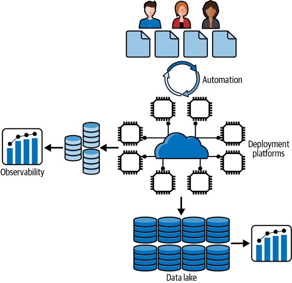

# Chapter 16. Final Tips for Success

Let’s be blunt. Building scalable distributed systems is hard!

Distributed systems by their very nature are complex, with multiple failure modes that you must take into consideration, and design to handle all eventualities. It gets even trickier when your applications are stressed by high request volumes and rapidly growing data resources.

Applications at scale require numerous, cooperating hardware and software components that collectively create the capacity to achieve low latencies and high throughput. Your challenge is to compose all these moving parts into an application that satisfies requirements and doesn’t cost you the earth to run.

In this book I’ve covered the broad landscape of principles, architectures, mechanisms, and technologies that are foundational to scalable distributed systems. Armed with this knowledge, you can start to design and build large-scale applications.

I suspect that you will not be surprised to hear that this is not the end of the story. We all operate in an ever-changing landscape of new application requirements and new hardware and software technologies. While the underlying principles of distributed systems still hold (for the foreseeable future anyway—[quantum physics](https://oreil.ly/orBDp) might change things one day), new programming abstractions, platform models, and hardware make it easier for you to build more complex systems with increased performance, scalability, and resilience. The metaphorical train that propels us through this technology landscape will never slow down, and probably only get faster. Be prepared for a wild ride of constantly learning new stuff.

In addition, there are numerous essential ingredients for successful scalable systems that I have not covered in this book. Four of these are depicted in [Figure 16-1](#scalable_distributed_systems), and I briefly describe the salient issues of each in the following subsections.

###### Figure 16-1. Scalable distributed systems

# Automation

Engineers are rather expensive but essential resources when building large-scale systems. Any system that needs to be deployed at scale is quickly going to require hundreds of talented engineers. At the scale of the internet giants, this number grows to many thousands. Your engineers then need to be able to rapidly roll out changes, fixes, and new features to growing, complex codebases. The ability to efficiently push hundreds of changes per day to a deployed system without downtime is key at scale. You need to deploy frequent changes to improve the client experience and ensure reliable and scalable operations.

Automation makes it possible for developers to rapidly and reliably make changes to operational systems. The set of tools and practices that facilitate such automation are embodied in the discipline of DevOps. In *DevOps: A Software Architect’s Perspective* (O’Reily, 2015), Len Bass et al. define DevOps as “a set of practices intended to reduce the time between committing a change to a system and the change being placed into normal production, while ensuring high quality.”

DevOps encompasses a set of practices and tooling that are based on automation at all levels of the development and deployment process. At the heart of DevOps are continuous delivery (CD) practices,[1](ch16.md) supported by sophisticated toolchains for code configuration management, automated testing, deployment, and monitoring. DevOps extends these practices by making the management of the deployment environment the responsibility of the development teams. This typically includes rotating 24-hour on-call responsibilities for team members to respond to incidents or failures in production.

DevOps practices are essential for successful scalable systems. Teams have responsibilities for designing, developing, and operating their own microservices, which interact with the rest of the system through well-defined interfaces. With automated toolchains, they can independently deploy local changes and new features without perturbing the system operations. This reduces coordination overheads, increases productivity, and facilitates fast release cycles. All of which means you get a much bigger bang for your engineering dollars.

# Observability

“You can’t manage what you can’t measure,” so goes the saying. In large-scale software systems, this is indeed the truth. With multitudes of moving parts, all operating under variable load conditions and all unpredictably error-prone, you need insights gained through measurements on the health and behavior of your systems. An observability solution encompasses this spectrum of needs, including:

- The infrastructure to capture a system’s current state based on constantly generated fine-grained metrics and log data
- The capabilities to analyze and act on aggregated real-time metrics and react to alerts indicating actual or pending failures

The first essential element of observability is an instrumented system that constantly emits system telemetry in the form of metrics and log entries. The sources of this telemetry are many and varied. It can be sourced from operating systems, the foundational platforms (e.g., messaging, databases) you utilize in your applications, and the application code you deploy. Metrics represent resource utilizations and the latencies, response times, and throughput the various parts of your system are delivering.

Code instrumentation is mandatory, and you can use open source frameworks (e.g., [OpenTelemetry](https://oreil.ly/sPiw9)) or proprietary solutions (e.g., AWS CloudWatch) to emit application-specific metrics. These metrics and log entries form a continuous stream of time-series based data that characterizes your application behavior over time.

Capturing raw metrics data is simply a prerequisite for the situational awareness that observability infers. You need to rapidly process this stream of data so that it becomes actionable for systems operations. This includes both continuous monitoring of current state, exploring historical data to understand or diagnose some unexpected system behavior, and sending real-time alerts when thresholds are exceeded or failures occur. You can choose from a number of sophisticated solutions that support monitoring and exploration of time-series data for observability. [Prometheus](https://oreil.ly/IOzGY), [Grafana](https://oreil.ly/3YIuw), and [Graphite](https://oreil.ly/LreCj) are three widely used technologies that provide out-of-the-box solutions for various parts of an observability stack.

Observability is a necessary component of scalable distributed systems. Ignore it at your peril! You’ll find a great source for learning more about observability is the book by Charity Majors et al., *Observability Engineering* (O’Reilly).

# Deployment Platforms

Scalable systems need extensive, elastic, and reliable compute and data platforms. Modern public clouds and private data centers are packed to the walls and ceilings with hardware you can provision with the click or two of a mouse. Even better, provisioning is invoked automatically using scripting languages designed for operations. This is known as *infrastructure as code (IaC)*, an essential ingredient of DevOps.

Virtual machines were traditionally the unit of deployment for applications. However, the last few years have seen the proliferation of new lighter-weight approaches based on container technologies, with [Docker](http://www.docker.com) being the preeminent example. Container images enable the packaging of application code and dependencies into a single deployable unit. When deployed on a container engine such as the Docker Engine, containers run as isolated processes that share the host operating systems with other containers. Compared to virtual machines, containers consume considerably fewer resources, and hence make it possible to utilize hardware resources more efficiently by packing multiple containers on a single virtual machine.

Containers are typically utilized in concert with a cluster management platform such as Kubernetes or Apache Mesos. These orchestration platforms provide APIs for you to control how, when, and where your containers execute. They make it possible to automate your deployment of containers to support varying system loads using autoscaling and simplify the management of deploying multiple containers across multiple nodes in a cluster.

# Data Lakes

How often do you scroll back in time on your favorite social media feed to look for photos you posted 5, 10, or even more years ago? Not very often, I bet. And I bet your connections do it even less. If you give it a try, you’ll probably find, in general, that the further you go back in time, the longer your photos will take to render.

This is an example of the historical data management challenges faced at scale. Your systems will generate many petabytes or more of data over time. Much of this data is rarely, if ever accessed by your users. But for reasons that your application domain dictates (e.g., regulatory, contractual, popularity), you need to keep historical data available for the few occasions it is requested.

Managing, organizing, and storing these historical data repositories is the domain of data warehousing, big data, and (more recently) data lakes. While there are technical and philosophical differences between these approaches, their essence is storage of historical data in a form it can be retrieved, queried, and analyzed.

Data lakes are usually characterized by storing and cataloging data in heterogeneous formats, from native blobs to JSON to relational database extracts. They leverage low-cost object storage such as Apache Hadoop, Amazon S3, or Microsoft Azure Data Lake. Flexible query engines support analysis and transformation of the data. You can also use different storage classes, essentially providing longer retrieval times for lower cost, to optimize your costs.

# Further Reading and Conclusions

There’s a lot more to designing, building, operating, and evolving software systems at massive scale than can be covered in a single book. This chapter briefly describes four intrinsic elements of scalable systems that you need to be aware of and address in production systems. Add these elements to the ever-expanding palette of knowledge that modern software architects need to possess.

I’ll leave you with a couple of recommendations for books I think everyone should have on their (virtual) bookshelf.

First, the classic book *Site Reliability Engineering: How Google Runs Production Systems*, edited by Betsy Beyer et al. (O’Reilly) describes the set of practices and tooling that Google developed to run their production systems. It is an extensive, thorough, and cross-cutting description of the approaches needed to keep massive-scale system infrastructures operating and healthy.

In a similar vein of wide-ranging knowledge, *Software Architecture: The Hard Parts*, by Neal Ford et al. (O’Reilly) is chock-full with insights and examples of how to address the many design conundrums that modern systems present. There’s rarely, if ever, simple, correct solutions to these design problems. To this end, the authors describe how to apply contemporary architecture design knowledge and trade off analysis to reach satisfactory solutions.

Happy reading!

[1](ch16.md) The classic book in this area is Jez Humble and David Farley’s *Continuous Delivery: Reliable Software Releases through Build, Test, and Deployment Automation* (Addison-Wesley Professional, 2010).
