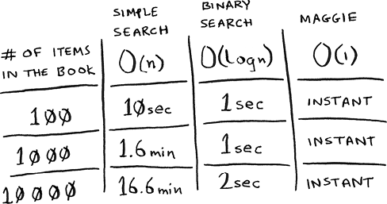

# 5. Hash tables

In this chapter

- You learn about hash tables, one of the most useful data structures. Hash tables have many uses; thischapter covers the common use cases.
- You learn about the internals of hash tables: implementation, collisions, and hash functions. These properties will help you understand how to analyze a hash table’s performance.

Suppose you work at a grocery store. When a customer buys produce, you have to look up the price in a book. If the book is unalphabetized, it can take you a long time to look through every single line for *apple*. You’d be doing simple search from chapter 1, where you have to look at every line. Do you remember how long that would take? O(*n*) time. If the book is alphabetized, you could run binary search to find the price of an apple. That would only take O(log *n*) time.


As a reminder, there’s a big difference between O(*n*) and O(log *n*) time! Suppose you could look through 10 lines of the book per second. Here’s how long simple search and binary search would take you.


You already know that binary search is darn fast. But as a cashier, looking things up in a book is a pain, even if the book is sorted. You can feel the customer steaming up as you search for items in the book. What you really need is a buddy who has all the names and prices memorized. Then you don’t need to look up anything: you ask her, and she tells you the answer instantly.


Your buddy Maggie can give you the price in O(1) time for any item, no matter how big the book is. She’s even faster than binary search.



What a wonderful person! How do you get a “Maggie”?

Let’s put on our data structure hats. You know two data structures so far: arrays and lists (I won’t talk about stacks because you can’t really “search” for something in a stack). You could implement this book as an array.


Each item in the array is really two items: one is the name of a kind of produce, and the other is the price. If you sort this array by name, you can run binary search on it to find the price of an item. So you can find items in O(log *n*) time. But you want to find items in O(1) time. That is, you want to make a “Maggie.” That’s where hash functions come in.

## Hash functions

A hash function is a function where you put in a string (*string* here means any kind of data—a sequence of bytes), and you get back a number.


In technical terminology, we’d say that a hash function “maps strings to numbers.” You might think there’s no discernable pattern to what number you get out when you put a string in. But there are some requirements for a hash function:

- It needs to be consistent. For example, suppose you put in “apple” and get back “3.” Every time you put in “apple,” you should get “3” back. Without this, your hash table won’t work.
- It should map different words to different numbers. For example, a hash function is no good if it always returns “1” for any word you put in. In the best case, every different word should map to a different number.

So a hash function maps strings to numbers. What is that good for? Well, you can use it to make your “Maggie”!

Start with an empty array:


You’ll store all of your prices in this array. Let’s add the price of an apple. Feed “apple” into the hash function.


The hash function outputs “3.” So let’s store the price of an apple at index 3 in the array.


Let’s add milk. Feed “milk” into the hash function.


The hash function says “0.” Let’s store the price of milk at index 0.


Keep going, and eventually the whole array will be full of prices.


Now you ask, “Hey, what’s the price of an avocado?” You don’t need to search for it in the array. Just feed “avocado” into the hash function.


It tells you that the price is stored at index 4. And sure enough, there it is.


The hash function tells you exactly where the price is stored, so you don’t have to search at all! This works because

- The hash function consistently maps a name to the same index. Every time you put in “avocado,” you’ll get the same number back. So you can use it the first time to find where to store the price of an avocado, and then you can use it to find where you stored that price.
- The hash function maps different strings to different indexes. “Avocado” maps to index 4. “Milk” maps to index 0. Everything maps to a different slot in the array where you can store its price.
- The hash function knows how big your array is and only returns valid indexes. So if your array is five items, the hash function doesn’t return 100—that wouldn’t be a valid index in the array.

You just built a “Maggie”! Put a hash function and an array together, and you get a data structure called a *hash table*. A hash table is the first data structure you’ll learn that has some extra logic behind it. Arrays and lists map straight to memory, but hash tables are smarter. They use a hash function to intelligently figure out where to store elements.

Hash tables are probably the most useful complex data structure you’ll learn. They’re also known as hash maps, maps, dictionaries, and associative arrays. And hash tables are fast! Remember our discussion of arrays and linked lists back in chapter 2? You can get an item from an array instantly. And hash tables use an array to store the data, so they’re equally fast.

What’s the catch?

The hash function we just saw is called a *perfect hash function*. It deftly maps each grocery item to its very own slot in the array:


Look at them all snug in their own slots. In reality, you probably won’t get a perfect one-to-one mapping like this. Your items will need to share a room. Some grocery items will map to the same slot, while other slots will go empty.


There’s a section on collisions coming up that discusses this. For now, just know that while hash tables are very useful, they rarely map items to slots so perfectly.

By the way, this kind of one-to-one mapping is called an *injective function*. Use that to impress your friends!

You’ll probably never have to implement hash tables yourself. Any good language will have an implementation for hash tables. Python has hash tables; they’re called *dictionaries*. You can make a new hash table using empty braces:

```
>>> book = {}
```


*book* is a new hash table. Let’s add some prices to `book`:

```
>>> book["apple"] = 0.67        ①
>>> book["milk"] = 1.49         ②
>>> book["avocado"] = 1.49
>>> print(book)
{'avocado': 1.49, 'apple': 0.67, 'milk': 1.49}
```

① An apple costs 67 cents.

② Milk costs $1.49.


Pretty easy! Now let’s ask for the price of an avocado:

```
>>> print(book["avocado"])
1.49                   ①
```

① The price of an avocado

A hash table has keys and values. In the `book` hash, the names of produce are the keys, and their prices are the values. A hash table maps keys to values.

In the next section, you’ll see some examples where hash tables are really useful.

Exercises

It’s important for hash functions to consistently return the same output for the same input. If they don’t, you won’t be able to find your item after you put it in the hash table!

Which of these hash functions are consistent?

  5.1 `f(x) = 1`← Returns 1 for all input

  5.2 `f(x) = rand()`← Returns a random number every time

  5.3 `f(x) = next_empty_slot()`← Returns the index of the next empty slot in the hash table

  5.4 `f(x) = len(x)`← Uses the length of the string as the index


## Use cases

Hash tables are used everywhere. This section will show you a few use cases.

Using hash tables for lookups

Your phone has a handy phonebook built in. Each name has a phone number associated with it.


Suppose you want to build a phone book like this. You’re mapping people’s names to phone numbers. Your phone book needs to have this functionality:

- Add a person’s name and the phone number associated with that person.
- Enter a person’s name and get the phone number associated with that name.

This is a perfect use case for hash tables! Hash tables are great when you want to

- Create a mapping from one thing to another thing
- Look something up

Building a phone book is pretty easy. First, make a new hash table:

```
>>> phone_book = {}
```

Let’s add the phone numbers of some people to this phone book:

```
>>> phone_book["jenny"] = "8675309"
>>> phone_book["emergency"] = "911"
```

That’s all there is to it! Now suppose you want to find Jenny’s phone number. Just pass the key in to the hash:

```
>>> print(phone_book["jenny"])
8675309         ①
```

① Jenny’s phone number


Imagine if you had to do this using an array instead. How would you do it? Hash tables make it easy to model a relationship from one item to another.

Hash tables are used for lookups on a much larger scale. For example, suppose you go to a website like [http://adit.io](http://adit.io). Your computer has to translate adit.io to an IP address.


For any website you go to, the address has to be translated to an IP address.


Wow, mapping a web address to an IP address? Sounds like a perfect use case for hash tables! This process is called *DNS resolution*. Hash tables are one way to provide this functionality. Your computer has a *DNS cache*, which stores this mapping for websites you have recently visited, and a good way to build a DNS cache is to use a hash table.

Preventing duplicate entries

Suppose you’re running a voting booth. Naturally, every person can vote just once. How do you make sure they haven’t voted before? When someone comes in to vote, you ask for their full name. Then you check it against the list of people who have voted.


If their name is on the list, this person has already voted—kick them out! Otherwise, you add their name to the list and let them vote. Now suppose a lot of people have come in to vote, and the list of people who have voted is really long.


Each time someone new comes in to vote, you have to scan this giant list to see if they’ve already voted. But there’s a better way: use a hash!

First, make a hash to keep track of the people who have voted:

```
>>> voted = {}
```

When someone new comes in to vote, check if they’re already in the hash:

```
>>> value = "tom" in voted
```

*value* is now `True` if “tom” is in the hash table. Otherwise, it is `False`. You can use this to check whether someone has already voted!


Here’s the code:

```
voted = {}
def check_voter(name):
  if name in voted:
    print("kick them out!")
  else:
    voted[name] = True
    print("let them vote!")
```

Let’s test it a few times:

```
>>> check_voter("tom")
let them vote!
>>> check_voter("mike")
let them vote!
>>> check_voter("mike")
kick them out!
```

The first time Tom goes in, the hash table will print, “let them vote!” Then Mike goes in, and it prints, “let them vote!” Then Mike tries to go a second time, and it prints, “kick them out!”

Remember, if you were storing these names in a list of people who have voted, this function would eventually become really slow, because it would have to run a simple search over the entire list. But you’re storing their names in a hash table instead, and a hash table instantly tells you whether this person’s name is in the hash table or not. Checking for duplicates is very fast with a hash table.

Using hash tables as a cache

One final use case: caching. If you work on a website, you may have heard of caching before as a good thing to do. Here’s the idea. Suppose you visit [https://facebook.com](https://facebook.com):


1. You make a request to Facebook’s server.
2. The server thinks for a second and comes up with the web page to send you.
3. You get a web page.


For example, on Facebook, the server may be collecting all of your friends’ activity to show you. It takes a couple of seconds to collect all that activity and show it to you. As a user, that couple of seconds can feel like a long time. You might think, “Why is Facebook being so slow?” On the other hand, Facebook’s servers have to serve millions of people, and that couple of seconds adds up. Facebook’s servers are really working hard to serve all of those websites. Is there a way to have Facebook’s servers do less work?

Suppose you have a niece who keeps asking you about planets. “How far is Mars from Earth?” “How far is the Moon?” “How far is Jupiter?” Each time, you have to do a Google search and give her an answer. It takes a couple of minutes. Now, suppose she always asked, “How far is the Moon?” Pretty soon, you’d memorize that the Moon is 238,900 miles away. You wouldn’t have to look it up on Google; you’d just remember and answer. This is how caching works: websites remember the data instead of recalculating it.

If you’re logged in to Facebook, all the content you see is tailored just for you. Each time you go to [https://facebook.com](https://facebook.com), its servers have to think about what content you’re interested in. But if you’re not logged in to Facebook, you see the login page. Everyone sees the same login page. Facebook is asked the same thing over and over: “Give me the home page when I’m logged out.” So it stops making the server do work to figure out what the home page looks like. Instead, it memorizes what the home page looks like and sends it to you.


This is called *caching*. It has two advantages:

- You get the web page a lot faster, just like when you memorized the distance from Earth to the Moon. The next time your niece asks you, you won’t have to Google it. You can answer instantly.
- Facebook has to do less work.

Caching is a common way to make things faster. All big websites use caching. And that data is cached in a hash!

Facebook isn’t just caching the home page. It’s also caching the About page, the Contact page, the Terms and Conditions page, and a lot more. So it needs a mapping from page URL to page data.


When you visit a page on Facebook, it first checks whether the page is stored in the hash.


Here it is in pseudocode:

```
cache = {}

def get_page(url):
  if url in cache:
    return cache[url]        ①
  else:
    data = get_data_from_server(url)
    cache[url] = data        ②
    return data
```

① Returns cached data

② Saves this data in your cache first

Here, you make the server do work only if the URL isn’t in the cache. Before you return the data, though, you save it in the cache. The next time someone requests this URL, you can send the data from the cache instead of making the server do the work.

Recap

To recap, hashes are good for

- Modeling relationships from one thing to another thing
- Filtering out duplicates
- Caching/memoizing data instead of making your server do work

## Collisions

Like I said earlier, most languages have hash tables. You don’t need to know how to write your own. So, I won’t talk about the internals of hash tables too much. But you still care about performance! To understand the performance of hash tables, you first need to understand what collisions are. The next two sections cover collisions and performance.

First, I’ve been telling you a white lie. I told you that a hash function always maps different keys to different slots in the array.


In reality, it’s almost impossible to write a hash function that does this. Let’s take a simple example. Suppose your array contains 26 slots.


And your hash function is really simple: it assigns a spot in the array alphabetically.


Maybe you can already see the problem. You want to put the price of apples in your hash. You get assigned the first slot.


Then you want to put the price of bananas in the hash. You get assigned the second slot.


Everything is going so well! But now you want to put the price of avocados in your hash. You get assigned the first slot again.


Oh no! Apples have that slot already! What to do? This is called a *collision*: two keys have been assigned the same slot. This is a problem. If you store the price of avocados at that slot, you’ll overwrite the price of apples. Then the next time someone asks for the price of apples, they will get the price of avocados instead! Collisions are bad, and you need to work around them. There are many different ways to deal with collisions. The simplest one is this: if multiple keys map to the same slot, start a linked list at that slot.


In this example, both “apples” and “avocados” map to the same slot. So you start a linked list at that slot. If you need to know the price of bananas, it’s still quick. If you need to know the price of apples, it’s a little slower. You have to search through this linked list to find “apples.” If the linked list is small, no big deal—you have to search through three or four elements. But suppose you work at a grocery store where you only sell produce that starts with the letter *A*.


Hey, wait a minute! The entire hash table is totally empty except for one slot. And that slot has a giant linked list! Every single element in this hash table is in the linked list. That’s as bad as putting everything in a linked list to begin with. It’s going to slow down your hash table.

There are two lessons here:

- *Your hash function is really important.* Your hash function mapped all the keys to a single slot. Ideally, your hash function would map keys evenly all over the hash.
- If those linked lists get long, it slows down your hash table a lot. But they won’t get long if you *use a good hash function*!

Hash functions are important. A good hash function will give you very few collisions. So how do you pick a good hash function? That’s coming up in the next section!

## Performance

You started this chapter at the grocery store. You wanted to build something that would give you the prices for produce *instantly*. Well, hash tables are really fast.


In the average case, hash tables take O(1) for everything. O(1) is called *constant time*. You haven’t seen constant time before. It doesn’t mean instant. It means the time taken will stay the same, regardless of how big the hash table is. For example, you know that simple search takes linear time.


Binary search is faster—it takes log time.


Looking something up in a hash table takes constant time.


See how it’s a flat line? That means it doesn’t matter whether your hash table has 1 element or 1 billion elements—getting something out of a hash table will take the same amount of time. Actually, you’ve seen constant time before. Getting an item out of an array takes constant time. It doesn’t matter how big your array is; it takes the same amount of time to get an element. In the average case, hash tables are really fast.

In the worst case, a hash table takes O(*n*)—linear time—for everything, which is really slow. Let’s compare hash tables to arrays and lists.


Look at the average case for hash tables. Hash tables are as fast as arrays at searching (getting a value at an index). And they’re as fast as linked lists at inserts and deletes. It’s the best of both worlds! But in the worst case, hash tables are slow at all of those. So it’s important that you don’t hit worst-case performance with hash tables. And to do that, you need to avoid collisions. To avoid collisions, you need

- A low load factor
- A good hash function

Note Before you start this next section, know that it isn’t required reading. I’m going to talk about how to implement a hash table, but you’ll never have to do that yourself. Whatever programming language you use will have an implementation of hash tables built in. You can use the built-in hash table and assume it will have good performance. The next section gives you a peek under the hood.

Load factor

The load factor of a hash table is easy to calculate.


Hash tables use an array for storage, so you count the number of occupied slots in an array. For example, this hash table has a load factor of 2/5, or 0.4.


What’s the load factor of this hash table?


If you said 1/3, you’re right. Load factor measures how full your hash table is.

Suppose you need to store the price of 100 produce items in your hash table, and your hash table has 100 slots. In the best case, each item will get its own slot.


This hash table has a load factor of 1. What if your hash table has only 50 slots? Then it has a load factor of 2. There’s no way each item will get its own slot because there aren’t enough slots! Having a load factor greater than 1 means you have more items than slots in your array. Once the load factor starts to grow, you need to add more slots to your hash table. This is called *resizing*. For example, suppose you have this hash table that is getting pretty full.


You need to resize this hash table. First, you create a new array that’s bigger. The rule of thumb is to make an array twice the size of the original.


Now you need to reinsert all of those items into this new hash table using the `hash` function.


This new table has a load factor of 3/8. Much better! With a lower load factor, you’ll have fewer collisions, and your table will perform better. A good rule of thumb is to resize when your load factor is greater than 0.7.

You might be thinking, “This resizing business takes a lot of time!” And you’re right. Resizing is expensive, and you don’t want to resize too often. But averaged out, hash tables take O(1) even with resizing.

A good hash function

A good hash function distributes values in the array evenly.


A bad hash function groups values together and produces a lot of collisions.


What is a good hash function? That’s something you’ll never have to worry about—smart folks sit in dark rooms and worry about that. If you’re really curious, look up CityHash. That’s what Google’s Abseil library uses. Abseil is an open source C++ library based on internal Google code. It provides all kinds of general-purpose C++ functions. Abseil is a building block for Google’s code, so if it uses CityHash, you can be sure that CityHash is pretty good. You could use that as your hash function.

Exercises

It’s important for hash functions to have a good distribution. They should map items as broadly as possible. The worst case is a hash function that maps all items to the same slot in the hash table.

Suppose you have these four hash functions that work with strings:

1. Return “1” for all input.
2. Use the length of the string as the index.
3. Use the first character of the string as the index. So, all strings starting with *a* are hashed together, and so on.
4. Map every letter to a prime number: a = 2, b = 3, c = 5, d = 7, e = 11, and so on. For a string, the hash function is the sum of all the characters modulo the size of the hash. For example, if your hash size is 10, and the string is “bag,” the index is (3 + 2 + 17) % 10 = 22 % 10 = 2.

For each of these examples, which hash functions would provide a good distribution? Assume a hash table size of 10 slots.

  5.5 A phonebook where the keys are names and values are phone numbers. The names are as follows: Esther, Ben, Bob, and Dan.

  5.6 A mapping from battery size to power. The sizes are A, AA, AAA, and AAAA.

  5.7 A mapping from book titles to authors. The titles are *Maus*, *Fun Home*, and *Watchmen*.

## Recap

- You’ll almost never have to implement a hash table yourself. The programming language you use should provide an implementation for you. You can use Python’s hash tables and assume that you’ll get the average-case performance: constant time.
- Hash tables are a powerful data structure because they’re so fast and they let you model data in a different way. You might soon find that you’re using them all the time.
- You can make a hash table by combining a hash function with an array.
- Collisions are bad. You need a hash function that minimizes collisions.
- Hash tables have really fast search, insert, and delete.
- Hash tables are good for modeling relationships from one item to another item.
- Once your load factor is greater than 0.7, it’s time to resize your hash table.
- Hash tables are used for caching data (for example, with a web server).
- Hash tables are great for catching duplicates.
