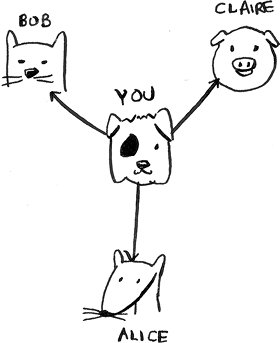

# 6. Breadth-first search

In this chapter

- You learn how to model a network using a new, abstract data structure: graphs.
- You learn breadth-first search, an algorithm you can run on graphs to answer questions like, “What’s the shortest path to go to X?”
- You learn about directed versus undirected graphs.
- You learn topological sort, a different kind of sorting algorithm that exposes dependencies between nodes.

This chapter introduces graphs. First, I’ll talk about what graphs are (they don’t involve an X or Y axis). Then I’ll show you your first graph algorithm. It’s called *breadth-first search* (BFS).

Breadth-first search allows you to find the shortest distance between two things. But shortest distance can mean a lot of things! You can use breadth-first search to

- Write a spellchecker (fewest edits from your misspelling to a real word—for example, READED → READER is one edit).
- Find the doctor closest to you in your network.
- Build a search engine crawler.

Graph algorithms are some of the most useful algorithms I know. Make sure you read the next few chapters carefully—these are algorithms you’ll be able to apply again and again.

## Introduction to graphs


Suppose you’re in San Francisco, and you want to go from Twin Peaks to the Golden Gate Bridge. You want to get there by bus, with the minimum number of transfers. Here are your options.


What’s your algorithm to find the path with the fewest steps?

Well, can you get there in one step? Here are all the places you can get to in one step.


The bridge isn’t highlighted; you can’t get there in one step. Can you get there in two steps?


Again, the bridge isn’t there, so you can’t get to the bridge in two steps. What about three steps?


Aha! Now the Golden Gate Bridge shows up. So it takes three steps to get from Twin Peaks to the bridge using this route.


There are other routes that will get you to the bridge, too, but they’re longer (four steps). The algorithm found that the shortest route to the bridge is three steps long. This type of problem is called a *shortest-path problem*. You’re always trying to find the shortest something. It could be the shortest route to your friend’s house. Or maybe you’re browsing the web. Without you knowing it, the network is looking for the shortest path between your computer and a website’s server. The algorithm to solve a shortest-path problem is called *breadth-first search*.

There are two steps to figuring out how to get from Twin Peaks to the Golden Gate Bridge:

1. Model the problem as a graph.
2. Solve the problem using breadth-first search.

Next I’ll cover what graphs are. Then I’ll go into breadth-first search in more detail.

## What is a graph?

A graph models a set of connections. For example, suppose you and your friends are playing poker, and you want to model who owes whom money. Here’s how you could say, “Alex owes Rama money.”


The full graph could look something like this.


Graph of people who owe other people poker money

Alex owes Rama money, Tom owes Adit money, and so on. Each graph is made up of *nodes* and *edges*.


That’s all there is to it! Graphs are made up of nodes and edges. A node can be directly connected to many other nodes. Those nodes are called *in*-*neighbors* or *out-neighbors*.

Since Alex is pointing to Rama, Alex is Rama’s *in-neighbor,* and Rama is Alex’s *out-neighbor*. This terminology can be confusing, so here’s a diagram to help.


In the graph, Adit isn’t Alex’s in-neighbor or out-neighbor because they aren’t directly connected. But Adit is Rama’s and Tom’s out-neighbor.

Graphs are a way to model how different things are connected to one another. Now let’s see breadth-first search in action.

## Breadth-first search

We looked at a search algorithm in chapter 1: binary search. Breadth-first search is a different kind of search algorithm: one that runs on graphs. It can help answer two types of questions:

- Question type 1: Is there a path from node A to node B?
- Question type 2: What is the shortest path from node A to node B?

You already saw breadth-first search once when you calculated the shortest route from Twin Peaks to the Golden Gate Bridge. That was a question of type 2: “What is the shortest path?” Now let’s look at the algorithm in more detail. You’ll ask a question of type 1: “Is there a path?”


Suppose you’re the proud owner of a mango farm. You’re looking for a mango seller who can sell your mangoes. Are you connected to a mango seller on Facebook? Well, you can search through your friends.


This search is pretty straightforward.

First, make a list of friends to search.


Now, go to each person in the list and check whether that person sells mangoes.


Suppose none of your friends are mango sellers. Now you have to search through your friends’ friends.


Each time you search for someone from the list, add all of their friends to the list.


This way, you not only search your friends, but you search their friends, too. Remember, the goal is to find one mango seller in your network. So if Alice isn’t a mango seller, you add her friends to the list, too. That means you’ll eventually search her friends—and then their friends, and so on. With this algorithm, you’ll search your entire network until you come across a mango seller. This algorithm is breadth-first search.

Finding the shortest path

As a recap, these are the two questions that breadth-first search can answer for you:

- Question type 1: Is there a path from node A to node B? (Is there a mango seller in your network?)
- Question type 2: What is the shortest path from node A to node B? (Who is the closest mango seller?)

You saw how to answer question 1; now let’s try to answer question 2. Can you find the closest mango seller? For example, your friends are first-degree connections, and their friends are second-degree connections.


You’d prefer a first-degree connection to a second-degree connection, a second-degree connection to a third-degree connection, and so on. So you shouldn’t search any second-degree connections before you make sure you don’t have a first-degree connection who is a mango seller. Well, breadth-first search already does this! The way breadth-first search works is that the search radiates out from the starting point. So you’ll check first-degree connections before second-degree connections. Pop quiz: Who will be checked first, Claire or Anuj? Answer: Claire is a first-degree connection, and Anuj is a second-degree connection, so Claire will be checked before Anuj.

Another way to see this is that first-degree connections are added to the search list before second-degree connections.


You just go down the list and check people to see whether each one is a mango seller. The first-degree connections will be searched before the second-degree connections, so you’ll find the mango seller closest to you. Breadth-first search not only finds a path from A to B; it also finds the shortest path.

Notice that this only works if you search people in the same order in which they’re added. That is, if Claire was added to the list before Anuj, Claire needs to be searched before Anuj. What happens if you search Anuj before Claire, and they’re both mango sellers? Well, Anuj is a second-degree contact, and Claire is a first-degree contact. You end up with a mango seller who isn’t the closest to you in your network. So you need to search people in the order that they’re added. There’s a data structure for this: it’s called *a queue*.

Queues

A queue works exactly like it does in real life. Suppose you and your friend are queueing up at the bus stop. If you’re before them in the queue, you get on the bus first. A queue works the same way. Queues are similar to stacks. You can’t access random elements in the queue. Instead, there are only two operations, *enqueue* and *dequeue*.


If you enqueue two items to the list, the first item you added will be dequeued before the second item. You can use this for your search list! People who are added to the list first will be dequeued and searched first.

The queue is called a *FIFO* data structure: first in, first out. In contrast, a stack is a *LIFO* data structure: last in, first out.


Now that you know how a queue works, let’s implement breadth-first search!

Exercises

Run the breadth-first search algorithm on each of these graphs to find the solution.

  6.1 Find the length of the shortest path from start to finish.


  6.2 Find the length of the shortest path from “cab” to “bat.”


## Implementing the graph

First, you need to implement the graph in code. A graph consists of several nodes.



And each node is connected to other nodes. How do you express a relationship like “you → bob”? Luckily, you know a data structure that lets you express relationships: *a hash table*!

Remember, a hash table allows you to map a key to a value. In this case, you want to map a node to all of its out-neighbors.


Here’s how you’d write it in Python:

```
graph = {}
graph["you"] = ["alice", "bob", "claire"]
```

Notice that “you” is mapped to an array. So `graph["you"]` will give you an array of all the out-neighbors of “you.” Remember that the out-neighbors are the nodes that the “you” node points to.

A graph is just a bunch of nodes and edges, so this is all you need to have a graph in Python. What about a bigger graph like this one?


Here it is as Python code:

```
graph = {}
graph["you"] = ["alice", "bob", "claire"]
graph["bob"] = ["anuj", "peggy"]
graph["alice"] = ["peggy"]
graph["claire"] = ["thom", "jonny"]
graph["anuj"] = []
graph["peggy"] = []
graph["thom"] = []
graph["jonny"] = []
```

Pop quiz: Does it matter what order you add the key/value pairs in? Does it matter if you write

```
graph["claire"] = ["thom", "jonny"]
graph["anuj"] = []
```

instead of

```
graph["anuj"] = []
graph["claire"] = ["thom", "jonny"]
```

Think back to the previous chapter. Answer: It doesn’t matter. Hash tables have no ordering, so it doesn’t matter what order you add key/value pairs in.

Anuj, Peggy, Thom, and Jonny don’t have any out-neighbors. They have in-neighbors since they have arrows pointing to them, but no arrows point from them to someone else. This is called a *directed graph*: the relationship is only one way. An undirected graph doesn’t have any arrows. For example, both of these graphs are equal.


If you have an undirected graph, you can forget the terms in-neighbor and out-neighbor and use the simpler term *neighbor*.


## Implementing the algorithm

To recap, here’s how the implementation will work.


Note When updating queues, I use the terms *enqueue* and *dequeue*. But sometimes you’ll see people using different terms. Python uses *append* and *popleft* instead of *enqueue* and *dequeue*.

Make a queue to start. In Python, you use the double-ended queue (`deque`) function for this:

```
from collections import deque        
search_queue = deque()            ①
search_queue += graph["you"]      ②
```

① Creates a new queue

② Adds all of your out-neighbors to the search queue

Remember, `graph["you"]` will give you a list of all your out-neighbors, like \[`"alice",` `"bob",` `"claire"`]. Those all get added to the search queue.


Let’s see the rest:

```
while search_queue:                           ①
    person = search_queue.popleft()           ②
    if person_is_seller(person):              ③
        print(person + " is a mango seller!") ④
        return True
    else:
        search_queue += graph[person]         ⑤
return False                                  ⑥
```

① While the queue isn’t empty . . .

② . . . grabs the first person off the queue.

③ Checks whether the person is a mango seller

④ Yes, they’re a mango seller.

⑤ No, they aren’t. Add all of this person’s friends to the search queue.

⑥ If you reached here, no one in the queue is a mango seller.

One final thing: you still need a `person_is_seller` function to tell you when someone is a mango seller. Here’s one:

```
def person_is_seller(name):
    return name[-1] == 'm'
```

This function checks whether the person’s name ends with the letter *m*. If it does, they’re a mango seller. Kind of a silly way to do it, but it’ll do for this example. Now let’s see the breadth-first search in action.


And so on. The algorithm will keep going until either a mango seller is found or the queue becomes empty, in which case there is no mango seller.

Alice and Bob share a friend, Peggy. So Peggy will be added to the queue twice: once when you add Alice’s friends and again when you add Bob’s friends. You’ll end up with two Peggys in the search queue.


But you only need to check Peggy once to see whether she’s a mango seller. If you check her twice, you’re doing unnecessary, extra work. So once you search a person, you should mark that person as searched and not search them again.

If you don’t do this, you could also end up in an infinite loop. Suppose the mango seller graph looked like this.


To start, the search queue contains all of your out-neighbors.


Now you check Peggy. She isn’t a mango seller, so you add all her out-neighbors to the search queue.


Next, you check yourself. You’re not a mango seller, so you add all your out-neighbors to the search queue.


And so on. This will be an infinite loop because the search queue will keep going from you to Peggy.


Before checking a person, it’s important to make sure they haven’t been checked already. To do that, you’ll keep a set of people you’ve already checked.


Here’s the final code for breadth-first search, taking that into account:

```
def search(name):
    search_queue = deque()
    search_queue += graph[name]   
    searched = set()                          ①
    while search_queue:
        person = search_queue.popleft()  
        if not person in searched:            ②
            if person_is_seller(person):
                print(person + " is a mango seller!")
                return True
            else:
                search_queue += graph[person]   
                searched.add(person)          ③
    return False
        
search("you")
```

① This set is how you keep track of which people you’ve searched before.

② Only search this person if you haven’t already searched them.

③ Marks this person as searched

Try running this code yourself. Maybe try changing the `person_is_seller` function to something more meaningful and see if it prints what you expect.

Running time

If you search your entire network for a mango seller, that means you’ll follow each edge (remember, an edge is the arrow or connection from one person to another). So the running time is at least O(number of edges).

You also keep a queue of every person to search. Adding one person to the queue takes constant time: O(1). Doing this for every person will take O(number of people) total. Breadth-first search takes O(number of people + number of edges), and it’s more commonly written as O(V+E) (V for number of vertices; E for number of edges).

Exercises

Here’s a small graph of my morning routine.


It tells you that I can’t eat breakfast until I’ve brushed my teeth. So “eat breakfast” *depends on* “brush teeth.”

On the other hand, showering doesn’t depend on brushing my teeth because I can shower before I brush my teeth. From this graph, you can make a list of the order in which I need to do my morning routine:

1. Wake up.
2. Shower.
3. Brush teeth.
4. Eat breakfast.

Note that “shower” can be moved around, so this list is also valid:

1. Wake up.
2. Brush teeth.
3. Shower.
4. Eat breakfast.

  6.3 For these three lists, mark whether each one is valid or invalid.


  6.4 Here’s a larger graph. Make a valid list for this graph.


You could say that this list is sorted, in a way. If task A depends on task B, task A shows up later in the list. This is called a *topological sort*, and it’s a way to make an ordered list out of a graph. Suppose you’re planning a wedding and have a large graph full of tasks to do, and you’re not sure where to start. You could *topologically sort* the graph and get a list of tasks to do in order.

Suppose you have a family tree.


This is a graph, because you have nodes (the people) and edges.

The edges point to the nodes’ parents. But all the edges go down—it wouldn’t make sense for a family tree to have an edge pointing back up! That would be meaningless—your dad can’t be your grandfather’s dad!


This is called a *tree*. A tree is a special type of graph where no edges ever point back.

  6.5 Which of the following graphs are also trees?


## Recap

- Breadth-first search tells you if there’s a path from A to B.
- If there’s a path, breadth-first search will find the shortest path.
- If you have a problem like “find the shortest X,” try modeling your problem as a graph and use breadth-first search to solve it.
- A directed graph has arrows, and the relationship follows the direction of the arrow (rama → adit means “rama owes adit money”).
- Undirected graphs don’t have arrows, and the relationship goes both ways (ross— rachel means “ross dated rachel and rachel dated ross”).
- Queues are FIFO (first in, first out).
- Stacks are LIFO (last in, first out).
- You need to check people in the order they were added to the search list, so the search list needs to be a queue. Otherwise, you won’t get the shortest path.
- Once you check someone, make sure you don’t check them again. Otherwise, you might end up in an infinite loop.


