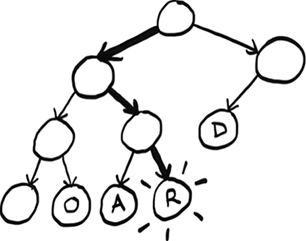

# 7. Trees

In this chapter

- You learn what a tree is and the difference between trees and graphs.
- You get comfortable with running an algorithm over a tree.
- You learn depth-first search and see the difference between depth-first search and breadth-first search.
- You learn Huffman coding, a compression algorithm that makes use of trees.

What do compression algorithms and database storage have in common? There is often a tree underneath doing all the hard work. Trees are a subset of graphs. They are worth covering separately as there are many specialized types of trees. For example, Huffman coding, a compression algorithm you will learn in this chapter, uses binary trees.


Most databases use a balanced tree like a B-tree, which you will learn about in the next chapter. There are so many types of trees out there. These two chapters will give you the vocabulary and concepts you need to understand them.

## Your first tree

Trees are a type of graph. We will have a more thorough definition later. First, let’s learn some terminology and look at an example.

Just like graphs, trees are made of nodes and edges.


In this book, we will work with rooted trees. Rooted trees have one node that leads to all the other nodes.


We will work exclusively with rooted trees, so when I say *tree* in this chapter, I mean a rooted tree. Nodes can have children, and child nodes can have a parent.


In a tree, nodes have at most one parent. The only node with no parents is the root. Nodes with no children are called leaf nodes.


If you understand root, leaf, parent, and child, you are ready to read on!

File Directories

Since a tree is a type of a graph, we can run a graph algorithm on it. In chapter 6, we learned breadth-first search, an algorithm for finding the shortest path in a graph. We are going to use breadth-first search on a tree. If you are not comfortable with breadth-first search, check out chapter 6.

A file directory is a tree that all of us interact with every day. Suppose I have this file directory.


I want to print the name of every file in the pics directory, including all its subdirectories. Here, there is only one subdirectory, 2001. We can use breadth-first search to do this! First, let me show you what this file directory looks like as a tree.


Since this file directory is a tree, we can run a graph algorithm on it. Earlier, we used breadth-first search as a search algorithm. But search isn’t the only thing it’s good for. Breadth-first search is a traversal algorithm. That means it is an algorithm that visits every node in a tree—that is, it traverses or walks the tree. That’s exactly what we need! We need an algorithm that will go to every file in this tree and print out its name. We will use breadth-first search to list all the files in a directory. The algorithm will also go into subdirectories, find files in there, and print out their names. My logic will be as follows:

1. Visit every node in the tree.
2. If this node is a file, print out its name.
3. If the node is a folder, add it to a queue of folders to search for files.

The code follows. It is very similar to the mango seller code from chapter 6:

```
from os import listdir
from os.path import isfile, join
from collections import deque

def printnames(start_dir):
    search_queue = deque()                     ①
    search_queue.append(start_dir)
    while search_queue:                        ②
        dir = search_queue.popleft()
        for file in sorted(listdir(dir)):      ③
            fullpath = join(dir, file)
            if isfile(fullpath):
                print(file)                    ④
            else:
                search_queue.append(fullpath)  ⑤
 
printnames("pics")
```

① We use a queue to keep track of folders to search.

② While the queue is not empty, pop off a folder to look through.

③ Loop through every file and folder in this folder.

④ If it is a file, print out the name.

⑤ If it is a folder, add it to the queue of folders to search.

Here, we use a queue like we did in the mango seller example. In the queue we keep track of what folders we still need to search. Of course, in that example, we stopped once we found a mango seller, but here we go through the whole tree.

There’s one other important difference from the mango seller code. Can you spot it?

In the mango seller example, remember we had to keep track of whether we had already searched a person:

```
...   
        if person not in searched:   ①
            if person_is_seller(person):
...
```

① Only search this person if you haven’t already searched them.

We don’t have to do that here! Trees don’t have cycles, and each node only has one parent. There’s no way we would accidentally search the same folder more than once or end up in an infinite loop, so there’s no need to keep track of which folders we have already searched. There simply isn’t a way to revisit a folder.


This property of trees has made our code simpler. That’s an important takeaway from this chapter: trees don’t have cycles.

A note on symbolic links

You may know what symbolic links are. If you don’t, symbolic links are a way to introduce a cycle in a file directory. I could make a symbolic link on macOS or Linux with

```
ln -s pics/ pics/2001/pics
```

or, on Windows, with

```
mklink /d pics/ pics/2001/pics
```

If I did that, the tree would look like the following.


Now our file directory isn’t a tree anymore! To keep things simple, for this example, we are going to ignore symbolic links. If we did have a symbolic link, Python is smart enough to avoid an infinite loop. Here is the error it throws:

```
OSError: [Errno 62] Too many levels of symbolic links: ‘pics/2001/pics’
```

## A space odyssey: Depth-first search

Let’s traverse our file directory again, doing it recursively this time:

```
from os import listdir
from os.path import isfile, join

def printnames(dir):
    for file in sorted(listdir(dir)):  ①
        fullpath = join(dir, file)
        if isfile(fullpath):
            print(file)                ②
        else:
            printnames(fullpath)       ③
 
printnames("pics")
```

① Loop through every file and folder in the current folder.

② If it is a file, print out the name.

③ If it is a folder, call this function recursively on it to look for files and folders.

Notice that now we are not using a queue. Instead, when we come across a folder, we immediately look inside for more files and folders. Now we have two ways of listing the file names. But here’s the surprising part: *the solutions will print the file names in different orders!*

One prints the names out like this:

```
a.png
space.png
odyssey.png
```

The other prints this:

```
odyssey.png
a.png
space.png
```

Can you figure out which solution prints which order and why? Try it yourself before moving on.

The first solution uses breadth-first search. When it finds a folder, that folder is added to the queue to be checked later. So the algorithm goes to the 2001 folder, does not go into it but adds it to the queue to be looked at later, prints all the file names in the pics/ folder, and then goes back to the 2001/ folder and prints the file names in there.


You can see the algorithm visits the 2001 folder first but doesn’t look inside. That folder is just added to the queue, and breadth-first search moves on to odyssey.png.

The second solution uses an algorithm called depth-first search. Depth-first search is also a graph and tree traversal algorithm. When it finds a folder, it looks inside immediately instead of adding it to a queue.


The second solution is the one that prints out

```
a.png
space.png
odyssey.png
```

Breadth-first search and depth-first search are closely related, and often where one is mentioned, the other will be also. Both algorithms printed out all the file names, so they both work for this example. But there is a big difference. Depth-first search cannot be used for finding the shortest path!

In the mango seller example, we could not have used depth-first search. We rely on the fact that we are checking all our first-degree friends before our second-degree friends, and so on. That’s what breadth-first search does. But depth-first search will go as deep as possible right away. It may find you a mango seller three degrees away when you have a closer contact! Suppose the following is your social network.


Let’s say we process nodes in order from left to right. Depth-first search will get to the leftmost child node and go deep.


Because the depth-first search went deep on the left node, it failed to realize that the right node is a mango seller that is much closer.

Breadth-first search will correctly find the closest mango seller.


So while both algorithms worked for listing files, only breadth-first search works for finding the shortest path. Depth-first search has other uses. It can be used to find the topological sort, a concept we saw briefly in chapter 6.

A better definition of trees

Now that you have seen an example, it’s time for a better definition of a tree. A tree is a *connected, acyclic graph*.


As I had said earlier, we are working exclusively with rooted trees, so our trees all have a root as well. And we are working exclusively with connected graphs. So the most important thing to remember is *trees cannot have cycles*.

Now we have seen a tree in action, let’s zoom in on one specific type of tree.

## Binary trees

Computer science is full of different types of trees. Binary trees are a very common type of tree. For the rest of this chapter and most of the next, we will work with binary trees.

A binary tree is a special type of tree where nodes can have at most two children (hence the name *binary*, meaning *two*). These are traditionally called left child and right child.


An ancestry tree is an example of a binary tree since everyone has two biological parents.


In that example, there’s a clear connection between nodes—they are all family. However, the data can be totally arbitrary.


The important thing is you never have more than two children. Sometimes people refer to the left subtree or right subtree.


Binary trees show up everywhere in computer science. We are going to spend the rest of this chapter looking at an example that uses a binary tree.

## Huffman coding

Huffman coding is a neat example of using binary trees. It’s also the foundation for text compression algorithms. We won’t describe the algorithm but will spend time focusing on how it works and how it makes clever use of trees.

First, a little background. To know how compression works, we need to know how much space a text file takes. Suppose we have a text file with just one word: *tilt*. How much space does that use? You can use the `stat` command (available on Unix). First, save the word in a file called `test.txt`. Then, using `stat`,

```
$ cat test.txt
tilt

$ stat -f%z test.txt
4
```

so that file takes up 4 bytes: 1 byte per character.

This makes sense. Assuming we are using ISO-8859-1 (see the following sidebar for what this means), each letter takes up exactly 1 byte. For example, the letter *a* is ISO-8859-1 code 97, which I can write in binary as 01100001. That is 8 bits. A bit is a digit that can be either 0 or 1. And there are eight of them. Eight bits is 1 byte. So the letter *a* is represented using 1 byte. ISO-8859-1 code goes from 00000000, which represents the null character, all the way to 11111111, which represents *ÿ* (Latin lowercase letter *y* with diaeresis). There are 256 possible combinations of 0s and 1s with 8 bits, so the ISO-8859-1 code allows for 256 possible letters.

Character encoding

As this example will show you, there are many different ways to encode characters. That is, the letter *a* could be written in binary in many different ways.

It started with ASCII. In the 1960s, ASCII was created. ASCII is a 7-bit encoding. Unfortunately, ASCII did not include a lot of characters. ASCII does not include any characters with umlauts (*ü* or *ö*, for example) or common currencies like the British pound or Japanese yen.

So ISO-8859-1 was created. ISO-8859-1 is an 8-bit encoding, so it doubles the number of characters that ASCII provided. We went from 128 characters to 256 characters. But this was still not enough, and countries began making their own encodings. For example, Japan has several encodings for Japanese since ISO-8859-1 and ASCII were focused on European languages. The whole situation was a mess until Unicode was introduced.

Unicode is an encoding standard. It aims to provide characters for any language. Unicode has 149,186 characters as of version 15—quite a jump from 256! More than 1,000 of these are emojis.

Unicode is the standard, but you need to use an encoding that follows the standard. The most popular encoding today is UTF-8. UTF-8 is variable-length character encoding, which means characters can be anywhere from 1 to 4 bytes (8–32 bits).

You don’t need to worry too much about this. I’ve kept the example simple intentionally by using ISO-8859-1, which is 8 bits—a nice consistent quantity of bits to work with.

Just remember these takeaways:

- Compression algorithms try to reduce the number of bits needed to store each character.
- If you need to pick an encoding for a project, UTF-8 is a good default choice.

Let’s decode some binary to ISO-8859-1 together: 011100100110000101100100. You can Google an ISO-8859-1 table or a binary-to-ISO-8859-1 converter to make this easier.

First, we know that each letter is 8 bits, so I am going to divide this into chunks of 8 bits to make it easier to read:

```
01110010 01100001 01100100
```

Great, now we see that there are three letters. Looking them up in an ISO-8859-1 table, I see they spell out `rad`: `01110010` is `r`, and so on. This is how your text editor takes the binary data in a text file and displays it as ISO-8859-1. You can view the binary information by using `xxd`. This utility is available on Unix. Here is how `tilt` looks in binary:

```
$ xxd -b test.txt
00000000: 01110100 01101001 01101100 01110100
tilt
```

Here is where the compression comes in. For the word *tilt*, we don’t need 256 possible letters; we just need three. So we don’t need 8 bits; we only need 2. We could come up with our own 2-bit code just for these three letters:

```
t = 00
i = 01
l = 10
```

Here is how we could write *tilt* using our new code: 00011000. I can make this easier to read by adding spaces again: 00 01 10 00. If you compare it to the mapping, you’ll see this spells out *tilt*.

This is what Huffman coding does: it looks at the characters being used and tries to use less than 8 bits. That is how it compresses the data. Huffman coding generates a tree.


You can use this tree to find the code for each letter. Starting at the root node, find a path down to the letter *L*. Whenever you choose a left branch, append a 0 to your code. When you choose a right branch, append 1. When you get to a letter, stop progressing down the tree. So the code for the letter *L* is 01. Here are the three codes given by the tree:

```
i = 00
l = 01
t = 1
```

Notice that the letter T has a code of just one digit. Unlike ISO-8859-1, *in Huffman coding, the codes don’t all have to be the same length*. This is important. Let’s see another example to understand why.

Now we want to compress the phrase “paranoid android.” Here is the tree generated by the Huffman coding algorithm.


Check yourself: What is the code for the letter *P*? Try it yourself before reading on. It is 0001. What about the letter *D*? It is 10.


In this case, there are actually three different possible lengths! Suppose we try to decode some binary data: 01101010. We see the problem right away: we can’t chunk this up the way we did with ISO-8859-1! While all ISO-8859-1 codes were eight digits, here the code could be two, three, or four digits. *Since the code length varies, we can’t use chunking anymore.*

Instead, we need to look at one digit at a time, as if we are looking at a tape.

Here’s how to do it: first number is 0, so go left (I’m only showing part of the tree here).


Then we get a 1, so we go right.


Then we get another 1, so we go right again.



Aha! We found a letter. This is the binary data we have left: 01010. We can start over at the root node and find the other letters. Try decoding the rest yourself and then read on. Did you get the word? It was *rad*. This is a big difference between Huffman coding and ISO-8859-1. The codes can vary, so the decoding needs to be done differently.

It is more work to do it this way instead of chunking. But there is one big benefit. Notice that the letters that show up more often have shorter codes. *D* appears three times, so its code is just two digits versus *I*, which appears twice, and *P*, which appears only once. Instead of assigning 4 bits to everything, we can compress frequently used letters even more. You can see how, in a longer piece of text, this would be a big savings!

Now that we understand at a high level how Huffman coding works, let’s see what properties of trees Huffman is taking advantage of here.

First, could there be overlap between codes? Take this code for example:

```
a = 0
b = 1
c = 00
```

Now if you see the binary 001, is that *AAB* or *CB*? *c* and *a* share part of their code, so it’s unclear. Here is what the tree for this code would look like.


We pass A on the way to C, which causes the problem.

That’s not a problem with Huffman coding because letters only show up at leaf nodes. And there’s a unique path from the root to each leaf node—that’s one of the properties of trees. So we can guarantee overlap is not a problem.

This also guarantees there is only one code for each letter. Having multiple paths to each letter would mean there are multiple codes assigned to each letter, which would be unnecessary.

When we read the code one digit at a time, we are assuming we will eventually end up at a letter. If this was a graph with a cycle, we couldn’t make that assumption. We could get stuck in the cycle and end up in an infinite loop.


But since this is a tree, we know there are no cycles, so we are guaranteed to end up at some letter.

We are using a rooted tree. Rooted trees have a root node, which is important because we need to know where to start! Graphs do not necessarily have a root node.

Finally, the type of tree used here is called a *binary tree*. Binary trees can have at most two children—the left child and the right child. This makes sense because binary only has two digits. If there was a third child, it would be unclear what digit it is supposed to represent.

This chapter introduced you to trees. In the next chapter, we will see some different types of trees and what they are used for.

## Recap

- Trees are a type of graph, but trees don’t have cycles.
- Depth-first search is another graph traversal algorithm. It can’t be used to find shortest paths.
- A binary tree is a special type of tree where nodes can have, at most, two children.
- There are many different types of character encodings. Unicode is the international standard, and UTF-8 is the most common Unicode encoding.


