# 10. Greedy algorithms

In this chapter

- You learn about the greedy strategy, a very simple problem-solving strategy.
- You learn how to cope with the impossible: problems that have no fast algorithmic solution (NP-hard problems).
- You learn about approximation algorithms, which you can use to find an approximate solution to an NP-hard problem quickly.
- You learn about the greedy strategy, a very simple problem-solving strategy.

## The classroom scheduling problem

Suppose you have a classroom and want to hold as many classes here as possible. You get a list of classes.


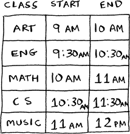

You can’t hold *all* of these classes in there because some of them overlap.

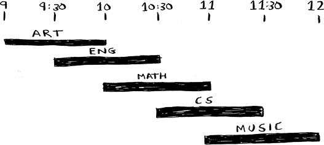

You want to hold as many classes as possible in this classroom. How do you pick what set of classes to hold so that you get the biggest set of classes possible?

Sounds like a hard problem, right? Actually, the algorithm is so easy it might surprise you. Here’s how it works:

1. Pick the class that ends the soonest. This is the first class you’ll hold in this classroom.
2. Now, you have to pick a class that starts after the first class. Again, pick the class that ends the soonest. This is the second class you’ll hold.

Keep doing this, and you’ll end up with the answer! Let’s try it out. Art ends the soonest, at 10:00 a.m., so that’s one of the classes you pick.

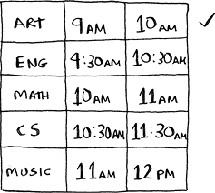

Now you need the next class that starts after 10:00 a.m. and ends the soonest.

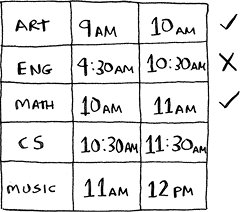

English is out because it conflicts with Art, but Math works.

Finally, CS conflicts with Math, but Music works.

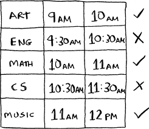

So these are the three classes you’ll hold in this classroom.


A lot of people tell me that this algorithm seems easy. It’s too obvious, so it must be wrong. But that’s the beauty of greedy algorithms: they’re easy! A greedy algorithm is simple: at each step, pick the optimal move. In this case, each time you pick a class, you pick the class that ends the soonest. In technical terms, *at each step, you pick the locally optimal solution*, and in the end, you’re left with the globally optimal solution. Believe it or not, this simple algorithm finds the optimal solution to this scheduling problem!

Obviously, greedy algorithms don’t always work. But they’re simple to write! Let’s look at another example.

## The knapsack problem

Suppose you’re a greedy thief. You’re in a store with a knapsack, and there are all these items you can steal. But you can only take what you can fit in your knapsack. The knapsack can hold 35 pounds.


You’re trying to maximize the value of the items you put in your knapsack. What algorithm do you use?


Again, the greedy strategy is pretty simple:

1. Pick the most expensive thing that will fit in your knapsack.
2. Pick the next most expensive thing that will fit in your knapsack. And so on.

Except this time, it doesn’t work! For example, suppose there are three items you can steal.

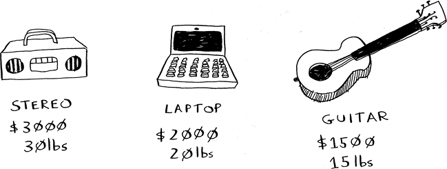

Your knapsack can hold 35 pounds of items. The stereo system is the most expensive, so you steal that. Now you don’t have space for anything else.

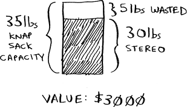

You got $3,000 worth of goods. But wait! If you’d picked the laptop and the guitar instead, you could have had $3,500 worth of loot!

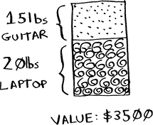

Clearly, the greedy strategy doesn’t give you the optimal solution here. Sometimes, it gives poor results. But sometimes, it can get you close. In the next chapter, I’ll explain how to calculate the correct solution.

Here’s the takeaway from this second example: *sometimes perfect is the enemy of good*. Sometimes all you need is an algorithm that solves the problem pretty well. And that’s where greedy algorithms shine because they’re simple to write and get results that are often good enough.

Exercises

10.1 You work for a furniture company, and you have to ship furniture all over the country. You need to pack your truck with boxes. All the boxes are of different sizes, and you’re trying to maximize the space you use in each truck. How would you pick boxes to maximize space? Come up with a greedy strategy. Will that give you the optimal solution?

10.2 You’re going to Europe, and you have seven days to see everything you can. You assign a point value to each item (how much you want to see it) and estimate how long it takes. How can you maximize the point total (seeing all the things you really want to see) during your stay? Come up with a greedy strategy. Will that give you the optimal solution?

Let’s look at one last example. This is an example where greedy algorithms are absolutely necessary.

## The set-covering problem

Suppose you’re starting a radio show. You want to reach listeners in all 50 US states. You have to decide what stations to play on to reach all those listeners. It costs money to be on each station, so you’re trying to minimize the number of stations you play on. You have a list of stations.

Each station covers a region, and there’s overlap.

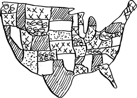

How do you figure out the smallest set of stations you can play on to cover all 50 states? Sounds easy, doesn’t it? Turns out it’s extremely hard. Here’s how to do it.

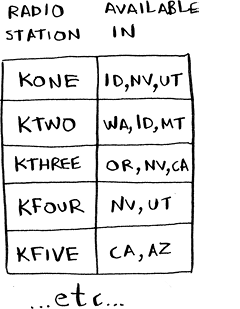

List every possible subset of stations. This is called the *power set*. There are 2n possible subsets.

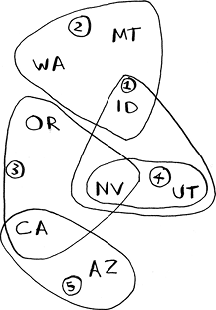

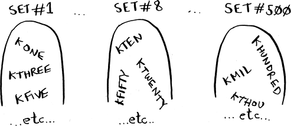

From these, pick the set with the smallest number of stations that covers all 50 states.

The problem is that it takes a long time to calculate every possible subset of stations. It takes O(2n) time because there are 2n subsets. It’s possible to do if you have a small set of 5 to 10 stations. But with all the examples here, think about what will happen if you have a lot of items. It takes much longer if you have more stations. Suppose you can calculate 10 subsets per second.

There’s no known algorithm that solves it fast enough! What can you do?

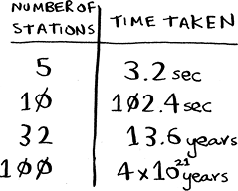

Approximation algorithms

Greedy algorithms to the rescue! Here’s a greedy algorithm that comes pretty close:

1. Pick the station that covers the most states that haven’t been covered yet. It’s OK if the station covers some states that have been covered already.
2. Repeat until all the states are covered.

This is called an *approximation algorithm.* When calculating the exact solution will take too much time, an approximation algorithm will work. Approximation algorithms are judged by

- How fast they are
- How close they are to the optimal solution

Greedy algorithms are a good choice because not only are they simple to come up with, but that simplicity means they usually run fast, too. In this case, the greedy algorithm runs in O(*n*2) time, where *n* is the number of radio stations.

Let’s see how this problem looks in code.

Code for setup

For this example, I’m going to use a subset of the states and the stations to keep things simple.

First, make a list of the states you want to cover:

```
states_needed = set(["mt", "wa", "or", "id", "nv", "ut",
"ca", "az"])         ①
```

① You pass an array in, and it gets converted to a set.

I used a set for this. A set is like a list, except that each item can show up only once in a set. *Sets can’t have duplicates.* For example, suppose you had this list:

```
>>> arr = [1, 2, 2, 3, 3, 3]
```

And you converted it to a set:

```
>>> set(arr)
set([1, 2, 3])
```

The numbers 1, 2, and 3 all show up just once in a set.

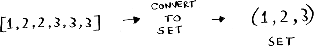

You also need the list of stations that you’re choosing from. I chose to use a `dict` for this:

```
stations = {}
stations["kone"] = set(["id", "nv", "ut"])
stations["ktwo"] = set(["wa", "id", "mt"])
stations["kthree"] = set(["or", "nv", "ca"])
stations["kfour"] = set(["nv", "ut"])
stations["kfive"] = set(["ca", "az"])
```

The keys are station names, and the values are the states they cover. So, in this example, the kone station covers Idaho, Nevada, and Utah. All the values are sets, too. Making everything a set will make your life easier, as you’ll see soon.

Finally, you need something to hold the final set of stations you’ll use:

```
final_stations = set()
```

Calculating the answer

Now you need to calculate what stations you’ll use. Take a look at the image at right, and see if you can predict what stations you should use.

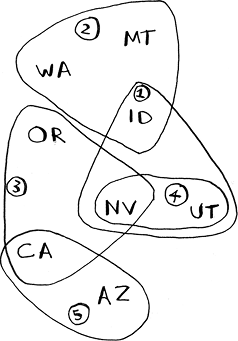

There can be more than one correct solution. You need to go through every station and pick the one that covers the most uncovered states. I’ll call this `best_station`:

```
best_station = None
states_covered = set()
for station, states_for_station in stations.items():
```

`states_covered` is the biggest set of states we can newly cover. Remember, we are trying to find the station that will cover the most states that haven’t been covered yet. The `for` loop allows you to loop over every station to see which one is the best station. Let’s look at the body of the `for` loop:

```
covered = states_needed & states_for_station   ①
if len(covered) > len(states_covered):
  best_station = station
  states_covered = covered
```

① New syntax! This is called a set intersection.

There’s a funny-looking line here:

```
covered = states_needed & states_for_station
```

What’s going on?

Sets

Suppose you have a set of fruits.

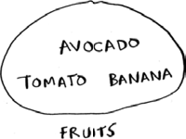

You also have a set of vegetables.


When you have two sets, you can do some fun things with them.

Here are some things you can do with sets.

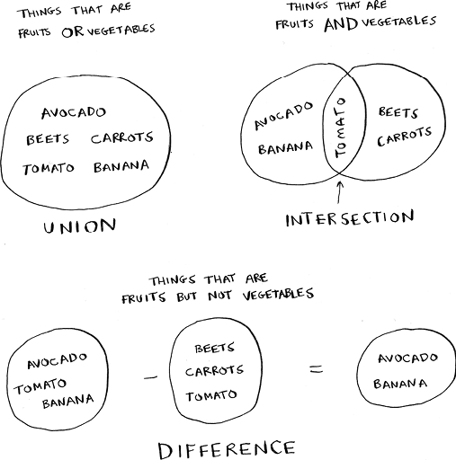

- A set union means “combine both sets.”
- A set intersection means “find the items that show up in both sets” (in this case, just the tomato).
- A set difference means “subtract the items in one set from the items in the other set.”

For example:

```
>>> fruits = set(["avocado", "tomato", "banana"])
>>> vegetables = set(["beets", "carrots", "tomato"])
>>> fruits | vegetables                          ①
set(["avocado", "beets", "carrots", "tomato", "banana"])
>>> fruits & vegetables                          ②
set(["tomato"])
>>> fruits – vegetables                          ③
set(["avocado", "banana"])
>>> vegetables – fruits                          ④
```

① This is a set union.

② This is a set intersection.

③ This is a set difference.

④ What do you think this will do?

To recap:

- Sets are like lists, except sets can’t have duplicates.
- You can do some interesting operations on sets, like union, intersection, and difference.

Back to the code

Let’s get back to the original example.


This is a set intersection:

```
covered = states_needed & states_for_station
```

`covered` is a set of states that were in both `states_needed` and `states_for_station`. So `covered` is the set of uncovered states that this station covers! Next you check whether this station covers more states than the current `best_station`:

```
if len(covered) > len(states_covered):
  best_station = station
  states_covered = covered
```

If so, this station is the new `best_station`. Finally, after the `for` loop is over, you add `best_station` to the final list of stations:

```
final_stations.add(best_station)
```

You also need to update `states_needed`. Because this station covers some states, those states aren’t needed anymore:

```
states_needed -= states_covered
```

And you loop until `states_needed` is empty. Here’s the full code for the loop:

```
while states_needed:
  best_station = None
  states_covered = set()
  for station, states in stations.items():
    covered = states_needed & states
    if len(covered) > len(states_covered):
      best_station = station
      states_covered = covered
          
  states_needed -= states_covered
  final_stations.add(best_station)
```

Finally, you can print `final_stations`, and you should see this:

```
>>> print(final_stations)
set(['ktwo', 'kthree', 'kone', 'kfive'])
```

Is that what you expected? Instead of stations 1, 2, 3, and 5, you could have chosen stations 2, 3, 4, and 5. Let’s compare the run time of the greedy algorithm to the exact algorithm.

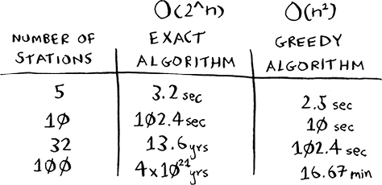

The greedy algorithm won’t always give an exact answer, but it runs much faster. The set-covering problem is known as an NP-hard problem. If you want to learn a little more about NP-hard problems, check out appendix B.

## Recap

- Greedy algorithms optimize locally, hoping to end up with a global optimum.
- If you have an NP-hard problem, your best bet is to use an approximation algorithm.
- Greedy algorithms are easy to write and fast to run, so they make good approximation algorithms.
