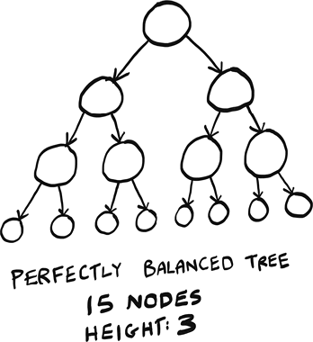
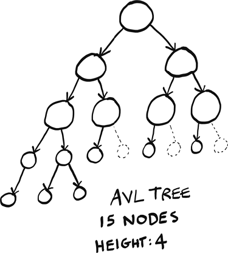
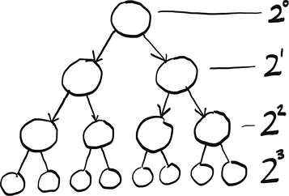

# Appendix A. Performance of AVL trees

This appendix discusses the performance of AVL trees, which were introduced in chapter 8. You will need to read that chapter before reading this.

Remember that AVL trees offer O(log *n*) search performance. But there is something misleading going on. Here are two trees. Both offer O(log *n*) search performance, but their heights are different!

(Dashed nodes show the holes in the tree.)

AVL trees allow a difference of one in heights. That’s why, even though both these trees have 15 nodes, the perfectly balanced tree is height 3, but the AVL tree is height 4. The perfectly balanced tree is what we might picture a balanced tree to look like, where each level is completely filled with nodes before a new level is added. But the AVL tree is also considered “balanced,” even though it has holes—gaps where a node could be.

Remember that in a tree, performance is closely related to height. How can these trees offer the same performance if their heights are different? Well, we never discussed what the base in log *n* is!

The perfectly balanced tree has performance O(log *n*), where the “log” is log base 2, just like binary search. We can see that in the picture. Each new level doubles the nodes plus 1. So a perfectly balanced tree of height 1 has 3 nodes, of height 2 has 7 nodes (32 + 1), of height 3 has 15 nodes (72 + 1), etc. You could also think of it as each layer adds a number of nodes equal to a power of 2.

So the perfectly balanced tree has performance O(log *n*), where the “log” is log base 2.

The AVL tree has some gaps. In an AVL tree, each new layer adds *less* than double the nodes. It turns out that an AVL offers performance O(log *n*), but the “log” is log base *phi* (aka the golden ratio, aka ~1.618).

This is a small but interesting difference—AVL trees offer performance that is not quite as good as perfectly balanced trees since the base is different. But the performance is still very close, since both are O(log *n*) after all. Just know it’s not exactly the same.
