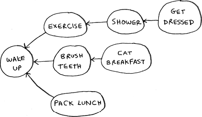

# Appendix C. Answers to exercises

Chapter 1

  1.1 Suppose you have a sorted list of 128 names, and you’re searching through it using binary search. What’s the maximum number of steps it would take?

*Answer*: 7.

  1.2 Suppose you double the size of the list. What’s the maximum number of steps now?

*Answer*: 8.

  1.3 You have a name, and you want to find the person’s phone number in the phone book.

*Answer*: O(log *n*).

  1.4 You have a phone number, and you want to find the person’s name in the phone book. (Hint: You’ll have to search through the whole book!)

*Answer*: O(*n*).

  1.5 You want to read the numbers of every person in the phone book.

*Answer*: O(*n*).

  1.6 You want to read the numbers of just the *A*s.

*Answer*: O(*n*). You may think, “I’m only doing this for 1 out of 26 characters, so the run time should be O(*n*/26).” A simple rule to remember is to ignore numbers that are added, subtracted, multiplied, or divided. None of these are correct big O run times: O(*n* + 26), O(*n* – 26), O(*n* * 26), O(*n*/26). They’re all the same as O(*n*)! Why? If you’re curious, flip to “big O notation revisited” in chapter 4 and read up on constants in big O notation (a constant is just a number; 26 was the constant in this question).

Chapter 2

  2.1 Suppose you’re building an app to keep track of your finances.


Every day, you write down everything you spent money on. At the end of the month, you review your expenses and sum up how much you spent. So, you have lots of inserts and a few reads. Should you use an array or a list?

*Answer*: In this case, you’re adding expenses to the list every day and reading all the expenses once a month. Arrays have fast reads and slow inserts. Linked lists have slow reads and fast inserts. Because you’ll be inserting more often than reading, it makes sense to use a linked list. Also, linked lists have slow reads only if you’re accessing random elements in the list. Because you’re reading *every* element in the list, linked lists will do well on *reads*, too. So a linked list is a good solution to this problem.

  2.2 Suppose you’re building an app for restaurants to take customer orders. Your app needs to store a list of orders. Servers keep adding orders to this list, and chefs take orders off the list and make them. It’s an order queue: servers add orders to the back of the queue, and the chef takes the first order off the queue and cooks it.


Would you use an array or a linked list to implement this queue? (Hint: Linked lists are good for inserts/deletes, and arrays are good for random access. Which one are you going to be doing here?)

*Answer*: A linked list. Lots of inserts are happening (servers adding orders), which linked lists excel at. You don’t need search or random access (what arrays excel at) because the chefs always take the first order off the queue.

  2.3 Let’s run a thought experiment. Suppose Facebook keeps a list of usernames. When someone tries to log in to Facebook, a search is done for their username. If their name is in the list of usernames, they can log in. People log in to Facebook pretty often, so there are a lot of searches through this list of usernames. Suppose Facebook uses binary search to search the list. Binary search needs random access—you need to be able to get to the middle of the list of usernames instantly. Knowing this, would you implement the list as an array or a linked list?

*Answer*: A sorted array. Arrays give you random access—you can get an element from the middle of the array instantly. You can’t do that with linked lists. To get to the middle element in a linked list, you’d have to start at the first element and follow all the links down to the middle element.

  2.4 People sign up for Facebook pretty often, too. Suppose you decided to use an array to store the list of users. What are the downsides of an array for inserts? In particular, suppose you’re using binary search to search for logins. What happens when you add new users to an array?

*Answer*: Inserting into arrays is slow. Also, if you’re using binary search to search for usernames, the array needs to be sorted. Suppose someone named Adit B signs up for Facebook. Their name will be inserted at the end of the array. So you need to sort the array every time a name is inserted!

  2.5 In reality, Facebook uses neither an array nor a linked list to store user information. Let’s consider a hybrid data structure: an array of linked lists. You have an array with 26 slots. Each slot points to a linked list. For example, the first slot in the array points to a linked list containing all the usernames starting with *A*. The second slot points to a linked list containing all the usernames starting with *B*, and so on.


Suppose Adit B signs up for Facebook, and you want to add them to the list. You go to slot 1 in the array, go to the linked list for slot 1, and add Adit B at the end. Now, suppose you want to search for Zakhir H. You go to slot 26, which points to a linked list of all the Z names. Then you search through that list to find Zakhir H.

Compare this hybrid data structure to arrays and linked lists. Is it slower or faster than each for searching and inserting? You don’t have to give big O run times, just whether the new data structure would be faster or slower.

*Answer*: Searching—slower than arrays, faster than linked lists. Inserting—faster than arrays, same amount of time as linked lists. So it’s slower for searching than an array, but faster or the same as linked lists for everything. We’ll talk about another hybrid data structure called a hash table later in the book. This should give you an idea of how you can build up more complex data structures from simple ones.

So what does Facebook really use? It probably uses a dozen different databases with different data structures behind them: hash tables, B-trees, and others. Arrays and linked lists are the building blocks for these more complex data structures.

Chapter 3

  3.1 Suppose I show you a call stack like this.


What information can you give me, just based on this call stack?

*Answer*: Here are some things you could tell me:

The `greet` function is called first, with `name = maggie.`

Then the `greet` function calls the `greet2` function, with `name = maggie`.

At this point, the `greet` function is in an incomplete, suspended state.

The current function call is the `greet2` function.

After this function call completes, the `greet` function will resume.

  3.2 Suppose you accidentally write a recursive function that runs forever. As you saw, your computer allocates memory on the stack for each function call. What happens to the stack when your recursive function runs forever?

*Answer*: The stack grows forever. Each program has a limited amount of space on the call stack. When your program runs out of space (which it eventually will), it will exit with a stack-overflow error.

Chapter 4

  4.1 Write out the code for the earlier sum function.

*Answer*:

```
def sum(list):
  if list == []:
    return 0
  return list[0] + sum(list[1:])
```

  4.2 Write a recursive function to count the number of items in a list.

*Answer*:

```
def count(list):
  if list == []:
    return 0
  return 1 + count(list[1:])
```

  4.3 Write a recursive function to find the maximum number in a list.

*Answer*:

```
def max(list):
  if len(list) == 2:
    return list[0] if list[0] > list[1] else list[1]
  sub_max = max(list[1:])
  return list[0] if list[0] > sub_max else sub_max
```

  4.4 Remember binary search from chapter 1? It’s a D&amp;C algorithm, too. Can you come up with the base case and recursive case for binary search?

*Answer*: The base case for binary search is an array with one item. If the item you’re looking for matches the item in the array, you found it! Otherwise, it isn’t in the array.

In the recursive case for binary search, you split the array in half, throw away one half, and call binary search on the other half.

How long would each of these operations take in big O notation?

  4.5 Printing the value of each element in an array.

*Answer*: O(*n*)

  4.6 Doubling the value of each element in an array.

*Answer*: O(*n*)

  4.7 Doubling the value of just the first element in an array.

*Answer*: O(1)

  4.8 Creating a multiplication table with all the elements in the array. So if your array is \[2, 3, 7, 8, 10], you first multiply every element by 2, then multiply every element by 3, then by 7, and so on.

*Answer*: O(*n*2)

Chapter 5

Which of these hash functions are consistent?

  5.1 `f(x) = 1`← Returns 1 for all input

*Answer*: Consistent

  5.2 `f(x) = rand()`← Returns a random number every time

*Answer*: Not consistent

  5.3 `f(x) = next_empty_slot()`← Returns the index of the next empty slot in the hash table

*Answer*: Not consistent

  5.4 `f(x) = len(x)`← Uses the length of the string as the index

*Answer*: Consistent

Suppose you have these four hash functions that work with strings:

  A.  Return “1” for all input.

  B.  Use the length of the string as the index.

  C.  Use the first character of the string as the index. So, all strings starting with *a* are hashed together, and so on.

  D.  Map every letter to a prime number: a = 2, b = 3, c = 5, d = 7, e = 11, and so on. For a string, the hash function is the sum of all the characters modulo the size of the hash. For example, if your hash size is 10, and the string is “bag,” the index is 3 + 2 + 17 % 10 = 22 % 10 = 2.

For each of the following examples, which hash functions would provide a good distribution? Assume a hash table size of 10 slots.

  5.5 A phonebook where the keys are names and values are phone numbers. The names are as follows: Esther, Ben, Bob, and Dan.

*Answer*: Hash functions C and D would give a good distribution.

  5.6 A mapping from battery size to power. The sizes are A, AA, AAA, and AAAA.

*Answer*: Hash functions B and D would give a good distribution.

  5.7 A mapping from book titles to authors. The titles are *Maus*, *Fun* *Home*, and *Watchmen*.

*Answer*: Hash functions B, C, and D would give a good distribution.

Chapter 6

Run the breadth-first search algorithm on each of these graphs to find the solution.

  6.1 Find the length of the shortest path from start to finish.


*Answer*: The shortest path has a length of 2.

  6.2 Find the length of the shortest path from “cab” to “bat.”


*Answer*: The shortest path has a length of 2.

Here’s a small graph of my morning routine.


  6.3 For these three lists, mark whether each one is valid or invalid.


*Answers*: A—Invalid; B—Valid; C—Invalid.

  6.4 Here’s a larger graph. Make a valid list for this graph.



*Answer*: 1—Wake up; 2—Exercise; 3—Shower; 4—Brush teeth; 5—Get dressed; 6—Pack lunch; 7—Eat breakfast.

  6.5 Which of the following graphs are also trees?


*Answers*: A—Tree; B—Not a tree; C—Tree. The last example is just a sideways tree. Trees are a subset of graphs. So a tree is always a graph, but a graph may or may not be a tree.

Chapter 9

  9.1 In each of these graphs, what is the weight of the shortest path from Start to Finish?


*Answers*: A: A—8; B—60; C—4.

Chapter 10

10.1 You work for a furniture company, and you have to ship furniture all over the country. You need to pack your truck with boxes. All the boxes are of different sizes, and you’re trying to maximize the space you use in each truck. How would you pick boxes to maximize space? Come up with a greedy strategy. Will that give you the optimal solution?

*Answer*: A greedy strategy would be to pick the largest box that will fit in the remaining space and repeat until you can’t pack any more boxes. No, this won’t give you the optimal solution.

10.2 You’re going to Europe, and you have seven days to see everything you can. You assign a point value to each item (how much you want to see it) and estimate how long it takes. How can you maximize the point total (seeing all the things you really want to see) during your stay? Come up with a greedy strategy. Will that give you the optimal solution?

*Answer*: Keep picking the activity with the highest point value that you can still do in the time you have left. Stop when you can’t do anything else. No, this won’t give you the optimal solution.

Chapter 11

11.1 Suppose you can steal another item: a mechanical keyboard. It weighs 1 lb and is worth $1,000. Should you steal it?

*Answer*: Yes. Then you could steal the mechanical keyboard, the iPhone, and the guitar, worth a total of $4,500.

11.2 Suppose you’re going camping. You have a knapsack that holds 6 lb, and you can take the following items. They each have a value, and the higher the value, the more important the item is:

- Water, 3 lb, 10
- Book, 1 lb, 3
- Food, 2 lb, 9
- Jacket, 2 lb, 5
- Camera, 1 lb, 6

What’s the optimal set of items to take on your camping trip?

*Answer*: You should take water, food, and a camera.

11.3 Draw and fill in the grid to calculate the longest common substring between *blue* and *clues*.

*Answer*:


Chapter 12

12.1 In the Netflix example, you calculated the distance between two different users using the distance formula. But not all users rate movies the same way. Suppose you have two users, Yogi and Pinky, who have the same taste in movies. But Yogi rates any movie he likes as a 5, whereas Pinky is choosier and reserves the 5s for only the best. They’re well matched, but according to the distance algorithm, they aren’t neighbors. How would you take their different rating strategies into account?

*Answer*: You could use something called normalization. You look at the average rating for each person and use it to scale their ratings. For example, you might notice that Pinky’s average rating is 3, whereas Yogi’s average rating is 3.5. So you bump up Pinky’s ratings a little until her average rating is 3.5 as well. Then you can compare their ratings on the same scale.

12.2 Suppose Netflix nominates a group of “influencers.” For example, Quentin Tarantino and Wes Anderson are influencers on Netflix, so their ratings count for more than a normal user’s. How would you change the recommendations system so it’s biased toward the ratings of influencers?

*Answer*: You could give more weight to the ratings of the influencers when using KNN. Suppose you have three neighbors: Joe, Dave, and Wes Anderson (an influencer). They rated Caddyshack 3, 4, and 5, respectively. Instead of just taking the average of their ratings (3 + 4 + 5 / 3 = 4 stars), you could give Wes Anderson’s rating more weight: 3 + 4 + 5 + 5 + 5 / 5 = 4.4 stars.

12.3 Netflix has millions of users. The earlier example looked at the five closest neighbors for building the recommendations system. Is this too low? Too high?

*Answer*: It’s too low. If you look at fewer neighbors, there’s a bigger chance that the results will be skewed. A good rule of thumb is that if you have *N* users, you should look at sqrt(*N*) neighbors.
