# Chapter 2

## Methodologies

*Give a man a fish and you feed him for a day.*  
*Teach a man to fish and you feed him for a lifetime.*

Chinese proverb (English equivalent)

I began my tech career as a junior system administrator, and I thought I could learn performance by studying command-line tools and metrics alone. I was wrong. I read man pages from top to bottom and learned the definitions for page faults, context switches, and various other system metrics, but I didn’t know what to do with them: how to move from signals to solutions.

I noticed that, whenever there was a performance issue, the senior system administrators had their own mental procedures for moving quickly through tools and metrics to find the root cause. They understood which metrics were important and when they pointed to an issue, and how to use them to narrow down an investigation. It was this *know-how* that was missing from the man pages—it was typically learned by watching over the shoulder of a senior admin or engineer.

Since then I’ve collected, documented, shared, and developed performance *methodologies* of my own. This chapter includes these methodologies and other essential background for systems performance: concepts, terminology, statistics, and visualizations. This covers theory before later chapters dive into implementation.

The learning objectives of this chapter are:

- Understand key performance metrics: latency, utilization, and saturation.
- Develop a sense for the scale of measured time, down to nanoseconds.
- Learn tuning trade-offs, targets, and when to stop analysis.
- Identify problems of workload versus architecture.
- Consider resource versus workload analysis.
- Follow different performance methodologies, including: the USE method, workload characterization, latency analysis, static performance tuning, and performance mantras.
- Understand the basics of statistics and queueing theory.

Of all the chapters in this book, this one has changed the least since the first edition. Software, hardware, performance tools, and performance tunables have all changed over the course of my career. What have remained the same are the theory and methodologies: the durable skills covered in this chapter.

This chapter has three parts:

- **Background** introduces terminology, basic models, key performance concepts, and perspectives. Much of this will be assumed knowledge for the rest of this book.
- **Methodology** discusses performance analysis methodologies, both observational and experimental; modeling; and capacity planning.
- **Metrics** introduces performance statistics, monitoring, and visualizations.

Many of the methodologies introduced here are explored in more detail in later chapters, including the methodology sections in [Chapters 5](ch05.md) through [10](ch10.md).

### 2.1 Terminology

The following are key terms for systems performance. Later chapters provide additional terms and describe some of these in different contexts.

- **IOPS**: Input/output operations per second is a measure of the rate of data transfer operations. For disk I/O, IOPS refers to reads and writes per second.
- **Throughput**: The rate of work performed. Especially in communications, the term is used to refer to the *data rate* (bytes per second or bits per second). In some contexts (e.g., databases) throughput can refer to the [*operation rate*](gloss.md) (operations per second or transactions per second).
- **Response time**: The time for an operation to complete. This includes any time spent waiting and time spent being serviced (*service time*), including the time to transfer the result.
- **Latency**: A measure of time an operation spends waiting to be serviced. In some contexts it can refer to the entire time for an operation, equivalent to response time. See [Section 2.3](ch02.md), [Concepts](ch02.md), for examples.
- **Utilization**: For resources that service requests, utilization is a measure of how busy a resource is, based on how much time in a given interval it was actively performing work. For resources that provide storage, utilization may refer to the capacity that is consumed (e.g., memory utilization).
- **Saturation**: The degree to which a resource has queued work it cannot service.
- [**Bottleneck**](gloss.md): In systems performance, a bottleneck is a resource that limits the performance of the system. Identifying and removing systemic bottlenecks is a key activity of systems performance.
- [**Workload**](gloss.md): The input to the system or the load applied is the workload. For a database, the workload consists of the database queries and commands sent by the clients.
- **Cache**: A fast storage area that can duplicate or buffer a limited amount of data, to avoid communicating directly with a slower tier of storage, thereby improving performance. For economic reasons, a cache is often smaller than the slower tier.

The Glossary includes more terminology for reference if needed.

### 2.2 Models

The following simple models illustrate some basic principles of system performance.

#### 2.2.1 System Under Test

The performance of a system under test (SUT) is shown in [Figure 2.1](ch02.md).

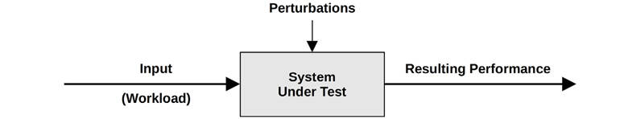

Figure 2.1 Block diagram of system under test

It is important to be aware that perturbations (interference) can affect results, including those caused by scheduled system activity, other users of the system, and other workloads. The origin of the perturbations may not be obvious, and careful study of system performance may be required to determine it. This can be particularly difficult in some cloud environments, where other activity (by guest tenants) on the physical host system may not be observable from within a guest SUT.

Another difficulty with modern environments is that they may be composed of several networked components servicing the input workload, including load balancers, proxy servers, web servers, caching servers, application servers, database servers, and storage systems. The mere act of mapping the environment may help to reveal previously overlooked sources of perturbations. The environment may also be modeled as a network of queueing systems, for analytical study.

#### 2.2.2 Queueing System

Some components and resources can be modeled as a queueing system so that their performance under different situations can be predicted based on the model. Disks are commonly modeled as a queueing system, which can predict how response time degrades under load. [Figure 2.2](ch02.md) shows a simple queueing system.

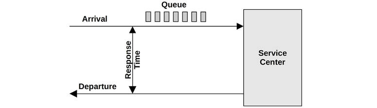

Figure 2.2 Simple queueing model

The field of queueing theory, introduced in [Section 2.6](ch02.md), [Modeling](ch02.md), studies queueing systems and networks of queueing systems.

### 2.3 Concepts

The following are important concepts of systems performance and are assumed knowledge for the rest of this chapter and this book. The topics are described in a generic manner, before implementation-specific details are introduced in the Architecture sections of later chapters.

#### 2.3.1 Latency

For some environments, latency is the sole focus of performance. For others, it is the top one or two key metrics for analysis, along with throughput.

As an example of latency, [Figure 2.3](ch02.md) shows a network transfer, such as an HTTP GET request, with the time split into latency and data transfer components.

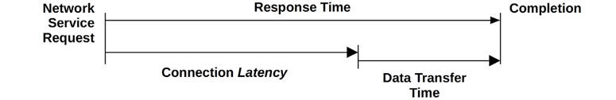

Figure 2.3 Network connection latency

The latency is the time spent waiting before an operation is performed. In this example, the operation is a network service request to transfer data. Before this operation can take place, the system must wait for a network connection to be established, which is latency for this operation. The *response time* spans this latency and the operation time.

Because latency can be measured from different locations, it is often expressed with the target of the measurement. For example, the load time for a website may be composed of three different times measured from different locations: *DNS latency*, *TCP connection latency*, and then *TCP data* *transfer time*. DNS latency refers to the entire DNS operation. TCP connection latency refers to the initialization only (TCP handshake).

At a higher level, all of these, including the TCP data transfer time, may be treated as latency of something else. For example, the time from when the user clicks a website link to when the resulting page is fully loaded may be termed *latency*, which includes the time for the browser to fetch a web page over a network and render it. Since the single word “latency” can be ambiguous, it is best to include qualifying terms to explain what it measures: request latency, TCP connection latency, etc.

As latency is a time-based metric, various calculations are possible. Performance issues can be quantified using latency and then ranked because they are expressed using the same units (time). Predicted speedup can also be calculated, by considering when latency can be reduced or removed. Neither of these can be accurately performed using an IOPS metric, for example.

For reference, time orders of magnitude and their abbreviations are listed in [Table 2.1](ch02.md).

Table 2.1 **Units of time**

**Unit**

**Abbreviation**

**Fraction of 1 Second**

Minute

m

60

Second

s

1

Millisecond

ms

0.001 or 1/1000 or 1 × 10-3

Microsecond

μs

0.000001 or 1/1000000 or 1 × 10-6

Nanosecond

ns

0.000000001 or 1/1000000000 or 1 × 10-9

Picosecond

ps

0.000000000001 or 1/1000000000000 or 1 × 10-12

When possible, converting other metric types to latency or time allows them to be compared. If you had to choose between 100 network I/O or 50 disk I/O, how would you know which would perform better? It’s a complicated question, involving many factors: network hops, rate of network drops and retransmits, I/O size, random or sequential I/O, disk types, and so on. But if you compare 100 ms of total network I/O and 50 ms of total disk I/O, the difference is clear.

#### 2.3.2 Time Scales

While times can be compared numerically, it also helps to have an instinct about time, and reasonable expectations for latency from different sources. System components operate over vastly different time scales (orders of magnitude), to the extent that it can be difficult to grasp just how big those differences are. In [Table 2.2](ch02.md), example latencies are provided, starting with CPU register access for a 3.5 GHz processor. To demonstrate the differences in time scales we’re working with, the table shows an average time that each operation might take, scaled to an imaginary system in which a CPU cycle—0.3 ns (about one-third of one-billionth[1](ch02.md) of a second) in real life—takes one full second.

[1](ch02.md)US billionth: 1/1000,000,000

Table 2.2 **Example time scale of system latencies**

**Event**

**Latency**

**Scaled**

1 CPU cycle

0.3 ns

1 s

Level 1 cache access

0.9 ns

3 s

Level 2 cache access

3 ns

10 s

Level 3 cache access

10 ns

33 s

Main memory access (DRAM, from CPU)

100 ns

6 min

Solid-state disk I/O (flash memory)

10–100 μs

9–90 hours

Rotational disk I/O

1–10 ms

1–12 months

Internet: San Francisco to New York

40 ms

4 years

Internet: San Francisco to United Kingdom

81 ms

8 years

Lightweight hardware virtualization boot

100 ms

11 years

Internet: San Francisco to Australia

183 ms

19 years

OS virtualization system boot

&lt; 1 s

105 years

TCP timer-based retransmit

1–3 s

105–317 years

SCSI command time-out

30 s

3 millennia

Hardware (HW) virtualization system boot

40 s

4 millennia

Physical system reboot

5 m

32 millennia

As you can see, the time scale for CPU cycles is tiny. The time it takes light to travel 0.5 m, perhaps the distance from your eyes to this page, is about 1.7 ns. During the same time, a modern CPU may have executed five CPU cycles and processed several instructions.

For more about CPU cycles and latency, see [Chapter 6](ch06.md), [CPUs](ch06.md), and for disk I/O latency, [Chapter 9](ch09.md), [Disks](ch09.md). The Internet latencies included are from [Chapter 10](ch10.md), [Network](ch10.md), which has more examples.

#### 2.3.3 Trade-Offs

You should be aware of some common performance trade-offs. The good/fast/cheap “pick two” trade-off is shown in [Figure 2.4](ch02.md), alongside the terminology adjusted for IT projects.

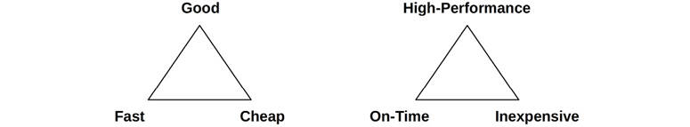

Figure 2.4 Trade-offs: pick two

Many IT projects choose on-time and inexpensive, leaving performance to be fixed later. This choice can become problematic when earlier decisions inhibit improving performance, such as choosing and populating a suboptimal storage architecture, using a programming language or operating system that is implemented inefficiently, or selecting a component that lacks comprehensive performance analysis tools.

A common trade-off in performance tuning is the one between CPU and memory, as memory can be used to cache results, reducing CPU usage. On modern systems with an abundance of CPU, the trade may work the other way: CPU time may be spent compressing data to reduce memory usage.

Tunable parameters often come with trade-offs. Here are a couple of examples:

- **File system record size** (or block size): Small record sizes, close to the application I/O size, will perform better for random I/O workloads and make more efficient use of the file system cache while the application is running. Large record sizes will improve streaming workloads, including file system backups.
- **Network buffer size**: Small buffer sizes will reduce the memory overhead per connection, helping the system scale. Large sizes will improve network throughput.

Look for such trade-offs when making changes to the system.

#### 2.3.4 Tuning Efforts

Performance tuning is most effective when done closest to where the work is performed. For workloads driven by applications, this means within the application itself. [Table 2.3](ch02.md) shows an example software stack with tuning possibilities.

By tuning at the application level, you may be able to eliminate or reduce database queries and improve performance by a large factor (e.g., 20x). Tuning down to the storage device level may eliminate or improve storage I/O, but a tax has already been paid in executing higher-level OS stack code, so this may improve resulting application performance only by percentages (e.g., 20%).

Table 2.3 **Example targets of tuning**

**Layer**

**Example Tuning Targets**

Application

Application logic, request queue sizes, database queries performed

Database

Database table layout, indexes, buffering

System calls

Memory-mapped or read/write, sync or async I/O flags

File system

Record size, cache size, file system tunables, journaling

Storage

RAID level, number and type of disks, storage tunables

There is another reason for finding large performance wins at the application level. Many of today’s environments target rapid deployment for features and functionality, pushing software changes into production weekly or daily.[2](ch02.md) Application development and testing therefore tend to focus on correctness, leaving little or no time for performance measurement or optimization before production deployment. These activities are conducted later, when performance becomes a problem.

[2](ch02.md)Examples of environments that change rapidly include the Netflix cloud and Shopify, which push multiple changes per day.

While the application can be the most effective level at which to tune, it isn’t necessarily the most effective level from which to base observation. Slow queries may be best understood from their time spent on-CPU, or from the file system and disk I/O that they perform. These are observable from operating system tools.

In many environments (especially cloud computing) the application level is under constant development, pushing software changes into production weekly or daily. Large performance wins, including fixes for regressions, are frequently found as the application code changes. In these environments, tuning for the operating system and observability from the operating system can be easy to overlook. Remember that operating system performance analysis can also identify application-level issues, not just OS-level issues, in some cases more easily than from the application alone.

#### 2.3.5 Level of Appropriateness

Different organizations and environments have different requirements for performance. You may have joined an organization where it is the norm to analyze much deeper than you’ve seen before, or even knew was possible. Or you may find that, in your new workplace, what you consider basic analysis is considered advanced and has never before been performed (good news: low-hanging fruit!).

This doesn’t necessarily mean that some organizations are doing it right and some wrong. It depends on the return on investment (ROI) for performance expertise. Organizations with large data centers or large cloud environments may employ a team of performance engineers who analyze everything, including kernel internals and CPU performance counters, and make frequent use of a variety of tracing tools. They may also formally model performance and develop accurate predictions for future growth. For environments spending millions per year on computing, it can be easy to justify hiring such a performance team, as the wins they find are the ROI. Small startups with modest computing spend may only perform superficial checks, trusting third-party monitoring solutions to check their performance and provide alerts.

However, as introduced in [Chapter 1](ch01.md), systems performance is not just about cost: it is also about the end-user experience. A startup may find it necessary to invest in performance engineering to improve website or application latency. The ROI here is not necessarily a reduction in cost, but happier customers instead of ex-customers.

The most extreme environments include stock exchanges and high-frequency traders, where performance and latency are critical and can justify intense effort and expense. As an example of this, a transatlantic cable between the New York and London exchanges was planned with a cost of $300 million, to reduce transmission latency by 6 ms [\[Williams 11\]](ch02.md).

When doing performance analysis, the level of appropriateness also comes in to play in deciding when to stop analysis.

#### 2.3.6 When to Stop Analysis

A challenge whenever doing performance analysis is knowing when to stop. There are so many tools, and so many things to examine!

When I teach performance classes (as I’ve begun to do again recently), I can give my students a performance issue that has three contributing reasons, and find that some students stop after finding one reason, others two, and others all three. Some students keep going, trying to find even more reasons for the performance issue. Who is doing it right? It might be easy to say you should stop after finding all three reasons, but for real-life issues you don’t know the number of causes.

Here are three scenarios where you may consider stopping analysis, with some personal examples:

- **When you’ve explained the bulk of the performance problem**. A Java application was consuming three times more CPU than it had been. The first issue I found was one of exception stacks consuming CPU. I then quantified time in those stacks and found that they accounted for only 12% of the overall CPU footprint. If that figure had been closer to 66%, I could have stopped analysis—the 3x slowdown would have been accounted for. But in this case, at 12%, I needed to keep looking.
- **When the potential ROI is less than the cost of analysis**. Some performance issues I work on can deliver wins measured in tens of millions of dollars per year. For these I can justify spending months of my own time (engineering cost) on analysis. Other performance wins, say for tiny microservices, may be measured in hundreds of dollars: it may not be worth even an hour of engineering time to analyze them. Exceptions might include when I have nothing better to do with company time (which never happens in practice) or if I suspected that this might be a canary for a bigger issue later on, and therefore worth debugging before the problem grows.
- **When there are bigger ROIs elsewhere**. Even if the previous two scenarios have not been met, there may be larger ROIs elsewhere that take priority.

If you are working full-time as a performance engineer, prioritizing the analysis of different issues based on their potential ROI is likely a daily task.

#### 2.3.7 Point-in-Time Recommendations

The performance characteristics of environments change over time, due to the addition of more users, newer hardware, and updated software or firmware. An environment currently limited by a 10 Gbit/s network infrastructure may start to experience a bottleneck in disk or CPU performance after an upgrade to 100 Gbits/s.

Performance recommendations, especially the values of tunable parameters, are valid only at a specific *point in time*. What may have been the best advice from a performance expert one week may become invalid a week later after a software or hardware upgrade, or after adding more users.

Tunable parameter values found by searching on the Internet can provide quick wins—in *some* cases. They can also cripple performance if they are not appropriate for your system or workload, were appropriate once but are not now, or are appropriate only as a temporary workaround for a software bug that is fixed properly in a later software upgrade. It is akin to raiding someone else’s medicine cabinet and taking drugs that may not be appropriate for you, may have expired, or were supposed to be taken only for a short duration.

It can be useful to browse such recommendations just to see which tunable parameters exist and have needed changing in the past. Your task then becomes to see whether and how these should be tuned for your system and workload. But you may still miss an important parameter if others have not needed to tune that one before, or have tuned it but haven’t shared their experience anywhere.

When changing tunable parameters, it can be helpful to store them in a version control system with a detailed history. (You may already do something similar when using configuration management tools such as Puppet, Salt, Chef, etc.) That way the times and reasons that tunables were changed can be examined later on.

#### 2.3.8 Load vs. Architecture

An application can perform badly due to an issue with the software configuration and hardware on which it is running: its architecture and implementation. However, an application can also perform badly simply due to too much load being applied, resulting in queueing and long latencies. Load and architecture are pictured in [Figure 2.5](ch02.md).

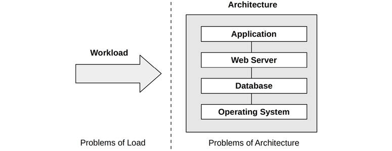

Figure 2.5 Load versus architecture

If analysis of the architecture shows queueing of work but no problems with how the work is performed, the issue may be too much load applied. In a cloud computing environment, this is the point where more server instances can be introduced on demand to handle the work.

For example, an issue of architecture may be a single-threaded application that is busy on-CPU, with requests queueing while other CPUs are available and idle. In this case, performance is limited by the application’s single-threaded architecture. Another issue of architecture may be a multi-threaded program that contends for a single lock, such that only one thread can make forward progress while others wait.

An issue of load may be a multithreaded application that is busy on all available CPUs, with requests still queueing. In this case, performance is limited by the available CPU capacity, or put differently, by there being more load than the CPUs can handle.

#### 2.3.9 Scalability

The performance of the system under increasing load is its *scalability*. [Figure 2.6](ch02.md) shows a typical throughput profile as a system’s load increases.

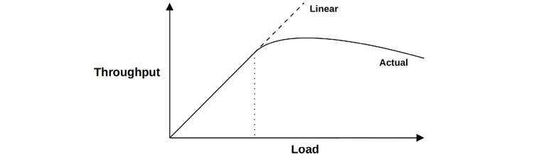

Figure 2.6 Throughput versus load

For some period, linear scalability is observed. A point is then reached, marked with a dotted line, where contention for a resource begins to degrade throughput. This point can be described as a *knee point*, as it is the boundary between two functions. Beyond this point, the throughput profile departs from linear scalability, as contention for the resource increases. Eventually the overheads for increased contention and coherency cause less work to be completed and throughput to decrease.

This point may occur when a component reaches 100% utilization: the *saturation point*. It may also occur when a component approaches 100% utilization and queueing begins to be frequent and significant.

An example system that may exhibit this profile is an application that performs heavy computation, with more load added as additional threads. As the CPUs approach 100% utilization, response time begins to degrade as CPU scheduler latency increases. After peak performance, at 100% utilization, throughput begins to decrease as more threads are added, causing more context switches, which consume CPU resources and cause less actual work to be completed.

The same curve can be seen if you replace “load” on the x-axis with a resource such as CPU cores. For more on this topic, see [Section 2.6](ch02.md), [Modeling](ch02.md).

The degradation of performance for nonlinear scalability, in terms of average response time or latency, is graphed in [Figure 2.7](ch02.md) [\[Cockcroft 95\]](ch02.md).

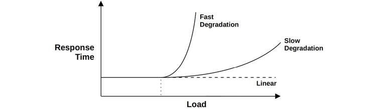

Figure 2.7 Performance degradation

Higher response time is, of course, bad. The “fast” degradation profile may occur for memory load, when the system begins moving memory pages to disk to free main memory. The “slow” degradation profile may occur for CPU load.

Another “fast” profile example is disk I/O. As load (and the resulting disk utilization) increases, I/O becomes more likely to queue behind other I/O. An idle rotational (not solid state) disk may serve I/O with a response time of about 1 ms, but when load increases, this can approach 10 ms. This is modeled in [Section 2.6.5](ch02.md), [Queueing Theory](ch02.md), under M/D/1 and 60% Utilization, and disk performance is covered in [Chapter 9](ch09.md), [Disks](ch09.md).

Linear scalability of response time could occur if the application begins to return errors when resources are unavailable, instead of queueing work. For example, a web server may return 503 “Service Unavailable” instead of adding requests to a queue, so that those requests that are served can be performed with a consistent response time.

#### 2.3.10 Metrics

Performance metrics are selected statistics generated by the system, applications, or additional tools that measure activity of interest. They are studied for performance analysis and monitoring, either numerically at the command line or graphically using visualizations.

Common types of system performance metrics include:

- **Throughput**: Either operations or data volume per second
- **IOPS**: I/O operations per second
- **Utilization**: How busy a resource is, as a percentage
- **Latency**: Operation time, as an average or percentile

The usage of throughput depends on its context. Database throughput is usually a measure of queries or requests (operations) per second. Network throughput is a measure of bits or bytes (volume) per second.

IOPS is a throughput measurement for I/O operations only (reads and writes). Again, context matters, and definitions can vary.

##### Overhead

Performance metrics are not free; at some point, CPU cycles must be spent to gather and store them. This causes overhead, which can negatively affect the performance of the target of measurement. This is called the *observer effect*. (It is often confused with Heisenberg’s Uncertainty Principle, which describes the limit of precision at which pairs of physical properties, such as position and momentum, may be known.)

##### Issues

You might assume that a software vendor has provided metrics that are well chosen, are bug-free, and provide complete visibility. In reality, metrics can be confusing, complicated, unreliable, inaccurate, and even plain wrong (due to bugs). Sometimes a metric was correct in one software version but did not get updated to reflect the addition of new code and code paths.

For more about problems with metrics, see [Chapter 4](ch04.md), [Observability Tools](ch04.md), [Section 4.6](ch04.md), [Observing Observability](ch04.md).

#### 2.3.11 Utilization

The term *utilization*[3](ch02.md) is often used for operating systems to describe device usage, such as for the CPU and disk devices. Utilization can be time-based or capacity-based.

[3](ch02.md)Spelled *utilisation* in some parts of the world.

##### Time-Based

Time-based utilization is formally defined in queueing theory. For example [\[Gunther 97\]](ch02.md):

the average amount of time the server or resource was busy

along with the ratio

*U* = *B*/*T*

where *U* = utilization, *B* = total time the system was busy during *T*, the observation period.

This is also the “utilization” most readily available from operating system performance tools. The disk monitoring tool iostat(1) calls this metric `%b` for *percent busy*, a term that better conveys the underlying metric: *B*/*T*.

This utilization metric tells us how busy a component is: when a component approaches 100% utilization, performance can seriously degrade when there is contention for the resource. Other metrics can be checked to confirm and to see if the component has therefore become a system bottleneck.

Some components can service multiple operations in parallel. For them, performance may not degrade much at 100% utilization as they can accept more work. To understand this, consider a building elevator. It may be considered utilized when it is moving between floors, and not utilized when it is idle waiting. However, the elevator may be able to accept more passengers even when it is busy 100% of the time responding to calls—that is, it is at 100% utilization.

A disk that is 100% busy may also be able to accept and process more work, for example, by buffering writes in the on-disk cache to be completed later. Storage arrays frequently run at 100% utilization because *some* disk is busy 100% of the time, but the array has plenty of idle disks and can accept more work.

##### Capacity-Based

The other definition of utilization is used by IT professionals in the context of capacity planning [\[Wong 97\]](ch02.md):

A system or component (such as a disk drive) is able to deliver a certain amount of throughput. At any level of performance, the system or component is working at some proportion of its capacity. That proportion is called the utilization.

This defines utilization in terms of capacity instead of time. It implies that a disk at 100% utilization *cannot* accept any more work. With the time-based definition, 100% utilization only means it is busy 100% of the time.

100% busy does not mean 100% capacity.

For the elevator example, 100% capacity may mean the elevator is at its maximum payload capacity and cannot accept more passengers.

In an ideal world, we would be able to measure both types of utilization for a device, so that, for example, you would know when a disk is 100% busy and performance begins to degrade due to contention, and also when it is at 100% capacity and cannot accept more work. Unfortunately, this usually isn’t possible. For a disk, it would require knowledge of what the disk’s on-board controller was doing and a prediction of capacity. Disks do not currently provide this information.

In this book, *utilization* usually refers to the time-based version, which you could also call *non-idle time*. The capacity version is used for some volume-based metrics, such as memory usage.

#### 2.3.12 Saturation

The degree to which more work is requested of a resource than it can process is *saturation*. Saturation begins to occur at 100% utilization (capacity-based), as extra work cannot be processed and begins to queue. This is pictured in [Figure 2.8](ch02.md).

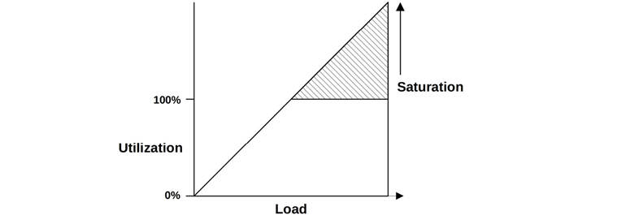

Figure 2.8 Utilization versus saturation

The figure pictures saturation increasing linearly beyond the 100% capacity-based utilization mark as load continues to increase. Any degree of saturation is a performance issue, as time is spent waiting (latency). For time-based utilization (percent busy), queueing and therefore saturation may not begin at the 100% utilization mark, depending on the degree to which the resource can operate on work in parallel.

#### 2.3.13 Profiling

Profiling builds a picture of a target that can be studied and understood. In the field of computing performance, profiling is typically performed by [*sampling*](gloss.md) the state of the system at timed intervals and then studying the set of samples.

Unlike the previous metrics covered, including IOPS and throughput, the use of sampling provides a *coarse* view of the target’s activity. How coarse depends on the rate of sampling.

As an example of profiling, CPU usage can be understood in reasonable detail by sampling the CPU instruction pointer or stack trace at frequent intervals to gather statistics on the code paths that are consuming CPU resources. This topic is covered in [Chapter 6](ch06.md), [CPUs](ch06.md).

#### 2.3.14 Caching

Caching is frequently used to improve performance. A cache stores results from a slower storage tier in a faster storage tier, for reference. An example is caching disk blocks in main memory (RAM).

Multiple tiers of caches may be used. CPUs commonly employ multiple hardware caches for main memory (Levels 1, 2, and 3), beginning with a very fast but small cache (Level 1) and increasing in both storage size and access latency. This is an economic trade-off between density and latency; levels and sizes are chosen for the best performance for the on-chip space available. These caches are covered in [Chapter 6](ch06.md), [CPUs](ch06.md).

There are many other caches present in a system, many of them implemented in software using main memory for storage. See [Chapter 3](ch03.md), [Operating Systems](ch03.md), [Section 3.2.11](ch03.md), [Caching](ch03.md), for a list of caching layers.

One metric for understanding cache performance is each cache’s *hit ratio—*the number of times the needed data was found in the cache (hits) versus the total accesses (hits + misses):

hit ratio = hits / (hits + misses)

The higher, the better, as a higher ratio reflects more data successfully accessed from faster media. [Figure 2.9](ch02.md) shows the expected performance improvement for increasing cache hit ratios.

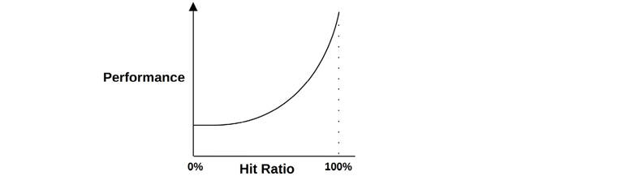

Figure 2.9 Cache hit ratio and performance

The performance difference between 98% and 99% is much greater than that between 10% and 11%. This is a nonlinear profile because of the difference in speed between cache hits and misses—the two storage tiers at play. The greater the difference, the steeper the slope becomes.

Another metric for understanding cache performance is the *cache miss rate*, in terms of misses per second. This is proportional (linear) to the performance penalty of each miss and can be easier to interpret.

For example, workloads A and B perform the same task using different algorithms and use a main memory cache to avoid reading from disk. Workload A has a cache hit ratio of 90%, and workload B has a cache hit ratio of 80%. This information alone suggests workload A performs better. What if workload A had a miss rate of 200/s and workload B, 20/s? In those terms, workload B performs 10x *fewer* disk reads, which may complete the task much sooner than A. To be certain, the total runtime for each workload can be calculated as

runtime = (hit rate × hit latency) + (miss rate × miss latency)

This calculation uses the average hit and miss latencies and assumes the work is serialized.

##### Algorithms

Cache management algorithms and policies determine what to store in the limited space available for a cache.

*Most recently used* (MRU) refers to a cache *retention policy*, which decides what to favor keeping in the cache: the objects that have been used most recently. *Least recently used* (LRU) can refer to an equivalent cache *eviction policy*, deciding what objects to remove from the cache when more space is needed. There are also *most frequently used* (MFU) and *least frequently used* (LFU) policies.

You may encounter *not frequently used* (NFU), which may be an inexpensive but less thorough version of LRU.

##### Hot, Cold, and Warm Caches

These words are commonly used to describe the state of the cache:

- **Cold**: A *cold cache* is empty, or populated with unwanted data. The hit ratio for a cold cache is zero (or near zero as it begins to warm up).
- **Warm**: A *warm cache* is one that is populated with useful data but doesn’t have a high enough hit ratio to be considered hot.
- **Hot**: A *hot cache* is populated with commonly requested data and has a high hit ratio, for example, over 99%.
- **Warmth**: Cache warmth describes how hot or cold a cache is. An activity that improves cache warmth is one that aims to improve the cache hit ratio.

When caches are first initialized, they begin cold and then warm up over time. When the cache is large or the next-level storage is slow (or both), the cache can take a long time to become populated and warm.

For example, I worked on a storage appliance that had 128 Gbytes of DRAM as a file system cache, 600 Gbytes of flash memory as a second-level cache, and rotational disks for storage. With a random read workload, the disks delivered around 2,000 reads/s. With an 8 Kbyte I/O size, this meant that the caches could warm up at a rate of only 16 Mbytes/s (2,000 × 8 Kbytes). When both caches began cold, it took more than 2 hours for the DRAM cache to warm up, and more than 10 hours for the flash memory cache to warm up.

#### 2.3.15 Known-Unknowns

Introduced in the Preface, the notion of *known-knowns*, *known-unknowns*, and *unknown-unknowns* is important for the field of performance. The breakdown is as follows, with examples for systems performance analysis:

- **Known-knowns**: These are things you know. You know you should be checking a performance metric, and you know its current value. For example, you know you should be checking CPU utilization, and you also know that the value is 10% on average.
- **Known-unknowns**: These are things you know that you do not know. You know you can check a metric or the existence of a subsystem, but you haven’t yet observed it. For example, you know you could use profiling to check what is making the CPUs busy, but have yet to do so.
- **Unknown-unknowns**: These are things you do not know that you do not know. For example, you may not know that device interrupts can become heavy CPU consumers, so you are not checking them.

Performance is a field where “the more you know, the more you don’t know.” The more you learn about systems, the more unknown-unknowns you become aware of, which are then known-unknowns that you can check on.

### 2.4 Perspectives

There are two common perspectives for performance analysis, each with different audiences, metrics, and approaches. They are *workload analysis* and *resource analysis*. They can be thought of as either top-down or bottom-up analysis of the operating system software stack, as shown in [Figure 2.10](ch02.md).

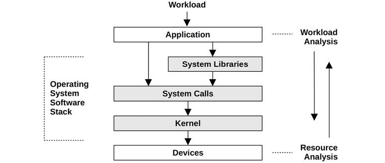

Figure 2.10 Analysis perspectives

[Section 2.5](ch02.md), [Methodology](ch02.md), provides specific strategies to apply for each. These perspectives are introduced here in more detail.

#### 2.4.1 Resource Analysis

Resource analysis begins with analysis of the system resources: CPUs, memory, disks, network interfaces, buses, and interconnects. It is most likely performed by system administrators—those responsible for the physical resources. Activities include

- **Performance issue investigations**: To see if a particular type of resource is responsible
- **Capacity planning**: For information to help size new systems, and to see when existing system resources may become exhausted

This perspective focuses on utilization, to identify when resources are at or approaching their limit. Some resource types, such as CPUs, have utilization metrics readily available. Utilization for other resources can be estimated based on available metrics, for example, estimating network interface utilization by comparing the send and receive megabits per second (throughput) with the known or expected maximum bandwidth.

Metrics best suited for resource analysis include:

- IOPS
- Throughput
- Utilization
- Saturation

These measure what the resource is being asked to do, and how utilized or saturated it is for a given load. Other types of metrics, including latency, are also useful to see how well the resource is responding for the given workload.

Resource analysis is a common approach to performance analysis, in part thanks to the widely available documentation on the topic. Such documentation focuses on the operating system “stat” tools: vmstat(8), iostat(1), mpstat(1). It’s important when you read such documentation to understand that this is one perspective, but not the only perspective.

#### 2.4.2 Workload Analysis

Workload analysis (see [Figure 2.11](ch02.md)) examines the performance of applications: the workload applied and how the application is responding. It is most commonly used by application developers and support staff—those responsible for the application software and configuration.

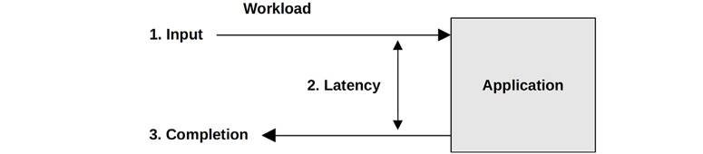

Figure 2.11 Workload analysis

The targets for workload analysis are:

- **Requests**: The workload applied
- **Latency**: The response time of the application
- **Completion**: Looking for errors

Studying workload requests typically involves checking and summarizing their attributes: this is the process of *workload characterization* (described in more detail in [Section 2.5](ch02.md), [Methodology](ch02.md)). For databases, these attributes may include the client host, database name, tables, and query string. This data may help identify unnecessary work, or unbalanced work. Even when a system is performing its current workload well (low latency), examining these attributes may identify ways to reduce or eliminate the work applied. Keep in mind that the fastest query is the one you don’t do at all.

Latency (response time) is the most important metric for expressing application performance. For a MySQL database, it’s query latency; for Apache, it’s HTTP request latency; and so on. In these contexts, the term *latency* is used to mean the same as response time (refer to [Section 2.3.1](ch02.md), [Latency](ch02.md), for more about context).

The tasks of workload analysis include identifying and confirming issues—for example, by looking for latency beyond an acceptable threshold—then finding the source of the latency and confirming that the latency is improved after applying a fix. Note that the starting point is the application. Investigating latency usually involves drilling down deeper into the application, libraries, and the operating system (kernel).

System issues may be identified by studying characteristics related to the completion of an event, including its error status. While a request may complete quickly, it may do so with an error status that causes the request to be retried, accumulating latency.

Metrics best suited for workload analysis include:

- Throughput (transactions per second)
- Latency

These measure the rate of requests and the resulting performance.

### 2.5 Methodology

When faced with an underperforming and complicated system environment, the first challenge can be knowing where to begin your analysis and how to proceed. As I said in [Chapter 1](ch01.md), performance issues can arise from anywhere, including software, hardware, and any component along the data path. Methodologies can help you approach these complex systems by showing where to start your analysis and suggesting an effective procedure to follow.

This section describes many performance methodologies and procedures for system performance and tuning, some of which I developed. These methodologies help beginners get started and serve as reminders for experts. Some *anti-methodologies* have also been included.

To help summarize their role, these methodologies have been categorized as different types, such as observational analysis and experimental analysis, as shown in [Table 2.4](ch02.md).

Table 2.4 **Generic system performance methodologies**

**Section**

**Methodology**

**Type**

[2.5.1](ch02.md)

Streetlight anti-method

Observational analysis

[2.5.2](ch02.md)

Random change anti-method

Experimental analysis

[2.5.3](ch02.md)

Blame-someone-else anti-method

Hypothetical analysis

[2.5.4](ch02.md)

Ad hoc checklist method

Observational and experimental analysis

[2.5.5](ch02.md)

Problem statement

Information gathering

[2.5.6](ch02.md)

Scientific method

Observational analysis

[2.5.7](ch02.md)

Diagnosis cycle

Analysis life cycle

[2.5.8](ch02.md)

Tools method

Observational analysis

[2.5.9](ch02.md)

USE method

Observational analysis

[2.5.10](ch02.md)

RED method

Observational analysis

[2.5.11](ch02.md)

Workload characterization

Observational analysis, capacity planning

[2.5.12](ch02.md)

Drill-down analysis

Observational analysis

[2.5.13](ch02.md)

Latency analysis

Observational analysis

[2.5.14](ch02.md)

Method R

Observational analysis

[2.5.15](ch02.md)

Event tracing

Observational analysis

[2.5.16](ch02.md)

Baseline statistics

Observational analysis

[2.5.17](ch02.md)

Static performance tuning

Observational analysis, capacity planning

[2.5.18](ch02.md)

Cache tuning

Observational analysis, tuning

[2.5.19](ch02.md)

Micro-benchmarking

Experimental analysis

[2.5.20](ch02.md)

Performance mantras

Tuning

[2.6.5](ch02.md)

Queueing theory

Statistical analysis, capacity planning

2.7

Capacity planning

Capacity planning, tuning

[2.8.1](ch02.md)

Quantifying performance gains

Statistical analysis

2.9

Performance monitoring

Observational analysis, capacity planning

Performance monitoring, queueing theory, and capacity planning are covered later in this chapter. Other chapters also recast some of these methodologies in different contexts and provide some additional methodologies for specific targets of performance analysis. [Table 2.5](ch02.md) lists these additional methodologies.

Table 2.5 **Additional performance methodologies**

**Section**

**Methodology**

**Type**

[1.10.1](ch01.md)

Linux performance analysis in 60s

Observational analysis

[5.4.1](ch05.md)

CPU profiling

Observational analysis

[5.4.2](ch05.md)

Off-CPU analysis

Observational analysis

[6.5.5](ch06.md)

Cycle analysis

Observational analysis

[6.5.8](ch06.md)

Priority tuning

Tuning

[6.5.8](ch06.md)

Resource controls

Tuning

[6.5.9](ch06.md)

CPU binding

Tuning

[7.4.6](ch07.md)

Leak detection

Observational analysis

[7.4.10](ch07.md)

Memory shrinking

Experimental analysis

[8.5.1](ch08.md)

Disk analysis

Observational analysis

[8.5.7](ch08.md)

Workload separation

Tuning

[9.5.10](ch09.md)

Scaling

Capacity planning, tuning

[10.5.6](ch10.md)

Packet sniffing

Observational analysis

[10.5.7](ch10.md)

TCP analysis

Observational analysis

[12.3.1](ch12.md)

Passive benchmarking

Experimental analysis

[12.3.2](ch12.md)

Active benchmarking

Observational analysis

[12.3.6](ch12.md)

Custom benchmarks

Software development

[12.3.7](ch12.md)

Ramping load

Experimental analysis

[12.3.8](ch12.md)

Sanity check

Observational analysis

The following sections begin with commonly used but weaker methodologies for comparison, including the anti-methodologies. For the analysis of performance issues, the first methodology you should attempt is the problem statement method, before moving on to others.

#### 2.5.1 Streetlight Anti-Method

This method is actually the *absence* of a deliberate methodology. The user analyzes performance by choosing observability tools that are familiar, found on the Internet, or just at random to see if anything obvious shows up. This approach is hit or miss and can overlook many types of issues.

Tuning performance may be attempted in a similar trial-and-error fashion, setting whatever tunable parameters are known and familiar to different values to see if that helps.

Even when this method reveals an issue, it can be slow as tools or tunings unrelated to the issue are found and tried, just because they’re familiar. This methodology is therefore named after an observational bias called the *streetlight effect*, illustrated by this parable:

One night a police officer sees a drunk searching the ground beneath a streetlight and asks what he is looking for. The drunk says he has lost his keys. The police officer can’t find them either and asks: “Are you sure you lost them here, under the streetlight?” The drunk replies: “No, but this is where the light is best.”

The performance equivalent would be looking at top(1), not because it makes sense, but because the user doesn’t know how to read other tools.

An issue that this methodology does find may be *an* issue but not *the* issue. Other methodologies quantify findings, so that false positives can be ruled out more quickly, and bigger issues prioritized.

#### 2.5.2 Random Change Anti-Method

This is an experimental anti-methodology. The user randomly guesses where the problem may be and then changes things until it goes away. To determine whether performance has improved or not as a result of each change, a metric is studied, such as application runtime, operation time, latency, operation rate (operations per second), or throughput (bytes per second). The approach is as follows:

1. Pick a random item to change (e.g., a tunable parameter).
2. Change it in one direction.
3. Measure performance.
4. Change it in the other direction.
5. Measure performance.
6. Were the results in step 3 or step 5 better than the baseline? If so, keep the change and go back to step 1.

While this process may eventually unearth tuning that works for the tested workload, it is very time-consuming and can also result in tuning that doesn’t make sense in the long term. For example, an application change may improve performance because it works around a database or operating system bug that is later fixed. But the application will still have that tuning that no longer makes sense, and that no one understood properly in the first place.

Another risk is where a change that isn’t properly understood causes a worse problem during peak production load, and a need to back out the change.

#### 2.5.3 Blame-Someone-Else Anti-Method

This anti-methodology follows these steps:

1. Find a system or environment component for which you are not responsible.
2. Hypothesize that the issue is with that component.
3. Redirect the issue to the team responsible for that component.
4. When proven wrong, go back to step 1.

“Maybe it’s the network. Can you check with the network team if they’ve had dropped packets or something?”

Instead of investigating performance issues, the user of this methodology makes them someone else’s problem, which can be wasteful of other teams’ resources when it turns out not to be their problem after all. This anti-methodology can be identified by a lack of data leading to the hypothesis.

To avoid becoming a victim of blame-someone-else, ask the accuser for screenshots showing which tools were run and how the output was interpreted. You can take these screenshots and interpretations to someone else for a second opinion.

#### 2.5.4 Ad Hoc Checklist Method

Stepping through a canned checklist is a common methodology used by support professionals when asked to check and tune a system, often in a short time frame. A typical scenario involves the deployment of a new server or application in production, and a support professional spending half a day checking for common issues now that the system is under real load. These checklists are ad hoc and are built from recent experience and issues for that system type.

Here is an example checklist entry:

Run `iostat –x 1` and check the `r_await` column. If this is consistently over 10 (ms) during load, then either disk reads are slow or the disk is overloaded.

A checklist may be composed of a dozen or so such checks.

While these checklists can provide the most value in the shortest time frame, they are point-in-time recommendations (see [Section 2.3](ch02.md), [Concepts](ch02.md)) and need to be frequently refreshed to stay current. They also tend to focus on issues for which there are known fixes that can be easily documented, such as the setting of tunable parameters, but not custom fixes to the source code or environment.

If you are managing a team of support professionals, an ad hoc checklist can be an effective way to ensure that everyone knows how to check for common issues. A checklist can be written to be clear and prescriptive, showing how to identify each issue and what the fix is. But bear in mind that this list must be constantly updated.

#### 2.5.5 Problem Statement

Defining the problem statement is a routine task for support staff when first responding to issues. It’s done by asking the customer the following questions:

1. What makes you think there is a performance problem?
2. Has this system ever performed well?
3. What changed recently? Software? Hardware? Load?
4. Can the problem be expressed in terms of latency or runtime?
5. Does the problem affect other people or applications (or is it just you)?
6. What is the environment? What software and hardware are used? Versions? Configuration?

Just asking and answering these questions often points to an immediate cause and solution. The problem statement has therefore been included here as its own methodology and should be the first approach you use when tackling a new issue.

I have solved performance issues over the phone by using the problem statement method alone, and without needing to log in to any server or look at any metrics.

#### 2.5.6 Scientific Method

The scientific method studies the unknown by making hypotheses and then testing them. It can be summarized by the following steps:

1. Question
2. Hypothesis
3. Prediction
4. Test
5. Analysis

The question is the performance problem statement. From this you can hypothesize what the cause of poor performance may be. Then you construct a test, which may be observational or experimental, that tests a prediction based on the hypothesis. You finish with analysis of the test data collected.

For example, you may find that application performance is degraded after migrating to a system with less main memory, and you hypothesize that the cause of poor performance is a smaller file system cache. You might use an *observational test* to measure the cache miss rate on both systems, predicting that cache misses will be higher on the smaller system. An *experimental test* would be to increase the cache size (adding RAM), predicting that performance will improve. Another, perhaps easier, experimental test is to artificially reduce the cache size (using tunable parameters), predicting that performance will be worse.

The following are some more examples.

##### Example (Observational)

1. Question: What is causing slow database queries?
2. Hypothesis: Noisy neighbors (other cloud computing tenants) are performing disk I/O, contending with database disk I/O (via the file system).
3. Prediction: If file system I/O latency is measured during a query, it will show that the file system is responsible for the slow queries.
4. Test: Tracing of database file system latency as a ratio of query latency shows that less than 5% of the time is spent waiting for the file system.
5. Analysis: The file system and disks are not responsible for slow queries.

Although the issue is still unsolved, some large components of the environment have been ruled out. The person conducting this investigation can return to step 2 and develop a new hypothesis.

##### Example (Experimental)

1. Question: Why do HTTP requests take longer from host A to host C than from host B to host C?
2. Hypothesis: Host A and host B are in different data centers.
3. Prediction: Moving host A to the same data center as host B will fix the problem.
4. Test: Move host A and measure performance.
5. Analysis: Performance has been fixed—consistent with the hypothesis.

If the problem wasn’t fixed, reverse the experimental change (move host A back, in this case) before beginning a new hypothesis—changing multiple factors at once makes it harder to identify which one mattered!

##### Example (Experimental)

1. Question: Why did file system performance degrade as the file system cache grew in size?
2. Hypothesis: A larger cache stores more records, and more compute is required to manage a larger cache than a smaller one.
3. Prediction: Making the record size progressively smaller, and therefore causing more records to be used to store the same amount of data, will make performance progressively *worse*.
4. Test: Test the same workload with progressively smaller record sizes.
5. Analysis: Results are graphed and are consistent with the prediction. Drill-down analysis is now performed on the cache management routines.

This is an example of a *negative test*—deliberately hurting performance to learn more about the target system.

#### 2.5.7 Diagnosis Cycle

Similar to the scientific method is the *diagnosis cycle*:

hypothesis → instrumentation → data → hypothesis

Like the scientific method, this method also deliberately tests a hypothesis through the collection of data. The cycle emphasizes that the data can lead quickly to a new hypothesis, which is tested and refined, and so on. This is similar to a doctor making a series of small tests to diagnose a patient and refining the hypothesis based on the result of each test.

Both of these approaches have a good balance of theory and data. Try to move from hypothesis to data quickly, so that bad theories can be identified early and discarded, and better ones developed.

#### 2.5.8 Tools Method

A tools-oriented approach is as follows:

1. List available performance tools (optionally, install or purchase more).
2. For each tool, list useful metrics it provides.
3. For each metric, list possible ways to interpret it.

The result of this is a prescriptive checklist showing which tool to run, which metrics to read, and how to interpret them. While this can be fairly effective, it relies exclusively on available (or known) tools, which can provide an incomplete view of the system, similar to the streetlight anti-method. Worse, the user is unaware that they have an incomplete view—and may remain unaware. Issues that require custom tooling (e.g., dynamic tracing) may never be identified and solved.

In practice, the tools method does identify certain resource bottlenecks, errors, and other types of problems, though it may not do this efficiently.

When a large number of tools and metrics are available, it can be time-consuming to iterate through them. The situation gets worse when multiple tools appear to have the same functionality and you spend additional time trying to understand the pros and cons of each. In some cases, such as file system micro-benchmark tools, there are over a dozen tools to choose from, when you may need only one.[4](ch02.md)

[4](ch02.md)As an aside, an argument I’ve encountered to support multiple overlapping tools is that “competition is good.” I would be cautious about this: while it can be helpful to have overlapping tools for cross-checking results (and I frequently cross-check BPF tools using Ftrace), multiple overlapping tools can become a waste of developer time that could be more effectively used elsewhere, as well as a waste of time for end users who must evaluate each choice.

#### 2.5.9 The USE Method

The utilization, saturation, and errors (USE) method should be used early in a performance investigation to identify systemic bottlenecks [\[Gregg 13b\]](ch02.md). It is a methodology that focuses on system resources and can be summarized as:

For every resource, check utilization, saturation, and errors.

These terms are defined as follows:

- **Resources**: All physical server functional components (CPUs, buses, . . .). Some software resources can also be examined, provided that the metrics make sense.
- **Utilization**: For a set time interval, the percentage of time that the resource was busy servicing work. While busy, the resource may still be able to accept more work; the degree to which it cannot do so is identified by saturation.
- **Saturation**: The degree to which the resource has extra work that it can’t service, often waiting on a queue. Another term for this is *pressure*.
- **Errors**: The count of error events.

For some resource types, including main memory, utilization is the *capacity* of the resource that is used. This is different from the time-based definition and was explained earlier in [Section 2.3.11](ch02.md), [Utilization](ch02.md). Once a capacity resource reaches 100% utilization, more work cannot be accepted, and the resource either queues the work (saturation) or returns errors, which are also identified using the USE method.

Errors should be investigated because they can degrade performance but may not be immediately noticed when the failure mode is recoverable. This includes operations that fail and are retried, and devices that fail in a pool of redundant devices.

In contrast with the tools method, the USE method involves iterating over system resources instead of tools. This helps you create a complete list of questions to ask, and only then do you search for tools to answer them. Even when tools cannot be found to answer some questions, the knowledge that these questions are unanswered can be extremely useful for the performance analyst: they are now “known-unknowns.”

The USE method also directs analysis to a limited number of key metrics, so that all system resources are checked as quickly as possible. After this, if no issues have been found, other methodologies can be used.

##### Procedure

The USE method is pictured as the flowchart in [Figure 2.12](ch02.md). Errors are checked first because they are usually quick to interpret (they are usually an objective and not subjective metric), and it can be time-efficient to rule them out before investigating the other metrics. Saturation is checked second because it is quicker to interpret than utilization: any level of saturation can be an issue.

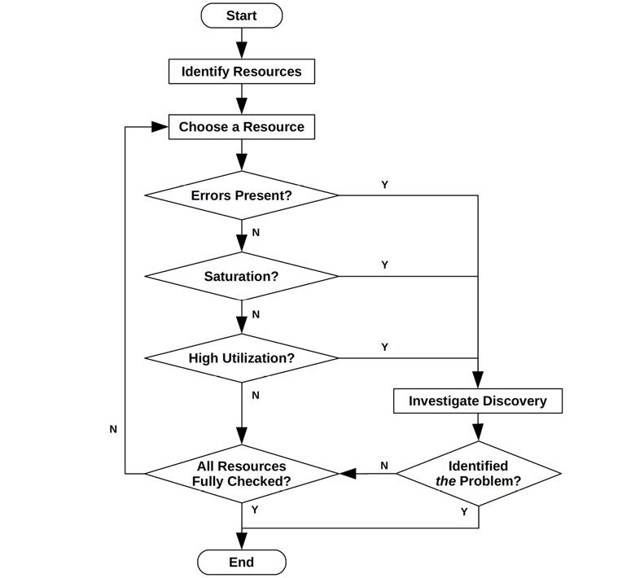

Figure 2.12 The USE method flow

This method identifies problems that are likely to be system bottlenecks. Unfortunately, a system may be suffering from more than one performance problem, so the first thing you find may be *a* problem but not *the* problem. Each discovery can be investigated using further methodologies, before returning to the USE method as needed to iterate over more resources.

##### Expressing Metrics

The USE method metrics are usually expressed as follows:

- **Utilization**: As a percent over a time interval (e.g., “One CPU is running at 90% utilization”)
- **Saturation**: As a wait-queue length (e.g., “The CPUs have an average run-queue length of four”)
- **Errors**: Number of errors reported (e.g., “This disk drive has had 50 errors”)

Though it may seem counterintuitive, a short burst of high utilization can cause saturation and performance issues, even though the overall utilization is *low* over a long interval. Some monitoring tools report utilization over 5-minute averages. CPU utilization, for example, can vary dramatically from second to second, so a 5-minute average may disguise short periods of 100% utilization and, therefore, saturation.

Consider a toll plaza on a highway. Utilization can be defined as how many tollbooths were busy servicing a car. Utilization at 100% means you can’t find an empty booth and must queue behind someone (saturation). If I told you the booths were at 40% utilization across the entire day, could you tell me whether any cars had queued at any time during that day? They probably did during rush hour, when utilization was at 100%, but that isn’t visible in the daily average.

##### Resource List

The first step in the USE method is to create a list of resources. Try to be as complete as possible. Here is a generic list of server hardware resources, along with specific examples:

- **CPUs**: Sockets, cores, hardware threads (virtual CPUs)
- [**Main memory**](gloss.md): DRAM
- **Network interfaces**: Ethernet ports, Infiniband
- **Storage devices**: Disks, storage adapters
- **Accelerators**: GPUs, TPUs, FPGAs, etc., if in use
- **Controllers**: Storage, network
- **Interconnects**: CPU, memory, I/O

Each component typically acts as a single resource type. For example, main memory is a *capacity* resource, and network interfaces are an [*I/O*](gloss.md) resource (which can mean either IOPS or throughput). Some components can behave as multiple resource types: for example, a storage device is both an I/O resource and a capacity resource. Consider all types that can lead to performance bottlenecks. Also note that I/O resources can be further studied as *queueing systems*, which queue and then service these requests.

Some physical components, such as hardware caches (e.g., CPU caches), can be left out of your checklist. The USE method is most effective for resources that suffer performance degradation under high utilization or saturation, leading to bottlenecks, while caches *improve* performance under high utilization. These can be checked using other methodologies. If you are unsure whether to include a resource, include it, and then see how well the metrics work in practice.

##### Functional Block Diagram

Another way to iterate over resources is to find or draw a functional block diagram for the system, such as the one shown in [Figure 2.13](ch02.md). Such a diagram also shows relationships, which can be very useful when looking for bottlenecks in the flow of data.

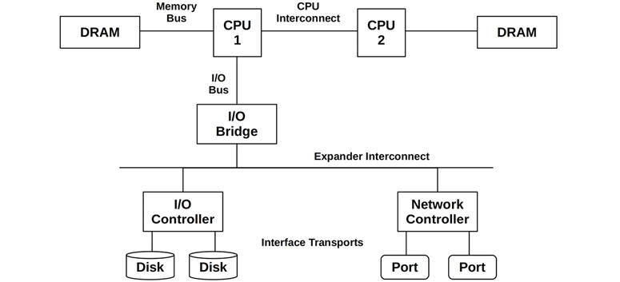

Figure 2.13 Example two-processor functional block diagram

CPU, memory, and I/O interconnects and buses are often overlooked. Fortunately, they are not common system bottlenecks, as they are typically designed to provide an excess of throughput. Unfortunately, if they are, the problem can be difficult to solve. Maybe you can upgrade the main board, or reduce load; for example, “zero copy” software techniques lighten memory bus load.

To investigate interconnects, see CPU Performance Counters in [Chapter 6](ch06.md), [CPUs](ch06.md), [Section 6.4.1](ch06.md), [Hardware](ch06.md).

##### Metrics

Once you have your list of resources, consider the metric types appropriate to each: utilization, saturation, and errors. [Table 2.6](ch02.md) shows some example resources and metric types, along with possible metrics (generic OS).

Table 2.6 **Example USE method metrics**

**Resource**

**Type**

**Metric**

CPU

Utilization

CPU utilization (either per CPU or a system-wide average)

CPU

Saturation

Run queue length, scheduler latency, CPU pressure (Linux PSI)

Memory

Utilization

Available free memory (system-wide)

Memory

Saturation

Swapping (anonymous paging), page scanning, out-of-memory events, memory pressure (Linux PSI)

Network interface

Utilization

Receive throughput/max bandwidth, transmit throughput/max bandwidth

Storage device I/O

Utilization

Device busy percent

Storage device I/O

Saturation

Wait queue length, I/O pressure (Linux PSI)

Storage device I/O

Errors

Device errors (“soft,” “hard”)

These metrics can be either averages per interval or counts.

Repeat for all combinations, and include instructions for fetching each metric. Take note of metrics that are not currently available; these are the known-unknowns. You’ll end up with a list of about 30 metrics, some of which are difficult to measure, and some of which can’t be measured at all. Fortunately, the most common issues are usually found with the easier metrics (e.g., CPU saturation, memory capacity saturation, network interface utilization, disk utilization), so these can be checked first.

Some examples of harder combinations are provided in [Table 2.7](ch02.md).

Table 2.7 **Example USE method advanced metrics**

**Resource**

**Type**

**Metric**

CPU

Errors

For example, machine check exceptions, CPU cache errors[5](ch02.md)

Memory

Errors

For example, failed malloc()s (although a default Linux kernel configuration makes this rare due to overcommit)

Network

Saturation

Saturation-related network interface or OS errors, e.g., Linux “overruns”

Storage controller

Utilization

Depends on the controller; it may have a maximum IOPS or throughput that can be checked against current activity

CPU interconnect

Utilization

Per-port throughput/maximum bandwidth (CPU performance counters)

Memory interconnect

Saturation

Memory stall cycles, high cycles per instruction (CPU performance counters)

I/O interconnect

Utilization

Bus throughput/maximum bandwidth (performance counters may exist on your HW, e.g., Intel “uncore” events)

[5](ch02.md)For example, recoverable error-correcting code (ECC) errors for CPU cache lines (if supported). Some kernels will offline a CPU if an increase in these is detected.

Some of these may not be available from standard operating system tools and may require the use of dynamic tracing or CPU performance monitoring counters.

[Appendix A](appa.md) is an example USE method checklist for Linux systems, iterating over all combinations for hardware resources with the Linux observability toolset, and includes some software resources, such as those described in the next section.

##### Software Resources

Some software resources can be similarly examined. This usually applies to smaller components of software (not entire applications), for example:

- **Mutex locks**: Utilization may be defined as the time the lock was held, saturation by those threads queued waiting on the lock.
- **Thread pools**: Utilization may be defined as the time threads were busy processing work, saturation by the number of requests waiting to be serviced by the thread pool.
- **Process/thread capacity**: The system may have a limited number of processes or threads, whose current usage may be defined as utilization; waiting on allocation may be saturation; and errors are when the allocation failed (e.g., “cannot fork”).
- **File descriptor capacity**: Similar to process/thread capacity, but for file descriptors.

If the metrics work well in your case, use them; otherwise, alternative methodologies such as latency analysis can be applied.

##### Suggested Interpretations

Here are some general suggestions for interpreting the metric types:

- **Utilization**: Utilization at 100% is usually a sign of a bottleneck (check saturation and its effect to confirm). Utilization beyond 60% can be a problem for a couple of reasons: depending on the interval, it can hide short bursts of 100% utilization. Also, some resources such as hard disks (but not CPUs) usually cannot be interrupted during an operation, even for higher-priority work. As utilization increases, queueing delays become more frequent and noticeable. See [Section 2.6.5](ch02.md), [Queueing Theory](ch02.md), for more about 60% utilization.
- **Saturation**: Any degree of saturation (non-zero) can be a problem. It may be measured as the length of a wait queue, or as time spent waiting on the queue.
- **Errors**: Non-zero error counters are worth investigating, especially if they are increasing while performance is poor.

It’s easy to interpret the negative cases: low utilization, no saturation, no errors. This is more useful than it sounds—narrowing down the scope of an investigation can help you focus quickly on the problem area, having identified that it is likely *not* a resource problem. This is the process of elimination.

##### Resource Controls

In cloud computing and container environments, software resource controls may be in place to limit or throttle tenants who are sharing one system. These may limit memory, CPU, disk I/O, and network I/O. For example, Linux containers use cgroups to limit resource usage. Each of these resource limits can be examined with the USE method, similarly to examining the physical resources.

For example, “memory capacity utilization” can be the tenant’s memory usage versus its memory cap. “Memory capacity saturation” can be seen by limit-imposed allocation errors or swapping for that tenant, even if the host system is not experiencing memory pressure. These limits are discussed in [Chapter 11](ch11.md), [Cloud Computing](ch11.md).

##### Microservices

A microservice architecture presents a similar problem to that of too many resource metrics: there can be so many metrics for each service that it is laborious to check them all, and they can overlook areas where metrics do not yet exist. The USE method can address these problems with microservices as well. For example, for a typical Netflix microservice, the USE metrics are:

- **Utilization**: The average CPU utilization across the entire instance cluster.
- **Saturation**: An approximation is the difference between the 99th latency percentile and the average latency (assumes the 99th is saturation-driven).
- **Errors**: Request errors.

These three metrics are already examined for each microservice at Netflix using the Atlas cloud-wide monitoring tool \[Harrington 14].

There is a similar methodology that has been designed specifically for services: the RED method.

#### 2.5.10 The RED Method

The focus of this methodology is services, typically cloud services in a microservice architecture. It identifies three metrics for monitoring health from a user perspective and can be summarized as [\[Wilkie 18\]](ch02.md):

For every service, check the request rate, errors, and duration.

The metrics are:

- **Request rate**: The number of service requests per second
- **Errors**: The number of requests that failed
- **Duration**: The time for requests to complete (consider distribution statistics such as percentiles in addition to the average: see [Section 2.8](ch02.md), [Statistics](ch02.md))

Your task is to draw a diagram of your microservice architecture and ensure that these three metrics are monitored for each service. (Distributed tracing tools may provide such diagrams for you.) The advantages are similar to the USE method: the RED method is fast and easy to follow, and comprehensive.

The RED method was created by Tom Wilkie, who has also developed implementations of the USE and RED method metrics for Prometheus with dashboards using Grafana \[Wilkie 18]. These methodologies are complementary: the USE method for machine health, and the RED method for user health.

The inclusion of the request rate provides an important early clue in an investigation: whether a performance problem is one of load versus architecture (see [Section 2.3.8](ch02.md), [Load vs. Architecture](ch02.md)). If the request rate has been steady but the request duration has increased, it points to a problem with the architecture: the service itself. If both the request rate and duration have increased, then the problem may be one of the load applied. This can be further investigated using workload characterization.

#### 2.5.11 Workload Characterization

Workload characterization is a simple and effective method for identifying a class of issues: those due to the load applied. It focuses on the *input* to the system, rather than the resulting performance. Your system may have no architectural, implementation, or configuration issues present, but be experiencing more load than it can reasonably handle.

Workloads can be characterized by answering the following questions:

- **Who** is causing the load? Process ID, user ID, remote IP address?
- **Why** is the load being called? Code path, stack trace?
- **What** are the load characteristics? IOPS, throughput, direction (read/write), type? Include variance (standard deviation) where appropriate.
- **How** is the load changing over time? Is there a daily pattern?

It can be useful to check all of these, even when you have strong expectations about what the answers will be, because you may be surprised.

Consider this scenario: You have a performance issue with a database whose clients are a pool of web servers. Should you check the IP addresses of who is using the database? You already expect them to be the web servers, as per the configuration. You check anyway and discover that the entire Internet appears to be throwing load at the databases, destroying their performance. You are actually under a denial-of-service (DoS) attack!

The best performance wins are the result of *eliminating unnecessary work*. Sometimes unnecessary work is caused by applications malfunctioning, for example, a thread stuck in a loop creating unnecessary CPU work. It can also be caused by bad configurations—for example, system-wide backups that run during peak hours—or even a DoS attack as described previously. Characterizing the workload can identify these issues, and with maintenance or reconfiguration they may be eliminated.

If the identified workload cannot be eliminated, another approach may be to use system resource controls to throttle it. For example, a system backup task may be interfering with a production database by consuming CPU resources to compress the backup, and then network resources to transfer it. This CPU and network usage may be throttled using resource controls (if the system supports them) so that the backup runs more slowly without hurting the database.

Apart from identifying issues, workload characterization can also be input for the design of simulation benchmarks. If the workload measurement is an average, ideally you will also collect details of the distribution and variation. This can be important for simulating the variety of workloads expected, rather than testing only an average workload. See [Section 2.8](ch02.md), [Statistics](ch02.md), for more about averages and variation (standard deviation), and [Chapter 12](ch12.md), [Benchmarking](ch12.md).

Analysis of the workload also helps separate problems of load from problems of architecture, by identifying the former. Load versus architecture was introduced in [Section 2.3.8](ch02.md), [Load vs. Architecture](ch02.md).

The specific tools and metrics for performing workload characterization depend on the target. Some applications record detailed logs of client activity, which can be the source for statistical analysis. They may also already provide daily or monthly reports of client usage, which can be mined for details.

#### 2.5.12 Drill-Down Analysis

Drill-down analysis starts with examining an issue at a high level, then narrowing the focus based on the previous findings, discarding areas that seem uninteresting, and digging deeper into the interesting ones. The process can involve digging down through deeper layers of the software stack, to hardware if necessary, to find the root cause of the issue.

The following is a three-stage drill-down analysis methodology for system performance \[McDougall 06a]:

1. **Monitoring**: This is used for continually recording high-level statistics over time, and identifying or alerting if a problem may be present.
2. **Identification**: Given a suspected problem, this narrows the investigation to particular resources or areas of interest, identifying possible bottlenecks.
3. **Analysis**: Further examination of particular system areas is done to attempt to root-cause and quantify the issue.

Monitoring may be performed company-wide and the results of all servers or cloud instances aggregated. A historical technology to do this is the Simple Network Monitoring Protocol (SNMP), which can be used to monitor any network-attached device that supports it. Modern monitoring systems use *exporters*: software agents that run on each system to collect and publish metrics. The resulting data is recorded by a monitoring system and visualized by front-end GUIs. This may reveal long-term patterns that can be missed when using command-line tools over short durations. Many monitoring solutions provide alerts if a problem is suspected, prompting analysis to move to the next stage.

Identification is performed by analyzing a server directly and checking system components: CPUs, disks, memory, and so on. It has historically been performed using command-line tools such as vmstat(8), iostat(1), and mpstat(1). Today there are many GUI dashboards that expose the same metrics to allow faster analysis.

Analysis tools include those based on tracing or profiling, for deeper inspection of suspect areas. Such deeper analysis may involve the creation of custom tools and inspection of source code (if available). Here is where most of the drilling down takes place, peeling away layers of the software stack as necessary to find the root cause. Tools for performing this on Linux include strace(1), perf(1), BCC tools, bpftrace, and Ftrace.

As an example implementation of this three-stage methodology, the following are the technologies used for the Netflix cloud:

1. **Monitoring**: Netflix Atlas: an open-source cloud-wide monitoring platform \[Harrington 14].
2. **Identification**: Netflix perfdash (formally Netflix Vector): a GUI for analyzing a single instance with dashboards, including USE method metrics.
3. **Analysis**: Netflix FlameCommander, for generating different types of flame graphs; and command-line tools over an SSH session, including Ftrace-based tools, BCC tools, and bpftrace.

As an example of how we use this sequence at Netflix: Atlas may identify a problem microservice, perfdash may then narrow the problem to a resource, and then FlameCommander shows the code paths consuming that resource, which can then be instrumented using BCC tools and custom bpftrace tools.

##### Five Whys

An additional methodology you can use during the drill-down analysis stage is the *Five Whys* technique [\[Wikipedia 20\]](ch02.md): ask yourself “why?” then answer the question, and repeat five times in total (or more). Here is an example procedure:

1. A database has begun to perform poorly for many queries. Why?
2. It is delayed by disk I/O due to memory paging. Why?
3. Database memory usage has grown too large. Why?
4. The allocator is consuming more memory than it should. Why?
5. The allocator has a memory fragmentation issue.

This is a real-world example that unexpectedly led to a fix in a system memory allocation library. It was the persistent questioning and drilling down to the core issue that led to the fix.

#### 2.5.13 Latency Analysis

Latency analysis examines the time taken to complete an operation and then breaks it into smaller components, continuing to subdivide the components with the highest latency so that the root cause can be identified and quantified. Similarly to drill-down analysis, latency analysis may drill down through layers of the software stack to find the origin of latency issues.

Analysis can begin with the workload applied, examining how that workload was processed in the application, and then drill down into the operating system libraries, system calls, the kernel, and device drivers.

For example, analysis of MySQL query latency could involve answering the following questions (example answers are given here):

1. Is there a query latency issue? (yes)
2. Is the query time largely spent on-CPU or waiting off-CPU? (off-CPU)
3. What is the off-CPU time spent waiting for? (file system I/O)
4. Is the file system I/O time due to disk I/O or lock contention? (disk I/O)
5. Is the disk I/O time mostly spent queueing or servicing the I/O? (servicing)
6. Is the disk service time mostly I/O initialization or data transfer? (data transfer)

For this example, each step of the process posed a question that divided the latency into two parts and then proceeded to analyze the larger part: a binary search of latency, if you will. The process is pictured in [Figure 2.14](ch02.md).

As the slower of A or B is identified, it is then further split into A or B, analyzed, and so on.

Latency analysis of database queries is the target of method R.

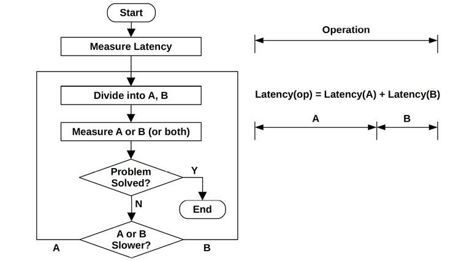

Figure 2.14 Latency analysis procedure

#### 2.5.14 Method R

Method R is a performance analysis methodology developed for Oracle databases that focuses on finding the origin of latency, based on Oracle trace events [\[Millsap 03\]](ch02.md). It is described as “a response time-based performance improvement method that yields maximum economic value to your business” and focuses on identifying and quantifying where time is spent during queries. While this is used for the study of databases, its approach could be applied to any system and is worth mentioning here as an avenue of possible study.

#### 2.5.15 Event Tracing

Systems operate by processing discrete events. These include CPU instructions, disk I/O and other disk commands, network packets, system calls, library calls, application transactions, database queries, and so on. Performance analysis usually studies summaries of these events, such as operations per second, bytes per second, or average latency. Sometimes important detail is lost in the summary, and the events are best understood when inspected individually.

Network troubleshooting often requires packet-by-packet inspection, with tools such as tcpdump(8). This example summarizes packets as single lines of text:

[Click here to view code image](ch02_images.md)

```
# tcpdump -ni eth4 -ttt
tcpdump: verbose output suppressed, use -v or -vv for full protocol decode
listening on eth4, link-type EN10MB (Ethernet), capture size 65535 bytes
00:00:00.000000 IP 10.2.203.2.22 > 10.2.0.2.33986: Flags [P.], seq
1182098726:1182098918, ack 4234203806, win 132, options [nop,nop,TS val 1751498743
ecr 1751639660], length 192
00:00:00.000392 IP 10.2.0.2.33986 > 10.2.203.2.22: Flags [.], ack 192, win 501,
options [nop,nop,TS val 1751639684 ecr 1751498743], length 0
00:00:00.009561 IP 10.2.203.2.22 > 10.2.0.2.33986: Flags [P.], seq 192:560, ack 1,
win 132, options [nop,nop,TS val 1751498744 ecr 1751639684], length 368
00:00:00.000351 IP 10.2.0.2.33986 > 10.2.203.2.22: Flags [.], ack 560, win 501,
options [nop,nop,TS val 1751639685 ecr 1751498744], length 0
00:00:00.010489 IP 10.2.203.2.22 > 10.2.0.2.33986: Flags [P.], seq 560:896, ack 1,
win 132, options [nop,nop,TS val 1751498745 ecr 1751639685], length 336
00:00:00.000369 IP 10.2.0.2.33986 > 10.2.203.2.22: Flags [.], ack 896, win 501,
options [nop,nop,TS val 1751639686 ecr 1751498745], length 0
[...]
```

Varying amounts of information can be printed by tcpdump(8) as needed (see [Chapter 10](ch10.md), [Network](ch10.md)).

Storage device I/O at the block device layer can be traced using biosnoop(8) (BCC/BPF-based):

[Click here to view code image](ch02_images.md)

```
# biosnoop
TIME(s)     COMM           PID    DISK    T SECTOR     BYTES   LAT(ms)
0.000004    supervise      1950   xvda1   W 13092560   4096       0.74
0.000178    supervise      1950   xvda1   W 13092432   4096       0.61
0.001469    supervise      1956   xvda1   W 13092440   4096       1.24
0.001588    supervise      1956   xvda1   W 13115128   4096       1.09
1.022346    supervise      1950   xvda1   W 13115272   4096       0.98
[...]
```

This biosnoop(8) output includes the I/O completion time (`TIME(s)`), initiating process details (`COMM`, `PID`), disk device (`DISK`), type of I/O (`T`), size (`BYTES`), and I/O duration (`LAT(ms)`). See [Chapter 9](ch09.md), [Disks](ch09.md), for more information about this tool.

The system call layer is another common location for tracing. On Linux, it can be traced using strace(1) and perf(1)’s trace subcommand (see [Chapter 5](ch05.md), [Applications](ch05.md)). These tools also have options to print timestamps.

When performing event tracing, look for the following information:

- **Input**: All attributes of an event request: type, direction, size, and so on
- **Times**: Start time, end time, latency (difference)
- **Result**: Error status, result of event (e.g., successful transfer size)

Sometimes performance issues can be understood by examining attributes of the event, for either the request or the result. Event timestamps are particularly useful for analyzing latency and can often be included by using event tracing tools. The preceding tcpdump(8) output included delta timestamps, measuring the time between packets, using `-ttt`.

The study of prior events provides more information. An uncommonly high latency event, known as a *latency outlier*, may be caused by previous events rather than the event itself. For example, the event at the tail of a queue may have high latency but be caused by the previously queued events, not its own properties. This case can be identified from the traced events.

#### 2.5.16 Baseline Statistics

Environments commonly use monitoring solutions to record server performance metrics and to visualize them as line charts, with time on the x-axis (see [Section 2.9](ch02.md), [Monitoring](ch02.md)). These line charts can show whether a metric has changed recently, and if so, how it is now different, simply by examining changes in the line. Sometimes additional lines are added to include more historical data, such as historical averages or simply historical time ranges for comparison with the current range. Many Netflix dashboards, for example, draw an extra line to show the same time range but for the previous week, so that behavior at 3 p.m. on a Tuesday can be directly compared with 3 p.m. on the previous Tuesday.

These approaches work well with already-monitored metrics and a GUI to visualize them. However, there are many more system metrics and details available at the command line that may not be monitored. You may be faced with unfamiliar system statistics and wonder if they are “normal” for the server, or if they are evidence of an issue.

This is not a new problem, and there is a methodology to solve it that predates the widespread use of monitoring solutions using line charts. It is the collection of *baseline statistics*. This can involve collecting all the system metrics when the system is under “normal” load and recording them in a text file or database for later reference. The baseline software can be a shell script that runs observability tools and gathers other sources (cat(1) of /proc files). Profilers and tracing tools can be included in the baseline, providing far more detail than is typically recorded by monitoring products (but be careful with the overhead of those tools, so as not to perturb production). These baselines may be collected at regular intervals (daily), as well as before and after system or application changes, so that performance differences can be analyzed.

If baselines have not been collected and monitoring is not available, some observability tools (those based on kernel counters) can show summary-since-boot averages, for comparison with current activity. This is coarse, but better than nothing.

#### 2.5.17 Static Performance Tuning

Static performance tuning focuses on issues of the configured architecture. Other methodologies focus on the performance of the applied load: the *dynamic performance* [\[Elling 00\]](ch02.md). Static performance analysis can be performed when the system is at rest and no load is applied.

For static performance analysis and tuning, step through all the components of the system and check the following:

- Does the component make sense? (outdated, underpowered, etc.)
- Does the configuration make sense for the intended workload?
- Was the component autoconfigured in the best state for the intended workload?
- Has the component experienced an error such that it is now in a degraded state?

Here are some examples of issues that may be found using static performance tuning:

- Network interface negotiation: selecting 1 Gbits/s instead of 10 Gbit/s
- Failed disk in a RAID pool
- Older version of the operating system, applications, or firmware used
- File system nearly full (can cause performance issues)
- Mismatched file system record size compared to workload I/O size
- Application running with a costly debug mode accidentally left enabled
- Server accidentally configured as a network router (IP forwarding enabled)
- Server configured to use resources, such as authentication, from a remote data center instead of locally

Fortunately, these types of issues are easy to check for; the hard part is remembering to do it!

#### 2.5.18 Cache Tuning

Applications and operating systems may employ multiple caches to improve I/O performance, from the application down to the disks. See [Chapter 3](ch03.md), [Operating Systems](ch03.md), [Section 3.2.11](ch03.md), [Caching](ch03.md), for a full list. Here is a general strategy for tuning each cache level:

1. Aim to cache as high in the stack as possible, closer to where the work is performed, reducing the operational overhead of cache hits. This location should also have more metadata available, which can be used to improve the cache retention policy.
2. Check that the cache is enabled and working.
3. Check the cache hit/miss ratios and miss rate.
4. If the cache size is dynamic, check its current size.
5. Tune the cache for the workload. This task depends on available cache tunable parameters.
6. Tune the workload for the cache. Doing this includes reducing unnecessary consumers of the cache, which frees up more space for the target workload.

Look out for double caching—for example, two different caches that consume main memory and cache the same data twice.

Also consider the overall performance gain of each level of cache tuning. Tuning the CPU Level 1 cache may save nanoseconds, as cache misses may then be served by Level 2. But improving CPU Level 3 cache may avoid much slower DRAM accesses and result in a greater overall performance gain. (These CPU caches are described in [Chapter 6](ch06.md), [CPUs](ch06.md).)

#### 2.5.19 Micro-Benchmarking

Micro-benchmarking tests the performance of simple and artificial workloads. This differs from *macro-benchmarking* (or *industry benchmarking*), which typically aims to test a real-world and natural workload. Macro-benchmarking is performed by running workload simulations and can become complex to conduct and understand.

With fewer factors in play, micro-benchmarking is less complicated to conduct and understand. A commonly used micro-benchmark is Linux iperf(1), which performs a TCP throughput test: this can identify external network bottlenecks (which would otherwise be difficult to spot) by examining TCP counters during a production workload.

Micro-benchmarking can be performed by a *micro-benchmark tool* that applies the workload and measures its performance, or you can use a *load generator* tool that just applies the workload, leaving measurements of performance to other observability tools (example load generators are in [Chapter 12](ch12.md), [Benchmarking](ch12.md), [Section 12.2.2](ch12.md), [Simulation](ch12.md)). Either approach is fine, but it can be safest to use a micro-benchmark tool *and* to double-check performance using other tools.

Some example targets of micro-benchmarks, including a second dimension for the tests, are:

- **Syscall time**: For fork(2), execve(2), open(2), read(2), close(2)
- **File system reads**: From a cached file, varying the read size from one byte to one Mbyte
- **Network throughput**: Transferring data between TCP endpoints, for varying socket buffer sizes

Micro-benchmarking typically conducts the target operation as quickly as possible and measures the time for a large number of these operations to complete. The average time can then be calculated (average time = runtime/operation count).

Later chapters include specific micro-benchmarking methodologies, listing the targets and attributes to test. The topic of benchmarking is covered in more detail in [Chapter 12](ch12.md), [Benchmarking](ch12.md).

#### 2.5.20 Performance Mantras

This is a tuning methodology that shows how best to improve performance, listing actionable items in order from most to least effective. It is:

1. Don’t do it.
2. Do it, but don’t do it again.
3. Do it less.
4. Do it later.
5. Do it when they’re not looking.
6. Do it concurrently.
7. Do it more cheaply.

Here are some examples for each of these:

1. Don’t do it: Eliminate unnecessary work.
2. Do it, but don’t do it again: Caching.
3. Do it less: Tune refreshes, polling, or updates to be less frequent.
4. Do it later: Write-back caching.
5. Do it when they’re not looking: Schedule work to run during off-peak hours.
6. Do it concurrently: Switch from single-threaded to multi-threaded.
7. Do it more cheaply: Buy faster hardware.

This is one of my favorite methodologies, which I learned from Scott Emmons at Netflix. He attributes it to Craig Hanson and Pat Crain (though I’ve yet to find a published reference).

### 2.6 Modeling

Analytical modeling of a system can be used for various purposes, in particular *scalability analysis*: studying how performance scales as load or resources increase. Resources may be hardware (such as CPU cores) or software (processes or threads).

Analytical modeling can be considered the third type of performance evaluation activity, along with observability of a production system (“measurement”) and experimental testing (“simulation”) \[Jain 91]. Performance is best understood when at least two of these activities are performed: analytical modeling and simulation, or simulation and measurement.

If the analysis is for an existing system, you can begin with measurement: characterizing the load and resulting performance. Experimental analysis, by testing a workload simulation, can be used if the system does not yet have production load, or in order to test workloads beyond what is seen in production. Analytical modeling can be used to predict performance and can be based on the results of measurement or simulation.

Scalability analysis may reveal that performance stops scaling linearly at a particular point due to a resource constraint. This is referred to as a *knee point*: when one function switches to another, in this case, from linear scaling to contention. Finding whether these points exist, and where, can direct an investigation to performance issues that inhibit scalability so that they can be fixed before they are encountered in production.

See [Section 2.5.11](ch02.md), [Workload Characterization](ch02.md), and [Section 2.5.19](ch02.md), [Micro-Benchmarking](ch02.md), for more on those steps.

#### 2.6.1 Enterprise vs. Cloud

While modeling allows us to simulate large-scale enterprise systems without the expense of owning one, the performance of large-scale environments is often complex and difficult to model accurately.

With cloud computing, environments of any scale can be rented for short durations—the length of a benchmark test. Instead of creating a mathematical model from which to predict performance, the workload can be characterized, simulated, and then tested on clouds of different scales. Some of the findings, such as knee points, may be the same but will now be based on measured data rather than theoretical models, and by testing a real environment you may discover limiters that were not included in your model.

#### 2.6.2 Visual Identification

When enough results can be collected experimentally, plotting them as delivered performance versus a scaling parameter may reveal a pattern.

[Figure 2.15](ch02.md) shows the throughput of an application as the number of threads is scaled. There appears to be a knee point around eight threads, where the slope changes. This can now be investigated, for example by looking at the application and system configuration for any setting around the value of eight.

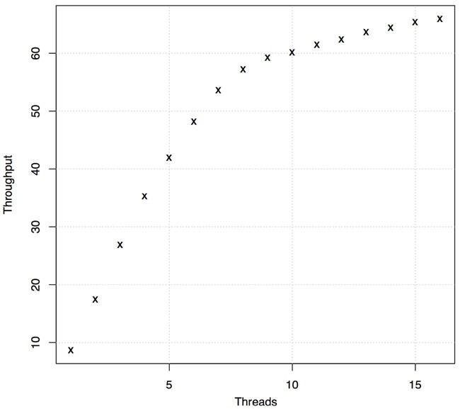

Figure 2.15 Scalability test results

In this case, the system was an eight-core system, each core having two hardware threads. To further confirm that this is related to the CPU core count, the CPU effects at fewer than and more than eight threads can be investigated and compared (e.g., IPC; see [Chapter 6](ch06.md), [CPUs](ch06.md)). Or, this can be investigated experimentally by repeating the scaling test on a system with a different core count and confirming that the knee point moves as expected.

There are a number of scalability profiles to look for that may be identified visually, without using a formal model. These are shown in [Figure 2.16](ch02.md).

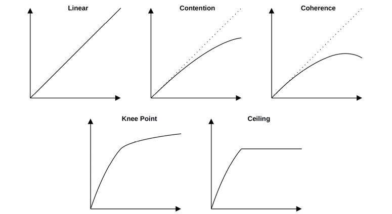

Figure 2.16 Scalability profiles

For each of these, the x-axis is the scalability dimension, and the y-axis is the resulting performance (throughput, transactions per second, etc.). The patterns are:

- **Linear scalability**: Performance increases proportionally as the resource is scaled. This may not continue forever and may instead be the early stages of another scalability pattern.
- [**Contention**](gloss.md): Some components of the architecture are shared and can be used only serially, and contention for these shared resources begins to reduce the effectiveness of scaling.
- **Coherence**: The tax to maintain data coherency including propagation of changes begins to outweigh the benefits of scaling.
- **Knee point**: A factor is encountered at a scalability point that changes the scalability profile.
- **Scalability ceiling**: A hard limit is reached. This may be a device bottleneck, such as a bus or interconnect reaching maximum throughput, or a software-imposed limit (system resource control).

While visual identification can be easy and effective, you can learn more about system scalability by using a mathematical model. The model may deviate from the data in an unexpected way, which can be useful to investigate: either there is a problem with the model, and hence with your understanding of the system, or the problem is in the real scalability of the system. The next sections introduce Amdahl’s Law of Scalability, the Universal Scalability Law, and queueing theory.

#### 2.6.3 Amdahl’s Law of Scalability

Named after computer architect Gene Amdahl [\[Amdahl 67\]](ch02.md), this law models system scalability, accounting for serial components of workloads that do not scale in parallel. It can be used to study the scaling of CPUs, threads, workloads, and more.

Amdahl’s Law of Scalability was shown in the earlier scalability profiles as contention, which describes contention for the serial resource or workload component. It can be defined as \[Gunther 97]:

[*C*](gloss.md)(*N*) = *N*/(1 + α(*N* – 1))

The relative capacity is *C*(*N*), and *N* is the scaling dimension, such as the CPU count or user load. The α parameter (where 0 &lt;= α &lt;= 1) represents the degree of seriality and is how this deviates from linear scalability.

Amdahl’s Law of Scalability can be applied by taking the following steps:

1. Collect data for a range of *N*, either by observation of an existing system or experimentally using micro-benchmarking or load generators.
2. Perform regression analysis to determine the Amdahl parameter (α); this may be done using statistical software, such as gnuplot or R.
3. Present the results for analysis. The collected data points can be plotted along with the model function to predict scaling and reveal differences between the data and the model. This may also be done using gnuplot or R.

The following is example gnuplot code for Amdahl’s Law of Scalability regression analysis, to provide a sense of how this step can be performed:

[Click here to view code image](ch02_images.md)

```
inputN = 10                     # rows to include as model input
alpha = 0.1                     # starting point (seed)
amdahl(N) = N1 * N/(1 + alpha * (N - 1))
# regression analysis (non-linear least squares fitting)
fit amdahl(x) filename every ::1::inputN using 1:2 via alpha
```

A similar amount of code is required to process this in R, involving the nls() function for nonlinear least squares fitting to calculate the coefficients, which are then used during plotting. See the Performance Scalability Models toolkit in the references at the end of this chapter for the full code in both gnuplot and R [\[Gregg 14a\]](ch02.md).

An example Amdahl’s Law of Scalability function is shown in the next section.

#### 2.6.4 Universal Scalability Law

The Universal Scalability Law (USL), previously called the *super-serial model* \[Gunther 97], was developed by Dr. Neil Gunther to include a parameter for coherency delay. This was pictured earlier as the coherence scalability profile, which includes the effects of contention.

USL can be defined as:

*C*(*N*) = *N*/(1 + α(*N* – 1) + β*N*(*N* – 1))

*C*(*N*), *N*, and α are as with Amdahl’s Law of Scalability. β is the coherence parameter. When β == 0, this becomes Amdahl’s Law of Scalability.

Examples of both USL and Amdahl’s Law of Scalability analysis are graphed in [Figure 2.17](ch02.md).

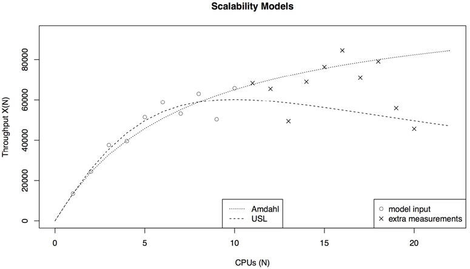

Figure 2.17 Scalability models

The input dataset has a high degree of variance, making it difficult to visually determine the scalability profile. The first ten data points, drawn as circles, were provided to the models. An additional ten data points are also plotted, drawn as crosses, which check the model prediction against reality.

For more on USL analysis, see \[Gunther 97] and [\[Gunther 07\]](ch02.md).

#### 2.6.5 Queueing Theory

Queueing theory is the mathematical study of systems with queues, providing ways to analyze their queue length, wait time (latency), and utilization (time-based). Many components in computing, both software and hardware, can be modeled as *queueing systems*. The modeling of multiple queueing systems is called *queueing networks*.

This section summarizes the role of queueing theory and provides an example to help you understand that role. It is a large field of study, covered in detail in other texts [\[Jain 91\]](ch02.md)\[Gunther 97].

Queueing theory builds upon various areas of mathematics and statistics, including probability distributions, stochastic processes, Erlang’s C formula (Agner Krarup Erlang invented queueing theory), and Little’s Law. Little’s Law can be expressed as

*L* = λ*W*

which determines the average number of requests in a system, *L*, as the average arrival rate, λ, multiplied by the average request time in the system, *W*. This can be applied to a queue, such that L is the number of requests in the queue, and W is the average wait time on the queue.

Queueing systems can be used to answer a variety of questions, including the following:

- What will the mean response time be if the load doubles?
- What will be the effect on mean response time after adding an additional processor?
- Can the system provide a 90th percentile response time of under 100 ms when the load doubles?

Apart from response time, other factors, including utilization, queue lengths, and number of resident jobs, can be studied.

A simple queueing system model is shown in [Figure 2.18](ch02.md).

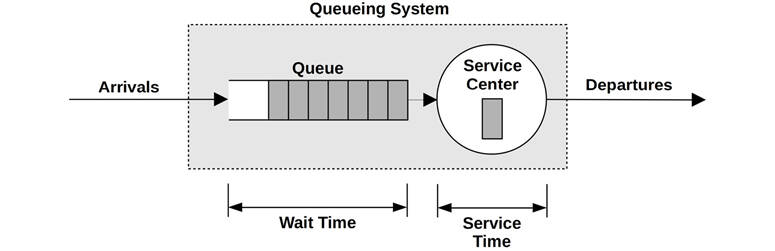

Figure 2.18 Queueing model

This has a single service center that processes jobs from the queue. Queueing systems can have multiple service centers that process work in parallel. In queueing theory, the service centers are often called *servers*.

Queueing systems can be categorized by three factors:

- **Arrival process**: This describes the inter-arrival time for requests to the queueing system, which may be random, fixed-time, or a process such as Poisson (which uses an exponential distribution for arrival time).
- **Service time distribution**: This describes the service times for the service center. They may be fixed (deterministic), exponential, or of another distribution type.
- **Number of service centers**: One or many.

These factors can be written in Kendall’s notation.

##### Kendall’s Notation

This notation assigns codes for each attribute. It has the form

*A*/*S*/*m*

These are the arrival process (*A*), service time distribution (*S*), and number of service centers (*m*). There is also an extended form of Kendall’s notation that includes more factors: number of buffers in the system, population size, and service discipline.

Examples of commonly studied queueing systems are

- **M/M/1**: Markovian arrivals (exponentially distributed arrival times), Markovian service times (exponential distribution), one service center
- **M/M/c**: same as M/M/1, but multiserver
- **M/G/1**: Markovian arrivals, general distribution of service times (any), one service center
- **M/D/1**: Markovian arrivals, deterministic service times (fixed), one service center

M/G/1 is commonly applied to study the performance of rotational hard disks.

##### M/D/1 and 60% Utilization

As a simple example of queueing theory, consider a disk that responds to a workload deterministically (this is a simplification). The model is M/D/1.

The question posed is: How does the disk’s response time vary as its utilization increases?

Queueing theory allows the response time for M/D/1 to be calculated:

*r* = *s*(2 - ρ)/2(1 - ρ)

where the response time, *r*, is defined in terms of the service time, *s*, and the utilization, ρ.

For a service time of 1 ms, and utilizations from 0 to 100%, this relationship has been graphed in [Figure 2.19](ch02.md).

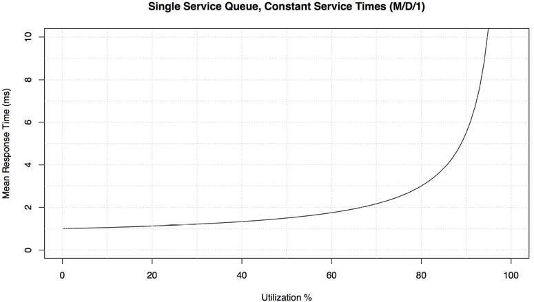

Figure 2.19 M/D/1 mean response time versus utilization

Beyond 60% utilization, the average response time doubles. By 80%, it has tripled. As disk I/O latency is often the bounding resource for an application, increasing the average latency by double or higher can have a significant negative effect on application performance. This is why disk utilization can become a problem well before it reaches 100%, as it is a queueing system where requests (typically) cannot be interrupted and must wait their turn. This is different from CPUs, for example, where higher-priority work can preempt.

This graph can visually answer an earlier question—what will the mean response time be if the load doubles?—when utilization is relative to load.

This model is simple, and in some ways it shows the best case. Variations in service time can drive the mean response time higher (e.g., using M/G/1 or M/M/1). There is also a distribution of response times, not pictured in [Figure 2.19](ch02.md), such that the 90th and 99th percentiles degrade much faster beyond 60% utilization.

As with the earlier gnuplot example for Amdahl’s Law of Scalability, it may be illustrative to show some actual code, for a sense of what may be involved. This time the R statistics software was used [\[R Project 20\]](ch02.md):

[Click here to view code image](ch02_images.md)

```
svc_ms <- 1                   # average disk I/O service time, ms
util_min <- 0                 # range to plot
util_max <- 100               # "
ms_min <- 0                   # "
ms_max <- 10                  # "
# Plot mean response time vs utilization (M/D/1)
plot(x <- c(util_min:util_max), svc_ms * (2 - x/100) / (2 * (1 - x/100)),
    type="l", lty=1, lwd=1,
    xlim=c(util_min, util_max), ylim=c(ms_min, ms_max),
    xlab="Utilization %", ylab="Mean Response Time (ms)")
```

The earlier M/D/1 equation has been passed to the `plot()` function. Much of this code specifies limits to the graph, line properties, and axis labels.

### 2.7 Capacity Planning

Capacity planning examines how well the system will handle load and how it will scale as load scales. It can be performed in a number of ways, including studying resource limits and factor analysis, which are described here, and modeling, as introduced previously. This section also includes solutions for scaling, including load balancers and sharding. For more on this topic, see *The Art of Capacity Planning* [\[Allspaw 08\]](ch02.md).

For capacity planning of a particular application, it helps to have a quantified performance objective to plan for. Determining this is discussed early on in [Chapter 5](ch05.md), [Applications](ch05.md).

#### 2.7.1 Resource Limits

This method is a search for the resource that will become the bottleneck under load. For containers, a resource may encounter a software-imposed limit that becomes the bottleneck. The steps for this method are:

1. Measure the rate of server requests, and monitor this rate over time.
2. Measure hardware and software resource usage. Monitor this rate over time.
3. Express server requests in terms of resources used.
4. Extrapolate server requests to known (or experimentally determined) limits for each resource.

Begin by identifying the role of the server and the type of requests it serves. For example, a web server serves HTTP requests, a Network File System (NFS) server serves NFS protocol requests (operations), and a database server serves query requests (or command requests, for which queries are a subset).

The next step is to determine the system resource consumption per request. For an existing system, the current rate of requests along with resource utilization can be measured. Extrapolation can then be used to see which resource will hit 100% utilization first, and what the rate of requests will be.

For a future system, micro-benchmarking or load generation tools can be used to simulate the intended requests in a test environment, while measuring resource utilization. Given sufficient client load, you may be able to find the limit experimentally.

The resources to monitor include:

- **Hardware**: CPU utilization, memory usage, disk IOPS, disk throughput, disk capacity (volume used), network throughput
- **Software**: Virtual memory usage, processes/tasks/threads, file descriptors

Let’s say you’re looking at an existing system currently performing 1,000 requests/s. The busiest resources are the 16 CPUs, which are averaging 40% utilization; you predict that they will become the bottleneck for this workload once they become 100% utilized. The question becomes: What will the requests-per-second rate be at that point?

CPU% per request = total CPU%/requests = 16 × 40%/1,000 = 0.64% CPU per request

max requests/s = 100% × 16 CPUs/CPU% per request = 1,600 / 0.64 = 2,500 requests/s

The prediction is 2,500 requests/s, at which point the CPUs will be 100% busy. This is a rough best-case estimate of capacity, as some other limiting factor may be encountered before the requests reach that rate.

This exercise used only one data point: application throughput (requests per second) of 1,000 versus device utilization of 40%. If monitoring over time is enabled, multiple data points at different throughput and utilization rates can be included, to improve the accuracy of the estimation. [Figure 2.20](ch02.md) illustrates a visual method for processing these and extrapolating the maximum application throughput.

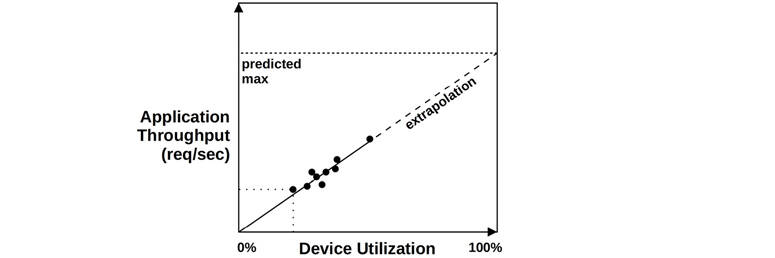

Figure 2.20 Resource limit analysis

Is 2,500 requests/s enough? Answering this question requires understanding what the peak workload will be, which shows up in daily access patterns. For an existing system that you have monitored over time, you may already have an idea of what the peak will look like.

Consider a web server that is processing 100,000 website hits per day. This may sound like many, but as an average is only one request/s—not much. However, it may be that most of the 100,000 website hits occur in the seconds after new content is posted, so the peak is significant.

#### 2.7.2 Factor Analysis

When purchasing and deploying new systems, there are often many factors that can be changed to achieve the desired performance. These may include varying the number of disks and CPUs, the amount of RAM, the use of flash devices, RAID configurations, file system settings, and so forth. The task is usually to achieve the performance required for the minimum cost.

Testing all combinations would determine which has the best price/performance ratio; however, this can quickly get out of hand: eight binary factors would require 256 tests.

A solution is to test a limited set of combinations. Here is an approach based on knowing the maximum system configuration:

1. Test performance with all factors configured to maximum.
2. Change factors one by one, testing performance (it should drop for each).
3. Attribute a percentage performance drop to each factor, based on measurements, along with the cost savings.
4. Starting with maximum performance (and cost), choose factors to save cost, while maintaining the required requests per second based on their combined performance drop.
5. Retest the calculated configuration for confirmation of delivered performance.

For an eight-factor system, this approach may require only ten tests.

As an example, consider capacity planning for a new storage system, with a requirement of 1 Gbyte/s read throughput and a 200 Gbyte working set size. The maximum configuration achieves 2 Gbytes/s and includes four processors, 256 Gbytes of DRAM, 2 dual-port 10 GbE network cards, jumbo frames, and no compression or encryption enabled (which is costly to activate). Switching to two processors reduces performance by 30%, one network card by 25%, non-jumbo by 35%, encryption by 10%, compression by 40%, and less DRAM by 90% as the workload is no longer expected to fully cache. Given these performance drops and their known savings, the best price/performance system that meets the requirements can now be calculated; it might be a two-processor system with one network card, which meets the throughput needed: 2 × (1 – 0.30) × (1 – 0.25) = 1.04 Gbytes/s estimated. It would then be wise to test this configuration, in case these components perform differently from their expected performance when used together.

#### 2.7.3 Scaling Solutions

Meeting higher performance demands has often meant larger systems, a strategy called *vertical scaling*. Spreading load across numerous systems, usually fronted by systems called *load balancers* that make them all appear as one, is called *horizontal scaling*.

Cloud computing takes horizontal scaling further, by building upon smaller virtualized systems rather than entire systems. This provides finer granularity when purchasing compute to process the required load and allows scaling in small, efficient increments. Since no initial large purchase is required, as with enterprise mainframes (including a support contract commitment), there is less need for rigorous capacity planning in the early stages of a project.

There are technologies to automate cloud scaling based on a performance metric. The AWS technology for this is called an *auto scaling group (ASG)*. A custom scaling policy can be created to increase and decrease the number of instances based on a usage metric. This is pictured in [Figure 2.21](ch02.md).

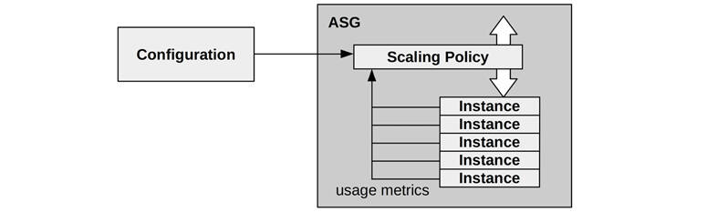

Figure 2.21 Auto scaling group

Netflix commonly uses ASGs that target a CPU utilization of 60%, and will scale up and down with the load to maintain that target.

Container orchestration systems may also provide support for automatic scaling. For example, Kubernetes provides horizontal pod autoscalers (HPAs) that can scale the number of Pods (containers) based on CPU utilization or another custom metric [\[Kubernetes 20a\]](ch02.md).

For databases, a common scaling strategy is *sharding*, where data is split into logical components, each managed by its own database (or redundant group of databases). For example, a customer database may be split into parts by splitting the customer names into alphabetical ranges. Picking an effective sharding key is crucial to evenly spread the load across the databases.

### 2.8 Statistics

It’s important to have a good understanding of how to use statistics and what their limitations are. This section discusses quantifying performance issues using statistics (metrics) and statistical types including averages, standard deviations, and percentiles.

#### 2.8.1 Quantifying Performance Gains

Quantifying issues and the potential performance improvement for fixing them allows them to be compared and prioritized. This task may be performed using observation or experiments.

##### Observation-Based

To quantify performance issues using observation:

1. Choose a reliable metric.
2. Estimate the performance gain from resolving the issue.

For example:

- Observed: Application request takes 10 ms.
- Observed: Of that, 9 ms is disk I/O.
- Suggestion: Configure the application to cache I/O in memory, with expected DRAM latency around ~10 μs.
- Estimated gain: 10 ms → 1.01 ms (10 ms - 9 ms + 10 μs) = ~9x gain.

As introduced in [Section 2.3](ch02.md), [Concepts](ch02.md), latency (time) is well suited for this, as it can be directly compared between components, which makes calculations like this possible.

When using latency, ensure that it is measured as a synchronous component of the application request. Some events occur asynchronously, such as background disk I/O (write flush to disk), and do not directly affect application performance.

##### Experimentation-Based

To quantify performance issues experimentally:

1. Apply the fix.
2. Quantify before versus after using a reliable metric.

For example:

- Observed: Application transaction latency averages 10 ms.
- Experiment: Increase the application thread count to allow more concurrency instead of queueing.
- Observed: Application transaction latency averages 2 ms.
- Gain: 10 ms → 2 ms = 5x.

This approach may not be appropriate if the fix is expensive to attempt in the production environment! For that case, observation-based should be used.

#### 2.8.2 Averages

An average represents a dataset by a single value: an index of central tendency. The most common type of average used is an *arithmetic mean* (or *mean* for short), which is a sum of values divided by the count of values. Other types include the geometric mean and harmonic mean.

##### Geometric Mean

The *geometric mean* is the *n*th root (where *n* is the count of values) of multiplied values. This is described in \[Jain 91], which includes an example of using it for network performance analysis: if the performance improvement of each layer of the kernel network stack is measured individually, what is the average performance improvement? Since the layers work together on the same packet, performance improvements have a “multiplicative” effect, which can be best summarized by the geometric mean.

##### Harmonic Mean

The *harmonic mean* is the count of values divided by the sum of their reciprocals. It is more appropriate for taking the average of rates, for example, calculating the average transfer rate for 800 Mbytes of data, when the first 100 Mbytes will be sent at 50 Mbytes/s and the remaining 700 Mbytes at a throttled rate of 10 Mbytes/s. The answer, using the harmonic mean, is 800/(100/50 + 700/10) = 11.1 Mbytes/s.

##### Averages over Time

With performance, many metrics we study are averages over time. A CPU is never “at 50% utilization”; it has been utilized during 50% of some interval, which could be a second, minute, or hour. It is important to check for intervals whenever considering averages.

For example, I had an issue where a customer had performance problems caused by CPU saturation (scheduler latency) even though their monitoring tools showed CPU utilization was never higher than 80%. The monitoring tool was reporting *5-minute averages*, which masked periods in which CPU utilization hit 100% for seconds at a time.

##### Decayed Average

A *decayed average* is sometimes used in systems performance. An example is the system “load averages” reported by various tools including uptime(1).

A decayed average is still measured over a time interval, but recent time is weighted more heavily than time further past. This reduces (dampens) short-term fluctuations in the average.

See Load Averages in [Chapter 6](ch06.md), [CPUs](ch06.md), [Section 6.6](ch06.md), [Observability Tools](ch06.md), for more on this.

##### Limitations

Averages are a summary statistic that hides details. I’ve analyzed many cases of occasional disk I/O latency outliers exceeding 100 ms, while the average latency was close to 1 ms. To better understand the data, you can use additional statistics covered in [Section 2.8.3](ch02.md), [Standard Deviation, Percentiles, Median](ch02.md) (the next section), and visualizations covered in [Section 2.10](ch02.md), [Visualizations](ch02.md).

#### 2.8.3 Standard Deviation, Percentiles, Median

Standard deviations and percentiles (e.g., 99th percentile) are statistical techniques to provide information on the *distribution* of data. The standard deviation is a measure of *variance*, with larger values indicating greater variance from the average (mean). The 99th percentile shows the point in the distribution that includes 99% of the values. [Figure 2.22](ch02.md) pictures these for a *normal distribution*, along with the minimum and maximum.

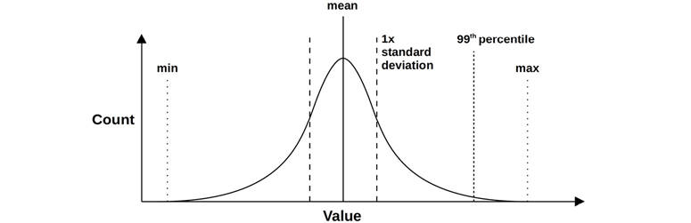

Figure 2.22 Statistical values

Percentiles such as 90th, 95th, 99th, and 99.9th are used in performance monitoring of request latency to quantify the slowest in the population. These may also be specified in service-level agreements (SLAs) as a way to measure that performance is acceptable for most users.

The 50th percentile, called the *median*, can be examined to show where the bulk of the data is.

#### 2.8.4 Coefficient of Variation

Since standard deviation is relative to the mean, variance can be understood only when considering both standard deviation and mean. A standard deviation of 50 alone tells us little. That plus a mean of 200 tells us a lot.

There is a way to express variation as a single metric: the ratio of the standard deviation to the mean, which is called the *coefficient of variation* (CoV or CV). For this example, the CV is 25%. Lower CVs mean less variance.

Another expression of variance as a single metric is the z value, which is how many standard deviations a value is from the mean.

#### 2.8.5 Multimodal Distributions

There is a problem with means, standard deviations, and percentiles, which may be obvious from the previous chart: they are intended for *normal*-like or unimodal distributions. System performance is often *bimodal*, returning low latencies for a fast code path and high latencies for a slow one, or low latencies for cache hits and high latencies for cache misses. There may also be more than two modes.

[Figure 2.23](ch02.md) shows the distribution of disk I/O latency for a mixed workload of reads and writes, which includes random and sequential I/O.

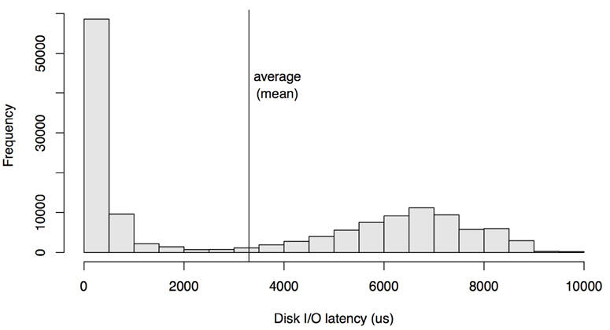

Figure 2.23 Latency distribution

This is presented as a histogram, which shows two modes. The mode on the left shows latencies of less than 1 ms, which is for on-disk cache hits. The right, with a peak around 7 ms, is for on-disk cache misses: random reads. The average (mean) I/O latency is 3.3 ms, which is plotted as a vertical line. This average is not the index of central tendency (as described earlier); in fact, it is almost the opposite. As a metric, the average for this distribution is seriously misleading.

Then there was the man who drowned crossing a stream with an average depth of six inches. —W. I. E. Gates

Every time you see an average used as a performance metric, especially an average latency, ask: What is the distribution? [Section 2.10](ch02.md), [Visualizations](ch02.md), provides another example and shows how effective different visualizations and metrics are at showing this distribution.

#### 2.8.6 Outliers

Another statistical problem is the presence of *outliers*: a very small number of extremely high or low values that don’t appear to fit the expected distribution (single- or multimode).

Disk I/O latency outliers are an example—very occasional disk I/O that can take over 1,000 ms, when the majority of disk I/O is between 0 and 10 ms. Latency outliers like these can cause serious performance problems, but their presence can be difficult to identify from most metric types, other than as a maximum. Another example is network I/O latency outliers caused by TCP timer-based retransmits.

For a normal distribution, the presence of outliers is likely to shift the mean by a little, but not the median (which may be useful to consider). The standard deviation and 99th percentile have a better chance of identifying outliers, but this is still dependent on their frequency.

To better understand multimodal distributions, outliers, and other complex yet common behaviors, inspect the full distribution, for example by using a histogram. See [Section 2.10](ch02.md), [Visualizations](ch02.md), for more ways to do this.

### 2.9 Monitoring

System performance monitoring records performance statistics over time (a *time series*) so that the past can be compared to the present and time-based usage patterns can be identified. This is useful for capacity planning, quantifying growth, and showing peak usage. Historic values can also provide context for understanding the current value of performance metrics, by showing what the “normal” range and average have been in the past.

#### 2.9.1 Time-Based Patterns

Examples of time-based patterns are shown in [Figures 2.24](ch02.md), [2.25](ch02.md), and [2.26](ch02.md), which plot file system reads from a cloud computing server over different time intervals.

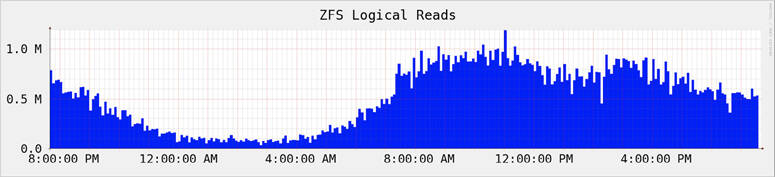

Figure 2.24 Monitoring activity: one day

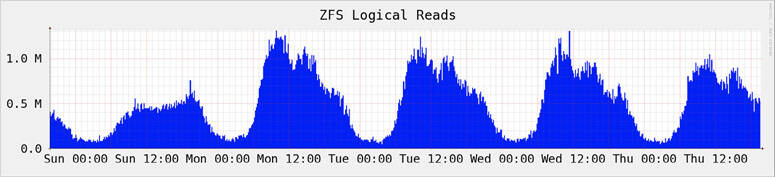

Figure 2.25 Monitoring activity: five days

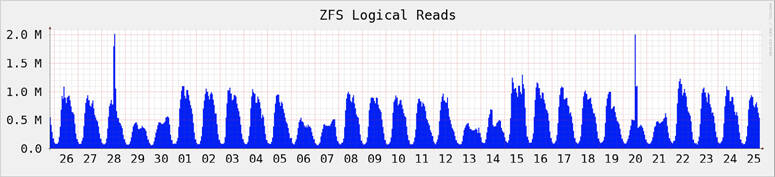

Figure 2.26 Monitoring activity: 30 days

These graphs show a daily pattern that begins to ramp up around 8 a.m., dips a little in the afternoon, and then decays during the night. The longer-scale charts show that activity is lower on the weekend days. A couple of short spikes are also visible in the 30-day chart.

Various cycles of behavior including those shown in the figures can commonly be seen in historic data, including:

- **Hourly**: Activity may occur every hour from the application environment, such as monitoring and reporting tasks. It’s also common for these to execute with a 5- or 10- minute cycle.
- **Daily**: There may be a daily pattern of usage that coincides with work hours (9 a.m. to 5 p.m.), which may be stretched if the server is for multiple time zones. For Internet servers, the pattern may follow when worldwide users are active. Other daily activity may include nightly log rotation and backups.
- **Weekly**: As well as a daily pattern, there may be a weekly pattern present based on workdays and weekends.
- **Quarterly**: Financial reports are done on a quarterly schedule.
- **Yearly**: Yearly patterns of load may be due to school schedules and vacations.

Irregular increases in load may occur with other activities, such as releasing new content on a website, and sales (Black Friday/Cyber Monday in the US). Irregular decreases in load can occur due to external activities, such as widespread power or internet outages, and sports finals (where everyone watches the game instead of using your product).[6](ch02.md)

[6](ch02.md)When I was on the Netflix SRE on-call rotation, I learned some non-traditional analysis tools for these cases: to check social media for suspected power outages and to ask in team chatrooms if anyone knew of a sports final.

#### 2.9.2 Monitoring Products

There are many third-party products for system performance monitoring. Typical features include archiving data and presenting it as browser-based interactive graphs, and providing configurable alerts.

Some of these operate by running *agents* (also known as *exporters*) on the system to gather their statistics. These agents either execute operating system observability tools (such as iostat(1) or sar(1)) and parse the text of the output (which is considered inefficient) or read directly from operating system libraries and kernel interfaces. Monitoring products support a collection of custom agents for exporting statistics from specific targets: web servers, databases, and language runtimes.

As systems become more distributed and the usage of cloud computing continues to grow, you will more often need to monitor numerous systems: hundreds, thousands, or more. This is where a centralized monitoring product can be especially useful, allowing an entire environment to be monitored from one interface.

As a specific example: the Netflix cloud is composed of over 200,000 instances and is monitored using the Atlas cloud-wide monitoring tool, which was custom built by Netflix to operate at this scale and is open source [\[Harrington 14\]](ch02.md). Other monitoring products are discussed in [Chapter 4](ch04.md), [Observability Tools](ch04.md), [Section 4.2.4](ch04.md), [Monitoring](ch04.md).

#### 2.9.3 Summary-Since-Boot

If monitoring has not been performed, check whether at least *summary-since-boot* values are available from the operating system, which can be used to compare with the current values.

### 2.10 Visualizations

Visualizations allow more data to be examined than can be easily understood (or sometimes even displayed) as text. They also enable pattern recognition and pattern matching. This can be an effective way to identify correlations between different metric sources, which may be difficult to accomplish programmatically, but easy to do visually.

#### 2.10.1 Line Chart

A line chart (also called *line graph*) is a well-known, basic visualization. It is commonly used for examining performance metrics over time, showing the passage of time on the x-axis.

[Figure 2.27](ch02.md) is an example, showing the average (mean) disk I/O latency for a 20-second period. This was measured on a production cloud server running a MySQL database, where disk I/O latency was suspected to be causing slow queries.

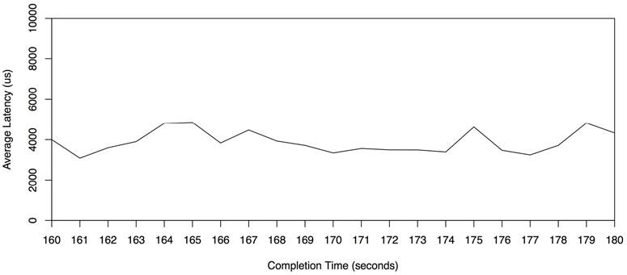

Figure 2.27 Line chart of average latency

This line chart shows fairly consistent average read latency of around 4 ms, which is higher than expected for these disks.

Multiple lines can be plotted, showing related data on the same set of axes. With this example, a separate line may be plotted for each disk, showing whether they exhibit similar performance.

Statistical values can also be plotted, providing more information on the distribution of data. [Figure 2.28](ch02.md) shows the same range of disk I/O events, with lines added for the per-second median, standard deviation, and percentiles. Note that the y-axis now has a much greater range than the previous line chart (by a factor of 8).

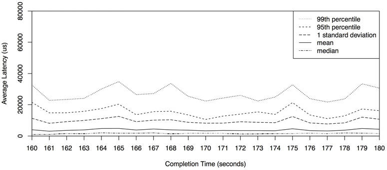

Figure 2.28 Median, mean, standard deviation, percentiles

This shows why the average is higher than expected: the distribution includes higher-latency I/O. Specifically, 1% of the I/O is over 20 ms, as shown by the 99th percentile. The median also shows where I/O latency was expected, around 1 ms.

#### 2.10.2 Scatter Plots

[Figure 2.29](ch02.md) shows disk I/O events for the same time range as a scatter plot, which enables all data to be seen. Each disk I/O is drawn as a point, with its completion time on the x*-*axis and latency on the y-axis.

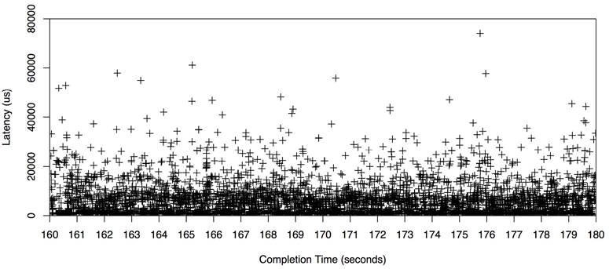

Figure 2.29 Scatter plot

Now the source of the higher-than-expected average latency can be understood fully: there are many disk I/O with latencies of 10 ms, 20 ms, even over 50 ms. The scatter plot has shown all the data, revealing the presence of these outliers.

Many of the I/O were submillisecond, shown close to the x-axis. This is where the resolution of scatter plots begins to become a problem, as the points overlap and become difficult to distinguish. This gets worse with more data: imagine plotting events from an entire cloud, involving millions of data points, on one scatter plot: the dots can merge and become a “wall of paint.” Another problem is the volume of data that must be collected and processed: x and y coordinates for every I/O.

#### 2.10.3 Heat Maps

Heat maps (more properly called a *column quantization*) can solve the scatter plot scalability problems by quantizing x and y ranges into groups called *buckets*. These are displayed as large pixels, colored based on the number of events in that x and y range. This quantizing also solves the scatter plot visual density limit, allowing heat maps to show data from a single system or thousands of systems in the same way. Heat maps had previously been used for location such as disk offsets (e.g., TazTool [\[McDougall 06a\]](ch02.md)); I invented their use in computing for latency, utilization, and other metrics. Latency heat maps were first included in Analytics for the Sun Microsystems ZFS Storage appliance, released in 2008 [\[Gregg 10a\]](ch02.md)[\[Gregg 10b\]](ch02.md), and are now commonplace in performance monitoring products such as Grafana [\[Grafana 20\]](ch02.md).

The same dataset as plotted earlier is shown in [Figure 2.30](ch02.md) as a heat map.

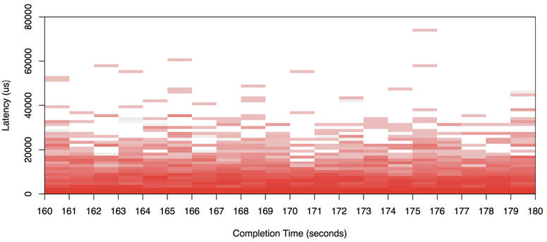

Figure 2.30 Heat map

High-latency outliers can be identified as blocks that are high in the heat map, usually of light colors as they span few I/O (often a single I/O). Patterns in the bulk of the data begin to emerge, which may be impossible to see with a scatter plot.

The full range of seconds for this disk I/O trace (not shown earlier) is shown in the [Figure 2.31](ch02.md) heat map.

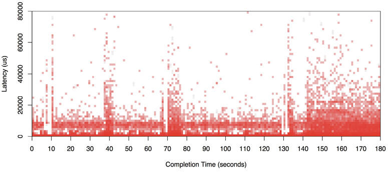

Figure 2.31 Heat map: full range

Despite spanning nine times the range, the visualization is still very readable. A bimodal distribution can be seen for much of the range, with some I/O returning with near-zero latency (likely a disk cache hit), and others with a little less than 1 ms (likely a disk cache miss).

There are other examples of heat maps later in this book, including in [Chapter 6](ch06.md), [CPUs](ch06.md), [Section 6.7](ch06.md), [Visualizations](ch06.md); [Chapter 8](ch08.md), [File Systems](ch08.md), [Section 8.6.18](ch08.md), [Visualizations](ch08.md); and [Chapter 9](ch09.md), [Disks](ch09.md), [Section 9.7.3](ch09.md), [Latency Heat Maps](ch09.md). My website also has examples of latency, utilization, and subsecond-offset heat maps [\[Gregg 15b\]](ch02.md).

#### 2.10.4 Timeline Charts

A timeline chart shows a set of activities as bars on a timeline. These are commonly used for front-end performance analysis (web browsers), where they are also called *waterfall charts*, and show the timing of network requests. An example from the Firefox web browser is shown in [Figure 2.32](ch02.md).

In [Figure 2.32](ch02.md), the first network request is highlighted: apart from showing its duration as a horizontal bar, components of this duration are also shown as colored bars. These are also explained in the right panel: the slowest component for the first request is “Waiting,” which is waiting for the HTTP response from the server. Requests two to six begin after the first request begins receiving data, and are likely dependent on that data. If explicit dependency arrows are included in the chart, it becomes a type of Gantt chart.

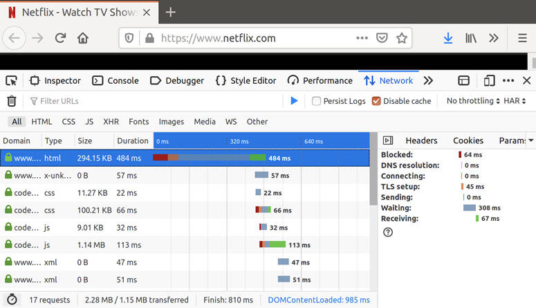

Figure 2.32 Firefox timeline chart

For back-end performance analysis (servers), similar charts are used to show timelines for threads or CPUs. Example software includes KernelShark [\[KernelShark 20\]](ch02.md) and Trace Compass [\[Eclipse 20\]](ch02.md). For an example KernelShark screenshot, see [Chapter 14](ch14.md), [Ftrace](ch14.md), [Section 14.11.5](ch14.md), [KernelShark](ch14.md). Trace Compass also draws arrows showing dependencies, where one thread has woken up another.

#### 2.10.5 Surface Plot

This is a representation of three dimensions, rendered as a three-dimensional surface. It works best when the third-dimension value does not frequently change dramatically from one point to the next, producing a surface resembling rolling hills. A surface plot is often rendered as a *wireframe model*.

[Figure 2.33](ch02.md) shows a wireframe surface plot of per-CPU utilization. It contains 60 seconds of per-second values from many servers (this is cropped from an image that spanned a data center of over 300 physical servers and 5,312 CPUs) [\[Gregg 11b\]](ch02.md).

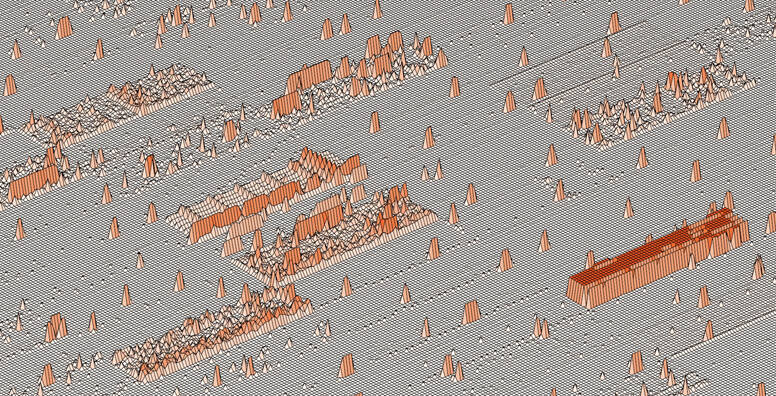

Figure 2.33 Wireframe surface plot: data center CPU utilization

Each server is represented by plotting its 16 CPUs as rows on the surface, the 60 per-second utilization measurements as columns, and then setting the height of the surface to the utilization value. Color is also set to reflect the utilization value. Both hue and saturation could be used, if desired, to add fourth and fifth dimensions of data to the visualization. (With sufficient resolution, a pattern could be used to indicate a sixth dimension.)

These 16 × 60 server rectangles are then mapped across the surface as a checkerboard. Even without markings, some server rectangles can be clearly seen in the image. One that appears as an elevated plateau on the right shows that its CPUs are almost always at 100%.

The use of grid lines highlights subtle changes in elevation. Some faint lines are visible, which indicate a single CPU constantly running at low utilization (a few percent).

#### 2.10.6 Visualization Tools

Unix performance analysis has historically focused on the use of text-based tools, due in part to limited graphical support. Such tools can be executed quickly over a login session and report data in real time. Visualizations have been more time-consuming to access and often require a trace-and-report cycle. When working urgent performance issues, the speed at which you can access metrics can be critical.

Modern visualization tools provide real-time views of system performance, accessible from the browser and mobile devices. There are numerous products that do this, including many that can monitor your entire cloud. [Chapter 1](ch01.md), [Introduction](ch01.md), [Section 1.7.1](ch01.md), [Counters, Statistics, and Metrics](ch01.md), includes an example screenshot from one such product, Grafana, and other monitoring products are discussed in [Chapter 4](ch04.md), [Observability Tools](ch04.md), [Section 4.2.4](ch04.md), [Monitoring](ch04.md).

### 2.11 Exercises

1. Answer the following questions about key performance terminology:
   
   - What are IOPS?
   - What is utilization?
   - What is saturation?
   - What is latency?
   - What is micro-benchmarking?
2. Choose five methodologies to use for your (or a hypothetical) environment. Select the order in which they can be conducted, and explain the reason for choosing each.
3. Summarize problems when using average latency as a sole performance metric. Can these problems be solved by including the 99th percentile?

### 2.12 References

**\[Amdahl 67]** Amdahl, G., “Validity of the Single Processor Approach to Achieving Large Scale Computing Capabilities,” *AFIPS*, 1967.

**\[Jain 91]** Jain, R., *The Art of Computer Systems Performance Analysis: Techniques for Experimental Design, Measurement, Simulation and Modeling*, Wiley, 1991.

**\[Cockcroft 95]** Cockcroft, A., *Sun Performance and Tuning*, Prentice Hall, 1995.

**\[Gunther 97]** Gunther, N., *The Practical Performance Analyst*, McGraw-Hill, 1997.

**\[Wong 97]** Wong, B., *Configuration and Capacity Planning for Solaris Servers*, Prentice Hall, 1997.

**\[Elling 00]** Elling, R., “Static Performance Tuning,” *Sun Blueprints*, 2000.

**\[Millsap 03]** Millsap, C., and J. Holt., *Optimizing Oracle Performance*, O’Reilly, 2003.

**\[McDougall 06a]** McDougall, R., Mauro, J., and Gregg, B., *Solaris Performance and Tools: DTrace and MDB Techniques for Solaris 10 and OpenSolaris*, Prentice Hall, 2006.

**\[Gunther 07]** Gunther, N., *Guerrilla Capacity Planning*, Springer, 2007.

**\[Allspaw 08]** Allspaw, J., *The Art of Capacity Planning*, O’Reilly, 2008.

**\[Gregg 10a]** Gregg, B., “Visualizing System Latency,” *Communications of the ACM*, July 2010.

**\[Gregg 10b]** Gregg, B., “Visualizations for Performance Analysis (and More),” *USENIX LISA*, [https://www.usenix.org/legacy/events/lisa10/tech/#gregg](https://www.usenix.org/legacy/events/lisa10/tech/#gregg), 2010.

**\[Gregg 11b]** Gregg, B., “Utilization Heat Maps,” [http://www.brendangregg.com/HeatMaps/utilization.html](http://www.brendangregg.com/HeatMaps/utilization.html), published 2011.

**\[Williams 11]** Williams, C., “The $300m Cable That Will Save Traders Milliseconds,” *The Telegraph*, [https://www.telegraph.co.uk/technology/news/8753784/The-300m-cable-that-will-save-traders-milliseconds.html](https://www.telegraph.co.uk/technology/news/8753784/The-300m-cable-that-will-save-traders-milliseconds.html), 2011.

**\[Gregg 13b]** Gregg, B., “Thinking Methodically about Performance,” *Communications of the ACM*, February 2013.

**\[Gregg 14a]** Gregg, B., “Performance Scalability Models,” [https://github.com/brendangregg/PerfModels](https://github.com/brendangregg/PerfModels), 2014.

**\[Harrington 14]** Harrington, B., and Rapoport, R., “Introducing Atlas: Netflix’s Primary Telemetry Platform,” *Netflix Technology Blog*, [https://medium.com/netflix-techblog/introducing-atlas-netflixs-primary-telemetry-platform-bd31f4d8ed9a](https://medium.com/netflix-techblog/introducing-atlas-netflixs-primary-telemetry-platform-bd31f4d8ed9a), 2014.

**\[Gregg 15b]** Gregg, B., “Heatmaps,” [http://www.brendangregg.com/heatmaps.html](http://www.brendangregg.com/heatmaps.html), 2015.

**\[Wilkie 18]** Wilkie, T., “The RED Method: Patterns for Instrumentation &amp; Monitoring,” *Grafana Labs*, [https://www.slideshare.net/grafana/the-red-method-how-to-monitoring-your-microservices](https://www.slideshare.net/grafana/the-red-method-how-to-monitoring-your-microservices), 2018.

**\[Eclipse 20]** Eclipse Foundation, “Trace Compass,” [https://www.eclipse.org/tracecompass](https://www.eclipse.org/tracecompass), accessed 2020.

**\[Wikipedia 20]** Wikipedia, “Five Whys,” [https://en.wikipedia.org/wiki/Five\_whys](https://en.wikipedia.org/wiki/Five_whys), accessed 2020.

**\[Grafana 20]** Grafana Labs, “Heatmap,” [https://grafana.com/docs/grafana/latest/features/panels/heatmap](https://grafana.com/docs/grafana/latest/features/panels/heatmap), accessed 2020.

**\[KernelShark 20]** “KernelShark,” [https://www.kernelshark.org](https://www.kernelshark.org), accessed 2020.

**\[Kubernetes 20a]** Kubernetes, “Horizontal Pod Autoscaler,” [https://kubernetes.io/docs/tasks/run-application/horizontal-pod-autoscale](https://kubernetes.io/docs/tasks/run-application/horizontal-pod-autoscale), accessed 2020.

**\[R Project 20]** R Project, “The R Project for Statistical Computing,” [https://www.r-project.org](https://www.r-project.org), accessed 2020.
