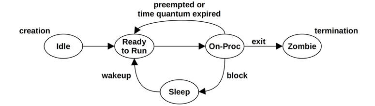
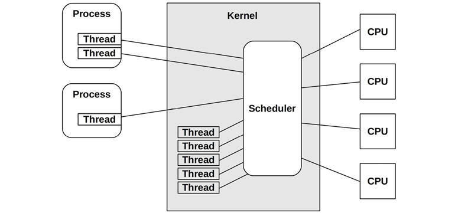

# Chapter 3

## Operating Systems

An understanding of the operating system and its kernel is essential for systems performance analysis. You will frequently need to develop and then test hypotheses about system behavior, such as how system calls are being performed, how the kernel schedules threads on CPUs, how limited memory could be affecting performance, or how a file system processes I/O. These activities will require you to apply your knowledge of the operating system and the kernel.

The learning objectives of this chapter are:

- Learn kernel terminology: context switches, swapping, paging, preemption, etc.
- Understand the role of the kernel and system calls.
- Gain a working knowledge of kernel internals, including: interrupts, schedulers, virtual memory, and the I/O stack.
- See how kernel performance features have been added from Unix to Linux.
- Develop a basic understanding of extended BPF.

This chapter provides an overview of operating systems and kernels and is assumed knowledge for the rest of the book. If you missed operating systems class, you can treat this as a crash course. Keep an eye out for any gaps in your knowledge, as there will be an exam at the end (I’m kidding; it’s just a quiz). For more on kernel internals, see the references at the end of this chapter.

This chapter has three sections:

- **Terminology** lists essential terms.
- **Background** summarizes key operating system and kernel concepts.
- **Kernels** summarizes implementation specifics of Linux and other kernels.

Areas related to performance, including CPU scheduling, memory, disks, file systems, networking, and many specific performance tools, are covered in more detail in the chapters that follow.

### 3.1 Terminology

For reference, here is the core operating system terminology used in this book. Many of these are also concepts that are explained in more detail in this and later chapters.

- **Operating system**: This refers to the software and files that are installed on a system so that it can boot and execute programs. It includes the kernel, administration tools, and system libraries.
- [**Kernel**](gloss.md): The kernel is the program that manages the system, including (depending on the kernel model) hardware devices, memory, and CPU scheduling. It runs in a privileged CPU mode that allows direct access to hardware, called *kernel mode*.
- **Process**: An OS abstraction and environment for executing a program. The program runs in *user mode*, with access to kernel mode (e.g., for performing device I/O) via system calls or traps into the kernel.
- [**Thread**](gloss.md): An executable context that can be scheduled to run on a CPU. The kernel has multiple threads, and a process contains one or more.
- [**Task**](gloss.md): A Linux runnable entity, which can refer to a process (with a single thread), a thread from a multithreaded process, or kernel threads.
- **BPF program**: A kernel-mode program running in the BPF[1](ch03.md) execution environment.
  
  [1](ch03.md)BPF originally stood for Berkeley Packet Filter, but the technology today has so little to do with Berkeley, packets, or filtering that BPF has become a name in itself rather than an acronym.
- **Main memory**: The physical memory of the system (e.g., RAM).
- [**Virtual memory**](gloss.md): An abstraction of main memory that supports multitasking and oversubscription. It is, practically, an infinite resource.
- **Kernel space**: The virtual memory address space for the kernel.
- **User space**: The virtual memory address space for processes.
- **User land**: User-level programs and libraries (/usr/bin, /usr/lib...).
- **Context switch**: A switch from running one thread or process to another. This is a normal function of the kernel CPU scheduler, and involves switching the set of running CPU registers (the thread context) to a new set.
- **Mode switch**: A switch between kernel and user modes.
- **System call (syscall)**: A well-defined protocol for user programs to request the kernel to perform privileged operations, including device I/O.
- **Processor**: Not to be confused with *process*, a processor is a physical chip containing one or more CPUs.
- **Trap**: A signal sent to the kernel to request a system routine (privileged action). Trap types include system calls, processor exceptions, and interrupts.
- **Hardware interrupt**: A signal sent by physical devices to the kernel, usually to request servicing of I/O. An interrupt is a type of trap.

The Glossary includes more terminology for reference if needed for this chapter, including [*address space*](gloss.md), [*buffer*](gloss.md), [*CPU*](gloss.md), [*file descriptor*](gloss.md), [*POSIX*](gloss.md), and [*registers*](gloss.md).

### 3.2 Background

The following sections describe generic operating system and kernel concepts, and will help you understand any operating system. To aid your comprehension, this section includes some Linux implementation details. The next sections, 3.3 Kernels, and 3.4 Linux, focus on Unix, BSD, and Linux kernel implementation specifics.

#### 3.2.1 Kernel

The kernel is the core software of the operating system. What it does depends on the kernel model: Unix-like operating systems including Linux and BSD have a *monolithic* kernel that manages CPU scheduling, memory, file systems, network protocols, and system devices (disks, network interfaces, etc.). This kernel model is shown in [Figure 3.1](ch03.md).


Figure 3.1 Role of a monolithic operating system kernel

Also shown are system libraries, which are often used to provide a richer and easier programming interface than the system calls alone. Applications include all running user-level software, including databases, web servers, administration tools, and operating system shells.

System libraries are pictured here as a broken ring to show that applications can call system calls (*syscalls*) directly.[2](ch03.md) For example, the Golang runtime has its own syscall layer that doesn’t require the system library, libc. Traditionally, this diagram is drawn with complete rings, which reflect decreasing levels of privilege starting with the kernel at the center (a model that originated in Multics [\[Graham 68\]](ch03.md), the predecessor of Unix).

[2](ch03.md)There are some exceptions to this model. Kernel bypass technologies, sometimes used for networking, allow userlevel to access hardware directly (see [Chapter 10](ch10.md), [Network](ch10.md), [Section 10.4.3](ch10.md), [Software](ch10.md), heading Kernel Bypass). I/O to hardware may also be submitted without the expense of the syscall interface (although syscalls are required for initialization), for example, with memory-mapped I/O, major faults (see [Chapter 7](ch07.md), [Memory](ch07.md), [Section 7.2.3](ch07.md), [Demand Paging](ch07.md)), sendfile(2), and Linux io\_uring (see [Chapter 5](ch05.md), [Applications](ch05.md), [Section 5.2.6](ch05.md), [Non-Blocking I/O](ch05.md)).

Other kernel models also exist: *microkernels* employ a small kernel with functionality moved to user-mode programs; and *unikernels* compile kernel and application code together as a single program. There are also *hybrid kernels*, such as the Windows NT kernel, which use approaches from both monolithic kernels and microkernels together. These are summarized in [Section 3.5](ch03.md), [Other Topics](ch03.md).

Linux has recently changed its model by allowing a new software type: Extended BPF, which enables secure kernel-mode applications along with its own kernel API: BPF helpers. This allows some applications and system functions to be rewritten in BPF, providing higher levels of security and performance. This is pictured in [Figure 3.2](ch03.md).


Figure 3.2 BPF applications

Extended BPF is summarized is [Section 3.4.4](ch03.md), [Extended BPF](ch03.md).

##### Kernel Execution

The kernel is a large program, typically millions of lines of code. It primarily executes on demand, when a user-level program makes a system call, or a device sends an interrupt. Some kernel threads operate asynchronously for housekeeping, which may include the kernel clock routine and memory management tasks, but these try to be lightweight and consume very little CPU resources.

Workloads that perform frequent I/O, such as web servers, execute mostly in kernel context. Workloads that are compute-intensive usually run in user mode, uninterrupted by the kernel. It may be tempting to think that the kernel cannot affect the performance of these compute-intensive workloads, but there are many cases where it does. The most obvious is CPU contention, when other threads are competing for CPU resources and the kernel scheduler needs to decide which will run and which will wait. The kernel also chooses which CPU a thread will run on and can choose CPUs with warmer hardware caches or better memory locality for the process, to significantly improve performance.

#### 3.2.2 Kernel and User Modes

The kernel runs in a special CPU mode called *kernel mode*, allowing full access to devices and the execution of privileged instructions. The kernel arbitrates device access to support multitasking, preventing processes and users from accessing each other’s data unless explicitly allowed.

User programs (processes) run in *user mode*, where they request privileged operations from the kernel via system calls, such as for I/O.

Kernel and user mode are implemented on processors using *privilege rings* (or *protection rings*) following the model in [Figure 3.1](ch03.md). For example, x86 processors support four privilege rings, numbered 0 to 3. Typically only two or three are used: for user mode, kernel mode, and the hypervisor if present. Privileged instructions for accessing devices are only allowed in kernel mode; executing them in user mode causes *exceptions*, which are then handled by the kernel (e.g., to generate a permission denied error).

In a traditional kernel, a system call is performed by switching to kernel mode and then executing the system call code. This is shown in [Figure 3.3](ch03.md).


Figure 3.3 System call execution modes

Switching between user and kernel modes is a *mode switch*.

All system calls mode switch. Some system calls also *context switch*: those that are blocking, such as for disk and network I/O, will context switch so that another thread can run while the first is blocked.

Since mode and context switches cost a small amount of overhead (CPU cycles),[3](ch03.md) there are various optimizations to avoid them, including:

[3](ch03.md)With the current mitigation for the Meltdown vulnerability, context switches are now more expensive. See [Section 3.4.3](ch03.md) KPTI (Meltdown).

- **User-mode syscalls**: It is possible to implement some syscalls in a user-mode library alone. The Linux kernel does this by exporting a virtual dynamic shared object (vDSO) that is mapped into the process address space, which contains syscalls such as gettimeofday(2) and getcpu(2) [\[Drysdale 14\]](ch03.md).
- **Memory mappings**: Used for demand paging (see [Chapter 7](ch07.md), [Memory](ch07.md), [Section 7.2.3](ch07.md), [Demand Paging](ch07.md)), it can also be used for data stores and other I/O, avoiding syscall overheads.
- **Kernel bypass**: This allows user-mode programs to access devices directly, bypassing syscalls and the typical kernel code path. For example, DPDK for networking: the Data Plane Development Kit.
- **Kernel-mode applications**: These include the TUX web server [\[Lever 00\]](ch03.md), implemented in-kernel, and more recently the extended BPF technology pictured in [Figure 3.2](ch03.md).

Kernel and user mode have their own software execution contexts, including a stack and registers. Some processor architectures (e.g., SPARC) use a separate address space for the kernel, which means the mode switch must also change the virtual memory context.

#### 3.2.3 System Calls

System calls request the kernel to perform privileged system routines. There are hundreds of system calls available, but some effort is made by kernel maintainers to keep that number as small as possible, to keep the kernel simple (Unix philosophy; \[Thompson 78]). More sophisticated interfaces can be built upon them in user-land as system libraries, where they are easier to develop and maintain. Operating systems generally include a C standard library that provides easier-to-use interfaces for many common syscalls (e.g., the libc or glibc libraries).

Key system calls to remember are listed in [Table 3.1](ch03.md).

Table 3.1 **Key system calls**

**System Call**

**Description**

read(2)

Read bytes

write(2)

Write bytes

open(2)

Open a file

close(2)

Close a file

fork(2)

Create a new process

clone(2)

Create a new process or thread

exec(2)

Execute a new program

connect(2)

Connect to a network host

accept(2)

Accept a network connection

stat(2)

Fetch file statistics

ioctl(2)

Set I/O properties, or other miscellaneous functions

mmap(2)

Map a file to the memory address space

brk(2)

Extend the heap pointer

futex(2)

Fast user-space mutex

System calls are well documented, each having a man page that is usually shipped with the operating system. They also have a generally simple and consistent interface and use error codes to describe errors when needed (e.g., ENOENT for “no such file or directory”).[4](ch03.md)

[4](ch03.md)glibc provides these errors in an errno (error number) integer variable.

Many of these system calls have an obvious purpose. Here are a few whose common usage may be less obvious:

- **ioctl(2)**: This is commonly used to request miscellaneous actions from the kernel, especially for system administration tools, where another (more obvious) system call isn’t suitable. See the example that follows.
- **mmap(2)**: This is commonly used to map executables and libraries to the process address space, and for memory-mapped files. It is sometimes used to allocate the working memory of a process, instead of the brk(2)-based malloc(2), to reduce the syscall rate and improve performance (which doesn’t always work due to the trade-off involved: memory-mapping management).
- **brk(2)**: This is used to extend the heap pointer, which defines the size of the working memory of the process. It is typically performed by a system memory allocation library, when a malloc(3) (memory allocate) call cannot be satisfied from the existing space in the heap. See [Chapter 7](ch07.md), [Memory](ch07.md).
- **futex(2)**: This syscall is used to handle part of a user space lock: the part that is likely to block.

If a system call is unfamiliar, you can learn more in its man page (these are in section 2 of the man pages: syscalls).

The ioctl(2) syscall may be the most difficult to learn, due to its ambiguous nature. As an example of its usage, the Linux perf(1) tool (introduced in [Chapter 6](ch06.md), [CPUs](ch06.md)) performs privileged actions to coordinate performance instrumentation. Instead of system calls being added for each action, a single system call is added: perf\_event\_open(2), which returns a file descriptor for use with ioctl(2). This ioctl(2) can then be called using different arguments to perform the different desired actions. For example, ioctl(fd, PERF\_EVENT\_IOC\_ENABLE) enables instrumentation. The arguments, in this example PERF\_EVENT\_IOC\_ENABLE, can be more easily added and changed by the developer.

#### 3.2.4 Interrupts

An *interrupt* is a signal to the processor that some event has occurred that needs processing, and interrupts the current execution of the processor to handle it. It typically causes the processor to enter kernel mode if it isn’t already, save the current thread state, and then run an *interrupt service routine* (ISR) to process the event.

There are asynchronous interrupts generated by external hardware and synchronous interrupts generated by software instructions. These are pictured in [Figure 3.4](ch03.md).


Figure 3.4 Interrupt types

For simplicity [Figure 3.4](ch03.md) shows all interrupts sent to the kernel for processing; these are sent to the CPU first, which selects the ISR in the kernel to run the event.

##### Asynchronous Interrupts

Hardware devices can send *interrupt service requests* (IRQs) to the processor, which arrive asynchronously to the currently running software. Examples of hardware interrupts include:

- Disk devices signaling the completion of disk I/O
- Hardware indicating a failure condition
- Network interfaces signaling the arrival of a packet
- Input devices: keyboard and mouse input

To explain the concept of asynchronous interrupts, an example scenario is pictured in [Figure 3.5](ch03.md) showing the passage of time as a database (MySQL) running on CPU 0 reads from a file system. The file system contents must be fetched from disk, so the scheduler context switches to another thread (a Java application) while the database is waiting. Sometime later, the disk I/O completes, but at this point the database is no longer running on CPU 0. The completion interrupt has occurred asynchronously to the database, showed by a dotted line in [Figure 3.5](ch03.md).


Figure 3.5 Asynchronous interrupt example

##### Synchronous Interrupts

Synchronous interrupts are generated by software instructions. The following describes different types of software interrupts using the terms *traps*, *exceptions*, and *faults*; however, these terms are often used interchangeably.

- **Traps**: A deliberate call into the kernel, such as by the int (interrupt) instruction. One implementation of syscalls involves calling the int instruction with a vector for a syscall handler (e.g., int 0x80 on Linux x86). int raises a software interrupt.
- **Exceptions**: A exceptional condition, such as by an instruction performing a divide by zero.
- **Faults**: A term often used for memory events, such as *page faults* triggered by accessing a memory location without an MMU mapping. See [Chapter 7](ch07.md), [Memory](ch08.md).

For these interrupts, the responsible software and instruction are still on CPU.

##### Interrupt Threads

Interrupt service routines (ISRs) are designed to operate as quickly as possible, to reduce the effects of interrupting active threads. If an interrupt needs to perform more than a little work, especially if it may block on locks, it can be processed by an interrupt thread that can be scheduled by the kernel. This is pictured in [Figure 3.6](ch03.md).


Figure 3.6 Interrupt processing

How this is implemented depends on the kernel version. On Linux, device drivers can be modeled as two halves, with the top half handling the interrupt quickly, and scheduling work to a bottom half to be processed later [\[Corbet 05\]](ch03.md). Handling the interrupt quickly is important as the top half runs in *interrupt-disabled* mode to postpone the delivery of new interrupts, which can cause latency problems for other threads if it runs for too long. The bottom half can be either *tasklets* or *work queues*; the latter are threads that can be scheduled by the kernel and can sleep when necessary.

Linux network drivers, for example, have a top half to handle IRQs for inbound packets, which calls the bottom half to push the packet up the network stack. The bottom half is implemented as a *softirq* (software interrupt).

The time from an interrupt’s arrival to when it is serviced is the *interrupt latency*, which is dependent on the hardware and implementation. This is a subject of study for real-time or low-latency systems.

##### Interrupt Masking

Some code paths in the kernel cannot be interrupted safely. An example is kernel code that acquires a spin lock during a system call, for a spin lock that might also be needed by an interrupt. Taking an interrupt with such a lock held could cause a deadlock. To prevent such a situation, the kernel can temporarily mask interrupts by setting the CPU’s *interrupt mask* register. The interrupt disabled time should be as short as possible, as it can perturb the timely execution of applications that are woken up by other interrupts. This is an important factor for *real-time* systems—those that have strict response time requirements. Interrupt disabled time is also a target of performance analysis (such analysis is supported directly by the Ftrace irqsoff tracer, mentioned in [Chapter 14](ch14.md), [Ftrace](ch14.md)).

Some high-priority events should not be ignored, and so are implemented as *non-maskable interrupts* (NMIs). For example, Linux can use an Intelligent Platform Management Interface (IPMI) watchdog timer that checks if the kernel appears to have locked up based on a lack of interrupts during a period of time. If so, the watchdog can issue an NMI interrupt to reboot the system.[5](ch03.md)

[5](ch03.md)Linux also has a software NMI watchdog for detecting lockups [\[Linux 20d\]](ch03.md).

#### 3.2.5 Clock and Idle

A core component of the original Unix kernel is the clock() routine, executed from a timer interrupt. It has historically been executed at 60, 100, or 1,000 times per second[6](ch03.md) (often expressed in Hertz: cycles per second), and each execution is called a *tick.*[7](ch03.md) Its functions have included updating the system time, expiring timers and time slices for thread scheduling, maintaining CPU statistics, and executing scheduled kernel routines.

[6](ch03.md)Other rates include 250 for Linux 2.6.13, 256 for Ultrix, and 1,024 for OSF/1 [\[Mills 94\]](ch03.md).

[7](ch03.md)Linux also tracks *jiffies*, a unit of time similar to ticks.

There have been performance issues with the clock, improved in later kernels, including:

- **Tick latency**: For 100 Hertz clocks, up to 10 ms of additional latency may be encountered for a timer as it waits to be processed on the next tick. This has been fixed using high-resolution real-time interrupts so that execution occurs immediately.
- **Tick overhead**: Ticks consume CPU cycles and slightly perturb applications, and are one cause of what is known as *operating system jitter*. Modern processors also have dynamic power features, which can power down parts during idle periods. The clock routine interrupts this idle time, which can consume power needlessly.

Modern kernels have moved much functionality out of the clock routine to on-demand interrupts, in an effort to create a *tickless kernel*. This reduces overhead and improves power efficiency by allowing processors to remain in sleep states for longer.

The Linux clock routine is scheduler\_tick(), and Linux has ways to omit calling the clock while there isn’t any CPU load. The clock itself typically runs at 250 Hertz (configured by the CONFIG\_HZ Kconfig option and variants), and its calls are reduced by the NO\_HZ functionality (configured by CONFIG\_NO\_HZ and variants), which is now commonly enabled [\[Linux 20a\]](ch03.md).

##### Idle Thread

When there is no work for the CPUs to perform, the kernel schedules a placeholder thread that waits for work, called the *idle thread*. A simple implementation would check for the availability of new work in a loop. In modern Linux the *idle task* can call the hlt (halt) instruction to power down the CPU until the next interrupt is received, saving power.

#### 3.2.6 Processes

A process is an environment for executing a user-level program. It consists of a memory address space, file descriptors, thread stacks, and registers. In some ways, a process is like a virtual early computer, where only one program is executing with its own registers and stacks.

Processes are multitasked by the kernel, which typically supports the execution of thousands of processes on a single system. They are individually identified by their *process ID* (PID), which is a unique numeric identifier.

A process contains one or more *threads*, which operate in the process address space and share the same file descriptors. A thread is an executable context consisting of a stack, registers, and an instruction pointer (also called a *program counter*). Multiple threads allow a single process to execute in parallel across multiple CPUs. On Linux, threads and processes are both *tasks*.

The first process launched by the kernel is called “init,” from /sbin/init (by default), with PID 1, which launches user space services. In Unix this involved running start scripts from /etc, a method now referred to as SysV (after Unix System V). Linux distributions now commonly use the systemd software to start services and track their dependencies.

##### Process Creation

Processes are normally created using the fork(2) system call on Unix systems. On Linux, C libraries typically implement the fork function by wrapping around the versatile clone(2) syscall. These syscalls create a duplicate of the process, with its own process ID. The exec(2) system call (or a variant, such as execve(2)) can then be called to begin execution of a different program.

[Figure 3.7](ch03.md) shows an example process creation for a bash shell (`bash`) executing the `ls` command.


Figure 3.7 Process creation

The fork(2) or clone(2) syscall may use a copy-on-write (COW) strategy to improve performance. This adds references to the previous address space rather than copying all of the contents. Once either process modifies the multiple-referenced memory, a separate copy is then made for the modifications. This strategy either defers or eliminates the need to copy memory, reducing memory and CPU usage.

##### Process Life Cycle

The life cycle of a process is shown in [Figure 3.8](ch03.md). This is a simplified diagram; for modern multithreaded operating systems it is the threads that are scheduled and run, and there are some additional implementation details regarding how these map to process states (see [Figures 5.6](ch05.md) and [5.7](ch05.md) in [Chapter 5](ch05.md) for more detailed diagrams).



Figure 3.8 Process life cycle

The on-proc state is for running on a processor (CPU). The ready-to-run state is when the process is runnable but is waiting on a CPU run queue for its turn on a CPU. Most I/O will block, putting the process in the sleep state until the I/O completes and the process is woken up. The zombie state occurs during process termination, when the process waits until its process status has been reaped by the parent process or until it is removed by the kernel.

##### Process Environment

The process environment is shown in [Figure 3.9](ch03.md); it consists of data in the address space of the process and metadata (context) in the kernel.


Figure 3.9 Process environment

The kernel context consists of various process properties and statistics: its process ID (PID), the owner’s user ID (UID), and various times. These are commonly examined via the ps(1) and top(1) commands. It also has a set of file descriptors, which refer to open files and which are (usually) shared between threads.

This example pictures two threads, each containing some metadata, including a priority in kernel context[8](ch03.md) and user stack in the user address space. The diagram is not drawn to scale; the kernel context is very small compared to the process address space.

[8](ch03.md)The kernel context may be its own full address space (as with SPARC processors) or a restricted range that does not overlap with user addresses (as with x86 processors).

The user address space contains memory segments of the process: executable, libraries, and heap. For more details, see [Chapter 7](ch07.md), [Memory](ch07.md).

On Linux, each thread has its own user stack and a kernel exception stack[9](ch03.md) [\[Owens 20\]](ch03.md).

[9](ch03.md)There are also special-purpose kernel stacks per-CPU, including those used for interrupts.

#### 3.2.7 Stacks

A stack is a memory storage area for temporary data, organized as a last-in, first-out (LIFO) list. It is used to store less important data than that which fits in the CPU register set. When a function is called, the return address is saved to the stack. Some registers may be saved to the stack as well if their values are needed after the call.[10](ch03.md) When the called function has finished, it restores any required registers and, by fetching the return address from the stack, passes execution to the calling function. The stack can also be used for passing parameters to functions. The set of data on a stack related to a function’s execution is called a [*stack frame*](gloss.md).

[10](ch03.md)The calling convention from the processor ABI specifies which registers should retain their values after a function call (they are *non-volatile*) and are saved to the stack by the called function (“callee-saves”). Other registers are *volatile* and may be clobbered by the called function; if the caller wishes to retain their values, it must save them to the stack (“caller-saves”).

The call path to the currently executing function can be seen by examining the saved return addresses across all the stack frames in the thread’s stack (a process called *stack walking*).[11](ch03.md) This call path is referred to as a *stack back trace* or a [*stack trace*](gloss.md). In performance engineering it is often called just a “stack” for short. These stacks can answer *why* something is executing, and are an invaluable tool for debugging and performance analysis.

[11](ch03.md)For more detail on stack walking and the different possible techniques (which include: frame-pointer based, debuginfo, last branch record, and ORC) see [Chapter 2](ch02.md), Tech, [Section 2.4](ch02.md), Stack Trace Walking, of *BPF Performance Tools* \[Gregg 19].

##### How to Read a Stack

The following example kernel stack (from Linux) shows the path taken for TCP transmission, as printed by a tracing tool:

[Click here to view code image](ch03_images.md)

```
    tcp_sendmsg+1
    sock_sendmsg+62
    SYSC_sendto+319
    sys_sendto+14
    do_syscall_64+115
    entry_SYSCALL_64_after_hwframe+61
```

Stacks are usually printed in leaf-to-root order, so the first line printed is the function currently executing, and beneath it is its parent, then its grandparent, and so on. In this example, the tcp_ sendmsg() function was executing, called by sock\_sendmsg(). In this stack example, to the right of the function name is the instruction offset, showing the location within a function. The first line shows tcp\_sendmsg() offset 1 (which would be the second instruction), called by sock\_sendmsg() offset 62. This offset is only useful if you desire a low-level understanding of the code path taken, down to the instruction level.

By reading down the stack, the full ancestry can be seen: function, parent, grandparent, and so on. Or, by reading bottom-up, you can follow the path of execution to the current function: how we got here.

Since stacks expose the internal path taken through source code, there is typically no documentation for these functions other than the code itself. For this example stack, this is the Linux kernel source code. An exception to this is where functions are part of an API and are documented.

##### User and Kernel Stacks

While executing a system call, a process thread has two stacks: a user-level stack and a kernel-level stack. Their scope is pictured in [Figure 3.10](ch03.md).


Figure 3.10 User and kernel stacks

The user-level stack of the blocked thread does not change for the duration of a system call, as the thread is using a separate kernel-level stack while executing in kernel context. (An exception to this may be signal handlers, which may borrow a user-level stack depending on their configuration.)

On Linux, there are multiple kernel stacks for different purposes. Syscalls use a kernel exception stack associated with each thread, and there are also stacks associated with soft and hard interrupts (IRQs) [\[Bovet 05\]](ch03.md).

#### 3.2.8 Virtual Memory

Virtual memory is an abstraction of main memory, providing processes and the kernel with their own, almost infinite,[12](ch03.md) private view of main memory. It supports multitasking, allowing processes and the kernel to operate on their own private address spaces without worrying about contention. It also supports oversubscription of main memory, allowing the operating system to transparently map virtual memory between main memory and secondary storage (disks) as needed.

[12](ch03.md)On 64-bit processors, anyway. For 32-bit processors, virtual memory is limited to 4 Gbytes due to the limits of a 32-bit address (and the kernel may limit it to an even smaller amount).

The role of virtual memory is shown in [Figure 3.11](ch03.md). Primary memory is main memory (RAM), and secondary memory is the storage devices (disks).


Figure 3.11 Virtual memory address spaces[13](ch03.md)

[13](ch03.md)Process virtual memory is shown as starting from 0 as a simplification. Kernels today commonly begin a process’s virtual address space at some offset such as 0x10000 or a random address. One benefit is that a common programming error of dereferencing a NULL (0) pointer will then cause the program to crash (SIGSEGV) as the 0 address is invalid. This is generally preferable to dereferencing data at address 0 by mistake, as the program would continue to run with corrupt data.

Virtual memory is made possible by support in both the processor and operating system. It is not real memory, and most operating systems map virtual memory to real memory only on demand, when the memory is first populated (written).

See [Chapter 7](ch07.md), [Memory](ch07.md), for more about virtual memory.

##### Memory Management

While virtual memory allows main memory to be extended using secondary storage, the kernel strives to keep the most active data in main memory. There are two kernel schemes for this:

- **Process swapping** moves entire processes between main memory and secondary storage.
- **Paging** moves small units of memory called [*pages*](gloss.md) (e.g., 4 Kbytes).

Process swapping is the original Unix method and can cause severe performance loss. Paging is more efficient and was added to BSD with the introduction of paged virtual memory. In both cases, least recently used (or not recently used) memory is moved to secondary storage and moved back to main memory only when needed again.

In Linux, the term *swapping* is used to refer to *paging*. The Linux kernel does not support the (older) Unix-style process swapping of entire threads and processes.

For more on paging and swapping, see [Chapter 7](ch07.md), [Memory](ch07.md).

#### 3.2.9 Schedulers

Unix and its derivatives are time-sharing systems, allowing multiple processes to run at the same time by dividing execution time among them. The scheduling of processes on processors and individual CPUs is performed by the *scheduler*, a key component of the operating system kernel. The role of the scheduler is pictured in [Figure 3.12](ch03.md), which shows that the scheduler operates on threads (in Linux, *tasks*), mapping them to CPUs.



Figure 3.12 Kernel scheduler

The basic intent is to divide CPU time among the active processes and threads, and to maintain a notion of *priority* so that more important work can execute sooner. The scheduler keeps track of all threads in the ready-to-run state, traditionally on per-priority queues called *run queues* [\[Bach 86\]](ch03.md). Modern kernels may implement these queues per CPU and may also use other data structures, apart from queues, to track the threads. When more threads want to run than there are available CPUs, the lower-priority threads wait their turn. Most kernel threads run with a higher priority than user-level processes.

Process priority can be modified dynamically by the scheduler to improve the performance of certain workloads. Workloads can be categorized as either:

- **CPU-bound**: Applications that perform heavy compute, for example, scientific and mathematical analysis, which are expected to have long runtimes (seconds, minutes, hours, days, or even longer). These become limited by CPU resources.
- **I/O-bound**: Applications that perform I/O, with little compute, for example, web servers, file servers, and interactive shells, where low-latency responses are desirable. When their load increases, they are limited by I/O to storage or network resources.

A commonly used scheduling policy dating back to UNIX identifies CPU-bound workloads and decreases their priority, allowing I/O-bound workloads—where low-latency responses are more desirable—to run sooner. This can be achieved by calculating the ratio of recent compute time (time executing on-CPU) to real time (elapsed time) and decreasing the priority of processes with a high (compute) ratio \[Thompson 78]. This mechanism gives preference to shorter-running processes, which are usually those performing I/O, including human interactive processes.

Modern kernels support multiple *scheduling classes* or *scheduling policies* (Linux) that apply different algorithms for managing priority and runnable threads. These may include *real-time scheduling*, which uses a priority higher than all noncritical work, including kernel threads. Along with preemption support (described later), real-time scheduling provides predictable and low-latency scheduling for systems that require it.

See [Chapter 6](ch06.md), [CPUs](ch06.md), for more about the kernel scheduler and other scheduling algorithms.

#### 3.2.10 File Systems

File systems are an organization of data as files and directories. They have a file-based interface for accessing them, usually based on the POSIX standard. Kernels support multiple file system types and instances. Providing a file system is one of the most important roles of the operating system, once described as *the* most important role [\[Ritchie 74\]](ch03.md).

The operating system provides a global file namespace, organized as a top-down tree topology starting with the root level (“/”). File systems join the tree by *mounting*, attaching their own tree to a directory (the *mount point*). This allows the end user to navigate the file namespace transparently, regardless of the underlying file system type.

A typical operating system may be organized as shown in [Figure 3.13](ch03.md).


Figure 3.13 Operating system file hierarchy

The top-level directories include `etc` for system configuration files, `usr` for system-supplied user-level programs and libraries, `dev` for device nodes, `var` for varying files including system logs, `tmp` for temporary files, and `home` for user home directories. In the example pictured, `var` and `home` may reside on their own file system instances and separate storage devices; however, they can be accessed like any other component of the tree.

Most file system types use storage devices (disks) to store their contents. Some file system types are dynamically created by the kernel, such as `/proc` and `/dev`.

Kernels typically provide different ways to isolate processes to a portion of the file namespace, including chroot(8), and, on Linux, mount namespaces, commonly used for containers (see [Chapter 11](ch11.md), [Cloud Computing](ch11.md)).

##### VFS

The virtual file system (VFS) is a kernel interface to abstract file system types, originally developed by Sun Microsystems so that the Unix file system (UFS) and the Network file system (NFS) could more easily coexist. Its role is pictured in [Figure 3.14](ch03.md).


Figure 3.14 Virtual file system

The VFS interface makes it easier to add new file system types to the kernel. It also supports providing the global file namespace, pictured earlier, so that user programs and applications can access various file system types transparently.

##### I/O Stack

For storage-device-based file systems, the path from user-level software to the storage device is called the *I/O stack*. This is a subset of the entire software stack shown earlier. A generic I/O stack is shown in [Figure 3.15](ch03.md).

[Figure 3.15](ch03.md) shows a direct path to block devices on the left, bypassing the file system. This path is sometimes used by administrative tools and databases.

File systems and their performance are covered in detail in [Chapter 8](ch08.md), [File Systems](ch08.md), and the storage devices they are built upon are covered in [Chapter 9](ch09.md), [Disks](ch09.md).


Figure 3.15 Generic I/O stack

#### 3.2.11 Caching

Since disk I/O has historically had high latency, many layers of the software stack attempt to avoid it by caching reads and buffering writes. Caches may include those shown in [Table 3.2](ch03.md) (in the order in which they are checked).

Table 3.2 **Example cache layers for disk I/O**

 

**Cache**

**Examples**

1

Client cache

Web browser cache

2

Application cache

—

3

Web server cache

Apache cache

4

Caching server

memcached

5

Database cache

MySQL buffer cache

6

Directory cache

dcache

7

File metadata cache

inode cache

8

Operating system buffer cache

Buffer cache

9

File system primary cache

Page cache, ZFS ARC

10

File system secondary cache

ZFS L2ARC

11

Device cache

ZFS vdev

12

Block cache

Buffer cache

13

Disk controller cache

RAID card cache

14

Storage array cache

—

15

On-disk cache

—

For example, the buffer cache is an area of main memory that stores recently used disk blocks. Disk reads may be served immediately from the cache if the requested block is present, avoiding the high latency of disk I/O.

The types of caches present will vary based on the system and environment.

#### 3.2.12 Networking

Modern kernels provide a stack of built-in network protocols, allowing the system to communicate via the network and take part in distributed system environments. This is referred to as the *networking stack* or the *TCP/IP stack*, after the commonly used TCP and IP protocols. User-level applications access the network through programmable endpoints called *sockets*.

The physical device that connects to the network is the *network interface* and is usually provided on a *network interface card* (NIC). A historical duty of the system administrator was to associate an IP address with a network interface, so that it can communicate with the network; these mappings are now typically automated via the dynamic host configuration protocol (DHCP).

Network protocols do not change often, but there is a new transport protocol seeing growing adoption: QUIC (summarized in [Chapter 10](ch10.md), [Network](ch10.md)). Protocol enhancements and options change more often, such as newer TCP options and TCP congestion control algorithms. Newer protocols and enhancements typically require kernel support (with the exception of user-space protocol implementations). Another change is support for different network interface cards, which require new device drivers for the kernel.

For more on networking and network performance, see [Chapter 10](ch10.md), [Network](ch10.md).

#### 3.2.13 Device Drivers

A kernel must communicate with a wide variety of physical devices. Such communication is achieved using *device drivers*: kernel software for device management and I/O. Device drivers are often provided by the vendors who develop the hardware devices. Some kernels support *pluggable* device drivers, which can be loaded and unloaded without requiring a system restart.

Device drivers can provide *character* and/or *block* interfaces to their devices. Character devices, also called *raw devices*, provide unbuffered sequential access of any I/O size down to a single character, depending on the device. Such devices include keyboards and serial ports (and in original Unix, paper tape and line printer devices).

Block devices perform I/O in units of blocks, which have historically been 512 bytes each. These can be accessed randomly based on their block offset, which begins at 0 at the start of the block device. In original Unix, the block device interface also provided caching of block device buffers to improve performance, in an area of main memory called the *buffer cache*. In Linux, this buffer cache is now part of the page cache.

#### 3.2.14 Multiprocessor

Multiprocessor support allows the operating system to use multiple CPU instances to execute work in parallel. It is usually implemented as *symmetric multiprocessing* (SMP) where all CPUs are treated equally. This was technically difficult to accomplish, posing problems for accessing and sharing memory and CPUs among threads running in parallel. On multiprocessor systems there may also be banks of main memory connected to different sockets (physical processors) in a *non-uniform memory access* (NUMA) architecture, which also pose performance challenges. See [Chapter 6](ch06.md), [CPUs](ch06.md), for details, including scheduling and thread synchronization, and [Chapter 7](ch07.md), [Memory](ch07.md), for details on memory access and architectures.

##### IPIs

For a multiprocessor system, there are times when CPUs need to coordinate, such as for cache coherency of memory translation entries (informing other CPUs that an entry, if cached, is now stale). A CPU can request other CPUs, or all CPUs, to immediately perform such work using an inter-processor interrupt (IPI) (also known as an *SMP call* or a [*CPU cross call*](gloss.md)). IPIs are processor interrupts designed to be executed quickly, to minimize interruption of other threads.

IPIs can also be used by preemption.

#### 3.2.15 Preemption

Kernel preemption support allows high-priority user-level threads to interrupt the kernel and execute. This enables real-time systems that can execute work within a given time constraint, including systems in use by aircraft and medical devices. A kernel that supports preemption is said to be *fully preemptible*, although practically it will still have some small critical code paths that cannot be interrupted.

Another approach supported by Linux is *voluntary kernel preemption*, where logical stopping points in the kernel code can check and perform preemption. This avoids some of the complexity of supporting a fully preemptive kernel and provides low-latency preemption for common workloads. Voluntary kernel preemption is commonly enabled in Linux via the CONFIG\_PREEMPT\_VOLUNTARY Kconfig option; there is also CONFIG\_PREEMPT to allow all kernel code (except critical sections) to be preemptible, and CONFIG\_PREEMPT\_NONE to disable preemption, improving throughput at the cost of higher latencies.

#### 3.2.16 Resource Management

The operating system may provide various configurable controls for fine-tuning access to system resources, such as CPUs, memory, disk, and the network. These are *resource controls* and can be used to manage performance on systems that run different applications or host multiple tenants (cloud computing). Such controls may impose fixed limits per process (or groups of processes) for resource usage, or a more flexible approach—allowing spare usage to be shared among them.

Early versions of Unix and BSD had basic per-process resource controls, including CPU priorities with nice(1), and some resource limits with ulimit(1).

For Linux, control groups (cgroups) have been developed and integrated in Linux 2.6.24 (2008), and various additional controls have been added since then. These are documented in the kernel source under Documentation/cgroups. There is also an improved unified hierarchical scheme called *cgroup v2*, made available in Linux 4.5 (2016) and documented in Documentation/admin-guide/cgroup-v2.rst.

Specific resource controls are mentioned in later chapters as appropriate. An example use case is described in [Chapter 11](ch11.md), [Cloud Computing](ch11.md), for managing the performance of OS-virtualized tenants.

#### 3.2.17 Observability

The operating system consists of the kernel, libraries, and programs. These programs include tools to observe system activity and analyze performance, typically installed in /usr/bin and /usr/sbin. Third-party tools may also be installed on the system to provide additional observability.

Observability tools, and the operating system components upon which they are built, are introduced in [Chapter 4](ch04.md).

### 3.3 Kernels

The following sections discuss Unix-like kernel implementation details with a focus on performance. As background, the performance features of earlier kernels are discussed: Unix, BSD, and Solaris. The Linux kernel is discussed in more detail in [Section 3.4](ch03.md), [Linux](ch03.md).

Kernel differences can include the file systems they support (see [Chapter 8](ch08.md), [File Systems](ch08.md)), the system call (syscall) interfaces, network stack architecture, real-time support, and scheduling algorithms for CPUs, disk I/O, and networking.

[Table 3.3](ch03.md) shows Linux and other kernel versions for comparison, with syscall counts based on the number of entries in section 2 of the OS man pages. This is a crude comparison, but enough to see some differences.

Table 3.3 **Kernel versions with documented syscall counts**

**Kernel Version**

**Syscalls**

UNIX Version 7

48

SunOS (Solaris) 5.11

142

FreeBSD 12.0

222

Linux 2.6.32-21-server

408

Linux 2.6.32-220.el6.x86\_64

427

Linux 3.2.6-3.fc16.x86\_64

431

Linux 4.15.0-66-generic

480

Linux 5.3.0-1010-aws

493

These are just the syscalls with documentation; more are usually provided by the kernel for private use by operating system software.

UNIX had twenty system calls at the very first, and today Linux—which is a direct descendant—has over a thousand . . . I just worry about the complexity and the size of things that grow.

Ken Thompson, ACM Turing Centenary Celebration, 2012

Linux is growing in complexity and exposing this complexity to user-land by adding new system calls or through other kernel interfaces. Extra complexity makes learning, programming, and debugging more time-consuming.

#### 3.3.1 Unix

Unix was developed by Ken Thompson, Dennis Ritchie, and others at AT&amp;T Bell Labs during 1969 and the years that followed. Its exact origin was described in *The UNIX Time-Sharing System* \[Ritchie 74]:

The first version was written when one of us (Thompson), dissatisfied with the available computer facilities, discovered a little-used PDP-7 and set out to create a more hospitable environment.

The developers of UNIX had previously worked on the Multiplexed Information and Computer Services (Multics) operating system. UNIX was developed as a *lightweight* multitasked operating system and kernel, originally named UNiplexed Information and Computing Service (UNICS), as a pun on Multics. From *UNIX Implementation* [\[Thompson 78\]](ch03.md):

The kernel is the only UNIX code that cannot be substituted by a user to his own liking. For this reason, the kernel should make as few real decisions as possible. This does not mean to allow the user a million options to do the same thing. Rather, it means to allow only one way to do one thing, but have that way be the least-common divisor of all the options that might have been provided.

While the kernel was small, it did provide some features for high performance. Processes had scheduler priorities, reducing run-queue latency for higher-priority work. Disk I/O was performed in large (512-byte) blocks for efficiency and cached in an in-memory per-device buffer cache. Idle processes could be swapped out to storage, allowing busier processes to run in main memory. And the system was, of course, multitasking—allowing multiple processes to run concurrently, improving job throughput.

To support networking, multiple file systems, paging, and other features we now consider standard, the kernel had to grow. And with multiple derivatives, including BSD, SunOS (Solaris), and later Linux, kernel performance became competitive, which drove the addition of more features and code.

#### 3.3.2 BSD

The Berkeley Software Distribution (BSD) OS began as enhancements to Unix 6th Edition at the University of California, Berkeley, and was first released in 1978. As the original Unix code required an AT&amp;T software license, by the early 1990s this Unix code had been rewritten in BSD under a new BSD license, allowing free distributions including FreeBSD.

Major BSD kernel developments, especially performance-related, include:

- **Paged virtual memory**: BSD brought paged virtual memory to Unix: instead of swapping out entire processes to free main memory, smaller least-recently-used chunks of memory could be moved (paged). See [Chapter 7](ch07.md), [Memory](ch07.md), [Section 7.2.2](ch07.md), [Paging](ch07.md).
- **Demand paging**: This defers the mapping of physical memory to virtual memory to when it is first written, avoiding an early and sometimes unnecessary performance and memory cost for pages that may never be used. Demand paging was brought to Unix by BSD. See [Chapter 7](ch07.md), [Memory](ch07.md), [Section 7.2.2](ch07.md), [Paging](ch07.md).
- **FFS**: The Berkeley Fast File System (FFS) grouped disk allocation into cylinder groups, greatly reducing fragmentation and improving performance on rotational disks, as well as supporting larger disks and other enhancements. FFS became the basis for many other file systems, including UFS. See [Chapter 8](ch08.md), [File Systems](ch08.md), [Section 8.4.5](ch08.md), [File System Types](ch08.md).
- **TCP/IP network stack**: BSD developed the first high-performance TCP/IP network stack for Unix, included in 4.2BSD (1983). BSD is still known for its performant network stack.
- **Sockets**: Berkeley sockets are an API for connection endpoints. Included in 4.2BSD, they have become a standard for networking. See [Chapter 10](ch10.md), [Network](ch10.md).
- **Jails**: Lightweight OS-level virtualization, allowing multiple guests to share one kernel. Jails were first released in FreeBSD 4.0.
- **Kernel TLS**: As transport layer security (TLS) is now commonly used on the Internet, kernel TLS moves much of TLS processing to the kernel, improving performance[14](ch03.md) [\[Stewart 15\]](ch03.md).

[14](ch03.md)Developed to improve the performance of the Netflix FreeBSD open connect appliances (OCAs) that are the Netflix CDN.

While not as popular as Linux, BSD is used for some performance-critical environments, including for the Netflix content delivery network (CDN), as well as file servers from NetApp, Isilon, and others. Netflix summarized FreeBSD performance on its CDN in 2019 as [\[Looney 19\]](ch03.md):

“Using FreeBSD and commodity parts, we achieve 90 Gb/s serving TLS-encrypted connections with ~55% CPU on a 16-core 2.6-GHz CPU.”

There is an excellent reference on the internals of FreeBSD, from the same publisher that brings you this book: *The Design and Implementation of the FreeBSD Operating System,* 2nd Edition [\[McKusick 15\]](ch03.md).

#### 3.3.3 Solaris

Solaris is a Unix and BSD-derived kernel and OS created by Sun Microsystems in 1982. It was originally named SunOS and optimized for Sun workstations. By the late 1980s, AT&amp;T developed a new Unix standard, Unix System V Release 4 (SVR4) based on technologies from SVR3, SunOS, BSD, and Xenix. Sun created a new kernel based on SVR4, and rebranded the OS under the name Solaris.

Major Solaris kernel developments, especially performance-related, include:

- [**VFS**](gloss.md): The virtual file system (VFS) is an abstraction and interface that allows multiple file systems to easily coexist. Sun initially created it so that NFS and UFS could coexist. VFS is covered in [Chapter 8](ch08.md), [File Systems](ch08.md).
- **Fully preemptible kernel**: This provided low latency for high-priority work, including real-time work.
- **Multiprocessor support**: In the early 1990s, Sun invested heavily in multiprocessor operating system support, developing kernel support for both asymmetric and symmetric multiprocessing (ASMP and SMP) [\[Mauro 01\]](ch03.md).
- **Slab allocator**: Replacing the SVR4 buddy allocator, the kernel slab memory allocator provided better performance via per-CPU caches of preallocated buffers that could be quickly reused. This allocator type, and its derivatives, has become the standard for kernels including Linux.
- **DTrace**: A static and dynamic tracing framework and tool providing virtually unlimited observability of the entire software stack, in real time and in production. Linux has BPF and bpftrace for this type of observability.
- **Zones**: An OS-based virtualization technology for creating OS instances that share one kernel, similar to the earlier FreeBSD jails technology. OS virtualization is now in widespread use as Linux containers. See [Chapter 11](ch11.md), [Cloud Computing](ch11.md).
- [**ZFS**](gloss.md): A file system with enterprise-level features and performance. It is now available for other OSes, including Linux. See [Chapter 8](ch08.md), [File Systems](ch08.md).

Oracle purchased Sun Microsystems in 2010, and Solaris is now called Oracle Solaris. Solaris is covered in more detail in the first edition of this book.

### 3.4 Linux

Linux was created in 1991 by Linus Torvalds as a free operating system for Intel personal computers. He announced the project in a Usenet post:

I’m doing a (free) operating system (just a hobby, won’t be big and professional like gnu) for 386(486) AT clones. This has been brewing since April, and is starting to get ready. I’d like any feedback on things people like/dislike in minix, as my OS resembles it somewhat (same physical layout of the file-system (due to practical reasons) among other things).

This refers to the MINIX operating system, which was being developed as a free and small (mini) version of Unix for small computers. BSD was also aiming to provide a free Unix version although at the time it had legal troubles.

The Linux kernel was developed taking general ideas from many ancestors, including:

- **Unix (and Multics)**: Operating system layers, system calls, multitasking, processes, process priorities, virtual memory, global file system, file system permissions, device nodes, buffer cache
- [**BSD**](gloss.md): Paged virtual memory, demand paging, fast file system (FFS), TCP/IP network stack, sockets
- [**Solaris**](gloss.md): VFS, NFS, page cache, unified page cache, slab allocator
- **Plan 9**: Resource forks (rfork), for creating different levels of sharing between processes and threads (*tasks*)

Linux now sees widespread use for servers, cloud instances, and embedded devices including mobile phones.

#### 3.4.1 Linux Kernel Developments

Linux kernel developments, especially those related to performance, include the following (many of these descriptions include the Linux kernel version where they were first introduced):

- **CPU scheduling classes**: Various advanced CPU scheduling algorithms have been developed, including scheduling domains (2.6.7) to make better decisions regarding non-uniform memory access (NUMA). See [Chapter 6](ch06.md), [CPUs](ch06.md).
- **I/O scheduling classes**: Different block I/O scheduling algorithms have been developed, including deadline (2.5.39), anticipatory (2.5.75), and completely fair queueing (CFQ) (2.6.6). These are available in kernels up to Linux 5.0, which removed them to support only newer multi-queue I/O schedulers. See [Chapter 9](ch09.md), [Disks](ch09.md).
- **TCP congestion algorithms**: Linux allows different TCP congestion control algorithms to be configured, and supports Reno, Cubic, and more in later kernels mentioned in this list. See also [Chapter 10](ch10.md), [Network](ch10.md).
- **Overcommit**: Along with the out-of-memory (OOM) killer, this is a strategy for doing more with less main memory. See [Chapter 7](ch07.md), [Memory](ch07.md).
- **Futex** (2.5.7): Short for *fast user-space mutex*, this is used to provide high-performing user-level synchronization primitives.
- **Huge pages** (2.5.36): This provides support for preallocated large memory pages by the kernel and the memory management unit (MMU). See [Chapter 7](ch07.md), [Memory](ch07.md).
- **OProfile** (2.5.43): A system profiler for studying CPU usage and other events, for both the kernel and applications.
- [**RCU**](gloss.md) (2.5.43): The kernel provides a read-copy update synchronization mechanism that allows multiple reads to occur concurrently with updates, improving performance and scalability for data that is mostly read.
- **epoll** (2.5.46): A system call for efficiently waiting for I/O across many open file descriptors, which improves the performance of server applications.
- **Modular I/O scheduling** (2.6.10): Linux provides pluggable scheduling algorithms for scheduling block device I/O. See [Chapter 9](ch09.md), [Disks](ch09.md).
- **DebugFS** (2.6.11): A simple unstructured interface for the kernel to expose data to user level, which is used by some performance tools.
- **Cpusets** (2.6.12): exclusive CPU grouping for processes.
- **Voluntary kernel preemption** (2.6.13): This process provides low-latency scheduling without the complexity of full preemption.
- **inotify** (2.6.13): A framework for monitoring file system events.
- **blktrace** (2.6.17): A framework and tool for tracing block I/O events (later migrated into tracepoints).
- **splice** (2.6.17): A system call to move data quickly between file descriptors and pipes, without a trip through user-space. (The sendfile(2) syscall, which efficiently moves data between file descriptors, is now a wrapper to splice(2).)
- **Delay accounting** (2.6.18): Tracks per-task delay states. See [Chapter 4](ch04.md), [Observability Tools](ch04.md).
- **IO accounting** (2.6.20): Measures various storage I/O statistics per process.
- **DynTicks** (2.6.21): Dynamic ticks allow the kernel timer interrupt (clock) to not fire during idle, saving CPU resources and power.
- **SLUB** (2.6.22): A new and simplified version of the slab memory allocator.
- **CFS** (2.6.23): Completely fair scheduler. See [Chapter 6](ch06.md), [CPUs](ch06.md).
- **cgroups** (2.6.24): Control groups allow resource usage to be measured and limited for groups of processes.
- **TCP LRO** (2.6.24): TCP Large Receive Offload (LRO) allows network drivers and hardware to aggregate packets into larger sizes before sending them to the network stack. Linux also supports Large Send Offload (LSO) for the send path.
- **latencytop** (2.6.25): Instrumentation and a tool for observing sources of latency in the operating system.
- [**Tracepoints**](gloss.md) (2.6.28): Static kernel tracepoints (aka *static probes*) that instrument logical execution points in the kernel, for use by tracing tools (previously called *kernel markers*). Tracing tools are introduced in [Chapter 4](ch04.md), [Observability Tools](ch04.md).
- **perf** (2.6.31): Linux Performance Events (perf) is a set of tools for performance observability, including CPU performance counter profiling and static and dynamic tracing. See [Chapter 6](ch06.md), [CPUs](ch06.md), for an introduction.
- **No BKL** (2.6.37): Final removal of the big kernel lock (BKL) performance bottleneck.
- **Transparent huge pages** (2.6.38): This is a framework to allow easy use of huge (large) memory pages. See [Chapter 7](ch07.md), [Memory](ch07.md).
- **KVM**: The Kernel-based Virtual Machine (KVM) technology was developed for Linux by Qumranet, which was purchased by Red Hat in 2008. KVM allows virtual operating system instances to be created, running their own kernel. See [Chapter 11](ch11.md), [Cloud Computing](ch11.md).
- **BPF JIT** (3.0): A Just-In-Time (JIT) compiler for the Berkeley Packet Filter (BPF) to improve packet filtering performance by compiling BPF bytecode to native instructions.
- **CFS bandwidth control** (3.2): A CPU scheduling algorithm that supports CPU quotas and throttling.
- **TCP anti-bufferbloat** (3.3+): Various enhancements were made from Linux 3.3 onwards to combat the bufferbloat problem, including Byte Queue Limits (BQL) for the transmission of packet data (3.3), CoDel queue management (3.5), TCP small queues (3.6), and the Proportional Integral controller Enhanced (PIE) packet scheduler (3.14).
- [**uprobes**](gloss.md) (3.5): The infrastructure for dynamic tracing of user-level software, used by other tools (perf, SystemTap, etc.).
- **TCP early retransmit** (3.5): RFC 5827 for reducing duplicate acknowledgments required to trigger fast retransmit.
- **TFO** (3.6, 3.7, 3.13): TCP Fast Open (TFO) can reduce the TCP three-way handshake to a single SYN packet with a TFO cookie, improving performance. It was made the default in 3.13.
- **NUMA balancing** (3.8+): This added ways for the kernel to automatically balance memory locations on multi-NUMA systems, reducing CPU interconnect traffic and improving performance.
- **SO\_REUSEPORT** (3.9): A socket option to allow multiple listener sockets to bind to the same port, improving multi-threaded scalability.
- **SSD cache devices** (3.9): Device mapper support for an SSD device to be used as a cache for a slower rotating disk.
- **bcache** (3.10): An SSD cache technology for the block interface.
- **TCP TLP** (3.10): TCP Tail Loss Probe (TLP) is a scheme to avoid costly timer-based retransmits by sending new data or the last unacknowledged segment after a shorter probe timeout, to trigger faster recovery.
- **NO\_HZ\_FULL** (3.10, 3.12): Also known as *timerless multitasking* or a *tickless kernel*, this allows non-idle threads to run without clock ticks, avoiding workload perturbations [\[Corbet 13a\]](ch03.md).
- **Multiqueue block I/O** (3.13): This provides per-CPU I/O submission queues rather than a single request queue, improving scalability especially for high IOPS SSD devices [\[Corbet 13b\]](ch03.md).
- **SCHED\_DEADLINE** (3.14): An optional scheduling policy that implements earliest deadline first (EDF) scheduling [\[Linux 20b\]](ch03.md).
- **TCP autocorking** (3.14): This allows the kernel to coalesce small writes, reducing the sent packets. An automatic version of the TCP\_CORK setsockopt(2).
- **MCS locks and qspinlocks** (3.15): Efficient kernel locks, using techniques such as per-CPU structures. MCS is named after the original lock inventors (Mellor-Crummey and Scott) [\[Mellor-Crummey 91\]](ch03.md)[\[Corbet 14\]](ch03.md).
- **Extended BPF** (3.18+): An in-kernel execution environment for running secure kernel-mode programs. The bulk of extended BPF was added in the 4.x series. Support for attached to kprobes was added in 3.19, to tracepoints in 4.7, to software and hardware events in 4.9, and to cgroups in 4.10. Bounded loops were added in 5.3, which also increased the instruction limit to allow complex applications. See [Section 3.4.4](ch03.md), [Extended BPF](ch03.md).
- **Overlayfs** (3.18): A union mount file system included in Linux. It creates virtual file systems on top of others, which can also be modified without changing the first. Often used for containers.
- **DCTCP** (3.18): The Data Center TCP (DCTCP) congestion control algorithm, which aims to provide high burst tolerance, low latency, and high throughput [\[Borkmann 14a\]](ch03.md).
- **DAX** (4.0): Direct Access (DAX) allows user space to read from persistent-memory storage devices directly, without buffer overheads. ext4 can use DAX.
- **Queued spinlocks** (4.2): Offering better performance under contention, these became the default spinlock kernel implementation in 4.2.
- **TCP lockless listener** (4.4): The TCP listener fast path became lockless, improving performance.
- **cgroup v2** (4.5, 4.15): A unified hierarchy for cgroups was in earlier kernels, and considered stable and exposed in 4.5, named cgroup v2 [\[Heo 15\]](ch03.md). The cgroup v2 CPU controller was added in 4.15.
- **epoll scalability** (4.5): For multithreaded scalability, epoll(7) avoids waking up all threads that are waiting on the same file descriptors for each event, which caused a thundering-herd performance issue [\[Corbet 15\]](ch03.md).
- **KCM** (4.6): The Kernel Connection Multiplexor (KCM) provides an efficient message-based interface over TCP.
- **TCP NV** (4.8): New Vegas (NV) is a new TCP congestion control algorithm suited for high-bandwidth networks (those that run at 10+ Gbps).
- **XDP** (4.8, 4.18): eXpress Data Path (XDP) is a BPF-based programmable fast path for high-performance networking [\[Herbert 16\]](ch03.md). An AF\_XDP socket address family that can bypass much of the network stack was added in 4.18.
- **TCP BBR** (4.9): Bottleneck Bandwidth and RTT (BBR) is a TCP congestion control algorithm that provides improved latency and throughput over networks suffering packet loss and bufferbloat [\[Cardwell 16\]](ch03.md).
- **Hardware latency tracer** (4.9): An Ftrace tracer that can detect system latency caused by hardware and firmware, including system management interrupts (SMIs).
- **perf c2c** (4.10): The cache-to-cache (c2c) perf subcommand can help identify CPU cache performance issues, including false sharing.
- **Intel CAT** (4.10): Support for Intel Cache Allocation Technology (CAT) allowing tasks to have dedicated CPU cache space. This can be used by containers to help with the noisy neighbor problem.
- **Multiqueue I/O schedulers: BPQ, Kyber** (4.12): The Budget Fair Queueing (BFQ) multiqueue I/O scheduler provides low latency I/O for interactive applications, especially for slower storage devices. BFQ was significantly improved in 5.2. The Kyber I/O scheduler is suited for fast multiqueue devices [\[Corbet 17\]](ch03.md).
- **Kernel TLS** (4.13, 4.17): Linux version of kernel TLS [\[Edge 15\]](ch03.md).
- **MSG\_ZEROCOPY** (4.14): A send(2) flag to avoid extra copies of packet bytes between an application and the network interface [\[Linux 20c\]](ch03.md).
- [**PCID**](gloss.md) (4.14): Linux added support for process-context ID (PCID), a processor MMU feature to help avoid TLB flushes on context switches. This reduced the performance cost of the kernel page table isolation (KPTI) patches needed to mitigate the meltdown vulnerability. See [Section 3.4.3](ch03.md), [KPTI (Meltdown)](ch03.md).
- **PSI** (4.20, 5.2): Pressure stall information (PSI) is a set of new metrics to show time spent stalled on CPU, memory, or I/O. PSI threshold notifications were added in 5.2 to support PSI monitoring.
- **TCP EDT** (4.20): The TCP stack switched to Early Departure Time (EDT): This uses a timing-wheel scheduler for sending packets, providing better CPU efficiency and smaller queues [\[Jacobson 18\]](ch03.md).
- **Multi-queue I/O** (5.0): Multi-queue block I/O schedulers became the default in 5.0, and classic schedulers were removed.
- **UDP GRO** (5.0): UDP Generic Receive Offload (GRO) improves performance by allowing packets to be aggregated by the driver and card and passed up stack.
- **io\_uring** (5.1): A generic asynchronous interface for fast communication between applications and the kernel, making use of shared ring buffers. Primary uses include fast disk and network I/O.
- **MADV\_COLD, MADV\_PAGEOUT** (5.4): These madvise(2) flags are hints to the kernel that memory is needed but not anytime soon. MADV\_PAGEOUT is also a hint that memory can be reclaimed immediately. These are especially useful for memory-constrained embedded Linux devices.
- **MultiPath TCP** (5.6): Multiple network links (e.g., 3G and WiFi) can be used to improve the performance and reliability of a single TCP connection.
- **Boot-time tracing** (5.6): Allows Ftrace to trace the early boot process. (systemd can provide timing information on the late boot process: see [Section 3.4.2](ch03.md), [systemd](ch03.md).)
- **Thermal pressure** (5.7): The scheduler accounts for thermal throttling to make better placement decisions.
- **perf flame graphs** (5.8): perf(1) support for the flame graph visualization.

Not listed here are the many small performance improvements for locking, drivers, VFS, file systems, asynchronous I/O, memory allocators, NUMA, new processor instruction support, GPUs, and the performance tools perf(1) and Ftrace. System boot time has also been improved by the adoption of systemd.

The following sections describe in more detail three Linux topics important to performance: systemd, KPTI, and extended BPF.

#### 3.4.2 systemd

systemd is a commonly used service manager for Linux, developed as a replacement for the original UNIX init system. systemd has various features including dependency-aware service startup and service time statistics.

An occasional task in systems performance is to tune the system’s boot time, and the systemd time statistics can show where to tune. The overall boot time can be reported using systemd-analyze(1):

[Click here to view code image](ch03_images.md)

```
# systemd-analyze
Startup finished in 1.657s (kernel) + 10.272s (userspace) = 11.930s
graphical.target reached after 9.663s in userspace
```

This output shows that the system booted (reached the graphical.target in this case) in 9.663 seconds. More information can be seen using the `critical-chain` subcommand:

[Click here to view code image](ch03_images.md)

```
# systemd-analyze critical-chain
The time when unit became active or started is printed after the "@" character.
The time the unit took to start is printed after the "+" character.

graphical.target @9.663s
└─multi-user.target @9.661s
  └─snapd.seeded.service @9.062s +62ms
    └─basic.target @6.336s
      └─sockets.target @6.334s
        └─snapd.socket @6.316s +16ms
          └─sysinit.target @6.281s
            └─cloud-init.service @5.361s +905ms
              └─systemd-networkd-wait-online.service @3.498s +1.860s
                └─systemd-networkd.service @3.254s +235ms
                  └─network-pre.target @3.251s
                    └─cloud-init-local.service @2.107s +1.141s
                      └─systemd-remount-fs.service @391ms +81ms
                        └─systemd-journald.socket @387ms
                          └─system.slice @366ms
                            └─-.slice @366ms
```

This output shows the *critical path*: the sequence of steps (in this case, services) that causes the latency. The slowest service was `systemd-networkd-wait-online.service`, taking 1.86 seconds to start.

There are other useful subcommands: `blame` shows the slowest initialization times, and `plot` produces an SVG diagram. See the man page for systemd-analyze(1) for more information.

#### 3.4.3 KPTI (Meltdown)

The kernel page table isolation (KPTI) patches added to Linux 4.14 in 2018 are a mitigation for the Intel processor vulnerability called “meltdown.” Older Linux kernel versions had KAISER patches for a similar purpose, and other kernels have employed mitigations as well. While these work around the security issue, they also reduce processor performance due to extra CPU cycles and additional TLB flushing on context switches and syscalls. Linux added process-context ID (PCID) support in the same release, which allows some TLB flushes to be avoided, provided the processor supports pcid.

I evaluated the performance impact of KPTI as between 0.1% and 6% for Netflix cloud production workloads, depending on the workload’s syscall rate (higher costs more) [\[Gregg 18a\]](ch03.md). Additional tuning will further reduce the cost: the use of huge pages so that a flushed TLB warms up faster, and using tracing tools to examine syscalls to identify ways to reduce their rate. A number of such tracing tools are implemented using extended BPF.

#### 3.4.4 Extended BPF

BPF stands for Berkeley Packet Filter, an obscure technology first developed in 1992 that improved the performance of packet capture tools [\[McCanne 92\]](ch03.md). In 2013, Alexei Starovoitov proposed a major rewrite of BPF [\[Starovoitov 13\]](ch03.md), which was further developed by himself and Daniel Borkmann and included in the Linux kernel in 2014 [\[Borkmann 14b\]](ch03.md). This turned BPF into a general-purpose execution engine that can be used for a variety of things, including networking, observability, and security.

BPF itself is a flexible and efficient technology composed of an instruction set, storage objects (maps), and helper functions. It can be considered a virtual machine due to its virtual instruction set specification. BPF programs run in kernel mode (as pictured earlier in [Figure 3.2](ch03.md)) and are configured to run on events: socket events, tracepoints, USDT probes, kprobes, uprobes, and perf\_events. These are shown in [Figure 3.16](ch03.md).


Figure 3.16 BPF components

BPF bytecode must first pass through a verifier that checks for safety, ensuring that the BPF program will not crash or corrupt the kernel. It may also use a BPF Type Format (BTF) system for understanding data types and structures. BPF programs can output data via a perf ring buffer, an efficient way to emit per-event data, or via maps, which are suited for statistics.

Because it is powering a new generation of efficient, safe, and advanced tracing tools, BPF is important for systems performance analysis. It provides programmability to existing kernel event sources: tracepoints, kprobes, uprobes, and perf\_events. A BPF program can, for example, record a timestamp on the start and end of I/O to time its duration, and record this in a custom histogram. This book contains many BPF-based programs using the BCC and bpftrace front-ends. These front-ends are covered in [Chapter 15](ch15.md).

### 3.5 Other Topics

Some additional kernel and operating system topics worth summarizing are PGO kernels, Unikernels, microkernels, hybrid kernels, and distributed operating systems.

#### 3.5.1 PGO Kernels

Profile-guided optimization (PGO), also known as feedback-directed optimization (FDO), uses CPU profile information to improve compiler decisions [\[Yuan 14a\]](ch03.md). This can be applied to kernel builds, where the procedure is:

1. While in production, take a CPU profile.
2. Recompile the kernel based on that CPU profile.
3. Deploy the new kernel in production.

This creates a kernel with improved performance for a specific workload. Runtimes such as the JVM do this automatically, recompiling Java methods based on their runtime performance, in conjunction with just-in-time (JIT) compilation. The process for creating a PGO kernel instead involves manual steps.

A related compile optimization is link-time optimization (LTO), where an entire binary is compiled at once to allow optimizations across the entire program. The Microsoft Windows kernel makes heavy use of both LTO and PGO, seeing 5 to 20% improvements from PGO [\[Bearman 20\]](ch03.md). Google also use LTO and PGO kernels to improve performance [\[Tolvanen 20\]](ch03.md).

The gcc and clang compilers, and the Linux kernel, all have support for PGO. Kernel PGO typically involves running a specially instrumented kernel to collect profile data. Google has released an AutoFDO tool that bypasses the need for such a special kernel: AutoFDO allows a profile to be collected from a normal kernel using perf(1), which is then converted to the correct format for compilers to use [\[Google 20a\]](ch03.md).

The only recent documentation on building a Linux kernel with PGO or AutoFDO is two talks from Linux Plumber’s Conference 2020 by Microsoft [\[Bearman 20\]](ch03.md) and Google [\[Tolvanen 20\]](ch03.md).[15](ch03.md)

[15](ch03.md)For a while the most recent documentation was from 2014 for Linux 3.13 [\[Yuan 14b\]](ch03.md), hindering adoption on newer kernels.

#### 3.5.2 Unikernels

A unikernel is a single-application machine image that combines kernel, library, and application software together, and can typically run this in a single address space in either a hardware VM or on bare metal. This potentially has performance and security benefits: less instruction text means higher CPU cache hit ratios and fewer security vulnerabilities. This also creates a problem: there may be no SSH, shells, or performance tools available for you to log in and debug the system, nor any way to add them.

For unikernels to be performance tuned in production, new performance tooling and metrics must be built to support them. As a proof of concept, I built a rudimentary CPU profiler that ran from Xen dom0 to profile a domU unikernel guest and then built a CPU flame graph, just to show that it was possible [\[Gregg 16a\]](ch03.md).

Examples of unikernels include MirageOS [\[MirageOS 20\]](ch03.md).

#### 3.5.3 Microkernels and Hybrid Kernels

Most of this chapter discusses Unix-like kernels, also described as *monolithic kernels*, where all the code that manages devices runs together as a single large kernel program. For the *microkernel* model, kernel software is kept to a minimum. A microkernel supports essentials such as memory management, thread management, and inter-process communication (IPC). File systems, the network stack, and drivers are implemented as user-mode software, which allows those user-mode components to be more easily modified and replaced. Imagine not only choosing which database or web server to install, but also choosing which network stack to install. The microkernel is also more fault-tolerant: a crash in a driver does not crash the entire kernel. Examples of microkernels include QNX and Minix 3.

A disadvantage with microkernels is that there are additional IPC steps for performing I/O and other functions, reducing performance. One solution for this is *hybrid kernels*, which combine the benefits of microkernels and monolithic kernels. Hybrid kernels move performance-critical services back into kernel space (with direct function calls instead of IPC) as they are with a monolithic kernel, but retains the modular design and fault tolerance of a micro kernel. Examples of hybrid kernels include the Windows NT kernel and the Plan 9 kernel.

#### 3.5.4 Distributed Operating Systems

A distributed operating system runs a single operating system instance across a set of separate computer nodes, networked together. A microkernel is commonly used on each of the nodes. Examples of distributed operating systems include Plan 9 from Bell Labs, and the Inferno operating system.

While an innovative design, this model has not seen widespread use. Rob Pike, co-creator of Plan 9 and Inferno, has described various reasons for this, including [\[Pike 00\]](ch03.md):

“There was a claim in the late 1970s and early 1980s that Unix had killed operating systems research because no one would try anything else. At the time, I didn’t believe it. Today, I grudgingly accept that the claim may be true (Microsoft notwithstanding).”

On the cloud, today’s common model for scaling compute nodes is to load-balance across a group of identical OS instances, which may scale in response to load (see [Chapter 11](ch11.md), [Cloud Computing](ch11.md), [Section 11.1.3](ch11.md), [Capacity Planning](ch11.md)).

### 3.6 Kernel Comparisons

Which kernel is fastest? This will depend partly on the OS configuration and workload and how much the kernel is involved. In general, I expect that Linux will outperform other kernels due to its extensive work on performance improvements, application and driver support, and widespread use and the large community who discover and report performance issues. The top 500 supercomputers, as tracked by the TOP500 list since 1993, became 100% Linux in 2017 [\[TOP500 17\]](ch03.md). There will be some exceptions; for example, Netflix uses Linux on the cloud and FreeBSD for its CDN.[16](ch03.md)

[16](ch03.md)FreeBSD delivers higher performance for the Netflix CDN workload, especially due to kernel improvements made by the Netflix OCA team. This is routinely tested, most recently during 2019 with a production comparison of Linux 5.0 versus FreeBSD, which I helped analyze.

Kernel performance is commonly compared using micro-benchmarks, and this is error-prone. Such benchmarks may discover that one kernel is much faster at a particular syscall, but that syscall is not used in the production workload. (Or it is used, but with certain flags not tested by the microbenchmark, which greatly affect performance.) Comparing kernel performance accurately is a task for a senior performance engineer—a task that can take weeks. See [Chapter 12](ch12.md), [Benchmarking](ch12.md), [Section 12.3.2](ch12.md), [Active Benchmarking](ch12.md), as a methodology to follow.

In the first edition of this book, I concluded this section by noting that Linux did not have a mature dynamic tracer, without which you might miss out on large performance wins. Since that first edition, I have moved to a full-time Linux performance role, and I helped develop the dynamic tracers that Linux was missing: BCC and bpftrace, based on extended BPF. These are covered in [Chapter 15](ch15.md) and in my previous book [\[Gregg 19\]](ch03.md).

[Section 3.4.1](ch03.md), [Linux Kernel Developments](ch03.md), lists many other Linux performance developments that have occurred in the time between the first edition and this edition, spanning kernel versions 3.1 and 5.8. A major development not listed earlier is that OpenZFS now supports Linux as its primary kernel, providing a high-performance and mature file system option on Linux.

With all this Linux development, however, comes complexity. There are so many performance features and tunables on Linux that it has become laborious to configure and tune them for each workload. I have seen many deployments running untuned. Bear this in mind when comparing kernel performance: has each kernel been tuned? Later chapters of this book, and their tuning sections, can help you remedy this.

### 3.7 Exercises

1. Answer the following questions about OS terminology:
   
   - What is the difference between a process, a thread, and a task?
   - What is a mode switch and a context switch?
   - What is the difference between paging and process swapping?
   - What is the difference between I/O-bound and CPU-bound workloads?
2. Answer the following conceptual questions:
   
   - Describe the role of the kernel.
   - Describe the role of system calls.
   - Describe the role of VFS and its location in the I/O stack.
3. Answer the following deeper questions:
   
   - List the reasons why a thread would leave the current CPU.
   - Describe the advantages of virtual memory and demand paging.

### 3.8 References

**\[Graham 68]** Graham, B., “Protection in an Information Processing Utility,” *Communications of the ACM*, May 1968.

**\[Ritchie 74]** Ritchie, D. M., and Thompson, K., “The UNIX Time-Sharing System,” *Communications of the ACM* 17, no. 7, pp. 365–75, July 1974.

**\[Thompson 78]** Thompson, K., *UNIX Implementation*, Bell Laboratories, 1978.

**\[Bach 86]** Bach, M. J., *The Design of the UNIX Operating System*, Prentice Hall, 1986.

**\[Mellor-Crummey 91]** Mellor-Crummey, J. M., and Scott, M., “Algorithms for Scalable Synchronization on Shared-Memory Multiprocessors,” *ACM Transactions on Computing Systems*, Vol. 9, No. 1, [https://www.cs.rochester.edu/u/scott/papers/1991\_TOCS\_synch.pdf](https://www.cs.rochester.edu/u/scott/papers/1991_TOCS_synch.pdf), 1991.

**\[McCanne 92]** McCanne, S., and Jacobson, V., “The BSD Packet Filter: A New Architecture for User-Level Packet Capture”, *USENIX Winter Conference*, 1993.

**\[Mills 94]** Mills, D., “RFC 1589: A Kernel Model for Precision Timekeeping,” *Network Working Group*, 1994.

**\[Lever 00]** Lever, C., Eriksen, M. A., and Molloy, S. P., “An Analysis of the TUX Web Server,” *CITI Technical Report 00-8*, [http://www.citi.umich.edu/techreports/reports/citi-tr-00-8.pdf](http://www.citi.umich.edu/techreports/reports/citi-tr-00-8.pdf), 2000.

**\[Pike 00]** Pike, R., “Systems Software Research Is Irrelevant,” [http://doc.cat-v.org/bell\_labs/utah2000/utah2000.pdf](http://doc.cat-v.org/bell_labs/utah2000/utah2000.pdf), 2000.

**\[Mauro 01]** Mauro, J., and McDougall, R., *Solaris Internals: Core Kernel Architecture*, Prentice Hall, 2001.

**\[Bovet 05]** Bovet, D., and Cesati, M., *Understanding the Linux Kernel*, 3rd Edition, O’Reilly, 2005.

**\[Corbet 05]** Corbet, J., Rubini, A., and Kroah-Hartman, G., *Linux Device Drivers*, 3rd Edition, O’Reilly, 2005.

**\[Corbet 13a]** Corbet, J., “Is the whole system idle?” *LWN.net*, [https://lwn.net/Articles/558284](https://lwn.net/Articles/558284), 2013.

**\[Corbet 13b]** Corbet, J., “The multiqueue block layer,” *LWN.net*, [https://lwn.net/Articles/552904](https://lwn.net/Articles/552904), 2013.

**\[Starovoitov 13]** Starovoitov, A., “\[PATCH net-next] extended BPF,” *Linux kernel mailing list*, [https://lkml.org/lkml/2013/9/30/627](https://lkml.org/lkml/2013/9/30/627), 2013.

**\[Borkmann 14a]** Borkmann, D., “net: tcp: add DCTCP congestion control algorithm,” [https://git.kernel.org/pub/scm/linux/kernel/git/torvalds/linux.git/commit/?id=e3118e8359bb7c59555aca60c725106e6d78c5ce](https://git.kernel.org/pub/scm/linux/kernel/git/torvalds/linux.git/commit/?id=e3118e8359bb7c59555aca60c725106e6d78c5ce), 2014.

**\[Borkmann 14b]** Borkmann, D., “\[PATCH net-next 1/9] net: filter: add jited flag to indicate jit compiled filters,” *netdev mailing list*, https://lore.kernel.org/netdev/1395404418-25376-1-git-send-email-dborkman@redhat.com/T, 2014.

**\[Corbet 14]** Corbet, J., “MCS locks and qspinlocks,” *LWN.net*, [https://lwn.net/Articles/590243](https://lwn.net/Articles/590243), 2014.

**\[Drysdale 14]** Drysdale, D., “Anatomy of a system call, part 2,” *LWN.net*, [https://lwn.net/Articles/604515](https://lwn.net/Articles/604515), 2014.

**\[Yuan 14a]** Yuan, P., Guo, Y., and Chen, X., “Experiences in Profile-Guided Operating System Kernel Optimization,” *APSys*, 2014.

**\[Yuan 14b]** Yuan P., Guo, Y., and Chen, X., “Profile-Guided Operating System Kernel Optimization,” [http://coolypf.com](http://coolypf.com), 2014.

**\[Corbet 15]** Corbet, J., “Epoll evolving,” LWN*.net*, [https://lwn.net/Articles/633422](https://lwn.net/Articles/633422), 2015.

**\[Edge 15]** Edge, J., “TLS in the kernel,” *LWN.net*, [https://lwn.net/Articles/666509](https://lwn.net/Articles/666509), 2015.

**\[Heo 15]** Heo, T., “Control Group v2,” *Linux documentation*, [https://www.kernel.org/doc/Documentation/cgroup-v2.txt](https://www.kernel.org/doc/Documentation/cgroup-v2.txt), 2015.

**\[McKusick 15]** McKusick, M. K., Neville-Neil, G. V., and Watson, R. N. M., *The Design and Implementation of the FreeBSD Operating System*, 2nd Edition, Addison-Wesley, 2015.

**\[Stewart 15]** Stewart, R., Gurney, J. M., and Long, S., “Optimizing TLS for High-Bandwidth Applicationsin FreeBSD,” *AsiaBSDCon*, [https://people.freebsd.org/~rrs/asiabsd\_2015\_tls.pdf](https://people.freebsd.org/~rrs/asiabsd_2015_tls.pdf), 2015.

**\[Cardwell 16]** Cardwell, N., Cheng, Y., Stephen Gunn, C., Hassas Yeganeh, S., and Jacobson, V., “BBR: Congestion-Based Congestion Control,” *ACM queue*, [https://queue.acm.org/detail.cfm?id=3022184](https://queue.acm.org/detail.cfm?id=3022184), 2016.

**\[Gregg 16a]** Gregg, B., “Unikernel Profiling: Flame Graphs from dom0,” [http://www.brendangregg.com/blog/2016-01-27/unikernel-profiling-from-dom0.html](http://www.brendangregg.com/blog/2016-01-27/unikernel-profiling-from-dom0.html), 2016.

**\[Herbert 16]** Herbert, T., and Starovoitov, A., “eXpress Data Path (XDP): Programmable and High Performance Networking Data Path,” [https://github.com/iovisor/bpf-docs/raw/master/Express\_Data\_Path.pdf](https://github.com/iovisor/bpf-docs/raw/master/Express_Data_Path.pdf), 2016.

**\[Corbet 17]** Corbet, J., “Two new block I/O schedulers for 4.12,” *LWN.net*, [https://lwn.net/Articles/720675](https://lwn.net/Articles/720675), 2017.

**\[TOP500 17]** TOP500, “List Statistics,” [https://www.top500.org/statistics/list](https://www.top500.org/statistics/list), 2017.

**\[Gregg 18a]** Gregg, B., “KPTI/KAISER Meltdown Initial Performance Regressions,” [http://www.brendangregg.com/blog/2018-02-09/kpti-kaiser-meltdown-performance.html](http://www.brendangregg.com/blog/2018-02-09/kpti-kaiser-meltdown-performance.html), 2018.

**\[Jacobson 18]** Jacobson, V., “Evolving from AFAP: Teaching NICs about Time,” *netdev 0x12*, [https://netdevconf.info/0x12/session.html?evolving-from-afap-teaching-nics-about-time](https://netdevconf.info/0x12/session.html?evolving-from-afap-teaching-nics-about-time), 2018.

**\[Gregg 19]** Gregg, B., *BPF Performance Tools: Linux System and Application Observability*, Addison-Wesley, 2019.

**\[Looney 19]** Looney, J., “Netflix and FreeBSD: Using Open Source to Deliver Streaming Video,” *FOSDEM*, [https://papers.freebsd.org/2019/fosdem/looney-netflix\_and\_freebsd](https://papers.freebsd.org/2019/fosdem/looney-netflix_and_freebsd), 2019.

**\[Bearman 20]** Bearman, I., “Exploring Profile Guided Optimization of the Linux Kernel,” *Linux Plumber’s Conference*, [https://linuxplumbersconf.org/event/7/contributions/771](https://linuxplumbersconf.org/event/7/contributions/771), 2020.

**\[Google 20a]** Google, “AutoFDO,” [https://github.com/google/autofdo](https://github.com/google/autofdo), accessed 2020.

**\[Linux 20a]** “NO\_HZ: Reducing Scheduling-Clock Ticks,” *Linux documentation*, [https://www.kernel.org/doc/html/latest/timers/no\_hz.html](https://www.kernel.org/doc/html/latest/timers/no_hz.html), accessed 2020.

**\[Linux 20b]** “Deadline Task Scheduling,” *Linux documentation*, [https://www.kernel.org/doc/Documentation/scheduler/sched-deadline.rst](https://www.kernel.org/doc/Documentation/scheduler/sched-deadline.rst), accessed 2020.

**\[Linux 20c]** “MSG\_ZEROCOPY,” *Linux documentation*, [https://www.kernel.org/doc/html/latest/networking/msg\_zerocopy.html](https://www.kernel.org/doc/html/latest/networking/msg_zerocopy.html), accessed 2020.

**\[Linux 20d]** “Softlockup Detector and Hardlockup Detector (aka nmi\_watchdog),” *Linux documentation*, [https://www.kernel.org/doc/html/latest/admin-guide/lockup-watchdogs.html](https://www.kernel.org/doc/html/latest/admin-guide/lockup-watchdogs.html), accessed 2020.

**\[MirageOS 20]** MirageOS, “Mirage OS,” [https://mirage.io](https://mirage.io), accessed 2020.

**\[Owens 20]** Owens, K., et al., “4. Kernel Stacks,” *Linux documentation*, [https://www.kernel.org/doc/html/latest/x86/kernel-stacks.html](https://www.kernel.org/doc/html/latest/x86/kernel-stacks.html), accessed 2020.

**\[Tolvanen 20]** Tolvanen, S., Wendling, B., and Desaulniers, N., “LTO, PGO, and AutoFDO in the Kernel,” *Linux Plumber’s Conference*, [https://linuxplumbersconf.org/event/7/contributions/798](https://linuxplumbersconf.org/event/7/contributions/798), 2020.

#### 3.8.1 Additional Reading

Operating systems and their kernels is a fascinating and extensive topic. This chapter summarized only the essentials. In addition to the sources mentioned in this chapter, the following are also excellent references, applicable to Linux-based operating systems and others:

**\[Goodheart 94]** Goodheart, B., and Cox J., *The Magic Garden Explained: The Internals of UNIX System V Release 4, an Open Systems Design*, Prentice Hall, 1994.

**\[Vahalia 96]** Vahalia, U., *UNIX Internals: The New Frontiers*, Prentice Hall, 1996.

**\[Singh 06]** Singh, A., *Mac OS X Internals: A Systems Approach*, Addison-Wesley, 2006.

**\[McDougall 06b]** McDougall, R., and Mauro, J., *Solaris Internals: Solaris 10 and OpenSolaris Kernel Architecture*, Prentice Hall, 2006.

**\[Love 10]** Love, R., *Linux Kernel Development*, 3rd Edition, Addison-Wesley, 2010.

**\[Tanenbaum 14]** Tanenbaum, A., and Bos, H., *Modern Operating Systems*, 4th Edition, Pearson, 2014.

**\[Yosifovich 17]** Yosifovich, P., Ionescu, A., Russinovich, M. E., and Solomon, D. A., *Windows Internals, Part 1 (Developer Reference)*, 7th Edition, Microsoft Press, 2017.
