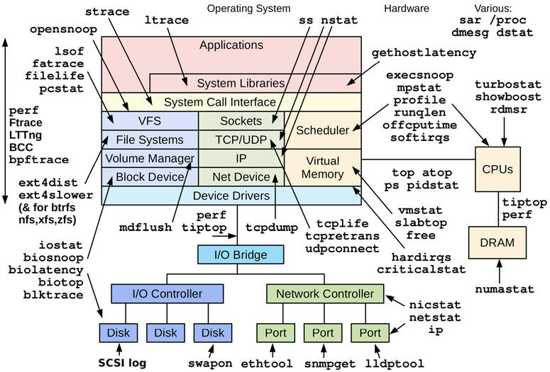
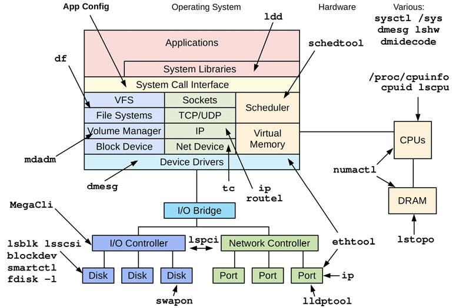
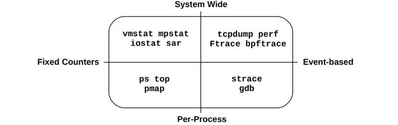
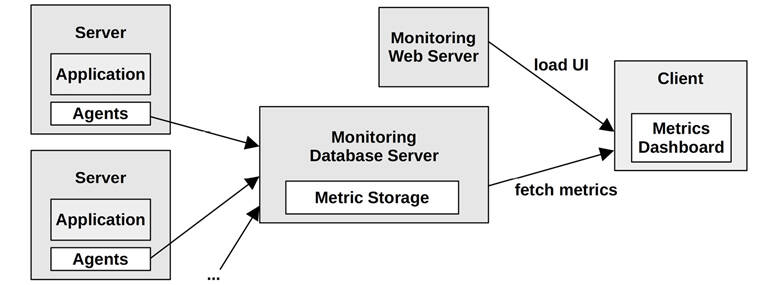
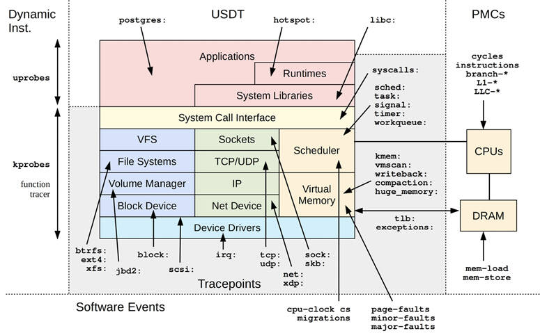
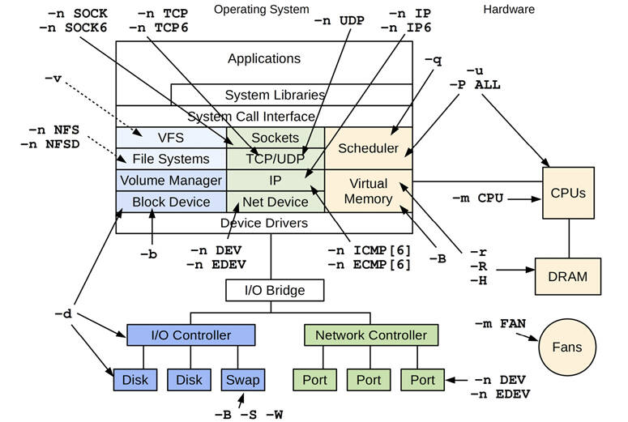
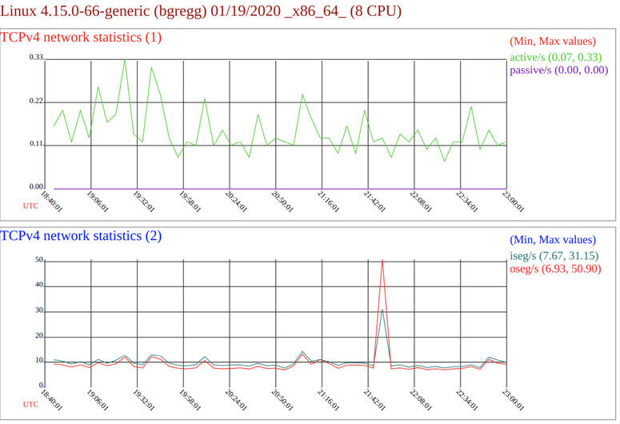

# Chapter 4

## Observability Tools

Operating systems have historically provided many tools for observing system software and hardware components. To the newcomer, the wide range of available tools and metrics suggested that everything—or at least everything important—could be observed. In reality there were many gaps, and systems performance experts became skilled in the art of inference and interpretation: figuring out activity from indirect tools and statistics. For example, network packets could be examined individually (sniffing), but disk I/O could not (at least, not easily).

Observability has greatly improved in Linux thanks to the rise of dynamic tracing tools, including the BPF-based BCC and bpftrace. Dark corners are now illuminated, including individual disk I/O using biosnoop(8). However, many companies and commercial monitoring products have not yet adopted system tracing, and are missing out on the insight it brings. I have led the way by developing, publishing, and explaining new tracing tools, tools already in use by companies such as Netflix and Facebook.

The learning objectives of this chapter are:

- Identify static performance tools and crisis tools.
- Understand tool types and their overhead: counters, profiling, and tracing.
- Learn about observability sources, including: /proc, /sys, tracepoints, kprobes, uprobes, USDT, and PMCs.
- Learn how to configure sar(1) for archiving statistics.

In [Chapter 1](ch01.md) I introduced different types of observability: counters, profiling, and tracing, as well as static and dynamic instrumentation. This chapter explains observability tools and their data sources in detail, including a summary of sar(1), the system activity reporter, and an introduction to tracing tools. This gives you the essentials for understanding Linux observability; later chapters ([6](ch06.md) to [11](ch11.md)) use these tools and sources to solve specific issues. [Chapters 13](ch13.md) to [15](ch15.md) cover the tracers in depth.

This chapter uses the Ubuntu Linux distribution as an example; most of these tools are the same across other Linux distributions, and some similar tools exist for other kernels and operating systems where these tools originated.

### 4.1 Tool Coverage

[Figure 4.1](ch04.md) shows an operating system diagram that I have annotated with the Linux workload observability tools[1](ch04.md) relevant to each component.

[1](ch04.md)When teaching performance classes in the mid-2000s, I would draw my own kernel diagram on a whiteboard and annotate it with the different performance tools and what they observed. I found it an effective way for explaining tool coverage as a form of mental map. I’ve since published digital versions of these, which adorn cubicle walls around the world. You can download them on my website [\[Gregg 20a\]](ch04.md).



Figure 4.1 Linux workload observability tools

Most of these tools focus on a particular resource, such as CPU, memory, or disks, and are covered in a later chapter dedicated to that resource. There are some multi-tools that can analyze many areas, and they are introduced later in this chapter: perf, Ftrace, BCC, and bpftrace.

#### 4.1.1 Static Performance Tools

There is another type of observability that examines attributes of the system at rest rather than under active workload. This was described as the *static performance tuning* methodology in [Chapter 2](ch02.md), [Methodologies](ch02.md), [Section 2.5.17](ch02.md), [Static Performance Tuning](ch02.md), and these tools are shown in [Figure 4.2](ch04.md).



Figure 4.2 Linux static performance tuning tools

Remember to use the tools in [Figure 4.2](ch04.md) to check for issues with configuration and components. Sometimes performance issues are simply due to a misconfiguration.

#### 4.1.2 Crisis Tools

When you have a production performance crisis that requires various performance tools to debug it, you might find that none of them are installed. Worse, since the server is suffering a performance issue, installing the tools may take much longer than usual, prolonging the crisis.

For Linux, [Table 4.1](ch04.md) lists the recommended installation packages or source repositories that provide these *crisis tools*. Package names for Ubuntu/Debian are shown in this table (these package names may vary for different Linux distributions).

Table 4.1 **Linux crisis tool packages**

**Package**

**Provides**

procps

ps(1), vmstat(8), uptime(1), top(1)

util-linux

dmesg(1), lsblk(1), lscpu(1)

sysstat

iostat(1), mpstat(1), pidstat(1), sar(1)

iproute2

ip(8), ss(8), nstat(8), tc(8)

numactl

numastat(8)

linux-tools-common linux-tools-$(uname -r)

perf(1), turbostat(8)

bcc-tools (aka bpfcc-tools)

opensnoop(8), execsnoop(8), runqlat(8), runqlen(8), softirqs(8), hardirqs(8), ext4slower(8), ext4dist(8), biotop(8), biosnoop(8), biolatency(8), tcptop(8), tcplife(8), trace(8), argdist(8), funccount(8), stackcount(8), profile(8), and many more

bpftrace

bpftrace, basic versions of opensnoop(8), execsnoop(8), runqlat(8), runqlen(8), biosnoop(8), biolatency(8), and more

perf-tools-unstable

Ftrace versions of opensnoop(8), execsnoop(8), iolatency(8), iosnoop(8), bitesize(8), funccount(8), kprobe(8)

trace-cmd

trace-cmd(1)

nicstat

nicstat(1)

ethtool

ethtool(8)

tiptop

tiptop(1)

msr-tools

rdmsr(8), wrmsr(8)

github.com/brendangregg/msr-cloud-tools

showboost(8), cpuhot(8), cputemp(8)

github.com/brendangregg/pmc-cloud-tools

pmcarch(8), cpucache(8), icache(8), tlbstat(8), resstalls(8)

Large companies, such as Netflix, have OS and performance teams who ensure that production systems have all of these packages installed. A default Linux distribution may only have procps and util-linux installed, so all the others must be added.

In container environments, it may be desirable to create a privileged debugging container that has full access to the system[2](ch04.md) and all tools installed. The image for this container can be installed on container hosts and deployed when needed.

[2](ch04.md)It could also be configured to share namespaces with a target container to analyze.

Adding tool packages is often not enough: kernel and user-space software may also need to be configured to support these tools. Tracing tools typically require certain kernel CONFIG options to be enabled, such as CONFIG\_FTRACE and CONFIG\_BPF. Profiling tools typically require software to be configured to support stack walking, either by using frame-pointer compiled versions of all software (including system libraries: libc, libpthread, etc.) or debuginfo packages installed to support dwarf stack walking. If your company has yet to do this, you should check that each performance tool works and fix those that do not before they are urgently needed in a crisis.

The following sections explain performance observability tools in more detail.

### 4.2 Tool Types

A useful categorization for observability tools is whether they provide *system-wide* or *per-process* observability, and whether they are based on counters or *events*. These attributes are shown in [Figure 4.3](ch04.md), along with Linux tool examples.



Figure 4.3 Observability tool types

Some tools fit in more than one quadrant; for example, top(1) also has a system-wide summary, and system-wide event tools can often filter for a particular process (`-p PID`).

Event-based tools include profilers and tracers*.* Profilers observe activity by taking a series of snapshots on events, painting a coarse picture of the target. Tracers instrument every event of interest, and may perform processing on them, for example to generate customized counters. Counters, tracing, and profiling were introduced in [Chapter 1](ch01.md).

The following sections describe Linux tools that use fixed counters, tracing, and profiling, as well as those that perform monitoring (metrics).

#### 4.2.1 Fixed Counters

Kernels maintain various counters for providing system statistics. They are usually implemented as unsigned integers that are incremented when events occur. For example, there are counters for the number of network packets received, disk I/O issued, and interrupts that occurred. These are exposed by monitoring software as *metrics* (see [Section 4.2.4](ch04.md), [Monitoring](ch04.md)).

A common kernel approach is to maintain a pair of cumulative counters: one to count events and the other to record the total time in the event. These provide the count of events directly and the average time (or latency) in the event, by dividing the total time by the count. Since they are cumulative, by reading the pair at a time interval (e.g., one second) the delta can be calculated, and from that the per-second count and average latency. This is how many system statistics are calculated.

Performance-wise, counters are considered “free” to use since they are enabled by default and maintained continually by the kernel. The only additional cost when using them is the act of reading their values from user-space (which should be negligible). The following example tools read these system-wide or per process.

##### System-Wide

These tools examine system-wide activity in the context of system software or hardware resources, using kernel counters. Linux tools include:

- **vmstat(8)**: Virtual and physical memory statistics, system-wide
- **mpstat(1)**: Per-CPU usage
- **iostat(1)**: Per-disk I/O usage, reported from the block device interface
- **nstat(8)**: TCP/IP stack statistics
- **sar(1)**: Various statistics; can also archive them for historical reporting

These tools are typically viewable by all users on the system (non-root). Their statistics are also commonly graphed by monitoring software.

Many follow a usage convention where they accept an optional *interval* and *count*, for example, vmstat(8) with an interval of one second and an output count of three:

[Click here to view code image](ch04_images.md)

```
$ vmstat 1 3
procs -----------memory---------- ---swap-- -----io---- -system-- ------cpu-----
 r  b   swpd   free   buff  cache   si   so    bi    bo   in   cs us sy id wa st
 4  0 1446428 662012 142100 5644676    1    4    28   152   33    1 29  8 63  0  0
 4  0 1446428 665988 142116 5642272    0    0     0   284 4957 4969 51  0 48  0  0
 4  0 1446428 685116 142116 5623676    0    0     0     0 4488 5507 52  0 48  0  0
```

The first line of output is the summary-since-boot, which shows averages for the entire time the system has been up. The subsequent lines are the one-second interval summaries, showing current activity. At least, this is the intent: this Linux version mixes summary-since-boot and current values for the first line (the memory columns are current values; vmstat(8) is explained in [Chapter 7](ch07.md)).

##### Per-Process

These tools are process-oriented and use counters that the kernel maintains for each process. Linux tools include:

- **ps(1):** Shows process status, shows various process statistics, including memory and CPU usage.
- **top(1):** Shows top processes, sorted by CPU usage or another statistic.
- **pmap(1):** Lists process memory segments with usage statistics.

These tools typically read statistics from the /proc file system.

#### 4.2.2 Profiling

Profiling characterizes the target by collecting a set of samples or snapshots of its behavior. CPU usage is a common target of profiling, where timer-based samples are taken of the instruction pointer or stack trace to characterize CPU-consuming code paths. These samples are usually collected at a fixed rate, such as 100 Hz (cycles per second) across all CPUs, and for a short duration such as one minute. Profiling tools, or *profilers*, often use 99 Hz instead of 100 Hz to avoid sampling in lockstep with target activity, which could lead to over- or undercounting.

Profiling can also be based on untimed hardware events, such as CPU hardware cache misses or bus activity. It can show which code paths are responsible, information that can especially help developers optimize their code for memory usage.

Unlike fixed counters, profiling (and tracing) are typically only enabled on an as-needed basis, since they can cost some CPU overhead to collect, and storage overhead to store. The magnitudes of these overheads depend on the tool and the rate of events it instruments. Timer-based profilers are generally safer: the event rate is known, so its overhead can be predicted, and the event rate can be selected to have negligible overhead.

##### System-Wide

System-wide Linux profilers include:

- **perf(1)**: The standard Linux profiler, which includes profiling subcommands.
- **profile(8)**: A BPF-based CPU profiler from the BCC repository (covered in [Chapter 15](ch15.md), [BPF](ch15.md)) that frequency counts stack traces in kernel context.
- **Intel VTune Amplifier XE**: Linux and Windows profiling, with a graphical interface including source browsing.

These can also be used to target a single process.

##### Per-Process

Process-oriented profilers include:

- **gprof(1)**: The GNU profiling tool, which analyzes profiling information added by compilers (e.g., `gcc -pg`).
- **cachegrind**: A tool from the valgrind toolkit, can profile hardware cache usage (and more) and visualize profiles using kcachegrind.
- **Java Flight Recorder (JFR)**: Programming languages often have their own special-purpose profilers that can inspect language context. For example, JFR for Java.

See [Chapter 6](ch06.md), [CPUs](ch06.md), and [Chapter 13](ch13.md), [perf](ch13.md), for more about profiling tools.

#### 4.2.3 Tracing

Tracing instruments every occurrence of an event, and can store event-based details for later analysis or produce a summary. This is similar to profiling, but the intent is to collect or inspect all events, not just a sample. Tracing can incur higher CPU and storage overheads than profiling, which can slow the target of tracing. This should be taken into consideration, as it may negatively affect the production workload, and measured timestamps may also be skewed by the tracer. As with profiling, tracing is typically only used as needed.

*Logging*, where infrequent events such as errors and warnings are written to a log file for later reading, can be thought of as low-frequency tracing that *is* enabled by default. Logs include the system log.

The following are examples of system-wide and per-process tracing tools.

##### System-Wide

These tracing tools examine system-wide activity in the context of system software or hardware resources, using kernel tracing facilities. Linux tools include:

- **tcpdump(8)**: Network packet tracing (uses libpcap)
- **biosnoop(8)**: Block I/O tracing (uses BCC or bpftrace)
- **execsnoop(8)**: New processes tracing (uses BCC or bpftrace)
- **perf(1)**: The standard Linux profiler, can also trace events
- **`perf trace`** : A special perf subcommand that traces system calls system-wide
- **Ftrace**: The Linux built-in tracer
- [**BCC**](gloss.md): A BPF-based tracing library and toolkit
- **bpftrace**: A BPF-based tracer (bpftrace(8)) and toolkit

perf(1), Ftrace, BCC, and bpftrace are introduced in [Section 4.5](ch04.md), [Tracing Tools](ch04.md), and covered in detail in [Chapters 13](ch13.md) to [15](ch15.md). There are over one hundred tracing tools built using BCC and bpftrace, including biosnoop(8) and execsnoop(8) from this list. More examples are provided throughout this book.

##### Per-Process

These tracing tools are process-oriented, as are the operating system frameworks on which they are based. Linux tools include:

- **strace(1)**: System call tracing
- **gdb(1)**: A source-level debugger

The debuggers can examine per-event data, but they must do so by stopping and starting the execution of the target. This can come with an enormous overhead cost, making them unsuitable for production use.

System-wide tracing tools such as perf(1) and bpftrace support filters for examining a single process and can operate with much lower overhead, making them preferred where available.

#### 4.2.4 Monitoring

Monitoring was introduced in [Chapter 2](ch02.md), [Methodologies](ch02.md). Unlike the tool types covered previously, monitoring records statistics continuously in case they are later needed.

##### sar(1)

A traditional tool for monitoring a single operating system host is the System Activity Reporter, sar(1), originating from AT&amp;T Unix. sar(1) is counter-based and has an agent that executes at scheduled times (via cron) to record the state of system-wide counters. The sar(1) tool allows these to be viewed at the command line, for example:

[Click here to view code image](ch04_images.md)

```
# sar
Linux 4.15.0-66-generic (bgregg)  12/21/2019        _x86_64_        (8 CPU)

12:00:01 AM     CPU     %user     %nice   %system   %iowait    %steal     %idle
12:05:01 AM     all      3.34      0.00      0.95      0.04      0.00     95.66
12:10:01 AM     all      2.93      0.00      0.87      0.04      0.00     96.16
12:15:01 AM     all      3.05      0.00      1.38      0.18      0.00     95.40
12:20:01 AM     all      3.02      0.00      0.88      0.03      0.00     96.06
[...]
Average:        all      0.00      0.00      0.00      0.00      0.00      0.00
```

By default, sar(1) reads its statistics archive (if enabled) to print recent historical statistics. You can specify an optional interval and count for it to examine current activity at the rate specified.

sar(1) can record dozens of different statistics to provide insight into CPU, memory, disks, networking, interrupts, power usage, and more. It is covered in more detail in [Section 4.4](ch04.md), [sar](ch04.md).

Third-party monitoring products are often built on sar(1) or the same observability statistics it uses, and expose these metrics over the network.

##### SNMP

The traditional technology for network monitoring is the Simple Network Management Protocol (SNMP). Devices and operating systems can support SNMP and in some cases provide it by default, avoiding the need to install third-party agents or exporters. SNMP includes many basic OS metrics, although it has not been extended to cover modern applications. Most environments have been switching to custom agent-based monitoring instead.

##### Agents

Modern monitoring software runs agents (also known as *exporters* or *plugins*) on each system to record kernel and application metrics. These can include agents for specific applications and targets, for example, the MySQL database server, the Apache Web Server, and the Memcached caching system. Such agents can provide detailed application request metrics that are not available from system counters alone.

Monitoring software and agents for Linux include:

- **Performance Co-Pilot (PCP)**: PCP supports dozens of different agents (called Performance Metric Domain Agents: PMDAs), including for BPF-based metrics [\[PCP 20\]](ch04.md).
- **Prometheus**: The Prometheus monitoring software supports dozens of different exporters, for databases, hardware, messaging, storage, HTTP, APIs, and logging [\[Prometheus 20\]](ch04.md).
- **collectd**: Supports dozens of different plugins.

An example monitoring architecture is pictured in [Figure 4.4](ch04.md) involving a monitoring database server for archiving metrics, and a monitoring web server for providing a client UI. The metrics are sent (or made available) by agents to the database server and then made available to client UIs for display in as line graphs and in dashboards. For example, Graphite Carbon is a monitoring database server, and Grafana is a monitoring web server/dashboard.



Figure 4.4 Example monitoring architecture

There are dozens of monitoring products, and hundreds of different agents for different target types. Covering them is beyond the scope of this book. There is, however, one common denominator that is covered here: system statistics (based on kernel counters). The system statistics shown by monitoring products are typically the same as those shown by system tools: vmstat(8), iostat(1), etc. Learning these will help you understand monitoring products, even if you never use the command-line tools. These tools are covered in later chapters.

Some monitoring products read their system metrics by running the system tools and parsing the text output, which is inefficient. Better monitoring products use library and kernel interfaces to read the metrics directly—the same interfaces as used by the command-line tools. These sources are covered in the next section, focusing on the most common denominator: the kernel interfaces.

### 4.3 Observability Sources

The sections that follow describe various interfaces that provide the data for observability tools on Linux. They are summarized in [Table 4.2](ch04.md).

Table 4-2 **Linux observability sources**

**Type**

**Source**

Per-process counters

/proc

System-wide counters

/proc, /sys

Device configuration and counters

/sys

Cgroup statistics

/sys/fs/cgroup

Per-process tracing

ptrace

Hardware counters (PMCs)

perf\_event

Network statistics

netlink

Network packet capture

libpcap

Per-thread latency metrics

Delay accounting

System-wide tracing

Function profiling (Ftrace), tracepoints, software events, kprobes, uprobes, perf\_event

The main sources of systems performance statistics are covered next: /proc and /sys. Then other Linux sources are covered: delay accounting, netlink, tracepoints, kprobes, USDT, uprobes, PMCs, and more.

The tracers covered in [Chapter 13](ch13.md) [perf](ch13.md), [Chapter 14](ch14.md) [Ftrace](ch14.md), and [Chapter 15](ch15.md) [BPF](ch15.md) utilize many of these sources, especially system-wide tracing. The scope of these tracing sources is pictured in [Figure 4.5](ch04.md), along with event and group names: for example, `block:` is for all the block I/O tracepoints, including block:block\_rq\_issue.



Figure 4.5 Linux tracing sources

Only a few example USDT sources are pictured in [Figure 4.5](ch04.md), for the PostgreSQL database (`postgres:`), the JVM hotspot compiler (`hotspot:`), and libc (`libc:`). You may have many more depending on your user-level software.

For more information on how tracepoints, kprobes, and uprobes work, their internals are documented in [Chapter 2](ch02.md) of *BPF Performance Tools* [\[Gregg 19\]](ch04.md).

#### 4.3.1 /proc

This is a file system interface for kernel statistics. /proc contains a number of directories, where each directory is named after the process ID for the process it represents. In each of these directories is a number of files containing information and statistics about each process, mapped from kernel data structures. There are additional files in /proc for system-wide statistics.

/proc is dynamically created by the kernel and is not backed by storage devices (it runs in-memory). It is mostly read-only, providing statistics for observability tools. Some files are writeable, for controlling process and kernel behavior.

The file system interface is convenient: it’s an intuitive framework for exposing kernel statistics to user-land via the directory tree, and has a well-known programming interface via the POSIX file system calls: open(), read(), close(). You can also explore it at the command line using `cd`, cat(1), grep(1), and awk(1). The file system also provides user-level security through use of file access permissions. In rare cases where the typical process observability tools (ps(1), top(1), etc.) cannot be executed, some process debugging can still be performed by shell built-ins from the /proc directory.

The overhead of reading most /proc files is negligible; exceptions include some memory-map related files that walk page tables.

##### Per-Process Statistics

Various files are provided in /proc for per-process statistics. Here is an example of what may be available (Linux 5.4), here looking at PID 18733[3](ch04.md):

[3](ch04.md)You can also examine /proc/self for your current process (shell).

[Click here to view code image](ch04_images.md)

```
$ ls -F /proc/18733
arch_status      environ     mountinfo      personality   statm
attr/            exe@        mounts         projid_map    status
autogroup        fd/         mountstats     root@         syscall
auxv             fdinfo/     net/           sched         task/
cgroup           gid_map     ns/            schedstat     timers
clear_refs       io          numa_maps      sessionid     timerslack_ns
cmdline          limits      oom_adj        setgroups     uid_map
comm             loginuid    oom_score      smaps         wchan
coredump_filter  map_files/  oom_score_adj  smaps_rollup
cpuset           maps        pagemap        stack
cwd@             mem         patch_state    stat
```

The exact list of files available depends on the kernel version and CONFIG options.

Those related to per-process performance observability include:

- `limits`: In-effect resource limits
- `maps`: Mapped memory regions
- `sched`: Various CPU scheduler statistics
- `schedstat`: CPU runtime, latency, and time slices
- `smaps`: Mapped memory regions with usage statistics
- `stat`: Process status and statistics, including total CPU and memory usage
- `statm`: Memory usage summary in units of pages
- `status`: `stat` and `statm` information, labeled
- `fd`: Directory of file descriptor symlinks (also see fdinfo)
- `cgroup`: Cgroup membership information
- `task`: Directory of per-task (thread) statistics

The following shows how per-process statistics are read by top(1), traced using strace(1):

[Click here to view code image](ch04_images.md)

```
stat("/proc/14704", {st_mode=S_IFDIR|0555, st_size=0, ...}) = 0
open("/proc/14704/stat", O_RDONLY)      = 4
read(4, "14704 (sshd) S 1 14704 14704 0 -"..., 1023) = 232
close(4)
```

This has opened a file called “stat” in a directory named after the process ID (14704), and then read the file contents.

top(1) repeats this for all active processes on the system. On some systems, especially those with many processes, the overhead from performing these can become noticeable, especially for versions of top(1) that repeat this sequence for every process on every screen update. This can lead to situations where top(1) reports that `top` itself is the highest CPU consumer!

##### System-Wide Statistics

Linux has also extended /proc to include system-wide statistics, contained in these additional files and directories:

[Click here to view code image](ch04_images.md)

```
$ cd /proc; ls -Fd [a-z]*
acpi/      dma          kallsyms     mdstat        schedstat      thread-self@
buddyinfo  driver/      kcore        meminfo       scsi/          timer_list
bus/       execdomains  keys         misc          self@          tty/
cgroups    fb           key-users    modules       slabinfo       uptime
cmdline    filesystems  kmsg         mounts@       softirqs       version
consoles   fs/          kpagecgroup  mtrr          stat           vmallocinfo
cpuinfo    interrupts   kpagecount   net@          swaps          vmstat
crypto     iomem        kpageflags   pagetypeinfo  sys/           zoneinfo
devices    ioports      loadavg      partitions    sysrq-trigger
diskstats  irq/         locks        sched_debug   sysvipc/
```

System-wide files related to performance observability include:

- `cpuinfo`: Physical processor information, including every virtual CPU, model name, clock speed, and cache sizes.
- `diskstats`: Disk I/O statistics for all disk devices
- `interrupts`: Interrupt counters per CPU
- `loadavg`: Load averages
- `meminfo`: System memory usage breakdowns
- `net/dev`: Network interface statistics
- `net/netstat`: System-wide networking statistics
- `net/tcp`: Active TCP socket information
- `pressure/`: Pressure stall information (PSI) files
- `schedstat`: System-wide CPU scheduler statistics
- `self`: A symlink to the current process ID directory, for convenience
- `slabinfo`: Kernel slab allocator cache statistics
- `stat`: A summary of kernel and system resource statistics: CPUs, disks, paging, swap, processes
- `zoneinfo`: Memory zone information

These are read by system-wide tools. For example, here’s vmstat(8) reading /proc, as traced by strace(1):

[Click here to view code image](ch04_images.md)

```
open("/proc/meminfo", O_RDONLY)         = 3
lseek(3, 0, SEEK_SET)                   = 0
read(3, "MemTotal:         889484 kB\nMemF"..., 2047) = 1170
open("/proc/stat", O_RDONLY)            = 4
read(4, "cpu  14901 0 18094 102149804 131"..., 65535) = 804
open("/proc/vmstat", O_RDONLY)          = 5
lseek(5, 0, SEEK_SET)                   = 0
read(5, "nr_free_pages 160568\nnr_inactive"..., 2047) = 1998
```

This output shows that vmstat(8) was reading meminfo, stat, and vmstat.

###### CPU Statistic Accuracy

The /proc/stat file provides system-wide CPU utilization statistics and is used by many tools (vmstat(8), mpstat(1), sar(1), monitoring agents). The accuracy of these statistics depends on the kernel configuration. The default configuration (CONFIG\_TICK\_CPU\_ACCOUNTING) measures CPU utilization with a granularity of clock ticks [\[Weisbecker 13\]](ch04.md), which may be four milliseconds (depending on CONFIG\_HZ). This is generally sufficient. There are options to improve accuracy by using higher-resolution counters, though with a small performance cost (VIRT\_CPU\_ACCOUNTING\_NATIVE and VIRT\_CPU\_ACCOUTING\_GEN), as well an option to for more accurate IRQ time (IRQ\_TIME\_ACCOUNTING). A different approach to obtaining accurate CPU utilization measurements is to use MSRs or PMCs.

##### File Contents

/proc files are usually text formatted, allowing them to be read easily from the command line and processed by shell scripting tools. For example:

[Click here to view code image](ch04_images.md)

```
$ cat /proc/meminfo
MemTotal:       15923672 kB
MemFree:        10919912 kB
MemAvailable:   15407564 kB
Buffers:           94536 kB
Cached:          2512040 kB
SwapCached:            0 kB
Active:          1671088 kB
[...]
$ grep Mem /proc/meminfo
MemTotal:       15923672 kB
MemFree:        10918292 kB
MemAvailable:   15405968 kB
```

While this is convenient, it does add a small amount of overhead for the kernel to encode the statistics as text, and for any user-land tool that then parses the text. netlink, covered in [Section 4.3.4](ch04.md), [netlink](ch04.md), is a more efficient binary interface.

The contents of /proc are documented in the proc(5) man page and in the Linux kernel documentation: Documentation/filesystems/proc.txt [\[Bowden 20\]](ch04.md). Some parts have extended documentation, such as `diskstats` in Documentation/iostats.txt and scheduler stats in Documentation/scheduler/sched-stats.txt. Apart from the documentation, you can also study the kernel source code to understand the exact origin of all items in /proc. It can also be helpful to read the source to the tools that consume them.

Some of the /proc entries depend on CONFIG options: `schedstat`s is enabled with CONFIG\_SCHEDSTATS, `sched` with CONFIG\_SCHED\_DEBUG, and `pressure` with CONFIG\_PSI.

#### 4.3.2 /sys

Linux provides a sysfs file system, mounted on /sys, which was introduced with the 2.6 kernel to provide a directory-based structure for kernel statistics. This differs from /proc, which has evolved over time and had various system statistics mostly added to the top-level directory. sysfs was originally designed to provide device driver statistics but has been extended to include any statistic type.

For example, the following lists /sys files for CPU 0 (truncated):

[Click here to view code image](ch04_images.md)

```
$ find /sys/devices/system/cpu/cpu0 -type f
/sys/devices/system/cpu/cpu0/uevent
/sys/devices/system/cpu/cpu0/hotplug/target
/sys/devices/system/cpu/cpu0/hotplug/state
/sys/devices/system/cpu/cpu0/hotplug/fail
/sys/devices/system/cpu/cpu0/crash_notes_size
/sys/devices/system/cpu/cpu0/power/runtime_active_time
/sys/devices/system/cpu/cpu0/power/runtime_active_kids
/sys/devices/system/cpu/cpu0/power/pm_qos_resume_latency_us
/sys/devices/system/cpu/cpu0/power/runtime_usage
[...]
/sys/devices/system/cpu/cpu0/topology/die_id
/sys/devices/system/cpu/cpu0/topology/physical_package_id
/sys/devices/system/cpu/cpu0/topology/core_cpus_list
/sys/devices/system/cpu/cpu0/topology/die_cpus_list
/sys/devices/system/cpu/cpu0/topology/core_siblings
[...]
```

Many of the listed files provide information about the CPU hardware caches. The following output shows their contents (using grep(1) so that the file name is included with the output):

[Click here to view code image](ch04_images.md)

```
$ grep . /sys/devices/system/cpu/cpu0/cache/index*/level
/sys/devices/system/cpu/cpu0/cache/index0/level:1
/sys/devices/system/cpu/cpu0/cache/index1/level:1
/sys/devices/system/cpu/cpu0/cache/index2/level:2
/sys/devices/system/cpu/cpu0/cache/index3/level:3
$ grep . /sys/devices/system/cpu/cpu0/cache/index*/size
/sys/devices/system/cpu/cpu0/cache/index0/size:32K
/sys/devices/system/cpu/cpu0/cache/index1/size:32K
/sys/devices/system/cpu/cpu0/cache/index2/size:1024K
/sys/devices/system/cpu/cpu0/cache/index3/size:33792K
```

This shows that CPU 0 has access to two Level 1 caches, each 32 Kbytes, a Level 2 cache of 1 Mbyte, and a Level 3 cache of 33 Mbytes.

The /sys file system typically has tens of thousands of statistics in read-only files, as well as many writeable files for changing kernel state. For example, CPUs can be set to online or offline by writing “1” or “0” to a file named “online.” As with reading statistics, some state settings can be made by using text strings at the command line (`echo 1 > filename`), rather than a binary interface.

#### 4.3.3 Delay Accounting

Linux systems with the CONFIG\_TASK\_DELAY\_ACCT option track time per task in the following states:

- **Scheduler latency**: Waiting for a turn on-CPU
- **Block I/O**: Waiting for a block I/O to complete
- **Swapping**: Waiting for paging (memory pressure)
- **Memory reclaim**: Waiting for the memory reclaim routine

Technically, the scheduler latency statistic is sourced from schedstats (mentioned earlier, in /proc) but is exposed with the other delay accounting states. (It is in struct sched\_info, not struct task\_delay\_info.)

These statistics can be read by user-level tools using taskstats, which is a netlink-based interface for fetching per-task and process statistics. In the kernel source there is:

- Documentation/accounting/delay-accounting.txt: the documentation
- tools/accounting/getdelays.c: an example consumer

The following is some output from getdelays.c:

[Click here to view code image](ch04_images.md)

```
$ ./getdelays -dp 17451
print delayacct stats ON
PID    17451

CPU             count     real total  virtual total    delay total  delay average
                  386     3452475144    31387115236     1253300657          3.247ms
IO              count    delay total  delay average
                  302     1535758266              5ms
SWAP            count    delay total  delay average
                    0              0              0ms
RECLAIM         count    delay total  delay average
                    0              0              0ms
```

Times are given in nanoseconds unless otherwise specified. This example was taken from a heavily CPU-loaded system, and the process inspected was suffering scheduler latency.

#### 4.3.4 netlink

netlink is a special socket address family (AF\_NETLINK) for fetching kernel information. Use of netlink involves opening a networking socket with the AF\_NETLINK address family and then using a series of send(2) and recv(2) calls to pass requests and receiving information in binary structs. While this is a more complicated interface to use than /proc, it is more efficient, and also supports notifications. The libnetlink library helps with usage.

As with earlier tools, strace(1) can be used to show where the kernel information is coming from. Inspecting the socket statistics tool ss(8):

[Click here to view code image](ch04_images.md)

```
# strace ss
[...]
socket(AF_NETLINK, SOCK_RAW|SOCK_CLOEXEC, NETLINK_SOCK_DIAG) = 3
[...]
```

This is opening an AF\_NETLINK socket for the group NETLINK\_SOCK\_DIAG, which returns information about sockets. It is documented in the sock\_diag(7) man page. netlink groups include:

- **NETLINK\_ROUTE**: Route information (there is also /proc/net/route)
- **NETLINK\_SOCK\_DIAG**: Socket information
- **NETLINK\_SELINUX**: SELinux event notifications
- **NETLINK\_AUDIT**: Auditing (security)
- **NETLINK\_SCSITRANSPORT**: SCSI transports
- **NETLINK\_CRYPTO**: Kernel crypto information

Commands that use netlink include ip(8), ss(8), routel(8), and the older ifconfig(8) and netstat(8).

#### 4.3.5 Tracepoints

Tracepoints are a Linux kernel event source based on *static instrumentation*, a term introduced in [Chapter 1](ch01.md), [Introduction](ch01.md), [Section 1.7.3](ch01.md), [Tracing](ch01.md). Tracepoints are hard-coded instrumentation points placed at logical locations in kernel code. For example, there are tracepoints at the start and end of system calls, scheduler events, file system operations, and disk I/O.[4](ch04.md) The tracepoint infrastructure was developed by Mathieu Desnoyers and first made available in the Linux 2.6.32 release in 2009. Tracepoints are a stable API[5](ch04.md) and are limited in number.

[4](ch04.md)Some are gated by Kconfig options and may not be available if the kernel is compiled without them; e.g., rcu tracepoints and CONFIG\_RCU\_TRACE.

[5](ch04.md)I’d call it “best-effort stable.” It is rare, but I have seen tracepoints change.

Tracepoints are an important resource for performance analysis as they power advanced tracing tools that go beyond summary statistics, providing deeper insight into kernel behavior. While function-based tracing can provide a similar power (e.g., [Section 4.3.6](ch04.md), [kprobes](ch04.md)), only tracepoints provide a stable interface, allowing robust tools to be developed.

This section explains tracepoints. These can be used by the tracers introduced in [Section 4.5](ch04.md), [Tracing Tools](ch04.md), and are covered in depth in [Chapters 13](ch13.md) to [15](ch15.md).

##### Tracepoints Example

Available tracepoints can be listed using the `perf list` command (the syntax for perf(1) syntax is covered in [Chapter 14](ch14.md)):

[Click here to view code image](ch04_images.md)

```
# perf list tracepoint

List of pre-defined events (to be used in -e):
[...]
  block:block_rq_complete                            [Tracepoint event]
  block:block_rq_insert                              [Tracepoint event]
  block:block_rq_issue                               [Tracepoint event]
[...]
  sched:sched_wakeup                                 [Tracepoint event]
  sched:sched_wakeup_new                             [Tracepoint event]
  sched:sched_waking                                 [Tracepoint event]
  scsi:scsi_dispatch_cmd_done                        [Tracepoint event]
  scsi:scsi_dispatch_cmd_error                       [Tracepoint event]
  scsi:scsi_dispatch_cmd_start                       [Tracepoint event]
  scsi:scsi_dispatch_cmd_timeout                     [Tracepoint event]
[...]
  skb:consume_skb                                    [Tracepoint event]
  skb:kfree_skb                                      [Tracepoint event]
[...]
```

I have truncated the output to show a dozen example tracepoints from the block device layer, the scheduler, and SCSI. On my system there are 1808 different tracepoints, 634 of which are for instrumenting syscalls.

Apart from showing when an event happened, tracepoints can also provide contextual data about the event. As an example, the following perf(1) command traces the block:block\_rq\_issue tracepoint and prints events live:

[Click here to view code image](ch04_images.md)

```
# perf trace -e block:block_rq_issue
[...]
     0.000 kworker/u4:1-e/20962 block:block_rq_issue:259,0 W 8192 () 875216 + 16
[kworker/u4:1]
   255.945 :22696/22696 block:block_rq_issue:259,0 RA 4096 () 4459152 + 8 [bash]
   256.957 :22705/22705 block:block_rq_issue:259,0 RA 16384 () 367936 + 32 [bash]
[...]
```

The first three fields are a timestamp (seconds), process details (name/thread ID), and event description (followed by a colon separator instead of a space). The remaining fields are *arguments* for the tracepoint and are generated by a *format string* explained next; for the specific block:block\_rq\_issue format string, see [Chapter 9](ch09.md), [Disks](ch09.md), [Section 9.6.5](ch09.md), [perf](ch09.md).

A note about terminology: *tracepoints* (or *trace points*) are technically the tracing functions (also called tracing *hooks*) placed in the kernel source. For example, trace\_sched\_wakeup() is a tracepoint, and you will find it called from kernel/sched/core.c. This tracepoint may be instrumented via tracers using the name “sched:sched\_wakeup”; however, that is technically a *trace event*, defined by the TRACE\_EVENT macro. TRACE\_EVENT also defines and formats its arguments, auto-generates the trace\_sched\_wakeup() code, and places the trace event in the tracefs and perf\_event\_open(2) interfaces [\[Ts’o 20\]](ch04.md). Tracing tools primarily instrument trace events, although they may refer to them as “tracepoints.” perf(1) calls trace events “Tracepoint event,” which is confusing since kprobe- and uprobe-based trace events are also labeled “Tracepoint event.”

##### Tracepoints Arguments and Format String

Each tracepoint has a format string that contains event arguments: extra context about the event. The structure of this format string can be seen in a “format” file under /sys/kernel/debug/tracing/events. For example:

[Click here to view code image](ch04_images.md)

```
# cat /sys/kernel/debug/tracing/events/block/block_rq_issue/format
name: block_rq_issue
ID: 1080
format:
        field:unsigned short common_type;  offset:0;  size:2;  signed:0;
        field:unsigned char common_flags;  offset:2;  size:1;  signed:0;
        field:unsigned char common_preempt_count;  offset:3;  size:1;  signed:0;
        field:int common_pid;   offset:4;  size:4;  signed:1;

        field:dev_t dev;        offset:8;  size:4;  signed:0;
        field:sector_t sector;  offset:16;  size:8;  signed:0;
        field:unsigned int nr_sector;  offset:24;  size:4;  signed:0;
        field:unsigned int bytes;      offset:28;  size:4;  signed:0;
        field:char rwbs[8];   offset:32;  size:8;  signed:1;
        field:char comm[16];  offset:40;  size:16;  signed:1;
        field:__data_loc char[] cmd;  offset:56;  size:4;  signed:1;

print fmt: "%d,%d %s %u (%s) %llu + %u [%s]", ((unsigned int) ((REC->dev) >> 20)),
((unsigned int) ((REC->dev) & ((1U << 20) - 1))), REC->rwbs, REC->bytes,
__get_str(cmd), (unsigned long long)REC->sector, REC->nr_sector, REC->comm
```

The final line shows the string format and arguments. The following shows the format string formatting from this output, followed by an example format string from the previous `perf script` output:

[Click here to view code image](ch04_images.md)

```
%d,%d %s %u (%s) %llu + %u [%s]
259,0 W 8192 () 875216 + 16 [kworker/u4:1]
```

These match up.

Tracers can typically access the arguments from format strings via their names. For example, the following uses perf(1) to trace block I/O issue events only when the size (`bytes` argument) is larger than 65536[6](ch04.md):

[6](ch04.md)The `--filter` argument for perf trace was added in Linux 5.5. On older kernels, you can accomplish this using: `perf trace -e block:block_rq_issue --filter 'bytes > 65536' -a; perf script`

[Click here to view code image](ch04_images.md)

```
# perf trace -e block:block_rq_issue --filter 'bytes > 65536'
     0.000 jbd2/nvme0n1p1/174 block:block_rq_issue:259,0 WS 77824 () 2192856 + 152
[jbd2/nvme0n1p1-]
     5.784 jbd2/nvme0n1p1/174 block:block_rq_issue:259,0 WS 94208 () 2193152 + 184
[jbd2/nvme0n1p1-]
[...]
```

As an example of a different tracer, the following uses bpftrace to print the bytes argument only for this tracepoint (bpftrace syntax is covered in [Chapter 15](ch15.md), [BPF](ch15.md); I’ll use bpftrace for subsequent examples as it is concise to use, requiring fewer commands):

[Click here to view code image](ch04_images.md)

```
# bpftrace -e 't:block:block_rq_issue { printf("size: %d bytes\n", args->bytes); }'
Attaching 1 probe...
size: 4096 bytes
size: 49152 bytes
size: 40960 bytes
[...]
```

The output is one line for each I/O issue, showing its size.

Tracepoints are a stable API that consists of the tracepoint name, format string, and arguments.

##### Tracepoints Interface

Tracing tools can use tracepoints via their trace event files in tracefs (typically mounted at /sys/kernel/debug/tracing) or the perf\_event\_open(2) syscall. As an example, my Ftrace-based iosnoop(8) tool uses the tracefs files:

[Click here to view code image](ch04_images.md)

```
# strace -e openat ~/Git/perf-tools/bin/iosnoop
chdir("/sys/kernel/debug/tracing")      = 0
openat(AT_FDCWD, "/var/tmp/.ftrace-lock", O_WRONLY|O_CREAT|O_TRUNC, 0666) = 3
[...]
openat(AT_FDCWD, "events/block/block_rq_issue/enable", O_WRONLY|O_CREAT|O_TRUNC,
0666) = 3
openat(AT_FDCWD, "events/block/block_rq_complete/enable", O_WRONLY|O_CREAT|O_TRUNC,
0666) = 3
[...]
```

The output includes a chdir(2) to the tracefs directory and the opening of “enable” files for block tracepoints. It also includes a /var/tmp/.ftrace-lock: this is a precaution I coded that blocks concurrent tool users, which the tracefs interface does not easily support. The perf\_event\_open(2) interface does support concurrent users and is preferred where possible. It is used by my newer BCC version of the same tool:

[Click here to view code image](ch04_images.md)

```
# strace -e perf_event_open /usr/share/bcc/tools/biosnoop
perf_event_open({type=PERF_TYPE_TRACEPOINT, size=0 /* PERF_ATTR_SIZE_??? */,
config=2323, ...}, -1, 0, -1, PERF_FLAG_FD_CLOEXEC) = 8
perf_event_open({type=PERF_TYPE_TRACEPOINT, size=0 /* PERF_ATTR_SIZE_??? */,
config=2324, ...}, -1, 0, -1, PERF_FLAG_FD_CLOEXEC) = 10
[...]
```

perf\_event\_open(2) is the interface to the kernel perf\_events subsystem, which provides various profiling and tracing capabilities. See its man page for more details, as well as the perf(1) front end in [Chapter 13](ch13.md).

##### Tracepoints Overhead

When tracepoints are activated, they add a small amount of CPU overhead to each event. The tracing tool may also add CPU overhead to post-process events, plus file system overheads to record them. Whether the overheads are high enough to perturb production applications depends on the rate of events and the number of CPUs, and is something you will need to consider when using tracepoints.

On typical systems of today (4 to 128 CPUs), I find that event rates of less than 10,000 per second cost negligible overhead, and only over 100,000 does the overhead begin to become measurable. As event examples, you may find that disk events are typically fewer than 10,000 per second, but scheduler events can be well over 100,000 per second and therefore can be expensive to trace.

I’ve previously analyzed overheads for a particular system and found the minimum tracepoint overhead to be 96 nanoseconds of CPU time \[Gregg 19]. There is a new type of tracepoint called *raw tracepoints*, added to Linux 4.7 in 2018, which avoids the cost of creating stable tracepoint arguments, reducing this overhead.

Apart from the enabled overhead while tracepoints are in use, there is also the disabled overhead for making them available. A disabled tracepoint becomes a small number of instructions: for x86\_64 it is a 5-byte no-operation (nop) instruction. There is also a tracepoint handler added to the end of the function, which increases its text size a little. While these overheads are very small, they are something you should analyze and understand when adding tracepoints to the kernel.

##### Tracepoint Documentation

The tracepoints technology is documented in the kernel source under Documentation/trace/tracepoints.rst. The tracepoints themselves are (sometimes) documented in the header files that define them, found in the Linux source under include/trace/events. I summarized advanced tracepoint topics in *BPF Performance Tools*, [Chapter 2](ch02.md) \[Gregg 19]: how they are added to kernel code, and how they work at the instruction level.

Sometimes you may wish to trace software execution for which there are no tracepoints: for that you can try the unstable kprobes interface.

#### 4.3.6 kprobes

kprobes (short for kernel probes) is a Linux kernel event source for tracers based on [*dynamic instrumentation*](gloss.md), a term introduced in [Chapter 1](ch01.md), [Introduction](ch01.md), [Section 1.7.3](ch01.md), [Tracing](ch01.md). kprobes can trace any kernel function or instruction, and were made available in Linux 2.6.9, released in 2004. They are considered an unstable API because they expose raw kernel functions and arguments that may change between kernel versions.

kprobes can work in different ways internally. The standard method is to modify the instruction text of running kernel code to insert instrumentation where needed. When instrumenting the entry of functions, an optimization may be used where kprobes make use of existing Ftrace function tracing, as it has lower overhead.[7](ch04.md)

[7](ch04.md)It can also be enabled/disabled via the debug.kprobes-optimization sysctl(8).

kprobes are important because they are a last-resort[8](ch04.md) source of virtually unlimited information about kernel behavior in production, which can be crucial for observing performance issues that are invisible to other tools. They can be used by the tracers introduced in [Section 4.5](ch04.md), [Tracing Tools](ch04.md), and are covered in depth in [Chapters 13](ch13.md) to [15](ch15.md).

[8](ch04.md)Without kprobes, the last resort option would be to modify the kernel code to add instrumentation where needed, recompile, and redeploy.

kprobes and tracepoints are compared in [Table 4.3](ch04.md).

Table 4.3 **kprobes to tracepoints comparison**

**Detail**

[**kprobes**](gloss.md)

**Tracepoints**

Type

Dynamic

Static

Rough Number of Events

50,000+

1,000+

Kernel Maintenance

None

Required

Disabled Overhead

None

Tiny (NOPs + metadata)

Stable API

No

Yes

kprobes can trace the entry to functions as well as instruction offsets within functions. The use of kprobes creates *kprobe events* (a kprobe-based trace event). These kprobe events only exist when a tracer creates them: by default, the kernel code runs unmodified.

##### kprobes Example

As an example of using kprobes, the following bpftrace command instruments the do\_nanosleep() kernel function and prints the on-CPU process:

[Click here to view code image](ch04_images.md)

```
# bpftrace -e 'kprobe:do_nanosleep { printf("sleep by: %s\n", comm); }'
Attaching 1 probe...
sleep by: mysqld
sleep by: mysqld
sleep by: sleep
^C
#
```

The output shows a couple of sleeps by a process named “mysqld”, and one by “sleep” (likely /bin/sleep). The kprobe event for do\_nanosleep() is created when the bpftrace program begins running and is removed when bpftrace terminates (Ctrl-C).

##### kprobes Arguments

As kprobes can trace kernel function calls, it is often desirable to inspect the arguments to the function for more context. Each tracing tool exposes them in its own way and is covered in later sections. For example, using bpftrace to print the second argument to do\_nanosleep(), which is the hrtimer\_mode:

[Click here to view code image](ch04_images.md)

```
# bpftrace -e 'kprobe:do_nanosleep { printf("mode: %d\n", arg1); }'
Attaching 1 probe...
mode: 1
mode: 1
mode: 1
[...]
```

Function arguments are available in bpftrace using the arg0..argN built-in variable.

##### kretprobes

The return from kernel functions and their return value can be traced using *kretprobes* (short for kernel return probes), which are similar to kprobes. kretprobes are implemented using a kprobe for the function entry, which inserts a trampoline function to instrument the return.

When paired with kprobes and a tracer that records timestamps, the duration of a kernel function can be measured. For example, measuring the duration of do\_nanosleep() using bpftrace:

[Click here to view code image](ch04_images.md)

```
# bpftrace -e 'kprobe:do_nanosleep { @ts[tid] = nsecs; }
    kretprobe:do_nanosleep /@ts[tid]/ {
    @sleep_ms = hist((nsecs - @ts[tid]) / 1000000); delete(@ts[tid]); }
    END { clear(@ts); }'
Attaching 3 probes...
^C

@sleep_ms:
[0]                 1280 |@@@@@@@@@@@@@@@@@@@@@@@@@@@@@@@@@@@@@@@@@@@@@@@@@@@@|
[1]                    1 |                                                    |
[2, 4)                 1 |                                                    |
[4, 8)                 0 |                                                    |
[8, 16)                0 |                                                    |
[16, 32)               0 |                                                    |
[32, 64)               0 |                                                    |
[64, 128)              0 |                                                    |
[128, 256)             0 |                                                    |
[256, 512)             0 |                                                    |
[512, 1K)              2 |                                                    |
```

The output shows that do\_nanosleep() was usually a fast function, returning in zero milliseconds (rounded down) 1,280 times. Two occurrences reached the 512 to 1024 millisecond range.

bpftrace syntax is explained in [Chapter 15](ch15.md), [BPF](ch15.md), which includes a similar example for timing vfs\_read().

##### kprobes Interface and Overhead

The kprobes interface is similar to tracepoints. There is a way to instrument them via /sys files, via the perf\_event\_open(2) syscall (which is preferred), and also via the register\_kprobe() kernel API. The overhead is similar to that of tracepoints when the entries to functions are traced (Ftrace method, if available), and higher when function offsets are traced (breakpoint method) or when kretprobes are used (trampoline method). For a particular system I measured the minimum kprobe CPU cost to be 76 nanoseconds, and the minimum kretprobe CPU cost to be 212 nanoseconds \[Gregg 19].

##### kprobes Documentation

kprobes are documented in the Linux source under Documentation/kprobes.txt. The kernel functions they instrument are typically not documented outside of the kernel source (since most are not an API, they don’t need to be). I summarized advanced kprobe topics in *BPF Performance Tools*, [Chapter 2](ch02.md) \[Gregg 19]: how they work at the instruction level.

#### 4.3.7 uprobes

uprobes (user-space probes) are similar to kprobes, but for user-space. They can dynamically instrument functions in applications and libraries, and provide an unstable API for diving deep into software internals beyond the scope of other tools. uprobes were made available in Linux 3.5, released in 2012.

uprobes can be used by the tracers introduced in [Section 4.5](ch04.md), [Tracing Tools](ch04.md), and covered in depth in [Chapters 13](ch13.md) to [15](ch15.md).

##### uprobes Example

As an example of uprobes, the following bpftrace command lists possible uprobe function entry locations in the bash(1) shell:

[Click here to view code image](ch04_images.md)

```
# bpftrace -l 'uprobe:/bin/bash:*'
uprobe:/bin/bash:rl_old_menu_complete
uprobe:/bin/bash:maybe_make_export_env
uprobe:/bin/bash:initialize_shell_builtins
uprobe:/bin/bash:extglob_pattern_p
uprobe:/bin/bash:dispose_cond_node
uprobe:/bin/bash:decode_prompt_string
[..]
```

The full output showed 1,507 possible uprobes. uprobes instrument code and create *uprobe events* when needed (a uprobe-based trace event): the user-space code runs unmodified by default. This is similar to using a debugger to add a breakpoint to a function: before the breakpoint is added, the function is running unmodified.

##### uprobes Arguments

Arguments to user functions are made available by uprobes. As an example, the following uses bpftrace to instrument the decode\_prompt\_string() bash function and print the first argument as a string:

[Click here to view code image](ch04_images.md)

```
# bpftrace -e 'uprobe:/bin/bash:decode_prompt_string { printf("%s\n", str(arg0)); }'
Attaching 1 probe...
\[\e[31;1m\]\u@\h:\w>\[\e[0m\]
\[\e[31;1m\]\u@\h:\w>\[\e[0m\]
^C
```

The output shows the bash(1) prompt string on this system. The uprobe for decode\_prompt\_string() is created when the bpftrace program begins running, and is removed when bpftrace terminates (Ctrl-C).

##### uretprobes

The return from user functions and their return value can be traced using *uretprobes* (short for user-level return probes), which are similar to uprobes. When paired with uprobes and a tracer that records timestamps, the duration of a user-level function can be measured. Be aware that the overhead of uretprobes can significantly skew such measurements of fast functions.

##### uprobes Interface and Overhead

The uprobes interface is similar to kprobes. There is a way to instrument them via /sys files and also (preferably) via the perf\_event\_open(2) syscall.

uprobes currently work by trapping into the kernel. This costs much higher CPU overheads than kprobes or tracepoints. For a particular system I measured, the minimum uprobe cost 1,287 nanoseconds, and the minimum uretprobe cost 1,931 nanoseconds \[Gregg 19]. The uretprobe overhead is higher because it is a uprobe plus a trampoline function.

##### uprobe Documentation

uprobes are documented in the Linux source under Documentation/trace/uprobetracer.rst. I summarized advanced uprobe topics in *BPF Performance Tools*, [Chapter 2](ch02.md) \[Gregg 19]: how they work at the instruction level. The user functions they instrument are typically not documented outside of the application source (since most are unlikely to be an API, they don’t need to be). For documented user-space tracing, use USDT.

#### 4.3.8 USDT

User-level statically-defined tracing (USDT) is the user-space version of tracepoints. USDT is to uprobes as tracepoints is to kprobes. Some applications and libraries have added USDT probes to their code, providing a stable (and documented) API for tracing application-level events. For example, there are USDT probes in the Java JDK, in the PostgreSQL database, and in libc. The following lists OpenJDK USDT probes using bpftrace:

[Click here to view code image](ch04_images.md)

```
# bpftrace -lv 'usdt:/usr/lib/jvm/openjdk/libjvm.so:*'
usdt:/usr/lib/jvm/openjdk/libjvm.so:hotspot:class__loaded
usdt:/usr/lib/jvm/openjdk/libjvm.so:hotspot:class__unloaded
usdt:/usr/lib/jvm/openjdk/libjvm.so:hotspot:method__compile__begin
usdt:/usr/lib/jvm/openjdk/libjvm.so:hotspot:method__compile__end
usdt:/usr/lib/jvm/openjdk/libjvm.so:hotspot:gc__begin
usdt:/usr/lib/jvm/openjdk/libjvm.so:hotspot:gc__end
[...]
```

This lists USDT probes for Java class loading and unloading, method compilation, and garbage collection. Many more were truncated: the full listing shows 524 USDT probes for this JDK version.

Many applications already have custom event logs that can be enabled and configured, and are useful for performance analysis. What makes USDT probes different is that they can be used from various tracers that can combine application context with kernel events such as disk and network I/O. An application-level logger may tell you that a database query was slow due to file system I/O, but a tracer can reveal more information: e.g., the query was slow due to lock contention in the file system, and not disk I/O as you might have assumed.

Some applications contain USDT probes, but they are not currently enabled in the packaged version of the application (this is the case with OpenJDK). Using them requires rebuilding the application from source with the appropriate config option. That option may be called --enable-dtrace-probes after the DTrace tracer, which drove adoption of USDT in applications.

USDT probes must be compiled into the executable they instrument. This is not possible for JIT-compiled languages such as Java, which usually compiles on the fly. A solution to this is *dynamic USDT*, which precompiles probes as a shared library, and provides an interface to call them from the JIT-compiled language. Dynamic USDT libraries exist for Java, Node.js, and other languages. Interpreted languages have a similar problem and need for dynamic USDT.

USDT probes are implemented in Linux using uprobes: see the previous section for a description of uprobes and their overhead. In addition to the enabled overhead, USDT probes place nop instructions in the code, as do tracepoints.

USDT probes can be used by the tracers introduced in [Section 4.5](ch04.md), [Tracing Tools](ch04.md), covered in depth in [Chapters 13](ch13.md) to [15](ch15.md) (although using USDT with Ftrace requires some extra work).

##### USDT Documentation

If an application makes USDT probes available, they should be documented in the application’s documentation. I summarized advanced USDT topics in *BPF Performance Tools*, [Chapter 2](ch02.md) \[Gregg 19]: how USDT probes can be added to application code, how they work internally, and dynamic USDT.

#### 4.3.9 Hardware Counters (PMCs)

The processor and other devices commonly support hardware counters for observing activity. The main source are the processors, where they are commonly called *performance monitoring counters* (PMCs). They are known by other names as well: *CPU performance counters* (CPCs), *performance instrumentation counters* (PICs), and *performance monitoring unit events* (PMU events). These all refer to the same thing: programmable hardware registers on the processor that provide low-level performance information at the CPU cycle level.

PMCs are a vital resource for performance analysis. Only through PMCs can you measure the efficiency of CPU instructions, the hit ratios of CPU caches, the utilization of memory and device buses, interconnect utilization, stall cycles, and so on. Using these to analyze performance can lead to various performance optimizations.

##### PMC Examples

While there are many PMCs, Intel have selected seven as an “architectural set,” which provide a high-level overview of some core functions [\[Intel 16\]](ch04.md). The presence of these architectural set PMCs can be checked using the cpuid instruction. [Table 4.4](ch04.md) shows this set, which serves as an example set of useful PMCs.

Table 4.4 **Intel architectural PMCs**

**Event Name**

**UMask**

**Event Select**

**Example Event Mask Mnemonic**

UnHalted Core Cycles

00H

3CH

CPU\_CLK\_UNHALTED.THREAD\_P

Instruction Retired

00H

C0H

INST\_RETIRED.ANY\_P

UnHalted Reference Cycles

01H

3CH

CPU\_CLK\_THREAD\_UNHALTED.REF\_XCLK

LLC References

4FH

2EH

LONGEST\_LAT\_CACHE.REFERENCE

LLC Misses

41H

2EH

LONGEST\_LAT\_CACHE.MISS

Branch Instruction Retired

00H

C4H

BR\_INST\_RETIRED.ALL\_BRANCHES

Branch Misses Retired

00H

C5H

BR\_MISP\_RETIRED.ALL\_BRANCHES

As an example of PMCs, if you run the `perf stat` command without specifying events (no `-e`), it defaults to instrumenting the architectural PMCs. For example, the following runs `perf stat` on the gzip(1) command:

[Click here to view code image](ch04_images.md)

```
# perf stat gzip words

 Performance counter stats for 'gzip words':

        156.927428      task-clock (msec)         #    0.987 CPUs utilized
                 1      context-switches          #    0.006 K/sec
                 0      cpu-migrations            #    0.000 K/sec
               131      page-faults               #    0.835 K/sec
       209,911,358      cycles                    #    1.338 GHz
       288,321,441      instructions              #    1.37  insn per cycle
        66,240,624      branches                  #  422.110 M/sec
         1,382,627      branch-misses             #    2.09% of all branches

       0.159065542 seconds time elapsed
```

The raw counts are the first column; after a hash are some statistics, including an important performance metric: instructions per cycle (`insn per cycle`). This shows how efficiently the CPUs are executing instructions—the higher, the better. This metric is explained in the [Chapter 6](ch06.md), [CPUs](ch06.md), [Section 6.3.7](ch06.md), [IPC, CPI](ch06.md).

##### PMC Interface

On Linux PMCs are accessed via the perf\_event\_open(2) syscall and are consumed by tools including perf(1).

While there are hundreds of PMCs available, there is only a fixed number of registers available in the CPUs to measure them at the same time, perhaps as few as six. You need to choose which PMCs you’d like to measure on those six registers, or cycle through different PMC sets as a way of sampling them (Linux perf(1) supports this automatically). Other software counters do not suffer from these constraints.

PMCs can be used in different modes: *counting*, where they count events with practically zero overhead; and *overflow sampling*, where an interrupt is raised for one in every configurable number of events, so that state can be captured. Counting can be used to quantify problems; overflow sampling can be used to show the code path responsible.

perf(1) can perform counting using the `stat` subcommand, and sampling using the `record` subcommand; see [Chapter 13](ch13.md), [perf](ch13.md).

##### PMC Challenges

Two common challenges when using PMCs are their accuracy for overflow sampling and their availability in cloud environments.

Overflow sampling may not record the correct instruction pointer that triggered the event, due to interrupt latency (often called “skid”) or out-of-order instruction execution. For CPU cycle profiling, such skid may not be a problem, and some profilers deliberately introduce jitter to avoid lockstep sampling (or use an offset sampling rate such as 99 Hertz). But for measuring other events, such as LLC misses, the sampled instruction pointer needs to be accurate.

The solution is processor support for what are known as *precise events*. On Intel, precise events use a technology called precise event-based sampling (PEBS),[9](ch04.md) which uses hardware buffers to record a more accurate (“precise”) instruction pointer at the time of the PMC event. On AMD, precise events use instruction-based sampling (IBS) [\[Drongowski 07\]](ch04.md). The Linux perf(1) command supports precise events (see [Chapter 13](ch13.md), [perf](ch13.md), [Section 13.9.2](ch13.md), [CPU Profiling](ch13.md)).

[9](ch04.md)Some of Intel’s documentation expands PEBS differently, as: processor event-based sampling.

Another challenge is cloud computing, as many cloud environments disable PMC access for their guests. It is technically possible to enable it: for example, the Xen hypervisor has the `vpmu` command line option, which allows different sets of PMCs to be exposed to guests[10](ch04.md) [\[Xenbits 20\]](ch04.md). Amazon have enabled many PMCs for their Nitro hypervisor guests.[11](ch04.md) Also, some cloud providers offer “bare-metal instances” where the guest has full processor access, and therefore full PMC access.

[10](ch04.md)I wrote the Xen code that allows different PMC modes: “ipc” for instructions-per-cycle PMCs only, and “arch” for the Intel architectural set. My code was just a firewall on the existing vpmu support in Xen.

[11](ch04.md)Currently only for larger Nitro instances where the VM owns a full processor socket (or more).

##### PMCs Documentation

PMCs are processor-specific and documented in the appropriate processor software developer’s manual. Examples by processor manufacturer:

- [**Intel**](gloss.md): Chapter 19, “Performance Monitoring Events,” of *Intel® 64 and IA-32 Architectures Software Developer’s Manual Volume 3* \[Intel 16].
- [**AMD**](gloss.md): Section 2.1.1, “Performance Monitor Counters,” of *Open-Source Register Reference For AMD Family 17h Processors Models 00h-2Fh* [\[AMD 18\]](ch04.md)
- [**ARM**](gloss.md): Section D7.10, “PMU Events and Event Numbers,” of *Arm® Architecture Reference Manual Armv8, for Armv8-A architecture profile* [\[ARM 19\]](ch04.md)

There has been work to develop a standard naming scheme for PMCs that could be supported across all processors, called the *performance application programming interface* (PAPI) [\[UTK 20\]](ch04.md). Operating system support for PAPI has been mixed: it requires frequent updates to map PAPI names to vendor PMC codes.

[Chapter 6](ch06.md), [CPUs](ch06.md), [Section 6.4.1](ch06.md), [Hardware](ch06.md), subsection [Hardware Counters (PMCs)](ch06.md), describes their implementation in more detail and provides additional PMC examples.

#### 4.3.10 Other Observability Sources

Other observability sources include:

- **MSRs**: PMCs are implemented using model-specific registers (MSRs). There are other MSRs for showing the configuration and health of the system, including the CPU clock rate, usage, temperatures, and power consumption. The available MSRs are dependent on the processor type (model-specific), BIOS version and settings, and hypervisor settings. One use is an accurate cycle-based measurement of CPU utilization.
- **ptrace(2)**: This syscall controls process tracing, which is used by gdb(1) for process debugging and strace(1) for tracing syscalls. It is breakpoint-based and can slow the target over one hundred-fold. Linux also has tracepoints, introduced in [Section 4.3.5](ch04.md), [Tracepoints](ch04.md), for more efficient syscall tracing.
- **Function profiling**: Profiling function calls (mcount() or \_\_fentry\_\_()) are added to the start of all non-inlined kernel functions on x86 for efficient Ftrace function tracing. They are converted to nop instructions until needed. See [Chapter 14](ch14.md), [Ftrace](ch14.md).
- **Network sniffing (libpcap)**: These interfaces provide a way to capture packets from network devices for detailed investigations into packet and protocol performance. On Linux, sniffing is provided via the libpcap library and /proc/net/dev and is consumed by the tcpdump(8) tool. There are overheads, both CPU and storage, for capturing and examining all packets. See [Chapter 10](ch10.md) for more about network sniffing.
- **netfilter conntrack**: The Linux netfilter technology allows custom handlers to be executed on events, not just for firewall, but also for connection tracking (conntrack). This allows logs to be created of network flows [\[Ayuso 12\]](ch04.md).
- **Process accounting**: This dates back to mainframes and the need to bill departments and users for their computer usage, based on the execution and runtime of processes. It exists in some form for Linux and other systems and can sometimes be helpful for performance analysis at the process level. For example, the Linux atop(1) tool uses process accounting to catch and display information from short-lived processes that would otherwise be missed when taking snapshots of /proc [\[Atoptool 20\]](ch04.md).
- **Software events**: These are related to hardware events but are instrumented in software. Page faults are an example. Software events are made available via the perf\_event\_open(2) interface and are used by perf(1) and bpftrace. They are pictured in [Figure 4.5](ch04.md).
- [**System calls**](gloss.md): Some system or library calls may be available to provide some performance metrics. These include getrusage(2), a system call for processes to get their own resource usage statistics, including user- and system-time, faults, messages, and context switches.

If you are interested in how each of these works, you will find that documentation is usually available, intended for the developer who is building tools upon these interfaces.

##### And More

Depending on your kernel version and enabled options, even more observability sources may be available. Some are mentioned in later chapters of this book. For Linux these include I/O accounting, blktrace, timer\_stats, lockstat, and debugfs.

One way to find such sources is to read the kernel code you are interested in observing and see what statistics or tracepoints have been placed there.

In some cases there may be no kernel statistics for what you are after. Beyond dynamic instrumentation (Linux kprobes and uprobes), you may find that debuggers such as gdb(1) and lldb(1) can fetch kernel and application variables to shed some light on an investigation.

##### Solaris Kstat

As an example of a different way to provide system statistics, Solaris-based systems use a kernel statistics (Kstat) framework that provides a consistent hierarchical structure of kernel statistics, each named using the following four-tuple:

[Click here to view code image](ch04_images.md)

```
module:instance:name:statistic
```

These are

- ***module***: This usually refers to the kernel module that created the statistic, such as sd for the SCSI disk driver, or zfs for the ZFS file system.
- **[*instance*](gloss.md)**: Some modules exist as multiple instances, such as an sd module for each SCSI disk. The instance is an enumeration.
- ***name***: This is a name for the group of statistics.
- ***statistic***: This is the individual statistic name.

Kstats are accessed using a binary kernel interface, and various libraries exist.

As an example Kstat, the following reads the “nproc” statistic using kstat(1M) and specifying the full four-tuple:

[Click here to view code image](ch04_images.md)

```
$ kstat -p unix:0:system_misc:nproc
unix:0:system_misc:nproc        94
```

This statistic shows the currently running number of processes.

In comparison, the /proc/stat-style sources on Linux have inconsistent formatting and usually require text parsing to process, costing some CPU cycles.

### 4.4 sar

sar(1) was introduced in [Section 4.2.4](ch04.md), [Monitoring](ch04.md), as a key monitoring facility. While there has been much excitement recently with BPF tracing superpowers (and I’m partly responsible), you should not overlook the utility of sar(1)—it’s an essential systems performance tool that can solve many performance issues on its own. The Linux version of sar(1) is also well-designed, having self-descriptive column headings, network metric groups, and detailed documentation (man pages).

sar(1) is provided via the sysstat package.

#### 4.4.1 sar(1) Coverage

[Figure 4.6](ch04.md) shows the observability coverage from the different sar(1) command line options.



Figure 4.6 Linux sar(1) observability

This figure shows that sar(1) provides broad coverage of the kernel and devices, and even has observability for fans. The `-m` (power management) option also supports other arguments not shown in this figure, including `IN` for voltage inputs, `TEMP` for device temperatures, and `USB` for USB device power statistics.

#### 4.4.2 sar(1) Monitoring

You may find that sar(1) data collecting (monitoring) is already enabled for your Linux systems. If it isn’t, you need to enable it. To check, simply run `sar` without options. For example:

[Click here to view code image](ch04_images.md)

```
$ sar
Cannot open /var/log/sysstat/sa19: No such file or directory
Please check if data collecting is enabled
```

The output shows that sar(1) data collecting is not yet enabled on this system (the sa19 file refers to the daily archive for the 19th of the month). The steps to enable it may vary based on your distribution.

##### Configuration (Ubuntu)

On this Ubuntu system, I can enable sar(1) data collecting by editing the /etc/default/sysstat file and setting ENABLED to be true:

[Click here to view code image](ch04_images.md)

```
ubuntu# vi /etc/default/sysstat
#
# Default settings for /etc/init.d/sysstat, /etc/cron.d/sysstat
# and /etc/cron.daily/sysstat files
#

# Should sadc collect system activity informations? Valid values
# are "true" and "false". Please do not put other values, they
# will be overwritten by debconf!
ENABLED="true"
```

And then restarting sysstat using:

[Click here to view code image](ch04_images.md)

```
ubuntu# service sysstat restart
```

The schedule of statistic recording can be modified in the crontab file for sysstat:

[Click here to view code image](ch04_images.md)

```
ubuntu# cat /etc/cron.d/sysstat
# The first element of the path is a directory where the debian-sa1
# script is located
PATH=/usr/lib/sysstat:/usr/sbin:/usr/sbin:/usr/bin:/sbin:/bin

# Activity reports every 10 minutes everyday
5-55/10 * * * * root command -v debian-sa1 > /dev/null && debian-sa1 1 1

# Additional run at 23:59 to rotate the statistics file
59 23 * * * root command -v debian-sa1 > /dev/null && debian-sa1 60 2
```

The syntax `5-55/10` means it will record every 10 minutes for the minute range 5 to 55 minutes past the hour. You can adjust this to suit the resolution desired: the syntax is documented in the crontab(5) man page. More frequent data collection will increase the size of the sar(1) archive files, which can be found in /var/log/sysstat.

I often change data collection to:

[Click here to view code image](ch04_images.md)

```
*/5 * * * * root command -v debian-sa1 > /dev/null && debian-sa1 1 1 -S ALL
```

The `*/5` will record every five minutes, and the `-S ALL` will record all statistics. By default sar(1) will record most (but not all) statistic groups. The `-S ALL` option is used to record all statistic groups—it is passed to sadc(1), and documented in the man page for sadc(1). There is also an extended version, `-S XALL`, which records additional breakdowns of statistics.

##### Reporting

sar(1) can be executed with any of the options shown in [Figure 4.6](ch04.md) to report the selected statistic group. Multiple options can be specified. For example, the following reports CPU statistics (-`u`), TCP (`-n TCP`), and TCP errors (`-n ETCP`):

[Click here to view code image](ch04_images.md)

```
$ sar -u -n TCP,ETCP
Linux 4.15.0-66-generic (bgregg)  01/19/2020         _x86_64_        (8 CPU)

10:40:01 AM     CPU     %user     %nice   %system   %iowait    %steal     %idle
10:45:01 AM     all      6.87      0.00      2.84      0.18      0.00     90.12
10:50:01 AM     all      6.87      0.00      2.49      0.06      0.00     90.58
[...]
10:40:01 AM  active/s passive/s    iseg/s    oseg/s
10:45:01 AM      0.16      0.00     10.98      9.27
10:50:01 AM      0.20      0.00     10.40      8.93
[...]
10:40:01 AM  atmptf/s  estres/s retrans/s isegerr/s   orsts/s
10:45:01 AM      0.04      0.02      0.46      0.00      0.03
10:50:01 AM      0.03      0.02      0.53      0.00      0.03
[...]
```

The first line of output is a system summary, showing the kernel type and version, the hostname, the date, processor architecture, and number of CPUs.

Running `sar -A` will dump all statistics.

##### Output Formats

The sysstat package comes with an sadf(1) command for viewing sar(1) statistics in different formats, including JSON, SVG, and CSV. The following examples emit the TCP (`-n TCP`) statistics in these formats.

###### JSON (-j):

JavaScript Object Notation (JSON) can be easily parsed and imported by many programming languages, making it a suitable output format when building other software upon sar(1).

[Click here to view code image](ch04_images.md)

```
$ sadf -j -- -n TCP
{"sysstat": {
  "hosts": [
    {
      "nodename": "bgregg",
      "sysname": "Linux",
      "release": "4.15.0-66-generic",
      "machine": "x86_64",
      "number-of-cpus": 8,
      "file-date": "2020-01-19",
      "file-utc-time": "18:40:01",
      "statistics": [
        {
          "timestamp": {"date": "2020-01-19", "time": "18:45:01", "utc": 1,
"interval": 300},
          "network": {
            "net-tcp": {"active": 0.16, "passive": 0.00, "iseg": 10.98, "oseg": 9.27}
          }
        },
[...]
```

You can process the JSON output at the command line using the jq(1) tool.

###### SVG (-g):

sadf(1) can emit Scalable Vector Graphics (SVG) files that can be viewed in web browsers. [Figure 4.7](ch04.md) shows an example. You can use this output format to build rudimentary dashboards.



Figure 4.7 sar(1) sadf(1) SVG output[12](ch04.md)

[12](ch04.md)Note that I edited the SVG file to make this figure more legible, changing colors and increasing font sizes.

###### CSV (-d):

The comma-separated values (CSV) format is intended for import by databases (and uses a semicolon):

[Click here to view code image](ch04_images.md)

```
$ sadf -d -- -n TCP
# hostname;interval;timestamp;active/s;passive/s;iseg/s;oseg/s
bgregg;300;2020-01-19 18:45:01 UTC;0.16;0.00;10.98;9.27
bgregg;299;2020-01-19 18:50:01 UTC;0.20;0.00;10.40;8.93
bgregg;300;2020-01-19 18:55:01 UTC;0.12;0.00;9.27;8.07
[...]
```

#### 4.4.3 sar(1) Live

When executed with an interval and optional count, sar(1) does live reporting. This mode can be used even when data collection is not enabled.

For example, showing the TCP statistics with an interval of one second and a count of five:

[Click here to view code image](ch04_images.md)

```
$ sar -n TCP 1 5
Linux 4.15.0-66-generic (bgregg)  01/19/2020         _x86_64_        (8 CPU)

03:09:04 PM  active/s passive/s    iseg/s    oseg/s
03:09:05 PM      1.00      0.00     33.00     42.00
03:09:06 PM      0.00      0.00    109.00     86.00
03:09:07 PM      0.00      0.00    107.00     67.00
03:09:08 PM      0.00      0.00    104.00    119.00
03:09:09 PM      0.00      0.00     70.00     70.00
Average:         0.20      0.00     84.60     76.80
```

Data collecting is intended for long intervals, such as five or ten minutes, whereas live reporting allows you to look at per-second variation.

Later chapters include various examples of live sar(1) statistics.

#### 4.4.4 sar(1) Documentation

The sar(1) man page documents the individual statistics and includes SNMP names in square brackets. For example:

[Click here to view code image](ch04_images.md)

```
$ man sar
[...]
              active/s
                     The number of times TCP connections have  made  a  direct
                     transition  to  the  SYN-SENT state from the CLOSED state
                     per second [tcpActiveOpens].

              passive/s
                     The number of times TCP connections have  made  a  direct
                     transition  to  the  SYN-RCVD state from the LISTEN state
                     per second [tcpPassiveOpens].

              iseg/s
                     The total number of segments received per second, includ-
                     ing  those  received  in  error  [tcpInSegs].  This count
                     includes segments received on currently established  con-
                     nections.
[...]
```

Specific uses of sar(1) are described later in this book; see [Chapters 6](ch06.md) to [10](ch10.md). [Appendix C](appc.md) is a summary of the sar(1) options and metrics.

### 4.5 Tracing Tools

Linux tracing tools use the previously described events interfaces (tracepoints, kprobes, uprobes, USDT) for advanced performance analysis. The main tracing tools are:

- **perf(1)**: The official Linux profiler. It is excellent for CPU profiling (sampling of stack traces) and PMC analysis, and can instrument other events, typically recording to an output file for post-processing.
- **Ftrace**: The official Linux tracer, it is a multi-tool composed of different tracing utilities. It is suited for kernel code path analysis and resource-constrained systems, as it can be used without dependencies.
- **BPF (BCC, bpftrace)**: Extended BPF was introduced in [Chapter 3](ch03.md), [Operating Systems](ch03.md), [Section 3.4.4](ch03.md), [Extended BPF](ch03.md). It powers advanced tracing tools, the main ones being BCC and bpftrace. BCC provides powerful tools, and bpftrace provides a high-level language for custom one-liners and short programs.
- **SystemTap**: A high-level language and tracer with many tapsets (libraries) for tracing different targets [\[Eigler 05\]](ch04.md)[\[Sourceware 20\]](ch04.md). It has recently been developing a BPF backend, which I recommend (see the stapbpf(8) man page).
- **LTTng**: A tracer optimized for black-box recording: optimally recording many events for later analysis [\[LTTng 20\]](ch04.md).

The first three tracers are covered in [Chapter 13](ch13.md), [perf](ch13.md); [Chapter 14](ch14.md), [Ftrace](ch14.md); and [Chapter 15](ch15.md), [BPF](ch15.md). The chapters that now follow (5 to 12) include various uses of these tracers, showing the commands to type and how to interpret the output. This ordering is deliberate, focusing on uses and performance wins first, and then covering the tracers in more detail later if and as needed.

At Netflix, I use perf(1) for CPU analysis, Ftrace for kernel code digging, and BCC/bpftrace for everything else (memory, file systems, disks, networking, and application tracing).

### 4.6 Observing Observability

Observability tools and the statistics upon which they are built are implemented in software, and all software has the potential for bugs. The same is true for the documentation that describes the software. Regard with a healthy skepticism any statistics that are new to you, questioning what they really mean and whether they are really correct.

Metrics may be subject to any of the following problems:

- Tools and measurements are sometimes wrong.
- Man pages are not always right.
- Available metrics may be incomplete.
- Available metrics may be poorly designed and confusing.
- Metric collectors (e.g., that parse tool output) can have bugs.[13](ch04.md)
  
  [13](ch04.md)In this case the tool and measurement are correct, but an automated collector has introduced errors. At Surge 2013 I gave a lightning talk on an astonishing case [\[Gregg 13c\]](ch04.md): a benchmarking company reported poor metrics for a product I was supporting, and I dug in. It turned out the shell script they used to automate the benchmark had two bugs. First, when processing output from fio(1), it would take a result such as “100KB/s” and use a regular expression to elide nun-numeric characters, including “KB/s” to turn this into “100”. Since fio(1) reported results with different units (bytes, Kbytes, Mbytes), this introduced massive (1024x) errors. Second, they also elided decimal places, so a result of “1.6” became “16”.
- Metric processing (algorithms/spreadsheets) can also introduce errors.

When multiple observability tools have overlapping coverage, you can use them to cross-check each other. Ideally, they will source different instrumentation frameworks to check for bugs in the frameworks as well. Dynamic instrumentation is especially useful for this purpose, as custom tools can be created to double-check metrics.

Another verification technique is to apply *known workloads* and then to check that the observability tools agree with the results you expect. This can involve the use of micro-benchmarking tools that report their own statistics for comparison.

Sometimes it isn’t the tool or statistic that is in error, but the documentation that describes it, including man pages. The software may have evolved without the documentation being updated.

Realistically, you may not have time to double-check every performance measurement you use and will do this only if you encounter unusual results or a result that is company critical. Even if you do not double-check, it can be valuable to be aware that you didn’t and that you assumed the tools were correct.

Metrics can also be incomplete. When faced with a large number of tools and metrics, it may be tempting to assume that they provide complete and effective coverage. This is often not the case: metrics may have been added by programmers to debug their own code, and later built into observability tools without much study of real customer needs. Some programmers may not have added any at all to new subsystems.

An absence of metrics can be more difficult to identify than the presence of poor metrics. [Chapter 2](ch02.md), [Methodologies](ch02.md), can help you find these missing metrics by studying the questions you need answered for performance analysis.

### 4.7 Exercises

Answer the following questions about observability tools (you may wish to revisit the introduction to some of these terms in [Chapter 1](ch01.md)):

01. List some static performance tools.
02. What is profiling?
03. Why would profilers use 99 Hertz instead of 100 Hertz?
04. What is tracing?
05. What is static instrumentation?
06. Describe why dynamic instrumentation is important.
07. What is the difference between tracepoints and kprobes?
08. Describe the expected CPU overhead (low/medium/high) from the following:
    
    - Disk IOPS counters (as seen by iostat(1))
    - Tracing per-event disk I/O via tracepoints or kprobes
    - Tracing per-event context switches (tracepoints/kprobes)
    - Tracing per-event process execution (execve(2)) (tracepoints/kprobes)
    - Tracing per-event libc malloc() via uprobes
09. Describe why PMCs are valuable for performance analysis.
10. Given an observability tool, describe how you could determine what instrumentation sources it uses.

### 4.8 References

**\[Eigler 05]** Eigler, F. Ch., et al. “Architecture of SystemTap: A Linux Trace/Probe Tool,” [http://sourceware.org/systemtap/archpaper.pdf](http://sourceware.org/systemtap/archpaper.pdf), 2005.

**\[Drongowski 07]** Drongowski, P., “Instruction-Based Sampling: A New Performance Analysis Technique for AMD Family 10h Processors,” AMD (Whitepaper), 2007.

**\[Ayuso 12]** Ayuso, P., “The Conntrack-Tools User Manual,” [http://conntrack-tools.netfilter.org/manual.html](http://conntrack-tools.netfilter.org/manual.html), 2012.

**\[Gregg 13c]** Gregg, B., “Benchmarking Gone Wrong,” *Surge 2013: Lightning Talks*, [https://www.youtube.com/watch?v=vm1GJMp0QN4#t=17m48s](https://www.youtube.com/watch?v=vm1GJMp0QN4#t=17m48s), 2013.

**\[Weisbecker 13]** Weisbecker, F., “Status of Linux dynticks,” *OSPERT*, [http://www.ertl.jp/~shinpei/conf/ospert13/slides/FredericWeisbecker.pdf](http://www.ertl.jp/~shinpei/conf/ospert13/slides/FredericWeisbecker.pdf), 2013.

**\[Intel 16]** *Intel 64 and IA-32 Architectures Software Developer’s Manual Volume 3B: System Programming Guide, Part 2, September 2016,* [https://www.intel.com/content/www/us/en/architecture-and-technology/64-ia-32-architectures-software-developer-vol-3b-part-2-manual.html](https://www.intel.com/content/www/us/en/architecture-and-technology/64-ia-32-architectures-software-developer-vol-3b-part-2-manual.html), 2016.

**\[AMD 18]** *Open-Source Register Reference for AMD Family 17h Processors Models 00h-2Fh*, [https://developer.amd.com/resources/developer-guides-manuals](https://developer.amd.com/resources/developer-guides-manuals), 2018.

**\[ARM 19]** *Arm® Architecture Reference Manual Armv8, for Armv8-A architecture profile*, [https://developer.arm.com/architectures/cpu-architecture/a-profile/docs?\_ga=2.78191124.1893781712.1575908489-930650904.1559325573](https://developer.arm.com/architectures/cpu-architecture/a-profile/docs?_ga=2.78191124.1893781712.1575908489-930650904.1559325573), 2019.

**\[Gregg 19]** Gregg, B., *BPF Performance Tools: Linux System and Application Observability*, Addison-Wesley, 2019.

**\[Atoptool 20]** “Atop,” [www.atoptool.nl/index.php](http://www.atoptool.nl/index.php), accessed 2020.

**\[Bowden 20]** Bowden, T., Bauer, B., et al., “The /proc Filesystem,” *Linux documentation,* [https://www.kernel.org/doc/html/latest/filesystems/proc.html](https://www.kernel.org/doc/html/latest/filesystems/proc.html), accessed 2020.

**\[Gregg 20a]** Gregg, B., “Linux Performance,” [http://www.brendangregg.com/linuxperf.html](http://www.brendangregg.com/linuxperf.html), accessed 2020.

**\[LTTng 20]** “LTTng,” [https://lttng.org](https://lttng.org), accessed 2020.

**\[PCP 20]** “Performance Co-Pilot,” [https://pcp.io](https://pcp.io), accessed 2020.

**\[Prometheus 20]** “Exporters and Integrations,” [https://prometheus.io/docs/instrumenting/exporters](https://prometheus.io/docs/instrumenting/exporters), accessed 2020.

**\[Sourceware 20]** “SystemTap,” [https://sourceware.org/systemtap](https://sourceware.org/systemtap), accessed 2020.

**\[Ts’o 20]** Ts’o, T., Zefan, L., and Zanussi, T., “Event Tracing,” *Linux documentation*, [https://www.kernel.org/doc/html/latest/trace/events.html](https://www.kernel.org/doc/html/latest/trace/events.html), accessed 2020.

**\[Xenbits 20]** “Xen Hypervisor Command Line Options,” [https://xenbits.xen.org/docs/4.11-testing/misc/xen-command-line.html](https://xenbits.xen.org/docs/4.11-testing/misc/xen-command-line.html), accessed 2020.

**\[UTK 20]** “Performance Application Programming Interface,” [http://icl.cs.utk.edu/papi](http://icl.cs.utk.edu/papi), accessed 2020.
