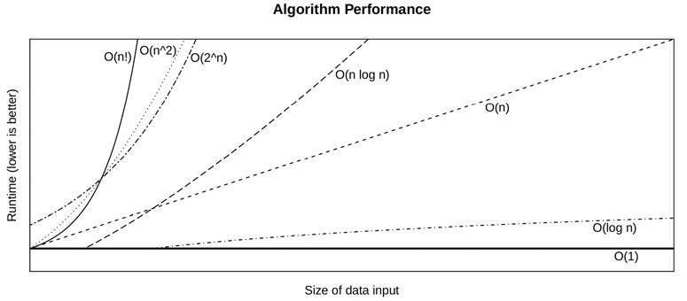
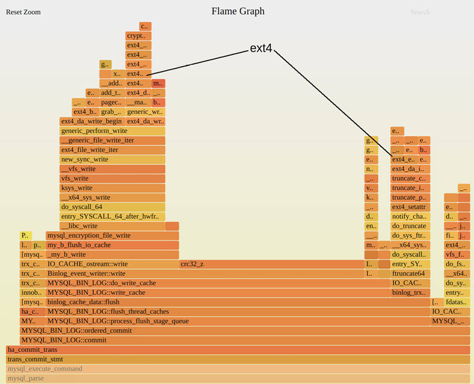
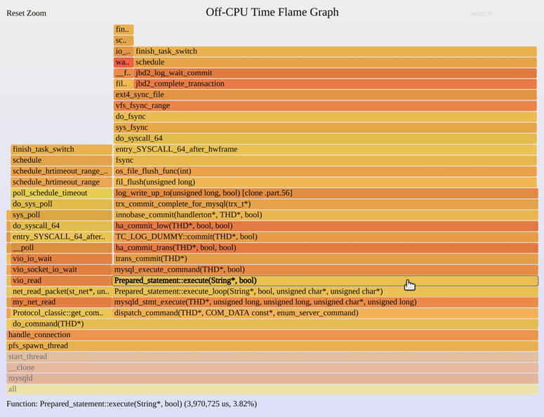
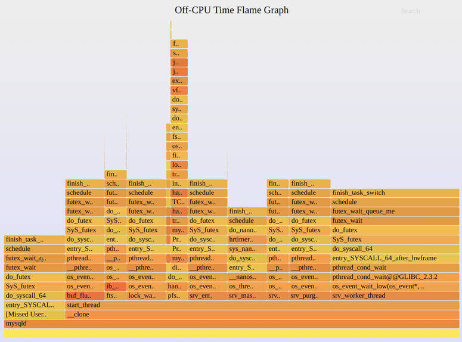
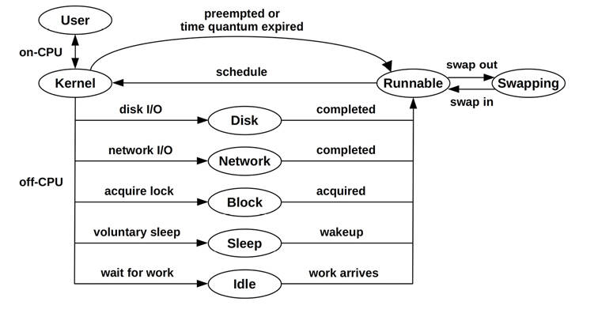
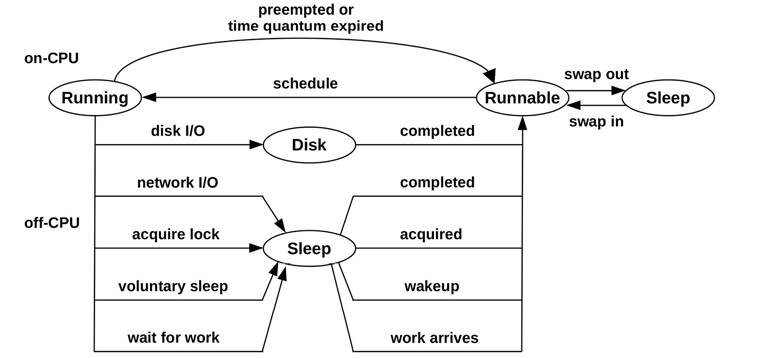

# Chapter 5

## Applications

Performance is best tuned closest to where the work is performed: in the applications. These include databases, web servers, application servers, load balancers, file servers, and more. The chapters that follow approach applications from the perspectives of the resources they consume: CPUs, memory, file systems, disks, and the network. This chapter addresses the application level.

Applications themselves can become extremely complex, especially in distributed environments involving many components. The study of application internals is usually the domain of the application developer and can include the use of third-party tools for introspection. For those studying systems performance, application performance analysis includes configuration of the application to make best use of system resources, characterization of how the application is using the system, and analysis of common pathologies.

The learning objectives of this chapter are:

- Describe performance tuning objectives.
- Become familiar with performance improving techniques, including multithreaded programming, hash tables, and non-blocking I/O.
- Understand common locking and synchronization primitives.
- Understand challenges posed by different programming languages.
- Follow a thread state analysis methodology.
- Perform CPU and off-CPU profiling.
- Perform syscall analysis, including tracing process execution.
- Become aware of stack trace gotchas: missing symbols and stacks.

This chapter discusses application basics, fundamentals for application performance, programming languages and compilers, strategies for generic application performance analysis, and system-based application observability tools.

### 5.1 Application Basics

Before diving into application performance, you should familiarize yourself with the role of the application, its basic characteristics, and its ecosystem in the industry. This forms the context within which you can understand application activity. It also gives you opportunities to learn about common performance issues and tuning and provides avenues for further study. To learn this context, try answering the following questions:

- **Function**: What is the role of the application? Is it a database server, web server, load balancer, file server, object store?
- **Operation**: What requests does the application serve, or what operations does it perform? Databases serve *queries* (and *commands*), web servers serve *HTTP requests*, and so on. This can be measured as a rate, to gauge load and for capacity planning.
- **Performance requirements**: Does the company running the application have a service level objective (SLO) (e.g., 99.9% of requests at &lt; 100 ms latency)?
- **CPU mode**: Is the application implemented as user-level or kernel-level software? Most applications are user-level, executing as one or more processes, but some are implemented as kernel services (for example, NFS), and BPF programs are also kernel-level.
- **Configuration**: How is the application configured, and why? This information may be found in a configuration file or via administration tools. Check if any tunable parameters related to performance have been changed, including buffer sizes, cache sizes, parallelism (processes or threads), and other options.
- **Host**: What hosts the application? A server or cloud instance? What are the CPUs, memory topology, storage devices, etc.? What are their limits?
- **Metrics**: Are application metrics provided, such as an operation rate? They may be provided by bundled tools or third-party tools, via API requests, or by processing operation logs.
- **Logs**: What operation logs does the application create? What logs can be enabled? What performance metrics, including latency, are available from the logs? For example, MySQL supports a *slow query log*, providing valuable performance details for each query slower than a certain threshold.
- **Version**: Is the application the latest version? Have performance fixes or improvements been noted in the release notes for recent versions?
- **Bugs**: Is there a bug database for the application? What are the “performance” bugs for your version of the application? If you have a current performance issue, search the bug database to see if anything like it has happened before, how it was investigated, and what else was involved.
- **Source code**: Is the application open source? If so, code paths identified by profilers and tracers can be studied, potentially leading to performance wins. You may be able to modify the application code yourself to improve performance, and submit your improvements upstream for inclusion in the official application.
- **Community**: Is there a community for the application where performance findings are shared? Communities may include forums, blogs, Internet Relay Chat (IRC) channels, other chat channels (e.g., Slack), meetups, and conferences. Meetups and conferences often post slides and videos online, which are useful resources for years afterward. They may also have a community manager who shares community updates and news.
- **Books**: Are there books about the application and/or its performance? Are they good books (e.g., written by an expert, practical/actionable, makes good use of reader’s time, up to date, etc.)?
- **Experts**: Who are the recognized performance experts for the application? Learning their names can help you find material they have authored.

Regardless of the source, you are aiming to understand the application at a high level—what it does, how it operates, and how it performs. An immensely useful resource, if you can find one, is a *functional diagram* illustrating application internals.

The next sections cover other application basics: setting objectives, optimizing the common case, observability, and big O notation.

#### 5.1.1 Objectives

A performance goal provides direction for your performance analysis work and helps you select which activities to perform. Without a clear goal, performance analysis risks turning into a random “fishing expedition.”

For application performance, you can start with what operations the application performs (as described earlier) and what the goal for performance is. The goal may be:

- **Latency**: A low or consistent application response time
- **Throughput**: A high application operation rate or data transfer rate
- **Resource utilization**: Efficiency for a given application workload
- **Price**: Improving the performance/price ratio, lowering computing costs

It is better if these can be quantified using metrics that may be derived from business or quality-of-service requirements. Examples are:

- An average application request latency of 5 ms
- 95% of requests completed with a latency of 100 ms or less
- Elimination of latency outliers: zero requests beyond 1,000 ms
- A maximum throughput of at least 10,000 application requests per second per server of a given size[1](ch05.md)
  
  [1](ch05.md)If the server size is variable (as with cloud instances). This may be better expressed in terms of the bounding resource: e.g., a maximum 1,000 application requests per second per CPU, for a CPU-bound workload.
- Average disk utilization under 50% for 10,000 application requests per second

Once a goal has been chosen, you can work on the limiters for that goal. For latency, the limiter may be disk or network I/O; for throughput, it may be CPU usage. The strategies in this and other chapters will help you identify them.

For throughput-based goals, note that not all operations are equal in terms of performance or cost. If the goal is a certain rate of operations, it may be important to also specify what type of operations they are. This may be a distribution based on expected or measured workloads.

[Section 5.2](ch05.md), [Application Performance Techniques](ch05.md), describes common methods for improving application performance. Some of these may make sense for one goal but not another; for example, selecting a larger I/O size may improve throughput at the expense of latency. Remember the goal that you are pursuing as you determine which topics are most applicable.

##### Apdex

Some companies use a target application performance index (ApDex or Apdex) as an objective and as a metric to monitor. It can better convey customer experience and involves first classifying customer events as to whether they are “satisfactory,” “tolerable,” or “frustrating.” The Apdex is then calculated using [\[Apdex 20\]](ch05.md):

Apdex = (satisfactory + 0.5 × tolerable + 0 × frustrating) / total events

The resulting Apdex ranges from 0 (no satisfied customers) to 1 (all satisfied customers).

#### 5.1.2 Optimize the Common Case

Software internals can be complex, with many different code paths and behaviors. This may be especially evident if you browse the source code: applications are commonly tens of thousands of lines of code, while operating system kernels are upward of hundreds of thousands. Picking areas to optimize at random may involve a great deal of work for not much gain.

One way to efficiently improve application performance is to find the most common code path for the production workload and begin by improving that. If the application is CPU-bound, that may mean the code paths that are frequently on-CPU. If the application is I/O-bound, you should be looking at the code paths that frequently lead to I/O. These can be determined by analysis and profiling of the application, including studying stack traces and flame graphs, as covered in later chapters. A higher level of context for understanding the common case may also be provided by application observability tools.

#### 5.1.3 Observability

As I reiterate in many chapters of this book, the biggest performance wins can come from *eliminating unnecessary work*.

This fact sometimes gets overlooked when an application is being selected based on performance. If benchmarking showed application A to be 10% faster than application B, it may be tempting to choose application A. However, if application A is opaque and application B provides a rich set of observability tools, it’s very likely that application B will be the better choice in the long run. Those observability tools make it possible to see and eliminate unnecessary work and to better understand and tune active work. The performance wins gained through enhanced observability may dwarf the initial 10% performance difference. The same is true for the selection of languages and runtimes: such as choosing Java or C, which are mature and have many observability tools, versus choosing a new language.

#### 5.1.4 Big O Notation

Big O notation, commonly taught as a computer science subject, is used to analyze the complexity of algorithms and to model how they will perform as the input dataset scales. The O refers to the *order* of the function, describing its growth rate. This notation helps programmers pick more efficient and performant algorithms when developing applications [\[Knuth 76\]](ch05.md)[\[Knuth 97\]](ch05.md).

Common big O notations and algorithm examples are listed in [Table 5.1](ch05.md).

Table 5.1 **Example big O notations**

**Notation**

**Examples**

O(1)

Boolean test

O(log n)

Binary search of a sorted array

O(n)

Linear search of a linked list

O(n log n)

Quick sort (average case)

O(n^2)

Bubble sort (average case)

O(2^n)

Factoring numbers; exponential growth

O(n!)

Brute force of traveling salesman problem

The notation allows programmers to estimate speedup of different algorithms, determining which areas of code will lead to the greatest improvements. For example, for searching a sorted array of 100 items, the difference between linear search and binary search is a factor of 21 (100/log(100)).

The performance of these algorithms is pictured in [Figure 5.1](ch05.md), showing their trend as they scale.



Figure 5.1 Runtime versus input size for different algorithms

This classification helps the systems performance analyst to understand that some algorithms will perform very poorly at scale. Performance problems may show up when applications are pushed to service more users or data objects than they ever have before, at which point algorithms such as O(n^2) may begin to be pathological. The fix may be for the developer to use a more efficient algorithm or to partition the population differently.

Big O notation does ignore some constant computation costs incurred for each algorithm. For cases where *n* (the input data size) is small, these costs may dominate.

### 5.2 Application Performance Techniques

This section describes some commonly used techniques by which application performance can be improved: selecting an I/O size, caching, buffering, polling, concurrency and parallelism, non-blocking I/O, and processor binding. Refer to the application documentation to see which of these are used, and for any additional application-specific features.

#### 5.2.1 Selecting an I/O Size

Costs associated with performing I/O can include initializing buffers, making a system call, mode or context switching, allocating kernel metadata, checking process privileges and limits, mapping addresses to devices, executing kernel and driver code to deliver the I/O, and, finally, freeing metadata and buffers. “Initialization tax” is paid for small and large I/O alike. For efficiency, the more data transferred by each I/O, the better.

Increasing the I/O size is a common strategy used by applications to improve throughput. It’s usually much more efficient to transfer 128 Kbytes as a single I/O than as 128 × 1 Kbyte I/O, considering any fixed per-I/O costs. Rotational disk I/O, in particular, has historically had a high per-I/O cost due to seek time.

There’s a downside when the application doesn’t need larger I/O sizes. A database performing 8 Kbyte random reads may run more slowly with a 128 Kbyte disk I/O size, as 120 Kbytes of data transfer is wasted. This introduces I/O latency, which can be lowered by selecting a smaller I/O size that more closely matches what the application is requesting. Unnecessarily larger I/O sizes can also waste cache space.

#### 5.2.2 Caching

The operating system uses caches to improve file system read performance and memory allocation performance; applications often use caches for a similar reason. Instead of always performing an expensive operation, the results of commonly performed operations may be stored in a local cache for future use. An example is the database buffer cache, which stores data from commonly performed database queries.

A common task when deploying applications is to determine which caches are provided, or can be enabled, and then to configure their sizes to suit the system.

While caches improve read performance, their storage is often used as buffers to improve write performance.

#### 5.2.3 Buffering

To improve write performance, data may be coalesced in a buffer before being sent to the next level. This increases the I/O size and efficiency of the operation. Depending on the type of writes, it may also increase write latency, as the first write to a buffer waits for subsequent writes before being sent.

A ring buffer (or *circular buffer*) is a type of fixed buffer that can be used for continuous transfer between components, which act upon the buffer asynchronously. It may be implemented using start and end pointers, which can be moved by each component as data is appended or removed.

#### 5.2.4 Polling

Polling is a technique in which the system waits for an event to occur by checking the status of the event in a loop, with pauses between checks. There are some potential performance problems with polling when there is little work to do:

- Costly CPU overhead of repeated checks
- High latency between the occurrence of the event and the next polled check

Where this is a performance problem, applications may be able to change their behavior to listen for the event to occur, which immediately notifies the application and executes the desired routine.

##### poll() System Call

There is a poll(2) syscall to check for the status of file descriptors, which serves a similar function to polling, although it is event-based so it doesn’t suffer the performance cost of polling.

The poll(2) interface supports multiple file descriptors as an array, which requires the application to scan the array when events occur to find the related file descriptors. This scanning is O(n) (see [Section 5.1.4](ch05.md), [Big O Notation](ch05.md)), whose overhead can become a performance problem at scale. An alternative on Linux is epoll(2), which can avoid the scan and therefore be O(1). On BSD, the equivalent is kqueue(2).

#### 5.2.5 Concurrency and Parallelism

Time-sharing systems (including all derived from Unix) provide program [*concurrency*](gloss.md): the ability to load and begin executing multiple runnable programs. While their runtimes may overlap, they do not necessarily execute on-CPU at the same instant. Each of these programs may be an application process.

To take advantage of a multiprocessor system, an application must execute on multiple CPUs at the same time. This is *parallelism*, which an application may accomplish by using multiple processes (*multiprocess*) or multiple threads (*multithreaded*), each performing its own task. For reasons explained in [Chapter 6](ch06.md), [CPUs](ch06.md), [Section 6.3.13](ch06.md), [Multiprocess, Multithreading](ch06.md), multiple threads (or the equivalent tasks) are more efficient and are therefore the preferred approach.

Apart from increased throughput of CPU work, multiple threads (or processes) is one way to allow I/O to be performed concurrently, as other threads can execute while a thread blocked on I/O waits. (The other way is asynchronous I/O.)

The use of multiprocess or multithreaded architectures means allowing the kernel to decide who to run, via the CPU scheduler, and with the cost of context-switch overheads. A different approach is for the user-mode application to implement its own scheduling mechanism and program model so that it can service different application requests (or programs) in the same OS thread. Mechanisms include:

- **Fibers**: Also called *lightweight threads*, these are a user-mode version of threads where each fiber represents a schedulable program. The application can use its own scheduling logic to choose which fiber to run. These can be used, for example, to allocate a fiber to handle each application request, with less overhead than doing the same with OS threads. Microsoft Windows, for example, supports fibers.[2](ch05.md)
  
  [2](ch05.md)The official Microsoft documentation warns about problems that fibers can pose: e.g., thread-local storage is shared between fibers, so programmers must switch to fiber-local storage, and any routine that exits a thread will exit all fibers on that thread. The documentation states: “In general, fibers do not provide advantages over a well-designed multithreaded application” [\[Microsoft 18\]](ch05.md).
- **Co-routines**: More lightweight than a fiber, a co-routine is a subroutine that can be scheduled by the user-mode application, providing a mechanism for concurrency.
- **Event-based concurrency**: Programs are broken down into a series of event handlers, and runnable events can be planned on and executed from a queue. These can be used, for example, by allocating metadata for each application request, which is referenced by event handlers. For example, the Node.js runtime uses event-based concurrency using a single *event worker thread* (which can become a bottleneck, as it can only execute on one CPU).

With all of these mechanisms, I/O must still be handled by the kernel, so OS thread switching is typically inevitable.[3](ch05.md) Also, for parallelism, multiple OS threads must be used so they can be scheduled across multiple CPUs.

[3](ch05.md)With some exceptions, such as using sendfile(2) to avoid I/O syscalls, and Linux io\_uring, which allows user-space to schedule I/O by writing and reading from io\_uring queues (these are summarized in [Section 5.2.6](ch05.md), [Non-Blocking I/O](ch05.md)).

Some runtimes use both co-routines for lightweight concurrency and multiple OS threads for parallelism. An example is the Golang runtime, which uses *goroutines* (co-routines) on a pool of OS threads. To improve performance, when a goroutine makes a blocking call, Golang’s scheduler automatically moves other goroutines on the blocking thread to other threads to run [\[Golang 20\]](ch05.md).

Three common models of multithreaded programming are:

- **Service thread pool**: A pool of threads services network requests, where each thread services one client connection at a time.
- **CPU thread pool**: One thread is created per CPU. This is commonly used by long-duration batch processing, such as video encoding.
- **Staged event-driven architecture (SEDA)**: Application requests are decomposed into stages that may be processed by pools of one or more threads.

Since multithreaded programming shares the same address space as the process, threads can read and write the same memory directly, without the need for more expensive interfaces (such as inter-process communication \[IPC] for multiprocess programming). For integrity, synchronization primitives are used so that data does not become corrupted by multiple threads reading and writing simultaneously.

##### Synchronization Primitives

Synchronization primitives manage access to memory to ensure integrity, and can operate similarly to traffic lights regulating access to an intersection. And, like traffic lights, they can halt the flow of traffic, causing wait time (latency). The three commonly used types for applications are:

- **Mutex (MUTually EXclusive) locks:** Only the holder of the lock can operate. Others block and wait off-CPU.
- **Spin locks**: Spin locks allow the holder to operate, while others *spin* on-CPU in a tight loop, checking for the lock to be released. While these can provide low-latency access—the blocked thread never leaves CPU and is ready to run in a matter of cycles once the lock is available—they also waste CPU resources while threads spin, waiting.
- **RW locks**: Reader/writer locks ensure integrity by allowing either multiple readers or one writer only and no readers.
- **Semaphores**: This is a variable type that can be counting to allow a given number of parallel operations, or binary to allow only one (effectively a mutex lock).

Mutex locks may be implemented by the library or kernel as a hybrid of spin and mutex locks, which spin if the holder is currently running on another CPU and block if it isn’t (or if a spin threshold is reached). They were initially implemented for Linux in 2009 [\[Zijlstra 09\]](ch05.md) and now have three paths depending on the state of the lock (as described in Documentation/locking/mutex-design.rst [\[Molnar 20\]](ch05.md)):

1. **fastpath**: Attempts to acquire the lock using the cmpxchg instruction to set the owner. This only succeeds if the lock is not held.
2. **midpath**: Also known as *optimistic spinning*, this spins on CPU while the lock holder is also running, hoping that it is soon released and can be acquired without blocking.
3. **slowpath**: This blocks and deschedules the thread, to be woken up later when the lock is available.

The Linux read-copy-update (RCU) mechanism is another synchronization mechanism in heavy use for kernel code. It allows read operations without needing to acquire a lock, improving performance over other lock types. With RCUs, writes create a copy of the protected data and update the copy while in-flight reads can still access the original. It can detect when there are no longer any readers (based on various per-CPU conditions) and then replace the original with the updated copy [\[Linux 20e\]](ch05.md).

Investigating performance issues involving locks can be time-consuming and often requires familiarity with the application source code. This is usually an activity for the developer.

##### Hash Tables

A hash table of locks can be used to employ the optimum number of locks for a large number of data structures. While hash tables are summarized here, this is an advanced topic that assumes a programming background.

Picture the following two approaches:

- A single global mutex lock for all data structures. While this solution is simple, concurrent access will encounter contention for the lock and latency while waiting for it. Multiple threads that need the lock will *serialize*—execute in sequence, rather than concurrently.
- A mutex lock for every data structure. While this reduces contention to only the times it is really needed—concurrent access to the same data structure—there are storage overheads for the lock, and CPU overheads for the creation and destruction of the lock for every data structure.

A hash table of locks is an in-between solution and is suitable when lock contention is expected to be light. A fixed number of locks is created, and a hashing algorithm is used to select which lock is used for which data structure. This avoids the creation and destruction cost with the data structure and also avoids the problem of having only a single lock.

The example hash table shown in [Figure 5.2](ch05.md) has four entries, called *buckets*, each of which contains its own lock.


Figure 5.2 Example hash table

This example also shows one approach for solving *hash collisions*, where two or more input data structures hash to the same bucket. Here, a chain of data structures is created to store them all under the same bucket, where they will be found again by the hashing function. These hash chains can be a performance problem if they become too long and are walked serially, because they are protected by only one lock that can begin to have long hold times. The hash function and table size can be selected with the goal of uniformly spreading data structures over many buckets, to keep hash chain length to a minimum. Hash chain length should be checked for production workloads, in case the hashing algorithm is not working as intended and is instead creating long hash chains that perform poorly.

Ideally, the number of hash table buckets should be equal to or greater than the CPU count, for the potential of maximum parallelism. The hashing algorithm may be as simple as taking low-order bits[4](ch05.md) of the data structure address and using this as an index into a power-of-two-size array of locks. Such simple algorithms are also fast, allowing data structures to be located quickly.

[4](ch05.md)Or middle bits. The lowest-order bits for addresses to an array of structs may have too many collisions.

With an array of adjacent locks in memory, a performance problem can arise when locks fall within the same cache line. Two CPUs updating different locks in the same cache line will encounter cache coherency overhead, with each CPU invalidating the cache line in the other’s cache. This situation is called *false sharing* and is commonly solved by *padding* locks with unused bytes so that only one lock exists in each cache line in memory.

#### 5.2.6 Non-Blocking I/O

The Unix process life cycle, pictured in [Chapter 3](ch03.md), [Operating Systems](ch03.md), shows processes blocking and entering the sleep state during I/O. There are a couple of performance problems with this model:

- Each I/O operation consumes a thread (or process) while it is blocked. In order to support many concurrent I/O, the application must create many threads (typically one for each client), which have a cost associated with thread creation and destruction, as well as stack space required to keep them.
- For frequent short-lived I/O, the overhead of frequent context switching can consume CPU resources and add application latency.

The *non-blocking I/O* model issues I/O asynchronously, without blocking the current thread, which can then perform other work. This has been a key feature of Node.js [\[Node.js 20\]](ch05.md), a server- side JavaScript application environment that directs code to be developed in non-blocking ways.

There are a number of mechanisms to perform non-blocking or asynchronous I/O, including:

- **open(2)**: Via the O\_ASYNC flag. The process is notified using a signal when I/O becomes possible on the file descriptor.
- **io\_submit(2)**: Linux asynchronous I/O (AIO).
- **sendfile(2)**: This copies data from one file descriptor to the other, deferring I/O to the kernel instead of user-level I/O.[5](ch05.md)
  
  [5](ch05.md)This is used by the Netflix CDN for sending video assets to customers without user-level I/O overheads.
- **io\_uring\_enter(2)**: Linux io\_uring allows asynchronous I/O to be submitted using a ring buffer that is shared between user and kernel space [\[Axboe 19\]](ch05.md).

Check your operating system documentation for other methods.

#### 5.2.7 Processor Binding

For NUMA environments, it can be advantageous for a process or thread to remain running on a single CPU and to run on the same CPU as it did previously after performing I/O. This can improve the memory locality of the application, reducing the cycles for memory I/O and improving overall application performance. Operating systems are well aware of this and are designed to keep application threads on the same CPUs (*CPU affinity*). These topics are introduced in [Chapter 7](ch07.md), [Memory](ch07.md).

Some applications force this behavior by *binding* themselves to CPUs. This can significantly improve performance for some systems. It can also reduce performance when the bindings conflict with other CPU bindings, such as device interrupt mappings to CPUs.

Be especially careful about the risks of CPU binding when there are other tenants or applications running on the same system. This is a problem I’ve encountered in OS virtualization (container) environments, where an application can see all the CPUs and then bind to some, on the assumption that it is the only application on the server. When a server is shared by other tenant applications that are also binding, multiple tenants may unknowingly bind to the same CPUs, causing CPU contention and scheduler latency even though other CPUs are idle.

Over the lifespan of an application the host system may also change, and bindings that are not updated may hurt instead of help performance, for example when they needlessly bind to CPUs across multiple sockets.

#### 5.2.8 Performance Mantras

For more techniques for improving application performance, see the Performance Mantras methodology from [Chapter 2](ch02.md). In summary:

1. Don’t do it.
2. Do it, but don’t do it again.
3. Do it less.
4. Do it later.
5. Do it when they’re not looking.
6. Do it concurrently.
7. Do it cheaper.

The first item, “Don’t do it,” is eliminating unnecessary work. For more detail on this methodology see [Chapter 2](ch02.md), [Methodologies](ch02.md), [Section 2.5.20](ch02.md), [Performance Mantras](ch02.md).

### 5.3 Programming Languages

Programming languages may be compiled or interpreted and may also be executed via a virtual machine. Many languages list “performance optimizations” as features, but, strictly speaking, these are usually features of the software that *executes* the language, not the language itself. For example, the Java HotSpot Virtual Machine software includes a just-in-time (JIT) compiler to dynamically improve performance.

Interpreters and language virtual machines also provide different levels of performance observability support via their own specific tools. For the system performance analyst, basic profiling using these tools can lead to some quick wins. For example, high CPU usage may be identified as a result of garbage collection (GC) and then fixed via some commonly used tunables. Or it may be caused by a code path that can be found as a known bug in a bug database and fixed by upgrading the software version (this happens a lot).

The following sections describe basic performance characteristics per programming language type. For more about individual language performance, look for texts about that language.

#### 5.3.1 Compiled Languages

Compilation takes a program and generates machine instructions in advance of runtime that are stored in binary executable files called *binaries*, which commonly use the Executable and Linking Format (ELF) on Linux and other Unix derivatives, and the Portable Executable (PE) format on Windows. These can be run at any time without compiling again. Compiled languages include C, C++, and assembly. Some languages may have both interpreters and compilers.

Compiled code is generally high-performing as it does not require further translation before execution by the CPUs. A common example of compiled code is the Linux kernel, which is written mostly in C, with some critical paths written in assembly.

Performance analysis of compiled languages is usually straightforward, as the executed machine code usually maps closely to the original program (although this depends on compilation optimizations). During compilation, a symbol table can be generated that maps addresses to program functions and object names. Later profiling and tracing of CPU execution can then be mapped directly to these program names, allowing the analyst to study program execution. Stack traces, and the numerical addresses they contain, can also be mapped and translated to function names to provide code path ancestry.

Compilers can improve performance by use of *compiler optimizations*—routines that optimize the choice and placement of CPU instructions.

##### Compiler Optimizations

The gcc(1) compiler offers seven levels of optimization: 0, 1, 2, 3, s, fast, and g. The numbers are a range where 0 uses the least optimizations and 3 uses the most. There are also “s” to optimize for size, “g” for debugging, and “fast” to use all optimizations plus extras that disregard standards compliance. You can query gcc(1) to show which optimizations it uses for different levels. For example:

[Click here to view code image](ch05_images.md)

```
$ gcc -Q -O3 --help=optimizers
The following options control optimizations:
  -O<number>
  -Ofast
  -Og
  -Os
  -faggressive-loop-optimizations         [enabled]
  -falign-functions                       [disabled]
  -falign-jumps                           [disabled]
  -falign-label                           [enabled]
  -falign-loops                           [disabled]
  -fassociative-math                      [disabled]
  -fasynchronous-unwind-tables            [enabled]
  -fauto-inc-dec                          [enabled]
  -fbranch-count-reg                      [enabled]
  -fbranch-probabilities                  [disabled]
  -fbranch-target-load-optimize           [disabled]
[...]
  -fomit-frame-pointer                    [enabled]
[...]
```

The full list for gcc version 7.4.0 includes about 230 options, some of which are enabled even at `–O0`. As an example of what one of these options does, the `-fomit-frame-pointer` option, seen in this list, is described in the gcc(1) man page:

Don’t keep the frame pointer in a register for functions that don’t need one. This avoids the instructions to save, set up and restore frame pointers; it also makes an extra register available in many functions. **It also makes debugging impossible on some machines.**

This is an example of a trade-off: omitting the frame pointer typically breaks the operation of analyzers that profile stack traces.

Given the usefulness of stack profilers, this option may sacrifice much in terms of later performance wins that can no longer be easily found, which may far outweigh the performance gains that this option initially offers. A solution, in this case, can be to compile with `-f`**no-**`omit-frame-pointer` to avoid this optimization.[6](ch05.md) Another recommended option is `-g` to include debuginfo, to aid later debugging. Debuginfo can be removed or stripped later if need be.[7](ch05.md)

[6](ch05.md)Depending on the profiler, there may be other solutions available for stack walking, such as using debuginfo, LBR, BTS, and more. For the perf(1) profiler, ways to use different stack walkers are described in [Chapter 13](ch13.md), [perf](ch13.md), [Section 13.9](ch13.md), [perf record](ch13.md).

[7](ch05.md)If you do distribute stripped binaries, consider making debuginfo packages so that the debug information can be installed when needed.

Should performance issues arise, it may be tempting to simply recompile the application with a reduced optimization level (from `–O3` to `–O2`, for example) in the hope that any debugging needs could then be met. This turns out not to be simple: the changes to the compiler output can be massive and important, and may affect the behavior of the issue you were originally trying to analyze.

#### 5.3.2 Interpreted Languages

Interpreted languages execute a program by translating it into actions during runtime, a process that adds execution overhead. Interpreted languages are not expected to exhibit high performance and are used for situations where other factors are more important, such as ease of programming and debugging. *Shell scripting* is an example of an interpreted language.

Unless observability tools are provided, performance analysis of interpreted languages can be difficult. CPU profiling can show the operation of the interpreter—including parsing, translating, and performing actions—but it may not show the original program function names, leaving essential program context a mystery. This interpreter analysis may not be totally fruitless, as there can be performance issues with the interpreter itself, even when the code it is executing appears to be well designed.

Depending on the interpreter, program context may be available as arguments to interpreter functions, which can be seen using dynamic instrumentation. Another approach is examine the process’s memory, given knowledge of program layout (e.g., using the Linux process\_vm\_readv(2) syscall).

Often these programs are studied by simply adding print statements and timestamps. More rigorous performance analysis is uncommon, since interpreted languages are not commonly selected for high-performance applications in the first place.

#### 5.3.3 Virtual Machines

A *language virtual machine* (also called a *process virtual machine*) is software that simulates a computer. Some programming languages, including Java and Erlang, are commonly executed using virtual machines (VMs) that provide them with a platform-independent programming environment. The application program is compiled to the virtual machine instruction set (*bytecode*) and then executed by the virtual machine. This allows portability of the compiled objects, provided a virtual machine is available to run them on the target platform.

The bytecode can be executed by the language virtual machine in different ways. The Java HotSpot Virtual Machine supports execution via interpretation and also JIT compilation, which compiles bytecode to machine code for direct execution by the processor. This provides the performance advantages of compiled code, together with the portability of a virtual machine.

Virtual machines are typically the most difficult of the language types to observe. By the time the program is executing on-CPU, multiple stages of compilation or interpretation may have passed, and information about the original program may not be readily available. Performance analysis usually focuses on the toolset provided with the language virtual machine, many of which provide USDT probes, and on third-party tools.

#### 5.3.4 Garbage Collection

Some languages use automatic memory management, where allocated memory does not need to be explicitly freed, leaving that to an asynchronous garbage collection process. While this makes programs easier to write, there can be disadvantages:

- **Memory growth**: There is less control of the application’s memory usage, which may grow when objects are not identified automatically as eligible to be freed. If the application grows too large, it may either hit its own limits or encounter system paging (Linux swapping), severely harming performance.
- **CPU cost**: GC will typically run intermittently and involves searching or scanning objects in memory. This consumes CPU resources, reducing what is available to the application for short periods. As the memory of the application grows, CPU consumption by GC may also grow. In some cases this can reach the point where GC continually consumes an entire CPU.
- **Latency outliers**: Application execution may be paused while GC executes, causing occasional application responses with high latency that were interrupted by GC.[8](ch05.md) This depends on the GC type: stop-the-world, incremental, or concurrent.

[8](ch05.md)There has been much work on techniques to reduce GC time or application interrupts from GC. One example uses system and application metrics to determine when best to call GC [\[Schwartz 18\]](ch05.md).

GC is a common target for performance tuning to reduce CPU cost and occurrence of latency outliers. For example, the Java VM provides many tunable parameters to set the GC type, number of GC threads, maximum heap size, target heap free ratio, and more.

If tuning is not effective, the problem may be the application creating too much garbage, or leaking references. These are issues for the application developer to resolve. One approach is to allocate fewer objects, when possible, to reduce the GC load. Observability tools that show object allocations and their code paths can be used to find potential targets for elimination.

### 5.4 Methodology

This section describes methodologies for application analysis and tuning. The tools used for analysis are either introduced here or are referenced from other chapters. The methodologies are summarized in [Table 5.2](ch05.md).

Table 5.2 **Application performance methodologies**

**Section**

**Methodology**

**Type**

[5.4.1](ch05.md)

CPU profiling

Observational analysis

[5.4.2](ch05.md)

Off-CPU profiling

Observational analysis

[5.4.3](ch05.md)

Syscall analysis

Observational analysis

[5.4.4](ch05.md)

USE method

Observational analysis

[5.4.5](ch05.md)

Thread state analysis

Observational analysis

[5.4.6](ch05.md)

Lock analysis

Observational analysis

[5.4.7](ch05.md)

Static performance tuning

Observational analysis, tuning

[5.4.8](ch05.md)

Distributed tracing

Observational analysis

See [Chapter 2](ch02.md), [Methodologies](ch02.md), for the introduction to some of these, and also additional general methodologies: for applications, in particular consider CPU profiling, workload characterization, and drill-down analysis. Also see the chapters that follow for the analysis of system resources and virtualization.

These methodologies may be followed individually or used in combination. My suggestion is to try them in the order listed in the table.

In addition to these, look for custom analysis techniques for the specific application and the programming language in which it is developed. These may consider logical behavior of the application, including known issues, and lead to some quick performance wins.

#### 5.4.1 CPU Profiling

CPU profiling is an essential activity for application performance analysis and is explained in [Chapter 6](ch06.md), [CPUs](ch06.md), beginning with [Section 6.5.4](ch06.md), [Profiling](ch06.md). This section summarizes CPU profiling and CPU flame graphs, and describes how CPU profiling can be used for some off-CPU analysis.

There are many CPU profilers for Linux, including perf(1) and profile(8), summarized in [Section 5.5](ch05.md), [Observability Tools](ch05.md), both of which used timed sampling. These profilers run in kernel mode and can capture both the kernel and user stacks, producing a *mixed-mode* profile. This provides (almost) complete visibility for CPU usage.

Applications and runtimes sometimes provide their own profiler that runs in user mode, which cannot show kernel CPU usage. These user-based profilers may have a skewed notion of CPU time as they may be unaware of when the kernel has descheduled the application, and do not account for it. I always start with kernel-based profilers (perf(1) and profile(8)) and use user-based ones as a last resort.

Sample-based profilers produce many samples: a typical CPU profile at Netflix collects stack traces at 49 Hertz across (around) 32 CPUs for 30 seconds: this produces a total of 47,040 samples. To make sense of these, profilers typically provide different ways to summarize or visualize them. A commonly used visualization for sampled stack traces is called *flame graphs*, which I invented.

##### CPU Flame Graphs

A CPU flame graph was shown in [Chapter 1](ch01.md), and a different example excerpt is shown as [Figure 2.15](ch02.md). The [Figure 5.3](ch05.md) example includes an ext4 annotation for later reference. These are *mixed-mode* flame graphs, showing both user and kernel stacks.

In a flame graph, each rectangle is a frame from a stack trace, and the y-axis shows the code flow: top-down shows the current function and then its ancestry. The frame width is proportional to its presence in the profile, and the x-axis ordering has no meaning (it is an alphabetical sort). You look for the big “plateaus” or “towers”—that’s where the bulk of the CPU time is spent. See [Chapter 6](ch06.md), [CPUs](ch06.md), [Section 6.7.3](ch06.md), [Flame Graphs](ch06.md), for more detail about flame graphs.

In [Figure 5.3](ch05.md), crc32\_z() is the function that is on-CPU the most, spanning about 40% of this excerpt (the center plateau). A tower on the left shows a syscall write(2) path into the kernel, spanning about 30% of CPU time in total. With a quick glance, we’ve identified these two as possible low-level targets for optimization. Browsing the code-path ancestry (downwards) can reveal high-level targets: in this case, all the CPU usage is from the MYSQL\_BIN\_LOG::commit() function.



Figure 5.3 CPU flame graph excerpt

I do not know what crc32\_z() or MYSQL\_BIN\_LOG::commit() do (although I can probably guess). CPU profiles expose the inner workings of applications, and unless you are the application developer, you are not expected to know what any of these functions are. You will need to research them to develop actionable performance improvements.

As an example, I performed an internet search for MYSQL\_BIN\_LOG::commit() and quickly found articles describing MySQL binary logging, used for database restoration and replication, and how it can be tuned or disabled entirely. A quick search for crc32\_z() shows it is a checksumming function from zlib. Perhaps there is a newer and faster version of zlib? Does the processor have the optimized CRC instruction, and is zlib using it? Does MySQL even need to calculate the CRC, or can it be turned off? See [Chapter 2](ch02.md), [Methodologies](ch02.md), [Section 2.5.20](ch02.md), [Performance Mantras](ch02.md), for more on this style of thinking.

[Section 5.5.1](ch05.md), [perf](ch05.md), summarizes instructions for generating CPU flame graphs using perf(1).

##### Off-CPU Footprints

CPU profiles can show more than just CPU usage. You can look for evidence of other off-CPU issue types. Disk I/O, for example, can be seen to some extent by its CPU usage for file system access and block I/O initialization. This is like finding the footprints of a bear: you don’t see the bear, but you’ve discovered that one exists.

By browsing the CPU flame graph you may find evidence of file system I/O, disk I/O, network I/O, lock contention, and more. [Figure 5.3](ch05.md) highlights the ext4 file system I/O as an example. If you browse enough flame graphs, you’ll become familiar with the function names to look for: “tcp\_\*” for kernel TCP functions, “blk\_\*” for kernel block I/O functions, etc. Here are some suggested search terms for Linux systems:

- **“ext4”** (or **“btrfs”**, **“xfs”**, **“zfs”**): to find file system operations.
- **“blk”**: to find block I/O.
- **“tcp”**: to find network I/O.
- **“utex”**: to show lock contention (“mutex” or “futex”).
- **“alloc”** or “**object”**: to show code paths doing memory allocation.

This method only identifies the presence of these activities, not their magnitude. The CPU flame graph shows the magnitude of CPU usage, not the time spent blocked off-CPU. To measure off-CPU time directly, you can use off-CPU analysis, covered next, although it typically costs greater overhead to measure.

#### 5.4.2 Off-CPU Analysis

Off-CPU analysis is the study of threads that are not currently running on a CPU: This state is called [*off-CPU*](gloss.md). It includes all the reasons that threads block: disk I/O, network I/O, lock contention, explicit sleeps, scheduler preemption, etc. The analysis of these reasons and the performance issues they cause typically involves a wide variety of tools. Off-CPU analysis is one method to analyze them all, and can be supported by a single off-CPU profiling tool.

Off-CPU profiling can be performed in different ways, including:

- **Sampling**: Collecting timer-based samples of threads that are off-CPU, or simply all threads (called *wallclock sampling*).
- **Scheduler tracing**: Instrumenting the kernel CPU scheduler to time the duration that threads are off-CPU, and recording these times with the off-CPU stack trace. Stack traces do not change when a thread is off-CPU (because it is not running to change it), so the stack trace only needs to be read once for each blocking event.
- **Application instrumentation**: Some applications have built-in instrumentation for commonly blocking code paths, such as disk I/O. Such instrumentation may include application-specific context. While convenient and useful, this approach is typically blind to off-CPU events (scheduler preemption, page faults, etc.).

The first two approaches are preferable as they work for all applications and can see all off-CPU events; however, they come with major overhead. Sampling at 49 Hertz should cost negligible overhead on, say, an 8-CPU system, but off-CPU sampling must sample the pool of threads rather than the pool of CPUs. The same system may have 10,000 threads, most of which are idle, so sampling them increases the overhead by 1,000x[9](ch05.md) (imagine CPU-profiling a 10,000-CPU system). Scheduler tracing can also cost significant overhead, as the same system may have 100,000 scheduler events or more per second.

[9](ch05.md)Likely higher, as it would require sampling stack traces for threads that are off-CPU, and their stack is unlikely to be CPU-cached (unlike with CPU profiling). Restricting it to a single application should help reduce the thread count, though the profile will be incomplete.

Scheduler tracing is the technique now commonly used, based on my own tools such as offcputime(8) ([Section 5.5.3](ch05.md), [offcputime](ch05.md)). An optimization I use is to record only off-CPU events that exceed a tiny duration, which reduces the number of samples.[10](ch05.md) I also use BPF to aggregate stacks in kernel context, rather than emitting all samples to user space, reducing overhead even further. Much as these techniques help, you should be careful with off-CPU rofiling in production, and evaluate the overhead in a test environment before use.

[10](ch05.md)Before you say “what if there is an avalanche of tiny sleep durations that are excluded by this optimization?”—you should see evidence of it in a CPU profile due to calling the scheduler so frequently, prompting you to turn off this optimization.

##### Off-CPU Time Flame Graphs

Off-CPU profiles can be visualized as an *off-CPU time flame graph.* [Figure 5.4](ch05.md) shows a 30-second system-wide off-CPU profile, where I have zoomed in to show a MySQL server thread handling commands (queries).



Figure 5.4 Off-CPU time flame graph, zoomed

The bulk of the off-CPU time is in a fsync() code path and the ext4 file system. The mouse pointer is over one function, Prepared\_statement::execute(), to demonstrate that the information line at the bottom shows the off-CPU time in this function: 3.97 seconds in total. Interpretation is similar as for CPU flame graphs: look for the widest towers and investigate those first.

By using both on- and off-CPU flame graphs, you have a complete view of on- and off-CPU time by code path: a powerful tool. I typically show them as separate flame graphs. It is possible to combine them into a single flame graph, which I’ve called *hot/cold flame graphs*. It doesn’t work well: the CPU time gets squeezed into a thin tower as the bulk of the hot/cold flame graph is displaying wait time. This is because the off-CPU thread count can outweigh the running on-CPU count by two orders of magnitude, causing the hold/cold flame graph to consist of 99% off-CPU time, which (unless filtered) is mostly wait time.

##### Wait Time

Apart from the overheads of collecting off-CPU profiles, another issue is interpreting them: they can be dominated by wait time. This is time spent by threads waiting for work. [Figure 5.5](ch05.md) shows the same off-CPU time flame graph, but not zoomed in to an interesting thread.



Figure 5.5 Off-CPU time flame graph, full

Most of the time in this flame graph is now in a similar pthread\_cond\_wait() and futex() code path: these are threads waiting for work. The thread functions can be seen in the flame graph: from right to left, there is srv\_worker\_thread(), srv\_purge\_coordinator\_thread(), srv\_monitor\_thread(), and so on.

There are a couple of techniques for finding the off-CPU time that matters:

- Zoom into (or filter by) the application request handling function(s), since we care most about off-CPU time during the handling of an application request. For MySQL server this is the do\_command() function. A search for do\_command() and then zooming in produces a similar flame graph to [Figure 5.4](ch05.md). While this approach is effective, you will need to know what function to search for in your specific application.
- Use a kernel filter during collection to exclude uninteresting thread states. The effectiveness is dependent on the kernel; on Linux, matching on TASK\_UNINTERRUPTIBLE focuses on many interesting off-CPU events, but does exclude some as well.

You will sometimes find application-blocking code paths that are waiting on something else, such as a lock. To drill down further, you need to know why the holder of the lock took so long to release it. Apart from lock analysis, described in [Section 5.4.7](ch05.md), [Static Performance Tuning](ch05.md), a generic technique is to instrument the waker event. This is an advanced activity: see [Chapter 14](ch14.md) of *BPF Performance Tools* [\[Gregg 19\]](ch05.md), and the tools wakeuptime(8) and offwaketime(8) from BCC.

[Section 5.5.3](ch05.md), [offcputime](ch05.md), shows instructions for generating off-CPU flame graphs using offcputime(8) from BCC. Apart from scheduler events, syscall events are another useful target for studying applications.

#### 5.4.3 Syscall Analysis

System calls (syscalls) can be instrumented for the study of resource-based performance issues. The intent is to find out where syscall time is spent, including the type of syscall and the reason it is called.

Targets for syscall analysis include:

- **New process tracing**: By tracing the execve(2) syscall you can log new process execution, and analyze issues of short-lived processes. See the execsnoop(8) tool in [Section 5.5.5](ch05.md), [execsnoop](ch05.md).
- **I/O profiling**: Tracing read(2)/write(2)/send(2)/recv(2) and their variants, and studying their I/O sizes, flags, and code paths, will help you identify issues of suboptimal I/O, such as a large number of small I/O. See the bpftrace tool in [Section 5.5.7](ch05.md), [bpftrace](ch05.md).
- **Kernel time analysis**: When systems show a high amount of kernel CPU time, often reported as “%sys,” instrumenting syscalls can locate the cause. See the syscount(8) tool in [Section 5.5.6](ch05.md), [syscount](ch05.md). Syscalls explain most but not all of kernel CPU time; exceptions include page faults, asynchronous kernel threads, and interrupts.

Syscalls are a well-documented API (man pages), making them an easy event source to study. They are also called synchronously with the application, which means that collecting stack traces from syscalls will show the application code path responsible. Such stack traces can be visualized as a flame graph.

#### 5.4.4 USE Method

As introduced in [Chapter 2](ch02.md), [Methodologies](ch02.md), and applied in later chapters, the USE method checks the utilization, saturation, and errors of all hardware resources. Many application performance issues may be solved this way, by showing that a resource has become a bottleneck.

The USE method can also be applied to software resources. If you can find a functional diagram showing the internal components of an application, consider the utilization, saturation, and error metrics for each software resource and see what makes sense.

For example, the application may use a pool of worker threads to process requests, with a queue for requests waiting their turn. Treating this as a resource, the three metrics could then be defined in this way:

- **Utilization**: Average number of threads busy processing requests during an interval, as a percentage of the total threads. For example, 50% would mean that, on average, half the threads were busy working on requests.
- **Saturation**: Average length of the request queue during an interval. This shows how many requests have backed up waiting for a worker thread.
- **Errors**: Requests denied or failed for any reason.

Your task is then to find how these metrics can be measured. They may already be provided by the application somewhere, or they may need to be added or measured using another tool, such as dynamic tracing.

Queueing systems, like this example, can also be studied using queueing theory (see [Chapter 2](ch02.md), [Methodologies](ch02.md)).

For a different example, consider file descriptors. The system may impose a limit, such that these are a finite resource. The three metrics could be as follows:

- **Utilization**: Number of in-use file descriptors, as a percentage of the limit
- **Saturation**: Depends on the OS behavior: if threads block waiting for file descriptors, this can be the number of blocked threads waiting for this resource
- **Errors**: Allocation error, such as EFILE, “Too many open files”

Repeat this exercise for the components of your application, and skip any metrics that don’t make sense. This process may help you develop a short checklist for checking application health before moving on to other methodologies.

#### 5.4.5 Thread State Analysis

This is the first methodology I use for every performance issue, but it is also an advanced activity on Linux. The goal is to identify at a high level where application threads are spending their time, which solves some issues immediately, and directs the investigation of others. You can do this by dividing each application’s thread time into a number of meaningful states.

At a minimum, there are two thread states: on-CPU and off-CPU. You can identify if threads are in the on-CPU state using standard metrics and tools (e.g., top(1)), and follow with CPU profiling or off-CPU analysis as appropriate (see [Sections 5.4.1](ch05.md), [CPU Profiling](ch13.md), and [5.4.2](ch05.md), [Off-CPU Analysis](ch05.md)). This methodology is more effective with more states.

##### Nine States

This is a list of nine thread states I’ve chosen to give better starting points for analysis than the two earlier states (on-CPU and off-CPU):

- **User**: On-CPU in user mode
- **Kernel**: On-CPU in kernel mode
- **Runnable**: And off-CPU waiting for a turn on-CPU
- **Swapping** (anonymous paging): Runnable, but blocked for anonymous page-ins
- **Disk I/O**: Waiting for block device I/O: reads/writes, data/text page-ins
- **Net I/O**: Waiting for network device I/O: socket reads/writes
- **Sleeping**: A voluntary sleep
- **Lock**: Waiting to acquire a synchronization lock (waiting on someone else)
- **Idle**: Waiting for work

This nine-state model is pictured in [Figure 5.6](ch05.md).



Figure 5.6 Nine-state thread model

Performance for an application request is improved by reducing the time in every state except idle. Other things being equal, this would mean that application requests have lower latency, and the application can handle more load.

Once you’ve established in which states the threads are spending their time, you can investigate them further:

- **User or Kernel**: Profiling can determine which code paths are consuming CPU, including time spent spinning on locks. See [Section 5.4.1](ch05.md), [CPU Profiling](ch05.md).
- **Runnable**: Time in this state means the application wants more CPU resources. Examine CPU load for the entire system, and any CPU limits present for the application (e.g., resource controls).
- **Swapping** (anonymous paging): A lack of available main memory for the application can cause swapping delays. Examine memory usage for the entire system and any memory limits present. See [Chapter 7](ch07.md), [Memory](ch07.md), for details.
- **Disk**: This state includes direct disk I/O and page faults. To analyze, see [Section 5.4.3](ch05.md), [Syscall Analysis](ch05.md), [Chapter 8](ch08.md), [File Systems](ch08.md), and [Chapter 9](ch09.md), [Disks](ch09.md). Workload characterization can help solve many disk I/O problems; examine file names, I/O sizes, and I/O types.
- **Network**: This state is for time blocked during network I/O (send/receive), but not listening for new connections (that’s idle time). To analyze, see [Section 5.4.3](ch05.md), [Syscall Analysis](ch05.md); [Section 5.5.7](ch05.md), [bpftrace](ch05.md) and the I/O Profiling heading; and [Chapter 10](ch10.md), [Network](ch10.md). Workload characterization can also be useful for network I/O problems; examine hostnames, protocols, and throughput.
- **Sleeping**: Analyze the reason (code path) and duration of the sleeps.
- **Lock**: Identify the lock, the thread holding it, and the reason why the holder held it for so long. The reason may be that the holder was blocked on another lock, which requires further unwinding. This is an advanced activity, usually performed by the software developer who has intimate knowledge of the application and its locking hierarchy. I have developed a BCC tool to aid this type of analysis: offwaketime(8) (included in BCC), which shows the blocking stack trace along with the waker.

Because of how applications typically wait for work, you will often find that time in the network I/O and lock states is actually idle time. An application worker thread may implement idle by waiting on network I/O for the next request (e.g., HTTP keep-alive) or by waiting on a conditional variable (lock state) to be woken up to process work.

The following summarizes how these thread states may be measured on Linux.

##### Linux

[Figure 5.7](ch05.md) shows a Linux thread state model based on kernel thread state.



Figure 5.7 Linux thread states

The kernel thread state is based on the kernel task\_struct state member: Runnable is TASK\_RUNNING, Disk is TASK\_UNINTERRUPTIBLE, and Sleep is TASK\_INTERRUPTIBLE. These states are shown by tools including ps(1) and top(1) using single-letter codes: R, D, and S, respectively. (There are more states, such as stopped by a debugger, that I did not include here.)

While this provides some clues for further analysis, it is far from dividing time into the nine states described earlier. More information is required: for example, Runnable can be split into user and kernel time using /proc or getrusage(2) statistics.

Other kernels typically provide more states, making this methodology easier to apply. I originally developed and used this methodology on the Solaris kernel, inspired by its microstate accounting feature, which recorded thread time in eight different states: user, system, trap, text fault, data fault, lock, sleep, and run queue (scheduler latency). These don’t match my ideal states, but are a better starting point.

I’ll discuss three approaches that I use on Linux: clue-based, off-CPU analysis, and direct measurement.

###### Clue-Based

You can start by using common OS tools, such as pidstat(1) and vmstat(8), to suggest where thread state time may be spent. The tools and column of interest are:

- **User**: pidstat(1) “%usr” (this state is measured directly)
- **Kernel**: pidstat(1) “%system” (this state is measured directly)
- **Runnable**: vmstat(8) “r” (system-wide)
- **Swapping**: vmstat(8) “si” and “so” (system-wide)
- **Disk I/O**: pidstat(1) `-d` “iodelay” (includes the swapping state)
- **Network I/O**: sar(1) `-n DEV` “rxkB/s” and “txkB/s” (system-wide)
- **Sleeping**: Not easily available
- **Lock**: perf(1) `top` (may identify spin lock time directly)
- **Idle**: Not easily available

Some of these statistics are system-wide. If you find via vmstat(8) that there is a system-wide rate of swapping, you could investigate that state using deeper tools to confirm that the application is affected. These tools are covered in the following sections and chapters.

###### Off-CPU Analysis

As many of the states are off-CPU (everything except User and Kernel), you can apply off-CPU analysis to determine the thread state. See [Section 5.4.2](ch05.md), [Off-CPU Analysis](ch05.md).

###### Direct Measurement

Measure thread time accurately by thread state as follows:

**User**: User-mode CPU is available from a number of tools and in /proc/PID/stat and getrusage(2). pidstat(1) reports this as `%usr`.

**Kernel**: Kernel-mode CPU is also in /proc/PID/stat and getrusage(2). pidstat(1) reports this as `%system`.

**Runnable**: This is tracked by the kernel *schedstats* feature in nanoseconds and is exposed via /proc/PID/schedstat. It can also be measured, at the cost of some overhead, using tracing tools including the perf(1) `sched` subcommand and BCC runqlat(8), both covered in [Chapter 6](ch06.md), [CPUs](ch06.md).

**Swapping**: Time swapping (anonymous paging) in nanoseconds can be measured by *delay accounting*, introduced in [Chapter 4](ch04.md), [Observability Tools](ch04.md), [Section 4.3.3](ch04.md), [Delay Accounting](ch04.md), which included an example tool: getdelays.c. Tracing tools can also be used to instrument swapping latency.

**Disk**: pidstat(1) `-d` shows “iodelay” as the number of clock ticks during which a process was delayed by block I/O and swapping; if there was no system-wide swapping (as reported by vmstat(8)), you could conclude that any iodelay was the I/O state. Delay accounting and other accounting features, if enabled, also provide block I/O time, as used by iotop(8). You can also use tracing tools such as biotop(8) from BCC.

**Network**: Network I/O can be investigated using tracing tools such as BCC and bpftrace, including the tcptop(8) tool for TCP network I/O. The application may also have instrumentation to track time in I/O (network and disk).

**Sleeping**: Time entering voluntary sleep can be examined using tracers and events including the syscalls:sys\_enter\_nanosleep tracepoint. My naptime.bt tool traces these sleeps and prints the PID and duration \[Gregg 19][\[Gregg 20b\]](ch05.md).

**Lock**: Lock time can be investigated using tracing tools, including klockstat(8) from BCC and, from the bpf-perf-tools-book repository, pmlock.bt and pmheld.bt for pthread mutex locks, and mlock.bt and mheld.bt for kernel mutexes.

**Idle**: Tracing tools can be used to instrument the application code paths that handle waiting for work.

Sometimes applications can appear to be completely asleep: they remain blocked off-CPU without a rate of I/O or other events. To determine what state the application threads are in, it may be necessary to use a debugger such as pstack(1) or gdb(1) to inspect thread stack traces, or to read them from the /proc/PID/stack files. Note that debuggers like these can pause the target application and cause performance problems of their own: understand how to use them and their risks before trying them in production.

#### 5.4.6 Lock Analysis

For multithreaded applications, locks can become a bottleneck, inhibiting parallelism and scalability. Single-threaded applications can be inhibited by kernel locks (e.g., file system locks). Locks can be analyzed by:

- Checking for contention
- Checking for excessive hold times

The first identifies whether there is a problem *now*. Excessive hold times are not necessarily an immediate problem, but they may become so in the future with more parallel load. For each, try to identify the name of the lock (if it exists) and the code path that led to using it.

While there are special-purpose tools for lock analysis, you can sometimes solve issues from CPU profiling alone. For *spin locks*, contention shows up as CPU usage and can easily be identified using CPU profiling of stack traces. For *adaptive mutex locks*, contention often involves some spinning, which can also be identified by CPU profiling of stack traces. In that case, be aware that the CPU profile gives only a part of the story, as threads may have blocked and slept while waiting for the locks. See [Section 5.4.1](ch05.md), [CPU Profiling](ch05.md).

For specific lock analysis tools on Linux, see [Section 5.5.7](ch05.md), [bpftrace](ch05.md).

#### 5.4.7 Static Performance Tuning

Static performance tuning focuses on issues of the configured environment. For application performance, examine the following aspects of the static configuration:

- What version of the application is running, and what are its dependencies? Are there newer versions? Do their release notes mention performance improvements?
- Are there known performance issues? Is there a bug database that lists them?
- How is the application configured?
- If it was configured or tuned differently from the defaults, what was the reason? (Was it based on measurements and analysis, or guesswork?)
- Does the application employ a cache of objects? How is it sized?
- Does the application run concurrently? How is that configured (e.g., thread pool sizing)?
- Is the application running in a special mode? (For example, debug mode may have been enabled and be reducing performance, or the application may be a debug build instead of a release build.)
- What system libraries does the application use? What versions are they?
- What memory allocator does the application use?
- Is the application configured to use large pages for its heap?
- Is the application compiled? What version of the compiler? What compiler options and optimizations? 64-bit?
- Does the native code include advanced instructions? (Should it?) (For example, SIMD/vector instructions including Intel SSE.)
- Has the application encountered an error, and is it now in a degraded mode? Or is it misconfigured and always running in a degraded mode?
- Are there system-imposed limits or resource controls for CPU, memory, file system, disk, or network usage? (These are common with cloud computing.)

Answering these questions may reveal configuration choices that have been overlooked.

#### 5.4.8 Distributed Tracing

In a distributed environment, an application may be composed of services that run on separate systems. While each service can be studied as though it is its own mini-application, it is also necessary to study the distributed application as a whole. This requires new methodologies and tools, and is commonly performed using distributed tracing.

Distributed tracing involves logging information on each service request and then later combining this information for study. Each application request that spans multiple services can then be broken down into its dependency requests, and the service responsible for high application latency or errors can be identified.

Collected information can include:

- A unique identifier for the application request (external request ID)
- Information about its location in the dependency hierarchy
- Start and end times
- Error status

A challenge with distributed tracing is the amount of log data generated: multiple entries for every application request. One solution is to perform *head-based sampling* where at the start (“head”) of the request, a decision is made whether to sample (“trace”) it: for example, to trace one in every ten thousands requests. This is sufficient to analyze the performance of the bulk of the requests, but it may make the analysis of intermittent errors or outliers difficult due to limited data. Some distributed tracers are *tail-based,* where all events are first captured and then a decision is made as to what to keep, perhaps based on latency and errors.

Once a problematic service has been identified, it can be analyzed in more detail using other methodologies and tools.

### 5.5 Observability Tools

This section introduces application performance observability tools for Linux-based operating systems. See the previous section for strategies to follow when using them.

The tools in this section are listed in [Table 5.3](ch05.md) along with a description of how these tools are used in this chapter.

Table 5.3 **Linux application observability tools**

**Section**

**Tool**

**Description**

[5.5.1](ch05.md)

perf

CPU profiling, CPU flame graphs, syscall tracing

[5.5.2](ch05.md)

profile

CPU profiling using timed sampling

[5.5.3](ch05.md)

offcputime

Off-CPU profiling using scheduler tracing

[5.5.4](ch05.md)

strace

Syscall tracing

[5.5.5](ch05.md)

execsnoop

New process tracing

[5.5.6](ch05.md)

syscount

Syscall counting

[5.5.7](ch05.md)

bpftrace

Signal tracing, I/O profiling, lock analysis

These begin with CPU profiling tools then tracing tools. Many of the tracing tools are BPF-based, and use the BCC and bpftrace frontends ([Chapter 15](ch15.md)); they are: profile(8), offcputime(8), execsnoop(8), and syscount(8). See the documentation for each tool, including its man pages, for full references of its features.

Also look for application-specific performance tools not listed in this table. Later chapters cover resource-oriented tools: CPUs, memory, disks, etc., which are also useful for application analysis.

Many of the following tools collect application stack traces. If you find your stack trace contains “\[unknown]” frames or appears impossibly short, see [Section 5.6](ch05.md), [Gotchas](ch05.md), which describes common problems and summarizes methods to fix them.

#### 5.5.1 perf

perf(1) is the standard Linux profiler, a multi-tool with many uses. It is explained in [Chapter 13](ch13.md), [perf](ch13.md). As CPU profiling is critical for application analysis, a summary of CPU profiling using perf(1) is included here. [Chapter 6](ch06.md), [CPUs](ch06.md), covers CPU profiling and flame graphs in more detail.

##### CPU Profiling

The following uses perf(1) to sample stack traces (`-g`) across all CPUs (`-a`) at 49 Hertz (`-F 49`: samples per second) for 30 seconds, and then to list the samples:

[Click here to view code image](ch05_images.md)

```
# perf record -F 49 -a -g -- sleep 30
[ perf record: Woken up 1 times to write data ]
[ perf record: Captured and wrote 0.560 MB perf.data (2940 samples) ]
# perf script
mysqld 10441 [000] 64918.205722:   10101010 cpu-clock:pppH:
        5587b59bf2f0 row_mysql_store_col_in_innobase_format+0x270 (/usr/sbin/mysqld)
        5587b59c3951 [unknown] (/usr/sbin/mysqld)
        5587b58803b3 ha_innobase::write_row+0x1d3 (/usr/sbin/mysqld)
        5587b47e10c8 handler::ha_write_row+0x1a8 (/usr/sbin/mysqld)
        5587b49ec13d write_record+0x64d (/usr/sbin/mysqld)
        5587b49ed219 Sql_cmd_insert_values::execute_inner+0x7f9 (/usr/sbin/mysqld)
        5587b45dfd06 Sql_cmd_dml::execute+0x426 (/usr/sbin/mysqld)
        5587b458c3ed mysql_execute_command+0xb0d (/usr/sbin/mysqld)
        5587b4591067 mysql_parse+0x377 (/usr/sbin/mysqld)
        5587b459388d dispatch_command+0x22cd (/usr/sbin/mysqld)
        5587b45943b4 do_command+0x1a4 (/usr/sbin/mysqld)
        5587b46b22c0 [unknown] (/usr/sbin/mysqld)
        5587b5cfff0a [unknown] (/usr/sbin/mysqld)
        7fbdf66a9669 start_thread+0xd9 (/usr/lib/x86_64-linux-gnu/libpthread-2.30.so)
[...]
```

There are 2,940 stack samples in this profile; only one stack has been included here. The perf(1) `script` subcommand prints each stack sample in a previously recorded profile (the perf.data file). perf(1) also has a `report` subcommand for summarizing the profile as a code-path hierarchy. The profile can also be visualized as a CPU flame graph.

##### CPU Flame Graphs

CPU flame graphs have been automated at Netflix so that operators and developers can request them from a browser-based UI. They can be built entirely using open-source software, including from the GitHub repository in the following commands. For the [Figure 5.3](ch05.md) CPU flame graph shown earlier, the commands were:

[Click here to view code image](ch05_images.md)

```
# perf record -F 49 -a -g -- sleep 10; perf script --header > out.stacks
# git clone https://github.com/brendangregg/FlameGraph; cd FlameGraph
# ./stackcollapse-perf.pl < ../out.stacks | ./flamegraph.pl --hash > out.svg
```

The out.svg file can then be loaded in a web browser.

flamegraph.pl provides custom color palettes for different languages: for example, for Java applications, try `--color=java`. Run `flamegraph.pl -h` for all options.

##### Syscall Tracing

The perf(1) `trace` subcommand traces system calls by default, and is perf(1)’s version of strace(1) ([Section 5.5.4](ch05.md), [strace](ch05.md)). For example, tracing a MySQL server process:

[Click here to view code image](ch05_images.md)

```
# perf trace -p $(pgrep mysqld)
         ? (         ): mysqld/10120  ... [continued]: futex())
= -1 ETIMEDOUT (Connection timed out)
     0.014 ( 0.002 ms): mysqld/10120 futex(uaddr: 0x7fbddc37ed48, op: WAKE|
PRIVATE_FLAG, val: 1)           = 0
     0.023 (10.103 ms): mysqld/10120 futex(uaddr: 0x7fbddc37ed98, op: WAIT_BITSET|
PRIVATE_FLAG, utime: 0x7fbdc9cfcbc0, val3: MATCH_ANY) = -1 ETIMEDOUT (Connection
timed out)
[...]
```

Only a few output lines are included, showing futex(2) calls as various MySQL threads wait for work (these dominated the off-CPU time flame graph in [Figure 5.5](ch05.md)).

The advantage of perf(1) is that it uses per-CPU buffers to reduce the overhead, making it much safer to use than the current implementation of strace(1). It can also trace system-wide, whereas strace(1) is limited to a set of processes (typically a single process), and it can trace events other than syscalls. perf(1), however, does not have as many syscall argument translations as strace(1); here is a single line from strace(1) for comparison:

[Click here to view code image](ch05_images.md)

```
[pid 10120] futex(0x7fbddc37ed98, FUTEX_WAIT_BITSET_PRIVATE, 0, {tv_sec=445110,
tv_nsec=427289364}, FUTEX_BITSET_MATCH_ANY) = -1 ETIMEDOUT (Connection timed out)
```

The strace(1) version has expanded the utime struct. There is work underway for perf(1) `trace` to use BPF for improved argument “beautification.” As an end goal, perf(1) `trace` could ultimately be a swap-in replacement for strace(1). (For more on strace(1), see [Section 5.5.4](ch05.md), [strace](ch05.md).)

###### Kernel Time Analysis

As perf(1) trace shows time in syscalls, it helps explain the system CPU time commonly shown by monitoring tools, although it is easier to start with a summary than the event-by-event output. perf(1) trace summarizes syscalls with `-s`:

[Click here to view code image](ch05_images.md)

```
# perf trace -s -p $(pgrep mysqld)
 mysqld (14169), 225186 events, 99.1%

   syscall            calls    total       min       avg       max      stddev
                               (msec)    (msec)    (msec)    (msec)        (%)
   --------------- -------- --------- --------- --------- ---------     ------
   sendto             27239   267.904     0.002     0.010     0.109      0.28%
   recvfrom           69861   212.213     0.001     0.003     0.069      0.23%
   ppoll              15478   201.183     0.002     0.013     0.412      0.75%

[...]
```

The output shows syscall counts and timing for each thread.

The earlier output showing futex(2) calls is not very interesting in isolation, and running perf(1) trace on any busy application will produce an avalanche of output. It helps to start with this summary first, and then to use perf(1) trace with a filter to inspect only the syscall types of interest.

###### I/O Profiling

I/O syscalls are particularly interesting, and some were seen in the previous output. Tracing the sendto(2) calls using a filter (`-e`):

[Click here to view code image](ch05_images.md)

```
# perf trace -e sendto -p $(pgrep mysqld)
     0.000 ( 0.015 ms): mysqld/14097 sendto(fd: 37<socket:[833323]>, buff:
0x7fbdac072040, len: 12664, flags: DONTWAIT) = 12664
     0.451 ( 0.019 ms): mysqld/14097 sendto(fd: 37<socket:[833323]>, buff:
0x7fbdac072040, len: 12664, flags: DONTWAIT) = 12664
     0.624 ( 0.011 ms): mysqld/14097 sendto(fd: 37<socket:[833323]>, buff:
0x7fbdac072040, len: 11, flags: DONTWAIT) = 11
     0.788 ( 0.010 ms): mysqld/14097 sendto(fd: 37<socket:[833323]>, buff:
0x7fbdac072040, len: 11, flags: DONTWAIT) = 11
[...]
```

The output shows two 12664-byte sends followed by two 11-byte sends, all with the DONTWAIT flag. If I saw a flood of small sends, I might wonder if performance could be improved by coalescing them, or avoiding the DONTWAIT flag.

While perf(1) trace can be used for some I/O profiling, I often wish to dig further into the arguments and summarize them in custom ways. For example, this sendto(2) trace shows the file descriptor (37) and socket number (833323), but I’d rather see the socket type, IP addresses, and ports. For such custom tracing, you can switch to bpftrace in [Section 5.5.7](ch05.md), [bpftrace](ch05.md).

#### 5.5.2 profile

profile(8)[11](ch05.md) is timer-based CPU profiler from BCC ([Chapter 15](ch15.md)). It uses BPF to reduce overhead by aggregating stack traces in kernel context, and only passes unique stacks and their counts to user space.

[11](ch05.md)Origin: I developed profile(8) for BCC on 15-Jul-2016, based on code from Sasha Goldshtein, Andrew Birchall, Evgeny Vereshchagin, and Teng Qin.

The following profile(8) example samples at 49 Hertz across all CPUs, for 10 seconds:

[Click here to view code image](ch05_images.md)

```
# profile -F 49 10
Sampling at 49 Hertz of all threads by user + kernel stack for 10 secs.
[...]

    SELECT_LEX::prepare(THD*)
    Sql_cmd_select::prepare_inner(THD*)
    Sql_cmd_dml::prepare(THD*)
    Sql_cmd_dml::execute(THD*)
    mysql_execute_command(THD*, bool)
    Prepared_statement::execute(String*, bool)
    Prepared_statement::execute_loop(String*, bool)
    mysqld_stmt_execute(THD*, Prepared_statement*, bool, unsigned long, PS_PARAM*)
    dispatch_command(THD*, COM_DATA const*, enum_server_command)
    do_command(THD*)
    [unknown]
    [unknown]
    start_thread
    -                mysqld (10106)
        13

[...]
```

Only one stack trace is included in this output, showing that SELECT\_LEX::prepare() was sampled on-CPU with that ancestry 13 times.

profile(8) is further discussed in [Chapter 6](ch06.md), [CPUs](ch06.md), [Section 6.6.14](ch06.md), [profile](ch06.md), which lists its various options and includes instructions for generating CPU flame graphs from its output.

#### 5.5.3 offcputime

offcputime(8)[12](ch05.md) is a BCC and bpftrace tool ([Chapter 15](ch15.md)) to summarize time spent by threads blocked and off-CPU, showing stack traces to explain why. It supports Off-CPU analysis ([Section 5.4.2](ch05.md), [Off-CPU Analysis](ch05.md)). offcputime(8) is the counterpart to profile(8): between them, they show the entire time spent by threads on the system.

[12](ch05.md)Origin: I created off-CPU analysis as a methodology, along with tools for performing it, in 2005; I developed this offcputime(8) BCC tool on 13-Jan-2016.

The following shows offcputime(8) from BCC, tracing for 5 seconds:

[Click here to view code image](ch05_images.md)

```
# offcputime 5
Tracing off-CPU time (us) of all threads by user + kernel stack for 5 secs.
[...]

    finish_task_switch
    schedule
    jbd2_log_wait_commit
    jbd2_complete_transaction
    ext4_sync_file
    vfs_fsync_range
    do_fsync
    __x64_sys_fdatasync
    do_syscall_64
    entry_SYSCALL_64_after_hwframe
    fdatasync
    IO_CACHE_ostream::sync()
    MYSQL_BIN_LOG::sync_binlog_file(bool)
    MYSQL_BIN_LOG::ordered_commit(THD*, bool, bool)
    MYSQL_BIN_LOG::commit(THD*, bool)
    ha_commit_trans(THD*, bool, bool)
    trans_commit(THD*, bool)
    mysql_execute_command(THD*, bool)
    Prepared_statement::execute(String*, bool)
    Prepared_statement::execute_loop(String*, bool)
    mysqld_stmt_execute(THD*, Prepared_statement*, bool, unsigned long, PS_PARAM*)
    dispatch_command(THD*, COM_DATA const*, enum_server_command)
    do_command(THD*)
    [unknown]
    [unknown]
    start_thread
    -                mysqld (10441)
        352107

[...]
```

The output shows unique stack traces and their time spent off-CPU in microseconds. This particular stack shows ext4 file system sync operations via a code path through MYSQL\_BIN\_LOG::sync\_binlog\_file(), totaling 352 milliseconds during this trace.

For efficiency, offcputime(8) aggregates these stacks in kernel context, and emits only unique stacks to user space. It also only records stack traces for off-CPU durations that exceed a threshold, one microsecond by default, which can be tuned using the `-m` option.

There is also a `-M` option to set the maximum time for recording stacks. Why would we want to exclude long-duration stacks? This can be an effective way to filter out uninteresting stacks: threads waiting for work and blocking for one or more seconds in a loop. Try using `-M 900000`, to exclude durations longer than 900 ms.

###### Off-CPU Time Flame Graphs

Despite only showing unique stacks, the full output from the previous example was still over 200,000 lines. To make sense of it, it can be visualized as an off-CPU time flame graph. An example was shown in [Figure 5.4](ch05.md). The commands to generate these are similar to those with profile(8):

[Click here to view code image](ch05_images.md)

```
# git clone https://github.com/brendangregg/FlameGraph; cd FlameGraph
# offcputime -f 5 | ./flamegraph.pl --bgcolors=blue \
    --title="Off-CPU Time Flame Graph"> out.svg
```

This time I’ve set the background color to blue, as a visual reminder that this is an off-CPU flame graph rather than the commonly-used CPU flame graphs.

#### 5.5.4 strace

The strace(1) command is the Linux system call tracer.[13](ch05.md) It can trace syscalls, printing a one-line summary for each, and can also count syscalls and print a report.

[13](ch05.md)Syscall tracers for other operating systems are: BSD has ktrace(1), Solaris has truss(1), OS X has dtruss(1) (a tool I originally developed), and Windows has a number of options including logger.exe and ProcMon.

For example, tracing syscalls by PID 1884:

[Click here to view code image](ch05_images.md)

```
$ strace -ttt -T -p 1884
1356982510.395542 close(3)              = 0 <0.000267>
1356982510.396064 close(4)              = 0 <0.000293>
1356982510.396617 ioctl(255, TIOCGPGRP, [1975]) = 0 <0.000019>
1356982510.396980 rt_sigprocmask(SIG_SETMASK, [], NULL, 8) = 0 <0.000024>
1356982510.397288 rt_sigprocmask(SIG_BLOCK, [CHLD], [], 8) = 0 <0.000014>
1356982510.397365 wait4(-1, [{WIFEXITED(s) && WEXITSTATUS(s) == 0}], WSTOPPED|
WCONTINUED, NULL) = 1975 <0.018187>
[...]
```

The options in this invocation were (see the strace(1) man page for all):

- **`-ttt`** : Prints the first column of time-since-epoch, in units of seconds with microsecond resolution.
- **`-T`** : Prints the last field (`<`*time*`>`), which is the duration of the system call, in units of seconds with microsecond resolution.
- **`-p PID`** : Trace this process ID. A command can also be specified so that strace(1) launches and traces it.

Other options not used here include `-f` to follow child threads, and `-o` *filename* to write the strace(1) output to the given file name.

A feature of strace(1) can be seen in the output—translation of syscall arguments into a human-readable form. This is especially useful for understanding ioctl(2) calls.

The `-c` option can be used to summarize system call activity. The following example also invokes and traces a command (dd(1)) rather than attaching to a PID:

[Click here to view code image](ch05_images.md)

```
$ strace -c dd if=/dev/zero of=/dev/null bs=1k count=5000k
5120000+0 records in
5120000+0 records out
5242880000 bytes (5.2 GB) copied, 140.722 s, 37.3 MB/s
% time     seconds  usecs/call     calls    errors syscall
------ ----------- ----------- --------- --------- ----------------
 51.46    0.008030           0   5120005           read
 48.54    0.007574           0   5120003           write
  0.00    0.000000           0        20        13 open
[...]
------ ----------- ----------- --------- --------- ----------------
100.00    0.015604              10240092        19 total
```

The output begins with three lines from dd(1) followed by the strace(1) summary. The columns are:

- **`time`** : Percentage showing where system CPU time was spent
- **`seconds`** : Total system CPU time, in seconds
- **`usecs/call`** : Average system CPU time per call, in microseconds
- **`calls`** : Number of system calls
- **`syscall`** : System call name

###### strace Overhead

WARNING: The current version of strace(1) employs breakpoint-based tracing via the Linux ptrace(2) interface. This sets breakpoints for the entry and return of all syscalls (even if the `-e` option is used to select only some). This is invasive, and applications with high syscall rates may find their performance worsened by an order of magnitude. To illustrate this, here is the same dd(1) command without strace(1):

[Click here to view code image](ch05_images.md)

```
$ dd if=/dev/zero of=/dev/null bs=1k count=5000k
5120000+0 records in
5120000+0 records out
5242880000 bytes (5.2 GB) copied, 1.91247 s, 2.7 GB/s
```

dd(1) includes throughput statistics on the final line: by comparing them, we can conclude that strace(1) slowed dd(1) by a factor of 73. This is a particularly severe case, as dd(1) performs a high rate of system calls.

Depending on application requirements, this style of tracing may be acceptable to use for short durations to determine the syscall types being called. strace(1) would be of greater use if the overhead was not such a problem. Other tracers, including perf(1), Ftrace, BCC, and bpftrace, greatly reduce tracing overhead by using buffered tracing, where events are written to a shared kernel ring buffer and the user-level tracer periodically reads the buffer. This reduces context switching between user and kernel context, lowering overhead.

A future version of strace(1) may solve its overhead problem by becoming an alias to the perf(1) `trace` subcommand (described earlier in [Section 5.5.1](ch05.md), [perf](ch05.md)). Other higher-performing syscall tracers for Linux, based on BPF, include: vltrace by Intel [\[Intel 18\]](ch05.md), and a Linux version of the Windows ProcMon tool by Microsoft [\[Microsoft 20\]](ch05.md).

#### 5.5.5 execsnoop

execsnoop(8)[14](ch05.md) is a BCC and bpftrace tool that traces new process execution system-wide. It can find issues of short-lived processes that consume CPU resources and can also be used to debug software execution, including application start scripts.

[14](ch05.md)Origin: I created the first execsnoop on 24-Mar-2004; I developed the Linux BCC version on 07-Feb-2016 and the bpftrace version on 15-Nov-2017. See \[Gregg 19] for more origin details.

Example output from the BCC version:

[Click here to view code image](ch05_images.md)

```
# execsnoop
PCOMM            PID    PPID   RET ARGS
oltp_read_write  13044  18184    0 /usr/share/sysbench/oltp_read_write.lua --db-
driver=mysql --mysql-password=... --table-size=100000 run
oltp_read_write  13047  18184    0 /usr/share/sysbench/oltp_read_write.lua --db-
driver=mysql --mysql-password=... --table-size=100000 run
sh               13050  13049    0 /bin/sh -c command -v debian-sa1 > /dev/null &&
debian-sa1 1 1 -S XALL
debian-sa1       13051  13050    0 /usr/lib/sysstat/debian-sa1 1 1 -S XALL
sa1              13051  13050    0 /usr/lib/sysstat/sa1 1 1 -S XALL
sadc             13051  13050    0 /usr/lib/sysstat/sadc -F -L -S DISK 1 1 -S XALL
/var/log/sysstat
[...]
```

I ran this on my database system in case it would find anything interesting, and it did: the first two lines show that a read/write microbenchmark was still running, launching oltp\_read\_write commands in a loop—I had accidentally left this running for days! Since the database is handling a different workload, it wasn’t obvious from other system metrics that showed CPU and disk load. The lines after oltp\_read\_write show sar(1) collecting system metrics.

execsnoop(8) works by tracing the execve(2) system call, and prints a one-line summary for each. The tool supports some options, including `-t` for timestamps.

[Chapter 1](ch01.md) shows another example of execsnoop(8). I have also published a threadsnoop(8) tool for bpftrace to trace the creation of threads via libpthread pthread\_create().

#### 5.5.6 syscount

syscount(8)[15](ch05.md) is a BCC and bpftrace tool to count system calls system-wide.

[15](ch05.md)Origin: I first created this using Ftrace and perf(1) for the perf-tools collection on 07-Jul-2014, and Sasha Goldshtein developed the BCC version on 15-Feb-2017.

Example output from the BCC version:

[Click here to view code image](ch05_images.md)

```
# syscount
Tracing syscalls, printing top 10... Ctrl+C to quit.
^C[05:01:28]
SYSCALL                   COUNT
recvfrom                 114746
sendto                    57395
ppoll                     28654
futex                       953
io_getevents                 55
bpf                          33
rt_sigprocmask               12
epoll_wait                   11
select                        7
nanosleep                     6

Detaching...
```

This shows the most frequent syscall was recvfrom(2), which was called 114,746 times while tracing. You can explore further using other tracing tools to examine the syscall arguments, latency, and calling stack trace. For example, you can use perf(1) `trace` with a `-e recvfrom` filter, or use bpftrace to instrument the syscalls:sys\_enter\_recvfrom tracepoint. See the tracers in [Chapters 13](ch13.md) to [15](ch15.md).

syscount(8) can also count by process using -P:

[Click here to view code image](ch05_images.md)

```
# syscount -P
Tracing syscalls, printing top 10... Ctrl+C to quit.
^C[05:03:49]
PID    COMM               COUNT
10106  mysqld            155463
13202  oltp_read_only.    61779
9618   sshd                  36
344    multipathd            13
13204  syscount-bpfcc        12
519    accounts-daemon        5
```

The output shows the processes and syscall counts.

#### 5.5.7 bpftrace

bpftrace is a BPF-based tracer that provides a high-level programming language, allowing the creation of powerful one-liners and short scripts. It is well suited for custom application analysis based on clues from other tools.

bpftrace is explained in [Chapter 15](ch15.md). This section shows some examples for application analysis.

##### Signal Tracing

This bpftrace one-liner traces process signals (via the kill(2) syscall) showing the source PID and process name, and destination PID and signal number:

[Click here to view code image](ch05_images.md)

```
# bpftrace -e 't:syscalls:sys_enter_kill { time("%H:%M:%S ");
    printf("%s (PID %d) send a SIG %d to PID %d\n",
    comm, pid, args->sig, args->pid); }'
Attaching 1 probe...
09:07:59 bash (PID 9723) send a SIG 2 to PID 9723
09:08:00 systemd-journal (PID 214) send a SIG 0 to PID 501
09:08:00 systemd-journal (PID 214) send a SIG 0 to PID 550
09:08:00 systemd-journal (PID 214) send a SIG 0 to PID 392
...
```

The output shows a bash shell sending a signal 2 (Ctrl-C) to itself, followed by systemd-journal sending signal 0 to other PIDs. Signal 0 does nothing: it is typically used to check if another process still exists based on the syscall return value.

This one-liner can be useful for debugging strange application issues, such as early terminations. Timestamps are included for cross-checking with performance issues in monitoring software. Tracing signals is also available as the standalone killsnoop(8) tool in BCC and bpftrace.

##### I/O Profiling

bpftrace can be used to analyze I/O in various ways: examining sizes, latency, return values, and stack traces.[16](ch05.md) For example, the recvfrom(2) syscall was frequently called in previous examples, and can be examined further using bpftrace.

[16](ch05.md)E.g., ioprofile(8) from \[Gregg 19], although in practice this often fails to capture full stacks due to glibc by default missing the frame pointer; see [Section 5.3.1](ch05.md), [Compiled Languages](ch05.md).

Showing recvfrom(2) buffer sizes as a histogram:

[Click here to view code image](ch05_images.md)

```
# bpftrace -e 't:syscalls:sys_enter_recvfrom { @bytes = hist(args->size); }'
Attaching 1 probe...
^C

@bytes:
[4, 8)             40142 |@@@@@@@@@@@@@@@@@@@@@@@@@@@@@@@@@@@@@@@@@@@@@@@@@@@@|
[8, 16)             1218 |@                                                   |
[16, 32)           17042 |@@@@@@@@@@@@@@@@@@@@@@                              |
[32, 64)               0 |                                                    |
[64, 128)              0 |                                                    |
[128, 256)             0 |                                                    |
[256, 512)             0 |                                                    |
[512, 1K)              0 |                                                    |
[1K, 2K)               0 |                                                    |
[2K, 4K)               0 |                                                    |
[4K, 8K)               0 |                                                    |
[8K, 16K)              0 |                                                    |
[16K, 32K)         19477 |@@@@@@@@@@@@@@@@@@@@@@@@@                           |
```

The output shows that about half of the sizes were very small, between 4 and 7 bytes, and the largest sizes were in the 16 to 32 Kbyte range. It may also be useful to compare this buffer size histogram to the actual bytes received, by tracing the syscall exit tracepoint:

[Click here to view code image](ch05_images.md)

```
# bpftrace -e 't:syscalls:sys_exit_recvfrom { @bytes = hist(args->ret); }'
```

A large mismatch may show an application is allocating larger buffers that it needs to. (Note that this exit one-liner will include syscall errors in the histogram as a size of -1.)

If the received sizes also show some small and some large I/O, this may also affect the latency of the syscall, with larger I/O taking longer. To measure recvfrom(2) latency, both the start and end of the syscall can be traced at the same time, as shown by the following bpftrace program. The syntax is explained in [Chapter 15](ch15.md), [BPF](ch15.md), [Section 15.2.4](ch15.md), [Programming](ch15.md), which ends with a similar latency histogram for a kernel function.

[Click here to view code image](ch05_images.md)

```
# bpftrace -e 't:syscalls:sys_enter_recvfrom { @ts[tid] = nsecs; }
    t:syscalls:sys_exit_recvfrom /@ts[tid]/ {
    @usecs = hist((nsecs - @ts[tid]) / 1000); delete(@ts[tid]); }'
Attaching 2 probes...
^C
@usecs:
[0]                23280 |@@@@@@@@@@@@@@@@@@@@@@@@@@@@@                       |
[1]                40468 |@@@@@@@@@@@@@@@@@@@@@@@@@@@@@@@@@@@@@@@@@@@@@@@@@@@@|
[2, 4)               144 |                                                    |
[4, 8)             31612 |@@@@@@@@@@@@@@@@@@@@@@@@@@@@@@@@@@@@@@@@            |
[8, 16)               98 |                                                    |
[16, 32)              98 |                                                    |
[32, 64)           20297 |@@@@@@@@@@@@@@@@@@@@@@@@@@                          |
[64, 128)           5365 |@@@@@@                                              |
[128, 256)          5871 |@@@@@@@                                             |
[256, 512)           384 |                                                    |
[512, 1K)             16 |                                                    |
[1K, 2K)              14 |                                                    |
[2K, 4K)               8 |                                                    |
[4K, 8K)               0 |                                                    |
[8K, 16K)              1 |                                                    |
```

The output shows that recvfrom(2) was often less than 8 microseconds, with a slower mode between 32 and 256 microseconds. Some latency outliers are present, the slowest reaching the 8 to 16 millisecond range.

You can continue to drill down further. For example, the output map declaration (`@usecs =` ...) can be changed to:

- **`@usecs[args->ret]`** : To break down by syscall return value, showing a histogram for each. Since the return value is the number of bytes received, or -1 for error, this breakdown will confirm if larger I/O sizes caused higher latency.
- **`@usecs[ustack]`** : To break down by user stack trace, showing a latency histogram for each code path.

I would also consider adding a filter after the first tracepoint so that this showed the MySQL server only, and not other processes:

[Click here to view code image](ch05_images.md)

```
# bpftrace -e 't:syscalls:sys_enter_recvfrom /comm == "mysqld"/ { ...
```

You could also add filters to match on latency outliers or slow modes only.

##### Lock Tracing

bpftrace can be used to investigate application lock contention in a number of ways. For a typical pthread mutex lock, uprobes can be used to trace the pthread library functions: pthread\_mutex\_lock(), etc.; and tracepoints can be used to trace the futex(2) syscall that manages lock blocking.

I previously developed the pmlock(8) and pmheld(8) bpftrace tools for instrumenting the pthread library functions, and have published these as open source \[Gregg 20b] (also see [Chapter 13](ch13.md) of \[Gregg 19]). For example, tracing the pthread\_mutex\_lock() function duration:

[Click here to view code image](ch05_images.md)

```
# pmlock.bt $(pgrep mysqld)
Attaching 4 probes...
Tracing libpthread mutex lock latency, Ctrl-C to end.
^C
[...]

@lock_latency_ns[0x7f37280019f0,
    pthread_mutex_lock+36
    THD::set_query(st_mysql_const_lex_string const&)+94
    Prepared_statement::execute(String*, bool)+336
    Prepared_statement::execute_loop(String*, bool, unsigned char*, unsigned char*...
    mysqld_stmt_execute(THD*, unsigned long, unsigned long, unsigned char*, unsign...
, mysqld]:
[1K, 2K)              47 |                                                    |
[2K, 4K)             945 |@@@@@@@@                                            |
[4K, 8K)            3290 |@@@@@@@@@@@@@@@@@@@@@@@@@@@@@@                      |
[8K, 16K)           5702 |@@@@@@@@@@@@@@@@@@@@@@@@@@@@@@@@@@@@@@@@@@@@@@@@@@@@|
```

This output has been truncated to show only one of the many stacks printed. This stack shows that lock address 0x7f37280019f0 was acquired via the THD::setquery() codepath, and acquisition was often in the 8 to 16 microsecond range.

Why did this lock take this long? pmheld.bt shows the stack trace of the holder, by tracing the lock to unlock duration:

[Click here to view code image](ch05_images.md)

```
# pmheld.bt $(pgrep mysqld)
Attaching 5 probes...
Tracing libpthread mutex held times, Ctrl-C to end.
^C
[...]
@held_time_ns[0x7f37280019f0,
    __pthread_mutex_unlock+0
    THD::set_query(st_mysql_const_lex_string const&)+147
    dispatch_command(THD*, COM_DATA const*, enum_server_command)+1045
    do_command(THD*)+544
    handle_connection+680
, mysqld]:
[2K, 4K)            3848 |@@@@@@@@@@@@@@@@@@@@@@@@@@@@@@@@@@@@@@@             |
[4K, 8K)            5038 |@@@@@@@@@@@@@@@@@@@@@@@@@@@@@@@@@@@@@@@@@@@@@@@@@@@@|
[8K, 16K)              0 |                                                    |
[16K, 32K)             0 |                                                    |
[32K, 64K)             1 |                                                    |
```

This shows a different code path for the holder.

If the lock has a symbol name, it is printed instead of the address. Without the symbol name, you can identify the lock from the stack trace: this is a lock in THD::set\_query() at instruction offset 147. The source code to that function shows it only acquires one lock: LOCK\_thd\_query.

Tracing of locks does add overhead, and lock events can be frequent. See the uprobes overhead details in [Chapter 4](ch04.md), [Observability Tools](ch04.md), [Section 4.3.7](ch04.md), [uprobes](ch04.md). It may be possible to develop similar tools based on kprobes of kernel futex functions, reducing the overhead somewhat. An alternate approach with negligible overhead is to use CPU profiling instead. CPU profiling typically costs little overhead as it is bounded by the sample rate, and heavy lock contention can use enough CPU cycles to show up in a CPU profile.

##### Application Internals

If needed, you can develop custom tools to summarize application internals. Start by checking whether USDT probes are available, or can be made available (usually by recompilation with an option). If these cannot be made available or are insufficient, consider using uprobes. For examples of bpftrace and uprobes and USDT, see [Chapter 4](ch04.md), [Observability Tools](ch04.md), [Sections 4.3.7](ch04.md), [uprobes](ch04.md), and [4.3.8](ch04.md), [USDT](ch04.md). [Section 4.3.8](ch04.md) also describes dynamic USDT, which may be necessary for insight into JIT-compiled software, which uprobes may be unable to instrument.

A complex example is Java: uprobes can instrument the JVM runtime (C++ code) and OS libraries, USDT can instrument high-level JVM events, and dynamic USDT can be placed in the Java code to provide insight for method execution.

### 5.6 Gotchas

The following sections describe common problems with application performance analysis, specifically missing symbols and stack traces. You may first encounter these problems when examining a CPU profile, such as a flame graph, and find that it is missing function names and stack traces.

These problems are an advanced topic that I cover in more detail in [Chapters 2](ch02.md), [12](ch12.md), and 18 of *BPF Performance Tools*, and have summarized here.

#### 5.6.1 Missing Symbols

When a profiler or tracer cannot resolve an application instruction address to its function name (symbol), it may print it as a hexadecimal number or the string “\[unknown]” instead. The fix for this depends on the application’s compiler, runtime, and tuning, and the profiler itself.

##### ELF Binaries (C, C++, ...)

Symbols may be missing from compiled binaries, especially those that are packaged and distributed, as they have been processed using strip(1) to reduce their file size. One fix is to adjust the build process to avoid stripping symbols; another is to use a different source of symbol information, such as debuginfo or BPF Type Format (BTF). Linux profiling via perf(1), BCC, and bpftrace support debuginfo symbols.

##### JIT Runtimes (Java, Node.js, ...)

Missing symbols commonly occur for just-in-time (JIT) compiler runtimes like Java and Node.js. In those cases, the JIT compiler has its own symbol table that is changing at runtime and is not part of the pre-compiled symbol tables in the binary. The common fix is to use supplemental symbol tables generated by the runtime, which are placed in /tmp/perf-&lt;PID&gt;.map files read by both perf(1) and BCC.

For example, Netflix uses perf-map-agent [\[Rudolph 18\]](ch05.md), which can attach to a live Java process and dump a supplemental symbol file. I have automated its use with another tool called jmaps [\[Gregg 20c\]](ch05.md), which should be run immediately after the profile and before symbol translation. For example, using perf(1) ([Chapter 13](ch13.md)):

[Click here to view code image](ch05_images.md)

```
# perf record -F 49 -a -g -- sleep 10; jmaps
# perf script --header > out.stacks
# [...]
```

And using bpftrace ([Chapter 15](ch15.md)):

[Click here to view code image](ch05_images.md)

```
# bpftrace --unsafe -e 'profile:hz:49 { @[ustack] = count(); }
    interval:s:10 { exit(); } END { system("jmaps"); }'
```

A symbol mapping may change between the profile sample and the symbol table dump, producing invalid function names in the profile. This is called *symbol churn*, and running jmaps immediately after `perf record` reduces it. It has so far not been a serious problem; if it was, a symbol dump could be taken before and after the profile to look for changes.

There are other approaches for resolving JIT symbols. One is to use symbol-timestamp logging, which is supported by perf(1) and solves the symbol churn problem, albeit with higher overhead while enabled. Another is for perf(1) to call into the runtime’s own stack walker (which typically exists for exception stacks). This approach is sometimes called using *stack helpers*, and for Java it has been implemented by the async-profiler [\[Pangin 20\]](ch05.md).

Note that JIT runtimes also also have precompiled components: the JVM also uses libjvm and libc. See the previous ELF binaries section for addressing those components.

#### 5.6.2 Missing Stacks

Another common problem is missing or incomplete stack traces, perhaps as short as one or two frames. For example, from an off-CPU profile of MySQL server:

[Click here to view code image](ch05_images.md)

```
    finish_task_switch
    schedule
    futex_wait_queue_me
    futex_wait
    do_futex
    __x64_sys_futex
    do_syscall_64
    entry_SYSCALL_64_after_hwframe
    pthread_cond_timedwait@@GLIBC_2.3.2
    [unknown]
```

This stack is incomplete: after pthread\_cond\_timedwait() is a single “\[unknown]” frame. It’s missing the MySQL functions beneath this point, and it’s those MySQL functions we really need to understand application context.

Sometimes the stack is a single frame:

```
    send
```

In flame graphs this can appear as “grass”: many thin single frames at the bottom of the profile.

Incomplete stack traces are unfortunately common, and are usually caused by a confluence of two factors: 1) the observability tool using a frame pointer-based approach for reading the stack trace, and 2) the target binary not reserving a register (RBP on x86\_64) for the frame pointer, instead reusing it as a general-purpose register as a compiler performance optimization. The observability tool reads this register expecting it to be a frame pointer, but in fact it could now contain anything: numbers, object address, pointers to strings, etc. The observability tool tries to resolve this number in the symbol table and, if it is lucky, it doesn’t find it and can print “\[unknown]”. If it is unlucky, that random number resolves to an unrelated symbol, and now the printed stack trace has a function name that is wrong, confusing you, the end user.

Since the libc library is typically compiled without frame pointers, broken stacks are common in any path through libc, including the two examples earlier: pthread\_cond\_timedwait() and send().[17](ch05.md)

[17](ch05.md)I’ve sent build instructions to package maintainers asking for a libc with frame pointers to be packaged.

The easiest solution is usually to fix the frame pointer register:

- **For C/C++** software, and others compiled with gcc(1) or LLVM: Recompile the software with `-fno-omit-frame-pointer`.
- **For Java**: Run java(1) with `-XX:+PreserveFramePointer`.

This may come with a performance cost, but it has often been measured at less than 1%; the benefits of being able to use stack traces to find performance wins usually far outweigh this cost.

The other approach is to switch to a stack walking technique that is not frame pointer-based. perf(1) supports DWARF-based stack walking, ORC, and last branch record (LBR). Other stack walking methods are mentioned in [Chapter 13](ch13.md), [perf](ch13.md), [Section 13.9](ch13.md), [perf record](ch13.md).

At the time of writing, DWARF-based and LBR stack walking are not available from BPF, and ORC is not yet available for user-level software.

### 5.7 Exercises

1. Answer the following questions about terminology:
   
   - What is a cache?
   - What is a ring buffer?
   - What is a spin lock?
   - What is an adaptive mutex lock?
   - What is the difference between concurrency and parallelism?
   - What is CPU affinity?
2. Answer the following conceptual questions:
   
   - What are the general pros and cons of using a large I/O size?
   - What is a hash table of locks used for?
   - Describe general performance characteristics of the runtime of compiled languages, interpreted languages, and those using virtual machines.
   - Explain the role of garbage collection and how it can affect performance.
3. Choose an application, and answer the following basic questions about it:
   
   - What is the role of the application?
   - What discrete operation does the application perform?
   - Does the application run in user mode or kernel mode?
   - How is the application configured? What key options are available regarding performance?
   - What performance metrics are provided by the application?
   - What logs does the application create? Do they contain performance information?
   - Has the most recent version of the application fixed performance issues?
   - Are there known performance bugs for the application?
   - Does the application have a community (e.g., IRC, meetups)? A performance community?
   - Are there books about the application? Performance books?
   - Are there well-known performance experts for the application? Who are they?
4. Choose an application that is under load, and perform these tasks (many of which may require the use of dynamic tracing):
   
   - Before taking any measurements, do you expect the application to be CPU-bound or I/O-bound? Explain your reasoning.
   - Determine using observability tools if it is CPU-bound or I/O-bound.
   - Generate a CPU flame graph for the application. You may need to fix symbols and stack traces for this to work. What is the hottest CPU code path?
   - Generate an off-CPU flame graph for the application. What is the longest blocking event during the application’s request (ignore idle stacks)?
   - Characterize the size of I/O it performs (e.g., file system reads/writes, network sends/receives).
   - Does the application have caches? Identify their size and hit rate.
   - Measure the latency (response time) for the operation that the application serves. Show the average, minimum, maximum, and full distribution.
   - Perform drill-down analysis of the operation, investigating the origin of the bulk of the latency.
   - Characterize the workload applied to the application (especially who and what).
   - Step through the static performance tuning checklist.
   - Does the application run concurrently? Investigate its use of synchronization primitives.
5. (optional, advanced) Develop a tool for Linux called tsastat(8) that prints columns for multiple thread state analysis states, with time spent in each. This can behave similarly to pidstat(1) and produce a rolling output.[18](ch05.md)

[18](ch05.md)Trivia: since the first edition I’m not aware of anyone solving this. I proposed a thread state analysis talk (TSA) for OSCON, and planned to develop a Linux TSA tool for the talk; however, my talk was rejected (my fault: my abstract was lousy), and I have yet to develop the tool. EuroBSDcon invited me to give a keynote, for which I covered TSA, and I did develop a tool for it: tstates.d, for FreeBSD [\[Gregg 17a\]](ch05.md).

### 5.8 References

**\[Knuth 76]** Knuth, D., “Big Omicron and Big Omega and Big Theta,” *ACM SIGACT News,* 1976.

**\[Knuth 97]** Knuth, D., *The Art of Computer Programming, Volume 1: Fundamental Algorithms*, 3rd Edition, Addison-Wesley, 1997.

**\[Zijlstra 09]** Zijlstra, P., “mutex: implement adaptive spinning,” [http://lwn.net/Articles/314512](http://lwn.net/Articles/314512), 2009.

**\[Gregg 17a]** Gregg, B., “EuroBSDcon: System Performance Analysis Methodologies,” *EuroBSDcon*, [http://www.brendangregg.com/blog/2017-10-28/bsd-performance-analysis-methodologies.html](http://www.brendangregg.com/blog/2017-10-28/bsd-performance-analysis-methodologies.html), 2017.

**\[Intel 18]** “Tool tracing syscalls in a fast way using eBPF linux kernel feature,” [https://github.com/pmem/vltrace](https://github.com/pmem/vltrace), last updated 2018.

**\[Microsoft 18]** “Fibers,” *Windows Dev Center,* [https://docs.microsoft.com/en-us/windows/win32/procthread/fibers](https://docs.microsoft.com/en-us/windows/win32/procthread/fibers), 2018.

**\[Rudolph 18]** Rudolph, J., “perf-map-agent,” [https://github.com/jvm-profiling-tools/perf-map-agent](https://github.com/jvm-profiling-tools/perf-map-agent), last updated 2018.

**\[Schwartz 18]** Schwartz, E., “Dynamic Optimizations for SBCL Garbage Collection,” *11th European Lisp Symposium*, [https://european-lisp-symposium.org/static/proceedings/2018.pdf](https://european-lisp-symposium.org/static/proceedings/2018.pdf), 2018.

**\[Axboe 19]** Axboe, J., “Efficient IO with io\_uring,” [https://kernel.dk/io\_uring.pdf](https://kernel.dk/io_uring.pdf), 2019.

**\[Gregg 19]** Gregg, B., *BPF Performance Tools: Linux System and Application Observability*, Addison-Wesley, 2019.

**\[Apdex 20]** Apdex Alliance, “Apdex,” [https://www.apdex.org](https://www.apdex.org), accessed 2020.

**\[Golang 20]** “Why goroutines instead of threads?” *Golang documentation,* [https://golang.org/doc/faq#goroutines](https://golang.org/doc/faq#goroutines), accessed 2020.

**\[Gregg 20b]** Gregg, B., “BPF Performance Tools,” [https://github.com/brendangregg/bpf-perf-tools-book](https://github.com/brendangregg/bpf-perf-tools-book), last updated 2020.

**\[Gregg 20c]** Gregg, B., “jmaps,” [https://github.com/brendangregg/FlameGraph/blob/master/jmaps](https://github.com/brendangregg/FlameGraph/blob/master/jmaps), last updated 2020.

**\[Linux 20e]** “RCU Concepts,” *Linux documentation*, [https://www.kernel.org/doc/html/latest/RCU/rcu.html](https://www.kernel.org/doc/html/latest/RCU/rcu.html), accessed 2020.

**\[Microsoft 20]** “Procmon Is a Linux Reimagining of the Classic Procmon Tool from the Sysinternals Suite of Tools for Windows,” [https://github.com/microsoft/ProcMon-for-Linux](https://github.com/microsoft/ProcMon-for-Linux), last updated 2020.

**\[Molnar 20]** Molnar, I., and Bueso, D., “Generic Mutex Subsystem,” *Linux documentation*, [https://www.kernel.org/doc/Documentation/locking/mutex-design.rst](https://www.kernel.org/doc/Documentation/locking/mutex-design.rst), accessed 2020.

**\[Node.js 20]** “Node.js,” [http://nodejs.org](http://nodejs.org), accessed 2020.

**\[Pangin 20]** Pangin, A., “async-profiler,” [https://github.com/jvm-profiling-tools/async-profiler](https://github.com/jvm-profiling-tools/async-profiler), last updated 2020.
