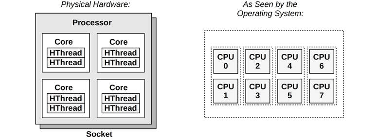
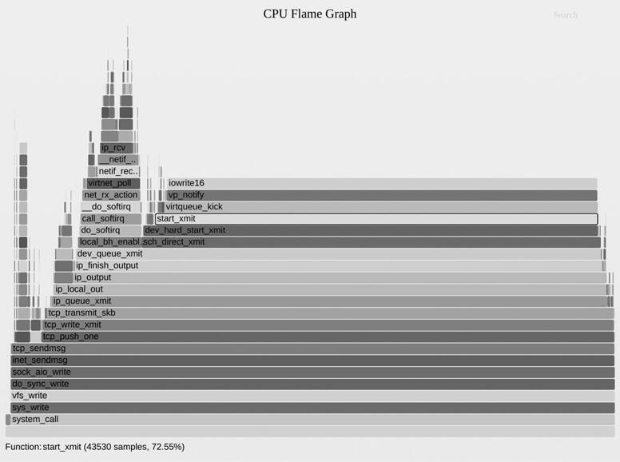

# Chapter 6

## CPUs

CPUs drive all software and are often the first target for systems performance analysis. This chapter explains CPU hardware and software, and shows how CPU usage can be examined in detail to look for performance improvements.

At a high level, system-wide CPU utilization can be monitored, and usage by process or thread can be examined. At a lower level, the code paths within applications and the kernel can be profiled and studied, as well as CPU usage by interrupts. At the lowest level, CPU instruction execution and cycle behavior can be analyzed. Other behaviors can also be investigated, including scheduler latency as tasks wait their turn on CPUs, which degrades performance.

The learning objectives of this chapter are:

- Understand CPU models and concepts.
- Become familiar with CPU hardware internals.
- Become familiar with CPU scheduler internals.
- Follow different methodologies for CPU analysis.
- Interpret load averages and PSI.
- Characterize system-wide and per-CPU utilization.
- Identify and quantify issues of scheduler latency.
- Perform CPU cycle analysis to identify inefficiencies.
- Investigate CPU usage using profilers and CPU flame graphs.
- Identify soft and hard IRQ CPU consumers.
- Interpret CPU flame graphs and other CPU visualizations.
- Become aware of CPU tunable parameters.

This chapter has six parts. The first three provide the basis for CPU analysis, and the last three show its practical application to Linux-based systems. The parts are:

- **Background** introduces CPU-related terminology, basic models of CPUs, and key CPU performance concepts.
- **Architecture** introduces processor and kernel scheduler architecture.
- **Methodology** describes performance analysis methodologies, both observational and experimental.
- **Observability Tools** describes CPU performance analysis tools on Linux-based systems, including profiling, tracing, and visualizations.
- **Experimentation** summarizes CPU benchmark tools.
- **Tuning** includes examples of tunable parameters.

The effects of memory I/O on CPU performance are covered, including CPU cycles stalled on memory and the performance of CPU caches. [Chapter 7](ch07.md), [Memory](ch07.md), continues the discussion of memory I/O, including MMU, NUMA/UMA, system interconnects, and memory buses.

### 6.1 Terminology

For reference, CPU-related terminology used in this chapter includes the following:

- **Processor**: The physical chip that plugs into a socket on the system or processor board and contains one or more CPUs implemented as cores or hardware threads.
- [**Core**](gloss.md): An independent CPU instance on a *multicore processor*. The use of cores is a way to scale processors, called *chip-level multiprocessing* (CMP).
- **Hardware thread**: A CPU architecture that supports executing multiple threads in parallel on a single core (including Intel’s Hyper-Threading Technology), where each thread is an independent CPU instance. This scaling approach is called *simultaneous multithreading* (SMT).
- **CPU instruction**: A single CPU operation, from its *instruction set*. There are instructions for arithmetic operations, memory I/O, and control logic.
- **Logical CPU**: Also called a *virtual processor,*[1](ch06.md) an operating system CPU instance (a schedulable CPU entity). This may be implemented by the processor as a hardware thread (in which case it may also be called a *virtual core*), a core, or a single-core processor.
  
  [1](ch06.md)It is also sometimes called a virtual CPU; however, that term is more commonly used to refer to virtual CPU instances provided by a virtualization technology. See [Chapter 11](ch11.md), [Cloud Computing](ch11.md).
- **Scheduler**: The kernel subsystem that assigns threads to run on CPUs.
- [**Run queue**](gloss.md): A queue of runnable threads that are waiting to be serviced by CPUs. Modern kernels may use some other data structure (e.g., a red-black tree) to store runnable threads, but we still often use the term run queue.

Other terms are introduced throughout this chapter. The Glossary includes basic terminology for reference, including *CPU*, [*CPU cycle*](gloss.md), and [*stack*](gloss.md). Also see the terminology sections in [Chapters 2](ch02.md) and [3](ch03.md).

### 6.2 Models

The following simple models illustrate some basic principles of CPUs and CPU performance. [Section 6.4](ch06.md), [Architecture](ch06.md), digs much deeper and includes implementation-specific details.

#### 6.2.1 CPU Architecture

[Figure 6.1](ch06.md) shows an example CPU architecture, for a single processor with four cores and eight hardware threads in total. The physical architecture is pictured, along with how it is seen by the operating system.[2](ch06.md)

[2](ch06.md)There is a tool for Linux, lstopo(1), that can generate diagrams similar to this figure for the current system, an example is in [Section 6.6.21](ch06.md), [Other Tools](ch06.md).



Figure 6.1 CPU architecture

Each hardware thread is addressable as a *logical CPU*, so this processor appears as eight CPUs. The operating system may have some additional knowledge of topology to improve its scheduling decisions, such as which CPUs are on the same core and how CPU caches are shared.

#### 6.2.2 CPU Memory Caches

Processors provide various hardware caches for improving memory I/O performance. [Figure 6.2](ch06.md) shows the relationship of cache sizes, which become smaller and faster (a trade-off) the closer they are to the CPU.


Figure 6.2 CPU cache sizes

The caches that are present, and whether they are on the processor (integrated) or external to the processor, depends on the processor type. Earlier processors provided fewer levels of integrated cache.

#### 6.2.3 CPU Run Queues

[Figure 6.3](ch06.md) shows a CPU run queue, which is managed by the kernel scheduler.


Figure 6.3 CPU run queue

The thread states shown in the figure, ready to run and on-CPU, are covered in [Figure 3.8](ch03.md) in [Chapter 3](ch03.md), [Operating Systems](ch03.md).

The number of software threads that are queued and ready to run is an important performance metric indicating CPU saturation. In this figure (at this instant) there are four, with an additional thread running on-CPU. The time spent waiting on a CPU run queue is sometimes called *run-queue latency* or *dispatcher-queue latency*. In this book, the term *scheduler latency* is often used, as it is appropriate for all schedulers, including those that do not use queues (see the discussion of CFS in [Section 6.4.2](ch06.md), [Software](ch06.md)).

For multiprocessor systems, the kernel typically provides a run queue for each CPU, and aims to keep threads on the same run queue. This means that threads are more likely to keep running on the same CPUs where the CPU caches have cached their data. These caches are described as having [*cache warmth*](gloss.md), and this strategy to keep threads running on the same CPUs is called *CPU affinity*. On NUMA systems, per-CPU run queues also improve *memory locality*. This improves performance by keeping threads running on the same memory node (as described in [Chapter 7](ch07.md), [Memory](ch07.md)), and avoids the cost of thread synchronization (mutex locks) for queue operations, which would hurt scalability if the run queue was global and shared among all CPUs.

### 6.3 Concepts

The following are a selection of important concepts regarding CPU performance, beginning with a summary of processor internals: the CPU clock rate and how instructions are executed. This is background for later performance analysis, particularly for understanding the instructions-per-cycle (IPC) metric.

#### 6.3.1 Clock Rate

The clock is a digital signal that drives all processor logic. Each CPU instruction may take one or more cycles of the clock (called *CPU cycles*) to execute. CPUs execute at a particular clock rate; for example, a 4 GHz CPU performs 4 billion clock cycles per second.

Some processors are able to vary their clock rate, increasing it to improve performance or decreasing it to reduce power consumption. The rate may be varied on request by the operating system, or dynamically by the processor itself. The kernel idle thread, for example, can request the CPU to throttle down to save power.

Clock rate is often marketed as the primary feature of a processor, but this can be a little misleading. Even if the CPU in your system appears to be fully utilized (a bottleneck), a faster clock rate may not speed up performance—it depends on what those fast CPU cycles are actually doing. If they are mostly stall cycles while waiting on memory access, executing them more quickly doesn’t actually increase the CPU instruction rate or workload throughput.

#### 6.3.2 Instructions

CPUs execute instructions chosen from their instruction set. An instruction includes the following steps, each processed by a component of the CPU called a *functional unit*:

1. Instruction fetch
2. Instruction decode
3. Execute
4. Memory access
5. Register write-back

The last two steps are optional, depending on the instruction. Many instructions operate on registers only and do not require the memory access step.

Each of these steps takes at least a single clock cycle to be executed. Memory access is often the slowest, as it may take dozens of clock cycles to read or write to main memory, during which instruction execution has *stalled* (and these cycles while stalled are called *stall cycles*). This is why CPU caching is important, as described in [Section 6.4.1](ch06.md), [Hardware](ch06.md): it can dramatically reduce the number of cycles needed for memory access.

#### 6.3.3 Instruction Pipeline

The instruction pipeline is a CPU architecture that can execute multiple instructions in parallel by executing different components of different instructions at the same time. It is similar to a factory assembly line, where stages of production can be executed in parallel, increasing throughput.

Consider the instruction steps previously listed. If each were to take a single clock cycle, it would take five cycles to complete the instruction. At each step of this instruction, only one functional unit is active and four are idle. By use of pipelining, multiple functional units can be active at the same time, processing different instructions in the pipeline. Ideally, the processor can then complete one instruction with every clock cycle.

Instruction pipelining may involve breaking down an instruction into multiple simple steps for execution in parallel. (Depending on the processor, these steps may become simple operations called *micro-operations* (uOps) for execution by a processor area called the *back-end*. The *front-end* of such a processor is responsible for fetching instructions and branch prediction.)

##### Branch Prediction

Modern processors can perform out-of-order execution of the pipeline, where later instructions can be completed while earlier instructions are stalled, improving instruction throughput. However, conditional branch instructions pose a problem. Branch instructions jump execution to a different instruction, and conditional branches do so based on a test. With conditional branches, the processor does not know what the later instructions will be. As an optimization, processors often implement *branch prediction*, where they will guess the outcome of the test and begin processing the outcome instructions. If the guess later proves to be wrong, the progress in the instruction pipeline must be discarded, hurting performance. To improve the chances of guessing correctly, programmers can place hints in the code (e.g., likely() and unlikely() macros in the Linux Kernel sources).

#### 6.3.4 Instruction Width

But we can go faster still. Multiple functional units of the same type can be included, so that even more instructions can make forward progress with each clock cycle. This CPU architecture is called *superscalar* and is typically used with pipelining to achieve a high instruction throughput.

The instruction *width* describes the target number of instructions to process in parallel. Modern processors are *3-wide* or *4-wide*, meaning they can complete up to three or four instructions per cycle. How this works depends on the processor, as there may be different numbers of functional units for each stage.

#### 6.3.5 Instruction Size

Another instruction characteristic is the instruction *size*: for some processor architectures it is variable: For example, x86, which is classified as a *complex instruction set computer* (CISC), allows up to 15-byte instructions. ARM, which is a *reduced instruction set computer* (RISC), has 4 byte instructions with 4-byte alignment for AArch32/A32, and 2- or 4-byte instructions for ARM Thumb.

#### 6.3.6 SMT

Simultaneous multithreading makes use of a superscalar architecture and hardware multithreading support (by the processor) to improve parallelism. It allows a CPU core to run more than one thread, effectively scheduling between them during instructions, e.g., when one instruction stalls on memory I/O. The kernel presents these hardware threads as virtual CPUs, and schedules threads and processes on them as usual. This was introduced and pictured in [Section 6.2.1](ch06.md), [CPU Architecture](ch06.md).

An example implementation is Intel’s Hyper-Threading Technology, where each core often has two hardware threads. Another example is POWER8, which has eight hardware threads per core.

The performance of each hardware thread is not the same as a separate CPU core, and depends on the workload. To avoid performance problems, kernels may spread out CPU load across cores so that only one hardware thread on each core is busy, avoiding hardware thread contention. Workloads that are stall cycle-heavy (low IPC) may also have better performance than those that are instruction-heavy (high IPC) because stall cycles reduce core contention.

#### 6.3.7 IPC, CPI

*Instructions per cycle* (IPC) is an important high-level metric for describing how a CPU is spending its clock cycles and for understanding the nature of CPU utilization. This metric may also be expressed as *cycles per instruction* (CPI), the inverse of IPC. IPC is more often used by the Linux community and by the Linux perf(1) profiler, and CPI more often used by Intel and elsewhere.[3](ch06.md)

[3](ch06.md)In the first edition of this book I used CPI; I’ve since switched to working more on Linux, including switching to IPC.

A low IPC indicates that CPUs are often stalled, typically for memory access. A high IPC indicates that CPUs are often not stalled and have a high instruction throughput. These metrics suggest where performance tuning efforts may be best spent.

Memory-intensive workloads, for example, may be improved by installing faster memory (DRAM), improving memory locality (software configuration), or reducing the amount of memory I/O. Installing CPUs with a higher clock rate may not improve performance to the degree expected, as the CPUs may need to wait the same amount of time for memory I/O to complete. Put differently, a faster CPU may mean more stall cycles but the same rate of completed instructions per second.

The actual values for high or low IPC are dependent on the processor and processor features and can be determined experimentally by running known workloads. As an example, you may find that low-IPC workloads run with an IPC at 0.2 or lower, and high IPC workloads run with an IPC of over 1.0 (which is possible due to instruction pipelining and width, described earlier). At Netflix, cloud workloads range from an IPC of 0.2 (considered slow) to 1.5 (considered good). Expressed as CPI, this range is 5.0 to 0.66.

It should be noted that IPC shows the efficiency of instruction *processing*, but not of the instructions themselves. Consider a software change that added an inefficient software loop, which operates mostly on CPU registers (no stall cycles): such a change may result in a higher overall IPC, but also higher CPU usage and utilization.

#### 6.3.8 Utilization

CPU utilization is measured by the time a CPU instance is busy performing work during an interval, expressed as a percentage. It can be measured as the time a CPU is not running the kernel idle thread but is instead running user-level application threads or other kernel threads, or processing interrupts.

High CPU utilization may not necessarily be a problem, but rather a sign that the system is doing work. Some people also consider this a return of investment (ROI) indicator: a highly utilized system is considered to have good ROI, whereas an idle system is considered wasted. Unlike with other resource types (disks), performance does not degrade steeply under high utilization, as the kernel supports priorities, preemption, and time sharing. These together allow the kernel to understand what has higher priority, and to ensure that it runs first.

The measure of CPU utilization spans all clock cycles for eligible activities, including memory stall cycles. This can be misleading: a CPU may be highly utilized because it is often stalled waiting for memory I/O, not just executing instructions, as described in the previous section. This is the case for the Netflix cloud, where the CPU utilization is mostly memory stall cycles [\[Gregg 17b\]](ch06.md).

CPU utilization is often split into separate kernel- and user-time metrics.

#### 6.3.9 User Time/Kernel Time

The CPU time spent executing user-level software is called *user time*, and kernel-level software is *kernel time*. Kernel time includes time during system calls, kernel threads, and interrupts. When measured across the entire system, the user time/kernel time ratio indicates the type of workload performed.

Applications that are computation-intensive may spend almost all their time executing user-level code and have a user/kernel ratio approaching 99/1. Examples include image processing, machine learning, genomics, and data analysis.

Applications that are I/O-intensive have a high rate of system calls, which execute kernel code to perform the I/O. For example, a web server performing network I/O may have a user/kernel ratio of around 70/30.

These numbers are dependent on many factors and are included to express the kinds of ratios expected.

#### 6.3.10 Saturation

A CPU at 100% utilization is *saturated*, and threads will encounter *scheduler latency* as they wait to run on-CPU, decreasing overall performance. This latency is the time spent waiting on the CPU run queue or other structure used to manage threads.

Another form of CPU saturation involves CPU resource controls, as may be imposed in a multi-tenant cloud computing environment. While the CPU may not be 100% utilized, the imposed limit has been reached, and threads that are runnable must wait their turn. How visible this is to users of the system depends on the type of virtualization in use; see [Chapter 11](ch11.md), [Cloud Computing](ch11.md).

A CPU running at saturation is less of a problem than other resource types, as higher-priority work can preempt the current thread.

#### 6.3.11 Preemption

Preemption, introduced in [Chapter 3](ch03.md), [Operating Systems](ch03.md), allows a higher-priority thread to preempt the currently running thread and begin its own execution instead. This eliminates the run-queue latency for higher-priority work, improving its performance.

#### 6.3.12 Priority Inversion

Priority inversion occurs when a lower-priority thread holds a resource and blocks a higher-priority thread from running. This reduces the performance of the higher-priority work, as it is blocked waiting.

This can be solved using a *priority inheritance* scheme. Here is an example of how this can work (based on a real-world case):

1. Thread A performs monitoring and has a low priority. It acquires an address space lock for a production database, to check memory usage.
2. Thread B, a routine task to perform compression of system logs, begins running.
3. There is insufficient CPU to run both. Thread B preempts A and runs.
4. Thread C is from the production database, has a high priority, and has been sleeping waiting for I/O. This I/O now completes, putting thread C back into the runnable state.
5. Thread C preempts B, runs, but then blocks on the address space lock held by thread A. Thread C leaves CPU.
6. The scheduler picks the next-highest-priority thread to run: B.
7. With thread B running, a high-priority thread, C, is effectively blocked on a lower-priority thread, B. This is priority inversion.
8. Priority inheritance gives thread A thread C’s high priority, preempting B, until it releases the lock. Thread C can now run.

Linux since 2.6.18 has provided a user-level mutex that supports priority inheritance, intended for real-time workloads [\[Corbet 06a\]](ch06.md).

#### 6.3.13 Multiprocess, Multithreading

Most processors provide multiple CPUs of some form. For an application to make use of them, it needs separate threads of execution so that it can run in parallel. For a 64-CPU system, for example, this may mean that an application can execute up to 64 times faster if it can make use of all CPUs in parallel, or handle 64 times the load. The degree to which the application can effectively scale with an increase in CPU count is a measure of *scalability*.

The two techniques to scale applications across CPUs are *multiprocess* and *multithreading*, which are pictured in [Figure 6.4](ch06.md). (Note that this is software multithreading, and not the hardware- based SMT mentioned earlier.)


Figure 6.4 Software CPU scalability techniques

On Linux both the multiprocess and multithread models may be used, and both are implemented by tasks.

Differences between multiprocess and multithreading are shown in [Table 6.1](ch06.md).

Table 6.1 **Multiprocess and multithreading attributes**

**Attribute**

**Multiprocess**

**Multithreading**

Development

Can be easier. Use of fork(2) or clone(2).

Use of threads API (pthreads).

Memory overhead

Separate address space per process consumes some memory resources (reduced to some degree by page- level copy-on-write).

Small. Requires only extra stack and register space, and space for thread-local data.

CPU overhead

Cost of fork(2)/clone(2)/exit(2), which includes MMU work to manage address spaces.

Small. API calls.

Communication

Via IPC. This incurs CPU cost including context switching for moving data between address spaces, unless shared memory regions are used.

Fastest. Direct access to shared memory. Integrity via synchronization primitives (e.g., mutex locks).

Crash resilience

High, processes are independent.

Low, any bug can crash the entire application.

Memory Usage

While some memory may be duplicated, separate processes can exit(2) and return all memory back to the system.

Via system allocator. This may incur some CPU contention from multiple threads, and fragmentation before memory is reused.

With all the advantages shown in the table, multithreading is generally considered superior, although more complicated for the developer to implement. Multithreaded programming is covered in [\[Stevens 13\]](ch06.md).

Whichever technique is used, it is important that enough processes or threads be created to span the desired number of CPUs—which, for maximum performance, may be all of the CPUs available. Some applications may perform better when running on fewer CPUs, when the cost of thread synchronization and reduced memory locality (NUMA) outweighs the benefit of running across more CPUs.

Parallel architectures are also discussed in [Chapter 5](ch05.md), [Applications](ch05.md), [Section 5.2.5](ch05.md), [Concurrency and Parallelism](ch05.md), which also summarizes co-routines.

#### 6.3.14 Word Size

Processors are designed around a maximum *word size*—32-bit or 64-bit—which is the integer size and register size. Word size is also commonly used, depending on the processor, for the address space size and data path width (where it is sometimes called the *bit width*).

Larger sizes can mean better performance, although it’s not as simple as it sounds. Larger sizes may cause memory overheads for unused bits in some data types. The data footprint also increases when the size of pointers (word size) increases, which can require more memory I/O. For the x86 64-bit architecture, these overheads are compensated by an increase in registers and a more efficient register calling convention, so 64-bit applications will likely be faster than their 32-bit versions.

Processors and operating systems can support multiple word sizes and can run applications compiled for different word sizes simultaneously. If software has been compiled for the smaller word size, it may execute successfully but perform relatively poorly.

#### 6.3.15 Compiler Optimization

The CPU runtime of applications can be significantly improved through compiler options (including setting the word size) and optimizations. Compilers are also frequently updated to take advantage of the latest CPU instruction sets and to implement other optimizations. Sometimes application performance can be significantly improved simply by using a newer compiler.

This topic is covered in more detail in [Chapter 5](ch05.md), [Applications](ch05.md), [Section 5.3.1](ch05.md), [Compiled Languages](ch05.md).

### 6.4 Architecture

This section introduces CPU architecture and implementation, for both hardware and software. Simple CPU models were introduced in [Section 6.2](ch06.md), [Models](ch06.md), and generic concepts in the previous section.

Here I summarize these topics as background for performance analysis. For more details, see vendor processor manuals and documentation on operating system internals. Some are listed at the end of this chapter.

#### 6.4.1 Hardware

CPU hardware includes the processor and its subsystems, and the CPU interconnect for multiprocessor systems.

##### Processor

Components of a generic two-core processor are shown in [Figure 6.5](ch06.md).


Figure 6.5 Generic two-core processor components

The *control unit* is the heart of the CPU, performing instruction fetch, decoding, managing execution, and storing results.

This example processor depicts a shared floating-point unit and (optional) shared Level 3 cache. The actual components in your processor will vary depending on its type and model. Other performance-related components that may be present include:

- **P-cache**: Prefetch cache (per CPU core)
- **W-cache**: Write cache (per CPU core)
- **Clock**: Signal generator for the CPU clock (or provided externally)
- **Timestamp counter**: For high-resolution time, incremented by the clock
- **Microcode ROM**: Quickly converts instructions to circuit signals
- **Temperature sensors**: For thermal monitoring
- **Network interfaces**: If present on-chip (for high performance)

Some processor types use the temperature sensors as input for dynamic overclocking of individual cores (including Intel Turbo Boost technology), increasing the clock rate while the core remains in its temperature envelope. The possible clock rates can be defined by P-states.

##### P-States and C-States

The *advanced configuration and power interface* (ACPI) standard, in use by Intel processors, defines *processor performance states* (P-states) and *processor power states* (C-states) [\[ACPI 17\]](ch06.md).

P-states provide different levels of performance during normal execution by varying the CPU frequency: P0 is the highest frequency (for some Intel CPUs this is the highest “turbo boost” level) and P1...N are lower-frequency states. These states can be controlled by both hardware (e.g., based on the processor temperature) or via software (e.g., kernel power saving modes). The current operating frequency and available states can be observed using model-specific registers (MSRs) (e.g., using the showboost(8) tool in [Section 6.6.10](ch06.md), [showboost](ch06.md)).

C-states provide different idle states for when execution is halted, saving power. The C-states are shown in [Table 6.2](ch06.md): C0 is for normal operation, and C1 and above are for idle states: the higher the number, the deeper the state.

Table 6.2 **Processor power states (C-states)**

**C-state**

**Description**

C0

Executing. The CPU is fully on, processing instructions.

C1

Halts execution. Entered by the hlt instruction. Caches are maintained. Wakeup latency is the lowest from this state.

C1E

Enhanced halt with lower power consumption (supported by some processors).

C2

Halts execution. Entered by a hardware signal. This is a deeper sleep state with higher wakeup latency.

C3

A deeper sleep state with improved power savings over C1 and C2. The caches may maintain state, but stop snooping (cache coherency), deferring it to the OS.

Processor manufacturers can define additional states beyond C3. Some Intel processors define additional levels up to C10 where more processor functionality is powered down, including cache contents.

##### CPU Caches

Various hardware caches are usually included in the processor (where they are referred to as *on-chip*, *on-die*, *embedded*, or *integrated*) or with the processor (*external*). These improve memory performance by using faster memory types for caching reads and buffering writes. The levels of cache access for a generic processor are shown in [Figure 6.6](ch06.md).


Figure 6.6 CPU cache hierarchy

They include:

- **Level 1 instruction cache** (I$)
- **Level 1 data cache** (D$)
- **Translation lookaside buffer** (TLB)
- **Level 2 cache** (E$)
- **Level 3 cache** (optional)

The *E* in E$ originally stood for *external* cache, but with the integration of Level 2 caches it has since been cleverly referred to as *embedded* cache. The “Level” terminology is used nowadays instead of the “E$”-style notation, which avoids such confusion.

It is often desirable to refer to the last cache before main memory, which may or may not be level 3. Intel uses the term *last-level cache* (LLC) for this, also described as the *longest-latency cache*.

The caches available on each processor depend on its type and model. Over time, the number and sizes of these caches have been increasing. This is illustrated in [Table 6.3](ch06.md), which lists example Intel processors since 1978, including advances in caches [\[Intel 19a\]](ch06.md)[\[Intel 20a\]](ch06.md).

Table 6.3 **Example Intel processor cache sizes from 1978 to 2019**

**Processor**

**Year**

**Max Clock**

**Cores/Threads**

**Transistors**

**Data Bus (bits)**

**Level 1**

**Level 2**

**Level 3**

8086

1978

8 MHz

1/1

29 K

16

—

Intel 286

1982

12.5 MHz

1/1

134 K

16

—

Intel 386 DX

1985

20 MHz

1/1

275 K

32

—

—

—

Intel 486 DX

1989

25 MHz

1/1

1.2 M

32

8 KB

—

—

Pentium

1993

60 MHz

1/1

3.1 M

64

16 KB

—

—

Pentium Pro

1995

200 MHz

1/1

5.5 M

64

16 KB

256/ 512 KB

—

Pentium II

1997

266 MHz

1/1

7 M

64

32 KB

256/ 512 KB

—

Pentium III

1999

500 MHz

1/1

8.2 M

64

32 KB

512 KB

—

Intel Xeon

2001

1.7 GHz

1/1

42 M

64

8 KB

512 KB

—

Pentium M

2003

1.6 GHz

1/1

77 M

64

64 KB

1 MB

—

Intel Xeon MP 3.33

2005

3.33 GHz

1/2

675 M

64

16 KB

1 MB

8 MB

Intel Xeon 7140M

2006

3.4 GHz

2/4

1.3 B

64

16 KB

1 MB

16 MB

Intel Xeon 7460

2008

2.67 GHz

6/6

1.9 B

64

64 KB

3 MB

16 MB

Intel Xeon 7560

2010

2.26 GHz

8/16

2.3 B

64

64 KB

256 KB

24 MB

Intel Xeon E7- 8870

2011

2.4 GHz

10/20

2.2 B

64

64 KB

256 KB

30 MB

Intel Xeon E7- 8870v2

2014

3.1 GHz

15/30

4.3 B

64

64 KB

256 KB

37.5 MB

Intel Xeon E7- 8870v3

2015

2.9 GHz

18/36

5.6 B

64

64 KB

256 KB

45 MB

Intel Xeon E7- 8870v4

2016

3.0 GHz

20/40

7.2 B

64

64 KB

256 KB

50 MB

Intel Platinum 8180

2017

3.8 GHz

28/56

8.0 B

64

64 KB

1 MB

38.5 MB

Intel Xeon Platinum 9282

2019

3.8 GHz

56/112

8.0 B

64

64 KB

1 MB

77 MB

For multicore and multithreading processors, some caches may be shared between cores and threads. For the examples in [Table 6.3](ch06.md), all processors since the Intel Xeon 7460 (2008) have multiple Level 1 and Level 2 caches, typically one for each core (the sizes in the table refer to the per-core cache, not the total size).

Apart from the increasing number and sizes of CPU caches, there is also a trend toward providing these on-chip, where access latency can be minimized, instead of providing them externally to the processor.

###### Latency

Multiple levels of cache are used to deliver the optimum configuration of size and latency. The access time for the Level 1 cache is typically a few CPU clock cycles, and for the larger Level 2 cache around a dozen clock cycles. Main memory access can take around 60 ns (around 240 cycles for a 4 GHz processor), and address translation by the MMU also adds latency.

The CPU cache latency characteristics for your processor can be determined experimentally using micro-benchmarking [\[Ruggiero 08\]](ch06.md). [Figure 6.7](ch06.md) shows the result of this, plotting memory access latency for an Intel Xeon E5620 2.4 GHz tested over increasing ranges of memory using LMbench [\[McVoy 12\]](ch06.md).


Figure 6.7 Memory access latency testing

Both axes are logarithmic. The steps in the graphs show when a cache level was exceeded, and access latency becomes a result of the next (slower) cache level.

###### Associativity

Associativity is a cache characteristic describing a constraint for locating new entries in the cache. Types are:

- **Fully associative**: The cache can locate new entries anywhere. For example, a least recently used (LRU) algorithm could be used for eviction across the entire cache.
- **Direct mapped**: Each entry has only one valid location in the cache, for example, a hash of the memory address, using a subset of the address bits to form an address in the cache.
- **Set associative**: A subset of the cache is identified by mapping (e.g., hashing) from within which another algorithm (e.g., LRU) may be performed. It is described in terms of the subset size; for example, *four-way set associative* maps an address to four possible locations, and then picks the best from those four (e.g., the least recently used location).

CPU caches often use set associativity as a balance between fully associative (which is expensive to perform) and direct mapped (which has poor hit rates).

###### Cache Line

Another characteristic of CPU caches is their *cache line* size. This is a range of bytes that are stored and transferred as a unit, improving memory throughput. A typical cache line size for x86 processors is 64 bytes. Compilers take this into account when optimizing for performance. Programmers sometimes do as well; see Hash Tables in [Chapter 5](ch05.md), [Applications](ch05.md), [Section 5.2.5](ch05.md), [Concurrency and Parallelism](ch05.md).

###### Cache Coherency

Memory may be cached in multiple CPU caches on different processors at the same time. When one CPU modifies memory, all caches need to be aware that their cached copy is now *stale* and should be discarded, so that any future reads will retrieve the newly modified copy. This process, called *cache coherency*, ensures that CPUs are always accessing the correct state of memory.

One of the effects of cache coherency is LLC access penalties. The following examples are provided as a rough guide (these are from [\[Levinthal 09\]](ch06.md)):

- LLC hit, line unshared: ~40 CPU cycles
- LLC hit, line shared in another core: ~65 CPU cycles
- LLC hit, line modified in another core: ~75 CPU cycles

Cache coherency is one of the greatest challenges in designing scalable multiprocessor systems, as memory can be modified rapidly.

##### MMU

The memory management unit (MMU) is responsible for virtual-to-physical address translation.


Figure 6.8 Memory management unit and CPU caches

A generic MMU is pictured in [Figure 6.8](ch06.md), along with CPU cache types. This MMU uses an on-chip translation lookaside buffer (TLB) to cache address translations. Cache misses are satisfied by translation tables in main memory (DRAM), called *page tables*, which are read directly by the MMU (hardware) and maintained by the kernel.

These factors are processor-dependent. Some (older) processors handle TLB misses using kernel software to walk the page tables, and then populate the TLB with the requested mappings. Such software may maintain its own, larger, in-memory cache of translations, called the *translation storage buffer* (TSB). Newer processors can service TLB misses in hardware, greatly reducing their cost.

##### Interconnects

For multiprocessor architectures, processors are connected using either a shared system bus or a dedicated interconnect. This is related to the memory architecture of the system, uniform memory access (UMA) or NUMA, as discussed in [Chapter 7](ch07.md), [Memory](ch07.md).

A shared system bus, called the *front-side bus*, used by earlier Intel processors is illustrated by the four-processor example in [Figure 6.9](ch06.md).


Figure 6.9 Example Intel front-side bus architecture, four-processor

The use of a system bus has scalability problems when the processor count is increased, due to contention for the shared bus resource. Modern servers are typically multiprocessor, NUMA, and use a CPU interconnect instead.

Interconnects can connect components other than processors, such as I/O controllers. Example interconnects include Intel’s Quick Path Interconnect (QPI), Intel’s Ultra Path Interconnect (UPI), AMD’s HyperTransport (HT), ARM’s CoreLink Interconnects (there are three different types), and IBM’s Coherent Accelerator Processor Interface (CAPI). An example Intel QPI architecture for a four-processor system is shown in [Figure 6.10](ch06.md).


Figure 6.10 Example Intel QPI architecture, four-processor

The private connections between processors allow for non-contended access and also allow higher bandwidths than the shared system bus. Some example speeds for Intel FSB and QPI are shown in [Table 6.4](ch06.md) [\[Intel 09\]](ch06.md)[\[Mulnix 17\]](ch06.md).

Table 6.4 **Intel CPU interconnect example bandwidths**

**Intel**

**Transfer Rate**

**Width**

[**Bandwidth**](gloss.md)

FSB (2007)

1.6 GT/s

8 bytes

12.8 Gbytes/s

QPI (2008)

6.4 GT/s

2 bytes

25.6 Gbytes/s

UPI (2017)

10.4 GT/s

2 bytes

41.6 Gbytes/s

To explain how transfer rates can relate to bandwidth, I will explain the QPI example, which is for a 3.2 GHz clock. QPI is *double-pumped*, performing a data transfer on both rising and falling edges of the clock.[4](ch06.md) This doubles the transfer rate (3.2 GHz × 2 = 6.4 GT/s). The final bandwidth of 25.6 Gbytes/s is for both send and receive directions (6.4 GT/s × 2 byte width × 2 directions = 25.6 Gbytes/s).

[4](ch06.md)There is also *quad-pumped*, where data is transferred on the rising edge, peak, falling edge, and trough of the clock cycle. Quad pumping is used by the Intel FSB.

An interesting detail of QPI is that its cache coherency mode could be tuned in the BIOS, with options including Home Snoop to optimize for memory bandwidth, Early Snoop to optimize for memory latency, and Directory Snoop to improve scalability (it involves tracking what is shared). UPI, which is replacing QPI, only supports Directory Snoop.

Apart from external interconnects, processors have internal interconnects for core communication.

Interconnects are typically designed for high bandwidth, so that they do not become a systemic bottleneck. If they do, performance will degrade as CPU instructions encounter stall cycles for operations that involve the interconnect, such as remote memory I/O. A key indicator for this is a drop in IPC. CPU instructions, cycles, IPC, stall cycles, and memory I/O can be analyzed using CPU performance counters.

##### Hardware Counters (PMCs)

Performance monitoring counters (PMCs) were summarized as a source of observability statistics in [Chapter 4](ch04.md), [Observability Tools](ch04.md), [Section 4.3.9](ch04.md), [Hardware Counters (PMCs)](ch04.md). This section describes their CPU implementation in more detail, and provides additional examples.

PMCs are processor registers implemented in hardware that can be programmed to count low-level CPU activity. They typically include counters for the following:

- **CPU cycles**: Including stall cycles and types of stall cycles
- **CPU instructions**: Retired (executed)
- **Level 1, 2, 3 cache accesses**: Hits, misses
- **Floating-point unit**: Operations
- **Memory I/O**: Reads, writes, stall cycles
- **Resource I/O**: Reads, writes, stall cycles

Each CPU has a small number of registers, usually between two and eight, that can be programmed to record events like these. Those available depend on the processor type and model and are documented in the processor manual.

As a relatively simple example, the Intel P6 family of processors provide performance counters via four model-specific registers (MSRs). Two MSRs are the counters and are read-only. The other two MSRs, called *event-select* MSRs, are used to program the counters and are read-write. The performance counters are 40-bit registers, and the event-select MSRs are 32-bit. The format of the event-select MSRs is shown in [Figure 6.11](ch06.md).


Figure 6.11 Example Intel performance event-select MSR

The counter is identified by the event select and the UMASK. The event select identifies the type of event to count, and the UMASK identifies subtypes or groups of subtypes. The OS and USR bits can be set so that the counter is incremented only while in kernel mode (OS) or user mode (USR), based on the processor protection rings. The CMASK can be set to a threshold of events that must be reached before the counter is incremented.

The Intel processor manual (volume 3B [\[Intel 19b\]](ch06.md)) lists the dozens of events that can be counted by their event-select and UMASK values. The selected examples in [Table 6.5](ch06.md) provide an *idea* of the different targets (processor functional units) that may be observable, including descriptions from the manual. You will need to refer to your current processor manual to see what you actually have.

Table 6.5 **Selected examples of Intel CPU performance counters**

**Event Select**

**UMASK**

**Unit**

**Name**

**Description**

0x43

0x00

Data cache

DATA\_MEM\_REFS

All loads from any memory type. All stores to any memory type. Each part of a split is counted separately. ... Does not include I/O accesses or other non-memory accesses.

0x48

0x00

Data cache

DCU\_MISS_ OUTSTANDING

Weighted number of cycles while a DCU miss is outstanding, incremented by the number of outstanding cache misses at any particular time. Cacheable read requests only are considered. ...

0x80

0x00

Instruction fetch unit

IFU\_IFETCH

Number of instruction fetches, both cacheable and noncacheable, including UC (uncacheable) fetches.

0x28

0x0F

L2 cache

L2\_IFETCH

Number of L2 instruction fetches. ...

0xC1

0x00

Floating- point unit

FLOPS

Number of computational floating-point operations retired. ...

0x7E

0x00

External bus logic

BUS\_SNOOP_ STALL

Number of clock cycles during which the bus is snoop stalled.

0xC0

0x00

Instruction decoding and retirement

INST\_RETIRED

Number of instructions retired.

0xC8

0x00

Interrupts

HW\_INT\_RX

Number of hardware interrupts received.

0xC5

0x00

Branches

BR\_MISS\_PRED_ RETIRED

Number of mis-predicted branches retired.

0xA2

0x00

Stalls

RESOURCE_ STALLS

Incremented by one during every cycle for which there is a resource-related stall. ...

0x79

0x00

Clocks

CPU\_CLK\_UNHALTED

Number of cycles during which the processor is not halted.

There are many, many more counters, especially for newer processors.

Another processor detail to be aware of is how many hardware counter registers it provides. For example, the Intel Skylake microarchitecture provides three fixed counters per hardware thread, and an additional eight programmable counters per core (“general-purpose”). These are 48-bit counters when read.

For more examples of PMCs, see [Table 4.4](ch04.md) in [Section 4.3.9](ch04.md) for the Intel architectural set. [Section 4.3.9](ch04.md) also provides PMC references for AMD and ARM processor vendors.

##### GPUs

Graphics processing units (GPUs) were created to support graphical displays, and are now finding use in other workloads including artificial intelligence, machine learning, analytics, image processing, and cryptocurrency mining. For servers and cloud instances, a GPU is a processor-like resource that can execute a portion of a workload, called the *compute kernel*, that is suited to highly parallel data processing such as matrix transformations. General-purpose GPUs from Nvidia using its Compute Unified Device Architecture (CUDA) have seen widespread adoption. CUDA provides APIs and software libraries for using Nvidia GPUs.

While a processor (CPU) may contain a dozen cores, a GPU may contain hundreds or thousands of smaller cores called *streaming processors* (SPs),[5](ch06.md) which each can execute a thread*.* Since GPU workloads are highly parallel, threads that can execute in parallel are grouped into *thread blocks,* where they may cooperate among themselves. These thread blocks may be executed by groups of SPs called *streaming multiprocessors* (SMs) that also provide other resources including a memory cache. [Table 6.6](ch06.md) further compares processors (CPUs) with GPUs [\[Ather 19\]](ch06.md).

[5](ch06.md)Nvidia also calls these *CUDA* cores [\[Verma 20\]](ch06.md).

Table 6.6 **CPUs versus GPUs**

**Attribute**

**CPU**

[**GPU**](gloss.md)

Package

A processor package plugs into a socket on the system board, connected directly to the system bus or CPU interconnect.

A GPU is typically provided as an expansion card and connected via an expansion bus (e.g., PCIe). They may also be embedded on a system board or in a processor package (on-chip).

Package scalability

Multi-socket configurations, connected via a CPU interconnect (e.g., Intel UPI).

Multi-GPU configurations are possible, connected via a GPU-to-GPU interconnect (e.g., NVIDIA's NVLink).

Cores

A typical processor of today contains 2 to 64 cores.

A GPU may have a similar number of streaming multiprocessors (SMs).

Threads

A typical core may execute two hardware threads (or more, depending on the processor).

An SM may contain dozens or hundreds of streaming processors (SPs). Each SP can only execute one thread.

Caches

Each core has L2 and L2 caches, and may share an L3 cache.

Each SM has a cache, and may share an L2 cache between them.

Clock

High (e.g., 3.4 GHz).

Relatively lower (e.g., 1.0 GHz).

Custom tools must be used for GPU observability. Possible GPU performance metrics include the instructions per cycle, cache hit ratios, and memory bus utilization.

##### Other Accelerators

Apart from GPUs, be aware that other accelerators may exist for offloading CPU work to faster application-specific integrated circuits. These include field-programmable gate arrays (FPGAs) and tensor processing units (TPUs). If in use, their usage and performance should be analyzed alongside CPUs, although they typically require custom tooling.

GPUs and FPGAs are used to improve the performance of cryptocurrency mining.

#### 6.4.2 Software

Kernel software to support CPUs includes the scheduler, scheduling classes, and the idle thread.

##### Scheduler

Key functions of the kernel CPU scheduler are shown in [Figure 6.12](ch06.md).


Figure 6.12 Kernel CPU scheduler functions

These functions are:

- **Time sharing**: Multitasking between runnable threads, executing those with the highest priority first.
- **Preemption**: For threads that have become runnable at a high priority, the scheduler can preempt the currently running thread, so that execution of the higher-priority thread can begin immediately.
- **Load balancing**: Moving runnable threads to the run queues of idle or less-busy CPUs.

[Figure 6.12](ch06.md) shows run queues, which is how scheduling was originally implemented. The term and mental model are still used to describe waiting tasks. However, the Linux CFS scheduler actually uses a red/black tree of future task execution.

In Linux, time sharing is driven by the system timer interrupt by calling scheduler\_tick(), which calls scheduler class functions to manage priorities and the expiration of units of CPU time called *time slices*. Preemption is triggered when threads become runnable and the scheduler class check\_preempt\_curr() function is called. Thread switching is managed by \_\_schedule(), which selects the highest-priority thread via pick\_next\_task() for running. Load balancing is performed by the load\_balance() function.

The Linux scheduler also uses logic to avoid migrations when the cost is expected to exceed the benefit, preferring to leave busy threads running on the same CPU where the CPU caches should still be warm (CPU affinity). In the Linux source, see the idle\_balance() and task\_hot() functions.

Note that all these function names may change; refer to the Linux source code, including documentation in the Documentation directory, for more detail.

##### Scheduling Classes

Scheduling classes manage the behavior of runnable threads, specifically their priorities, whether their on-CPU time is *time-sliced*, and the duration of those *time slices* (also known as *time quanta*). There are also additional controls via scheduling *policies*, which may be selected within a scheduling class and can control scheduling between threads of the same priority. [Figure 6.13](ch06.md) depicts them for Linux along with the thread priority range.


Figure 6.13 Linux thread scheduler priorities

The priority of user-level threads is affected by a user-defined *nice* value, which can be set to lower the priority of unimportant work (so as to be *nice* to other system users). In Linux, the nice value sets the *static priority* of the thread, which is separate from the *dynamic priority* that the scheduler calculates.

For Linux kernels, the scheduling classes are:

- **RT**: Provides fixed and high priorities for real-time workloads. The kernel supports both user- and kernel-level preemption, allowing RT tasks to be dispatched with low latency. The priority range is 0–99 (MAX\_RT\_PRIO-1).
- **O(1)**: The O(1) scheduler was introduced in Linux 2.6 as the default time-sharing scheduler for user processes. The name comes from the algorithm complexity of O(1) (see [Chapter 5](ch05.md), [Applications](ch05.md), for a summary of big O notation). The prior scheduler contained routines that iterated over all tasks, making it O(n), which became a scalability issue. The O(1) scheduler dynamically improved the priority of I/O-bound over CPU-bound workloads, to reduce the latency of interactive and I/O workloads.
- **CFS**: Completely fair scheduling was added to the Linux 2.6.23 kernel as the default time-sharing scheduler for user processes. The scheduler manages tasks on a red-black tree keyed from the task CPU time, instead of traditional run queues. This allows low CPU consumers to be easily found and executed in preference to CPU-bound workloads, improving the performance of interactive and I/O-bound workloads.
- **Idle**: Runs threads with the lowest possible priority.
- **Deadline**: Added to Linux 3.14, applies earliest deadline first (EDF) scheduling using three parameters: *runtime*, *period*, and *deadline*. A task should receive runtime microseconds of CPU time every period microseconds, and do so within the deadline.

To select a scheduling class, user-level processes select a *scheduling policy* that maps to a class, using either the sched\_setscheduler(2) syscall or the chrt(1) tool.

Scheduler policies are:

- **RR**: SCHED\_RR is round-robin scheduling. Once a thread has used its time quantum, it is moved to the end of the run queue for that priority level, allowing others of the same priority to run. Uses the RT scheduling class.
- **FIFO**: SCHED\_FIFO is first-in, first-out scheduling, which continues running the thread at the head of the run queue until it voluntarily leaves, or until a higher-priority thread arrives. The thread continues to run, even if other threads of the same priority are on the run queue. Uses the RT class.
- **NORMAL**: SCHED\_NORMAL (previously known as SCHED\_OTHER) is time-sharing scheduling and is the default for user processes. The scheduler dynamically adjusts priority based on the scheduling class. For O(1), the time slice duration is set based on the static priority: longer durations for higher-priority work. For CFS, the time slice is dynamic. Uses the CFS scheduling class.
- **BATCH**: SCHED\_BATCH is similar to SCHED\_NORMAL, but with the expectation that the thread will be CPU-bound and should not be scheduled to interrupt other I/O-bound interactive work. Uses the CFS scheduling class.
- **IDLE**: SCHED\_IDLE uses the Idle scheduling class.
- **DEADLINE**: SCHED\_DEADLINE uses the Deadline scheduling class.

Other classes and policies may be added over time. Scheduling algorithms have been researched that are *hyperthreading-aware* [\[Bulpin 05\]](ch06.md) and *temperature-aware* [\[Otto 06\]](ch06.md), which optimize performance by accounting for additional processor factors.

When there is no thread to run, a special *idle task* (also called *idle thread*) is executed as a placeholder until another thread is runnable.

##### Idle Thread

Introduced in [Chapter 3](ch03.md), the kernel “idle” thread (or *idle task*) runs on-CPU when there is no other runnable thread and has the lowest possible priority. It is usually programmed to inform the processor that CPU execution may either be halted (halt instruction) or throttled down to conserve power. The CPU will wake up on the next hardware interrupt.

##### NUMA Grouping

Performance on NUMA systems can be significantly improved by making the kernel *NUMA-aware*, so that it can make better scheduling and memory placement decisions. This can automatically detect and create groups of localized CPU and memory resources and organize them in a topology to reflect the NUMA architecture. This topology allows the cost of any memory access to be estimated.

On Linux systems, these are called *scheduling domains*, which are in a topology beginning with the *root domain*.

A manual form of grouping can be performed by the system administrator, either by binding processes to run on one or more CPUs only, or by creating an exclusive set of CPUs for processes to run on. See [Section 6.5.10](ch06.md), [CPU Binding](ch06.md).

##### Processor Resource-Aware

The CPU resource topology can also be understood by the kernel so that it can make better scheduling decisions for power management, hardware cache usage, and load balancing.

### 6.5 Methodology

This section describes various methodologies and exercises for CPU analysis and tuning. [Table 6.7](ch06.md) summarizes the topics.

Table 6.7 **CPU performance methodologies**

**Section**

**Methodology**

**Types**

[6.5.1](ch06.md)

Tools method

Observational analysis

[6.5.2](ch06.md)

USE method

Observational analysis

[6.5.3](ch06.md)

Workload characterization

Observational analysis, capacity planning

[6.5.4](ch06.md)

Profiling

Observational analysis

[6.5.5](ch06.md)

Cycle analysis

Observational analysis

[6.5.6](ch06.md)

Performance monitoring

Observational analysis, capacity planning

[6.5.7](ch06.md)

Static performance tuning

Observational analysis, capacity planning

[6.5.8](ch06.md)

Priority tuning

Tuning

[6.5.9](ch06.md)

Resource controls

Tuning

[6.5.10](ch06.md)

CPU binding

Tuning

[6.5.11](ch06.md)

Micro-benchmarking

Experimental analysis

See [Chapter 2](ch02.md), [Methodologies](ch02.md), for more methodologies and the introduction to many of these. You are not expected to use them all; treat this as a cookbook of recipes that may be followed individually or used in combination.

My suggestion is to use the following, in this order: performance monitoring, the USE method, profiling, micro-benchmarking, and static performance tuning.

[Section 6.6](ch06.md), [Observability Tools](ch06.md), and later sections, show the operating system tools for applying these methodologies.

#### 6.5.1 Tools Method

The tools method is a process of iterating over available tools, examining key metrics that they provide. While this is a simple methodology, it can overlook issues for which the tools provide poor or no visibility, and it can be time-consuming to perform.

For CPUs, the tools method can involve checking the following (Linux):

- **`uptime/top`** : Check the load averages to see if load is increasing or decreasing over time. Bear this in mind when using the following tools, as load may be changing during your analysis.
- **`vmstat`** : Run vmstat(1) with a one-second interval and check the system-wide CPU utilization (“us” + “sy”). Utilization approaching 100% increases the likelihood of scheduler latency.
- **`mpstat`** : Examine statistics per-CPU and check for individual hot (busy) CPUs, identifying a possible thread scalability problem.
- **`top`** : See which processes and users are the top CPU consumers.
- **`pidstat`** : Break down the top CPU consumers into user- and system-time.
- **`perf/profile`** : Profile CPU usage stack traces for both user- or kernel-time, to identify why the CPUs are in use.
- **`perf`** : Measure IPC as an indicator of cycle-based inefficiencies.
- **`showboost/turboboost`** : Check the current CPU clock rates, in case they are unusually low.
- **`dmesg`** : Check for CPU temperature stall messages (“cpu clock throttled”).

If an issue is found, examine all fields from the available tools to learn more context. See [Section 6.6](ch06.md), [Observability Tools](ch06.md), for more about each tool.

#### 6.5.2 USE Method

The USE method can be used to identify bottlenecks and errors across all components early in a performance investigation, before trying deeper and more time-consuming strategies.

For each CPU, check for:

- **Utilization**: The time the CPU was busy (not in the idle thread)
- **Saturation**: The degree to which runnable threads are queued waiting their turn on-CPU
- **Errors**: CPU errors, including correctable errors

You can check errors first since they are typically quick to check and the easiest to interpret. Some processors and operating systems will sense an increase in correctable errors (error-correction code, ECC) and will offline a CPU as a precaution, before an uncorrectable error causes a CPU failure. Checking for these errors can be a matter of checking that all CPUs are still online.

Utilization is usually readily available from operating system tools as *percent busy*. This metric should be examined per CPU, to check for scalability issues. High CPU and core utilization can be understood by using profiling and cycle analysis.

For environments that implement CPU limits or quotas (resource controls; e.g., Linux tasksets and cgroups), as is common in cloud computing environments, CPU utilization should be measured in terms of the imposed limit, in addition to the physical limit. Your system may exhaust its CPU quota well before the physical CPUs reach 100% utilization, encountering saturation earlier than expected.

Saturation metrics are commonly provided system-wide, including as part of load averages. This metric quantifies the degree to which the CPUs are overloaded, or a CPU quota, if present, is used up.

You can follow a similar process for checking the health of GPUs and other accelerators, if in use, depending on available metrics.

#### 6.5.3 Workload Characterization

Characterizing the load applied is important in capacity planning, benchmarking, and simulating workloads. It can also lead to some of the largest performance gains by identifying unnecessary work that can be eliminated.

Basic attributes for characterizing CPU workload are:

- CPU load averages (utilization + saturation)
- User-time to system-time ratio
- Syscall rate
- Voluntary context switch rate
- Interrupt rate

The intent is to characterize the applied load, not the delivered performance. The load averages on some operating systems (e.g., Solaris) show CPU demand only, making them a primary metric for CPU workload characterization. On Linux, however, load averages include other load types. See the example and further explanation in [Section 6.6.1](ch06.md), [uptime](ch06.md).

The rate metrics are a little harder to interpret, as they reflect both the applied load and to some degree the delivered performance, which can throttle their rate.[6](ch06.md)

[6](ch06.md)E.g., imagine finding that a given batch computing workload has higher syscall rates when run on faster CPUs, even though the workload is the same. It completes sooner!

The user-time to system-time ratio shows the type of load applied, as introduced earlier in [Section 6.3.9](ch06.md), [User Time/Kernel Time](ch06.md). High user time rates are due to applications spending time performing their own compute. High system time shows time spent in the kernel instead, which may be further understood by the syscall and interrupt rate. I/O-bound workloads have higher system time, syscalls, and higher voluntary context switches than CPU-bound workloads as threads block waiting for I/O.

Here is an example workload description, designed to show how these attributes can be expressed together:

On an average 48-CPU application server, the load average varies between 30 and 40 during the day. The user/system ratio is 95/5, as this is a CPU-intensive workload. There are around 325 K syscalls/s, and around 80 K voluntary context switches/s.

These characteristics can vary over time as different load is encountered.

##### Advanced Workload Characterization/Checklist

Additional details may be included to characterize the workload. These are listed here as questions for consideration, which may also serve as a checklist when studying CPU issues thoroughly:

- What is the CPU utilization system-wide? Per CPU? Per core?
- How parallel is the CPU load? Is it single-threaded? How many threads?
- Which applications or users are using the CPUs? How much?
- Which kernel threads are using the CPUs? How much?
- What is the CPU usage of interrupts?
- What is the CPU interconnect utilization?
- Why are the CPUs being used (user- and kernel-level call paths)?
- What types of stall cycles are encountered?

See [Chapter 2](ch02.md), [Methodologies](ch02.md), for a higher-level summary of this methodology and the characteristics to measure (who, why, what, how). The sections that follow expand upon the last two questions in this list: how call paths can be analyzed using profiling, and stall cycles using cycle analysis.

#### 6.5.4 Profiling

Profiling builds a picture of the target for study. CPU profiling can be performed in different ways, typically either:

- **Timer-based sampling**: Collecting timer-based samples of the currently running function or stack trace. A typical rate used is 99 Hertz (samples per second) per CPU. This provides a coarse view of CPU usage, with enough detail for large and small issues. 99 is used to avoid lock-step sampling that may occur at 100 Hertz, which would produce a skewed profile. If needed, the timer rate can be lowered and the time span enlarged until the overhead is negligible and suitable for production use.
- **Function tracing**: Instrumenting all or some function calls to measure their duration. This provides a fine-level view, but the overhead can be prohibitive for production use, often 10% or more, because function tracing adds instrumentation to every function call.

Most profilers used in production, and those in this book, use timer-based sampling. This is pictured in [Figure 6.14](ch06.md), where an application calls function A(), which calls function B(), and so on, while stack trace samples are collected. See [Chapter 3](ch03.md), [Operating Systems](ch03.md), [Section 3.2.7](ch03.md), [Stacks](ch03.md), for an explanation of stack traces and how to read them.


Figure 6.14 Sample-based CPU profiling

[Figure 6.14](ch06.md) shows how samples are only collected when the process is on-CPU: two samples show function A() on-CPU, and two samples show function B() on-CPU called by A(). The time off-CPU during a syscall was not sampled. Also, the short-lived function C() was entirely missed by sampling.

Kernels typically maintain two stack traces for processes: a user-level stack and a kernel stack when in kernel context (e.g., syscalls). For a complete CPU profile, the profiler must record both stacks when available.

Apart from sampling stack traces, profilers can also record just the instruction pointer, which shows the on-CPU function and instruction offset. Sometimes this is sufficient for solving issues, without the extra overhead of collecting stack traces.

##### Sample Processing

As described in [Chapter 5](ch05.md), a typical CPU profile at Netflix collects user and kernel stack traces at 49 Hertz across (around) 32 CPUs for 30 seconds: this produces a total of 47,040 samples, and presents two challenges:

1. **Storage I/O**: Profilers typically write samples to a profile file, which can then be read and examined in different ways. However, writing so many samples to the file system can generate storage I/O that perturbs the performance of the production application. The BPF-based profile(8) tool solves the storage I/O problem by summarizing the samples in kernel memory, and only emitting the summary. No intermediate profile file is used.
2. **Comprehension**: It is impractical to read 47,040 multi-line stack traces one by one: summaries and visualizations must be used to make sense of the profile. A commonly used stack trace visualization is *flame graphs*, some examples of which are shown in earlier chapters ([1](ch01.md) and [5](ch05.md)); and there are more examples in this chapter.

[Figure 6.15](ch06.md) shows the overall steps to generate CPU flame graphs from perf(1) and profile, solving the comprehension problem. It also shows how the storage I/O problem is solved: profile(8) does not use an intermediate file, saving overhead. The exact commands used are listed in [Section 6.6.13](ch06.md), [perf](ch13.md).


Figure 6.15 CPU flame graph generation

While the BPF-based approach has lower overhead, the perf(1) approach saves the raw samples (with timestamps), which can be reprocessed using different tools, including FlameScope ([Section 6.7.4](ch06.md)).

##### Profile Interpretation

Once you have collected and summarized or visualized a CPU profile, your next task is to understand it and search for performance problems. A CPU flame graph excerpt is shown in [Figure 6.16](ch06.md), and the instructions for reading this visualization are in [Section 6.7.3](ch06.md), [Flame Graphs](ch06.md). How would you summarize the profile?


Figure 6.16 CPU flame graph excerpt

My method for finding performance wins in a CPU flame graphs is as follows:

1. Look top-down (leaf to root) for large “plateaus.” These show that a single function is on-CPU during many samples, and can lead to some quick wins. In [Figure 6.16](ch06.md), there are two plateaus on the right, in unmap\_page\_range() and page\_remove\_rmap(), both related to memory pages. Perhaps a quick win is to switch the application to use large pages.
2. Look bottom-up to understand the code hierarchy. In this example, the bash(1) shell was calling the execve(2) syscall, which eventually called the page functions. Perhaps an even bigger win is to avoid execve(2) somehow, such as by using bash builtins instead of external processes, or switching to another language.
3. Look more carefully top-down for scattered but common CPU usage. Perhaps there are many small frames related to the same problem, such as lock contention. Inverting the merge order of flame graphs so that they are merged from leaf to root and become *icicle graphs* can help reveal these cases.

Another example of interpreting a CPU flame graph is provided in [Chapter 5](ch05.md), [Applications](ch05.md), [Section 5.4.1](ch05.md), [CPU Profiling](ch05.md).

##### Further Information

The commands for CPU profiling and flame graphs are provided in [Section 6.6](ch06.md), [Observability Tools](ch06.md). Also see [Section 5.4.1](ch05.md) on CPU analysis of applications, and [Section 5.6](ch05.md), [Gotchas](ch05.md), which describes common profiling problems with missing stack traces and symbols.

For the usage of specific CPU resources, such as caches and interconnects, profiling can use PMC-based event triggers instead of timed intervals. This is described in the next section.

#### 6.5.5 Cycle Analysis

You can use Performance Monitoring Counters (PMCs) to understand CPU utilization at the cycle level. This may reveal that cycles are spent stalled on Level 1, 2, or 3 cache misses, memory or resource I/O, or spent on floating-point operations or other activity. This information may show performance wins you can achieve by adjusting compiler options or changing the code.

Begin cycle analysis by measuring IPC (inverse of CPI). If IPC is low, continue to investigate types of stall cycles. If IPC is high, look for ways in the code to reduce instructions performed. The values for “high” or “low” IPC depend on your processor: low could be less than 0.2, and high could be greater than 1. You can get a sense of these values by performing known workloads that are either memory I/O-intensive or instruction-intensive, and measuring the resulting IPC for each.

Apart from measuring counter values, PMCs can be configured to interrupt the kernel on the overflow of a given value. For example, at every 10,000 Level 3 cache misses, the kernel could be interrupted to gather a stack backtrace. Over time, the kernel builds a profile of the code paths that are causing Level 3 cache misses, without the prohibitive overhead of measuring every single miss. This is typically used by integrated developer environment (IDE) software, to annotate code with the locations that are causing memory I/O and stall cycles.

As described in [Chapter 4](ch04.md), [Observability Tools](ch04.md), [Section 4.3.9](ch04.md) under PMC Challenges, overflow sampling can miss recording the correct instruction due to skid and out-of-order execution. On Intel the solution is PEBS, which is supported by the Linux perf(1) tool.

Cycle analysis is an advanced activity that can take days to perform with command-line tools, as demonstrated in [Section 6.6](ch06.md), [Observability Tools](ch06.md). You should also expect to spend some quality time with your CPU vendor’s processor manuals. Performance analyzers such as Intel vTune [\[Intel 20b\]](ch06.md) and AMD uprof [\[AMD 20\]](ch06.md) can save time as they are programmed to find the PMCs of interest to you.

#### 6.5.6 Performance Monitoring

Performance monitoring can identify active issues and patterns of behavior over time. Key metrics for CPUs are:

- **Utilization**: Percent busy
- **Saturation**: Either run-queue length or scheduler latency

Utilization should be monitored on a per-CPU basis to identify thread scalability issues. For environments that implement CPU limits or quotas (resource controls), such as cloud computing environments, CPU usage compared to these limits should also be recorded.

Choosing the right interval to measure and archive is a challenge in monitoring CPU usage. Some monitoring tools use five-minute intervals, which can hide the existence of shorter bursts of CPU utilization. Per-second measurements are preferable, but you should be aware that there can be bursts even within one second. These can be identified from saturation, and examined using FlameScope ([Section 6.7.4](ch06.md)), which was created for subsecond analysis.

#### 6.5.7 Static Performance Tuning

Static performance tuning focuses on issues of the configured environment. For CPU performance, examine the following aspects of the static configuration:

- How many CPUs are available for use? Are they cores? Hardware threads?
- Are GPUs or other accelerators available and in use?
- Is the CPU architecture single- or multiprocessor?
- What is the size of the CPU caches? Are they shared?
- What is the CPU clock speed? Is it dynamic (e.g., Intel Turbo Boost and SpeedStep)? Are those dynamic features enabled in the BIOS?
- What other CPU-related features are enabled or disabled in the BIOS? E.g., turboboost, bus settings, power saving settings?
- Are there performance issues (bugs) with this processor model? Are they listed in the processor errata sheet?
- What is the microcode version? Does it include performance-impacting mitigations for security vulnerabilities (e.g., Spectre/Meltdown)?
- Are there performance issues (bugs) with this BIOS firmware version?
- Are there software-imposed CPU usage limits (resource controls) present? What are they?

The answers to these questions may reveal previously overlooked configuration choices.

The last question is especially true for cloud computing environments, where CPU usage is commonly limited.

#### 6.5.8 Priority Tuning

Unix has always provided a nice(2) system call for adjusting process priority, which sets a nice-ness value. Positive nice values result in lower process priority (nicer), and negative values—which can be set only by the superuser (root)[7](ch06.md)—result in higher priority. A nice(1) command became available to launch programs with nice values, and a renice(1M) command was later added (in BSD) to adjust the nice value of already running processes. The man page from Unix 4th edition provides this example [\[TUHS 73\]](ch06.md):

[7](ch06.md)Since Linux 2.6.12, a “nice ceiling” can be modified per process, allowing non-root processes to have lower nice values. E.g., using: prlimit `--nice=-19 -p PID.`

The value of 16 is recommended to users who wish to execute long-running programs without flak from the administration.

The nice value is still useful today for adjusting process priority. This is most effective when there is contention for CPUs, causing scheduler latency for high-priority work. Your task is to identify low-priority work, which may include monitoring agents and scheduled backups, that can be modified to start with a nice value. Analysis may also be performed to check that the tuning is effective, and that the scheduler latency remains low for high-priority work.

Beyond nice, the operating system may provide more advanced controls for process priority such as changing the scheduler class and scheduler policy, and tunable parameters. Linux includes a *real-time scheduling class*, which can allow processes to preempt all other work. While this can eliminate scheduler latency (other than for other real-time processes and interrupts), make sure that you understand the consequences. If the real-time application encounters a bug where multiple threads enter an infinite loop, it can cause all CPUs to become unavailable for all other work—including the administrative shell required to manually fix the problem.[8](ch06.md)

[8](ch06.md)Linux has a solution since 2.6.25 for this problem: RLIMIT\_RTTIME, which sets a limit in microseconds of CPU time a real-time thread may consume before making a blocking syscall.

#### 6.5.9 Resource Controls

The operating system may provide fine-grained controls for allocating CPU cycles to processes or groups of processes. These may include fixed limits for CPU utilization and shares for a more flexible approach—allowing idle CPU cycles to be consumed based on a share value. How these work is implementation-specific and discussed in [Section 6.9](ch06.md), [Tuning](ch06.md).

#### 6.5.10 CPU Binding

Another way to tune CPU performance involves binding processes and threads to individual CPUs, or collections of CPUs. This can increase CPU cache warmth for the process, improving its memory I/O performance. For NUMA systems it also improves memory locality, further improving performance.

There are generally two ways this is performed:

- **CPU binding**: Configuring a process to run only on a single CPU, or only on one CPU from a defined set.
- **Exclusive CPU sets**: Partitioning a set of CPUs that can be used only by the process(es) assigned to them. This can further improve CPU cache warmth, as when the process is idle other processes cannot use those CPUs.

On Linux-based systems, the exclusive CPU sets approach can be implemented using *cpusets*. Configuration examples are provided in [Section 6.9](ch06.md), [Tuning](ch06.md).

#### 6.5.11 Micro-Benchmarking

Tools for CPU micro-benchmarking typically measure the time taken to perform a simple operation many times. The operation may be based on:

- **CPU instructions**: Integer arithmetic, floating-point operations, memory loads and stores, branch and other instructions
- **Memory access**: To investigate latency of different CPU caches and main memory throughput
- **Higher-level languages**: Similar to CPU instruction testing, but written in a higher-level interpreted or compiled language
- **Operating system operations**: Testing system library and system call functions that are CPU-bound, such as getpid(2) and process creation

An early example of a CPU benchmark is Whetstone by the National Physical Laboratory, written in 1972 in Algol 60 and intended to simulate a scientific workload. The Dhrystone benchmark was developed in 1984 to simulate integer workloads of the time, and became a popular means to compare CPU performance. These, and various Unix benchmarks including process creation and pipe throughput, were included in a collection called *UnixBench*, originally from Monash University and published by [*BYTE*](gloss.md) magazine [\[Hinnant 84\]](ch06.md). More recent CPU benchmarks have been created to test compression speeds, prime number calculation, encryption, and encoding.

Whichever benchmark you use, when comparing results between systems, it’s important that you understand what is really being tested. Benchmarks like those listed earlier often end up testing differences in compiler optimizations between compiler versions, rather than the benchmark code or CPU speed. Many benchmarks execute single-threaded, and their results lose meaning in systems with multiple CPUs. (A four-CPU system may benchmark slightly faster than an eight-CPU system, but the latter is likely to deliver much greater throughput when given enough parallel runnable threads.)

For more on benchmarking, see [Chapter 12](ch12.md), [Benchmarking](ch12.md).

### 6.6 Observability Tools

This section introduces CPU performance observability tools for Linux-based operating systems. See the previous section for methodologies to follow when using them.

The tools in this section are listed in [Table 6.8](ch06.md).

Table 6.8 **Linux CPU observability tools**

**Section**

**Tool**

**Description**

[6.6.1](ch06.md)

uptime

Load averages

[6.6.2](ch06.md)

vmstat

Includes system-wide CPU averages

[6.6.3](ch06.md)

mpstat

Per-CPU statistics

[6.6.4](ch06.md)

sar

Historical statistics

[6.6.5](ch06.md)

ps

Process status

[6.6.6](ch06.md)

top

Monitor per-process/thread CPU usage

[6.6.7](ch06.md)

pidstat

Per-process/thread CPU breakdowns

[6.6.8](ch06.md)

time, ptime

Time a command, with CPU breakdowns

[6.6.9](ch06.md)

turboboost

Show CPU clock rate and other states

[6.6.10](ch06.md)

showboost

Show CPU clock rate and turbo boost

[6.6.11](ch06.md)

pmcarch

Show high-level CPU cycle usage

[6.6.12](ch06.md)

tlbstat

Summarize TLB cycles

6.6.13

perf

CPU profiling and PMC analysis

[6.6.14](ch06.md)

profile

Sample CPU stack traces

[6.6.15](ch06.md)

cpudist

Summarize on-CPU time

[6.6.16](ch06.md)

runqlat

Summarize CPU run queue latency

[6.6.17](ch06.md)

runqlen

Summarize CPU run queue length

[6.6.18](ch06.md)

softirqs

Summarize soft interrupt time

[6.6.19](ch06.md)

hardirqs

Summarize hard interrupt time

[6.6.20](ch06.md)

bpftrace

Tracing programs for CPU analysis

This is a selection of tools and capabilities to support [Section 6.5](ch06.md), [Methodology](ch06.md). We begin with traditional tools for CPU statistics, then proceed to tools for deeper analysis using code-path profiling, CPU cycle analysis, and tracing tools. Some of the traditional tools are likely available on (and sometimes originated on) other Unix-like operating systems, including: uptime(1), vmstat(8), mpstat(1), sar(1), ps(1), top(1), and time(1). The tracing tools are based on BPF and the BCC and bpftrace frontends ([Chapter 15](ch15.md)), and are: profile(8), cpudist(8), runqlat(8), runqlen(8), softirqs(8), and hardirqs(8).

See the documentation for each tool, including its man pages, for full references for its features.

#### 6.6.1 uptime

uptime(1) is one of several commands that print the system *load averages*:

[Click here to view code image](ch06_images.md)

```
$ uptime
  9:04pm  up 268 day(s), 10:16,  2 users,  load average: 7.76, 8.32, 8.60
```

The last three numbers are the 1-, 5-, and 15-minute load averages. By comparing the three numbers, you can determine if the load is increasing, decreasing, or steady during the last 15 minutes (or so). This can be useful to know: if you are responding to a production performance issue and find that the load is decreasing, you may have missed the issue; if the load is increasing, the issue may be getting worse!

The following sections explain load averages in more detail, but they are only a starting point, so you shouldn’t spend more than five minutes considering them before moving on to other metrics.

##### Load Averages

The load averages indicate the demand for system resources: higher means more demand. On some operating systems (e.g., Solaris) the load averages show CPU demand, as did early versions of Linux. But in 1993, Linux changed load averages to show system-wide demand: CPUs, disks, and other resources.[9](ch06.md) This was implemented by including threads in the TASK\_UNINTERRUPTIBLE thread state, shown by some tools as state “D” (this state was mentioned in [Chapter 5](ch05.md), [Applications](ch05.md), [Section 5.4.5](ch05.md), [Thread State Analysis](ch05.md)).

[9](ch06.md)The change happened so long ago that the reason for it had been forgotten and was undocumented, predating the Linux history in git and other resources; I eventually found the original patch in an online tarball from an old mail system archive. Matthias Urlichs made that change, pointing out that if demand moved from CPUs to disks, then the load averages should stay the same because the demand hadn’t changed [\[Gregg 17c\]](ch06.md). I emailed him (for the first time ever) about his 24-year old change, and got a reply in one hour!

The *load* is measured as the current resource usage (utilization) plus queued requests (saturation). Imagine a car toll plaza: you could measure the load at various points during the day by counting how many cars were being serviced (utilization) plus how many cars were queued (saturation).

The *average* is an exponentially damped moving average, which reflects load beyond the 1-, 5-, and 15-minute times (the times are actually constants used in the exponential moving sum [\[Myer 73\]](ch06.md)). [Figure 6.17](ch06.md) shows the results of a simple experiment where a single CPU-bound thread was launched and the load averages plotted.


Figure 6.17 Exponentially damped load averages

By the 1-, 5-, and 15-minute marks, the load averages had reached about 61% of the known load of 1.0.

Load averages were introduced to Unix in early BSD and were based on scheduler average queue length and load averages commonly used by earlier operating systems (CTSS, Multics [\[Saltzer 70\]](ch06.md), TENEX [\[Bobrow 72\]](ch06.md)). They were described in RFC 546 [\[Thomas 73\]](ch06.md):

\[1] The TENEX load average is a measure of CPU demand. The load average is an average of the number of runable processes over a given time period. For example, an hourly load average of 10 would mean that (for a single CPU system) at any time during that hour one could expect to see 1 process running and 9 others ready to run (i.e., not blocked for I/O) waiting for the CPU.

As a modern example, consider a 64-CPU system with a load average of 128. If the load was CPU only, it would mean that on average there is always one thread running on each CPU, and one thread waiting for each CPU. The same system with a CPU load average of 20 would indicate significant headroom, as it could run another 44 CPU-bound threads before all CPUs are busy. (Some companies monitor a normalized load average metric, where it is automatically divided by the CPU count, allowing it to be interpreted without knowing the CPU count.)

##### Pressure Stall Information (PSI)

In the first edition of this book, I described how load averages could be provided for each resource type to aid interpretation. An interface has now been added in Linux 4.20 that provides such a breakdown: pressure stall information (PSI), which gives averages for CPU, memory, and I/O. The average shows the percent of time something was stalled on a resource (saturation only). This is compared with load averages in [Table 6.9](ch06.md).

Table 6.9 **Linux load averages versus pressure stall information**

**Attribute**

**Load Averages**

**Pressure Stall Information**

Resources

System-wide

cpu, memory, io (each individually)

Metric

Number of busy and queued tasks

Percent of time stalled (waiting)

Times

1 min, 5 min, 15 min

10 s, 60 s, 300 s

Average

Exponentially damped moving sum

Exponentially damped moving sum

[Table 6.10](ch06.md) shows what the metric shows for different scenarios:

Table 6.10 **Linux load average examples versus pressure stall information**

**Example Scenario**

**Load Averages**

**Pressure Stall Information**

2 CPUs, 1 busy thread

1.0

0.0

2 CPUs, 2 busy threads

2.0

0.0

2 CPUs, 3 busy threads

3.0

50.0

2 CPUs, 4 busy threads

4.0

100.0

2 CPUs, 5 busy threads

5.0

100.0

For example, showing the 2 CPU with 3 busy threads scenario:

[Click here to view code image](ch06_images.md)

```
$ uptime
 07:51:13 up 4 days,  9:56,  2 users,  load average: 3.00, 3.00, 2.55
$ cat /proc/pressure/cpu
some avg10=50.00 avg60=50.00 avg300=49.70 total=1031438206
```

This 50.0 value means a thread (“some”) has stalled 50% of the time. The io and memory metrics include a second line for when all non-idle threads have stalled (“full”). PSI best answers the question: how likely is it that a task will have to wait on the resources?

Whether you use load averages or PSI, you should quickly move to more detailed metrics to understand load, such as those provided by vmstat(1) and mpstat(1).

#### 6.6.2 vmstat

The virtual memory statistics command, vmstat(8), prints system-wide CPU averages in the last few columns, and a count of runnable threads in the first column. Here is example output from the Linux version:

[Click here to view code image](ch06_images.md)

```
$ vmstat 1
procs -----------memory---------- ---swap-- -----io---- -system-- ------cpu-----
 r  b   swpd   free   buff  cache   si   so    bi    bo   in   cs us sy id wa st
15  0      0 451732  70588 866628    0    0     1    10   43   38  2  1 97  0  0
15  0      0 450968  70588 866628    0    0     0   612 1064 2969 72 28  0  0  0
15  0      0 450660  70588 866632    0    0     0     0  961 2932 72 28  0  0  0
15  0      0 450952  70588 866632    0    0     0     0 1015 3238 74 26  0  0  0
[...]
```

The first line of output is supposed to be the summary-since-boot. However, on Linux the `procs` and `memory` columns begin by showing the current state. (Perhaps one day they will be fixed.) CPU-related columns are:

- **`r`** : Run-queue length—the total number of runnable threads
- **`us`** : User-time percent
- **`sy`** : System-time (kernel) percent
- **`id`** : Idle percent
- **`wa`** : Wait I/O percent, which measures CPU idle when threads are blocked on disk I/O
- **`st`** : Stolen percent, which for virtualized environments shows CPU time spent servicing other tenants

All of these values are system-wide averages across all CPUs, with the exception of `r`, which is the total.

On Linux, the `r` column is the total number of tasks waiting *plus* those running. For other operating systems (e.g., Solaris) the `r` column only shows tasks waiting, not those running. The original vmstat(1) by Bill Joy and Ozalp Babaoglu for 3BSD in 1979 begins with an RQ column for the number of runnable *and* running processes, as the Linux vmstat(8) currently does.

#### 6.6.3 mpstat

The multiprocessor statistics tool, mpstat(1), can report statistics per CPU. Here is example output from the Linux version:

[Click here to view code image](ch06_images.md)

```
$ mpstat -P ALL 1
Linux 5.3.0-1009-aws (ip-10-0-239-218)  02/01/20        _x86_64_        (2 CPU)

18:00:32  CPU   %usr  %nice   %sys %iowait   %irq  %soft %steal %guest %gnice  %idle
18:00:33  all  32.16   0.00  61.81    0.00   0.00   0.00   0.00   0.00   0.00   6.03
18:00:33    0  32.00   0.00  64.00    0.00   0.00   0.00   0.00   0.00   0.00   4.00

18:00:33    1  32.32   0.00  59.60    0.00   0.00   0.00   0.00   0.00   0.00   8.08
18:00:33  CPU   %usr  %nice   %sys %iowait   %irq  %soft %steal %guest %gnice  %idle
18:00:34  all  33.83   0.00  61.19    0.00   0.00   0.00   0.00   0.00   0.00   4.98
18:00:34    0  34.00   0.00  62.00    0.00   0.00   0.00   0.00   0.00   0.00   4.00
18:00:34    1  33.66   0.00  60.40    0.00   0.00   0.00   0.00   0.00   0.00   5.94
[...]
```

The `-P ALL` option was used to print the per-CPU report. By default, mpstat(1) prints only the system-wide summary line (`all`). The columns are:

- **`CPU`** : Logical CPU ID, or `all` for summary
- **`%usr`** : User-time, excluding `%nice`
- **`%nice`** : User-time for processes with a nice’d priority
- **`%sys`** : System-time (kernel)
- **`%iowait`** : I/O wait
- **`%irq`** : Hardware interrupt CPU usage
- **`%soft`** : Software interrupt CPU usage
- **`%steal`** : Time spent servicing other tenants
- **`%guest`** : CPU time spent in guest virtual machines
- **`%gnice`** : CPU time to run a niced guest
- **`%idle`** : Idle

Key columns are `%usr`, `%sys`, and `%idle`. These identify CPU usage per CPU and show the user-time/kernel-time ratio (see [Section 6.3.9](ch06.md), [User-Time/Kernel-Time](ch06.md)). This can also identify “hot” CPUs—those running at 100% utilization (`%usr` + `%sys`) while others are not—which can be caused by single-threaded application workloads or device interrupt mapping.

Note that the CPU times reported by this and other tools that source the same kernel statistics (/proc/stat etc.), and the accuracy of these statistics depends on the kernel configuration. See the CPU Statistic Accuracy heading in [Chapter 4](ch04.md), [Observability Tools](ch04.md), [Section 4.3.1](ch04.md), /proc.

#### 6.6.4 sar

The system activity reporter, sar(1), can be used to observe current activity and can be configured to archive and report historical statistics. It was introduced in [Chapter 4](ch04.md), [Observability Tools](ch04.md), [Section 4.4](ch04.md), [sar](ch04.md), and is mentioned in other chapters as appropriate.

The Linux version provides the following options for CPU analysis:

- **`-P ALL`** : Same as `mpstat -P ALL`
- **`-u`** : Same as mpstat(1)’s default output: system-wide average only
- **`-q`** : Includes run-queue size as `runq-sz` (waiting plus running, the same as vmstat(1)’s `r`) and load averages

sar(1) data collection may be enabled so that these metrics can be observed from the past. See [Section 4.4](ch04.md), [sar](ch04.md), for more detail.

#### 6.6.5 ps

The process status command, ps(1), can list details on all processes, including CPU usage statistics. For example:

[Click here to view code image](ch06_images.md)

```
$ ps aux
USER       PID %CPU %MEM    VSZ   RSS TTY      STAT START   TIME COMMAND
root         1  0.0  0.0  23772  1948 ?        Ss    2012   0:04 /sbin/init
root         2  0.0  0.0      0     0 ?        S     2012   0:00 [kthreadd]
root         3  0.0  0.0      0     0 ?        S     2012   0:26 [ksoftirqd/0]
root         4  0.0  0.0      0     0 ?        S     2012   0:00 [migration/0]
root         5  0.0  0.0      0     0 ?        S     2012   0:00 [watchdog/0]
[...]
web      11715 11.3  0.0 632700 11540 pts/0    Sl   01:36   0:27 node indexer.js
web      11721 96.5  0.1 638116 52108 pts/1    Rl+  01:37   3:33 node proxy.js
[...]
```

This style of operation originated from BSD, as can be recognized by the lack of a dash before the `aux` options. These list all users (`a`), with extended user details (`u`), and include processes without a terminal (`x`). The terminal is shown in the teletype (`TTY`) column.

A different style, from SVR4, uses options preceded by a dash:

[Click here to view code image](ch06_images.md)

```
$ ps -ef
UID        PID  PPID  C STIME TTY          TIME CMD
root         1     0  0 Nov13 ?        00:00:04 /sbin/init
root         2     0  0 Nov13 ?        00:00:00 [kthreadd]
root         3     2  0 Nov13 ?        00:00:00 [ksoftirqd/0]
root         4     2  0 Nov13 ?        00:00:00 [migration/0]
root         5     2  0 Nov13 ?        00:00:00 [watchdog/0]
[...]
```

This lists every process (`-e`) with full details (`-f`). Various other options are available for ps(1) including `-o` to customize the output and columns shown.

Key columns for CPU usage are `TIME` and `%CPU` (earlier example).

The `TIME` column shows the total CPU time consumed by the process (user + system) since it was created, in hours:minutes:seconds.

On Linux, the `%CPU` column from the first example shows the average CPU utilization over the lifetime of the process, summed across all CPUs. A single-threaded process that has always been CPU-bound will report 100%. A two-thread CPU-bound process will report 200%. Other operating systems may normalize `%CPU` to the CPU count so that its maximum is 100%, and they may only show recent or current CPU usage rather than the average over the lifetime. On Linux, to see the current CPU usage of processes, you can use top(1).

#### 6.6.6 top

top(1) was created by William LeFebvre in 1984 for BSD. He was inspired by the VMS command `MONITOR PROCESS/TOPCPU`, which showed the top CPU-consuming jobs with CPU percentages and an ASCII bar chart histogram (but not columns of data).

The top(1) command monitors top running processes, updating the screen at regular intervals. For example, on Linux:

[Click here to view code image](ch06_images.md)

```
$ top
top - 01:38:11 up 63 days,  1:17,  2 users,  load average: 1.57, 1.81, 1.77
Tasks: 256 total,   2 running, 254 sleeping,   0 stopped,   0 zombie
Cpu(s):  2.0%us,  3.6%sy,  0.0%ni, 94.2%id,  0.0%wa,  0.0%hi,  0.2%si,  0.0%st
Mem:  49548744k total, 16746572k used, 32802172k free,   182900k buffers
Swap: 100663292k total,        0k used, 100663292k free, 14925240k cached

  PID USER      PR  NI  VIRT  RES  SHR S %CPU %MEM    TIME+  COMMAND
11721 web       20   0  623m  50m 4984 R   93  0.1   0:59.50 node
11715 web       20   0  619m  20m 4916 S   25  0.0   0:07.52 node
   10 root      20   0     0    0    0 S    1  0.0 248:52.56 ksoftirqd/2
   51 root      20   0     0    0    0 S    0  0.0   0:35.66 events/0
11724 admin     20   0 19412 1444  960 R    0  0.0   0:00.07 top
    1 root      20   0 23772 1948 1296 S    0  0.0   0:04.35 init
```

A system-wide summary is at the top and a process/task listing at the bottom, sorted by the top CPU consumer by default. The system-wide summary includes the load averages and CPU states: `%us`, `%sy`, `%ni`, `%id`, `%wa`, `%hi`, `%si`, `%st`. These states are equivalent to those printed by mpstat(1), as described earlier, and are averaged across all CPUs.

CPU usage is shown by the `TIME` and `%CPU` columns. `TIME` is the total CPU time consumed by the process at a resolution of hundredths of a second. For example, “1:36.53” means 1 minute and 36.53 seconds of on-CPU time in total. Some versions of top(1) provide an optional “cumulative time” mode, which includes the CPU time from child processes that have exited.

The `%CPU` column shows the total CPU utilization for the current screen update interval. On Linux, this is not normalized by the CPU count, and so a two-thread CPU-bound process will report 200%; top(1) calls this “Irix mode,” after its behavior on IRIX. This can be switched to “Solaris mode” (by pressing `I` to toggle the modes), which divides the CPU usage by the CPU count. In that case, the two-thread process on a 16-CPU server would report CPU as 12.5%.

Though top(1) is often a tool for beginning performance analysts, you should be aware that the CPU usage of top(1) itself can become significant and place top(1) as the top CPU-consuming process! This has been due to the system calls it uses to read /proc—open(2), read(2), close(2)—and calling these over many processes. Some versions of top(1) on other operating systems have reduced the overhead by leaving file descriptors open and calling pread(2).

There is a variant of top(1) called htop(1), which provides more interactive features, customizations, and ASCII bar charts for CPU usage. It also calls four times as many syscalls, perturbing the system even further. I rarely use it.

Since top(1) takes snapshots of /proc, it can miss short-lived processes that exit before a snapshot is taken. This commonly happens during software builds, where the CPUs can be heavily loaded by many short-lived tools from the build process. A variant of top(1) for Linux, called atop(1), uses process accounting to catch the presence of short-lived processes, which it includes in its display.

#### 6.6.7 pidstat

The Linux pidstat(1) tool prints CPU usage by process or thread, including user- and system-time breakdowns. By default, a rolling output is printed of only active processes. For example:

[Click here to view code image](ch06_images.md)

```
$ pidstat 1
Linux 2.6.35-32-server (dev7)   11/12/12        _x86_64_        (16 CPU)

22:24:42          PID    %usr %system  %guest    %CPU   CPU  Command
22:24:43         7814    0.00    1.98    0.00    1.98     3  tar
22:24:43         7815   97.03    2.97    0.00  100.00    11  gzip

22:24:43          PID    %usr %system  %guest    %CPU   CPU  Command
22:24:44          448    0.00    1.00    0.00    1.00     0  kjournald
22:24:44         7814    0.00    2.00    0.00    2.00     3  tar
22:24:44         7815   97.00    3.00    0.00  100.00    11  gzip
22:24:44         7816    0.00    2.00    0.00    2.00     2  pidstat
[...]
```

This example captured a system backup, involving a tar(1) command to read files from the file system, and the gzip(1) command to compress them. The user-time for gzip(1) is high, as expected, as it becomes CPU-bound in compression code. The tar(1) command spends more time in the kernel, reading from the file system.

The `-p ALL` option can be used to print all processes, including those that are idle. `-t` prints per-thread statistics. Other pidstat(1) options are included in other chapters of this book.

#### 6.6.8 time, ptime

The time(1) command can be used to run programs and report CPU usage. It is provided in the operating system under /usr/bin, and as a shell built-in.

This example runs time twice on a cksum(1) command, calculating the checksum of a large file:

[Click here to view code image](ch06_images.md)

```
$ time cksum ubuntu-19.10-live-server-amd64.iso
1044945083 883949568 ubuntu-19.10-live-server-amd64.iso

real     0m5.590s
user     0m2.776s
sys      0m0.359s
$ time cksum ubuntu-19.10-live-server-amd64.iso
1044945083 883949568 ubuntu-19.10-live-server-amd64.iso

real     0m2.857s
user     0m2.733s
sys      0m0.114s
```

The first run took 5.6 seconds, of which 2.8 seconds was in user mode, calculating the checksum. There was 0.4 seconds in system-time, spanning the system calls required to read the file. There is a missing 2.4 seconds (5.6 – 2.8 – 0.4), which is likely time spent blocked on disk I/O reads as this file was only partially cached. The second run completed more quickly, in 2.9 seconds, with almost no blocked time. This is expected, as the file may be fully cached in main memory for the second run.

On Linux, the /usr/bin/time version supports verbose details. For example:

[Click here to view code image](ch06_images.md)

```
$ /usr/bin/time -v cp fileA fileB
        Command being timed: "cp fileA fileB"
        User time (seconds): 0.00
        System time (seconds): 0.26
        Percent of CPU this job got: 24%
        Elapsed (wall clock) time (h:mm:ss or m:ss): 0:01.08
        Average shared text size (kbytes): 0
        Average unshared data size (kbytes): 0
        Average stack size (kbytes): 0
        Average total size (kbytes): 0
        Maximum resident set size (kbytes): 3792
        Average resident set size (kbytes): 0
        Major (requiring I/O) page faults: 0
        Minor (reclaiming a frame) page faults: 294
        Voluntary context switches: 1082
        Involuntary context switches: 1
        Swaps: 0
        File system inputs: 275432
        File system outputs: 275432
        Socket messages sent: 0
        Socket messages received: 0
        Signals delivered: 0
        Page size (bytes): 4096
        Exit status: 0
```

The `-v` option is not typically provided in the shell built-in version.

#### 6.6.9 turbostat

turbostat(1) is a model-specific register (MSR)–based tool that shows the state of the CPUs, and is often available in a linux-tools-common package. MSRs were mentioned in [Chapter 4](ch04.md), [Observability Tools](ch04.md), [Section 4.3.10](ch04.md), [Other Observability Sources](ch04.md). Here is some sample output:

[Click here to view code image](ch06_images.md)

```
# turbostat
turbostat version 17.06.23 - Len Brown <lenb@kernel.org>
CPUID(0): GenuineIntel 22 CPUID levels; family:model:stepping 0x6:8e:a (6:142:10)
CPUID(1): SSE3 MONITOR SMX EIST TM2 TSC MSR ACPI-TM TM
CPUID(6): APERF, TURBO, DTS, PTM, HWP, HWPnotify, HWPwindow, HWPepp, No-HWPpkg, EPB
cpu0: MSR_IA32_MISC_ENABLE: 0x00850089 (TCC EIST No-MWAIT PREFETCH TURBO)
CPUID(7): SGX
cpu0: MSR_IA32_FEATURE_CONTROL: 0x00040005 (Locked SGX)
CPUID(0x15): eax_crystal: 2 ebx_tsc: 176 ecx_crystal_hz: 0
TSC: 2112 MHz (24000000 Hz * 176 / 2 / 1000000)
CPUID(0x16): base_mhz: 2100 max_mhz: 4200 bus_mhz: 100
[...]

Core    CPU     Avg_MHz  Busy%   Bzy_MHz  TSC_MHz  IRQ     SMI     C1      C1E
        C3      C6       C7s     C8       C9       C10     C1%     C1E%    C3%
        C6%     C7s%     C8%     C9%      C10%     CPU%c1  CPU%c3  CPU%c6  CPU%c7
        CoreTmp PkgTmp   GFX%rc6 GFXMHz   Totl%C0  Any%C0  GFX%C0  CPUGFX% Pkg%pc2
        Pkg%pc3 Pkg%pc6  Pkg%pc7 Pkg%pc8  Pkg%pc9  Pk%pc10 PkgWatt CorWatt GFXWatt
        RAMWatt PKG_%    RAM_%
[...]
0       0       97       2.70    3609     2112     1370    0       41      293
        41      453      0       693      0        311     0.24    1.23    0.15
        5.35    0.00     39.33   0.00     50.97    7.50    0.18    6.26    83.37
        52      75       91.41   300      118.58   100.38  8.47    8.30    0.00
        0.00    0.00     0.00    0.00     0.00     0.00    17.69   14.84   0.65
        1.23    0.00     0.00
[...]
```

turbostat(8) begins by printing information about the CPU and MSRs, which can be over 50 lines of output, truncated here. It then prints interval summaries of metrics for all CPUs and per-CPU, at a default five-second interval. This interval summary output is 389 characters wide in this example, and the lines have wrapped five times, making it difficult to read. The columns include the CPU number (`CPU`), average clock rate in MHz (`Avg_MHz`), C-state information, temperatures (\*`Tmp`), and power (`*Watt`).

#### 6.6.10 showboost

Prior to the availability of turbostat(8) on the Netflix cloud, I developed showboost(1) to show the CPU clock rate with a per-interval summary. showboost(1) is short for “show turbo boost” and also uses MSRs. Some sample output:

[Click here to view code image](ch06_images.md)

```
# showboost
Base CPU MHz : 3000
Set CPU MHz  : 3000
Turbo MHz(s) : 3400 3500
Turbo Ratios : 113% 116%
CPU 0 summary every 1 seconds...

TIME       C0_MCYC      C0_ACYC        UTIL  RATIO    MHz
21:41:43   3021819807   3521745975     100%   116%   3496
21:41:44   3021682653   3521564103     100%   116%   3496
21:41:45   3021389796   3521576679     100%   116%   3496
[...]
```

This output shows a clock rate of 3496 MHz on CPU0. The base CPU frequency is 3000 MHz: it is reaching 3496 via Intel turbo boost. The possible turbo boost levels, or “steps,” are also listed in the output: 3400 and 3500 MHz.

showboost(8) is in my msr-cloud-tools repository [\[Gregg 20d\]](ch06.md), so named as I developed these for use in the cloud. Because I only keep it working for the Netflix environment, it may not work elsewhere due to CPU differences, in which case try turboboost(1).

#### 6.6.11 pmcarch

pmcarch(8) shows a high-level view of CPU cycle performance. It is a PMC-based tool based on the Intel “architectural set” of PMCs, hence the name (PMCs were explained in [Chapter 4](ch04.md), [Observability Tools](ch04.md), [Section 4.3.9](ch04.md), [Hardware Counters (PMCs)](ch04.md)). In some cloud environments, these architectural PMCs are the only ones available (e.g., some AWS EC2 instances). Some sample output:

[Click here to view code image](ch06_images.md)

```
# pmcarch
K_CYCLES   K_INSTR    IPC BR_RETIRED   BR_MISPRED  BMR% LLCREF    LLCMISS     LLC%
96163187   87166313  0.91 19730994925  679187299   3.44 656597454 174313799  73.45
93988372   87205023  0.93 19669256586  724072315   3.68 666041693 169603955  74.54
93863787   86981089  0.93 19548779510  669172769   3.42 649844207 176100680  72.90
93739565   86349653  0.92 19339320671  634063527   3.28 642506778 181385553  71.77
[...]
```

The tool prints raw counters as well as some ratios as percents. Columns include:

- **`K_CYCLES`** : CPU Cycles x 1000
- **`K_INSTR`** : CPU Instructions x 1000
- **`IPC`** : Instructions-Per-Cycle
- **`BMR%`** : Branch Misprediction Ratio, as a percentage
- **`LLC%`** : Last Level Cache hit ratio, as a percentage

IPC was explained in [Section 6.3.7](ch06.md), [IPC, CPI](ch06.md), along with example values. The other ratios provided, BMR% and LLC%, provide some insight as to why IPC may be low and where the stall cycles may be.

I developed pmcarch(8) for my pmc-cloud-tools repository, which also has cpucache(8) for more CPU cache statistics [\[Gregg 20e\]](ch06.md). These tools employ workarounds and use processor-specific PMCs so that they work on the AWS EC2 cloud, and may not work elsewhere. Even if this never works for you, it provides examples of useful PMCs that you can instrument using perf(1) directly ([Section 6.6.13](ch06.md), [perf](ch13.md)).

#### 6.6.12 tlbstat

tlbstat(8) is another tool from pmc-cloud-tools, which shows the TLB cache statistics. Example output:

[Click here to view code image](ch06_images.md)

```
# tlbstat -C0 1
K_CYCLES   K_INSTR      IPC DTLB_WALKS ITLB_WALKS K_DTLBCYC  K_ITLBCYC  DTLB% ITLB%
2875793    276051      0.10 89709496   65862302   787913     650834     27.40 22.63
2860557    273767      0.10 88829158   65213248   780301     644292     27.28 22.52
2885138    276533      0.10 89683045   65813992   787391     650494     27.29 22.55
2532843    243104      0.10 79055465   58023221   693910     573168     27.40 22.63
[...]
```

This particular output showed a worst-case scenario for the KPTI patches that work around the Meltdown CPU vulnerability (the KPTI performance impact was summarized in [Chapter 3](ch03.md), [Operating Systems](ch03.md), [Section 3.4.3](ch03.md), [KPTI (Meltdown)](ch03.md)). KPTI flushes the TLB caches on syscalls and other events, causing stall cycles during TLB walks: this is shown in the last two columns. In this output, the CPU is spending roughly half its time on TLB walks, and would be expected to run the application workload roughly half as fast.

Columns include:

- **`K_CYCLES`** : CPU Cycles × 1000
- **`K_INSTR`** : CPU Instructions × 1000
- **`IPC`** : Instructions-Per-Cycle
- **`DTLB_WALKS`** : Data TLB walks (count)
- **`ITLB_WALKS`** : Instruction TLB walks (count)
- **`K_DTLBCYC`** : Cycles at least one PMH is active with data TLB walks × 1000
- **`K_ITLBCYC`** : Cycles at least one PMH is active with instr. TLB walks × 1000
- **`DTLB%`** : Data TLB active cycles as a ratio of total cycles
- **`ITLB%`** : Instruction TLB active cycles as a ratio of total cycles

As with pmcarch(8), this tool may not work for your environment due to processor differences. It is nonetheless a useful source of ideas.

#### 6.6.13 perf

perf(1) is the official Linux profiler, a multi-tool with many capabilities. [Chapter 13](ch13.md) provides a summary of perf(1). This section covers its usage for CPU analysis.

##### One-Liners

The following one-liners are both useful and demonstrate different perf(1) capabilities for CPU analysis. Some are explained in more detail in the following sections.

Sample on-CPU functions for the specified command, at 99 Hertz:

```
perf record -F 99 command
```

Sample CPU stack traces (via frame pointers) system-wide for 10 seconds:

[Click here to view code image](ch06_images.md)

```
perf record -F 99 -a -g -- sleep 10
```

Sample CPU stack traces for the PID, using dwarf (dbg info) to unwind stacks:

[Click here to view code image](ch06_images.md)

```
perf record -F 99 -p PID --call-graph dwarf -- sleep 10
```

Record new process events via exec:

[Click here to view code image](ch06_images.md)

```
perf record -e sched:sched_process_exec -a
```

Record context switch events for 10 seconds with stack traces:

[Click here to view code image](ch06_images.md)

```
perf record -e sched:sched_switch -a -g -- sleep 10
```

Sample CPU migrations for 10 seconds:

[Click here to view code image](ch06_images.md)

```
perf record -e migrations -a -- sleep 10
```

Record all CPU migrations for 10 seconds:

[Click here to view code image](ch06_images.md)

```
perf record -e migrations -a -c 1 -- sleep 10
```

Show perf.data as a text report, with data coalesced and counts and percentages:

```
perf report -n --stdio
```

List all perf.data events, with data header (recommended):

```
perf script --header
```

Show PMC statistics for the entire system, for 5 seconds:

```
perf stat -a -- sleep 5
```

Show CPU last level cache (LLC) statistics for the command:

[Click here to view code image](ch06_images.md)

```
perf stat -e LLC-loads,LLC-load-misses,LLC-stores,LLC-prefetches command
```

Show memory bus throughput system-wide every second:

[Click here to view code image](ch06_images.md)

```
perf stat -e uncore_imc/data_reads/,uncore_imc/data_writes/ -a -I 1000
```

Show the rate of context switches per-second:

[Click here to view code image](ch06_images.md)

```
perf stat -e sched:sched_switch -a -I 1000
```

Show the rate of involuntary context switches per-second (previous state was TASK\_RUNNING):

[Click here to view code image](ch06_images.md)

```
perf stat -e sched:sched_switch --filter 'prev_state == 0' -a -I 1000
```

Show the rate of mode switches and context switches per second:

[Click here to view code image](ch06_images.md)

```
perf stat -e cpu_clk_unhalted.ring0_trans,cs -a -I 1000
```

Record a scheduler profile for 10 seconds:

```
perf sched record -- sleep 10
```

Show per-process scheduler latency from a scheduler profile:

```
perf sched latency
```

List per-event scheduler latency from a scheduler profile:

```
perf sched timehist
```

For more perf(1) one-liners see [Chapter 13](ch13.md), [perf](ch13.md), [Section 13.2](ch13.md), [One-Liners](ch13.md).

##### System-Wide CPU Profiling

perf(1) can be used to profile CPU call paths, summarizing where CPU time is spent in both kernel- and user-space. This is performed by the `record` command, which captures sample to a perf.data file. A `report` command can then be used to view the contents of the file. It works by using the most accurate timer available: CPU-cycle-based if available, otherwise software based (the cpu-clock event).

In the following example, all CPUs (`-a`[10](ch06.md)) are sampled with call stacks (`-g`) at 99 Hz (`-F 99`) for 10 seconds (`sleep 10`). The `--stdio` option for `report` is used to print all the output, instead of operating in interactive mode.

[10](ch06.md)The -a option became the default in Linux 4.11.

[Click here to view code image](ch06_images.md)

```
# perf record -a -g -F 99 -- sleep 10
[ perf record: Woken up 20 times to write data ]
[ perf record: Captured and wrote 5.155 MB perf.data (1980 samples) ]
# perf report --stdio
[...]
# Children      Self  Command          Shared Object              Symbol
# ........  ........  ...............  .........................  ...................
...................................................................
#
    29.49%     0.00%  mysqld           libpthread-2.30.so         [.] start_thread
            |
            ---start_thread
               0x55dadd7b473a
               0x55dadc140fe0
               |
                --29.44%--do_command
                          |
                          |--26.82%--dispatch_command
                          |          |
                          |           --25.51%--mysqld_stmt_execute
                          |                     |
                          |                      --25.05%--
Prepared_statement::execute_loop
                          |                                |
                          |                                 --24.90%--
Prepared_statement::execute
                          |                                           |
                          |                                            --24.34%--
mysql_execute_command
                          |                                                      |
[...]
```

The full output is many pages long, in descending sample count order. These sample counts are given as percentages, which show where the CPU time was spent. In this example, 29.44% of time was spent in the do\_command() and its children, including mysql\_execute\_command(). These kernel and process symbols are available only if their debuginfo files are available; otherwise, hex addresses are shown.

The stack ordering changed in Linux 4.4 from callee (beginning with the on-CPU function and listing ancestry) to caller (beginning with the parent function and listing children). You can switch back to callee using `-g`:

[Click here to view code image](ch06_images.md)

```
# perf report -g callee --stdio
[...]
    19.75%     0.00%  mysqld           mysqld                     [.]
Sql_cmd_dml::execute_inner
            |
            ---Sql_cmd_dml::execute_inner
               Sql_cmd_dml::execute
               mysql_execute_command
               Prepared_statement::execute
               Prepared_statement::execute_loop
               mysqld_stmt_execute
               dispatch_command
               do_command
               0x55dadc140fe0
               0x55dadd7b473a
               start_thread
[...]
```

To understand a profile, you can try both orderings. If you are unable to make sense of it quickly at the command line, try a visualization such as flame graphs.

##### CPU Flame Graphs

CPU flame graphs can be generated from the same perf.data profile by using the flamegraph report added in Linux 5.8.[11](ch06.md) For example:

[11](ch06.md)Thanks to Andreas Gerstmayr for adding this option.

[Click here to view code image](ch06_images.md)

```
# perf record -F 99 -a -g -- sleep 10
# perf script report flamegraph
```

This creates a flamegraph using a d3-flame-graph template file in /usr/share/d3-flame-graph/d3-flamegraph-base.html (if you do not have this file, it can be built by the d3-flame-graph software [\[Spier 20b\]](ch06.md)). These can also be combined as one command:

[Click here to view code image](ch06_images.md)

```
# perf script flamegraph -a -F 99 sleep 10
```

For older versions of Linux, you can use my original flamegraph software to visualize the samples reported by `perf script`. The steps (also included in [Chapter 5](ch05.md)) are:

[Click here to view code image](ch06_images.md)

```
# perf record -F 99 -a -g -- sleep 10
# perf script --header > out.stacks
$ git clone https://github.com/brendangregg/FlameGraph; cd FlameGraph
$ ./stackcollapse-perf.pl < ../out.stacks | ./flamegraph.pl --hash > out.svg
```

The out.svg file is the CPU flame graph, which can be loaded in a web browser. It includes JavaScript for interactivity: click to zoom, and Ctrl-F to search. See [Section 6.5.4](ch06.md), [Profiling](ch06.md), which illustrates these steps in [Figure 6.15](ch06.md).

You can modify these steps to pipe `perf script` directly to stackcollapse-perf.pl, avoiding the out.stacks file. However, I’ve found these files useful to archive for later reference and use with other tools (e.g., FlameScope).

###### Options

flamegraph.pl supports various options, including:

- **`--title TEXT`** : Set the title.
- **`--subtitle TEXT`** : Set a subtitle.
- **`--width NUM`** : Set the image width (default 1200 pixels).
- **`--countname TEXT`** : Change the count label (default “samples”).
- **`--colors PALETTE`** : Set a palette for the frame colors. Some of these use search terms or annotations to use different color hues for different code paths. Options include hot (the default), mem, io, java, js, perl, red, green, blue, yellow.
- **`--bgcolors COLOR`** : Set the background color. Gradient choices are yellow (the default), blue, green, grey; for flat (non-gradient) colors use “#rrggbb”.
- **`--hash`** : Colors are keyed by a function name hash for consistency.
- **`--reverse`** : Generate a stack-reversed flame graph, merging from leaf to root.
- **`--inverted`** : Flip the y-axis to generate an icicle graph.
- **`--flamechart`** : Generate a flame chart (time on the x-axis).

For example, this is the set of options I use for Java CPU flame graphs:

[Click here to view code image](ch06_images.md)

```
$ ./flamegraph.pl --colors=java --hash
    --title="CPU Flame Graph, $(hostname), $(date)" < ...
```

This includes the hostname and date in the flame graph.

See [Section 6.7.3](ch06.md), [Flame Graphs](ch06.md), for interpreting flame graphs.

##### Process CPU Profiling

Apart from profiling across all CPUs, individual processes can be targeted using `-p PID`, and perf(1) can execute a command directly and profile it:

[Click here to view code image](ch06_images.md)

```
# perf record -F 99 -g command
```

A “--” is often inserted before the command to stop perf(1) processing command line options from the command.

##### Scheduler Latency

The `sched` command records and reports scheduler statistics. For example:

[Click here to view code image](ch06_images.md)

```
# perf sched record -- sleep 10
[ perf record: Woken up 63 times to write data ]
[ perf record: Captured and wrote 125.873 MB perf.data (1117146 samples) ]
# perf sched latency
-------------------------------------------------------------------------------------
Task                 | Runtime ms  | Switches | Average delay ms | Maximum delay ms |
-------------------------------------------------------------------------------------
jbd2/nvme0n1p1-:175  |    0.209 ms |        3 | avg:    0.549 ms | max:    1.630 ms |
kauditd:22           |    0.180 ms |        6 | avg:    0.463 ms | max:    2.300 ms |
oltp_read_only.:(4)  | 3969.929 ms |   184629 | avg:    0.007 ms | max:    5.484 ms |
mysqld:(27)          | 8759.265 ms |    96025 | avg:    0.007 ms | max:    4.133 ms |
bash:21391           |    0.275 ms |        1 | avg:    0.007 ms | max:    0.007 ms |
[...]
-------------------------------------------------------------------------------------
TOTAL:               |  12916.132 ms |   281395 |
-------------------------------------------------
```

This latency report summarizes average and maximum scheduler latency (aka run queue latency) per process. While there were many context switches for the oltp\_read\_only and mysqld processes, their average and maximum scheduler latencies were still low. (To fit the output width here, I elided a final “Maximum delay at” column.)

Scheduler events are frequent, so this type of tracing incurs significant CPU and storage overhead. The perf.data file in this case was 125 Mbytes from only ten seconds of tracing. The rate of scheduler events may inundate perf(1)’s per-CPU ring buffers, causing events to be lost: the report will state this at the end if it happened. Be careful with this overhead, as it may perturb production applications.

perf(1) `sched` also has `map` and `timehist` reports for displaying the scheduler profile in different ways. The timehist report shows per-event details:

[Click here to view code image](ch06_images.md)

```
# perf sched timehist
Samples do not have callchains.
          time    cpu  task name                     wait time  sch delay   run time
                       [tid/pid]                        (msec)     (msec)     (msec)
-------------- ------  ----------------------------  ---------  ---------  ---------
 437752.840756 [0000]  mysqld[11995/5187]                0.000      0.000      0.000
 437752.840810 [0000]  oltp_read_only.[21483/21482]      0.000      0.000      0.054
 437752.840845 [0000]  mysqld[11995/5187]                0.054      0.000      0.034
 437752.840847 [0000]  oltp_read_only.[21483/21482]      0.034      0.002      0.002
[...]
 437762.842139 [0001]  sleep[21487]                  10000.080      0.004      0.127
```

This report shows each context switch event with the time sleeping (`wait time`), scheduler latency (`sch delay`), and time spent on CPU (`runtime`), all in milliseconds. The final line shows the dummy sleep(1) command used to set the duration of `perf record`, which slept for 10 seconds.

##### PMCs (Hardware Events)

The `stat` subcommand counts events and produces a summary, rather than recording events to perf.data. By default, `perf stat` counts several PMCs to show a high-level summary of CPU cycles. For example, summarizing a gzip(1) command:

[Click here to view code image](ch06_images.md)

```
$ perf stat gzip ubuntu-19.10-live-server-amd64.iso

 Performance counter stats for 'gzip ubuntu-19.10-live-server-amd64.iso':

      25235.652299      task-clock (msec)         #    0.997 CPUs utilized
               142      context-switches          #    0.006 K/sec
                25      cpu-migrations            #    0.001 K/sec
               128      page-faults               #    0.005 K/sec
    94,817,146,941      cycles                    #    3.757 GHz
   152,114,038,783      instructions              #    1.60  insn per cycle
    28,974,755,679      branches                  # 1148.167 M/sec
     1,020,287,443      branch-misses             #    3.52% of all branches

      25.312054797 seconds time elapsed
```

The statistics include the cycle and instruction count, and the IPC. As described earlier, this is an extremely useful high-level metric for determining the types of cycles occurring and how many of them are stall cycles. In this case, the IPC of 1.6 is “good.”

Here is a system-wide example of measuring IPC, this time from a Shopify benchmark to investigate NUMA tuning, which ultimately improved application throughput by 20–30%. These commands measure on all CPUs for 30 seconds.

Before:

[Click here to view code image](ch06_images.md)

```
# perf stat -a -- sleep 30
[...]
      404,155,631,577      instructions              #    0.72  insns per cycle
[100.00%]
[...]
```

After NUMA tuning:

[Click here to view code image](ch06_images.md)

```
# perf stat -a -- sleep 30
[...]
   490,026,784,002      instructions              #    0.89  insns per cycle
[100.00%]
[...]
```

IPC improved from 0.72 to 0.89: 24%, matching the final win. (See [Chapter 16](ch16.md), [Case Study](ch16.md), for another production example of measuring IPC.)

###### Hardware Event Selection

There are many more hardware events that can be counted. You can list them using `perf list`:

[Click here to view code image](ch06_images.md)

```
# perf list
[...]
  branch-instructions OR branches                    [Hardware event]
  branch-misses                                      [Hardware event]
  bus-cycles                                         [Hardware event]
  cache-misses                                       [Hardware event]
  cache-references                                   [Hardware event]
  cpu-cycles OR cycles                               [Hardware event]
  instructions                                       [Hardware event]
  ref-cycles                                         [Hardware event]
[...]
  LLC-load-misses                                    [Hardware cache event]
  LLC-loads                                          [Hardware cache event]
  LLC-store-misses                                   [Hardware cache event]
  LLC-stores                                         [Hardware cache event]
[...]
```

Look for both “Hardware event” and “Hardware cache event.” For some processors you will find additional groups of PMCs; a longer example is provided in [Chapter 13](ch13.md), [perf](ch13.md), [Section 13.3](ch13.md), [perf Events](ch13.md). Those available depend on the processor architecture and are documented in the processor manuals (e.g., the Intel *Software Developer’s Manual*).

These events can be specified using `–e`. For example (this is from an Intel Xeon):

[Click here to view code image](ch06_images.md)

```
$ perf stat -e instructions,cycles,L1-dcache-load-misses,LLC-load-
misses,dTLB-load-misses gzip ubuntu-19.10-live-server-amd64.iso

 Performance counter stats for 'gzip ubuntu-19.10-live-server-amd64.iso':

   152,226,453,131      instructions              #    1.61  insn per cycle
    94,697,951,648      cycles
     2,790,554,850      L1-dcache-load-misses
         9,612,234      LLC-load-misses
           357,906      dTLB-load-misses

      25.275276704 seconds time elapsed
```

Apart from instructions and cycles, this example also measured the following:

- **`L1-dcache-load-misses`** : Level 1 data cache load misses. This gives you a measure of the memory load caused by the application, after some loads have been returned from the Level 1 cache. It can be compared with other L1 event counters to determine cache hit ratio.
- **`LLC-load-misses`** : Last level cache load misses. After the last level, this accesses main memory, and so this is a measure of main memory load. The difference between this and L1-dcache-load-misses gives an idea of the effectiveness of the CPU caches beyond Level 1, but other counters are needed for completeness.
- **`dTLB-load-misses`** : Data translation lookaside buffer misses. This shows the effectiveness of the MMU to cache page mappings for the workload, and can measure the size of the memory workload (working set).

Many other counters can be inspected. perf(1) supports both descriptive names (like those used for this example) and hexadecimal values. The latter may be necessary for esoteric counters you find in processor manuals, for which a descriptive name isn’t provided.

##### Software Tracing

perf can also record and count software events. Listing some CPU-related events:

[Click here to view code image](ch06_images.md)

```
# perf list
[...]
  context-switches OR cs                             [Software event]
  cpu-migrations OR migrations                       [Software event]
[...]
  sched:sched_kthread_stop                           [Tracepoint event]
  sched:sched_kthread_stop_ret                       [Tracepoint event]
  sched:sched_wakeup                                 [Tracepoint event]
  sched:sched_wakeup_new                             [Tracepoint event]
  sched:sched_switch                                 [Tracepoint event]
[...]
```

The following example uses the context switch software event to trace when applications leave the CPU, and collects call stacks for one second:

[Click here to view code image](ch06_images.md)

```
# perf record -e sched:sched_switch -a -g -- sleep 1
[ perf record: Woken up 46 times to write data ]
[ perf record: Captured and wrote 11.717 MB perf.data (50649 samples) ]
# perf report --stdio
[...]
    16.18%    16.18%  prev_comm=mysqld prev_pid=11995 prev_prio=120 prev_state=S ==>
next_comm=swapper/1 next_pid=0 next_prio=120
            |
            ---__sched_text_start
               schedule
               schedule_hrtimeout_range_clock
               schedule_hrtimeout_range
               poll_schedule_timeout.constprop.0
               do_sys_poll
               __x64_sys_ppoll
               do_syscall_64
               entry_SYSCALL_64_after_hwframe
               ppoll
               vio_socket_io_wait
               vio_read
               my_net_read
               Protocol_classic::read_packet
               Protocol_classic::get_command
               do_command
               start_thread
[...]
```

This truncated output shows mysql context switching to block on a socket via poll(2). To investigate further, see the Off-CPU analysis methodology in [Chapter 5](ch05.md), [Applications](ch05.md), [Section 5.4.2](ch05.md), [Off-CPU Analysis](ch05.md), and supporting tools in [Section 5.5.3](ch05.md), [offcputime](ch05.md).

[Chapter 9](ch09.md), [Disks](ch09.md), includes another example of static tracing with perf(1): block I/O tracepoints. [Chapter 10](ch10.md), [Network](ch10.md), includes an example of dynamic instrumentation with perf(1) for the tcp\_sendmsg() kernel function.

##### Hardware Tracing

perf(1) is also able to use hardware tracing for per-instruction analysis, if supported by the processor. This is a low-level advanced activity not covered here, but is mentioned again in [Chapter 13](ch13.md), [perf](ch13.md), [Section 13.13](ch13.md), [Other Commands](ch13.md).

##### Documentation

For more on perf(1), see [Chapter 13](ch13.md), [perf](ch13.md). Also see its man pages, documentation in the Linux kernel source under tools/perf/Documentation, my “perf Examples” page [\[Gregg 20f\]](ch06.md), the “Perf Tutorial” [\[Perf 15\]](ch06.md), and “The Unofficial Linux Perf Events Web-Page” [\[Weaver 11\]](ch06.md).

#### 6.6.14 profile

profile(8) is a BCC tool that samples stack traces at timed intervals and reports a frequency count. This is the most useful tool in BCC for understanding CPU consumption as it summarizes almost all code paths that are consuming CPU resources. (See the hardirqs(8) tool in [Section 6.6.19](ch06.md) for more CPU consumers.) profile(8) has lower overhead than perf(1) as only the stack trace summary is passed to user space. This overhead difference is pictured in [Figure 6.15](ch06.md). profile(8) is also summarized in [Chapter 5](ch05.md), [Applications](ch05.md), [Section 5.5.2](ch05.md), [profile](ch05.md), for its use as an application profiler.

By default, profile(8) samples both user and kernel stack traces at 49 Hertz across all CPUs. This can be customized using options, and the settings are printed at the start of the output. For example:

[Click here to view code image](ch06_images.md)

```
# profile
Sampling at 49 Hertz of all threads by user + kernel stack... Hit Ctrl-C to end.
^C
[...]

    finish_task_switch
    __sched_text_start
    schedule
    schedule_hrtimeout_range_clock
    schedule_hrtimeout_range
    poll_schedule_timeout.constprop.0
    do_sys_poll
    __x64_sys_ppoll
    do_syscall_64
    entry_SYSCALL_64_after_hwframe
    ppoll
    vio_socket_io_wait(Vio*, enum_vio_io_event)
    vio_read(Vio*, unsigned char*, unsigned long)
    my_net_read(NET*)
    Protocol_classic::read_packet()
    Protocol_classic::get_command(COM_DATA*, enum_server_command*)
    do_command(THD*)
    start_thread
    -                mysqld (5187)
        151
```

The output shows the stack traces as a list of functions, followed by a dash (“-”) and the process name and PID in parentheses, and finally a count for that stack trace. The stack traces are printed in frequency count order, from least to most frequent.

The full output in this example was 8,261 lines long and has been truncated here to show only the last, most frequent, stack trace. It shows that scheduler functions were on-CPU, called from a poll(2) code path. This particular stack trace was sampled 151 times while tracing.

profile(8) supports various options, including:

- **`-U`** : Includes user-level stacks only
- **`-K`** : Includes kernel-level stacks only
- **`-a`** : Includes frame annotations (e.g., “\_\[k]” for kernel frames)
- **`-d`** : Includes delimiters between kernel/user stacks
- **`-f`** : Provides output in folded format
- **`-p PID`** : Profiles this process only
- **`--stack-storage-size SIZE`** : Number of unique stack traces (default 16,384)

If profile(8) prints this type of warning:

[Click here to view code image](ch06_images.md)

```
WARNING: 5 stack traces could not be displayed.
```

It means that the stack storage was exceeded. You can increase it using the `--stack-storage-size` option.

##### profile CPU Flame Graphs

The `-f` option provides output suitable for importing by my flame graph software. Example instructions:

[Click here to view code image](ch06_images.md)

```
# profile -af 10 > out.stacks
# git clone https://github.com/brendangregg/FlameGraph; cd FlameGraph
# ./flamegraph.pl --hash < out.stacks > out.svg
```

The out.svg file can then be loaded in a web browser.

profile(8) and the following tools (runqlat(8), runqlen(8), softirqs(8), hardirqs(8)) are BPF-based tools from the BCC repository, which is covered in [Chapter 15](ch15.md).

#### 6.6.15 cpudist

cpudist(8)[12](ch06.md) is a BCC tool for showing the distribution of on-CPU time for each thread wakeup. This can be used to help characterize CPU workloads, providing details for later tuning and design decisions. For example, from a 2-CPU database instance:

[12](ch06.md)Origin: Sasha Goldshtein developed the BCC cpudist(8) on 29-Jun-2016. I developed a cpudists histogram tool for Solaris in 2005.

[Click here to view code image](ch06_images.md)

```
# cpudist 10 1
Tracing on-CPU time... Hit Ctrl-C to end.

     usecs               : count     distribution
         0 -> 1          : 0        |                                        |
         2 -> 3          : 135      |                                        |
         4 -> 7          : 26961    |********                                |
         8 -> 15         : 123341   |****************************************|
        16 -> 31         : 55939    |******************                      |
        32 -> 63         : 70860    |**********************                  |
        64 -> 127        : 12622    |****                                    |
       128 -> 255        : 13044    |****                                    |
       256 -> 511        : 3090     |*                                       |
       512 -> 1023       : 2        |                                        |
      1024 -> 2047       : 6        |                                        |
      2048 -> 4095       : 1        |                                        |
      4096 -> 8191       : 2        |                                        |
```

The output shows that the database usually spent between 4 and 63 microseconds on-CPU. That’s pretty short.

Options include:

- **`-m`** : Prints output in milliseconds
- **`-O`** : Shows off-CPU time instead of on-CPU time
- **`-P`** : Prints a histogram per process
- **`-p PID`** : Traces this process ID only

This can be used in conjunction with profile(8) to summarize how long an application ran on-CPU, and what it was doing.

#### 6.6.16 runqlat

runqlat(8)[13](ch06.md) is a BCC and bpftrace tool for measuring CPU scheduler latency, often called run queue latency (even when no longer implemented using run queues). It is useful for identifying and quantifying issues of CPU saturation, where there is more demand for CPU resources than they can service. The metric measured by runqlat(8) is the time each thread (task) spends waiting for its turn on CPU.

[13](ch06.md)Origin: I developed the BCC runqlat version on 7-Feb-2016, and bpftrace on 17-Sep-2018, inspired by my earlier Solaris dispqlat.d tool (dispatcher queue latency: Solaris terminology for run queue latency).

The following shows BCC runqlat(8) running on a 2-CPU MySQL database cloud instance operating at about 15% CPU utilization system-wide. The arguments to runqlat(8) are “10 1” to set a 10-second interval and output only once:

[Click here to view code image](ch06_images.md)

```
# runqlat 10 1
Tracing run queue latency... Hit Ctrl-C to end.

     usecs               : count     distribution
         0 -> 1          : 9017     |*****                                   |
         2 -> 3          : 7188     |****                                    |
         4 -> 7          : 5250     |***                                     |
         8 -> 15         : 67668    |****************************************|
        16 -> 31         : 3529     |**                                      |
        32 -> 63         : 315      |                                        |
        64 -> 127        : 98       |                                        |
       128 -> 255        : 99       |                                        |
       256 -> 511        : 9        |                                        |
       512 -> 1023       : 15       |                                        |
      1024 -> 2047       : 6        |                                        |
      2048 -> 4095       : 2        |                                        |
      4096 -> 8191       : 3        |                                        |
      8192 -> 16383      : 1        |                                        |
     16384 -> 32767      : 1        |                                        |
     32768 -> 65535      : 2        |                                        |
     65536 -> 131071     : 88       |                                        |
```

The output may be surprising for such a lightly-loaded system: there appears to be a high scheduler latency with 88 events in the 65 to 131 millisecond range. It turns out this instance was CPU throttled by the hypervisor, injecting scheduler latency.

Options include:

- **`-m`** : Prints output in milliseconds
- **`-P`** : Prints a histogram per process ID
- **`--pidnss`** : Prints a histogram per PID namespace
- **`-p PID`** : Traces this process ID only
- **`-T`** : Includes timestamps on output

runqlat(8) works by instrumenting scheduler wakeup and context switch events to determine the time from wakeup to running. These events can be very frequent on busy production systems, exceeding one million events per second. Even though BPF is optimized, at these rates even adding one microsecond per event can cause noticeable overhead. Use with caution, and consider using runqlen(8) instead.

#### 6.6.17 runqlen

runqlen(8)[14](ch06.md) is a BCC and bpftrace tool for sampling the length of the CPU run queues, counting how many tasks are waiting their turn, and presenting this as a linear histogram. This can be used to further characterize issues of run queue latency, or as a cheaper approximation. Since it uses sampling at 99 Hertz across all CPUs, the overhead is typically negligible. runqlat(8), on the other hand, samples every context switch, which can become millions of events per second.

[14](ch06.md)Origin: I developed the BCC version on 12-Dec-2016 and the bpftrace version on 7-Oct-2018, inspired by my earlier dispqlen.d tool.

The following shows runqlen(8) from BCC running on a 2-CPU MySQL database instance that is at about 15% CPU utilization system-wide (the same instance shown earlier with runqlat(8)). The arguments to runqlen(8) are “10 1” to set a 10-second interval and output only once:

[Click here to view code image](ch06_images.md)

```
# runqlen 10 1
Sampling run queue length... Hit Ctrl-C to end.

     runqlen       : count     distribution
        0          : 1824     |****************************************|
        1          : 158      |***                                     |
```

This output shows that for much of the time the run queue length was zero, and about 8% of the time the run queue length was one, meaning that threads needed to wait their turn.

Options include:

- **`-C`** : Prints a histogram per CPU
- **`-O`** : Prints run queue occupancy
- **`-T`** : Includes timestamps on output

Run queue occupancy is a separate metric that shows the percentage of time that there were threads waiting. This is sometimes useful when a single metric is needed for monitoring, alerting, and graphing.

#### 6.6.18 softirqs

softirqs(8)[15](ch06.md) is a BCC tool that shows the time spent servicing soft IRQs (soft interrupts). The system-wide time in soft interrupts is readily available from different tools. For example, mpstat(1) shows it as `%soft`. There is also /proc/softirqs to show counts of soft IRQ events. The BCC softirqs(8) tool differs in that it can show time per soft IRQ rather than an event count.

[15](ch06.md)Origin: I developed the BCC version on 20-Oct-2015.

For example, from a 2-CPU database instance and a 10-second trace:

[Click here to view code image](ch06_images.md)

```
# softirqs 10 1
Tracing soft irq event time... Hit Ctrl-C to end.

SOFTIRQ          TOTAL_usecs
net_tx                     9
rcu                      751
sched                   3431
timer                   5542
tasklet                11368
net_rx                 12225
```

This output shows that the most time was spent in net\_rx, totaling 12 milliseconds. This provides insight for CPU consumers that may not be visible in typical CPU profiles, since these routines may not be interruptible by CPU profilers.

Options include:

- **`-d`** : Shows IRQ time as histograms
- **`-T`** : Includes timestamps on output

The `-d` option can be used to show the distribution of time per IRQ event.

#### 6.6.19 hardirqs

hardirqs(8)[16](ch06.md) is a BCC tool that shows time spent servicing hard IRQs (hard interrupts). The system-wide time in hard interrupts is readily available from different tools. For example, mpstat(1) shows it as `%irq`. There is also /proc/interrupts to show counts of hard IRQ events. The BCC hardirqs(8) tool differs in that it can show time per hard IRQ rather than an event count.

[16](ch06.md)Origin: I developed the BCC version on 19-Oct-2015, inspired by my earlier inttimes.d tool, which itself was based on another intr.d tool.

For example, from a 2-CPU database instance and a 10-second trace:

[Click here to view code image](ch06_images.md)

```
# hardirqs 10 1
Tracing hard irq event time... Hit Ctrl-C to end.

HARDIRQ                    TOTAL_usecs
nvme0q2                             35
ena-mgmnt@pci:0000:00:05.0          72
ens5-Tx-Rx-1                       326
nvme0q1                            878
ens5-Tx-Rx-0                      5922
```

The output shows that 5.9 milliseconds were spent servicing the ens5-Tx-Rx-0 IRQ (networking) while tracing. As with softirqs(8), this can show CPU consumers that are not typically included in CPU profiling.

hardirqs(8) has similar options to softirqs(8).

#### 6.6.20 bpftrace

bpftrace is a BPF-based tracer that provides a high-level programming language, allowing the creation of powerful one-liners and short scripts. It is well suited for custom application analysis based on clues from other tools. There are bpftrace versions of the earlier tools runqlat(8) and runqlen(8) in the bpftrace repository [\[Iovisor 20a\]](ch06.md).

bpftrace is explained in [Chapter 15](ch15.md). This section shows some example one-liners for CPU analysis.

##### One-liners

The following one-liners are useful and demonstrate different bpftrace capabilities.

Trace new processes with arguments:

[Click here to view code image](ch06_images.md)

```
bpftrace -e 'tracepoint:syscalls:sys_enter_execve { join(args->argv); }'
```

Count syscalls by process:

[Click here to view code image](ch06_images.md)

```
bpftrace -e 'tracepoint:raw_syscalls:sys_enter { @[pid, comm] = count(); }'
```

Count syscalls by syscall probe name:

[Click here to view code image](ch06_images.md)

```
bpftrace -e 'tracepoint:syscalls:sys_enter_* { @[probe] = count(); }
```

Sample running process names at 99 Hertz:

[Click here to view code image](ch06_images.md)

```
bpftrace -e 'profile:hz:99 { @[comm] = count(); }'
```

Sample user and kernel stacks at 49 Hertz, system wide, with the process name:

[Click here to view code image](ch06_images.md)

```
bpftrace -e 'profile:hz:49 { @[kstack, ustack, comm] = count(); }'
```

Sample user-level stacks at 49 Hertz, for PID 189:

[Click here to view code image](ch06_images.md)

```
bpftrace -e 'profile:hz:49 /pid == 189/ { @[ustack] = count(); }'
```

Sample user-level stacks 5 frames deep at 49 Hertz, for PID 189:

[Click here to view code image](ch06_images.md)

```
bpftrace -e 'profile:hz:49 /pid == 189/ { @[ustack(5)] = count(); }'
```

Sample user-level stacks at 49 Hertz, for processes named “mysqld”:

[Click here to view code image](ch06_images.md)

```
bpftrace -e 'profile:hz:49 /comm == "mysqld"/ { @[ustack] = count(); }'
```

Count kernel CPU scheduler tracepoints:

[Click here to view code image](ch06_images.md)

```
bpftrace -e 'tracepont:sched:* { @[probe] = count(); }'
```

Count off-CPU kernel stacks for context switch events:

[Click here to view code image](ch06_images.md)

```
bpftrace -e 'tracepont:sched:sched_switch { @[kstack] = count(); }'
```

Count kernel function calls beginning with “vfs\_”:

[Click here to view code image](ch06_images.md)

```
bpftrace -e 'kprobe:vfs_* { @[func] = count(); }'
```

Trace new threads via pthread\_create():

[Click here to view code image](ch06_images.md)

```
bpftrace -e 'u:/lib/x86_64-linux-gnu/libpthread-2.27.so:pthread_create {
     printf("%s by %s (%d)\n", probe, comm, pid); }'
```

##### Examples

The following shows bpftrace profiling the MySQL database server at 49 Hertz, and collecting only the first three levels of the user stack:

[Click here to view code image](ch06_images.md)

```
# bpftrace -e 'profile:hz:49 /comm == "mysqld"/ { @[ustack(3)] = count(); }'
Attaching 1 probe...
^C
[...]
@[
    my_lengthsp_8bit(CHARSET_INFO const*, char const*, unsigned long)+32
    Field::send_to_protocol(Protocol*) const+194
    THD::send_result_set_row(List<Item>*)+203
]: 8
@[
    ppoll+166
    vio_socket_io_wait(Vio*, enum_vio_io_event)+22
    vio_read(Vio*, unsigned char*, unsigned long)+236
]: 10
[...]
```

The output was been truncated to only include two stacks, sampled 8 and 10 times. These both appear to show CPU time spent in networking.

##### Scheduling Internals

If needed, you can develop custom tools that show the behavior of the CPU scheduler. Start by trying the tracepoints. Listing them:

[Click here to view code image](ch06_images.md)

```
# bpftrace -l 'tracepoint:sched:*'
tracepoint:sched:sched_kthread_stop
tracepoint:sched:sched_kthread_stop_ret
tracepoint:sched:sched_waking
tracepoint:sched:sched_wakeup
tracepoint:sched:sched_wakeup_new
tracepoint:sched:sched_switch
tracepoint:sched:sched_migrate_task
tracepoint:sched:sched_process_free
[...]
```

Each of these has arguments that can be listed using `-lv`. If the tracepoints are insufficient, consider using dynamic instrumentation with kprobes. Listing kprobe targets for kernel functions beginning with “sched”:

[Click here to view code image](ch06_images.md)

```
# bpftrace -lv 'kprobe:sched*'
kprobe:sched_itmt_update_handler
kprobe:sched_set_itmt_support
kprobe:sched_clear_itmt_support
kprobe:sched_set_itmt_core_prio
kprobe:schedule_on_each_cpu
kprobe:sched_copy_attr
kprobe:sched_free_group
[...]
```

On this kernel version (5.3) there are 24 sched tracepoints and 104 possible kprobes beginning with “sched.”

Because scheduler events can be frequent, instrumenting them can consume significant overhead. Use caution and find ways to reduce this overhead: use maps to summarize statistics instead of printing per-event details, and trace the fewest possible events.

#### 6.6.21 Other Tools

CPU observability tools included in other chapters of this book, and in *BPF Performance Tools* [\[Gregg 19\]](ch06.md), are listed in [Table 6.11](ch06.md).

Table 6.11 **Other CPU observability tools**

**Section**

**Tool**

**Description**

[5.5.3](ch05.md)

offcputime

Off-CPU profiling using scheduler tracing

[5.5.5](ch05.md)

execsnoop

Lists new process execution

[5.5.6](ch05.md)

syscount

Counts system calls by type and process

\[Gregg 19]

runqslower

Prints run queue waits slower than a threshold

\[Gregg 19]

cpufreq

Samples CPU frequency by process

\[Gregg 19]

smpcalls

Times SMP remote CPU calls

\[Gregg 19]

llcstat

Summarizes LLC hit ratio by process

Other Linux CPU observability tools and sources include:

- **oprofile**: The original CPU profiling tool by John Levon.
- **atop**: Includes many more system-wide statistics and uses process accounting to catch the presence of short-lived processes.
- **/proc/cpuinfo**: This can be read to see processor details, including clock speed and feature flags.
- **lscpu**: Shows CPU architecture information.
- **lstopo**: Shows hardware topology (provided by the hwloc package).
- **cpupower**: Shows processor power states.
- **getdelays.c**: This is an example of delay accounting observability and includes CPU scheduler latency per process. It is demonstrated in [Chapter 4](ch04.md), [Observability Tools](ch04.md).
- **valgrind**: A memory debugging and profiling toolkit [\[Valgrind 20\]](ch06.md). It contains callgrind, a tool to trace function calls and gather a call graph, which can be visualized using kcachegrind; and cachegrind for analysis of hardware cache usage by a given program.

An example lstopo(1) output as SVG is shown in [Figure 6.18](ch06.md).


Figure 6.18 lstopo(1) SVG output

This lstopo(1) visualization shows which logical CPUs are mapped to which CPU cores (e.g., CPUs 0 and 4 are mapped to core 0).

Another tool worth showing is this output of cpupower(1):

[Click here to view code image](ch06_images.md)

```
# cpupower idle-info
CPUidle driver: intel_idle
CPUidle governor: menu
analyzing CPU 0:

Number of idle states: 9
Available idle states: POLL C1 C1E C3 C6 C7s C8 C9 C10
POLL:
Flags/Description: CPUIDLE CORE POLL IDLE
Latency: 0
Usage: 80442
Duration: 36139954
C1:
Flags/Description: MWAIT 0x00
Latency: 2
Usage: 3832139
Duration: 542192027
C1E:
Flags/Description: MWAIT 0x01
Latency: 10
Usage: 10701293
Duration: 1912665723
[...]
C10:
Flags/Description: MWAIT 0x60
Latency: 890
Usage: 7179306
Duration: 48777395993
```

This not only lists the processor power states, but also provides some statistics: `Usage` shows the number of times the state was entered, `Duration` is the time spent in the state in microseconds, and `Latency` is the exit latency in microseconds. This is only showing CPU 0: you can see all CPUs from their /sys files, for example, the durations can be read from /sys/devices/system/cpu/cpu\*/cpuidle/state0/time [\[Wysocki 19\]](ch06.md).

There are also sophisticated products for CPU performance analysis, in particular Intel vTune \[22] and AMD uprof \[23].

##### GPUs

There is not yet a comprehensive set of standard tools for GPU analysis. GPU vendors typically release specific tools that only work for their own products. Examples include:

- **nvidia-smi**, **nvperf**, and **Nvidia Visual Profiler**: For Nvidia GPUs
- **intel\_gpu\_top** and **Intel vTune**: For Intel GPUs
- **radeontop**: For Radeon GPUs

These tools provide basic observability statistics such as instruction rates and GPU resource utilization. Other possible observability sources are PMCs and tracepoints (try `perf list | grep gpu`).

GPU profiling is different from CPU profiling, as GPUs do not have a stack trace showing code path ancestry. Profilers instead can instrument API and memory transfer calls and their timing.

### 6.7 Visualizations

CPU usage has historically been visualized as line graphs of utilization or load average, including the original X11 load tool (xload(1)). Such line graphs are an effective way to show variation, as magnitudes can be visually compared. They can also show patterns over time, as was shown in [Chapter 2](ch02.md), [Methodologies](ch02.md), [Section 2.9](ch02.md), [Monitoring](ch02.md).

However, line graphs of per-CPU utilization don’t scale with the CPU counts we see today, especially for cloud computing environments involving tens of thousands of CPUs—a graph of 10,000 lines can become paint.

Other statistics plotted as line graphs, including averages, standard deviations, maximums, and percentiles, provide some value and do scale. However, CPU utilization is often *bimodal*—composed of some CPUs that are idle or near-idle, and some at 100% utilization—which is not effectively conveyed with these statistics. The full distribution often needs to be studied. A utilization heat map makes this possible.

The following sections introduce CPU utilization heat maps, CPU subsecond-offset heat maps, flame graphs, and FlameScope. I created these visualization types to solve problems in enterprise and cloud performance analysis.

#### 6.7.1 Utilization Heat Map

Utilization versus time can be presented as a heat map, with the saturation (darkness) of each pixel showing the number of CPUs at that utilization and time range [\[Gregg 10a\]](ch06.md). Heat maps were introduced in [Chapter 2](ch02.md), [Methodologies](ch02.md).

[Figure 6.19](ch06.md) shows CPU utilization for an entire data center, running a public cloud environment. It includes over 300 physical servers and 5,312 CPUs.


Figure 6.19 CPU utilization heat map, 5,312 CPUs

The darker shading at the bottom of this heat map shows that most CPUs are running between 0% and 30% utilization. However, the solid line at the top shows that, over time, there are also some CPUs at 100% utilization. The fact that the line is dark shows that multiple CPUs were at 100%, not just one.

#### 6.7.2 Subsecond-Offset Heat Map

This heat map type allows activity within a second to be examined. CPU activity is typically measured in microseconds or milliseconds; reporting this data as averages over an entire second can wipe out useful information. The subsecond-offset heat map puts the subsecond offset on the y-axis, with the number of non-idle CPUs at each offset shown by the saturation. This visualizes each second as a column, “painting” it from bottom to top.

[Figure 6.20](ch06.md) shows a CPU subsecond-offset heat map for a cloud database (Riak).


Figure 6.20 CPU subsecond-offset heat map

What is interesting about this heat map isn’t the times that the CPUs were busy servicing the database, but the times that they were not, indicated by the white columns. The duration of these gaps was also interesting: hundreds of milliseconds during which none of the database threads were on-CPU. This led to the discovery of a locking issue where the entire database was blocked for hundreds of milliseconds at a time.

If we had examined this data using a line graph, a dip in per-second CPU utilization might have been dismissed as variable load and not investigated further.

#### 6.7.3 Flame Graphs

Profiling stack traces is an effective way to explain CPU usage, showing which kernel- or user-level code paths are responsible. It can, however, produce thousands of pages of output. CPU flame graphs visualize the profile stack frames, so that CPU usage can be understood more quickly and more clearly [\[Gregg 16b\]](ch06.md). The example in [Figure 6.21](ch06.md) shows the Linux kernel profiled using perf(1) as a CPU flame graph.



Figure 6.21 Linux kernel flame graph

Flame graphs can be built from any CPU profile that include stack traces, including profiles from perf(1), profile(8), bpftrace, and many more. Flame graphs can also visualize profiles other than CPU profiles. This section describes CPU flame graphs generated by flamegraph.pl [\[Gregg 20g\]](ch06.md). (There are many other implementations, including d3 flame graphs created by my colleague Martin Spier [\[Spier 20a\]](ch06.md).)

##### Characteristics

A CPU flame graph has the following characteristics:

- Each box represents a function in the stack (a “stack frame”).
- The **y-axis** shows stack depth (number of frames on the stack). The top-most box shows the function that was on-CPU. Everything beneath that is ancestry. The function beneath a function is its parent, just as in the stack traces shown earlier.
- The **x-axis** spans the sample population. It does not show the passing of time from left to right, as most graphs do. The left-to-right ordering has no meaning (it’s sorted alphabetically).
- The **width** of the box shows the total time the function was on-CPU or part of an ancestry that was on-CPU (based on sample count). Wider box functions may be slower than narrow box functions, or they may simply be called more often. The call count is not shown (nor is it known via sampling).

The sample count can exceed elapsed time if multiple threads were running and sampled in parallel.

##### Colors

The frames can be colored based on different schemes. The default shown in [Figure 6.21](ch06.md) uses random warm colors for each frame, which helps visually distinguish adjacent towers. Over the years I’ve added more color schemes. I’ve found the following to be most useful to flame graph end users:

- **Hue**: The hue indicates the code type.[17](ch06.md) For example, red can indicate native user-level code, orange for native kernel-level code, yellow for C++, green for interpreted functions, aqua for inlined functions, and so on depending on the languages you use. Magenta is used to highlight search matches. Some developers have customized flame graphs to always highlight their own code in a certain hue so that it stands out.
  
  [17](ch06.md)This was suggested to me by my colleague Amer Ather. My first version was a five-minute regex hack.
- **Saturation**: Saturation is hashed from the function name. It provides some color variance that helps differentiate adjacent towers, while preserving the same colors for function names to more easily compare multiple flame graphs.
- **Background color**: The background color provides a visual reminder of the flame graph type. For example, you might use yellow for CPU flame graphs, blue for off-CPU or I/O flame graphs, and green for memory flame graphs.

Another useful color scheme is one used for IPC (instructions per cycle) flame graphs, where an additional dimension, IPC, is visualized by coloring each frame using a gradient from blue to white to red.

##### Interactivity

Flame graphs are *interactive*. My original flamegraph.pl generates an SVG with an embedded JavaScript routine, that when opened in a browser allows you to mouse over elements to reveal details at the bottom, and other interactive functions. In the [Figure 6.21](ch06.md) example, start\_xmit() was highlighted, which shows that it was present in 72.55% of the sampled stacks.

You can also click to zoom[18](ch06.md) and Ctrl-F to search[19](ch06.md) for a term. When searching, a cumulative percentage is also shown to indicate how often a stack trace containing that search term was present. This makes it trivial to calculate how much of the profile was in particular code areas. For example, you can search for “tcp\_” to show how much was in the kernel TCP code.

[18](ch06.md)Adrien Mahieux developed the horizontal zoom feature for flame graphs.

[19](ch06.md)Thorsten Lorenz first added a search feature to his flame graph implementation.

##### Interpretation

To explain how to interpret a flame graph in detail, consider the simple synthetic CPU flame graph shown in [Figure 6.22](ch06.md).


Figure 6.22 Synthetic CPU flame graph

The top edge has been highlighted with a line: this shows the functions that are directly running on-CPU. func\_c() was directly on-CPU for 70% of the time, func\_b() was on-CPU for 20% of the time, and func\_e() was on-CPU for 10% of the time. The other functions, func\_a() and func\_d(), were never sampled on-CPU directly.

To read a flame graph, look for the widest towers and understand them first. In [Figure 6.22](ch06.md), it is the code path func\_a() -&gt; func\_b() -&gt; func\_c(). In the [Figure 6.21](ch06.md) flame graph, it is the code path that ends in the iowrite16() plateau.

For large profiles of thousands of samples, there may be code paths that were sampled only a few times, and are printed in such a narrow tower that there is no room to include the function name. This turns out to be a benefit: Your attention is naturally drawn to the wider towers that have legible function names, and looking at them helps you understand the bulk of the profile first.

Note that for recursive functions, each level is shown by a separate frame.

[Section 6.5.4](ch06.md), [Profiling](ch06.md), includes more tips for interpretation, and [Section 6.6.13](ch06.md), [perf](ch13.md), shows how to create them using perf(1).

#### 6.7.4 FlameScope

FlameScope is an open-source tool developed at Netflix that marries the previous two visualizations: subsecond-offset heat maps and flame graphs [\[Gregg 18b\]](ch06.md). A subsecond-offset heat map shows a CPU profile, and ranges including subsecond ranges can be selected to show a flame graph just for that range. [Figure 6.23](ch06.md) shows the FlameScope heat map with annotations and instructions.

FlameScope is suited for studying issues or perturbations and variance. These can be too small to see in a CPU profile, which shows the full profile at once: a 100 ms CPU perturbation during a 30-second profile will only span 0.3% of the width of a flame graph. In FlameScope, a 100 ms perturbation will show up as a vertical stripe 1/10th of the height of the heat map. Several such perturbations are visible in the [Figure 6.23](ch06.md) example. When selected, a CPU flame graph is shown just for those time ranges, showing the code paths responsible.


Figure 6.23 FlameScope

FlameScope is open source [\[Netflix 19\]](ch06.md) and has been used to find numerous performance wins at Netflix.

### 6.8 Experimentation

This section describes tools for actively testing CPU performance. See [Section 6.5.11](ch06.md), [Micro-Benchmarking](ch06.md), for background.

When using these tools, it’s a good idea to leave mpstat(1) continually running to confirm CPU usage and parallelism.

#### 6.8.1 Ad Hoc

While this is trivial and doesn’t measure anything, it can be a useful known workload for confirming that observability tools show what they claim to show. This creates a single-threaded workload that is CPU-bound (“hot on one CPU”):

```
# while :; do :; done &
```

This is a Bourne shell program that performs an infinite loop in the background. It will need to be killed once you no longer need it.

#### 6.8.2 SysBench

The SysBench system benchmark suite has a simple CPU benchmark tool that calculates prime numbers. For example:

[Click here to view code image](ch06_images.md)

```
# sysbench --num-threads=8 --test=cpu --cpu-max-prime=100000 run
sysbench 0.4.12:  multi-threaded system evaluation benchmark

Running the test with following options:
Number of threads: 8

Doing CPU performance benchmark

Threads started!
Done.

Maximum prime number checked in CPU test: 100000

Test execution summary:
    total time:                          30.4125s
    total number of events:              10000
    total time taken by event execution: 243.2310
    per-request statistics:
         min:                                 24.31ms
         avg:                                 24.32ms
         max:                                 32.44ms
         approx.  95 percentile:              24.32ms

Threads fairness:
    events (avg/stddev):           1250.0000/1.22
    execution time (avg/stddev):   30.4039/0.01
```

This executed eight threads, with a maximum prime number of 100,000. The runtime was 30.4 s, which can be used for comparison with the results from other systems or configurations (assuming many things, such as that identical compiler options were used to build the software; see [Chapter 12](ch12.md), [Benchmarking](ch12.md)).

### 6.9 Tuning

For CPUs, the biggest performance wins are typically those that eliminate unnecessary work, which is an effective form of tuning. [Section 6.5](ch06.md), [Methodology](ch06.md), and [Section 6.6](ch06.md), [Observability Tools](ch06.md), introduced many ways to analyze and identify the work performed, helping you find any unnecessary work. Other methodologies for tuning were also introduced: priority tuning and CPU binding. This section includes these and other tuning examples.

The specifics of tuning—the options available and what to set them to—depend on the processor type, the operating system version, and the intended workload. The following, organized by type, provide examples of what options may be available and how they are tuned. The earlier methodology sections provide guidance on when and why these tunables would be tuned.

#### 6.9.1 Compiler Options

Compilers, and the options they provide for code optimization, can have a dramatic effect on CPU performance. Common options include compiling for 64-bit instead of 32-bit, and selecting a level of optimizations. Compiler optimization is discussed in [Chapter 5](ch05.md), [Applications](ch05.md).

#### 6.9.2 Scheduling Priority and Class

The nice(1) command can be used to adjust process priority. Positive nice values decrease priority, and negative nice values (which only the superuser can set) *increase* priority. The range is from -20 to +19. For example:

```
$ nice -n 19 command
```

runs the command with a nice value of 19—the lowest priority that nice can set. To change the priority of an already running process, use renice(1).

On Linux, the chrt(1) command can show and set the scheduling priority directly, and the scheduling policy. For example:

```
$ chrt -b command
```

will run the command in SCHED\_BATCH (see Scheduling Classes in [Section 6.4.2](ch06.md), [Software](ch06.md)). Both nice(1) and chrt(1) can also be directed at a PID instead of launching a command (see their man pages).

Scheduling priority can also be set directly using the setpriority(2) syscall, and the priority and scheduling policy can be set using the sched\_setscheduler(2) syscall.

#### 6.9.3 Scheduler Options

Your kernel may provide tunable parameters to control scheduler behavior, although it is unlikely that these will need to be tuned.

On Linux systems, various CONFIG options control scheduler behavior at a high level, and can be set during kernel compilation. [Table 6.12](ch06.md) shows examples from Ubuntu 19.10 and a Linux 5.3 kernel.

Table 6.12 **Example Linux scheduler CONFIG options**

**Option**

**Default**

**Description**

CONFIG\_CGROUP\_SCHED

y

Allows tasks to be grouped, allocating CPU time on a group basis

CONFIG\_FAIR\_GROUP\_SCHED

y

Allows CFS tasks to be grouped

CONFIG\_RT\_GROUP\_SCHED

n

Allows real-time tasks to be grouped

CONFIG\_SCHED\_AUTOGROUP

y

Automatically identifies and creates task groups (e.g., build jobs)

CONFIG\_SCHED\_SMT

y

Hyperthreading support

CONFIG\_SCHED\_MC

y

Multicore support

CONFIG\_HZ

250

Sets kernel clock rate (timer interrupt)

CONFIG\_NO\_HZ

y

Tickless kernel behavior

CONFIG\_SCHED\_HRTICK

y

Use high-resolution timers

CONFIG\_PREEMPT

n

Full kernel preemption (except spin lock regions and interrupts)

CONFIG\_PREEMPT\_NONE

n

No preemption

CONFIG\_PREEMPT\_VOLUNTARY

y

Preemption at voluntary kernel code points

There are also scheduler sysctl(8) tunables can be set live on a running system, including those listed in [Table 6.13](ch06.md), with defaults from the same Ubuntu system.

Table 6.13 **Example Linux scheduler sysctl(8) tunables**

**sysctl**

**Default**

**Description**

kernel.sched\_cfs\_bandwidth\_slice\_us

5000

CPU time quanta used for CFS bandwidth calculations.

kernel.sched\_latency\_ns

12000000

Targeted preemption latency. Increasing this can increase a task’s time on-CPU, at the cost of preemption latency.

kernel.sched\_migration\_cost\_ns

500000

Task migration latency cost, used for affinity calculations. Tasks that have run more recently than this value are considered cache hot.

kernel.sched\_nr\_migrate

32

Sets how many tasks can be migrated at a time for load balancing.

kernel.sched\_schedstats

0

Enables additional scheduler statistics, including sched:sched\_stat* tracepoints.

These sysctl(8) tunables can also be set from /proc/sys/sched.

#### 6.9.4 Scaling Governors

Linux supports different CPU scaling governors that control the CPU clock frequencies via software (the kernel). These can be set via /sys files. For example, for CPU 0:

[Click here to view code image](ch06_images.md)

```
# cat /sys/devices/system/cpu/cpufreq/policy0/scaling_available_governors
performance powersave
# cat /sys/devices/system/cpu/cpufreq/policy0/scaling_governor
powersave
```

This is an example of an untuned system: the current governor is “powersave,” which will use lower CPU frequencies to save power. This can be set to “performance” to always use the maximum frequency. For example:

[Click here to view code image](ch06_images.md)

```
# echo performance > /sys/devices/system/cpu/cpufreq/policy0/scaling_governor
```

This must be done for all CPUs (policy0..N). This policy directory also contains files for setting the frequency directly (scaling\_setspeed) and determining the range of possible frequencies (scaling\_min\_freq, scaling\_max\_freq).

Setting the CPUs to always run at maximum frequency may come with an enormous cost to the environment. If this setting does not provide a significant performance improvement, consider continuing to use the `powersave` setting for the sake of the planet. For hosts with the access to power MSRs (cloud guests may filter them), you can also use these MSRs to instrument the power consumed with and without a max CPU frequency setting, to quantify (part of[20](ch06.md)) the environmental cost.

[20](ch06.md)Host-based power measurements do not account for the environmental costs of server air conditioning, server manufacturing and transportation, and other costs.

#### 6.9.5 Power States

Processor power states can be enabled and disabled using the cpupower(1) tool. As seen earlier in [Section 6.6.21](ch06.md), [Other Tools](ch06.md), deeper sleep states can have high exit latency (890 μs for C10 was shown). Individual states can be disabled using `-d`, and `-D` *latency* will disable all states with higher exit latency than that given (in microseconds). This allows you to fine-tune which lower-power states may be used, disabling those with excessive latency.

#### 6.9.6 CPU Binding

A process may be bound to one or more CPUs, which may increase its performance by improving cache warmth and memory locality.

On Linux, this can be performed using the taskset(1) command, which uses a CPU mask or ranges to set CPU affinity. For example:

[Click here to view code image](ch06_images.md)

```
$ taskset -pc 7-10 10790
pid 10790's current affinity list: 0-15
pid 10790's new affinity list: 7-10
```

This sets PID 10790 to run only on CPUs 7 through 10.

The numactl(8) command can also set CPU binding as well as memory node binding (see [Chapter 7](ch07.md), [Memory](ch07.md), [Section 7.6.4](ch07.md), [NUMA Binding](ch07.md)).

#### 6.9.7 Exclusive CPU Sets

Linux provides *cpusets*, which allow CPUs to be grouped and processes assigned to them. This can improve performance similarly to CPU binding, but performance can be further improved by making the cpuset exclusive, preventing other processes from using it. The trade-off is a reduction in available CPU for the rest of the system.

The following commented example creates an exclusive set:

[Click here to view code image](ch06_images.md)

```
# mount -t cgroup -ocpuset cpuset /sys/fs/cgroup/cpuset  # may not be necessary
# cd /sys/fs/cgroup/cpuset
# mkdir prodset                    # create a cpuset called "prodset"
# cd prodset
# echo 7-10 > cpuset.cpus          # assign CPUs 7-10
# echo 1 > cpuset.cpu_exclusive    # make prodset exclusive
# echo 1159 > tasks         # assign PID 1159 to prodset
```

For reference, see the cpuset(7) man page.

When creating CPU sets, you may also wish to study which CPUs will continue to service interrupts. The irqbalance(1) daemon will attempt to distribute interrupts across CPUs to improve performance. You can manually set CPU affinity by IRQ via the /proc/irq/[*IRQ*](gloss.md)/smp\_affinity files.

#### 6.9.8 Resource Controls

Apart from associating processes with whole CPUs, modern operating systems provide resource controls for fine-grained allocation of CPU usage.

For Linux, there are control groups (cgroups), which can also control resource usage by processes or groups of processes. CPU usage can be controlled using shares, and the CFS scheduler allows fixed limits to be imposed (*CPU bandwidth*), in terms of allocating microseconds of CPU cycles per interval.

[Chapter 11](ch11.md), [Cloud Computing](ch11.md), describes a use case of managing the CPU usage of OS virtualized tenants, including how shares and limits can be used in concert.

#### 6.9.9 Security Boot Options

Various kernel mitigations for the Meltdown and Spectre security vulnerabilities have the side effect of reducing performance. There may be some scenario where security is not a requirement but high performance is, and you wish to disable these mitigations. Because this is not recommended (due to the security risk), I will not include all the options here; but you should know that they exist. They are grub command line options that include nospectre\_v1 and nospectre\_v2. These are documented in Documentation/admin-guide/kernel-parameters.txt in the Linux source [\[Linux 20f\]](ch06.md); an excerpt:

[Click here to view code image](ch06_images.md)

```
        nospectre_v1    [PPC] Disable mitigations for Spectre Variant 1 (bounds
                        check bypass). With this option data leaks are possible
                        in the system.

        nospectre_v2    [X86,PPC_FSL_BOOK3E,ARM64] Disable all mitigations for
                        the Spectre variant 2 (indirect branch prediction)
                        vulnerability. System may allow data leaks with this
                        option.
```

There is also a website that lists them: [https://make-linux-fast-again.com](https://make-linux-fast-again.com). This website lacks the warnings listed in the kernel documentation.

#### 6.9.10 Processor Options (BIOS Tuning)

Processors typically provide settings to enable, disable, and tune processor-level features. On x86 systems, these are typically accessed via the BIOS settings menu at boot time.

The settings usually provide maximum performance by default and don’t need to be adjusted. The most common reason I adjust these today is to disable Intel Turbo Boost, so that CPU benchmarks execute with a consistent clock rate (bearing in mind that, for production use, Turbo Boost should be enabled for slightly faster performance).

### 6.10 Exercises

1. Answer the following questions about CPU terminology:
   
   - What is the difference between a process and a processor?
   - What is a hardware thread?
   - What is the run queue?
   - What is the difference between user time and kernel time?
2. Answer the following conceptual questions:
   
   - Describe CPU utilization and saturation.
   - Describe how the instruction pipeline improves CPU throughput.
   - Describe how processor instruction width improves CPU throughput.
   - Describe the advantages of multiprocess and multithreaded models.
3. Answer the following deeper questions:
   
   - Describe what happens when the system CPUs are overloaded with runnable work, including the effect on application performance.
   - When there is no runnable work to perform, what do the CPUs do?
   - When handed a suspected CPU performance issue, name two methodologies you would use early during the investigation, and explain why.
4. Develop the following procedures for your environment:
   
   - A USE method checklist for CPU resources. Include how to fetch each metric (e.g., which command to execute) and how to interpret the result. Try to use existing OS observability tools before installing or using additional software products.
   - A workload characterization checklist for CPU resources. Include how to fetch each metric, and try to use existing OS observability tools first.
5. Perform these tasks:
   
   - Calculate the load average for the following system, whose load is at steady state with no significant disk/lock load:
     
     - The system has 64 CPUs.
     - The system-wide CPU utilization is 50%.
     - The system-wide CPU saturation, measured as the total number of runnable and queued threads on average, is 2.0.
   - Choose an application, and profile its user-level CPU usage. Show which code paths are consuming the most CPU.
6. (optional, advanced) Develop bustop(1)—a tool that shows physical bus or interconnect utilization—with a presentation similar to iostat(1): a list of buses, columns for throughput in each direction, and utilization. Include saturation and error metrics if possible. This will require using PMCs.

### 6.11 References

**\[Saltzer 70]** Saltzer, J., and Gintell, J., “The Instrumentation of Multics,” *Communications of the ACM*, August 1970.

**\[Bobrow 72]** Bobrow, D. G., Burchfiel, J. D., Murphy, D. L., and Tomlinson, R. S., “TENEX: A Paged Time Sharing System for the PDP-10\*,” *Communications of the ACM*, March 1972.

**\[Myer 73]** Myer, T. H., Barnaby, J. R., and Plummer, W. W., *TENEX Executive Manual*, Bolt, Baranek and Newman, Inc., April 1973.

**\[Thomas 73]** Thomas, B., “RFC 546: TENEX Load Averages for July 1973*,” Network Working Group*, [http://tools.ietf.org/html/rfc546](http://tools.ietf.org/html/rfc546), 1973.

**\[TUHS 73]** “V4,” *The Unix Heritage Society*, [http://minnie.tuhs.org/cgi-bin/utree.pl?file=V4](http://minnie.tuhs.org/cgi-bin/utree.pl?file=V4), materials from 1973.

**\[Hinnant 84]** Hinnant, D., “Benchmarking UNIX Systems,” *BYTE* magazine 9, no. 8, August 1984.

**\[Bulpin 05]** Bulpin, J., and Pratt, I., “Hyper-Threading Aware Process Scheduling Heuristics,” USENIX, 2005.

**\[Corbet 06a]** Corbet, J., “Priority inheritance in the kernel,” *LWN.net*, [http://lwn.net/Articles/178253](http://lwn.net/Articles/178253), 2006.

**\[Otto 06]** Otto, E., “Temperature-Aware Operating System Scheduling,” University of Virginia (Thesis), 2006.

**\[Ruggiero 08]** Ruggiero, J., “Measuring Cache and Memory Latency and CPU to Memory Bandwidth,” Intel (Whitepaper), 2008.

**\[Intel 09]** “An Introduction to the Intel QuickPath Interconnect,” Intel (Whitepaper), 2009.

**\[Levinthal 09]** Levinthal, D., “Performance Analysis Guide for Intel® Core™ i7 Processor and Intel® Xeon™ 5500 Processors,” Intel (Whitepaper), 2009.

**\[Gregg 10a]** Gregg, B., “Visualizing System Latency,” *Communications of the ACM*, July 2010.

**\[Weaver 11]** Weaver, V., “The Unofficial Linux Perf Events Web-Page,” [http://web.eece.maine.edu/~vweaver/projects/perf\_events](http://web.eece.maine.edu/~vweaver/projects/perf_events), 2011.

**\[McVoy 12]** McVoy, L., “LMbench - Tools for Performance Analysis,” [http://www.bitmover.com/lmbench](http://www.bitmover.com/lmbench), 2012.

**\[Stevens 13]** Stevens, W. R., and Rago, S., *Advanced Programming in the UNIX Environment*, 3rd Edition, Addison-Wesley 2013.

**\[Perf 15]** “Tutorial: Linux kernel profiling with perf,” *perf wiki*, [https://perf.wiki.kernel.org/index.php/Tutorial](https://perf.wiki.kernel.org/index.php/Tutorial), last updated 2015.

**\[Gregg 16b]** Gregg, B., “The Flame Graph,” *Communications of the ACM,* Volume 59, Issue 6, pp. 48–57, June 2016.

**\[ACPI 17]** *Advanced Configuration and Power Interface (ACPI) Specification*, [https://uefi.org/sites/default/files/resources/ACPI%206\_2\_A\_Sept29.pdf](https://uefi.org/sites/default/files/resources/ACPI%206_2_A_Sept29.pdf), 2017.

**\[Gregg 17b]** Gregg, B., “CPU Utilization Is Wrong,” [http://www.brendangregg.com/blog/2017-05-09/cpu-utilization-is-wrong.html](http://www.brendangregg.com/blog/2017-05-09/cpu-utilization-is-wrong.html), 2017.

**\[Gregg 17c]** Gregg, B., “Linux Load Averages: Solving the Mystery,” [http://www.brendangregg.com/blog/2017-08-08/linux-load-averages.html](http://www.brendangregg.com/blog/2017-08-08/linux-load-averages.html), 2017.

**\[Mulnix 17]** Mulnix, D., “Intel® Xeon® Processor Scalable Family Technical Overview,” [https://software.intel.com/en-us/articles/intel-xeon-processor-scalable-family-technical-overview](https://software.intel.com/en-us/articles/intel-xeon-processor-scalable-family-technical-overview), 2017.

**\[Gregg 18b]** Gregg, B., “Netflix FlameScope,” *Netflix Technology Blog*, [https://netflixtechblog.com/netflix-flamescope-a57ca19d47bb](https://netflixtechblog.com/netflix-flamescope-a57ca19d47bb), 2018.

**\[Ather 19]** Ather, A., “General Purpose GPU Computing,” [http://techblog.cloudperf.net/2019/12/general-purpose-gpu-computing.html](http://techblog.cloudperf.net/2019/12/general-purpose-gpu-computing.html), 2019.

**\[Gregg 19]** Gregg, B., *BPF Performance Tools: Linux System and Application Observability*, Addison-Wesley, 2019.

**\[Intel 19a]** *Intel 64 and IA-32 Architectures Software Developer’s Manual*, Combined Volumes 1, 2A, 2B, 2C, 3A, 3B, and 3C. Intel, 2019.

**\[Intel 19b]** *Intel 64 and IA-32 Architectures Software Developer’s Manual,* Volume 3B, *System Programming Guide, Part 2.* Intel, 2019.

**\[Netflix 19]** “FlameScope Is a Visualization Tool for Exploring Different Time Ranges as Flame Graphs,” [https://github.com/Netflix/flamescope](https://github.com/Netflix/flamescope), 2019.

**\[Wysocki 19]** Wysocki, R., “CPU Idle Time Management,” *Linux documentation*, [https://www.kernel.org/doc/html/latest/driver-api/pm/cpuidle.html](https://www.kernel.org/doc/html/latest/driver-api/pm/cpuidle.html), 2019.

**\[AMD 20]** “AMD μProf,” [https://developer.amd.com/amd-uprof](https://developer.amd.com/amd-uprof), accessed 2020.

**\[Gregg 20d]** Gregg, B., “MSR Cloud Tools,” [https://github.com/brendangregg/msr-cloud-tools](https://github.com/brendangregg/msr-cloud-tools), last updated 2020.

**\[Gregg 20e]** Gregg, B., “PMC (Performance Monitoring Counter) Tools for the Cloud,” [https://github.com/brendangregg/pmc-cloud-tools](https://github.com/brendangregg/pmc-cloud-tools), last updated 2020.

**\[Gregg 20f]** Gregg, B., “perf Examples,” [http://www.brendangregg.com/perf.html](http://www.brendangregg.com/perf.html), accessed 2020.

**\[Gregg 20g]** Gregg, B., “FlameGraph: Stack Trace Visualizer,” [https://github.com/brendangregg/FlameGraph](https://github.com/brendangregg/FlameGraph), last updated 2020.

**\[Intel 20a]** “Product Specifications,” [https://ark.intel.com](https://ark.intel.com), accessed 2020.

**\[Intel 20b]** “Intel® VTune™ Profiler,” [https://software.intel.com/content/www/us/en/develop/tools/vtune-profiler.html](https://software.intel.com/content/www/us/en/develop/tools/vtune-profiler.html), accessed 2020.

**\[Iovisor 20a]** “bpftrace: High-level Tracing Language for Linux eBPF,” [https://github.com/iovisor/bpftrace](https://github.com/iovisor/bpftrace), last updated 2020.

**\[Linux 20f]** “The Kernel’s Command-Line Parameters,” *Linux documentation*, [https://www.kernel.org/doc/html/latest/admin-guide/kernel-parameters.html](https://www.kernel.org/doc/html/latest/admin-guide/kernel-parameters.html), accessed 2020.

**\[Spier 20a]** Spier, M., “A D3.js Plugin That Produces Flame Graphs from Hierarchical Data,” [https://github.com/spiermar/d3-flame-graph](https://github.com/spiermar/d3-flame-graph), last updated 2020.

**\[Spier 20b]** Spier, M., “Template,” [https://github.com/spiermar/d3-flame-graph#template](https://github.com/spiermar/d3-flame-graph#template), last updated 2020.

**\[Valgrind 20]** “Valgrind Documentation,” [http://valgrind.org/docs/manual](http://valgrind.org/docs/manual), May 2020.

**\[Verma 20]** Verma, A., “CUDA Cores vs Stream Processors Explained,” [https://graphicscardhub.com/cuda-cores-vs-stream-processors](https://graphicscardhub.com/cuda-cores-vs-stream-processors), 2020.
