# Chapter 7

## Memory

System main memory stores application and kernel instructions, their working data, and file system caches. The secondary storage for this data is typically the storage devices—the disks—which operate orders of magnitude more slowly. Once main memory has filled, the system may begin switching data between main memory and the storage devices. This is a slow process that will often become a system bottleneck, dramatically decreasing performance. The system may also terminate the largest memory-consuming process, causing application outages.

Other performance factors to consider include the CPU expense of allocating and freeing memory, copying memory, and managing memory address space mappings. On multisocket architectures, memory locality can become a factor, as memory attached to local sockets has lower access latency than remote sockets.

The learning objectives of this chapter are:

- Understand memory concepts.
- Become familiar with memory hardware internals.
- Become familiar with kernel and user allocator internals.
- Have a working knowledge of the MMU and TLB.
- Follow different methodologies for memory analysis.
- Characterize system-wide and per-process memory usage.
- Identify issues caused by low available memory.
- Locate memory usage in a process address space and kernel slabs.
- Investigate memory usage using profilers, tracers, and flame graphs.
- Become aware of tunable parameters for memory.

This chapter has five parts, the first three providing the basis for memory analysis, and the last two showing its practical application to Linux-based systems. The parts are as follows:

- **Background** introduces memory-related terminology and key memory performance concepts.
- **Architecture** provides generic descriptions of hardware and software memory architecture.
- **Methodology** explains performance analysis methodology.
- **Observability Tools** describes performance tools for memory analysis.
- **Tuning** explains tuning and example tunable parameters.

The on-CPU memory caches (Level 1/2/3, TLB) are covered in [Chapter 6](ch06.md), [CPUs](ch06.md).

### 7.1 Terminology

For reference, memory-related terminology used in this chapter includes the following:

- **Main memory**: Also referred to as *physical memory*, this describes the fast data storage area of a computer, commonly provided as DRAM.
- **Virtual memory**: An abstraction of main memory that is (almost) infinite and non-contended. Virtual memory is not real memory.
- **Resident memory**: Memory that currently resides in main memory.
- **Anonymous memory**: Memory with no file system location or path name. It includes the working data of a process address space, called the *heap*.
- **Address space**: A memory context. There are virtual address spaces for each process, and for the kernel.
- **Segment**: An area of virtual memory flagged for a particular purpose, such as for storing executable or writeable pages.
- **Instruction text**: Refers to CPU instructions in memory, usually in a segment.
- **OOM**: Out of memory, when the kernel detects low available memory.
- **Page**: A unit of memory, as used by the OS and CPUs. Historically it is either 4 or 8 Kbytes. Modern processors have *multiple page size support* for larger sizes.
- **Page fault**: An invalid memory access. These are normal occurrences when using on-demand virtual memory.
- **Paging**: The transfer of pages between main memory and the storage devices.
- **Swapping**: Linux uses the term *swapping* to refer to *anonymous paging* to the swap device (the transfer of *swap pages*). In Unix and other operating systems, swapping is the transfer of entire processes between main memory and the swap devices. This book uses the Linux version of the term.
- **Swap**: An on-disk area for paged anonymous data. It may be an area on a storage device, also called a *physical swap device*, or a file system file, called a *swap file*. Some tools use the term *swap* to refer to virtual memory (which is confusing and incorrect).

Other terms are introduced throughout this chapter. The Glossary includes basic terminology for reference if needed, including [*address*](gloss.md), *buffer*, and [*DRAM*](gloss.md). Also see the terminology sections in [Chapters 2](ch02.md) and [3](ch03.md).

### 7.2 Concepts

The following are a selection of important concepts regarding memory and memory performance.

#### 7.2.1 Virtual Memory

Virtual memory is an abstraction that provides each process and the kernel with its own large, linear, and private address space. It simplifies software development, leaving physical memory placement for the operating system to manage. It also supports multitasking (virtual address spaces are separated by design) and oversubscription (in-use memory can extend beyond main memory). Virtual memory was introduced in [Chapter 3](ch03.md), [Operating Systems](ch03.md), [Section 3.2.8](ch03.md), [Virtual Memory](ch03.md). For historical background, see [\[Denning 70\]](ch07.md).

[Figure 7.1](ch07.md) shows the role of virtual memory for a process, on a system with a swap device (secondary storage). A page of memory is shown, as most virtual memory implementations are page-based.

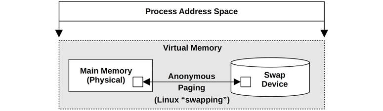

Figure 7.1 Process virtual memory

The process address space is mapped by the virtual memory subsystem to main memory and the physical swap device. Pages of memory can be moved between them by the kernel as needed, a process Linux calls *swapping* (and other OSes call *anonymous paging*). This allows the kernel to *oversubscribe* main memory.

The kernel may impose a limit to oversubscription. A commonly used limit is the size of main memory plus the physical swap devices. The kernel can fail allocations that try to exceed this limit. Such “out of virtual memory” errors can be confusing at first glance, since virtual memory itself is an abstract resource.

Linux also allows other behaviors, including placing *no* bounds on memory allocation. This is termed *overcommit* and is described after the following sections on paging and demand paging, which are necessary for overcommit to work.

#### 7.2.2 Paging

Paging is the movement of pages in and out of main memory, which are referred to as *page-ins* and *page-outs*, respectively. It was first introduced by the Atlas Computer in 1962 [\[Corbató 68\]](ch07.md), allowing:

- Partially loaded programs to execute
- Programs larger than main memory to execute
- Efficient movement of programs between main memory and storage devices

These abilities are still true today. Unlike the earlier technique of swapping out entire programs, paging is a fine-grained approach to managing and freeing main memory, since the page size unit is relatively small (e.g., 4 Kbytes).

Paging with virtual memory (*paged virtual memory*) was introduced to Unix via BSD \[Babaoglu 79] and became the standard.

With the later addition of the page cache for sharing file system pages (see [Chapter 8](ch08.md), [File Systems](ch08.md)), two different types of paging became available: *file system paging* and *anonymous paging*.

##### File System Paging

File system paging is caused by the reading and writing of pages in memory-mapped files. This is normal behavior for applications that use file memory mappings (mmap(2)) and on file systems that use the page cache (most do; see [Chapter 8](ch08.md), [File Systems](ch08.md)). It has been referred to as “good” paging [\[McDougall 06a\]](ch07.md).

When needed, the kernel can free memory by paging some out. This is where the terminology gets a bit tricky: if a file system page has been modified in main memory (called *dirty*), the page-out will require it to be written to disk. If, instead, the file system page has not been modified (called *clean*), the page-out merely frees the memory for immediate reuse, since a copy already exists on disk. Because of this, the term *page-out* means that a page was moved out of memory—which may or may not have included a write to a storage device (you may see the term page-out defined differently in other texts).

##### Anonymous Paging (Swapping)

Anonymous paging involves data that is private to processes: the process heap and stacks. It is termed *anonymous* because it has no named location in the operating system (i.e., no file system path name). Anonymous page-outs require moving the data to the physical swap devices or swap files. Linux uses the term *swapping* to refer to this type of paging.

Anonymous paging hurts performance and has therefore been referred to as “bad” paging \[McDougall 06a]. When applications access memory pages that have been paged out, they block on the disk I/O required to read them back to main memory.[1](ch07.md) This is an *anonymous page-in*, which introduces synchronous latency to the application. Anonymous page-outs may not affect application performance directly, as they can be performed asynchronously by the kernel.

[1](ch07.md)If faster storage devices are used as swap devices, such as 3D XPoint with sub 10 μs latency, swapping may not be the same “bad” paging it once was, but rather become a simple way to intentionally extend main memory, one with mature kernel support.

Performance is best when there is no anonymous paging (swapping). This can be achieved by configuring applications to remain within the main memory available and by monitoring page scanning, memory utilization, and anonymous paging, to ensure that there are no indicators of a memory shortage.

#### 7.2.3 Demand Paging

Operating systems that support demand paging (most do) map pages of virtual memory to physical memory on demand, as shown in [Figure 7.2](ch07.md). This defers the CPU overhead of creating the mappings until they are actually needed and accessed, instead of at the time a range of memory is first allocated.

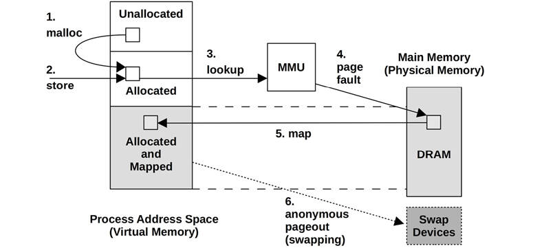

Figure 7.2 Page fault example

The sequence shown in [Figure 7.2](ch07.md) begins with a malloc() (step 1) that provides allocated memory, and then a store instruction (step 2) to that newly allocated memory. For the MMU to determine the main memory location of the store, it performs a virtual to physical lookup (step 3) for the page of memory, which fails as there is not yet a mapping. This failure is termed a *page fault* (step 4), which triggers the kernel to create an on-demand mapping (step 5). Sometime later, the page of memory could be paged out to the swap devices to free up memory (step 6).

Step 2 could also be a load instruction in the case of a mapped file, which should contain data but isn’t yet mapped to this process address space.

If the mapping can be satisfied from another page in memory, it is called a [*minor fault*](gloss.md). This may occur for mapping a new page from available memory, during memory growth of the process (as pictured). It can also occur for mapping to another existing page, such as reading a page from a mapped shared library.

Page faults that require storage device access (not shown in this figure), such as accessing an uncached memory-mapped file, are called *major faults*.

The result of the virtual memory model and demand allocation is that any page of virtual memory may be in one of the following states:

1. Unallocated
2. Allocated, but unmapped (unpopulated and not yet faulted)
3. Allocated, and mapped to main memory (RAM)
4. Allocated, and mapped to the physical swap device (disk)

State (D) is reached if the page is paged out due to system memory pressure. A transition from (B) to (C) is a page fault. If it requires disk I/O, it is a major page fault; otherwise, a minor page fault.

From these states, two memory usage terms can also be defined:

- **Resident set size** (RSS): The size of allocated main memory pages (C)
- **Virtual memory size**: The size of all allocated areas (B + C + D)

Demand paging was added to Unix via BSD, along with paged virtual memory. It has become the standard and is used by Linux.

#### 7.2.4 Overcommit

Linux supports the notion of *overcommit*, which allows more memory to be allocated than the system can possibly store—more than physical memory and swap devices combined. It relies on demand paging and the tendency of applications to not use much of the memory they have allocated.

With overcommit, application requests for memory (e.g., malloc(3)) will succeed when they would otherwise have failed. Instead of allocating memory conservatively to remain within virtual memory limits, an application programmer can allocate memory generously and later use it sparsely on demand.

On Linux, the behavior of overcommit can be configured with a tunable parameter. See [Section 7.6](ch07.md), [Tuning](ch07.md), for details. The consequences of overcommit depend on how the kernel manages memory pressure; see the discussion of the OOM killer in [Section 7.3](ch07.md), [Architecture](ch07.md).

#### 7.2.5 Process Swapping

Process swapping is the movement of entire processes between main memory and the physical swap device or swap file. This is the original Unix technique for managing main memory and is the origin of the term *swap* [\[Thompson 78\]](ch07.md).

To swap out a process, all of its private data must be written to the swap device, including the process heap (anonymous data), its open file table, and other metadata that is only needed when the process is active. Data that originated from file systems and has not been modified can be dropped and read from the original locations again when needed.

Process swapping severely hurts performance, as a process that has been swapped out requires numerous disk I/O to run again. It made more sense on early Unix for the machines of the time, such as the PDP-11, which had a maximum process size of 64 Kbytes [\[Bach 86\]](ch07.md). (Modern systems allow process sizes measured in the Gbytes.)

This description is provided for historical background. Linux systems do not swap processes at all and rely only on paging.

#### 7.2.6 File System Cache Usage

It is normal for memory usage to grow after system boot as the operating system uses available memory to cache the file system, improving performance. The principle is: If there is spare main memory, use it for something useful. This can distress naïve users who see the available free memory shrink to near zero sometime after boot. But it does not pose a problem for applications, as the kernel should be able to quickly free memory from the file system cache when applications need it.

For more about the various file system caches that can consume main memory, see [Chapter 8](ch08.md), [File Systems](ch08.md).

#### 7.2.7 Utilization and Saturation

Main memory utilization can be calculated as used memory versus total memory. Memory used by the file system cache can be treated as unused, as it is available for reuse by applications.

If demands for memory exceed the amount of main memory, main memory becomes *saturated*. The operating system may then free memory by employing paging, process swapping (if supported), and, on Linux, the OOM killer (described later). Any of these activities is an indicator of main memory saturation.

Virtual memory can also be studied in terms of capacity utilization, if the system imposes a limit on the amount of virtual memory it is willing to allocate (Linux overcommit does not). If so, once virtual memory is exhausted, the kernel will fail allocations; for example, malloc(3) fails with errno set to ENOMEM.

Note that the currently available virtual memory on a system is sometimes (confusingly) called *available swap*.

#### 7.2.8 Allocators

While virtual memory handles multitasking of physical memory, the actual allocation and placement within a virtual address space are often handled by allocators. These are either user-land libraries or kernel-based routines, which provide the software programmer with an easy interface for memory usage (e.g., malloc(3), free(3)).

Allocators can have a significant effect on performance, and a system may provide multiple user-level allocator libraries to pick from. They can improve performance by use of techniques including per-thread object caching, but they can also hurt performance if allocation becomes fragmented and wasteful. Specific examples are covered in [Section 7.3](ch07.md), [Architecture](ch07.md).

#### 7.2.9 Shared Memory

Memory can be shared between processes. This is commonly used for system libraries to save memory by sharing one copy of their read-only instruction text with all processes that use it.

This presents difficulties for observability tools that show per-process main memory usage. Should shared memory be included when reporting the total memory size of a process? One technique in use by Linux is to provide an additional measure, the *proportional set size* (PSS), which includes private memory (not shared) plus shared memory divided by the number of users. See [Section 7.5.9](ch07.md), [pmap](ch07.md), for a tool that can show PSS.

#### 7.2.10 Working Set Size

*Working set size* (WSS) is the amount of main memory a process frequently uses to perform work. It is a useful concept for memory performance tuning: performance should greatly improve if the WSS can fit into the CPU caches, rather than main memory. Also, performance will greatly degrade if the WSS exceeds the main memory size, and the application must swap to perform work.

While useful as a concept, it is difficult to measure in practice: there is no WSS statistic in observability tools (they commonly report RSS, not WSS). [Section 7.4.10](ch07.md), [Memory Shrinking](ch07.md), describes an experimental methodology for WSS estimation, and [Section 7.5.12](ch07.md), [wss](ch07.md), shows an experimental working set size estimation tool, wss(8).

#### 7.2.11 Word Size

As introduced in [Chapter 6](ch06.md), [CPUs](ch06.md), processors may support multiple word sizes, such as 32-bit and 64-bit, allowing software for either to run. As the address space size is bounded by the addressable range from the word size, applications requiring more than 4 Gbytes of memory are too large for a 32-bit address space and need to be compiled for 64 bits or higher.[2](ch07.md)

[2](ch07.md)There is also the Physical Address Extension (PAE) feature (workaround) for x86 allowing 32-bit processors to access larger memory ranges (but not in a single process).

Depending on the kernel and processor, some of the address space may be reserved for kernel addresses and is unavailable for application use. An extreme case is Windows with a 32-bit word size, where by default 2 Gbytes is reserved for the kernel, leaving only 2 Gbytes for the application [\[Hall 09\]](ch07.md). On Linux (or Windows with the /3GB option enabled) the kernel reservation is 1 Gbyte. With a 64-bit word size (if the processor supports it) the address space is so much larger that the kernel reservation should not be an issue.

Depending on the CPU architecture, memory performance may also be improved by using larger bit widths, as instructions can operate on larger word sizes. A small amount of memory may be wasted, in cases where a data type has unused bits at the larger bit width.

### 7.3 Architecture

This section introduces memory architecture, both hardware and software, including processor and operating system specifics.

These topics have been summarized as background for performance analysis and tuning. For more details, see the vendor processor manuals and texts on operating system internals listed at the end of this chapter.

#### 7.3.1 Hardware

Memory hardware includes main memory, buses, CPU caches, and the MMU.

##### Main Memory

The common type of main memory in use today is *dynamic random-access memory* (DRAM). This is a type of volatile memory—its contents are lost when power is lost. DRAM provides high-density storage, as each bit is implemented using only two logical components: a capacitor and a transistor. The capacitor requires a periodic refresh to maintain charge.

Enterprise servers are configured with different amounts of DRAM depending on their purpose, typically ranging from one Gbyte to one Tbyte and larger. Cloud computing instances are typically smaller, ranging between 512 Mbytes and 256 Gbytes each.[3](ch07.md) However, cloud computing is designed to spread load over a pool of instances, so they can collectively bring much more DRAM online for a distributed application, although at a much higher coherency cost.

[3](ch07.md)Exceptions include the AWS EC2 high memory instances, which reach 24 Tbytes of memory [\[Amazon 20\]](ch07.md).

###### Latency

The access time of main memory can be measured as the *column address strobe* (CAS) latency: the time between sending a memory module the desired address (column) and when the data is available to be read. This varies depending on the type of memory (for DDR4 it is around 10 to 20ns [\[Crucial 18\]](ch07.md)). For memory I/O transfers, this latency may occur multiple times for a memory bus (e.g., 64 bits wide) to transfer a cache line (e.g., at 64 *bytes* wide). There are also other latencies involved with the CPU and MMU for then reading the newly available data. Read instructions avoid these latencies when they return from a CPU cache; write instructions may avoid them as well, if the processor supports write-back caching (e.g., Intel processors).

##### Main Memory Architecture

An example main memory architecture for a generic two-processor *uniform memory access* (UMA) system is shown in [Figure 7.3](ch07.md).

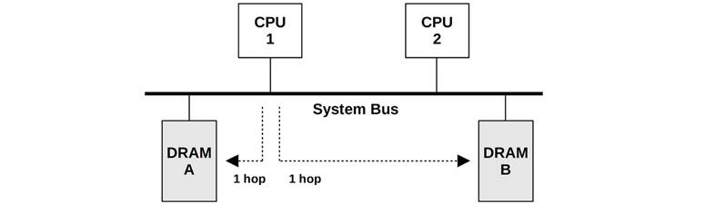

Figure 7.3 Example UMA main memory architecture, two-processor

Each CPU has uniform access latency to all of memory, via a shared system bus. When managed by a single operating system kernel instance that runs uniformly across all processors, this is also a symmetric multiprocessing (SMP) architecture.

For comparison, an example two-processor *non-uniform memory access* (NUMA) system is shown in [Figure 7.4](ch07.md), which uses a CPU interconnect that becomes part of the memory architecture. For this architecture, the access time for main memory varies based on its location relative to the CPU.

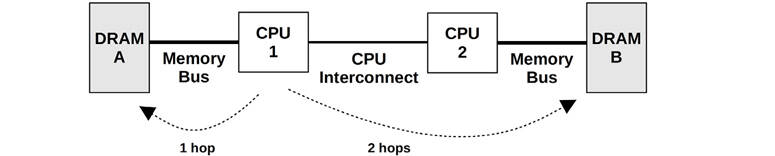

Figure 7.4 Example NUMA main memory architecture, two-processor

CPU 1 can perform I/O to DRAM A directly, via its memory bus. This is referred to as *local memory*. CPU 1 performs I/O to DRAM B via CPU 2 and the CPU interconnect (two hops). This is referred to as *remote memory* and has a higher access latency.

The banks of memory connected to each CPU are referred to as *memory nodes*, or just *nodes*. The operating system may be aware of the memory node topology based on information provided by the processor. This then allows it to assign memory and schedule threads based on *memory locality*, favoring local memory as much as possible to improve performance.

##### Buses

How main memory is physically connected to the system depends on the main memory architecture, as previously pictured. The actual implementation may involve additional controllers and buses between the CPUs and memory. Main memory may be accessed in one of the following ways:

- **Shared system bus**: Single or multiprocessor, via a shared system bus, a memory bridge controller, and finally a memory bus. This was pictured as the UMA example, [Figure 7.3](ch07.md), and as the Intel front-side bus example, [Figure 6.9](ch06.md) in [Chapter 6](ch06.md), [CPUs](ch06.md). The memory controller in that example was a Northbridge.
- **Direct**: Single processor with directly attached memory via a memory bus.
- **Interconnect**: Multiprocessor, each with directly attached memory via a memory bus, and processors connected via a CPU interconnect. This was pictured earlier as the NUMA example in [Figure 7.4](ch07.md); CPU interconnects are discussed in [Chapter 6](ch06.md), [CPUs](ch06.md).

If you suspect your system is none of the above, find a system functional diagram and follow the data path between CPUs and memory, noting all components along the way.

###### DDR SDRAM

The speed of the memory bus, for any architecture, is often dictated by the memory interface standard supported by the processor and system board. A common standard in use since 1996 is *double data rate synchronous dynamic random-access memory* (DDR SDRAM). The term *double data rate* refers to the transfer of data on both the rise and fall of the clock signal (also called *double-pumped*). The term *synchronous* refers to the memory being clocked synchronously with the CPUs.

Example DDR SDRAM standards are shown in [Table 7.1](ch07.md).

Table 7.1 **Example DDR bandwidths**

**Standard**

**Specification Year**

**Memory Clock (MHz)**

**Data Rate (MT/s)**

**Peak Bandwidth (MB/s)**

DDR-200

2000

100

200

1,600

DDR-333

2000

167

333

2,667

DDR2-667

2003

167

667

5,333

DDR2-800

2003

200

800

6,400

DDR3-1333

2007

167

1,333

10,667

DDR3-1600

2007

200

1,600

12,800

DDR4-3200

2012

200

3,200

25,600

DDR5-4800

2020

200

4,800

38,400

DDR5-6400

2020

200

6,400

51,200

The DDR5 standard is expected to be released during 2020 by the JEDEC Solid State Technology Association. These standards are also named using “PC-” followed by the data transfer rate in megabytes per second, for example, PC-1600.

###### Multichannel

System architectures may support the use of multiple memory buses in parallel, to improve bandwidth. Common multiples are dual-, triple-, and quad-channel. For example, the Intel Core i7 processors support up to quad-channel DDR3-1600, for a maximum memory bandwidth of 51.2 Gbytes/s.

##### CPU Caches

Processors typically include on-chip hardware caches to improve memory access performance. The caches may include the following levels, of decreasing speed and increasing size:

- **Level 1**: Usually split into a separate instruction cache and data cache
- **Level 2**: A cache for both instructions and data
- **Level 3**: Another larger level of cache

Depending on the processor, Level 1 is typically referenced by virtual memory addresses, and Level 2 onward by physical memory addresses.

These caches were discussed in more depth in [Chapter 6](ch06.md), [CPUs](ch06.md). An additional type of hardware cache, the TLB, is discussed in this chapter.

##### MMU

The MMU (memory management unit) is responsible for virtual-to-physical address translations. These are performed per page, and offsets within a page are mapped directly. The MMU was introduced in [Chapter 6](ch06.md), [CPUs](ch06.md), in the context of nearby CPU caches.

A generic MMU is pictured in [Figure 7.5](ch07.md), with levels of CPU caches and main memory.

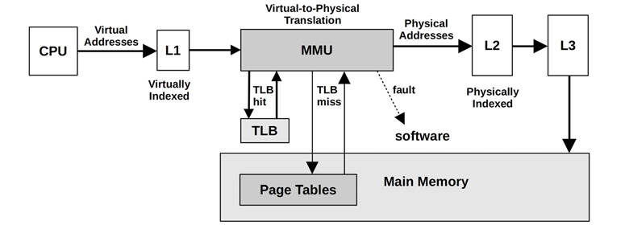

Figure 7.5 Memory management unit

###### Multiple Page Sizes

Modern processors support multiple page sizes, which allow different page sizes (e.g., 4 Kbytes, 2 Mbytes, 1 Gbyte) to be used by the operating system and the MMU. The Linux *huge pages* feature supports larger page sizes, such as 2 Mbytes or 1 Gbyte.

##### TLB

The MMU pictured in [Figure 7.5](ch07.md) uses a TLB (translation lookaside buffer) as the first level of address translation cache, followed by the page tables in main memory. The TLB may be divided into separate caches for instruction and data pages.

Because the TLB has a limited number of entries for mappings, the use of larger page sizes increases the range of memory that can be translated from its cache (its *reach*), which reduces TLB misses and improves system performance. The TLB may be further divided into separate caches for each of these page sizes, improving the probability of retaining larger mappings in cache.

As an example of TLB sizes, a typical Intel Core i7 processor provides the four TLBs shown in [Table 7.2](ch07.md) [\[Intel 19a\]](ch07.md).

Table 7.2 **TLBs for a typical Intel Core i7 processor**

**Type**

**Page Size**

**Entries**

Instruction

4 K

64 per thread, 128 per core

Instruction

large

7 per thread

Data

4 K

64

Data

large

32

This processor has one level of data TLB. The Intel Core microarchitecture supports two levels, similar to the way CPUs provide multiple levels of main memory cache.

The exact makeup of the TLB is specific to the processor type. Refer to the vendor processor manuals for details on the TLBs in your processor and further information on their operation.

#### 7.3.2 Software

Software for memory management includes the virtual memory system, address translation, swapping, paging, and allocation. The topics most related to performance are included in this section: freeing memory, the free list, page scanning, swapping, the process address space, and memory allocators.

##### Freeing Memory

When the available memory on the system becomes low, there are various methods that the kernel can use to free up memory, adding it to the *free list* of pages. These methods are pictured in [Figure 7.6](ch07.md) for Linux, in the *general* order in which they are used as available memory decreases.

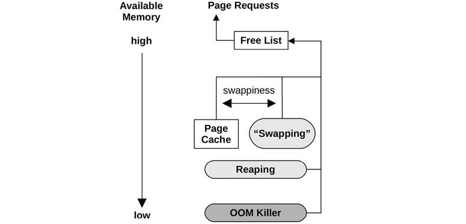

Figure 7.6 Linux memory availability management

These methods are:

- **Free list**: A list of pages that are unused (also called *idle memory*) and available for immediate allocation. This is usually implemented as multiple *free page lists*, one for each locality group (NUMA).
- **Page cache**: The file system cache. A tunable parameter called *swappiness* sets the degree to which the system should favor freeing memory from the page cache instead of swapping.
- **Swapping**: This is paging by the page-out daemon, kswapd, which finds not recently used pages to add to the free list, including application memory. These are paged out, which may involve writing to either a file system-based swap file or a swap device. Naturally, this is available only if a swap file or device has been configured.
- **Reaping**: When a low-memory threshold is crossed, kernel modules and the kernel slab allocator can be instructed to immediately free any memory that can easily be freed. This is also known as *shrinking*.
- **OOM killer**: The out-of-memory killer will free memory by finding and killing a sacrificial process, found using select\_bad\_process() and then killed by calling oom\_kill\_process(). This may be logged in the system log (/var/log/messages) as an “Out of memory: Kill process” message.

The Linux swappiness parameter controls whether to favor freeing memory by paging applications or by reclaiming it from the page cache. It is a number between 0 and 100 (the default value is 60), where higher values favor freeing memory by paging. Controlling the balance between these memory freeing techniques allows system throughput to be improved by preserving warm file system cache while paging out cold application memory [\[Corbet 04\]](ch07.md).

It is also interesting to ask what happens if no swap device or swap file is configured. This limits virtual memory size, so if overcommit has been disabled, memory allocations will fail sooner. On Linux, this may also mean that the OOM killer is used sooner.

Consider an application with an issue of endless memory growth. With swap, this is likely to first become a performance issue due to paging, which is an opportunity to debug the issue live. Without swap, there is no paging grace period, so either the application hits an “Out of memory” error or the OOM killer terminates it. This may delay debugging the issue if it is seen only after hours of usage.

In the Netflix cloud, instances typically do not use swap, so applications are OOM killed if they exhaust memory. Applications are distributed across a large pool of instances, and having one OOM killed causes traffic to be immediately redirected to other healthy instances. This is considered preferable to allowing one instance to run slowly due to swapping.

When memory cgroups are used, similar memory freeing techniques can be used as those shown in [Figure 7.6](ch07.md) to manage cgroup memory. A system may have an abundance of free memory, but is swapping or encountering the OOM killer because a container has exhausted its cgroup-controlled limit [\[Evans 17\]](ch07.md). For more on cgroups and containers, see [Chapter 11](ch11.md), [Cloud Computing](ch11.md).

The following sections describe free lists, reaping, and the page-out daemon.

##### Free List(s)

The original Unix memory allocator used a memory map and a first-fit scan. With the introduction of paged virtual memory in BSD, a *free list* and a *page-out daemon* were added [\[Babaoglu 79\]](ch07.md). The free list, pictured in [Figure 7.7](ch07.md), allows available memory to be located immediately.

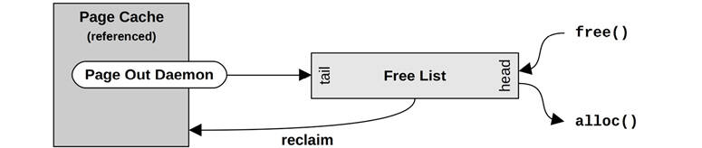

Figure 7.7 Free list operations

Memory freed is added to the head of the list for future allocations. Memory that is freed by the page-out daemon—and that may still contain useful cached file system pages—is added to the tail. Should a future request for one of these pages occur before the useful page has been reused, it can be *reclaimed* and removed from the free list.

A form of free list is still in use by Linux-based systems, as pictured in [Figure 7.6](ch07.md). Free lists are typically consumed via allocators, such as the slab allocator for the kernel, and libc malloc() for user-space (which has its own free lists). These in turn consume pages and then expose them via their allocator API.

Linux uses the buddy allocator for managing pages. This provides multiple free lists for different- sized memory allocations, following a power-of-two scheme. The term *buddy* refers to finding neighboring pages of free memory so that they can be allocated together. For historical background, see [\[Peterson 77\]](ch07.md).

The buddy free lists are at the bottom of the following hierarchy, beginning with the per-memory node pg\_data\_t:

- **Nodes**: Banks of memory, NUMA-aware
- **Zones**: Ranges of memory for certain purposes (direct memory access \[DMA],[4](ch07.md) normal, highmem)
  
  [4](ch07.md)Although ZONE\_DMA may be removed [\[Corbet 18a\]](ch07.md).
- **Migration types**: Unmovable, reclaimable, movable, etc.
- **Sizes**: Power-of-two number of pages

Allocating within the node free lists improves memory locality and performance. For the most common allocation, single pages, the buddy allocator keeps lists of single pages for each CPU to reduce CPU lock contention.

##### Reaping

Reaping mostly involves freeing memory from the kernel slab allocator caches. These caches contain unused memory in slab-size chunks, ready for reuse. Reaping returns this memory to the system for page allocations.

On Linux, kernel modules can also call register\_shrinker() to register specific functions for reaping their own memory.

##### Page Scanning

Freeing memory by paging is managed by the kernel page-out daemon. When available main memory in the free list drops below a threshold, the page-out daemon begins *page scanning*. Page scanning occurs only when needed. A normally balanced system may not page scan very often and may do so only in short bursts.

On Linux, the page-out daemon is called kswapd, which scans LRU page lists of inactive and active memory to free pages. It is woken up based on free memory and two thresholds to provide hysteresis, as shown in [Figure 7.8](ch07.md).

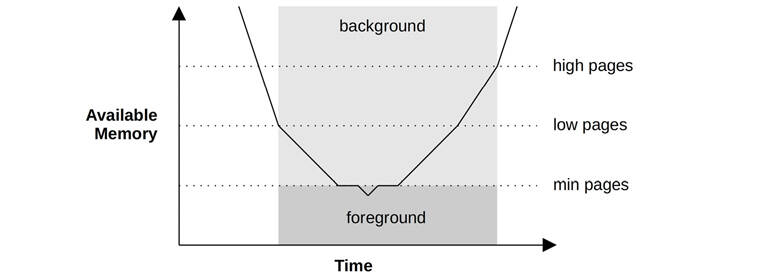

Figure 7.8 kswapd wake-ups and modes

Once free memory has reached the lowest threshold, kswapd runs in the foreground, synchronously freeing pages of memory as they are requested, a method sometimes known as *direct-reclaim* [\[Gorman 04\]](ch07.md). This lowest threshold is tunable (vm.min\_free\_kbytes), and the others are scaled based on it (by 2x for low, 3x for high). For workloads with high allocation bursts that outpace kswap reclamation, Linux provides additional tunables for more aggressive scanning, vm.watermark\_scale\_factor and vm.watermark\_boost\_factor: see [Section 7.6.1](ch07.md), [Tunable Parameters](ch07.md).

The page cache has separate lists for *inactive pages* and *active pages*. These operate in an LRU fashion, allowing kswapd to find free pages quickly. They are shown in [Figure 7.9](ch07.md).

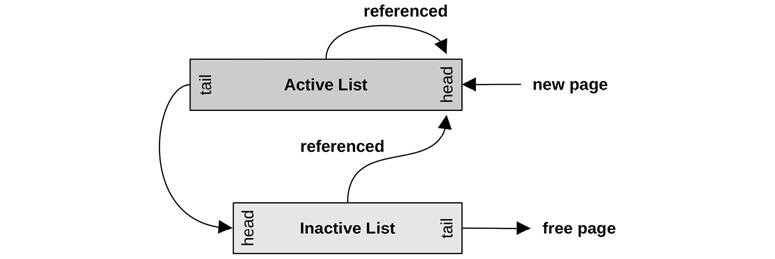

Figure 7.9 kswapd lists

kswapd scans the inactive list first, and then the active list, if needed. The term *scanning* refers to checking of pages as the list is walked: a page may be ineligible to be freed if it is locked/dirty. The term scanning as used by kswapd has a different meaning than the scanning done by the original UNIX page-out daemon, which scans all of memory.

#### 7.3.3 Process Virtual Address Space

Managed by both hardware and software, the process virtual address space is a range of virtual pages that are mapped to physical pages as needed. The addresses are split into areas called [*segments*](gloss.md) for storing the thread stacks, process executable, libraries, and heap. Examples for 32-bit processes on Linux are shown in [Figure 7.10](ch07.md), for both x86 and SPARC processors.

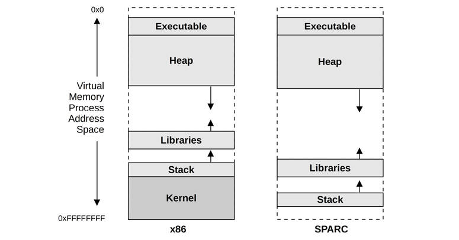

Figure 7.10 Example process virtual memory address space

On SPARC the kernel resides in a separate full address space (which is not shown in [Figure 7.10](ch07.md)). Note that on SPARC it is not possible to distinguish between a user and kernel address based only on the pointer value; x86 employs a different scheme where the user and kernel addresses are non-overlapping.[5](ch07.md)

[5](ch07.md)Note that for 64-bit addresses, the full 64-bit range may not be supported by the processor: the AMD specification allows implementations to only support 48-bit addresses, where the unused higher-order bits are set to the last bit: this creates two usable address ranges, called canonical address, of 0 to 0x00007fffffffffff, used for user space, and 0xffff800000000000 to 0xffffffffffffffff, used for kernel space. This is why x86 kernel addresses begin with 0xffff.

The program executable segment contains separate text and data segments. Libraries are also composed of separate executable text and data segments. These different segment types are:

- **Executable text**: Contains the executable CPU instructions for the process. This is mapped from the text segment of the binary program on the file system. It is read-only with the execute permission.
- **Executable data**: Contains initialized variables mapped from the data segment of the binary program. This has read/write permissions so that the variables can be modified while the program is running. It also has a private flag so that modifications are not flushed to disk.
- **Heap**: This is the working memory for the program and is anonymous memory (no file system location). It grows as needed and is allocated via malloc(3).
- **Stack**: Stacks of the running threads, mapped read/write.

The library text segments may be shared by other processes that use the same library, each of which has a private copy of the library data segment.

###### Heap Growth

A common source of confusion is the endless growth of heap. Is it a memory leak? For simple allocators, a free(3) does not return memory to the operating system; rather, memory is kept to serve future allocations. This means that the process resident memory can only grow, which is normal. Methods for processes to reduce system memory use include:

- **Re-exec**: Calling execve(2) to begin from an empty address space
- **Memory mapping**: Using mmap(2) and munmap(2), which will return memory to the system

Memory-mapped files are described in [Chapter 8](ch08.md), [File Systems](ch08.md), [Section 8.3.10](ch08.md), [Memory-Mapped Files](ch08.md).

Glibc, commonly used on Linux, is an advanced allocator that supports an mmap mode of operation, as well as a malloc\_trim(3) function to release free memory to the system. malloc\_trim(3) is automatically called by free(3) when the top-of-heap free memory becomes large,[6](ch07.md) and frees it using sbrk(2) syscalls.

[6](ch07.md)Larger than the M\_TRIM\_THRESHOLD mallopt(3) parameter, which is 128 Kbytes by default.

##### Allocators

There are a variety of user- and kernel-level allocators for memory allocation. [Figure 7.11](ch07.md) shows the role of allocators, including some common types.

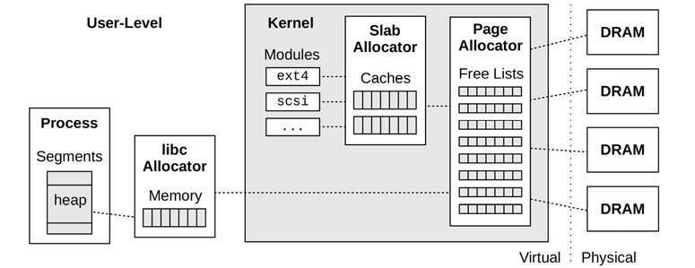

Figure 7.11 User- and kernel-level memory allocators

Page management was described earlier in [Section 7.3.2](ch07.md), [Software](ch07.md), under Free List(s).

Memory allocator features can include:

- **Simple API**: For example, malloc(3), free(3).
- **Efficient memory usage**: When servicing memory allocations of a variety of sizes, memory usage can become *fragmented*, where there are many unused regions that waste memory. Allocators can strive to coalesce the unused regions, so that larger allocations can make use of them, improving efficiency.
- **Performance**: Memory allocations can be frequent, and on multithreaded environments they can perform poorly due to contention for synchronization primitives. Allocators can be designed to use locks sparingly, and can also make use of per-thread or per-CPU caches to improve memory locality.
- [**Observability**](gloss.md): An allocator may provide statistics and debug modes to show how it is being used, and which code paths are responsible for allocations.

The sections that follow describe kernel-level allocators—slab and SLUB—and user-level allocators—glibc, TCMalloc, and jemalloc.

###### Slab

The kernel slab allocator manages caches of objects of a specific size, allowing them to be recycled quickly without the overhead of page allocation. This is especially effective for kernel allocations, which are frequently for fixed-size structs.

As a kernel example, the following two lines are from ZFS arc.c[7](ch07.md):

[7](ch07.md)The only reason these came to mind as examples is because I developed the code.

[Click here to view code image](ch07_images.md)

```
        df = kmem_alloc(sizeof (l2arc_data_free_t), KM_SLEEP);
        head = kmem_cache_alloc(hdr_cache, KM_PUSHPAGE);
```

The first, kmem\_alloc(), shows a traditional-style kernel allocation whose size is passed as an argument. The kernel maps this to a slab cache based on that size (very large sizes are handled differently, by an *oversize arena*). The second, kmem\_cache\_alloc(), operates directly on a custom slab allocator cache, in this case (kmem\_cache\_t \*)hdr\_cache.

Developed for Solaris 2.4 [\[Bonwick 94\]](ch07.md), the slab allocator was later enhanced with per-CPU caches called *magazines* [\[Bonwick 01\]](ch07.md):

Our basic approach is to give each CPU an M-element cache of objects called a magazine, by analogy with automatic weapons. Each CPU’s magazine can satisfy M allocations before the CPU needs to reload—that is, exchange its empty magazine for a full one.

Apart from high performance, the original slab allocator featured debug and analysis facilities including auditing to trace allocation details and stack traces.

Slab allocation has been adopted by various operating systems. BSD has a kernel slab allocator called the universal memory allocator (UMA), which is efficient and NUMA-aware. A slab allocator was also introduced to Linux in version 2.2, where it was the default option for many years. Linux has since moved to SLUB as an option or as the default.

###### SLUB

The Linux kernel SLUB allocator is based on the slab allocator and is designed to address various concerns, especially regarding the complexity of the slab allocator. Improvements include the removal of object queues, and per-CPU caches—leaving NUMA optimization to the page allocator (see the earlier Free List(s) section).

The SLUB allocator was made the default option in Linux 2.6.23 [\[Lameter 07\]](ch07.md).

###### glibc

The user-level GNU libc allocator is based on dlmalloc by Doug Lea. Its behavior depends on the allocation request size. Small allocations are served from bins of memory, containing units of a similar size, which can be coalesced using a buddy-like algorithm. Larger allocations can use a tree lookup to find space efficiently. Very large allocations switch to using mmap(2). The net result is a high-performing allocator that benefits from multiple allocation policies.

###### TCMalloc

TCMalloc is the user-level thread caching malloc, which uses a per-thread cache for small allocations, reducing lock contention and improving performance [\[Ghemawat 07\]](ch07.md). Periodic garbage collection migrates memory back to a central heap for allocations.

###### jemalloc

Originating as the FreeBSD user-level libc allocator, libjemalloc is also available for Linux. It uses techniques such as multiple arenas, per-thread caching, and small object slabs to improve scalability and reduce memory fragmentation. It can use both mmap(2) and sbrk(2) to obtain system memory, preferring mmap(2). Facebook use jemalloc and have added profiling and other optimizations [\[Facebook 11\]](ch07.md).

### 7.4 Methodology

This section describes various methodologies and exercises for memory analysis and tuning. The topics are summarized in [Table 7.3](ch07.md).

Table 7.3 **Memory performance methodologies**

**Section**

**Methodology**

**Types**

[7.4.1](ch07.md)

Tools method

Observational analysis

[7.4.2](ch07.md)

USE method

Observational analysis

[7.4.3](ch07.md)

Characterizing usage

Observational analysis, capacity planning

[7.4.4](ch07.md)

Cycle analysis

Observational analysis

[7.4.5](ch07.md)

Performance monitoring

Observational analysis, capacity planning

[7.4.6](ch07.md)

Leak detection

Observational analysis

[7.4.7](ch07.md)

Static performance tuning

Observational analysis, capacity planning

[7.4.8](ch07.md)

Resource controls

Tuning

[7.4.9](ch07.md)

Micro-benchmarking

Experimental analysis

[7.4.10](ch07.md)

Memory shrinking

Experimental analysis

See [Chapter 2](ch02.md), [Methodologies](ch02.md), for more strategies and an introduction to many of these.

These methods may be followed individually or used in combination. When troubleshooting memory issues, my suggestion is to start with the following strategies, in this order: performance monitoring, the USE method, and characterizing usage.

[Section 7.5](ch07.md), [Observability Tools](ch07.md), shows operating system tools for applying these methods.

#### 7.4.1 Tools Method

The tools method is a process of iterating over available tools, examining key metrics they provide. This is a simple methodology that may overlook issues for which the tools you happen to have available provide poor or no visibility, and can be time-consuming to perform.

For memory, the tools method can involve checking the following for Linux:

- **Page scanning**: Look for continual page scanning (more than 10 seconds) as a sign of memory pressure. This can be done using `sar -B` and checking the `pgscan` columns.
- **Pressure stall information (PSI)**: `cat /proc/pressure/memory` (Linux 4.20+) to check memory pressure (saturation) statistics and how it is changing over time.
- **Swapping**: If swap is configured, the swapping of memory pages (Linux definition of swapping) is a further indication that the system is low on memory. You can use vmstat(8) and check the `si` and `so` columns.
- **`vmstat`** : Run `vmstat 1` and check the `free` column for available memory.
- **OOM killer**: These events can be seen in the system log /var/log/messages, or from dmesg(1). Search for “Out of memory.”
- **`top`** : See which processes and users are the top physical memory consumers (resident) and virtual memory consumers (see the man page for the names of the columns, which differ depending on version). top(1) also summarizes free memory.
- **perf(1)/BCC/bpftrace**: Trace memory allocations with stack traces, to identify the cause of memory usage. Note that this can cost considerable overhead. A cheaper, though coarse, solution is to perform CPU profiling (timed stack sampling) and search for allocation code paths.

See [Section 7.5](ch07.md), [Observability Tools](ch07.md), for more about each tool.

#### 7.4.2 USE Method

The USE method is for identifying bottlenecks and errors across all components early in a performance investigation, before deeper and more time-consuming strategies are followed.

Check system-wide for:

- **Utilization**: How much memory is in use, and how much is available. Both physical memory and virtual memory should be checked.
- **Saturation**: The degree of page scanning, paging, swapping, and Linux OOM killer sacrifices performed, as measures to relieve memory pressure.
- **Errors**: Software or hardware errors.

You may want to check saturation first, as continual saturation is a sign of a memory issue. These metrics are usually readily available from operating system tools, including vmstat(8) and sar(1) for swapping statistics, and dmesg(1) for OOM killer sacrifices. For systems configured with a separate disk swap device, any activity to the swap device is another a sign of memory pressure. Linux also provides memory saturation statistics as part of pressure stall information (PSI).

Physical memory utilization can be reported differently by different tools, depending on whether they account for unreferenced file system cache pages or inactive pages. A system may report that it has only 10 Mbytes of available memory when it actually has 10 Gbytes of file system cache that can be reclaimed by applications immediately when needed. Check the tool documentation to see what is included.

Virtual memory utilization may also need to be checked, depending on whether the system performs overcommit. For systems that do not, memory allocations will fail once virtual memory is exhausted—a type of memory error.

Memory errors can be caused by software, such as failed memory allocations or the Linux OOM killer, or by hardware, such as ECC errors. Historically, memory allocation errors have been left for the applications to report, although not all applications do (and, with Linux overcommit, developers may not have felt it necessary). Hardware errors are also difficult to diagnose. Some tools can report ECC-correctable errors (e.g., on Linux, dmidecode(8), edac-utils, `ipmitool sel`) when ECC memory is used. These correctable errors can be used as a USE method error metric, and can be a sign that uncorrectable errors may soon occur. With actual (uncorrectable) memory errors, you may experience unexplained, unreproducible crashes (including segfaults and bus error signals) of arbitrary applications.

For environments that implement memory limits or quotas (resource controls), as in some cloud computing environments, memory utilization and saturation may need to be measured differently. Your OS instance may be at its software memory limit and swapping, even though there is plenty of physical memory available on the host. See [Chapter 11](ch11.md), [Cloud Computing](ch11.md).

#### 7.4.3 Characterizing Usage

Characterizing memory usage is an important exercise when capacity planning, benchmarking, and simulating workloads. It can also lead to some of the largest performance gains from finding and correcting misconfigurations. For example, a database cache may be configured too small and have low hit rates, or too large and cause system paging.

For memory, characterizing usage involves identifying where and how much memory is used:

- System-wide physical and virtual memory utilization
- Degree of saturation: swapping and OOM killing
- Kernel and file system cache memory usage
- Per-process physical and virtual memory usage
- Usage of memory resource controls, if present

This example description shows how these attributes can be expressed together:

The system has 256 Gbytes of main memory, which has 1% in use (utilized) by processes and 30% in the file system cache. The largest process is a database, consuming 2 Gbytes of main memory (RSS), which is its configured limit from the previous system it was migrated from.

These characteristics can vary over time as more memory is used to cache working data. Kernel or application memory may also grow continually over time due to a memory leak—a software error—aside from regular cache growth.

##### Advanced Usage Analysis/Checklist

Additional characteristics are listed here as questions for consideration, which may also serve as a checklist when studying memory issues thoroughly:

- What is the working set size (WSS) for the applications?
- Where is the kernel memory used? Per slab?
- How much of the file system cache is active as opposed to inactive?
- Where is the process memory used (instructions, caches, buffers, objects, etc.)?
- Why are processes allocating memory (call paths)?
- Why is the kernel allocating memory (call paths)?
- Anything odd with process library mappings (e.g., changing over time)?
- What processes are actively being swapped out?
- What processes have previously been swapped out?
- Could processes or the kernel have memory leaks?
- In a NUMA system, how well is memory distributed across memory nodes?
- What are the IPC and memory stall cycle rates?
- How balanced are the memory buses?
- How much local memory I/O is performed as opposed to remote memory I/O?

The sections that follow can help answer some of these questions. See [Chapter 2](ch02.md), [Methodologies](ch02.md), for a higher-level summary of this methodology and the characteristics to measure (who, why, what, how).

#### 7.4.4 Cycle Analysis

Memory bus load can be determined by inspecting the CPU performance monitoring counters (PMCs), which can be programmed to count memory stall cycles, memory bus usage, and more. A metric to begin with is the instructions per cycle (IPC), which reflects how memory-dependent the CPU load is. See [Chapter 6](ch06.md), [CPUs](ch06.md).

#### 7.4.5 Performance Monitoring

Performance monitoring can identify active issues and patterns of behavior over time. Key metrics for memory are:

- **Utilization**: Percent used, which may be inferred from available memory
- **Saturation**: Swapping, OOM killing

For environments that implement memory limits or quotas (resource controls), statistics related to the imposed limits may also need to be collected.

Errors can also be monitored (if available), as described with utilization and saturation in [Section 7.4.2](ch07.md), [USE Method](ch07.md).

Monitoring memory usage over time, especially by process, can help identify the presence and rate of memory leaks.

#### 7.4.6 Leak Detection

This problem occurs when an application or kernel module grows endlessly, consuming memory from the free lists, from the file system cache, and eventually from other processes. This may first be noticed because the system starts swapping or an application is OOM killed, in response to the endless memory pressure.

This type of issue is caused by either:

- **A memory leak**: A type of software bug where memory is no longer used but never freed. This is fixed by modifying the software code, or by applying patches or upgrades (which modify the code).
- **Memory growth**: The software is consuming memory normally, but at a much higher rate than is desirable for the system. This is fixed either by changing the software configuration, or by the software developer changing how the application consumes memory.

Memory growth issues are often misidentified as memory leaks. The first question to ask is: Is it supposed to do that? Check the memory usage, the configuration of your application, and the behavior of its allocators. An application may be configured to populate a memory cache, and the observed growth may be cache warmup.

How memory leaks can be analyzed depends on the software and language type. Some allocators provide debug modes for recording allocation details, which can then be analyzed postmortem for identifying the call path responsible. Some runtimes have methods for doing heap dump analysis, and other tools for doing memory leak investigations.

The Linux BCC tracing tools includes memleak(8) for growth and leak analysis: it tracks allocations and notes those that were not freed during an interval, along with the allocation code path. It cannot tell if these are leaks or normal growth, so your task is to analyze the code paths to determine which is the case. (Note that this tool also incurs high overhead with high allocation rates.) BCC is covered in [Chapter 15](ch15.md), [BPF](ch15.md), [Section 15.1](ch15.md), [BCC](ch15.md).

#### 7.4.7 Static Performance Tuning

Static performance tuning focuses on issues of the configured environment. For memory performance, examine the following aspects of the static configuration:

- How much main memory is there in total?
- How much memory are applications configured to use (their own config)?
- Which memory allocators do the applications use?
- What is the speed of main memory? Is it the fastest type available (DDR5)?
- Has main memory ever been fully tested (e.g., using Linux memtester)?
- What is the system architecture? NUMA, UMA?
- Is the operating system NUMA-aware? Does it provide NUMA tunables?
- Is memory attached to the same socket, or split across sockets?
- How many memory buses are present?
- What are the number and size of the CPU caches? TLB?
- What are the BIOS settings?
- Are large pages configured and used?
- Is overcommit available and configured?
- What other system memory tunables are in use?
- Are there software-imposed memory limits (resource controls)?

Answering these questions may reveal configuration choices that have been overlooked.

#### 7.4.8 Resource Controls

The operating system may provide fine-grained controls for the allocation of memory to processes or groups of processes. These controls may include fixed limits for main memory and virtual memory usage. How they work is implementation-specific and is discussed in [Section 7.6](ch07.md), [Tuning](ch07.md), and [Chapter 11](ch11.md), [Cloud Computing](ch11.md).

#### 7.4.9 Micro-Benchmarking

Micro-benchmarking may be used to determine the speed of main memory and characteristics such as CPU cache and cache line sizes. It may be helpful when analyzing differences between systems, as the speed of memory access may have a greater effect on performance than CPU clock speed, depending on the application and workload.

In [Chapter 6](ch06.md), [CPUs](ch06.md), the Latency section under CPU Caches (in [Section 6.4.1](ch06.md), [Hardware](ch06.md)) shows the result of micro-benchmarking memory access latency to determine characteristics of the CPU caches.

#### 7.4.10 Memory Shrinking

This is a working set size (WSS) estimation method that uses a *negative* experiment, requiring swap devices to be configured to perform the experiment. Available main memory for an application is progressively reduced while measuring performance and swapping: the point where performance sharply degrades and swapping greatly increases shows when the WSS no longer fits into the available memory.

While worth mentioning as an example negative experiment, this is not recommended for production use as it deliberately harms performance. For other WSS estimation techniques, see the experimental wss(8) tool in [Section 7.5.12](ch07.md), [wss](ch07.md), and my website on WSS estimation [\[Gregg 18c\]](ch07.md).

### 7.5 Observability Tools

This section introduces memory observability tools for Linux-based operating systems. See the previous section for methodologies to follow when using them.

The tools in this section are shown in [Table 7.4](ch07.md).

Table 7.4 **Linux memory observability tools**

**Section**

**Tool**

**Description**

[7.5.1](ch07.md)

vmstat

Virtual and physical memory statistics

[7.5.2](ch07.md)

PSI

Memory pressure stall information

[7.5.3](ch07.md)

swapon

Swap device usage

[7.5.4](ch07.md)

sar

Historical statistics

[7.5.5](ch07.md)

slabtop

Kernel slab allocator statistics

[7.5.6](ch07.md)

numastat

NUMA statistics

[7.5.7](ch07.md)

ps

Process status

[7.5.8](ch07.md)

top

Monitor per-process memory usage

[7.5.9](ch07.md)

pmap

Process address space statistics

[7.5.10](ch07.md)

perf

Memory PMC and tracepoint analysis

[7.5.11](ch07.md)

drsnoop

Direct reclaim tracing

[7.5.12](ch07.md)

wss

Working set size estimation

[7.5.13](ch07.md)

bpftrace

Tracing programs for memory analysis

This is a selection of tools and capabilities to support [Section 7.4](ch07.md), [Methodology](ch07.md). We begin with tools for system-wide memory usage statistics and then drill down to per-process and allocation tracing. Some of the traditional tools are likely available on other Unix-like operating systems where they originated, including: vmstat(8), sar(1), ps(1), top(1), and pmap(1). drsnoop(8) is a BPF tool from BCC ([Chapter 15](ch15.md)).

See the documentation for each tool, including its man pages, for full references on its features.

#### 7.5.1 vmstat

The virtual memory statistics command, vmstat(8), provides a high-level view of system memory health, including current free memory and paging statistics. CPU statistics are also included, as described in [Chapter 6](ch06.md), [CPUs](ch06.md).

When it was introduced by Bill Joy and Ozalp Babaoglu in 1979 for BSD, the original man page included:

BUGS: So many numbers print out that it’s sometimes hard to figure out what to watch.

Here is example output from the Linux version:

[Click here to view code image](ch07_images.md)

```
$ vmstat 1
procs -----------memory---------- ---swap-- -----io---- -system-- ----cpu----
 r  b   swpd   free   buff  cache   si   so    bi    bo   in   cs us sy id wa
 4  0      0 34454064 111516 13438596   0   0    0    5    2    0  0  0 100  0
 4  0      0 34455208 111516 13438596   0   0    0    0 2262 15303 16 12 73  0
 5  0      0 34455588 111516 13438596   0   0    0    0 1961 15221 15 11 74  0
 4  0      0 34456300 111516 13438596   0   0    0    0 2343 15294 15 11 73  0
[...]
```

This version of vmstat(8) does not print summary-since-boot values for the `procs` or `memory` columns on the first line of output, instead showing current status immediately. The columns are in kilobytes by default and are:

- **`swpd`** : Amount of swapped-out memory
- **`free`** : Free available memory
- **`buff`** : Memory in the buffer cache
- **`cache`** : Memory in the page cache
- **`si`** : Memory swapped in (paging)
- **`so`** : Memory swapped out (paging)

The buffer and page caches are described in [Chapter 8](ch08.md), [File Systems](ch08.md). It is normal for the free memory in the system to drop after boot and be used by these caches to improve performance. It can be released for application use when needed.

If the `si` and `so` columns are continually nonzero, the system is under memory pressure and is swapping to a swap device or file (see swapon(8)). Other tools, including those that show memory by process (e.g., top(1), ps(1)), can be used to investigate what is consuming memory.

On systems with large amounts of memory, the columns can become unaligned and a little difficult to read. You can try changing the output units to megabytes using the `-S` option (use `m` for 1000000, and `M` for 1048576):

[Click here to view code image](ch07_images.md)

```
$ vmstat -Sm 1
procs -----------memory---------- ---swap-- -----io---- -system-- ----cpu----
 r  b   swpd   free   buff  cache   si   so    bi    bo   in   cs us sy id wa
 4  0      0  35280    114  13761    0    0     0     5    2    1  0  0 100  0
 4  0      0  35281    114  13761    0    0     0     0 2027 15146 16 13 70  0
[...]
```

There is also a `-a` option to print a breakdown of *inactive* and *active* memory from the page cache:

[Click here to view code image](ch07_images.md)

```
$ vmstat -a 1
procs -----------memory---------- ---swap-- -----io---- -system-- ----cpu----
 r  b   swpd   free  inact active   si   so    bi    bo   in   cs us sy id wa
 5  0      0 34453536 10358040 3201540   0   0    0    5    2    0  0  0 100  0
 4  0      0 34453228 10358040 3200648   0   0    0    0 2464 15261 16 12 71  0
[...]
```

These memory statistics can be printed as a list using the lowercase `-s` option.

#### 7.5.2 PSI

Linux pressure stall information (PSI), added in Linux 4.20, includes statistics for memory saturation. These not only show if there is memory pressure, but how it is changing in the last five minutes. Example output:

[Click here to view code image](ch07_images.md)

```
# cat /proc/pressure/memory
some avg10=2.84 avg60=1.23 avg300=0.32 total=1468344
full avg10=1.85 avg60=0.66 avg300=0.16 total=702578
```

This output shows that memory pressure is increasing, with a higher 10-second average (2.84) than the 300-second average (0.32). These averages are percentages of time that a task was memory stalled. The `some` line shows when some tasks (threads) were affected, and the `full` line shows when all runnable tasks were affected.

PSI statistics are also tracked per cgroup2 (cgroups are covered in [Chapter 11](ch11.md), [Cloud Computing](ch11.md)) [\[Facebook 19\]](ch07.md).

#### 7.5.3 swapon

swapon(1) can show whether swap devices have been configured and how much of their volume is in use. For example:

[Click here to view code image](ch07_images.md)

```
$ swapon
NAME      TYPE      SIZE   USED PRIO
/dev/dm-2 partition 980M 611.6M   -2
/swap1    file       30G  10.9M   -3
```

This output shows two swap devices: a physical disk partition of 980 Mbytes, and a file named/swap1 of 30 Gbytes. The output also shows how much both are in use. Many systems nowadays do not have swap configured; in this case, swapon(1) will not print any output.

If a swap device has active I/O, that can be seen in the `si` and `so` columns in vmstat(1), and as device I/O in iostat(1) ([Chapter 9](ch09.md)).

#### 7.5.4 sar

The system activity reporter, sar(1), can be used to observe current activity and can be configured to archive and report historical statistics. It is mentioned in various chapters in this book for the different statistics it provides, and was introduced in [Chapter 4](ch04.md), [Observability Tools](ch04.md), [Section 4.4](ch04.md), [sar](ch04.md).

The Linux version provides memory statistics via the following options:

- **`-B`** : Paging statistics
- **`-H`** : Huge pages statistics
- **`-r`** : Memory utilization
- **`-S`** : Swap space statistics
- **`-W`** : Swapping statistics

These span memory usage, activity of the page-out daemon, and huge pages usage. See [Section 7.3](ch07.md), [Architecture](ch07.md), for background on these topics.

Statistics provided include those in [Table 7.5](ch07.md).

Table 7.5 **Linux sar memory statistics**

**Option**

**Statistic**

**Description**

**Units**

`-B`

`pgpgin/s`

Page-ins

Kbytes/s

`-B`

`pgpgout/s`

Page-outs

Kbytes/s

`-B`

`fault/s`

Both major and minor faults

Count/s

`-B`

`majflt/s`

Major faults

Count/s

`-B`

`pgfree/s`

Pages added to free list

Count/s

`-B`

`pgscank/s`

Pages scanned by background page-out daemon (kswapd)

Count/s

`-B`

`pgscand/s`

Direct page scans

Count/s

`-B`

`pgsteal/s`

Page and swap cache reclaims

Count/s

`-B`

`%vmeff`

Ratio of page steal/page scan, which shows page reclaim efficiency

Percent

`-H`

`hbhugfree`

Free huge pages memory (large page size)

Kbytes

`-H`

`hbhugused`

Used huge pages memory

Kbytes

`-H`

`%hugused`

Huge page usage

Percent

`-r`

`kbmemfree`

Free memory (completely unused)

Kbytes

`-r`

`kbavail`

Available memory, including pages that can be readily freed from the page cache

Kbytes

`-r`

`kbmemused`

Used memory (excluding the kernel)

Kbytes

`-r`

`%memused`

Memory usage

Percent

`-r`

`kbbuffers`

Buffer cache size

Kbytes

`-r`

`kbcached`

Page cache size

Kbytes

`-r`

`kbcommit`

Main memory committed: an estimate of the amount needed to serve the current workload

Kbytes

`-r`

`%commit`

Main memory committed for current workload, estimate

Percent

`-r`

`kbactive`

Active list memory size

Kbytes

`-r`

`kbinact`

Inactive list memory size

Kbytes

`-r`

`kbdirtyw`

Modified memory to be written to disk

Kbytes

`-r ALL`

`kbanonpg`

Process anonymous memory

Kbytes

`-r ALL`

`kbslab`

Kernel slab cache size

Kbytes

`-r ALL`

`kbkstack`

Kernel stack space size

Kbytes

`-r ALL`

`kbpgtbl`

Lowest-level page table size

Kbytes

`-r ALL`

`kbvmused`

Used virtual address space

Kbytes

`-S`

`kbswpfree`

Free swap space

Kbytes

`-S`

`kbswpused`

Used swap space

Kbytes

`-S`

`%swpused`

Used swap space

Percent

`-S`

`kbswpcad`

Cached swap space: this resides in both main memory and the swap device and so can be paged out without disk I/O

Kbytes

`-S`

`%swpcad`

Ratio of cached swap versus used swap

Percent

`-W`

`pswpin/s`

Page-ins (Linux “swap-ins”)

Pages/s

`-W`

`pswpout/s`

Page-outs (Linux “swap-outs”)

Pages/s

Many of the statistic names include the units measured: `pg` for pages, `kb` for kilobytes, `%` for a percentage, and `/s` for per second. See the man page for the full list, which includes some additional percentage-based statistics.

It is important to remember that this much detail is available, when needed, on the usage and operation of high-level memory subsystems. To understand these in deeper detail, you may need to use tracers to instrument memory tracepoints and kernel functions, such as perf(1) and bpftrace in the following sections. You can also browse the source code in mm, specifically mm/vmscan.c. There are many posts to the linux-mm mailing list that provide further insight, as the developers discuss what the statistics should be.

The `%vmeff` metric is a useful measure of page reclaim efficiency. High means pages are successfully stolen from the inactive list (healthy); low means the system is struggling. The man page describes near 100% as high, and less than 30% as low.

Another useful metric is pgscand, which effectively shows the rate at which an application is blocking on memory allocations and entering direct reclaim (higher is bad). To see the time spent by applications during direct reclaim events, you can use tracing tools: see [Section 7.5.11](ch07.md), [drsnoop](ch07.md).

#### 7.5.5 slabtop

The Linux slabtop(1) command prints kernel slab cache usage from the slab allocator. Like top(1), it refreshes the screen in real time.

Here is some example output:

[Click here to view code image](ch07_images.md)

```
# slabtop -sc
 Active / Total Objects (% used)    : 686110 / 867574 (79.1%)
 Active / Total Slabs (% used)      : 30948 / 30948 (100.0%)
 Active / Total Caches (% used)     : 99 / 164 (60.4%)
 Active / Total Size (% used)       : 157680.28K / 200462.06K (78.7%)
 Minimum / Average / Maximum Object : 0.01K / 0.23K / 12.00K
  OBJS ACTIVE  USE OBJ SIZE  SLABS OBJ/SLAB CACHE SIZE NAME
 45450  33712  74%    1.05K   3030       15     48480K ext4_inode_cache
161091  81681  50%    0.19K   7671       21     30684K dentry
222963 196779  88%    0.10K   5717       39     22868K buffer_head
 35763  35471  99%    0.58K   2751       13     22008K inode_cache
 26033  13859  53%    0.57K   1860       14     14880K radix_tree_node
 93330  80502  86%    0.13K   3111       30     12444K kernfs_node_cache
  2104   2081  98%    4.00K    263        8      8416K kmalloc-4k
   528    431  81%    7.50K    132        4      4224K task_struct
[...]
```

The output has a summary at the top and a list of slabs, including their object count (`OBJS`), how many are active (`ACTIVE`), percent used (`USE`), the size of the objects (`OBJ SIZE`, bytes), and the total size of the cache (`CACHE SIZE`, bytes). In this example, the `-sc` option was used to sort by cache size, with the largest at the top: ext4\_inode\_cache.

The slab statistics are from /proc/slabinfo and can also be printed by `vmstat -m`.

#### 7.5.6 numastat

The numastat(8)[8](ch07.md) tool provides statistics for non-uniform memory access (NUMA) systems, typically those with multiple CPU sockets. Here is some example output from a two-socket system:

[8](ch07.md)Origin: Andi Kleen wrote the original numastat tool as a perl script around 2003; Bill Gray wrote the current version in 2012.

[Click here to view code image](ch07_images.md)

```
# numastat
                           node0           node1
numa_hit            210057224016    151287435161
numa_miss             9377491084       291611562
numa_foreign           291611562      9377491084
interleave_hit             36476           36665
local_node          210056887752    151286964112
other_node            9377827348       292082611
```

This system has two NUMA nodes, one for each memory bank attached to each socket. Linux tries to allocate memory on the nearest NUMA node, and numastat(8) shows how successful this is. Key statistics are:

- **`numa_hit`** : Memory allocations on the intended NUMA node.
- **`numa_miss + numa_foreign`** : Memory allocations not on the preferred NUMA node. (`numa_miss` shows local allocations that should have been elsewhere, and `numa_foreign` shows remote allocations that should have been local.)
- **`other_node`** : Memory allocations on this node while the process was running elsewhere.

The example output shows the NUMA allocation policy performing well: a high number of hits compared to other statistics. If the hit ratio is much lower, you may consider adjusting NUMA tunables in sysctl(8), or using other approaches to improve memory locality (e.g., partitioning workloads or the system, or choosing a different system with fewer NUMA nodes). If there is no way to improve NUMA, numastat(8) does at least help explain poor memory I/O performance.

numastat(8) supports `-n` to print statistics in Mbytes, and `-m` to print the output in the style of /proc/meminfo. Depending on your Linux distribution, numastat(8) may be available in a numactl package.

#### 7.5.7 ps

The process status command, ps(1), lists details on all processes, including memory usage statistics. Its usage was introduced in [Chapter 6](ch06.md), [CPUs](ch06.md).

For example, using the BSD-style options:

[Click here to view code image](ch07_images.md)

```
$ ps aux
USER       PID %CPU %MEM    VSZ   RSS TTY  STAT START   TIME COMMAND
[...]
bind      1152  0.0  0.4 348916 39568 ?    Ssl  Mar27  20:17 /usr/sbin/named -u bind
root      1371  0.0  0.0  39004  2652 ?    Ss   Mar27  11:04 /usr/lib/postfix/master
root      1386  0.0  0.6 207564 50684 ?    Sl   Mar27   1:57 /usr/sbin/console-kit-daemon --no-daemon
rabbitmq  1469  0.0  0.0  10708   172 ?    S    Mar27   0:49 /usr/lib/erlang/erts-5.7.4/bin/epmd -daemon
rabbitmq  1486  0.1  0.0 150208  2884 ?    Ssl  Mar27 453:29 /usr/lib/erlang/erts-5.7.4/bin/beam.smp -W w -K true -A30 ...
```

This output includes the following columns:

- **`%MEM`** : Main memory usage (physical memory, RSS) as a percentage of the total in the system
- **`RSS`** : Resident set size (Kbytes)
- **`VSZ`** : Virtual memory size (Kbytes)

While `RSS` shows main memory usage, it includes shared memory segments such as system libraries, which may be mapped by dozens of processes. If you were to sum the `RSS` column, you might find that it exceeds the memory available in the system, due to overcounting of this shared memory. See [Section 7.2.9](ch07.md), [Shared Memory](ch07.md), for background on shared memory, and the later pmap(1) command for analysis of shared memory usage.

These columns may be selected using the SVR4-style `-o` option, for example:

[Click here to view code image](ch07_images.md)

```
# ps -eo pid,pmem,vsz,rss,comm
  PID %MEM  VSZ  RSS COMMAND
[...]
13419  0.0 5176 1796 /opt/local/sbin/nginx
13879  0.1 31060 22880 /opt/local/bin/ruby19
13418  0.0 4984 1456 /opt/local/sbin/nginx
15101  0.0 4580   32 /opt/riak/lib/os_mon-2.2.6/priv/bin/memsup
10933  0.0 3124 2212 /usr/sbin/rsyslogd
[...]
```

The Linux version can also print columns for major and minor faults (`maj_flt`, `min_flt`).

The output of ps(1) can be post-sorted on the memory columns so that the highest consumers can be quickly identified. Or, try top(1), which provides interactive sorting.

#### 7.5.8 top

The top(1) command monitors top running processes and includes memory usage statistics. It was introduced in [Chapter 6](ch06.md), [CPUs](ch06.md). For example, on Linux:

[Click here to view code image](ch07_images.md)

```
$ top -o %MEM
top - 00:53:33 up 242 days,  2:38,  7 users,  load average: 1.48, 1.64, 2.10
Tasks: 261 total,   1 running, 260 sleeping,   0 stopped,   0 zombie
Cpu(s):  0.0%us,  0.0%sy,  0.0%ni, 99.9%id,  0.0%wa,  0.0%hi,  0.0%si,  0.0%st
Mem:   8181740k total,  6658640k used,  1523100k free,   404744k buffers
Swap:  2932728k total,   120508k used,  2812220k free,  2893684k cached

  PID USER      PR  NI  VIRT  RES  SHR S %CPU %MEM    TIME+  COMMAND
29625 scott     20   0 2983m 2.2g 1232 S   45 28.7  81:11.31 node
 5121 joshw     20   0  222m 193m  804 S    0  2.4 260:13.40 tmux
 1386 root      20   0  202m  49m 1224 S    0  0.6   1:57.70 console-kit-dae
 6371 stu       20   0 65196  38m  292 S    0  0.5  23:11.13 screen
 1152 bind      20   0  340m  38m 1700 S    0  0.5  20:17.36 named
15841 joshw     20   0 67144  23m  908 S    0  0.3 201:37.91 mosh-server
18496 root      20   0 57384  16m 1972 S    3  0.2   2:59.99 python
 1258 root      20   0  125m 8684 8264 S    0  0.1   2052:01 l2tpns
16295 wesolows  20   0 95752 7396  944 S    0  0.1   4:46.07 sshd
23783 brendan   20   0 22204 5036 1676 S    0  0.1   0:00.15 bash
[...]
```

The summary at the top shows total, used, and free for both main memory (`Mem`) and virtual memory (`Swap`). The sizes of the buffer cache (`buffers`) and page cache (`cached`) are also shown.

In this example, the per-process output has been sorted on `%MEM` using `-o` to set the sort column. The largest process in this example is `node`, using 2.2 Gbytes of main memory and almost 3 Gbytes of virtual memory.

The main memory percentage column (`%MEM`), virtual memory size (`VIRT`), and resident set size (`RES`) have the same meanings as the equivalent columns from ps(1) described earlier. For more details on top(1) memory statistics, see the section “Linux Memory Types” in the top(1) man page, which explains what type of memory is shown by each of the possible memory columns. You can also type “`?`” when using top(1) to see its built-in summary of interactive commands.

#### 7.5.9 pmap

The pmap(1) command lists the memory mappings of a process, showing their sizes, permissions, and mapped objects. This allows process memory usage to be examined in more detail, and shared memory to be quantified.

For example, on a Linux-based system:

[Click here to view code image](ch07_images.md)

```
# pmap -x 5187
5187:   /usr/sbin/mysqld
Address           Kbytes     RSS   Dirty Mode  Mapping
000055dadb0dd000   58284   10748       0 r-x-- mysqld
000055dade9c8000    1316    1316    1316 r---- mysqld
000055dadeb11000    3592     816     764 rw--- mysqld
000055dadee93000    1168    1080    1080 rw---   [ anon ]
000055dae08b5000    5168    4836    4836 rw---   [ anon ]
00007f018c000000    4704    4696    4696 rw---   [ anon ]
00007f018c498000   60832       0       0 -----   [ anon ]
00007f0190000000     132      24      24 rw---   [ anon ]
[...]
00007f01f99da000       4       4       0 r---- ld-2.30.so
00007f01f99db000     136     136       0 r-x-- ld-2.30.so
00007f01f99fd000      32      32       0 r---- ld-2.30.so
00007f01f9a05000       4       0       0 rw-s- [aio] (deleted)
00007f01f9a06000       4       4       4 r---- ld-2.30.so
00007f01f9a07000       4       4       4 rw--- ld-2.30.so
00007f01f9a08000       4       4       4 rw---   [ anon ]
00007ffd2c528000     132      52      52 rw---   [ stack ]
00007ffd2c5b3000      12       0       0 r----   [ anon ]
00007ffd2c5b6000       4       4       0 r-x--   [ anon ]
ffffffffff600000       4       0       0 --x--   [ anon ]
---------------- ------- ------- -------
total kB         1828228  450388  434200
```

This shows the memory mappings of a MySQL database server, including virtual memory (`Kbytes`), main memory (`RSS`), private anonymous memory (`Anon`), and permissions (`Mode`). For many of the mappings, very little memory is anonymous, and many mappings are read-only (`r-...`), allowing those pages to be shared with other processes. This is especially the case for system libraries. The bulk of the memory consumed in this example is in the heap, shown as the first wave of `[ anon ]` segments (truncated in this output).

The `-x` option prints extended fields. There is also `-X` for even more details, and `-XX` for “everything” the kernel provides. Just showing the headers for these modes:

[Click here to view code image](ch07_images.md)

```
# pmap -X $(pgrep mysqld) | head -2
5187:   /usr/sbin/mysqld
         Address Perm   Offset Device   Inode    Size    Rss    Pss Referenced
Anonymous LazyFree ShmemPmdMapped Shared_Hugetlb Private_Hugetlb Swap SwapPss Locked
THPeligible ProtectionKey Mapping
[...]
# pmap -XX  $(pgrep mysqld) | head -2
5187:   /usr/sbin/mysqld
         Address Perm   Offset Device   Inode    Size KernelPageSize MMUPageSize
Rss    Pss Shared_Clean Shared_Dirty Private_Clean Private_Dirty Referenced Anonymous
LazyFree AnonHugePages ShmemPmdMapped Shared_Hugetlb Private_Hugetlb Swap SwapPss
Locked THPeligible ProtectionKey                 VmFlags Mapping
[...]
```

These extra fields are kernel version dependent. They include details of huge page use, swap use, and the proportional set size (`Pss`) for mappings (highlighted). PSS shows how much private memory a mapping has, plus shared memory divided by the number of users. This provides a more realistic value for the main memory usage.

#### 7.5.10 perf

perf(1) is the official Linux profiler, a multi-tool with many capabilities. [Chapter 13](ch13.md) provides as a summary of perf(1). This section covers its usage for memory analysis. Also see [Chapter 6](ch06.md) for perf(1) analysis of memory PMCs.

##### One-Liners

The following one-liners are both useful and demonstrate different perf(1) capabilities for memory analysis.

Sample page faults (RSS growth) with stack traces system wide, until Ctrl-C:

[Click here to view code image](ch07_images.md)

```
perf record -e page-faults -a -g
```

Record all page faults with stack traces for PID 1843, for 60 seconds:

[Click here to view code image](ch07_images.md)

```
perf record -e page-faults -c 1 -p 1843 -g -- sleep 60
```

Record heap growth via brk(2), until Ctrl-C:

[Click here to view code image](ch07_images.md)

```
perf record -e syscalls:sys_enter_brk -a -g
```

Record page migrations on NUMA systems:

[Click here to view code image](ch07_images.md)

```
perf record -e migrate:mm_migrate_pages -a
```

Count all kmem events, printing a report every second:

[Click here to view code image](ch07_images.md)

```
perf stat -e 'kmem:*' -a -I 1000
```

Count all vmscan events, printing a report every second:

[Click here to view code image](ch07_images.md)

```
perf stat -e 'vmscan:*' -a -I 1000
```

Count all memory compaction events, printing a report every second:

[Click here to view code image](ch07_images.md)

```
perf stat -e 'compaction:*' -a -I 1000
```

Trace kswapd wakeup events with stack traces, until Ctrl-C:

[Click here to view code image](ch07_images.md)

```
perf record -e vmscan:mm_vmscan_wakeup_kswapd -ag
```

Profile memory accesses for the given command:

```
perf mem record command
```

Summarize a memory profile:

```
perf mem report
```

For commands that record or sample events, use `perf report` to summarize the profile or `perf script --header` to print them all.

See [Chapter 13](ch13.md), [perf](ch13.md), [Section 13.2](ch13.md), [One-Liners](ch13.md), for more perf(1) one-liners, and [Section 7.5.13](ch07.md), [bpftrace](ch07.md), which builds observability programs on many of the same events.

##### Page Fault Sampling

perf(1) can record the stack trace on page faults, showing the code path that triggered this event. Since page faults occur as a process increases its resident set size (RSS), analyzing them can explain why the main memory of a process is growing. See [Figure 7.2](ch07.md) for the role of page faults during memory usage.

In the following example, the page-fault software event is traced across all CPUs (`-a`[9](ch07.md)) with stack traces (`-g`) for 60 seconds, and then the stacks are printed:

[9](ch07.md)The -a option became the default in Linux 4.11.

[Click here to view code image](ch07_images.md)

```
# perf record -e page-faults -a -g -- sleep 60
[ perf record: Woken up 4 times to write data ]
[ perf record: Captured and wrote 1.164 MB perf.data (2584 samples) ]
# perf script
[...]
sleep  4910 [001] 813638.716924:          1 page-faults:
        ffffffff9303f31e __clear_user+0x1e ([kernel.kallsyms])
        ffffffff9303f37b clear_user+0x2b ([kernel.kallsyms])
        ffffffff92941683 load_elf_binary+0xf33 ([kernel.kallsyms])
        ffffffff928d25cb search_binary_handler+0x8b ([kernel.kallsyms])
        ffffffff928d38ae __do_execve_file.isra.0+0x4fe ([kernel.kallsyms])
        ffffffff928d3e09 __x64_sys_execve+0x39 ([kernel.kallsyms])
        ffffffff926044ca do_syscall_64+0x5a ([kernel.kallsyms])
        ffffffff9320008c entry_SYSCALL_64_after_hwframe+0x44 ([kernel.kallsyms])
            7fb53524401b execve+0xb (/usr/lib/x86_64-linux-gnu/libc-2.30.so)
[...]
mysqld  4918 [000] 813641.075298:          1 page-faults:
            7fc6252d7001 [unknown] (/usr/lib/x86_64-linux-gnu/libc-2.30.so)
            562cacaeb282 pfs_malloc_array+0x42 (/usr/sbin/mysqld)
            562cacafd582 PFS_buffer_scalable_container<PFS_prepared_stmt, 1024, 1024,
PFS_buffer_default_array<PFS_prepared_stmt>,
PFS_buffer_default_allocator<PFS_prepared_stmt> >::allocate+0x262 (/usr/sbin/mysqld)
            562cacafd820 create_prepared_stmt+0x50 (/usr/sbin/mysqld)
            562cacadbbef [unknown] (/usr/sbin/mysqld)
            562cab3719ff mysqld_stmt_prepare+0x9f (/usr/sbin/mysqld)
            562cab3479c8 dispatch_command+0x16f8 (/usr/sbin/mysqld)
            562cab348d74 do_command+0x1a4 (/usr/sbin/mysqld)
            562cab464fe0 [unknown] (/usr/sbin/mysqld)
            562cacad873a [unknown] (/usr/sbin/mysqld)
            7fc625ceb669 start_thread+0xd9 (/usr/lib/x86_64-linux-gnu/libpthread-
2.30.so)
[...]
```

Only two stacks have been included here. The first is from the dummy sleep(1) command that perf(1) invoked, and the second is a MySQL server. When tracing system-wide, you may see many stacks from short-lived processes that briefly grew in memory, triggering page faults, before exiting. You can use `-p PID` instead of `-a` to match on a process.

The full output is 222,582 lines; perf report summarizes code paths as a hierarchy, but the output is still 7,592 lines. Flame graphs can be used to visualize the entire profile more effectively.

##### Page Fault Flame Graphs

[Figure 7.12](ch07.md) shows a page fault flame graph generated from the previous profile.

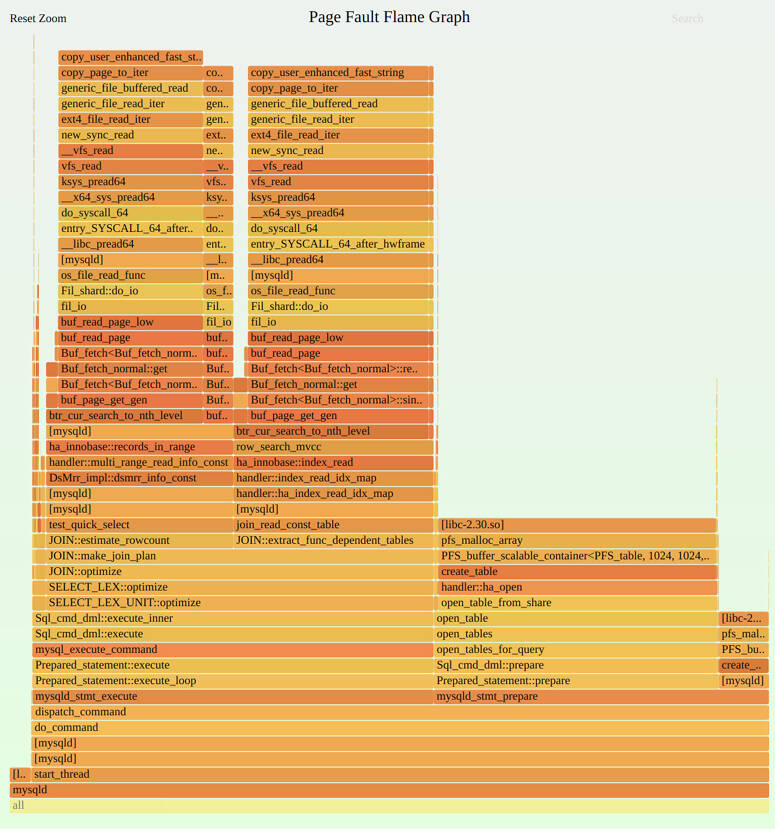

Figure 7.12 Page fault flame graph

The [Figure 7.12](ch07.md) flame graph shows that more than half of the memory growth in MySQL server was from the JOIN::optimize() code path (left large tower). A mouse-over of JOIN::optimize() shows that it and its child calls were responsible for 3,226 page faults; with 4 Kbyte pages, this amounts to around 12 Mbytes of main memory growth.

The commands used to generate this flame graph, including the perf(1) command to record page faults, are:

[Click here to view code image](ch07_images.md)

```
# perf record -e page-faults -a -g -- sleep 60
# perf script --header > out.stacks
$ git clone https://github.com/brendangregg/FlameGraph; cd FlameGraph
$ ./stackcollapse-perf.pl < ../out.stacks | ./flamegraph.pl --hash \
    --bgcolor=green --count=pages --title="Page Fault Flame Graph" > out.svg
```

I set the background color to green as a visual reminder that this is not a typical CPU flame graph (yellow background) but is a memory flame graph (green background).

#### 7.5.11 drsnoop

drsnoop(8)[10](ch07.md) is a BCC tool for tracing the direct reclaim approach to freeing memory, showing the process affected and the latency: the time taken for the reclaim. It can be used to quantify the application performance impact of a memory-constrained system. For example:

[10](ch07.md)Origin: This was created by Wenbo Zhang on 10-Feb-2019.

[Click here to view code image](ch07_images.md)

```
# drsnoop -T
TIME(s)       COMM           PID     LAT(ms) PAGES
0.000000000   java           11266      1.72    57
0.004007000   java           11266      3.21    57
0.011856000   java           11266      2.02    43
0.018315000   java           11266      3.09    55
0.024647000   acpid          1209       6.46    73
[...]
```

This output shows some direct reclaims for Java, taking between one and seven milliseconds. The rates of these reclaims and their duration in milliseconds (`LAT(ms)`) can be considered in quantifying the application impact.

This tool works by tracing the vmscan mm\_vmscan\_direct\_reclaim\_begin and mm\_vmscan\_direct\_reclaim\_end tracepoints. These are expected to be low-frequency events (usually happening in bursts), so the overhead should be negligible.

drsnoop(8) supports a `-T` option to include timestamps, and `-p PID` to match a single process.

#### 7.5.12 wss

wss(8) is an experimental tool I developed to show how a process working set size (WSS) can be measured using the page table entry (PTE) “accessed” bit. This was part of a longer study to summarize different ways working set size can be determined \[Gregg 18c]. I’ve included wss(8) here because working set size (the amount of frequently accessed memory) is an important metric for understanding memory usage, and having an experimental tool with warnings is better than no tool.

The following output shows wss(8) measuring the WSS of a MySQL database server (mysqld), printing the cumulative WSS every one second:

[Click here to view code image](ch07_images.md)

```
# ./wss.pl $(pgrep -n mysqld) 1
Watching PID 423 page references grow, output every 1 seconds...
Est(s)     RSS(MB)    PSS(MB)    Ref(MB)
1.014       403.66     400.59      86.00
2.034       403.66     400.59      90.75
3.054       403.66     400.59      94.29
4.074       403.66     400.59      97.53
5.094       403.66     400.59     100.33
6.114       403.66     400.59     102.44
7.134       403.66     400.59     104.58
8.154       403.66     400.59     106.31
9.174       403.66     400.59     107.76
10.194      403.66     400.59     109.14
```

The output shows that by the five-second mark, mysqld had touched around 100 Mbytes of memory. The RSS for mysqld was 400 Mbytes. The output also includes the estimated time for the interval, including the time taken to set and read the accessed bit (`Est(s)`), and the proportional set size (PSS), which accounts for sharing pages with other processes.

This tool works by resetting the PTE accessed bit for every page in a process, pausing for an interval, and then checking the bits to see which have been set. Since this is page-based, the resolution is the page size, typically 4 Kbytes. Consider the numbers it reports to have been rounded up to the page size.

WARNINGS: This tool uses /proc/PID/clear\_refs and /proc/PID/smaps, which can cause slightly higher application latency (e.g., 10%) while the kernel walks page structures. For large processes (&gt; 100 Gbytes), this duration of higher latency can last over one second, during which this tool is consuming system CPU time. Keep these overheads in mind. This tool also resets the referenced flag, which might confuse the kernel as to which pages to reclaim, especially if swapping is active. Further, it also activates some old kernel code that may not have been used in your environment before. Test first in a lab environment to make sure you understand the overheads.

#### 7.5.13 bpftrace

bpftrace is a BPF-based tracer that provides a high-level programming language, allowing the creation of powerful one-liners and short scripts. It is well suited for custom application analysis based on clues from other tools. The bpftrace repository contains additional tools for memory analysis, including oomkill.bt [\[Robertson 20\]](ch07.md).

bpftrace is explained in [Chapter 15](ch15.md), [BPF](ch15.md). This section shows some examples for memory analysis.

##### One-liners

The following one-liners are useful and demonstrate different bpftrace capabilities.

Sum libc malloc() request bytes by user stack and process (high overhead):

[Click here to view code image](ch07_images.md)

```
bpftrace -e 'uprobe:/lib/x86_64-linux-gnu/libc.so.6:malloc {
    @[ustack, comm] = sum(arg0); }'
```

Sum libc malloc() request bytes by user stack for PID 181 (high overhead):

[Click here to view code image](ch07_images.md)

```
bpftrace -e 'uprobe:/lib/x86_64-linux-gnu/libc.so.6:malloc /pid == 181/ {
    @[ustack] = sum(arg0); }'
```

Show libc malloc() request bytes by user stack for PID 181 as a power-of-2 histogram (high overhead):

[Click here to view code image](ch07_images.md)

```
bpftrace -e 'uprobe:/lib/x86_64-linux-gnu/libc.so.6:malloc /pid == 181/ {
    @[ustack] = hist(arg0); }'
```

Sum kernel kmem cache allocation bytes by kernel stack trace:

[Click here to view code image](ch07_images.md)

```
bpftrace -e 't:kmem:kmem_cache_alloc { @bytes[kstack] = sum(args->bytes_alloc); }'
```

Count process heap expansion (brk(2)) by code path:

[Click here to view code image](ch07_images.md)

```
bpftrace -e 'tracepoint:syscalls:sys_enter_brk { @[ustack, comm] = count(); }'
```

Count page faults by process:

[Click here to view code image](ch07_images.md)

```
bpftrace -e 'software:page-fault:1 { @[comm, pid] = count(); }'
```

Count user page faults by user-level stack trace:

[Click here to view code image](ch07_images.md)

```
bpftrace -e 't:exceptions:page_fault_user { @[ustack, comm] = count(); }'
```

Count vmscan operations by tracepoint:

[Click here to view code image](ch07_images.md)

```
bpftrace -e 'tracepoint:vmscan:* { @[probe] = count(); }'
```

Count swapins by process:

[Click here to view code image](ch07_images.md)

```
bpftrace -e 'kprobe:swap_readpage { @[comm, pid] = count(); }'
```

Count page migrations:

[Click here to view code image](ch07_images.md)

```
bpftrace -e 'tracepoint:migrate:mm_migrate_pages { @ = count(); }'
```

Trace compaction events:

[Click here to view code image](ch07_images.md)

```
bpftrace -e 't:compaction:mm_compaction_begin { time(); }'
```

List USDT probes in libc:

[Click here to view code image](ch07_images.md)

```
bpftrace -l 'usdt:/lib/x86_64-linux-gnu/libc.so.6:*'
```

List kernel kmem tracepoints:

```
bpftrace -l 't:kmem:*'
```

List all memory subsystem (mm) tracepoints:

```
bpftrace -l 't:*:mm_*'
```

##### User Allocation Stacks

User-level allocations can be traced from the allocation functions used. For this example, the malloc(3) function from libc is traced for PID 4840, a MySQL database server. The allocation requested size is recorded as a histogram keyed by user-level stack trace:

[Click here to view code image](ch07_images.md)

```
# bpftrace -e 'uprobe:/lib/x86_64-linux-gnu/libc.so.6:malloc /pid == 4840/ {
    @[ustack] = hist(arg0); }'
Attaching 1 probe...
^C
[...]

    __libc_malloc+0
    Filesort_buffer::allocate_sized_block(unsigned long)+52
    0x562cab572344
    filesort(THD*, Filesort*, RowIterator*, Filesort_info*, Sort_result*, unsigned
long long*)+4017
    SortingIterator::DoSort(QEP_TAB*)+184
    SortingIterator::Init()+42
    SELECT_LEX_UNIT::ExecuteIteratorQuery(THD*)+489
    SELECT_LEX_UNIT::execute(THD*)+266
    Sql_cmd_dml::execute_inner(THD*)+563
    Sql_cmd_dml::execute(THD*)+1062
    mysql_execute_command(THD*, bool)+2380
    Prepared_statement::execute(String*, bool)+2345
    Prepared_statement::execute_loop(String*, bool)+172
    mysqld_stmt_execute(THD*, Prepared_statement*, bool, unsigned long, PS_PARAM*)
+385
    dispatch_command(THD*, COM_DATA const*, enum_server_command)+5793
    do_command(THD*)+420
    0x562cab464fe0
    0x562cacad873a
    start_thread+217
]:
[32K, 64K)           676 |@@@@@@@@@@@@@@@@@@@@@@@@@@@@@@@@@@@@@@@@@@@@@@@@@@@@|
[64K, 128K)          338 |@@@@@@@@@@@@@@@@@@@@@@@@@@                          |
```

The output shows that, while tracing, this code path had 676 malloc() requests sized between 32 and 64 Kbytes, and 338 sized between 64 Kbytes and 128 Kbytes.

##### malloc() Bytes Flame Graph

The output from the previous one-liner was many pages long, so is more easily understood as a flame graph. One can be generated using the following steps:

[Click here to view code image](ch07_images.md)

```
# bpftrace -e 'u:/lib/x86_64-linux-gnu/libc.so.6:malloc /pid == 4840/ {
    @[ustack] = hist(arg0); }' > out.stacks
$ git clone https://github.com/brendangregg/FlameGraph; cd FlameGraph
$ ./stackcollapse-bpftrace.pl < ../out.stacks | ./flamegraph.pl --hash \
    --bgcolor=green --count=bytes --title="malloc() Bytes Flame Graph" > out.svg
```

WARNING: user-level allocation requests can be a frequent activity, occurring many millions of times per second. While the instrumentation cost is small, when multiplied by a high rate, it can lead to significant CPU overhead while tracing, slowing down the target by a factor of two or more—use sparingly. Because it is low-cost, I first use CPU profiling of stack traces to get a handle on allocation paths, or page fault tracing shown in the next section.

##### Page Fault Flame Graphs

Tracing page faults shows when a process grows in memory size. The previous malloc() one-liner traced the allocation path. Page fault tracing was performed earlier in [Section 7.5.10](ch07.md), [perf](ch07.md), and from it a flame graph was generated. An advantage of using bpftrace instead is that the stack traces can be aggregated in kernel space for efficiency, and only the unique stacks and counts written to user space.

The following commands use bpftrace to collect page fault stack traces and then generate a flame graph from them:

[Click here to view code image](ch07_images.md)

```
# bpftrace -e 't:exceptions:page_fault_user { @[ustack, comm] = count(); }
    ' > out.stacks
$ git clone https://github.com/brendangregg/FlameGraph; cd FlameGraph
$ ./stackcollapse-bpftrace.pl < ../out.stacks | ./flamegraph.pl --hash \
    --bgcolor=green --count=pages --title="Page Fault Flame Graph" > out.svg
```

See [Section 7.5.10](ch07.md), [perf](ch07.md), for an example page fault stack trace and flame graph.

##### Memory Internals

If needed, you can develop custom tools to explore memory allocation and internals in more depth. Start by trying tracepoints for the kernel memory events, and USDT probes for library allocators such as libc. Listing tracepoints:

[Click here to view code image](ch07_images.md)

```
# bpftrace -l 'tracepoint:kmem:*'
tracepoint:kmem:kmalloc
tracepoint:kmem:kmem_cache_alloc
tracepoint:kmem:kmalloc_node
tracepoint:kmem:kmem_cache_alloc_node
tracepoint:kmem:kfree
tracepoint:kmem:kmem_cache_free
[...]
# bpftrace -l 't:*:mm_*'
tracepoint:huge_memory:mm_khugepaged_scan_pmd
tracepoint:huge_memory:mm_collapse_huge_page
tracepoint:huge_memory:mm_collapse_huge_page_isolate
tracepoint:huge_memory:mm_collapse_huge_page_swapin
tracepoint:migrate:mm_migrate_pages
tracepoint:compaction:mm_compaction_isolate_migratepages
tracepoint:compaction:mm_compaction_isolate_freepages
[...]
```

Each of these tracepoints have arguments that can be listed using `-lv`. On this kernel (5.3) there are 12 kmem tracepoints, and 47 tracepoints beginning with “mm\_”.

Listing USDT probes for libc on Ubuntu:

[Click here to view code image](ch07_images.md)

```
# bpftrace -l 'usdt:/lib/x86_64-linux-gnu/libc.so.6'
usdt:/lib/x86_64-linux-gnu/libc.so.6:libc:setjmp
usdt:/lib/x86_64-linux-gnu/libc.so.6:libc:longjmp
usdt:/lib/x86_64-linux-gnu/libc.so.6:libc:longjmp_target
usdt:/lib/x86_64-linux-gnu/libc.so.6:libc:lll_lock_wait_private
usdt:/lib/x86_64-linux-gnu/libc.so.6:libc:memory_mallopt_arena_max
usdt:/lib/x86_64-linux-gnu/libc.so.6:libc:memory_mallopt_arena_test
usdt:/lib/x86_64-linux-gnu/libc.so.6:libc:memory_tunable_tcache_max_bytes
[...]
```

For this libc version (6) there are 33 USDT probes.

If the tracepoints and USDT probes are insufficient, consider using dynamic instrumentation with kprobes and uprobes.

There is also the watchpoint probe type for memory watchpoints: events when a specified memory address is read, written, or executed.

Since memory events can be very frequent, instrumenting them can consume significant overhead. malloc(3) functions from user space can be called millions of times per second, and with the current uprobes overhead (see [Chapter 4](ch04.md), [Observability Tools](ch04.md), [Section 4.3.7](ch04.md), [uprobes](ch04.md)), tracing them can slow a target two-fold or more. Use caution and find ways to reduce this overhead, such as using maps to summarize statistics instead of printing per-event details, and tracing the fewest possible events.

#### 7.5.14 Other Tools

Memory observability tools included in other chapters of this book, and in *BPF Performance Tools* [\[Gregg 19\]](ch07.md), are listed in [Table 7.6](ch07.md).

Table 7.6 **Other memory observability tools**

**Section**

**Tool**

**Description**

[6.6.11](ch06.md)

pmcarch

CPU cycle usage including LLC misses

[6.6.12](ch06.md)

tlbstat

Summarizes TLB cycles

[8.6.2](ch08.md)

free

Cache capacity statistics

[8.6.12](ch08.md)

cachestat

Page cache statistics

[\[Gregg 19\]](ch07.md)

oomkill

Shows extra info on OOM kill events

[\[Gregg 19\]](ch07.md)

memleak

Shows possible memory leak code paths

[\[Gregg 19\]](ch07.md)

mmapsnoop

Traces mmap(2) calls system-wide

[\[Gregg 19\]](ch07.md)

brkstack

Shows brk() calls with user stack traces

[\[Gregg 19\]](ch07.md)

shmsnoop

Traces shared memory calls with details

[\[Gregg 19\]](ch07.md)

faults

Shows page faults, by user stack trace

[\[Gregg 19\]](ch07.md)

ffaults

Shows page faults, by filename

[\[Gregg 19\]](ch07.md)

vmscan

Measures VM scanner shrink and reclaim times

[\[Gregg 19\]](ch07.md)

swapin

Shows swap-ins by process

[\[Gregg 19\]](ch07.md)

hfaults

Shows huge page faults, by process

Other Linux memory observability tools and sources include the following:

- **`dmesg`** : Check for “Out of memory” messages from the OOM killer.
- **`dmidecode`** : Shows BIOS information for memory banks.
- **`tiptop`** : A version of top(1) that displays PMC statistics by process.
- **`valgrind`** : A performance analysis suite, including memcheck, a wrapper for user-level allocators for memory usage analysis including leak detection. This costs significant overhead; the manual advises that it can cause the target to run 20 to 30 times slower [\[Valgrind 20\]](ch07.md).
- **`iostat`** : If the swap device is a physical disk or slice, device I/O may be observable using iostat(1), which indicates that the system is paging.
- **`/proc/zoneinfo`** : Statistics for memory zones (DMA, etc.).
- **`/proc/buddyinfo`** : Statistics for the kernel buddy allocator for pages.
- **`/proc/pagetypeinfo`** : Kernel free memory page statistics; can be used to help debug issues of kernel memory fragmentation.
- **`/sys/devices/system/node/node*/numastat`** : Statistics for NUMA nodes.
- **SysRq `m`** : Magic SysRq has an “m” key to dump memory info to the console.

Here is an example output from dmidecode(8), showing a bank of memory:

[Click here to view code image](ch07_images.md)

```
# dmidecode
[...]
Memory Device
        Array Handle: 0x0003
        Error Information Handle: Not Provided
        Total Width: 64 bits
        Data Width: 64 bits
        Size: 8192 MB
        Form Factor: SODIMM
        Set: None
        Locator: ChannelA-DIMM0
        Bank Locator: BANK 0
        Type: DDR4
        Type Detail: Synchronous Unbuffered (Unregistered)
        Speed: 2400 MT/s
        Manufacturer: Micron
        Serial Number: 00000000
        Asset Tag: None
        Part Number: 4ATS1G64HZ-2G3A1
        Rank: 1
        Configured Clock Speed: 2400 MT/s
        Minimum Voltage: Unknown
        Maximum Voltage: Unknown
        Configured Voltage: 1.2 V
[...]
```

This output is useful information for static performance tuning (e.g., it shows the type is DDR4 and not DDR5). Unfortunately, this information is typically unavailable to cloud guests.

Here is some sample output from the SysRq “m” trigger:

[Click here to view code image](ch07_images.md)

```
# echo m > /proc/sysrq-trigger
# dmesg
[...]
[334849.389256] sysrq: Show Memory
[334849.391021] Mem-Info:
[334849.391025] active_anon:110405 inactive_anon:24 isolated_anon:0
                 active_file:152629 inactive_file:137395 isolated_file:0
                 unevictable:4572 dirty:311 writeback:0 unstable:0
                 slab_reclaimable:31943 slab_unreclaimable:14385
                 mapped:37490 shmem:186 pagetables:958 bounce:0
                 free:37403 free_pcp:478 free_cma:2289
[334849.391028] Node 0 active_anon:441620kB inactive_anon:96kB active_file:610516kB
inactive_file:549580kB unevictable:18288kB isolated(anon):0kB isolated(file):0kB
mapped:149960kB dirty:1244kB writeback:0kB shmem:744kB shmem_thp: 0kB
shmem_pmdmapped: 0kB anon_thp: 2048kB writeback_tmp:0kB unstable:0kB
all_unreclaimable? no
[334849.391029] Node 0 DMA free:12192kB min:360kB low:448kB high:536kB ...
[...]
```

This can be useful if the system has locked up, as it may still be possible to request this information using the SysRq key sequence on the console keyboard, if available [\[Linux 20g\]](ch07.md).

Applications and virtual machines (e.g., the Java VM) may also provide their own memory analysis tools. See [Chapter 5](ch05.md), [Applications](ch05.md).

### 7.6 Tuning

The most important memory tuning you can do is to ensure that applications remain in main memory, and that paging and swapping do not occur frequently. Identifying this problem was covered in [Section 7.4](ch07.md), [Methodology](ch07.md), and [Section 7.5](ch07.md), [Observability Tools](ch07.md). This section discusses other memory tuning: kernel tunable parameters, configuring large pages, allocators, and resource controls.

The specifics of tuning—the options available and what to set them to—depend on the operating system version and the intended workload. The following sections, organized by tuning type, provide examples of which tunable parameters may be available, and why they may need to be tuned.

#### 7.6.1 Tunable Parameters

This section describes tunable parameter examples for recent Linux kernels.

Various memory tunable parameters are described in the kernel source documentation in Documentation/sysctl/vm.txt and can be set using sysctl(8). The examples in [Table 7.7](ch07.md) are from a 5.3 kernel, with defaults from Ubuntu 19.10 (those listed in the first edition of this book have not changed since then).

Table 7.7 **Example Linux memory tunables**

**Option**

**Default**

**Description**

vm.dirty\_background\_bytes

0

Amount of dirty memory to trigger pdflush background write-back

vm.dirty\_background\_ratio

10

Percentage of dirty system memory to trigger pdflush background write-back

vm.dirty\_bytes

0

Amount of dirty memory that causes a writing process to start write-back

vm.dirty\_ratio

20

Ratio of dirty system memory to cause a writing process to begin write-back

vm.dirty\_expire\_centisecs

3,000

Minimum time for dirty memory to be eligible for pdflush (promotes *write cancellation*)

vm.dirty\_writeback\_centisecs

500

pdflush wake-up interval (0 to disable)

vm.min\_free\_kbytes

dynamic

sets the desired free memory amount (some kernel atomic allocations can consume this)

vm.watermark\_scale\_factor

10

The distance between kswapd watermarks (min, low, high) that control waking up and sleeping (unit is fractions of 10000, such that 10 means 0.1% of system memory)

vm.watermark\_boost\_factor

5000

How far past the high watermark kswapd scans when memory is fragmented (recent fragmentation events occurred); unit is fractions of 10000, so 5000 means kswapd can boost up to 150% of the high watermark; 0 to disable

vm.percpu\_pagelist\_fraction

0

This can override the default max fraction of pages that can be allocated to per-cpu page lists (a value of 10 limits to 1/10th of pages)

vm.overcommit\_memory

0

0 = Use a heuristic to allow reasonable overcommits; 1 = always overcommit; 2 = don’t overcommit

vm.swappiness

60

The degree to favor swapping (paging) for freeing memory over reclaiming it from the page cache

vm.vfs\_cache\_pressure

100

The degree to reclaim cached directory and inode objects; lower values retain them more; 0 means never reclaim—can easily lead to out-of-memory conditions

kernel.numa\_balancing

1

Enables automatic NUMA page balancing

kernel.numa\_balancing\_scan\_size\_mb

256

How many Mbytes of pages are scanned for each NUMA balancing scan

The tunables use a consistent naming scheme that includes the units. Note that dirty\_background\_bytes and dirty\_background\_ratio are mutually exclusive, as are dirty\_bytes and dirty\_ratio (when one is set it overrides the other).

The size of vm.min\_free\_kbytes is set dynamically as a fraction of main memory. The algorithm to choose this is not linear, as needs for free memory do not linearly scale with main memory size. (For reference, this is documented in the Linux source in mm/page\_alloc.c.) vm.min\_free\_kbytes can be reduced to free up some memory for applications, but that can also cause the kernel to be overwhelmed during memory pressure and resort to using OOM sooner. Increasing it can help avoid OOM kills.

Another parameter for avoiding OOM is vm.overcommit\_memory, which can be set to 2 to disable overcommit and avoid cases where this leads to OOM. If you want to control the OOM killer on a per-process basis, check your kernel version for /proc tunables such as oom\_adj or oom\_score\_adj. These are described in Documentation/filesystems/proc.txt.

The vm.swappiness tunable can significantly affect performance if it begins swapping application memory earlier than desired. The value of this tunable can be between 0 and 100, with high values favoring swapping applications and therefore retaining the page cache. It may be desirable to set this to zero, so that application memory is retained as long as possible at the expense of the page cache. When there is still a memory shortage, the kernel can still use swapping.

At Netflix, kernel.numa\_balancing was set to zero for earlier kernels (around Linux 3.13) because overly aggressive NUMA scanning consumed too much CPU [\[Gregg 17d\]](ch07.md). This was fixed in later kernels, and there are other tunables including kernel.numa\_balancing\_scan\_size\_mb for adjusting the aggressiveness of NUMA scanning.

#### 7.6.2 Multiple Page Sizes

Large page sizes can improve memory I/O performance by improving the hit ratio of the TLB cache (increasing its reach). Most modern processors support multiple page sizes, such as a 4 Kbyte default and a 2 Mbyte large page.

On Linux, large pages (called *huge pages*) can be configured in a number of ways. For reference, see Documentation/vm/hugetlbpage.txt.

These usually begin with the creation of huge pages:

[Click here to view code image](ch07_images.md)

```
# echo 50 > /proc/sys/vm/nr_hugepages
# grep Huge /proc/meminfo
AnonHugePages:         0 kB
HugePages_Total:      50
HugePages_Free:       50
HugePages_Rsvd:        0
HugePages_Surp:        0
Hugepagesize:       2048 kB
```

One way for an application to consume huge pages is via the shared memory segments, and the SHM\_HUGETLBS flag to shmget(2). Another way involves creating a huge page-based file system for applications to map memory from:

[Click here to view code image](ch07_images.md)

```
# mkdir /mnt/hugetlbfs
# mount -t hugetlbfs none /mnt/hugetlbfs -o pagesize=2048K
```

Other ways include the MAP\_ANONYMOUS|MAP\_HUGETLB flags to mmap(2) and use of the libhugetlbfs API [\[Gorman 10\]](ch07.md).

Finally, *transparent huge pages* (THP) is another mechanism that uses huge pages by automatically promoting and demoting normal pages to huge, without an application needing to specify huge pages [\[Corbet 11\]](ch07.md). In the Linux source see Documentation/vm/transhuge.txt and admin-guide/mm/transhuge.rst.[11](ch07.md)

[11](ch07.md)Note that historically there were performance issues with transparent huge pages, deterring its usage. These issues have hopefully been fixed.

#### 7.6.3 Allocators

Different user-level allocators may be available, offering improved performance for multithreaded applications. These may be selected at compile time, or at execution time by setting the LD\_PRELOAD environment variable.

For example, the libtcmalloc allocator could be selected using:

[Click here to view code image](ch07_images.md)

```
export LD_PRELOAD=/usr/lib/x86_64-linux-gnu/libtcmalloc_minimal.so.4
```

This may be placed in its startup script.

#### 7.6.4 NUMA Binding

On NUMA systems, the numactl(8) command can be used to bind processes to NUMA nodes. This can improve performance for applications that do not need more than a single NUMA node of main memory. Example usage:

```
# numactl --membind=0 3161
```

This binds PID 3161 to NUMA node 0. Future memory allocations for this process will fail if they cannot be satisfied from this node. When using this option, you should also investigate using the `--physcpubind` option to also restrict CPU usage to CPUs connected to that NUMA node. I commonly use both NUMA and CPU bindings to restrict a process to a single socket, to avoid the performance penalty of CPU interconnect access.

Use numastat(8) ([Section 7.5.6](ch07.md)) to list available NUMA nodes.

#### 7.6.5 Resource Controls

Basic resource controls, including setting a main memory limit and a virtual memory limit, may be available using ulimit(1).

For Linux, the container groups (cgroups) memory subsystem provides various additional controls. These include:

- **`memory.limit_in_bytes`** : The maximum allowed user memory, including file cache usage, in bytes
- **`memory.memsw.limit_in_bytes`** : The maximum allowed memory and swap space, in bytes (when swap is in use)
- **`memory.kmem.limit_in_bytes`** : The maximum allowed kernel memory, in bytes
- **`memory.tcp.limit_in_bytes`** : The maximum tcp buffer memory, in bytes.
- **`memory.swappiness`** : Similar to vm.swappiness described earlier but can be set for a cgroup
- **`memory.oom_control`** : Can be set to 0, to allow the OOM killer for this cgroup, or 1, to disable it

Linux also allows system-wide configuration in /etc/security/limits.conf.

For more on resource controls, see [Chapter 11](ch11.md), [Cloud Computing](ch11.md).

### 7.7 Exercises

1. Answer the following questions about memory terminology:
   
   - What is a page of memory?
   - What is resident memory?
   - What is virtual memory?
   - Using Linux terminology, what is the difference between paging and swapping?
2. Answer the following conceptual questions:
   
   - What is the purpose of demand paging?
   - Describe memory utilization and saturation.
   - What is the purpose of the MMU and the TLB?
   - What is the role of the page-out daemon?
   - What is the role of the OOM killer?
3. Answer the following deeper questions:
   
   - What is anonymous paging, and why is it more important to analyze than file system paging?
   - Describe the steps the kernel takes to free up more memory when free memory becomes exhausted on Linux-based systems.
   - Describe the performance advantages of slab-based allocation.
4. Develop the following procedures for your operating system:
   
   - A USE method checklist for memory resources. Include how to fetch each metric (e.g., which command to execute) and how to interpret the result. Try to use existing OS observability tools before installing or using additional software products.
   - Create a workload characterization checklist for memory resources. Include how to fetch each metric, and try to use existing OS observability tools first.
5. Perform these tasks:
   
   - Choose an application, and summarize code paths that lead to memory allocation (malloc(3)).
   - Choose an application that has some degree of memory growth (calling brk(2) or sbrk(2)), and summarize code paths that lead to this growth.
   - Describe the memory activity visible in the following Linux output alone:
     
     [Click here to view code image](ch07_images.md)
     
     ```
     # vmstat 1
     procs -----------memory-------- ---swap-- -----io---- --system-- -----cpu-----
      r  b   swpd   free  buff cache   si   so    bi    bo   in   cs us sy id wa st
      2  0 413344  62284    72  6972    0    0    17    12    1    1  0  0 100  0  0
      2  0 418036  68172    68  3808    0 4692  4520  4692 1060 1939 61 38  0  1  0
      2  0 418232  71272    68  1696    0  196 23924   196 1288 2464 51 38  0 11  0
      2  0 418308  68792    76  2456    0   76  3408    96 1028 1873 58 39  0  3  0
      1  0 418308  67296    76  3936    0    0  1060     0 1020 1843 53 47  0  0  0
      1  0 418308  64948    76  3936    0    0     0     0 1005 1808 36 64  0  0  0
      1  0 418308  62724    76  6120    0    0  2208     0 1030 1870 62 38  0  0  0
      1  0 422320  62772    76  6112    0 4012     0  4016 1052 1900 49 51  0  0  0
      1  0 422320  62772    76  6144    0    0     0     0 1007 1826 62 38  0  0  0
      1  0 422320  60796    76  6144    0    0     0     0 1008 1817 53 47  0  0  0
      1  0 422320  60788    76  6144    0    0     0     0 1006 1812 49 51  0  0  0
      3  0 430792  65584    64  5216    0 8472  4912  8472 1030 1846 54 40  0  6  0
      1  0 430792  64220    72  6496    0    0  1124    16 1024 1857 62 38  0  0  0
      2  0 434252  68188    64  3704    0 3460  5112  3460 1070 1964 60 40  0  0  0
      2  0 434252  71540    64  1436    0    0 21856     0 1300 2478 55 41  0  4  0
      1  0 434252  66072    64  3912    0    0  2020     0 1022 1817 60 40  0  0  0
     [...]
     ```
6. (optional, advanced) Find or develop metrics to show how well the kernel NUMA memory locality policies are working in practice. Develop “known” workloads that have good or poor memory locality for testing the metrics.

### 7.8 References

**\[Corbató 68]** Corbató, F. J., *A Paging Experiment with the Multics System*, MIT Project MAC Report MAC-M-384, 1968.

**\[Denning 70]** Denning, P., “Virtual Memory,*” ACM Computing Surveys (CSUR)* 2, no. 3, 1970.

**\[Peterson 77]** Peterson, J., and Norman, T., “Buddy Systems,” *Communications of the ACM*, 1977.

**\[Thompson 78]** Thompson, K., *UNIX Implementation*, Bell Laboratories, 1978.

**\[Babaoglu 79]** Babaoglu, O., Joy, W., and Porcar, J., *Design and Implementation of the Berkeley Virtual Memory Extensions to the UNIX Operating System*, Computer Science Division, Deptartment of Electrical Engineering and Computer Science, University of California, Berkeley, 1979.

**\[Bach 86]** Bach, M. J., *The Design of the UNIX Operating System*, Prentice Hall, 1986.

**\[Bonwick 94]** Bonwick, J., “The Slab Allocator: An Object-Caching Kernel Memory Allocator,” USENIX, 1994.

**\[Bonwick 01]** Bonwick, J., and Adams, J., “Magazines and Vmem: Extending the Slab Allocator to Many CPUs and Arbitrary Resources,” USENIX, 2001.

**\[Corbet 04]** Corbet, J., “2.6 swapping behavior,” *LWN.net*, [http://lwn.net/Articles/83588](http://lwn.net/Articles/83588), 2004

**\[Gorman 04]** Gorman, M., *Understanding the Linux Virtual Memory Manager*, Prentice Hall, 2004.

**\[McDougall 06a]** McDougall, R., Mauro, J., and Gregg, B., *Solaris Performance and Tools: DTrace and MDB Techniques for Solaris 10 and OpenSolaris*, Prentice Hall, 2006.

**\[Ghemawat 07]** Ghemawat, S., “TCMalloc : Thread-Caching Malloc,” [https://gperftools.github.io/gperftools/tcmalloc.html](https://gperftools.github.io/gperftools/tcmalloc.html), 2007.

**\[Lameter 07]** Lameter, C., “SLUB: The unqueued slab allocator V6,” *Linux kernel mailing list*, [http://lwn.net/Articles/229096](http://lwn.net/Articles/229096), 2007.

**\[Hall 09]** Hall, A., “Thanks for the Memory, Linux,” Andrew Hall, [https://www.ibm.com/developerworks/library/j-nativememory-linux](https://www.ibm.com/developerworks/library/j-nativememory-linux), 2009.

**\[Gorman 10]** Gorman, M., “Huge pages part 2: Interfaces,” *LWN.net*, [http://lwn.net/Articles/375096](http://lwn.net/Articles/375096), 2010.

**\[Corbet 11]** Corbet, J., “Transparent huge pages in 2.6.38,” *LWN.net*, [http://lwn.net/Articles/423584](http://lwn.net/Articles/423584), 2011.

**\[Facebook 11]** “Scalable memory allocation using jemalloc,” *Facebook Engineering*, [https://www.facebook.com/notes/facebook-engineering/scalable-memory-allocation-using-jemalloc/480222803919](https://www.facebook.com/notes/facebook-engineering/scalable-memory-allocation-using-jemalloc/480222803919), 2011.

**\[Evans 17]** Evans, J., “Swapping, memory limits, and cgroups,” [https://jvns.ca/blog/2017/02/17/mystery-swap](https://jvns.ca/blog/2017/02/17/mystery-swap), 2017.

**\[Gregg 17d]** Gregg, B., “AWS re:Invent 2017: How Netflix Tunes EC2,” [http://www.brendangregg.com/blog/2017-12-31/reinvent-netflix-ec2-tuning.html](http://www.brendangregg.com/blog/2017-12-31/reinvent-netflix-ec2-tuning.html), 2017.

**\[Corbet 18a]** Corbet, J., “Is it time to remove ZONE\_DMA?” *LWN.net*, [https://lwn.net/Articles/753273](https://lwn.net/Articles/753273), 2018.

**\[Crucial 18]** “The Difference between RAM Speed and CAS Latency,” [https://www.crucial.com/articles/about-memory/difference-between-speed-and-latency](https://www.crucial.com/articles/about-memory/difference-between-speed-and-latency), 2018.

**\[Gregg 18c]** Gregg, B., “Working Set Size Estimation,” [http://www.brendangregg.com/wss.html](http://www.brendangregg.com/wss.html), 2018.

**\[Facebook 19]** “Getting Started with PSI,” *Facebook Engineering*, [https://facebookmicrosites.github.io/psi/docs/overview](https://facebookmicrosites.github.io/psi/docs/overview), 2019.

**\[Gregg 19]** Gregg, B., *BPF Performance Tools: Linux System and Application Observability*, Addison-Wesley, 2019.

**\[Intel 19a]** *Intel 64 and IA-32 Architectures Software Developer’s Manual,* Combined Volumes: 1, 2A, 2B, 2C, 3A, 3B and 3C, Intel, 2019.

**\[Amazon 20]** “Amazon EC2 High Memory Instances,” [https://aws.amazon.com/ec2/instance-types/high-memory](https://aws.amazon.com/ec2/instance-types/high-memory), accessed 2020.

**\[Linux 20g]** “Linux Magic System Request Key Hacks,” *Linux documentation*, [https://www.kernel.org/doc/html/latest/admin-guide/sysrq.html](https://www.kernel.org/doc/html/latest/admin-guide/sysrq.html), accessed 2020.

**\[Robertson 20]** Robertson, A., “bpftrace,” [https://github.com/iovisor/bpftrace](https://github.com/iovisor/bpftrace), last updated 2020.

**\[Valgrind 20]** “Valgrind Documentation,” [http://valgrind.org/docs/manual](http://valgrind.org/docs/manual), May 2020.
