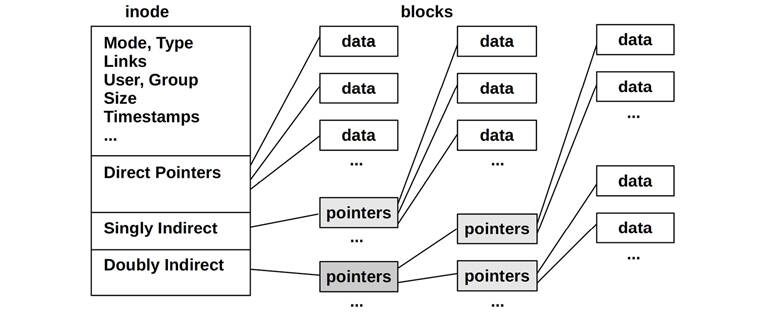
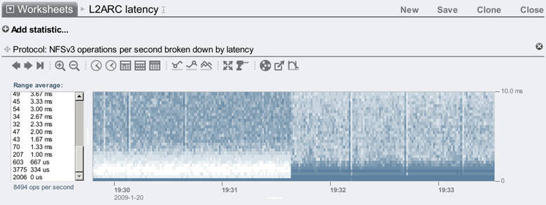

# Chapter 8

## File Systems

File system performance often matters more to the application than disk or storage device performance, because it is the file system that applications interact with and wait for. File systems can use caching, buffering, and asynchronous I/O to avoid subjecting applications to disk-level (or remote storage system) latency.

System performance analysis and monitoring tools have historically focused on disk performance, leaving file system performance as a blind spot. This chapter sheds light on file systems, showing how they work and how to measure their latency and other details. This often makes it possible to rule out file systems and their underlying disk devices as the source of poor performance, allowing investigation to move on to other areas.

The learning objectives of this chapter are:

- Understand file system models and concepts.
- Understand how file system workloads affect performance.
- Become familiar with file system caches.
- Become familiar with file system internals and performance features.
- Follow various methodologies for file system analysis.
- Measure file system latency to identify modes and outliers.
- Investigate file system usage using tracing tools.
- Test file system performance using microbenchmarks.
- Become aware of file system tunable parameters.

This chapter consists of six parts, the first three providing the basis for file system analysis and the last three showing its practical application to Linux-based systems. The parts are as follows:

- **Background** introduces file system-related terminology and basic models, illustrating file system principles and key file system performance concepts.
- **Architecture** introduces generic and specific file system architecture.
- **Methodology** describes performance analysis methodologies, both observational and experimental.
- **Observability Tools** shows file system observability tools for Linux-based systems, including static and dynamic instrumentation.
- **Experimentation** summarizes file system benchmark tools.
- **Tuning** describes file system tunable parameters.

### 8.1 Terminology

For reference, file system–related terminology used in this chapter includes:

- **File system**: An organization of data as files and directories, with a file-based interface for accessing them, and file permissions to control access. Additional content may include special file types for devices, sockets, and pipes, and metadata including file access timestamps.
- **File system cache**: An area of main memory (usually DRAM) used to cache file system contents, which may include different caches for various data and metadata types.
- **Operations**: File system operations are requests of the file system, including read(2), write(2), open(2), close(2), stat(2), mkdir(2), and other operations.
- **I/O**: Input/output. File system I/O can be defined in several ways; here it is used to mean only operations that directly read and write (performing I/O), including read(2), write(2), stat(2) (read statistics), and mkdir(2) (write a new directory entry). I/O does not include open(2) and close(2) (although those calls update metadata and can cause indirect disk I/O).
- **Logical I/O**: I/O issued by the application to the file system.
- **Physical I/O**: I/O issued directly to disks by the file system (or via raw I/O).
- **Block size**: Also known as *record size*, is the size of file system on-disk data groups. See Block vs. Extent in [Section 8.4.4](ch08.md), [File System Features](ch08.md).
- **Throughput**: The current data transfer rate between applications and the file system, measured in bytes per second.
- **inode**: An index node (inode) is a data structure containing metadata for a file system object, including permissions, timestamps, and data pointers.
- **VFS**: Virtual file system, a kernel interface to abstract and support different file system types.
- **Volume**: An instance of storage providing more flexibility than using a whole storage device. A volume may be a portion of a device, or multiple devices.
- **Volume manager**: Software for managing physical storage devices in a flexible way, creating *virtual volumes* for use by the OS.

Other terms are introduced throughout this chapter. The Glossary includes basic terminology for reference, including [*fsck*](gloss.md), [*IOPS*](gloss.md), *operation rate*, and *POSIX*. Also see the terminology sections in [Chapters 2](ch02.md) and [3](ch03.md).

### 8.2 Models

The following simple models illustrate some basic principles of file systems and their performance.

#### 8.2.1 File System Interfaces

A basic model of a file system is shown in [Figure 8.1](ch08.md), in terms of its interfaces.


Figure 8.1 File system interfaces

The locations where *logical* and *physical* operations occur are also labeled in the figure. See [Section 8.3.12](ch08.md), [Logical vs. Physical I/O](ch08.md), for more about these.

[Figure 8.1](ch08.md) shows generic object operations. Kernels may implement additional variants: for example, Linux provides readv(2), writev(2), openat(2), and more.

One approach for studying file system performance is to treat it as a black box, focusing on the latency of the object operations. This is explained in more detail in [Section 8.5.2](ch08.md), [Latency Analysis](ch08.md).

#### 8.2.2 File System Cache

A generic file system cache stored in main memory is pictured in [Figure 8.2](ch08.md), servicing a read operation.


Figure 8.2 File system main memory cache

The read returns data either from cache ([*cache hit*](gloss.md)) or from disk ([*cache miss*](gloss.md)). Cache misses are stored in the cache, populating the cache (warming it up).

The file system cache may also buffer writes to be written (flushed) later. The mechanisms for doing this differ for different file system types, and are described in [Section 8.4](ch08.md), [Architecture](ch08.md).

Kernels often provide a way to bypass the cache if desired. See [Section 8.3.8](ch08.md), [Raw and Direct I/O](ch08.md).

#### 8.2.3 Second-Level Cache

Second-level cache may be any memory type; [Figure 8.3](ch08.md) shows it as flash memory. This cache type was first developed by myself in 2007, for ZFS.


Figure 8.3 File system second-level cache

### 8.3 Concepts

The following are a selection of important file system performance concepts.

#### 8.3.1 File System Latency

File system latency is the primary metric of file system performance, measured as the time from a logical file system request to its completion. It includes time spent in the file system and disk I/O subsystem, and waiting on disk devices—the physical I/O. Application threads often block during an application request in order to wait for file system requests to complete—in this way, file system latency *directly* and *proportionally* affects application performance.

Cases where applications may not be directly affected include the use of non-blocking I/O, prefetch ([Section 8.3.4](ch08.md)), and when I/O is issued from an asynchronous thread (e.g., a background flush thread). It may be possible to identify these cases from the application, if it provides detailed metrics for its file system usage. If not, a generic approach is to use a kernel tracing tool that can show the user-level stack trace that led to a logical file system I/O. This stack trace can then be studied to see which application routines issued it.

Operating systems have not historically made file system latency readily observable, instead providing disk device-level statistics. But there are many cases where such statistics are unrelated to application performance, and where they are also misleading. An example of this is where file systems perform background flushing of written data, which may appear as bursts of high-latency disk I/O. From the disk device-level statistics, this looks alarming; however, no application is waiting on these to complete. See [Section 8.3.12](ch08.md), [Logical vs. Physical I/O](ch08.md), for more cases.

#### 8.3.2 Caching

The file system will typically use main memory (RAM) as a cache to improve performance. For applications, this process is transparent: application logical I/O latency becomes much lower (better), as it can be served from main memory rather than the much slower disk devices.

Over time, the cache grows, while free memory for the operating system shrinks. This can alarm new users, but is perfectly normal. The principle is: If there is spare main memory, do something useful with it. When applications need more memory, the kernel should quickly free it from the file system cache for use.

File systems use caching to improve read performance, and buffering (in the cache) to improve write performance. Multiple types of cache are typically used by the file system and the block device subsystem, which may include those in [Table 8.1](ch08.md).

Table 8.1 **Example cache types**

**Cache**

**Example**

Page cache

Operating system page cache

File system primary cache

ZFS ARC

File system secondary cache

ZFS L2ARC

Directory cache

dentry cache

inode cache

inode cache

Device cache

ZFS vdev

Block device cache

Buffer cache

Specific cache types are described in [Section 8.4](ch08.md), [Architecture](ch08.md), while [Chapter 3](ch03.md), [Operating Systems](ch03.md), has the full list of caches (including application- and device-level).

#### 8.3.3 Random vs. Sequential I/O

A series of logical file system I/O can be described as *random* or *sequential*, based on the file offset of each I/O. With sequential I/O, each I/O offset begins at the end of the previous I/O. Random I/O have no apparent relationship between them, and the offset changes randomly. A random file system workload may also refer to accessing many different files at random.


Figure 8.4 Sequential and random file I/O

[Figure 8.4](ch08.md) illustrates these access patterns, showing an ordered series of I/O and example file offsets.

Due to the performance characteristics of certain storage devices (described in [Chapter 9](ch09.md), [Disks](ch09.md)), file systems have historically attempted to reduce random I/O by placing file data on disk sequentially and contiguously. The term *fragmentation* describes what happens file systems do this poorly, causing files to be scattered over a drive, so that sequential logical I/O yields random physical I/O.

File systems may measure logical I/O access patterns so that they can identify sequential workloads, and then improve their performance using prefetch or read-ahead. This is helpful for rotational disks; less so for flash drives.

#### 8.3.4 Prefetch

A common file system workload involves reading a large amount of file data sequentially, for example, for a file system backup. This data may be too large to fit in the cache, or it may be read only once and is unlikely to be retained in the cache (depending on the cache eviction policy). Such a workload would perform relatively poorly, as it would have a low cache hit ratio.

Prefetch is a common file system feature for solving this problem. It can detect a sequential read workload based on the current and previous file I/O offsets, and then predict and issue disk reads before the application has requested them. This populates the file system cache, so that if the application does perform the expected read, it results in a cache hit (the data needed was already in the cache). An example scenario is as follows:

1. An application issues a file read(2), passing execution to the kernel.
2. The data is not cached, so the file system issues the read to disk.
3. The previous file offset pointer is compared to the current location, and if they are sequential, the file system issues additional reads (prefetch).
4. The first read completes, and the kernel passes the data and execution back to the application.
5. Any prefetch reads complete, populating the cache for future application reads.
6. Future sequential application reads complete quickly via the cache in RAM.

This scenario is also illustrated in [Figure 8.5](ch08.md), where application reads to offsets 1 and then 2 trigger prefetch of the next three offsets.


Figure 8.5 File system prefetch

When prefetch detection works well, applications show significantly improved sequential read performance; the disks keep ahead of application requests (provided they have the bandwidth to do so). When prefetch detection works poorly, unnecessary I/O is issued that the application does not need, polluting the cache and consuming disk and I/O transport resources. File systems typically allow prefetch to be tuned as needed.

#### 8.3.5 Read-Ahead

Historically, prefetch has also been known as *read-ahead*. Linux uses the read-ahead term for a system call, readahead(2), that allows applications to explicitly warm up the file system cache.

#### 8.3.6 Write-Back Caching

Write-back caching is commonly used by file systems to improve write performance. It works by treating writes as completed after the transfer to main memory, and writing them to disk sometime later, *asynchronously*. The file system process for writing this “dirty” data to disk is called *flushing*. An example sequence is as follows:

1. An application issues a file write(2), passing execution to the kernel.
2. Data from the application address space is copied to the kernel.
3. The kernel treats the write(2) syscall as completed, passing execution back to the application.
4. Sometime later, an asynchronous kernel task finds the written data and issues disk writes.

The trade-off is reliability. DRAM-based main memory is volatile, and dirty data can be lost in the event of a power failure. Data could also be written to disk *incompletely*, leaving a *corrupted* on-disk state.

If file system metadata becomes corrupted, the file system may no longer load. Such a state may be recoverable only from system backups, causing prolonged downtime. Worse, if the corruption affects file contents that the application reads and uses, the business may be in jeopardy.

To balance needs for both speed and reliability, file systems can offer write-back caching by default, and a *synchronous write* option to bypass this behavior and write directly to persistent storage devices.

#### 8.3.7 Synchronous Writes

A synchronous write completes only when fully written to persistent storage (e.g., disk devices), which includes writing any file system metadata changes that are necessary. These are much slower than asynchronous writes (write-back caching), since synchronous writes incur disk device I/O latency (and possibly multiple I/O due to file system metadata). Synchronous writes are used by some applications such as database log writers, where the risk of data corruption from asynchronous writes is unacceptable.

There are two forms of synchronous writes: individual I/O, which is written synchronously, and groups of previous writes, which are synchronously committed.

##### Individual Synchronous Writes

Write I/O is synchronous when a file is opened using the flag O\_SYNC or one of the variants, O\_DSYNC and O\_RSYNC (which as of Linux 2.6.31 are mapped by glibc to O\_SYNC). Some file systems have mount options to force all write I/O to all files to be synchronous.

##### Synchronously Committing Previous Writes

Rather than synchronously writing individual I/O, an application may synchronously commit previous asynchronous writes at checkpoints in their code, using the fsync(2) system call. This can improve performance by grouping the writes, and can also avoid multiple metadata updates by use of write cancellation.

There are other situations that will commit previous writes, such as closing file handles, or when there are too many uncommitted buffers on a file. The former is often noticeable as long pauses when unpacking an archive of many files, especially over NFS.

#### 8.3.8 Raw and Direct I/O

These are other types of I/O that an application may use, if supported by the kernel or file system:

**Raw I/O** is issued directly to disk offsets, bypassing the file system altogether. It has been used by some applications, especially databases, that can manage and cache their own data better than the file system cache. A drawback is more complexity in the software, and administration difficulties: the regular file system toolset can’t be used for backup/restore or observability.

**Direct I/O** allows applications to use a file system but bypass the file system cache, for example, by using the O\_DIRECT open(2) flag on Linux. This is similar to synchronous writes (but without the guarantees that O\_SYNC offers), and it works for reads as well. It isn’t as direct as raw device I/O, since mapping of file offsets to disk offsets must still be performed by file system code, and I/O may also be resized to match the size used by the file system for on-disk layout (its record size) or it may error (EINVAL). Depending on the file system, this may not only disable read caching and write buffering but may also disable prefetch.

#### 8.3.9 Non-Blocking I/O

Normally, file system I/O will either complete immediately (e.g., from cache) or after waiting (e.g., for disk device I/O). If waiting is required, the application thread will *block* and leave CPU, allowing other threads to execute while it waits. While the blocked thread cannot perform other work, this typically isn’t a problem since multithreaded applications can create additional threads to execute while some are blocked.

In some cases, non-blocking I/O is desirable, such as when avoiding the performance or resource overhead of thread creation. Non-blocking I/O may be performed by using the O\_NONBLOCK or O\_NDELAY flags to the open(2) syscall, which cause reads and writes to return an EAGAIN error instead of blocking, which tells the application to try again later. (Support for this depends on the file system, which may honor non-blocking only for advisory or mandatory file locks.)

The OS may also provide a separate asynchronous I/O interface, such as aio\_read(3) and aio\_write(3). Linux 5.1 added a new asynchronous I/O interface called io\_uring, with improved ease of use, efficiency, and performance [\[Axboe 19\]](ch08.md).

Non-blocking I/O was also discussed in [Chapter 5](ch05.md), [Applications](ch05.md), [Section 5.2.6](ch05.md), [Non-Blocking I/O](ch05.md).

#### 8.3.10 Memory-Mapped Files

For some applications and workloads, file system I/O performance can be improved by mapping files to the process address space and accessing memory offsets directly. This avoids the syscall execution and context switch overheads incurred when calling read(2) and write(2) syscalls to access file data. It can also avoid double copying of data, if the kernel supports directly mapping the file data buffer to the process address space.

Memory mappings are created using the mmap(2) syscall and removed using munmap(2). Mappings can be tuned using madvise(2), as summarized in [Section 8.8](ch08.md), [Tuning](ch08.md). Some applications provide an option to use the mmap syscalls (which may be called “mmap mode”) in their configuration. For example, the Riak database can use mmap for its in-memory data store.

I’ve noticed a tendency to try using mmap(2) to solve file system performance issues without first analyzing them. If the issue is high I/O latency from disk devices, avoiding the small syscall overheads with mmap(2) may accomplish very little, when the high disk I/O latency is still present and dominant.

A disadvantage of using mappings on multiprocessor systems can be the overhead to keep each CPU MMU in sync, specifically the CPU cross calls to remove mappings (*TLB shootdowns*). Depending on the kernel and mapping, these may be minimized by delaying TLB updates (*lazy shootdowns*) [\[Vahalia 96\]](ch08.md).

#### 8.3.11 Metadata

While *data* describes the contents of files and directories, *metadata* describes information about them. Metadata may refer to information that can be read from the file system interface (POSIX) or information needed to implement the file system on-disk layout. These are called logical and physical metadata, respectively.

##### Logical Metadata

Logical metadata is information that is read and written to the file system by consumers (applications), either:

- **Explicitly:** Reading file statistics (stat(2)), creating and deleting files (creat(2), unlink(2)) and directories (mkdir(2), rmdir(2)), setting file properties (chown(2), chmod(2))
- **Implicitly:** File system access timestamp updates, directory modification timestamp updates, used-block bitmap updates, free space statistics

A workload that is “metadata-heavy” typically refers to logical metadata, for example, web servers that stat(2) files to ensure they haven’t changed since caching, at a much greater rate than reading file data contents.

##### Physical Metadata

Physical metadata refers to the on-disk layout metadata necessary to record all file system information. The metadata types in use depend on the file system and may include superblocks, inodes, blocks of data pointers (primary, secondary...), and free lists.

Logical and physical metadata are one reason for the difference between logical and physical I/O.

#### 8.3.12 Logical vs. Physical I/O

Although it may seem counterintuitive, I/O requested by applications to the file system (logical I/O) may not match disk I/O (physical I/O), for several reasons.

File systems do much more than present persistent storage (the disks) as a file-based interface. They cache reads, buffer writes, map files to address spaces, and create additional I/O to maintain the on-disk physical layout metadata that they need to record where everything is. This can cause disk I/O that is unrelated, indirect, implicit, inflated, or deflated as compared to application I/O. Examples follow.

##### Unrelated

This is disk I/O that is not related to the application and may be due to:

- **Other applications**
- **Other tenants**: The disk I/O is from another cloud tenant (visible via system tools under some virtualization technologies).
- **Other kernel tasks**: For example, when the kernel is rebuilding a software RAID volume or performing asynchronous file system checksum verification (see [Section 8.4](ch08.md), [Architecture](ch08.md)).
- **Administration tasks**: Such as backups.

##### Indirect

This is disk I/O caused by the application but without an immediate corresponding application I/O. This may be due to:

- **File system prefetch**: Adding additional I/O that may or may not be used by the application.
- **File system buffering**: The use of write-back caching to defer and coalesce writes for later flushing to disk. Some systems may buffer writes for tens of seconds before writing, which then appear as large, infrequent bursts.

##### Implicit

This is disk I/O triggered directly by application events other than explicit file system reads and writes, such as:

- **Memory mapped load/stores**: For memory mapped (mmap(2)) files, load and store instructions may trigger disk I/O to read or write data. Writes may be buffered and written later on. This can be confusing when analyzing file system operations (read(2), write(2)) and failing to find the source of the I/O (since it is triggered by instructions and not syscalls).

##### Deflated

Disk I/O that is smaller than the application I/O, or even nonexistent. This may be due to:

- **File system caching**: Satisfying reads from main memory instead of disk.
- **File system write cancellation**: The same byte offsets are modified multiple times before being flushed once to disk.
- **Compression**: Reducing the data volume from logical to physical I/O.
- **Coalescing**: Merging sequential I/O before issuing them to disk (this reduces the I/O count, but not the total size).
- **In-memory file system**: Content that may never be written to disk (e.g., tmpfs[1](ch08.md)).

[1](ch08.md)Although tmpfs can also be written to swap devices.

##### Inflated

Disk I/O that is larger than the application I/O. This is the typical case due to:

- **File system metadata**: Adding additional I/O.
- **File system record size**: Rounding up I/O size (inflating bytes), or fragmenting I/O (inflating count).
- **File system journaling**: If employed, this can double disk writes, one write for the journal and the other for the final destination.
- **Volume manager parity**: Read-modify-write cycles, adding additional I/O.
- **RAID inflation**: Writing extra parity data, or data to mirrored volumes.

##### Example

To show how these factors can occur in concert, the following example describes what can happen with a 1-byte application write:

01. An application performs a 1-byte write to an existing file.
02. The file system identifies the location as part of a 128 Kbyte file system record, which is not cached (but the metadata to reference it is).
03. The file system requests that the record be loaded from disk.
04. The disk device layer breaks the 128 Kbyte read into smaller reads suitable for the device.
05. The disks perform multiple smaller reads, totaling 128 Kbytes.
06. The file system now replaces the 1 byte in the record with the new byte.
07. Sometime later, the file system or kernel requests that the 128 Kbyte dirty record be written back to disk.
08. The disks write the 128 Kbyte record (broken up if needed).
09. The file system writes new metadata, for example, to update references (for copy-on-write) or access time.
10. The disks perform more writes.

So, while the application performed only a single 1-byte write, the disks performed multiple reads (128 Kbytes in total) and more writes (over 128 Kbytes).

#### 8.3.13 Operations Are Not Equal

As is clear from the previous sections, file system operations can exhibit different performance based on their type. You can’t tell much about a workload of “500 operations/s” from the rate alone. Some operations may return from the file system cache at main memory speeds; others may return from disk and be orders of magnitude slower. Other determinant factors include whether operations are random or sequential, reads or writes, synchronous writes or asynchronous writes, their I/O size, whether they include other operation types, their CPU execution cost (and how CPU-loaded the system is), and the storage device characteristics.

It is common practice to micro-benchmark different file system operations to determine these performance characteristics. As an example, the results in [Table 8.2](ch08.md) are from a ZFS file system, on an otherwise idle Intel Xeon 2.4 GHz multi-core processor.

Table 8.2 **Example file system operation latencies**

**Operation**

**Average (μs)**

open(2) (cached[2](ch08.md))

2.2

close(2) (clean[3](ch08.md))

0.7

read(2) 4 Kbytes (cached)

3.3

read(2) 128 Kbytes (cached)

13.9

write(2) 4 Kbytes (async)

9.3

write(2) 128 Kbytes (async)

55.2

[2](ch08.md)With the file inode cached.

[3](ch08.md)Without dirty data that needs to be flushed to disk.

These tests did not involve the storage devices but are a test of the file system software and CPU speed. Some special file systems never access persistent storage devices.

These tests were also single-threaded. Parallel I/O performance may be affected by the type and organization of file system locks in use.

#### 8.3.14 Special File Systems

The intent of a file system is usually to store data persistently, but there are special file system types used on Linux for other purposes, including temporary files (/tmp), kernel device paths (/dev), system statistics (/proc), and system configuration (/sys).[4](ch08.md)

[4](ch08.md)For a list of special file system types on Linux that do not use storage devices: grep `'^nodev'/proc/filesystems`

#### 8.3.15 Access Timestamps

Many file systems support access timestamps, which record the time that each file and directory was accessed (read). This causes file metadata to be updated whenever files are read, creating a write workload that consumes disk I/O resources. [Section 8.8](ch08.md), [Tuning](ch08.md), shows how to turn off these updates.

Some file systems optimize access timestamp writes by deferring and grouping them to reduce interference with the active workload.

#### 8.3.16 Capacity

When file systems fill, performance may degrade for a couple of reasons. First, when writing new data, it may take more CPU time and disk I/O to find free blocks on disk.[5](ch08.md) Second, areas of free space on disk are likely to be smaller and more sparsely located, degrading performance due to smaller I/O or random I/O.

[5](ch08.md)ZFS, for example, switches to a different and slower free-block-finding algorithm when the pool storage exceeds a threshold (originally 80%, later 99%). See “Pool performance can degrade when a pool is very full” [\[Oracle 12\]](ch08.md).

How much of a problem this is depends on the file system type, its on-disk layout, its use of copy-on-write, and its storage devices. Various file system types are described in the next section.

### 8.4 Architecture

This section introduces generic and specific file system architecture, beginning with the I/O stack, VFS, file system caches and features, common file system types, volumes, and pools. Such background is useful when determining which file system components to analyze and tune. For deeper internals and other file system topics, refer to source code, if available, and external documentation. Some of these are listed at the end of this chapter.

#### 8.4.1 File System I/O Stack

[Figure 8.6](ch08.md) depicts a general model of the file system I/O stack, focusing on the file system interface. Specific components, layers, and APIs depend on the operating system type, version, and file systems used. A higher-level I/O stack figure is included in [Chapter 3](ch03.md), [Operating Systems](ch03.md), and another showing the disk components in more detail is in [Chapter 9](ch09.md), [Disks](ch09.md).


Figure 8.6 Generic file system I/O stack

This shows the path of I/O from applications and system libraries to syscalls and through the kernel. The path from system calls directly to the disk device subsystem is *raw I/O*. The path via VFS and the file system is file system I/O, including direct I/O, which skips the file system cache.

#### 8.4.2 VFS

VFS (the virtual file system interface) provides a common interface for different file system types. Its location is shown in [Figure 8.7](ch08.md).


Figure 8.7 Virtual file system interface

VFS originated in SunOS and has become the standard abstraction for file systems.

The terminology used by the Linux VFS interface can be a little confusing, since it reuses the terms *inodes* and *superblocks* to refer to VFS objects—terms that originated from Unix file system on-disk data structures. The terms used for Linux on-disk data structures are usually prefixed with their file system type, for example, ext4\_inode and ext4\_super\_block. The VFS inodes and VFS superblocks are in memory only.

The VFS interface can also serve as a common location for measuring the performance of any file system. Doing this may be possible using operating system–supplied statistics, or static or dynamic instrumentation.

#### 8.4.3 File System Caches

Unix originally had only the buffer cache to improve the performance of block device access. Nowadays, Linux has multiple different cache types. [Figure 8.8](ch08.md) gives an overview of file system caches on Linux, showing generic caches available for standard file system types.


Figure 8.8 Linux file system caches

###### Buffer Cache

Unix used a buffer cache at the block device interface to cache disk device blocks. This was a separate, fixed-size cache and, with the later addition of the page cache, presented tuning problems when balancing different workloads between them, as well as the overheads of double caching and synchronization. These problems have largely been addressed by using the page cache to store the buffer cache, an approach introduced by SunOS and called the *unified buffer cache*.

Linux originally used a buffer cache as with Unix. Since Linux 2.4, the buffer cache has also been stored in the page cache (hence the dotted border in [Figure 8.8](ch08.md)) avoiding the double caching and synchronization overhead. The buffer cache functionality still exists, improving the performance of block device I/O, and the term still appears in Linux observability tools (e.g., free(1)).

The size of the buffer cache is dynamic and is observable from /proc.

###### Page Cache

The page cache was first introduced to SunOS during a virtual memory rewrite in 1985 and added to SVR4 Unix \[Vahalia 96]. It cached virtual memory pages, including mapped file system pages, improving the performance of file and directory I/O. It was more efficient for file access than the buffer cache, which required translation from file offset to disk offset for each lookup. Multiple file system types could use the page cache, including the original consumers UFS and NFS. The size was dynamic: the page cache would grow to use available memory, freeing it again when applications needed it.

Linux has a page cache with the same attributes. The size of the Linux page cache is also dynamic, with a tunable to set the balance between evicting from the page cache and swapping (swappiness; see [Chapter 7](ch07.md), [Memory](ch07.md)).

Pages of memory that are dirty (modified) and are needed for use by a file system are flushed to disk by kernel threads. Prior to Linux 2.6.32, there was a pool of page dirty flush (*pdflush*) threads, between two and eight as needed. These have since been replaced by the *flusher threads* (named *flush*), which are created per device to better balance the per-device workload and improve throughput. Pages are flushed to disk for the following reasons:

- After an interval (30 seconds)
- The sync(2), fsync(2), msync(2) system calls
- Too many dirty pages (the dirty\_ratio and dirty\_bytes tunables)
- No available pages in the page cache

If there is a system memory deficit, another kernel thread, the page-out daemon (*kswapd*, also known as the *page scanner*), may also find and schedule dirty pages to be written to disk so that it can free the memory pages for reuse (see [Chapter 7](ch07.md), [Memory](ch07.md)). For observability, the kswapd and flush threads are visible as kernel tasks from operating system performance tools.

See [Chapter 7](ch07.md), [Memory](ch07.md), for more details about the page scanner.

###### Dentry Cache

The *dentry cache* (Dcache) remembers mappings from directory entry (struct dentry) to VFS inode, similar to an earlier Unix *directory name lookup cache* (DNLC). The Dcache improves the performance of path name lookups (e.g., via open(2)): when a path name is traversed, each name lookup can check the Dcache for a direct inode mapping, instead of stepping through the directory contents. The Dcache entries are stored in a hash table for fast and scalable lookup (hashed by the parent dentry and directory entry name).

Performance has been further improved over the years, including with the *read-copy-update-walk* (RCU-walk) algorithm [\[Corbet 10\]](ch08.md). This attempts to walk the path name without updating dentry reference counts, which were causing scalability issues due to cache coherency with high rates of path name lookups on multi-CPU systems. If a dentry is encountered that isn’t in the cache, RCU-walk reverts to the slower reference-count walk (ref-walk), since reference counts will be necessary during file system lookup and blocking. For busy workloads, it’s expected that the dentry data will likely be cached, and the RCU-walk approach will succeed.

The Dcache also performs *negative caching*, which remembers lookups for nonexistent entries. This improves the performance of failed lookups, which commonly occur when searching for shared libraries.

The Dcache grows dynamically, shrinking via LRU (least recently used) when the system needs more memory. Its size can be seen via /proc.

###### Inode Cache

This cache contains VFS inodes (struct inodes), each describing properties of a file system object, many of which are returned via the stat(2) system call. These properties are frequently accessed for file system workloads, such as checking permissions when opening files, or updating timestamps during modification. These VFS inodes are stored in a hash table for fast and scalable lookup (hashed by inode number and file system superblock), although most of the lookups will be done via the Dentry cache.

The inode cache grows dynamically, holding at least all inodes mapped by the Dcache. When there is system memory pressure, the inode cache will shrink, dropping inodes that do not have associated dentries. Its size can be seen via the /proc/sys/fs/inode* files.

#### 8.4.4 File System Features

Additional key file system features that affect performance are described here.

##### Block vs. Extent

Block-based file systems store data in fixed-size blocks, referenced by pointers stored in metadata blocks. For large files, this can require many block pointers and metadata blocks, and the placement of blocks may become scattered, leading to random I/O. Some block-based file systems attempt to place blocks contiguously to avoid this. Another approach is to use *variable block sizes*, so that larger sizes can be used as the file grows, which also reduces the metadata overhead.

Extent-based file systems preallocate contiguous space for files (extents), growing them as needed. These extents are variable in length, representing one or many contiguous blocks. This improves streaming performance and can improve random I/O performance as file data is localized. It also improves metadata performance as there are fewer objects to track, without sacrificing space of unused blocks in an extent.

##### Journaling

A file system journal (or *log*) records changes to the file system so that, in the event of a system crash or power failure, changes can be replayed atomically—either succeeding in their entirety or failing. This allows file systems to quickly recover to a consistent state. Non-journaled file systems can become corrupted during a system crash, if data and metadata relating to a change were incompletely written. Recovering from such a crash requires walking all file system structures, which can take hours for large (terabytes) file systems.

The journal is written to disk synchronously, and for some file systems it can be configured to use a separate device. Some journals record both data and metadata, which consumes more storage I/O resources as all I/O is written twice. Others write only metadata and maintain data integrity by employing copy-on-write.

There is a file system type that consists of only a journal: a *log-structured file system*, where all data and metadata updates are written to a continuous and circular log. This optimizes write performance, as writes are always sequential and can be merged to use larger I/O sizes.

##### Copy-on-Write

A copy-on-write (COW) file system does not overwrite existing blocks but instead follows these steps:

1. Write blocks to a new location (a new copy).
2. Update references to new blocks.
3. Add old blocks to the free list.

This helps maintain file system integrity in the event of a system failure, and also improves performance by turning random writes into sequential ones.

When a file system approaches capacity, COW can cause a file’s on-disk data layout to be fragmented, reducing performance (especially for HDDs). File system defragmentation, if available, may help restore performance.

##### Scrubbing

This is a file system feature that asynchronously reads all data blocks and verifies checksums to detect failed drives as early as possible, ideally while the failure is still recoverable due to RAID. However, scrubbing read I/O can hurt performance, so it should be issued at a low priority or at times of low workload.

##### Other Features

Other file system features that can affect performance include snapshots, compression, built-in redundancy, deduplication, trim support, and more. The following section describes various such features for specific file systems.

#### 8.4.5 File System Types

Much of this chapter describes generic *characteristics* that can be applied to all file system types. The following sections summarize specific performance features for commonly used file systems. Their analysis and tuning are covered in later sections.

##### FFS

Many file systems are ultimately based on the Berkeley *fast file system* (FFS), which was designed to address issues with the original Unix file system.[6](ch08.md) Some background can help explain the state of file systems today.

[6](ch08.md)The original Unix file system is not to be confused with later file systems called UFS, which are based on FFS.

The original Unix file system on-disk layout consisted of a table of inodes, 512-byte storage blocks, and a superblock of information used when allocating resources [\[Ritchie 74\]](ch08.md)[\[Lions 77\]](ch08.md). The inode table and storage blocks divided disk partitions into two ranges, which caused performance issues when seeking between them. Another issue was the use of the small fixed-block size, 512 bytes, which limited throughput and increased the amount of metadata (pointers) required to store large files. An experiment to double this to 1024 bytes, and the bottleneck then encountered was described by [\[McKusick 84\]](ch08.md):

Although the throughput had doubled, the old file system was still using only about four percent of the disk bandwidth. The main problem was that although the free list was initially ordered for optimal access, it quickly became scrambled as files were created and removed. Eventually the free list became entirely random, causing files to have their blocks allocated randomly over the disk. This forced a seek before every block access. Although old file systems provided transfer rates of up to 175 kilobytes per second when they were first created, this rate deteriorated to 30 kilobytes per second after a few weeks of moderate use because of this randomization of data block placement.

This excerpt describes free list *fragmentation*, which decreases performance over time as the file system is used.

FFS improved performance by splitting the partition into numerous *cylinder groups*, shown in [Figure 8.9](ch08.md), each with its own inode array and data blocks. File inodes and data were kept within one cylinder group where possible, as pictured in [Figure 8.9](ch08.md), reducing disk seek. Other related data was also placed nearby, including the inodes for a directory and its entries. The design of an inode was similar, with a hierarchy of pointers and data blocks, as pictured in [Figure 8.10](ch08.md) (triply indirect blocks, which have three levels of pointers, are not shown here) [\[Bach 86\]](ch08.md).


Figure 8.9 Cylinder groups



Figure 8.10 Inode data structure

The block size was increased to a 4 Kbyte minimum, improving throughput. This reduced the number of data blocks necessary to store a file, and therefore the number of indirect blocks needed to refer to the data blocks. The number of required indirect pointer blocks was further reduced because they were also larger. For space efficiency with small files, each block could be split into 1 Kbyte fragments.

Another performance feature of FFS was *block interleaving*: placing sequential file blocks on disk with a spacing between them of one or more blocks [\[Doeppner 10\]](ch08.md). These extra blocks gave the kernel and the processor time to issue the next sequential file read. Without interleaving, the next block might pass the (rotational) disk head before it is ready to issue the read, causing latency as it waits for a full rotation.

##### ext3

The Linux extended file system (ext) was developed in 1992 as the first file system for Linux and its VFS, based on the original Unix file system. The second version, ext2 (1993), included multiple timestamps and cylinder groups from FFS. The third version, ext3 (1999), included file system growth and journaling.

Key performance features, including those added since its release, are:

- **Journaling**: Either *ordered mode*, for metadata only, or *journal mode*, for metadata and data. Journaling improves boot performance after a system crash, avoiding the need to run fsck. It may also improve the performance of some write workloads by coalescing metadata writes.
- **Journal device**: An external journal device can be used, so that the journal workload doesn’t contend with the read workload.
- **Orlov block allocator**: This spreads top-level directories across cylinder groups, so that the subdirectories and contents are more likely to be co-located, reducing random I/O.
- **Directory indexes**: These add hashed B-trees to the file system for faster directory lookups.

Configurable features are documented in the mke2fs(8) man page.

##### ext4

The Linux ext4 file system was released in 2008, extending ext3 with new features and performance improvements: extents, large capacity, preallocation with fallocate(2), delayed allocation, journal checksumming, faster fsck, multiblock allocator, nanosecond timestamps, and snapshots.

Key performance features, including those added since its release, are:

- **Extents**: Extents improve contiguous placement, reducing random I/O and increasing the I/O size for sequential I/O. They are introduced in [Section 8.4.4](ch08.md), [File System Features](ch08.md).
- **Preallocation**: Via the fallocate(2) syscall, this allows applications to preallocate space that is likely contiguous, improving later write performance.
- **Delayed allocation**: Block allocation is delayed until it is flushed to disk, allowing writes to group (via the *multiblock allocator*), reducing fragmentation.
- **Faster fsck**: Unallocated blocks and inode entries are marked, reducing fsck time.

The state of some features can be seen via the /sys file system. For example:

[Click here to view code image](ch08_images.md)

```
# cd /sys/fs/ext4/features
# grep . *
batched_discard:supported
casefold:supported
encryption:supported
lazy_itable_init:supported
meta_bg_resize:supported
metadata_csum_seed:supported
```

Configurable features are documented in the mke2fs(8) man page. Some features, such as extents, can also be applied to ext3 file systems.

##### XFS

XFS was created by Silicon Graphics in 1993 for their IRIX operating system, to solve scalability limitations in the previous IRIX file system, EFS (which was based on FFS) [\[Sweeney 96\]](ch08.md). XFS patches were merged into the Linux kernel in the early 2000s. Today, XFS is supported by most Linux distributions and can be used for the root file system. Netflix, for example, uses XFS for its Cassandra database instances due to its high performance for that workload (and uses ext4 for the root file system).

Key performance features, including those added since its release, are:

- **Allocation Groups**: The partition is divided into equal-sized allocation groups (AG) that can be accessed in parallel. To limit contention, metadata such as inodes and free block lists of each AG are managed independently, while files and directories can span AGs.
- **Extents**: (See previous description in ext4.)
- **Journalling**: Journaling improves boot performance after a system crash, avoiding the need to run fsck(8). It may also improve the performance of some write workloads by coalescing metadata writes.
- **Journal device**: An external journal device can be used, so that the journal workload does not contend with the data workload.
- **Striped allocation**: If the file system is created on a striped RAID or LVM device, a stripe unit for data and the journal can be provided to ensure data allocations are optimized for the underlying hardware.
- **Delayed allocation**: Extent allocation is delayed until the data is flushed to disk, allowing writes to group and reduce fragmentation. Blocks are reserved for files in memory so that there is space available when the flush occurs.
- **Online defragmentation**: XFS provides a defrag utility that can operate on a file system while being actively used. While XFS uses extents and delayed allocation to prevent fragmentation, certain workloads and conditions can fragment the filesystem.

Configurable features are documented in the mkfs.xfs(8) man page. Internal performance data for XFS can be seen via /prov/fs/xfs/stat. The data is designed for advanced analysis: for more information see the XFS website [\[XFS 06\]](ch08.md)[\[XFS 10\]](ch08.md).

##### ZFS

ZFS was developed by Sun Microsystems and released in 2005, combining the file system with the volume manager and including numerous enterprise features, making it an attractive choice for file servers (*filers*). ZFS was released as open source and is in use by several operating systems, although typically as an add-on because ZFS uses the CDDL license. Most development is occurring in the OpenZFS project, which in 2019 announced support for Linux as the primary OS [\[Ahrens 19\]](ch08.md). While it is seeing growing support and usage in Linux, there is still resistance due to the source license, including from Linus Torvalds [\[Torvalds 20a\]](ch08.md).

Key ZFS performance features, including those added since its release, are:

- **Pooled storage**: All assigned storage devices are placed in a pool, from which file systems are created. This allows all devices to be used in parallel for maximum throughput and IOPS. Different RAID types can be used: 0, 1, 10, Z (based on RAID-5), Z2 (double-parity), and Z3 (triple-parity).
- **COW**: Copies modified blocks, then groups and writes them sequentially.
- **Logging**: ZFS flushes *transaction groups* (TXGs) of changes as batches, which succeed or fail as a whole so that the on-disk format is always consistent.
- **ARC**: The Adaptive Replacement Cache achieves a high cache hit rate by using multiple cache algorithms at the same time: most recently used (MRU) and most frequently used (MFU). Main memory is balanced between these based on their performance, which is known by maintaining extra metadata (*ghost lists*) to see how each would perform if it ruled all of main memory.
- **Intelligent prefetch**: ZFS applies different types of prefetch as appropriate: for metadata, for znodes (file contents), and for vdevs (virtual devices).
- **Multiple prefetch streams**: Multiple streaming readers on one file can create a random I/O workload as the file system seeks between them. ZFS tracks individual prefetch streams, allowing new streams to join them.
- **Snapshots**: Due to the COW architecture, snapshots can be created nearly instantaneously, deferring the copying of new blocks until needed.
- **ZIO pipeline**: Device I/O is processed by a pipeline of stages, each stage serviced by a pool of threads to improve performance.
- **Compression**: Multiple algorithms are supported, which usually reduce performance due to the CPU overhead. The lzjb (Lempel-Ziv Jeff Bonwick) option is lightweight and can marginally improve storage performance by reducing I/O load (as it is compressed), at the cost of some CPU.
- **SLOG**: The ZFS separate intent log allows synchronous writes to be written to separate devices, avoiding contention with the pool disks’ workload. Writes to the SLOG are read only in the event of system failure, for replay.
- **L2ARC**: The Level 2 ARC is a second level of cache after main memory, for caching random read workloads on flash memory-based solid-state disks (SSDs). It does not buffer write workloads, and contains only clean data that already resides on the storage pool disks. It can also duplicate data in the ARC, so that the system can recover more quickly in the event of a main memory flushing perturbation.
- **Data deduplication**: A file-system-level feature that avoids recording multiple copies of the same data. This feature has significant performance implications, both good (reduced device I/O) and bad (when the hash table no longer fits in main memory, device I/O becomes inflated, perhaps significantly). The initial version is intended only for workloads where the hash table is expected to always fit in main memory.

There is a behavior of ZFS that can reduce performance in comparison with other file systems: by default, ZFS issues cache flush commands to the storage devices, to ensure that writes have completed in the case of a power outage. This is one of the ZFS integrity features; however, it comes at a cost: it can induce latency for ZFS operations that must wait for the cache flush.

##### btrfs

The B-tree file system (btrfs) is based on copy-on-write B-trees. This is a modern file system and volume manager combined architecture, similar to ZFS, and is expected to eventually offer a similar feature set. Current features include pooled storage, large capacity, extents, COW, volume growth and shrinking, subvolumes, block device addition and removal, snapshots, clones, compression, and various checksums (including crc32c, xxhash64, sha256, and blake2b). Development was begun by Oracle in 2007.

Key performance features include the following:

- **Pooled storage**: Storage devices are placed in a combined volume, from which file systems are created. This allows all devices to be used in parallel for maximum throughput and IOPS. RAID 0, 1, and 10 can be used.
- **COW**: Groups and writes data sequentially.
- **Online balancing**: Objects may be moved between storage devices to balance their workload.
- **Extents**: Improve sequential layout and performance.
- **Snapshots**: Due to the COW architecture, snapshots can be created nearly instantaneously, deferring the copying of new blocks until needed.
- **Compression**: Supports zlib and LZO.
- **Journaling**: A per-subvolume log tree can be created to journal synchronous COW workloads.

Planned performance-related features include RAID-5 and 6, object-level RAID, incremental dumps, and data deduplication.

#### 8.4.6 Volumes and Pools

Historically, file systems were built upon a single disk or disk partition. Volumes and pools allow file systems to be built upon multiple disks and can be configured using different RAID strategies (see [Chapter 9](ch09.md), [Disks](ch09.md)).

*Volumes* present multiple disks as one virtual disk, upon which the file system is built. When built upon whole disks (and not slices or partitions), volumes isolate workloads, reducing performance issues of contention.

Volume management software includes the Logical Volume Manager (LVM) for Linux-based systems. Volumes, or virtual disks, may also be provided by hardware RAID controllers.

*Pooled storage* includes multiple disks in a storage pool, from which multiple file systems can be created. This is shown in [Figure 8.11](ch08.md) with volumes for comparison. Pooled storage is more flexible than volume storage, as file systems can grow and shrink regardless of the backing devices. This approach is used by modern file systems, including ZFS and btrfs, and is also possible using LVM.


Figure 8.11 Volumes and pools

Pooled storage can use all disk devices for all file systems, improving performance. Workloads are not isolated; in some cases, multiple pools may be used to separate workloads, given the trade-off of some flexibility, as disk devices must be initially placed in one pool or another. Note that pooled disks may be of different types and sizes, whereas volumes may be restricted to uniform disks within a volume.

Additional performance considerations when using either software volume managers or pooled storage include the following:

- **Stripe width**: Matching this to the workload.
- **Observability**: The virtual device utilization can be confusing; check the separate physical devices.
- **CPU overhead**: Especially when performing RAID parity computation. This has become less of an issue with modern, faster CPUs. (Parity computation can also be offloaded to hardware RAID controllers.)
- **Rebuilding**: Also called *resilvering*, this is when an empty disk is added to a RAID group (e.g., replacing a failed disk) and it is populated with the necessary data to join the group. This can significantly affect performance as it consumes I/O resources and may last for hours or even days.

Rebuilding is a worsening problem, as the capacity of storage devices increases faster than their throughput, increasing rebuild time, and making the risk of a failure or medium errors during rebuild greater. When possible, offline rebuilds of unmounted drives can improve rebuild times.

### 8.5 Methodology

This section describes various methodologies and exercises for file system analysis and tuning. The topics are summarized in [Table 8.3](ch08.md).

Table 8.3 **File system performance methodologies**

**Section**

**Methodology**

**Types**

[8.5.1](ch08.md)

Disk analysis

Observational analysis

[8.5.2](ch08.md)

Latency analysis

Observational analysis

[8.5.3](ch08.md)

Workload characterization

Observational analysis, capacity planning

[8.5.4](ch08.md)

Performance monitoring

Observational analysis, capacity planning

[8.5.5](ch08.md)

Static performance tuning

Observational analysis, capacity planning

[8.5.6](ch08.md)

Cache tuning

Observational analysis, tuning

[8.5.7](ch08.md)

Workload separation

Tuning

[8.5.8](ch08.md)

Micro-benchmarking

Experimental analysis

See [Chapter 2](ch02.md), [Methodologies](ch02.md), for more strategies and the introduction to many of these.

These may be followed individually or used in combination. My suggestion is to use the following strategies to start with, in this order: latency analysis, performance monitoring, workload characterization, micro-benchmarking, and static performance tuning. You may come up with a different combination and ordering that works best in your environment.

[Section 8.6](ch08.md), [Observability Tools](ch08.md), shows operating system tools for applying these methods.

#### 8.5.1 Disk Analysis

A common troubleshooting strategy has been to ignore the file system and focus on [*disk*](gloss.md) performance instead. This assumes that the worst I/O is disk I/O, so by analyzing only the disks you have conveniently focused on the expected source of problems.

With simpler file systems and smaller caches, this generally worked. Nowadays, this approach becomes confusing and misses entire classes of issues (see [Section 8.3.12](ch08.md), [Logical vs. Physical I/O](ch08.md)).

#### 8.5.2 Latency Analysis

For latency analysis, begin by measuring the latency of file system operations. This should include all object operations, not just I/O (e.g., include sync(2)).

operation latency = time (operation completion) - time (operation request)

These times can be measured from one of four layers, as shown in [Table 8.4](ch08.md).

Table 8.4 **Targets (layers) for analyzing file system latency**

**Layer**

**Pros**

**Cons**

Application

Closest measure of the effect of file system latency on the application; can also inspect application context to determine if latency is occurring during the application’s primary function, or if it is asynchronous.

Technique varies between applications and application software versions.

Syscall interface

Well-documented interface. Commonly observable via operating system tools and static tracing.

Syscalls catch all file system types, including non-storage file systems (statistics, sockets), which may be confusing unless filtered. Adding to the confusion, there may also be multiple syscalls for the same file system function. For example, for read, there may be read(2), pread64(2), preadv(2), preadv2(2), etc., all of which need to be measured.

VFS

Standard interface for all file systems; one call for file system operations (e.g., vfs\_write())

VFS traces all file system types, including non-storage file systems, which may be confusing unless filtered.

Top of file system

Target file system type traced only; some file system internal context for extended details.

File system-specific; tracing technique may vary between file system software versions (although the file system may have a VFS-like interface that maps to VFS, and as such doesn’t change often).

Choosing the layer may depend on tool availability. Check the following:

- **Application documentation**: Some applications already provide file system latency metrics, or the ability to enable their collection.
- **Operating system tools**: Operating systems may also provide metrics, ideally as separate statistics for each file system or application.
- **Dynamic instrumentation**: If your system has dynamic instrumentation (Linux kprobes and uprobes, used by various tracers), all layers can be inspected via custom tracing programs, without restarting anything.

Latency may be presented as per-interval averages, distributions (e.g., histograms or heat maps: see [Section 8.6.18](ch08.md)), or as a list of every operation and its latency. For file systems that have a high cache hit rate (over 99%), per-interval averages can become dominated by cache hit latency. This may be unfortunate when there are isolated instances of high latency (outliers) that are important to identify but difficult to see from an average. Examining full distributions or per-operation latency allows such outliers to be investigated, along with the effect of different tiers of latency, including file system cache hits and misses.

Once high latency has been found, continue with drill-down analysis into the file system to determine the origin.

##### Transaction Cost

Another way to present file system latency is as the total time spent waiting on the file system during an application transaction (e.g., a database query):

percent time in file system = 100 * total blocking file system latency/application transaction time

This allows the cost of file system operations to be quantified in terms of application performance, and performance improvements to be predicted. The metric may be presented as the average either for all transactions during an interval, or for individual transactions.

[Figure 8.12](ch08.md) shows the time spent on an application thread that is servicing a transaction. This transaction issues a single file system read; the application blocks and waits for its completion, transitioning to off-CPU. The total blocking time in this case is the time for the single file system read. If multiple blocking I/O were called during a transaction, the total time is their sum.


Figure 8.12 Application and file system latency

As a specific example, an application transaction takes 200 ms, during which it waits for a total of 180 ms on multiple file system I/O. The time that the application was blocked by the file system is 90% (100 * 180 ms/200 ms). Eliminating file system latency may improve performance by up to 10x.

As another example, if an application transaction takes 200 ms, during which only 2 ms was spent in the file system, the file system—and the entire disk I/O stack—is contributing only 1% to the transaction runtime. This result is incredibly useful, as it can steer the performance investigation to the real source of latency.

If the application were issuing I/O as *non-blocking*, the application can continue to execute on-CPU while the file system responds. In this case, the blocking file system latency measures only the time the application was blocked off-CPU.

#### 8.5.3 Workload Characterization

Characterizing the load applied is an important exercise when capacity planning, benchmarking, and simulating workloads. It can also lead to some of the largest performance gains by identifying unnecessary work that can be eliminated.

Here are the basic attributes that characterize the file system workload:

- Operation rate and operation types
- File I/O throughput
- File I/O size
- Read/write ratio
- Synchronous write ratio
- Random versus sequential file offset access

Operation rate and throughput are defined in [Section 8.1](ch08.md), [Terminology](ch08.md). Synchronous writes and random versus sequential were described in [Section 8.3](ch08.md), [Concepts](ch08.md).

These characteristics can vary from second to second, especially for timed application tasks that execute at intervals. To better characterize the workload, capture maximum values as well as averages. Better still, examine the full distribution of values over time.

Here is an example workload description, to show how these attributes can be expressed together:

On a financial trading database, the file system has a random read workload, averaging 18,000 reads/s with an average read size of 4 Kbytes. The total operation rate is 21,000 ops/s, which includes reads, stats, opens, closes, and around 200 synchronous writes/s. The write rate is steady while the read rate varies, up to a peak of 39,000 reads/s.

These characteristics may be described in terms of a single file system instance, or all instances on a system of the same type.

##### Advanced Workload Characterization/Checklist

Additional details may be included to characterize the workload. These have been listed here as questions for consideration, which may also serve as a checklist when studying file system issues thoroughly:

- What is the file system cache hit ratio? Miss rate?
- What are the file system cache capacity and current usage?
- What other caches are present (directory, inode, buffer), and what are their statistics?
- Have any attempts been made to tune the file system in the past? Are any file system parameters set to values other than their defaults?
- Which applications or users are using the file system?
- What files and directories are being accessed? Created and deleted?
- Have any errors been encountered? Was this due to invalid requests, or issues from the file system?
- Why is file system I/O issued (user-level call path)?
- To what degree do applications directly (synchronously) request file system I/O?
- What is the distribution of I/O arrival times?

Many of these questions can be posed per application or per file. Any of them may also be checked over time, to look for maximums, minimums, and time-based variations. Also see [Section 2.5.10](ch02.md), Workload Characterization, in [Chapter 2](ch02.md), [Methodologies](ch02.md), which provides a higher-level summary of the characteristics to measure (who, why, what, how).

##### Performance Characterization

The previous workload characterization lists examine the workload applied. The following examines the resulting performance:

- What is the average file system operation latency?
- Are there any high-latency outliers?
- What is the full distribution of operation latency?
- Are system resource controls for file system or disk I/O present and active?

The first three questions may be asked for each operation type separately.

##### Event Tracing

Tracing tools can be used to record all file system operations and details to a log for later analysis. This can include the operating type, operation arguments, file pathname, start and end timestamps, completion status, and process ID and name, for every I/O. While this may be the ultimate tool for workload characterization, in practice it can cost significant overhead due to the rate of file system operations, often making it impractical unless heavily filtered (e.g., only including slow I/O in the log: see the ext4slower(8) tool in [Section 8.6.14](ch08.md)).

#### 8.5.4 Performance Monitoring

Performance monitoring can identify active issues and patterns of behavior over time. Key metrics for file system performance are:

- Operation rate
- Operation latency

The operation rate is the most basic characteristic of the applied workload, and the latency is the resulting performance. The value for normal or bad latency depends on your workload, environment, and latency requirements. If you aren’t sure, micro-benchmarks of known-to-be-good versus bad workloads may be performed to investigate latency (e.g., workloads that usually hit the file system cache versus those that usually miss). See [Section 8.7](ch08.md), [Experimentation](ch08.md).

The operation latency metric may be monitored as a per-second average, and can include other values such as the maximum and standard deviation. Ideally, it would be possible to inspect the full distribution of latency, for example by using a histogram or heat map, to look for outliers and other patterns.

Both rate and latency may also be recorded for each operation type (read, write, stat, open, close, etc.). Doing this will greatly help investigations of workload and performance changes, by identifying differences in particular operation types.

For systems that impose file system-based resource controls, statistics can be included to show if and when throttling was in use.

Unfortunately, in Linux there are usually no readily available statistics for file system operations (exceptions include, for NFS, via nfsstat(8)).

#### 8.5.5 Static Performance Tuning

Static performance tuning focuses on issues of the configured environment. For file system performance, examine the following aspects of the static configuration:

- How many file systems are mounted and actively used?
- What is the file system record size?
- Are access timestamps enabled?
- What other file system options are enabled (compression, encryption...)?
- How has the file system cache been configured? Maximum size?
- How have other caches (directory, inode, buffer) been configured?
- Is a second-level cache present and in use?
- How many storage devices are present and in use?
- What is the storage device configuration? RAID?
- Which file system types are used?
- What is the version of the file system (or kernel)?
- Are there file system bugs/patches that should be considered?
- Are there resource controls in use for file system I/O?

Answering these questions can reveal configuration choices that have been overlooked. Sometimes a system has been configured for one workload, and then repurposed for another. This method will remind you to revisit those choices.

#### 8.5.6 Cache Tuning

The kernel and file system may use many different caches, including a buffer cache, directory cache, inode cache, and file system (page) cache. Various caches were described in [Section 8.4](ch08.md), [Architecture](ch08.md). These can be examined and often tuned, depending on the tunable options available.

#### 8.5.7 Workload Separation

Some types of workloads perform better when configured to use their own exclusive file systems and disk devices. This approach has been known as using “separate spindles,” since creating random I/O by seeking between two different workload locations is particularly bad for rotational disks (see [Chapter 9](ch09.md), [Disks](ch09.md)).

For example, a database may benefit from having separate file systems and disks for its log files and its database files. The installation guide for the database frequently contains advice on the placement of its data stores.

#### 8.5.8 Micro-Benchmarking

Benchmark tools for file system and disk benchmarking (of which there are many) can be used to test the performance of different file system types or settings within a file system, for given workloads. Typical factors that may be tested include

- **Operation types**: The rate of reads, writes, and other file system operations
- **I/O size**: 1 byte up to 1 Mbyte and larger
- **File offset pattern**: Random or sequential
- **Random-access pattern**: Uniform, random, or Pareto distribution
- **Write type**: Asynchronous or synchronous (O\_SYNC)
- **Working set size**: How well it fits in the file system cache
- **Concurrency**: Number parallel I/O or number of threads performing I/O
- **Memory mapping**: File access via mmap(2), instead of read(2)/write(2)
- **Cache state**: Whether the file system cache is “cold” (unpopulated) or “warm”
- **File system tunables**: May include compression, data deduplication, and so on

Common combinations include random read, sequential read, random write, and sequential write. I have not included direct I/O in this list, as its intent with micro-benchmarking is to bypass the file system and test disk device performance (see [Chapter 9](ch09.md), [Disks](ch09.md)).

A critical factor when micro-benchmarking file systems is the *working set size* (WSS): the volume of data that is accessed. Depending on the benchmark, this may be the total size of the files in use. A small working set size may return entirely from the file system cache in main memory (DRAM), unless a direct I/O flag is used. A large working set size may return mostly from storage devices (disks). The performance difference can be multiple orders of magnitude. Running a benchmark against a newly mounted file system and then a second time after caches have been populated and comparing the results of the two is often a good illustration of WSS. (Also see [Section 8.7.3](ch08.md), [Cache Flushing](ch08.md).)

Consider the general expectations for different benchmarks, which include the total size of the files (WSS), in [Table 8.5](ch08.md).

Table 8.5 **File system benchmark expectations**

**System Memory**

**Total File Size (WSS)**

[**Benchmark**](gloss.md)

**Expectation**

128 Gbytes

10 Gbytes

Random read

100% cache hits

128 Gbytes

10 Gbytes

Random read, direct I/O

100% disk reads (due to direct I/O)

128 Gbytes

1,000 Gbytes

Random read

Mostly disk reads, with ~12% cache hits

128 Gbytes

10 Gbytes

Sequential read

100% cache hits

128 Gbytes

1,000 Gbytes

Sequential read

Mixture of cache hits (most due to prefetch) and disk reads

128 Gbytes

10 Gbytes

Buffered writes

Mostly cache hits (buffering), with some blocking on writes depending on file system behavior

128 Gbytes

10 Gbytes

Synchronous writes

100% disk writes

Some file system benchmark tools do not make clear what they are testing, and may imply a *disk* benchmark but use a small total file size, which returns entirely from cache and so does not test the disks. See [Section 8.3.12](ch08.md), [Logical vs. Physical I/O](ch08.md), to understand the difference between testing the file system (logical I/O) and testing the disks (physical I/O).

Some *disk* benchmark tools operate via the file system by using direct I/O to avoid caching and buffering. The file system still plays a minor role, adding code path overheads and mapping differences between file and on-disk placement.

See [Chapter 12](ch12.md), [Benchmarking](ch12.md), for more on this general topic.

### 8.6 Observability Tools

This section introduces file system observability tools for Linux-based operating systems. See the previous section for strategies to follow when using these.

The tools in this section are listed in [Table 8.6](ch08.md).

Table 8.6 **File system observability tools**

**Section**

**Tool**

**Description**

[8.6.1](ch08.md)

mount

List file systems and their mount flags

[8.6.2](ch08.md)

free

Cache capacity statistics

[8.6.3](ch08.md)

top

Includes memory usage summary

[8.6.4](ch08.md)

vmstat

Virtual memory statistics

[8.6.5](ch08.md)

sar

Various statistics, including historic

[8.6.6](ch08.md)

slabtop

Kernel slab allocator statistics

[8.6.7](ch08.md)

strace

System call tracing

[8.6.8](ch08.md)

fatrace

Trace file system operations using fanotify

[8.6.9](ch08.md)

latencytop

Show system-wide latency sources

[8.6.10](ch08.md)

opensnoop

Trace files opened

[8.6.11](ch08.md)

filetop

Top files in use by IOPS and bytes

[8.6.12](ch08.md)

cachestat

Page cache statistics

[8.6.13](ch08.md)

ext4dist (xfs, zfs, btrfs, nfs)

Show ext4 operation latency distribution

[8.6.14](ch08.md)

ext4slower (xfs, zfs, btrfs, nfs)

Show slow ext4 operations

[8.6.15](ch08.md)

bpftrace

Custom file system tracing

This is a selection of tools and capabilities to support [Section 8.5](ch08.md), [Methodology](ch08.md). It begins with traditional and then covers tracing-based tools. Some of the traditional tools are likely available on other Unix-like operating systems where they originated, including: mount(8), free(1), top(1), vmstat(8), and sar(1). Many of the tracing tools are BPF-based, and use BCC and bpftrace frontends ([Chapter 15](ch15.md)); they are: opensnoop(8), filetop(8), cachestat(8), ext4dist(8), and ext4slower(8).

See the documentation for each tool, including its man pages, for full references of its features.

#### 8.6.1 mount

The Linux mount(1) command lists mounted file systems and their mount flags:

[Click here to view code image](ch08_images.md)

```
$ mount
/dev/nvme0n1p1 on / type ext4 (rw,relatime,discard)
devtmpfs on /dev type devtmpfs (rw,relatime,size=986036k,nr_inodes=246509,mode=755)
sysfs on /sys type sysfs (rw,nosuid,nodev,noexec,relatime)
proc on /proc type proc (rw,nosuid,nodev,noexec,relatime)
securityfs on /sys/kernel/security type securityfs (rw,nosuid,nodev,noexec,relatime)
tmpfs on /dev/shm type tmpfs (rw,nosuid,nodev)
[...]
```

The first line shows that an ext4 file system stored on /dev/nvme0n1p1 is mounted on /, with the mount flags rw, relatime, and discard. relatime is a performance improving option that reduces inode access time updates, and the subsequent disk I/O cost, by only updating the access time when the modify or change times are also being updated, or if the last update was more than a day ago.

#### 8.6.2 free

The Linux free(1) command shows memory and swap statistics. The following two commands show the normal and wide (`-w`) output, both as megabytes (`-m`):

[Click here to view code image](ch08_images.md)

```
$ free -m
            total      used      free    shared  buff/cache   available
Mem:         1950       568       163         0        1218        1187
Swap:           0         0         0
$ free -mw
            total      used      free    shared     buffers       cache   available
Mem:         1950       568       163         0          84        1133        1187
Swap:           0         0         0
```

The wide output shows a `buffers` column for the buffer cache size, and a `cached` column for the page cache size. The default output combines these as `buff/cache`.

An important column is `available` (a new addition to free(1)), which shows how much memory is available for applications without needing to swap. It takes into account memory that cannot be reclaimed immediately.

These fields can also be read from /proc/meminfo, which provides them in kilobytes.

#### 8.6.3 top

Some versions of the top(1) command include file system cache details. These lines from the Linux version of top(1) include the `buff/cache` and `available` (`avail Mem`) statistics printed by free(1):

[Click here to view code image](ch08_images.md)

```
MiB Mem :   1950.0 total,    161.2 free,    570.3 used,   1218.6 buff/cache
MiB Swap:      0.0 total,      0.0 free,      0.0 used.   1185.9 avail Mem
```

See [Chapter 6](ch06.md), [CPUs](ch06.md), for more about top(1).

#### 8.6.4 vmstat

The vmstat(1) command, like top(1), also may include details on the file system cache. For more details on vmstat(1), see [Chapter 7](ch07.md), [Memory](ch07.md).

The following runs vmstat(1) with an interval of `1` to provide updates every second:

[Click here to view code image](ch08_images.md)

```
$ vmstat 1
procs -----------memory---------- ---swap-- -----io---- -system-- ------cpu-----
 r  b   swpd   free   buff  cache   si   so    bi    bo   in   cs us sy id wa st
 0  0      0 167644  87032 1161112    0    0     7    14   14    1  4  2 90  0  5
 0  0      0 167636  87032 1161152    0    0     0     0  162  376  0  0 100  0  0
[...]
```

The `buff` column shows the buffer cache size, and `cache` shows the page cache size, both in kilobytes.

#### 8.6.5 sar

The system activity reporter, sar(1), provides various file system statistics and may be configured to record these periodically. sar(1) is mentioned in various chapters in this book for the different statistics it provides, and introduced in [Section 4.4](ch04.md), [sar](ch04.md).

Executing sar(1) with a one-second interval for reporting current activity:

[Click here to view code image](ch08_images.md)

```
# sar -v 1
Linux 5.3.0-1009-aws (ip-10-1-239-218)     02/08/20       _x86_64_  (2 CPU)

21:20:24    dentunusd   file-nr  inode-nr    pty-nr
21:20:25        27027      1344     52945         2
21:20:26        27012      1312     52922         2
21:20:27        26997      1248     52899         2
[...]
```

The `-v` option provides the following columns:

- **`dentunusd`** : Directory entry cache unused count (available entries)
- **`file-nr`** : Number of file handles in use
- **`inode-nr`** : Number of inodes in use
- **`pty-nr`** : Number of pseudo-terminals in use

There is also a `-r` option, which prints `kbbuffers` and `kbcached` columns for buffer cache and page cache sizes, in kilobytes.

#### 8.6.6 slabtop

The Linux slabtop(1) command prints information about the kernel slab caches, some of which are used for file system caches:

[Click here to view code image](ch08_images.md)

```
# slabtop -o
 Active / Total Objects (% used)    : 604675 / 684235 (88.4%)
 Active / Total Slabs (% used)      : 24040 / 24040 (100.0%)
 Active / Total Caches (% used)     : 99 / 159 (62.3%)
 Active / Total Size (% used)       : 140593.95K / 160692.10K (87.5%)
 Minimum / Average / Maximum Object : 0.01K / 0.23K / 12.00K

  OBJS ACTIVE  USE OBJ SIZE  SLABS OBJ/SLAB CACHE SIZE NAME
165945 149714  90%    0.10K   4255       39     17020K buffer_head
107898  66011  61%    0.19K   5138       21     20552K dentry
 67350  67350 100%    0.13K   2245       30      8980K kernfs_node_cache
 41472  40551  97%    0.03K    324      128      1296K kmalloc-32
 35940  31460  87%    1.05K   2396       15     38336K ext4_inode_cache
 33514  33126  98%    0.58K   2578       13     20624K inode_cache
 24576  24576 100%    0.01K     48      512       192K kmalloc-8
[...]
```

Some file system-related slab caches can be seen in the output: dentry, ext4\_inode\_cache, and inode\_cache. Without the `-o` (once) output mode, slabtop(1) will refresh and update the screen.

Slabs may include:

- **`buffer_head`** : Used by the buffer cache
- **`dentry`** : dentry cache
- **`inode_cache`** : inode cache
- **`ext3_inode_cache`** : inode cache for ext3
- **`ext4_inode_cache`** : inode cache for ext4
- **`xfs_inode`** : inode cache for XFS
- **`btrfs_inode`** : inode cache for btrfs

slabtop(1) uses /proc/slabinfo, which exists if CONFIG\_SLAB is enabled.

#### 8.6.7 strace

File system latency can be measured at the syscall interface using tracing tools including strace(1) for Linux. However, the current ptrace(2)-based implementation of strace(1) can severely hurt performance and may be suitable for use only when the performance overhead is acceptable and other methods to analyze latency are not possible. See [Chapter 5](ch05.md), [Section 5.5.4](ch05.md), [strace](ch05.md), for more on strace(1).

This example shows strace(1) timing reads on an ext4 file system:

[Click here to view code image](ch08_images.md)

```
$ strace -ttT -p 845
[...]
18:41:01.513110 read(9, "\334\260/\224\356k..."..., 65536) = 65536 <0.018225>
18:41:01.531646 read(9, "\371X\265|\244\317..."..., 65536) = 65536 <0.000056>
18:41:01.531984 read(9, "\357\311\347\1\241..."..., 65536) = 65536 <0.005760>
18:41:01.538151 read(9, "*\263\264\204|\370..."..., 65536) = 65536 <0.000033>
18:41:01.538549 read(9, "\205q\327\304f\370..."..., 65536) = 65536 <0.002033>
18:41:01.540923 read(9, "\6\2738>zw\321\353..."..., 65536) = 65536 <0.000032>
```

The `-tt` option prints the relative timestamps on the left, and `-T` prints the syscall times on the right. Each read(2) was for 64 Kbytes, the first taking 18 ms, followed by 56 μs (likely cached), then 5 ms. The reads were to file descriptor 9. To check that this is to a file system (and isn’t a socket), either the open(2) syscall will be visible in earlier strace(1) output, or another tool such as lsof(8) can be used. You can also find information on FD 9 in the /proc file system: /proc/845/fd{,info}/9}.

Given the current overheads of strace(1), the measured latency can be skewed by observer effect. See newer tracing tools, including ext4slower(8), which use per-CPU buffered tracing and BPF to greatly reduce overhead, providing more accurate latency measurements.

#### 8.6.8 fatrace

fatrace(1) is a specialized tracer that uses the Linux fanotify API (file access notify). Example output:

[Click here to view code image](ch08_images.md)

```
# fatrace
sar(25294): O /etc/ld.so.cache
sar(25294): RO /lib/x86_64-linux-gnu/libc-2.27.so
sar(25294): C /etc/ld.so.cache
sar(25294): O /usr/lib/locale/locale-archive
sar(25294): O /usr/share/zoneinfo/America/Los_Angeles
sar(25294): RC /usr/share/zoneinfo/America/Los_Angeles
sar(25294): RO /var/log/sysstat/sa09
sar(25294): R /var/log/sysstat/sa09
[...]
```

Each line shows the process name, PID, type of event, full path, and optional status. The type of event can be opens (O), reads (R), writes (W), and closes (C). fatrace(1) can be used for workload characterization: understanding the files accessed, and looking for unnecessary work that could be eliminated.

However, for a busy file system workload, fatrace(1) can produce tens of thousands of lines of output every second, and can cost significant CPU resources. This may be alleviated somewhat by filtering to one type of event. BPF-based tracing tools, including opensnoop(8) ([Section 8.6.10](ch08.md)), also greatly reduce overhead.

#### 8.6.9 LatencyTOP

LatencyTOP is a tool for reporting sources of latency, aggregated system-wide and per process. File system latency is reported by LatencyTOP. For example:

[Click here to view code image](ch08_images.md)

```
Cause                                                Maximum     Percentage
Reading from file                                 209.6 msec         61.9 %
synchronous write                                  82.6 msec         24.0 %
Marking inode dirty                                 7.9 msec          2.2 %
Waiting for a process to die                        4.6 msec          1.5 %
Waiting for event (select)                          3.6 msec         10.1 %
Page fault                                          0.2 msec          0.2 %

Process gzip (10969)                       Total: 442.4 msec
Reading from file                                 209.6 msec         70.2 %
synchronous write                                  82.6 msec         27.2 %
Marking inode dirty                                 7.9 msec          2.5 %
```

The upper section is the system-wide summary, and the bottom is for a single gzip(1) process, which is compressing a file. Most of the latency for gzip(1) is due to `Reading from file` at 70.2%, with 27.2% in `synchronous write` as the new compressed file is written.

LatencyTOP was developed by Intel, but it has not been updated in a while, and its website is no longer online. It also requires kernel options that are not commonly enabled.[7](ch08.md) You may find it easier to measure file system latency using BPF tracing tools instead: see [Sections 8.6.13](ch08.md) to [8.6.15](ch08.md).

[7](ch08.md)CONFIG\_LATENCYTOP and CONFIG\_HAVE\_LATENCYTOP\_SUPPORT

#### 8.6.10 opensnoop

opensnoop(8)[8](ch08.md) is a BCC and bpftrace tool that traces file opens. It is useful for discovering the location of data files, log files, and configuration files. It can also discover performance problems caused by frequent opens, or help troubleshoot issues caused by missing files. Here is some example output, with `-T` to include timestamps:

[8](ch08.md)Origin: I created the first opensnoop in 2004, the BCC version on 17-Sep-2015, and the bpftrace version on 8-Sep-2018.

[Click here to view code image](ch08_images.md)

```
# opensnoop -T
TIME(s)       PID    COMM               FD ERR PATH
0.000000000   26447  sshd                5   0 /var/log/btmp
[...]
1.961686000   25983  mysqld              4   0 /etc/mysql/my.cnf
1.961715000   25983  mysqld              5   0 /etc/mysql/conf.d/
1.961770000   25983  mysqld              5   0 /etc/mysql/conf.d/mysql.cnf
1.961799000   25983  mysqld              5   0 /etc/mysql/conf.d/mysqldump.cnf
1.961818000   25983  mysqld              5   0 /etc/mysql/mysql.conf.d/
1.961843000   25983  mysqld              5   0 /etc/mysql/mysql.conf.d/mysql.cnf
1.961862000   25983  mysqld              5   0 /etc/mysql/mysql.conf.d/mysqld.cnf
[...]
2.438417000   25983  mysqld              4   0 /var/log/mysql/error.log
[...]
2.816953000   25983  mysqld             30   0 ./binlog.000024
2.818827000   25983  mysqld             31   0 ./binlog.index_crash_safe
2.820621000   25983  mysqld              4   0 ./binlog.index
[...]
```

This output includes the startup of a MySQL database, and opensnoop(2) has revealed the configuration files, log file, data files (binary logs), and more.

opensnoop(8) works by only tracing the open(2) variant syscalls: open(2) and openat(2). The overhead is expected to be negligible as opens are typically infrequent.

Options for the BCC version include:

- **`-T`** : Include a timestamp column
- **`-x`** : Only show failed opens
- **`-p PID`** : Trace this process only
- **`-n NAME`** : Only show opens when the process name contains NAME

The `-x` option can be used for troubleshooting: focusing on cases where applications are unable to open files.

#### 8.6.11 filetop

filetop(8)[9](ch08.md) is a BCC tool that is like top(1) for files, showing the most frequently read or written filenames. Example output:

[9](ch08.md)Origin: I created this for BCC on 6-Feb-2016, inspired by top(1) by William LeFebvre.

[Click here to view code image](ch08_images.md)

```
# filetop
Tracing... Output every 1 secs. Hit Ctrl-C to end

19:16:22 loadavg: 0.11 0.04 0.01 3/189 23035

TID    COMM             READS  WRITES R_Kb    W_Kb    T FILE
23033  mysqld           481    0      7681    0       R sb1.ibd
23033  mysqld           3      0      48      0       R mysql.ibd
23032  oltp_read_only.  3      0      20      0       R oltp_common.lua
23031  oltp_read_only.  3      0      20      0       R oltp_common.lua
23032  oltp_read_only.  1      0      19      0       R Index.xml
23032  oltp_read_only.  4      0      16      0       R openssl.cnf
23035  systemd-udevd    4      0      16      0       R sys_vendor
[...]
```

By default, the top twenty files are shown, sorted by the read bytes column. The top line shows mysqld did 481 reads from an sb1.ibd file, totaling 7,681 Kbytes.

This tool is used for workload characterization and general file system observability. Just as you can discover an unexpected CPU-consuming process using top(1), this may help you discover an unexpected I/O-busy file.

filetop by default also only shows regular files. The `-a` option shows all files, including TCP sockets and device nodes:

[Click here to view code image](ch08_images.md)

```
# filetop -a
[...]
TID    COMM             READS  WRITES R_Kb    W_Kb    T FILE
21701  sshd             1      0      16      0       O ptmx
23033  mysqld           1      0      16      0       R sbtest1.ibd
23335  sshd             1      0      8       0       S TCP
1      systemd          4      0      4       0       R comm
[...]
```

The output now contains file type other (`O`) and socket (`S`). In this case, the type other file, ptmx, is a character-special file in /dev.

Options include:

- **`-C`** : Don’t clear the screen: rolling output
- **`-a`** : Show all file types
- **`-r ROWS`** : Print this many rows (default 20)
- **`-p PID`** : Trace this process only

The screen is refreshed every second (like top(1)) unless `-C` is used. I prefer using `-C` so that the output is in the terminal scrollback buffer, in case I need to refer to it later.

#### 8.6.12 cachestat

cachestat(8)[10](ch08.md) is a BCC tool that shows page cache hit and miss statistics. This can be used to check the hit ratio and efficiency of the page cache, and run while investigating system and application tuning for feedback on cache performance. Example output:

[10](ch08.md)Origin: I created this as an experimental Ftrace-tool on 28-Dec-2014. Allan McAleavy ported it to BCC on 6-Nov-2015.

[Click here to view code image](ch08_images.md)

```
$ cachestat -T 1
TIME         HITS   MISSES  DIRTIES HITRATIO   BUFFERS_MB  CACHED_MB
21:00:48      586        0     1870  100.00%          208        775
21:00:49      125        0     1775  100.00%          208        776
21:00:50      113        0     1644  100.00%          208        776
21:00:51       23        0     1389  100.00%          208        776
21:00:52      134        0     1906  100.00%          208        777
[...]
```

This output shows a read workload that is entirely cached (`HITS` with a 100% `HITRATIO`) and a higher write workload (`DIRTIES`). Ideally, the hit ratio is close to 100% so that application reads are not blocking on disk I/O.

If you encounter a low hit ratio that may be hurting performance, you may be able to tune the application’s memory size to be a little smaller, leaving more room for the page cache. If swap devices are configured, there is also the swappiness tunable to prefer evicting from the page cache versus swapping.

Options include `-T` to print a timestamp.

While this tool provides crucial insight for the page cache hit ratio, it is also an experimental tool that uses kprobes to trace certain kernel functions, so it will need maintenance to work on different kernel versions. Even better, if tracepoints or /proc statistics are added, this tool can be rewritten to use them and become stable. Its best use today may be simply to show that such a tool is possible.

#### 8.6.13 ext4dist (xfs, zfs, btrfs, nfs)

ext4dist(8)[11](ch08.md) is a BCC and bpftrace tool to instrument the ext4 file system and show the distribution of latencies as histograms for common operations: reads, writes, opens, and fsync. There are versions for other file systems: xfsdist(8), zfsdist(8), btrfsdist(8), and nfsdist(8). Example output:

[11](ch08.md)Origin: I created the BCC tool on 12-Feb-2016, and the bpftrace version on 02-Feb-2019 for [\[Gregg 19\]](ch08.md). These are based on an earlier ZFS tool I developed in 2012.

[Click here to view code image](ch08_images.md)

```
# ext4dist 10 1
Tracing ext4 operation latency... Hit Ctrl-C to end.

21:09:46:

operation = read
     usecs               : count     distribution
         0 -> 1          : 783      |***********************                 |
         2 -> 3          : 88       |**                                      |
         4 -> 7          : 449      |*************                           |
         8 -> 15         : 1306     |****************************************|
        16 -> 31         : 48       |*                                       |
        32 -> 63         : 12       |                                        |
        64 -> 127        : 39       |*                                       |
       128 -> 255        : 11       |                                        |
       256 -> 511        : 158      |****                                    |
       512 -> 1023       : 110      |***                                     |
      1024 -> 2047       : 33       |*                                       |

operation = write
     usecs               : count     distribution
         0 -> 1          : 1073     |****************************            |
         2 -> 3          : 324      |********                                |
         4 -> 7          : 1378     |************************************    |
         8 -> 15         : 1505     |****************************************|
        16 -> 31         : 183      |****                                    |
        32 -> 63         : 37       |                                        |
        64 -> 127        : 11       |                                        |
       128 -> 255        : 9        |                                        |

operation = open
     usecs               : count     distribution
         0 -> 1          : 672      |****************************************|
         2 -> 3          : 10       |                                        |

operation = fsync
     usecs               : count     distribution
       256 -> 511        : 485      |**********                              |
       512 -> 1023       : 308      |******                                  |
      1024 -> 2047       : 1779     |****************************************|
      2048 -> 4095       : 79       |*                                       |
      4096 -> 8191       : 26       |                                        |
      8192 -> 16383      : 4        |                                        |
```

This used an interval of 10 seconds and a count of 1 to show a single 10-second trace. It shows a bi-modal read latency distribution, with one mode between 0 and 15 microseconds, likely memory cache hits, and another between 256 and 2048 microseconds, likely disk reads. Distributions of other operations can be studied as well. The writes are fast, likely due to buffering that is later flushed to disk using the slower fsync operation.

This tool and its companion ext4slower(8) (next section) show latencies that applications can experience. Measuring latency down at the disk level is possible, and is shown in [Chapter 9](ch09.md), but the applications may not be blocking on disk I/O directly, making those measurements harder to interpret. Where possible, I use the ext4dist(8)/ext4slower(8) tools first before disk I/O latency tools. See [Section 8.3.12](ch08.md) for differences between logical I/O to the file systems, as measured by this tool, and physical I/O to the disks.

Options include:

- **`-m`** : Print output in milliseconds
- **`-p PID`** : Trace this process only

The output from this tool can be visualized as a latency heat map. For more information on slow file system I/O, run ext4slower(8) and its variants.

#### 8.6.14 ext4slower (xfs, zfs, btrfs, nfs)

ext4slower(8)[12](ch08.md) traces common ext4 operations and prints per-event details for those that were slower than a given threshold. The operations traced are reads, writes, opens, and fsync. Example output:

[12](ch08.md)Origin: I developed this on 11-Feb-2016, based on an earlier ZFS tool I had developed in 2011.

[Click here to view code image](ch08_images.md)

```
# ext4slower
Tracing ext4 operations slower than 10 ms
TIME     COMM           PID    T BYTES   OFF_KB   LAT(ms) FILENAME
21:36:03 mysqld         22935  S 0       0          12.81 sbtest1.ibd
21:36:15 mysqld         22935  S 0       0          12.13 ib_logfile1
21:36:15 mysqld         22935  S 0       0          10.46 binlog.000026
21:36:15 mysqld         22935  S 0       0          13.66 ib_logfile1
21:36:15 mysqld         22935  S 0       0          11.79 ib_logfile1
[...]
```

The columns show the time (`TIME`), process name (`COMM`), and pid (`PID`), type of operation (`T`: `R` is reads, `W` is writes, `O` is opens, and `S` is syncs), offset in Kbytes (`OFF_KB`), latency of the operation in milliseconds (`LAT(ms)`), and the filename (`FILENAME`).

The output shows a number of sync operations (`S`) that exceeded 10 milliseconds, the default threshold for ext4slower(8). The threshold can be provided as an argument; selecting 0 milliseconds shows all operations:

[Click here to view code image](ch08_images.md)

```
# ext4slower 0
Tracing ext4 operations
21:36:50 mysqld         22935  W 917504  2048        0.42 ibdata1
21:36:50 mysqld         22935  W 1024    14165       0.00 ib_logfile1
21:36:50 mysqld         22935  W 512     14166       0.00 ib_logfile1
21:36:50 mysqld         22935  S 0       0           3.21 ib_logfile1
21:36:50 mysqld         22935  W 1746    21714       0.02 binlog.000026
21:36:50 mysqld         22935  S 0       0           5.56 ibdata1
21:36:50 mysqld         22935  W 16384   4640        0.01 undo_001
21:36:50 mysqld         22935  W 16384   11504       0.01 sbtest1.ibd
21:36:50 mysqld         22935  W 16384   13248       0.01 sbtest1.ibd
21:36:50 mysqld         22935  W 16384   11808       0.01 sbtest1.ibd
21:36:50 mysqld         22935  W 16384   1328        0.01 undo_001
21:36:50 mysqld         22935  W 16384   6768        0.01 undo_002
[...]
```

A pattern can be seen in the output: mysqld performs writes to files followed by a later sync operation.

Tracing all operations can produce a large amount of output with associated overheads. I only do this for short durations (e.g., ten seconds) to understand patterns of file system operations that are not visible in other summaries (ext4dist(8)).

Options include `-p` PID to trace a single process only, and `-j` to produce parsable (CSV) output.

#### 8.6.15 bpftrace

bpftrace is a BPF-based tracer that provides a high-level programming language, allowing the creation of powerful one-liners and short scripts. It is well suited for custom file system analysis based on clues from other tools.

bpftrace is explained in [Chapter 15](ch15.md), [BPF](ch15.md). This section shows some examples for file system analysis: one-liners, syscall tracing, VFS tracing, and file system internals.

##### One-Liners

The following one-liners are useful and demonstrate different bpftrace capabilities.

Trace files opened via openat(2) with process name:

[Click here to view code image](ch08_images.md)

```
bpftrace -e 't:syscalls:sys_enter_openat { printf("%s %s\n", comm,
    str(args->filename)); }'
```

Count read syscalls by syscall type:

[Click here to view code image](ch08_images.md)

```
bpftrace -e 'tracepoint:syscalls:sys_enter_*read* { @[probe] = count(); }'
```

Count write syscalls by syscall type:

[Click here to view code image](ch08_images.md)

```
bpftrace -e 'tracepoint:syscalls:sys_enter_*write* { @[probe] = count(); }'
```

Show the distribution of read() syscall request sizes:

[Click here to view code image](ch08_images.md)

```
bpftrace -e 'tracepoint:syscalls:sys_enter_read { @ = hist(args->count); }'
```

Show the distribution of read() syscall read bytes (and errors):

[Click here to view code image](ch08_images.md)

```
bpftrace -e 'tracepoint:syscalls:sys_exit_read { @ = hist(args->ret); }'
```

Count read() syscall errors by error code:

[Click here to view code image](ch08_images.md)

```
bpftrace -e 't:syscalls:sys_exit_read /args->ret < 0/ { @[- args->ret] = count(); }'
```

Count VFS calls:

[Click here to view code image](ch08_images.md)

```
bpftrace -e 'kprobe:vfs_* { @[probe] = count(); }'
```

Count VFS calls for PID 181:

[Click here to view code image](ch08_images.md)

```
bpftrace -e 'kprobe:vfs_* /pid == 181/ { @[probe] = count(); }'
```

Count ext4 tracepoints:

[Click here to view code image](ch08_images.md)

```
bpftrace -e 'tracepoint:ext4:* { @[probe] = count(); }'
```

Count xfs tracepoints:

[Click here to view code image](ch08_images.md)

```
bpftrace -e 'tracepoint:xfs:* { @[probe] = count(); }'
```

Count ext4 file reads by process name and user-level stack:

[Click here to view code image](ch08_images.md)

```
bpftrace -e 'kprobe:ext4_file_read_iter { @[ustack, comm] = count(); }'
```

Trace ZFS spa\_sync() times:

[Click here to view code image](ch08_images.md)

```
bpftrace -e 'kprobe:spa_sync { time("%H:%M:%S ZFS spa_sync()\n"); }'
```

Count dcache references by process name and PID:

[Click here to view code image](ch08_images.md)

```
bpftrace -e 'kprobe:lookup_fast { @[comm, pid] = count(); }'
```

##### Syscall Tracing

Syscalls are a great target for tracing and are the instrumentation source for many tracing tools. However, some syscalls lack file system context, making them confusing to use. I’ll provide an example of things working (openat(2) tracing) and not working (read(2) tracing), with suggested remedies.

###### openat(2)

Tracing the open(2) family of syscalls shows files that are opened. Nowadays the openat(2) variant is more commonly used. Tracing it:

[Click here to view code image](ch08_images.md)

```
# bpftrace -e 't:syscalls:sys_enter_openat { printf("%s %s\n", comm,
    str(args->filename)); }'
Attaching 1 probe...
sa1 /etc/sysstat/sysstat
sadc /etc/ld.so.cache
sadc /lib/x86_64-linux-gnu/libsensors.so.5
sadc /lib/x86_64-linux-gnu/libc.so.6
sadc /lib/x86_64-linux-gnu/libm.so.6
sadc /sys/class/i2c-adapter
sadc /sys/bus/i2c/devices
sadc /sys/class/hwmon
sadc /etc/sensors3.conf
[...]
```

This output caught the execution of sar(1) for archiving statistics, and the files it was opening. bpftrace used the filename argument from the tracepoint; all arguments can be listed using -lv:

[Click here to view code image](ch08_images.md)

```
# bpftrace -lv t:syscalls:sys_enter_openat
tracepoint:syscalls:sys_enter_openat
    int __syscall_nr;
    int dfd;
    const char * filename;
    int flags;
    umode_t mode;
```

The arguments are the syscall number, file descriptor, filename, open flags, and open mode: enough information for use by one-liners and tools, such as opensnoop(8).

###### read(2)

read(2) should be a useful tracing target for understanding file system read latency. However, consider the tracepoint arguments (see if you can spot the problem):

[Click here to view code image](ch08_images.md)

```
# bpftrace -lv t:syscalls:sys_enter_read
tracepoint:syscalls:sys_enter_read
    int __syscall_nr;
    unsigned int fd;
    char * buf;
    size_t count;
```

read(2) can be called for file systems, sockets, /proc, and other targets, and the arguments do not differentiate between them. To show how confusing this is, the following counts read(2) syscalls by process name:

[Click here to view code image](ch08_images.md)

```
# bpftrace -e 't:syscalls:sys_enter_read { @[comm] = count(); }'
Attaching 1 probe...
^C

@[systemd-journal]: 13
@[sshd]: 141
@[java]: 3472
```

While tracing, Java performed 3,472 read(2) syscalls, but are they from a file system, a socket, or something else? (The sshd reads are probably socket I/O.)

What read(2) does provide is the file descriptor (FD) as an integer, but it is just a number and does not show the FD type (and bpftrace is running in a restricted kernel mode: it can’t look up FD information in /proc). There are at least four solutions to this:

- Print the PID and FD from bpftrace, and later look up the FDs using lsof(8) or /proc to see what they are.
- An upcoming BPF helper, get\_fd\_path(), can return the pathname for an FD. This will help differentiate file system reads (that have a pathname) from other types.
- Trace from VFS instead, where more data structures are available.
- Trace file system functions directly, which exclude other I/O types. This approach is used by ext4dist(8) and ext4slower(8).

The following section on VFS Latency Tracing shows the VFS-based solution.

##### VFS Tracing

As the virtual file system (VFS) abstracts all file systems (and other devices), tracing its calls provides a single point from which to observe all file systems.

###### VFS Counts

Counting VFS calls provides a high-level overview of the operation types in use. The following counts kernel functions beginning with “vfs\_” using kprobes:

[Click here to view code image](ch08_images.md)

```
# bpftrace -e 'kprobe:vfs_* { @[func] = count(); }'
Attaching 65 probes...
^C
[...]
@[vfs_statfs]: 36
@[vfs_readlink]: 164
@[vfs_write]: 364
@[vfs_lock_file]: 516
@[vfs_iter_read]: 2551
@[vfs_statx]: 3141
@[vfs_statx_fd]: 4214
@[vfs_open]: 5271
@[vfs_read]: 5602
@[vfs_getattr_nosec]: 7794
@[vfs_getattr]: 7795
```

This shows the different operation types occurring system-wide. While tracing, there were 7,795 vfs\_read()s.

###### VFS Latency

As with syscalls, VFS reads can be for file systems, sockets, and other targets. The following bpftrace program fetches the type from a kernel structure (inode superblock name), providing a breakdown of vfs\_read() latency in microseconds by type:

[Click here to view code image](ch08_images.md)

```
# vfsreadlat.bt
Tracing vfs_read() by type... Hit Ctrl-C to end.
^C
[...]
@us[sockfs]:
[0]                  141 |@@@@@@@@@@@@@@@@@@@@@@@@@@@@@@@@@@@@@@@@@@@@@@@@@@@@|
[1]                   91 |@@@@@@@@@@@@@@@@@@@@@@@@@@@@@@@@@                   |
[2, 4)                57 |@@@@@@@@@@@@@@@@@@@@@                               |
[4, 8)                53 |@@@@@@@@@@@@@@@@@@@                                 |
[8, 16)               86 |@@@@@@@@@@@@@@@@@@@@@@@@@@@@@@@                     |
[16, 32)               2 |                                                    |
[...]

@us[proc]:
[0]                  242 |@@@@@@@@@@@@@@@@@@@@@@@@@@@@@@@@@@@@@@@@@@@@@@@@@@@@|
[1]                   41 |@@@@@@@@                                            |
[2, 4)                40 |@@@@@@@@                                            |
[4, 8)                61 |@@@@@@@@@@@@@                                       |
[8, 16)               44 |@@@@@@@@@                                           |
[16, 32)              40 |@@@@@@@@                                            |
[32, 64)               6 |@                                                   |
[64, 128)              3 |                                                    |
@us[ext4]:
[0]                  653 |@@@@@@@@@@@@@@@@@@@@@@@@@@@@@@@@@@@@@@@@@@@         |
[1]                  447 |@@@@@@@@@@@@@@@@@@@@@@@@@@@@@@                      |
[2, 4)                70 |@@@@                                                |
[4, 8)               774 |@@@@@@@@@@@@@@@@@@@@@@@@@@@@@@@@@@@@@@@@@@@@@@@@@@@@|
[8, 16)              417 |@@@@@@@@@@@@@@@@@@@@@@@@@@@@                        |
[16, 32)              25 |@                                                   |
[32, 64)               7 |                                                    |
[64, 128)            170 |@@@@@@@@@@@                                         |
[128, 256)            55 |@@@                                                 |
[256, 512)            59 |@@@                                                 |
[512, 1K)            118 |@@@@@@@                                             |
[1K, 2K)               3 |@@                                                  |
```

The output (truncated) also included latency histograms for: sysfs, devpts, pipefs, devtmpfs, tmpfs, and anon\_inodefs.

The source code is:

[Click here to view code image](ch08_images.md)

```
#!/usr/local/bin/bpftrace
#include <linux/fs.h>

BEGIN
{
        printf("Tracing vfs_read() by type... Hit Ctrl-C to end.\n");
}

kprobe:vfs_read
{
        @file[tid] = ((struct file *)arg0)->f_inode->i_sb->s_type->name;
        @ts[tid] = nsecs;
}

kretprobe:vfs_read
/@ts[tid]/
{
        @us[str(@file[tid])] = hist((nsecs - @ts[tid]) / 1000);
        delete(@file[tid]); delete(@ts[tid]);
}

END
{
        clear(@file); clear(@ts);
}
```

You can extend this tool to include other operations, such as vfs\_readv(), vfs\_write(), vfs\_writev(), etc. To understand this code, begin with [Section 15.2.4](ch15.md), [Programming](ch15.md), which explains the basics of timing vfs\_read().

Note that this latency may or may not directly affect application performance, as mentioned in [Section 8.3.1](ch08.md), [File System Latency](ch08.md). It depends on whether the latency is encountered during an application request, or if it occurs during an asynchronous background task. To answer this, you can include the user stack trace (`ustack`) as an additional histogram key, which may reveal whether or not the vfs\_read() call took place during an application request.

##### File System Internals

If needed, you can develop custom tools that show the behavior of file system internals. Start by trying the tracepoints, if available. Listing them for ext4:

[Click here to view code image](ch08_images.md)

```
# bpftrace -l 'tracepoint:ext4:*'
tracepoint:ext4:ext4_other_inode_update_time
tracepoint:ext4:ext4_free_inode
tracepoint:ext4:ext4_request_inode
tracepoint:ext4:ext4_allocate_inode
tracepoint:ext4:ext4_evict_inode
tracepoint:ext4:ext4_drop_inode
[...]
```

Each of these has arguments that can be listed using `-lv`. If the tracepoints are insufficient (or not available for your file system type), consider using dynamic instrumentation with kprobes. Listing kprobe targets for ext4:

[Click here to view code image](ch08_images.md)

```
# bpftrace -lv 'kprobe:ext4_*'
kprobe:ext4_has_free_clusters
kprobe:ext4_validate_block_bitmap
kprobe:ext4_get_group_number
kprobe:ext4_get_group_no_and_offset
kprobe:ext4_get_group_desc
kprobe:ext4_wait_block_bitmap
[...]
```

In this kernel version (5.3) there are 105 ext4 tracepoints and 538 possible ext4 kprobes.

#### 8.6.17 Other Tools

File system observability tools included in other chapters of this book, and in *BPF Performance Tools* [\[Gregg 19\]](ch08.md), are listed in [Table 8.7](ch08.md).

Table 8.7 **Other file system observability tools**

**Section**

**Tool**

**Description**

[5.5.6](ch05.md)

syscount

Counts syscalls including file system-related

[\[Gregg 19\]](ch08.md)

statsnoop

Trace calls to stat(2) varieties

[\[Gregg 19\]](ch08.md)

syncsnoop

Trace sync(2) and variety calls with timestamps

[\[Gregg 19\]](ch08.md)

mmapfiles

Count mmap(2) files

[\[Gregg 19\]](ch08.md)

scread

Count read(2) files

[\[Gregg 19\]](ch08.md)

fmapfault

Count file map faults

[\[Gregg 19\]](ch08.md)

filelife

Trace short-lived files with their lifespan in seconds

[\[Gregg 19\]](ch08.md)

vfsstat

Common VFS operation statistics

[\[Gregg 19\]](ch08.md)

vfscount

Count all VFS operations

[\[Gregg 19\]](ch08.md)

vfssize

Show VFS read/write sizes

[\[Gregg 19\]](ch08.md)

fsrwstat

Show VFS reads/writes by file system type

[\[Gregg 19\]](ch08.md)

fileslower

Show slow file reads/writes

[\[Gregg 19\]](ch08.md)

filetype

Show VFS reads/writes by file type and process

[\[Gregg 19\]](ch08.md)

ioprofile

Count stacks on I/O to show code paths

[\[Gregg 19\]](ch08.md)

writesync

Show regular file writes by sync flag

[\[Gregg 19\]](ch08.md)

writeback

Show write-back events and latencies

[\[Gregg 19\]](ch08.md)

dcstat

Directory cache hit statistics

[\[Gregg 19\]](ch08.md)

dcsnoop

Trace directory cache lookups

[\[Gregg 19\]](ch08.md)

mountsnoop

Trace mount and umounts system-wide

[\[Gregg 19\]](ch08.md)

icstat

Inode cache hit statistics

[\[Gregg 19\]](ch08.md)

bufgrow

Buffer cache growth by process and bytes

[\[Gregg 19\]](ch08.md)

readahead

Show read ahead hits and efficiency

Other Linux file system–related tools include:

- **df(1)**: report file system usage and capacity statistics
- **inotify**: a Linux framework for monitoring file system events

Some file system types have their own specific performance tools, in addition to those provided by the operating system, for example, ZFS.

##### ZFS

ZFS comes with zpool(1M), which has an `iostat` suboption for observing ZFS pool statistics. It reports pool operation rates (reads and writes) and throughput.

A popular add-on has been the arcstat.pl tool, which reports ARC and L2ARC size and hit and miss rates. For example:

[Click here to view code image](ch08_images.md)

```
$ arcstat 1
    time  read  miss  miss%  dmis  dm%  pmis  pm%  mmis  mm%  arcsz     c
04:45:47     0     0      0     0    0     0    0     0    0    14G   14G
04:45:49   15K    10      0    10    0     0    0     1    0    14G   14G
04:45:50   23K    81      0    81    0     0    0     1    0    14G   14G
04:45:51   65K    25      0    25    0     0    0     4    0    14G   14G
[...]
```

The statistics are per interval and are:

- **`read, miss`** : Total ARC accesses, misses
- **`miss, dm%, pm%, mm%`** : ARC miss percent total, demand, prefetch, metadata
- **`dmis, pmis, mmis`** : Misses for demand, prefetch, metadata
- **`arcsz, c`** : ARC size, ARC target size

arcstat.pl is a Perl program that reads statistics from kstat.

#### 8.6.18 Visualizations

The load applied to file systems can be plotted over time as a line graph, to help identify time-based usage patterns. It can be useful to plot separate graphs for reads, writes, and other file system operations.

The distribution of file system latency is expected to be bimodal: one mode at low latency for file system cache hits, and another at high latency for cache misses (storage device I/O). For this reason, representing the distribution as a single value—such as a mean, mode, or median—is misleading.

One way to solve this problem is to use a visualization that shows the full distribution, such as a heat map. Heat maps were introduced in [Chapter 2](ch02.md), [Methodologies](ch02.md), [Section 2.10.3](ch02.md), [Heat Maps](ch02.md). An example file system latency heat map is shown in [Figure 8.13](ch08.md): it shows the passage of time on the x-axis and I/O latency on the y-axis [\[Gregg 09a\]](ch08.md).

This heat map shows the difference enabling an L2ARC device makes to NFSv3 latency. An L2ARC device is a secondary ZFS cache, after main memory, and typically uses flash memory (it was mentioned in [Section 8.3.2](ch08.md), [Caching](ch08.md)). The system in [Figure 8.13](ch08.md) had 128 Gbytes of main memory (DRAM) and 600 Gbytes of L2ARC (read-optimized SSDs). The left half of the heat map shows no L2ARC device (the L2ARC was disabled), and the right half shows the latency with an L2ARC device.



Figure 8.13 File system latency heat map

For the left half, file system latency is either low or high, separated by a gap. The low latencies are the blue line at the bottom, around 0 milliseconds, which is likely main memory cache hits. The high latencies begin at around 3 milliseconds and extended to the top, appearing as a “cloud,” which is likely rotational disk latency. This bi-modal latency distribution is typical for file system latency when backed by rotational disks.

For the right half, the L2ARC was enabled and latency is now often lower than 3 milliseconds, and there are fewer higher disk latencies. You can see how the L2ARC’s latency filled in range where there was a gap on the left of the heat map, reducing file system latency overall.

### 8.7 Experimentation

This section describes tools for actively testing file system performance. See [Section 8.5.8](ch08.md), [Micro-Benchmarking](ch08.md), for a suggested strategy to follow.

When using these tools, it is a good idea to leave iostat(1) continually running to confirm that the workload reaches the disks as expected, which may mean not at all. For example, when testing a working set size that should easily fit in the file system cache, the expectation with a read workload is 100% cache hits, so iostat(1) should *not* show substantial disk I/O. iostat(1) is covered in [Chapter 9](ch09.md), [Disks](ch09.md).

#### 8.7.1 Ad Hoc

The dd(1) command (device-to-device copy) can be used to perform ad hoc tests of sequential file system performance. The following commands write, and then read a 1 Gbyte file named `file1` with a 1 Mbyte I/O size:

[Click here to view code image](ch08_images.md)

```
write: dd if=/dev/zero of=file1 bs=1024k count=1k
read: dd if=file1 of=/dev/null bs=1024k
```

The Linux version of dd(1) prints statistics on completion. For example:

[Click here to view code image](ch08_images.md)

```
$ dd if=/dev/zero of=file1 bs=1024k count=1k
1024+0 records in
1024+0 records out
1073741824 bytes (1.1 GB, 1.0 GiB) copied, 0.76729 s, 1.4 GB/s
```

This shows a file system write throughput of 1.4 Gbytes/s (write-back caching is in use, so this only dirtied memory and will be flushed later to disk, depending on the vm.dirty\_* tunable settings: see [Chapter 7](ch07.md), [Memory](ch07.md), [Section 7.6.1](ch07.md), [Tunable Parameters](ch07.md)).

#### 8.7.2 Micro-Benchmark Tools

There are many file system benchmark tools available, including Bonnie, Bonnie++, iozone, tiobench, SysBench, fio, and FileBench. A few are discussed here, in order of increasing complexity. Also see [Chapter 12](ch12.md), [Benchmarking](ch12.md). My personal recommendation is to use fio.

##### Bonnie, Bonnie++

The Bonnie tool is a simple C program to test several workloads on a single file, from a single thread. It was originally written by Tim Bray in 1989 [\[Bray 90\]](ch08.md). Usage is straightforward, not requiring arguments (defaults will be used):

[Click here to view code image](ch08_images.md)

```
$ ./Bonnie
File './Bonnie.9598', size: 104857600
[...]
              -------Sequential Output-------- ---Sequential Input-- --Random--
              -Per Char- --Block--- -Rewrite-- -Per Char- --Block--- --Seeks---
Machine    MB K/sec %CPU K/sec %CPU K/sec %CPU K/sec %CPU K/sec %CPU  /sec %CPU
          100 123396 100.0 1258402 100.0 996583 100.0 126781 100.0 2187052 100.0
164190.1 299.0
```

The output includes the CPU time during each test, which at 100% is an indicator that Bonnie never blocked on disk I/O, instead always hitting from cache and staying on-CPU. The reason is that the target file size is 100 Mbytes, which is entirely cached on this system. You can change the file size using `-s size`.

There is a 64-bit version called Bonnie-64, which allows larger files to be tested. There is also a rewrite in C++ called Bonnie++ by Russell Coker [\[Coker 01\]](ch08.md).

Unfortunately, file system benchmark tools like Bonnie can be misleading, unless you clearly understand what is being tested. The first result, a putc(3) test, can vary based on the system library implementation, which then becomes the target of the test rather than the file system. See the example in [Chapter 12](ch12.md), [Benchmarking](ch12.md), [Section 12.3.2](ch12.md), [Active Benchmarking](ch12.md).

##### fio

The Flexible IO Tester (fio) by Jens Axboe is a customizable file system benchmark tool with many advanced features [\[Axboe 20\]](ch08.md). Two that have led me to use it instead of other benchmark tools are:

- **Non-uniform random distributions**, which can more accurately simulate a real-world access pattern (e.g., `-random_distribution=pareto:0.9`)
- **Reporting of latency percentiles**, including 99.00, 99.50, 99.90, 99.95, 99.99

Here is an example output, showing a random read workload with an 8 Kbyte I/O size, a 5 Gbyte working set size, and a non-uniform access pattern (`pareto:0.9`):

[Click here to view code image](ch08_images.md)

```
# fio --runtime=60 --time_based --clocksource=clock_gettime --name=randread --
numjobs=1 --rw=randread --random_distribution=pareto:0.9 --bs=8k --size=5g --
filename=fio.tmp
randread: (g=0): rw=randread, bs=8K-8K/8K-8K/8K-8K, ioengine=sync, iodepth=1
fio-2.0.13-97-gdd8d
Starting 1 process
Jobs: 1 (f=1): [r] [100.0% done] [3208K/0K/0K /s] [401 /0 /0  iops] [eta 00m:00s]
randread: (groupid=0, jobs=1): err= 0: pid=2864: Tue Feb  5 00:13:17 2013
  read : io=247408KB, bw=4122.2KB/s, iops=515 , runt= 60007msec
    clat (usec): min=3 , max=67928 , avg=1933.15, stdev=4383.30
     lat (usec): min=4 , max=67929 , avg=1934.40, stdev=4383.31
    clat percentiles (usec):
     |  1.00th=[    5],  5.00th=[    5], 10.00th=[    5], 20.00th=[    6],
     | 30.00th=[    6], 40.00th=[    6], 50.00th=[    7], 60.00th=[  620],
     | 70.00th=[  692], 80.00th=[ 1688], 90.00th=[ 7648], 95.00th=[10304],
     | 99.00th=[19584], 99.50th=[24960], 99.90th=[39680], 99.95th=[51456],
     | 99.99th=[63744]
    bw (KB/s)  : min= 1663, max=71232, per=99.87%, avg=4116.58, stdev=6504.45
    lat (usec) : 4=0.01%, 10=55.62%, 20=1.27%, 50=0.28%, 100=0.13%
    lat (usec) : 500=0.01%, 750=15.21%, 1000=4.15%
    lat (msec) : 2=3.72%, 4=2.57%, 10=11.50%, 20=4.57%, 50=0.92%
    lat (msec) : 100=0.05%
  cpu          : usr=0.18%, sys=1.39%, ctx=13260, majf=0, minf=42
  IO depths    : 1=100.0%, 2=0.0%, 4=0.0%, 8=0.0%, 16=0.0%, 32=0.0%, >=64=0.0%
     submit    : 0=0.0%, 4=100.0%, 8=0.0%, 16=0.0%, 32=0.0%, 64=0.0%, >=64=0.0%
     complete  : 0=0.0%, 4=100.0%, 8=0.0%, 16=0.0%, 32=0.0%, 64=0.0%, >=64=0.0%
     issued    : total=r=30926/w=0/d=0, short=r=0/w=0/d=0
```

The latency percentiles (`clat`) show very low latencies up to the 50th percentile, which I would assume, based on the latency (5 to 7 microseconds), to be cache hits. The remaining percentiles show the effect of cache misses, including the tail of the queue; in this case, the 99.99th percentile is showing a 63 ms latency.

While these percentiles lack information to really understand what is probably a multimode distribution, they do focus on the most interesting part: the tail of the slower mode (disk I/O).

For a similar but simpler tool, you can try SysBench (an example of using SysBench for CPU analysis in [Chapter 6](ch06.md), [Section 6.8.2](ch06.md), [SysBench](ch06.md)). On the other hand, if you want even more control, try FileBench.

##### FileBench

FileBench is a programmable file system benchmark tool, where application workloads can be simulated by describing them in its Workload Model Language. This allows threads with different behaviors to be simulated, and for synchronous thread behavior to be specified. It ships with a variety of these configurations, called *personalities*, including one to simulate the Oracle database I/O model. Unfortunately, FileBench is not an easy tool to learn and use, and may be of interest only to those working on file systems full-time.

#### 8.7.3 Cache Flushing

Linux provides a way to flush (drop entries from) file system caches, which may be useful for benchmarking performance from a consistent and “cold” cache state, as you would have after system boot. This mechanism is described very simply in the kernel source documentation (Documentation/sysctl/vm.txt) as:

[Click here to view code image](ch08_images.md)

```
To free pagecache:
        echo 1 > /proc/sys/vm/drop_caches
To free reclaimable slab objects (includes dentries and inodes):
        echo 2 > /proc/sys/vm/drop_caches
To free slab objects and pagecache:
        echo 3 > /proc/sys/vm/drop_caches
```

It can be especially useful to free everything (3) before other benchmark runs, so that the system begins in a consistent state (a cold cache), helping to provide consistent benchmark results.

### 8.8 Tuning

Many tuning approaches have already been covered in [Section 8.5](ch08.md), [Methodology](ch08.md), including cache tuning and workload characterization. The latter can lead to the highest tuning wins by identifying and eliminating unnecessary work. This section includes specific tuning parameters (tunables).

The specifics of tuning—the options available and what to set them to—depend on the operating system version, the file system type, and the intended workload. The following sections provide examples of what may be available and why they may need to be tuned. I cover application calls and two example file system types: ext4 and ZFS. For tuning of the page cache, see [Chapter 7](ch07.md), [Memory](ch07.md).

#### 8.8.1 Application Calls

[Section 8.3.7](ch08.md), [Synchronous Writes](ch08.md), mentioned how performance of synchronous write workloads can be improved by using fsync(2) to flush a logical group of writes, instead of individually when using the O\_DSYNC/O\_RSYNC open(2) flags.

Other calls that can improve performance include posix\_fadvise() and madvise(2), which provide hints for cache eligibility.

##### posix\_fadvise()

This library call (a wrapper to the fadvise64(2) syscall) operates on a region of a file and has the function prototype:

[Click here to view code image](ch08_images.md)

```
int posix_fadvise(int fd, off_t offset, off_t len, int advice);
```

The advice may be as shown in [Table 8.8](ch08.md).

Table 8.8 **Linux posix\_fadvise() advice flags**

Advice

Description

POSIX\_FADV\_SEQUENTIAL

The specified data range will be accessed sequentially.

POSIX\_FADV\_RANDOM

The specified data range will be accessed randomly.

POSIX\_FADV\_NOREUSE

The data will not be reused.

POSIX\_FADV\_WILLNEED

The data will be used again in the near future.

POSIX\_FADV\_DONTNEED

The data will not be used again in the near future.

The kernel can use this information to improve performance, helping it decide when best to prefetch data, and when best to cache data. This can improve the cache hit ratio for higher-priority data, as advised by the application. See the man page on your system for the full list of advice arguments.

##### madvise()

This system call operates on a memory mapping and has the synopsis:

[Click here to view code image](ch08_images.md)

```
int madvise(void *addr, size_t length, int advice);
```

The advice may be as shown in [Table 8.9](ch08.md).

Table 8.9 **Linux madvise(2) advice flags**

**Advice**

**Description**

MADV\_RANDOM

Offsets will be accessed in random order.

MADV\_SEQUENTIAL

Offsets will be accessed in sequential order.

MADV\_WILLNEED

Data will be needed again (please cache).

MADV\_DONTNEED

Data will not be needed again (no need to cache).

As with posix\_fadvise(), the kernel can use this information to improve performance, including making better caching decisions.

#### 8.8.2 ext4

On Linux, the ext2, ext3, and ext4 file systems can be tuned in one of four ways:

- mount options
- the tune2fs(8) command
- /sys/fs/ext4 property files
- the e2fsck(8) command

##### mount and tune2fs

The mount options can be set at mount time, either manually with the mount(8) command, or at boot time in /boot/grub/menu.lst and /etc/fstab. The options available are in the man pages for mount(8). Some example options:

[Click here to view code image](ch08_images.md)

```
# man mount
[...]
FILESYSTEM-INDEPENDENT MOUNT OPTIONS
[...]
       atime  Do not use the noatime feature, so the inode access time is con-
              trolled  by  kernel  defaults.  See also the descriptions of the
              relatime and strictatime mount options.

       noatime
              Do not update inode access times on this  filesystem  (e.g.  for
              faster access on the news spool to speed up news servers).  This
[...]
       relatime
              Update  inode  access  times  relative to modify or change time.
              Access time is only updated if the previous access time was ear-
              lier  than  the  current  modify  or  change  time.  (Similar to
              noatime, but it doesn't break mutt or  other  applications  that
              need  to know if a file has been read since the last time it was
              modified.)

              Since Linux 2.6.30, the kernel defaults to the behavior provided
              by   this   option  (unless  noatime  was  specified),  and  the
              strictatime option is required to obtain traditional  semantics.
              In  addition, since Linux 2.6.30, the file's last access time is
              always updated if it is more than 1 day old.
[...]
```

The noatime option has historically been used to improve performance by avoiding access timestamp updates and their associated disk I/O. As described in this output, relatime is now the default, which also reduces these updates.

The mount(8) man page covers both generic mount options and file system–specific mount options; however, in the case of ext4 the file system–specific mount options have their own man page, ext4(5):

[Click here to view code image](ch08_images.md)

```
# man ext4
[...]
Mount options for ext4
[...]
       The  options  journal_dev, journal_path, norecovery, noload, data, com-
       mit, orlov, oldalloc, [no]user_xattr, [no]acl, bsddf,  minixdf,  debug,
       errors,  data_err,  grpid,  bsdgroups, nogrpid, sysvgroups, resgid, re-
       suid, sb, quota, noquota, nouid32, grpquota, usrquota,  usrjquota,  gr-
       pjquota, and jqfmt are backwardly compatible with ext3 or ext2.

       journal_checksum | nojournal_checksum
              The  journal_checksum option enables checksumming of the journal
              transactions.  This will allow the recovery code in  e2fsck  and
[...]
```

The current mount settings can be seen using `tune2fs -l` *device* and `mount` (no options). tune2fs(8) can set or clear various mount options, as described by its own man page.

A commonly used mount option to improve performance is noatime: it avoids file access timestamp updates, which—if not needed for the file system users—will reduce back-end I/O.

##### /sys/fs Property Files

Some additional tunables can be set live via the /sys file system. For ext4:

[Click here to view code image](ch08_images.md)

```
# cd /sys/fs/ext4/nvme0n1p1
# ls
delayed_allocation_blocks  last_error_time        msg_ratelimit_burst
err_ratelimit_burst        lifetime_write_kbytes  msg_ratelimit_interval_ms
err_ratelimit_interval_ms  max_writeback_mb_bump  reserved_clusters
errors_count               mb_group_prealloc      session_write_kbytes
extent_max_zeroout_kb      mb_max_to_scan         trigger_fs_error
first_error_time           mb_min_to_scan         warning_ratelimit_burst
inode_goal                 mb_order2_req          warning_ratelimit_interval_ms
inode_readahead_blks       mb_stats
journal_task               mb_stream_req
# cat inode_readahead_blks
32
```

This output shows that ext4 will read ahead at most 32 inode table blocks. Not all of these files are tunables: some are for information only. They are documented in the Linux source under Documentation/admin-guide/ext4.rst [\[Linux 20h\]](ch08.md), which also documents the mount options.

##### e2fsck

Lastly, the e2fsck(8) command can be used to reindex directories in an ext4 file system, which may help improve performance. For example:

```
e2fsck -D -f /dev/hdX
```

The other options for e2fsck(8) are related to checking and repairing a file system.

#### 8.8.3 ZFS

ZFS supports a large number of tunable parameters (called *properties*) per file system, with a smaller number that can be set system-wide. These can be listed using the zfs(1) command. For example:

[Click here to view code image](ch08_images.md)

```
# zfs get all zones/var
NAME       PROPERTY              VALUE                  SOURCE
[...]
zones/var  recordsize            128K                   default
zones/var  mountpoint            legacy                 local
zones/var  sharenfs              off                    default
zones/var  checksum              on                     default
zones/var  compression           off                    inherited from zones
zones/var  atime                 off                    inherited from zones
[...]
```

The (truncated) output includes columns for the property name, current value, and source. The source shows how it was set: whether it was inherited from a higher-level ZFS dataset, the default, or set locally for that file system.

The parameters can also be set using the zfs(1M) command and are described in its man page. Key parameters related to performance are listed in [Table 8.10](ch08.md).

Table 8.10 **Key ZFS dataset tunable parameters**

**Parameter**

**Options**

**Description**

recordsize

512 to 128 K

Suggested block size for files

compression

on | off | lzjb | gzip | gzip-\[1–9] | zle | lz4

Lightweight algorithms (e.g., lzjb) can improve performance in some situations, by relieving back-end I/O congestion

atime

on | off

Access timestamp updates (causes some writes after reads)

primarycache

all | none | metadata

ARC policy; cache pollution due to low-priority file systems (e.g., archives) can be reduced by using “none” or “metadata” (only)

secondarycache

all | none | metadata

L2ARC policy

logbias

latency | throughput

Advice for synchronous writes: “latency” uses log devices, whereas “throughput” uses pool devices

sync

standard | always | disabled

Synchronous write behavior

The most important parameter to tune is usually record size, to match the application I/O. It usually defaults to 128 Kbytes, which can be inefficient for small, random I/O. Note that this does not apply to files that are smaller than the record size, which are saved using a dynamic record size equal to their file length. Disabling atime can also improve performance if those timestamps are not needed.

ZFS also provides system-wide tunables, including for tuning the transaction group (TXG) sync time (zfs\_txg\_synctime\_ms, zfs\_txg\_timeout), and a threshold for metaslabs to switch to space- instead of time-optimizing allocation (metaslab\_df\_free\_pct). Tuning TXGs to be smaller can improve performance by reducing contention and queueing with other I/O.

As with other kernel tunables, check their documentation for the full list, descriptions, and warnings.

### 8.9 Exercises

1. Answer the following questions about file system terminology:
   
   - What is the difference between logical I/O and physical I/O?
   - What is the difference between random and sequential I/O?
   - What is direct I/O?
   - What is non-blocking I/O?
   - What is the working set size?
2. Answer the following conceptual questions:
   
   - What is the role of VFS?
   - Describe file system latency, specifically where it can be measured from.
   - What is the purpose of prefetch (read-ahead)?
   - What is the purpose of direct I/O?
3. Answer the following deeper questions:
   
   - Describe the advantages of using fsync(2) over O\_SYNC.
   - Describe the pros and cons of mmap(2) over read(2)/write(2).
   - Describe reasons why logical I/O becomes *inflated* by the time it becomes physical I/O.
   - Describe reasons why logical I/O becomes *deflated* by the time it becomes physical I/O.
   - Explain how file system copy-on-write can improve performance.
4. Develop the following procedures for your operating system:
   
   - A file system cache tuning checklist. This should list the file system caches that exist, how to check their current size and usage, and hit rate.
   - A workload characterization checklist for file system operations. Include how to fetch each detail, and try to use existing OS observability tools first.
5. Perform these tasks:
   
   - Choose an application, and measure file system operations and latency. Include:
     
     - the full distribution of file system operation latency, not just the average.
     - the portion of each second that each application thread spends in file system operations.
   - Using a micro-benchmark tool, determine the size of the file system cache experimentally. Explain your choices when using the tool. Also show the performance degradation (using any metric) when the working set no longer caches.
6. (optional, advanced) Develop an observability tool that provides metrics for synchronous versus asynchronous file system writes. This should include their rate and latency and be able to identify the process ID that issued them, making it suitable for workload characterization.
7. (optional, advanced) Develop a tool to provide statistics for indirect and inflated file system I/O: additional bytes and I/O not issued directly by applications. The tool should break down this additional I/O into different types to explain their reason.

### 8.10 References

**\[Ritchie 74]** Ritchie, D. M., and Thompson, K., “The UNIX Time-Sharing System,” *Communications of the ACM* 17, no. 7, pp. 365–75, July 1974

**\[Lions 77]** Lions, J., *A Commentary on the Sixth Edition UNIX Operating System*, University of New South Wales, 1977.

**\[McKusick 84]** McKusick, M. K., Joy, W. N., Leffler, S. J., and Fabry, R. S., “A Fast File System for UNIX.” *ACM Transactions on Computer Systems (TOCS)* 2, no. 3, August 1984.

**\[Bach 86]** Bach, M. J., *The Design of the UNIX Operating System*, Prentice Hall, 1986.

**\[Bray 90]** Bray, T., “Bonnie,” [http://www.textuality.com/bonnie](http://www.textuality.com/bonnie), 1990.

**\[Sweeney 96]** Sweeney, A., “Scalability in the XFS File System,” *USENIX Annual Technical Conference*, [https://www.cs.princeton.edu/courses/archive/fall09/cos518/papers/xfs.pdf](https://www.cs.princeton.edu/courses/archive/fall09/cos518/papers/xfs.pdf), 1996.

**\[Vahalia 96]** Vahalia, U., *UNIX Internals: The New Frontiers*, Prentice Hall, 1996.

**\[Coker 01]** Coker, R., “bonnie++,” [https://www.coker.com.au/bonnie++](https://www.coker.com.au/bonnie++), 2001.

**\[XFS 06]** “XFS User Guide,” [https://xfs.org/docs/xfsdocs-xml-dev/XFS\_User\_Guide/tmp/en-US/html/index.html](https://xfs.org/docs/xfsdocs-xml-dev/XFS_User_Guide/tmp/en-US/html/index.html), 2006.

**\[Gregg 09a]** Gregg, B., “L2ARC Screenshots,” [http://www.brendangregg.com/blog/2009-01-30/l2arc-screenshots.html](http://www.brendangregg.com/blog/2009-01-30/l2arc-screenshots.html), 2009.

**\[Corbet 10]** Corbet, J., “Dcache scalability and RCU-walk,” *LWN.net*, [http://lwn.net/Articles/419811](http://lwn.net/Articles/419811), 2010.

**\[Doeppner 10]** Doeppner, T., *Operating Systems in Depth: Design and Programming*, Wiley, 2010.

**\[XFS 10]** “Runtime Stats,” [https://xfs.org/index.php/Runtime\_Stats](https://xfs.org/index.php/Runtime_Stats), 2010.

**\[Oracle 12]** “ZFS Storage Pool Maintenance and Monitoring Practices,” *Oracle Solaris Administration: ZFS File Systems*, [https://docs.oracle.com/cd/E36784\_01/html/E36835/storage-9.html](https://docs.oracle.com/cd/E36784_01/html/E36835/storage-9.html), 2012.

**\[Ahrens 19]** Ahrens, M., “State of OpenZFS,” *OpenZFS Developer Summit 2019*, [https://drive.google.com/file/d/197jS8\_MWtfdW2LyvIFnH58uUasHuNszz/view](https://drive.google.com/file/d/197jS8_MWtfdW2LyvIFnH58uUasHuNszz/view), 2019.

**\[Axboe 19]** Axboe, J., “Efficient IO with io\_uring,” [https://kernel.dk/io\_uring.pdf](https://kernel.dk/io_uring.pdf), 2019.

**\[Gregg 19]** Gregg, B., *BPF Performance Tools: Linux System and Application Observability*, Addison-Wesley, 2019.

**\[Axboe 20]** Axboe, J., “Flexible I/O Tester,” [https://github.com/axboe/fio](https://github.com/axboe/fio), last updated 2020.

**\[Linux 20h]** “ext4 General Information,” *Linux documentation*, [https://www.kernel.org/doc/html/latest/admin-guide/ext4.html](https://www.kernel.org/doc/html/latest/admin-guide/ext4.html), accessed 2020.

**\[Torvalds 20a]** Torvalds, L., “Re: Do not blame anyone. Please give polite, constructive criticism,” [https://www.realworldtech.com/forum/?threadid=189711&amp;curpostid=189841](https://www.realworldtech.com/forum/?threadid=189711&curpostid=189841), 2020.
