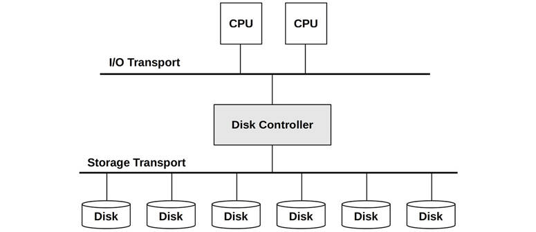

# Chapter 9

## Disks

Disk I/O can cause significant application latency, and is therefore an important target of systems performance analysis. Under high load, disks become a bottleneck, leaving CPUs idle as the system waits for disk I/O to complete. Identifying and eliminating these bottlenecks can improve performance and application throughput by orders of magnitude.

The term *disks* refers to the primary storage devices of the system. They include flash-memory-based solid-state disks (SSDs) and magnetic rotating disks. SSDs were introduced primarily to improve disk I/O performance, which they do. However, demands for capacity, I/O rates, and throughput are also increasing, and flash memory devices are not immune to performance issues.

The learning objectives of this chapter are:

- Understand disk models and concepts.
- Understand how disk access patterns affect performance.
- Understand the perils of interpreting disk utilization.
- Become familiar with disk device characteristics and internals.
- Become familiar with the kernel path from file systems to devices.
- Understand RAID levels and their performance.
- Follow different methodologies for disk performance analysis.
- Characterize system-wide and per-process disk I/O.
- Measure disk I/O latency distributions and identify outliers.
- Identify applications and code paths requesting disk I/O.
- Investigate disk I/O in detail using tracers.
- Become aware of disk tunable parameters.

This chapter consists of six parts, the first three providing the basis for disk I/O analysis and the last three showing its practical application to Linux-based systems. The parts are as follows:

- **Background** introduces storage-related terminology, basic models of disk devices, and key disk performance concepts.
- **Architecture** provides generic descriptions of storage hardware and software architecture.
- **Methodology** describes performance analysis methodology, both observational and experimental.
- **Observability Tools** shows disk performance observability tools for Linux-based systems, including tracing and visualizations.
- **Experimentation** summarizes disk benchmark tools.
- **Tuning** describes example disk tunable parameters.

The previous chapter covered the performance of file systems built upon disks, and is a better target of study for understanding application performance.

### 9.1 Terminology

Disk-related terminology used in this chapter includes:

- **Virtual disk**: An emulation of a storage device. It appears to the system as a single physical disk, but it may be constructed from multiple disks or a fraction of a disk.
- **Transport**: The physical bus used for communication, including data transfers (I/O) and other disk commands.
- [**Sector**](gloss.md): A block of storage on disk, traditionally 512 bytes in size, but today often 4 Kbytes.
- **I/O**: Strictly speaking, I/O includes only disk reads and writes, and would not include other disk commands. I/O can be described by, at least, the direction (read or write), a disk address (location), and a size (bytes).
- **Disk commands**: Disks may be commanded to perform other non-data-transfer commands (e.g., a cache flush).
- **Throughput**: With disks, throughput commonly refers to the current data transfer rate, measured in bytes per second.
- **Bandwidth**: This is the maximum possible data transfer rate for storage transports or controllers; it is limited by hardware.
- **I/O latency**: Time for an I/O operation from start to end. [Section 9.3.1](ch09.md), [Measuring Time](ch09.md), defines more precise time terminology. Be aware that networking uses the term *latency* to refer to the time needed to initiate an I/O, followed by data transfer time.
- **Latency outliers**: Disk I/O with unusually high latency.

Other terms are introduced throughout this chapter. The Glossary includes basic terminology for reference if needed, including *disk*, [*disk controller*](gloss.md), [*storage array*](gloss.md), [*local disks*](gloss.md), [*remote disks*](gloss.md), and *IOPS*. Also see the terminology sections in [Chapters 2](ch02.md) and [3](ch03.md).

### 9.2 Models

The following simple models illustrate some basic principles of disk I/O performance.

#### 9.2.1 Simple Disk

Modern disks include an on-disk queue for I/O requests, as depicted in [Figure 9.1](ch09.md).


Figure 9.1 Simple disk with queue

I/O accepted by the disk may be either waiting on the queue or being serviced. This simple model is similar to a grocery store checkout, where customers queue to be serviced. It is also well suited for analysis using queueing theory.

While this may imply a first-come, first-served queue, the on-disk controller can apply other algorithms to optimize performance. These algorithms could include elevator seeking for rotational disks (see the discussion in [Section 9.4.1](ch09.md), [Disk Types](ch09.md)), or separate queues for read and write I/O (especially for flash memory-based disks).

#### 9.2.2 Caching Disk

The addition of an on-disk cache allows some read requests to be satisfied from a faster memory type, as shown in [Figure 9.2](ch09.md). This may be implemented as a small amount of memory (DRAM) that is contained within the physical disk device.


Figure 9.2 Simple disk with on-disk cache

While cache hits return with very low (good) latency, cache misses are still frequent, returning with high disk-device latency.

The on-disk cache may also be used to improve *write* performance, by using it as a *write-back* cache. This signals writes as having completed after the data transfer to cache and before the slower transfer to persistent disk storage. The counter-term is the *write-through* cache, which completes writes only after the full transfer to the next level.

In practice, storage write-back caches are often coupled with batteries, so that buffered data can still be saved in the event of a power failure. Such batteries may be on the disk or disk controller.

#### 9.2.3 Controller

A simple type of disk controller is shown in [Figure 9.3](ch09.md), bridging the CPU I/O transport with the storage transport and attached disk devices. These are also called *host bus adapters* (HBAs).



Figure 9.3 Simple disk controller and connected transports

Performance may be limited by either of these buses, the disk controller, or the disks. See [Section 9.4](ch09.md), [Architecture](ch09.md), for more about disk controllers.

### 9.3 Concepts

The following are important concepts in disk performance.

#### 9.3.1 Measuring Time

I/O time can be measured as:

- **I/O request time (also called *I/O response time*)**: The entire time from issuing an I/O to its completion
- **I/O wait time**: The time spent waiting on a queue
- **I/O service time**: The time during which the I/O was processed (not waiting)

These are pictured in [Figure 9.4](ch09.md).


Figure 9.4 I/O time terminology (generic)

The term *service time* originates from when disks were simpler devices managed directly by the operating system, which therefore knew when the disk was actively servicing I/O. Disks now do their own internal queueing, and the operating system service time includes time spent waiting on kernel queues.

Where possible, I use clarifying terms to state what is being measured, from which start event to which end event. The start and end events can be kernel-based or disk-based, with kernel-based times measured from the block I/O interface for disk devices (pictured in [Figure 9.7](ch09.md)).

From the kernel:

- ***Block I/O wait time*** (also called ***OS wait time***) is the time spent from when a new I/O was created and inserted into a kernel I/O queue to when it left the final kernel queue and was issued to the disk device. This may span multiple kernel-level queues, including a block I/O layer queue and a disk device queue.
- ***Block I/O service time*** is the time from issuing the request to the device to its completion interrupt from the device.
- ***Block I/O request time*** is both block I/O wait time and block I/O service time: the full time from creating an I/O to its completion.

From the disk:

- ***Disk wait time*** is the time spent on an on-disk queue.
- ***Disk service time*** is the time after the on-disk queue needed for an I/O to be actively processed.
- ***Disk request time*** (also called ***disk response time*** and ***disk I/O latency***) is both the disk wait time and disk service time, and is equal to the block I/O service time.

These are pictured in [Figure 9.5](ch09.md), where DWT is disk wait time, and DST is disk service time. This diagram also shows an on-disk cache, and how disk cache hits can result in a much shorter disk service time (DST).


Figure 9.5 Kernel and disk time terminology

I/O latency is another commonly used term, introduced in [Chapter 1](ch01.md). As with other terms, what this means depends on where it is measured. I/O latency alone may refer to the block I/O request time: the entire I/O time. Applications and performance tools commonly use the term *disk I/O latency* to refer to the disk request time: the entire time on the device. If you were talking to a hardware engineer from the perspective of the device, they may use the term *disk I/O latency* to refer to the disk wait time.

Block I/O service time is generally treated as a measure of current disk performance (this is what older versions of iostat(1) show); however, you should be aware that this is a simplification. In [Figure 9.7](ch09.md), a generic I/O stack is pictured, which shows three possible driver layers beneath the block device interface. Any of these may implement its own queue, or may block on mutexes, adding latency to the I/O. This latency is included in the block I/O service time.

##### Calculating Time

Disk service time is typically not observable by kernel statistics directly, but an average disk service time can be inferred using IOPS and utilization:

disk service time = utilization/IOPS

For example, a utilization of 60% and an IOPS of 300 gives an average service time of 2 ms (600 ms/300 IOPS). This assumes that the utilization reflects a single device (or *service center*), which can process only one I/O at a time. Disks can typically process multiple I/O in parallel, making this calculation inaccurate.

Instead of using kernel statistics, event tracing can be used to provide an accurate disk service time by measuring high-resolution timestamps for the issue and completion for disk I/O. This can be done using tools described later in this chapter (e.g., biolatency(8) in [Section 9.6.6](ch09.md), [biolatency](ch09.md)).

#### 9.3.2 Time Scales

The time scale for disk I/O can vary by orders of magnitude, from tens of microseconds to thousands of milliseconds. At the slowest end of the scale, poor application response time can be caused by a single slow disk I/O; at the fastest end, disk I/O may become an issue only in great numbers (the sum of many fast I/O equaling a slow I/O).

For context, [Table 9.1](ch09.md) provides a general idea of the possible range of disk I/O latencies. For precise and current values, consult the disk vendor documentation, and perform your own micro-benchmarking. Also see [Chapter 2](ch02.md), [Methodologies](ch02.md), for time scales other than disk I/O.

To better illustrate the orders of magnitude involved, the Scaled column shows a comparison based on an imaginary on-disk cache hit latency of one second.

Table 9.1 **Example time scale of disk I/O latencies**

**Event**

**Latency**

**Scaled**

On-disk cache hit

&lt; 100 μs[1](ch09.md)

1 s

Flash memory read

~100 to 1,000 μs (small to large I/O)

1 to 10 s

Rotational disk sequential read

~1 ms

10 s

Rotational disk random read (7,200 rpm)

~8 ms

1.3 minutes

Rotational disk random read (slow, queueing)

&gt; 10 ms

1.7 minutes

Rotational disk random read (dozens in queue)

&gt; 100 ms

17 minutes

Worst-case virtual disk I/O (hardware controller, RAID-5, queueing, random I/O)

&gt; 1,000 ms

2.8 hours

[1](ch09.md)10 to 20 μs for Non-Volatile Memory express (NVMe) storage devices: these are typically flash memory attached via a PCIe bus card.

These latencies may be interpreted differently based on the environment requirements. While working in the enterprise storage industry, I considered any disk I/O taking over 10 ms to be unusually slow and a potential source of performance issues. In the cloud computing industry, there is greater tolerance for high latencies, especially in web-facing applications that already expect high latency between the network and client browser. In those environments, disk I/O may become an issue only beyond 50 ms (individually, or in total during an application request).

This table also illustrates that a disk can return two types of latency: one for on-disk cache hits (less than 100 μs) and one for misses (1–8 ms and higher, depending on the access pattern and device type). Since a disk will return a mixture of these, expressing them together as an *average* latency (as iostat(1) does) can be misleading, as this is really a distribution with two modes. See [Figure 2.23](ch02.md) in [Chapter 2](ch02.md), [Methodologies](ch02.md), for an example of disk I/O latency distribution as a histogram.

#### 9.3.3 Caching

The best disk I/O performance is none at all. Many layers of the software stack attempt to avoid disk I/O by caching reads and buffering writes, right down to the disk itself. The full list of these caches is in [Table 3.2](ch03.md) of [Chapter 3](ch03.md), [Operating Systems](ch03.md), which includes application-level and file system caches. At the disk device driver level and below, they may include the caches listed in [Table 9.2](ch09.md).

Table 9.2 **Disk I/O caches**

**Cache**

**Example**

Device cache

ZFS vdev

Block cache

Buffer cache

Disk controller cache

RAID card cache

Storage array cache

Array cache

On-disk cache

Disk data controller (DDC) attached DRAM

The block-based buffer cache was described in [Chapter 8](ch08.md), [File Systems](ch08.md). These disk I/O caches have been particularly important to improve the performance of random I/O workloads.

#### 9.3.4 Random vs. Sequential I/O

The disk I/O workload can be described using the terms *random* and *sequential*, based on the relative location of the I/O on disk (*disk offset*). These terms were discussed in [Chapter 8](ch08.md), [File Systems](ch08.md), with regard to file access patterns.

Sequential workloads are also known as *streaming workloads*. The term *streaming* is usually used at the application level, to describe streaming reads and writes “to disk” (file system).

Random versus sequential disk I/O patterns were important to study during the era of magnetic rotational disks. For these, random I/O incurs additional latency as the disk heads seek and the platter rotates between I/O. This is shown in [Figure 9.6](ch09.md), where both seek and rotation are necessary for the disk heads to move between sectors 1 and 2 (the actual path taken will be as direct as possible). Performance tuning involved identifying random I/O and trying to eliminate it in a number of ways, including caching, isolating random I/O to separate disks, and disk placement to reduce seek distance.


Figure 9.6 Rotational disk

Other disk types, including flash-based SSDs, usually perform no differently on random and sequential read patterns. Depending on the drive, there may be a small difference due to other factors, for example, an address lookup cache that can span sequential access but not random. Writes smaller than the block size may encounter a performance penalty due to a read-modify-write cycle, especially for random writes.

Note that the disk offsets as seen from the operating system may not match the offsets on the physical disk. For example, a hardware-provided virtual disk may map a contiguous range of offsets across multiple disks. Disks may remap offsets in their own way (via the disk data controller). Sometimes random I/O isn’t identified by inspecting the offsets but may be inferred by measuring increased disk service time.

#### 9.3.5 Read/Write Ratio

Apart from identifying random versus sequential workloads, another characteristic measure is the ratio of reads to writes, referring to either IOPS or throughput. This can be expressed as the ratio over time, as a percentage, for example, “The system has run at 80% reads since boot.”

Understanding this ratio helps when designing and configuring systems. A system with a high read rate may benefit most from adding cache. A system with a high write rate may benefit most from adding more disks to increase maximum available throughput and IOPS.

The reads and writes may themselves show different workload patterns: reads may be random I/O, while writes may be sequential (especially for copy-on-write file systems). They may also exhibit different I/O sizes.

#### 9.3.6 I/O Size

The average I/O size (bytes), or distribution of I/O sizes, is another workload characteristic. Larger I/O sizes typically provide higher throughput, although for longer per-I/O latency.

The I/O size may be altered by the disk device subsystem (for example, quantized to 512-byte sectors). The size may also have been inflated and deflated since the I/O was issued at the application level, by kernel components such as file systems, volume managers, and device drivers. See the Inflated and Deflated sections in [Chapter 8](ch08.md), [File Systems](ch08.md), [Section 8.3.12](ch08.md), [Logical vs. Physical I/O](ch08.md).

Some disk devices, especially flash-based, perform very differently with different read and write sizes. For example, a flash-based disk drive may perform optimally with 4 Kbyte reads and 1 Mbyte writes. Ideal I/O sizes may be documented by the disk vendor or identified using micro-benchmarking. The currently used I/O size may be found using observation tools (see [Section 9.6](ch09.md), [Observability Tools](ch09.md)).

#### 9.3.7 IOPS Are Not Equal

Because of those last three characteristics, IOPS are not created equal and cannot be directly compared between different devices and workloads. An IOPS value on its own doesn’t mean a lot.

For example, with rotational disks, a workload of 5,000 sequential IOPS may be much faster than one of 1,000 random IOPS. Flash-memory-based IOPS are also difficult to compare, since their I/O performance is often relative to I/O size and direction (read or write).

IOPS may not even matter that much to the application workload. A workload that consists of random requests is typically latency-sensitive, in which case a high IOPS rate is desirable. A streaming (sequential) workload is throughput-sensitive, which may make a lower IOPS rate of larger I/O more desirable.

To make sense of IOPS, include the other details: random or sequential, I/O size, read/write, buffered/direct, and number of I/O in parallel. Also consider using time-based metrics, such as utilization and service time, which reflect resulting performance and can be more easily compared.

#### 9.3.8 Non-Data-Transfer Disk Commands

Disks can be sent other commands besides I/O reads and writes. For example, disks with an on-disk cache (RAM) may be commanded to flush the cache to disk. Such a command is not a data transfer; the data was previously sent to the disk via writes.

Another example command is used to discard data: the ATA TRIM command, or SCSI UNMAP command. This tells the drive that a sector range is no longer needed, and can help SSD drives maintain write performance.

These disk commands can affect performance and can cause a disk to be utilized while other I/O wait.

#### 9.3.9 Utilization

Utilization can be calculated as the time a disk was busy actively performing work during an interval.

A disk at 0% utilization is “idle,” and a disk at 100% utilization is continually busy performing I/O (and other disk commands). Disks at 100% utilization are a likely source of performance issues, especially if they remain at 100% for some time. However, any rate of disk utilization can contribute to poor performance, as disk I/O is typically a slow activity.

There may also be a point between 0% and 100% (say, 60%) at which the disk’s performance is no longer satisfactory due to the increased likelihood of queueing, either on-disk queues or in the operating system. The exact utilization value that becomes a problem depends on the disk, workload, and latency requirements. See the M/D/1 and 60% Utilization section in [Chapter 2](ch02.md), [Methodologies](ch02.md), [Section 2.6.5](ch02.md), [Queueing Theory](ch02.md).

To confirm whether high utilization is causing application issues, study the disk response time and whether the application is blocking on this I/O. The application or operating system may be performing I/O asynchronously, such that slow I/O is not directly causing the application to wait.

Note that utilization is an interval summary. Disk I/O can occur in bursts, especially due to write flushing, which can be disguised when summarizing over longer intervals. See [Chapter 2](ch02.md), [Methodologies](ch02.md), [Section 2.3.11](ch02.md), [Utilization](ch02.md), for a further discussion about the utilization metric type.

##### Virtual Disk Utilization

For virtual disks supplied by hardware (e.g., a disk controller, or network-attached storage), the operating system may be aware of when the virtual disk was busy, but know nothing about the performance of the underlying disks upon which it is built. This leads to scenarios where virtual disk utilization, as reported by the operating system, is significantly different from what is happening on the actual disks (and is counterintuitive):

- A virtual disk that is 100% busy, and is built upon multiple physical disks, may be able to accept more work. In this case, 100% may mean that some disks were busy all the time, but not all the disks all the time, and therefore some disks were idle.
- Virtual disks that include a write-back cache may not appear very busy during write workloads, since the disk controller returns write completions immediately, even though the underlying disks are busy for some time afterward.
- Disks may be busy due to hardware RAID rebuild, with no corresponding I/O seen by the operating system.

For the same reasons, it can be difficult to interpret the utilization of virtual disks created by operating system software (software RAID). However, the operating system should be exposing utilization for the physical disks as well, which can be inspected.

Once a physical disk reaches 100% utilization and more I/O is requested, it becomes saturated.

#### 9.3.10 Saturation

Saturation is a measure of work queued beyond what the resource can deliver. For disk devices, it can be calculated as the average length of the device wait queue in the operating system (assuming it does queueing).

This provides a measure of performance beyond the 100% utilization point. A disk at 100% utilization may have no saturation (queueing), or it may have a lot, significantly affecting performance due to the queueing of I/O.

You might assume that disks at less than 100% utilization have no saturation, but this actually depends on the utilization interval: 50% disk utilization during an interval may mean 100% utilized for half that time and idle for the rest. Any interval summary can suffer from similar issues. When it is important to know exactly what occurred, tracing tools can be used to examine I/O events.

#### 9.3.11 I/O Wait

I/O wait is a per-CPU performance metric showing time spent idle, when there are threads on the CPU dispatcher queue (in sleep state) that are blocked on disk I/O. This divides CPU idle time into time spent with nothing to do, and time spent blocked on disk I/O. A high rate of I/O wait per CPU shows that the disks may be a bottleneck, leaving the CPU idle while it waits on them.

I/O wait can be a very confusing metric. If another CPU-hungry process comes along, the I/O wait value can drop: the CPUs now have something to do, instead of being idle. However, the same disk I/O is still present and blocking threads, despite the drop in the I/O wait metric. The reverse has sometimes happened when system administrators have upgraded application software and the newer version is more efficient and uses fewer CPU cycles, *revealing* I/O wait. This can make the system administrator think that the upgrade has caused a disk issue and made performance worse, when in fact disk performance is the same, but CPU performance is improved.

A more reliable metric is the time that application threads are blocked on disk I/O. This captures the pain endured by application threads caused by the disks, regardless of what other work the CPUs may be doing. This metric can be measured using static or dynamic instrumentation.

I/O wait is still a popular metric on Linux systems and, despite its confusing nature, it is used successfully to identify a type of disk bottleneck: disks busy, CPUs idle. One way to interpret it is to treat any wait I/O as a sign of a system bottleneck, and then tune the system to minimize it—even if the I/O is still occurring concurrently with CPU utilization. Concurrent I/O is more likely to be non-blocking I/O, and less likely to cause a direct issue. Non-concurrent I/O, as identified by I/O wait, is more likely to be application blocking I/O, and a bottleneck.

#### 9.3.12 Synchronous vs. Asynchronous

It can be important to understand that disk I/O latency may not directly affect application performance, if the application I/O and disk I/O operate asynchronously. This commonly occurs with write-back caching, where the application I/O completes early, and the disk I/O is issued later.

Applications may use read-ahead to perform asynchronous reads, which may not block the application while the disk completes the I/O. The file system may initiate this itself to warm the cache (prefetch).

Even if an application is synchronously waiting for I/O, that application code path may be noncritical and asynchronous to client application requests. It could be an application I/O worker thread, created to manage I/O while other threads continue to process work.

Kernels also typically support *asynchronous* or *non-blocking I/O*, where an API is provided for the application to request I/O and to be notified of its completion sometime later. For more on these topics, see [Chapter 8](ch08.md), [File Systems](ch08.md), [Sections 8.3.9](ch08.md), [Non-Blocking I/O](ch08.md); [8.3.5](ch08.md), [Read-Ahead](ch08.md); [8.3.4](ch08.md), [Prefetch](ch08.md); and [8.3.7](ch08.md), [Synchronous Writes](ch08.md).

#### 9.3.13 Disk vs. Application I/O

Disk I/O is the end result of various kernel components, including file systems and device drivers. There are many reasons why the rate and volume of this disk I/O may not match the I/O issued by the application. These include:

- File system inflation, deflation, and unrelated I/O. See [Chapter 8](ch08.md), [File Systems](ch08.md), [Section 8.3.12](ch08.md), [Logical vs. Physical I/O](ch08.md).
- Paging due to a system memory shortage. See [Chapter 7](ch07.md), [Memory](ch07.md), [Section 7.2.2](ch07.md), [Paging](ch07.md).
- Device driver I/O size: rounding up I/O size, or fragmenting I/O.
- RAID writing mirror or checksum blocks, or verifying read data.

This mismatch can be confusing when unexpected. It can be understood by learning the architecture and performing analysis.

### 9.4 Architecture

This section describes disk architecture, which is typically studied during capacity planning to determine the limits for different components and configuration choices. It should also be checked during the investigation of later performance issues, in case the problem originates from architectural choices rather than the current load and tuning.

#### 9.4.1 Disk Types

The two most commonly used disk types at present are magnetic rotational and flash-memory-based SSDs. Both of these provide permanent storage; unlike volatile memory, their stored content is still available after a power cycle.

##### 9.4.1.1 Magnetic Rotational

Also termed a *hard disk drive* (HDD), this type of disk consists of one or more discs, called *platters*, impregnated with iron oxide particles. A small region of these particles can be magnetized in one of two directions; this orientation is used to store a bit. The platters rotate, while a mechanical arm with circuitry to read and write data reaches across the surface. This circuitry includes the *disk heads*, and an arm may have more than one head, allowing it to read and write multiple bits simultaneously. Data is stored on the platter in circular tracks, and each track is divided into sectors.

Being mechanical devices, these perform relatively slowly, especially for random I/O. With advances in flash memory-based technology, SSDs are displacing rotational disks, and it is conceivable that one day rotational disks will be obsolete (along with other older storage technologies: drum disks and core memory). In the meantime, rotational disks are still competitive in some scenarios, such as economical high-density storage (low cost per megabyte), especially for data warehousing.[2](ch09.md)

[2](ch09.md)The Netflix Open Connect Appliances (OCAs) that host videos for streaming might sound like another use case for HDDs, but supporting large numbers of simultaneous customers per server can result in random I/O. Some OCAs have switched to flash drives [\[Netflix 20\]](ch09.md).

The following topics summarize factors in rotational disk performance.

###### Seek and Rotation

Slow I/O for magnetic rotational disks is usually caused by the seek time for the disk heads and the rotation time of the disk platter, both of which may take milliseconds. Best case is when the next requested I/O is located at the end of the currently servicing I/O, so that the disk heads don’t need to seek or wait for additional rotation. As described earlier, this is known as *sequential I/O*, while I/O that requires head seeking or waiting for rotation is called *random I/O*.

There are many strategies to reduce seek and rotation wait time, including:

- Caching: eliminating I/O entirely.
- File system placement and behavior, including copy-on-write (which makes writes sequential, but may make later reads random).
- Separating different workloads to different disks, to avoid seeking between workload I/O.
- Moving different workloads to different systems (some cloud computing environments can do this to reduce multitenancy effects).
- Elevator seeking, performed by the disk itself.
- Higher-density disks, to tighten the workload location.
- Partition (or “slice”) configuration, for example, short-stroking.

An additional strategy to reduce rotation wait time is to use faster disks. Disks are available in different rotational speeds, including 5400, 7200, 10 K, and 15 K revolutions per minute (rpm). Note that higher speeds can result in lower disk life-spans, due to increased heat and wear.

###### Theoretical Maximum Throughput

If the maximum sectors per track of a disk is known, disk throughput can be calculated using the following formula:

max throughput = max sectors per track × sector size × rpm/60 s

This formula was more useful for older disks that exposed this information accurately. Modern disks provide a virtual image of the disk to the operating system, and expose only synthetic values for these attributes.

###### Short-Stroking

Short-stroking is where only the outer tracks of the disk are used for the workload; the remainder are either unused, or used for low-throughput workloads (e.g., archives). This reduces seek time as head movement is bounded by a smaller range, and the disk may put the heads at rest at the outside edge, reducing the first seek after idle. The outer tracks also usually have better throughput due to sector zoning (see the next section). Keep an eye out for short-stroking when examining published disk benchmarks, especially benchmarks that don’t include price, where many short-stroked disks may have been used.

###### Sector Zoning

The length of disk tracks varies, with the shortest at the center of the disk and the longest at the outside edge. Instead of the number of sectors (and bits) per track being fixed, sector zoning (also called *multiple-zone recording*) increases the sector count for the longer tracks, since more sectors can be physically written. Because the rotation speed is constant, the longer outside-edge tracks deliver higher throughput (megabytes per second) than the inner tracks.

###### Sector Size

The storage industry has developed a new standard for disk devices, called Advanced Format, to support larger sector sizes, particularly 4 Kbytes. This reduces I/O computational overhead, improving throughput as well as reducing overheads for the disk’s per-sector stored metadata. Sectors of 512 bytes can still be provided by disk firmware via an emulation standard called Advanced Format 512e. Depending on the disk, this may increase write overheads, invoking a read-modify-write cycle to map 512 bytes to a 4 Kbyte sector. Other performance issues to be aware of include misaligned 4 Kbyte I/O, which span two sectors, inflating sector I/O to service them.

###### On-Disk Cache

A common component of these disks is a small amount of memory (RAM) used to cache the result of reads and to-buffer writes. This memory also allows I/O (commands) to be queued on the device and reordered more efficiently. With SCSI, this is Tagged Command Queueing (TCQ); with SATA, it is called Native Command Queueing (NCQ).

###### Elevator Seeking

The *elevator algorithm* (also known as *elevator seeking*) is one way that a command queue can improve efficiency. It reorders I/O based on their on-disk location, to minimize travel of the disk heads. The result is similar to a building elevator, which does not service floors based on the order in which the floor buttons were pushed, but makes sweeps up and down the building, stopping at the currently requested floors.

This behavior becomes apparent when inspecting disk I/O traces and finding that sorting I/O by completion time doesn’t match sorting by start time: I/O are completing out of order.

While this seems like an obvious performance win, contemplate the following scenario: A disk has been sent a batch of I/O near offset 1,000, and a single I/O at offset 2,000. The disk heads are currently at 1,000. When will the I/O at offset 2,000 be serviced? Now consider that, while servicing the I/O near 1,000, more arrive near 1,000, and more, and more—enough continual I/O to keep the disk busy near offset 1,000 for 10 seconds. When will the 2,000 offset I/O be serviced, and what is its final I/O latency?

###### Data Integrity

Disks store an error-correcting code (ECC) at the end of each sector for data integrity, so that the drive can verify data was read correctly, or correct any errors that may have occurred. If the sector was not read correctly, the disk heads may retry the read on the next rotation (and may retry several times, varying the location of the head slightly each time). This may be the explanation for unusually slow I/O. The drive may provide soft errors to the OS to explain what happened. It can be beneficial to monitor the rate of soft errors, as an increase can indicate that a drive may soon fail.

One benefit of the industry switch from 512 byte to 4 Kbyte sectors is that fewer ECC bits are required for the same volume of data, as ECC is more efficient for the larger sector size [\[Smith 09\]](ch09.md).

Note that other checksums may also be in use to verify data. For example, a cyclic redundancy check (CRC) may be used to verify data transfers to the host, and other checksums may be in use by file systems.

###### Vibration

While disk device vendors were well aware of vibration issues, those issues weren’t commonly known or taken seriously by the industry. In 2008, while investigating a mysterious performance issue, I conducted a vibration-inducing experiment by *shouting* at a disk array while it performed a write benchmark, which caused a burst of very slow I/O. My experiment was immediately videoed and put on YouTube, where it went viral, and it has been described as the first demonstration of the impact of vibration on disk performance [\[Turner 10\]](ch09.md). The video has had over 1,700,000 views, promoting awareness of disk vibration issues [\[Gregg 08\]](ch09.md). Based on emails I’ve received, I also seem to have accidentally spawned an industry in soundproofing data centers: you can now hire professionals who will analyze data center sound levels and improve disk performance by damping vibrations.

###### Sloth Disks

A current performance issue with some rotational disks is the discovery of what has been called *sloth disks*. These disks sometimes return very slow I/O, over one second, without any reported errors. This is much longer than ECC-based retries should take. It might actually be better if such disks returned a failure instead of taking so long, so that the operating system or disk controllers could take corrective action, such as offlining the disk in redundant environments and reporting the failure. Sloth disks are a nuisance, especially when they are part of a virtual disk presented by a storage array where the operating system has no direct visibility, making them harder to identify.[3](ch09.md)

[3](ch09.md)If the Linux Distributed Replicated Block Device (DRBD) system is in use, it does provide a “disk-timeout” parameter.

###### SMR

Shingled Magnetic Recording (SMR) drives provide higher density by using narrower tracks. These tracks are too narrow for the write head to record, but not for the (smaller) read head to read, so it writes them by partially overlapping other tracks, in a style similar to roof shingles (hence its name). Drives using SMR increase in density by around 25%, at the cost of degraded write performance, as the overlapped data is destroyed and must also be re-written. These drives are suitable for archival workloads that are written once then mostly read, but are not suited for write-heavy workloads in RAID configurations [\[Mellor 20\]](ch09.md).

###### Disk Data Controller

Mechanical disks present a simple interface to the system, implying a fixed sectors-per-track ratio and a contiguous range of addressable offsets. What actually happens on the disk is up to the disk data controller—a disk internal microprocessor, programmed by firmware. Disks may implement algorithms including sector zoning, affecting how the offsets are laid out. This is something to be aware of, but it’s difficult to analyze—the operating system cannot see into the disk data controller.

##### 9.4.1.2 Solid-State Drives

These are also called solid-state disks (SSDs). The term solid-state refers to their use of solid-state electronics, which provides programmable nonvolatile memory with typically much better performance than rotational disks. Without moving parts, these disks are also physically durable and not susceptible to performance issues caused by vibration.

The performance of this disk type is usually consistent across different offsets (no rotational or seek latency) and predictable for given I/O sizes. The random or sequential characteristic of workloads matters much less than with rotational disks. All of this makes them easier to study and do capacity planning for. However, if they do encounter performance pathologies, understanding them can be just as complex as with rotational disks, due to how they operate internally.

Some SSDs use nonvolatile DRAM (NV-DRAM). Most use flash memory.

###### Flash Memory

Flash-memory-based SSDs offer high read performance, particularly random read performance that can beat rotational disks by orders of magnitude. Most are built using NAND flash memory, which uses electron-based trapped-charge storage media that can store electrons persistently[4](ch09.md) in a no-power state \[Cornwell 12]. The name “flash” relates to how data is written, which requires erasing an entire block of memory at a time (including multiple pages, usually 8 or 64 KBytes per page) and rewriting the contents. Because of these write overheads, flash memory has asymmetrical read/write performance: fast reads and slower writes. Drives typically mitigate this using write-back caches to improve write performance, and a small capacitor as a battery backup in case of a power failure.

[4](ch09.md)But not indefinitely. Data retention errors for modern MLC may occur in a matter of mere months when powered off [\[Cassidy 12\]](ch09.md)[\[Cai 15\]](ch09.md).

Flash memory comes in different types:

- **Single-level cell (SLC)**: Stores data bits in individual cells.
- **Multi-level cell (MLC)**: Stores multiple bits per cell (usually two, which requires four voltage levels).
- **Enterprise multi-level cell (eMLC)**: MLC with advanced firmware intended for enterprise use.
- **Tri-level cell (TLC)**: Stores three bits (eight voltage levels).
- **Quad-level cell (QLC)**: Stores four bits.
- **3D NAND / Vertical NAND (V-NAND)**: This stacks layers of flash memory (e.g., TLC) to increase the density and storage capacity.

This list is in rough chronological order, with the newest technologies listed last: 3D NAND has been commercially available since 2013.

SLC tends to have higher performance and reliability compared to other types and was preferred for enterprise use, although with higher costs. MLC is now often used in the enterprise for its higher density, in spite of its lower reliability. Flash reliability is often measured as the number of block writes (program/erase cycles) a drive is expected to support. For SLC, this expectation is around 50,000 to 100,000 cycles; for MLC around 5,000 to 10,000 cycles; for TLC around 3,000 cycles; and for QLC around 1,000 cycles [\[Liu 20\]](ch09.md).

###### Controller

The controller for an SSD has the following task [\[Leventhal 13\]](ch09.md):

- **Input**: Reads and writes occur per page (usually 8 Kbytes); writes can occur only to erased pages; pages are erased in blocks of 32 to 64 (256–512 Kbytes).
- **Output**: Emulates a hard drive block interface: reads or writes of arbitrary sectors (512 bytes or 4 Kbytes).

Translating between input and output is performed by the controller’s flash translation layer (FTL), which must also track free blocks. It essentially uses its own file system to do this, such as a log-structured file system.

The write characteristics can be a problem for write workloads, especially when writing I/O sizes that are smaller than the flash memory block size (which may be as large as 512 Kbytes). This can cause *write amplification*, where the remainder of the block is copied elsewhere before erasure, and also latency for at least the erase-write cycle. Some flash memory drives mitigate the latency issue by providing an on-disk buffer (RAM-based) backed by a battery, so that writes can be buffered and written later, even in the event of a power failure.

The most common enterprise-grade flash memory drive I’ve used performs optimally with 4 Kbyte reads and 1 Mbyte writes, due to the flash memory layout. These values vary for different drives and may be found via micro-benchmarking of I/O sizes.

Given the disparity between the native operations of flash and the exposed block interface, there has been room for improvement by the operating system and its file systems. The TRIM command is an example: it informs the SSD that a region is no longer in use, allowing the SSD to more easily assemble its pool of free blocks, reducing write amplification. (For SCSI, this can be implemented using the UNMAP or WRITE SAME commands; for ATA, the DATA SET MANAGEMENT command. Linux support includes the discard mount option, and the fstrim(8) command.)

###### Lifespan

There are various problems with NAND flash as a storage medium, including burnout, data fade, and read disturbance [\[Cornwell 12\]](ch09.md). These can be solved by the SSD controller, which can move data to avoid problems. It will typically employ *wear leveling*, which spreads writes across different blocks to reduce the write cycles on individual blocks, and *memory overprovisioning*, which reserves extra memory that can be mapped into service when needed.

While these techniques improve lifespan, the SSD still has a limited number of write cycles per block, depending on the type of flash memory and the mitigation features employed by the drive. Enterprise-grade drives use memory overprovisioning and the most reliable type of flash memory, SLC, to achieve write cycle rates of 1 million and higher. Consumer-grade drives based on MLC may offer as few as 1,000 cycles.

###### Pathologies

Here are some flash memory SSD pathologies to be aware of:

- Latency outliers due to aging, and the SSD trying harder to extract correct data (which is checked using ECC).
- Higher latency due to fragmentation (reformatting may fix this by cleaning up the FTL block maps).
- Lower throughput performance if the SSD implements internal compression.

Check for other developments with SSD performance features and issues encountered.

##### 9.4.1.3 Persistent Memory

Persistent memory, in the form of battery-backed[5](ch09.md) DRAM, is used for storage controller write-back caches. The performance of this type is orders of magnitude faster than flash, but its cost and limited battery life span have limited it to only specialized uses.

[5](ch09.md)A battery or a super capacitor.

A new type of persistent memory called 3D XPoint, developed by Intel and Micron, will allow persistent memory to be used for many more applications at a compelling price/performance, in between DRAM and flash memory. 3D XPoint works by storing bits in a stackable cross-gridded data access array, and is byte-addressable. An Intel performance comparison reported 14 microsecond access latency for 3D XPoint compared to 200 microseconds for 3D NAND SSD [\[Hady 18\]](ch09.md). 3D XPoint also showed consistent latency for their test, whereas 3D NAND had a wider latency distribution reaching up to 3 milliseconds.

3D XPoint has been commercially available since 2017. Intel uses the brand name Optane, and releases it as Intel Optane persistent memory in a DIMM package, and as Intel Optane SSDs.

#### 9.4.2 Interfaces

The interface is the protocol supported by the drive for communication with the system, usually via a disk controller. A brief summary of the SCSI, SAS, SATA, FC, and NVMe interfaces follows. You will need to check what the current interfaces and supported bandwidths are, as they change over time when new specifications are developed and adopted.

##### SCSI

The Small Computer System Interface was originally a parallel transport bus, using multiple electrical connectors to transport bits in parallel. The first version, SCSI-1 in 1986, had a data bus width of 8 bits, allowing one byte to be transferred per clock, and delivered a bandwidth of 5 Mbytes/s. This was connected using a 50-pin Centronics C50. Later parallel SCSI versions used wider data buses and more pins for the connectors, up to 80 pins, and bandwidths in the hundreds of megabytes.

Because parallel SCSI is a shared bus, it can suffer performance issues due to bus contention, for example when a scheduled system backup saturates the bus with low-priority I/O. Workarounds included putting low-priority devices on their own SCSI bus or controller.

Clocking of parallel buses also becomes a problem at higher speeds which, along with the other issues (including limited devices and the need for SCSI terminator packs), has led to a switch to the serial version: SAS.

##### SAS

The Serial Attached SCSI interface is designed as a high-speed point-to-point transport, avoiding the bus contention issues of parallel SCSI. The initial SAS-1 specification was 3 Gbits/s (released in 2003), followed by SAS-2 supporting 6 Gbits/s (2009), SAS-3 supporting 12 Gbits/s (2012), and SAS-4 supporting 22.5 Gbit/s (2017). Link aggregations are supported, so that multiple ports can combine to deliver higher bandwidths. The actual data transfer rate is 80% of bandwidth, due to 8b/10b encoding.

Other SAS features include dual porting of drives for use with redundant connectors and architectures, I/O multipathing, SAS domains, hot swapping, and compatibility support for SATA devices. These features have made SAS popular for enterprise use, especially with redundant architectures.

##### SATA

For similar reasons as for SCSI and SAS, the parallel ATA (aka IDE) interface standard has evolved to become the Serial ATA interface. Created in 2003, SATA 1.0 supported 1.5 Gbits/s; later major versions are SATA 2.0 supporting 3.0 Gbits/s (2004), and SATA 3.0 supporting 6.0 Gbits/s (2008). Additional features have been added in major and minor releases, including native command queueing support. SATA uses 8b/10b encoding, so the data transfer rate is 80% of bandwidth. SATA has been in common use for consumer desktops and laptops.

##### FC

Fibre Channel (FC) is a high-speed interface standard for data transfer, originally intended only for fibre optic cable (hence its name) and later supporting copper as well. FC is commonly used in enterprise environments to create storage area networks (SANs) where multiple storage devices can be connected to multiple servers via a Fibre Channel Fabric. This offers greater scalability and accessibility than other interfaces, and is similar to connecting multiple hosts via a network. And, like networking, FC can involve using *switches* to connect together multiple local endpoints (server and storage). Development of a Fibre Channel standard began in 1988 with the first version approved by ANSI in 1994 \[FICA 20]. There have since been many variants and speed improvements, with the recent Gen 7 256GFC standard reaching up to 51,200 MB/s full duplex [\[FICA 18\]](ch09.md).

##### NVMe

Non-Volatile Memory express (NVMe) is a PCIe bus specification for storage devices. Rather than connecting storage devices to a storage controller card, an NVMe device is itself a card that connects directly to the PCIe bus. Created in 2011, the first NVMe specification was 1.0e (released in 2013), and the latest is 1.4 (2019) [\[NVMe 20\]](ch09.md). Newer specifications add various features, for example, thermal management features and commands for self-testing, verifying data, and sanitizing data (making recovery impossible). The bandwidth of NVMe cards is bounded by the PCIe bus; PCIe version 4.0, commonly used today, has a single-direction bandwidth of 31.5 Gbytes/s for a x16 card (link width).

An advantage with NVMe over traditional SAS and SATA is its support for multiple hardware queues. These queues can be used from the same CPU to promote cache warmth (and with Linux multi-queue support, shared kernel locks are also avoided). These queues also allow much greater buffering, supporting up to 64 thousand commands in each queue, whereas typical SAS and SATA are limited to 256 and 32 commands respectively.

NVMe also supports SR-IOV for improving virtual machine storage performance (see [Chapter 11](ch11.md), [Cloud Computing](ch11.md), [Section 11.2](ch11.md), [Hardware Virtualization](ch11.md)).

NVMe is used for low-latency flash devices, with an expected I/O latency of less than 20 microseconds.

#### 9.4.3 Storage Types

Storage can be provided to a server in a number of ways; the following sections describe four general architectures: disk devices, RAID, storage arrays, and network-attached storage (NAS).

##### Disk Devices

The simplest architecture is a server with internal disks, individually controlled by the operating system. The disks connect to a disk controller, which is circuitry on the main board or an expander card, and which allows the disk devices to be seen and accessed. In this architecture the disk controller merely acts as a conduit so that the system can communicate with the disks. A typical personal computer or laptop has a disk attached in this way for primary storage.

This architecture is the easiest to analyze using performance tools, as each disk is known to the operating system and can be observed separately.

Some disk controllers support this architecture, where it is called *just a bunch of disks* (JBOD).

##### RAID

Advanced disk controllers can provide the redundant array of independent disks (RAID) architecture for disk devices (originally the redundant array of *inexpensive* disks [\[Patterson 88\]](ch09.md)). RAID can present multiple disks as a single big, fast, and reliable virtual disk. These controllers often include an on-board cache (RAM) to improve read and write performance.

Providing RAID by a disk controller card is called *hardware* RAID. RAID can also be implemented by operating system software, but hardware RAID has been preferred as CPU-expensive checksum and parity calculations can be performed more quickly on dedicated hardware, plus such hardware can include a battery backup unit (BBU) for improved resiliency. However, advances in processors have produced CPUs with a surplus of cycles and cores, reducing the need to offload parity calculations. A number of storage solutions have moved back to software RAID (for example, using ZFS), which reduces complexity and hardware cost and improves observability from the operating system. In the case of a major failure, software RAID may also be easier to repair than hardware RAID (imagine a dead RAID card).

The following sections describe the performance characteristics of RAID. The term *stripe* is often used: this refers to when data is grouped as blocks that are written across multiple drives (like drawing a stripe through them all).

###### Types

Various RAID types are available to meet varying needs for capacity, performance, and reliability. This summary focuses on the performance characteristics shown in [Table 9.3](ch09.md).

Table 9.3 **RAID types**

**Level**

**Description**

**Performance**

0 (concat.)

Drives are filled one at a time.

Eventually improves random read performance when multiple drives can take part.

0 (stripe)

Drives are used in parallel, splitting (striping) I/O across multiple drives.

Expected best random and sequential I/O performance (depends on stripe size and workload pattern).

1 (mirror)

Multiple drives (usually two) are grouped, storing identical content for redundancy.

Good random and sequential read performance (can read from all drives simultaneously, depending on implementation). Writes limited by slowest disk in mirror, and throughput overheads doubled (two drives).

10

A combination of RAID-0 stripes across groups of RAID-1 drives, providing capacity and redundancy.

Similar performance characteristics to RAID-1 but allows more groups of drives to take part, like RAID-0, increasing bandwidth.

5

Data is stored as stripes across multiple disks, along with extra parity information for redundancy.

Poor write performance due to read-modify-write cycle and parity calculations.

6

RAID-5 with two parity disks per stripe.

Similar to RAID-5 but worse.

While RAID-0 striping performs the best, it has no redundancy, making it impractical for most production use. Possible exceptions include fault-tolerant cloud computing environments that does not store critical data and where a failed instance will automatically be replaced, and storage servers used for caching only.

###### Observability

As described in the earlier section on virtual disk utilization, the use of hardware-supplied virtual disk devices can make observability more difficult in the operating system, which does not know what the physical disks are doing. If RAID is supplied via software, individual disk devices can usually be observed, as the operating system manages them directly.

###### Read-Modify-Write

When data is stored as a stripe including a parity, as with RAID-5, write I/O can incur additional read I/O and compute time. This is because writes that are smaller than the stripe size may require the entire stripe to be read, the bytes modified, the parity recalculated, and then the stripe rewritten. An optimization for RAID-5 may be in use to avoid this: instead of reading the entire stripe, only the portions of the stripe (strips) are read that include the modified data, along with the parity. By a sequence of XOR operations, an updated parity can be calculated and written along with the modified strips.

Writes that span the entire stripe can write over the previous contents, without needing to read them first. Performance in this environment may be improved by balancing the size of the stripe with the average I/O size of the writes, to reduce the additional read overhead.

###### Caches

Disk controllers that implement RAID-5 can mitigate read-write-modify performance by use of a write-back cache. These caches must be battery-backed, so that in the event of a power failure they can still complete buffered writes.

###### Additional Features

Be aware that advanced disk controller cards can provide advanced features that can affect performance. It is a good idea to browse the vendor documentation so that you’re at least aware of what may be in play. For example, here are a couple of features from Dell PERC 5 cards [\[Dell 20\]](ch09.md):

- **Patrol read**: Every several days, all disk blocks are read and their checksums verified. If the disks are busy servicing requests, the resources given to the patrol read function are reduced, to avoid competing with the system workload.
- **Cache flush interval**: The time in seconds between flushing dirty data in the cache to disk. Longer times may reduce disk I/O due to write cancellation and better aggregate writes; however, they may also cause higher read latency during the larger flushes.

Both of these can have a significant effect on performance.

##### Storage Arrays

Storage arrays allow many disks to be connected to the system. They use advanced disk controllers so that RAID can be configured, and they usually provide a large cache (gigabytes) to improve read and write performance. These caches are also typically battery-backed, allowing them to operate in write-back mode. A common policy is to switch to write-through mode if the battery fails, which may be noticed as a sudden drop in write performance due to waiting for the read-modify-write cycle.

An additional performance consideration is how the storage array is attached to the system—usually via an external storage controller card. The card, and the transport between it and the storage array, will both have limits for IOPS and throughput. For improvements in both performance and reliability, storage arrays are often dual-attachable, meaning they can be connected using two physical cables, to one or two different storage controller cards.

##### Network-Attached Storage

NAS is provided to the system over the existing network via a network protocol, such as NFS, SMB/CIFS, or iSCSI, usually from dedicated systems known as NAS appliances. These are separate systems and should be analyzed as such. Some performance analysis may be done on the client, to inspect the workload applied and I/O latencies. The performance of the network also becomes a factor, and issues can arise from network congestion and from multiple-hop latency.

#### 9.4.4 Operating System Disk I/O Stack

The components and layers in a disk I/O stack will depend on the operating system, version, and software and hardware technologies used. [Figure 9.7](ch09.md) depicts a general model. See [Chapter 3](ch03.md), [Operating Systems](ch03.md), for a similar model including the application.


Figure 9.7 Generic disk I/O stack

##### Block Device Interface

The block device interface was created in early Unix for accessing storage devices in units of blocks of 512 bytes, and to provide a buffer cache to improve performance. The interface exists in Linux, although the role of the buffer cache has diminished as other file system caches have been introduced, as described in [Chapter 8](ch08.md), [File Systems](ch08.md).

Unix provided a path to bypass the buffer cache, called *raw block device I/O* (or just *raw I/O*), which could be used via character special device files (see [Chapter 3](ch03.md), [Operating Systems](ch03.md)). These files are no longer commonly available by default in Linux. Raw block device I/O is different from, but in some ways similar to, the “direct I/O” file system feature described in [Chapter 8](ch08.md), [File Systems](ch08.md).

The block I/O interface can usually be observed from operating system performance tools (iostat(1)). It is also a common location for static instrumentation and more recently can be explored with dynamic instrumentation as well. Linux has enhanced this area of the kernel with additional features.

##### Linux

The main components of the Linux block I/O stack are shown in [Figure 9.8](ch09.md).


Figure 9.8 Linux I/O stack

Linux has enhanced block I/O with the addition of I/O merging and I/O schedulers for improving performance, volume managers for grouping multiple devices, and a device mapper for creating virtual devices.

###### I/O merging

When I/O requests are created, Linux can merge and coalesce them as shown in [Figure 9.9](ch09.md).


Figure 9.9 I/O merging types

This groups I/O, reducing the per-I/O CPU overheads in the kernel storage stack and overheads on the disk, improving throughput. Statistics for these front and back merges are available in iostat(1).

After merging, I/O is then scheduled for delivery to the disks.

###### I/O Schedulers

I/O is queued and scheduled in the block layer either by classic schedulers (only present in Linux versions older than 5.0) or by the newer multi-queue schedulers. These schedulers allow I/O to be reordered (or rescheduled) for optimized delivery. This can improve and more fairly balance performance, especially for devices with high I/O latencies (rotational disks).

**Classic schedulers** include:

- **Noop**: This doesn’t perform scheduling (noop is CPU-talk for no-operation) and can be used when the overhead of scheduling is deemed unnecessary (for example, in a RAM disk).
- **Deadline**: Attempts to enforce a latency deadline; for example, read and write expiry times in units of milliseconds may be selected. This can be useful for real-time systems, where determinism is desired. It can also solve problems of *starvation*: where an I/O request is starved of disk resources as newly issued I/O jump the queue, resulting in a latency outlier. Starvation can occur due to *writes starving reads*, and as a consequence of elevator seeking and heavy I/O to one area of disk starving I/O to another. The deadline scheduler solves this, in part, by using three separate queues for I/O: read FIFO, write FIFO, and sorted [\[Love 10\]](ch09.md).
- **CFQ**: The completely fair queueing scheduler allocates I/O time slices to processes, similar to CPU scheduling, for fair usage of disk resources. It also allows priorities and classes to be set for user processes, via the ionice(1) command.

A problem with the classic schedulers was their use of a single request queue, protected by a single lock, which became a performance bottleneck at high I/O rates. The multi-queue driver (blk-mq, added in Linux 3.13) solves this by using separate submission queues for each CPU, and multiple dispatch queues for the devices. This delivers better performance and lower latency for I/O versus classic schedulers, as requests can be processed in parallel and on the same CPU where the I/O was initiated. This was necessary to support flash memory-based and other device types capable of handling millions of IOPS [\[Corbet 13b\]](ch09.md).

**Multi-queue schedulers** include:

- **None**: No queueing.
- **BFQ**: The budget fair queueing scheduler, similar to CFQ, but allocates bandwidth as well as I/O time. It creates a queue for each process performing disk I/O, and maintains a budget for each queue measured in sectors. There is also a system-wide budget timeout to prevent one process from holding a device for too long. BFQ supports cgroups.
- **mq-deadline**: A blk-mq version of deadline (described earlier).
- **Kyber**: A scheduler that adjusts read and write dispatch queue lengths based on performance so that target read or write latencies can be met. It is a simple scheduler that only has two tunables: the target read latency (read\_lat\_nsec) and target synchronous write latency (write\_lat\_nsec). Kyber has shown improved storage I/O latencies in the Netflix cloud, where it is used by default.

Since Linux 5.0, the multi-queue schedulers are the default (the classic schedulers are no longer included).

I/O schedulers are documented in detail in the Linux source under Documentation/block.

After I/O scheduling, the request is placed on the block device queue for issuing to the device.

### 9.5 Methodology

This section describes various methodologies and exercises for disk I/O analysis and tuning. The topics are summarized in [Table 9.4](ch09.md).

Table 9.4 **Disk performance methodologies**

**Section**

**Methodology**

**Types**

[9.5.1](ch09.md)

Tools method

Observational analysis

[9.5.2](ch09.md)

USE method

Observational analysis

[9.5.3](ch09.md)

Performance monitoring

Observational analysis, capacity planning

[9.5.4](ch09.md)

Workload characterization

Observational analysis, capacity planning

[9.5.5](ch09.md)

Latency analysis

Observational analysis

[9.5.6](ch09.md)

Static performance tuning

Observational analysis, capacity planning

[9.5.7](ch09.md)

Cache tuning

Observational analysis, tuning

[9.5.8](ch09.md)

Resource controls

Tuning

[9.5.9](ch09.md)

Micro-benchmarking

Experimentation analysis

[9.5.10](ch09.md)

Scaling

Capacity planning, tuning

See [Chapter 2](ch02.md), [Methodologies](ch02.md), for more methodologies and the introduction to many of these.

These methods may be followed individually or used in combination. When investigating disk issues, my suggestion is to use the following strategies, in this order: the USE method, performance monitoring, workload characterization, latency analysis, micro-benchmarking, static analysis, and event tracing.

[Section 9.6](ch09.md), [Observability Tools](ch09.md), shows operating system tools for applying these methods.

#### 9.5.1 Tools Method

The tools method is a process of iterating over available tools, examining key metrics they provide. While a simple methodology, it can overlook issues for which the tools provide poor or no visibility, and it can be time-consuming to perform.

For disks, the tools method can involve checking the following (for Linux):

- **`iostat`** : Using extended mode to look for busy disks (over 60% utilization), high average service times (over, say, 10 ms), and high IOPS (depends)
- **`iotop/biotop`** : To identify which process is causing disk I/O
- **`biolatency`** : To examine the distribution of I/O latency as a histogram, looking for multi-modal distributions and latency outliers (over, say, 100 ms)
- **`biosnoop`** : To examine individual I/O
- **perf(1)/BCC/bpftrace**: For custom analysis including viewing user and kernel stacks that issued I/O
- **Disk-controller-specific tools** (from the vendor)

If an issue is found, examine all fields from the available tools to learn more context. See [Section 9.6](ch09.md), [Observability Tools](ch09.md), for more about each tool. Other methodologies can also be used, which can identify more types of issues.

#### 9.5.2 USE Method

The USE method is for identifying bottlenecks and errors across all components, early in a performance investigation. The sections that follow describe how the USE method can be applied to disk devices and controllers, while [Section 9.6](ch09.md), [Observability Tools](ch09.md), shows tools for measuring specific metrics.

##### Disk Devices

For each disk device, check for:

- **Utilization**: The time the device was busy
- **Saturation**: The degree to which I/O is waiting in a queue
- **Errors**: Device errors

Errors may be checked first. They sometimes get overlooked because the system functions correctly—albeit more slowly—in spite of disk failures: disks are commonly configured in a redundant pool of disks designed to tolerate some failure. Apart from standard disk error counters from the operating system, disk devices may support a wider variety of error counters that can be retrieved by special tools (for example, SMART data[6](ch09.md)).

[6](ch09.md)On Linux, see tools such as MegaCLI and smartctl (covered later), cciss-vol-status, cpqarrayd, varmon, and dpt-i2o-raidutils.

If the disk devices are physical disks, utilization should be straightforward to find. If they are virtual disks, utilization may not reflect what the underlying physical disks are doing. See [Section 9.3.9](ch09.md), [Utilization](ch09.md), for more discussion on this.

##### Disk Controllers

For each disk controller, check for:

- **Utilization**: Current versus maximum throughput, and the same for operation rate
- **Saturation**: The degree to which I/O is waiting due to controller saturation
- **Errors**: Controller errors

Here the utilization metric is not defined in terms of time, but rather in terms of the limitations of the disk controller card: throughput (bytes per second) and operation rate (operations per second). Operations are inclusive of read/write and other disk commands. Either throughput or operation rate may also be limited by the transport connecting the disk controller to the system, just as it may also be limited by the transport from the controller to the individual disks. Each transport should be checked the same way: errors, utilization, saturation.

You may find that the observability tools (e.g., Linux iostat(1)) do not present per-controller metrics but provide them only per disk. There are workarounds for this: if the system has only one controller, you can determine the controller IOPS and throughput by summing those metrics for all disks. If the system has multiple controllers, you will need to determine which disks belong to which, and sum the metrics accordingly.

Performance of disk controllers and transports is often overlooked. Fortunately, they are not common sources of system bottlenecks, as their capacity typically exceeds that of the attached disks. If total disk throughput or IOPS always levels off at a certain rate, even under different workloads, this may be a clue that the disk controllers or transports are in fact causing the problems.

#### 9.5.3 Performance Monitoring

Performance monitoring can identify active issues and patterns of behavior over time. Key metrics for disk I/O are:

- Disk utilization
- Response time

Disk utilization at 100% for multiple seconds is very likely an issue. Depending on your environment, over 60% may also cause poor performance due to increased queueing. The value for “normal” or “bad” depends on your workload, environment, and latency requirements. If you aren’t sure, micro-benchmarks of known-to-be-good versus bad workloads may be performed to show how these can be found via disk metrics. See [Section 9.8](ch09.md), [Experimentation](ch09.md).

These metrics should be examined on a per-disk basis, to look for unbalanced workloads and individual poorly performing disks. The response time metric may be monitored as a per-second average and can include other values such as the maximum and standard deviation. Ideally, it would be possible to inspect the full distribution of response times, such as by using a histogram or heat map, to look for latency outliers and other patterns.

If the system imposes disk I/O resource controls, statistics to show if and when these were in use can also be collected. Disk I/O may be a bottleneck as a consequence of the imposed limit, not the activity of the disk itself.

Utilization and response time show the result of disk performance. More metrics may be added to characterize the workload, including IOPS and throughput, providing important data for use in capacity planning (see the next section and [Section 9.5.10](ch09.md), [Scaling](ch09.md)).

#### 9.5.4 Workload Characterization

Characterizing the load applied is an important exercise in capacity planning, benchmarking, and simulating workloads. It can also lead to some of the largest performance gains, by identifying unnecessary work that can be eliminated.

The following are basic attributes for characterizing disk I/O workload:

- I/O rate
- I/O throughput
- I/O size
- Read/write ratio
- Random versus sequential

Random versus sequential, the read/write ratio, and I/O size are described in [Section 9.3](ch09.md), [Concepts](ch09.md). I/O rate (IOPS) and I/O throughput are defined in [Section 9.1](ch09.md), [Terminology](ch09.md).

These characteristics can vary from second to second, especially for applications and file systems that buffer and flush writes at intervals. To better characterize the workload, capture maximum values as well as averages. Better still, examine the full distribution of values over time.

Here is an example workload description, to show how these attributes can be expressed together:

The system disks have a light random read workload, averaging 350 IOPS with a throughput of 3 Mbytes/s, running at 96% reads. There are occasional short bursts of sequential writes, lasting between 2 and 5 seconds, which drive the disks to a maximum of 4,800 IOPS and 560 Mbytes/s. The reads are around 8 Kbytes in size, and the writes around 128 Kbytes.

Apart from describing these characteristics system-wide, they can also be used to describe per-disk and per-controller I/O workloads.

##### Advanced Workload Characterization/Checklist

Additional details may be included to characterize the workload. These have been listed here as questions for consideration, which may also serve as a checklist when studying disk issues thoroughly:

- What is the IOPS rate system-wide? Per disk? Per controller?
- What is the throughput system-wide? Per disk? Per controller?
- Which applications or users are using the disks?
- What file systems or files are being accessed?
- Have any errors been encountered? Were they due to invalid requests, or issues on the disk?
- How balanced is the I/O over available disks?
- What is the IOPS for each transport bus involved?
- What is the throughput for each transport bus involved?
- What non-data-transfer disk commands are being issued?
- Why is disk I/O issued (kernel call path)?
- To what degree is disk I/O application-synchronous?
- What is the distribution of I/O arrival times?

IOPS and throughput questions can be posed for reads and writes separately. Any of these may also be checked over time, to look for maximums, minimums, and time-based variations. Also see [Chapter 2](ch02.md), [Methodologies](ch02.md), [Section 2.5.11](ch02.md), [Workload Characterization](ch02.md), which provides a higher-level summary of the characteristics to measure (who, why, what, how).

##### Performance Characterization

The previous workload characterization lists examine the workload applied. The following examines the resulting performance:

- How busy is each disk (utilization)?
- How saturated is each disk with I/O (wait queueing)?
- What is the average I/O service time?
- What is the average I/O wait time?
- Are there I/O outliers with high latency?
- What is the full distribution of I/O latency?
- Are system resource controls, such as I/O throttling, present and active?
- What is the latency of non data-transfer disk commands?

##### Event Tracing

Tracing tools can be used to record all file system operations and details to a log for later analysis (e.g., [Section 9.6.7](ch09.md), [biosnoop](ch09.md)). This can include the disk device ID, I/O or command type, offset, size, issue and completion timestamps, completion status, and originating process ID and name (when possible). With the issue and completion timestamps, the I/O latency can be calculated (or it can be directly included in the log). By studying the sequence of request and completion timestamps, I/O reordering by the device can also be identified. While this may be the ultimate tool for workload characterization, in practice it may cost noticeable overhead to capture and save, depending on the rate of disk operations. If the disk writes for the event trace are included in the trace, it may not only pollute the trace, but also create a feedback loop and a performance problem.

#### 9.5.5 Latency Analysis

Latency analysis involves drilling deeper into the system to find the source of latency. With disks, this will often end at the disk interface: the time between an I/O request and the completion interrupt. If this matches the I/O latency at the application level, it’s usually safe to assume that the I/O latency originates from the disks, allowing you to focus your investigation on them. If the latency differs, measuring it at different levels of the operating system stack will identify the origin.

[Figure 9.10](ch09.md) pictures a generic I/O stack, with the latency shown at different levels of two I/O outliers, A and B.


Figure 9.10 Stack latency analysis

The latency of I/O A is similar at each level from the application down to the disk drivers. This correlation points to the disks (or the disk driver) as the cause of the latency. This could be inferred if the layers were measured independently, based on the similar latency values between them.

The latency of B appears to originate at the file system level (locking or queueing?), with the I/O latency at lower levels contributing much less time. Be aware that different layers of the stack may inflate or deflate I/O, which means the size, count, and latency will differ from one layer to the next. The B example may be a case of only observing one I/O at the lower levels (of 10 ms), but failing to account for other related I/O that occurred to service the same file system I/O (e.g., metadata).

The latency at each level may be presented as:

- **Per-interval I/O averages**: As typically reported by operating system tools.
- **Full I/O distributions**: As histograms or heat maps; see [Section 9.7.3](ch09.md), [Latency Heat Maps](ch09.md).
- **Per-I/O latency values**: See the earlier Event Tracing section.

The last two are useful for tracking the origin of outliers and can help identify cases where I/O has been split or coalesced.

#### 9.5.6 Static Performance Tuning

Static performance tuning focuses on issues of the configured environment. For disk performance, examine the following aspects of the static configuration:

- How many disks are present? Of which types (e.g., SMR, MLC)? Sizes?
- What version is the disk firmware?
- How many disk controllers are present? Of which interface types?
- Are disk controller cards connected to high-speed slots?
- How many disks are connected to each HBA?
- If disk/controller battery backups are present, what is their power level?
- What version is the disk controller firmware?
- Is RAID configured? How exactly, including stripe width?
- Is multipathing available and configured?
- What version is the disk device driver?
- What is the server main memory size? In use by the page and buffer caches?
- Are there operating system bugs/patches for any of the storage device drivers?
- Are there resource controls in use for disk I/O?

Be aware that performance bugs may exist in device drivers and firmware, which are ideally fixed by updates from the vendor.

Answering these questions can reveal configuration choices that have been overlooked. Sometimes a system has been configured for one workload, and then repurposed for another. This strategy will revisit those choices.

While working as the performance lead for Sun’s ZFS storage product, the most common performance complaint I received was caused by a misconfiguration: using half a JBOD (12 disks) of RAID-Z2 (wide stripes). This configuration delivered good reliability but unimpressive performance, similar to that of a single disk. I learned to ask for configuration details first (usually over the phone) before spending time logging in to the system and examining I/O latency.

#### 9.5.7 Cache Tuning

There may be many different caches present in the system, including application-level, file system, disk controller, and on the disk itself. A list of these was included in [Section 9.3.3](ch09.md), [Caching](ch09.md), which can be tuned as described in [Chapter 2](ch02.md), [Methodologies](ch02.md), [Section 2.5.18](ch02.md), [Cache Tuning](ch02.md). In summary, check which caches exist, check that they are working, check how well they are working, and then tune the workload for the cache and tune the cache for the workload.

#### 9.5.8 Resource Controls

The operating system may provide controls for allocating disk I/O resources to processes or groups of processes. These may include fixed limits for IOPS and throughput, or shares for a more flexible approach. How these work are implementation-specific, as discussed in [Section 9.9](ch09.md), [Tuning](ch09.md).

#### 9.5.9 Micro-Benchmarking

Micro-benchmarking disk I/O was introduced in [Chapter 8](ch08.md), [File Systems](ch08.md), which explains the difference between testing file system I/O and testing disk I/O. Here we would like to test disk I/O, which usually means testing via the operating system’s device paths, particularly the raw device path if available, to avoid all file system behavior (including caching, buffering, I/O splitting, I/O coalescing, code path overheads, and offset mapping differences).

Factors for micro-benchmarking include:

- **Direction**: Reads or writes
- **Disk offset pattern**: Random or sequential
- **Range of offsets**: Full disk or tight ranges (e.g., offset 0 only)
- **I/O size**: 512 bytes (typical minimum) up to 1 Mbyte
- **Concurrency**: Number of I/O in flight, or number of threads performing I/O
- **Number of devices**: Single disk tests, or multiple disks (to explore controller and bus limits)

The next two sections show how these factors can be combined to test disk and disk controller performance. See [Section 9.8](ch09.md), [Experimentation](ch09.md), for details of the specific tools that can be used to perform these tests.

##### Disks

Micro-benchmarking can be performed on a per-disk basis to determine the following, along with suggested workloads:

- **Maximum disk throughput** (Mbytes per second): 128 Kbyte or 1 Mbyte reads, sequential
- **Maximum disk operation rate** (IOPS): 512-byte reads,[7](ch09.md) offset 0 only
  
  [7](ch09.md)This size is intended to match the smallest disk block size. Many disks today use 4 Kbytes.
- **Maximum disk random reads** (IOPS): 512-byte reads, random offsets
- **Read latency profile** (average microseconds): Sequential reads, repeat for 512 bytes, 1K, 2K, 4K, and so on
- **Random I/O latency profile** (average microseconds): 512-byte reads, repeat for full offset span, beginning offsets only, end offsets only

These tests can be repeated for writes. The use of “offset 0 only” is intended to cache the data in the on-disk cache, so that cache access time can be measured.[8](ch09.md)

[8](ch09.md)I’ve heard a rumor that some drive manufacturers have firmware routines to accelerate sector 0 I/O, inflating performance for such a test. You can verify by testing sector 0 versus sector *your\_favorite\_number.*

##### Disk Controllers

Disk controllers may be micro-benchmarked by applying a workload to multiple disks, designed to hit limits in the controller. These tests may be performed using the following, along with suggested workloads for the disks:

- **Maximum controller throughput** (Mbytes per second): 128 Kbytes, offset 0 only
- **Maximum controller operation rate** (IOPS): 512-byte reads, offset 0 only

Apply the workload to the disks one by one, watching for limits. It may take over a dozen disks to find the limit in a disk controller.

#### 9.5.10 Scaling

Disks and disk controllers have throughput and IOPS limits, which can be demonstrated via micro-benchmarking as described previously. Tuning can improve performance only up to these limits. If more disk performance is needed, and other strategies such as caching won’t work, the disks will need to scale.

Here is a simple method, based on capacity planning of resources:

1. Determine the target disk workload, in terms of throughput and IOPS. If this is a new system, see [Chapter 2](ch02.md), [Methodologies](ch02.md), [Section 2.7](ch02.md), [Capacity Planning](ch02.md). If the system already has a workload, express the user population in terms of current disk throughput and IOPS, and scale these numbers to the target user population. (If cache is not scaled at the same time, the disk workload may increase, because the cache-per-user ratio becomes smaller.)
2. Calculate the number of disks required to support this workload. Factor in RAID configuration. Do not use the maximum throughput and IOPS values per disk, as this would result in driving disks at 100% utilization, leading to immediate performance issues due to saturation and queueing. Pick a target utilization (say, 50%) and scale values accordingly.
3. Calculate the number of disk controllers required to support this workload.
4. Check that transport limits have not been exceeded, and scale transports if necessary.
5. Calculate CPU cycles per disk I/O, and the number of CPUs required (this may necessitate multiple CPUs and parallel I/O).

The maximum per-disk throughput and IOPS numbers used will depend on their type and the disk type. See [Section 9.3.7](ch09.md), [IOPS Are Not Equal](ch09.md). Micro-benchmarking can be used to find specific limits for a given I/O size and I/O type, and workload characterization can be used on existing workloads to see which sizes and types matter.

To deliver the disk workload requirement, it’s not uncommon to find servers requiring dozens of disks, connected via storage arrays. We used to say, “Add more spindles.” We may now say, “Add more flash.”

### 9.6 Observability Tools

This section introduces disk I/O observability tools for Linux-based operating systems. See the previous section for strategies to follow when using them.

The tools in this section are listed in [Table 9.5](ch09.md).

Table 9.5 **Disk observability tools**

**Section**

**Tool**

**Description**

[9.6.1](ch09.md)

iostat

Various per-disk statistics

[9.6.2](ch09.md)

sar

Historical disk statistics

[9.6.3](ch09.md)

PSI

Disk pressure stall information

[9.6.4](ch09.md)

pidstat

Disk I/O usage by process

[9.6.5](ch09.md)

perf

Record block I/O tracepoints

[9.6.6](ch09.md)

biolatency

Summarize disk I/O latency as a histogram

[9.6.7](ch09.md)

biosnoop

Trace disk I/O with PID and latency

[9.6.8](ch09.md)

iotop, biotop

Top for disks: summarize disk I/O by process

[9.6.9](ch09.md)

biostacks

Show disk I/O with initialization stacks

[9.6.10](ch09.md)

blktrace

Disk I/O event tracing

[9.6.11](ch09.md)

bpftrace

Custom disk tracing

[9.6.12](ch09.md)

MegaCli

LSI controller statistics

[9.6.13](ch09.md)

smartctl

Disk controller statistics

This is a selection of tools to support [Section 9.5](ch09.md), [Methodology](ch09.md), beginning with traditional tools and statistics, then tracing tools, and finally disk controller statistics. Some of the traditional tools are likely available on other Unix-like operating systems where they originated, including: iostat(8) and sar(1). Many of the tracing tools are BPF-based, and use BCC and bpftrace frontends ([Chapter 15](ch15.md)); they are: biolatency(8), biosnoop(8), biotop(8), and biostacks(8).

See the documentation for each tool, including its man pages, for full references of its features.

#### 9.6.1 iostat

iostat(1) summarizes per-disk I/O statistics, providing metrics for workload characterization, utilization, and saturation. It can be executed by any user and is typically the first command used to investigate disk I/O issues at the command line. The statistics it provides are also typically shown by monitoring software, so it can be worthwhile to learn iostat(1) in detail to deepen your understanding of monitoring statistics. These statistics are enabled by default by the kernel,[9](ch09.md) so the overhead of this tool is considered negligible.

[9](ch09.md)Statistics can be disabled via the /sys/block/&lt;dev&gt;/queue/iostats file. I don’t know of anyone ever doing so.

The name “iostat” is short for “I/O statistics,” although it might have been better to call it “diskiostat” to reflect the type of I/O it reports. This has led to occasional confusion when a user knows that an application is performing I/O (to the file system) but wonders why it can’t be seen via iostat(1) (the disks).

iostat(1) was written in the early 1980s for Unix, and different versions are available on the different operating systems. It can be added to Linux-based systems via the sysstat package. The following describes the Linux version.

##### iostat Default Output

Without any arguments or options, a summary-since-boot for CPU and disk statistics is printed. It’s covered here as an introduction to this tool; however, you are not expected to use this mode, as the extended mode covered later is more useful.

[Click here to view code image](ch09_images.md)

```
$ iostat
Linux 5.3.0-1010-aws (ip-10-1-239-218)    02/12/20        _x86_64_  (2 CPU)

avg-cpu:  %user   %nice %system %iowait  %steal   %idle
           0.29    0.01    0.18    0.03    0.21   99.28

Device             tps    kB_read/s    kB_wrtn/s    kB_read    kB_wrtn
loop0             0.00         0.05         0.00       1232          0
[...]
nvme0n1           3.40        17.11        36.03     409902     863344
```

The first output line is a summary of the system, including the kernel version, host name, date, architecture, and CPU count. Subsequent lines show summary-since-boot statistics for the CPUs (`avg-cpu`; these statistics were covered in [Chapter 6](ch06.md), [CPUs](ch06.md)) and disk devices (under `Device:`). Each disk device is shown as a row, with basic details in the columns. I’ve highlighted the column headers in bold; they are:

- **`tps`** : Transactions per second (IOPS)
- **`kB_read/s, kB_wrtn/s`** : Kilobytes read per second, and written per second
- **`kB_read, kB_wrtn`** : Total kilobytes read and written

Some SCSI devices, including CD-ROMs, may not be shown by iostat(1). SCSI tape drives can be examined using tapestat(1) instead, also in the sysstat package. Also note that, while iostat(1) reports block device reads and writes, it may exclude some other types of disk device commands depending on the kernel (see the logic in the kernel function blk\_do\_io\_stat()). The iostat(1) extended mode includes extra fields for these device commands.

##### iostat Options

iostat(1) can be executed with various options, followed by an optional interval and count. For example:

```
# iostat 1 10
```

will print one-second summaries ten times. And:

```
# iostat 1
```

will print one-second summaries without end (until Ctrl-C is typed).

Commonly used options are:

- **`-c`** : Display CPU report
- **`-d`** : Display disk report
- **`-k`** : Use kilobytes instead of (512-byte) blocks
- **`-m`** : Use megabytes instead of (512-byte) blocks
- **`-p`** : Include per-partition statistics
- **`-t`** : Timestamp output
- **`-x`** : Extended statistics
- **`-s`** : Short (narrow) output
- **`-z`** : Skip displaying zero-activity summaries

There is also an environment variable, POSIXLY\_CORRECT=1, to output blocks (512 bytes each) instead of Kbytes. Some older versions included an option for NFS statistics, `-n`. Since sysstat version 9.1.3, this was moved to the separate nfsiostat command.

##### iostat Extended Short Output

Extended output (`-x`) provides extra columns that are useful for the methodologies covered earlier. These extra columns include IOPS and throughput metrics for workload characterization, utilization and queue lengths for the USE method, and disk response times for performance characterization and latency analysis.

Over the years, the extended output has gained more and more fields, and the latest release (12.3.1, Dec. 2019) produces output that is 197 characters wide. This not only does not fit in this book, it does not fit in many wide terminals either, making the output difficult to read due to line wraps. A solution was added in 2017, the `-s` option, to provide a “short” or narrow output that is intended to fit within an 80-character width.

Here is an example of short (`-s`) extended (`-x`) statistics, and skipping zero-activity devices (`-z`):

[Click here to view code image](ch09_images.md)

```
$ iostat -sxz 1
[...]
avg-cpu:  %user   %nice %system %iowait  %steal   %idle
          15.82    0.00   10.71   31.63    1.53   40.31

Device             tps      kB/s    rqm/s   await aqu-sz  areq-sz  %util
nvme0n1        1642.00   9064.00   664.00    0.44   0.00     5.52 100.00
[...]
```

The disk columns are:

- **`tps`** : Transactions issued per second (IOPS)
- **`kB/s`** : Kbytes per second
- **`rqm/s`** : Requests queued and merged per second
- **`await`** : Average I/O response time, including time queued in the OS and the I/O response time of the device (ms)
- **`aqu-sz`** : Average number of requests both waiting in the driver request queue and active on the device
- **`areq-sz`** : Average request size in Kbytes
- **`%util`** : Percent of time the device was busy processing I/O requests (utilization)

The most important metric for delivered performance is `await`, showing the average total wait time for I/O. What constitutes “good” or “bad” depends on your needs. In the example output, `await` was 0.44 ms, which is satisfactory for this database server. It can increase for a number of reasons: queueing (load), larger I/O sizes, random I/O on rotational devices, and device errors.

For resource usage and capacity planning, `%util` is important, but bear in mind that it is only a measure of busyness (non-idle time) and may mean little for virtual devices backed by multiple disks. Those devices may be better understood by the load applied: `tps` (IOPS) and `kB/s` (throughput).

Nonzero counts in the `rqm/s` column show that contiguous requests were merged before delivery to the device, to improve performance. This metric is also a sign of a sequential workload.

Since `areq-sz` is after merging, small sizes (8 Kbytes or less) are an indicator of a random I/O workload that could not be merged. Large sizes may be either large I/O or a merged sequential workload (indicated by earlier columns).

##### iostat Extended Output

Without the `-s` option, `-x` prints many more columns. Here is the summary since boot (no interval or count) for sysstat version 12.3.2 (from Apr 2020):

[Click here to view code image](ch09_images.md)

```
$ iostat -x
[...]
Device            r/s     rkB/s   rrqm/s  %rrqm r_await rareq-sz     w/s     wkB/s
wrqm/s  %wrqm w_await wareq-sz     d/s     dkB/s   drqm/s  %drqm d_await dareq-sz
f/s f_await  aqu-sz  %util
nvme0n1          0.23      9.91     0.16  40.70    0.56    43.01    3.10     33.09
0.92  22.91    0.89    10.66    0.00      0.00     0.00   0.00    0.00     0.00
0.00    0.00    0.00   0.12
```

These break down many of the `-sx` metrics into read and write components, and also includes discards and flushes.

The extra columns are:

- **`r/s`** , **`w/s`** , **`d/s`** , **`f/s`** : Read, write, discard, and flush requests completed from the disk device per second (after merges)
- **`rkB/s`** , **`wkB/s`** , **`dkB/s`** : Read, write, and discard Kbytes from the disk device per second
- **`%rrqm/s`** , **`%wrqm/s`** , **`%drqm/s`** : Read, write, and discard requests queued and merged as a percentage of the total requests for that type
- **`r_await`** , **`w_await`** , **`d_await`** , **`f_await`** : Read, write, discard, and flush average response time, including time queued in the OS and the response time from the device (ms)
- **`rareq-sz`** , **`wareq-sz`** , **`dareq-sz`** : Read, write, and discard average size (Kbytes)

Examining reads and writes separately is important. Applications and file systems commonly use techniques to mitigate write latency (e.g., write-back caching), so the application is less likely to be blocked on disk writes. This means that any metrics that group reads and writes are skewed by a component that may not directly matter (the writes). By splitting them, you can start examining `r_wait`, which shows average read latency, and is likely to be the most important metric for application performance.

The reads and writes as IOPS (`r/s`, `w/s`) and throughput (`rkB/s`, `wkB/s`) are important for workload characterization.

The discard and flush statistics are new additions to iostat(1). Discard operations free up blocks on the drive (the ATA TRIM command), and their statistics were added in the Linux 4.19 kernel. Flush statistics were added in Linux 5.5. These can help to narrow down the reason for disk latency.

Here is another useful iostat(1) combination:

[Click here to view code image](ch09_images.md)

```
$ iostat -dmstxz -p ALL 1
Linux 5.3.0-1010-aws (ip-10-1-239-218)    02/12/20        _x86_64_  (2 CPU)
02/12/20 17:39:29
Device             tps      MB/s    rqm/s   await  areq-sz  aqu-sz  %util
nvme0n1           3.33      0.04     1.09    0.87    12.84    0.00   0.12
nvme0n1p1         3.31      0.04     1.09    0.87    12.91    0.00   0.12

02/12/20 17:39:30
Device             tps      MB/s    rqm/s   await  areq-sz  aqu-sz  %util
nvme0n1        1730.00     14.97   709.00    0.54     8.86    0.02  99.60
nvme0n1p1      1538.00     14.97   709.00    0.61     9.97    0.02  99.60
[...]
```

The first output is the summary since boot, followed by one-second intervals. The `-d` focuses on disk statistics only (no CPU), `-m` for Mbytes, and `-t` for the timestamp, which can be useful when comparing the output to other timestamped sources, and`-p ALL` includes per-partition statistics.

Unfortunately, the current version of iostat(1) does not include disk errors; otherwise all USE method metrics could be checked from one tool!

#### 9.6.2 sar

The system activity reporter, sar(1), can be used to observe current activity and can be configured to archive and report historical statistics. It is introduced in [Section 4.4](ch04.md), [sar](ch04.md), and mentioned in various other chapters in this book for the different statistics it provides.

The sar(1) disk summary is printed using the `-d` option, demonstrated in the following examples with an interval of one second. The output is wide, so it is included here in two parts (sysstat 12.3.2):

[Click here to view code image](ch09_images.md)

```
$ sar -d 1
Linux 5.3.0-1010-aws (ip-10-0-239-218)    02/13/20        _x86_64_  (2 CPU)

09:10:22          DEV       tps     rkB/s     wkB/s     dkB/s   areq-sz \ ...
09:10:23     dev259-0   1509.00  11100.00  12776.00      0.00     15.82 / ...
[...]
```

Here are the remaining columns:

[Click here to view code image](ch09_images.md)

```
$ sar -d 1
09:10:22     \ ... \  aqu-sz     await     %util
09:10:23     / ... /    0.02      0.60     94.00
[...]
```

These columns also appear in iostat(1) -x output, and were described in the previous section. This output shows a mixed read/write workload with an `await` of 0.6 ms, driving the disk to 94% utilization.

Previous versions of sar(1) included a `svctm` (service time) column: the average (inferred) disk response time, in milliseconds. See [Section 9.3.1](ch09.md), [Measuring Time](ch09.md), for background on service time. Since its simplistic calculation was no longer accurate for modern disks that perform I/O in parallel, `svctm` has been removed in later versions.

#### 9.6.3 PSI

Linux pressure stall information (PSI), added in Linux 4.20, includes statistics for I/O saturation. These not only show if there is I/O pressure, but how it is changing over the last five minutes. Example output:

[Click here to view code image](ch09_images.md)

```
# cat /proc/pressure/io
some avg10=63.11 avg60=32.18 avg300=8.62 total=667212021
full avg10=60.76 avg60=31.13 avg300=8.35 total=622722632
```

This output shows that I/O pressure is increasing, with a higher 10-second average (63.11) than the 300-second average (8.62). These averages are percentages of time that a task was I/O stalled. The `some` line shows when some tasks (threads) were affected, and the `full` line shows when all runnable tasks were affected.

As with load averages, this can be a high-level metric used for alerting. Once you become aware that there is a disk performance issue, you can use other tools to find the root causes, including pidstat(8) for disk statistics by process.

#### 9.6.4 pidstat

The Linux pidstat(1) tool prints CPU usage by default and includes a `-d` option for disk I/O statistics. This is available on kernels 2.6.20 and later. For example:

[Click here to view code image](ch09_images.md)

```
$ pidstat -d 1
Linux 5.3.0-1010-aws (ip-10-0-239-218)    02/13/20        _x86_64_  (2 CPU)

09:47:41      UID       PID   kB_rd/s   kB_wr/s kB_ccwr/s iodelay  Command
09:47:42        0      2705  32468.00      0.00      0.00       5  tar
09:47:42        0      2706      0.00   8192.00      0.00       0  gzip

[...]
09:47:56      UID       PID   kB_rd/s   kB_wr/s kB_ccwr/s iodelay  Command
09:47:57        0       229      0.00     72.00      0.00       0  systemd-journal
09:47:57        0       380      0.00      4.00      0.00       0  auditd
09:47:57        0      2699      4.00      0.00      0.00      10  kworker/
u4:1-flush-259:0
09:47:57        0      2705  15104.00      0.00      0.00       0  tar
09:47:57        0      2706      0.00   6912.00      0.00       0  gzip
```

Columns include:

- **`kB_rd/s`** : Kilobytes read per second
- **`kB_wd/s`** : Kilobytes issued for write per second
- **`kB_ccwr/s`** : Kilobytes canceled for write per second (e.g., overwritten or deleted before flush)
- **`iodelay`** : The time the process was blocked on disk I/O (clock ticks), including swapping

The workload seen in the output was a `tar` command reading the file system to a pipe, and `gzip` reading the pipe and writing a compressed archive file. The `tar` reads caused iodelay (5 clock ticks), whereas the `gzip` writes did not, due to write-back caching in the page cache. Some time later the page cache was flushed, as can be seen in the second interval output by the `kworker/u4:1-flush-259:0` process, which experienced iodelay.

iodelay is a recent addition and shows the magnitude of performance issues: how much the application waited. The other columns show the workload applied.

Note that only superusers (root) can access disk statistics for processes that they do not own. These are read via /proc/PID/io.

#### 9.6.5 perf

The Linux perf(1) tool ([Chapter 13](ch13.md)) can record block tracepoints. Listing them:

[Click here to view code image](ch09_images.md)

```
# perf list 'block:*'

List of pre-defined events (to be used in -e):

  block:block_bio_backmerge                          [Tracepoint event]
  block:block_bio_bounce                             [Tracepoint event]
  block:block_bio_complete                           [Tracepoint event]
  block:block_bio_frontmerge                         [Tracepoint event]
  block:block_bio_queue                              [Tracepoint event]
  block:block_bio_remap                              [Tracepoint event]
  block:block_dirty_buffer                           [Tracepoint event]
  block:block_getrq                                  [Tracepoint event]
  block:block_plug                                   [Tracepoint event]
  block:block_rq_complete                            [Tracepoint event]
  block:block_rq_insert                              [Tracepoint event]
  block:block_rq_issue                               [Tracepoint event]
  block:block_rq_remap                               [Tracepoint event]
  block:block_rq_requeue                             [Tracepoint event]
  block:block_sleeprq                                [Tracepoint event]
  block:block_split                                  [Tracepoint event]
  block:block_touch_buffer                           [Tracepoint event]
  block:block_unplug                                 [Tracepoint event]
```

For example, the following records block device issues with stack traces. A `sleep 10` command is provided as the duration of tracing.

[Click here to view code image](ch09_images.md)

```
# perf record -e block:block_rq_issue -a -g sleep 10
[ perf record: Woken up 22 times to write data ]
[ perf record: Captured and wrote 5.701 MB perf.data (19267 samples) ]
# perf script --header
[...]
mysqld  1965 [001] 160501.158573: block:block_rq_issue: 259,0 WS 12288 () 10329704 +
24 [mysqld]
        ffffffffb12d5040 blk_mq_start_request+0xa0 ([kernel.kallsyms])
        ffffffffb12d5040 blk_mq_start_request+0xa0 ([kernel.kallsyms])
        ffffffffb1532b4c nvme_queue_rq+0x16c ([kernel.kallsyms])
        ffffffffb12d7b46 __blk_mq_try_issue_directly+0x116 ([kernel.kallsyms])
        ffffffffb12d87bb blk_mq_request_issue_directly+0x4b ([kernel.kallsyms])
        ffffffffb12d8896 blk_mq_try_issue_list_directly+0x46 ([kernel.kallsyms])
        ffffffffb12dce7e blk_mq_sched_insert_requests+0xae ([kernel.kallsyms])
        ffffffffb12d86c8 blk_mq_flush_plug_list+0x1e8 ([kernel.kallsyms])
        ffffffffb12cd623 blk_flush_plug_list+0xe3 ([kernel.kallsyms])
        ffffffffb12cd676 blk_finish_plug+0x26 ([kernel.kallsyms])
        ffffffffb119771c ext4_writepages+0x77c ([kernel.kallsyms])
        ffffffffb10209c3 do_writepages+0x43 ([kernel.kallsyms])
        ffffffffb1017ed5 __filemap_fdatawrite_range+0xd5 ([kernel.kallsyms])
        ffffffffb10186ca file_write_and_wait_range+0x5a ([kernel.kallsyms])
        ffffffffb118637f ext4_sync_file+0x8f ([kernel.kallsyms])
        ffffffffb1105869 vfs_fsync_range+0x49 ([kernel.kallsyms])
        ffffffffb11058fd do_fsync+0x3d ([kernel.kallsyms])
        ffffffffb1105944 __x64_sys_fsync+0x14 ([kernel.kallsyms])
        ffffffffb0e044ca do_syscall_64+0x5a ([kernel.kallsyms])
        ffffffffb1a0008c entry_SYSCALL_64_after_hwframe+0x44 ([kernel.kallsyms])
            7f2285d1988b fsync+0x3b (/usr/lib/x86_64-linux-gnu/libpthread-2.30.so)
            55ac10a05ebe Fil_shard::redo_space_flush+0x44e (/usr/sbin/mysqld)
            55ac10a06179 Fil_shard::flush_file_redo+0x99 (/usr/sbin/mysqld)
            55ac1076ff1c [unknown] (/usr/sbin/mysqld)
            55ac10777030 log_flusher+0x520 (/usr/sbin/mysqld)
            55ac10748d61
std::thread::_State_impl<std::thread::_Invoker<std::tuple<Runnable, void (*)(log_t*),
log_t*> > >::_M_run+0xc1 (/usr/sbin/mysql
            7f228559df74 [unknown] (/usr/lib/x86_64-linux-gnu/libstdc++.so.6.0.28)
            7f226c3652c0 [unknown] ([unknown])
            55ac107499f0
std::thread::_State_impl<std::thread::_Invoker<std::tuple<Runnable, void (*)(log_t*),
log_t*> > >::~_State_impl+0x0 (/usr/sbin/
        5441554156415741 [unknown] ([unknown])
[...]
```

The output is a one-line summary for each event, followed by the stack trace that led to it. The one-line summary begins with default fields from perf(1): the process name, thread ID, CPU ID, timestamp, and event name (see [Chapter 13](ch13.md), [perf](ch13.md), [Section 13.11](ch13.md), [perf script](ch13.md)). The remaining fields are specific to the tracepoint: for this block:block\_rq\_issue tracepoint, they are, along with the field contents:

- **Disk major and minor numbers**: `259,0`
- **I/O type**: `WS` (synchronous writes)
- **I/O size**: `12288` (bytes)
- **I/O command string**: `()`
- **Sector address**: `10329704`
- **Number of sectors**: `24`
- **Process**: `mysqld`

These fields are from the format string of the tracepoint (see [Chapter 4](ch04.md), [Observability Tools](ch04.md), [Section 4.3.5](ch04.md), [Tracepoints](ch04.md), under [Tracepoints Arguments and Format String](ch04.md)).

The stack trace can help explain the nature of the disk I/O. In this case, it is from the mysqld log\_flusher() routine that called fsync(2). The kernel code path shows it was handled by the ext4 file system, and became a disk I/O issue via blk\_mq\_try\_issue\_list\_directly().

Often I/O will be queued and then issued later by a kernel thread, and tracing the block:block\_rq\_issue tracepoint will not show the originating process or user-level stack trace. In those cases you can try tracing block:block\_rq\_insert instead, which is for queue insertion. Note that it misses I/O that did not queue.

##### One-Liners

The following one-liners demonstrate using filters with the block tracepoints.

Trace all block completions, of size at least 100 Kbytes, until Ctrl-C[10](ch09.md):

[10](ch09.md)With a sector size of 512 bytes, 100 Kbytes means 200 sectors.

[Click here to view code image](ch09_images.md)

```
perf record -e block:block_rq_complete --filter 'nr_sector > 200'
```

Trace all block completions, synchronous writes only, until Ctrl-C:

[Click here to view code image](ch09_images.md)

```
perf record -e block:block_rq_complete --filter 'rwbs == "WS"
```

Trace all block completions, all types of writes, until Ctrl-C:

[Click here to view code image](ch09_images.md)

```
perf record -e block:block_rq_complete --filter 'rwbs ~ "*W*"'
```

##### Disk I/O Latency

Disk I/O latency (described earlier as *disk request time*) can also be determined by recording both the disk issue and completion events for later analysis. The following records them for 60 seconds then writes the events to a out.disk01.txt file:

[Click here to view code image](ch09_images.md)

```
perf record -e block:block_rq_issue,block:block_rq_complete -a sleep 60
perf script --header > out.disk01.txt
```

You can post-process the output file using whatever is convenient: awk(1), Perl, Python, R, Google Spreadsheets, etc. Associate issues with completions and use the recorded timestamps to calculate the latency.

The following tools, biolatency(8) and biosnoop(8), calculate disk I/O latency efficiently in kernel space using a BPF program, and include the latency directly in the output.

#### 9.6.6 biolatency

biolatency(8)[11](ch09.md) is a BCC and bpftrace tool to show disk I/O latency as a histogram. The term *I/O latency* used here refers to the time from issuing a request to the device, to when it completes (aka disk request time).

[11](ch09.md)Origin: I created biolatency for BCC on 20-Sep-2015 and bpftrace on 13-Sep-2018, based on an earlier iolatency tool I developed. I added the “b” to these tools to make it clear it refers to block I/O.

The following shows biolatency(8) from BCC tracing block I/O for 10 seconds:

[Click here to view code image](ch09_images.md)

```
# biolatency 10 1
Tracing block device I/O... Hit Ctrl-C to end.

     usecs               : count     distribution
         0 -> 1          : 0        |                                        |
         2 -> 3          : 0        |                                        |
         4 -> 7          : 0        |                                        |
         8 -> 15         : 0        |                                        |
        16 -> 31         : 2        |                                        |
        32 -> 63         : 0        |                                        |
        64 -> 127        : 0        |                                        |
       128 -> 255        : 1065     |*****************                       |
       256 -> 511        : 2462     |****************************************|
       512 -> 1023       : 1949     |*******************************         |
      1024 -> 2047       : 373      |******                                  |
      2048 -> 4095       : 1815     |*****************************           |
      4096 -> 8191       : 591      |*********                               |
      8192 -> 16383      : 397      |******                                  |
     16384 -> 32767      : 50       |                                        |
```

This output shows a bi-modal distribution, with one mode between 128 and 1023 microseconds, and another between 2048 and 4095 microseconds (2.0 to 4.1 milliseconds.) Now that I know that the device latency is bi-modal, understanding why may lead to tuning that moves more I/O to the faster mode. For example, the slower I/O could be random I/O or larger-sized I/O (which can be determined using other BPF tools), or different I/O flags (shown using the `-F` option). The slowest I/O in this output reached the 16- to 32-millisecond range: this sounds like queueing on the device.

The BCC version of biolatency(8) supports options including:

- **`-m`** : Output in milliseconds
- **`-Q`** : Include OS queued I/O time (*OS request time*)
- **`-F`** : Show a histogram for each I/O flag set
- **`-D`** : Show a histogram for each disk device

Using `-Q` makes biolatency(8) report the full I/O time from creation and insertion on a kernel queue to device completion, described earlier as the *block I/O request time*.

The BCC biolatency(8) also accepts optional interval and count arguments, in seconds.

##### Per-Flag

The `-F` option is especially useful, breaking down the distribution for each I/O flag. For example, with `-m` for millisecond histograms:

[Click here to view code image](ch09_images.md)

```
# biolatency -Fm 10 1
Tracing block device I/O... Hit Ctrl-C to end.

flags = Sync-Write
     msecs               : count     distribution
         0 -> 1          : 2        |****************************************|

flags = Flush
     msecs               : count     distribution
         0 -> 1          : 1        |****************************************|

flags = Write
     msecs               : count     distribution
         0 -> 1          : 14       |****************************************|
         2 -> 3          : 1        |**                                      |
         4 -> 7          : 10       |****************************            |
         8 -> 15         : 11       |*******************************         |
        16 -> 31         : 11       |*******************************         |

flags = NoMerge-Write
     msecs               : count     distribution
         0 -> 1          : 95       |**********                              |
         2 -> 3          : 152      |*****************                       |
         4 -> 7          : 266      |******************************          |
         8 -> 15         : 350      |****************************************|
        16 -> 31         : 298      |**********************************      |

flags = Read
     msecs               : count     distribution
         0 -> 1          : 11       |****************************************|

flags = ReadAhead-Read
     msecs               : count     distribution
         0 -> 1          : 5261     |****************************************|
         2 -> 3          : 1238     |*********                               |
         4 -> 7          : 481      |***                                     |
         8 -> 15         : 5        |                                        |
        16 -> 31         : 2        |                                        |
```

These flags may be handled differently by the storage device; separating them allows us to study them in isolation. The previous output shows that writes were slower than reads, and can explain the earlier bi-modal distribution.

biolatency(8) summarizes disk I/O latency. To examine it for each I/O, use biosnoop(8).

#### 9.6.7 biosnoop

biosnoop(8)[12](ch09.md) is a BCC and bpftrace tool that prints a one-line summary for each disk I/O. For example:

[12](ch09.md)Origin: I created the BCC version on 16-Sep-2015, and the bpftrace version on 15-Nov-2017, based on an earlier tool of mine from 2003. The full origin is described in [\[Gregg 19\]](ch09.md).

[Click here to view code image](ch09_images.md)

```
# biosnoop
TIME(s)        COMM           PID    DISK    T  SECTOR    BYTES   LAT(ms)
0.009165000    jbd2/nvme0n1p1 174    nvme0n1 W  2116272   8192       0.43
0.009612000    jbd2/nvme0n1p1 174    nvme0n1 W  2116288   4096       0.39
0.011836000    mysqld         1948   nvme0n1 W  10434672  4096       0.45
0.012363000    jbd2/nvme0n1p1 174    nvme0n1 W  2116296   8192       0.49
0.012844000    jbd2/nvme0n1p1 174    nvme0n1 W  2116312   4096       0.43
0.016809000    mysqld         1948   nvme0n1 W  10227712  262144     1.82
0.017184000    mysqld         1948   nvme0n1 W  10228224  262144     2.19
0.017679000    mysqld         1948   nvme0n1 W  10228736  262144     2.68
0.018056000    mysqld         1948   nvme0n1 W  10229248  262144     3.05
0.018264000    mysqld         1948   nvme0n1 W  10229760  262144     3.25
0.018657000    mysqld         1948   nvme0n1 W  10230272  262144     3.64
0.018954000    mysqld         1948   nvme0n1 W  10230784  262144     3.93
0.019053000    mysqld         1948   nvme0n1 W  10231296  131072     4.03
0.019731000    jbd2/nvme0n1p1 174    nvme0n1 W  2116320   8192       0.49
0.020243000    jbd2/nvme0n1p1 174    nvme0n1 W  2116336   4096       0.46
0.020593000    mysqld         1948   nvme0n1 R  4495352   4096       0.26
[...]
```

This output shows a write workload to disk nvme0n1, mostly from mysqld, PID 174, with varying I/O sizes. The columns are:

- **`TIME(s)`** : I/O completion time in seconds
- **`COMM`** : Process name (if known by this tool)
- **`PID`** : Process ID (if known by this tool)
- **`DISK`** : Storage device name
- **`T`** : Type: R == reads, W == writes
- **`SECTOR`** : Address on disk in units of 512-byte sectors
- **`BYTES`** : Size of the I/O request
- **`LAT(ms)`** : Duration of the I/O from device issue to device completion (disk request time)

Around the middle of the example output is a series of 262,144 byte writes, beginning with a latency of 1.82 ms and increasing in latency for each subsequent I/O, ending with 4.03 ms. This is a pattern I commonly see, and the likely reason can be calculated from another column in the output: `TIME(s)`. If you subtract the `LAT(ms)` column from the `TIME(s)` column, you have the starting time of the I/O, and these started around the same time. This appears to be a group of writes that were sent at the same time, queued on the device, and then completed in turn, with increasing latency for each.

By careful examination of the start and end times, reordering on the device can also be identified. Since the output can many thousands of lines, I have often used the R statistical software to plot the output as a scatter plot, to help in identifying these patterns (see [Section 9.7](ch09.md), [Visualizations](ch09.md)).

##### Outlier Analysis

Here is a method for finding and analyzing latency outliers using biosnoop(8).

1. Write the output to a file:
   
   [Click here to view code image](ch09_images.md)
   
   ```
   # biosnoop > out.biosnoop01.txt
   ```
2. Sort the output by the latency column, and print the last five entries (those with the highest latency):
   
   [Click here to view code image](ch09_images.md)
   
   ```
   # sort -n -k 8,8 out.biosnoop01.txt | tail -5
   31.344175   logger         10994  nvme0n1 W 15218056   262144   30.92
   31.344401   logger         10994  nvme0n1 W 15217544   262144   31.15
   31.344757   logger         10994  nvme0n1 W 15219080   262144   31.49
   31.345260   logger         10994  nvme0n1 W 15218568   262144   32.00
   46.059274   logger         10994  nvme0n1 W 15198896   4096     64.86
   ```
3. Open the output in a text editor (e.g., vi(1) or vim(1)):
   
   ```
   # vi out.biosnoop01.txt
   ```
4. Work through the outliers from slowest to fastest, searching for the time in the first column. The slowest was 64.86 milliseconds, with the completion time of 46.059274 (seconds). Searching for 46.059274:
   
   [Click here to view code image](ch09_images.md)
   
   ```
   [...]
   45.992419   jbd2/nvme0n1p1 174    nvme0n1 W 2107232    8192      0.45
   45.992988   jbd2/nvme0n1p1 174    nvme0n1 W 2107248    4096      0.50
   46.059274   logger         10994  nvme0n1 W 15198896   4096     64.86
   [...]
   ```
5. Look at events that occurred prior to the outlier, to see whether they had similar latency and therefore this was the result of queueing (similar to the 1.82 to 4.03 ms ramp seen in the first biosnoop(8) example output), or for any other clues. That’s not the case here: the previous event was around 6 ms earlier, with a latency of 0.5 ms. The device may have reordered events and completed the others first. If the previous completion event was around 64 ms ago, then the gap in completions from the device may be explained by other factors: e.g., this system is a VM instance, and can be de-scheduled by the hypervisor during I/O, adding that time to the I/O time.

##### Queued Time

A `-Q` option to BCC biosnoop(8) can be used to show the time spent between the creation of the I/O and the issue to the device (previously called the *block I/O wait time* or *OS wait time*). This time is mostly spent on OS queues, but could also include memory allocation and lock acquisition. For example:

[Click here to view code image](ch09_images.md)

```
# biosnoop -Q
TIME(s)     COMM           PID    DISK    T SECTOR     BYTES  QUE(ms) LAT(ms)
0.000000    kworker/u4:0   9491   nvme0n1 W 5726504    4096      0.06    0.60
0.000039    kworker/u4:0   9491   nvme0n1 W 8128536    4096      0.05    0.64
0.000084    kworker/u4:0   9491   nvme0n1 W 8128584    4096      0.05    0.68
0.000138    kworker/u4:0   9491   nvme0n1 W 8128632    4096      0.05    0.74
0.000231    kworker/u4:0   9491   nvme0n1 W 8128664    4096      0.05    0.83
[...]
```

The queued time is shown in the QUE(ms) column.

#### 9.6.8 iotop, biotop

I wrote the first iotop in 2005 for Solaris-based systems [\[McDougall 06a\]](ch09.md). There are now many versions, including a Linux iotop(1) tool based on kernel accounting statistics[13](ch09.md) [\[Chazarain 13\]](ch09.md), and my own biotop(8) based on BPF.

[13](ch09.md)iotop(1) requires CONFIG\_TASK\_DELAY\_ACCT, CONFIG\_TASK\_IO\_ACCOUNTING, CONFIG\_TASKSTATS, and CONFIG\_VM\_EVENT\_COUNTERS.

##### iotop

iotop can typically be installed via an iotop package. When run without arguments, it refreshes the screen every second, showing the top disk I/O processes. Batch mode (`-b`) can be used to provide a rolling output (no screen clear); it is demonstrated here with I/O processes only (`-o`) and an interval of 5 s (`-d5`):

[Click here to view code image](ch09_images.md)

```
# iotop -bod5
Total DISK READ:       4.78 K/s | Total DISK WRITE:      15.04 M/s
  TID  PRIO  USER     DISK READ  DISK WRITE  SWAPIN      IO    COMMAND
22400 be/4 root        4.78 K/s    0.00 B/s  0.00 % 13.76 % [flush-252:0]
  279 be/3 root        0.00 B/s 1657.27 K/s  0.00 %  9.25 % [jbd2/vda2-8]
22446 be/4 root        0.00 B/s   10.16 M/s  0.00 %  0.00 % beam.smp -K true ...
Total DISK READ:       0.00 B/s | Total DISK WRITE:      10.75 M/s
  TID  PRIO  USER     DISK READ  DISK WRITE  SWAPIN      IO    COMMAND
  279 be/3 root        0.00 B/s    9.55 M/s  0.00 %  0.01 % [jbd2/vda2-8]
22446 be/4 root        0.00 B/s   10.37 M/s  0.00 %  0.00 % beam.smp -K true ...
  646 be/4 root        0.00 B/s  272.71 B/s  0.00 %  0.00 % rsyslogd -n -c 5
[...]
```

The output shows the `beam.smp` process (Riak) performing a disk write workload of around 10 Mbytes/s. The columns include:

- **`DISK READ`** : Read Kbytes/s
- **`DISK WRITE`** : Write Kbytes/s
- **`SWAPIN`** : Percent of time the thread spent waiting for swap-in I/O
- **`IO`** : Percent of time the thread spent waiting for I/O

iotop(8) supports various other options, including `-a` for accumulated statistics (instead of per-interval), `-p PID` to match a process, and `-d SEC` to set the interval.

I recommend that you test iotop(8) with a known workload and check that the numbers match. I just tried (iotop version 0.6) and found that it greatly undercounts write workloads. You can also use biotop(8), which uses a different instrumentation source and *does* match my test workload.

##### biotop

biotop(8) is a BCC tool, and is another top(1) for disks. Example output:

[Click here to view code image](ch09_images.md)

```
# biotop
Tracing... Output every 1 secs. Hit Ctrl-C to end

08:04:11 loadavg: 1.48 0.87 0.45 1/287 14547

PID    COMM             D MAJ MIN DISK       I/O  Kbytes  AVGms
14501  cksum            R 202 1   xvda1      361   28832   3.39
6961   dd               R 202 1   xvda1     1628   13024   0.59
13855  dd               R 202 1   xvda1     1627   13016   0.59
326    jbd2/xvda1-8     W 202 1   xvda1        3     168   3.00
1880   supervise        W 202 1   xvda1        2       8   6.71
1873   supervise        W 202 1   xvda1        2       8   2.51
1871   supervise        W 202 1   xvda1        2       8   1.57
1876   supervise        W 202 1   xvda1        2       8   1.22
[...]
```

This shows cksum(1) and dd(1) commands performing reads, and supervise processes performing some writes. This is a quick way to identify who is performing disk I/O, and by how much. The columns are:

- **`PID`** : Cached process ID (best effort)
- **`COMM`** : Cached process name (best effort)
- **`D`** : Direction (R == read, W == write)
- **`MAJ MIN`** : Disk major and minor numbers (a kernel identifier)
- **`DISK`** : Disk name
- **`I/O`** : Number of disk I/O during interval
- **`Kbytes`** : Total disk throughput during interval (Kbytes)
- **`AVGms`** : Average time for the I/O (latency) from the issue to the device, to its completion (milliseconds)

By the time disk I/O is issued to the device, the requesting process may no longer be on CPU, and identifying it can be difficult. biotop(8) uses a best-effort approach: the `PID` and `COMM` columns will usually match the correct process, but this is not guaranteed.

biotop(8) supports optional interval and count columns (the default interval is one second), `-C` to not clear the screen, and `-r MAXROWS` to specify the top number of processes to display.

#### 9.6.9 biostacks

biostacks(8)[14](ch09.md) is a bpftrace tool that traces the block I/O request time (from OS enqueue to device completion) with the I/O initialization stack trace. For example:

[14](ch09.md)Origin: I created it on 19-Mar-2019 for [\[Gregg 19\]](ch09.md).

[Click here to view code image](ch09_images.md)

```
# biostacks.bt
Attaching 5 probes...
Tracing block I/O with init stacks. Hit Ctrl-C to end.
^C
[...]
@usecs[
    blk_account_io_start+1
    blk_mq_make_request+1069
    generic_make_request+292
    submit_bio+115
    submit_bh_wbc+384
    ll_rw_block+173
    ext4_bread+102
    __ext4_read_dirblock+52
    ext4_dx_find_entry+145
    ext4_find_entry+365
    ext4_lookup+129
    lookup_slow+171
    walk_component+451
    path_lookupat+132
    filename_lookup+182
    user_path_at_empty+54
    sys_access+175
    do_syscall_64+115
    entry_SYSCALL_64_after_hwframe+61
]:
[2K, 4K)               2 |@@                                                  |
[4K, 8K)              37 |@@@@@@@@@@@@@@@@@@@@@@@@@@@@@@@@@@@@@@@@@@@@@@@@@@@@|
[8K, 16K)             15 |@@@@@@@@@@@@@@@@@@@@@                               |
[16K, 32K)             9 |@@@@@@@@@@@@                                        |
[32K, 64K)             1 |@                                                   |
```

The output shows a latency histogram (in microseconds) for disk I/O, along with the requesting I/O stack: via the access(2) syscall, filename\_lookup(), and ext4\_lookup(). This I/O was caused by looking up pathnames during file permission checks. The output included many such stacks, and these show that I/O are caused by activity other than reads and writes.

I have seen cases where there was mysterious disk I/O without any application causing it. The reason turned out to be background file system tasks. (In one case it was ZFS’s background scrubber, which periodically verifies checksums.) biostacks(8) can identify the real reason for disk I/O by showing the kernel stack trace.

#### 9.6.10 blktrace

blktrace(8) is a custom tracing facility for block device I/O events on Linux that uses the kernel blktrace tracer. This is a specialized tracer controlled via BLKTRACE ioctl(2) syscalls to disk device files. The frontend tools include blktrace(8), blkparse(1), and btrace(8).

blktrace(8) enables kernel block driver tracing and retrieves the raw trace data, which can be processed using blkparse(1). For convenience, the btrace(8) tool runs both blktrace(8) and blkparse(1), such that the following are equivalent:

[Click here to view code image](ch09_images.md)

```
# blktrace -d /dev/sda -o - | blkparse -i -
# btrace /dev/sda
```

blktrace(8) is a low-level tool that shows multiple events per I/O.

##### Default Output

The following shows the default output of btrace(8) and captures a single disk read event by the cksum(1) command:

[Click here to view code image](ch09_images.md)

```
# btrace /dev/sdb
  8,16   3        1     0.429604145 20442  A   R 184773879 + 8 <- (8,17) 184773816
  8,16   3        2     0.429604569 20442  Q   R 184773879 + 8 [cksum]
  8,16   3        3     0.429606014 20442  G   R 184773879 + 8 [cksum]
  8,16   3        4     0.429607624 20442  P   N [cksum]
  8,16   3        5     0.429608804 20442  I   R 184773879 + 8 [cksum]
  8,16   3        6     0.429610501 20442  U   N [cksum] 1
  8,16   3        7     0.429611912 20442  D   R 184773879 + 8 [cksum]
  8,16   1        1     0.440227144     0  C   R 184773879 + 8 [0]
[...]
```

Eight lines of output were reported for this single disk I/O, showing each action (event) involving the block device queue and the device.

By default, there are seven columns:

1. Device major, minor number
2. CPU ID
3. Sequence number
4. Action time, in seconds
5. Process ID
6. Action identifier: the type of event (see the Action Identifiers heading)
7. RWBS description: I/O flags (see the RWBS Description heading)

These output columns may be customized using the `-f` option. They are followed by custom data based on the action.

The final data depends on the action. For example, `184773879 + 8 [cksum]` means an I/O at block address 184773879 with size 8 (sectors), from the process named `cksum`.

##### Action Identifiers

These are described in the blkparse(1) man page:

[Click here to view code image](ch09_images.md)

```
       A      IO was remapped to a different device
       B      IO bounced
       C      IO completion
       D      IO issued to driver
       F      IO front merged with request on queue
       G      Get request
       I      IO inserted onto request queue
       M      IO back merged with request on queue
       P      Plug request
       Q      IO handled by request queue code
       S      Sleep request
       T      Unplug due to timeout
       U      Unplug request
       X      Split
```

This list has been included because it also shows the events that the blktrace framework can observe.

##### RWBS Description

For tracing observability, the kernel provides a way to describe the type of each I/O using a character string named *rwbs*. rwbs is used by blktrace(8) and other disk tracing tools. It is defined in the kernel blk\_fill\_rwbs() function and uses the characters:

- R: Read
- W: Write
- M: Metadata
- S: Synchronous
- A: Read-ahead
- F: Flush or force unit access
- D: Discard
- E: Erase
- N: None

The characters can be combined. For example, “WM” is for writes of metadata.

##### Action Filtering

The blktrace(8) and btrace(8) commands can filter actions to show only the event type of interest. For example, to trace only the `D` actions (I/O issued), use the filter option `-a issue`:

[Click here to view code image](ch09_images.md)

```
# btrace -a issue /dev/sdb
  8,16   1        1     0.000000000   448  D   W 38978223 + 8 [kjournald]
  8,16   1        2     0.000306181   448  D   W 104685503 + 24 [kjournald]
  8,16   1        3     0.000496706   448  D   W 104685527 + 8 [kjournald]
  8,16   1        1     0.010441458 20824  D   R 184944151 + 8 [tar]
[...]
```

Other filters are described in the blktrace(8) man page, including options to trace only reads (`-a read`), writes (`-a write`), or synchronous operations (`-a sync`).

##### Analyze

The blktrace package includes btt(1) to analyze I/O traces. Here is an example invocation, now using blktrace(8) on /dev/nvme0n1p1 to write trace files (a new directory is used since these commands create several files):

[Click here to view code image](ch09_images.md)

```
# mkdir tracefiles; cd tracefiles
# blktrace -d /dev/nvme0n1p1 -o out -w 10
=== nvme0n1p1 ===
  CPU  0:                20135 events,      944 KiB data
  CPU  1:                38272 events,     1795 KiB data
  Total:                 58407 events (dropped 0),     2738 KiB data
# blkparse -i out.blktrace.* -d out.bin
259,0    1        1     0.000000000  7113  A  RM 161888 + 8 <- (259,1) 159840
259,0    1        1     0.000000000  7113  A  RM 161888 + 8 <- (259,1) 159840
[...]
# btt -i out.bin
==================== All Devices ====================

            ALL           MIN           AVG           MAX           N
--------------- ------------- ------------- ------------- -----------
Q2Q               0.000000001   0.000365336   2.186239507       24625
Q2A               0.000037519   0.000476609   0.001628905        1442
Q2G               0.000000247   0.000007117   0.006140020       15914
G2I               0.000001949   0.000027449   0.000081146         602
Q2M               0.000000139   0.000000198   0.000021066        8720
I2D               0.000002292   0.000008148   0.000030147         602
M2D               0.000001333   0.000188409   0.008407029        8720
D2C               0.000195685   0.000885833   0.006083538       12308
Q2C               0.000198056   0.000964784   0.009578213       12308
[...]
```

These statistics are in units of seconds, and show times for each stage of I/O processing. Interesting times include:

- **`Q2C`** : The total time from the I/O request to completion (time in block layer)
- **`D2C`** : The device issue to completion (disk I/O latency)
- **`I2D`** : The time from device queue insertion to device issue (request queue time)
- **`M2D`** : The time from I/O merge to issue

The output shows an average D2C time of 0.86 ms, and a max M2D of 8.4 ms. Maximums such as these can cause I/O latency outliers.

For more information, see the btt User Guide [\[Brunelle 08\]](ch09.md).

##### Visualizations

The blktrace(8) tool can record events to trace files that can be visualized using iowatcher(1), also provided in the blktrace package, and also visualized using Chris Mason’s seekwatcher [\[Mason 08\]](ch09.md).

#### 9.6.11 bpftrace

bpftrace is a BPF-based tracer that provides a high-level programming language, allowing the creation of powerful one-liners and short scripts. It is well suited for custom disk analysis based on clues from other tools.

bpftrace is explained in [Chapter 15](ch15.md). This section shows some examples for disk analysis: one-liners, disk I/O size, and disk I/O latency.

##### One-Liners

The following one-liners are useful and demonstrate different bpftrace capabilities.

Count block I/O tracepoints events:

[Click here to view code image](ch09_images.md)

```
bpftrace -e 'tracepoint:block:* { @[probe] = count(); }'
```

Summarize block I/O size as a histogram:

[Click here to view code image](ch09_images.md)

```
bpftrace -e 't:block:block_rq_issue { @bytes = hist(args->bytes); }'
```

Count block I/O request user stack traces:

[Click here to view code image](ch09_images.md)

```
bpftrace -e 't:block:block_rq_issue { @[ustack] = count(); }'
bpftrace -e 't:block:block_rq_insert { @[ustack] = count(); }'
```

Count block I/O type flags:

[Click here to view code image](ch09_images.md)

```
bpftrace -e 't:block:block_rq_issue { @[args->rwbs] = count(); }'
```

Trace block I/O errors with device and I/O type:

[Click here to view code image](ch09_images.md)

```
bpftrace -e 't:block:block_rq_complete /args->error/ {
    printf("dev %d type %s error %d\n", args->dev, args->rwbs, args->error); }'
```

Count SCSI opcodes:

[Click here to view code image](ch09_images.md)

```
bpftrace -e 't:scsi:scsi_dispatch_cmd_start { @opcode[args->opcode] =
    count(); }'
```

Count SCSI result codes:

[Click here to view code image](ch09_images.md)

```
bpftrace -e 't:scsi:scsi_dispatch_cmd_done { @result[args->result] = count(); }'
```

Count SCSI driver functions:

[Click here to view code image](ch09_images.md)

```
bpftrace -e 'kprobe:scsi* { @[func] = count(); }'
```

##### Disk I/O Size

Sometimes disk I/O is slow simply because it is large, especially for SSD drives. Another size-based issue is when an application requests many small I/O, which instead could be aggregated into larger sizes to reduce I/O stack overheads. Both of these issues can be investigated by examining the I/O size distribution.

Using bpftrace, the following shows a disk I/O size distribution broken down by the requesting process name:

[Click here to view code image](ch09_images.md)

```
# bpftrace -e 't:block:block_rq_issue /args->bytes/ { @[comm] = hist(args->bytes); }'
Attaching 1 probe...
^C
[...]

@[kworker/3:1H]:
[4K, 8K)               1 |@@@@@@@@@@                                          |
[8K, 16K)              0 |                                                    |
[16K, 32K)             0 |                                                    |
[32K, 64K)             0 |                                                    |
[64K, 128K)            0 |                                                    |
[128K, 256K)           0 |                                                    |
[256K, 512K)           0 |                                                    |
[512K, 1M)             5 |@@@@@@@@@@@@@@@@@@@@@@@@@@@@@@@@@@@@@@@@@@@@@@@@@@@@|
[1M, 2M)               3 |@@@@@@@@@@@@@@@@@@@@@@@@@@@@@@@                     |

@[dmcrypt_write]:
[4K, 8K)             103 |@@@@@@@@@@@@@@@@@@@@@@@@@@@@@@@@@@@@@@@@@@@@@@@@@@@@|
[8K, 16K)             46 |@@@@@@@@@@@@@@@@@@@@@@@                             |
[16K, 32K)            11 |@@@@@                                               |
[32K, 64K)             0 |                                                    |
[64K, 128K)            1 |                                                    |
[128K, 256K)           1 |                                                    |
```

The output shows processes named dmcrypt\_write performing small I/O, mostly in the 4 to 32 Kbyte range.

The tracepoint block:block\_rq\_issue shows when I/O were sent to the device driver for delivery to the disk device. There is no guarantee that the originating process is still on CPU, especially if the I/O is queued by a scheduler, so the process name shown may be for a later kernel worker thread that reads I/O from a queue for device delivery. You can switch the tracepoint to block:block\_rq\_insert to measure from the insertion of the queue, which may improve the accuracy of the process name, but it may also miss instrumenting I/O that bypasses queueing (this was also mentioned in [Section 9.6.5](ch09.md), [perf](ch09.md)).

If you add `args->rwbs` as a histogram key, the output will be further broken down by I/O type:

[Click here to view code image](ch09_images.md)

```
# bpftrace -e 't:block:block_rq_insert /args->bytes/ { @[comm, args->rwbs] =
    hist(args->bytes); }'
Attaching 1 probe...
^C
[...]

@[dmcrypt_write, WS]:
[4K, 8K)               4 |@@@@@@@@@@@@@@@@@@@@@@@@@@@@@@@@@@@@@@@@@@@@@@@@@@@@|
[8K, 16K)              1 |@@@@@@@@@@@@@                                       |
[16K, 32K)             0 |                                                    |
[32K, 64K)             1 |@@@@@@@@@@@@@                                       |
[64K, 128K)            1 |@@@@@@@@@@@@@                                       |
[128K, 256K)           1 |@@@@@@@@@@@@@                                       |

@[dmcrypt_write, W]:
[512K, 1M)             8 |@@@@@@@@@@                                          |
[1M, 2M)              38 |@@@@@@@@@@@@@@@@@@@@@@@@@@@@@@@@@@@@@@@@@@@@@@@@@@@@|
```

The output now includes `W` for writes, `WS` for synchronous writes, etc. See the earlier RWBS Description section for an explanation of these letters.

##### Disk I/O Latency

The disk response time, often referred to as disk I/O latency, can be measured by instrumenting device issue to completion events. The biolatency.bt tool does this, showing disk I/O latency as a histogram. For example:

[Click here to view code image](ch09_images.md)

```
# biolatency.bt
Attaching 4 probes...
Tracing block device I/O... Hit Ctrl-C to end.
^C

@usecs:
[32, 64)               2 |@                                                   |
[64, 128)              1 |                                                    |
[128, 256)             1 |                                                    |
[256, 512)            27 |@@@@@@@@@@@@@@@@@@@@@@@@@@                          |
[512, 1K)             43 |@@@@@@@@@@@@@@@@@@@@@@@@@@@@@@@@@@@@@@@@@           |
[1K, 2K)              54 |@@@@@@@@@@@@@@@@@@@@@@@@@@@@@@@@@@@@@@@@@@@@@@@@@@@@|
[2K, 4K)              41 |@@@@@@@@@@@@@@@@@@@@@@@@@@@@@@@@@@@@@@@             |
[4K, 8K)              47 |@@@@@@@@@@@@@@@@@@@@@@@@@@@@@@@@@@@@@@@@@@@@@       |
[8K, 16K)             16 |@@@@@@@@@@@@@@@                                     |
[16K, 32K)             4 |@@@                                                 |
```

This output shows that I/O were typically completing between 256 microseconds and 16 milliseconds (`16K` microseconds).

The source code is:

[Click here to view code image](ch09_images.md)

```
#!/usr/local/bin/bpftrace
BEGIN
{
        printf("Tracing block device I/O... Hit Ctrl-C to end.\n");
}

tracepoint:block:block_rq_issue
{
        @start[args->dev, args->sector] = nsecs;
}

tracepoint:block:block_rq_complete
/@start[args->dev, args->sector]/
{
        @usecs = hist((nsecs - @start[args->dev, args->sector]) / 1000);
        delete(@start[args->dev, args->sector]);
}
END
{
        clear(@start);
}
```

Measuring I/O latency requires storing a custom timestamp for the start of each I/O, and then referring to it when the I/O has completed in order to calculate the elapsed time. When VFS latency was measured in [Chapter 8](ch08.md), [File Systems](ch08.md), [Section 8.6.15](ch08.md), [BPF](ch15.md)trace, the start timestamp was stored in a BPF map keyed by the thread ID: that worked because the same thread ID will be on CPU for the start and completion events. That is not the case with disk I/O, as the completion event will interrupt whatever else is on CPU. The unique ID in biolatency.bt has been constructed from the device and sector number: it assumes that only one I/O will be in flight to a given sector at a time.

As with the I/O size one-liner, you can add `args->rwbs` to the map key to break down by I/O type.

##### Disk I/O Errors

I/O error status is an argument to the block:block\_rq\_complete tracepoint, and the following bioerr(8) tool[15](ch09.md) uses it to print details for I/O operations that error (a one-liner version of this was included earlier):

[15](ch09.md)Origin: I created it for the BPF book on 19-Mar-2019 [\[Gregg 19\]](ch09.md).

[Click here to view code image](ch09_images.md)

```
#!/usr/local/bin/bpftrace

BEGIN
{
        printf("Tracing block I/O errors. Hit Ctrl-C to end.\n");
}

tracepoint:block:block_rq_complete
/args->error != 0/
{
        time("%H:%M:%S ");
        printf("device: %d,%d, sector: %d, bytes: %d, flags: %s, error: %d\n",
            args->dev >> 20, args->dev & ((1 << 20) - 1), args->sector,
            args->nr_sector * 512, args->rwbs, args->error);
}
```

Finding more information on a disk error may require lower-level disk tools, such as the next three (MegaCli, smartctl, SCSI logging).

#### 9.6.12 MegaCli

Disk controllers (host bus adapters) consist of hardware and firmware that are external to the system. Operating system analysis tools, even dynamic tracers, cannot directly observe their internals. Sometimes their workings can be inferred by observing the input and output carefully (including via kernel static or dynamic instrumentation), to see how the disk controller responds to a series of I/O.

There are some analysis tools for specific disk controllers, such as LSI’s MegaCli. The following shows recent controller events:

[Click here to view code image](ch09_images.md)

```
# MegaCli -AdpEventLog -GetLatest 50 -f lsi.log -aALL
# more lsi.log
seqNum: 0x0000282f
Time: Sat Jun 16 05:55:05 2012
Code: 0x00000023
Class: 0
Locale: 0x20
Event Description: Patrol Read complete
Event Data:
===========
None

seqNum: 0x000027ec
Time: Sat Jun 16 03:00:00 2012
Code: 0x00000027
Class: 0
Locale: 0x20
Event Description: Patrol Read started
[...]
```

The last two events show that a patrol read (which can affect performance) occurred between 3:00 and 5:55 a.m. Patrol reads were mentioned in [Section 9.4.3](ch09.md), [Storage Types](ch09.md); they read disk blocks and verify their checksums.

MegaCli has many other options, which can show the adapter information, disk device information, virtual device information, enclosure information, battery status, and physical errors. These help identify issues of configuration and errors. Even with this information, some types of issues can’t be analyzed easily, such as exactly why a particular I/O took hundreds of milliseconds.

Check the vendor documentation to see what interface, if any, exists for disk controller analysis.

#### 9.6.13 smartctl

The disk has logic to control disk operation, including queueing, caching, and error handling. Similarly to disk controllers, the internal behavior of the disk is not directly observable by the operating system and instead is usually inferred by observing I/O requests and their latency.

Many modern drives provide SMART (Self-Monitoring, Analysis and Reporting Technology) data, which provides various health statistics. The following output of smartctl(8) on Linux shows the sort of data available (this is accessing the first disk in a virtual RAID device, using `-d megaraid,0`):

[Click here to view code image](ch09_images.md)

```
# smartctl --all -d megaraid,0 /dev/sdb
smartctl 5.40 2010-03-16 r3077 [x86_64-unknown-linux-gnu] (local build)
Copyright (C) 2002-10 by Bruce Allen, http://smartmontools.sourceforge.net

Device: SEAGATE  ST3600002SS      Version: ER62
Serial number: 3SS0LM01
Device type: disk
Transport protocol: SAS
Local Time is: Sun Jun 17 10:11:31 2012 UTC
Device supports SMART and is Enabled
Temperature Warning Disabled or Not Supported
SMART Health Status: OK

Current Drive Temperature:     23 C
Drive Trip Temperature:        68 C
Elements in grown defect list: 0
Vendor (Seagate) cache information
  Blocks sent to initiator = 3172800756
  Blocks received from initiator = 2618189622
  Blocks read from cache and sent to initiator = 854615302
  Number of read and write commands whose size <= segment size = 30848143
  Number of read and write commands whose size > segment size = 0
Vendor (Seagate/Hitachi) factory information
  number of hours powered up = 12377.45
  number of minutes until next internal SMART test = 56

Error counter log:
           Errors Corrected by         Total  Correction   Gigabytes   Total
               ECC        rereads/    errors  algorithm    processed uncorrected
           fast | delayed rewrites  corrected invocations [10^9 bytes] errors
read:    7416197        0       0   7416197   7416197     1886.494          0
write:         0        0       0         0         0     1349.999          0
verify: 142475069        0       0  142475069  142475069   22222.134         0

Non-medium error count:     2661

SMART Self-test log
Num  Test              Status     segment  LifeTime  LBA_first_err [SK ASC ASQ]
     Description                  number   (hours)
# 1  Background long   Completed      16       3                 - [-   -    -]
# 2  Background short  Completed      16       0                 - [-   -    -]

Long (extended) Self Test duration: 6400 seconds [106.7 minutes]
```

While this is very useful, it does not have the resolution to answer questions about individual slow disk I/O, as kernel tracing frameworks do. The corrected errors information should be useful for monitoring, to help predict disk failure before it happens, as well as to confirm that a disk has failed or is failing.

#### 9.6.14 SCSI Logging

Linux has a built-in facility for SCSI event logging. It can be enabled via sysctl(8) or /proc. For example, both of these commands set the logging to the maximum for all event types (warning: depending on your disk workload, this may flood your system log):

[Click here to view code image](ch09_images.md)

```
# sysctl -w dev.scsi.logging_level=03333333333
# echo 03333333333 > /proc/sys/dev/scsi/logging_level
```

The format of the number is a bitfield that sets the logging level from 1 to 7 for 10 different event types (written here in octal; as hexadecimal it is 0x1b6db6db). This bitfield is defined in drivers/scsi/scsi\_logging.h. The sg3-utils package provides a scsi\_logging\_level(8) tool for setting these. For example:

[Click here to view code image](ch09_images.md)

```
# scsi_logging_level -s --all 3
```

Example events:

[Click here to view code image](ch09_images.md)

```
# dmesg
[...]
[542136.259412] sd 0:0:0:0: tag#0 Send: scmd 0x0000000001fb89dc
[542136.259422] sd 0:0:0:0: tag#0 CDB: Test Unit Ready 00 00 00 00 00 00
[542136.261103] sd 0:0:0:0: tag#0 Done: SUCCESS Result: hostbyte=DID_OK
driverbyte=DRIVER_OK
[542136.261110] sd 0:0:0:0: tag#0 CDB: Test Unit Ready 00 00 00 00 00 00
[542136.261115] sd 0:0:0:0: tag#0 Sense Key : Not Ready [current]
[542136.261121] sd 0:0:0:0: tag#0 Add. Sense: Medium not present
[542136.261127] sd 0:0:0:0: tag#0 0 sectors total, 0 bytes done.
[...]
```

This can be used to help debug errors and timeouts. While timestamps are provided (the first column), using them to calculate I/O latency is difficult without unique identifying details.

#### 9.6.15 Other Tools

Disk tools included in other chapters of this book and in *BPF Performance Tools* [\[Gregg 19\]](ch09.md) are listed in [Table 9.6](ch09.md).

Table 9.6 **Other disk observability tools**

**Section**

**Tool**

**Description**

[7.5.1](ch07.md)

vmstat

Virtual memory statistics including swapping

[7.5.3](ch07.md)

swapon

Swap device usage

[\[Gregg 19\]](ch09.md)

seeksize

Show requested I/O seek distances

[\[Gregg 19\]](ch09.md)

biopattern

Identify random/sequential disk access patterns

[\[Gregg 19\]](ch09.md)

bioerr

Trace disk errors

[\[Gregg 19\]](ch09.md)

mdflush

Trace md flush requests

[\[Gregg 19\]](ch09.md)

iosched

Summarize I/O scheduler latency

[\[Gregg 19\]](ch09.md)

scsilatency

Show SCSI command latency distributions

[\[Gregg 19\]](ch09.md)

scsiresult

Show SCSI command result codes

[\[Gregg 19\]](ch09.md)

nvmelatency

Summarize NVME driver command latency

Other Linux disk observability tools and sources include the following:

- **`/proc/diskstats`** : High-level per-disk statistics
- **seekwatcher**: Visualizes disk access patterns \[Mason 08]

The disks vendors may have additional tools that access firmware statistics, or by installing a debug version of the firmware.

### 9.7 Visualizations

There are many types of visualizations that can help in analyzing disk I/O performance. This section demonstrates these with screenshots from various tools. See [Chapter 2](ch02.md), [Methodologies](ch02.md), [Section 2.10](ch02.md), [Visualization](ch02.md), for a discussion about visualizations in general.

#### 9.7.1 Line Graphs

Performance monitoring solutions commonly graph disk IOPS, throughput, and utilization measurements over time as line graphs. This helps illustrate time-based patterns, such as changes in load during the day, or recurring events such as file system flush intervals.

Note the metric that is graphed. Average latency can hide multi-modal distributions, and outliers. Averages across all disk devices can hide unbalanced behavior, including single-device outliers. Averages across long time periods can also hide shorter-term fluctuations.

#### 9.7.2 Latency Scatter Plots

Scatter plots are useful for visualizing I/O latency per-event, which may include thousands of events. The x-axis can show completion time, and the y-axis I/O response time (latency). The example in [Figure 9.11](ch09.md) plots 1,400 I/O events from a production MySQL database server, captured using iosnoop(8) and plotted using R.


Figure 9.11 Scatter plot of disk read and write latency

The scatter plot shows reads (+) and writes (°) differently. Other dimensions could be plotted, for example, disk block address on the y-axis instead of latency.

A couple of read outliers can be seen here, with latencies over 150 ms. The reason for these outliers was previously not known. This scatter plot, and others that included similar outliers, showed that they occur after a burst of writes. The writes have low latency since they returned from a RAID controller write-back cache, which will write them to the device after returning the completions. I suspect that the reads are queueing behind the device writes.

This scatter plot showed a single server for a few seconds. Multiple servers or longer intervals can capture many more events, which when plotted merge together and become difficult to read. At that point, consider using a latency heat map.

#### 9.7.3 Latency Heat Maps

A *heat map* can be used to visualize latency, placing the passage of time on the x-axis, the I/O latency on the y-axis, and the number of I/O in a particular time and latency range on the z-axis, shown by color (darker means more). Heat maps were introduced in [Chapter 2](ch02.md), [Methodologies](ch02.md), [Section 2.10.3](ch02.md), [Heat Maps](ch02.md). An interesting disk example is shown in [Figure 9.12](ch09.md).

The workload visualized was experimental: I was applying sequential reads to multiple disks one by one to explore bus and controller limits. The resulting heat map was unexpected (it has been described as a pterodactyl) and shows the information that would be missed when only considering averages. There are technical reasons for each of the details seen: e.g., the “beak” ends at eight disks, equal to the number of SAS ports connected (two x4 ports) and the “head” begins at nine disks once those ports begin suffering contention.

I invented latency heat maps to visualize latency over time, inspired by taztool, described in the next section. [Figure 9.12](ch09.md) is from Analytics in the Sun Microsystems ZFS Storage appliance [\[Gregg 10a\]](ch09.md): I collected this and other interesting latency heat maps to share publicly and promote their use.


Figure 9.12 Disk latency pterodactyl

The x- and y-axis are the same as a latency scatter plot. The main advantage of heat maps is that they can scale to millions of events, whereas the scatter plot becomes “paint.” This problem was discussed in [Sections 2.10.2](ch02.md), [Scatter Plots](ch02.md), and [2.10.3](ch02.md), [Heat Maps](ch02.md).

#### 9.7.4 Offset Heat Maps

I/O location, or offset, can also be visualized as a heat map (and predates latency heat maps in computing). [Figure 9.13](ch09.md) shows an example.


Figure 9.13 DTraceTazTool

Disk offset (block address) is shown on the y-axis, and time on the x-axis. Each pixel is colored based on the number of I/O that fell in that time and latency range, darker colors for larger numbers. The workload visualized was a file system archive, which creeps across the disk from block 0. Darker lines indicate a sequential I/O, and lighter clouds indicate random I/O.

This visualization was introduced in 1995 with taztool by Richard McDougall. This screenshot is from DTraceTazTool, a version I wrote in 2006. Disk I/O offset heat maps are available from multiple tools, including seekwatcher (Linux).

#### 9.7.5 Utilization Heat Maps

Per-device utilization may also be shown as a heat map, so that device utilization balance and individual outliers can be identified [\[Gregg 11b\]](ch09.md). In this case percent utilization is on the y-axis, and darker means more disks at that utilization level. This heat map type can be useful for identifying single hot disks, including sloth disks, as lines at the top of the heat map (100%). For an example utilization heat map see [Chapter 6](ch06.md), [CPUs](ch06.md), [Section 6.7.1](ch06.md), [Utilization Heat Map](ch06.md).

### 9.8 Experimentation

This section describes tools for actively testing disk I/O performance. See [Section 9.5.9](ch09.md), [Micro-Benchmarking](ch09.md), for a suggested methodology to follow.

When using these tools, it’s a good idea to leave iostat(1) continually running so that any result can be immediately double-checked. Some micro-benchmarking tools may require a “direct” mode of operation to bypass the file system cache, and focus on disk device performance.

#### 9.8.1 Ad Hoc

The dd(1) command (device-to-device copy) can be used to perform ad hoc tests of sequential disk performance. For example, testing sequential read with a 1 Mbyte I/O size:

[Click here to view code image](ch09_images.md)

```
# dd if=/dev/sda1 of=/dev/null bs=1024k count=1k
1024+0 records in
1024+0 records out
1073741824 bytes (1.1 GB) copied, 7.44024 s, 144 MB/s
```

Since the kernel can cache and buffer data, the dd(1) measured throughput can be of the cache and disk and not the disk alone. To test only the disk’s performance, you can use a character special device for the disk: On Linux, the raw(8) command (where available) can create these under /dev/raw. Sequential write can be tested similarly; however, beware of destroying all data on disk, including the master boot record and partition table!

A safer approach is to use the direct I/O flag with dd(1) and file system files instead of disk devices. Bear in mind that the test now includes some file system overheads. For example, doing a write test to a file called out1:

[Click here to view code image](ch09_images.md)

```
# dd if=/dev/zero of=out1 bs=1024k count=1000 oflag=direct
1000+0 records in
1000+0 records out
1048576000 bytes (1.0 GB, 1000 MiB) copied, 1.79189 s, 585 MB/s
```

iostat(1) in another terminal session confirmed that the disk I/O write throughput was around 585 Mbytes/sec.

Use `iflag=direct` for direct I/O with input files.

#### 9.8.2 Custom Load Generators

To test custom workloads, you can write your own load generator and measure resulting performance using iostat(1). A custom load generator can be a short C program that opens the device path and applies the intended workload. On Linux, the block special devices files can be opened with O\_DIRECT, to avoid buffering. If you use higher-level languages, try to use system-level interfaces that avoid library buffering (e.g., sysread() in Perl) at least, and preferably avoid kernel buffering as well (e.g., O\_DIRECT).

#### 9.8.3 Micro-Benchmark Tools

Available disk benchmark tools include, for example, hdparm(8) on Linux:

[Click here to view code image](ch09_images.md)

```
# hdparm -Tt /dev/sdb

/dev/sdb:
 Timing cached reads:   16718 MB in  2.00 seconds = 8367.66 MB/sec
 Timing buffered disk reads:  846 MB in  3.00 seconds = 281.65 MB/sec
```

The `-T` option tests cached reads, and `-t` tests disk device reads. The results show the dramatic difference between on-disk cache hits and misses.

Study the tool documentation to understand any caveats, and see [Chapter 12](ch12.md), [Benchmarking](ch12.md), for more background on micro-benchmarking. Also see [Chapter 8](ch08.md), [File Systems](ch08.md), for tools that test disk performance via the file system (for which many more are available).

#### 9.8.4 Random Read Example

As an example experiment, I wrote a custom tool to perform a random 8 Kbyte read workload of a disk device path. From one to five instances of the tool were run concurrently, with iostat(1) running. The write columns, which contained zeros, have been removed:

[Click here to view code image](ch09_images.md)

```
Device:    rrqm/s      r/s    rkB/s  avgrq-sz   aqu-sz r_await  svctm  %util
sda        878.00   234.00  2224.00     19.01     1.00    4.27   4.27 100.00
[...]
Device:    rrqm/s      r/s    rkB/s  avgrq-sz   aqu-sz r_await  svctm  %util
sda       1233.00   311.00  3088.00     19.86     2.00    6.43   3.22 100.00
[...]
Device:    rrqm/s      r/s    rkB/s  avgrq-sz   aqu-sz r_await  svctm  %util
sda       1366.00   358.00  3448.00     19.26     3.00    8.44   2.79 100.00
[...]
Device:    rrqm/s      r/s    rkB/s  avgrq-sz   aqu-sz r_await  svctm  %util
sda       1775.00   413.00  4376.00     21.19     4.01    9.66   2.42 100.00
[...]
Device:    rrqm/s      r/s    rkB/s  avgrq-sz   aqu-sz r_await  svctm  %util
sda       1977.00   423.00  4800.00     22.70     5.04   12.08   2.36 100.00
```

Note the stepped increases in `aqu-sz`, and the increased latency of r\_`await`.

#### 9.8.5 ioping

ioping(1) is an interesting disk micro-benchmark tool that resembles the ICMP ping(8) utility. Running ioping(1) on the nvme0n1 disk device:

[Click here to view code image](ch09_images.md)

```
# ioping /dev/nvme0n1
4 KiB <<< /dev/nvme0n1 (block device 8 GiB): request=1 time=438.7 us (warmup)
4 KiB <<< /dev/nvme0n1 (block device 8 GiB): request=2 time=421.0 us
4 KiB <<< /dev/nvme0n1 (block device 8 GiB): request=3 time=449.4 us
4 KiB <<< /dev/nvme0n1 (block device 8 GiB): request=4 time=412.6 us
4 KiB <<< /dev/nvme0n1 (block device 8 GiB): request=5 time=468.8 us
^C

--- /dev/nvme0n1 (block device 8 GiB) ioping statistics ---
4 requests completed in 1.75 ms, 16 KiB read, 2.28 k iops, 8.92 MiB/s
generated 5 requests in 4.37 s, 20 KiB, 1 iops, 4.58 KiB/s
min/avg/max/mdev = 412.6 us / 437.9 us / 468.8 us / 22.4 us
```

By default ioping(1) issues a 4 Kbyte read per second and prints its I/O latency in microseconds. When terminated, various statistics are printed.

What makes ioping(1) different to other benchmark tools is that its workload is lightweight. Here is some iostat(1) output while ioping(1) was running:

[Click here to view code image](ch09_images.md)

```
$ iostat -xsz 1
[...]
Device             tps      kB/s    rqm/s   await aqu-sz  areq-sz  %util
nvme0n1           1.00      4.00     0.00    0.00   0.00     4.00   0.40
```

The disk was driven to only 0.4% utilization. ioping(1) could possibly be used to debug issues in production environments where other micro-benchmarks would be unsuitable, as they typically drive the target disks to 100% utilization.

#### 9.8.6 fio

The flexible IO tester (fio) is a file system benchmark tool that can also shed light on disk device performance, especially when used with the `--direct=true` option to use non-buffered I/O (when non-buffered I/O is supported by the file system). It was introduced in [Chapter 8](ch08.md), [File Systems](ch08.md), [Section 8.7.2](ch08.md), [Micro-Benchmark Tools](ch08.md).

#### 9.8.7 blkreplay

The block I/O replay tool (blkreplay) can replay block I/O loads captured with blktrace ([Section 9.6.10](ch09.md), [blktrace](ch09.md)) or Windows DiskMon [\[Schöbel-Theuer 12\]](ch09.md). This can be useful when debugging disk issues that are difficult to reproduce with micro-benchmark tools.

See [Chapter 12](ch12.md), [Benchmarking](ch12.md), [Section 12.2.3](ch12.md), [replay](ch12.md), for an example of how disk I/O replays can be misleading if the target system has changed.

### 9.9 Tuning

Many tuning approaches were covered in [Section 9.5](ch09.md), [Methodology](ch09.md), including cache tuning, scaling, and workload characterization, which can help you identify and eliminate unnecessary work. Another important area of tuning is the storage configuration, which can be studied as part of a static performance tuning methodology.

The following sections show areas that can be tuned: the operating system, disk devices, and disk controller. Available tunable parameters vary between versions of an operating system, models of disks, disk controllers, and their firmware; see their respective documentation. While changing tunables can be easy to do, the default settings are usually reasonable and rarely need much adjusting.

#### 9.9.1 Operating System Tunables

These include ionice(1), resource controls, and kernel tunable parameters.

##### ionice

On Linux, the ionice(1) command can be used to set an I/O scheduling class and priority for a process. The scheduling classes are identified numerically:

- **0, none**: No class specified, so the kernel will pick a default—best effort, with a priority based on the process nice value.
- **1, real-time**: Highest-priority access to the disk. If misused, this can starve other processes (just like the RT CPU scheduling class).
- **2, best effort**: Default scheduling class, supporting priorities 0–7, with 0 being the highest.
- **3, idle**: Disk I/O allowed only after a grace period of disk idleness.

Example usage:

```
# ionice -c 3 -p 1623
```

This puts process ID 1623 in the idle I/O scheduling class. This may be desirable for long-running backup jobs so that they are less likely to interfere with the production workload.

##### Resource Controls

Modern operating systems provide resource controls for managing disk or file system I/O usage in custom ways.

For Linux, the container groups (cgroups) block I/O (blkio) subsystem provides storage device resource controls for processes or process groups. This can be a proportional weight (like a share) or a fixed limit. Limits can be set for read and write independently, and for either IOPS or throughput (bytes per second). For more detail, see [Chapter 11](ch11.md), [Cloud Computing](ch11.md).

##### Tunable Parameters

Example Linux tunables include:

- **/sys/block/\*/queue/scheduler**: To select the I/O scheduler policy: these may include noop, deadline, cfq, etc. See the earlier descriptions of these in [Section 9.4](ch09.md), [Architecture](ch09.md).
- **/sys/block/\*/queue/nr\_requests**: The number of read or write requests that can be allocated by the block layer.
- **/sys/block/\*/queue/read\_ahead\_kb**: Maximum read ahead Kbytes for file systems to request.

As with other kernel tunables, check the documentation for the full list, descriptions, and warnings. In the Linux source, see Documentation/block/queue-sysfs.txt.

#### 9.9.2 Disk Device Tunables

On Linux, the hdparm(8) tool can set various disk device tunables, including power management and spindown timeouts [\[Archlinux 20\]](ch09.md). Be very careful when using this tool and study the hdparm(8) man page—various options are marked “DANGEROUS” because they can result in data loss.

#### 9.9.3 Disk Controller Tunables

The available disk controller tunable parameters depend on the disk controller model and vendor. To give you an idea of what these may include, the following shows some of the settings from a Dell PERC 6 card, viewed using the MegaCli command:

[Click here to view code image](ch09_images.md)

```
# MegaCli -AdpAllInfo -aALL
[...]
Predictive Fail Poll Interval    : 300sec
Interrupt Throttle Active Count  : 16
Interrupt Throttle Completion    : 50us
Rebuild Rate                     : 30%
PR Rate                          : 0%
BGI Rate                         : 1%
Check Consistency Rate           : 1%
Reconstruction Rate              : 30%
Cache Flush Interval             : 30s
Max Drives to Spinup at One Time : 2
Delay Among Spinup Groups        : 12s
Physical Drive Coercion Mode     : 128MB
Cluster Mode                     : Disabled
Alarm                            : Disabled
Auto Rebuild                     : Enabled
Battery Warning                  : Enabled
Ecc Bucket Size                  : 15
Ecc Bucket Leak Rate             : 1440 Minutes
Load Balance Mode                : Auto
[...]
```

Each setting has a reasonably descriptive name and is described in more detail in the vendor documentation.

### 9.10 Exercises

1. Answer the following questions about disk terminology:
   
   - What are IOPS?
   - What is the difference between service time and wait time?
   - What is disk I/O wait time?
   - What is a latency outlier?
   - What is a non-data-transfer disk command?
2. Answer the following conceptual questions:
   
   - Describe disk utilization and saturation.
   - Describe the performance differences between random and sequential disk I/O.
   - Describe the role of an on-disk cache for read and write I/O.
3. Answer the following deeper questions:
   
   - Explain why utilization (percent busy) of virtual disks can be misleading.
   - Explain why the “I/O wait” metric can be misleading.
   - Describe performance characteristics of RAID-0 (striping) and RAID-1 (mirroring).
   - Describe what happens when disks are overloaded with work, including the effect on application performance.
   - Describe what happens when the storage controller is overloaded with work (either throughput or IOPS), including the effect on application performance.
4. Develop the following procedures for your operating system:
   
   - A USE method checklist for disk resources (disks and controllers). Include how to fetch each metric (e.g., which command to execute) and how to interpret the result. Try to use existing OS observability tools before installing or using additional software products.
   - A workload characterization checklist for disk resources. Include how to fetch each metric, and try to use existing OS observability tools first.
5. Describe disk behavior visible in this Linux iostat(1) output alone:
   
   [Click here to view code image](ch09_images.md)
   
   ```
   $ iostat -x 1
   [...]
   avg-cpu:  %user   %nice %system %iowait  %steal   %idle
              3.23    0.00   45.16   31.18    0.00   20.43
   
   Device:         rrqm/s   wrqm/s     r/s     w/s    rkB/s    wkB/s avgrq-sz
   avgqu-sz   await r_await w_await  svctm  %util
   vda              39.78 13156.99  800.00  151.61  3466.67 41200.00    93.88
   11.99    7.49    0.57   44.01   0.49  46.56
   vdb               0.00     0.00    0.00    0.00     0.00     0.00     0.00
   0.00    0.00    0.00    0.00   0.00   0.00
   ```
6. (optional, advanced) Develop a tool to trace all disk commands *except* for reads and writes. This may require tracing at the SCSI level.

### 9.11 References

**\[Patterson 88]** Patterson, D., Gibson, G., and Kats, R., “A Case for Redundant Arrays of Inexpensive Disks,” *ACM SIGMOD*, 1988.

**\[McDougall 06a]** McDougall, R., Mauro, J., and Gregg, B., *Solaris Performance and Tools: DTrace and MDB Techniques for Solaris 10 and OpenSolaris*, Prentice Hall, 2006.

**\[Brunelle 08]** Brunelle, A., “btt User Guide,” *blktrace package*, /usr/share/doc/blktrace/btt.pdf, 2008.

**\[Gregg 08]** Gregg, B., “Shouting in the Datacenter,” [https://www.youtube.com/watch?v=tDacjrSCeq4](https://www.youtube.com/watch?v=tDacjrSCeq4), 2008.

**\[Mason 08]** Mason, C., “Seekwatcher,” [https://oss.oracle.com/~mason/seekwatcher](https://oss.oracle.com/~mason/seekwatcher), 2008.

**\[Smith 09]** Smith, R., “Western Digital’s Advanced Format: The 4K Sector Transition Begins,” [https://www.anandtech.com/show/2888](https://www.anandtech.com/show/2888), 2009.

**\[Gregg 10a]** Gregg, B., “Visualizing System Latency,” *Communications of the ACM*, July 2010.

**\[Love 10]** Love, R., *Linux Kernel Development*, 3rd Edition, Addison-Wesley, 2010.

**\[Turner 10]** Turner, J., “Effects of Data Center Vibration on Compute System Performance,” *USENIX SustainIT*, 2010.

**\[Gregg 11b]** Gregg, B., “Utilization Heat Maps,” [http://www.brendangregg.com/HeatMaps/utilization.html](http://www.brendangregg.com/HeatMaps/utilization.html), published 2011.

**\[Cassidy 12]** Cassidy, C., “SLC vs MLC: Which Works Best for High-Reliability Applications?” [https://www.eetimes.com/slc-vs-mlc-which-works-best-for-high-reliability-applications/#](https://www.eetimes.com/slc-vs-mlc-which-works-best-for-high-reliability-applications/), 2012.

**\[Cornwell 12]** Cornwell, M., “Anatomy of a Solid-State Drive,” *Communications of the ACM*, December 2012.

**\[Schöbel-Theuer 12]** Schöbel-Theuer, T., “blkreplay - a Testing and Benchmarking Toolkit,” [http://www.blkreplay.org](http://www.blkreplay.org), 2012.

**\[Chazarain 13]** Chazarain, G., “Iotop,” [http://guichaz.free.fr/iotop](http://guichaz.free.fr/iotop), 2013.

**\[Corbet 13b]** Corbet, J., “The multiqueue block layer,” *LWN.net*, [https://lwn.net/Articles/552904](https://lwn.net/Articles/552904), 2013.

**\[Leventhal 13]** Leventhal, A., “A File System All Its Own,” *ACM Queue*, March 2013.

**\[Cai 15]** Cai, Y., Luo, Y., Haratsch, E. F., Mai, K., and Mutlu, O., “Data Retention in MLC NAND Flash Memory: Characterization, Optimization, and Recovery,” *IEEE 21st International Symposium on High Performance Computer Architecture (HPCA)*, 2015. [https://users.ece.cmu.edu/~omutlu/pub/flash-memory-data-retention\_hpca15.pdf](https://users.ece.cmu.edu/~omutlu/pub/flash-memory-data-retention_hpca15.pdf)

**\[FICA 18]** “Industry’s Fastest Storage Networking Speed Announced by Fibre Channel Industry Association—64GFC and Gen 7 Fibre Channel,” *Fibre Channel Industry Association*, [https://fibrechannel.org/industrys-fastest-storage-networking-speed-announced-by-fibre-channel-industry-association-%E2%94%80-64gfc-and-gen-7-fibre-channel](https://fibrechannel.org/industrys-fastest-storage-networking-speed-announced-by-fibre-channel-industry-association-%E2%94%80-64gfc-and-gen-7-fibre-channel), 2018.

**\[Hady 18]** Hady, F., “Achieve Consistent Low Latency for Your Storage-Intensive Workloads,” [https://www.intel.com/content/www/us/en/architecture-and-technology/optane-technology/low-latency-for-storage-intensive-workloads-article-brief.html](https://www.intel.com/content/www/us/en/architecture-and-technology/optane-technology/low-latency-for-storage-intensive-workloads-article-brief.html), 2018.

**\[Gregg 19]** Gregg, B., *BPF Performance Tools: Linux System and Application Observability*, Addison-Wesley, 2019.

**\[Archlinux 20]** “hdparm,” [https://wiki.archlinux.org/index.php/Hdparm](https://wiki.archlinux.org/index.php/Hdparm), last updated 2020.

**\[Dell 20]** “PowerEdge RAID Controller,” [https://www.dell.com/support/article/en-us/sln312338/poweredge-raid-controller?lang=en](https://www.dell.com/support/article/en-us/sln312338/poweredge-raid-controller?lang=en), accessed 2020.

**\[FCIA 20]** “Features,” *Fibre Channel Industry Association*, [https://fibrechannel.org/fibre-channel-features](https://fibrechannel.org/fibre-channel-features), accessed 2020.

**\[Liu 20]** Liu, L., “Samsung QVO vs EVO vs PRO: What’s the Difference? \[Clone Disk],” [https://www.partitionwizard.com/clone-disk/samsung-qvo-vs-evo.html](https://www.partitionwizard.com/clone-disk/samsung-qvo-vs-evo.html), 2020.

**\[Mellor 20]** Mellor, C., “Western Digital Shingled Out in Lawsuit for Sneaking RAID-unfriendly Tech into Drives for RAID arrays,” *TheRegister*, [https://www.theregister.com/2020/05/29/wd\_class\_action\_lawsuit](https://www.theregister.com/2020/05/29/wd_class_action_lawsuit), 2020.

**\[Netflix 20]** “Open Connect Appliances,” [https://openconnect.netflix.com/en/appliances](https://openconnect.netflix.com/en/appliances), accessed 2020.

**\[NVMe 20]** “NVM Express,” [https://nvmexpress.org](https://nvmexpress.org), accessed 2020.
