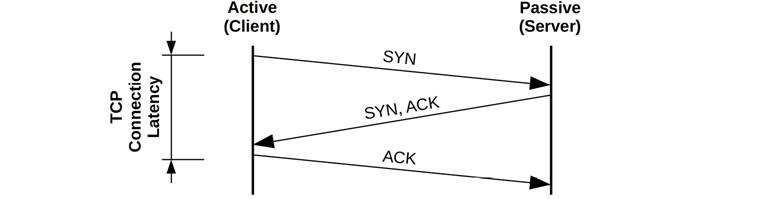
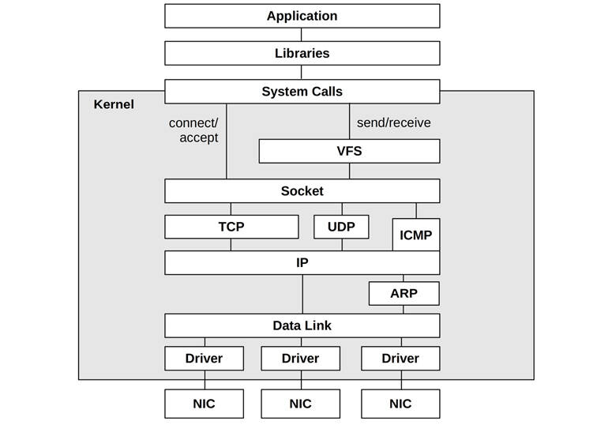

# Chapter 10

## Network

As systems become more distributed, especially with cloud computing environments, the network plays a bigger role in performance. Common tasks in network performance include improving network latency and throughput, and eliminating latency outliers, which can be caused by dropped or delayed packets.

Network analysis spans hardware and software. The hardware is the physical network, which includes the network interface cards, switches, routers, and gateways (these typically have software, too). The software is the kernel network stack including network device drivers, packet queues, and packet schedulers, and the implementation of network protocols. Lower-level protocols are typically kernel software (IP, TCP, UDP, etc.) and higher-level protocols are typically library or application software (e.g., HTTP).

The network is often blamed for poor performance given the potential for congestion and its inherent complexity (blame the unknown). This chapter will show how to figure out what is really happening, which may exonerate the network so that analysis can move on.

The learning objectives of this chapter are:

- Understand networking models and concepts.
- Understand different measures of network latency.
- Have a working knowledge of common network protocols.
- Become familiar with network hardware internals.
- Become familiar with the kernel path from sockets and devices.
- Follow different methodologies for network analysis.
- Characterize system-wide and per-process network I/O.
- Identify issues caused by TCP retransmits.
- Investigate network internals using tracing tools.
- Become aware of network tunable parameters.

This chapter consists of six parts, the first three providing the basis for network analysis, and the last three showing its practical application to Linux-based systems. The parts are as follows:

- **Background** introduces network-related terminology, models, and key network performance concepts.
- **Architecture** provides generic descriptions of physical network components and the network stack.
- **Methodology** describes performance analysis methodologies, both observational and experimental.
- **Observability Tools** shows network performance observability tools for Linux-based systems.
- **Experimentation** summarizes network benchmark and experiment tools.
- **Tuning** describes example tunable parameters.

Network basics, such as the role of TCP and IP, are assumed knowledge for this chapter.

### 10.1 Terminology

For reference, network-related terminology used in this chapter includes:

- **Interface**: The term *interface port* refers to the physical network connector. The term *interface* or *link* refers to the logical instance of a network interface port, as seen and configured by the OS. (Not all OS interfaces are backed by hardware: some are virtual.)
- [**Packet**](gloss.md): The term *packet* refers to a message in a packet-switched network, such as IP packets.
- [**Frame**](gloss.md): A physical network-level message, for example an Ethernet frame.
- [**Socket**](gloss.md): An API originating from BSD for network endpoints.
- **Bandwidth**: The maximum rate of data transfer for the network type, usually measured in bits per second. “100 GbE” is Ethernet with a bandwidth of 100 Gbits/s. There may be bandwidth limits for each direction, so a 100 GbE may be capable of 100 Gbits/s transmit and 100 Gbit/s receive in parallel (200 Gbit/sec total throughput).
- **Throughput**: The current data transfer rate between the network endpoints, measured in bits per second or bytes per second.
- **Latency**: Network *latency* can refer to the time it takes for a message to make a round-trip between endpoints, or the time required to establish a connection (e.g., TCP handshake), excluding the data transfer time that follows.

Other terms are introduced throughout this chapter. The Glossary includes basic terminology for reference, including [*client*](gloss.md), [*Ethernet*](gloss.md), [*host*](gloss.md), [*IP*](gloss.md), [*RFC*](gloss.md), [*server*](gloss.md), [*SYN*](gloss.md), [*ACK*](gloss.md). Also see the terminology sections in [Chapters 2](ch02.md) and [3](ch03.md).

### 10.2 Models

The following simple models illustrate some basic principles of networking and network performance. [Section 10.4](ch10.md), [Architecture](ch10.md), digs much deeper, including implementation-specific details.

#### 10.2.1 Network Interface

A network interface is an operating system endpoint for network connections; it is an abstraction configured and managed by the system administrators.

A network interface is pictured in [Figure 10.1](ch10.md). Network interfaces are mapped to physical network ports as part of their configuration. Ports connect to the network and typically have separate transmit and receive channels.


Figure 10.1 Network interface

#### 10.2.2 Controller

A *network interface card* (NIC) provides one or more network ports for the system and houses a *network controller*: a microprocessor for transferring packets between the ports and the system I/O transport. An example controller with four ports is pictured in [Figure 10.2](ch10.md), showing the physical components involved.


Figure 10.2 Network controller

The controller is typically provided as a separate expansion card or is built into the system board. (Other options include via USB.)

#### 10.2.3 Protocol Stack

Networking is accomplished by a stack of protocols, each layer of which serves a particular purpose. Two stack models are shown in [Figure 10.3](ch10.md), with example protocols.


Figure 10.3 Network protocol stacks

Lower layers are drawn wider to indicate protocol encapsulation. Sent messages move down the stack from the application to the physical network. Received messages move up.

Note that the Ethernet standard also describes the physical layer, and how copper or fiber is used.

There may be additional layers, for example, if Internet Protocol Security (IPsec) or Linux WireGuard are in use, they are above the Internet layer to provide security between IP endpoints. Also, if tunneling is in use (e.g., Virtual Extensible LAN (VXLAN)), then one protocol stack may be encapsulated in another.

While the TCP/IP stack has become standard, I think it can be useful to briefly consider the OSI model as well, as it shows protocol layers within the application.[1](ch10.md) The “layer” terminology is from OSI, where *Layer 3* refers to the network protocols.

[1](ch10.md)I think it’s worthwhile to *briefly* consider it; I would not include it in a networking knowledge test.

Messages at different layers also use different terminology. Using the OSI model: at the transport layer a message is a *segment* or [*datagram*](gloss.md); at the network layer a message is a *packet*; and at the data link layer a message is a *frame*.

### 10.3 Concepts

The following are a selection of important concepts in networking and network performance.

#### 10.3.1 Networks and Routing

A network is a group of connected hosts, related by network protocol addresses. Having multiple networks—instead of one giant worldwide network—is desirable for a number of reasons, particularly scalability. Some network messages will be *broadcast* to all neighboring hosts. By creating smaller subnetworks, such broadcast messages can be isolated locally so they do not create a flooding problem at scale. This is also the basis for isolating the transmission of regular messages to only the networks between source and destination, making more efficient usage of network infrastructure.

Routing manages the delivery of messages, called *packets*, across these networks. The role of routing is pictured in [Figure 10.4](ch10.md).


Figure 10.4 Networks connected via routers

From the perspective of host A, the *localhost* is host A itself. All other hosts pictured are *remote hosts*.

Host A can connect to host B via the local network, usually driven by a network switch (see [Section 10.4](ch10.md), [Architecture](ch10.md)). Host A can connect to host C via router 1, and to host D via routers 1, 2, and 3. Since network components such as routers are shared, contention from other traffic (e.g., host C to host E) can hurt performance.

Connections between pairs of hosts involve *unicast* transmission. *Multicast* transmission allows a sender to transmit to multiple destinations simultaneously, which may span multiple networks. This must be supported by the router configuration to allow delivery. In public cloud environments it may be blocked.

Apart from routers, a typical network will also use *firewalls* to improve security, blocking unwanted connections between hosts.

The address information needed to route packets is contained in an IP header.

#### 10.3.2 Protocols

Network protocol standards, such as those for IP, TCP, and UDP, are a necessary requirement for communication between systems and devices. Communication is performed by transferring routable messages called *packets*, typically by encapsulation of payload data.

Network protocols have different performance characteristics, arising from the original protocol design, extensions, or special handling by software or hardware. For example, the different versions of the IP protocol, IPv4 and IPv6, may be processed by different kernel code paths and can exhibit different performance characteristics. Other protocols perform differently by design, and may be selected when they suit the workload: examples include Stream Control Transmission Protocol (SCTP), Multipath TCP (MPTCP), and QUIC.

Often, there are also system tunable parameters that can affect protocol performance, by changing settings such as buffer sizes, algorithms, and various timers. These differences for specific protocols are described in later sections.

Protocols typically transmit data by use of encapsulation.

#### 10.3.3 Encapsulation

Encapsulation adds metadata to a payload at the start (a *header*), at the end (a *footer*), or both. This doesn’t change the payload data, though it does increase the total size of the message slightly, which costs some overhead for transmission.

[Figure 10.5](ch10.md) shows an example of encapsulation for a TCP/IP stack with Ethernet.


Figure 10.5 Network protocol encapsulation

E.H. is the Ethernet header, and E.F. is the optional Ethernet footer.

#### 10.3.4 Packet Size

The size of the packets and their payload affect performance, with larger sizes improving throughput and reducing packet overheads. For TCP/IP and Ethernet, packets can be between 54 and 9,054 bytes, including the 54 bytes (or more, depending on options or version) of protocol headers.

Packet size is usually limited by the network interface *maximum transmission unit* (MTU) size, which for many Ethernet networks is configured to be 1,500 bytes. The origin of the 1500 MTU size was from the early versions of Ethernet, and the need to balance factors such as NIC buffer memory cost and transmission latency [\[Nosachev 20\]](ch10.md). Hosts competed to use a shared medium (coax or an Ethernet hub), and larger sizes increased the latency for hosts to wait their turn.

Ethernet now supports larger packets (frames) of up to approximately 9,000 bytes, termed *jumbo frames*. These can improve network throughput performance, as well as the latency of data transfers, by requiring fewer packets.

The confluence of two components has interfered with the adoption of jumbo frames: older network hardware and misconfigured firewalls. Older hardware that does not support jumbo frames can either fragment the packet using the IP protocol (causing a performance cost for the packet reassembly) or respond with an ICMP “can’t fragment” error, letting the sender know to reduce the packet size. Now the misconfigured firewalls come into play: there have been ICMP-based attacks in the past (including the “ping of death”) to which some firewall administrators have responded by blocking all ICMP. This prevents the helpful “can’t fragment” messages from reaching the sender and causes network packets to be silently dropped once their packet size increases beyond 1,500. If the ICMP message is received and fragmentation occurs, there is also the risk of fragmented packets getting dropped by devices that do not support them. To avoid these problems, many systems stick to the 1,500 MTU default.

The performance of 1,500 MTU frames has been improved by network interface card features, including *TCP offload* and *large segment offload*. These send larger buffers to the network card, which can then split them into smaller frames using dedicated and optimized hardware. This has, to some degree, narrowed the gap between 1,500 and 9,000 MTU network performance.

#### 10.3.5 Latency

Latency is an important metric for network performance and can be measured in different ways, including name resolution latency, ping latency, connection latency, first-byte latency, round-trip time, and connection life span. These are described as measured by a client connecting to a server.

##### Name Resolution Latency

When establishing connections to remote hosts, a host name is usually resolved to an IP address, for example, by DNS resolution. The time this takes can be measured separately as name resolution latency. Worst case for this latency involves name resolution time-outs, which can take tens of seconds.

Operating systems often provide a name resolution service that provides caching, so that subsequent DNS lookups can resolve quickly from a cache. Sometimes applications only use IP addresses and not names, and so DNS latency is avoided entirely.

##### Ping Latency

This is the time for an ICMP echo request to echo response, as measured by the ping(1) command. This time is used to measure network latency between hosts, including hops in between, and is measured as the time needed for a network request to make a round-trip. It is in common use because it is simple and often readily available: many operating systems will respond to ping by default. It may not exactly reflect the round-trip time of application requests, as ICMP may be handled with a different priority by routers.

Example ping latencies are shown in [Table 10.1](ch10.md).

Table 10.1 **Example ping latencies**

**From**

**To**

**Via**

**Latency**

**Scaled**

Localhost

Localhost

Kernel

0.05 ms

1 s

Host

Host (same subnet)

10 GbE

0.2 ms

4 s

Host

Host (same subnet)

1 GbE

0.6 ms

12 s

Host

Host (same subnet)

Wi-Fi

3 ms

1 minute

San Francisco

New York

Internet

40 ms

13 minutes

San Francisco

United Kingdom

Internet

81 ms

27 minutes

San Francisco

Australia

Internet

183 ms

1 hour

To better illustrate the orders of magnitude involved, the Scaled column shows a comparison based on an imaginary localhost ping latency of one second.

##### Connection Latency

Connection latency is the time to establish a network connection, before any data is transferred. For *TCP connection latency*, this is the TCP handshake time. Measured from the client, it is the time from sending the SYN to receiving the corresponding SYN-ACK. Connection latency might be better termed *connection establishment latency* to clearly differentiate it from connection life span.

Connection latency is similar to ping latency, although it exercises more kernel code to establish a connection and includes time to retransmit any dropped packets. The TCP SYN packet, in particular, can be dropped by the server if its backlog is full, causing the client to send a timer-based retransmit of the SYN. This occurs during the TCP handshake, so connection latency can include retransmission latency, adding one or more seconds.

Connection latency is followed by first-byte latency.

##### First-Byte Latency

Also known as *time to first byte* (TTFB), first-byte latency is the time from when the connection has been established to when the first byte of data is received. This includes the time for the remote host to accept a connection, schedule the thread that services it, and for that thread to execute and send the first byte.

While ping and connection latency measures the latency incurred by the network, first-byte latency includes the think time of the target server. This may include latency if the server is overloaded and needs time to process the request (e.g., TCP backlog) and to schedule the server (CPU scheduler latency).

##### Round-Trip Time

Round-trip time (RTT) describes the time needed for a network request to make a round trip between the endpoints. This includes the signal propagation time and the processing time at each network hop. The intended use is to determine the latency of the network, so ideally RTT is dominated by the time that the request and reply packets spend on the network (and not the time the remote host spends servicing the request). RTT for ICMP echo requests is often studied, as the remote host processing time is minimal.

##### Connection Life Span

Connection life span is the time from when a network connection is established to when it is closed. Some protocols use a *keep-alive* strategy, extending the duration of connections so that future operations can use existing connections and avoid the overheads and latency of connection establishment (and TLS establishment).

For more network latency measurements, see [Section 10.5.4](ch10.md), [Latency Analysis](ch10.md), which describes using them to diagnose network performance.

#### 10.3.6 Buffering

Despite various network latencies that may be encountered, network throughput can be sustained at high rates by use of buffering on the sender and receiver. Larger buffers can mitigate the effects of higher round-trip times by continuing to send data before blocking and waiting for an acknowledgment.

TCP employs buffering, along with a sliding send window, to improve throughput. Network sockets also have buffers, and applications may also employ their own, to aggregate data before sending.

Buffering can also be performed by external network components, such as switches and routers, in an effort to improve their own throughput. Unfortunately, the use of large buffers on these components can lead to *bufferbloat*, where packets are queued for long intervals. This causes TCP congestion avoidance on the hosts, which throttles performance. Features have been added to the Linux 3.x kernels to address this problem (including byte queue limits, the CoDel queueing discipline [\[Nichols 12\]](ch10.md), and TCP small queues). There is also a website for discussing the issue [\[Bufferbloat 20\]](ch10.md).

The function of buffering (or large buffering) may be best served by the endpoints—the hosts—and not the intermediate network nodes, following a principle called *end-to-end arguments* [\[Saltzer 84\]](ch10.md).

#### 10.3.7 Connection Backlog

Another type of buffering is for the initial connection requests. TCP implements a backlog, where SYN requests can queue in the kernel before being accepted by the user-land process. When there are too many TCP connection requests for the process to accept in time, the backlog reaches a limit and SYN packets are dropped, to be later retransmitted by the client. The retransmission of these packets causes latency for the client connect time. The limit is tunable: it is a parameter of the listen(2) syscall, and the kernel may also provide system-wide limits.

Backlog drops and SYN retransmits are indicators of host overload.

#### 10.3.8 Interface Negotiation

Network interfaces may operate with different modes, autonegotiated between the connected transceivers. Some examples are:

- **Bandwidth**: For example, 10, 100, 1,000, 10,000, 40,000, 100,000 Mbits/s
- [**Duplex**](gloss.md): Half or full duplex

These examples are from Ethernet, which tends to use round base-10 numbers for bandwidth limits. Other physical-layer protocols, such as SONET, have a different set of possible bandwidths.

Network interfaces are usually described in terms of their highest bandwidth and protocol, for example, 1 Gbit/s Ethernet (1 GbE). This interface may, however, autonegotiate to lower speeds if needed. This can occur if the other endpoint cannot operate faster, or to accommodate physical problems with the connection medium (bad wiring).

Full-duplex mode allows bidirectional simultaneous transmission, with separate paths for transmit and receive that can each operate at full bandwidth. Half-duplex mode allows only one direction at a time.

#### 10.3.9 Congestion Avoidance

Networks are shared resources that can become congested when traffic loads are high. This can cause performance problems: for example, routers or switches may drop packets, causing latency-inducing TCP retransmits. Hosts can also become overwhelmed when receiving high packet rates, and may drop packets themselves.

There are many mechanisms to avoid these problems; these mechanisms should be studied, and tuned if necessary, to improve scalability under load. Examples for different protocols include:

- **Ethernet**: An overwhelmed host may send *pause frames* to a transmitter, requesting that they pause transmission (IEEE 802.3x). There are also priority classes and *priority pause frames* for each class.
- **IP**: Includes an Explicit Congestion Notification (ECN) field.
- [**TCP**](gloss.md): Includes a congestion window, and various *congestion control algorithms* may be used.

Later sections describe IP ECN and TCP congestion control algorithms in more detail.

#### 10.3.10 Utilization

Network interface utilization can be calculated as the current throughput over the maximum bandwidth. Given variable bandwidth and duplex due to autonegotiation, calculating this isn’t as straightforward as it sounds.

For full duplex, utilization applies to each direction and is measured as the current throughput for that direction over the current negotiated bandwidth. Usually it is just one direction that matters most, as hosts are commonly asymmetric: servers are transmit-heavy, and clients are receive-heavy.

Once a network interface direction reaches 100% utilization, it becomes a bottleneck, limiting performance.

Some performance tools report activity only in terms of packets, not bytes. Since packet size can vary greatly (as mentioned earlier), it is not possible to relate packet counts to byte counts for calculating either throughput or (throughput-based) utilization.

#### 10.3.11 Local Connections

Network connections can occur between two applications on the same system. These are *localhost* connections and use a virtual network interface: *loopback*.

Distributed application environments are often split into logical parts that communicate over the network. These can include web servers, database servers, caching servers, proxy servers, and application servers. If they are running on the same host, their connections are to localhost.

Connecting via IP to localhost is the *IP sockets* technique of inter-process communication (IPC). Another technique is Unix domain sockets (UDS), which create a file on the file system for communication. Performance may be better with UDS, as the kernel TCP/IP stack can be bypassed, skipping kernel code and the overheads of protocol packet encapsulation.

For TCP/IP sockets, the kernel may detect the localhost connection after the handshake, and then shortcut the TCP/IP stack for data transfers, improving performance. This was developed as a Linux kernel feature, called *TCP friends*, but was not merged [\[Corbet 12\]](ch10.md). BPF can now be used on Linux for this purpose, as is done by the Cilium software for container networking performance and security \[Cilium 20a].

### 10.4 Architecture

This section introduces network architecture: protocols, hardware, and software. These have been summarized as background for performance analysis and tuning, with a focus on performance characteristics. For more details, including general networking topics, see networking texts [\[Stevens 93\]](ch10.md)[\[Hassan 03\]](ch10.md), RFCs, and vendor manuals for networking hardware. Some of these are listed at the end of the chapter.

#### 10.4.1 Protocols

In this section, performance features and characteristics of IP, TCP, UDP, and QUIC are summarized. How these protocols are implemented in hardware and software (including features such as segmentation offload, connection queues, and buffering) is described in the later hardware and software sections.

##### IP

The Internet Protocol (IP) versions 4 and 6 include a field to set the desired performance of a connection: the Type of Service field in IPv4, and the Traffic Class field in IPv6. These fields have since been redefined to contain a Differentiated Services Code Point (DSCP) (RFC 2474) [\[Nichols 98\]](ch10.md) and an Explicit Congestion Notification (ECN) field (RFC 3168) [\[Ramakrishnan 01\]](ch10.md).

The DSCP is intended to support different *service classes*, each of which have different characteristics including packet drop probability. Example service classes include: telephony, broadcast video, low-latency data, high-throughput data, and low-priority data.

ECN is a mechanism that allows servers, routers, or switches on the path to explicitly signal the presence of congestion by setting a bit in the IP header, instead of dropping a packet. The receiver will echo this signal back to the sender, which can then throttle transmission. This provides the benefits of congestion avoidance without incurring the penalty of packet drops (provided that the ECN bit is used correctly across the network).

##### TCP

The Transmission Control Protocol (TCP) is a commonly used Internet standard for creating reliable network connections. TCP is specified by RFC 793 [\[Postel 81\]](ch10.md) and later additions.

In terms of performance, TCP can provide a high rate of throughput even on high-latency networks, by use of buffering and a *sliding window*. TCP also employs congestion control and a *congestion window* set by the sender, so that it can maintain a high but also reliable rate of transmission across different and varying networks. Congestion control avoids sending too many packets, which would cause congestion and a performance breakdown.

The following is a summary of TCP performance features, including additions since the original specification:

- **Sliding window**: This allows multiple packets up to the size of the window to be sent on the network before acknowledgments are received, providing high throughput even on high-latency networks. The size of the window is advertised by the receiver to indicate how many packets it is willing to receive at that time.
- **Congestion avoidance**: To prevent sending too much data and causing saturation, which can cause packet drops and worse performance.
- **Slow-start**: Part of TCP congestion control, this begins with a small congestion window and then increases it as acknowledgments (ACKs) are received within a certain time. When they are not, the congestion window is reduced.
- **Selective acknowledgments** (SACKs): Allow TCP to acknowledge discontinuous packets, reducing the number of retransmits required.
- **Fast retransmit**: Instead of waiting on a timer, TCP can retransmit dropped packets based on the arrival of duplicate ACKs. These are a function of round-trip time and not the typically much slower timer.
- **Fast recovery**: This recovers TCP performance after detecting duplicate ACKs, by resetting the connection to perform slow-start.
- **TCP fast open**: Allows a client to include data in a SYN packet, so that server request processing can begin earlier and not wait for the SYN handshake (RFC7413). This can use a cryptographic cookie to authenticate the client.
- **TCP timestamps**: Includes a timestamp for sent packets that is returned in the ACK, so that round-trip time can be measured (RFC 1323) [\[Jacobson 92\]](ch10.md).
- **TCP SYN cookies**: Provides cryptographic cookies to clients during possible SYN flood attacks (full backlogs) so that legitimate clients can continue to connect, and without the server needing to store extra data for these connection attempts.

In some cases these features are implemented by use of extended TCP options added to the protocol header.

Important topics for TCP performance include the three-way handshake, duplicate ACK detection, congestion control algorithms, Nagle, delayed ACKs, SACK, and FACK.

###### Three-Way Handshake

Connections are established using a three-way handshake between the hosts. One host passively listens for connections; the other actively initiates the connection. To clarify terminology: *passive* and *active* are from RFC 793 \[Postel 81]; however, they are commonly called *listen* and *connect*, respectively, after the socket API. For the client/server model, the server performs listen and the client performs connect.

The three-way handshake is pictured in [Figure 10.6](ch10.md).



Figure 10.6 TCP three-way handshake

Connection latency from the client is indicated, which completes when the final ACK is sent. After that, data transfer may begin.

This figure shows best-case latency for a handshake. A packet may be dropped, adding latency as it is timed out and retransmitted.

Once the three-way handshake is complete, the TCP session is placed in the ESTABLISHED state.

###### States and Timers

TCP sessions switch between TCP states based on packets and socket events. The states are LISTEN, SYN-SENT, SYN-RECEIVED, ESTABLISHED, FIN-WAIT-1, FIN-WAIT-2, CLOSE-WAIT, CLOSING, LAST-ACK, TIME-WAIT, and CLOSED \[Postal 80]. Performance analysis typically focuses on those in the ESTABLISHED state, which are the active connections. Such connections may be transferring data, or idle awaiting the next event: a data transfer or close event.

A session that has fully closed enters the TIME\_WAIT[2](ch10.md) state so that late packets are not mis-associated with a new connection on the same ports. This can lead to a performance issue of port exhaustion, explained in [Section 10.5.7](ch10.md), [TCP Analysis](ch10.md).

[2](ch10.md)While it is often written (and programmed) as TIME\_WAIT, RFC 793 uses TIME-WAIT.

Some states have timers associated with them. TIME\_WAIT is typically two minutes (some kernels, such as the Windows kernel, allow it to be tuned). There may also be a “keep alive” timer on ESTABLISHED, set to a long duration (e.g., two hours), to trigger probe packets to check that the remote host is still alive.

###### Duplicate ACK Detection

Duplicate ACK detection is used by the fast retransmit and fast recovery algorithms to quickly detect when a sent packet (or its ACK) has been lost. It works as follows:

1. The sender sends a packet with sequence number 10.
2. The receiver replies with an ACK for sequence number 11.
3. The sender sends 11, 12, and 13.
4. Packet 11 is dropped.
5. The receiver replies to both 12 and 13 by sending an ACK for 11, which it is still expecting.
6. The sender receives the duplicate ACKs for 11.

Duplicate ACK detection is also used by various congestion avoidance algorithms.

###### Retransmits

Two commonly used mechanisms for TCP to detect and retransmits lost packets are:

- **Timer-based retransmits**: These occur when a time has passed and a packet acknowledgment has not yet been received. This time is the TCP retransmit timeout, calculated dynamically based on the connection round-trip time (RTT). On Linux, this will be at least 200 ms (TCP\_RTO\_MIN) for the first retransmit,[3](ch10.md) and subsequent retransmits will be much slower, following an exponential backoff algorithm that doubles the timeout.
  
  [3](ch10.md)This seems to violate RFC6298, which stipulates a one second RTO minimum [\[Paxson 11\]](ch10.md).
- **Fast retransmits**: When duplicate ACKs arrive, TCP can assume that a packet was dropped and retransmit it immediately.

To further improve performance, additional mechanisms have been developed to avoid the timer-based retransmit. One problem occurs is when the last transmitted packet is lost, and there are no subsequent packets to trigger duplicate ACK detection. (Consider the prior example with a loss on packet 13.) This is solved by Tail Loss Probe (TLP), which sends an additional packet (probe) after a short timeout on the last transmission to help detect packet loss [\[Dukkipati 13\]](ch10.md).

Congestion control algorithms may also throttle throughput in the presence of retransmits.

###### Congestion Controls

Congestion control algorithms have been developed to maintain performance on congested networks. Some operating systems (including Linux-based) allow the algorithm to be selected as part of system tuning. These algorithms include:

- **Reno**: Triple duplicate ACKs trigger: halving of the congestion window, halving of the slow-start threshold, fast retransmit, and fast recovery.
- **Tahoe**: Triple duplicate ACKs trigger: fast retransmit, halving the slow-start threshold, congestion window set to one maximum segment size (MSS), and slow-start state. (Along with Reno, Tahoe was first developed for 4.3BSD.)
- **CUBIC**: Uses a cubic function (hence the name) to scale the window, and a “hybrid start” function to exit slow start. CUBIC tends to be more aggressive than Reno, and is the default in Linux.
- **BBR**: Instead of window-based, BBR builds an explicit model of the network path characteristics (RTT and bandwidth) using probing phases. BBR can provide dramatically better performance on some network paths, while hurting performance on others. BBRv2 is currently in development and promises to fix some of the deficiencies of v1.
- **DCTCP**: DataCenter TCP relies on switches configured to emit Explicit Congestion Notification (ECN) marks at a very shallow queue occupancy to rapidly ramp up to the available bandwidth (RFC 8257) [\[Bensley 17\]](ch10.md). This makes DCTCP unsuitable for deployment across the Internet, but in a suitably configured controlled environment it can improve performance significantly.

Other algorithms not listed previously include Vegas, New Reno, and Hybla.

The congestion control algorithm can make a large difference to network performance. The Netflix cloud services, for example, use BBR and found it can improve throughput threefold during heavy packet loss [\[Ather 17\]](ch10.md). Understanding how these algorithms react under different network conditions is an important activity when analyzing TCP performance.

Linux 5.6, released in 2020, added support for developing new congestion control algorithms in BPF [\[Corbet 20\]](ch10.md). This allows them to be defined by the end user and loaded on demand.

###### Nagle

This algorithm (RFC 896) [\[Nagle 84\]](ch10.md) reduces the number of small packets on the network by delaying their transmission to allow more data to arrive and be coalesced. This delays packets only if there is data in the pipeline and delays are already being encountered.

The system may provide a tunable parameter or socket option to disable Nagle, which may be necessary if its operation conflicts with delayed ACKs (see [Section 10.8.2](ch10.md), [Socket Options](ch10.md)).

###### Delayed ACKs

This algorithm (RFC 1122) [\[Braden 89\]](ch10.md) delays the sending of ACKs up to 500 ms, so that multiple ACKs may be combined. Other TCP control messages can also be combined, reducing the number of packets on the network.

As with Nagle, the system may provide a tunable parameter to disable this behavior.

###### SACK, FACK, and RACK

The TCP selective acknowledgment (SACK) algorithm allows the receiver to inform the sender that it received a noncontiguous block of data. Without this, a packet drop would eventually cause the entire send window to be retransmitted, to preserve a sequential acknowledgment scheme. This harms TCP performance and is avoided by most modern operating systems that support SACK.

SACK has been extended by forward acknowledgments (FACK), which are supported in Linux by default. FACKs track additional state and better regulate the amount of outstanding data in the network, improving overall performance [\[Mathis 96\]](ch10.md).

Both SACK and FACK are used to improve packet loss recovery. A newer algorithm, Recent ACKnowledgment (RACK; now called RACK-TLP with the incorporation of TLP) uses time information from ACKs for even better loss detection and recovery, rather than ACK sequences alone [\[Cheng 20\]](ch10.md). For FreeBSD, Netflix has developed a new refactored TCP stack called RACK based on RACK, TLP, and other features [\[Stewart 18\]](ch10.md).

###### Initial Window

The initial window (IW) is the number of packets a TCP sender will transmit at the beginning of a connection before waiting for acknowledgment from the sender. For short flows, such as typical HTTP connections, an IW large enough to span the transmitted data can greatly reduce completion time, improving performance. Larger IWs, however, can risk congestion and packet drops. This is especially compounded when multiple flows start up at the same time.

The Linux default (10 packets, aka IW10) can be too high on slow links or when many connections start up; other operating systems default to 2 or 4 packets (IW2 or IW4).

##### UDP

The User Datagram Protocol (UDP) is a commonly used Internet standard for sending messages, called *datagrams*, across a network (RFC 768) [\[Postel 80\]](ch10.md). In terms of performance, UDP provides:

- **Simplicity**: Simple and small protocol headers reduce overheads of computation and size.
- **Statelessness**: Lower overheads for connections and transmission.
- **No retransmits**: These add significant latencies for TCP connections.

While simple and often high-performing, UDP is not intended to be reliable, and data can be missing or received out of order. This makes it unsuitable for many types of connections. UDP also has no congestion avoidance and can therefore contribute to congestion on the network.

Some services, including versions of NFS, can be configured to operate over TCP or UDP as desired. Others that perform broadcast or multicast data may be able to use only UDP.

A major use for UDP has been DNS. Due to the simplicity of UDP, a lack of congestion control, and Internet support (it is not typically firewalled) there are now new protocols built upon UDP that implement their own congestion control and other features. An example is QUIC.

##### QUIC and HTTP/3

QUIC is a network protocol designed by Jim Roskind at Google as a higher-performing, lower-latency alternative to TCP, optimized for HTTP and TLS [\[Roskind 12\]](ch10.md). QUIC is built upon UDP, and provides several features on top of it, including:

- The ability to multiplex several application-defined streams on top of the same “connection.”
- A TCP-like reliable in-order stream transport that can be optionally turned off for individual substreams.
- Connection resumption when a client changes its network address, based on cryptographic authentication of connection IDs.
- Full encryption of the payload data, including QUIC headers.
- 0-RTT connection handshakes including cryptography (for peers that have previously communicated).

QUIC is in heavy use by the Chrome web browser.

While QUIC was initially developed by Google, the Internet Engineering Task Force (IETF) is in the process of standardizing both the QUIC transport itself, and the specific configuration of using HTTP over QUIC (the latter combination is named HTTP/3).

#### 10.4.2 Hardware

Networking hardware includes interfaces, controllers, switches, routers, and firewalls. An understanding of their operation is useful, even if they are managed by other staff (network administrators).

##### Interfaces

Physical network interfaces send and receive messages, called *frames*, on the attached network. They manage the electrical, optical, or wireless signaling involved, including the handling of transmission errors.

Interface types are based on layer 2 standards, each providing a maximum bandwidth. Higher-bandwidth interfaces provide lower data-transfer latency, at a higher cost. When designing new servers, a key decision is often how to balance the price of the server with the desired network performance.

For Ethernet, choices include copper or optical, with maximum speeds of 1 Gbit/s (1 GbE), 10 GbE, 40 GbE, 100 GbE, 200 GbE, and 400 GbE. Numerous vendors manufacture Ethernet interface controllers, although your operating system may not have driver support for some of them.

Interface utilization can be examined as the current throughput divided by the current negotiated bandwidth. Most interfaces have separate channels for transmit and receive, and when operating in full-duplex mode, each channel’s utilization must be studied separately.

Wireless interfaces can suffer performance issues due to poor signal strength and interference.[4](ch10.md)

[4](ch10.md) I developed BPF software that turns Linux Wi-Fi signal strength into an audible pitch, and demonstrated it in an AWS re:Invent 2019 talk [\[Gregg 19b\]](ch10.md). I would include it in this chapter, but I have not yet used it for enterprise or cloud environments, which so far are all wired.

##### Controllers

Physical network interfaces are provided to the system via controllers, either built into the system board or provided via expander cards.

Controllers are driven by microprocessors and are attached to the system via an I/O transport (e.g., PCI). Either of these can become the limiter for network throughput or IOPS.

For example, a dual 10 GbE network interface card is connected to a four-channel PCI express (PCIe) Gen 2 slot. The card has a maximum send or receive bandwidth of 2 × 10 GbE = 20 Gbits/s, and bidirectional, 40 Gbit/s. The slot has a maximum bandwidth of 4 × 4 Gbits/s = 16 Gbits/s. Therefore, network throughput on both ports will be limited by PCIe Gen 2 bandwidth, and it will not be possible to drive them both at line rate at the same time (I know this from practice!).

##### Switches and Routers

Switches provide a dedicated communication path between any two connected hosts, allowing multiple transmissions between pairs of hosts without interference. This technology replaced hubs (and before that, shared physical buses: the commonly used thick-Ethernet coaxial cable), which shared all packets with all hosts. This sharing led to contention when hosts transmitted simultaneously, identified by the interface as a *collision* using a “carrier sense multiple access with collision detection” (CSMA/CD) algorithm. This algorithm would exponentially back off and retransmit until successful, creating performance issues under load. With the use of switches this is behind us, but some observability tools still have collision counters—even though these usually occur only due to errors (negotiation or bad wiring).

Routers deliver packets between networks and use network protocols and routing tables to determine efficient delivery paths. Delivering a packet between two cities may involve a dozen or more routers, plus other network hardware. The routers and routes are usually configured to update dynamically, so that the network can automatically respond to network and router outages, and to balance load. This means that at a given point in time, no one can be sure what path a packet is actually taking. With multiple paths possible, there is also the potential for packets to be delivered out of order, which can cause TCP performance problems.

This element of mystery on the network is often blamed for poor performance: perhaps heavy network traffic—from other unrelated hosts—is saturating a router between the source and destination? Network administration teams are therefore frequently required to exonerate their infrastructure. They can do so using advanced real-time monitoring tools to check all routers and other network components involved.

Both routers and switches include buffers and microprocessors, which themselves can become performance bottlenecks under load. As an extreme example, I once found that an early 10 GbE switch could drive no more than 11 Gbits/s in total across all ports, due to its limited CPU capacity.

Note that switches and routers are also often where *rate transitions* occur (switching from one bandwidth to another, e.g., a 10 Gbps link transitions to a 1 Gbps link). When this happens, some buffering is necessary to avoid excessive drops, but many switches and routers over-buffer (see the bufferbloat issue in [Section 10.3.6](ch10.md), [Buffering](ch10.md)), leading to high latencies. Better queue management algorithms can help eliminate this problem, but not all network device vendors support them. Pacing at the source can also be a way to alleviate issues with rate transitions by making the traffic less bursty.

##### Firewalls

Firewalls are often in use to permit only authorized communications based on a configured rule set, improving the security of the network. They may be present as both physical network devices and kernel software.

Firewalls can become a performance bottleneck, especially when configured to be stateful. Stateful rules store metadata for each seen connection, and the firewall may experience excessive memory load when processing many connections. This can happen due to a denial of service (DoS) attack that attempts to inundate a target with connections. It can also happen with a heavy rate of outbound connections, as they may require similar connection tracking.

As firewalls are custom hardware or software, the tools available to analyze them depends on each firewall product. See their respective documentation.

The use of extended BPF to implement firewalls on commodity hardware is growing, due to its performance, programmability, ease of use, and final cost. Companies adopting BPF firewalls and DDoS solutions include Facebook [\[Deepak 18\]](ch10.md), Cloudflare [\[Majkowski 18\]](ch10.md), and Cilium [\[Cilium 20a\]](ch10.md).

Firewalls can also be a nuisance during performance testing: performing a bandwidth experiment when debugging an issue may involve modifying firewall rules to allow the connection (and coordinating that with the security team).

##### Others

Your environment may include other physical network devices, such as hubs, bridges, repeaters, and modems. Any of these can be a source of performance bottlenecks and dropped packets.

#### 10.4.3 Software

Networking software includes the network stack, TCP, and device drivers. Topics related to performance are discussed in this section.

##### Network Stack

The components and layers involved depend on the operating system type, version, protocols, and interfaces in use. [Figure 10.7](ch10.md) depicts a general model, showing the software components.



Figure 10.7 Generic network stack

On modern kernels the stack is multithreaded, and inbound packets can be processed by multiple CPUs.

###### Linux

The Linux network stack is pictured in [Figure 10.8](ch10.md), including the location of socket send/receive buffers and packet queues.


Figure 10.8 Linux network stack

On Linux systems, the network stack is a core kernel component, and device drivers are additional modules. Packets are passed through these kernel components as the struct sk\_buff (socket buffer) data type. Note that there may also be queueing in the IP layer (not pictured) for packet reassembly.

The following sections discuss Linux implementation details related to performance: TCP connection queues, TCP buffering, queueing disciplines, network device drivers, CPU scaling, and kernel bypass. The TCP protocol was described in the previous section.

##### TCP Connection Queues

Bursts of inbound connections are handled by using backlog queues. There are two such queues, one for incomplete connections while the TCP handshake completes (also known as the *SYN backlog*), and one for established sessions waiting to be accepted by the application (also known as the *listen backlog*). These are pictured in [Figure 10.9](ch10.md).


Figure 10.9 TCP backlog queues

Only one queue was used in earlier kernels, and it was vulnerable to SYN floods. A SYN flood is a type of DoS attack that involves sending numerous SYNs to the listening TCP port from bogus IP addresses. This fills the backlog queue while TCP waits to complete the handshake, preventing real clients from connecting.

With two queues, the first can act as a staging area for potentially bogus connections, which are promoted to the second queue only once the connection is established. The first queue can be made long to absorb SYN floods and optimized to store only the minimum amount of metadata necessary.

The use of SYN cookies bypasses the first queue, as they show the client is already authorized.

The length of these queues can be tuned independently (see [Section 10.8](ch10.md), [Tuning](ch10.md)). The second can also be set by the application as the backlog argument to listen(2).

##### TCP Buffering

Data throughput is improved by using send and receive buffers associated with the socket. These are pictured in [Figure 10.10](ch10.md).


Figure 10.10 TCP send and receive buffers

The size of both the send and receive buffers is tunable. Larger sizes improve throughput performance, at the cost of more main memory spent per connection. One buffer may be set to be larger than the other if the server is expected to perform more sending or receiving. The Linux kernel will also dynamically increase the size of these buffers based on connection activity, and allows tuning of their minimum, default, and maximum sizes.

##### Segmentation Offload: GSO and TSO

Network devices and networks accept packet sizes up to a maximum segment size (MSS) that may be as small as 1500 bytes. To avoid the network stack overheads of sending many small packets, Linux uses generic segmentation offload (GSO) to send packets up to 64 Kbytes in size (“super packets”), which are split into MSS-sized segments just before delivery to the network device. If the NIC and driver support TCP segmentation offload (TSO), GSO leaves splitting to the device, improving network stack throughput.[5](ch10.md) There is also a generic receive offload (GRO) complement to GSO [\[Linux 20i\]](ch10.md).[6](ch10.md) GRO and GSO are implemented in kernel software, and TSO is implemented by NIC hardware.

[5](ch10.md)Some network cards provide a TCP offload engine (TOE) to offload part or all of TCP/IP protocol processing. Linux does not support TOE for various reasons, including security, complexity, and even performance [\[Linux 16\]](ch10.md).

[6](ch10.md)UDP support for GSO and GRO was added to Linux in 2018, with QUIC a key use case \[Bruijn 18].

##### Queueing Discipline

This is an optional layer for managing traffic classification (tc), scheduling, manipulation, filtering, and shaping of network packets. Linux provides numerous queueing discipline algorithms (qdiscs), which can be configured using the tc(8) command. As each has a man page, the man(1) command can be used to list them:

[Click here to view code image](ch10_images.md)

```
# man -k tc-
tc-actions (8)       - independently defined actions in tc
tc-basic (8)         - basic traffic control filter
tc-bfifo (8)         - Packet limited First In, First Out queue
tc-bpf (8)           - BPF programmable classifier and actions for ingress/egress
queueing disciplines
tc-cbq (8)           - Class Based Queueing
tc-cbq-details (8)   - Class Based Queueing
tc-cbs (8)           - Credit Based Shaper (CBS) Qdisc
tc-cgroup (8)        - control group based traffic control filter
tc-choke (8)         - choose and keep scheduler
tc-codel (8)         - Controlled-Delay Active Queue Management algorithm
tc-connmark (8)      - netfilter connmark retriever action
tc-csum (8)          - checksum update action
tc-drr (8)           - deficit round robin scheduler
tc-ematch (8)        - extended matches for use with "basic" or "flow" filters
tc-flow (8)          - flow based traffic control filter
tc-flower (8)        - flow based traffic control filter
tc-fq (8)            - Fair Queue traffic policing
tc-fq_codel (8)      - Fair Queuing (FQ) with Controlled Delay (CoDel)
[...]
```

The Linux kernel sets pfifo\_fast as the default qdisc, whereas systemd is less conservative and sets it to fq\_codel to reduce potential bufferbloat, at the cost of slightly higher complexity in the qdisc layer.

BPF can enhance the capabilities of this layer with the programs of type BPF\_PROG\_TYPE\_SCHED\_CLS and BPF\_PROG\_TYPE\_SCHED\_ACT. These BPF programs can be attached to kernel ingress and egress points for packet filtering, mangling, and forwarding, as used by load balancers and firewalls.

##### Network Device Drivers

The network device driver usually has an additional buffer—a ring buffer—for sending and receiving packets between kernel memory and the NIC. This was pictured in [Figure 10.8](ch10.md) as the driver queue.

A performance feature that has become more common with high-speed networking is the use of *interrupt coalescing mode*. Instead of interrupting the kernel for every arrived packet, an interrupt is sent only when either a timer (polling) or a certain number of packets is reached. This reduces the rate at which the kernel communicates with the NIC, allowing larger transfers to be buffered, resulting in greater throughput, though at some cost in latency.

The Linux kernel uses a new API (NAPI) framework that uses an interrupt mitigation technique: for low packet rates, interrupts are used (processing is scheduled via a softirq); for high packet rates, interrupts are disabled, and polling is used to allow coalescing [\[Corbet 03\]](ch10.md)[\[Corbet 06b\]](ch10.md). This provides low latency or high throughput, depending on the workload. Other features of NAPI include:

- Packet throttling, which allows early packet drop in the network adapter to prevent the system from being overwhelmed by packet storms.
- Interface scheduling, where a quota is used to limit the buffers processed in a polling cycle, to ensure fairness between busy network interfaces.
- Support for the SO\_BUSY\_POLL socket option, where user-level applications can reduce network receive latency by requesting to *busy wait* (spin on CPU until an event occurs) on a socket [\[Dumazet 17a\]](ch10.md).

Coalescing can be especially important for improving virtual machine networking, and is used by the ena network driver used by AWS EC2.

##### NIC Send and Receive

For sent packets, the NIC is notified and typically reads the packet (frame) from kernel memory using direct memory access (DMA) for efficiency. NICs provide transmit descriptors for managing DMA packets; if the NIC does not have free descriptors, the network stack will pause transmission to allow the NIC to catch up.[7](ch10.md)

[7](ch10.md)Byte Queue Limits (BQL), summarized under the heading Other Optimizations, usually prevent TX descriptor exhaustion.

For received packets, NICs can use DMA to place the packet into kernel ring-buffer memory and then notify the kernel using an interrupt (which may be ignored to allow coalescing). The interrupt triggers a softirq to deliver the packet to the network stack for further processing.

##### CPU Scaling

High packet rates can be achieved by engaging multiple CPUs to process packets and the TCP/IP stack. Linux supports various methods for multi-CPU packet processing (see Documentation/networking/scaling.txt):

- **RSS: Receive Side Scaling**: For modern NICs that support multiple queues and can hash packets to different queues, which are in turn processed by different CPUs, interrupting them directly. This hash may be based on the IP address and TCP port numbers, so that packets from the same connection end up being processed by the same CPU.[8](ch10.md)
  
  [8](ch10.md) The Netflix FreeBSD CDN uses RSS to assist TCP large receive offload (LRO), allowing packets for the same connection to be aggregated, even when separated by other packets [\[Gallatin 17\]](ch10.md).
- **RPS: Receive Packet Steering**: A software implementation of RSS, for NICs that do not support multiple queues. This involves a short interrupt service routine to map the inbound packet to a CPU for processing. A similar hash can be used to map packets to CPUs, based on fields from the packet headers.
- **RFS: Receive Flow Steering**: This is similar to RPS, but with affinity for where the socket was last processed on-CPU, to improve CPU cache hit rates and memory locality.
- **Accelerated Receive Flow Steering**: This achieves RFS in hardware, for NICs that support this functionality. It involves updating the NIC with flow information so that it can determine which CPU to interrupt.
- **XPS: Transmit Packet Steering**: For NICs with multiple transmit queues, this supports transmission by multiple CPUs to the queues.

Without a CPU load-balancing strategy for network packets, a NIC may interrupt only one CPU, which can reach 100% utilization and become a bottleneck. This may show up as high softirq CPU time on a single CPU (e.g., using Linux mpstat(1): see [Chapter 6](ch06.md), [CPUs](ch06.md), [Section 6.6.3](ch06.md), [mpstat](ch06.md)). This may especially happen for load balancers or proxy servers (e.g., nginx), as their intended workload is a high rate of inbound packets.

Mapping interrupts to CPUs based on factors such as cache coherency, as is done by RFS, can noticeably improve network performance. This can also be accomplished by the irqbalance process, which assigns interrupt request (IRQ) lines to CPUs.

##### Kernel Bypass

[Figure 10.8](ch10.md) shows the path most commonly taken through the TCP/IP stack. Applications can bypass the kernel network stack using technologies such as the Data Plane Development Kit (DPDK) in order to achieve higher packet rates and performance. This involves an application implementing its own network protocols in user-space, and making writes to the network driver via a DPDK library and a kernel user space I/O (UIO) or virtual function I/O (VFIO) driver. The expense of copying packet data can be avoided by directly accessing memory on the NIC.

The eXpress Data Path (XDP) technology provides another path for network packets: a programmable fast path that uses extended BPF and that integrates into the existing kernel stack rather than bypassing it [\[Høiland-Jørgensen 18\]](ch10.md). (DPDK now supports XDP for receiving packets, moving some functionality back to the kernel [\[DPDK 20\]](ch10.md).)

With kernel network stack bypass, instrumentation using traditional tools and metrics is not available because the counters and tracing events they use are also bypassed. This makes performance analysis more difficult.

Apart from full stack bypass, there are capabilities for avoiding the expense of copying data: the MSG\_ZEROCOPY send(2) flag, and zero-copy receive via mmap(2) [\[Linux 20c\]](ch10.md)[\[Corbet 18b\]](ch10.md).

##### Other Optimizations

There are other algorithms in use throughout the Linux network stack to improve performance. [Figure 10.11](ch10.md) shows these for the TCP send path (many of these are called from the tcp\_write\_xmit() kernel function).


Figure 10.11 TCP send path

Some of these components and algorithms were described earlier (socket send buffers, TSO,[9](ch10.md) congestion controls, Nagle, and qdiscs); others include:

[9](ch10.md)Note that TSO appears twice in the diagram: first, after Pacing to build a super packet, and then in the NIC for final segmentation.

- **Pacing**: This controls when to send packets, spreading out transmissions (pacing) to avoid bursts that may hurt performance (this may help avoid TCP micro-bursts that can lead to queueing delay, or even cause network switches to drop packets. It may also help with the *incast* problem, when many end points transmit to one at the same time [\[Fritchie 12\]](ch10.md)).
- **TCP Small Queues (TSQ)**: This controls (reduces) how much is queued by the network stack to avoid problems including bufferbloat \[Bufferbloat 20].
- **Byte Queue Limits (BQL)**: These automatically size the driver queues large enough to avoid starvation, but also small enough to reduce the maximum latency of queued packets, and to avoid exhausting NIC TX descriptors [\[Hrubý 12\]](ch10.md). It works by pausing the addition of packets to the driver queue when necessary, and was added in Linux 3.3 [\[Siemon 13\]](ch10.md).
- **Earliest Departure Time (EDT)**: This uses a timing wheel instead of a queue to order packets sent to the NIC. Timestamps are set on every packet based on policy and rate configuration. This was added in Linux 4.20, and has BQL- and TSQ-like capabilities [\[Jacobson 18\]](ch10.md).

These algorithms often work in combination to improve performance. A TCP sent packet can be processed by any of the congestion controls, TSO, TSQ, pacing, and queueing disciplines, before it ever arrives at the NIC [\[Cheng 16\]](ch10.md).

### 10.5 Methodology

This section describes methodologies and exercises for network analysis and tuning. [Table 10.2](ch10.md) summarizes the topics.

Table 10.2 **Network performance methodologies**

**Section**

**Methodology**

**Types**

[10.5.1](ch10.md)

Tools method

Observational analysis

[10.5.2](ch10.md)

USE method

Observational analysis

[10.5.3](ch10.md)

Workload characterization

Observational analysis, capacity planning

[10.5.4](ch10.md)

Latency analysis

Observational analysis

[10.5.5](ch10.md)

Performance monitoring

Observational analysis, capacity planning

[10.5.6](ch10.md)

Packet sniffing

Observational analysis

[10.5.7](ch10.md)

TCP analysis

Observational analysis

[10.5.8](ch10.md)

Static performance tuning

Observational analysis, capacity planning

[10.5.9](ch10.md)

Resource controls

Tuning

[10.5.10](ch10.md)

Micro-benchmarking

Experimental analysis

See [Chapter 2](ch02.md), [Methodologies](ch02.md), for more strategies and the introduction to many of these.

These may be followed individually or used in combination. My suggestion is to use the following strategies to start with, in this order: performance monitoring, the USE method, static performance tuning, and workload characterization.

[Section 10.6](ch10.md), [Observability Tools](ch10.md), shows operating system tools for applying these methods.

#### 10.5.1 Tools Method

The tools method is a process of iterating over available tools, examining key metrics they provide. It may overlook issues for which the tools provide poor or no visibility, and it can be time-consuming to perform.

For networking, the tools method can involve checking:

- **`nstat/netstat -s`** : Look for a high rate of retransmits and out-of-order packets. What constitutes a “high” retransmit rate depends on the clients: an Internet-facing system with unreliable remote clients should have a higher retransmit rate than an internal system with clients in the same data center.
- **`ip -s link/netstat -i`** : Check interface error counters, including “errors,” “dropped,” “overruns.”
- **`ss -tiepm`** : Check for the limiter flag for important sockets to see what their bottleneck is, as well as other statistics showing socket health.
- **`nicstat`/`ip -s link`** : Check the rate of bytes transmitted and received. High throughput may be limited by a negotiated data link speed, or an external network throttle. It could also cause contention and delays between network users on the system.
- **`tcplife`** : Log TCP sessions with process details, duration (lifespan), and throughput statistics.
- **`tcptop`** : Watch top TCP sessions live.
- **`tcpdump`** : While this can be expensive to use in terms of the CPU and storage costs, using tcpdump(8) for short periods may help you identify unusual network traffic or protocol headers.
- **perf(1)/BCC/bpftrace**: Inspect selected packets between the application and the wire, including examining kernel state.

If an issue is found, examine all fields from the available tools to learn more context. See [Section 10.6](ch10.md), [Observability Tools](ch10.md), for more about each tool. Other methodologies can identify more types of issues.

#### 10.5.2 USE Method

The USE method is for quickly identifying bottlenecks and errors across all components. For each network interface, and in each direction—transmit (TX) and receive (RX)—check for:

- **Utilization**: The time the interface was busy sending or receiving frames
- **Saturation**: The degree of extra queueing, buffering, or blocking due to a fully utilized interface
- **Errors**: For receive: bad checksum, frame too short (less than the data link header) or too long, collisions (unlikely with switched networks); for transmit: late collisions (bad wiring)

Errors may be checked first, since they are typically quick to check and the easiest to interpret.

Utilization is not commonly provided by operating system or monitoring tools directly (nicstat(1) is an exception). It can be calculated as the current throughput divided by the current negotiated speed, for each direction (RX, TX). The current throughput should be measured as bytes per second on the network, including all protocol headers.

For environments that implement network bandwidth limits (resource controls), as occurs in some cloud computing environments, network utilization may need to be measured in terms of the imposed limit, in addition to the physical limit.

Saturation of the network interface is difficult to measure. Some network buffering is normal, as applications can send data much more quickly than an interface can transmit it. It may be possible to measure as the time application threads spend blocked on network sends, which should increase as saturation increases. Also check if there are other kernel statistics more closely related to interface saturation, for example, Linux “overruns.” Note that Linux uses BQL to regulate the NIC queue size, which helps avoid NIC saturation.

Retransmits at the TCP level are usually readily available as statistics and can be an indicator of network saturation. However, they are measured across the network between the server and its clients and could be caused by problems at any hop.

The USE method can also be applied to network controllers, and the transports between them and the processors. Since observability tools for these components are sparse, it may be easier to infer metrics based on network interface statistics and topology. For example, if network controller A houses ports A0 and A1, the network controller throughput can be calculated as the sum of the interface throughputs A0 + A1. With a known maximum throughput, utilization of the network controller can then be calculated.

#### 10.5.3 Workload Characterization

Characterizing the load applied is an important exercise when capacity planning, benchmarking, and simulating workloads. It can also lead to some of the largest performance gains by identifying unnecessary work that can be eliminated.

The following are the most basic characteristics to measure:

- **Network interface throughput**: RX and TX, bytes per second
- **Network interface IOPS**: RX and TX, frames per second
- **TCP connection rate**: Active and passive, connections per second

The terms *active* and *passive* were described in the Three-Way Handshake section of [Section 10.4.1](ch10.md), [Protocols](ch10.md).

These characteristics can vary over time, as usage patterns change throughout the day. Monitoring over time is described in [Section 10.5.5](ch10.md), [Performance Monitoring](ch10.md).

Here is an example workload description, to show how these attributes can be expressed together:

The network throughput varies based on users and performs more writes (TX) than reads (RX). The peak write rate is 200 Mbytes/s and 210,000 packets/s, and the peak read rate is 10 Mbytes/s with 70,000 packets/s. The inbound (passive) TCP connection rate reaches 3,000 connections/s.

Apart from describing these characteristics system-wide, they can also be expressed per interface. This allows interface bottlenecks to be determined, if the throughput can be observed to have reached line rate. If network bandwidth limits (resource controls) are present, they may throttle network throughput before line rate is reached.

##### Advanced Workload Characterization/Checklist

Additional details may be included to characterize the workload. These have been listed here as questions for consideration, which may also serve as a checklist when studying CPU issues thoroughly:

- What is the average packet size? RX, TX?
- What is the protocol breakdown for each layer? For transport protocols: TCP, UDP (which can include QUIC).
- What TCP/UDP ports are active? Bytes per second, connections per second?
- What are the broadcast and multicast packet rates?
- Which processes are actively using the network?

The sections that follow answer some of these questions. See [Chapter 2](ch02.md), [Methodologies](ch02.md), for a higher-level summary of this methodology and the characteristics to measure (who, why, what, how).

#### 10.5.4 Latency Analysis

Various times (latencies) can be studied to help understand and express network performance. Some were introduced in [Section 10.3.5](ch10.md), [Latency](ch10.md), and a longer list is provided as [Table 10.3](ch10.md). Measure as many of these as you can to narrow down the real source of latency.

Table 10.3 **Network latencies**

**Latency**

**Description**

Name resolution latency

The time for a host to be resolved to an IP address, usually by DNS resolution—a common source of performance issues.

Ping latency

The time from an ICMP echo request to a response. This measures the network and kernel stack handling of the packet on each host.

TCP connection initialization latency

The time from when a SYN is sent to when the SYN,ACK is received. Since no applications are involved, this measures the network and kernel stack latency on each host, similar to ping latency, with some additional kernel processing for the TCP session. TCP Fast Open (TFO) may be used to reduce this latency.

TCP first-byte latency

Also known as the time-to-first-byte latency (TTFB), this measures the time from when a connection is established to when the first data byte is received by the client. This includes CPU scheduling and application think time for the host, making it a more a measure of application performance and current load than TCP connection latency.

TCP retransmits

If present, can add thousands of milliseconds of latency to network I/O.

TCP TIME\_WAIT latency

The duration that locally closed TCP sessions are left waiting for late packets.

Connection/session lifespan

The duration of a network connection from initialization to close. Some protocols like HTTP can use a keep-alive strategy, leaving connections open and idle for future requests, to avoid the overheads and latency of repeated connection establishment.

System call send/ receive latency

Time for the socket read/write calls (any syscalls that read/write to sockets, including read(2), write(2), recv(2), send(2), and variants).

System call connect latency

For connection establishment; note that some applications perform this as a non-blocking syscall.

Network round-trip time

The time for a network request to make a round-trip between endpoints. The kernel may use such measurements with congestion control algorithms.

Interrupt latency

Time from a network controller interrupt for a received packet to when it is serviced by the kernel.

Inter-stack latency

Time for a packet to move through the kernel TCP/IP stack.

Latency may be presented as:

- **Per-interval averages**: Best performed per client/server pair, to isolate differences in the intermediate network
- **Full distributions**: As histograms or heat maps
- **Per-operation latency**: Listing details for each event, including source and destination IP addresses

A common source of issues is the presence of latency outliers caused by TCP retransmits. These can be identified using full distributions or per-operation latency tracing, including by filtering for a minimum latency threshold.

Latencies may be measured using tracing tools and, for some latencies, socket options. On Linux, the socket options include SO\_TIMESTAMP for incoming packet time (and SO\_TIMESTAMPNS for nanosecond resolution) and SO\_TIMESTAMPING for per-event timestamps [\[Linux 20j\]](ch10.md). SO\_TIMESTAMPING can identify transmission delays, network round-trip time, and inter-stack latencies; this can be especially helpful when analyzing complex packet latency involving tunneling [\[Hassas Yeganeh 19\]](ch10.md).

Note that some sources of extra latency are transient and only occur during system load. For more realistic measurements of network latency, it is important to measure not only an idle system, but also a system under load.

#### 10.5.5 Performance Monitoring

Performance monitoring can identify active issues and patterns of behavior over time, including daily patterns of end users, and scheduled activities including network backups.

Key metrics for network monitoring are

- **Throughput**: Network interface bytes per second for both receive and transmit, ideally for each interface
- **Connections**: TCP connections per second, as another indication of network load
- **Errors**: Including dropped packet counters
- **TCP retransmits**: Also useful to record for correlation with network issues
- **TCP out-of-order packets: Can also** cause performance problems

For environments that implement network bandwidth limits (resource controls), as in some cloud computing environments, statistics related to the imposed limits may also be collected.

#### 10.5.6 Packet Sniffing

Packet sniffing (aka *packet capture*) involves capturing the packets from the network so that their protocol headers and data can be inspected on a packet-by-packet basis. For observational analysis this may be the last resort, as it can be expensive to perform in terms of CPU and storage overhead. Network kernel code paths are typically cycle-optimized, since they need to handle up to millions of packets per second and are sensitive to any extra overhead. To reduce this overhead, ring buffers may be used by the kernel to pass packet data to the user-level trace tool via a shared memory map—for example,[10](ch10.md) using BPF with perf(1)’s output ring buffer, and also using AF\_XDP [\[Linux 20k\]](ch10.md). A different way to solve overhead is to use an out-of-band packet sniffer: a separate server connected to a “tap” or “mirror” port of a switch. Public cloud providers such as Amazon and Google provide this as a service [\[Amazon 19\]](ch10.md)[\[Google 20b\]](ch10.md).

[10](ch10.md)Another option is to use PF\_RING instead of the per-packet PF\_PACKET, although PF\_RING has not been included in the Linux kernel [\[Deri 04\]](ch10.md).

Packet sniffing typically involves capturing packets to a file, and then analyzing that file in different ways. One way is to produce a log, which can contain the following for each packet:

- Timestamp
- Entire packet, including
  
  - All protocol headers (e.g., Ethernet, IP, TCP)
  - Partial or full payload data
- Metadata: number of packets, number of drops
- Interface name

As an example of packet capture, the following shows the default output of the Linux tcpdump(8) tool:

[Click here to view code image](ch10_images.md)

```
# tcpdump -ni eth4
tcpdump: verbose output suppressed, use -v or -vv for full protocol decode
listening on eth4, link-type EN10MB (Ethernet), capture size 65535 bytes
01:20:46.769073 IP 10.2.203.2.22 > 10.2.0.2.33771: Flags [P.], seq
4235343542:4235343734, ack 4053030377, win 132, options [nop,nop,TS val 328647671 ecr
2313764364], length 192
01:20:46.769470 IP 10.2.0.2.33771 > 10.2.203.2.22: Flags [.], ack 192, win 501,
options [nop,nop,TS val 2313764392 ecr 328647671], length 0
01:20:46.787673 IP 10.2.203.2.22 > 10.2.0.2.33771: Flags [P.], seq 192:560, ack 1,
win 132, options [nop,nop,TS val 328647672 ecr 2313764392], length 368
01:20:46.788050 IP 10.2.0.2.33771 > 10.2.203.2.22: Flags [.], ack 560, win 501,
options [nop,nop,TS val 2313764394 ecr 328647672], length 0
01:20:46.808491 IP 10.2.203.2.22 > 10.2.0.2.33771: Flags [P.], seq 560:896, ack 1,
win 132, options [nop,nop,TS val 328647674 ecr 2313764394], length 336
[...]
```

This output has a line summarizing each packet, including details of the IP addresses, TCP ports, and other TCP header details. This can be used to debug a variety of issues including message latency and missing packets.

Because packet capture can be a CPU-expensive activity, most implementations include the ability to drop events instead of capturing them when overloaded. The count of dropped packets may be included in the log.

Apart from the use of ring buffers to reduce overhead, packet capture implementations commonly allow a filtering expression to be supplied by the user and perform this filtering in the kernel. This reduces overhead by not transferring unwanted packets to user level. The filter expression is typically optimized using Berkeley Packet Filter (BPF), which compiles the expression to BPF bytecode that can be JIT-compiled to machine code by the kernel. In recent years, BPF has been extended in Linux to become a general-purpose execution environment, which powers many observability tools: see [Chapter 3](ch03.md), [Operating Systems](ch03.md), [Section 3.4.4](ch03.md), [Extended BPF](ch03.md), and [Chapter 15](ch15.md), [BPF](ch15.md).

#### 10.5.7 TCP Analysis

Apart from what was covered in [Section 10.5.4](ch10.md), [Latency Analysis](ch10.md), other specific TCP behavior can be investigated, including:

- Usage of TCP (socket) send/receive buffers
- Usage of TCP backlog queues
- Kernel drops due to the backlog queue being full
- Congestion window size, including zero-size advertisements
- SYNs received during a TCP TIME\_WAIT interval

The last behavior can become a scalability problem when a server is connecting frequently to another on the same destination port, using the same source and destination IP addresses. The only distinguishing factor for each connection is the client source port—the *ephemeral port*—which for TCP is a 16-bit value and may be further constrained by operating system parameters (minimum and maximum). Combined with the TCP TIME\_WAIT interval, which may be 60 seconds, a high rate of connections (more than 65,536 during 60 seconds) can encounter a clash for new connections. In this scenario, a SYN is sent while that ephemeral port is still associated with a previous TCP session that is in TIME\_WAIT, and the new SYN may be rejected if it is misidentified as part of the old connection (a collision). To avoid this issue, the Linux kernel attempts to reuse or recycle connections quickly (which usually works well). The use of multiple IP addresses by the server is another possible solution, as is the SO\_LINGER socket option with a low linger time.

#### 10.5.8 Static Performance Tuning

Static performance tuning focuses on issues of the configured environment. For network performance, examine the following aspects of the static configuration:

- How many network interfaces are available for use? Are currently in use?
- What is the maximum speed of the network interfaces?
- What is the currently negotiated speed of the network interfaces?
- Are network interfaces negotiated as half or full duplex?
- What MTU is configured for the network interfaces?
- Are network interfaces trunked?
- What tunable parameters exist for the device driver? IP layer? TCP layer?
- Have any tunable parameters been changed from the defaults?
- How is routing configured? What is the default gateway?
- What is the maximum throughput of network components in the data path (all components, including switch and router backplanes)?
- What is the maximum MTU for the datapath and does fragmentation occur?
- Are any wireless connections in the data path? Are they suffering interference?
- Is forwarding enabled? Is the system acting as a router?
- How is DNS configured? How far away is the server?
- Are there known performance issues (bugs) with the version of the network interface firmware, or any other network hardware?
- Are there known performance issues (bugs) with the network device driver? Kernel TCP/IP stack?
- What firewalls are present?
- Are there software-imposed network throughput limits present (resource controls)? What are they?

The answers to these questions may reveal configuration choices that have been overlooked.

The last question is especially relevant for cloud computing environments, where there may be imposed limits on network throughput.

#### 10.5.9 Resource Controls

The operating system may provide controls to limit network resources for types of connections, processes, or groups of processes. These can include the following types of controls:

- **Network bandwidth limits**: A permitted bandwidth (maximum throughput) for different protocols or applications, applied by the kernel.
- **IP quality of service (QoS)**: The prioritization of network traffic, performed by network components (e.g., routers). This can be implemented in different ways: the IP header includes type-of-service (ToS) bits, including a priority; those bits have since been redefined for newer QoS schemes, including Differentiated Services (see [Section 10.4.1](ch10.md), [Protocols](ch10.md), under the heading IP). There may be other priorities implemented by other protocol layers, for the same purpose.
- **Packet latency**: Additional packet latency (e.g., using Linux tc-netem(8)), which can be used to simulate other networks when testing performance.

Your network may have a mix of traffic that can be classified as low or high priority. Low priority may include the transfer of backups and performance-monitoring traffic. High priority may be the traffic between the production server and clients. Either resource control scheme can be used to throttle the low-priority traffic, producing more favorable performance for the high-priority traffic.

How these work is implementation-specific: see [Section 10.8](ch10.md), [Tuning](ch10.md).

#### 10.5.10 Micro-Benchmarking

There are many benchmark tools for networking. They are especially useful when investigating throughput issues for a distributed application environment, to confirm that the network can at least achieve the expected network throughput. If it cannot, network performance can be investigated via a network micro-benchmark tool, which is typically much less complex and faster to debug than the application. After the network has been tuned to the desired speed, attention can return to the application.

Typical factors that can be tested include:

- **Direction**: Send or receive
- **Protocol**: TCP or UDP, and port
- **Number of threads**
- **Buffer size**
- **Interface MTU size**

Faster network interfaces, such as 100 Gbits/s, may require multiple client threads to be driven to maximum bandwidth.

An example network micro-benchmark tool, iperf(1), is introduced in [Section 10.7.4](ch10.md), [iperf](ch10.md), and others are listed in [Section 10.7](ch10.md), [Experimentation](ch10.md).

### 10.6 Observability Tools

This section introduces network performance observability tools for Linux-based operating systems. See the previous section for strategies to follow when using them.

The tools in this section are listed in [Table 10.4](ch10.md).

Table 10.4 **Network observability tools**

**Section**

**Tool**

**Description**

[10.6.1](ch10.md)

ss

Socket statistics

[10.6.2](ch10.md)

ip

Network interface and route statistics

[10.6.3](ch10.md)

ifconfig

Network interface statistics

[10.6.4](ch10.md)

nstat

Network stack statistics

[10.6.5](ch10.md)

netstat

Various network stack and interface statistics

[10.6.6](ch10.md)

sar

Historical statistics

[10.6.7](ch10.md)

nicstat

Network interface throughput and utilization

[10.6.8](ch10.md)

ethtool

Network interface driver statistics

[10.6.9](ch10.md)

tcplife

Trace TCP session lifespans with connection details

[10.6.10](ch10.md)

tcptop

Show TCP throughput by host and process

[10.6.11](ch10.md)

tcpretrans

Trace TCP retransmits with address and TCP state

[10.6.12](ch10.md)

bpftrace

TCP/IP stack tracing: connections, packets, drops, latency

[10.6.13](ch10.md)

tcpdump

Network packet sniffer

[10.6.14](ch10.md)

Wireshark

Graphical network packet inspection

This is a selection of tools and capabilities to support [Section 10.5](ch10.md), [Methodology](ch10.md), beginning with traditional tools and statistics, then tracing tools, and finally packet capture tools. Some of the traditional tools are likely available on other Unix-like operating systems where they originated, including: ifconfig(8), netstat(8), and sar(1). The tracing tools are BPF-based, and use BCC and bpftrace frontends ([Chapter 15](ch15.md)); they are: socketio(8), tcplife(8), tcptop(8), and tcpretrans(8).

The first statistical tools covered are ss(8), ip(8), and nstat(8), as these are from the iproute2 package that is maintained by the network kernel engineers. Tools from this package are most likely to support the latest Linux kernel features. Similar tools from the net-tools package, namely ifconfig(8) and netstat(8), are also covered as they are in widespread use, although Linux kernel network engineers consider these deprecated.

#### 10.6.1 ss

ss(8) is a socket statistics tool that summarizes open sockets. The default output provides high-level information about sockets, for example:

[Click here to view code image](ch10_images.md)

```
# ss
Netid State     Recv-Q  Send-Q    Local Address:Port      Peer Address:Port
[...]
tcp   ESTAB     0       0         100.85.142.69:65264    100.82.166.11:6001
tcp   ESTAB     0       0         100.85.142.69:6028     100.82.16.200:6101
[...]
```

This output is a snapshot of the current state. The first column shows the protocol used by the sockets: these are TCP. Since this output lists all established connections with IP address information, it can be used to characterize the current workload, and answer questions including how many client connections are open, how many concurrent connections there are to a dependency service, etc.

Similar per-socket information is available using the older netstat(8) tool. ss(8), however, can show much more information when using options. For example, showing TCP sockets only (`-t`), with TCP internal info (`-i`), extended socket info (`-e`), process info (`-p`), and memory usage (`-m`):

[Click here to view code image](ch10_images.md)

```
# ss -tiepm
State     Recv-Q  Send-Q    Local Address:Port      Peer Address:Port

ESTAB     0       0         100.85.142.69:65264     100.82.166.11:6001
 users:(("java",pid=4195,fd=10865)) uid:33 ino:2009918 sk:78 <->
         skmem:(r0,rb12582912,t0,tb12582912,f266240,w0,o0,bl0,d0) ts sack bbr ws
cale:9,9 rto:204 rtt:0.159/0.009 ato:40 mss:1448 pmtu:1500 rcvmss:1448 advmss:14
48 cwnd:152 bytes_acked:347681 bytes_received:1798733 segs_out:582 segs_in:1397
data_segs_out:294 data_segs_in:1318 bbr:(bw:328.6Mbps,mrtt:0.149,pacing_gain:2.8
8672,cwnd_gain:2.88672) send 11074.0Mbps lastsnd:1696 lastrcv:1660 lastack:1660
pacing_rate 2422.4Mbps delivery_rate 328.6Mbps app_limited busy:16ms rcv_rtt:39.
822 rcv_space:84867 rcv_ssthresh:3609062 minrtt:0.139
[...]
```

Highlighted in bold are the endpoint addresses and the following details:

- **`"java",pid=4195`** : Process name “java”, PID 4195.
- **`fd=10865`** : File descriptor 10865 (for PID 4195).
- **`rto:204`** : TCP retransmission timeout: 204 milliseconds.
- **`rtt:0.159/0.009`** : Average round-trip time is 0.159 milliseconds, with 0.009 milliseconds mean deviation.
- **`mss:1448`** : Maximum segment size: 1448 bytes.
- **`cwnd:152`** : Congestion window size: 152 × MSS.
- **`bytes_acked:347681`** : 340 Kbytes successfully transmitted.
- **`bytes_received:1798733`** : 1.72 Mbytes received.
- **`bbr:...`** : BBR congestion control statistics.
- **`pacing_rate 2422.4Mbps`** : Pacing rate of 2422.4 Mbps.
- **`app_limited`** : Shows that the congestion window is not fully utilized, suggesting that the connection is application-bound.
- **`minrtt:0.139`** : Minimum round-trip time in millisecond. Compare to the average and mean deviation (listed earlier) to get an idea of network variation and congestion.

This particular connection is flagged as application-limited (`app_limited`), with a low RTT to the remote endpoint, and low total bytes transferred. The possible “limited” flags ss(1) can print are:

- **`app_limited`** : Application limited.
- **`rwnd_limited:Xms`** : Limited by the receive window. Includes the time limited in milliseconds.
- **`sndbuf_limited:Xms`** : Limited by the send buffer. Includes the time limited in milliseconds.

One detail missing from the output is the age of the connection, which is needed to calculate the average throughput. A workaround I’ve found is to use the change timestamp on the file descriptor file in /proc: for this connection, I would run stat(1) on /proc/4195/fd/10865.

##### netlink

ss(8) reads these extended details from the netlink(7) interface, which operates via sockets of family AF\_NETLINK to fetch information from the kernel. You can see this in action using strace(1) (see [Chapter 5](ch05.md), [Applications](ch05.md), [Section 5.5.4](ch05.md), [strace](ch05.md), for warnings on strace(1) overhead):

[Click here to view code image](ch10_images.md)

```
# strace -e sendmsg,recvmsg ss -t
sendmsg(3, {msg_name={sa_family=AF_NETLINK, nl_pid=0, nl_groups=00000000},
msg_namelen=12, msg_iov=[{iov_base={{len=72, type=SOCK_DIAG_BY_FAMILY,
flags=NLM_F_REQUEST|NLM_F_DUMP, seq=123456, pid=0}, {sdiag_family=AF_INET,
sdiag_protocol=IPPROTO_TCP, idiag_ext=1<<(INET_DIAG_MEMINFO-1)|...
recvmsg(3, {msg_name={sa_family=AF_NETLINK, nl_pid=0, nl_groups=00000000},...
[...]
```

netstat(8) sources information using /proc/net files instead:

[Click here to view code image](ch10_images.md)

```
# strace -e openat netstat -an
[...]
openat(AT_FDCWD, "/proc/net/tcp", O_RDONLY) = 3
openat(AT_FDCWD, "/proc/net/tcp6", O_RDONLY) = 3
[...]
```

Because the /proc/net files are text, I’ve found them handy as a source for ad hoc reporting, requiring nothing more than awk(1) for processing. Serious monitoring tools should use the netlink(7) interface instead, which passes information in binary format and avoids the overhead of text parsing.

#### 10.6.2 ip

ip(8) is a tool for managing routing, network devices, interfaces, and tunnels. For observability, it can be used to print statistics on: link, address, route, etc. For example, printing extra statistics (`-s`) on interfaces (`link`):

[Click here to view code image](ch10_images.md)

```
# ip -s link
1: lo: <LOOPBACK,UP,LOWER_UP> mtu 65536 qdisc noqueue state UNKNOWN mode DEFAULT
group default qlen 1000
    link/loopback 00:00:00:00:00:00 brd 00:00:00:00:00:00
    RX: bytes  packets  errors  dropped overrun mcast
    26550075   273178   0       0       0       0
    TX: bytes  packets  errors  dropped carrier collsns
    26550075   273178   0       0       0       0
2: eth0: <BROADCAST,MULTICAST,UP,LOWER_UP> mtu 1500 qdisc mq state UP mode DEFAULT
group default qlen 1000
    link/ether 12:c0:0a:b0:21:b8 brd ff:ff:ff:ff:ff:ff
    RX: bytes  packets  errors  dropped overrun mcast
    512473039143 568704184 0       0       0       0
    TX: bytes  packets  errors  dropped carrier collsns
    573510263433 668110321 0       0       0       0
```

Examining the configuration of all interfaces can be useful during static performance tuning, to check for misconfigurations. Error metrics are also included in the output: for receive (`RX`): receive errors, drops, and overruns; for transmit (`TX`): transmit errors, drops, carrier errors, and collisions. Such errors can be a source of performance issues and, depending on the error, may be caused by faulty network hardware. These are global counters showing all errors since the interface was activated (in network speak, it was brought “UP”).

Specifying the `-s` option twice (`-s -s`) provides even more statistics for error types.

Although ip(8) provides RX and TX byte counters, it does not include an option to print the current throughput over an interval. For that, use sar(1) ([Section 10.6.6](ch10.md), [sar](ch10.md)).

##### Route Table

ip(1) does have observability for other networking components. For example, the route object shows the routing table:

[Click here to view code image](ch10_images.md)

```
# ip route
default via 100.85.128.1 dev eth0
default via 100.85.128.1 dev eth0 proto dhcp src 100.85.142.69 metric 100
100.85.128.0/18 dev eth0 proto kernel scope link src 100.85.142.69
100.85.128.1 dev eth0 proto dhcp scope link src 100.85.142.69 metric 100
```

Misconfigured routes can also be a source of performance problems (for example, when specific route entries were added by an administrator but are no longer needed, and now perform worse than the default route).

##### Monitoring

Use the monitoring subcommand `ip monitor` to watch for netlink messages.

#### 10.6.3 ifconfig

The ifconfig(8) command is the traditional tool for interface administration, and can also list the configuration of all interfaces. The Linux version includes statistics with the output[11](ch10.md):

[11](ch10.md)It also shows a tunable parameter, `txqueuelen`, but not all drivers use this value (it calls a netdevice notifier with NETDEV\_CHANGE\_TX\_QUEUE\_LEN, which is not implemented by some drivers), and byte queue limits auto-tune the device queues.

[Click here to view code image](ch10_images.md)

```
$ ifconfig
eth0      Link encap:Ethernet  HWaddr 00:21:9b:97:a9:bf
          inet addr:10.2.0.2  Bcast:10.2.0.255  Mask:255.255.255.0
          inet6 addr: fe80::221:9bff:fe97:a9bf/64 Scope:Link
          UP BROADCAST RUNNING MULTICAST  MTU:1500  Metric:1
          RX packets:933874764 errors:0 dropped:0 overruns:0 frame:0
          TX packets:1090431029 errors:0 dropped:0 overruns:0 carrier:0
          collisions:0 txqueuelen:1000
          RX bytes:584622361619 (584.6 GB)  TX bytes:537745836640 (537.7 GB)
          Interrupt:36 Memory:d6000000-d6012800

eth3      Link encap:Ethernet  HWaddr 00:21:9b:97:a9:c5
[...]
```

The counters are the same as those described for the ip(8) command.

On Linux, ifconfig(8) is considered obsolete, replaced by ip(8).

#### 10.6.4 nstat

nstat(8) prints the various network metrics maintained by the kernel, with their SNMP names. For example, using `-s` to avoid resetting the counters:

[Click here to view code image](ch10_images.md)

```
# nstat -s
#kernel
IpInReceives                    462657733          0.0
IpInDelivers                    462657733          0.0
IpOutRequests                   497050986          0.0
IpOutDiscards                   42                 0.0
IpFragOKs                       2298               0.0
IpFragCreates                   13788              0.0
IcmpInMsgs                      91                 0.0
[...]
TcpActiveOpens                  362997             0.0
TcpPassiveOpens                 9663983            0.0
TcpAttemptFails                 12718              0.0
TcpEstabResets                  14591              0.0
TcpInSegs                       462181482          0.0
TcpOutSegs                      938958577          0.0
TcpRetransSegs                  129212             0.0
TcpOutRsts                      52362              0.0
UdpInDatagrams                  476072             0.0
UdpNoPorts                      88                 0.0
UdpOutDatagrams                 476197             0.0
UdpIgnoredMulti                 2                  0.0
Ip6OutRequests                  29                 0.0
[...]
```

Key metrics include:

- **`IpInReceives`** : Inbound IP packets.
- **`IpOutRequests`** : Outbound IP packets.
- **`TcpActiveOpens`** : TCP active connections (the connect(2) socket syscall).
- **`TcpPassiveOpens`** : TCP passive connections (the accept(2) socket syscall).
- **`TcpInSegs`** : TCP inbound segments.
- **`TcpOutSegs`** : TCP outbound segments.
- **`TcpRetransSegs`** : TCP retransmitted segments. Compare with TcpOutSegs for the ratio of retransmits.

If the `-s` option is not used, the default behavior of nstat(8) is to reset the kernel counters. This can be useful, as you can then run nstat(8) a second time and see counts that spanned that interval, rather than totals since boot. If you had a network problem that could be reproduced with a command, then nstat(8) can be run before and after the command to show which counters changed.

If you forgot to use `-s` and have reset the counters by mistake, you can use `-rs` to set them back to their summary since boot values.

nstat(8) also has a daemon mode (`-d`) to collect interval statistics, which when used are shown in the last column.

#### 10.6.5 netstat

The netstat(8) command reports various types of network statistics, based on the options used. It is like a multi-tool with several different functions. These include the following:

- **(default)**: Lists connected sockets
- **`-a`** : Lists information for all sockets
- **`-s`** : Network stack statistics
- **`-i`** : Network interface statistics
- **`-r`** : Lists the route table

Other options can modify the output, including `-n` to not resolve IP addresses to host names, and `-v` for verbose details where available.

Here is an example of netstat(8) interface statistics:

[Click here to view code image](ch10_images.md)

```
$ netstat -i
Kernel Interface table
Iface    MTU     RX-OK RX-ERR RX-DRP RX-OVR      TX-OK TX-ERR TX-DRP TX-OVR Flg
eth0    1500 933760207      0      0 0      1090211545      0      0      0 BMRU
eth3    1500 718900017      0      0 0       587534567      0      0      0 BMRU
lo     16436 21126497       0      0 0        21126497      0      0      0 LRU
ppp5    1496     4225       0      0 0            3736      0      0      0 MOPRU
ppp6    1496     1183       0      0 0            1143      0      0      0 MOPRU
tun0    1500   695581       0      0 0          692378      0      0      0 MOPRU
tun1    1462        0       0      0 0               4      0      0      0 PRU
```

The columns include the network interface (`Iface`), `MTU`, and a series of metrics for receive (`RX-`) and transmit (`TX-`):

- **`-OK`** : Packets transferred successfully
- **`-ERR`** : Packet errors
- **`-DRP`** : Packet drops
- **`-OVR`** : Packet overruns

The packet drops and overruns are indications of network interface *saturation* and can be examined along with errors as part of the USE method.

The `-c` continuous mode can be used with `-i`, which prints these cumulative counters every second. This provides the data for calculating the rate of packets.

Here is an example of netstat(8) network stack statistics (truncated):

[Click here to view code image](ch10_images.md)

```
$ netstat -s
Ip:
    Forwarding: 2
    454143446 total packets received
    0 forwarded
    0 incoming packets discarded
    454143446 incoming packets delivered
    487760885 requests sent out
    42 outgoing packets dropped
    2260 fragments received ok
    13560 fragments created
Icmp:
    91 ICMP messages received
[...]
Tcp:
    359286 active connection openings
    9463980 passive connection openings
    12527 failed connection attempts
    14323 connection resets received
    13545 connections established
    453673963 segments received
    922299281 segments sent out
    127247 segments retransmitted
    0 bad segments received
    51660 resets sent
Udp:
    469302 packets received
    88 packets to unknown port received
    0 packet receive errors
    469427 packets sent
    0 receive buffer errors
    0 send buffer errors
    IgnoredMulti: 2
TcpExt:
    21 resets received for embryonic SYN_RECV sockets
    12252 packets pruned from receive queue because of socket buffer overrun
    201219 TCP sockets finished time wait in fast timer
    11727438 delayed acks sent
    1445 delayed acks further delayed because of locked socket
    Quick ack mode was activated 17624 times
    169257582 packet headers predicted
    76058392 acknowledgments not containing data payload received
    111925821 predicted acknowledgments
    TCPSackRecovery: 1703
    Detected reordering 876 times using SACK
    Detected reordering 19 times using time stamp
    2 congestion windows fully recovered without slow start
    19 congestion windows partially recovered using Hoe heuristic
    TCPDSACKUndo: 164
    88 congestion windows recovered without slow start after partial ack
    TCPLostRetransmit: 901
    TCPSackFailures: 31
    28248 fast retransmits
    709 retransmits in slow start
    TCPTimeouts: 12684
    TCPLossProbes: 73383
    TCPLossProbeRecovery: 132
    TCPSackRecoveryFail: 24
    805315 packets collapsed in receive queue due to low socket buffer
[...]
    TCPAutoCorking: 13520259
    TCPFromZeroWindowAdv: 257
    TCPToZeroWindowAdv: 257
    TCPWantZeroWindowAdv: 18941
    TCPSynRetrans: 24816
[...]
```

The output lists various network statistics, mostly from TCP, grouped by their protocol. Fortunately, many of these have long descriptive names, so their meaning may be obvious. A number of these statistics have been highlighted in bold, to show the kind of performance-related information available. Many of these require an advanced understanding of TCP behavior, including the newer features and algorithms that have been introduced in recent years. Some example statistics to look for:

- A high rate of forwarded versus total packets received: check that the server is supposed to be forwarding (routing) packets.
- Passive connection openings: this can be monitored to show load in terms of client connections.
- A high rate of segments retransmitted versus segments sent out: can show an unreliable network. This may be expected (Internet clients).
- TCPSynRetrans: shows retransmitted SYNs, which can be caused by the remote endpoint dropping SYNs from the listen backlog due to load.
- Packets pruned from the receive queue because of socket buffer overrun: This is a sign of network saturation and may be fixable by increasing socket buffers, provided there are sufficient system resources for the application to keep up.

Some of the statistic names include typos (e.g., `packetes rejected`). These can be problematic to simply fix, if other monitoring tools have been built upon the same output. Such tools should be better served by processing nstat(8) output, which uses standard SNMP names, or even better, to read the /proc sources for these statistics directly, which are /proc/net/snmp and /proc/net/netstat. For example:

[Click here to view code image](ch10_images.md)

```
$ grep ^Tcp /proc/net/snmp
Tcp: RtoAlgorithm RtoMin RtoMax MaxConn ActiveOpens PassiveOpens AttemptFails
EstabResets CurrEstab InSegs OutSegs RetransSegs InErrs OutRsts InCsumErrors
Tcp: 1 200 120000 -1 102378 126946 11940 19495 24 627115849 325815063 346455 5 24183
0
```

These /proc/net/snmp statistics also include the SNMP management information bases (MIBs). MIB documentation describes what each statistic is supposed to be (if the kernel has correctly implemented it). Extended statistics are in /proc/net/netstat.

An interval, in seconds, can be used with netstat(8) so that it continually prints the cumulative counters every interval. This output could then be post-processed to calculate the rate of each counter.

#### 10.6.6 sar

The system activity reporter, sar(1), can be used to observe current activity and can be configured to archive and report historical statistics. It is introduced in [Chapter 4](ch04.md), [Observability Tools](ch04.md), and mentioned in other chapters as appropriate.

The Linux version provides network statistics via the following options:

- **`-n DEV`** : Network interface statistics
- **`-n EDEV`** : Network interface errors
- **`-n IP`** : IP datagram statistics
- **`-n EIP`** : IP error statistics
- **`-n TCP`** : TCP statistics
- **`-n ETCP`** : TCP error statistics
- **`-n SOCK`** : Socket usage

Statistics provided include those shown in [Table 10.5](ch10.md).

Table 10.5 **Linux sar network statistics**

**Option**

**Statistic**

**Description**

**Units**

`-n DEV`

`rxpkt/s`

Received packets

Packets/s

`-n DEV`

`txpkt/s`

Transmitted packets

Packets/s

`-n DEV`

`rxkB/s`

Received kilobytes

Kilobytes/s

`-n DEV`

`txkB/s`

Transmitted kilobytes

Kilobytes/s

`-n DEV`

`rxcmp/s`

Received compressed packets

Packets/s

`-n DEV`

`txcmp/s`

Transmitted compressed packets

Packets/s

`-n DEV`

`rxmcst/s`

Received multicast packets

Packets/s

`-n DEV`

`%ifutil`

Interface utilization: for full duplex, the greater of rx or tx

Percent

`-n EDEV`

`rxerr/s`

Received packet errors

Packets/s

`-n EDEV`

`txerr/s`

Transmitted packet errors

Packets/s

`-n EDEV`

`coll/s`

Collisions

Packets/s

`-n EDEV`

`rxdrop/s`

Received packets dropped (buffer full)

Packets/s

`-n EDEV`

`txdrop/s`

Transmitted packets dropped (buffer full)

Packets/s

`-n EDEV`

`txcarr/s`

Transmission carrier errors

Errors/s

`-n EDEV`

`rxfram/s`

Received alignment errors

Errors/s

`-n EDEV`

`rxfifo/s`

Received packets FIFO overrun errors

Packets/s

`-n EDEV`

`txfifo/s`

Transmitted packets FIFO overrun errors

Packets/s

`-n IP`

`irec/s`

Input datagrams (received)

Datagrams/s

`-n IP`

`fwddgm/s`

Forwarded datagrams

Datagrams/s

`-n IP`

`idel/s`

Input IP datagrams (including ICMP)

Datagrams/s

`-n IP`

`orq/s`

Output datagram requests (transmit)

Datagrams/s

`-n IP`

`asmrq/s`

IP fragments received

Fragments/s

`-n IP`

`asmok/s`

IP datagrams reassembled

Datagrams/s

`-n IP`

`fragok/s`

IP datagrams fragmented

Datagrams/s

`-n IP`

`fragcrt/s`

IP datagram fragments created

Fragments/s

`-n EIP`

`ihdrerr/s`

IP header errors

Datagrams/s

`-n EIP`

`iadrerr/s`

Invalid IP destination address errors

Datagrams/s

`-n EIP`

`iukwnpr/s`

Unknown protocol errors

Datagrams/s

`-n EIP`

`idisc/s`

Input discards (e.g., buffer full)

Datagrams/s

`-n EIP`

`odisc/s`

Output discards (e.g., buffer full)

Datagram/s

`-n EIP`

`onort/s`

Output datagram no route error

Datagrams/s

`-n EIP`

`asmf/s`

IP reassembly failures

Failures/s

`-n EIP`

`fragf/s`

IP don’t fragment discards

Datagrams/s

`-n TCP`

`active/s`

New active TCP connections (connect(2))

Connections/s

`-n TCP`

`passive/s`

New passive TCP connections (accept(2))

Connections/s

`-n TCP`

`iseg/s`

Input segments (received)

Segments/s

`-n TCP`

`oseg/s`

Output segments (received)

Segments/s

`-n ETCP`

`atmptf/s`

Active TCP connection fails

Connections/s

`-n ETCP`

`estres/s`

Established resets

Resets/s

`-n ETCP`

`retrans/s`

TCP segments retransmitted

Segments/s

`-n ETCP`

`isegerr/s`

Segment errors

Segments/s

`-n ETCP`

`orsts/s`

Sent resets

Segments/s

`-n SOCK`

`totsck`

Total sockets in use

Sockets

`-n SOCK`

`tcpsck/s`

Total TCP sockets in use

Sockets

`-n SOCK`

`udpsck/s`

Total UDP sockets in use

Sockets

`-n SOCK`

`rawsck/s`

Total RAW sockets in use

Sockets

`-n SOCK`

`ip-frag`

IP fragments currently queued

Fragments

`-n SOCK`

`tcp-tw`

TCP sockets in TIME\_WAIT

Sockets

Not listed are the ICMP, NFS, and SOFT (software network processing) groups, and IPv6 variants: IP6, EIP6, SOCK6, and UDP6. See the man page for the full list of statistics, which also notes some equivalent SNMP names (e.g., ipInReceives for `irec/s`). Many of the sar(1) statistic names are easy to remember in practice, as they include the direction and units measured: `rx` for “received,” `i` for “input,” `seg` for “segments,” and so on.

This example prints TCP statistics every second:

[Click here to view code image](ch10_images.md)

```
$ sar -n TCP 1
Linux 5.3.0-1010-aws (ip-10-1-239-218)    02/27/20        _x86_64_  (2 CPU)

07:32:45     active/s passive/s    iseg/s    oseg/s
07:32:46         0.00     12.00    186.00  28837.00
07:32:47         0.00     13.00    203.00  33584.00
07:32:48         0.00     11.00   1999.00  24441.00
07:32:49         0.00      7.00     92.00   8908.00
07:32:50         0.00     10.00    114.00  13795.00
 [...]
```

The output shows a passive connection rate (inbound) of around 10 per second.

When examining network devices (`DEV`) the network interface statistics column (`IFACE`) lists all interfaces; however, often only one is of interest. The following example uses a little awk(1) to filter the output:

[Click here to view code image](ch10_images.md)

```
$ sar -n DEV 1 | awk 'NR == 3 || $2 == "ens5"'
07:35:41 IFACE  rxpck/s   txpck/s  rxkB/s   txkB/s rxcmp/s txcmp/s rxmcst/s %ifutil
07:35:42  ens5   134.00  11483.00   10.22  6328.72    0.00    0.00     0.00    0.00
07:35:43  ens5   170.00  20354.00   13.62  6925.27    0.00    0.00     0.00    0.00
07:35:44  ens5   185.00  28228.00   14.33  8586.79    0.00    0.00     0.00    0.00
07:35:45  ens5   180.00  23093.00   14.59  7452.49    0.00    0.00     0.00    0.00
07:35:46  ens5  1525.00  19594.00  137.48  7044.81    0.00    0.00     0.00    0.00
07:35:47  ens5   146.00  10282.00   12.05  6876.80    0.00    0.00     0.00    0.00
[...]
```

This shows network throughput for transmit and receive, and other statistics.

The atop(1) tool is also able to archive statistics.

#### 10.6.7 nicstat

nicstat(1)[12](ch10.md) prints network interface statistics, including throughput and utilization. It follows the style of the traditional resource statistic tools, iostat(1) and mpstat(1).

[12](ch10.md)I developed the original version for Solaris; Tim Cook developed the Linux version [\[Cook 09\]](ch10.md).

Here is output for version 1.92 on Linux:

[Click here to view code image](ch10_images.md)

```
# nicstat -z 1
    Time      Int   rKB/s   wKB/s   rPk/s   wPk/s    rAvs    wAvs %Util    Sat
01:20:58     eth0    0.07    0.00    0.95    0.02   79.43   64.81  0.00   0.00
01:20:58     eth4    0.28    0.01    0.20    0.10  1451.3   80.11  0.00   0.00
01:20:58  vlan123    0.00    0.00    0.00    0.02   42.00   64.81  0.00   0.00
01:20:58      br0    0.00    0.00    0.00    0.00   42.00   42.07  0.00   0.00
    Time      Int   rKB/s   wKB/s   rPk/s   wPk/s    rAvs    wAvs %Util    Sat
01:20:59     eth4 42376.0   974.5 28589.4 14002.1  1517.8   71.27  35.5   0.00
    Time      Int   rKB/s   wKB/s   rPk/s   wPk/s    rAvs    wAvs %Util    Sat
01:21:00     eth0    0.05    0.00    1.00    0.00   56.00    0.00  0.00   0.00
01:21:00     eth4 41834.7   977.9 28221.5 14058.3  1517.9   71.23  35.1   0.00
    Time      Int   rKB/s   wKB/s   rPk/s   wPk/s    rAvs    wAvs %Util    Sat
01:21:01     eth4 42017.9   979.0 28345.0 14073.0  1517.9   71.24  35.2   0.00
```

The first output is the summary-since-boot, followed by interval summaries. The interval summaries show that the `eth4` interface is running at 35% utilization (this is reporting the highest current utilization from either the RX or TX direction) and is reading at 42 Mbytes/s.

The fields include the interface name (`Int`), the maximum utilization (`%Util`), a value reflecting interface saturation statistics (`Sat`), and a series of statistics prefixed with `r` for “read” (receive) and `w` for “write” (transmit):

- **`KB/s`** : Kbytes per second
- **`Pk/s`** : packets per second
- **`Avs/s`** : Average packet size, bytes

Options supported in this version include `-z` to skip lines of zeros (idle interfaces) and `-t` for TCP statistics.

nicstat(1) is particularly useful for the USE method, as it provides utilization and saturation values.

#### 10.6.8 ethtool

ethtool(8) can be used to check the static configuration of the network interfaces with `-i` and `-k` options, and also print driver statistics with `-S`. For example:

[Click here to view code image](ch10_images.md)

```
# ethtool -S eth0
NIC statistics:
     tx_timeout: 0
     suspend: 0
     resume: 0
     wd_expired: 0
     interface_up: 1
     interface_down: 0
     admin_q_pause: 0
     queue_0_tx_cnt: 100219217
     queue_0_tx_bytes: 84830086234
     queue_0_tx_queue_stop: 0
     queue_0_tx_queue_wakeup: 0
     queue_0_tx_dma_mapping_err: 0
     queue_0_tx_linearize: 0
     queue_0_tx_linearize_failed: 0
     queue_0_tx_napi_comp: 112514572
     queue_0_tx_tx_poll: 112514649
     queue_0_tx_doorbells: 52759561
[...]
```

This fetches statistics from the kernel ethtool framework, which many network device drivers support. Device drivers can define their own ethtool statistics.

The `-i` option shows driver details, and `-k` shows interface tunables. For example:

[Click here to view code image](ch10_images.md)

```
# ethtool -i eth0
driver: ena
version: 2.0.3K
[...]
# ethtool -k eth0
Features for eth0:
rx-checksumming: on
[...]
tcp-segmentation-offload: off
        tx-tcp-segmentation: off [fixed]
        tx-tcp-ecn-segmentation: off [fixed]
        tx-tcp-mangleid-segmentation: off [fixed]
        tx-tcp6-segmentation: off [fixed]
udp-fragmentation-offload: off
generic-segmentation-offload: on
generic-receive-offload: on
large-receive-offload: off [fixed]
rx-vlan-offload: off [fixed]
tx-vlan-offload: off [fixed]
ntuple-filters: off [fixed]
receive-hashing: on
highdma: on
[...]
```

This example is a cloud instance with the ena driver, with tcp-segmentation-offload off. The `-K` option can be used to change these tunables.

#### 10.6.9 tcplife

tcplife(8)[13](ch10.md) is a BCC and bpftrace tool to trace the lifespan of TCP sessions, showing their duration, address details, throughput, and, when possible, the responsible process ID and name.

[13](ch10.md)Origin: I created tcplife(8) on 18-Oct-2016 based on an idea by Julia Evans, and the bpftrace version on 17-Apr-2019.

The following shows tcplife(8) from BCC, on a 48-CPU production instance:

[Click here to view code image](ch10_images.md)

```
# tcplife
PID   COMM       LADDR           LPORT RADDR           RPORT TX_KB RX_KB MS
4169  java       100.1.111.231   32648 100.2.0.48      6001      0     0 3.99
4169  java       100.1.111.231   32650 100.2.0.48      6001      0     0 4.10
4169  java       100.1.111.231   32644 100.2.0.48      6001      0     0 8.41
4169  java       100.1.111.231   40158 100.2.116.192   6001      7    33 3590.91
4169  java       100.1.111.231   56940 100.5.177.31    6101      0     0 2.48
4169  java       100.1.111.231   6001  100.2.176.45    49482     0     0 17.94
4169  java       100.1.111.231   18926 100.5.102.250   6101      0     0 0.90
4169  java       100.1.111.231   44530 100.2.31.140    6001      0     0 2.64
4169  java       100.1.111.231   44406 100.2.8.109     6001     11    28 3982.11
34781 sshd       100.1.111.231   22    100.2.17.121    41566     5     7 2317.30
4169  java       100.1.111.231   49726 100.2.9.217     6001     11    28 3938.47
4169  java       100.1.111.231   58858 100.2.173.248   6001      9    30 2820.51
[...]
```

This output shows a series of connections that were either short-lived (less than 20 milliseconds) or long-lived (over three seconds), as shown in the duration column (`MS` for milliseconds). This is an application server pool that listens on port 6001. Most of the sessions in this screenshot show connections to port 6001 on remote application servers, with only one connection to the local port 6001. An ssh session was also seen, owned by sshd and local port 22—an inbound session.

The BCC version of tcplife(8) supports options including:

- **`-t`** : Include time column (HH:MM:SS)
- **`-w`** : Wider columns (to better fit IPv6 addresses)
- **`-p PID`** : Trace this process only
- **`-L PORT[,PORT[,...]]`** : Trace only sessions with these local ports
- **`-D PORT[,PORT[,...]]`** : Trace only sessions with these remote ports

This tool works by tracing TCP socket state-change events, and prints the summary details when the state changes to TCP\_CLOSE. These state-change events are much less frequent than packets, making this approach much less costly in overhead than per-packet sniffers. This has made tcplife(8) acceptable to run continuously as a TCP flow logger on Netflix production servers.[14](ch10.md)

[14](ch10.md)It is coupled with snapshots of all open sessions.

Creating udplife(8) for tracing UDP sessions is a [Chapter 10](ch10.md) exercise in the *BPF Performance Tools* book [\[Gregg 19\]](ch10.md); I have posted an initial solution [\[Gregg 19d\]](ch10.md).

#### 10.6.10 tcptop

tcptop(8)[15](ch10.md) is a BCC tool that shows top processes using TCP. For example, from a 36-CPU production Hadoop instance:

[15](ch10.md)Origin: I created the BCC version on 02-Sep-2016, based on an earlier tcptop tool I had created in 2005, which itself was inspired by the original top(1) by William LeFebvre.

[Click here to view code image](ch10_images.md)

```
# tcptop
09:01:13 loadavg: 33.32 36.11 38.63 26/4021 123015

PID    COMM       LADDR                RADDR                 RX_KB  TX_KB
118119 java       100.1.58.46:36246    100.2.52.79:50010     16840      0
122833 java       100.1.58.46:52426    100.2.6.98:50010          0   3112
122833 java       100.1.58.46:50010    100.2.50.176:55396     3112      0
120711 java       100.1.58.46:50010    100.2.7.75:23358       2922      0
121635 java       100.1.58.46:50010    100.2.5.101:56426      2922      0
121219 java       100.1.58.46:50010    100.2.62.83:40570      2858      0
121219 java       100.1.58.46:42324    100.2.4.58:50010          0   2858
122927 java       100.1.58.46:50010    100.2.2.191:29338      2351      0
[...]
```

This output shows one connection at the top receiving over 16 Mbytes during this interval. By default, the screen is updated every second.

This works by tracing the TCP send and receive code path, and summarizing data in a BPF map efficiency. Even so, these events can be frequent, and on high network throughput systems the overhead may become measurable.

Options include:

- **`-C`** : Don’t clear the screen.
- **`-p PID`** : Measure this process only.

tcptop(8) also accepts an optional interval and count.

#### 10.6.11 tcpretrans

tcpretrans(8)[16](ch10.md) is a BCC and bpftrace tool to trace TCP retransmits, showing IP address and port details and the TCP state. The following shows tcpretrans(8) from BCC, on a production instance:

[16](ch10.md)Origin: I created similar tools in 2011, an Ftrace tcpretrans(8) in 2014, and this BCC version on 14-Feb-2016. Dale Hamel created the bpftrace version on 23-Nov-2018.

[Click here to view code image](ch10_images.md)

```
# tcpretrans
Tracing retransmits ... Hit Ctrl-C to end
TIME     PID    IP LADDR:LPORT         T> RADDR:RPORT         STATE
00:20:11 72475  4  100.1.58.46:35908   R> 100.2.0.167:50010   ESTABLISHED
00:20:11 72475  4  100.1.58.46:35908   R> 100.2.0.167:50010   ESTABLISHED
00:20:11 72475  4  100.1.58.46:35908   R> 100.2.0.167:50010   ESTABLISHED
00:20:12 60695  4  100.1.58.46:52346   R> 100.2.6.189:50010   ESTABLISHED
00:20:12 60695  4  100.1.58.46:52346   R> 100.2.6.189:50010   ESTABLISHED
00:20:12 60695  4  100.1.58.46:52346   R> 100.2.6.189:50010   ESTABLISHED
00:20:12 60695  4  100.1.58.46:52346   R> 100.2.6.189:50010   ESTABLISHED
00:20:13 60695  6  ::ffff:100.1.58.46:13562 R> ::ffff:100.2.51.209:47356 FIN_WAIT1
00:20:13 60695  6  ::ffff:100.1.58.46:13562 R> ::ffff:100.2.51.209:47356 FIN_WAIT1
[...]
```

This output shows a low rate of retransmits, a few per second (TIME column), which were mostly for sessions in the ESTABLISHED state. A high rate in the ESTABLISHED state can point to an external network problem. A high rate in the SYN\_SENT state can point to an overloaded server application that is not consuming its SYN backlog fast enough.

This works by tracing TCP retransmit events in the kernel. Since these should occur infrequently, the overhead should be negligible. Compare this to how retransmits are historically analyzed using a packet sniffer to capture all packets, and then post-processing to find retransmits—both steps can cost significant CPU overhead. Packet-capture can only see details that are on the wire, whereas tcpretrans(8) prints the TCP state directly from the kernel, and can be enhanced to print more kernel state if needed.

Options for the BCC version include:

- **`-l`** : Include tail loss probe attempts (adds a kprobe for tcp\_send\_loss\_probe())
- **`-c`** : Count retransmits per flow

The `-c` option changes the behavior of tcpretrans(8), causing it to print a summary of counts rather than per-event details.

#### 10.6.12 bpftrace

bpftrace is a BPF-based tracer that provides a high-level programming language, allowing the creation of powerful one-liners and short scripts. It is well suited for custom networking analysis based on clues from other tools. It can examine network events from within the kernel and applications, including socket connections, socket I/O, TCP events, packet transmission, backlog drops, TCP retransmits, and other details. These abilities support workload characterization and latency analysis.

bpftrace is explained in [Chapter 15](ch15.md). This section shows some examples for network analysis: one-liners, socket tracing, and TCP tracing.

##### One-Liners

The following one-liners are useful and demonstrate different bpftrace capabilities.

Count socket accept(2)s by PID and process name:

[Click here to view code image](ch10_images.md)

```
bpftrace -e 't:syscalls:sys_enter_accept* { @[pid, comm] = count(); }'
```

Count socket connect(2)s by PID and process name:

[Click here to view code image](ch10_images.md)

```
bpftrace -e 't:syscalls:sys_enter_connect { @[pid, comm] = count(); }'
```

Count socket connect(2)s by user stack trace:

[Click here to view code image](ch10_images.md)

```
bpftrace -e 't:syscalls:sys_enter_connect { @[ustack, comm] = count(); }'
```

Count socket send/receives by direction, on-CPU PID, and process name[17](ch10.md):

[17](ch10.md)The earlier socket syscalls are in process context, where PID and comm are reliable. These kprobes are deeper in the kernel, and the process endpoint for these connections my not be currently on-CPU, meaning the pid and comm shown by bpftrace could be unrelated. They usually work, but that may not always be the case.

[Click here to view code image](ch10_images.md)

```
bpftrace -e 'k:sock_sendmsg,k:sock_recvmsg { @[func, pid, comm] = count(); }'
```

Count socket send/receive bytes by on-CPU PID and process name:

[Click here to view code image](ch10_images.md)

```
bpftrace -e 'kr:sock_sendmsg,kr:sock_recvmsg /(int32)retval > 0/ { @[pid, comm] =
    sum((int32)retval); }'
```

Count TCP connects by on-CPU PID and process name:

[Click here to view code image](ch10_images.md)

```
bpftrace -e 'k:tcp_v*_connect { @[pid, comm] = count(); }'
```

Count TCP accepts by on-CPU PID and process name:

[Click here to view code image](ch10_images.md)

```
bpftrace -e 'k:inet_csk_accept { @[pid, comm] = count(); }'
```

Count TCP send/receives by on-CPU PID and process name:

[Click here to view code image](ch10_images.md)

```
bpftrace -e 'k:tcp_sendmsg,k:tcp_recvmsg { @[func, pid, comm] = count(); }'
```

TCP send bytes as a histogram:

[Click here to view code image](ch10_images.md)

```
bpftrace -e 'k:tcp_sendmsg { @send_bytes = hist(arg2); }'
```

TCP receive bytes as a histogram:

[Click here to view code image](ch10_images.md)

```
bpftrace -e 'kr:tcp_recvmsg /retval >= 0/ { @recv_bytes = hist(retval); }'
```

Count TCP retransmits by type and remote host (assumes IPv4):

[Click here to view code image](ch10_images.md)

```
bpftrace -e 't:tcp:tcp_retransmit_* { @[probe, ntop(2, args->saddr)] = count(); }'
```

Count all TCP functions (adds high overhead to TCP):

[Click here to view code image](ch10_images.md)

```
bpftrace -e 'k:tcp_* { @[func] = count(); }'
```

Count UDP send/receives by on-CPU PID and process name:

[Click here to view code image](ch10_images.md)

```
bpftrace -e 'k:udp*_sendmsg,k:udp*_recvmsg { @[func, pid, comm] = count(); }'
```

UDP send bytes as a histogram:

[Click here to view code image](ch10_images.md)

```
bpftrace -e 'k:udp_sendmsg { @send_bytes = hist(arg2); }'
```

UDP receive bytes as a histogram:

[Click here to view code image](ch10_images.md)

```
bpftrace -e 'kr:udp_recvmsg /retval >= 0/ { @recv_bytes = hist(retval); }'
```

Count transmit kernel stack traces:

[Click here to view code image](ch10_images.md)

```
bpftrace -e 't:net:net_dev_xmit { @[kstack] = count(); }'
```

Show receive CPU histogram for each device:

[Click here to view code image](ch10_images.md)

```
bpftrace -e 't:net:netif_receive_skb { @[str(args->name)] = lhist(cpu, 0, 128, 1); }'
```

Count ieee80211 layer functions (adds high overhead to packets):

[Click here to view code image](ch10_images.md)

```
bpftrace -e 'k:ieee80211_* { @[func] = count(); }'
```

Count all ixgbevf device driver functions (adds high overhead to ixgbevf):

[Click here to view code image](ch10_images.md)

```
bpftrace -e 'k:ixgbevf_* { @[func] = count(); }'
```

Count all iwl device driver tracepoints (adds high overhead to iwl):

[Click here to view code image](ch10_images.md)

```
bpftrace -e 't:iwlwifi:*,t:iwlwifi_io:* { @[probe] = count(); }'
```

##### Socket Tracing

Tracing network events at the socket layer has the advantage that the responsible process is still on-CPU, making it straightforward to identify the application and code-path responsible. For example, counting the applications calling the accept(2) syscall:

[Click here to view code image](ch10_images.md)

```
# bpftrace -e 't:syscalls:sys_enter_accept { @[pid, comm] = count(); }'
Attaching 1 probe...
^C

@[573, sshd]: 2
@[1948, mysqld]: 41
```

The output shows that during tracing mysqld called accept(2) 41 times, and sshd called accept(2) 2 times.

The stack trace can be included to show the code path that led to accept(2). For example, counting by the user-level stack trace and process name:

[Click here to view code image](ch10_images.md)

```
# bpftrace -e 't:syscalls:sys_enter_accept { @[ustack, comm] = count(); }'
Attaching 1 probe...
^C
@[

    accept+79
    Mysqld_socket_listener::listen_for_connection_event()+283
    mysqld_main(int, char**)+15577
    __libc_start_main+243
    0x49564100fe8c4b3d
, mysqld]: 22
```

This output shows that mysqld was accepting connections via a code path that included Mysqld\_socket\_listener::listen\_for\_connection\_event(). By changing “accept” to “connect”, this one-liner will identify the code paths leading to connect(2). I have used such one-liners to explain mysterious network connections, showing the code paths calling them.

###### sock Tracepoints

Apart from socket syscalls, there are socket tracepoints. From a 5.3 kernel:

[Click here to view code image](ch10_images.md)

```
# bpftrace -l 't:sock:*'
tracepoint:sock:sock_rcvqueue_full
tracepoint:sock:sock_exceed_buf_limit
tracepoint:sock:inet_sock_set_state
```

The sock:inet\_sock\_set\_state tracepoint is used by the earlier tcplife(8) tool. Here is an example one-liner that uses it to count source and destination IPv4 addresses for new connections:

[Click here to view code image](ch10_images.md)

```
# bpftrace -e 't:sock:inet_sock_set_state
    /args->newstate == 1 && args->family == 2/ {
    @[ntop(args->saddr), ntop(args->daddr)] = count() }'
Attaching 1 probe...
^C
@[127.0.0.1, 127.0.0.1]: 2
@[10.1.239.218, 10.29.225.81]: 18
```

This one-liner is getting long, and it would be easier to save to a bpftrace program file (.bt) for editing and execution. As a file, it can also include the appropriate kernel headers so that the filter line can be rewritten to use constant names rather than hard-coded numbers (which are unreliable), like this:

[Click here to view code image](ch10_images.md)

```
/args->newstate == TCP_ESTABLISHED && args->family == AF_INET/ {
```

The next example is of a program file: socketio.bt.

###### socketio.bt

As a more complex example, the socketio(8) tool shows socket I/O with the process details, direction, protocol, and port. Example output:

[Click here to view code image](ch10_images.md)

```
# ./socketio.bt
Attaching 2 probes...
^C
[...]
@io[sshd, 21925, read, UNIX, 0]: 40
@io[sshd, 21925, read, TCP, 37408]: 41
@io[systemd, 1, write, UNIX, 0]: 51
@io[systemd, 1, read, UNIX, 0]: 57
@io[systemd-udevd, 241, write, NETLINK, 0]: 65
@io[systemd-udevd, 241, read, NETLINK, 0]: 75
@io[dbus-daemon, 525, write, UNIX, 0]: 98
@io[systemd-logind, 526, read, UNIX, 0]: 105
@io[systemd-udevd, 241, read, UNIX, 0]: 127
@io[snapd, 31927, read, NETLINK, 0]: 150
@io[dbus-daemon, 525, read, UNIX, 0]: 160
@io[mysqld, 1948, write, TCP, 55010]: 8147
@io[mysqld, 1948, read, TCP, 55010]: 24466
```

This shows that the most socket I/O was by mysqld, with reads and writes to TCP port 55010, the ephemeral port a client is using.

The source to socketio(8) is:

[Click here to view code image](ch10_images.md)

```
#!/usr/local/bin/bpftrace

#include <net/sock.h>

kprobe:sock_recvmsg
{
        $sock = (struct socket *)arg0;
        $dport = $sock->sk->__sk_common.skc_dport;
        $dport = ($dport >> 8) | (($dport << 8) & 0xff00);
        @io[comm, pid, "read", $sock->sk->__sk_common.skc_prot->name, $dport] =
            count();
}

kprobe:sock_sendmsg
{
        $sock = (struct socket *)arg0;
        $dport = $sock->sk->__sk_common.skc_dport;
        $dport = ($dport >> 8) | (($dport << 8) & 0xff00);
        @io[comm, pid, "write", $sock->sk->__sk_common.skc_prot->name, $dport] =
            count();
}
```

This is an example of fetching details from a kernel struct, in this case struct socket, which provides the protocol name and destination port. The destination port is big endian, and is converted to little endian (for this x86 processor) by the tool before inclusion in the @io map.[18](ch10.md) This script could be modified to show the bytes transferred instead of the I/O counts.

[18](ch10.md)For this to work on big-endian processors, the tool should test for processor endianness and use a conversion only if necessary; for example, by use of `#ifdef LITTLE_ENDIAN.`

##### TCP Tracing

Tracing at the TCP level provides insight for TCP protocol events and internals, as well as events not associated with a socket (e.g., a TCP port scan).

###### TCP Tracepoints

Instrumenting TCP internals often requires using kprobes, but there are some TCP tracepoints available. From a 5.3 kernel:

[Click here to view code image](ch10_images.md)

```
# bpftrace -l 't:tcp:*'
tracepoint:tcp:tcp_retransmit_skb
tracepoint:tcp:tcp_send_reset
tracepoint:tcp:tcp_receive_reset
tracepoint:tcp:tcp_destroy_sock
tracepoint:tcp:tcp_rcv_space_adjust
tracepoint:tcp:tcp_retransmit_synack
tracepoint:tcp:tcp_probe
```

The tcp:tcp\_retransmit\_skb tracepoint is used by the earlier tcpretrans(8) tool. Tracepoints are preferable for their stability, but when they cannot solve your problem you can use kprobes on the kernel TCP functions. Counting them:

[Click here to view code image](ch10_images.md)

```
# bpftrace -e 'k:tcp_* { @[func] = count(); }'
Attaching 336 probes...
^C
@[tcp_try_keep_open]: 1
@[tcp_ooo_try_coalesce]: 1
@[tcp_reset]: 1
[...]
@[tcp_push]: 3191
@[tcp_established_options]: 3584
@[tcp_wfree]: 4408
@[tcp_small_queue_check.isra.0]: 4617
@[tcp_rate_check_app_limited]: 7022
@[tcp_poll]: 8898
@[tcp_release_cb]: 18330
@[tcp_send_mss]: 28168
@[tcp_sendmsg]: 31450
@[tcp_sendmsg_locked]: 31949
@[tcp_write_xmit]: 33276
@[tcp_tx_timestamp]: 33485
```

This showed that the most frequently called function was tcp\_tx\_timestamp(), called 33,485 times while tracing. Counting functions can identify targets for tracing in more detail. Note that counting all TCP calls may add noticeable overhead due to the number and frequency of functions traced. For this particular task I would use Ftrace function profiling instead via my funccount(8) perf-tools tool, as its overhead and initialization time are much lower. See [Chapter 14](ch14.md), [Ftrace](ch14.md).

###### tcpsynbl.bt

The tcpsynbl(8)[19](ch10.md) tool is an example of instrumenting TCP using kprobes. It shows the length of the listen(2) backlog queues broken down by queue length so that you can tell how close the queues are to overflowing (which causes drops of TCP SYN packets). Example output:

[19](ch10.md)Origin: I created tcpsynbl.bt on 19-Apr-2019 for [\[Gregg 19\]](ch10.md).

[Click here to view code image](ch10_images.md)

```
# tcpsynbl.bt
Attaching 4 probes...
Tracing SYN backlog size. Ctrl-C to end.
04:44:31 dropping a SYN.
04:44:31 dropping a SYN.
04:44:31 dropping a SYN.
04:44:31 dropping a SYN.
04:44:31 dropping a SYN.
[...]
^C
@backlog[backlog limit]: histogram of backlog size

@backlog[128]:
[0]                  473 |@                                                   |
[1]                  502 |@                                                   |
[2, 4)              1001 |@@@                                                 |
[4, 8)              1996 |@@@@@@                                              |
[8, 16)             3943 |@@@@@@@@@@@                                         |
[16, 32)            7718 |@@@@@@@@@@@@@@@@@@@@@@@                             |
[32, 64)           14460 |@@@@@@@@@@@@@@@@@@@@@@@@@@@@@@@@@@@@@@@@@@@         |
[64, 128)          17246 |@@@@@@@@@@@@@@@@@@@@@@@@@@@@@@@@@@@@@@@@@@@@@@@@@@@@|
[128, 256)          1844 |@@@@@                                               |
```

While running, tcpsynbl.bt prints timestamps and SYN drops if they occur when tracing. When terminated (by typing Ctrl-C), a histogram of backlog size is printed for each backlog limit in use. This output shows several SYN drops occurring at 4:44:31, and the histogram summary shows a limit of 128 and a distribution where that limit was reached 1844 times (the 128 to 256 bucket). This distribution shows the backlog length when SYNs arrive.

By monitoring the backlog length, you can check whether it is growing over time, giving you an early warning that SYN drops are imminent. This is something you can do as part of capacity planning.

The source to tcpsynbl(8) is:

[Click here to view code image](ch10_images.md)

```
#!/usr/local/bin/bpftrace

#include <net/sock.h>

BEGIN
{
        printf("Tracing SYN backlog size. Ctrl-C to end.\n");
}

kprobe:tcp_v4_syn_recv_sock,
kprobe:tcp_v6_syn_recv_sock
{
        $sock = (struct sock *)arg0;
        @backlog[$sock->sk_max_ack_backlog & 0xffffffff] =
            hist($sock->sk_ack_backlog);
        if ($sock->sk_ack_backlog > $sock->sk_max_ack_backlog) {
                time("%H:%M:%S dropping a SYN.\n");
        }
}

END
{
        printf("\n@backlog[backlog limit]: histogram of backlog size\n");
}
```

The shape of the earlier printed distribution has much to do with the log2 scale used by hist(), where later buckets span larger ranges. You can change hist() to lhist() using:

[Click here to view code image](ch10_images.md)

```
            lhist($sock->sk_ack_backlog, 0, 1000, 10);
```

This will print a linear histogram with even ranges for each bucket: in this case, for the range 0 to 1000 with a bucket size of 10. For more bpftrace programming, see [Chapter 15](ch15.md), [BPF](ch15.md).

##### Event Sources

bpftrace can instrument much more; [Table 10.6](ch10.md) shows event sources for instrumenting different network events.

Table 10.6 **Network events and sources**

**Network Event**

**Event Source**

Application protocols

uprobes

Sockets

syscalls tracepoints

TCP

tcp tracepoints, kprobes

UDP

kprobes

IP and ICMP

kprobes

Packets

skb tracepoints, kprobes

QDiscs and driver queues

qdisc and net tracepoints, kprobes

XDP

xdp tracepoints

Network device drivers

kprobes, some have tracepoints

Use tracepoints wherever possible, as they are a stable interface.

#### 10.6.13 tcpdump

Network packets can be captured and inspected on Linux using the tcpdump(8) utility. This can either print packet summaries on STDOUT or write packet data to a file for later analysis. The latter is usually more practical: packet rates can be too high to follow their summaries in real time.

Dumping packets from the `eth4` interface to a file in /tmp:

[Click here to view code image](ch10_images.md)

```
# tcpdump -i eth4 -w /tmp/out.tcpdump
tcpdump: listening on eth4, link-type EN10MB (Ethernet), capture size 65535 bytes
^C273893 packets captured
275752 packets received by filter
1859 packets dropped by kernel
```

The output notes how many packets were dropped by the kernel instead of being passed to tcpdump(8), as occurs when the rate of packets is too high. Note that you can use `-i any` to c apture packets from all interfaces.

Inspecting packets from a dump file:

[Click here to view code image](ch10_images.md)

```
# tcpdump -nr /tmp/out.tcpdump
reading from file /tmp/out.tcpdump, link-type EN10MB (Ethernet)
02:24:46.160754 IP 10.2.124.2.32863 > 10.2.203.2.5001: Flags [.], seq
3612664461:3612667357, ack 180214943, win 64436, options [nop,nop,TS val 692339741
ecr 346311608], length 2896
02:24:46.160765 IP 10.2.203.2.5001 > 10.2.124.2.32863: Flags [.], ack 2896, win
18184, options [nop,nop,TS val 346311610 ecr 692339740], length 0
02:24:46.160778 IP 10.2.124.2.32863 > 10.2.203.2.5001: Flags [.], seq 2896:4344, ack
1, win 64436, options [nop,nop,TS val 692339741 ecr 346311608], length 1448
02:24:46.160807 IP 10.2.124.2.32863 > 10.2.203.2.5001: Flags [.], seq 4344:5792, ack
1, win 64436, options [nop,nop,TS val 692339741 ecr 346311608], length 1448
02:24:46.160817 IP 10.2.203.2.5001 > 10.2.124.2.32863: Flags [.], ack 5792, win
18184, options [nop,nop,TS val 346311610 ecr 692339741], length 0
[...]
```

Each line of output shows the time of the packet (with microsecond resolution), its source and destination IP addresses, and TCP header values. By studying these, the operation of TCP can be understood in detail, including how well advanced features are working for your workload.

The `-n` option was used to not resolve IP addresses as host names. Other options include printing verbose details where available (`-v`), link-layer headers (`-e`), and hex-address dumps (`-x` or `-X`). For example:

[Click here to view code image](ch10_images.md)

```
# tcpdump -enr /tmp/out.tcpdump -vvv -X
reading from file /tmp/out.tcpdump, link-type EN10MB (Ethernet)
02:24:46.160754 80:71:1f:ad:50:48 > 84:2b:2b:61:b6:ed, ethertype IPv4 (0x0800),
length 2962: (tos 0x0, ttl 63, id 46508, offset 0, flags [DF], proto TCP (6), length
2948)
    10.2.124.2.32863 > 10.2.203.2.5001: Flags [.], cksum 0x667f (incorrect ->
0xc4da), seq 3612664461:3612667357, ack 180214943, win 64436, options [nop,nop,TS val
692339741 ecr 346311608], length 289
6
        0x0000:  4500 0b84 b5ac 4000 3f06 1fbf 0a02 7c02  E.....@.?.....|.
        0x0010:  0a02 cb02 805f 1389 d754 e28d 0abd dc9f  ....._...T......
        0x0020:  8010 fbb4 667f 0000 0101 080a 2944 441d  ....f.......)DD.
        0x0030:  14a4 4bb8 3233 3435 3637 3839 3031 3233  ..K.234567890123
        0x0040:  3435 3637 3839 3031 3233 3435 3637 3839  4567890123456789
[...]
```

During performance analysis, it can be useful to change the timestamp column to show delta times between packets (`-ttt`), or elapsed time since the first packet (`-ttttt`).

An expression can also be provided to describe how to filter packets (see pcap-filter(7)) to focus on the packets of interest. This is performed in-kernel for efficiency (except on Linux 2.0 and older) using BPF.

Packet capture is expensive to perform in terms of both CPU cost and storage. If possible, use tcpdump(8) only for short periods to limit the performance cost, and look for ways to use efficient BPF-based tools such as bpftrace instead.

tshark(1) is a similar command-line packet capture tool that provides better filtering and output options. It is the CLI version of Wireshark.

#### 10.6.14 Wireshark

While tcpdump(8) works fine for casual investigations, for deeper analysis it can be time-consuming to use at the command line. The Wireshark tool (formerly Ethereal) provides a graphical interface for packet capture and inspection and can also import packet dump files from tcpdump(8) [\[Wireshark 20\]](ch10.md). Useful features include identifying network connections and their related packets, so that they can be studied separately, and also translation of hundreds of protocol headers.

[Figure 10.12](ch10.md) shows an example screenshot of Wireshark. The window is split horizontally into three parts. At the top is a table showing packets as rows and details as columns. The middle section shows protocol details: in this example the TCP protocol was expanded and the destination port selected. The bottom section shows the raw packet as hexadecimal on the left and text on the right: the location of the TCP destination port is highlighted.


Figure 10.12 Wireshark screenshot

#### 10.6.15 Other Tools

Network analysis tools included in other chapters of this book, and in *BPF Performance Tools* [\[Gregg 19\]](ch10.md), are listed in [Table 10.7](ch10.md).

Table 10.7 **Other network analysis tools**

**Section**

**Tool**

**Description**

[5.5.3](ch05.md)

offcputime

Off-CPU profiling can show network I/O

[\[Gregg 19\]](ch10.md)

sockstat

High-level socket statistics

[\[Gregg 19\]](ch10.md)

sofamily

Count address families for new sockets, by process

[\[Gregg 19\]](ch10.md)

soprotocol

Count transport protocols for new sockets, by process

[\[Gregg 19\]](ch10.md)

soconnect

Trace socket IP-protocol connections with details

[\[Gregg 19\]](ch10.md)

soaccept

Trace socket IP-protocol accepts with details

[\[Gregg 19\]](ch10.md)

socketio

Summarize socket details with I/O counts

[\[Gregg 19\]](ch10.md)

socksize

Show socket I/O sizes as per-process histograms

[\[Gregg 19\]](ch10.md)

sormem

Show socket receive buffer usage and overflows

[\[Gregg 19\]](ch10.md)

soconnlat

Summarize IP socket connection latency with stacks

[\[Gregg 19\]](ch10.md)

so1stbyte

Summarize IP socket first byte latency

[\[Gregg 19\]](ch10.md)

tcpconnect

Trace TCP active connections (connect())

[\[Gregg 19\]](ch10.md)

tcpaccept

Trace TCP passive connections (accept())

[\[Gregg 19\]](ch10.md)

tcpwin

Trace TCP send congestion window parameters

[\[Gregg 19\]](ch10.md)

tcpnagle

Trace TCP Nagle usage and transmit delays

[\[Gregg 19\]](ch10.md)

udpconnect

Trace new UDP connections from localhost

[\[Gregg 19\]](ch10.md)

gethostlatency

Trace DNS lookup latency via library calls

[\[Gregg 19\]](ch10.md)

ipecn

Trace IP inbound explicit congestion notification

[\[Gregg 19\]](ch10.md)

superping

Measure ICMP echo times from the network stack

[\[Gregg 19\]](ch10.md)

qdisc-fq (...)

Show FQ qdisc queue latency

[\[Gregg 19\]](ch10.md)

netsize

Show net device I/O sizes

[\[Gregg 19\]](ch10.md)

nettxlat

Show net device transmission latency

[\[Gregg 19\]](ch10.md)

skbdrop

Trace sk\_buff drops with kernel stack traces

[\[Gregg 19\]](ch10.md)

skblife

Lifespan of sk\_buff as inter-stack latency

[\[Gregg 19\]](ch10.md)

ieee80211scan

Trace IEEE 802.11 WiFi scanning

Other Linux network observability tools and sources include:

- **`strace(1)`** : Trace socket-related syscalls and examine the options used (note that strace(1) has high overhead)
- **`lsof(8)`** : List open files by process ID, including socket details
- **`nfsstat(8)`** : NFS server and client statistics
- **`ifpps(8)`** : Top-like network and system statistics
- **`iftop(8)`** : Summarize network interface throughput by host (sniffer)
- **perf(1)**: Count and record network tracepoints and kernel functions.
- **`/proc/net`** : Contains many network statistics files
- **`BPF iterator`** : Allows BPF programs to export custom statistics in /sys/fs/bpf

There are also many network monitoring solutions, either based on SNMP or running their own custom agents.

### 10.7 Experimentation

Network performance is commonly tested using tools that perform an experiment rather than just observing the state of the system. Such experimental tools include ping(8), traceroute(8), and network micro-benchmarks such as iperf(8). These can be used to determine network health between hosts, which can be used to help determine whether end-to-end network throughput is a problem when debugging application performance issues.

#### 10.7.1 ping

The ping(8) command tests network connectivity by sending ICMP echo request packets. For example:

[Click here to view code image](ch10_images.md)

```
# ping www.netflix.com
PING www.netflix.com(2620:108:700f::3423:46a1 (2620:108:700f::3423:46a1)) 56 data
bytes
64 bytes from 2620:108:700f::3423:46a1 (2620:108:700f::3423:46a1): icmp_seq=1 ttl=43
time=32.3 ms
64 bytes from 2620:108:700f::3423:46a1 (2620:108:700f::3423:46a1): icmp_seq=2 ttl=43
time=34.3 ms
64 bytes from 2620:108:700f::3423:46a1 (2620:108:700f::3423:46a1): icmp_seq=3 ttl=43 time=34.0 ms
^C
--- www.netflix.com ping statistics ---
3 packets transmitted, 3 received, 0% packet loss, time 2003ms
rtt min/avg/max/mdev = 32.341/33.579/34.389/0.889 ms
```

The output includes the round-trip time (`time`) for each packet and has a summary showing various statistics.

Older versions of ping(8) measured the round-trip time from user space, slightly inflating times due to kernel execution and scheduler latency. Newer kernels and ping(8) versions use kernel timestamp support (SIOCGSTAMP or SO\_TIMESTAMP) to improve the accuracy of the reported ping times.

The ICMP packets used may be treated by routers at a lower priority than application protocols, and latency may show higher variance than usual.[20](ch10.md)

[20](ch10.md)Although some networks may instead treat ICMP with a higher priority, to perform better on ping-based benchmarks.

#### 10.7.2 traceroute

The traceroute(8) command sends a series of test packets to experimentally determine the current route to a host. This is performed by increasing the IP protocol time to live (TTL) by one for each packet, causing the sequence of gateways to the host to reveal themselves by sending ICMP time exceeded response messages (provided a firewall doesn’t block them).

For example, testing the current route from a California host to my website:

[Click here to view code image](ch10_images.md)

```
# traceroute www.brendangregg.com
traceroute to www.brendangregg.com (184.168.188.1), 30 hops max, 60 byte packets
 1  _gateway (10.0.0.1)  3.453 ms  3.379 ms  4.769 ms
 2  196.120.89.153 (196.120.89.153)  19.239 ms  19.217 ms  13.507 ms
 3  be-10006-rur01.sanjose.ca.sfba.comcast.net (162.151.1.145)  19.141 ms  19.102 ms
19.050 ms
 4  be-231-rar01.santaclara.ca.sfba.comcast.net (162.151.78.249)  19.018 ms  18.987
ms  18.941 ms
 5  be-299-ar01.santaclara.ca.sfba.comcast.net (68.86.143.93)  21.184 ms  18.849 ms
21.053 ms
 6  lag-14.ear3.SanJose1.Level3.net (4.68.72.105)  18.717 ms  11.950 ms  16.471 ms
 7  4.69.216.162 (4.69.216.162)  24.905 ms 4.69.216.158 (4.69.216.158)  21.705 ms
28.043 ms
 8  4.53.228.238 (4.53.228.238)  35.802 ms  37.202 ms  37.137 ms
 9  ae0.ibrsa0107-01.lax1.bb.godaddy.com (148.72.34.5)  24.640 ms  24.610 ms  24.579
ms
10  148.72.32.16 (148.72.32.16)  33.747 ms  35.537 ms  33.598 ms
11  be38.trmc0215-01.ars.mgmt.phx3.gdg (184.168.0.69)  33.646 ms  33.590 ms  35.220
ms
12  * * *
13  * * *
[...]
```

Each hop shows a series of three RTTs, which can be used as a coarse source of network latency statistics. As with ping(8), the packets used are low-priority and may show higher latency than for other application protocols. Some tests show “\*”: an ICMP time exceeded message was not returned. All three tests showing “\*” can be due to a hop not returning ICMP at all, or ICMP being blocked by a firewall. A workaround can be to switch to TCP instead of ICMP, using the `-T` option (also provided as the command tcptraceroute(1); a more advanced version is astraceroute(8), which can customize flags).

The path taken can also be studied as part of static performance tuning. Networks are designed to be dynamic and responsive to outages, and performance may have degraded as the path has changed. Note that the path can also change during a traceroute(8) run: hop 7 in the previous output first returned from 4.69.216.162, and then 4.69.216.158. If the address changes, it is printed; otherwise only the RTT time is printed for the subsequent tests.

For advanced details on interpreting traceroute(8), see [\[Steenbergen 09\]](ch10.md).

traceroute(8) was first written by Van Jacobson. He later created an amazing tool called pathchar.

#### 10.7.3 pathchar

pathchar is similar to traceroute(8) but includes the bandwidth between hops. This is determined by sending a series of network packets in various sizes many times and performing statistical analysis. Here is example output:

[Click here to view code image](ch10_images.md)

```
# pathchar 192.168.1.10
pathchar to 192.168.1.1 (192.168.1.1)
 doing 32 probes at each of 64 to 1500 by 32
 0 localhost
 |    30 Mb/s,   79 us (562 us)
 1 neptune.test.com (192.168.2.1)
 |    44 Mb/s,   195 us (1.23 ms)
 2 mars.test.com (192.168.1.1)
2 hops, rtt 547 us (1.23 ms), bottleneck  30 Mb/s, pipe 7555 bytes
```

Unfortunately, pathchar somehow missed becoming popular (perhaps because the source code was not released, as far as I know), and it is difficult to run the original version (the most recent Linux binary on the pathchar site is for Linux 2.0.30 published in 1997 [\[Jacobson 97\]](ch10.md)). A new version by Bruce A. Mah, called pchar(8), is more readily available. pathchar was also very time-consuming to run, taking tens of minutes depending on the number of hops, although methods have been proposed to reduce this time [\[Downey 99\]](ch10.md).

#### 10.7.4 iperf

iperf(1) is an open-source tool for testing maximum TCP and UDP throughput. It supports a variety of options, including parallel mode where multiple client threads are used, which can be necessary to drive a network to its limit. iperf(1) must be executed on both the server and the client.

For example, executing iperf(1) on the server:

[Click here to view code image](ch10_images.md)

```
$ iperf -s -l 128k
------------------------------------------------------------
Server listening on TCP port 5001
TCP window size: 85.3 KByte (default)
------------------------------------------------------------
```

This increased the socket buffer size to 128 Kbytes (`-l 128k`), from the default of 8 Kbytes.

The following was executed on the client:

[Click here to view code image](ch10_images.md)

```
# iperf -c 10.2.203.2 -l 128k -P 2 -i 1 -t 60
------------------------------------------------------------
Client connecting to 10.2.203.2, TCP port 5001
TCP window size: 48.0 KByte (default)
------------------------------------------------------------
[  4] local 10.2.124.2 port 41407 connected with 10.2.203.2 port 5001
[  3] local 10.2.124.2 port 35830 connected with 10.2.203.2 port 5001
[ ID] Interval       Transfer     Bandwidth
[  4]  0.0- 1.0 sec  6.00 MBytes  50.3 Mbits/sec
[  3]  0.0- 1.0 sec  22.5 MBytes   189 Mbits/sec
[SUM]  0.0- 1.0 sec  28.5 MBytes   239 Mbits/sec
[  3]  1.0- 2.0 sec  16.1 MBytes   135 Mbits/sec
[  4]  1.0- 2.0 sec  12.6 MBytes   106 Mbits/sec
[SUM]  1.0- 2.0 sec  28.8 MBytes   241 Mbits/sec
[...]
[  4]  0.0-60.0 sec   748 MBytes   105 Mbits/sec
[  3]  0.0-60.0 sec   996 MBytes   139 Mbits/sec
[SUM]  0.0-60.0 sec  1.70 GBytes   244 Mbits/sec
```

This used the following options:

- **`-c host`** : Connect to the host name or IP address
- **`-l 128k`** : Use a 128 Kbyte socket buffer
- **`-P 2`** : Run in parallel mode with two client threads
- **`-i 1`** : Print interval summaries every second
- **`-t 60`** : Total duration of the test: 60 seconds

The final line shows the average throughput during the test, summed across all parallel threads: 244 Mbits/s.

The per-interval summaries can be inspected to see the variance over time. The `--reportstyle C` option can be used to output CSV, so that it can then be imported by other tools, such as graphing software.

#### 10.7.5 netperf

netperf(1) is an advanced micro-benchmark tool that can test request/response performance [\[HP 18\]](ch10.md). I use netperf(1) to measure TCP round-trip latency; here is some example output:

[Click here to view code image](ch10_images.md)

```
server$ netserver -D -p 7001
Starting netserver with host 'IN(6)ADDR_ANY' port '7001' and family AF_UNSPEC
[...]
client$ netperf -v 100 -H 100.66.63.99 -t TCP_RR -p 7001
MIGRATED TCP REQUEST/RESPONSE TEST from 0.0.0.0 (0.0.0.0) port 0 AF_INET to
100.66.63.99 () port 0 AF_INET : demo : first burst 0
Alignment      Offset         RoundTrip  Trans    Throughput
Local  Remote  Local  Remote  Latency    Rate     10^6bits/s
Send   Recv    Send   Recv    usec/Tran  per sec  Outbound   Inbound
    8      0       0      0   98699.102   10.132 0.000     0.000
```

This shows a TCP round-trip latency of 98.7 ms.

#### 10.7.6 tc

The traffic control utility, tc(8), allows various queueing disciplines (qdiscs) to be selected to improve or manage performance. For experimentation, there are also qdiscs that can throttle or perturb performance, which can be useful for testing and simulation. This section demonstrates the network emulator (netem) qdisc.

To start with, the following command lists the current qdisc configuration for the interface eth0:

[Click here to view code image](ch10_images.md)

```
# tc qdisc show dev eth0
qdisc noqueue 0: root refcnt 2
```

Now the netem qdisc will be added. Each qdisc supports different tunable parameters. For this example, I will use the packet loss parameters for netem, and set packet loss to 1%:

[Click here to view code image](ch10_images.md)

```
# tc qdisc add dev eth0 root netem loss 1%
# tc qdisc show dev eth0
qdisc netem 8001: root refcnt 2 limit 1000 loss 1%
```

Subsequent network I/O on eth0 will now suffer a 1% packet loss.

The `-s` option to tc(8) shows statistics:

[Click here to view code image](ch10_images.md)

```
# tc -s qdisc show dev eth0
qdisc netem 8001: root refcnt 2 limit 1000 loss 1%
 Sent 75926119 bytes 89538 pkt (dropped 917, overlimits 0 requeues 0)
 backlog 0b 0p requeues 0
```

This output shows counts for the number of dropped packets.

To remove the qdisc:

[Click here to view code image](ch10_images.md)

```
# tc qdisc del dev eth0 root
# tc qdisc show dev eth0
qdisc noqueue 0: root refcnt 2
```

See the man page for each qdisc for the full list of options (for netem, the man page is tc-netem(8)).

#### 10.7.7 Other Tools

Other experimental tools worth mentioning:

- **pktgen**: A packet generator included in the Linux kernel [\[Linux 20l\]](ch10.md).
- **Flent**: The FLExible Network Tester launches multiple micro-benchmarks and graphs the results [\[Høiland-Jørgensen 20\]](ch10.md).
- **mtr(8)**: A traceroute-like tool that includes ping statistics.
- **tcpreplay(1)**: A tool that replays previously captured network traffic (from tcpdump(8)), including simulating packet timing. While more useful for general debugging than performance testing, there might be performance issues that only occur with a certain sequence of packets or bit patterns, and this tool may be able to reproduce them.

### 10.8 Tuning

Network tunable parameters are usually already tuned to provide high performance. The network stack is also usually designed to respond dynamically to different workloads, providing optimum performance.

Before trying tunable parameters, it can be worthwhile to first understand network usage. This may also identify unnecessary work that can be eliminated, leading to much greater performance wins. Try the workload characterization and static performance tuning methodologies using the tools in the previous section.

Available tunables vary between versions of an operating system. See their documentation. The sections that follow provide an idea of what may be available and how they are tuned; they should be treated as a starting point to revise based on your workload and environment.

#### 10.8.1 System-Wide

On Linux, system-wide tunable parameters can be viewed and set using the sysctl(8) command and written to /etc/sysctl.conf. They can also be read and written from the /proc file system, under /proc/sys/net.

For example, to see what is currently available for TCP, the parameters can be searched for the text “tcp” from sysctl(8):

[Click here to view code image](ch10_images.md)

```
# sysctl -a | grep tcp
net.ipv4.tcp_abort_on_overflow = 0
net.ipv4.tcp_adv_win_scale = 1
net.ipv4.tcp_allowed_congestion_control = reno cubic
net.ipv4.tcp_app_win = 31
net.ipv4.tcp_autocorking = 1
net.ipv4.tcp_available_congestion_control = reno cubic
net.ipv4.tcp_available_ulp =
net.ipv4.tcp_base_mss = 1024
net.ipv4.tcp_challenge_ack_limit = 1000
net.ipv4.tcp_comp_sack_delay_ns = 1000000
net.ipv4.tcp_comp_sack_nr = 44
net.ipv4.tcp_congestion_control = cubic
net.ipv4.tcp_dsack = 1
[...]
```

On this kernel (5.3) there are 70 containing “tcp” and many more under “net.” including parameters for IP, Ethernet, routing, and network interfaces.

Some of these settings can be tuned on a per-socket basis. For example, net.ipv4.tcp\_congestion\_control is the system-wide default congestion control algorithm, which can be set per socket using the TCP\_CONGESTION socket option (see [Section 10.8.2](ch10.md), [Socket Options](ch10.md)).

##### Production Example

The following shows how Netflix tunes their cloud instances [\[Gregg 19c\]](ch10.md); it is applied in a start script during boot:

[Click here to view code image](ch10_images.md)

```
net.core.default_qdisc = fq
net.core.netdev_max_backlog = 5000
net.core.rmem_max = 16777216
net.core.somaxconn = 1024
net.core.wmem_max = 16777216
net.ipv4.ip_local_port_range = 10240 65535
net.ipv4.tcp_abort_on_overflow = 1
net.ipv4.tcp_congestion_control = bbr
net.ipv4.tcp_max_syn_backlog = 8192
net.ipv4.tcp_rmem = 4096 12582912 16777216
net.ipv4.tcp_slow_start_after_idle = 0
net.ipv4.tcp_syn_retries = 2
net.ipv4.tcp_tw_reuse = 1
net.ipv4.tcp_wmem = 4096 12582912 16777216
```

This sets only 14 tunables out of those possible, and is provided as a point-in-time example, not a recipe. Netflix is considering updating two of these during 2020 (setting net.core.netdev\_max\_backlog to 1000, and net.core.somaxconn to 4096)[21](ch10.md) pending non-regression testing.

[21](ch10.md)Thanks to Daniel Borkmann for the suggestions, made during the review of this book. These new values are already in use by Google [\[Dumazet 17b\]](ch10.md)[\[Dumazet 19\]](ch10.md).

The following sections discuss individual tunables.

##### Socket and TCP Buffers

The maximum socket buffer size for all protocol types, for both reads (`rmem_max`) and writes (`wmem_max`), can be set using:

```
net.core.rmem_max = 16777216
net.core.wmem_max = 16777216
```

The value is in bytes. This may need to be set to 16 Mbytes or higher to support full-speed 10 GbE connections.

Enabling auto-tuning of the TCP receive buffer:

[Click here to view code image](ch10_images.md)

```
net.ipv4.tcp_moderate_rcvbuf = 1
```

Setting the auto-tuning parameters for the TCP read and write buffers:

[Click here to view code image](ch10_images.md)

```
net.ipv4.tcp_rmem = 4096 87380 16777216
net.ipv4.tcp_wmem = 4096 65536 16777216
```

Each has three values: the minimum, default, and maximum number of bytes to use. The size used is auto-tuned from the default. To improve TCP throughput, try increasing the maximum value. Increasing minimum and default will consume more memory per connection, which may not be necessary.

##### TCP Backlog

First backlog queue, for half-open connections:

[Click here to view code image](ch10_images.md)

```
net.ipv4.tcp_max_syn_backlog = 4096
```

Second backlog queue, the listen backlog, for passing connections to accept(2):

```
net.core.somaxconn = 1024
```

Both of these may need to be increased from their defaults, for example, to 4,096 and 1,024, or higher, to better handle bursts of load.

##### Device Backlog

Increasing the length of the network device backlog queue, per CPU:

[Click here to view code image](ch10_images.md)

```
net.core.netdev_max_backlog = 10000
```

This may need to be increased, such as to 10,000, for 10 GbE NICs.

##### TCP Congestion Control

Linux supports pluggable congestion-control algorithms. Listing those currently available:

[Click here to view code image](ch10_images.md)

```
# sysctl net.ipv4.tcp_available_congestion_control
net.ipv4.tcp_available_congestion_control = reno cubic
```

Some may be available but not currently loaded. For example, adding htcp:

[Click here to view code image](ch10_images.md)

```
# modprobe tcp_htcp
# sysctl net.ipv4.tcp_available_congestion_control
net.ipv4.tcp_available_congestion_control = reno cubic htcp
```

The current algorithm may be selected using:

[Click here to view code image](ch10_images.md)

```
net.ipv4.tcp_congestion_control = cubic
```

##### TCP Options

Other TCP parameters that may be set include:

```
net.ipv4.tcp_sack = 1
net.ipv4.tcp_fack = 1
net.ipv4.tcp_tw_reuse = 1
net.ipv4.tcp_tw_recycle = 0
```

SACK and the FACK extensions may improve throughput performance over high-latency networks, at the cost of some CPU load.

The `tcp_tw_reuse` tunable allows a TIME\_WAIT session to be reused when it appears safe to do so. This can allow higher rates of connections between two hosts, such as between a web server and a database, without hitting the 16-bit ephemeral port limit with sessions in TIME\_WAIT.

`tcp_tw_recycle` is another way to reuse TIME\_WAIT sessions, although not as safe as `tcp_tw_reuse`.

##### ECN

Explicit Congestion Notification can be controlled using:

```
net.ipv4.tcp_ecn = 1
```

Values are 0 to disable ECN, 1 to allow for incoming connections and request ECN on outgoing connections, and 2 to allow for incoming and not request ECN on outgoing. The default is 2.

There is also net.ipv4.tcp\_ecn\_fallback, set to 1 (true) by default, which will disable ECN for a connection if the kernel detects that it has misbehaved.

##### Byte Queue Limits

This can be tuned via /sys. Showing the contents of the control files for these limits (the path, truncated in this output, will be different for your system and interface):

[Click here to view code image](ch10_images.md)

```
# grep . /sys/devices/pci.../net/ens5/queues/tx-0/byte_queue_limits/limit*
/sys/devices/pci.../net/ens5/queues/tx-0/byte_queue_limits/limit:16654
/sys/devices/pci.../net/ens5/queues/tx-0/byte_queue_limits/limit_max:1879048192
/sys/devices/pci.../net/ens5/queues/tx-0/byte_queue_limits/limit_min:0
```

The limit for this interface is 16654 bytes, set by auto-tuning. To control this value, set limit\_min and limit\_max to clamp the accepted range.

##### Resource Controls

The container groups (cgroups) network priority (net\_prio) subsystem can be used to apply a priority to outgoing network traffic, for processes or groups of processes. This can be used to favor high-priority network traffic, such as production load, over low-priority traffic, such as backups or monitoring. There is also the network classifier (net\_cls) cgroup for tagging packets belonging to a cgroup with a class ID: these IDs can then be used by a queueing discipline for applying packet or bandwidth limits, and also by BPF programs. BPF programs can also use other information such as the cgroup v2 ID for container awareness, and can improve scalability by moving classification, measurement, and remarking to the tc egress hook, relieving pressure on the root qdisc lock [\[Fomichev 20\]](ch10.md).

For more information on resource controls see the Network I/O heading in [Chapter 11](ch11.md), [Cloud Computing](ch11.md), [Section 11.3.3](ch11.md), [Resource Controls](ch11.md).

##### Queueing Disciplines

Described in [Section 10.4.3](ch10.md), [Software](ch10.md), and pictured in [Figure 10.8](ch10.md), queueing disciplines (qdiscs) are algorithms for scheduling, manipulating, filtering, and shaping network packets. [Section 10.7.6](ch10.md), [tc](ch10.md), showed using the netem qdisc for creating packet loss. There are also various qdiscs that may improve performance for different workloads. You can list the qdiscs on your system using:

```
# man -k tc-
```

Each qdisc has its own man page. Qdiscs can be used to set packet rate or bandwidth policies, set the IP ECN flags, and more.

The default qdisc can be viewed and set using:

[Click here to view code image](ch10_images.md)

```
# sysctl net.core.default_qdisc
net.core.default_qdisc = fq_codel
```

Many Linux distributions have already switched to fq\_codel as the default because it provides good performance in most cases.

##### The Tuned Project

With so many tunables available, it can be laborious to work through them. The Tuned Project provides automatic tuning for some of these tunables based on selectable profiles, and supports Linux distributions including RHEL, Fedora, Ubuntu, and CentOS [\[Tuned Project 20\]](ch10.md). After installing tuned, the available profiles can be listed using:

[Click here to view code image](ch10_images.md)

```
# tuned-adm list
Available profiles:
[...]
- balanced                    - General non-specialized tuned profile
[...]
- network-latency             - Optimize for deterministic performance at the cost of
increased power consumption, focused on low latency network performance
- network-throughput          - Optimize for streaming network throughput, generally
only necessary on older CPUs or 40G+ networks
[...]
```

This output is truncated: the full list shows 28 profiles. To activate the network-latency profile:

[Click here to view code image](ch10_images.md)

```
# tuned-adm profile network-latency
```

To see which tunables this profile sets, its configuration file can be read from the tuned source [\[Škarvada 20\]](ch10.md):

[Click here to view code image](ch10_images.md)

```
$ more tuned/profiles/network-latency/tuned.conf
[...]
[main]
summary=Optimize for deterministic performance at the cost of increased power
consumption, focused on low latency network performance
include=latency-performance

[vm]
transparent_hugepages=never

[sysctl]
net.core.busy_read=50
net.core.busy_poll=50
net.ipv4.tcp_fastopen=3
kernel.numa_balancing=0

[bootloader]
cmdline_network_latency=skew_tick=1
```

Note that this has an `include` directive that includes the tunables in the latency-performance profile as well.

#### 10.8.2 Socket Options

Sockets can be tuned individually by applications via the setsockopt(2) syscall. This may only be possible if you are developing or recompiling software, and can make modifications to the source.[22](ch10.md)

[22](ch10.md)There are some dangerous ways to hack it into a running binary, but it would be irresponsible to show them here.

setsockopt(2) allows different layers to be tuned (e.g., socket, TCP). [Table 10.8](ch10.md) shows some tuning possibilities on Linux.

Table 10.8 **Sample socket options**

**Option Name**

**Description**

SO\_SNDBUF, SO\_RCVBUF

Send and receive buffer sizes (these can be tuned up to the system limits described earlier; there is also SO\_SNDBUFFORCE to override the send limit).

SO\_REUSEPORT

Allows multiple processes or threads to bind to the same port, allowing the kernel to distribute load across them for scalability (since Linux 3.9).

SO\_MAX\_PACING\_RATE

Sets the maximum pacing rate, in bytes per second (see tc-fq(8)).

SO\_LINGER

Can be used to reduce TIME\_WAIT latency.

SO\_TXTIME

Request time-based packet transmission, where deadlines can be supplied (since Linux 4.19) [\[Corbet 18c\]](ch10.md) (used for UDP pacing [\[Bruijn 18\]](ch10.md)).

TCP\_NODELAY

Disables Nagle, sending segments as soon as possible. This may improve latency at the cost of higher network utilization (more packets).

TCP\_CORK

Pause transmission until full packets can be sent, improving throughput. (There is also a system-wide setting for the kernel to automatically attempt corking: net.ipv4.tcp\_autocorking.)

TCP\_QUICKACK

Send ACKs immediately (can increase send bandwidth).

TCP\_CONGESTION

Congestion control algorithm for the socket.

For available socket options, see the man pages for socket(7), tcp(7), udp(7), etc.

There are also some socket I/O syscall flags that can affect performance. For example, Linux 4.14 added the MSG\_ZEROCOPY flag for send(2) syscalls: it allows the user space buffer to be used during transmission, to avoid the expense of copying it to kernel space[23](ch10.md) \[Linux 20c].

[23](ch10.md)Using MSG\_ZEROCOPY is not as simple as just setting the flag: the send(2) syscall may return before the data has been sent, so the sending application must wait for a kernel notification to know when freeing or reusing the buffer memory is allowed.

#### 10.8.3 Configuration

The following configuration options may also be available for tuning network performance:

- **Ethernet jumbo frames**: Increasing the default MTU from 1,500 to ~9,000 can improve network throughput performance, if the network infrastructure supports jumbo frames.
- **Link aggregation**: Multiple network interfaces can be grouped together so that they act as one with the combined bandwidth. This requires switch support and configuration to work properly.
- **Firewall configuration**: For example, iptables or BPF programs on the egress hook can be used to set the IP ToS (DSCP) level in the IP headers based on a firewall rule. This could be used to prioritize traffic based on port, as well as other use cases.

### 10.9 Exercises

1. Answer the following questions about network terminology:
   
   - What is the difference between bandwidth and throughput?
   - What is TCP connection latency?
   - What is first-byte latency?
   - What is round-trip time?
2. Answer the following conceptual questions:
   
   - Describe network interface utilization and saturation.
   - What is the TCP listen backlog, and how is it used?
   - Describe the pros and cons of interrupt coalescing.
3. Answer the following deeper questions:
   
   - For a TCP connection, explain how a network frame (or packet) error could hurt performance.
   - Describe what happens when a network interface is overloaded with work, including the effect on application performance.
4. Develop the following procedures for your operating system:
   
   - A USE method checklist for network resources (network interfaces and controllers). Include how to fetch each metric (e.g., which command to execute) and how to interpret the result. Try to use existing OS observability tools before installing or using additional software products.
5. A workload characterization checklist for network resources. Include how to Perform these tasks (may require use of dynamic tracing):
   
   - Measure first-byte latency for outbound (active) TCP connections.
   - Measure TCP connect latency. The script should handle non-blocking connect(2) calls.
6. (optional, advanced) Measure TCP/IP inter-stack latency for RX and TX. For RX, this measures time from interrupt to socket read; for TX, the time from socket write to device transmit. Test under load. Can additional information be included to explain the cause of any latency outliers?

### 10.10 References

**\[Postel 80]** Postel, J., “RFC 768: User Datagram Protocol,” *Information Sciences Institute*, [https://tools.ietf.org/html/rfc768](https://tools.ietf.org/html/rfc768), 1980.

**\[Postel 81]** Postel, J., “RFC 793: Transmission Control Protocol,” *Information Sciences Institute*, [https://tools.ietf.org/html/rfc768](https://tools.ietf.org/html/rfc768), 1981.

**\[Nagle 84]** Nagle, J., “RFC 896: Congestion Control in IP/TCP Internetworks,” [https://tools.ietf.org/html/rfc896](https://tools.ietf.org/html/rfc896), 1984.

**\[Saltzer 84]** Saltzer, J., Reed, D., and Clark, D., “End-to-End Arguments in System Design,” *ACM TOCS*, November 1984.

**\[Braden 89]** Braden, R., “RFC 1122: Requirements for Internet Hosts—Communication Layers,” [https://tools.ietf.org/html/rfc1122](https://tools.ietf.org/html/rfc1122), 1989.

**\[Jacobson 92]** Jacobson, V., et al., “TCP Extensions for High Performance,” *Network Working Group*, [https://tools.ietf.org/html/rfc1323](https://tools.ietf.org/html/rfc1323), 1992.

**\[Stevens 93]** Stevens, W. R., *TCP/IP Illustrated, Volume 1*, Addison-Wesley, 1993.

**\[Mathis 96]** Mathis, M., and Mahdavi, J., “Forward Acknowledgement: Refining TCP Congestion Control,” *ACM SIGCOMM*, 1996.

**\[Jacobson 97]** Jacobson, V., “pathchar-a1-linux-2.0.30.tar.gz,” ftp://ftp.ee.lbl.gov/pathchar, 1997.

**\[Nichols 98]** Nichols, K., Blake, S., Baker, F., and Black, D., “Definition of the Differentiated Services Field (DS Field) in the IPv4 and IPv6 Headers,” *Network Working Group*, [https://tools.ietf.org/html/rfc2474](https://tools.ietf.org/html/rfc2474), 1998.

**\[Downey 99]** Downey, A., “Using pathchar to Estimate Internet Link Characteristics,” *ACM SIGCOMM*, October 1999.

**\[Ramakrishnan 01]** Ramakrishnan, K., Floyd, S., and Black, D., “The Addition of Explicit Congestion Notification (ECN) to IP,” *Network Working Group*, [https://tools.ietf.org/html/rfc3168](https://tools.ietf.org/html/rfc3168), 2001.

**\[Corbet 03]** Corbet, J., “Driver porting: Network drivers,” *LWN.net*, [https://lwn.net/Articles/30107](https://lwn.net/Articles/30107), 2003.

**\[Hassan 03]** Hassan, M., and R. Jain., *High Performance TCP/IP Networking*, Prentice Hall, 2003.

**\[Deri 04]** Deri, L., “Improving Passive Packet Capture: Beyond Device Polling,” *Proceedings of SANE*, 2004.

**\[Corbet 06b]** Corbet, J., “Reworking NAPI,” *LWN.net*, [https://lwn.net/Articles/214457](https://lwn.net/Articles/214457), 2006.

**\[Cook 09]** Cook, T., “nicstat - the Solaris and Linux Network Monitoring Tool You Did Not Know You Needed,” [https://blogs.oracle.com/timc/entry/nicstat\_the\_solaris\_and\_linux](https://blogs.oracle.com/timc/entry/nicstat_the_solaris_and_linux), 2009.

**\[Steenbergen 09]** Steenbergen, R., “A Practical Guide to (Correctly) Troubleshooting with Traceroute,” [https://archive.nanog.org/meetings/nanog47/presentations/Sunday/RAS\_Traceroute\_N47\_Sun.pdf](https://archive.nanog.org/meetings/nanog47/presentations/Sunday/RAS_Traceroute_N47_Sun.pdf), 2009.

**\[Paxson 11]** Paxson, V., Allman, M., Chu, J., and Sargent, M., “RFC 6298: Computing TCP's Retransmission Timer,” *Internet Engineering Task Force (IETF)*, [https://tools.ietf.org/html/rfc6298](https://tools.ietf.org/html/rfc6298), 2011.

**\[Corbet 12]** “TCP friends,” *LWN.net*, [https://lwn.net/Articles/511254](https://lwn.net/Articles/511254), 2012.

**\[Fritchie 12]** Fritchie, S. L., “quoted,” [https://web.archive.org/web/20120119110658/](https://web.archive.org/web/20120119110658/) [http://www.snookles.com/slf-blog/2012/01/05/tcp-incast-what-is-it](http://www.snookles.com/slf-blog/2012/01/05/tcp-incast-what-is-it), 2012.

**\[Hrubý 12]** Hrubý, T., “Byte Queue Limits,” Linux Plumber’s Conference, [https://blog.linuxplumbersconf.org/2012/wp-content/uploads/2012/08/bql\_slide.pdf](https://blog.linuxplumbersconf.org/2012/wp-content/uploads/2012/08/bql_slide.pdf), 2012.

**\[Nichols 12]** Nichols, K., and Jacobson, V., “Controlling Queue Delay,” *Communications of the ACM*, July 2012.

**\[Roskind 12]** Roskind, J., “QUIC: Quick UDP Internet Connections,” [https://docs.google.com/document/d/1RNHkx\_VvKWyWg6Lr8SZ-saqsQx7rFV-ev2jRFUoVD34/edit#](https://docs.google.com/document/d/1RNHkx_VvKWyWg6Lr8SZ-saqsQx7rFV-ev2jRFUoVD34/edit), 2012.

**\[Dukkipati 13]** Dukkipati, N., Cardwell, N., Cheng, Y., and Mathis, M., “Tail Loss Probe (TLP): An Algorithm for Fast Recovery of Tail Losses,” *TCP Maintenance Working Group*, [https://tools.ietf.org/html/draft-dukkipati-tcpm-tcp-loss-probe-01](https://tools.ietf.org/html/draft-dukkipati-tcpm-tcp-loss-probe-01), 2013.

**\[Siemon 13]** Siemon, D., “Queueing in the Linux Network Stack,” [https://www.coverfire.com/articles/queueing-in-the-linux-network-stack](https://www.coverfire.com/articles/queueing-in-the-linux-network-stack), 2013.

**\[Cheng 16]** Cheng, Y., and Cardwell, N., “Making Linux TCP Fast,” *netdev 1.2*, [https://netdevconf.org/1.2/papers/bbr-netdev-1.2.new.new.pdf](https://netdevconf.org/1.2/papers/bbr-netdev-1.2.new.new.pdf), 2016.

**\[Linux 16]** “TCP Offload Engine (TOE),” [https://wiki.linuxfoundation.org/networking/toe](https://wiki.linuxfoundation.org/networking/toe), 2016.

**\[Ather 17]** Ather, A., “BBR TCP congestion control offers higher network utilization and throughput during network congestion (packet loss, latencies),” [https://twitter.com/amernetflix/status/892787364598132736](https://twitter.com/amernetflix/status/892787364598132736), 2017.

**\[Bensley 17]** Bensley, S., et al., “Data Center TCP (DCTCP): TCP Congestion Control for Data Centers,” *Internet Engineering Task Force (IETF)*, [https://tools.ietf.org/html/rfc8257](https://tools.ietf.org/html/rfc8257), 2017.

**\[Dumazet 17a]** Dumazet, E., “Busy Polling: Past, Present, Future,” *netdev 2.1,* [https://netdevconf.info/2.1/slides/apr6/dumazet-BUSY-POLLING-Netdev-2.1.pdf](https://netdevconf.info/2.1/slides/apr6/dumazet-BUSY-POLLING-Netdev-2.1.pdf), 2017.

**\[Dumazet 17b]** Dumazet, E., “Re: Something hitting my total number of connections to the server,” *netdev mailing list*, [https://lore.kernel.org/netdev/1503423863.2499.39.camel@edumazet-glaptop3.roam.corp.google.com](https://lore.kernel.org/netdev/1503423863.2499.39.camel@edumazet-glaptop3.roam.corp.google.com), 2017.

**\[Gallatin 17]** Gallatin, D., “Serving 100 Gbps from an Open Connect Appliance,” *Netflix Technology Blog*, [https://netflixtechblog.com/serving-100-gbps-from-an-open-connect-appliance-cdb51dda3b99](https://netflixtechblog.com/serving-100-gbps-from-an-open-connect-appliance-cdb51dda3b99), 2017.

**\[Bruijn 18]** Bruijn, W., and Dumazet, E., “Optimizing UDP for Content Delivery: GSO, Pacing and Zerocopy,” *Linux Plumber’s Conference,* [http://vger.kernel.org/lpc\_net2018\_talks/willemdebruijn-lpc2018-udpgso-paper-DRAFT-1.pdf](http://vger.kernel.org/lpc_net2018_talks/willemdebruijn-lpc2018-udpgso-paper-DRAFT-1.pdf), 2018.

**\[Corbet 18b]** Corbet, J., “Zero-copy TCP receive,” *LWN.net*, [https://lwn.net/Articles/752188](https://lwn.net/Articles/752188), 2018.

**\[Corbet 18c]** Corbet, J., “Time-based packet transmission,” *LWN.net*, [https://lwn.net/Articles/748879](https://lwn.net/Articles/748879), 2018.

**\[Deepak 18]** Deepak, A., “eBPF / XDP firewall and packet filtering,” *Linux Plumber’s Conference*, [http://vger.kernel.org/lpc\_net2018\_talks/ebpf-firewall-LPC.pdf](http://vger.kernel.org/lpc_net2018_talks/ebpf-firewall-LPC.pdf), 2018.

**\[Jacobson 18]** Jacobson, V., “Evolving from AFAP: Teaching NICs about Time,” netdev 0x12, July 2018, [https://www.files.netdevconf.org/d/4ee0a09788fe49709855/files/?p=/Evolving%20from%20AFAP%20%E2%80%93%20Teaching%20NICs%20about%20time.pdf](https://www.files.netdevconf.org/d/4ee0a09788fe49709855/files/?p=%2FEvolving%20from%20AFAP%20%E2%80%93%20Teaching%20NICs%20about%20time.pdf), 2018.

**\[Høiland-Jørgensen 18]** Høiland-Jørgensen, T., et al., “The eXpress Data Path: Fast Programmable Packet Processing in the Operating System Kernel,” Proceedings of the 14th International Conference on emerging Networking EXperiments and Technologies, 2018.

**\[HP 18]** “Netperf,” [https://github.com/HewlettPackard/netperf](https://github.com/HewlettPackard/netperf), 2018.

**\[Majkowski 18]** Majkowski, M., “How to Drop 10 Million Packets per Second,” [https://blog.cloudflare.com/how-to-drop-10-million-packets](https://blog.cloudflare.com/how-to-drop-10-million-packets), 2018.

**\[Stewart 18]** Stewart, R., “This commit brings in a new refactored TCP stack called Rack,” [https://reviews.freebsd.org/rS334804](https://reviews.freebsd.org/rS334804), 2018.

**\[Amazon 19]** “Announcing Amazon VPC Traffic Mirroring for Amazon EC2 Instances,” [https://aws.amazon.com/about-aws/whats-new/2019/06/announcing-amazon-vpc-traffic-mirroring-for-amazon-ec2-instances](https://aws.amazon.com/about-aws/whats-new/2019/06/announcing-amazon-vpc-traffic-mirroring-for-amazon-ec2-instances), 2019.

**\[Dumazet 19]** Dumazet, E., “Re: \[LKP] \[net] 19f92a030c: apachebench.requests\_per\_s econd -37.9% regression,” *netdev mailing list*, [https://lore.kernel.org/lkml/20191113172102.GA23306@1wt.eu](https://lore.kernel.org/lkml/20191113172102.GA23306@1wt.eu), 2019.

**\[Gregg 19]** Gregg, B., *BPF Performance Tools: Linux System and Application Observability*, Addison-Wesley, 2019.

**\[Gregg 19b]** Gregg, B., “BPF Theremin, Tetris, and Typewriters,” [http://www.brendangregg.com/blog/2019-12-22/bpf-theremin.html](http://www.brendangregg.com/blog/2019-12-22/bpf-theremin.html), 2019.

**\[Gregg 19c]** Gregg, B., “LISA2019 Linux Systems Performance,” *USENIX LISA*, [http://www.brendangregg.com/blog/2020-03-08/lisa2019-linux-systems-performance.html](http://www.brendangregg.com/blog/2020-03-08/lisa2019-linux-systems-performance.html), 2019.

**\[Gregg 19d]** Gregg, B., “udplife.bt,” [https://github.com/brendangregg/bpf-perf-tools-book/blob/master/exercises/Ch10\_Networking/udplife.bt](https://github.com/brendangregg/bpf-perf-tools-book/blob/master/exercises/Ch10_Networking/udplife.bt), 2019.

**\[Hassas Yeganeh 19]** Hassas Yeganeh, S., and Cheng, Y., “TCP SO\_TIMESTAMPING with OPT\_STATS for Performance Analytics,” *netdev 0x13*, [https://netdevconf.info/0x13/session.html?talk-tcp-timestamping](https://netdevconf.info/0x13/session.html?talk-tcp-timestamping), 2019.

**\[Bufferbloat 20]** “Bufferbloat,” [https://www.bufferbloat.net](https://www.bufferbloat.net), 2020.

**\[Cheng 20]** Cheng, Y., Cardwell, N., Dukkipati, N., and Jha, P., “RACK-TLP: A Time-Based Efficient Loss Detection for TCP,” *TCP Maintenance Working Group*, [https://tools.ietf.org/html/draft-ietf-tcpm-rack-09](https://tools.ietf.org/html/draft-ietf-tcpm-rack-09), 2020.

**\[Cilium 20a]** “API-aware Networking and Security,” [https://cilium.io](https://cilium.io), accessed 2020.

**\[Corbet 20]** Corbet, J., “Kernel operations structures in BPF,” *LWN.net*, [https://lwn.net/Articles/811631](https://lwn.net/Articles/811631), 2020.

**\[DPDK 20]** “AF\_XDP Poll Mode Driver,” *DPDK documentation*, [http://doc.dpdk.org/guides/index.html](http://doc.dpdk.org/guides/index.html), accessed 2020.

**\[Fomichev 20]** Fomichev, S., et al., “Replacing HTB with EDT and BPF,” *netdev 0x14*, [https://netdevconf.info/0x14/session.html?talk-replacing-HTB-with-EDT-and-BPF](https://netdevconf.info/0x14/session.html?talk-replacing-HTB-with-EDT-and-BPF), 2020.

**\[Google 20b]** “Packet Mirroring Overview,” [https://cloud.google.com/vpc/docs/packet-mirroring](https://cloud.google.com/vpc/docs/packet-mirroring), accessed 2020.

**\[Høiland-Jørgensen 20]** Høiland-Jørgensen, T., “The FLExible Network Tester,” [https://flent.org](https://flent.org), accessed 2020.

**\[Linux 20i]** “Segmentation Offloads,” *Linux documentation*, [https://www.kernel.org/doc/Documentation/networking/segmentation-offloads.rst](https://www.kernel.org/doc/Documentation/networking/segmentation-offloads.rst), accessed 2020.

**\[Linux 20c]** “MSG\_ZEROCOPY,” *Linux documentation*, [https://www.kernel.org/doc/html/latest/networking/msg\_zerocopy.html](https://www.kernel.org/doc/html/latest/networking/msg_zerocopy.html), accessed 2020.

**\[Linux 20j]** “timestamping.txt,” *Linux documentation*, [https://www.kernel.org/doc/Documentation/networking/timestamping.txt](https://www.kernel.org/doc/Documentation/networking/timestamping.txt), accessed 2020.

**\[Linux 20k]** “AF\_XDP,” *Linux documentation*, [https://www.kernel.org/doc/html/latest/networking/af\_xdp.html](https://www.kernel.org/doc/html/latest/networking/af_xdp.html), accessed 2020.

**\[Linux 20l]** “HOWTO for the Linux Packet Generator,” *Linux documentation*, [https://www.kernel.org/doc/html/latest/networking/pktgen.html](https://www.kernel.org/doc/html/latest/networking/pktgen.html), accessed 2020.

**\[Nosachev 20]** Nosachev, D., “How 1500 Bytes Became the MTU of the Internet,” [https://blog.benjojo.co.uk/post/why-is-ethernet-mtu-1500](https://blog.benjojo.co.uk/post/why-is-ethernet-mtu-1500), 2020.

**\[Škarvada 20]** Škarvada, J., “network-latency/tuned.conf,” [https://github.com/redhat-performance/tuned/blob/master/profiles/network-latency/tuned.conf](https://github.com/redhat-performance/tuned/blob/master/profiles/network-latency/tuned.conf), last updated 2020.

**\[Tuned Project 20]** “The Tuned Project,” [https://tuned-project.org](https://tuned-project.org), accessed 2020.

**\[Wireshark 20]** “Wireshark,” [https://www.wireshark.org](https://www.wireshark.org), accessed 2020.
