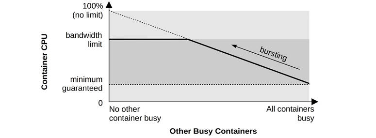
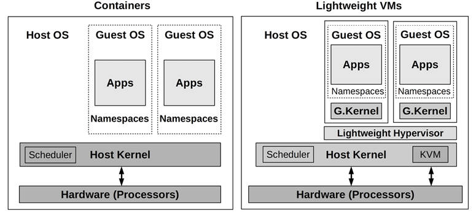

# Chapter 11

## Cloud Computing

The rise of cloud computing solves some old problems in the field of performance while creating new ones. A cloud environment can be created instantly and scaled on demand, without the typical overheads of building and managing an on-premises data center. Clouds also allow better granularity for deployments—fractions of a server can be used by different customers as needed. However, this brings its own challenges: the performance overhead of virtualization technologies, and resource contention with neighboring tenants.

The learning objectives of this chapter are:

- Understand cloud computing architecture and its performance implications.
- Understand the types of virtualization: hardware, OS, and lightweight hardware.
- Become familiar with virtualization internals, including the use of I/O proxies, and tuning techniques.
- Have a working knowledge of the expected overheads for different workloads under each virtualization type.
- Diagnose performance issues from hosts and guests, understanding how tool usage may vary depending on which virtualization is in use.

While this entire book is applicable to cloud performance analysis, this chapter focuses on performance topics unique to the cloud: how hypervisors and virtualization work, how resource controls can be applied to guests, and how observability works from the host and guests. Cloud vendors typically provide their own custom services and APIs, which are not covered here: see the documentation that each cloud vendor provides for their own set of services.

This chapter consists of four main parts:

- **Background** presents general cloud computing architecture and the performance implications thereof.
- **Hardware virtualization**, where a hypervisor manages multiple guest operating system instances as virtual machines, each running its own kernel with virtualized devices. This section uses the Xen, KVM, and Amazon Nitro hypervisors as examples.
- **OS virtualization**, where a single kernel manages the system, creating virtual OS instances that are isolated from each other. This section uses Linux containers as the example.
- **Lightweight hardware virtualization** provides a best-of-both-worlds solution, where lightweight hardware virtualized instances run with dedicated kernels, with boot times and density benefits similar to containers. This section uses AWS Firecracker as the example hypervisor.

The virtualization sections are ordered by when they were made widely available in the cloud. For example, the Amazon Elastic Compute Cloud (EC2) offered hardware virtualized instances in 2006, OS virtualized containers in 2017 (Amazon Fargate), and lightweight virtualized machines in 2019 (Amazon Firecracker).

### 11.1 Background

Cloud computing allows computing resources to be delivered as a service, scaling from small fractions of a server to multi-server systems. The building blocks of your cloud depend on how much of the software stack is installed and configured. This chapter focuses on the following cloud offerings, both of which provide *server instances* that may be:

- **Hardware instances**: Also known as *infrastructure as a service* (IaaS), provided using hardware virtualization. Each server instance is a virtual machine.
- **OS instances**: For providing light-weight instances, typically via OS virtualization.

Together, these may be referred to as *server instances*, *cloud instances*, or just *instances*. Examples of cloud providers that support these are Amazon Web Services (AWS), Microsoft Azure, and Google Cloud Platform (GCP). There are also other types of cloud primitives including functions as a service (FaaS) (see [Section 11.5](ch11.md), [Other Types](ch11.md)).

To summarize key cloud terminology: *cloud computing* describes a dynamic provisioning framework for instances. One or more instances run as *guests* of a physical *host* system. The guests are also called *tenants*, and the term *multitenancy* is used to describe them running on the same host. The host may be managed by cloud providers who operate a *public cloud*, or may be managed by your company for internal use only as part of a *private cloud*. Some companies construct a *hybrid cloud* that spans both public and private clouds.[1](ch11.md) The cloud guests (tenants) are managed by their end users.

[1](ch11.md)Google Anthos, for example, is an application management platform that supports on-premises Google Kubernetes Engine (GKE) with GCP instances, as well as other clouds.

For hardware virtualization, a technology called a *hypervisor* (or *virtual machine monitor*, VMM) creates and manages *virtual machine* instances, which appear as dedicated computers and allow entire operating systems and kernels to be installed.

Instances can typically be created (and destroyed) in minutes or seconds and immediately put into production use. A *cloud API* is commonly provided so that this provisioning can be automated by another program.

Cloud computing can be understood further by discussing various performance-related topics: instance types, architecture, capacity planning, storage, and multitenancy. These are summarized in the following sections.

#### 11.1.1 Instance Types

Cloud providers typically offer different instance types and sizes.

Some instance types are generic and balanced across the resources. Others may be optimized for a certain resource: memory, CPUs, disks, etc. As an example, AWS groups types as “families” (abbreviated by a letter) and generations (a number), currently offering:

- **m5**: General purpose (balanced)
- **c5**: Compute optimized
- **i3, d2**: Storage optimized
- **r4, x1**: Memory optimized
- **p1, g3, f1**: Accelerated computing (GPUs, FPGAs, etc.)

Within each family there are a variety of sizes. The AWS m5 family, for example, ranges from an m5.large (2 vCPUs and 8 Gbytes of main memory) to an m5.24xlarge (twenty-four extra-large: 96 vCPUs and 384 Gbytes of main memory).

There is typically a fairly consistent price/performance ratio across the sizes, allowing customers to pick the size that best suits their workload.

Some providers, such as Google Cloud Platform, also offer custom machine types where the amount of resources can be selected.

With so many options and the ease of redeploying instances, the instance type has become like a tunable parameter that can be modified as needed. This is a great improvement over the traditional enterprise model of selecting and ordering physical hardware that the company might be unable to change for years.

#### 11.1.2 Scalable Architecture

Enterprise environments have historically used a *vertical scalability* approach for handling load: building larger single systems (mainframes). This approach has its limitations. There is a practical limit to the physical size to which a computer can be built (which may be bounded by the size of elevator doors or shipping containers), and there are increasing difficulties with CPU cache coherency as the CPU count scales, as well as power and cooling. The solution to these limitations has been to scale load across many (perhaps small) systems; this is called *horizontal scalability*. In enterprise, it has been used for computer farms and clusters, especially with high-performance computing (HPC, where its use predates the cloud).

Cloud computing is also based on horizontal scalability. An example environment is shown in [Figure 11.1](ch11.md), which includes load balancers, web servers, application servers, and databases.


Figure 11.1 Cloud architecture: horizontal scaling

Each environment layer is composed of one or more server instances running in parallel, with more added to handle load. Instances may be added individually, or the architecture may be divided into vertical partitions, where a group composed of database servers, application servers, and web servers is added as a single unit.[2](ch11.md)

[2](ch11.md)Shopify, for example, calls these units “pods” [\[Denis 18\]](ch11.md).

A challenge of this model is the deployment of traditional databases, where one database instance must be primary. Data for these databases, such as MySQL, can be split logically into groups called *shards*, each of which is managed by its own database (or primary/secondary pair). Distributed database architectures, such as Riak, handle parallel execution dynamically, spreading load over available instances. There are now *cloud-native databases*, designed for use on the cloud, including Cassandra, CockroachDB, Amazon Aurora, and Amazon DynamoDB.

With the per-server instance size typically being small, say, 8 Gbytes (on physical hosts with 512 Gbytes and more of DRAM), fine-grained scaling can be used to attain optimum price/performance, rather than investing up front in huge systems that may remain mostly idle.

#### 11.1.3 Capacity Planning

On-premises servers can be a significant infrastructure cost, both for the hardware and for service contract fees that may go on for years. It can also take months for new servers to be put into production: time spent in approvals, waiting for part availability, shipping, racking, installing, and testing. Capacity planning is critically important, so that appropriately sized systems can be purchased: too small means failure, too large is costly (and, with service contracts, may be costly for years to come). Capacity planning is also needed to predict increases in demand well in advance, so that lengthy purchasing procedures can be completed in time.

On-premises servers, and data centers, were the norm for enterprise environments. Cloud computing is very different. Server instances are inexpensive, and can be created and destroyed almost instantly. Instead of spending time planning what may be needed, companies can increase the number of server instances they use *as needed*, in reaction to real load. This can be done automatically via the cloud API, based on metrics from performance monitoring software. A small business or startup can grow from a single small instance to thousands, without a detailed capacity planning study as would be expected in enterprise environments.[3](ch11.md)

[3](ch11.md)Things may get complex as a company scales to hundreds of thousands of instances, as cloud providers may temporarily run out of available instances of a given type due to demand. If you get to this scale, talk to your account representative about ways to mitigate this (e.g., purchasing reserve capacity).

For growing startups, another factor to consider is the pace of code changes. Sites commonly update their production code weekly, daily, or even multiple times a day. A capacity planning study can take weeks and, because it is based on a snapshot of performance metrics, may be out of date by the time it is completed. This differs from enterprise environments running commercial software, which may change no more than a few times per year.

Activities performed in the cloud for capacity planning include:

- **Dynamic sizing**: Automatically adding and removing server instances
- **Scalability testing**: Purchasing a large cloud environment for a short duration, in order to test scalability versus synthetic load (this is a *benchmarking* activity)

Bearing in mind the time constraints, there is also the potential for modeling scalability (similar to enterprise studies) to estimate how actual scalability falls short of where it theoretically should be.

##### Dynamic Sizing (Auto Scaling)

Cloud vendors typically support deploying groups of server instances that can automatically scale up as load increases (e.g., an AWS *auto scaling group* (ASG)). This also supports a *microservice* architecture, where the application is split into smaller networked parts that can individually scale as needed.

Auto scaling can solve the need to quickly respond to changes in load, but it also risks *overprovisioning*, as pictured in [Figure 11.2](ch11.md). For example, a DoS attack may appear as an increase in load, triggering an expensive increase in server instances. There is a similar risk with application changes that regress performance, requiring more instances to handle the same load. Monitoring is important to verify that these increases make sense.


Figure 11.2 Dynamic sizing

Cloud providers bill by the hour, minute, or even second, allowing users to scale up *and down* quickly. Cost savings can be realized immediately when they downsize. This can be automated so that the instance count matches a daily pattern, only provisioning enough capacity for each minute of the day as needed.[4](ch11.md) Netflix does this for its cloud, adding and removing tens of thousands of instances daily to match its daily streams per second pattern, an example of which is shown in [Figure 11.3](ch11.md) [\[Gregg 14b\]](ch11.md).

[4](ch11.md)Note that automating this can be complicated, for both scale up and scale down. Down scaling may involve waiting not just for requests to finish, but also for long-running batch jobs to finish, and databases to transfer local data.


Figure 11.3 Netflix streams per second

As other examples, in December 2012, Pinterest reported cutting costs from $54/hour to $20/hour by automatically shutting down its cloud systems after hours in response to traffic load [\[Hoff 12\]](ch11.md), and in 2018 Shopify moved to the cloud and saw large infrastructure savings: moving from servers with 61% average idle time to cloud instances with 19% average idle time [\[Kwiatkowski 19\]](ch11.md). Immediate savings can also be a result of performance tuning, where the number of instances required to handle load is reduced.

Some cloud architectures (see [Section 11.3](ch11.md), [OS Virtualization](ch11.md)) can dynamically allocate more CPU resources instantly, if available, using a strategy called *bursting*. This can be provided at no extra cost and is intended to help prevent overprovisioning by providing a buffer during which the increased load can be checked to determine if it is real and likely to continue. If so, more instances can be provisioned so that resources are guaranteed going forward.

Any of these techniques should be considerably more efficient than enterprise environments—especially those with a fixed size chosen to handle expected peak load for the lifetime of the server: such servers may run mostly idle.

#### 11.1.4 Storage

A cloud instance requires storage for the OS, application software, and temporary files. On Linux systems, this is the root and other volumes. This may be served by local physical storage or by network storage. This instance storage is volatile and is destroyed when the instance is destroyed (and are termed *ephemeral drives*). For persistent storage, an independent service is typically used, which provides storage to instances as either a:

- **File store**: For example, files over NFS
- **Block store**: Such as blocks over iSCSI
- **Object store**: Over an API, commonly HTTP-based

These operate over a network, and both the network infrastructure and storage devices are shared with other tenants. For these reasons, performance can be much less predictable than with local disks, although performance consistency can be improved by the use of resource controls by the cloud provider.

Cloud providers typically provide their own services for these. For example, Amazon provides the Amazon Elastic File System (EFS) as a file store, the Amazon Elastic Block Store (EBS) as a block store, and the Amazon Simple Storage Service (S3) as an object store.

Both local and network storage are pictured in [Figure 11.4](ch11.md).


Figure 11.4 Cloud storage

The increased latency for network storage access is typically mitigated by using in-memory caches for frequently accessed data.

Some storage services allow an IOPS rate to be purchased when reliable performance is desired (e.g., Amazon EBS Provisioned IOPS volume).

#### 11.1.5 Multitenancy

Unix is a multitasking operating system, designed to deal with multiple users and processes accessing the same resources. Later additions by Linux have provided resource limits and controls to share these resources more fairly, and observability to identify and quantify when there are performance issues involving resource contention.

Cloud computing differs in that entire operating system instances can coexist on the same physical system. Each guest is its own isolated operating system: guests (typically[5](ch11.md)) cannot observe users and processes from other guests on the same host—that would be considered an information leak—even though they share the same physical resources.

[5](ch11.md) Linux containers can be assembled in different ways from namespaces and cgroups. It should be possible to create containers that share the process namespace with each other, which may be used for an introspection (“sidecar”) container that can debug other container processes. In Kubernetes, the main abstraction is a Pod, which shares a network namespace.

Since resources are shared among tenants, performance issues may be caused by *noisy neighbors*. For example, another guest on the same host might perform a full database dump during your peak load, interfering with your disk and network I/O. Worse, a neighbor could be evaluating the cloud provider by executing micro-benchmarks that deliberately saturate resources in order to find their limit.

There are some solutions to this problem. Multitenancy effects can be controlled by *resource management*: setting operating system *resource controls* that provide *performance isolation* (also called *resource isolation*). This is where per-tenant limits or priorities are imposed for the usage of system resources: CPU, memory, disk or file system I/O, and network throughput.

Apart from limiting resource usage, being able to observe multitenancy contention can help cloud operators tune the limits and better balance tenants on available hosts. The degree of observability depends on the virtualization type.

#### 11.1.6 Orchestration (Kubernetes)

Many companies run their own private clouds using *orchestration software* running on their own bare metal or cloud systems. The most popular such software is Kubernetes (abbreviated as k8s), originally created by Google. Kubernetes, Greek for “Helmsman,” is an open-source system that manages application deployment using containers (commonly Docker containers, though any runtime implementing the Open Container Interface will also work, such as containerd) [\[Kubernetes 20b\]](ch11.md). Public cloud providers have also created Kubernetes services to simplify deployment to those providers, including Google Kubernetes Engine (GKE), Amazon Elastic Kubernetes Service (Amazon EKS), and Microsoft Azure Kubernetes Service (AKS).

Kubernetes deploys containers as co-located groups called *Pods*, where containers can share resources and communicate with each other locally (localhost). Each Pod has its own IP address that can be used to communicate (via networking) with other Pods. A Kubernetes *service* is an abstraction for endpoints provided by a group of Pods with metadata including an IP address, and is a persistent and stable interface to these endpoints, while the Pods themselves may be added and removed, allowing them to be treated as disposable. Kubernetes services support the microservices architecture. Kubernetes includes auto-scaling strategies, such as the “Horizontal Pod Autoscaler” that can scale replicas of a Pod based on a target resource utilization or other metric. In Kubernetes, physical machines are called *Nodes*, and a group of Nodes belong to a Kubernetes *cluster* if they connect to the same Kubernetes API server.

Performance challenges in Kubernetes include scheduling (where to run containers on a cluster to maximize performance), and network performance, as extra components are used to implement container networking and load balancing.

For scheduling, Kubernetes takes into account CPU and memory requests and limits, and metadata such as *node taints* (where Nodes are marked to be excluded from scheduling) and *label selectors* (custom metadata). Kubernetes does not currently limit block I/O (support for this, using the blkio cgroup, may be added in the future [\[Xu 20\]](ch11.md)) making disk contention a possible source of performance issues.

For networking, Kubernetes allows different networking components to be used, and determining which to use is an important activity for ensuring maximum performance. Container networking can be implemented by plugin container network interface (CNI) software; example CNI software includes Calico, based on netfilter or iptables, and Cilium, based on BPF. Both are open source [\[Calico 20\]](ch11.md)[\[Cilium 20b\]](ch11.md). For load balancing, Cilium also provides a BPF replacement for kube-proxy [\[Borkmann 19\]](ch11.md).

### 11.2 Hardware Virtualization

Hardware virtualization creates a virtual machine (VM) that can run an entire operating system, including its own kernel. VMs are created by hypervisors, also called virtual machine managers (VMMs). A common classification of hypervisors identifies them as Type 1 or 2 [\[Goldberg 73\]](ch11.md), which are:

- **Type 1** executes directly on the processors. Hypervisor administration may be performed by a privileged guest that can create and launch new guests. Type 1 is also called *native hypervisor* or *bare-metal hypervisor*. This hypervisor includes its own CPU scheduler for guest VMs. A popular example is the Xen hypervisor.
- **Type 2** is executed within a host OS, which has privileges to administer the hypervisor and launch new guests. For this type, the system boots a conventional OS that then runs the hypervisor. This hypervisor is scheduled by the host kernel CPU scheduler, and guests appear as processes on the host.

Although you may still encounter the terms Type 1 and Type 2, with advances in hypervisor technologies this classification is no longer strictly applicable [\[Liguori, 07\]](ch11.md)—Type 2 has been made Type 1-ish by using kernel modules so that parts of the hypervisor have direct access to hardware. A more practical classification is shown in [Figure 11.5](ch11.md), illustrating two common configurations that I have named Config A and B \[Gregg 19].


Figure 11.5 Common hypervisor configurations

These configurations are:

- **Config A**: Also called a native hypervisor or a bare-metal hypervisor. The hypervisor software runs directly on the processors, creates domains for running guest virtual machines, and schedules virtual guest CPUs onto the real CPUs. A privileged domain (number 0 in [Figure 11.5](ch11.md)) can administer the others. A popular example is the Xen hypervisor.
- **Config B**: The hypervisor software is executed by a host OS kernel, and may be composed of kernel-level modules and user-level processes. The host OS has privileges to administer the hypervisor, and its kernel schedules the VM CPUs along with other processes on the host. By use of kernel modules, this configuration also provides direct access to hardware. A popular example is the KVM hypervisor.

Both configurations may involve running an I/O proxy (e.g., using the QEMU software) in domain 0 (Xen) or the host OS (KVM), for serving guest I/O. This adds overhead to I/O, and over the years has been optimized by adding shared memory transports and other techniques.

The original hardware hypervisor, pioneered by VMware in 1998, used *binary translations* to perform full hardware virtualization [\[VMware 07\]](ch11.md). This involved rewriting privileged instructions such as syscalls and page table operations before execution. Non-privileged instructions could be run directly on the processor. This provided a complete virtual system composed of virtualized hardware components onto which an unmodified operating system could be installed. The high-performance overhead for this was often acceptable for the savings provided by server consolidation.

This has since been improved by:

- **Processor virtualization support**: The AMD-V and Intel VT-x extensions were introduced in 2005–2006 to provide faster hardware support for VM operations by the processor. These extensions improved the speed of virtualizing privileged instructions and the MMU.
- **Paravirtualization** (paravirt or PV): Provides a virtual system that includes an interface for guest operating systems to efficiently use host resources (via *hypercalls*), without needing full virtualization of all components. For example, arming a timer usually involves multiple privileged instructions that must be emulated by the hypervisor. This can be simplified into a single hypercall for use by the paravirtualized guest, for more efficient processing by the hypervisor. For further efficiency, the Xen hypervisor batches these hypercalls into a *multicall*. Paravirtualization may include the use of a paravirtual network device driver by the guest for passing packets more efficiently to the physical network interfaces in the host. While performance is improved, this relies on guest OS support for paravirtualization (which Windows has historically not provided).
- **Device hardware support**: To further optimize VM performance, hardware devices other than processors have been adding virtual machine support. This includes single root I/O virtualization (SR-IOV) for network and storage devices, which allows guest VMs to access hardware directly. This requires driver support (example drivers are ixgbe, ena, hv\_netvsc, and nvme).

Over the years, Xen has evolved and improved its performance. Modern Xen VMs often boot in hardware VM mode (HVM) and then use PV drivers with HVM support for improved performance: a configuration called PVHVM. This can further be improved by depending entirely on hardware virtualization for some drivers, such as SR-IOV for network and storage devices.

#### 11.2.1 Implementation

There are many different implementations of hardware virtualization, and some have already been mentioned (Xen and KVM). Examples are:

- **VMware ESX**: First released in 2001, VMware ESX is an enterprise product for server consolidation and is a key component of the VMware vSphere cloud computing product. Its hypervisor is a microkernel that runs on bare metal, and the first virtual machine is called the *service console*, which can administer the hypervisor and new virtual machines.
- **Xen**: First released in 2003, Xen began as a research project at the University of Cambridge and was later acquired by Citrix. Xen is a Type 1 hypervisor that runs paravirtualized guests for high performance; support was later added for hardware-assisted guests for unmodified OS support (Windows). Virtual machines are called *domains*, with the most privileged being *dom0*, from which the hypervisor is administered and new domains launched. Xen is open source and can be launched from Linux. The Amazon Elastic Compute Cloud (EC2) was previously based on Xen.
- **Hyper-V**: Released with Windows Server 2008, Hyper-V is a Type 1 hypervisor that creates *partitions* for executing guest operating systems. The Microsoft Azure public cloud may be running a customized version of Hyper-V (exact details are not publicly available).
- **KVM**: This was developed by Qumranet, a startup that was bought by Red Hat in 2008. KVM is a Type 2 hypervisor, executing as a kernel module. It supports hardware-assisted extensions and, for high performance, uses paravirtualization for certain devices where supported by the guest OS. To create a complete hardware-assisted virtual machine instance, it is paired with a user process called QEMU (Quick Emulator), a VMM (hypervisor) that can create and manage virtual machines. QEMU was originally a high-quality open-source Type 2 hypervisor that used binary translation, written by Fabrice Bellard. KVM is open source, and is used by Google for the Google Compute Engine [\[Google 20c\]](ch11.md).
- **Nitro**: Launched by AWS in 2017, this hypervisor uses parts based on KVM with hardware support for all main resources: processors, network, storage, interrupts, and timers [\[Gregg 17e\]](ch11.md). No QEMU proxy is used. Nitro provides near bare-metal performance to guest VMs.

The following sections describe performance topics related to hardware virtualization: overhead, resource controls, and observability. These differ based on the implementation and its configuration.

#### 11.2.2 Overhead

Understanding when and when not to expect performance overhead from virtualization is important in investigating cloud performance issues.

Hardware virtualization is accomplished in various ways. Resource access may require proxying and translation by the hypervisor, adding overhead, or it may use hardware-based technologies to avoid these overheads. The following sections summarize the performance overheads for CPU execution, memory mapping, memory size, performing I/O, and contention from other tenants.

##### CPU

In general, the guest applications execute directly on the processors, and CPU-bound applications may experience virtually the same performance as a bare-metal system. CPU overheads may be encountered when making privileged processor calls, accessing hardware, and mapping main memory, depending on how they are handled by the hypervisor. The following describe how CPU instructions are handled by the different hardware virtualization types:

- **Binary translation**: Guest kernel instructions that operate on physical resources are identified and translated. Binary translation was used before hardware-assisted virtualization was available. Without hardware support for virtualization, the scheme used by VMware involved running a virtual machine monitor (VMM) in processor ring 0 and moving the guest kernel to ring 1, which had previously been unused (applications run in ring 3, and most processors provide four rings; protection rings were introduced in [Chapter 3](ch03.md), [Operating Systems](ch03.md), [Section 3.2.2](ch03.md), [Kernel and User Modes](ch03.md)). Because some guest kernel instructions assume they are running in ring 0, in order to execute from ring 1 they need to be translated, calling into the VMM so that virtualization can be applied. This translation is performed during runtime, costing significant CPU overhead.
- **Paravirtualization**: Instructions in the guest OS that must be virtualized are replaced with hypercalls to the hypervisor. Performance can be improved if the guest OS is modified to optimize the hypercalls, making it aware that it is running on virtualized hardware.
- **Hardware-assisted**: Unmodified guest kernel instructions that operate on hardware are handled by the hypervisor, which runs a VMM at a ring level below 0. Instead of translating binary instructions, the guest kernel privileged instructions are forced to trap to the higher-privileged VMM, which can then emulate the privilege to support virtualization [\[Adams 06\]](ch11.md).

Hardware-assisted virtualization is generally preferred, depending on the implementation and workload, while paravirtualization is used to improve the performance of some workloads (especially I/O) if the guest OS supports it.

As an example of implementation differences, VMware’s binary translation model has been heavily optimized over the years, and as they wrote in 2007 \[VMware 07]:

Due to high hypervisor to guest transition overhead and a rigid programming model, VMware’s binary translation approach currently outperforms first generation hardware assist implementations in most circumstances. The rigid programming model in the first generation implementation leaves little room for software flexibility in managing either the frequency or the cost of hypervisor to guest transitions.

The rate of transitions between the guest and hypervisor, as well as the time spent in the hypervisor, can be studied as a metric of CPU overhead. These events are commonly referred to as *guest exits*, as the virtual CPU must stop executing inside the guest when this happens. [Figure 11.6](ch11.md) shows CPU overhead related to guest exits inside KVM.


Figure 11.6 Hardware virtualization CPU overhead

The figure shows the flow of guest exits between the user process, the host kernel, and the guest. The time spent outside of the guest-handling exits is the CPU overhead of hardware virtualization; the more time spent handling exits, the greater the overhead. When the guest exits, a subset of the events can be handled directly in the kernel. Those that cannot must leave the kernel and return to the user process; this induces even greater overhead compared to exits that can be handled by the kernel.

For example, with the Linux KVM implementation, these overheads can be studied via their guest exit functions, which are mapped in the source code as follows (from arch/x86/kvm/vmx/vmx.c in Linux 5.2, truncated):

[Click here to view code image](ch11_images.md)

```
/*
 * The exit handlers return 1 if the exit was handled fully and guest execution
 * may resume.  Otherwise they set the kvm_run parameter to indicate what needs
 * to be done to userspace and return 0.
 */
static int (*kvm_vmx_exit_handlers[])(struct kvm_vcpu *vcpu) = {
        [EXIT_REASON_EXCEPTION_NMI]           = handle_exception,
        [EXIT_REASON_EXTERNAL_INTERRUPT]      = handle_external_interrupt,
        [EXIT_REASON_TRIPLE_FAULT]            = handle_triple_fault,
        [EXIT_REASON_NMI_WINDOW]              = handle_nmi_window,
        [EXIT_REASON_IO_INSTRUCTION]          = handle_io,
        [EXIT_REASON_CR_ACCESS]               = handle_cr,
        [EXIT_REASON_DR_ACCESS]               = handle_dr,
        [EXIT_REASON_CPUID]                   = handle_cpuid,
        [EXIT_REASON_MSR_READ]                = handle_rdmsr,
        [EXIT_REASON_MSR_WRITE]               = handle_wrmsr,
        [EXIT_REASON_PENDING_INTERRUPT]       = handle_interrupt_window,
        [EXIT_REASON_HLT]                     = handle_halt,
        [EXIT_REASON_INVD]                    = handle_invd,
        [EXIT_REASON_INVLPG]                  = handle_invlpg,
        [EXIT_REASON_RDPMC]                   = handle_rdpmc,
        [EXIT_REASON_VMCALL]                  = handle_vmcall,
   [...]
        [EXIT_REASON_XSAVES]                  = handle_xsaves,
        [EXIT_REASON_XRSTORS]                 = handle_xrstors,
        [EXIT_REASON_PML_FULL]                = handle_pml_full,
        [EXIT_REASON_INVPCID]                 = handle_invpcid,
        [EXIT_REASON_VMFUNC]                  = handle_vmx_instruction,
        [EXIT_REASON_PREEMPTION_TIMER]        = handle_preemption_timer,
        [EXIT_REASON_ENCLS]                   = handle_encls,
};
```

While the names are terse, they may provide an idea of the reasons a guest may call into a hypervisor, incurring CPU overhead.

One common guest exit is the `halt` instruction, usually called by the idle thread when the kernel can find no more work to perform (which allows the processor to operate in low-power modes until interrupted). It is handled by the handle\_halt() function (seen in the earlier listing for EXIT\_REASON\_HLT), which ultimately calls kvm\_vcpu\_halt() (arch/x86/kvm/x86.c):

[Click here to view code image](ch11_images.md)

```
int kvm_vcpu_halt(struct kvm_vcpu *vcpu)
{
        ++vcpu->stat.halt_exits;
        if (lapic_in_kernel(vcpu)) {
                vcpu->arch.mp_state = KVM_MP_STATE_HALTED;
                return 1;
        } else {
                vcpu->run->exit_reason = KVM_EXIT_HLT;
                return 0;
        }
}
```

As with many guest exit types, the code is kept small to minimize CPU overhead. This example begins with a vcpu statistic increment, which tracks how many halts occurred. The remaining code performs the hardware emulation required for this privileged instruction. These functions can be instrumented on Linux using kprobes on the hypervisor host, to track their type and the duration of their exits. Exits can also be tracked globally using the kvm:kvm\_exit tracepoint, which is used in [Section 11.2.4](ch11.md), [Observability](ch11.md).

Virtualizing hardware devices such as the interrupt controller and high-resolution timers also incur some CPU (and a small amount of memory) overhead.

##### Memory Mapping

As described in [Chapter 7](ch07.md), [Memory](ch07.md), the operating system works with the MMU to create page mappings from virtual to physical memory, caching them in the TLB to improve performance. For virtualization, mapping a new page of memory (page fault) from the guest to the hardware involves two steps:

1. Virtual-to-guest physical translation, as performed by the guest kernel
2. Guest-physical-to-host-physical (actual) translation, as performed by the hypervisor VMM

The mapping, from guest virtual to host physical, can then be cached in the TLB, so that subsequent accesses can operate at normal speed—not requiring additional translation. Modern processors support MMU virtualization, so that mappings that have left the TLB can be recalled more quickly in hardware alone (page walk), without calling in to the hypervisor. The feature that supports this is called *extended page tables* (EPT) on Intel and *nested page tables* (NPT) on AMD [\[Milewski 11\]](ch11.md).

Without EPT/NPT, another approach to improve performance is to maintain *shadow page tables* of guest-virtual-to-host-physical mappings, which are managed by the hypervisor and then accessed during guest execution by overwriting the guest’s CR3 register. With this strategy, the guest kernel maintains its own page tables, which map from guest virtual to guest physical, as normal. The hypervisor intercepts changes to these page tables and creates equivalent mappings to the host physical pages in the shadow pages. Then, during guest execution, the hypervisor overwrites the CR3 register to point to the shadow pages.

##### Memory Size

Unlike OS virtualization, there are some additional consumers of memory when using hardware virtualization. Each guest runs its own kernel, which consumes a small amount of memory. The storage architecture may also lead to double caching, where both the guest and host cache the same data. KVM-style hypervisors also run a VMM process for each VM, such as QEMU, which itself consumes some main memory.

##### I/O

Historically, I/O was the largest source of overhead for hardware virtualization. This was because every device I/O had to be translated by the hypervisor. For high-frequency I/O, such as 10 Gbit/s networking, a small degree of overhead per I/O (packet) could cause a significant overall reduction in performance. Technologies have been created to mitigate these I/O overheads, culminating with hardware support for eliminating these overheads entirely. Such hardware support includes I/O MMU virtualization (AMD-Vi and Intel VT-d).

One method for improving I/O performance is the use of paravirtualized drivers, which can coalesce I/O and perform fewer device interrupts to reduce the hypervisor overhead.

Another technique is *PCI pass-through*, which assigns a PCI device directly to the guest, so it can be used as it would on a bare-metal system. PCI pass-through can provide the best performance of the available options, but it reduces flexibility when configuring the system with multiple tenants, as some devices are now owned by guests and cannot be shared. This may also complicate live migration [\[Xen 19\]](ch11.md).

There are some technologies to improve the flexibility of using PCI devices with virtualization, including single root I/O virtualization (SR-IOV, mentioned earlier) and multiroot I/O virtualization (MR-IOV). These terms refer to the number of root complex PCI topologies that are exposed, providing hardware virtualization in different ways. The Amazon EC2 cloud has been adopting these technologies to accelerate first networking and then storage I/O, which are in use by default with the Nitro hypervisor \[Gregg 17e].

Common configurations of the Xen, KVM, and Nitro hypervisors are pictured in [Figure 11.7](ch11.md).


Figure 11.7 Xen, KVM, and Nitro I/O path

GK is “guest kernel,” and BE is “back end.” The dotted arrows indicate the *control path*, where components inform each other, either synchronously or asynchronously, that more data is ready to transfer. The *data path* (solid arrows) may be implemented in some cases by shared memory and ring buffers. A control path is not shown for Nitro, as it uses the same data path for direct access to hardware.

There are different ways to configure Xen and KVM, not pictured here. This figure shows them using I/O proxy processes (typically the QEMU software), which are created per guest VM. But they can also be configured to use SR-IOV, allowing guest VMs to access hardware directly (not pictured for Xen or KVM in [Figure 11.7](ch11.md)). Nitro requires such hardware support, eliminating the need for I/O proxies.

Xen improves its I/O performance using a *device channel*—an asynchronous shared memory transport between dom0 and the guest domains (domU). This avoids the CPU and bus overhead of creating an extra copy of I/O data as it is passed between the domains. It may also use separate domains for performing I/O, as described in [Section 11.2.3](ch11.md), [Resource Controls](ch11.md).

The number of steps in the I/O path, both control and data, is critical for performance: the fewer, the better. In 2006, the KVM developers compared a privileged-guest system like Xen with KVM and found that KVM could perform I/O using half as many steps (five versus ten, although the test was performed without paravirtualization so does not reflect most modern configurations) [\[Qumranet 06\]](ch11.md).

As the Nitro hypervisor eliminates extra I/O steps, I would expect all large cloud providers seeking maximum performance to follow suit, using hardware support to eliminate I/O proxies.

##### Multi-Tenant Contention

Depending on the hypervisor configuration and how much CPUs and CPU caches are shared between tenants, there may be CPU stolen time and CPU cache pollution caused by other tenants, reducing performance. This is typically a larger problem with containers than VMs, as containers promote such sharing to support CPU bursting.

Other tenants performing I/O may cause interrupts that interrupt execution, depending on the hypervisor configuration.

Contention for resources can be managed by resource controls.

#### 11.2.3 Resource Controls

As part of the guest configuration, CPU and main memory are typically configured with resource limits. The hypervisor software may also provide resource controls for network and disk I/O.

For KVM-like hypervisors, the host OS ultimately controls the physical resources, and resource controls available from the OS may also be applied to the guests, in addition to the controls the hypervisor provides. For Linux, this means cgroups, tasksets, and other resource controls. See [Section 11.3](ch11.md), [OS Virtualization](ch11.md), for more about the resource controls that may be available from the host OS. The following sections describe resource controls from the Xen and KVM hypervisors, as examples.

##### CPUs

CPU resources are usually allocated to guests as virtual CPUs (vCPUs). These are then scheduled by the hypervisor. The number of vCPUs assigned coarsely limits CPU resource usage.

For Xen, a fine-grained CPU quota for guests can be applied by a hypervisor CPU scheduler. Schedulers include [\[Cherkasova 07\]](ch11.md)[\[Matthews 08\]](ch11.md):

- **Borrowed virtual time (BVT)**: A fair-share scheduler based on the allocation of virtual time, which can be borrowed in advance to provide low-latency execution for real-time and interactive applications
- **Simple earliest deadline first (SEDF)**: A real-time scheduler that allows runtime guarantees to be configured, with the scheduler giving priority to the earliest deadline
- **Credit-based**: Supports priorities (*weights*) and caps for CPU usage, and load balancing across multiple CPUs

For KVM, fine-grained CPU quotas can be applied by the host OS, for example when using the host kernel *fair-share scheduler* described earlier. On Linux, this can be applied using the cgroup CPU bandwidth controls.

There are limitations on how either technology can respect guest *priorities*. A guest’s CPU usage is typically opaque to the hypervisor, and guest kernel thread priorities cannot typically be seen or respected. For example, a low-priority log rotation daemon in one guest may have the same hypervisor priority as a critical application server in another guest.

For Xen, CPU resource usage can be further complicated by high-I/O workloads that consume extra CPU resources in dom0. The back-end driver and I/O proxy in the guest domain alone may consume more than their CPU allocation but are not accounted for [\[Cherkasova 05\]](ch11.md). A solution has been to create isolated driver domains (IDDs), which separate out I/O servicing for security, performance isolation, and accounting. This is pictured in [Figure 11.8](ch11.md).


Figure 11.8 Xen with isolated driver domains

The CPU usage by IDDs can be monitored, and the guests can be charged for this usage. From [\[Gupta 06\]](ch11.md):

Our modified scheduler, SEDF-DC for SEDF-Debt Collector, periodically receives feedback from XenMon about the CPU consumed by IDDs for I/O processing on behalf of guest domains. Using this information, SEDF-DC constrains the CPU allocation to guest domains to meet the specified combined CPU usage limit.

A more recent technique used in Xen is *stub domains*, which run a mini-OS.

##### CPU Caches

Apart from the allocation of vCPUs, CPU cache usage can be controlled using Intel cache allocation technology (CAT). It allows the LLC to be partitioned between guests, and partitions to be shared. While this can prevent a guest polluting another guest’s cache, it can also hurt performance by limiting cache usage.

##### Memory Capacity

Memory limits are imposed as part of the guest configuration, with the guest seeing only the set amount of memory. The guest kernel then performs its own operations (paging, swapping) to remain within its limit.

In an effort to increase flexibility from the static configuration, VMware developed a *balloon driver* [\[Waldspurger 02\]](ch11.md), which is able to reduce the memory consumed by the running guest by “inflating” a balloon module inside it, which consumes guest memory. This memory is then reclaimed by the hypervisor for use by other guests. The balloon can also be deflated, returning memory to the guest kernel for use. During this process, the guest kernel executes its normal memory management routines to free memory (e.g., paging). VMware, Xen, and KVM all have support for balloon drivers.

When balloon drivers are in use (to check from the guest, search for “balloon” in the output of dmesg(1)), I would be on the lookout for performance issues that they may cause.

##### File System Capacity

Guests are provided with virtual disk volumes from the host. For KVM-like hypervisors, these may be software volumes created by the OS and sized accordingly. For example, the ZFS file system can create virtual volumes of a desired size.

##### Device I/O

Resource controls by hardware virtualization software have historically focused on controlling CPU usage, which can indirectly control I/O usage.

Network throughput may be throttled by external dedicated devices or, in the case of KVM-like hypervisors, by host kernel features. For example, Linux has network bandwidth controls from cgroups as well as different qdiscs, which can be applied to guest network interfaces.

Network performance isolation for Xen has been studied, with the following conclusion [\[Adamczyk 12\]](ch11.md):

...when the network virtualization is considered, the weak point of Xen is its lack of proper performance isolation.

The authors of \[Adamczyk 12] also propose a solution for Xen network I/O scheduling, which adds tunable parameters for network I/O priority and rate. If you are using Xen, check whether this or a similar technology has been made available.

For hypervisors with full hardware support (e.g., Nitro), I/O limits may be supported by the hardware, or by external devices. In the Amazon EC2 cloud, network I/O and disk I/O to network-attached devices are throttled to quotas using external systems.

#### 11.2.4 Observability

What is observable on virtualized systems depends on the hypervisor and the location from which the observability tools are launched. In general:

- **From the privileged guest (Xen) or host (KVM)**: All physical resources should be observable using standard OS tools covered in previous chapters. Guest I/O can be observed by analyzing I/O proxies, if in use. Per-guest resource usage statistics should be made available from the hypervisor. Guest internals, including their processes, cannot be observed directly. Some I/O may not be observable if the device uses pass-through or SR-IOV.
- **From the hardware-supported host (Nitro)**: The use of SR-IOV may make device I/O more difficult to observe from the hypervisor as the guest is accessing hardware directly, and not via a proxy or host kernel. (How Amazon actually does hypervisor observability on Nitro is not public knowledge.)
- **From the guests**: Virtualized resources and their usage by the guest can be seen, and physical problems inferred. Since the VM has its own dedicated kernel, kernel internals can be analyzed, and kernel tracing tools, including BPF-based tools, all work.

From the privileged guest or host (Xen or KVM hypervisors), physical resource usage can typically be observed at a high level: utilization, saturation, errors, IOPS, throughput, I/O type. These factors can usually be expressed per guest, so that heavy users can be quickly identified. Details of which guest processes are performing I/O and their application call stacks cannot be observed directly. They can be observed by logging in to the guest (provided that a means to do so is authorized and configured, e.g., SSH) and using the observability tools that the guest OS provides.

When pass-through or SR-IOV is used, the guest may be making I/O calls directly to hardware. This may bypass I/O paths in the hypervisor, and the statistics they typically collect. The result is that I/O can become invisible to the hypervisor, and not appear in iostat(1) or other tools. A possible workaround is to use PMCs to examine I/O-related counters, and infer I/O that way.

To identify the root cause of a guest performance issue, the cloud operator may need to log in to both the hypervisor and the guest and execute observability tools from both. Tracing the path of I/O becomes complex due to the steps involved and may also include analysis of hypervisor internals and an I/O proxy, if used.

From the guest, physical resource usage may not be observable at all. This may tempt the guest customers to blame mysterious performance issues on resource contention caused by noisy neighbors. To give cloud customers peace of mind (and reduce support tickets) information about physical resource usage (redacted) may be provided via other means, including SNMP or a cloud API.

To make container performance easier to observe and understand, there are various monitoring solutions that present graphs, dashboards, and directed graphs to show your container environment. Such software includes Google cAdvisor [\[Google 20d\]](ch11.md) and Cilium Hubble [\[Cilium 19\]](ch11.md) (both are open source).

The following sections demonstrate the raw observability tools that can be used from different locations, and describe a strategy for analyzing performance. Xen and KVM are used to demonstrate the kind of information that virtualization software may provide (Nitro is not included as it is Amazon proprietary).

##### 11.2.4.1 Privileged Guest/Host

All system resources (CPUs, memory, file system, disk, network) should be observable using the tools covered in previous chapters (with the exception of I/O via pass-through/SR-IOV).

###### Xen

For Xen-like hypervisors, the guest vCPUs exist in the hypervisor and are not visible from the privileged guest (dom0) using standard OS tools. For Xen, the xentop(1) tool can be used instead:

[Click here to view code image](ch11_images.md)

```
# xentop
xentop - 02:01:05   Xen 3.3.2-rc1-xvm
2 domains: 1 running, 1 blocked, 0 paused, 0 crashed, 0 dying, 0 shutdown
Mem: 50321636k total, 12498976k used, 37822660k free    CPUs: 16 @ 2394MHz
      NAME  STATE   CPU(sec) CPU(%)     MEM(k) MEM(%)  MAXMEM(k) MAXMEM(%) VCPUS NETS
NETTX(k) NETRX(k) VBDS   VBD_OO   VBD_RD   VBD_WR SSID
  Domain-0 -----r    6087972    2.6    9692160   19.3   no limit       n/a    16    0
0        0    0        0        0        0    0
Doogle_Win --b---     172137    2.0    2105212    4.2    2105344       4.2     1    2
0        0    2        0        0        0    0
[...]
```

The fields include

- **`CPU(%)`** : CPU usage percentage (sum for multiple CPUs)
- **`MEM(k)`** : Main memory usage (Kbytes)
- **`MEM(%)`** : Main memory percentage of system memory
- **`MAXMEM(k)`** : Main memory limit size (Kbytes)
- **`MAXMEM(%)`** : Main memory limit as a percentage of system memory
- **`VCPUS`** : Count of assigned VCPUs
- **`NETS`** : Count of virtualized network interfaces
- **`NETTX(k)`** : Network transmit (Kbytes)
- **`NETRX(k)`** : Network receive (Kbytes)
- **`VBDS`** : Count of virtual block devices
- **`VBD_OO`** : Virtual block device requests blocked and queued (saturation)
- **`VBD_RD`** : Virtual block device read requests
- **`VBD_WR`** : Virtual block device write requests

The xentop(1) output is updated every 3 seconds by default and is selectable using `-d` *delay\_secs*.

For advanced Xen analysis there is the xentrace(8) tool, which can retrieve a log of fixed event types from the hypervisor. This can then be viewed using xenanalyze for investigating scheduling issues with the hypervisor and CPU scheduler used. There is also xenoprof, the system-wide profiler for Xen (MMU and guests) in the Xen source.

###### KVM

For KVM-like hypervisors, the guest instances are visible within the host OS. For example:

[Click here to view code image](ch11_images.md)

```
host$ top
top - 15:27:55 up 26 days, 22:04,  1 user,  load average: 0.26, 0.24, 0.28
Tasks: 499 total,   1 running, 408 sleeping,   2 stopped,   0 zombie
%Cpu(s): 19.9 us,  4.8 sy,  0.0 ni, 74.2 id,  1.1 wa,  0.0 hi,  0.1 si,  0.0 st
KiB Mem : 24422712 total,  6018936 free, 12767036 used,  5636740 buff/cache
KiB Swap: 32460792 total, 31868716 free,   592076 used.  8715220 avail Mem

  PID USER      PR  NI    VIRT    RES    SHR S  %CPU %MEM     TIME+ COMMAND
24881 libvirt+  20   0 6161864 1.051g  19448 S 171.9  4.5   0:25.88 qemu-system-x86

21897 root       0 -20       0      0      0 I   2.3  0.0   0:00.47 kworker/u17:8
23445 root       0 -20       0      0      0 I   2.3  0.0   0:00.24 kworker/u17:7
15476 root       0 -20       0      0      0 I   2.0  0.0   0:01.23 kworker/u17:2
23038 root       0 -20       0      0      0 I   2.0  0.0   0:00.28 kworker/u17:0

22784 root       0 -20       0      0      0 I   1.7  0.0   0:00.36 kworker/u17:1
[...]
```

The `qemu-system-x86` process is a KVM guest, which includes threads for each vCPU and threads for I/O proxies. The total CPU usage for the guest can be seen in the previous top(1) output, and per-vCPU usage can be examined using other tools. For example, using pidstat(1):

[Click here to view code image](ch11_images.md)

```
host$ pidstat -tp 24881 1
03:40:44 PM   UID  TGID   TID  %usr %system %guest %wait   %CPU CPU Command
03:40:45 PM 64055 24881     - 17.00   17.00 147.00  0.00 181.00   0 qemu-system-x86
03:40:45 PM 64055     - 24881  9.00    5.00   0.00  0.00  14.00   0 |__qemu-system-x86
03:40:45 PM 64055     - 24889  0.00    0.00   0.00  0.00   0.00   6 |__qemu-system-x86
03:40:45 PM 64055     - 24897  1.00    3.00  69.00  1.00  73.00   4 |__CPU 0/KVM
03:40:45 PM 64055     - 24899  1.00    4.00  79.00  0.00  84.00   5 |__CPU 1/KVM
03:40:45 PM 64055     - 24901  0.00    0.00   0.00  0.00   0.00   2 |__vnc_worker
03:40:45 PM 64055     - 25811  0.00    0.00   0.00  0.00   0.00   7 |__worker
03:40:45 PM 64055     - 25812  0.00    0.00   0.00  0.00   0.00   6 |__worker
[...]
```

This output shows the CPU threads, named `CPU 0/KVM` and `CPU 1/KVM` consuming 73% and 84% CPU.

Mapping QEMU processes to their guest instance names is usually a matter of examining their process arguments (`ps -wwfp PID`) to read the `-name` option.

Another important area for analysis is guest vCPU exits. The types of exits that occur can show what a guest is doing: whether a given vCPU is idle, performing I/O, or performing compute. On Linux, the perf(1) kvm subcommand provides high-level statistics for KVM exits. For example:

[Click here to view code image](ch11_images.md)

```
host# perf kvm stat live
11:12:07.687968

Analyze events for all VMs, all VCPUs:

           VM-EXIT Samples Samples%   Time%  Min Time    Max Time       Avg time

         MSR_WRITE    1668   68.90%   0.28%    0.67us     31.74us    3.25us ( +-  2.20% )
               HLT     466   19.25%  99.63%    2.61us 100512.98us 4160.68us ( +- 14.77% )
  PREEMPTION_TIMER     112    4.63%   0.03%    2.53us     10.42us    4.71us ( +-  2.68% )
 PENDING_INTERRUPT      82    3.39%   0.01%    0.92us     18.95us    3.44us ( +-  6.23% )
EXTERNAL_INTERRUPT      53    2.19%   0.01%    0.82us      7.46us    3.22us ( +-  6.57% )
    IO_INSTRUCTION      37    1.53%   0.04%    5.36us     84.88us   19.97us ( +- 11.87% )
          MSR_READ       2    0.08%   0.00%    3.33us      4.80us    4.07us ( +- 18.05% )
     EPT_MISCONFIG       1    0.04%   0.00%   19.94us     19.94us   19.94us ( +-  0.00% )

Total Samples:2421, Total events handled time:1946040.48us.
[...]
```

This shows the reasons for virtual machine exit, and statistics for each reason. The longest-duration exits in this example output were for HLT (halt), as virtual CPUs enter the idle state. The columns are:

- **`VM-EXIT`** : Exit type
- **`Samples`** : Number of exits while tracing
- **`Samples%`** : Number of exits as an overall percent
- **`Time%`** : Time spent in exits as an overall percent
- **`Min Time`** : Minimum exit time
- **`Max Time`** : Maximum exit time
- **`Avg time`** : Average exit time

While it may not be easy for an operator to directly see inside a guest virtual machine, examining the exits lets you characterize how the overhead of hardware virtualization may or may not be affecting a tenant. If you see a low number of exits and a high percentage of those are `HLT`, you know that the guest CPU is fairly idle. On the other hand, if you have a high number of I/O operations, with interrupts both generated and injected into the guest, then it is very likely that the guest is doing I/O over its virtual NICs and disks.

For advanced KVM analysis, there are many tracepoints:

[Click here to view code image](ch11_images.md)

```
host# perf list | grep kvm
  kvm:kvm_ack_irq                                    [Tracepoint event]
  kvm:kvm_age_page                                   [Tracepoint event]
  kvm:kvm_apic                                       [Tracepoint event]
  kvm:kvm_apic_accept_irq                            [Tracepoint event]
  kvm:kvm_apic_ipi                                   [Tracepoint event]
  kvm:kvm_async_pf_completed                         [Tracepoint event]
  kvm:kvm_async_pf_doublefault                       [Tracepoint event]
  kvm:kvm_async_pf_not_present                       [Tracepoint event]
  kvm:kvm_async_pf_ready                             [Tracepoint event]
  kvm:kvm_avic_incomplete_ipi                        [Tracepoint event]
  kvm:kvm_avic_unaccelerated_access                  [Tracepoint event]
  kvm:kvm_cpuid                                      [Tracepoint event]
  kvm:kvm_cr                                         [Tracepoint event]
  kvm:kvm_emulate_insn                               [Tracepoint event]
  kvm:kvm_enter_smm                                  [Tracepoint event]
  kvm:kvm_entry                                      [Tracepoint event]
  kvm:kvm_eoi                                        [Tracepoint event]
  kvm:kvm_exit                                       [Tracepoint event]
[...]
```

Of particular interest are kvm:kvm\_exit (mentioned earlier) and kvm:kvm\_entry. Listing kvm:kvm\_exit arguments using bpftrace:

[Click here to view code image](ch11_images.md)

```
host# bpftrace -lv t:kvm:kvm_exit
tracepoint:kvm:kvm_exit
    unsigned int exit_reason;
    unsigned long guest_rip;
    u32 isa;
    u64 info1;
    u64 info2;
```

This provides the exit reason (exit\_reason), guest return instruction pointer (guest\_rip), and other details. Along with kvm:kvm\_entry, which shows when the KVM guest was entered (or put differently, when the exit completed), the duration of the exit can be measured along with its exit reason. In *BPF Performance Tools* [\[Gregg 19\]](ch11.md) I published kvmexits.bt, a bpftrace tool for showing exit reasons as a histogram (it is also open source and online [\[Gregg 19e\]](ch11.md)). Sample output:

[Click here to view code image](ch11_images.md)

```
host# kvmexits.bt
Attaching 4 probes...
Tracing KVM exits. Ctrl-C to end
^C
[...]

@exit_ns[30, IO_INSTRUCTION]:
[1K, 2K)               1 |                                                    |
[2K, 4K)              12 |@@@                                                 |
[4K, 8K)              71 |@@@@@@@@@@@@@@@@@@                                  |
[8K, 16K)            198 |@@@@@@@@@@@@@@@@@@@@@@@@@@@@@@@@@@@@@@@@@@@@@@@@@@@@|
[16K, 32K)           129 |@@@@@@@@@@@@@@@@@@@@@@@@@@@@@@@@@                   |
[32K, 64K)            94 |@@@@@@@@@@@@@@@@@@@@@@@@                            |
[64K, 128K)           37 |@@@@@@@@@                                           |
[128K, 256K)          12 |@@@                                                 |
[256K, 512K)          23 |@@@@@@                                              |
[512K, 1M)             2 |                                                    |
[1M, 2M)               0 |                                                    |
[2M, 4M)               1 |                                                    |
[4M, 8M)               2 |                                                    |

@exit_ns[48, EPT_VIOLATION]:
[512, 1K)           6160 |@@@@@@@@@@@@@@@@@@@@@@@@@@@@@@@@@@@@@@@@@           |
[1K, 2K)            6885 |@@@@@@@@@@@@@@@@@@@@@@@@@@@@@@@@@@@@@@@@@@@@@@      |
[2K, 4K)            7686 |@@@@@@@@@@@@@@@@@@@@@@@@@@@@@@@@@@@@@@@@@@@@@@@@@@@@|
[4K, 8K)            2220 |@@@@@@@@@@@@@@@                                     |
[8K, 16K)            582 |@@@                                                 |
[16K, 32K)           244 |@                                                   |
[32K, 64K)            47 |                                                    |
[64K, 128K)            3 |                                                    |
```

The output includes histograms for each exit: only two are included here. This shows IO\_INSTRUCTION exits are typically taking less than 512 microseconds, with a few outliers reaching the 2 to 8 millisecond range.

Another example of advanced analysis is profiling the contents of the CR3 register. Every process in the guest has its own address space and set of page tables describing the virtual-to-physical memory translations. The root of this page table is stored in the register CR3. By sampling the CR3 register from the host (e.g., using bpftrace) you may identify whether a single process is active in the guest (same CR3 value) or if it is switching between processes (different CR3 values).

For more information, you must log in to the guest.

##### 11.2.4.2 Guest

From a hardware virtualized guest, only the virtual devices can be seen (unless pass-through/SR-IOV is used). This includes CPUs, which shows the vCPUs allocated to the guest. For example, examining CPUs from a KVM guest using mpstat(1):

[Click here to view code image](ch11_images.md)

```
kvm-guest$ mpstat -P ALL 1
Linux 4.15.0-91-generic (ubuntu0)    03/22/2020        _x86_64_  (2 CPU)

10:51:34 PM CPU   %usr %nice   %sys %iowait  %irq %soft %steal %guest %gnice  %idle
10:51:35 PM all  14.95  0.00  35.57    0.00  0.00  0.00   0.00   0.00   0.00  49.48
10:51:35 PM   0  11.34  0.00  28.87    0.00  0.00  0.00   0.00   0.00   0.00  59.79
10:51:35 PM   1  17.71  0.00  42.71    0.00  0.00  0.00   0.00   0.00   0.00  39.58
10:51:35 PM CPU   %usr %nice   %sys %iowait  %irq %soft %steal %guest %gnice  %idle
10:51:36 PM all  11.56  0.00  37.19    0.00  0.00  0.00   0.50   0.00   0.00  50.75
10:51:36 PM   0   8.05  0.00  22.99    0.00  0.00  0.00   0.00   0.00   0.00  68.97
10:51:36 PM   1  15.04  0.00  48.67    0.00  0.00  0.00   0.00   0.00   0.00  36.28
[...]
```

The output shows the status of the two guest CPUs only.

The Linux vmstat(8) command includes a column for CPU percent stolen (`st`), which is a rare example of a virtualization-aware statistic. Stolen shows CPU time not available to the guest: it may be consumed by other tenants or other hypervisor functions (such as processing your own I/O, or throttling due to the instance type):

[Click here to view code image](ch11_images.md)

```
xen-guest$ vmstat 1
procs -----------memory---------- ---swap-- -----io---- --system-- -----cpu-----
 r  b   swpd   free   buff  cache   si   so    bi    bo   in   cs us sy id wa st
 1  0      0 107500 141348 301680    0    0     0     0 1006    9 99  0  0  0  1
 1  0      0 107500 141348 301680    0    0     0     0 1006   11 97  0  0  0  3
 1  0      0 107500 141348 301680    0    0     0     0  978    9 95  0  0  0  5
 3  0      0 107500 141348 301680    0    0     0     4  912   15 99  0  0  0  1
 2  0      0 107500 141348 301680    0    0     0     0   33    7  3  0  0  0 97
 3  0      0 107500 141348 301680    0    0     0     0   34    6 100  0  0  0 0
 5  0      0 107500 141348 301680    0    0     0     0   35    7  1  0  0  0 99
 2  0      0 107500 141348 301680    0    0     0    48   38   16  2  0  0  0 98
[...]
```

In this example, a Xen guest with an aggressive CPU limiting policy was tested. For the first 4 seconds, over 90% of CPU time was in user mode of the guest, with a few percent stolen. This behavior then begins to change aggressively, with most of the CPU time stolen.

Understanding CPU usage at the cycle level often requires the use of hardware counters (see [Chapter 4](ch04.md), [Observability Tools](ch04.md), [Section 4.3.9](ch04.md), [Hardware Counters (PMCs)](ch04.md)). These may or may not be available to the guest, depending on the hypervisor configuration. Xen, for example, has a virtual performance monitoring unit (vpmu) to support PMC usage by the guests, and tuning to specify which PMCs to allow [\[Gregg 17f\]](ch11.md).

Since disk and network devices are virtualized, an important metric to analyze is *latency*, showing how the device is responding given virtualization, limits, and other tenants. Metrics such as percent busy are difficult to interpret without knowing what the underlying device is.

Device latency in detail can be studied using kernel tracing tools, including perf(1), Ftrace, and BPF ([Chapters 13](ch13.md), [14](ch14.md), and [15](ch15.md)). Fortunately, these all should work in the guests since they run dedicated kernels, and the root user has full kernel access. For example, running the BPF-based biosnoop(8) in a KVM guest:

[Click here to view code image](ch11_images.md)

```
kvm-guest# biosnoop
TIME(s)        COMM           PID    DISK    T  SECTOR    BYTES   LAT(ms)
0.000000000    systemd-journa 389    vda     W  13103112  4096       3.41
0.001647000    jbd2/vda2-8    319    vda     W  8700872   360448     0.77
0.011814000    jbd2/vda2-8    319    vda     W  8701576   4096       0.20
1.711989000    jbd2/vda2-8    319    vda     W  8701584   20480      0.72
1.718005000    jbd2/vda2-8    319    vda     W  8701624   4096       0.67
[...]
```

The output shows the virtual disk device latency. Note that with containers ([Section 11.3](ch11.md), [OS Virtualization](ch11.md)) these kernel tracing tools may not work, so the end user may not be able to examine device I/O and various other targets in detail.

##### 11.2.4.3 Strategy

Previous chapters have covered analysis techniques for the physical system resources, which can be followed by the administrators of the physical systems to look for bottlenecks and errors. Resource controls imposed on the guests can also be checked, to see if guests are consistently at their limit and should be informed and encouraged to upgrade. Not much more can be identified by the administrators without logging in to the guests, which may be necessary for any serious performance investigation.[6](ch11.md)

[6](ch11.md)A reviewer pointed out another possible technique (note that this is not a recommendation): a snapshot of the guest’s storage (provided it isn’t encrypted) could be analyzed. For example, given a log of prior disk I/O addresses, a snapshot of file system state can be used to determine which files may have been accessed.

For the guests, the tools and strategies for analyzing resources covered in previous chapters can be applied, bearing in mind that the resources in this case are typically virtual. Some resources may not be driven to their limits, due to unseen resource controls by the hypervisor or contention from other tenants. Ideally, the cloud software or vendor provides a means for customers to check redacted physical resource usage, so that they can investigate performance issues further on their own. If not, contention and limits may be deduced from increases in I/O and CPU scheduling latency. Such latency can be measured either at the syscall layer or in the guest kernel.

A strategy I use to identify disk and network resource contention from the guest is careful analysis of I/O patterns. This can involve logging the output of biosnoop(8) (see the prior example) and then examining the sequence of I/O to see if any latency outliers are present, and if they are caused by either their size (large I/O is slower), their access pattern (e.g., reads queueing behind a write flush), or neither, in which case it is likely a physical contention or device issue.

### 11.3 OS Virtualization

OS virtualization partitions the operating system into instances that Linux calls *containers*, which act like separate guest servers and can be administrated and rebooted independently of the host. These provide small, efficient, fast-booting instances for cloud customers, and high-density servers for cloud operators. OS-virtualized guests are pictured in [Figure 11.9](ch11.md).


Figure 11.9 Operating system virtualization

This approach has origins in the Unix chroot(8) command, which isolates a process to a subtree of the Unix global file system (it changes the top-level directory, “/” as seen by the process, to point to somewhere else). In 1998, FreeBSD developed this further as *FreeBSD jails*, providing secure compartments that act as their own servers. In 2005, Solaris 10 included a version called *Solaris Zones*, with various resource controls. Meanwhile Linux had been adding process isolation capabilities in parts, with *namespaces* first added in 2002 for Linux 2.4.19, and *control groups* (cgroups) first added in 2008 for Linux 2.6.24 [\[Corbet 07a\]](ch11.md)[\[Corbet 07b\]](ch11.md)[\[Linux 20m\]](ch11.md). Namespaces and cgroups are combined to create containers, which typically use seccomp-bpf as well to control syscall access.

A key difference from hardware virtualization technologies is that only one kernel is running. The following are the performance advantages of containers over hardware VMs ([Section 11.2](ch11.md), [Hardware Virtualization](ch11.md)):

- Fast initialization time: typically measured in milliseconds.
- Guests can use memory entirely for applications (no extra kernel).
- There is a unified file system cache—this can avoid double-caching scenarios between the host and guest.
- More fine-grained control of resource sharing (cgroups).
- For the host operators: improved performance observability, as guest processes are directly visible along with their interactions.
- Containers may be able to share memory pages for common files, freeing space in the page cache and improving the CPU cache hit ratio.
- CPUs are real CPUs; assumptions by adaptive mutex locks remain valid.

And there are disadvantages:

- Increased contention for kernel resources (locks, caches, buffers, queues).
- For the guests: reduced performance observability, as the kernel typically cannot be analyzed.
- Any kernel panic affects all guests.
- Guests cannot run custom kernel modules.
- Guests cannot run longer-run PGO kernels (see [Section 3.5.1](ch03.md), [PGO Kernels](ch03.md)).
- Guests cannot run different kernel versions or kernels.[7](ch11.md)

[7](ch11.md) There are technologies that emulate a different syscall interface so that a different OS can run under a kernel, but this has performance implications in practice. For example, such emulations typically only offer a basic set of syscall features, where advanced performance features return ENOTSUP (error not supported).

Consider the first two disadvantages together: A guest moving from a VM to a container will more likely encounter kernel contention issues, while also losing the ability to analyze them. They will become more dependent on the host operator for this kind of analysis.

A non-performance disadvantage for containers is that they are considered less secure because they share a kernel.

All of these disadvantages are solved by lightweight virtualization, covered in [Section 11.4](ch11.md), [Lightweight Virtualization](ch11.md), although at the cost of some advantages.

The following sections describe Linux OS virtualization specifics: implementation, overhead, resource controls, and observability.

#### 11.3.1 Implementation

In the Linux kernel there is no notion of a container. There are, however, namespaces and cgroups, which user-space software (for example, Docker) uses to create what it calls *containers*.[8](ch11.md) A typical container configuration is pictured in [Figure 11.10](ch11.md).

[8](ch11.md) The kernel does use a struct nsproxy to link to the namespaces for a process. Since this struct defines how a process is contained, it can be considered the best notion the kernel has of a container.


Figure 11.10 Linux containers

Despite each container having a process with ID 1 within the container, these are different processes as they belong to different namespaces.

Because many container deployments use Kubernetes, its architecture is pictured in [Figure 11.11](ch11.md). Kubernetes was introduced in [Section 11.1.6](ch11.md), [Orchestration (Kubernetes)](ch11.md).


Figure 11.11 Kubernetes node

[Figure 11.11](ch11.md) also shows the network path between Pods via Kube Proxy, and container networking configured by a CNI.

An advantage of Kubernetes is that multiple containers can easily be created to share the same namespaces, as part of a Pod. This allows faster communication methods between the containers.

##### Namespaces

A namespace filters the view of the system so that containers can only see and administer their own processes, mount points, and other resources. This is the primary mechanism that provides isolation of a container from other containers on the system. Selected namespaces are listed in [Table 11.1](ch11.md)

Table 11.1 **Selected Linux namespaces**

**Namespace**

**Description**

cgroup

For cgroup visibility

ipc

For interprocess communication visibility

mnt

For file system mounts

net

For network stack isolation; filters the interfaces, sockets, routes, etc., that are seen

pid

For process visibility; filters /proc

time

For separate system clocks per container

user

For user IDs

uts

For host information; the uname(2) syscall

The current namespaces on a system can be listed with lsns(8):

[Click here to view code image](ch11_images.md)

```
# lsns
        NS TYPE   NPROCS   PID USER             COMMAND
4026531835 cgroup    105     1 root             /sbin/init
4026531836 pid       105     1 root             /sbin/init
4026531837 user      105     1 root             /sbin/init
4026531838 uts       102     1 root             /sbin/init
4026531839 ipc       105     1 root             /sbin/init
4026531840 mnt        98     1 root             /sbin/init
4026531860 mnt         1    19 root             kdevtmpfs
4026531992 net       105     1 root             /sbin/init
4026532166 mnt         1   241 root             /lib/systemd/systemd-udevd
4026532167 uts         1   241 root             /lib/systemd/systemd-udevd
[...]
```

This lsns(8) output shows the init process has six different namespaces, in use by over 100 processes.

There is some documentation for namespaces in the Linux source, as well as in man pages, starting with namespaces(7).

##### Control Groups

Control groups (cgroups) limit the usage of resources. There are two versions of cgroups in the Linux kernel, v1 and v2[9](ch11.md); many projects such as Kubernetes are still using v1 (v2 is in the works). The v1 cgroups include those listed in [Table 11.2](ch11.md).

[9](ch11.md)There are also mixed-mode configurations that use parts of both v1 and v2 in parallel.

Table 11.2 **Selected Linux cgroups**

**cgroup**

**Description**

blkio

Limits block I/O (disk I/O): bytes and IOPS

cpu

Limits CPU usage based on shares

cpuacct

Accounting for CPU usage for process groups

cpuset

Assigns CPU and memory nodes to containers

devices

Controls device administration

hugetlb

Limits huge pages usage

memory

Limits process memory, kernel memory, and swap usage

net\_cls

Sets classids on packets for use by qdiscs and firewalls

net\_prio

Sets network interface priorities

perf\_event

Allows perf to monitor processes in a cgroup

pids

Limits the number of processes that can be created

rdma

Limits RDMA and InfiniBand resource usage

These cgroups can be configured to limit resource contention between containers, for example by putting a hard limit on CPU and memory usage, or softer limits (share-based) for CPU and disk usage. There can also be a hierarchy of cgroups, including system cgroups that are shared between the containers, as pictured in [Figure 11.10](ch11.md).

cgroups v2 is hierarchy-based and solves various shortcomings of v1. It is expected that container technologies will migrate to v2 in the coming years, with v1 eventually being deprecated. The Fedora 31 OS, released in 2019, has already switched to cgroups v2.

There is some documentation for namespaces in the Linux source under Documentation/cgroup-v1 and Documentation/admin-guide/cgroup-v2.rst, as well as in the cgroups(7) man page.

The following sections describe container virtualization topics: overhead, resource controls, and observability. These differ based on the specific container implementation and its configuration.

#### 11.3.2 Overhead

The overhead of container execution should be lightweight: application CPU and memory usage should experience bare-metal performance, though there may be some extra calls within the kernel for I/O due to layers in the file system and network path. The biggest performance problems are caused by multitenancy contention, as containers promote heavier sharing of kernel and physical resources. The following sections summarize the performance overheads for CPU execution, memory usage, performing I/O, and contention from other tenants.

##### CPU

When a container thread is running in user mode, there are no direct CPU overheads: threads run on-CPU directly until they either yield or are preempted. On Linux, there are also no extra CPU overheads for running processes in namespaces and cgroups: all processes already run in a default namespace and cgroups set, whether containers are in use or not.

CPU performance is most likely degraded due to contention with other tenants (see the later section, Multi-Tenant Contention).

With orchestrators such as Kubernetes, additional network components can add some CPU overheads for handling network packets (e.g., with many services (thousands); kube-proxy encounters first-packet overheads when having to process large iptables rule sets due to a high number of Kubernetes services used. This overhead can be overcome by replacing kube-proxy with BPF instead \[Borkmann 20]).

##### Memory Mapping

Memory mapping, loads, and stores should execute without overhead.

##### Memory Size

Applications can make use of the entire amount of allocated memory for the container. Compare this to hardware VMs, which run a kernel per tenant, each kernel costing a small amount of main memory.

A common container configuration (the use of OverlayFS) allows sharing the page cache between containers that are accessing the same file. This can free up some memory compared to VMs, which duplicate common files (e.g., system libraries) in memory.

##### I/O

The I/O overhead depends on the container configuration, as it may include extra layers for isolation for:

- **file system I/O**: E.g., overlayfs
- **network I/O**: E.g., bridge networking

The following is a kernel stack trace showing a container file system write that was handled by overlayfs (and backed by the XFS file system):

[Click here to view code image](ch11_images.md)

```
    blk_mq_make_request+1
    generic_make_request+420
    submit_bio+108
    _xfs_buf_ioapply+798
    __xfs_buf_submit+226
    xlog_bdstrat+48
    xlog_sync+703
    __xfs_log_force_lsn+469
    xfs_log_force_lsn+143
    xfs_file_fsync+244
    xfs_file_buffered_aio_write+629
    do_iter_readv_writev+316
    do_iter_write+128
    ovl_write_iter+376
    __vfs_write+274
    vfs_write+173
    ksys_write+90
    do_syscall_64+85
    entry_SYSCALL_64_after_hwframe+68
```

Overlayfs can be seen in the stack as the ovl\_write\_iter() function.

How much this matters is dependent on the workload and its rate of IOPS. For low-IOPS servers (say, &lt;1000 IOPS) it should cost negligible overhead.

##### Multi-Tenant Contention

The presence of other running tenants is likely to cause resource contention and interrupts that hurt performance, including:

- CPU caches may have a lower hit ratio, as other tenants are consuming and evicting entries. For some processors and kernel configurations, context switching to other container threads may even flush the L1 cache.[10](ch11.md)
  
  [10](ch11.md)For example, in June 2020, Linus Torvalds rejected a kernel patch that allowed processes to opt in to L1 data cache flushing [\[Torvalds 20b\]](ch11.md). The patch was a security precaution for cloud environments, but was rejected due to concerns over the performance cost in cases where it was unnecessary. While not included in Linux mainline, I would not be surprised if this patch was running in some Linux distributions in the cloud.
- TLB caches may also have a lower hit ratio due to other tenant usage, and also flushing on context switches (which may be avoided if PCID is in use).
- CPU execution may be interrupted for short periods for other tenant devices (e.g., network I/O) performing interrupt service routines.
- Kernel execution can encounter additional contention for buffers, caches, queues, and locks, because a multi-tenant container system can increase their load by an order of magnitude or more. Such contention can slightly degrade application performance, depending on the kernel resource and its scalability characteristics.
- Network I/O can encounter CPU overhead due to the use of iptables to implement container networking.
- There may be contention for system resources (CPUs, disks, network interfaces) from other tenants who are using them.

A post by Gianluca Borello describes how a container’s performance was found to slowly and steadily deteriorate over time when certain other containers were on the system [\[Borello 17\]](ch11.md). He tracked it down to find that lstat(2) latency was higher, caused by the other container’s workload and its effect on the dcache.

Another issue, reported by Maxim Leonovich, showed how moving from single-tenant VMs to multi-tenant containers increased the rate of posix\_fadvise() calls for the kernel, creating a bottleneck [\[Leonovich 18\]](ch11.md).

The last item on the list is managed by resource controls. While some of these factors exist in a traditional multi-user environment, they are much more prevalent in a multi-tenant container system.

#### 11.3.3 Resource Controls

Resource controls throttle access to resources so they can be shared more fairly. On Linux, these are mostly provided via cgroups.

Individual resource controls can be classified as *priorities* or *limits*. Priorities steer resource consumption to balance usage between neighbors based on an importance value. Limits are a ceiling value of resource consumption. Either is used as appropriate—for some resources, that means both. Examples are listed in [Table 11.3](ch11.md).

Table 11.3 **Linux container resource controls**

**Resource**

**Priority**

**Limit**

CPU

CFS shares

cpusets (whole CPUs),

CFS bandwidth (fractional CPUs)

Memory capacity

Memory soft limits

Memory limits

Swap capacity

\-

Swap limits

File system capacity

\-

File system quotas/limits

File system cache

\-

Kernel memory limits

Disk I/O

blkio weights

blkio IOPS limits

blkio throughput limits

Network I/O

net\_prio priorities

qdiscs (fq, etc.)

Custom BPF

qdiscs (fq, etc.)

Custom BPF

These are described in the following sections in general terms, based on cgroup v1. The steps to configure these depend on the container platform you are using (Docker, Kubernetes, etc.); see their associated documentation.

##### CPUs

CPUs can be allocated across containers using the cpusets cgroup, and shares and bandwidth from the CFS scheduler.

###### cpusets

The cpusets cgroup allows whole CPUs to be allocated to specific containers. The benefit is that those containers can run on CPU without interruption by others, and that the CPU capacity available to them is consistent. The downside is that idle CPU capacity is unavailable to other containers to use.

###### Shares and Bandwidth

CPU *shares*, provided by the CFS scheduler, is a different approach for CPU allocation that allows containers to share their idle CPU capacity. Shares support the concept of *bursting*, where a container can effectively run faster by using idle CPU from other containers. When there isn’t idle capacity, including when a host has been overprovisioned, shares provide a best-effort division of CPU resources among the containers that need them.

CPU shares work by assigning allocation units called shares to containers, which are used to calculate the amount of CPU a busy container will get at a given time. This calculation uses the formula:

container CPU = (all CPUs × container shares) / total busy shares on system

Consider a system that has allocated 100 shares between several containers. At one moment, only containers A and B want CPU resources. Container A has 10 shares, and container B has 30 shares. Container A can therefore use 25% of the total CPU resources on the system: all CPUs × 10/(10 + 30).

Now consider a system where all containers are busy at the same time. A given container’s CPU allocation will be:

container CPU = all CPUs × container shares / total shares on system

For the scenario described, container A would get 10% of the CPU capacity (CPUs × 10/100). The share allocation provides a minimum guarantee of CPU usage. Bursting may allow the container to use more. Container A can use anything from 10% to 100% of the CPU capacity, depending on how many other containers are busy.

A problem with shares is that bursting can confuse capacity planning, especially since many monitoring systems do not show bursting statistics (they should). An end user testing a container may be satisfied with its performance, unaware that this performance is only made possible by bursting. Later on, when other tenants move in, their container can no longer burst and will suffer lower performance. Imagine container A initially testing on an idle system and getting 100% CPU, but later on only getting 10% as other containers have since been added. I’ve seen this scenario happen in real life on numerous occasions, where the end user thinks that there must be a system performance issue and asks me to help debug it. They are then disappointed to learn that the system is working as intended, and that ten-times slower is the new norm because other containers have moved in. To the customer, this can feel like bait and switch.

It’s possible to reduce the problem of excessive bursting by limiting it so that the performance drop is not as severe (even though this also limits performance). On Linux this is accomplished using CFS *bandwidth* controls, which can set an upper limit for CPU usage. For example, container A could have bandwidth set at 20% of system-wide CPU capacity, such that with shares it now operates in the range of 10 to 20%, depending on idle availability. This range from a share-based minimum CPU to the bandwidth maximum is pictured in [Figure 11.12](ch11.md). It assumes that there are sufficient busy threads in each container to use the available CPUs (otherwise containers become CPU-limited due to their own workloads, before hitting system-imposed limits).



Figure 11.12 CPU shares and bandwidth

Bandwidth controls are typically exposed as a percentage of whole CPUs: 2.5 would mean two and a half CPUs. This maps to the kernel settings, which are actually *periods* and *quotas* in microseconds: a container gets a quota of CPU microseconds every period.

A different way to manage bursting is for container operators to notify their end users when they are bursting for some period of time (e.g., days) so that they do not develop wrong expectations about performance. End users can then be encouraged to upgrade their container size so that they get more shares, and a higher minimum guarantee of CPU allocation.

##### CPU Caches

CPU cache usage can be controlled using Intel cache allocation technology (CAT) to avoid a container polluting the CPU caches. This was described in [Section 11.2.3](ch11.md), [Resource Controls](ch11.md), and has the same caveat: limiting cache access also hurts performance.

##### Memory Capacity

The memory cgroup provides four mechanisms to manage memory usage. [Table 11.4](ch11.md) describes them via their memory cgroup setting name.

Table 11.4 **Linux memory cgroup settings**

**Name**

**Description**

memory.limit\_in\_bytes

A size limit, in bytes. If a container tries to use more than the allocated size, it encounters swapping (if configured) or the OOM killer.

memory.soft\_limit\_in\_bytes

A size limit, in bytes. A best-effort approach that involves reclaiming memory to steer containers towards their soft limit.

memory.kmem.limit\_in\_bytes

A size limit for kernel memory, in bytes.

memory.kmem.tcp.limit\_in\_bytes

A size limit for TCP buffer memory, in bytes.

memory.pressure\_level

A low memory notifier that can be used via the eventfd(2) system call. This requires application support to configure the pressure level and use the system call.

There are also notification mechanisms so that applications can take action when memory is running low: memory.pressure\_level and memory.oom\_control. These require configuring notifications via the eventfd(2) system call.

Note that a container’s unused memory can be used by other containers in the kernel page cache, improving their performance (a memory form of bursting).

##### Swap Capacity

The memory cgroup also allows a swap limit to be configured. The actual setting is memory.memsw.limit\_in\_bytes, which is memory plus swap.

##### File System Capacity

File system capacity can usually be limited by the file system. For example, the XFS file system supports both soft and hard quotas for users, groups, and projects, where soft limits allow some temporary excess usage under the hard limit. ZFS and btrfs also have quotas.

##### File System Cache

In Linux, memory used by the file system page cache for a container is accounted to the container in the memory cgroup: no additional setting is required. If the container configures swap, the degree between favoring swapping over page cache eviction can be controlled by the memory.swappiness setting, similar to the system-wide vm.swappinness ([Chapter 7](ch07.md), [Memory](ch07.md), [Section 7.6.1](ch07.md), [Tunable Parameters](ch07.md)).

##### Disk I/O

The blkio cgroup provides mechanisms to manage disk I/O. [Table 11.5](ch11.md) describes them via their blkio cgroup setting name.

Table 11.5 **Linux blkio cgroup settings**

**Name**

**Description**

blkio.weight

A cgroup weight that controls the share of disk resources during load, similar to CPU shares. It is used with the BFQ I/O scheduler.

blkio.weight\_device

A weight setting for a specific device.

blkio.throttle.read\_bps\_device

A limit for read bytes/s.

blkio.throttle.write\_bps\_device

A limit for write bytes/s.

blkio.throttle.read\_iops\_device

A limit for read IOPS.

blkio.throttle.write\_iops\_device

A limit for write IOPS.

As with CPU shares and bandwidths, the blkio weights and throttle settings allow disk I/O resources to be shared based on a policy of priorities and limits.

##### Network I/O

The net\_prio cgroup allows priorities to be set for outbound network traffic. These are the same as the SO\_PRIORITY socket option (see socket(7)), and control the priority of packet processing in the network stack. The net\_cls cgroup can tag packets with a class ID for later management by qdiscs. (This also works for Kubernetes Pods, which can use a net\_cls per Pod.)

Queueing disciplines (qdiscs, see [Chapter 10](ch10.md), [Network](ch10.md), [Section 10.4.3](ch10.md), [Software](ch10.md)) can operate on class IDs or be assigned to container virtual network interfaces to prioritize and throttle network traffic. There are over 50 different qdisc types, each with their own policies, features, and tunables. For example, the Kubernetes kubernetes.io/ingress-bandwidth and kubernetes.io/egress-bandwidth settings are implemented by creating a token bucket filter (tbf) qdisc [\[CNI 18\]](ch11.md). [Section 10.7.6](ch10.md), [tc](ch10.md), provides an example of adding and removing a qdisc to a network interface.

BPF programs can be attached to cgroups for custom programmatic resource controls and firewalls. An example is the Cilium software, which uses a combination of BPF programs at various layers such as XDP, cgroup, and tc (qdiscs), to support security, load balancing, and firewall capabilities between containers [\[Cilium 20a\]](ch11.md).

#### 11.3.4 Observability

What is observable depends on the location from which the observability tools are launched and the security settings of the host. Because containers can be configured in many different ways, I will describe the typical case. In general:

- **From the host** (most privileged namespace): Everything can be observed, including hardware resources, file systems, guest processes, guest TCP sessions, and so on. Guest processes can be seen and analyzed without logging into the guests. Guest file systems can also be easily browsed from the host (the cloud provider).
- **From the guests**: The container can typically only see its own processes, file systems, network interfaces, and TCP sessions. A major exception is system-wide statistics, such as for CPUs and disks: these often show the host rather than just the container. The status of these statistics is typically undocumented (I have written my own documentation in the following section, [Traditional Tools](ch11.md)). Kernel internals typically cannot be inspected, so performance tools that use kernel tracing frameworks ([Chapters 13](ch13.md) to [15](ch15.md)) usually do not work.

The last point was described earlier: containers are more likely to encounter kernel contention issues, at the same time that they remove the end user’s ability to diagnose those issues.

A common concern for container performance analysis is the possible presence of “noisy neighbors,” other container tenants that are aggressively consuming resources and causing access contention for others. Since these container processes are all under one kernel and can be analyzed simultaneously from the host, this is not dissimilar to traditional performance analysis of multiple processes running on one time-sharing system. The main difference is that cgroups may impose additional software limits (resource controls) that are encountered before the hardware limits.

Many monitoring tools written for stand-alone systems have yet to develop support for OS virtualization (containers), and are blind to cgroup and other software limits. Customers attempting to use these in the containers may find that they appear to work, but are in fact only showing physical system resources. Without support for observing cloud resource controls, these tools may falsely report that systems have headroom when in fact they have hit software limits. They may also show high resource usage that is actually due to other tenants.

On Linux, container observability from both the host and guests is made still more complex and time-consuming by the fact that there is currently no container ID in the kernel,[11](ch11.md) nor much container support from traditional performance tools.

[11](ch11.md)Container management software may name cgroups after the container ID, in which case the in-kernel cgroup names do show the user-level container name. The default cgroup v2 ID is another candidate for an in-kernel ID, and is used for this purpose by BPF and bpftrace. [Section 11.3.4](ch11.md), [Observability](ch11.md), under the BPF Tracing section, shows another possible solution: the nodename from the uts namespace, which is typically set to the container name.

These challenges are described in the following sections that summarize the state of traditional performance tools, explore observability from the host and containers, and describe a strategy for analyzing performance.

##### 11.3.4.1 Traditional Tools

As a summary of traditional performance tools, [Table 11.6](ch11.md) describes what various tools show when run from the host and from a typical container (one that uses process and mount namespaces) on a Linux 5.2 kernel. Situations that may be unexpected, such as when the container can observe host statistics, are highlighted in bold.

Table 11.6 **Linux traditional tools**

**Tool**

**From the Host**

**From the Container**

`top`

The summary heading shows the host; the process table shows all host and container processes

**The summary heading shows mixed statistics; some are from the host and some from the container.** The process table shows container processes

`ps`

Shows all processes

Shows container processes

`uptime`

Shows host (system-wide) load averages

**Shows host load averages**

`mpstat`

Shows host CPUs and host usage

**Shows host CPUs, and host CPU usage**

`vmstat`

Shows host CPUs, memory, and other statistics

**Shows host CPUs, memory, and other statistics**

`pidstat`

Shows all processes

Shows container processes

`free`

Shows host memory

**Shows host memory**

`iostat`

Shows host disks

**Shows host disks**

`pidstat -d`

Shows all process disk I/O

Shows container process disk I/O

`sar -n DEV, TCP 1`

Shows host network interfaces and TCP statistics

Shows container network interfaces and TCP statistics

`perf`

Can profile everything

**Either fails to run, or can be enabled and then can profile other tenants**

`tcpdump`

Can sniff all interfaces

Only sniffs container interfaces

`dmesg`

Shows the kernel log

**Fails to run**

Over time, container support for tools may improve so that they only show container-specific statistics when run from the container or, even better, show a breakdown of container versus host statistics. The host tools can show everything, and they, too, could be improved by adding support for breakdowns and filters by container or cgroup. These topics are explained more in the following sections on host and guest observability.

##### 11.3.4.2 Host

When logged in to the host, all system resources (CPUs, memory, file system, disk, network) can be inspected using the tools covered in previous chapters. There are two additional factors to examine when using containers:

- Statistics per container
- Effect of resource controls

As described in [Section 11.3.1](ch11.md), [Implementation](ch11.md), there is no notion of a container in the kernel: a container is just a collection of namespaces and cgroups. The container ID you see is created and managed by user-space software. Here are example container IDs from Kubernetes (in this case, a Pod with a single container) and Docker:

[Click here to view code image](ch11_images.md)

```
# kubectl get pod
NAME                         READY   STATUS              RESTARTS   AGE
kubernetes-b94cb9bff-kqvml   0/1     ContainerCreating   0          3m
[...]
# docker ps
CONTAINER ID  IMAGE   COMMAND   CREATED      STATUS      PORTS  NAMES
6280172ea7b9  ubuntu  "bash"    4 weeks ago  Up 4 weeks         eager_bhaskara
[...]
```

This presents a problem for traditional performance tools such as ps(1), top(1), and so on. To show a container ID, they would need support for Kubernetes, Docker, and every other container platform. If, instead, there was kernel support for a container ID, it would become the standard to be supported by all performance tools. This is the case with the Solaris kernel, where containers are called *zones* and have a kernel-based *zone ID* that can be observed using ps(1) and others. (The following BPF Tracing heading shows a Linux solution using the nodename from the UTS namespace for the container ID.)

In practice, performance statistics by container ID on Linux can be examined using:

- **Container tools** provided by the container platform; e.g., Docker has a tool for showing resource usage by container.
- **Performance monitoring** software, which typically has plugins for various container platforms.
- **Cgroup statistics** and the tools that use them. This requires an extra step to figure out which cgroups map to which container.
- **Namespace mapping** from the host, such as by using nsenter(1), to allow host performance tools to be run in the container. This can reduce visible processes to just those from the container, when used with the `-p` (PID namespace) option. Although performance tool statistics may not be for the container alone: see [Table 11.6](ch11.md). The `-n` (network namespace) option is also useful for running network tools within the same network namespace (ping(8), tcpdump(8)).
- **BPF tracing**, which can read cgroup and namespace information from the kernel.

The following sections provide examples for container tools, cgroup statistics, namespace entering, and BPF tracing, as well resource control observability.

###### Container Tools

The Kubernetes container orchestration system provides a way to check basic resource usage using kubectl top.

Checking hosts (“nodes”):

[Click here to view code image](ch11_images.md)

```
# kubectl top nodes
NAME                         CPU(cores)   CPU%   MEMORY(bytes)   MEMORY%
bgregg-i-03cb3a7e46298b38e   1781m        10%    2880Mi          9%
```

The `CPU(cores)` time shows cumulative milliseconds of CPU time, and `CPU%` shows the current usage of the node.

Checking containers (“Pods”):

[Click here to view code image](ch11_images.md)

```
# kubectl top pods
NAME                         CPU(cores)   MEMORY(bytes)
kubernetes-b94cb9bff-p7jsp   73m          9Mi
```

This shows the cumulative CPU time and current memory size.

These commands require a metrics server to be running, which may be added by default depending on how you initialized Kubernetes. Other monitoring tools can also display these metrics in a GUI, including cAdvisor, Sysdig, and Google Cloud Monitoring [\[Kubernetes 20c\]](ch11.md).

The Docker container technology provides some docker(1) analysis subcommands, including stats. For example, from a production host:

[Click here to view code image](ch11_images.md)

```
# docker stats
CONTAINER     CPU %    MEM USAGE / LIMIT     MEM %   NET I/O    BLOCK I/O       PIDS
353426a09db1  526.81%  4.061 GiB / 8.5 GiB   47.78%  0 B / 0 B  2.818 MB / 0 B  247
6bf166a66e08  303.82%  3.448 GiB / 8.5 GiB   40.57%  0 B / 0 B  2.032 MB / 0 B  267
58dcf8aed0a7  41.01%   1.322 GiB / 2.5 GiB   52.89%  0 B / 0 B  0 B / 0 B       229
61061566ffe5  85.92%   220.9 MiB / 3.023 GiB 7.14%   0 B / 0 B  43.4 MB / 0 B   61
bdc721460293  2.69%    1.204 GiB / 3.906 GiB 30.82%  0 B / 0 B  4.35 MB / 0 B   66
[...]
```

This shows that a container with UUID `353426a09db1` was consuming a total of 527% CPU for this update interval and was using 4 Gbytes of main memory versus an 8.5 Gbyte limit. For this interval there was no network I/O, and only a small volume (Mbytes) of disk I/O.

###### Cgroup Statistics

Various statistics by cgroup are available from /sys/fs/cgroups. These are read and graphed by various container monitoring products and tools, and can be examined directly at the command line:

[Click here to view code image](ch11_images.md)

```
# cd /sys/fs/cgroup/cpu,cpuacct/docker/02a7cf65f82e3f3e75283944caa4462e82f...
# cat cpuacct.usage
1615816262506
# cat cpu.stat
nr_periods 507
nr_throttled 74
throttled_time 3816445175
```

The cpuacct.usage file shows the CPU usage of this cgroup in total nanoseconds. The cpu.stat file shows the number of times this cgroup was CPU throttled (`nr_throttled`), as well as the total throttled time in nanoseconds. This example shows that this cgroup was CPU throttled 74 times out of 507 time periods, for a total of 3.8 throttled seconds.

There is also a cpuacct.usage\_percpu, this time showing a Kubernetes cgroup:

[Click here to view code image](ch11_images.md)

```
# cd /sys/fs/cgroup/cpu,cpuacct/kubepods/burstable/pod82e745...
# cat cpuacct.usage_percpu
37944772821 35729154566 35996200949 36443793055 36517861942 36156377488 36176348313
35874604278 37378190414 35464528409 35291309575 35829280628 36105557113 36538524246
36077297144 35976388595
```

The output includes 16 fields for this 16-CPU system, with total CPU time in nanoseconds. These cgroupv1 metrics are documented in the kernel source under Documentation/cgroup-v1/cpuacct.txt.

Command-line tools that read these statistics include htop(1) and systemd-cgtop(1). For example, running systemd-cgtop(1) on a production container host:

[Click here to view code image](ch11_images.md)

```
# systemd-cgtop
Control Group                              Tasks   %CPU   Memory  Input/s Output/s
/                                              -  798.2    45.9G        -        -
/docker                                     1082  790.1    42.1G        -        -
/docker/dcf3a...9d28fc4a1c72bbaff4a24834     200  610.5    24.0G        -        -
/docker/370a3...e64ca01198f1e843ade7ce21     170  174.0     3.0G        -        -
/system.slice                                748    5.3     4.1G        -        -
/system.slice/daemontools.service            422    4.0     2.8G        -        -
/docker/dc277...42ab0603bbda2ac8af67996b     160    2.5     2.3G        -        -
/user.slice                                    5    2.0    34.5M        -        -
/user.slice/user-0.slice                       5    2.0    15.7M        -        -
/user.slice/u....slice/session-c26.scope       3    2.0    13.3M        -        -
/docker/ab452...c946f8447f2a4184f3ccff2a     174    1.0     6.3G        -        -
/docker/e18bd...26ffdd7368b870aa3d1deb7a     156    0.8     2.9G        -        -
[...]
```

This output shows that a cgroup named `/docker/dcf3a...` is consuming 610.5% total CPU for this update interval (across many CPUs) and 24 Gbytes of main memory, with 200 running tasks. The output also shows a number of cgroups created by systemd for system services (/system.slice) and user sessions (/user.slice).

###### Namespace Mapping

Containers typically use different namespaces for process IDs and mounts.

For process namespaces, it means that the PID in the guest is unlikely to match the PID in the host.

When diagnosing performance issues, I first log in to the container so that I can see the problem from the viewpoint of the end user. Later on, I may log in to the host to continue the investigation using system-wide tools, but the PID may not be the same. The mapping is shown in the /proc/PID/status file. For example, from the host:

[Click here to view code image](ch11_images.md)

```
host# grep NSpid /proc/4915/status
NSpid:   4915    753
```

This shows that PID 4915 on the host is PID 753 in the guest. Unfortunately, I typically need to do the reverse mapping: given the container PID, I need to find the host PID. One (somewhat inefficient) way to do this is to scan all status files:

[Click here to view code image](ch11_images.md)

```
host# awk '$1 == "NSpid:" && $3 == 753 { print $2 }' /proc/*/status
4915
```

In this case it showed that guest PID 753 was host PID 4915. Note that the output may show more than one host PID, since “753” could appear in multiple process namespaces. In that case, you will need to figure out which 753 is from the matching namespace. The /proc/PID/ns files are symlinks that contain namespace IDs, and can be used for this purpose. Examining them from the guest and then the host:

[Click here to view code image](ch11_images.md)

```
guest# ls -lh /proc/753/ns/pid
lrwxrwxrwx 1 root root 0 Mar 15 20:47 /proc/753/ns/pid -> 'pid:[4026532216]'

host# ls -lh /proc/4915/ns/pid
lrwxrwxrwx 1 root root 0 Mar 15 20:46 /proc/4915/ns/pid -> 'pid:[4026532216]'
```

Note the matching namespace IDs (4026532216): this confirms that host PID 4915 is the same as guest PID 753.

Mount namespaces can present similar challenges. Running the perf(1) command from the host, for example, searches in /tmp/perf-PID.map for supplemental symbol files, but container applications emit them to /tmp in the container, which is not the same as /tmp in the host. In addition, the PID is likely different due to process namespaces. Alice Goldfuss first posted a workaround for this that involved moving and renaming these symbol files so that they were available in the host [\[Goldfuss 17\]](ch11.md). perf(1) has since gained namespace support to avoid this problem, and the kernel provides a /proc/PID/root mount namespace mapping for direct access to the container’s root (“/”). For example:

[Click here to view code image](ch11_images.md)

```
host# ls -lh /proc/4915/root/tmp
total 0
-rw-r--r-- 1 root root 0 Mar 15 20:54 I_am_in_the_container.txt
```

This is listing a file in the container’s /tmp.

Apart from /proc files, the nsenter(1) command can execute other commands in selected namespaces. The following runs the top(1) command from the host, in the mount (`-m`) and process (`-p`) namespaces from PID 4915 (`-t 4915`):

[Click here to view code image](ch11_images.md)

```
# nsenter -t 4915 -m -p top
top - 21:14:24 up 32 days, 23:23,  0 users,  load average: 0.32, 0.09, 0.02
Tasks:   3 total,   2 running,   1 sleeping,   0 stopped,   0 zombie
%Cpu(s):  0.2 us,  0.1 sy,  0.0 ni, 99.4 id,  0.0 wa,  0.0 hi,  0.0 si,  0.2 st
KiB Mem :  1996844 total,    98400 free,   858060 used,  1040384 buff/cache
KiB Swap:        0 total,        0 free,        0 used.   961564 avail Mem

  PID USER      PR  NI    VIRT    RES    SHR S  %CPU %MEM     TIME+ COMMAND
  753 root      20   0  818504  93428  11996 R 100.0  0.2   0:27.88 java
    1 root      20   0   18504   3212   2796 S   0.0  0.2   0:17.57 bash
  766 root      20   0   38364   3420   2968 R   0.0  0.2   0:00.00 top
```

This shows the top process is java with PID 753.

###### BPF Tracing

Some BPF tracing tools already have container support, but many do not. Fortunately, adding support to bpftrace tools when needed is typically not difficult; the following is an example. See [Chapter 15](ch15.md) for an explanation of bpftrace programming.

The forks.bt tool counts the number of new processes created while tracing by instrumenting the clone(2), fork(2), and vfork(2) syscalls. The source is:

[Click here to view code image](ch11_images.md)

```
#!/usr/local/bin/bpftrace

tracepoint:syscalls:sys_enter_clone,
tracepoint:syscalls:sys_enter_fork,
tracepoint:syscalls:sys_enter_vfork
{
        @new_processes = count();
}
```

Example output:

```
# ./forks.bt
Attaching 3 probes...
^C

@new_processes: 590
```

This shows 590 new processes created system-wide while tracing.

To break this down by container, one approach is to print the nodename (hostname) from the uts namespace. This relies on the container software configuring this namespace, which is typically the case. The code becomes, with additions highlighted:

[Click here to view code image](ch11_images.md)

```
#!/usr/local/bin/bpftrace

#include <linux/sched.h>
#include <linux/nsproxy.h>
#include <linux/utsname.h>

tracepoint:syscalls:sys_enter_clone,
tracepoint:syscalls:sys_enter_fork,
tracepoint:syscalls:sys_enter_vfork
{
        $task = (struct task_struct *)curtask;
        $nodename = $task->nsproxy->uts_ns->name.nodename;
        @new_processes[$nodename] = count();
}
```

This extra code walks from the current kernel task\_struct to the uts namespace nodename, and includes it in the @new\_processes output map as a key.

Example output:

[Click here to view code image](ch11_images.md)

```
# ./forks.bt
Attaching 3 probes...
^C

@new_processes[ip-10-1-239-218]: 171
@new_processes[efe9f9be6185]: 743
```

The output is now broken down by container, showing that nodename `6280172ea7b9` (a container) created 252 processes while tracing. The other nodename, `ip-10-1-239-218`, is the host system.

This only works because system calls operate in task (process) context, so `curtask` returns the responsible task\_struct from which we fetch the nodename. If process-asynchronous events are traced, for example, the completion interrupts from disk I/O, then the originating process may not be on-CPU and `curtask` will not identify the correct nodename.

As fetching of the uts nodename may become commonly used in bpftrace, I imagine we will add a built-in variable, nodename, so that the only addition is:

[Click here to view code image](ch11_images.md)

```
@new_processes[nodename] = count();
```

Check for bpftrace updates to see if this has already been added.

###### Resource Controls

The resource controls listed in [Section 11.3.3](ch11.md), [Resource Controls](ch11.md), must be observed to identify whether a container is limited by them. Traditional performance tools and documentation focus on physical resources, and are blind to these software-imposed limits.

Checking resource controls was described in the USE method ([Chapter 2](ch02.md), [Methodologies](ch02.md), [Section 2.5.9](ch02.md), [The USE Method](ch02.md)), which iterates over resources and checks utilization, saturation, and errors. With resource controls present they, too, must be checked for each resource.

The earlier section called Cgroup Statistics showed the /sys/fs/cgroup/.../cpu.stat file, which provides statistics on CPU throttling (nr\_throttled) and the time throttled in nanoseconds (throttled\_time). This throttling refers to the CPU bandwidth limits, and it’s straightforward to identify whether a container is bandwidth throttled: throttled\_time will be increasing. If cpusets are used instead, their CPU utilization can be checked from per-CPU tools and metrics, including mpstat(1).

CPUs can also be managed by shares, as described in their earlier Shares and Bandwidth section. A shares-limited container is more difficult to identify, as there is no statistic. I developed the flow chart in [Figure 11.13](ch11.md) for the process of determining if and how container CPUs are throttled [\[Gregg 17g\]](ch11.md):


Figure 11.13 Container CPU throttling analysis

The process in [Figure 11.13](ch11.md) determines if and how a container CPUs are throttled using five statistics:

- **Throttled time**: cpu cgroup throttled\_time
- **Non-voluntary context switches**: Can be read from /proc/PID/status as an increase in nonvoluntary\_ctxt\_switches
- **Host has idle CPU**: Can be read from mpstat(1) `%idle`, /proc/stat, and other tools
- **cpuset CPUs 100% busy**: If cpusets are in use, their utilization can be read from mpstat(1), /proc/stat, etc.
- **All other tenants idle**: Can be determined from a container-specific tool (`docker stat`), or system tools that show the lack of competition for CPU resources (e.g., if top(1) only shows the one container consuming `%CPU`)

A similar process can be developed for other resources, and supporting statistics including the cgroup statistics should be made available in monitoring software and tools. An ideal monitoring product or tool makes the determination for you, and reports if and how each container is throttled.

##### 11.3.4.3 Guest (Container)

You might expect that performance tools run from a container would show only container statistics, but that is often not the case. For example, running iostat(1) on an idle container:

[Click here to view code image](ch11_images.md)

```
container# iostat -sxz 1
[...]
avg-cpu:  %user   %nice %system %iowait  %steal   %idle
          57.29    0.00    8.54   33.17    0.00    1.01

Device             tps      kB/s    rqm/s   await aqu-sz  areq-sz  %util
nvme0n1        2578.00  12436.00   331.00    0.33   0.00     4.82 100.00

avg-cpu:  %user   %nice %system %iowait  %steal   %idle
          51.78    0.00    7.61   40.61    0.00    0.00

Device             tps      kB/s    rqm/s   await aqu-sz  areq-sz  %util
nvme0n1        2664.00  11020.00    88.00    0.32   0.00     4.14  98.80
[...]
```

This output shows both a CPU and disk workload, and yet this container is completely idle. This can be confusing for people new to OS virtualization—why is my container busy? It’s because the tools are showing host statistics that include activity from other tenants.

The status of these performance tools was summarized in [Section 11.3.4](ch11.md), [Observability](ch11.md), subsection [Traditional Tools](ch11.md). These tools are becoming more “container aware” over time, supporting cgroup statistics and providing container-only statistics in a container.

There are cgroup statistics for block I/O. From the same container:

[Click here to view code image](ch11_images.md)

```
container# cat /sys/fs/cgroup/blkio/blkio.throttle.io_serviced
259:0 Read 452
259:0 Write 352
259:0 Sync 692
259:0 Async 112
259:0 Discard 0
259:0 Total 804
Total 804
container# sleep 10
container# cat /sys/fs/cgroup/blkio/blkio.throttle.io_serviced
259:0 Read 452
259:0 Write 352
259:0 Sync 692
259:0 Async 112
259:0 Discard 0
259:0 Total 804
Total 804
```

These count types of operations. I printed them twice with a sleep 10 to set an interval: you can see that the counts did not increase during that interval; therefore, the container was not issuing disk I/O. There is another file for bytes: blkio.throttle.io\_service\_bytes.

Unfortunately, these counters do not provide all the statistics iostat(1) needs. More counters need to be exposed by cgroup so that iostat(1) can become container-aware.

###### Container Awareness

Making a tool container-aware doesn’t necessarily mean restricting its view to its own container: There are benefits to a container seeing the status of physical resources. It depends on the goal for using containers, which may be:

1. **The container is an isolated server**: If this is the goal, as is typically the case for cloud vendors, then making tools container-aware means they only show the current container’s activity. iostat(1), for example, should only show disk I/O called by the container and not others. This could be implemented by isolating all statistic sources to only show the current container (/proc, /sys, netlink, etc.). Such isolation would both help and hinder analysis by the guest: diagnosing issues of resource contention from other tenants will be more time-consuming and will rely on inference from unexplained increases in device latency.
2. **The container is a packaging solution**: For companies operating their own container clouds, isolating a container’s statistics may not necessarily be required. Allowing containers to see host statistics (as is often currently the case anyway, as seen earlier with iostat(1)) means that end users can better understand the state of hardware devices and problems caused by noisy neighbors. To make iostat(1) more container-aware in this scenario may mean providing a breakdown showing the current container versus host or other container usage, rather than hiding those statistics.

For both scenarios, tools should also support showing resource controls where appropriate as part of container awareness. To continue with the iostat(1) example, apart from the device `%util` (not visible in scenario A), it could also provide a `%cap` based on the blkio throughput and IOPS limits, so a container knows whether disk I/O is limited by resource controls.[12](ch11.md)

[12](ch11.md) iostat(1) -x currently has so many fields it doesn’t fit on my widest terminal, and I hesitate to encourage adding more. I’d rather another switch be added, such as -l, to show software limit columns.

If physical resource observability is allowed, guests will be able to rule out some types of issues, including noisy neighbors. This can lighten the support burden on container operators: people tend to blame what they cannot observe. It is also an important difference from hardware virtualization, which hides physical resources from the guests and has no way to share those statistics (unless external means are used). Ideally, there will be a future setting in Linux to control the sharing of host statistics, so that each container environment can choose between A or B as desired.

###### Tracing Tools

Advanced kernel-based tracing tools, such as perf(1), Ftrace, and BPF, have similar issues and work ahead of them to become container-aware. They do not currently work from within a container due to the permissions required for various system calls (perf\_event\_open(2), bpf(2), etc.) and access for various /proc and /sys files. Describing their future for the earlier scenarios A and B:

1. **Isolation required**: Allowing containers to use tracing tools may be possible via:
   
   - **Kernel filtering**: Events and their arguments can be filtered by the kernel, so that, for example, tracing the block:block\_rq\_issue tracepoint only shows the current container’s disk I/O.
   - **Host API**: The host exposes access to certain tracing tools via a secure API or GUI. A container could, for example, request common BCC tools such as execsnoop(8) and biolatency(8) to execute, and the host would validate the request, execute a filtered version of the tool, and return with the output.
2. **Isolation not required**: Resources (syscalls, /proc, and /sys) are made available in the container so that tracing tools work. The tracing tools themselves can become container-aware to facilitate filtering of events to the current container only.

Making tools and statistics container-aware has been a slow process in Linux and other kernels, and will likely take many years before they are all done. This most hurts advanced users who are logging into systems to use performance tools at the command line; many users use monitoring products with agents that are already container-aware (to some degree).

##### 11.3.4.4 Strategy

Previous chapters have covered analysis techniques for the physical system resources and included various methodologies. These can be followed for host operators, and to some extent by the guests, bearing in mind the limitations mentioned previously. For guests, high-level resource usage is typically observable, but drilling down into the kernel is usually not possible.

Apart from the physical resources, cloud limits imposed by resource controls should also be checked, by both the host operators and guest tenants. Since these limits, where present, are encountered long before the physical limits, they are more likely to be in effect and should be checked first.

Because many traditional observability tools were created before containers and resource controls existed (e.g., top(1), iostat(1)), they do not include resource control information by default, and users may forget to check them.

Here are some comments and strategies for checking each resource control:

- **CPU**: See the [Figure 11.13](ch11.md) flowchart. The use of cpusets, bandwidth, and shares all need to be checked.
- [**Memory**](gloss.md): For main memory, check current usage against any memory cgroup limits.
- **File system capacity**: This should be observable as for any other file system (including using df(1)).
- **Disk I/O**: Check the configuration of blkio cgroup throttles (/sys/fs/cgroup/blkio) and statistics from blkio.throttle.io\_serviced and blkio.throttle.io\_service\_bytes files: if they are incrementing at the same rate as the throttles, it is evidence that disk I/O is throttle-limited. If BPF tracing is available, the blkthrot(8) tool can also be used to confirm blkio throttling \[Gregg 19].
- **Network I/O**: Check current network throughput against any known bandwidth limit, which may be observable only from the host. Encountering the limit causes network I/O latency to increase, as tenants are throttled.

A final comment: much of this section describes cgroup v1 and the current state of Linux containers. Kernel capabilities are rapidly changing, leaving other areas such as vendor documentation and tool container-awareness playing catch up. To keep up to date with Linux containers you will need to check for additions in new kernel releases, and read through the Documentation directory in the Linux source. I’d also recommend reading any documentation written by Tejun Heo, the lead developer of cgroups v2, including Documentation/admin-guide/cgroup-v2.rst in the Linux source [\[Heo 15\]](ch11.md).

### 11.4 Lightweight Virtualization

Lightweight hardware virtualization has been designed to be the best of both worlds: The security of hardware virtualization with the efficiency and fast boot time of containers. They are pictured in [Figure 11.14](ch11.md) based on Firecracker, alongside containers for comparison.

Lightweight hardware virtualization uses a lightweight hypervisor based on processor virtualization, and a minimum number of emulated devices. This is different from full-machine hardware hypervisors ([Section 11.2](ch11.md), [Hardware Virtualization](ch11.md)), which originated with desktop virtual machines and include support for video, audio, the BIOS, the PCI bus, and other devices, as well as different levels of processor support. A hypervisor intended only for server computing does not need to support those devices, and one written today can assume that modern processor virtualization features are available.



Figure 11.14 Lightweight virtualization

To describe the difference this makes: quick emulator (QEMU) is a full-machine hardware hypervisor used for KVM, and has over 1.4 million lines of code (QEMU version 4.2). Amazon Firecracker is a lightweight hypervisor and has only 50 thousand lines of code [\[Agache 20\]](ch11.md).

Lightweight VMs behave similarly to the config B hardware VMs described in [Section 11.2](ch11.md). Compared to hardware VMs, lightweight VMs have much faster boot time, lower memory overheads, and improved security. Lightweight hypervisors can improve security further by configuring namespaces as another layer of security, as pictured in [Figure 11.14](ch11.md).

Some implementations describe lightweight virtual machines as *containers*, and others use the term *MicroVM*. I prefer the term MicroVM, as the term containers is typically associated with OS virtualization.

#### 11.4.1 Implementation

There are several lightweight hardware virtualization projects, including:

- **Intel Clear Containers**: Launched in 2015, this used Intel VT features to provide lightweight virtual machines. This project proved the potential of lightweight containers, achieving boot times of under 45 ms [\[Kadera 16\]](ch11.md). In 2017, Intel Clear Containers joined the Kata Containers project, where it continues development.
- **Kata Containers**: Launched in 2017, this project is based on Intel Clear Containers and Hyper.sh RunV, and is under the governance of the OpenStack foundation. Its website slogan is: “The speed of containers, the security of VMs” [\[Kata Containers 20\]](ch11.md).
- **Google gVisor**: Launched in 2018 as open source, gVisor uses a specialized user-space kernel for guests, written in Go, that improves container security.
- **Amazon Firecracker**: Launched in 2019 as open source [\[Firecracker 20\]](ch11.md), this uses KVM with a new lightweight VMM instead of QEMU, and achieves boot times of around 100 ms (system boot) \[Agache 20].

The following sections describe the commonly used implementation: a lightweight hardware hypervisor (Intel Clear Containers, Kata Containers, and Firecracker). gVisor is a different approach that implements its own lightweight kernel, and has characteristics more closely resembling containers ([Section 11.3](ch11.md), [OS Virtualization](ch11.md)).

#### 11.4.2 Overhead

The overhead is similar to that of KVM virtualization described in [Section 11.2.2](ch11.md), [Overhead](ch11.md), with a lower memory footprint as the VMM is much smaller. Intel Clear Containers 2.0 report a memory overhead of 48–50 Mbytes per container \[Kadera 16]; Amazon Firecracker has reported less than 5 Mbytes \[Agache 20].

#### 11.4.3 Resource Controls

As the VMM processes run on the host, they can be managed by OS-level resource controls: cgroups, qdiscs, etc., similar to KVM virtualization described in [Section 11.2.3](ch11.md), [Resource Controls](ch11.md). These OS-level resource controls were also discussed in more detail for containers in [Section 11.3.3](ch11.md), [Resource Controls](ch11.md).

#### 11.4.4 Observability

Observability is similar to that of KVM virtualization described in [Section 11.2.4](ch11.md), [Observability](ch11.md). In summary:

- **From the host**: All physical resources can be observed using standard OS tools, as covered in prior chapters. Guest VMs are visible as processes. Guest internals, including processes inside the VM and their file systems, cannot be observed directly. For a hypervisor operator to analyze guest internals, they must be granted access (e.g., SSH).
- **From the guest**: Virtualized resources and their usage by the guest can be seen, and physical problems inferred. Kernel tracing tools, including BPF-based tools, all work because the VM has its own dedicated kernel.

As an example of observability, the following shows a Firecracker VM as observed using top(1) **from the host**[13](ch11.md):

[13](ch11.md)This VM was created using Weave Ignite, a microVM container manager [\[Weaveworks 20\]](ch11.md).

[Click here to view code image](ch11_images.md)

```
host# top
top - 15:26:22 up 25 days, 22:03,  2 users,  load average: 4.48, 2.10, 1.18
Tasks: 495 total,   1 running, 398 sleeping,   2 stopped,   0 zombie
%Cpu(s): 25.4 us,  0.1 sy,  0.0 ni, 74.4 id,  0.0 wa,  0.0 hi,  0.0 si,  0.0 st
KiB Mem : 24422712 total,  8268972 free, 10321548 used,  5832192 buff/cache
KiB Swap: 32460792 total, 31906152 free,   554640 used. 11185060 avail Mem

  PID USER      PR  NI    VIRT    RES    SHR S  %CPU %MEM     TIME+ COMMAND
30785 root      20   0 1057360 297292 296772 S 200.0  1.2   0:22.03 firecracker
31568 bgregg    20   0  110076   3336   2316 R  45.7  0.0   0:01.93 sshd
31437 bgregg    20   0   57028   8052   5436 R  22.8  0.0   0:01.09 ssh
30719 root      20   0  120320  16348  10756 S   0.3  0.1   0:00.83 ignite-spawn
    1 root      20   0  227044   7140   3540 S   0.0  0.0  15:32.13 systemd
[..]
```

The entire VM appears as a single process named `firecracker`. This output shows it is consuming 200% CPU (2 CPUs). From the host, you cannot tell which guest processes are consuming this CPU.

The following shows top(1) run **from the guest**:

[Click here to view code image](ch11_images.md)

```
guest# top
top - 22:26:30 up 16 min,  1 user,  load average: 1.89, 0.89, 0.38
Tasks:  67 total,   3 running,  35 sleeping,   0 stopped,   0 zombie
%Cpu(s): 81.0 us, 19.0 sy,  0.0 ni,  0.0 id,  0.0 wa,  0.0 hi,  0.0 si,  0.0 st
KiB Mem :  1014468 total,   793660 free,    51424 used,   169384 buff/cache
KiB Swap:        0 total,        0 free,        0 used.   831400 avail Mem

  PID USER      PR  NI    VIRT    RES    SHR S  %CPU %MEM     TIME+ COMMAND
 1104 root      20   0   18592   1232    700 R 100.0  0.1   0:05.77 bash
 1105 root      20   0   18592   1232    700 R 100.0  0.1   0:05.59 bash
 1106 root      20   0   38916   3468   2944 R   4.8  0.3   0:00.01 top
    1 root      20   0   77224   8352   6648 S   0.0  0.8   0:00.38 systemd
    3 root       0 -20       0      0      0 I   0.0  0.0   0:00.00 rcu_gp
[...]
```

The output now shows that the CPU was consumed by two `bash` programs.

Also compare the difference between the header summaries: the host has a one-minute load average of 4.48, whereas the guest has 1.89. Other details are also different, as the guest has its own kernel that is maintaining guest-only statistics. As described in [Section 11.3.4](ch11.md), [Observability](ch11.md), this is different for containers, where statistics seen from the guest may unexpectedly show system-wide statistics from the host.

As another example, the following shows mpstat(1) executed from the guest:

[Click here to view code image](ch11_images.md)

```
guest# mpstat -P ALL 1
Linux 4.19.47 (cd41e0d846509816)    03/21/20        _x86_64_  (2 CPU)

22:11:07  CPU   %usr %nice  %sys %iowait  %irq %soft %steal %guest %gnice  %idle
22:11:08  all  81.50  0.00 18.50    0.00  0.00  0.00   0.00   0.00   0.00   0.00
22:11:08    0  82.83  0.00 17.17    0.00  0.00  0.00   0.00   0.00   0.00   0.00
22:11:08    1  80.20  0.00 19.80    0.00  0.00  0.00   0.00   0.00   0.00   0.00
[...]
```

This output shows only two CPUs, as the guest has two CPUs assigned.

### 11.5 Other Types

Other cloud computing primitives and technologies include:

- **Functions as a service (FaaS)**: The developer submits an application function to the cloud, which is run on demand. Although this simplifies the software development experience, because there is no server to manage (“serverless”), there are performance consequences. The startup time for the function may be significant, and without a server, the end user cannot run traditional command-line observability tools. Performance analysis is typically limited to application-provided timestamps.
- **Software as a service (SaaS)**: This provides high-level software without the end user needing to configure the servers or applications themselves. Performance analysis is limited to the operators: without access to servers, end users can do little other than client-based timing.
- **Unikernels**: This technology compiles an application together with minimal kernel parts into a single software binary that can be executed by hardware hypervisors directly, no operating system required. While there can be performance gains, such as minimizing instruction text and therefore CPU cache pollution, as well as security gains due to stripping out unused code, Unikernels also create observability challenges as there is no OS from which to run observability tools. Kernel statistics, such as those found in /proc, may also be non-existent. Fortunately, implementations typically allow the Unikernel to be run as a normal process, providing one path for analysis (albeit in a different environment from the hypervisor). Hypervisors can also develop ways to inspect them, such as stack profiling: I developed a prototype that generated flame graphs of a running MirageOS Unikernel [\[Gregg 16a\]](ch11.md).

For all of these, there is no operating system for end users to log in to (or container to enter) and do traditional performance analysis. FaaS and SaaS must be analyzed by the operators. Unikernels require custom tooling and statistics, and ideally hypervisor profiling support.

### 11.6 Comparisons

Comparing technologies can help you better understand them, even if you are not in a position to change the technology used by your company. Performance attributes of the three technologies discussed in this chapter are compared in [Table 11.7](ch11.md).[14](ch11.md)

[14](ch11.md)Note that this table focuses on performance only. There are also other differences, for example, containers have been described as having weaker security \[Agache 20].

Table 11.7 **Comparing virtualization technology performance attributes**

**Attribute**

**Hardware Virtualization**

**OS Virtualization (Containers)**

**Lightweight Virtualization**

*Example*

*KVM*

*Containers*

*FireCracker*

CPU performance

High (CPU support)

High

High (CPU support)

CPU allocation

Fixed to vCPUs

Flexible (shares + bandwidth)

Fixed to vCPUs

I/O throughput

High (with SR-IOV)

High (no intrinsic overhead)

High (with SR-IOV)

I/O latency

Low (with SR-IOV and no QEMU)

Low (no intrinsic overhead)

Low (with SR-IOV)

Memory access overhead

Some (EPT/NPT or shadow page tables)

None

Some (EPT/NPT or shadow page tables)

Memory loss

Some (extra kernels, page tables)

None

Some (extra kernels, page tables)

Memory allocation

Fixed (and possibly double caching)

Flexible (unused guest memory used for file system cache)

Fixed (and possibly double caching)

Resource controls

Most (kernel plus hypervisor controls)

Many (depends on kernel)

Most (kernel plus hypervisor controls)

Observability: from the host

Medium (resource usage, hypervisor statistics, OS inspection for KVM-like hypervisors, but cannot see guest internals)

High (see everything)

Medium (resource usage, hypervisor statistics, OS inspection for KVM-like hypervisors, but cannot see guest internals)

Observability: from the guest

High (full kernel and virtual device inspection)

Medium (user mode only, kernel counters, full kernel visibility restricted) with extra host-wide metrics (e.g., iostat(1))

High (full kernel and virtual device inspection)

Observability favors

End users

Host operators

End users

Hypervisor complexity

Highest (addition of a complex hypervisor)

Medium (OS)

High (addition of a lightweight hypervisor)

Different OS guests

Yes

Usually no (sometimes possible with syscall translation, which can add overheads)

Yes

While this table will go out of date as more features are developed for these virtualization technologies, it still serves to show the kinds of things to look for, even as entirely new virtualization technologies are developed that fit none of these categories.

Virtualization technologies are often compared using micro-benchmarking to see which performs the best. Unfortunately, this overlooks the importance of being able to observe the system, which can lead to the largest performance gains of all. Observability often makes it possible to identify and eliminate unnecessary work, making possible performance wins far greater than minor hypervisor differences.

For cloud operators, the highest observability option is containers, because from the host they can see all processes and their interaction. For end users, it is virtual machines, since those give users kernel access to run all kernel-based performance tools, including those in [Chapters 13](ch13.md), [14](ch14.md), and [15](ch15.md). Another option is containers that have kernel access, giving operators and users full visibility of everything; however, this is only an option when the customer also runs the container host, since it lacks security isolation between containers.

Virtualization is still an evolving space, with lightweight hardware hypervisors only appearing in recent years. Given their benefits, especially for end-user observability, I expect their usage to grow.

### 11.7 Exercises

1. Answer the following questions about virtualization terminology:
   
   - What is the difference between the host and the guest?
   - What is a tenant?
   - What is a hypervisor?
   - What is hardware virtualization?
   - What is OS virtualization?
2. Answer the following conceptual questions:
   
   - Describe the role of performance isolation.
   - Describe the performance overheads with modern hardware virtualization (e.g., Nitro).
   - Describe the performance overheads with OS virtualization (e.g., Linux containers).
   - Describe physical system observability from a hardware-virtualized guest (either Xen or KVM).
   - Describe physical system observability from an OS-virtualized guest.
   - Explain the difference between hardware virtualization (e.g., Xen or KVM) and lightweight hardware virtualization (e.g., Firecracker).
3. Choose a virtualization technology and answer the following for the guests:
   
   - Describe how a memory limit is applied, and how it is visible from the guest. (What does the system administrator see when guest memory is exhausted?)
   - If there is an imposed CPU limit, describe how it is applied and how it is visible from the guest.
   - If there is an imposed disk I/O limit, describe how it is applied and how it is visible from the guest.
   - If there is an imposed network I/O limit, describe how it is applied and how it is visible from the guest.
4. Develop a USE method checklist for resource controls. Include how to fetch each metric (e.g., which command to execute) and how to interpret the result. Try to use existing OS observability tools before installing or using additional software products.

### 11.8 References

**\[Goldberg 73]** Goldberg, R. P., *Architectural Principles for Virtual Computer Systems,* Harvard University (Thesis), 1972.

**\[Waldspurger 02]** Waldspurger, C., “Memory Resource Management in VMware ESX Server,” *Proceedings of the 5th Symposium on Operating Systems Design and Implementation*, 2002.

**\[Cherkasova 05]** Cherkasova, L., and Gardner, R., “Measuring CPU Overhead for I/O Processing in the Xen Virtual Machine Monitor,” *USENIX ATEC*, 2005.

**\[Adams 06]** Adams, K., and Agesen, O., “A Comparison of Software and Hardware Techniques for x86 Virtualization,” *ASPLOS*, 2006.

**\[Gupta 06]** Gupta, D., Cherkasova, L., Gardner, R., and Vahdat, A., “Enforcing Performance Isolation across Virtual Machines in Xen,” *ACM/IFIP/USENIX Middleware*, 2006.

**\[Qumranet 06]** “KVM: Kernel-based Virtualization Driver,” Qumranet Whitepaper, 2006.

**\[Cherkasova 07]** Cherkasova, L., Gupta, D., and Vahdat, A., “Comparison of the Three CPU Schedulers in Xen,” *ACM SIGMETRICS*, 2007.

**\[Corbet 07a]** Corbet, J., “Process containers,” *LWN.net*, [https://lwn.net/Articles/236038](https://lwn.net/Articles/236038), 2007.

**\[Corbet 07b]** Corbet, J., “Notes from a container,” *LWN.net*, [https://lwn.net/Articles/256389](https://lwn.net/Articles/256389), 2007.

**\[Liguori, 07]** Liguori, A., “The Myth of Type I and Type II Hypervisors,” [http://blog.codemonkey.ws/2007/10/myth-of-type-i-and-type-ii-hypervisors.html](http://blog.codemonkey.ws/2007/10/myth-of-type-i-and-type-ii-hypervisors.html), 2007.

**\[VMware 07]** “Understanding Full Virtualization, Paravirtualization, and Hardware Assist,” [https://www.vmware.com/techpapers/2007/understanding-full-virtualization-paravirtualizat-1008.html](https://www.vmware.com/techpapers/2007/understanding-full-virtualization-paravirtualizat-1008.html), 2007.

**\[Matthews 08]** Matthews, J., et al. *Running Xen: A Hands-On Guide to the Art of Virtualization*, Prentice Hall, 2008.

**\[Milewski 11]** Milewski, B., “Virtual Machines: Virtualizing Virtual Memory,” [http://corensic.wordpress.com/2011/12/05/virtual-machines-virtualizing-virtual-memory](http://corensic.wordpress.com/2011/12/05/virtual-machines-virtualizing-virtual-memory), 2011.

**\[Adamczyk 12]** Adamczyk, B., and Chydzinski, A., “Performance Isolation Issues in Network Virtualization in Xen,” *International Journal on Advances in Networks and Services*, 2012.

**\[Hoff 12]** Hoff, T., “Pinterest Cut Costs from $54 to $20 Per Hour by Automatically Shutting Down Systems,” [http://highscalability.com/blog/2012/12/12/pinterest-cut-costs-from-54-to-20-per-hour-by-automatically.html](http://highscalability.com/blog/2012/12/12/pinterest-cut-costs-from-54-to-20-per-hour-by-automatically.html), 2012.

**\[Gregg 14b]** Gregg, B., “From Clouds to Roots: Performance Analysis at Netflix,” [http://www.brendangregg.com/blog/2014-09-27/from-clouds-to-roots.html](http://www.brendangregg.com/blog/2014-09-27/from-clouds-to-roots.html), 2014.

**\[Heo 15]** Heo, T., “Control Group v2,” *Linux documentation*, [https://www.kernel.org/doc/Documentation/cgroup-v2.txt](https://www.kernel.org/doc/Documentation/cgroup-v2.txt), 2015.

**\[Gregg 16a]** Gregg, B., “Unikernel Profiling: Flame Graphs from dom0,” [http://www.brendangregg.com/blog/2016-01-27/unikernel-profiling-from-dom0.html](http://www.brendangregg.com/blog/2016-01-27/unikernel-profiling-from-dom0.html), 2016.

**\[Kadera 16]** Kadera, M., “Accelerating the Next 10,000 Clouds,” [https://www.slideshare.net/Docker/accelerating-the-next-10000-clouds-by-michael-kadera-intel](https://www.slideshare.net/Docker/accelerating-the-next-10000-clouds-by-michael-kadera-intel), 2016.

**\[Borello 17]** Borello, G., “Container Isolation Gone Wrong,” *Sysdig blog*, [https://sysdig.com/blog/container-isolation-gone-wrong](https://sysdig.com/blog/container-isolation-gone-wrong), 2017.

**\[Goldfuss 17]** Goldfuss, A., “Making FlameGraphs with Containerized Java,” [https://blog.alicegoldfuss.com/making-flamegraphs-with-containerized-java](https://blog.alicegoldfuss.com/making-flamegraphs-with-containerized-java), 2017.

**\[Gregg 17e]** Gregg, B., “AWS EC2 Virtualization 2017: Introducing Nitro,” [http://www.brendangregg.com/blog/2017-11-29/aws-ec2-virtualization-2017.html](http://www.brendangregg.com/blog/2017-11-29/aws-ec2-virtualization-2017.html), 2017.

**\[Gregg 17f]** Gregg, B., “The PMCs of EC2: Measuring IPC,” [http://www.brendangregg.com/blog/2017-05-04/the-pmcs-of-ec2.html](http://www.brendangregg.com/blog/2017-05-04/the-pmcs-of-ec2.html), 2017.

**\[Gregg 17g]** Gregg, B., “Container Performance Analysis at DockerCon 2017,” [http://www.brendangregg.com/blog/2017-05-15/container-performance-analysis-dockercon-2017.html](http://www.brendangregg.com/blog/2017-05-15/container-performance-analysis-dockercon-2017.html), 2017.

**\[CNI 18]** “bandwidth plugin,” [https://github.com/containernetworking/plugins/blob/master/plugins/meta/bandwidth/README.md](https://github.com/containernetworking/plugins/blob/master/plugins/meta/bandwidth/README.md), 2018.

**\[Denis 18]** Denis, X., “A Pods Architecture to Allow Shopify to Scale,” [https://engineering.shopify.com/blogs/engineering/a-pods-architecture-to-allow-shopify-to-scale](https://engineering.shopify.com/blogs/engineering/a-pods-architecture-to-allow-shopify-to-scale), 2018.

**\[Leonovich 18]** Leonovich, M., “Another reason why your Docker containers may be slow,” [https://hackernoon.com/another-reason-why-your-docker-containers-may-be-slow-d37207dec27f](https://hackernoon.com/another-reason-why-your-docker-containers-may-be-slow-d37207dec27f), 2018.

**\[Borkmann 19]** Borkmann, D., and Pumputis, M., “Kube-proxy Removal,” [https://cilium.io/blog/2019/08/20/cilium-16/#kubeproxy-removal](https://cilium.io/blog/2019/08/20/cilium-16/#kubeproxy-removal), 2019.

**\[Cilium 19]** “Announcing Hubble - Network, Service &amp; Security Observability for Kubernetes,” [https://cilium.io/blog/2019/11/19/announcing-hubble/](https://cilium.io/blog/2019/11/19/announcing-hubble/), 2019.

**\[Gregg 19]** Gregg, B., *BPF Performance Tools: Linux System and Application Observability*, Addison-Wesley, 2019.

**\[Gregg 19e]** Gregg, B., “kvmexits.bt,” [https://github.com/brendangregg/bpf-perf-tools-book/blob/master/originals/Ch16\_Hypervisors/kvmexits.bt](https://github.com/brendangregg/bpf-perf-tools-book/blob/master/originals/Ch16_Hypervisors/kvmexits.bt), 2019.

**\[Kwiatkowski 19]** Kwiatkowski, A., “Autoscaling in Reality: Lessons Learned from Adaptively Scaling Kubernetes,” [https://conferences.oreilly.com/velocity/vl-eu/public/schedule/detail/78924](https://conferences.oreilly.com/velocity/vl-eu/public/schedule/detail/78924), 2019.

**\[Xen 19]** “Xen PCI Passthrough,” [http://wiki.xen.org/wiki/Xen\_PCI\_Passthrough](http://wiki.xen.org/wiki/Xen_PCI_Passthrough), 2019.

**\[Agache 20]** Agache, A., et al., “Firecracker: Lightweight Virtualization for Serverless Applications,” [https://www.amazon.science/publications/firecracker-lightweight-virtualization-for-serverless-applications](https://www.amazon.science/publications/firecracker-lightweight-virtualization-for-serverless-applications), 2020.

**\[Calico 20]** “Cloud Native Networking and Network Security,” [https://github.com/projectcalico/calico](https://github.com/projectcalico/calico), last updated 2020.

**\[Cilium 20a]** “API-aware Networking and Security,” [https://cilium.io](https://cilium.io), accessed 2020.

**\[Cilium 20b]** “eBPF-based Networking, Security, and Observability,” [https://github.com/cilium/cilium](https://github.com/cilium/cilium), last updated 2020.

**\[Firecracker 20]** “Secure and Fast microVMs for Serverless Computing,” [https://github.com/firecracker-microvm/firecracker](https://github.com/firecracker-microvm/firecracker), last updated 2020.

**\[Google 20c]** “Google Compute Engine FAQ,” [https://developers.google.com/compute/docs/faq#whatis](https://developers.google.com/compute/docs/faq#whatis), accessed 2020.

**\[Google 20d]** “Analyzes Resource Usage and Performance Characteristics of Running containers,” [https://github.com/google/cadvisor](https://github.com/google/cadvisor), last updated 2020.

**\[Kata Containers 20]** “Kata Containers,” [https://katacontainers.io](https://katacontainers.io), accessed 2020.

**\[Linux 20m]** “mount\_namespaces(7),” [http://man7.org/linux/man-pages/man7/mount\_namespaces.7.html](http://man7.org/linux/man-pages/man7/mount_namespaces.7.html), accessed 2020.

**\[Weaveworks 20]** “Ignite a Firecracker microVM,” [https://github.com/weaveworks/ignite](https://github.com/weaveworks/ignite), last updated 2020.

**\[Kubernetes 20b]** “Production-Grade Container Orchestration,” [https://kubernetes.io](https://kubernetes.io), accessed 2020.

**\[Kubernetes 20c]** “Tools for Monitoring Resources,” [https://kubernetes.io/docs/tasks/debug-application-cluster/resource-usage-monitoring](https://kubernetes.io/docs/tasks/debug-application-cluster/resource-usage-monitoring), last updated 2020.

**\[Torvalds 20b]** Torvalds, L., “Re: \[GIT PULL] x86/mm changes for v5.8,” [https://lkml.org/lkml/2020/6/1/1567](https://lkml.org/lkml/2020/6/1/1567), 2020.

**\[Xu 20]** Xu, P., “iops limit for pod/pvc/pv #92287,” [https://github.com/kubernetes/kubernetes/issues/92287](https://github.com/kubernetes/kubernetes/issues/92287), 2020.
