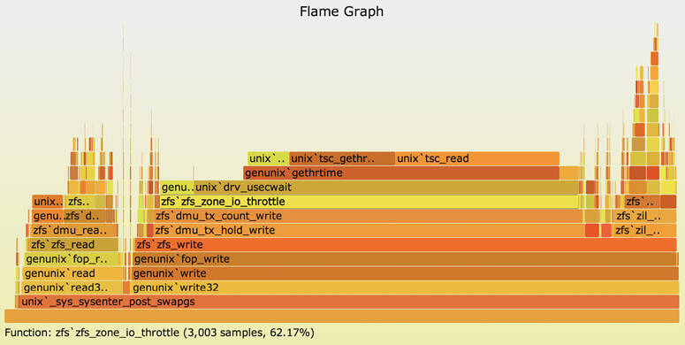
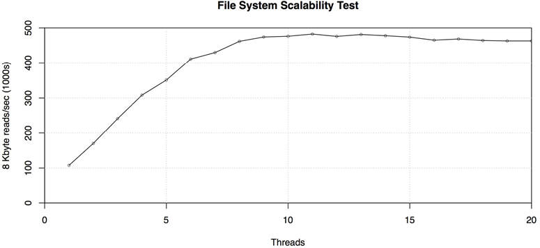

# Chapter 12

## Benchmarking

*There are lies, damn lies and then there are performance measures.*

—Anon et al., “A Measure of Transaction Processing Power” \[Anon 85]

Benchmarking tests performance in a controlled manner, allowing choices to be compared, regressions to be identified, and performance limits to be understood—before they are encountered in production. These limits may be system resources, software limits in a virtualized environment (cloud computing), or limits in the target application. Previous chapters have explored these components, describing the types of limits present and the tools used to analyze them.

Previous chapters have also introduced tools for *micro-benchmarking*, which use simple artificial workloads such as file system I/O to test components. There is also *macro-benchmarking*, which simulates client workloads to test the entire system. Macro-benchmarking may involve a client workload simulation, or a trace replay. Whichever type you use, it’s important to analyze the benchmark so that you can confirm what is being measured. Benchmarks tell you only how fast the system can run the benchmark; it’s up to you to understand the result and determine how it applies to your environment.

The learning objectives of this chapter are:

- Understand micro-benchmarking and macro-benchmarking.
- Become aware of numerous benchmarking failures to avoid.
- Follow an active benchmarking methodology.
- Use a benchmarking checklist to check results.
- Develop accuracy at performing and interpreting benchmarks.

This chapter discusses benchmarking in general, providing advice and methodologies to help you avoid common mistakes and accurately test your systems. This is also useful background when you need to interpret the results from others, including vendor and industry benchmarks.

### 12.1 Background

This section describes benchmarking activities and effective benchmarking, and summarizes common mistakes.

#### 12.1.1 Reasons

Benchmarking may be performed for the following reasons:

- **System design**: Comparing different systems, system components, or applications. For commercial products, benchmarking may provide data to aid a purchase decision, specifically the *price/performance* ratio of the available options.[1](ch12.md) In some cases, results from published *industry benchmarks* can be used, which avoids the need for customers to execute the benchmarks themselves.
  
  [1](ch12.md)While the price/performance ratio is commonly cited, I think in practice the performance/price ratio may be easier to comprehend, because as a mathematical ratio (and not just a saying) it has the attribute “bigger is better,” which matches an assumption people tend to make about performance numbers.
- **Proofs of concept**: To test the performance of software or hardware under load, before purchasing or committing to production deployment.
- **Tuning**: Testing tunable parameters and configuration options, to identify those that are worth further investigation with the production workload.
- **Development**: For both *non-regression testing* and *limit investigations* during product development. Non-regression testing may be an automated battery of performance tests that run regularly, so that any performance regression can be discovered early and quickly matched to the product change. For limit investigations, benchmarking can be used to drive products to their limit during development, in order to identify where engineering effort is best spent to improve product performance.
- **Capacity planning**: Determining system and application limits for capacity planning, either to provide data for modeling performance, or to find capacity limits directly.
- **Troubleshooting**: To verify that components can still operate at maximum performance. For example: testing maximum network throughput between hosts to check whether there may be a network issue.
- **Marketing**: Determining maximum product performance for use by marketing (also called *benchmarketing*).

In enterprise on-premises environments, benchmarking hardware during proofs of concept can be an important exercise before committing to a large hardware purchase, and may be a process that lasts weeks or months. This includes the time to ship, rack, and cable systems, and then to install operating systems before testing. Such a process may occur every year or two, when new hardware is released.

In cloud computing environments, however, resources are available on demand without an expensive initial investment in hardware, and can also be modified quickly as needed (redeploying on different instance types). These environments still involve longer-term investments when choosing which application programming language to use, and which operating system, database, web server, and load balancer to run. Some of these choices can be difficult to change down the road. Benchmarking can be performed to investigate how well the various options can scale when required. The cloud computing model makes benchmarking easy: a large-scale environment can be created in minutes, used for a benchmark run, and then destroyed, all at very little cost.

Note that a fault-tolerant and distributed cloud environment also makes experimentation easy: when new instance types are made available, the environment may allow testing them immediately with production workloads, skipping a traditional benchmarking evaluation. In that scenario, benchmarking can still be used to help explain performance differences in more detail, by comparing component performance. For example, the Netflix performance engineering team has automated software for analyzing new instance types with a variety of micro-benchmarks. This includes the automatic collection of system statistics and CPU profiles so that any differences found can be analyzed and explained.

#### 12.1.2 Effective Benchmarking

Benchmarking is surprisingly difficult to do well, with many opportunities for mistakes and oversights. As summarized by the paper “A Nine Year Study of File System and Storage Benchmarking” [\[Traeger 08\]](ch12.md):

In this article we survey 415 file system and storage benchmarks from 106 recent papers. We found that most popular benchmarks are flawed and many research papers do not provide a clear indication of true performance.

The paper also makes recommendations for what should be done; in particular, benchmark evaluations should explain *what* was tested and *why*, and they should perform some analysis of the system’s expected behavior.

The essence of a good benchmark has also been summarized as [\[Smaalders 06\]](ch12.md):

- **Repeatable**: To facilitate comparisons
- **Observable**: So that performance can be analyzed and understood
- **Portable**: To allow benchmarking on competitors and across different product releases
- **Easily presented**: So that everyone can understand the results
- **Realistic**: So that measurements reflect customer-experienced realities
- **Runnable**: So that developers can quickly test changes

Another characteristic must be added when comparing different systems with the intent to purchase: the *price/performance* ratio. The price can be quantified as the five-year capital cost of the equipment \[Anon 85].

Effective benchmarking is also about how you apply the benchmark: the analysis and the conclusions drawn.

##### Benchmark Analysis

When using benchmarks, you need to understand:

- What is being tested
- What the limiting factor or factors are
- Any perturbations that might affect the results
- What conclusions may be drawn from the results

These needs require a deep understanding of what the benchmark software is doing, how the system is responding, and how the results relate to the destination environment.

Given a benchmark tool and access to the system that runs it, these needs are best served by performance analysis of the system while the benchmark is running. A common mistake is to have junior staff execute the benchmarks, then to bring in performance experts to explain the results after the benchmark has completed. It is best to engage the performance experts during the benchmark so they can analyze the system while it is still running. This may include drill-down analysis to explain and quantify the limiting factor(s).

The following is an interesting example of analysis:

As an experiment to investigate the performance of the resulting TCP/IP implementation, we transmitted 4 Megabytes of data between two user processes on different machines. The transfer was partitioned into 1024 byte records and encapsulated in 1068 byte Ethernet packets. Sending the data from our 11/750 to our 11/780 through TCP/IP takes 28 seconds. This includes all the time needed to set up and tear down the connections, for a user-user throughput of 1.2 Megabaud. During this time the 11/750 is CPU saturated, but the 11/780 has about 30% idle time. The time spent in the system processing the data is spread out among handling for the Ethernet (20%), IP packet processing (10%), TCP processing (30%), checksumming (25%), and user system call handling (15%), with no single part of the handling dominating the time in the system.

This quote describes checking the limiting factors (“the 11/750 is CPU saturated”[2](ch12.md)), then explains details of the kernel components causing them. As an aside, being able to perform this analysis and summarize where kernel CPU time is spent at a high level has only recently become easy with the use of flame graphs. This quote long predates flame graphs: it’s from Bill Joy describing the original BSD TCP/IP stack in 1981 [\[Joy 81\]](ch12.md)!

[2](ch12.md)11/750 is short for VAX-11/750, a minicomputer manufactured by DEC in 1980.

Instead of using a given benchmark tool, you may find it more effective to develop your own custom benchmark software, or at least custom load generators. These can be kept short, focusing on only what is needed for your test, making them quick to analyze and debug.

In some cases you don’t have access to the benchmark tool or the system, as when reading benchmark results from others. Consider the previous bullet list based on the materials available, and, in addition, ask, What is the system environment? How is it configured? See [Section 12.4](ch12.md), [Benchmark Questions](ch12.md), for more questions.

#### 12.1.3 Benchmarking Failures

The following sections provide a checklist of various benchmarking failures—mistakes, fallacies, and misdeeds—and how to avoid them. [Section 12.3](ch12.md), [Methodology](ch12.md), describes how to perform benchmarking.

##### 1. Casual Benchmarking

To do benchmarking well is not a fire-and-forget activity. Benchmark tools provide numbers, but those numbers may not reflect what you think they do, and your conclusions about them may therefore be bogus. I summarize it as:

Casual benchmarking: you benchmark A, but actually measure B, and conclude you’ve measured C.

Benchmarking well requires rigor to check what is actually measured and an understanding of what was tested in order to form valid conclusions.

For example, many tools claim or imply that they measure disk performance, but actually test file system performance. The difference can be orders of magnitude, as file systems employ caching and buffering to substitute disk I/O with memory I/O. Even though the benchmark tool may be functioning correctly and testing the file system, your conclusions about the disks will be wildly incorrect.

Understanding benchmarks is particularly difficult for the beginner, who has no instinct for whether numbers are suspicious or not. If you bought a thermometer that showed the temperature of the room you’re in as 1,000 degrees Fahrenheit (or Celsius), you’d immediately know that something was amiss. The same isn’t true of benchmarks, which produce numbers that are probably unfamiliar to you.

##### 2. Blind Faith

It may be tempting to believe that a popular benchmarking tool is trustworthy, especially if it is open source and has been around for a long time. The misconception that popularity equals validity is known as *argumentum ad populum* (Latin for “appeal to the people”).

Analyzing the benchmarks you’re using is time-consuming and requires expertise to perform properly. And, for a popular benchmark, it may seem wasteful to analyze what *surely* must be valid.

If a popular benchmark was promoted by one of the top companies in technology, would you trust it? This has happened in the past where it was known among veteran performance engineers that the promoted micro-benchmark was flawed and should never have been used. There’s no easy way to stop it from happening (I’ve tried).

The problem isn’t even necessarily with the benchmark software—although bugs do happen—but with the interpretation of the benchmark’s results.

##### 3. Numbers Without Analysis

Bare benchmark results, provided with no analytical details, can be a sign that the author is inexperienced and has assumed that the benchmark results are trustworthy and final. Often, this is just the beginning of an investigation—an investigation that ultimately finds that the results were wrong or confusing.

Every benchmark number should be accompanied by a description of the limit encountered and the analysis performed. I’ve summarized the risk this way:

If you’ve spent less than a week studying a benchmark result, it’s probably wrong.

Much of this book focuses on analyzing performance, which should be carried out during benchmarking. In cases where you don’t have time for careful analysis, it is a good idea to list the assumptions that you haven’t had time to check and to include them with the results, for example:

- Assuming the benchmark tool isn’t buggy
- Assuming the disk I/O test actually measures disk I/O
- Assuming the benchmark tool drove disk I/O to its limit, as intended
- Assuming this type of disk I/O is relevant for this application

This can become a to-do list for further verification, if the benchmark result is later deemed important enough to spend more effort on.

##### 4. Complex Benchmark Tools

It is important that the benchmark tool not hinder benchmark analysis by its own complexity. Ideally, the program is open source so that it can be studied, and short enough that it can be read and understood quickly.

For micro-benchmarks, it is recommended to pick those written in the C programming language. For client simulation benchmarks, it is recommended to use the same programming language as the client, to minimize differences.

A common problem is one of *benchmarking the benchmark*—where the result reported is limited by the benchmark software itself. A common cause of this is single-threaded benchmark software. Complex benchmark suites can make analysis difficult due to the volume of code to comprehend and analyze.

##### 5. Testing the Wrong Thing

While there are numerous benchmark tools available to test a variety of workloads, many of them may not be relevant for the target application.

For example, a common mistake is to test disk performance—based on the availability of disk benchmark tools—even though the target environment workload is expected to run entirely out of file system cache and not be affected by disk I/O.

Similarly, an engineering team developing a product may standardize on a particular benchmark and spend all its performance efforts improving performance as measured by that benchmark. If it doesn’t actually resemble customer workloads, however, the engineering effort will optimize for the wrong behavior \[Smaalders 06].

For an existing production environment, the workload characterization methodology (covered in previous chapters) can measure the makeup of the real workload from device I/O to application requests. These measurements can guide you to choose benchmarks that are most relevant. Without a production environment to analyze, you can set up simulations to analyze, or model the intended workload. Also check with the intended audience of the benchmark data to see if they agree with the tests.

A benchmark may have tested an appropriate workload once upon a time but now hasn’t been updated for years and is testing the wrong thing.

##### 6. Ignoring the Environment

Does the production environment match the test environment? Imagine you are tasked with evaluating a new database. You configure a test server and run a database benchmark, only to later learn that you missed an important step: your test server is a default setup with default tunables parameters, default file system, etc. The production database servers are tuned for high disk IOPS, so testing on an untuned system is unrealistic: you missed first understanding the production environment.

##### 7. Ignoring Errors

Just because a benchmark tool produces a result doesn’t mean that the result reflects a *successful* test. Some—or even all—of the requests may have resulted in an error. While this issue is covered by the previous mistakes, this one in particular is so common that it’s worth singling out.

I was reminded of this during a benchmark of web server performance. Those running the test reported that the average latency of the web server was too high for their needs: over one second, *on average*. One second? Some quick analysis determined what went wrong: the web server did nothing at all during the test, as all requests were blocked by a firewall. *All* requests. The latency shown was the time it took for the benchmark client to time out and error!

##### 8. Ignoring Variance

Benchmark tools, especially micro-benchmarks, often apply a steady and consistent workload, based on the *average* of a series of measurements of real-world characteristics, such as at different times of day or during an interval. For example, a disk workload may be found to have average rates of 500 reads/s and 50 writes/s. A benchmark tool may then either simulate this rate or simulate the ratio of 10:1 reads/writes, so that higher rates can be tested.

This approach ignores *variance*: the rate of operations may be variable. The types of operations may also vary, and some types may occur orthogonally. For example, writes may be applied in bursts every 10 seconds (asynchronous write-back data flushing), whereas synchronous reads are steady. Bursts of writes may cause real issues in production, such as by queueing the reads, but are not simulated if the benchmark applies steady average rates.

One possible solution to simulating variance is the use of a Markov model by the benchmark: this can reflect the probability that a write will be followed by another write.

##### 9. Ignoring Perturbations

Consider what external perturbations may be affecting results. Will a timed system activity, such as a system backup, execute during the benchmark run? Do monitoring agents collect statistics once per minute? For the cloud, a perturbation may be caused by unseen tenants on the same host system.

A common strategy for ironing out perturbations is to make the benchmark runs longer—minutes instead of seconds. As a rule, the duration of a benchmark should not be shorter than one second. Short tests might be unusually perturbed by device interrupts (pinning the thread while performing interrupt service routines), kernel CPU scheduling decisions (waiting before migrating queued threads to preserve CPU affinity), and CPU cache warmth effects. Try running the benchmark test several times and examining the standard deviation—this should be as small as possible.

Also collect data so that perturbations, if present, can be studied. This might include collecting the distribution of operation latency—not just the total runtime for the benchmark—so that outliers can be seen and their details recorded.

##### 10. Changing Multiple Factors

When comparing benchmark results from two tests, be careful to understand all the factors that are different between the two.

For example, if two hosts are benchmarked over the network, is the network between them identical? What if one host was more hops away, over a slower network, or over a more congested network? Any such extra factors could make the benchmark result bogus.

In the cloud, benchmarks are sometimes performed by creating instances, testing them, and then destroying them. This creates the potential for many unseen factors: instances may be created on faster or slower systems, or on systems with higher load and contention from other tenants. I recommend testing multiple instances and take the median (or better, record the distribution) to avoid outliers caused by testing one unusually fast or slow system.

##### 11. Benchmark Paradox

Benchmarks are often used by potential customers to evaluate your product, and they are often so inaccurate that you might as well flip a coin. A salesman once told me he’d be happy with those odds: winning half of his product evaluations would meet his sales targets. But ignoring benchmarks is a benchmarking pitfall, and the odds in practice are much worse. I’ve summarized it as:

“If your product’s chances of winning a benchmark are 50/50, you’ll usually lose.” [\[Gregg 14c\]](ch12.md)

This seeming paradox can be explained by some simple probability.

When buying a product based on performance, customers often want to be really sure it delivers. That can mean not running one benchmark, but several, and wanting the product to win them *all*. If a benchmark has a 50% probability of winning, then:

The probability of winning three benchmarks = 0.5 × 0.5 × 0.5 = 0.125 = 12.5%

The more benchmarks—with the requirement of winning them all—the worse the chances.

##### 12. Benchmarking the Competition

Your marketing department would like benchmark results showing how your product beats the competition. This is far more difficult than it may sound.

When customers pick a product, they don’t use it for five minutes; they use it for months. During that time, they analyze and tune the product for performance, perhaps shaking out the worst issues in the first few weeks.

You don’t have a few weeks to spend analyzing and tuning your *competitor*. In the time available, you can only gather untuned—and therefore unrealistic—results. The customers of your competitor—the target of this marketing activity—may well see that you’ve posted untuned results, so your company loses credibility with the very people it was trying to impress.

If you must benchmark the competition, you’ll want to spend serious time tuning their product. Analyze performance using the techniques described in earlier chapters. Also search for best practices, customer forums, and bug databases. You may even want to bring in outside expertise to tune the system. Then make the same effort for your own company before you finally perform head-to-head benchmarks.

##### 13. Friendly Fire

When benchmarking your own products, make every effort to ensure that the top-performing system and configuration have been tested, and that the system has been driven to its true limit. Share the results with the engineering team before publication; they may spot configuration items that you have missed. And if you are on the engineering team, be on the lookout for benchmark efforts—either from your company or from contracted third parties—and help them out.

In one case, I saw an engineering team had worked hard to develop a high-performing product. Key to its performance was a new technology that had yet to be documented. For the product launch, a benchmark team had been asked to provide the numbers. They didn’t understand the new technology (it wasn’t documented), they misconfigured it, and then they published numbers that undersold the product.

Sometimes the system may be configured correctly but simply hasn’t been pushed to its limit. Ask the question, What is the bottleneck for this benchmark? This may be a physical resource (such as CPUs, disks, or an interconnect) that has been driven to 100% utilization and can be identified using analysis. See [Section 12.3.2](ch12.md), [Active Benchmarking](ch12.md).

Another friendly fire issue is when benchmarking older versions of a software that has performance issues that were fixed in later versions, or on limited equipment that happens to be available, producing a result that is not the best possible. Your potential customers may assume any published company benchmark shows the best possible performance—not providing that undersells the product.

##### 14. Misleading Benchmarks

Misleading benchmark results are common in the industry. They may be a result of unintentionally limited information about what the benchmark actually measures, or of deliberately omitted information. Often the benchmark result is technically correct but is then misrepresented to the customer.

Consider this hypothetical situation: A vendor achieves a fantastic result by building a custom product that is prohibitively expensive and would never be sold to an actual customer. The price is not disclosed with the benchmark result, which focuses on non-price/performance metrics. The marketing department liberally shares an ambiguous summary of the result (“We are 2x faster!”), associating it in customers’ minds with either the company in general or a product line. This is a case of omitting details in order to favorably misrepresent products. While it may not be cheating—the numbers are not fake—it is *lying by omission*.

Such vendor benchmarks may still be useful for you as upper bounds for performance. They are values that you should not expect to exceed (with an exception for cases of friendly fire).

Consider this different hypothetical situation: A marketing department has a budget to spend on a campaign and wants a good benchmark result to use. They engage several third parties to benchmark their product and pick the best result from the group. These third parties are not picked for their expertise; they are picked to deliver a fast and inexpensive result. In fact, non-expertise might be considered advantageous: the greater the results deviate from reality, the better—ideally, one of them deviates greatly in a positive direction!

When using vendor results, be careful to check the fine print for what system was tested, what disk types were used and how many, what network interfaces were used and in which configuration, and other factors. For specifics to be wary of, see [Section 12.4](ch12.md), [Benchmark Questions](ch12.md).

##### 15. Benchmark Specials

*Benchmark specials* is when the vendor studies a popular or industry benchmark, and then engineers the product so that it scores well on that benchmark, while disregarding actual customer performance. This is also called *optimizing for the benchmark*.

The term benchmark specials came into use in 1993 with the TPC-A benchmark, as described on the Transaction Processing Performance Council (TPC) history page [\[Shanley 98\]](ch12.md):

The Standish Group, a Massachusetts-based consulting firm, charged that Oracle had added a special option (discrete transactions) to its database software, with the sole purpose of inflating Oracle’s TPC-A results. The Standish Group claimed that Oracle had “violated the spirit of the TPC” because the discrete transaction option was something a typical customer wouldn’t use and was, therefore, a benchmark special. Oracle vehemently rejected the accusation, stating, with some justification, that they had followed the letter of the law in the benchmark specifications. Oracle argued that since benchmark specials, much less the spirit of the TPC, were not addressed in the TPC benchmark specifications, it was unfair to accuse them of violating anything.

TPC added an anti-benchmark special clause:

All “benchmark special” implementations that improve benchmark results but not real-world performance or pricing, are prohibited.

As TPC is focused on price/performance, another strategy to inflate numbers can be to base them on *special pricing*—deep discounts that no customer would actually get. Like special software changes, the result doesn’t match reality when a real customer purchases the system. TPC has addressed this in its price requirements [\[TPC 19a\]](ch12.md):

TPC specifications require that the total price must be within 2% of the price a customer would pay for the configuration.

While these examples may help explain the notion of benchmark specials, TPC addressed them in its specifications many years ago, and you shouldn’t necessarily expect them today.

##### 16. Cheating

The last failure of benchmarking is cheating: sharing fake results. Fortunately, this is either rare or nonexistent; I’ve not seen a case of purely made-up numbers being shared, even in the most bloodthirsty of benchmarking battles.

### 12.2 Benchmarking Types

A spectrum of benchmark types is pictured in [Figure 12.1](ch12.md), based on the workload they test. The production workload is also included in the spectrum.


Figure 12.1 Benchmark types

The following sections describe the three benchmarking types: micro-benchmarks, simulations, and trace/replay. Industry-standard benchmarks are also discussed.

#### 12.2.1 Micro-Benchmarking

Micro-benchmarking uses artificial workloads that test a particular type of operation, for example, performing a single type of file system I/O, database query, CPU instruction, or system call. The advantage is the simplicity: narrowing the number of components and code paths involved results in an easier target to study and allows performance differences to be root-caused quickly. Tests are also usually repeatable, because variation from other components is factored out as much as possible. Micro-benchmarks are also usually quick to test on different systems. And because they are deliberately artificial, micro-benchmarks are not easily confused with real workload simulations.

For micro-benchmark results to be consumed, they need to be mapped to the target workload. A micro-benchmark may test several dimensions, but only one or two may be relevant. Performance analysis or modeling of the target system can help determine which micro-benchmark results are appropriate, and to what degree.

Example micro-benchmark tools mentioned in previous chapters include, by resource type:

- **CPU**: SysBench
- **Memory I/O**: lmbench (in [Chapter 6](ch06.md), [CPUs](ch06.md))
- **File system**: fio
- **Disk**: hdparm, dd or fio with direct I/O
- **Network**: iperf

There are many, many more benchmark tools available. However, remember the warning from \[Traeger 08]: “Most popular benchmarks are flawed.”

You can also develop your own. Aim to keep them as simple as possible, identifying attributes of the workload that can be tested individually. (See [Section 12.3.6](ch12.md), [Custom Benchmarks](ch12.md), for more about this.) Use externals tools to verify that they perform the operations they claim to do.

##### Design Example

Consider designing a file system micro-benchmark to test the following attributes: sequential or random I/O, I/O size, and direction (read or write). [Table 12.1](ch12.md) shows five sample tests to investigate these dimensions, along with the reason for each test.

Table 12.1 **Sample file system micro-benchmark tests**

**#**

**Test**

**Intent**

1

sequential 512-byte reads[3](ch12.md)

To test maximum (realistic) IOPS

2

sequential 1-Mbyte reads[4](ch12.md)

To test maximum read throughput

3

sequential 1-Mbyte writes

To test maximum write throughput

4

random 512-byte reads

To test the effect of random I/O

5

random 512-byte writes

To test the effect of rewrites

[3](ch12.md)The intent here is to maximize IOPS by using more, smaller I/O. A size of 1 byte sounds better for this purpose, but disks will at least round this up to the sector size (512 bytes or 4 Kbytes).

[4](ch12.md)The intent here is to maximize throughput by using fewer, larger, I/O (less time on I/O initialization). While larger is better, there may be a “sweet spot” due to the file system, kernel allocator, memory pages, and other details. For example, the Solaris kernel performed best with 128 Kbyte I/O, as that was the largest slab cache size (larger I/O moved to the oversize arena, with lower performance).

More tests can be added as desired. All of these tests are multiplied by two additional factors:

- **Working set size**: The size of the data being accessed (e.g., total file size):
  
  - Much smaller than main memory: So that the data caches entirely in the file system cache, and the performance of the file system software can be investigated.
  - Much larger than main memory: To minimize the effect of the file system cache and drive the benchmark toward testing disk I/O.
- **Thread count**: Assuming a small working set size:
  
  - Single-threaded: To test file system performance based on the current CPU clock speed.
  - Multithreaded sufficient to saturate all CPUs: To test the maximum performance of the system, file system, and CPUs.

These can quickly multiply to form a large matrix of tests. Statistical analysis techniques can be used to reduce the required set to test.

Creating benchmarks that focus on top speeds has been called *sunny day* performance testing. So that issues are not overlooked, you also want to consider *cloudy day* or *rainy day* performance testing, which involves testing non-ideal situations, including contention, perturbations, and workload variance.

#### 12.2.2 Simulation

Many benchmarks simulate customer application workloads; these are sometimes called *macro-benchmarks*. They may be based on workload characterization of the production environment (see [Chapter 2](ch02.md), [Methodologies](ch02.md)) to determine the characteristics to simulate. For example, you may find that a production NFS workload is composed of the following operation types and probabilities: reads, 40%; writes, 7%; getattr, 19%; readdir, 1%; and so on. Other characteristics can also be measured and simulated.

Simulations can produce results that resemble how clients will perform with the real-world workload, if not closely, at least closely enough to be useful. They can encompass many factors that would be time-consuming to investigate using micro-benchmarking. Simulations can also include the effects of complex system interactions that may be missed altogether when using micro-benchmarks.

The CPU benchmarks Whetstone and Dhrystone, introduced in [Chapter 6](ch06.md), [CPUs](ch06.md), are examples of simulations. Whetstone was developed in 1972 to simulate scientific workloads of the time. Dhrystone, from 1984, simulates integer-based workloads of the time.

Many companies simulate client HTTP load using in-house or external load-generating software (example software includes wrk [\[Glozer 19\]](ch12.md), siege [\[Fulmer 12\]](ch12.md), and hey [\[Dogan 20\]](ch12.md)). These can be used to evaluate software or hardware changes, and also to simulate peak load (e.g., “flash sales” on an online shopping platform) to expose bottlenecks that can be analyzed and solved.

A workload simulation may be *stateless*, where each server request is unrelated to the previous request. For example, the NFS server workload described previously may be simulated by requesting a series of operations, with each operation type chosen randomly based on the measured probability.

A simulation may also be *stateful*, where each request is dependent on client state, at minimum the previous request. You may find that NFS reads and writes tend to arrive in groups, such that the probability of a write following a write is much higher than a write following a read. Such a workload can be better simulated using a *Markov model*, by representing requests as states and measuring the probability of state transitions \[Jain 91].

A problem with simulations is that they can ignore variance, as described in [Section 12.1.3](ch12.md), [Benchmarking Failures](ch12.md). Customer usage patterns can also change over time, requiring these simulations to be updated and adjusted to stay relevant. There may be resistance to this, however, if there are already published results based on the older benchmark version, which would no longer be usable for comparisons with the new version.

#### 12.2.3 Replay

A third type of benchmarking involves attempting to replay a trace log to the target, testing its performance with the actual captured client operations. This sounds ideal—as good as testing in production, right? It is, however, problematic: when characteristics and delivered latency change on the server, the captured client workload is unlikely to respond naturally to these differences, which may prove no better than a simulated customer workload. When too much faith is placed in it, things can get worse.

Consider this hypothetical situation: A customer is considering upgrading storage infrastructure. The current production workload is traced and replayed on the new hardware. Unfortunately, performance is worse, and the sale is lost. The problem: the trace/replay operated at the disk I/O level. The old system housed 10 K rpm disks, and the new system houses slower 7,200 rpm disks. However, the new system provides 16 times the amount of file system cache and faster processors. The actual production workload would have shown improved performance, as it would have returned largely from cache—which was not simulated by replaying disk events.

While this is a case of testing the wrong thing, other subtle timing effects can mess things up, even with the correct level of trace/replay. As with all benchmarks, it is crucial to analyze and understand what’s going on.

#### 12.2.4 Industry Standards

Industry-standard benchmarks are available from independent organizations, which aim to create fair and relevant benchmarks. These are usually a collection of different micro-benchmarks and workload simulations that are well defined and documented and must be executed under certain guidelines so that the results are as intended. Vendors may participate (usually for a fee) which provides the vendor with the software to execute the benchmark. Their result usually requires full disclosure of the configured environment, which may be audited.

For the customer, these benchmarks can save a lot of time, as benchmark results may already be available for a variety of vendors and products. The task for you, then, is to find the benchmark that most closely resembles your future or current production workload. For current workloads, this may be determined by workload characterization.

The need for industry-standard benchmarks was made clear in a 1985 paper titled “A Measure of Transaction Processing Power” by Jim Gray and others [\[Anon 85\]](ch12.md). It described the need to measure price/performance ratio, and detailed three benchmarks that vendors could execute, called Sort, Scan, and DebitCredit. It also suggested an industry-standard measure of transactions per second (TPS) based on DebitCredit, which could be used much like miles per gallon for cars. Jim Gray and his work later encouraged the creation of the TPC [\[DeWitt 08\]](ch12.md).

Apart from the TPS measure, others that have been used for the same role include:

- **MIPS**: Millions of instructions per second. While this is *a* measure of performance, the work that is performed depends on the type of instruction, which may be difficult to compare between different processor architectures.
- **FLOPS**: Floating-point operations per second—a similar role to MIPS, but for workloads that make heavy use of floating-point calculations.

Industry benchmarks typically measure a custom metric based on the benchmark, which serves only for comparisons with itself.

##### TPC

The Transaction Processing Performance Council (TPC) creates and administers industry benchmarks with a focus on database performance. These include:

- **TPC-C**: A simulation of a complete computing environment where a population of users executes transactions against a database.
- **TPC-DS**: A simulation of a decision support system, including queries and data maintenance.
- **TPC-E**: An online transaction processing (OLTP) workload, modeling a brokerage firm database with customers who generate transactions related to trades, account inquiries, and market research.
- **TPC-H**: A decision support benchmark, simulating ad hoc queries and concurrent data modifications.
- **TPC-VMS**: The TPC Virtual Measurement Single System allows other benchmarks to be gathered for virtualized databases.
- **TPCx-HS**: A big data benchmark using Hadoop.
- **TPCx-V**: Tests database workloads in virtual machines.

TPC results are shared online [\[TPC 19b\]](ch12.md) and include price/performance.

##### SPEC

The Standard Performance Evaluation Corporation (SPEC) develops and publishes a standardized set of industry benchmarks, including:

- **SPEC Cloud IaaS 2018**: This tests provisioning, compute, storage, and network resources, using multiple multi-instance workloads.
- **SPEC CPU 2017**: A measure of compute-intensive workloads, including integer and floating point performance, and an optional metric for energy consumption.
- **SPECjEnterprise 2018 Web Profile**: A measure of full-system performance for Java Enterprise Edition (Java EE) Web Profile version 7 or later application servers, databases, and supporting infrastructure.
- **SPECsfs2014**: A simulation of a client file access workload for NFS servers, common internet file system (CIFS) servers, and similar file systems.
- **SPECvirt\_sc2013**: For virtualized environments, this measures the end-to-end performance of the virtualized hardware, the platform, and the guest operating system and application software.

SPEC’s results are shared online [\[SPEC 20\]](ch12.md) and include details of how systems were tuned and a list of components, but not usually their price.

### 12.3 Methodology

This section describes methodologies and exercises for performing benchmarking, whether it be micro-benchmarking, simulations, or replays. The topics are summarized in [Table 12.2](ch12.md).

Table 12.2 **Benchmark analysis methodologies**

**Section**

**Methodology**

**Types**

[12.3.1](ch12.md)

Passive benchmarking

Experimental analysis

[12.3.2](ch12.md)

Active benchmarking

Observational analysis

[12.3.3](ch12.md)

CPU profiling

Observational analysis

[12.3.4](ch12.md)

USE method

Observational analysis

[12.3.5](ch12.md)

Workload characterization

Observational analysis

[12.3.6](ch12.md)

Custom benchmarks

Software development

[12.3.7](ch12.md)

Ramping load

Experimental analysis

[12.3.8](ch12.md)

Sanity check

Observational analysis

[12.3.9](ch12.md)

Statistical analysis

Statistical analysis

#### 12.3.1 Passive Benchmarking

This is the fire-and-forget strategy of benchmarking—where the benchmark is executed and then ignored until it has completed. The main objective is the collection of benchmark data. This is how benchmarks are commonly executed, and is described as its own anti-methodology for comparison with active benchmarking.

These are some example passive benchmarking steps:

1. Pick a benchmark tool.
2. Run it with a variety of options.
3. Make a slide deck of the results.
4. Hand the slides to management.

Problems with this approach have been discussed previously. In summary, the results may be:

- Invalid due to benchmark software bugs
- Limited by the benchmark software (e.g., single-threaded)
- Limited by a component that is unrelated to the benchmark target (e.g., a congested network)
- Limited by configuration (performance features not enabled, not a maximum configuration)
- Subject to perturbations (and not repeatable)
- Benchmarking the wrong thing entirely

Passive benchmarking is easy to perform but prone to errors. When performed by the vendor, it can create false alarms that waste engineering resources or cause lost sales. When performed by the customer, it can result in poor product choices that haunt the company later on.

#### 12.3.2 Active Benchmarking

With active benchmarking, you analyze performance while the benchmark is running—not just after it’s done—using observability tools [\[Gregg 14d\]](ch12.md). You can confirm that the benchmark tests what it says it tests, and that you understand what that is. Active benchmarking can also identify the true limiters of the system under test, or of the benchmark itself. It can be very helpful to include specific details of the limit encountered when sharing the benchmark results.

As a bonus, this can be a good time to develop your skills with performance observability tools. In theory, you are examining a *known load* and can see how it appears from these tools.

Ideally, the benchmark can be configured and left running in steady state, so that analysis can be performed over a period of hours or days.

##### Analysis Case Study

As an example, let’s look at the first test of the bonnie++ micro-benchmark tool. It is described by its man page as (emphasis mine):

[Click here to view code image](ch12_images.md)

```
NAME
       bonnie++ - program to test hard drive performance.
```

And on its home page [\[Coker 01\]](ch12.md):

Bonnie++ is a benchmark suite that is aimed at performing a number of simple tests of hard drive and file system performance.

Running bonnie++ on Ubuntu Linux:

[Click here to view code image](ch12_images.md)

```
# bonnie++
[...]
Version  1.97       ------Sequential Output------ --Sequential Input- --Random-
Concurrency   1     -Per Chr- --Block-- -Rewrite- -Per Chr- --Block-- --Seeks--
Machine        Size K/sec %CP K/sec %CP K/sec %CP K/sec %CP K/sec %CP  /sec %CP
ip-10-1-239-21   4G   739  99 549247  46 308024  37  1845  99 1156838  38 +++++ +++
Latency             18699us     983ms     280ms   11065us    4505us    7762us
[...]
```

The first test is “Sequential Output” and “Per Chr”, and scored 739 Kbytes/sec according to bonnie++.

Sanity check: if this really was I/O per character, it would mean the system was achieving 739,000 I/O per second. The benchmark is described as testing hard drive performance, but I doubt this system can achieve that many disk IOPS.

While running the first test, I used iostat(1) to check disk IOPS:

[Click here to view code image](ch12_images.md)

```
$ iostat -sxz 1
[...]
avg-cpu:  %user   %nice %system %iowait  %steal   %idle
          11.44    0.00   38.81    0.00    0.00   49.75

Device             tps      kB/s    rqm/s   await aqu-sz  areq-sz  %util

[...]
```

No disk I/O was reported.

Now using bpftrace to count block I/O events (see [Chapter 9](ch09.md), [Disks](ch09.md), [Section 9.6.11](ch09.md), [bpftrace](ch09.md)):

[Click here to view code image](ch12_images.md)

```
# bpftrace -e 'tracepoint:block:* { @[probe] = count(); }'
Attaching 18 probes...
^C

@[tracepoint:block:block_dirty_buffer]: 808225
@[tracepoint:block:block_touch_buffer]: 1025678
```

This also shows that no block I/O was issued (no block:block\_rq\_issue) or completed (block:block\_rq\_complete); however, buffers were dirtied. Using cachestat(8) ([Chapter 8](ch08.md), [File Systems](ch08.md), [Section 8.6.12](ch08.md), [cachestat](ch08.md)) to see the state of the file system cache:

[Click here to view code image](ch12_images.md)

```
# cachestat 1
    HITS   MISSES  DIRTIES HITRATIO   BUFFERS_MB  CACHED_MB
       0        0        0    0.00%           49        361
     293        0    54299  100.00%           49        361
     658        0   298748  100.00%           49        361
     250        0   602499  100.00%           49        362
[...]
```

bonnie++ began execution on the second line of output, and this confirms a workload of “dirties”: writes to the file system cache.

Checking I/O higher up in the I/O stack, at the VFS level (see [Chapter 8](ch08.md), [File Systems](ch08.md), [Section 8.6.15](ch08.md), [BPF](ch15.md)trace):

[Click here to view code image](ch12_images.md)

```
# bpftrace -e 'kprobe:vfs_* /comm == "bonnie++"/ { @[probe] = count(); }'
Attaching 65 probes...
^C

@[kprobe:vfs_fsync_range]: 2
@[kprobe:vfs_statx_fd]: 6
@[kprobe:vfs_open]: 7
@[kprobe:vfs_read]: 13
@[kprobe:vfs_write]: 1176936
```

This shows that there was indeed a heavy vfs\_write() workload. Further drilling down with bpftrace verifies the size:

[Click here to view code image](ch12_images.md)

```
# bpftrace -e 'k:vfs_write /comm == "bonnie++"/ { @bytes = hist(arg2); }'
Attaching 1 probe...
^C

@bytes:
[1]               668839 |@@@@@@@@@@@@@@@@@@@@@@@@@@@@@@@@@@@@@@@@@@@@@@@@@@@@|
[2, 4)                 0 |                                                    |
[4, 8)                 0 |                                                    |
[8, 16)                0 |                                                    |
[16, 32)               1 |                                                    |
```

The third argument to vfs\_write() is the byte count, and it is usually 1 byte (the single write in the 16 to 31 byte range is likely a bonnie++ message about beginning the benchmark).

By analyzing the benchmark while it is running (active benchmarking), we’ve learned that the first bonnie++ test is a 1-byte file system write, which buffers in the file system cache. It does not test disk I/O, as is implied by the descriptions of bonnie++.

According to the man page, bonnie++ has a `-b` option for “no write buffering,” calling fsync(2) after every write. I’ll use strace(1) to analyze this behavior, as strace(1) prints all syscalls in human-readable ways. strace(1) also costs high overhead, so the benchmark results while using strace(1) should be discarded.

[Click here to view code image](ch12_images.md)

```
$ strace bonnie++ -b
[...]
write(3, "6", 1)                        = 1
write(3, "7", 1)                        = 1
write(3, "8", 1)                        = 1
write(3, "9", 1)                        = 1
write(3, ":", 1)                        = 1
[...]
```

The output shows that bonnie++ is not calling fsync(2) after every write. It also has a `-D` option for direct IO, however, that fails on my system. There’s no way to actually do a per-character disk write test.

Some people may argue that bonnie++ isn’t broken, and it does really do a “Sequential Output” and “Per Chr” test: neither of those terms promised disk I/O. For a benchmark that claims to test “hard drive” performance, this is, at least, misleading.

Bonnie++ is not an unusually bad benchmark tool; it has served people well on many occasions. I picked it for this example (and also chose the most suspicious of its tests to study) because it’s well known, I’ve studied it before, and findings like this are not uncommon. But it is just one example.

Older versions of bonnie++ had an additional problem with this test: it allowed libc to buffer writes before they were sent to the file system, so the VFS write size was 4 Kbytes or higher, depending on the libc and OS version.[5](ch12.md) This made it misleading to compare bonnie++ results between different operating systems that used different libc buffering sizes. This problem was fixed in recent versions of bonnie++, but that creates another problem: new results from bonnie++ cannot be compared with old results.

[5](ch12.md)In case you were wondering, the libc buffer size can be tuned using setbuffer(3), and was in use due to bonnie++ using libc putc(3).

For more about Bonnie++ performance analysis, see the article by Roch Bourbonnais on “Decoding Bonnie++” [\[Bourbonnais 08\]](ch12.md).

#### 12.3.3 CPU Profiling

CPU profiling of both the benchmark target and the benchmark software is worth singling out as a methodology, because it can lead to some quick discoveries. It is often performed as part of an active benchmarking investigation.

The intent is to quickly check what all the software is doing, to see if anything interesting shows up. This can also narrow your study to the software components that matter the most: those in play for the benchmark.

Both user- and kernel-level stacks can be profiled. User-level CPU profiling was introduced in [Chapter 5](ch05.md), [Applications](ch05.md). Both were covered in [Chapter 6](ch06.md), [CPUs](ch06.md), with examples in [Section 6.6](ch06.md), [Observability Tools](ch06.md), including flame graphs.

##### Example

A disk micro-benchmark was performed on a proposed new system with some disappointing results: disk throughput was worse than on the old system. I was asked to find out what was wrong, with the expectation that either the disks or the disk controller was inferior and should be upgraded.

I began with the USE method ([Chapter 2](ch02.md), [Methodologies](ch02.md)) and found that the disks were not very busy. There was some CPU usage, in system-time (the kernel).

For a disk benchmark, you might not expect the CPUs to be an interesting target for analysis. Given some CPU usage in the kernel, I thought it was worth a quick check to see if anything interesting showed up, even though I didn’t expect it to. I profiled and generated the flame graph shown in [Figure 12.2](ch12.md).



Figure 12.2 Flame graph profiling of kernel-time

Browsing the stack frames showed that 62.17% of CPU samples included a function called zfs\_zone\_io\_throttle(). I didn’t need to read the code for this function, as its name was enough of a clue: a resource control, ZFS I/O throttling, was active and *artificially* throttling the benchmark! This was a default setting on the new system (but not the older system) that had been overlooked when the benchmark was performed.

#### 12.3.4 USE Method

The USE method was introduced in [Chapter 2](ch02.md), [Methodologies](ch02.md), and is described in chapters for the resources it studies. Applying the USE method during benchmarking can ensure that a limit is found. Either some component (hardware or software) has reached 100% utilization, or you are not driving the system to its limit.

#### 12.3.5 Workload Characterization

Workload characterization was also introduced in [Chapter 2](ch02.md), [Methodologies](ch02.md), and discussed in later chapters. This methodology can be used to determine how well a given benchmark relates to a current production environment by characterizing the production workload for comparison.

#### 12.3.6 Custom Benchmarks

For simple benchmarks, it may be desirable to code the software yourself. Try to keep the program as short as possible, to avoid complexity that hinders analysis.

The C programming language is usually a good choice for micro-benchmarks, as it maps closely to what is executed—although you should think carefully about how compiler optimizations will affect your code: the compiler may elide simple benchmark routines if it thinks the output is unused and therefore unnecessary to calculate. Always check using other tools while the benchmark is running to confirm its operation. It may also be worth disassembling the compiled binary to see what will actually be executed.

Languages that involve virtual machines, asynchronous garbage collection, and dynamic runtime compilation can be much more difficult to debug and control with reliable precision. You may need to use such languages anyway, if it is necessary to simulate client software written in them: macro-benchmarks.

Writing custom benchmarks can also reveal subtle details about the target that can prove useful later on. For example, when developing a database benchmark, you may discover that the API supports various options for improving performance that are not currently in use in the production environment, which was developed before the options existed.

Your software may simply generate load (a *load generator*) and leave the measurements for other tools. One way to perform this is to *ramp load*.

#### 12.3.7 Ramping Load

This is a simple method for determining the maximum throughput a system can handle. It involves adding load in small increments and measuring the delivered throughput until a limit is reached. The results can be graphed, showing a scalability profile. This profile can be studied visually or by using scalability models (see [Chapter 2](ch02.md), [Methodologies](ch02.md)).

As an example, [Figure 12.3](ch12.md) shows how a file system and server scale with threads. Each thread performs 8 Kbyte random reads on a cached file, and these were added one by one.



Figure 12.3 Ramping file system load

This system peaked at almost half a million reads per second. The results were checked using VFS-level statistics, which confirmed that the I/O size was 8 Kbytes and that at peak over 3.5 Gbytes/s were transferred.

The load generator for this test was written in Perl and is short enough to include entirely as an example:

[Click here to view code image](ch12_images.md)

```
#!/usr/bin/perl -w
#
# randread.pl - randomly read over specified file.

use strict;

my $IOSIZE = 8192;                      # size of I/O, bytes
my $QUANTA = $IOSIZE;                   # seek granularity, bytes

die "USAGE: randread.pl filename\n" if @ARGV != 1 or not -e $ARGV[0];

my $file = $ARGV[0];
my $span = -s $file;                    # span to randomly read, bytes
my $junk;

open FILE, "$file" or die "ERROR: reading $file: $!\n";

while (1) {
        seek(FILE, int(rand($span / $QUANTA)) * $QUANTA, 0);
        sysread(FILE, $junk, $IOSIZE);
}

close FILE;
```

To avoid buffering, this uses sysread() to call the read(2) syscall directly.

This was written to micro-benchmark an NFS server and was executed in parallel from a farm of clients, each performing random reads on an NFS-mounted file. The results of the micro-benchmark (reads per second) were measured on the NFS server, using nfsstat(8) and other tools.

The number of files used and their combined size were controlled (this forms the *working set size*), so that some tests could return entirely from cache on the server, and others from disk. (See the Design Example in [Section 12.2.1](ch12.md), [Micro-Benchmarking](ch12.md).)

The number of instances executing on the client farm was incremented one by one, to ramp up the load until a limit was reached. This was also graphed to study the scalability profile, along with resource utilization (USE method), confirming that a resource had been exhausted. In this case it was CPU resources on the server, which spurred another investigation to further improve performance.

I used this program and this approach to find the limits of the Sun ZFS Storage Appliance [\[Gregg 09b\]](ch12.md). These limits were used as the official results—which to the best of our knowledge set world records. I also had a similar set of software written in C, which I normally use, but it wasn’t needed in this case: I had an abundance of client CPUs, and while the switch to C reduced their utilization, it didn’t make a difference for the result as the same bottleneck was reached on the target. Other, more sophisticated benchmarks were also tried, as well as other languages, but they could not improve upon these Perl-based results.

When following this approach, measure latency as well as the throughput, especially the latency distribution. Once the system approaches its limit, queueing delays may become significant, causing latency to increase. If you push load too high, latency may become so high that it is no longer reasonable to consider the result as valid. Ask yourself if the delivered latency would be acceptable to a customer.

For example: You use a large array of clients to drive a target system to 990,000 IOPS, which responds with an average I/O latency of 5 ms. You’d really like it to break 1 million IOPS, but the system is already reaching saturation. By adding more and more clients, you manage to scrape past 1 million IOPS; however, all operations are now heavily queued, with average latency of over 50 ms, which is not acceptable! Which result do you give marketing? (Answer: 990,000 IOPS.)

#### 12.3.8 Sanity Check

This is an exercise for checking a benchmark result by investigating whether any characteristic doesn’t make sense. It includes checking whether the result would have required some component to exceed its known limits, such as network bandwidth, controller bandwidth, interconnect bandwidth, or disk IOPS. If any limit has been exceeded, it is worth investigating in more detail. In most cases, this exercise ultimately discovers that the benchmark result is bogus.

Here’s an example: An NFS server is benchmarked with 8 Kbyte reads and is reported to deliver 50,000 IOPS. It is connected to the network using a single 1 Gbit/s Ethernet port. The network throughput required to drive 50,000 IOPS × 8 Kbytes = 400,000 Kbytes/s, plus protocol headers. This is over 3.2 Gbits/s—well in excess of the 1 Gbit/s known limit. Something is wrong!

Results like this usually mean the benchmark has tested *client caching* and not driven the entire workload to the NFS server.

I’ve used this calculation to identify numerous bogus benchmarks, which have included the following throughputs over a single 1 Gbit/s interface [\[Gregg 09c\]](ch12.md):

- 120 Mbytes/s (0.96 Gbit/s)
- 200 Mbytes/s (1.6 Gbit/s)
- 350 Mbytes/s (2.8 Gbit/s)
- 800 Mbytes/s (6.4 Gbit/s)
- 1.15 Gbytes/s (9.2 Gbit/s)

These are all throughputs in a single direction. The 120 Mbyte/s result may be fine—a 1 Gbit/s interface should reach around 119 Mbyte/s, in practice. The 200 Mbyte/s result is possible only if there was heavy traffic in both directions and this was summed; however, these are single-direction results. The 350 Mbyte/s and beyond results are clearly bogus.

When you’re given a benchmark result to check, look for any simple sums you can perform on the provided numbers to discover such limits.

If you have access to the system, it may be possible to further test results by constructing new observations or experiments. This can follow the scientific method: the question you’re testing now is whether the benchmark result is valid. From this, hypotheses and predictions may be drawn and then tested for verification.

#### 12.3.9 Statistical Analysis

Statistical analysis can be used to study benchmark data. It follows three phases:

1. **Selection** of the benchmark tool, its configuration, and system performance metrics to capture
2. **Execution** of the benchmark, collecting a large dataset of results and metrics
3. **Interpretation** of the data with statistical analysis, producing a report

Unlike active benchmarking, which focuses on analysis of the system while the benchmark is running, statistical analysis focuses on analyzing the results. It is also different from passive benchmarking, in which no analysis is performed at all.

This approach is used in environments where access to a large-scale system may be both time-limited and expensive. For example, there may be only one “max config” system available, but many teams want access to run tests at the same time, including:

- **Sales**: During proofs of concept, to run a simulated customer load to show what the max config system can deliver
- **Marketing**: To get the best numbers for a marketing campaign
- **Support**: To investigate pathologies that arise only on the max config system, under serious load
- **Engineering**: To test the performance of new features and code changes
- **Quality**: To perform non-regression testing and certifications

Each team may have only a limited time to run its benchmarks on the system, but much more time to analyze the results afterward.

As the collection of metrics is expensive, make an extra effort to ensure that they are reliable and trustworthy, to avoid having to redo them later if a problem is found. Apart from checking how they are generated technically, you can also collect more statistical properties so that problems can be found sooner. These may include statistics for variation, full distributions, error margins, and others (see [Chapter 2](ch02.md), [Methodologies](ch02.md), [Section 2.8](ch02.md), [Statistics](ch02.md)). When benchmarking for code changes or non-regression testing, it is crucial to understand the variation and error margins, in order to make sense of a pair of results.

Also collect as much performance data as possible from the running system (without harming the result due to the collection overhead) so that forensic analysis can be performed afterward on this data. Data collection may include the use of tools such as sar(1), monitoring products, and custom tools that dump all statistics available.

For example, on Linux, a custom shell script may copy the contents of the /proc counter files before and after the run.[6](ch12.md) Everything possible can be included, in case it is needed. Such a script may also be executed at intervals during the benchmark, provided the performance overhead is acceptable. Other statistical tools may also be used to create logs.

[6](ch12.md)Do not use tar(1) for this purpose, as it becomes confused by the zero-sized /proc files (according to stat(2)) and does not read their contents.

Statistical analysis of results and metrics can include *scalability analysis* and *queueing theory* to model the system as a network of queues. These topics were introduced in [Chapter 2](ch02.md), [Methodologies](ch02.md), and are the subject of separate texts [\[Jain 91\]](ch12.md)[\[Gunther 97\]](ch12.md)[\[Gunther 07\]](ch12.md).

#### 12.3.10 Benchmarking Checklist

Inspired by the Performance Mantras checklist ([Chapter 2](ch02.md), [Methodologies](ch02.md), [Section 2.5.20](ch02.md), [Performance Mantras](ch02.md)) I have created a benchmarking checklist of questions whose answers you can seek from a benchmark to verify its accuracy [\[Gregg 18d\]](ch12.md):

- Why not double?
- Did it break limits?
- Did it error?
- Does it reproduce?
- Does it matter?
- Did it even happen?

In more detail:

- **Why not double?** Why was the operation rate not double the benchmark result? This is really asking what the limiter is. Answering this can solve many benchmarking problems, when you discover that the limiter is not the intended target of the test.
- **Did it break limits?** This is a sanity check ([Section 12.3.8](ch12.md), [Sanity Check](ch12.md)).
- **Did it error?** Errors perform differently than normal operations, and a high error rate will skew the benchmark results.
- **Does it reproduce?** How consistent are the results?
- **Does it matter?** The workload that a particular benchmark tests may not be relevant to your production needs. Some micro-benchmarks test individual syscalls and library calls, but your application may not even be using them.
- **Did it even happen?** The earlier Ignoring Errors heading in [Section 12.1.3](ch12.md), [Benchmarking Failures](ch12.md), described a case where a firewall blocked a benchmark from reaching the target, and reported timeout-based latency as its result.

The next section includes a much longer list of questions, which also works for scenarios where you may not have access to the target system to analyze the benchmark yourself.

### 12.4 Benchmark Questions

If a vendor gives you a benchmark result, there are a number of questions you can ask to better understand and apply it to your environment, even if you do not have access to the running benchmark to analyze it. The goal is to determine what is really being measured and how realistic or repeatable the result is.

- In **general**:
  
  - Does the benchmark relate to my production workload?
  - What was the configuration of the system under test?
  - Was a single system tested, or is this the result of a cluster of systems?
  - What is the cost of the system under test?
  - What was the configuration of the benchmark clients?
  - What was the duration of the test? How many results were collected?
  - Is the result an average or a peak? What is the average?
  - What are other distribution details (standard deviation, percentiles, or full distribution details)?
  - What was the limiting factor of the benchmark?
  - What was the operation success/fail ratio?
  - What were the operation attributes?
  - Were the operation attributes chosen to simulate a workload? How were they selected?
  - Does the benchmark simulate variance, or an average workload?
  - Was the benchmark result confirmed using other analysis tools? (Provide screenshots.)
  - Can an error margin be expressed with the benchmark result?
  - Is the benchmark result reproducible?
- For **CPU/memory**-related benchmarks:
  
  - What processors were used?
  - Were processors overclocked? Was custom cooling used (e.g., water cooling)?
  - How many memory modules (e.g., DIMMs) were used? How are they attached to sockets?
  - Were any CPUs disabled?
  - What was the system-wide CPU utilization? (Lightly loaded systems can perform faster due to higher levels of turbo boosting.)
  - Were the tested CPUs cores or hyperthreads?
  - How much main memory was installed? Of what type?
  - Were any custom BIOS settings used?
- For **storage**-related benchmarks:
  
  - What is the storage device configuration (how many were used, their type, storage protocol, RAID configuration, cache size, write-back or write-through, etc.)?
  - What is the file system configuration (what types, how many were used, their configuration such as the use of journaling, and their tuning)?
  - What is the working set size?
  - To what degree did the working set cache? Where did it cache?
  - How many files were accessed?
- For **network**-related benchmarks:
  
  - What was the network configuration (how many interfaces were used, their type and configuration)?
  - What was the network topology?
  - What protocols were used? Socket options?
  - What network stack settings were tuned? TCP/UDP tunables?

When studying industry benchmarks, many of these questions may be answered from the disclosure details.

### 12.5 Exercises

1. Answer the following conceptual questions:
   
   - What is a micro-benchmark?
   - What is working set size, and how might it affect the results of storage benchmarks?
   - What is the reason for studying the price/performance ratio?
2. Choose a micro-benchmark and perform the following tasks:
   
   - Scale a dimension (threads, I/O size...) and measure performance.
   - Graph the results (scalability).
   - Use the micro-benchmark to drive the target to peak performance, and analyze the limiting factor.

### 12.6 References

**\[Joy 81]** Joy, W., “tcp-ip digest contribution,” [http://www.rfc-editor.org/rfc/museum/tcp-ip-digest/tcp-ip-digest.v1n6.1](http://www.rfc-editor.org/rfc/museum/tcp-ip-digest/tcp-ip-digest.v1n6.1), 1981.

**\[Anon 85]** Anon et al., “A Measure of Transaction Processing Power,” *Datamation*, April 1, 1985.

**\[Jain 91]** Jain, R., *The Art of Computer Systems Performance Analysis: Techniques for Experimental Design, Measurement, Simulation, and Modeling*, Wiley, 1991.

**\[Gunther 97]** Gunther, N., *The Practical Performance Analyst*, McGraw-Hill, 1997.

**\[Shanley 98]** Shanley, K., “History and Overview of the TPC,” [http://www.tpc.org/information/about/history.asp](http://www.tpc.org/information/about/history.asp), 1998.

**\[Coker 01]** Coker, R., “bonnie++,” [https://www.coker.com.au/bonnie++](https://www.coker.com.au/bonnie++), 2001.

**\[Smaalders 06]** Smaalders, B., “Performance Anti-Patterns,” *ACM Queue* 4, no. 1, February 2006.

**\[Gunther 07]** Gunther, N., *Guerrilla Capacity Planning*, Springer, 2007.

**\[Bourbonnais 08]** Bourbonnais, R., “Decoding Bonnie++,” [https://blogs.oracle.com/roch/entry/decoding\_bonnie](https://blogs.oracle.com/roch/entry/decoding_bonnie), 2008.

**\[DeWitt 08]** DeWitt, D., and Levine, C., “Not Just Correct, but Correct and Fast,” *SIGMOD Record*, 2008.

**\[Traeger 08]** Traeger, A., Zadok, E., Joukov, N., and Wright, C., “A Nine Year Study of File System and Storage Benchmarking,” *ACM Transactions on Storage*, 2008.

**\[Gregg 09b]** Gregg, B., “Performance Testing the 7000 series, Part 3 of 3,” [http://www.brendangregg.com/blog/2009-05-26/performance-testing-the-7000-series3.html](http://www.brendangregg.com/blog/2009-05-26/performance-testing-the-7000-series3.html), 2009.

**\[Gregg 09c]** Gregg, B., and Straughan, D., “Brendan Gregg at FROSUG, Oct 2009,” [http://www.beginningwithi.com/2009/11/11/brendan-gregg-at-frosug-oct-2009](http://www.beginningwithi.com/2009/11/11/brendan-gregg-at-frosug-oct-2009), 2009.

**\[Fulmer 12]** Fulmer, J., “Siege Home,” [https://www.joedog.org/siege-home](https://www.joedog.org/siege-home), 2012.

**\[Gregg 14c]** Gregg, B., “The Benchmark Paradox,” [http://www.brendangregg.com/blog/2014-05-03/the-benchmark-paradox.html](http://www.brendangregg.com/blog/2014-05-03/the-benchmark-paradox.html), 2014.

**\[Gregg 14d]** Gregg, B., “Active Benchmarking,” [http://www.brendangregg.com/activebenchmarking.html](http://www.brendangregg.com/activebenchmarking.html), 2014.

**\[Gregg 18d]** Gregg, B., “Evaluating the Evaluation: A Benchmarking Checklist,” [http://www.brendangregg.com/blog/2018-06-30/benchmarking-checklist.html](http://www.brendangregg.com/blog/2018-06-30/benchmarking-checklist.html), 2018.

**\[Glozer 19]** Glozer, W., “Modern HTTP Benchmarking Tool,” [https://github.com/wg/wrk](https://github.com/wg/wrk), 2019.

**\[TPC 19a]** “Third Party Pricing Guideline,” [http://www.tpc.org/information/other/pricing\_guidelines.asp](http://www.tpc.org/information/other/pricing_guidelines.asp), 2019.

**\[TPC 19b]** “TPC,” [http://www.tpc.org](http://www.tpc.org), 2019.

**\[Dogan 20]** Dogan, J., “HTTP load generator, ApacheBench (ab) replacement, formerly known as rakyll/boom,” [https://github.com/rakyll/hey](https://github.com/rakyll/hey), last updated 2020.

**\[SPEC 20]** “Standard Performance Evaluation Corporation,” [https://www.spec.org](https://www.spec.org), accessed 2020.
