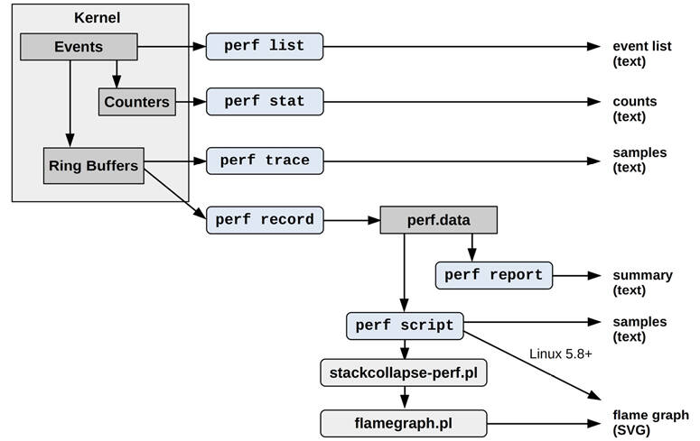

# Chapter 13

## perf

perf(1) is the official Linux profiler and is in the Linux kernel source under tools/perf.[1](ch13.md) It is a multi-tool that has profiling, tracing, and scripting capabilities, and is the front-end to the kernel perf\_events observability subsystem. perf\_events is also known as Performance Counters for Linux (PCL) or Linux Performance Events (LPE). perf\_events and the perf(1) front-end began with performance monitoring counter (PMC) capabilities, but have since grown to support event-based tracing sources as well: tracepoints, kprobes, uprobes, and USDT.

[1](ch13.md)perf(1) is unusual in that it is a large, complex user-level program that is in the Linux kernel source tree. Maintainer Arnaldo Carvalho de Melo described this situation to me as an “experiment.” While this has been beneficial to perf(1) and Linux as they have been developed in lockstep, some are uncomfortable with its inclusion, and it may remain the only complex user software ever to be included in the Linux source.

This chapter, along with [Chapter 14](ch14.md), [Ftrace](ch14.md), and [Chapter 15](ch15.md), [BPF](ch15.md), are optional reading for those who wish to learn one or more system tracers in more detail.

Compared with other tracers, perf(1) is especially suited for CPU analysis: profiling (sampling) CPU stack traces, tracing CPU scheduler behavior, and examining PMCs to understand micro-architectural level CPU performance including cycle behavior. Its tracing capabilities allow it to analyze other targets as well, including disk I/O and software functions.

perf(1) can be used to answer questions such as:

- Which code paths are consuming CPU resources?
- Are the CPUs stalled on memory loads/stores?
- For what reasons are threads leaving the CPU?
- What is the pattern of disk I/O?

The following sections are structured to introduce perf(1), show event sources, and then show the subcommands that use them. The sections are:

- [13.1: Subcommands Overview](ch13.md)
- [13.2: Example One-Liners](ch13.md)
- Events:
  
  - [13.3: Events Overview](ch13.md)
  - [13.4: Hardware Events](ch13.md)
  - [13.5: Software Events](ch13.md)
  - [13.6: Tracepoints](ch13.md)
  - [13.7: Probe Events](ch13.md)
- Commands:
  
  - [13.8: perf stat](ch13.md)
  - [13.9: perf record](ch13.md)
  - [13.10: perf report](ch13.md)
  - [13.11: perf script](ch13.md)
  - [13.12: perf trace](ch13.md)
  - [13.13: Other Commands](ch13.md)
- [13.14: Documentation](ch13.md)
- [13.15: References](ch13.md)

Prior chapters show how to use perf(1) for the analysis of specific targets. This chapter focuses on perf(1) itself.

### 13.1 Subcommands Overview

perf(1)’s capabilities are invoked via subcommands. As a common usage example, the following uses two subcommands: `record` to instrument events and save them to a file, and then `report` to summarize the contents of the file. These subcommands are explained in [Section 13.9](ch13.md), [perf record](ch13.md), and [Section 13.10](ch13.md), [perf report](ch13.md).

[Click here to view code image](ch13_images.md)

```
# perf record -F 99 -a -- sleep 30
[ perf record: Woken up 193 times to write data ]
[ perf record: Captured and wrote 48.916 MB perf.data (11880 samples) ]
# perf report --stdio
[...]
# Overhead  Command          Shared Object              Symbol
# ........  ...............  .........................  ............................
#
    21.10%  swapper          [kernel.vmlinux]           [k] native_safe_halt
     6.39%  mysqld           [kernel.vmlinux]           [k] _raw_spin_unlock_irqrest
     4.66%  mysqld           mysqld                     [.] _Z8ut_delaym
     2.64%  mysqld           [kernel.vmlinux]           [k] finish_task_switch
[...]
```

This particular example sampled any program running on any CPU at 99 Hertz for 30 seconds, and then showed the most frequently sampled functions.

Selected subcommands from a recent perf(1) version (from Linux 5.6) are listed in [Table 13.1](ch13.md).

Table 13.1 **Selected perf subcommands**

**Section**

**Command**

**Description**

\-

`annotate`

Read perf.data (created by perf record) and display annotated code.

\-

`archive`

Create a portable perf.data file containing debug and symbol info.

\-

`bench`

System microbenchmarks.

\-

`buildid-cache`

Manage build-id cache (used by USDT probes).

\-

`c2c`

Cache line analysis tools.

\-

`diff`

Read two perf.data files and display the differential profile.

\-

`evlist`

List the event names in a perf.data file.

[14.12](ch14.md)

`ftrace`

A perf(1) interface to the Ftrace tracer.

\-

`inject`

Filter to augment the events stream with additional information.

\-

`kmem`

Trace/measure kernel memory (slab) properties.

[11.3.3](ch11.md)

`kvm`

Trace/measure kvm guest instances.

[13.3](ch13.md)

`list`

List event types.

\-

`lock`

Analyze lock events.

\-

`mem`

Profile memory access.

[13.7](ch13.md)

`probe`

Define new dynamic tracepoints.

[13.9](ch13.md)

`record`

Run a command and record its profile into perf.data.

[13.10](ch13.md)

`report`

Read perf.data (created by `perf record`) and display the profile.

[6.6.13](ch06.md)

`sched`

Trace/measure scheduler properties (latencies).

[5.5.1](ch05.md)

`script`

Read perf.data (created by `perf record`) and display trace output.

[13.8](ch13.md)

`stat`

Run a command and gather performance counter statistics.

\-

`timechart`

Visualize total system behavior during a workload.

\-

`top`

System profiling tool with real-time screen updates.

[13.12](ch13.md)

`trace`

A live tracer (system calls by default).

[Figure 13.1](ch13.md) shows commonly used perf subcommands with their data sources and types of output.



Figure 13.1 Commonly used perf subcommands

Many of these and other subcommands are explained in the following sections. Some subcommands were covered in prior chapters, as shown in [Table 13.1](ch13.md).

Future versions of perf(1) may add more capabilities: run `perf` with no arguments for the full list of subcommands for your system.

### 13.2 One-Liners

The following one-liners show various perf(1) capabilities by example. These are from a larger list that I have published online [\[Gregg 20h\]](ch13.md), which has proven to be an effective way to explain perf(1) capabilities. The syntax of these is covered in later sections and in the man pages for perf(1).

Note that many of these one-liners use `-a` to specify all CPUs, but this became the default in Linux 4.11 and can be elided in that and later kernels.

##### Listing Events

List all currently known events:

```
perf list
```

List sched tracepoints:

```
perf list 'sched:*'
```

List events with names containing the string “block”:

```
perf list block
```

List currently available dynamic probes:

```
perf probe -l
```

##### Counting Events

Show PMC statistics for the specified command:

```
perf stat command
```

Show PMC statistics for the specified PID, until Ctrl-C:

```
perf stat -p PID
```

Show PMC statistics for the entire system, for 5 seconds:

```
perf stat -a sleep 5
```

Show CPU last level cache (LLC) statistics for the command:

[Click here to view code image](ch13_images.md)

```
perf stat -e LLC-loads,LLC-load-misses,LLC-stores,LLC-prefetches command
```

Count unhalted core cycles using a raw PMC specification (Intel):

```
perf stat -e r003c -a sleep 5
```

Count front-end stalls using a verbose PMC raw specification (Intel):

[Click here to view code image](ch13_images.md)

```
perf stat -e cpu/event=0x0e,umask=0x01,inv,cmask=0x01/ -a sleep 5
```

Count syscalls per second system-wide:

[Click here to view code image](ch13_images.md)

```
perf stat -e raw_syscalls:sys_enter -I 1000 -a
```

Count system calls by type for the specified PID:

[Click here to view code image](ch13_images.md)

```
perf stat -e 'syscalls:sys_enter_*' -p PID
```

Count block device I/O events for the entire system, for 10 seconds:

[Click here to view code image](ch13_images.md)

```
perf stat -e 'block:*' -a sleep 10
```

##### Profiling

Sample on-CPU functions for the specified command, at 99 Hertz:

```
perf record -F 99 command
```

Sample CPU stack traces (via frame pointers) system-wide for 10 seconds:

[Click here to view code image](ch13_images.md)

```
perf record -F 99 -a -g sleep 10
```

Sample CPU stack traces for the PID, using dwarf (debuginfo) to unwind stacks:

[Click here to view code image](ch13_images.md)

```
perf record -F 99 -p PID --call-graph dwarf sleep 10
```

Sample CPU stack traces for a container by its /sys/fs/cgroup/perf\_event cgroup:

[Click here to view code image](ch13_images.md)

```
perf record -F 99 -e cpu-clock --cgroup=docker/1d567f439319...etc... -a sleep 10
```

Sample CPU stack traces for the entire system, using last branch record (LBR; Intel):

[Click here to view code image](ch13_images.md)

```
perf record -F 99 -a --call-graph lbr sleep 10
```

Sample CPU stack traces, once every 100 last-level cache misses, for 5 seconds:

[Click here to view code image](ch13_images.md)

```
perf record -e LLC-load-misses -c 100 -ag sleep 5
```

Sample on-CPU user instructions precisely (e.g., using Intel PEBS), for 5 seconds:

[Click here to view code image](ch13_images.md)

```
perf record -e cycles:up -a sleep 5
```

Sample CPUs at 49 Hertz, and show top process names and segments, live:

```
perf top -F 49 -ns comm,dso
```

##### Static Tracing

Trace new processes, until Ctrl-C:

[Click here to view code image](ch13_images.md)

```
perf record -e sched:sched_process_exec -a
```

Sample a subset of context switches with stack traces for 1 second:

[Click here to view code image](ch13_images.md)

```
perf record -e context-switches -a -g sleep 1
```

Trace all context switches with stack traces for 1 second:

[Click here to view code image](ch13_images.md)

```
perf record -e sched:sched_switch -a -g sleep 1
```

Trace all context switches with 5-level-deep stack traces for 1 second:

[Click here to view code image](ch13_images.md)

```
perf record -e sched:sched_switch/max-stack=5/ -a sleep 1
```

Trace connect(2) calls (outbound connections) with stack traces, until Ctrl-C:

[Click here to view code image](ch13_images.md)

```
perf record -e syscalls:sys_enter_connect -a -g
```

Sample at most 100 block device requests per second, until Ctrl-C:

[Click here to view code image](ch13_images.md)

```
perf record -F 100 -e block:block_rq_issue -a
```

Trace all block device issues and completions (has timestamps), until Ctrl-C:

[Click here to view code image](ch13_images.md)

```
perf record -e block:block_rq_issue,block:block_rq_complete -a
```

Trace all block requests, of size at least 64 Kbytes, until Ctrl-C:

[Click here to view code image](ch13_images.md)

```
perf record -e block:block_rq_issue --filter 'bytes >= 65536'
```

Trace all ext4 calls, and write to a non-ext4 location, until Ctrl-C:

[Click here to view code image](ch13_images.md)

```
perf record -e 'ext4:*' -o /tmp/perf.data -a
```

Trace the http\_\_server\_\_request USDT event (from Node.js; Linux 4.10+):

[Click here to view code image](ch13_images.md)

```
perf record -e sdt_node:http__server__request -a
```

Trace block device requests with live output (no perf.data) until Ctrl-C:

[Click here to view code image](ch13_images.md)

```
perf trace -e block:block_rq_issue
```

Trace block device requests and completions with live output:

[Click here to view code image](ch13_images.md)

```
perf trace -e block:block_rq_issue,block:block_rq_complete
```

Trace system calls system-wide with live output (verbose):

```
perf trace
```

##### Dynamic Tracing

Add a probe for the kernel tcp\_sendmsg() function entry (`--add` optional):

```
perf probe --add tcp_sendmsg
```

Remove the tcp\_sendmsg() tracepoint (or `-d`):

```
perf probe --del tcp_sendmsg
```

List available variables for tcp\_sendmsg(), plus externals (needs kernel debuginfo):

[Click here to view code image](ch13_images.md)

```
perf probe -V tcp_sendmsg --externs
```

List available line probes for tcp\_sendmsg() (needs debuginfo):

```
perf probe -L tcp_sendmsg
```

List available variables for tcp\_sendmsg() at line number 81 (needs debuginfo):

```
perf probe -V tcp_sendmsg:81
```

Add a probe for tcp\_sendmsg() with entry argument registers (processor-specific):

[Click here to view code image](ch13_images.md)

```
perf probe 'tcp_sendmsg %ax %dx %cx'
```

Add a probe for tcp\_sendmsg(), with an alias (“bytes”) for the %cx register:

[Click here to view code image](ch13_images.md)

```
perf probe 'tcp_sendmsg bytes=%cx'
```

Trace previously created probe when bytes (alias) is greater than 100:

[Click here to view code image](ch13_images.md)

```
perf record -e probe:tcp_sendmsg --filter 'bytes > 100'
```

Add a tracepoint for tcp\_sendmsg() return, and capture the return value:

[Click here to view code image](ch13_images.md)

```
perf probe 'tcp_sendmsg%return $retval'
```

Add a tracepoint for tcp\_sendmsg(), with size and socket state (needs debuginfo):

[Click here to view code image](ch13_images.md)

```
perf probe 'tcp_sendmsg size sk->__sk_common.skc_state'
```

Add a tracepoint for do\_sys\_open() with the filename as a string (needs debuginfo):

[Click here to view code image](ch13_images.md)

```
perf probe 'do_sys_open filename:string'
```

Add a tracepoint for the user-level fopen(3) function from libc:

[Click here to view code image](ch13_images.md)

```
perf probe -x /lib/x86_64-linux-gnu/libc.so.6 --add fopen
```

##### Reporting

Show perf.data in an ncurses browser (TUI) if possible:

```
perf report
```

Show perf.data as a text report, with data coalesced and counts and percentages:

```
perf report -n --stdio
```

List all perf.data events, with data header (recommended):

```
perf script --header
```

List all perf.data events, with my recommended fields (needs `record -a`; Linux &lt; 4.1 used `-f` instead of `-F`):

[Click here to view code image](ch13_images.md)

```
perf script --header -F comm,pid,tid,cpu,time,event,ip,sym,dso
```

Generate a flame graph visualization (Linux 5.8+):

```
perf script report flamegraph
```

Disassemble and annotate instructions with percentages (needs some debuginfo):

```
perf annotate --stdio
```

This is my selection of one-liners; there are more capabilities not covered here. See the subcommands in the previous section, and also later sections in this and other chapters for more perf(1) commands.

### 13.3 perf Events

Events can be listed using `perf list`. I’ve included a selection here from Linux 5.8 to show the different types of events, highlighted:

[Click here to view code image](ch13_images.md)

```
# perf list

List of pre-defined events (to be used in -e):

  branch-instructions OR branches                    [Hardware event]
  branch-misses                                      [Hardware event]
  bus-cycles                                         [Hardware event]
  cache-misses                                       [Hardware event]
[...]
  context-switches OR cs                             [Software event]
  cpu-clock                                          [Software event]
[...]
  L1-dcache-load-misses                              [Hardware cache event]
  L1-dcache-loads                                    [Hardware cache event]
[...]
  branch-instructions OR cpu/branch-instructions/    [Kernel PMU event]
  branch-misses OR cpu/branch-misses/                [Kernel PMU event]
[...]
cache:
  l1d.replacement
       [L1D data line replacements] [...]
floating point:
  fp_arith_inst_retired.128b_packed_double
       [Number of SSE/AVX computational 128-bit packed double precision [...]
frontend:
  dsb2mite_switches.penalty_cycles
       [Decode Stream Buffer (DSB)-to-MITE switch true penalty cycles] [...]
memory:
  cycle_activity.cycles_l3_miss
       [Cycles while L3 cache miss demand load is outstanding] [...]
  offcore_response.demand_code_rd.l3_miss.any_snoop
       [DEMAND_CODE_RD & L3_MISS & ANY_SNOOP] [...]
other:
  hw_interrupts.received
       [Number of hardware interrupts received by the processor]
pipeline:
  arith.divider_active
       [Cycles when divide unit is busy executing divide or square root [...]
uncore:
  unc_arb_coh_trk_requests.all
       [Unit: uncore_arb Number of entries allocated. Account for Any type:
        e.g. Snoop, Core aperture, etc]
[...]
  rNNN                                               [Raw hardware event descriptor]
  cpu/t1=v1[,t2=v2,t3 ...]/modifier                  [Raw hardware event descriptor]
   (see 'man perf-list' on how to encode it)
  mem:<addr>[/len][:access]                          [Hardware breakpoint]
  alarmtimer:alarmtimer_cancel                       [Tracepoint event]
  alarmtimer:alarmtimer_fired                        [Tracepoint event]
[...]
  probe:do_nanosleep                                 [Tracepoint event]
[...]
  sdt_hotspot:class__initialization__clinit          [SDT event]
  sdt_hotspot:class__initialization__concurrent      [SDT event]
[...]
List of pre-defined events (to be used in --pfm-events):

ix86arch:
  UNHALTED_CORE_CYCLES
    [count core clock cycles whenever the clock signal on the specific core is
running (not halted)]
  INSTRUCTION_RETIRED
[...]
```

The output has been heavily truncated in many places, as the full output is 4,402 lines on this test system. The event types are:

- **Hardware event**: Mostly processor events (implemented using PMCs)
- **Software event**: A kernel counter event
- **Hardware cache event**: Processor cache events (PMCs)
- **Kernel PMU event**: Performance Monitoring Unit (PMU) events (PMCs)
- **cache**, **floating point**...: Processor vendor events (PMCs) and brief descriptions
- **Raw hardware event descriptor**: PMCs specified using raw codes
- **Hardware breakpoint**: Processor breakpoint event
- **Tracepoint event**: Kernel static instrumentation events
- **SDT event**: User-level static instrumentation events (USDT)
- **pfm-events**: libpfm events (added in Linux 5.8)

The tracepoint and SDT events mostly list static instrumentation points, but if you have created some dynamic instrumentation probes, those will be listed as well. I included an example in the output: probe:do\_nanosleep is described as a “Tracepoint event” that is based on a kprobe.

The `perf list` command accepts a search substring as an argument. For example, listing events containing “mem\_load\_l3” with events highlighted in bold:

[Click here to view code image](ch13_images.md)

```
# perf list mem_load_l3

List of pre-defined events (to be used in -e):

cache:
  mem_load_l3_hit_retired.xsnp_hit
       [Retired load instructions which data sources were L3 and cross-core snoop
hits in on-pkg core cache Supports address when precise (Precise event)]
  mem_load_l3_hit_retired.xsnp_hitm
       [Retired load instructions which data sources were HitM responses from shared
L3 Supports address when precise (Precise event)]
  mem_load_l3_hit_retired.xsnp_miss
       [Retired load instructions which data sources were L3 hit and cross-core snoop
missed in on-pkg core cache Supports address when precise (Precise event)]
  mem_load_l3_hit_retired.xsnp_none
       [Retired load instructions which data sources were hits in L3 without snoops
required Supports address when precise (Precise event)]
[...]
```

These are hardware events (PMC-based), and the output includes brief descriptions. The `(Precise event)` refers to precise event-based sampling (PEBS) capable events.

### 13.4 Hardware Events

Hardware events were introduced in [Chapter 4](ch04.md), [Observability Tools](ch04.md), [Section 4.3.9](ch04.md), [Hardware Counters (PMCs)](ch04.md). They are typically implemented using PMCs, which are configured using codes specific for the processor; for example, branch instructions on Intel processors can typically be instrumented with perf(1) by using the raw hardware event descriptor “r00c4,” short for the register codes: umask 0x0 and event select 0xc4. These codes are published in the processor manuals [\[Intel 16\]](ch13.md)[\[AMD 18\]](ch13.md)[\[ARM 19\]](ch13.md); Intel also makes them available as JSON files [\[Intel 20c\]](ch13.md).

You are not expected to remember these codes, and you will only refer to them in the processor manuals if needed. For ease of use, perf(1) provides human-readable mappings that can be used instead. For example, the event “branch-instructions” will hopefully map to the branch instructions PMC on your system.[2](ch13.md) Some of these human-readable names are visible in the previous list (the hardware and PMU events).

[2](ch13.md)I’ve encountered issues with the mappings in the past, where the human-readable name is not mapping to the correct PMC. This is difficult to identify from the perf(1) output alone: you need prior experience with the PMC and have expectations on what is normal, in order to spot the abnormal. Be aware of this possibility. With the speed of processor updates, I would expect bugs with future mappings as well.

There are many processor types, and new versions are released regularly. It is possible that human-readable mappings for your processor are not yet available in perf(1) or are in a newer kernel version. Some PMCs may never be exposed via a human-readable name. I regularly have to switch from human-readable names to raw event descriptors once I move to deeper PMCs that lack mappings. There may also be bugs in the mappings, and if you ever encounter a suspicious PMC result, you may wish to try the raw event descriptor to double-check.

#### 13.4.1 Frequency Sampling

When using `perf record` with PMCs, a default sample frequency is used so that not every event is recorded. For example, recording the cycles event:

[Click here to view code image](ch13_images.md)

```
# perf record -vve cycles -a sleep 1
Using CPUID GenuineIntel-6-8E
intel_pt default config: tsc,mtc,mtc_period=3,psb_period=3,pt,branch
------------------------------------------------------------
perf_event_attr:
  size                             112
  { sample_period, sample_freq }   4000
  sample_type                      IP|TID|TIME|CPU|PERIOD
  disabled                         1
  inherit                          1
  mmap                             1
  comm                             1
  freq                             1
[...]
[ perf record: Captured and wrote 3.360 MB perf.data (3538 samples) ]
```

The output shows that *frequency sampling* is enabled (`freq 1`) with a sample frequency of 4000. This tells the kernel to adjust the rate of sampling so that roughly 4,000 events per second per CPU are captured. This is desirable, since some PMCs instrument events that can occur billions of times per second (e.g., CPU cycles) and the overhead of recording every event would be prohibitive.[3](ch13.md) But this is also a gotcha: the default output of perf(1) (without the very verbose option: `-vv`) does not say that frequency sampling is in use, and you may be expecting to record all events. This event frequency only affects the `record` subcommand; `stat` counts all events.

[3](ch13.md)Although the kernel will throttle the sampling rate and drop events to protect itself. Always check for lost events to see if this occurred (e.g., check the summary counters from: perf `report -D | tail -20`).

The event frequency can be modified using the `-F` option, or changed to a *period* using `-c`, which captures one-in-every-period events (also known as *overflow sampling*). As an example of using `-F`:

[Click here to view code image](ch13_images.md)

```
perf record -F 99 -e cycles -a sleep 1
```

This samples at a target rate of 99 Hertz (events per second). It is similar to the profiling one-liners in [Section 13.2](ch13.md), [One-Liners](ch13.md): they do not specify the event (no `-e cycles`), which causes perf(1) to default to cycles if PMCs are available, or to the cpu-clock software event. See [Section 13.9.2](ch13.md), [CPU Profiling](ch13.md), for more details.

Note that there is a limit to the frequency rate, as well as a CPU utilization percent limit for perf(1), which can be viewed and set using sysctl(8):

[Click here to view code image](ch13_images.md)

```
# sysctl kernel.perf_event_max_sample_rate
kernel.perf_event_max_sample_rate = 15500
# sysctl kernel.perf_cpu_time_max_percent
kernel.perf_cpu_time_max_percent = 25
```

This shows the maximum sample rate on this system to be 15,500 Hertz, and the maximum CPU utilization allowed by perf(1) (specifically the PMU interrupt) to be 25%.

### 13.5 Software Events

These are events that typically map to hardware events, but are instrumented in software. Like hardware events, they may have a default sample frequency, typically 4000, so that only a subset is captured when using the `record` subcommand.

Note the following difference between the context-switches software event, and the equivalent tracepoint. Starting with the software event:

[Click here to view code image](ch13_images.md)

```
# perf record -vve context-switches -a -- sleep 1
[...]
------------------------------------------------------------
perf_event_attr:
  type                             1
  size                             112
  config                           0x3
  { sample_period, sample_freq }   4000
  sample_type                      IP|TID|TIME|CPU|PERIOD
[...]
  freq                             1
[...]
[ perf record: Captured and wrote 3.227 MB perf.data (660 samples) ]
```

This output shows that the software event has defaulted to frequency sampling at a rate of 4000 Hertz. Now the equivalent tracepoint:

[Click here to view code image](ch13_images.md)

```
# perf record -vve sched:sched_switch -a sleep 1
[...]
------------------------------------------------------------
perf_event_attr:
  type                             2
  size                             112
  config                           0x131
  { sample_period, sample_freq }   1
  sample_type                      IP|TID|TIME|CPU|PERIOD|RAW
[...]
[ perf record: Captured and wrote 3.360 MB perf.data (3538 samples) ]
```

This time, period sampling is used (no `freq 1`), with a sample period of 1 (equivalent to `-c 1`). This captures every event. You can do the same with software events by specifying `-c 1`, for example:

[Click here to view code image](ch13_images.md)

```
perf record -vve context-switches -a -c 1 -- sleep 1
```

Be careful with the volume of recording every event and the overheads involved, especially for context switches, which can be frequent. You can use `perf stat` to check their frequency: see [Section 13.8](ch13.md), perf stat.

### 13.6 Tracepoint Events

Tracepoints were introduced in [Chapter 4](ch04.md), [Observability Tools](ch04.md), [Section 4.3.5](ch04.md), [Tracepoints](ch04.md), which includes examples of instrumenting them using perf(1). To recap, I used the block:block\_rq\_issue tracepoint and the following examples.

Tracing system-wide for 10 seconds and printing the events:

[Click here to view code image](ch13_images.md)

```
perf record -e block:block_rq_issue -a sleep 10; perf script
```

Printing arguments to this tracepoint and its format string (metadata summary):

[Click here to view code image](ch13_images.md)

```
cat /sys/kernel/debug/tracing/events/block/block_rq_issue/format
```

Filtering block I/O to only those larger than 65536 bytes:

[Click here to view code image](ch13_images.md)

```
perf record -e block:block_rq_issue --filter 'bytes > 65536' -a sleep 10
```

There are additional examples of perf(1) and tracepoints in [Section 13.2](ch13.md), [One-Liners](ch13.md), and in other chapters of this book.

Note that `perf list` will show initialized probe events including kprobes (dynamic kernel instrumentation) as “Tracepoint event”; see [Section 13.7](ch13.md), [Probe Events](ch13.md).

### 13.7 Probe Events

perf(1) uses the term *probe events* to refer to kprobes, uprobes, and USDT probes. These are “dynamic” and must first be initialized before they can be traced: they are not present in the output of `perf list` by default (some USDT probes may be present because they have been auto-initialized). Once initialized, they are listed as “Tracepoint event.”

#### 13.7.1 kprobes

kprobes were introduced in [Chapter 4](ch04.md), [Observability Tools](ch04.md), [Section 4.3.6](ch04.md), [kprobes](ch04.md). Here is a typical workflow for creating and using a kprobe, in this example for instrumenting the do\_nanosleep() kernel function:

[Click here to view code image](ch13_images.md)

```
perf probe --add do_nanosleep
perf record -e probe:do_nanosleep -a sleep 5
perf script
perf probe --del do_nanosleep
```

The kprobe is created using the `probe` subcommand and `--add` (`--add` is optional), and when it is no longer needed, it is deleted using `probe` and `--del`. Here is output from this sequence, including listing the probe event:

[Click here to view code image](ch13_images.md)

```
# perf probe --add do_nanosleep
Added new event:
  probe:do_nanosleep   (on do_nanosleep)

You can now use it in all perf tools, such as:

        perf record -e probe:do_nanosleep -aR sleep 1

# perf list probe:do_nanosleep

List of pre-defined events (to be used in -e):

  probe:do_nanosleep                                 [Tracepoint event]

# perf record -e probe:do_nanosleep -aR sleep 1
[ perf record: Woken up 1 times to write data ]
[ perf record: Captured and wrote 3.368 MB perf.data (604 samples) ]
# perf script
           sleep 11898 [002] 922215.458572: probe:do_nanosleep: (ffffffff83dbb6b0)
 SendControllerT 15713 [002] 922215.459871: probe:do_nanosleep: (ffffffff83dbb6b0)
 SendControllerT  5460 [001] 922215.459942: probe:do_nanosleep: (ffffffff83dbb6b0)
[...]
# perf probe --del probe:do_nanosleep
Removed event: probe:do_nanosleep
```

The output of perf script shows the do\_nanosleep() calls that occurred while tracing, first from a sleep(1) command (likely the sleep(1) command that perf(1) ran) followed by calls by SendControllerT (truncated).

The return of functions can be instrumented by adding `%return`:

[Click here to view code image](ch13_images.md)

```
perf probe --add do_nanosleep%return
```

This uses a kretprobe.

##### kprobe Arguments

There are at least four different ways to instrument the arguments to kernel functions.

First, if kernel debuginfo is available, then information about function variables, including arguments, is available to perf(1). Listing variables for the do\_nanosleep() kprobe using the `--vars` option:

[Click here to view code image](ch13_images.md)

```
# perf probe --vars do_nanosleep
Available variables at do_nanosleep
        @<do_nanosleep+0>
                enum hrtimer_mode       mode
                struct hrtimer_sleeper* t
```

This output shows variables named mode and t, which are the entry arguments to do\_nanosleep(). These can be added when creating the probe so that they are included when recorded. For example, adding mode:

[Click here to view code image](ch13_images.md)

```
# perf probe 'do_nanosleep mode'
[...]
# perf record -e probe:do_nanosleep -a
[...]
# perf script
          svscan  1470 [012] 4731125.216396: probe:do_nanosleep: (ffffffffa8e4e440)
mode=0x1
```

This output shows `mode=0x1.`

Second, if kernel debuginfo is not available (as I often find in production), then arguments can be read via their register locations. One trick is to use an identical system (same hardware and kernel) and install kernel debuginfo on it for reference. This reference system can then be queried to find the register locations using the `-n` (dry run) and `-v` (verbose) options to perf probe:

[Click here to view code image](ch13_images.md)

```
# perf probe -nv 'do_nanosleep mode'
[...]
Writing event: p:probe/do_nanosleep _text+10806336 mode=%si:x32
[...]
```

Since it is a dry run, it does not create the event. But the output shows the location of the mode variable (highlighted in bold): it is in register `%si` and is printed as a 32-bit hexadecimal number (`x32`). (This syntax is explained in the next section on uprobes.) This can now be used on the debuginfo-less system by copying and pasting the mode declaration string (`mode=%si:x32`):

[Click here to view code image](ch13_images.md)

```
# perf probe 'do_nanosleep mode=%si:x32'
[...]
# perf record -e probe:do_nanosleep -a
[...]
# perf script
          svscan  1470 [000] 4732120.231245: probe:do_nanosleep: (ffffffffa8e4e440)
mode=0x1
```

This only works if the systems have the same processor ABI and kernel versions, otherwise the wrong register locations may be instrumented.

Third, if you know the processor ABI, you can determine the register locations yourself. An example of this for uprobes is given in the following section.

Fourth, there is a new source of kernel debug information: BPF type format (BTF). This is more likely to be available by default, and a future version of perf(1) should support it as an alternate debuginfo source.

For the return of do\_nanosleep, instrumented using a kretprobe, the return value can be read using the special `$retval` variable:

[Click here to view code image](ch13_images.md)

```
perf probe 'do_nanosleep%return $retval'
```

See the kernel source code to determine what the return value contains.

#### 13.7.2 uprobes

uprobes were introduced in [Chapter 4](ch04.md), [Observability Tools](ch04.md), [Section 4.3.7](ch04.md), [uprobes](ch04.md). uprobes are created similarly to kprobes when using perf(1). For example, to create a uprobe for the libc file open function, fopen(3):

[Click here to view code image](ch13_images.md)

```
# perf probe -x /lib/x86_64-linux-gnu/libc.so.6 --add fopen
Added new event:
  probe_libc:fopen     (on fopen in /lib/x86_64-linux-gnu/libc-2.27.so)
You can now use it in all perf tools, such as:

        perf record -e probe_libc:fopen -aR sleep 1
```

The binary path is specified using `-x`. The uprobe, named probe\_libc:fopen, can now be used with `perf record` to record events.

When you are finished with the uprobe, you can remove it using `--del`:

[Click here to view code image](ch13_images.md)

```
# perf probe --del probe_libc:fopen
Removed event: probe_libc:fopen
```

The return of the function can be instrumented by adding `%return`:

[Click here to view code image](ch13_images.md)

```
perf probe -x /lib/x86_64-linux-gnu/libc.so.6 --add fopen%return
```

This uses a uretprobe.

##### uprobe Arguments

If your system has debuginfo for the target binary, then variable information, including arguments, may be available. This can be listed using `--vars`:

[Click here to view code image](ch13_images.md)

```
# perf probe -x /lib/x86_64-linux-gnu/libc.so.6 --vars fopen
Available variables at fopen
        @<_IO_vfscanf+15344>
                char*   filename
                char*   mode
```

The output shows that fopen(3) has filename and mode variables. These can be added when creating the probe:

[Click here to view code image](ch13_images.md)

```
perf probe -x /lib/x86_64-linux-gnu/libc.so.6 --add 'fopen filename mode'
```

Debuginfo may be provided via a -dbg or -dbgsym package. If that is unavailable on the target system but is on another, the other system can be used as a reference system, as was shown in the previous section on kprobes.

Even if debuginfo is not available anywhere, you still have options. One is to recompile the software with debuginfo (if the software is open source). Another option is to figure out the register locations yourself, based on the processor ABI. The following example is for x86\_64:

[Click here to view code image](ch13_images.md)

```
# perf probe -x /lib/x86_64-linux-gnu/libc.so.6 --add 'fopen filename=+0(%di):string
mode=%si:u8'
[...]
# perf record -e probe_libc:fopen -a
[...]
# perf script
             run 28882 [013] 4503285.383830: probe_libc:fopen: (7fbe130e6e30)
filename="/etc/nsswitch.conf" mode=147
             run 28882 [013] 4503285.383997: probe_libc:fopen: (7fbe130e6e30)
filename="/etc/passwd" mode=17
       setuidgid 28882 [013] 4503285.384447: probe_libc:fopen: (7fed1ad56e30)
filename="/etc/nsswitch.conf" mode=147
       setuidgid 28882 [013] 4503285.384589: probe_libc:fopen: (7fed1ad56e30)
filename="/etc/passwd" mode=17
             run 28883 [014] 4503285.392096: probe_libc:fopen: (7f9be2f55e30)
filename="/etc/nsswitch.conf" mode=147
             run 28883 [014] 4503285.392251: probe_libc:fopen: (7f9be2f55e30)
filename="/etc/passwd" mode=17
           mkdir 28884 [015] 4503285.392913: probe_libc:fopen: (7fad6ea0be30)
filename="/proc/filesystems" mode=22
           chown 28885 [015] 4503285.393536: probe_libc:fopen: (7efcd22d5e30)
filename="/etc/nsswitch.conf" mode=147
[...]
```

The output includes a number of fopen(3) calls, showing filenames of /etc/nsswitch.conf, /etc/passwd, etc.

Decomposing the syntax I used:

- **`filename=`** : This is an alias (“filename”) used to annotate the output.
- **`%di`** , **%si**: On x86\_64, registers containing the first two function arguments, according to the AMD64 ABI [\[Matz 13\]](ch13.md).
- **`+0(...)`** : Dereference the contents at offset zero. Without this, we would accidentally print the address as a string, rather than the contents of the address as a string.
- **`:string`** : Print this as a string.
- **`:u8`** : Print this as an unsigned 8-bit integer.

The syntax is documented in the perf-probe(1) man page.

For the uretprobe, the return value can be read using `$retval`:

[Click here to view code image](ch13_images.md)

```
perf probe -x /lib/x86_64-linux-gnu/libc.so.6 --add 'fopen%return $retval'
```

See the application source code to determine what the return value contains.

While uprobes can provide visibility into application internals, they are an unstable interface as they are instrumenting the binary directly, which can change between software versions. USDT probes are preferred whenever available.

#### 13.7.3 USDT

USDT probes were introduced in [Chapter 4](ch04.md), [Observability Tools](ch04.md), [Section 4.3.8](ch04.md), [USDT](ch04.md). These provide a stable interface for tracing events.

Given a binary with USDT probes,[4](ch13.md) perf(1) can be made aware of them using the buildid-cache subcommand. For example, for a Node.js binary compiled with USDT probes (built using: `./configure --with-dtrace`):

[Click here to view code image](ch13_images.md)

```
# perf buildid-cache --add $(which node)
```

[4](ch13.md)You can run readelf `-n` on the binary to check for the existence of USDT probes: they are listed in the ELF notes section.

The USDT probes can then be seen in the output of `perf list`:

[Click here to view code image](ch13_images.md)

```
# perf list | grep sdt_node
  sdt_node:gc__done                                  [SDT event]
  sdt_node:gc__start                                 [SDT event]
  sdt_node:http__client__request                     [SDT event]
  sdt_node:http__client__response                    [SDT event]
  sdt_node:http__server__request                     [SDT event]
  sdt_node:http__server__response                    [SDT event]
  sdt_node:net__server__connection                   [SDT event]
  sdt_node:net__stream__end                          [SDT event]
```

At this point they are SDT events (statically defined tracing events): metadata that describes the location of the event in the program’s instruction text. To actually instrument them, events must be created in the same fashion as uprobes from the previous section (USDT probes also use uprobes to instrument the USDT locations).[5](ch13.md) For example, for sdt\_node:http\_\_server\_request:

[Click here to view code image](ch13_images.md)

```
# perf probe sdt_node:http__server__request
Added new event:
  sdt_node:http__server__request (on %http__server__request in
home/bgregg/Build/node-v12.4.0/out/Release/node)

You can now use it in all perf tools, such as:

        perf record -e sdt_node:http__server__request -aR sleep 1

# perf list | grep http__server__request
  sdt_node:http__server__request                     [Tracepoint event]
  sdt_node:http__server__request                     [SDT event]
```

[5](ch13.md)In the future this step may become unnecessary: the following perf record command may automatically promote SDT events to tracepoints when needed.

Note that the event now shows as both the SDT event (USDT metadata) and a Tracepoint event (a trace event that can be instrumented using perf(1) and other tools). It might seem odd to see two entries for the same thing, but it is consistent with how other events work. There is a tuple for tracepoints as well, except perf(1) never lists the tracepoints, it only lists the corresponding tracepoint events (if they exist[6](ch13.md)).

[6](ch13.md)The kernel documentation does state that some tracepoints may not have corresponding trace events, although I have yet to encounter a case of this.

Recording the USDT event:

[Click here to view code image](ch13_images.md)

```
# perf record -e sdt_node:http__server__request -a
^C[ perf record: Woken up 1 times to write data ]
[ perf record: Captured and wrote 3.924 MB perf.data (2 samples) ]
# perf script
            node 16282 [006] 510375.595203: sdt_node:http__server__request:
(55c3d8b03530) arg1=140725176825920 arg2=140725176825888 arg3=140725176829208
arg4=39090 arg5=140725176827096 arg6=140725176826040 arg7=20
            node 16282 [006] 510375.844040: sdt_node:http__server__request:
(55c3d8b03530) arg1=140725176825920 arg2=140725176825888 arg3=140725176829208
arg4=39092 arg5=140725176827096 arg6=140725176826040 arg7=20
```

The output shows that two sdt\_node:http\_\_server\_\_request probes fired while recording. It has also printed the arguments to the USDT probe, but some of these are structs and strings, so perf(1) has printed them as pointer addresses. It *should* be possible to cast arguments to the correct type when creating the probe; for example, to cast the third argument as a string named “address”:

[Click here to view code image](ch13_images.md)

```
perf probe --add 'sdt_node:http__server__request address=+0(arg3):string'
```

At the time of writing, this does not work.

A common problem, which has been fixed since Linux 4.20, is that some USDT probes require a semaphore in the process address space to be incremented to activate them properly. sdt\_node:http\_\_server\_\_request is one such probe, and without incrementing the semaphore it will not record any events.

### 13.8 perf stat

The `perf stat` subcommand counts events. This can be used to measure the rate of events, or to check if an event is occurring at all. `perf stat` is efficient: it counts software events in kernel context and hardware events using PMC registers. This makes it suited to gauge the overhead of a more expensive `perf record` subcommand by first checking the event rate using `perf stat`.

For example, counting the tracepoint sched:sched\_switch (using `-e` for the event), system-wide (`-a`) and for one second (`sleep 1`: a dummy command):

[Click here to view code image](ch13_images.md)

```
# perf stat -e sched:sched_switch -a -- sleep 1
 Performance counter stats for 'system wide':

             5,705      sched:sched_switch

       1.001892925 seconds time elapsed
```

This shows that the sched:sched\_switch tracepoint fired 5,705 times during one second.

I often use a “`--”` shell separator between the perf(1) command options and the dummy command it runs, although it is not strictly necessary in this case.

The following sections explain options and usage examples.

#### 13.8.1 Options

The `stat` subcommand supports many options, including:

- **`-a`** : Record across all CPUs (this became the default in Linux 4.11)
- **`-e event`** : Record this event(s)
- **`--filter filter`** : Set a Boolean filter expression for an event
- **`-p PID`** : Record this PID only
- **`-t TID`** : Record this thread ID only
- **`-G cgroup`** : Record this cgroup only (used for containers)
- **`-A`** : Show per-CPU counts
- **`-I interval_ms`** : Print output every interval (milliseconds)
- **`-v`** : Show verbose messages; **`-vv`** for more messages

The events can be tracepoints, software events, hardware events, kprobes, uprobes, and USDT probes (see [Sections 13.3](ch13.md) to [13.7](ch13.md)). Wildcards can be used to match multiple events of the file globbing style (“`*`” matches anything, and “`?`” matches any one character). For example, the following matches all tracepoints of type sched:

```
# perf stat -e 'sched:*' -a
```

Multiple `-e` options can be used to match multiple event descriptions. For example, to count both sched and block tracepoints, either of the following can be used:

[Click here to view code image](ch13_images.md)

```
# perf stat -e 'sched:*' -e 'block:*' -a
# perf stat -e 'sched:*,block:*' -a
```

If no events are specified, perf stat will default to the architectural PMCs: you can see an example of this in [Chapter 4](ch04.md), [Observability Tools](ch04.md), [Section 4.3.9](ch04.md), [Hardware Counters (PMCs)](ch04.md).

#### 13.8.2 Interval Statistics

Per-interval statistics can be printed using the `-I` option. For example, printing the sched:sched\_switch count every 1000 milliseconds:

[Click here to view code image](ch13_images.md)

```
# perf stat -e sched:sched_switch -a -I 1000
#           time             counts unit events
     1.000791768              5,308      sched:sched_switch
     2.001650037              4,879      sched:sched_switch
     3.002348559              5,112      sched:sched_switch
     4.003017555              5,335      sched:sched_switch
     5.003760359              5,300      sched:sched_switch
^C     5.217339333              1,256      sched:sched_switch
```

The `counts` column shows the number of events since the previous interval. Browsing this column can show time-based variation. The last line shows the count between the previous line and the time I typed Ctrl-C to end perf(1). That time was 0.214 seconds, as seen by the delta in the time column.

#### 13.8.3 Per-CPU Balance

The balance across CPUs may be examined using the `-A` option:

[Click here to view code image](ch13_images.md)

```
# perf stat -e sched:sched_switch -a -A -I 1000
#           time CPU                counts unit events
     1.000351429 CPU0                 1,154      sched:sched_switch
     1.000351429 CPU1                   555      sched:sched_switch
     1.000351429 CPU2                   492      sched:sched_switch
     1.000351429 CPU3                   925      sched:sched_switch
[...]
```

This prints the event delta per interval per logical CPU separately.

There are also `--per-socket` and `--per-core` options for CPU socket and core aggregation.

#### 13.8.4 Event Filters

A filter may be provided for some event types (Tracepoint events) to test event arguments with a Boolean expression. The event will only be counted if the expression is true. For example, counting the sched:sched\_switch event when the previous PID is 25467:

[Click here to view code image](ch13_images.md)

```
# perf stat -e sched:sched_switch --filter 'prev_pid == 25467' -a -I 1000
#           time             counts unit events
     1.000346518                131      sched:sched_switch
     2.000937838                145      sched:sched_switch
     3.001370500                 11      sched:sched_switch
     4.001905444                217      sched:sched_switch
[...]
```

See Tracepoint Arguments in [Chapter 4](ch04.md), [Observability Tools](ch04.md), [Section 4.3.5](ch04.md), [Tracepoints](ch04.md), for an explanation of these arguments. They are custom for each event, and may be listed from the format file in /sys/kernel/debug/tracing/events.

#### 13.8.5 Shadow Statistics

perf(1) has a variety of shadow statistics that will be printed when certain combinations of events are instrumented. For example, when instrumenting the PMCs for cycles and instructions, the *instructions per cycle* (IPC) statistic is printed:

[Click here to view code image](ch13_images.md)

```
# perf stat -e cycles,instructions -a
^C
 Performance counter stats for 'system wide':

     2,895,806,892      cycles
     6,452,798,206      instructions              #    2.23  insn per cycle

       1.040093176 seconds time elapsed
```

In this output, IPC was 2.23. These shadow statistics are printed on the right, after a hash. The output of `perf stat` with no events has several of these shadow statistics (see [Chapter 4](ch04.md), [Observability Tools](ch04.md), [Section 4.3.9](ch04.md), [Hardware Counters (PMCs)](ch04.md), for an example).

To examine events in more detail, `perf record` can be used to capture them.

### 13.9 perf record

The `perf record` subcommand records events to a file for later analysis. Events are specified after `-e`, and multiple events can be recorded simultaneously (either using multiple `-e` or separated by commas).

By default the output filename is perf.data. For example:

[Click here to view code image](ch13_images.md)

```
# perf record -e sched:sched_switch -a
^C[ perf record: Woken up 9 times to write data ]
[ perf record: Captured and wrote 6.060 MB perf.data (23526 samples) ]
```

Note that the output includes the size of the perf.data file (6.060 Mbytes), the number of samples it contains (23,526), and the number of times perf(1) woke up to record data (9 times). The data is passed from the kernel to user-space via per-CPU ring buffers, and to keep context-switch overheads to a minimum perf(1) is woken up an infrequent and dynamic number of times to read them.

The previous command recorded until Ctrl-C was typed. A dummy sleep(1) command (or any command) can be used to set the duration (as it was with `perf stat` earlier). For example:

[Click here to view code image](ch13_images.md)

```
perf record -e tracepoint -a -- sleep 1
```

This command records the tracepoint system-wide (`-a`) for 1 second only.

#### 13.9.1 Options

The `record` subcommand supports many options, including:

- **`-a`** : Record across all CPUs (this became the default in Linux 4.11)
- **`-e event`** : Record this event(s)
- **`--filter filter`** : Set a Boolean filter expression for an event
- **`-p PID`** : Record this PID only
- **`-t TID`** : Record this thread ID only
- **`-G cgroup`** : Record this cgroup only (used for containers)
- **`-g`** : Record stack traces
- **`--call-graph mode`** : Record stack traces using a given method (fp, dwarf, or lbr)
- **`-o file`** : Set output file
- **`-v`** : Show verbose messages; `-vv` for more messages

The same events can be recorded as with `perf stat` and printed live (as the events occur) with `perf trace`.

#### 13.9.2 CPU Profiling

A frequent use of perf(1) is as a CPU profiler. The following profiling example samples stack traces across all CPUs at 99 Hertz for 30 seconds:

[Click here to view code image](ch13_images.md)

```
perf record -F 99 -a -g -- sleep 30
```

The event was not specified (no `-e`), so perf(1) will default to the first of these that are available (many use *precise events*, introduced in [Chapter 4](ch04.md), [Observability Tools](ch04.md), [Section 4.3.9](ch04.md), [Hardware Counters (PMCs)](ch04.md)):

1. **cycles:ppp**: CPU cycle-based frequency sampling with precise set to zero skid
2. **cycles:pp**: CPU cycle-based frequency sampling with precise set to requesting zero skid (which may not be zero in practice)
3. **cycles:p**: CPU cycle-based frequency sampling with precise set to requesting constant skid
4. **cycles**: CPU cycle-based frequency sampling (no precise)
5. **cpu-clock**: Software-based CPU frequency sampling

The ordering picks the most accurate CPU profiling mechanism available. The `:ppp`, `:pp`, and `:p` syntax activate precise event sampling modes, and can be applied to other events (apart from cycles) that support them. Events may also support different levels of precise. On Intel, precise events use PEBS; on AMD, they use IBS. These were defined in [Section 4.3.9](ch04.md), under the [PMC Challenges](ch04.md) heading.

#### 13.9.3 Stack Walking

Instead of using -g to specify recording stack traces, the max-stack configuration option can be used. It has two benefits: the maximum depth of the stack can be specified, and different settings can be used for different events. For example:

[Click here to view code image](ch13_images.md)

```
# perf record -e sched:sched_switch/max-stack=5/,sched:sched_wakeup/max-stack=1/ \
    -a -- sleep 1
```

This records sched\_switch events with 5-frame stacks, and sched\_wakeup events with 1 stack frame only.

Note that if stack traces appear broken, it may be due to the software not honoring the frame pointer register. This was discussed in [Chapter 5](ch05.md), [Applications](ch05.md), [Section 5.6.2](ch05.md), [Missing Stacks](ch05.md). Apart from recompiling the software with frame pointers (e.g., gcc(1) `-fno-omit-frame-pointer`), a different stack walking method may also work, selected using `--call-graph`. Options include:

- **--call-graph dwarf**: Selects debuginfo-based stack walking, which requires debuginfo for the executable to be available (for some software, it is provided by installing a package with a name ending in “-dbgsym” or “-dbg”).
- **--call-graph lbr**: Selects Intel last branch record (LBR) stack walking, a processor-provided method (although it is typically limited to a stack depth of only 16 frames,[7](ch13.md) so its usefulness is also limited).
  
  [7](ch13.md)A stack depth of 16 since Haswell, and 32 since Skylake.
- **--call-graph fp**: Selects frame pointer-based stack walking (the default).

Frame pointer-based stack walking is described in [Chapter 3](ch03.md), [Operating Systems](ch03.md), [Section 3.2.7](ch03.md), [Stacks](ch03.md). Other types (dwarf, LBR, and ORC) are described in [Chapter 2](ch02.md), Tech, [Section 2.4](ch02.md), Stack Trace Walking, of *BPF Performance Tools* \[Gregg 19].

After recording events, the events can be examined using `perf report` or `perf script`.

### 13.10 perf report

The `perf report` subcommand summarizes the contents of the perf.data file. Options include:

- **`--tui`** : Use the TUI interface (default)
- **`--stdio`** : Emit a text report
- **`-i file`** : Input file
- **`-n`** : Include a column for sample counts
- **`-g options`** : Modify call graph (stack trace) display options

It is also possible to summarize perf.data using external tools. These tools may process the output of `perf script`, covered in [Section 13.11](ch13.md), [perf script](ch13.md). You may find `perf report` is sufficient in many situations, and use externals tools only when necessary. `perf report` summarizes using either an interactive text user interface (TUI) or a text report (STDIO).

#### 13.10.1 TUI

For example, CPU profiling of the instruction pointer at 99 Hertz for 10 seconds (no stack traces) and launching the TUI:

[Click here to view code image](ch13_images.md)

```
# perf record -F 99 -a -- sleep 30
[ perf record: Woken up 193 times to write data ]
[ perf record: Captured and wrote 48.916 MB perf.data (11880 samples) ]
# perf report
Samples: 11K of event 'cpu-clock:pppH', Event count (approx.): 119999998800
Overhead  Command          Shared Object              Symbol
  21.10%  swapper          [kernel.vmlinux]           [k] native_safe_halt
   6.39%  mysqld           [kernel.vmlinux]           [k] _raw_spin_unlock_irqrestor
   4.66%  mysqld           mysqld                     [.] _Z8ut_delaym
   2.64%  mysqld           [kernel.vmlinux]           [k] finish_task_switch
   2.59%  oltp_read_write  [kernel.vmlinux]           [k] finish_task_switch
   2.03%  mysqld           [kernel.vmlinux]           [k] exit_to_usermode_loop
   1.68%  mysqld           mysqld                     [.] _Z15row_search_mvccPh15pag
   1.40%  oltp_read_write  [kernel.vmlinux]           [k] _raw_spin_unlock_irqrestor
[...]
```

`perf report` is an interactive interface where you can navigate the data, selecting functions and threads for more details.

#### 13.10.2 STDIO

The same CPU profile was shown in [Section 13.1](ch13.md), [Subcommands Overview](ch13.md), using the text-based report (`--stdio`). It is not interactive, but is suited for redirecting to a file so that the full summary can be saved as text. Such stand-alone text reports can be useful for sharing with others over chat systems, email, and support ticketing systems. I typically use `-n` to include a column of sample counts.

As a different STDIO example, the following shows a CPU profile with stack traces (`-g`):

[Click here to view code image](ch13_images.md)

```
# perf record -F 99 -a -g -- sleep 30
[ perf record: Woken up 8 times to write data ]
[ perf record: Captured and wrote 2.282 MB perf.data (11880 samples) ]
# perf report --stdio
[...]
# Children      Self  Command          Shared Object               Symbol
# ........  ........  ...............  ..........................  .................
#
    50.45%     0.00%  mysqld           libpthread-2.27.so          [.] start_thread
            |
            ---start_thread
               |
               |--44.75%--pfs_spawn_thread
               |          |
               |           --44.70%--handle_connection
               |                     |
               |                      --44.55%--_Z10do_commandP3THD
               |                                |
               |                                |--42.93%--_Z16dispatch_commandP3THD
               |                                |          |
               |                                |           --40.92%--_Z19mysqld_stm
               |                                |                     |
[...]
```

Stack trace samples are merged as a hierarchy, beginning from the root function on the left and moving through child functions down and to the right. The right-most function is that of the event (in this case, the on-CPU function), and to its left is its ancestry. This path shows that the `mysqld` process (daemon) ran start\_thread(), which called pfs\_spawn\_thread(), which called handle\_connection(), and so on. The right-most functions are truncated in this output.

This left-to-right ordering is called *caller* by perf(1). You can flip this to *callee* ordering, where the event function is on the left and its ancestry is down and to the right using: `-g callee` (it was the default; perf(1) switched to the caller ordering in Linux 4.4).

### 13.11 perf script

The `perf script` subcommand by default prints each sample from perf.data, and is useful for spotting patterns over time that may be lost in a report summary. Its output may be used for generating flame graphs, and it also has the ability to run *trace scripts* that automate recording and reporting events in custom ways. These topics are summarized in this section.

To begin with, this shows output from the earlier CPU profile, which was collected without stack traces:

[Click here to view code image](ch13_images.md)

```
# perf script
          mysqld  8631 [000] 4142044.582702:   10101010 cpu-clock:pppH:
c08fd9 _Z19close_thread_tablesP3THD+0x49 (/usr/sbin/mysqld)
          mysqld  8619 [001] 4142044.582711:   10101010 cpu-clock:pppH:
79f81d _ZN5Field10make_fieldEP10Send_field+0x1d (/usr/sbin/mysqld)
          mysqld 22432 [002] 4142044.582713:   10101010 cpu-clock:pppH:
ffffffff95530302 get_futex_key_refs.isra.12+0x32 (/lib/modules/5.4.0-rc8-virtua...
[...]
```

The output fields are, along with the field contents from the first line of output:

- **Process name**: `mysqld`
- **Thread ID**: `8631`
- **CPU ID**: `[000]`
- **Timestamp**: `4142044.582702` (seconds)
- **Period**: `10101010` (derived from -F 99); included in some sampling modes
- **Event name**: cpu-clock`:pppH`
- **Event arguments**: This field and those that follow are the event arguments, which are specific to the event. For the cpu-clock event, they are the instruction pointer, the function name and offset, and segment name. For the origin of these, see [Chapter 4](ch04.md), [Section 4.3.5](ch04.md), under [Tracepoints Arguments and Format String](ch04.md).

These output fields happen to be the current default for this event, but may change in a later version of perf(1). Other events do not include the period field.

Since it can be important to produce consistent output, especially for post-processing, you can use the `-F` option to specify the fields. I frequently use it for including the process ID, as it is missing from the default field set. I’d also recommend adding `--header` to include the perf.data metadata. For example, this time showing a CPU profile with stack traces:

[Click here to view code image](ch13_images.md)

```
# perf script --header -F comm,pid,tid,cpu,time,event,ip,sym,dso,trace
# ========
# captured on    : Sun Jan  5 23:43:56 2020
# header version : 1
# data offset    : 264
# data size      : 2393000
# feat offset    : 2393264
# hostname : bgregg-mysql
# os release : 5.4.0
# perf version : 5.4.0
# arch : x86_64
# nrcpus online : 4
# nrcpus avail : 4
# cpudesc : Intel(R) Xeon(R) Platinum 8175M CPU @ 2.50GHz
# cpuid : GenuineIntel,6,85,4
# total memory : 15923672 kB
# cmdline : /usr/bin/perf record -F 99 -a -g -- sleep 30
# event : name = cpu-clock:pppH, , id = { 5997, 5998, 5999, 6000 }, type = 1, size =
112, { sample_period, sample_freq } = 99, sample_ty
[...]
# ========
#
mysqld 21616/8583  [000] 4142769.671581: cpu-clock:pppH:
                  c36299 [unknown] (/usr/sbin/mysqld)
                  c3bad4 _ZN13QEP_tmp_table8end_sendEv (/usr/sbin/mysqld)
                  c3c1a5 _Z13sub_select_opP4JOINP7QEP_TABb (/usr/sbin/mysqld)
                  c346a8 _ZN4JOIN4execEv (/usr/sbin/mysqld)
                  ca735a _Z12handle_queryP3THDP3LEXP12Query_resultyy
[...]
```

The output includes the header, prefixed with “#”, describing the system and the perf(1) command used to create the perf.data file. If you save this output to file for later use, you’ll be glad you included the header, as it provides a wealth of information you may need later on. These files can be read by other tools for visualization, including for flame graphs.

#### 13.11.1 Flame Graphs

Flame graphs visualize stack traces. While commonly used for CPU profiles, they can visualize any collection of stack traces collected by perf(1), including on context switch events to see why threads are leaving CPU, and on block I/O creation to see which code paths are creating disk I/O.

Two commonly used flame graph implementations (my own, and a d3 version) visualize the output of `perf script`. Flame graph support in perf(1) was added in Linux 5.8. The steps for creating flame graphs using perf(1) are included in [Chapter 6](ch06.md), [CPUs](ch06.md), [Section 6.6.13](ch06.md), [perf](ch06.md), under the heading [CPU Flame Graphs](ch06.md). The visualization itself is explained in [Section 6.7.3](ch06.md), [Flame Graphs](ch06.md).

FlameScope is another tool for visualizing `perf script` output, combining a subsecond-offset heat map to study time-based variations with flame graphs. It is also included in [Chapter 6](ch06.md), [CPUs](ch06.md), [Section 6.7.4](ch06.md), [FlameScope](ch06.md).

#### 13.11.2 Trace Scripts

The available perf(1) trace scripts can be listed using `-l`:

[Click here to view code image](ch13_images.md)

```
# perf script -l
List of available trace scripts:
[...]
  event_analyzing_sample               analyze all perf samples
  mem-phys-addr                        resolve physical address samples
  intel-pt-events                      print Intel PT Power Events and PTWRITE
  sched-migration                      sched migration overview
  net_dropmonitor                      display a table of dropped frames
  syscall-counts-by-pid [comm]         system-wide syscall counts, by pid
  failed-syscalls-by-pid [comm]        system-wide failed syscalls, by pid
  export-to-sqlite [database name] [columns] [calls] export perf data to a sqlite3
database
  stackcollapse                        produce callgraphs in short form for scripting
use
```

These can be executed as arguments to `perf script`. You can also develop additional trace scripts in either Perl or Python.

### 13.12 perf trace

The `perf trace` subcommand will trace system calls by default and print output live (no perf.data file). It was introduced in [Chapter 5](ch05.md), [Applications](ch05.md), [Section 5.5.1](ch05.md), [perf](ch05.md), as a lower-overhead version of strace(1) that can trace system-wide. `perf trace` can also inspect any event using similar syntax to `perf record`.

For example, tracing disk I/O issues and completions:

[Click here to view code image](ch13_images.md)

```
# perf trace -e block:block_rq_issue,block:block_rq_complete
     0.000 auditd/391 block:block_rq_issue:259,0 WS 8192 () 16046032 + 16 [auditd]
     0.566 systemd-journa/28651 block:block_rq_complete:259,0 WS () 16046032 + 16 [0]
     0.748 jbd2/nvme0n1p1/174 block:block_rq_issue:259,0 WS 61440 () 2100744 + 120
[jbd2/nvme0n1p1-]
     1.436 systemd-journa/28651 block:block_rq_complete:259,0 WS () 2100744 + 120 [0]
     1.515 kworker/0:1H-k/365 block:block_rq_issue:259,0 FF 0 () 0 + 0 [kworker/0:1H]
     1.543 kworker/0:1H-k/365 block:block_rq_issue:259,0 WFS 4096 () 2100864 + 8
[kworker/0:1H]
     2.074 sshd/6463 block:block_rq_complete:259,0 WFS () 2100864 + 8 [0]
     2.077 sshd/6463 block:block_rq_complete:259,0 WFS () 2100864 + 0 [0]
  1087.562 kworker/0:1H-k/365 block:block_rq_issue:259,0 W 4096 () 16046040 + 8
[kworker/0:1H]
[...]
```

As with `perf record`, filters can also be used on events. These filters can include some string constants, generated from kernel headers. For example, tracing mmap(2) syscalls where the flags are MAP\_SHARED using the string “SHARED”:

[Click here to view code image](ch13_images.md)

```
# perf trace -e syscalls:*enter_mmap --filter='flags==SHARED'
     0.000 env/14780 syscalls:sys_enter_mmap(len: 27002, prot: READ, flags: SHARED,
fd: 3)
    16.145 grep/14787 syscalls:sys_enter_mmap(len: 27002, prot: READ, flags: SHARED,
fd: 3)
    18.704 cut/14791 syscalls:sys_enter_mmap(len: 27002, prot: READ, flags: SHARED,
fd: 3)
[...]
```

Note that perf(1) is also using strings to improve readability of the format string: instead of “`prot: 1`” it has printed “`prot: READ`”. perf(1) refers to this capability as “beautification.”

#### 13.12.1 Kernel Versions

Prior to Linux 4.19, `perf trace` would instrument all syscalls by default (the `--syscalls` option) in addition to the specified events (`-e`). To disable tracing other syscalls, specify `--no-syscalls` (which is now the default). For example:

[Click here to view code image](ch13_images.md)

```
# perf trace -e block:block_rq_issue,block:block_rq_complete --no-syscalls
```

Note that tracing across all CPUs (`-a`) has been the default since Linux 3.8. Filters (`--filter`) were added in Linux 5.5.

### 13.13 Other Commands

There are more perf(1) subcommands and functionality, and some are used in other chapters. To recap additional subcommands (see [Table 13.1](ch13.md) for the full list):

- **perf c2c** (Linux 4.10+): Cache-to-cache and cache line false sharing analysis
- **perf kmem**: Kernel memory allocation analysis
- **perf kvm**: KVM guest analysis
- **perf lock**: Lock analysis
- **perf mem**: Memory access analysis
- **perf sched**: Kernel scheduler statistics
- **perf script**: Custom perf tooling

Advanced additional capabilities include launching BPF programs on events, and using hardware tracing such as Intel processor trace (PT) or ARM CoreSight for per-instruction analysis [\[Hunter 20\]](ch13.md).

The following is a basic example of Intel processor trace. This records user-mode cycles for the date(1) command:

[Click here to view code image](ch13_images.md)

```
# perf record -e intel_pt/cyc/u date
Sat Jul 11 05:52:40 PDT 2020
[ perf record: Woken up 1 times to write data ]
[ perf record: Captured and wrote 0.049 MB perf.data ]
```

This can be printed as an instruction trace (instructions highlighted in bold):

[Click here to view code image](ch13_images.md)

```
# perf script --insn-trace
        date 31979 [003] 653971.670163672:      7f3bfbf4d090 _start+0x0 (/lib/x86_64-
linux-gnu/ld-2.27.so) insn: 48 89 e7
        date 31979 [003] 653971.670163672:      7f3bfbf4d093 _start+0x3 (/lib/x86_64-
linux-gnu/ld-2.27.so) insn: e8 08 0e 00 00
[...]
```

This output includes the instructions as machine code. Installing and using the Intel X86 Encoder Decoder (XED) prints the instructions as assembly [\[Intelxed 19\]](ch13.md):

[Click here to view code image](ch13_images.md)

```
# perf script --insn-trace --xed
date 31979 [003] 653971.670163672: ... (/lib/x86_64-linux-gnu/ld-2.27.so) mov %rsp,
%rdi
date 31979 [003] 653971.670163672: ... (/lib/x86_64-linux-gnu/ld-2.27.so) callq
0x7f3bfbf4dea0
date 31979 [003] 653971.670163672: ... (/lib/x86_64-linux-gnu/ld-2.27.so) pushq %rbp
[...]
date 31979 [003] 653971.670439432: ... (/bin/date) xor %ebp, %ebp
date 31979 [003] 653971.670439432: ... (/bin/date) mov %rdx, %r9
date 31979 [003] 653971.670439432: ... (/bin/date) popq %rsi
date 31979 [003] 653971.670439432: ... (/bin/date) mov %rsp, %rdx
date 31979 [003] 653971.670439432: ... (/bin/date) and $0xfffffffffffffff0, %rsp
[...]
```

While this is incredible detail, it is also verbose. The full output was 266,105 lines, and that’s just for the date(1) command. See the perf(1) wiki for other examples \[Hunter 20].

### 13.14 perf Documentation

Each subcommand should also have a man page for reference beginning with “perf-”, for example, perf-record(1) for the record subcommand. These are in the Linux source tree under tools/perf/Documentation.

There is a perf(1) tutorial on [wiki.kernel.org](http://wiki.kernel.org) [\[Perf 15\]](ch13.md), an unofficial perf(1) page by Vince Weaver [\[Weaver 11\]](ch13.md), and another unofficial perf(1) examples page by myself [\[Gregg 20f\]](ch13.md).

My own page contains the full perf(1) one-liner list, as well as many more examples.

As perf(1) frequently gains new features, check for updates in later kernel versions. A good source is the perf section of the changelog for each kernel published on KernelNewbies [\[KernelNewbies 20\]](ch13.md).

### 13.15 References

**\[Weaver 11]** Weaver, V., “The Unofficial Linux Perf Events Web-Page,” [http://web.eece.maine.edu/~vweaver/projects/perf\_events](http://web.eece.maine.edu/~vweaver/projects/perf_events), 2011.

**\[Matz 13]** Matz, M., Hubička, J., Jaeger, A., and Mitchell, M., “System V Application Binary Interface, AMD64 Architecture Processor Supplement, Draft Version 0.99.6,” [http://x86-64.org/documentation/abi.pdf](http://x86-64.org/documentation/abi.pdf), 2013.

**\[Perf 15]** “Tutorial: Linux kernel profiling with perf,” *perf wiki*, [https://perf.wiki.kernel.org/index.php/Tutorial](https://perf.wiki.kernel.org/index.php/Tutorial), last updated 2015.

**\[Intel 16]** *Intel 64 and IA-32 Architectures Software Developer’s Manual Volume 3B: System Programming Guide, Part 2, September 2016,* [https://www.intel.com/content/www/us/en/architecture-and-technology/64-ia-32-architectures-software-developer-vol-3b-part-2-manual.html](https://www.intel.com/content/www/us/en/architecture-and-technology/64-ia-32-architectures-software-developer-vol-3b-part-2-manual.html), 2016.

**\[AMD 18]** *Open-Source Register Reference for AMD Family 17h Processors Models 00h-2Fh*, [https://developer.amd.com/resources/developer-guides-manuals](https://developer.amd.com/resources/developer-guides-manuals), 2018.

**\[ARM 19]** *Arm® Architecture Reference Manual Armv8, for Armv8-A architecture profile*, [https://developer.arm.com/architectures/cpu-architecture/a-profile/docs?\_ga=2.78191124.1893781712.1575908489-930650904.1559325573](https://developer.arm.com/architectures/cpu-architecture/a-profile/docs?_ga=2.78191124.1893781712.1575908489-930650904.1559325573), 2019.

**\[Intelxed 19]** “Intel XED,” [https://intelxed.github.io](https://intelxed.github.io), 2019.

**\[Gregg 20h]** Gregg, B., “One-Liners,” [http://www.brendangregg.com/perf.html#OneLiners](http://www.brendangregg.com/perf.html#OneLiners), last updated 2020.

**\[Gregg 20f]** Gregg, B., “perf Examples,” [http://www.brendangregg.com/perf.html](http://www.brendangregg.com/perf.html), last updated 2020.

**\[Hunter 20]** Hunter, A., “Perf tools support for Intel® Processor Trace,” [https://perf.wiki.kernel.org/index.php/Perf\_tools\_support\_for\_Intel%C2%AE\_Processor\_Trace](https://perf.wiki.kernel.org/index.php/Perf_tools_support_for_Intel%C2%AE_Processor_Trace), last updated 2020.

**\[Intel 20c]** “/perfmon/,” [https://download.01.org/perfmon](https://download.01.org/perfmon), accessed 2020.

**\[KernelNewbies 20]** “KernelNewbies: LinuxVersions,” [https://kernelnewbies.org/LinuxVersions](https://kernelnewbies.org/LinuxVersions), accessed 2020.
