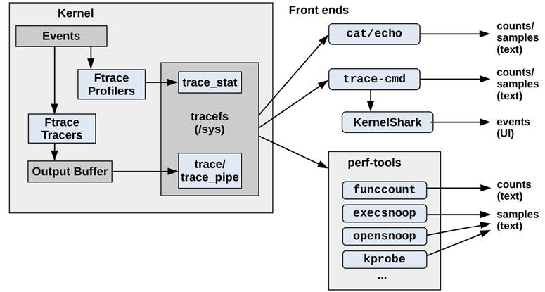
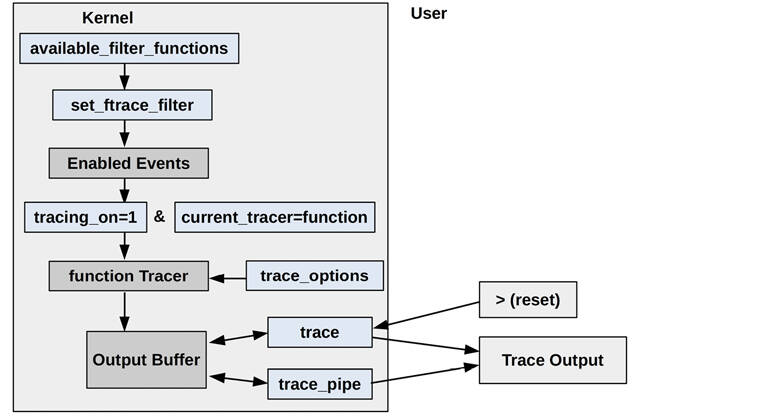
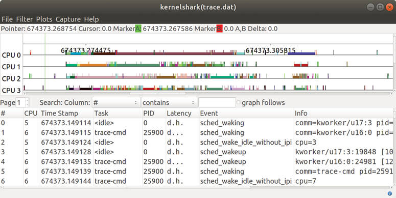
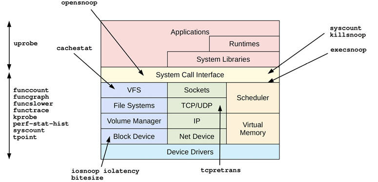

# Chapter 14

## Ftrace

Ftrace is the official Linux tracer, a multi-tool composed of different tracing utilities. Ftrace was created by Steven Rostedt and first added to Linux 2.6.27 (2008). It can be used without any additional user-level front end, making it especially suited for embedded Linux environments where storage space is at a premium. It is also useful for server environments.

This chapter, along with [Chapter 13](ch13.md), [perf](ch13.md), and [Chapter 15](ch15.md), [BPF](ch15.md), are optional reading for those wishing to learn one or more system tracers in more detail.

Ftrace can be used to answer questions such as:

- How often are certain kernel functions called?
- What code path led to calling this function?
- What child functions does this kernel function call?
- What is the highest latency caused by preemption disabled code paths?

The following sections are structured to introduce Ftrace, show some of its profilers and tracers, and then show the front ends that use them. The sections are:

- [14.1: Capabilities Overview](ch14.md)
- [14.2: tracefs (/sys)](ch14.md)
- Profilers:
  
  - [14.3: Ftrace Function Profiler](ch14.md)
  - [14.10: Ftrace Hist Triggers](ch14.md)
- Tracers:
  
  - [14.4: Ftrace Function Tracing](ch14.md)
  - [14.5: Tracepoints](ch14.md)
  - [14.6: kprobes](ch14.md)
  - [14.7: uprobes](ch14.md)
  - [14.8: Ftrace function\_graph](ch14.md)
  - [14.9: Ftrace hwlat](ch14.md)
- Front ends:
  
  - [14.11: trace-cmd](ch14.md)
  - [14.12: perf ftrace](ch14.md)
  - [14.13: perf-tools](ch14.md)
- [14.14: Ftrace Documentation](ch14.md)
- [14.15: References](ch14.md)

Ftrace hist triggers is an advanced topic that requires covering both profilers and tracers first, hence its later location in this chapter. The kprobes and uprobes sections also include basic profiling capabilities.

[Figure 14.1](ch14.md) is an overview of Ftrace and its front ends, with arrows showing the path from events to output types.



Figure 14.1 Ftrace profilers, tracers, and front ends

These are explained in the following sections.

### 14.1 Capabilities Overview

While perf(1) uses subcommands for different functionality, Ftrace has *profilers* and [*tracers*](gloss.md). Profilers provide statistical summaries such as counts and histograms, and tracers provide per-event details.

As an example of Ftrace, the following funcgraph(8) tool uses an Ftrace tracer to show the child calls of the vfs\_read() kernel function:

[Click here to view code image](ch14_images.md)

```
# funcgraph vfs_read
Tracing "vfs_read"... Ctrl-C to end.
 1)               |  vfs_read() {
 1)               |    rw_verify_area() {
 1)               |      security_file_permission() {
 1)               |        apparmor_file_permission() {
 1)               |          common_file_perm() {
 1)   0.763 us    |            aa_file_perm();
 1)   2.209 us    |          }
 1)   3.329 us    |        }
 1)   0.571 us    |        __fsnotify_parent();
 1)   0.612 us    |        fsnotify();
 1)   7.019 us    |      }
 1)   8.416 us    |    }
 1)               |    __vfs_read() {
 1)               |      new_sync_read() {
 1)               |        ext4_file_read_iter() {
[...]
```

The output shows that vfs\_read() called rw\_verify\_area(), which called security\_file\_permission() and so on. The second column shows the duration in each function (“us” is microseconds) so that you can do performance analysis, identifying the child functions that caused a parent function to be slow. This particular Ftrace capability is called function graph tracing (and is covered in [Section 14.8](ch14.md), [Ftrace function\_graph](ch14.md)).

Ftrace profilers and tracers from a recent Linux version (5.2) are listed in [Tables 14.1](ch14.md) and [14.2](ch14.md), along with the Linux *event tracers*: tracepoints, kprobes, and uprobes. These event tracers are Ftrace-like, sharing similar configuration and output interfaces, and are included in this chapter. The monospace tracer names shown in [Table 14.2](ch14.md) are the Ftrace tracers, and are also the command line keywords used to configure them.

Table 14.1 **Ftrace profilers**

**Profiler**

**Description**

**Section**

function

Kernel function statistics

[14.3](ch14.md)

kprobe profiler

Enabled kprobe counts

[14.6.5](ch14.md)

uprobe profiler

Enabled uprobe counts

[14.7.4](ch14.md)

hist triggers

Custom histograms on events

[14.10](ch14.md)

Table 14.2 **Ftrace and event tracers**

**Tracer**

**Description**

**Section**

`function`

Kernel function call tracer

[14.4](ch14.md)

tracepoints

Kernel static instrumentation (event tracer)

[14.5](ch14.md)

kprobes

Kernel dynamic instrumentation (event tracer)

[14.6](ch14.md)

uprobes

User-level dynamic instrumentation (event tracer)

[14.7](ch14.md)

`function_graph`

Kernel function call tracing with a hierarchical graph of child calls.

[14.8](ch14.md)

`wakeup`

Measures max CPU scheduler latency

\-

`wakeup_rt`

Measures max CPU scheduler latency for real-time (RT) tasks

\-

`irqsoff`

Traces IRQs off events with code location and latency (interrupts disabled latency)[1](ch14.md)

\-

`preemptoff`

Traces preemption disabled events with code location and latency

\-

`preemptirqsoff`

A tracer combining irqsoff and preemptoff

\-

`blk`

Block I/O tracer (used by blktrace(8)).

\-

`hwlat`

Hardware latency tracer: can detect external perturbations causing latency

[14.9](ch14.md)

`mmiotrace`

Traces calls that a module makes to hardware

\-

`nop`

A special tracer to disable other tracers

\-

[1](ch14.md)This (and preemptoff, preemptirqsoff) require CONFIG\_PREEMPTIRQ\_EVENTS to be enabled.

You can list the Ftrace tracers available on your kernel version using:

[Click here to view code image](ch14_images.md)

```
# cat /sys/kernel/debug/tracing/available_tracers
hwlat blk mmiotrace function_graph wakeup_dl wakeup_rt wakeup function nop
```

This is using the tracefs interface mounted under /sys, which is introduced in the next section. Subsequent sections cover profilers, tracers, and the tools that use them.

If you wish to jump straight to Ftrace-based tools, take a look at [Section 14.13](ch14.md), [perf](ch13.md)-tools, which includes funcgraph(8) shown earlier.

Future kernel versions may add more profilers and tracers to Ftrace: check the Ftrace documentation in the Linux source under Documentation/trace/ftrace.rst [\[Rostedt 08\]](ch14.md).

### 14.2 tracefs (/sys)

The interface for using Ftrace capabilities is the tracefs file system. It should be mounted on /sys/kernel/tracing; for example, by using:

[Click here to view code image](ch14_images.md)

```
mount -t tracefs tracefs /sys/kernel/tracing
```

Ftrace was originally part of the debugfs file system until it was split into its own tracefs. When debugfs is mounted, it still preserves the original directory structure by mounting tracefs as a tracing subdirectory. You can list both debugfs and tracefs mount points using:

[Click here to view code image](ch14_images.md)

```
# mount -t debugfs,tracefs
debugfs on /sys/kernel/debug type debugfs (rw,relatime)
tracefs on /sys/kernel/debug/tracing type tracefs (rw,relatime)
```

This output is from Ubuntu 19.10, which shows that tracefs is mounted in /sys/kernel/debug/tracing. The examples in the sections that follow use this location as it is still in widespread use, but in the future it should change to /sys/kernel/tracing.

Note that if tracefs fails to mount, one possible reason is that your kernel has been built without the Ftrace config options (CONFIG\_FTRACE, etc.).

#### 14.2.1 tracefs Contents

Once tracefs is mounted, you should be able to see the control and output files in the tracing directory:

[Click here to view code image](ch14_images.md)

```
# ls -F /sys/kernel/debug/tracing
available_events            max_graph_depth      stack_trace_filter
available_filter_functions  options/             synthetic_events
available_tracers           per_cpu/             timestamp_mode
buffer_percent              printk_formats       trace
buffer_size_kb              README               trace_clock
buffer_total_size_kb        saved_cmdlines       trace_marker
current_tracer              saved_cmdlines_size  trace_marker_raw
dynamic_events              saved_tgids          trace_options
dyn_ftrace_total_info       set_event            trace_pipe
enabled_functions           set_event_pid        trace_stat/
error_log                   set_ftrace_filter    tracing_cpumask
events/                     set_ftrace_notrace   tracing_max_latency
free_buffer                 set_ftrace_pid       tracing_on
function_profile_enabled    set_graph_function   tracing_thresh
hwlat_detector/             set_graph_notrace    uprobe_events
instances/                  snapshot             uprobe_profile
kprobe_events               stack_max_size
kprobe_profile              stack_trace
```

The names of many of these are intuitive. Key files and directories include those listed in [Table 14.3](ch14.md).

Table 14.3 **tracefs key files**

**File**

**Access**

**Description**

`available_tracers`

read

Lists available tracers (see [Table 14.2](ch14.md))

`current_tracer`

read/write

Shows the current enabled tracer

`function_profile_enabled`

read/write

Enables the function profiler

`available_filter_functions`

read

Lists available functions to trace

`set_ftrace_filter`

read/write

Select functions to trace

`tracing_on`

read/write

A switch to enable/disable the output ring buffer

`trace`

read/write

Output of tracers (ring buffer)

`trace_pipe`

read

Output of tracers; this version consumes the trace and blocks for input

`trace_options`

read/write

Options to customize the trace buffer output

`trace_stat` (directory)

read/write

Output of the function profiler

`kprobe_events`

read/write

Enabled kprobe configuration

`uprobe_events`

read/write

Enabled uprobe configuration

`events` (directory)

read/write

Event tracer control files: tracepoints, kprobes, uprobes

`instances` (directory)

read/write

Ftrace instances for concurrent users

This /sys interface is documented in the Linux source under Documentation/trace/ftrace.rst [\[Rostedt 08\]](ch14.md). It can be used directly from the shell or by front ends and libraries. As an example, to see whether any of the Ftrace tracers are currently in use you can cat(1) the current\_tracer file:

[Click here to view code image](ch14_images.md)

```
# cat /sys/kernel/debug/tracing/current_tracer
nop
```

The output shows nop (no operation), which means that no tracer is currently in use. To enable a tracer, write its name to this file. For example, to enable the blk tracer:

[Click here to view code image](ch14_images.md)

```
# echo blk > /sys/kernel/debug/tracing/current_tracer
```

Other Ftrace control and output files can also be used via echo(1) and cat(1). This means that Ftrace has virtually zero dependencies to be used (only a shell is needed[2](ch14.md)).

[2](ch14.md)echo(1) is a shell builtin, cat(1) can be approximated: function shellcat `{ (while read line; do echo "$line"; done) < $1; }`. Or busybox could be used to include a shell, cat(1), and other basics.

Steven Rostedt built Ftrace for his own use while developing the realtime patch set, and initially it did not support concurrent users. For example, the current\_tracer file can only be set to one tracer at a time. Concurrent user support was added later, in the form of instances that can be created in the “instances” directory. Each instance has its own current\_tracer and output files so that it can perform tracing independently.

The following sections ([14.3](ch14.md) to [14.10](ch14.md)) show more /sys interface examples; then later sections ([14.11](ch14.md) to [14.13](ch14.md)) show the front ends built upon it: trace-cmd, the perf(1) `ftrace` subcommand, and perf-tools.

### 14.3 Ftrace Function Profiler

The function profiler provides statistics on kernel function calls, and is suited for exploring which kernel functions are in use and identifying which are the slowest. I frequently use the function profiler as a starting point for understanding kernel code execution for a given workload, especially because it is efficient and costs relatively low overhead. Using it, I can identify functions to analyze using more expensive per-event tracing. It requires the CONFIG\_FUNCTION\_PROFILER=y kernel option.

The function profiler works by using compiled-in profiling calls at the start of every kernel function. This approach is based on how compiler profilers work, such as gcc(1)’s `-pg` option, which inserts mcount() calls for use with gprof(1). Since gcc(1) version 4.6, this mcount() call is now \_\_fentry\_\_(). Adding calls to *every* kernel function sounds like it should cost significant overhead, which would be a concern for something that may rarely be used, but the overhead problem has been solved: when not in use, these calls are typically replaced with fast nop instructions, and only switched to the \_\_fentry\_\_() calls when needed [\[Gregg 19f\]](ch14.md).

The following demonstrates the function profiler using the tracefs interface in /sys. For reference, the following shows the original not-enabled state of the function profiler:

[Click here to view code image](ch14_images.md)

```
# cd /sys/kernel/debug/tracing
# cat set_ftrace_filter
#### all functions enabled ####
# cat function_profile_enabled
0
```

Now (from the same directory) these commands use the function profiler to count all kernel calls beginning with “tcp” for around 10 seconds:

[Click here to view code image](ch14_images.md)

```
# echo 'tcp*' > set_ftrace_filter
# echo 1 > function_profile_enabled
# sleep 10
# echo 0 > function_profile_enabled
# echo > set_ftrace_filter
```

The sleep(1) command was used to set a (rough) duration of the profile. The commands that came after that disabled function profiling and reset the filter. Tip: be sure to use “`0 >`” and not “`0>`”—they are not the same; the latter is a redirection of file descriptor 0. Likewise avoid “1`>`” as it is a redirection of file descriptor 1.

The profile statistics can now be read from the trace\_stat directory, which keeps them in “function” files for each CPU. This is a 2-CPU system. Using head(1) to only show the first ten lines from each file:

[Click here to view code image](ch14_images.md)

```
# head trace_stat/function*
==> trace_stat/function0 <==
  Function                       Hit    Time            Avg             s^2
  --------                       ---    ----            ---             ---
  tcp_sendmsg                 955912    2788479 us      2.917 us        3734541 us
  tcp_sendmsg_locked          955912    2248025 us      2.351 us        2600545 us
  tcp_push                    955912    852421.5 us     0.891 us        1057342 us
  tcp_write_xmit              926777    674611.1 us     0.727 us        1386620 us
  tcp_send_mss                955912    504021.1 us     0.527 us        95650.41 us
  tcp_current_mss             964399    317931.5 us     0.329 us        136101.4 us
  tcp_poll                    966848    216701.2 us     0.224 us        201483.9 us
  tcp_release_cb              956155    102312.4 us     0.107 us        188001.9 us

==> trace_stat/function1 <==
  Function                       Hit    Time            Avg             s^2
  --------                       ---    ----            ---             ---
  tcp_sendmsg                 317935    936055.4 us     2.944 us        13488147 us
  tcp_sendmsg_locked          317935    770290.2 us     2.422 us        8886817 us
  tcp_write_xmit              348064    423766.6 us     1.217 us        226639782 us
  tcp_push                    317935    310040.7 us     0.975 us        4150989 us
  tcp_tasklet_func             38109    189797.2 us     4.980 us        2239985 us
  tcp_tsq_handler              38109    180516.6 us     4.736 us        2239552 us
  tcp_tsq_write.part.0         29977    173955.7 us     5.802 us        1037352 us
  tcp_send_mss                317935    165881.9 us     0.521 us        352309.0 us
```

The columns show the function name (`Function`), the call count (`Hit`), the total time in the function (`Time`), the average function time (`Avg`), and standard deviation (`s^2`). The output shows that the tcp\_sendmsg() function was most frequent on both CPUs; it was called over 955k times on CPU0 and over 317k times on CPU1. Its average duration was 2.9 microseconds.

A small amount of overhead is added to the profiled functions during profiling. If the set\_ftrace\_filter is left blank, all kernel functions are profiled (as we were warned by the initial state seen earlier: “all functions enabled”). Bear this in mind when using the profiler, and try to use the function filter to limit the overhead.

The Ftrace front ends, covered later, automate these steps and can combine the per-CPU output into a system-wide summary.

### 14.4 Ftrace Function Tracing

The function tracer prints per-event details for kernel function calls, and uses the function profiling instrumentation described in the previous section. This can show the sequence of various functions, timestamp-based patterns, and the on-CPU process name and PID that may be responsible. The overhead of function tracing is higher than function profiling, and so tracing is best suited for relatively infrequent functions (less than 1,000 calls per second). You can use function profiling from the previous section to find out the rate of functions before tracing them.

The key tracefs files involved in function tracing are shown in [Figure 14.2](ch14.md).



Figure 14.2 Ftrace function tracing tracefs files

The final trace output is read from either the `trace` or `trace_pipe` files, described in the following sections. Both of these interfaces also have ways to clear the output buffer (hence the arrows back to the buffer).

#### 14.4.1 Using trace

The following demonstrates function tracing with the `trace` output file. For reference, the following shows the original not-enabled state of the function tracer:

[Click here to view code image](ch14_images.md)

```
# cd /sys/kernel/debug/tracing
# cat set_ftrace_filter
#### all functions enabled ####
# cat current_tracer
nop
```

No other tracer is currently in use.

For this example, all kernel functions ending with “sleep” are traced, and the events are ultimately saved to a /tmp/out.trace01.txt file. A dummy sleep(1) command is used to collect at least 10 seconds of tracing. This command sequence finishes by disabling the function tracer and returning the system back to normal:

[Click here to view code image](ch14_images.md)

```
# cd /sys/kernel/debug/tracing
# echo 1 > tracing_on
# echo '*sleep' > set_ftrace_filter
# echo function > current_tracer
# sleep 10
# cat trace > /tmp/out.trace01.txt
# echo nop > current_tracer
# echo > set_ftrace_filter
```

Setting tracing\_on may be an unnecessary step (on my Ubuntu system, it is set to 1 by default). I’ve included it in case it is not set on your system.

The dummy sleep(1) command was captured in the trace output while we were tracing “sleep” function calls:

[Click here to view code image](ch14_images.md)

```
# more /tmp/out.trace01.txt
# tracer: function
#
# entries-in-buffer/entries-written: 57/57   #P:2
#
#                              _-----=> irqs-off
#                             / _----=> need-resched
#                            | / _---=> hardirq/softirq
#                            || / _--=> preempt-depth
#                            ||| /     delay
#           TASK-PID   CPU#  ||||    TIMESTAMP  FUNCTION
#              | |       |   ||||       |         |
      multipathd-348   [001] .... 332762.532877: __x64_sys_nanosleep <-do_syscall_64
      multipathd-348   [001] .... 332762.532879: hrtimer_nanosleep <-
__x64_sys_nanosleep
      multipathd-348   [001] .... 332762.532880: do_nanosleep <-hrtimer_nanosleep
           sleep-4203  [001] .... 332762.722497: __x64_sys_nanosleep <-do_syscall_64
           sleep-4203  [001] .... 332762.722498: hrtimer_nanosleep <-
__x64_sys_nanosleep
           sleep-4203  [001] .... 332762.722498: do_nanosleep <-hrtimer_nanosleep
      multipathd-348   [001] .... 332763.532966: __x64_sys_nanosleep <-do_syscall_64
[...]
```

The output includes field headers and trace metadata. This example shows a process named `multipathd` with process ID 348 calling sleep functions, as well as the sleep(1) command. The final fields show the current function and the parent function that called it. For example, for the first line, the function was \_\_x64\_sys\_nanosleep() and was called by do\_syscall\_64().

The `trace` file is an interface to the trace events buffer. Reading it shows the buffer contents; you can clear the contents by writing a newline to it:

```
# > trace
```

The trace buffer is also cleared when the `current_tracer` is set back to `nop` as I did in the example steps to disable tracing. It is also cleared when trace\_pipe is used.

#### 14.4.2 Using trace\_pipe

The `trace_pipe` file is a different interface for reading the trace buffer. Reads from this file return an endless stream of events. It also consumes events, so after reading them once they are no longer in the trace buffer.

For example, using `trace_pipe` to watch sleep events live:

[Click here to view code image](ch14_images.md)

```
# echo '*sleep' > set_ftrace_filter
# echo function > current_tracer
# cat trace_pipe
      multipathd-348   [001] .... 332624.519190: __x64_sys_nanosleep <-do_syscall_64
      multipathd-348   [001] .... 332624.519192: hrtimer_nanosleep <-
__x64_sys_nanosleep
      multipathd-348   [001] .... 332624.519192: do_nanosleep <-hrtimer_nanosleep
      multipathd-348   [001] .... 332625.519272: __x64_sys_nanosleep <-do_syscall_64
      multipathd-348   [001] .... 332625.519274: hrtimer_nanosleep <-
__x64_sys_nanosleep
      multipathd-348   [001] .... 332625.519275: do_nanosleep <-hrtimer_nanosleep
            cron-504   [001] .... 332625.560150: __x64_sys_nanosleep <-do_syscall_64
            cron-504   [001] .... 332625.560152: hrtimer_nanosleep <-
__x64_sys_nanosleep
            cron-504   [001] .... 332625.560152: do_nanosleep <-hrtimer_nanosleep
^C
# echo nop > current_tracer
# echo > set_ftrace_filter
```

The output shows a number of sleeps from `multipathd` and `cron` processes. The fields are the same as the trace file output shown previously, but this time without the column headers.

The `trace_pipe` file is handy for watching low-frequency events, but for high-frequency events you will want to capture them to a file for later analysis using the `trace` file shown earlier.

#### 14.4.3 Options

Ftrace provides options for customizing the trace output, which can be controlled from a trace\_options file or the options directory. For example (from the same directory) disabling the flags column (in the previous output this was “...”):

[Click here to view code image](ch14_images.md)

```
# echo 0 > options/irq-info
# cat trace
# tracer: function
#
# entries-in-buffer/entries-written: 3300/3300   #P:2
#
#           TASK-PID     CPU#   TIMESTAMP  FUNCTION
#              | |         |       |         |
      multipathd-348   [001]  332762.532877: __x64_sys_nanosleep <-do_syscall_64
      multipathd-348   [001]  332762.532879: hrtimer_nanosleep <-__x64_sys_nanosleep
      multipathd-348   [001]  332762.532880: do_nanosleep <-hrtimer_nanosleep
[...]
```

Now the flags file is not present in the output. You can set this back using:

```
# echo 1 > options/irq-info
```

There are many more options, which you can list from the options directory; they have somewhat intuitive names.

[Click here to view code image](ch14_images.md)

```
# ls options/
annotate          funcgraph-abstime   hex              stacktrace
bin               funcgraph-cpu       irq-info         sym-addr
blk_cgname        funcgraph-duration  latency-format   sym-offset
blk_cgroup        funcgraph-irqs      markers          sym-userobj
blk_classic       funcgraph-overhead  overwrite        test_nop_accept
block             funcgraph-overrun   print-parent     test_nop_refuse
context-info      funcgraph-proc      printk-msg-only  trace_printk
disable_on_free   funcgraph-tail      raw              userstacktrace
display-graph     function-fork       record-cmd       verbose
event-fork        function-trace      record-tgid
func_stack_trace  graph-time          sleep-time
```

These options include `stacktrace` and `userstacktrace`, which will append kernel and user stack traces to the output: this is useful for understanding why functions were called. All of these options are documented in the Ftrace documentation in the Linux source [\[Rostedt 08\]](ch14.md).

### 14.5 Tracepoints

Tracepoints are kernel static instrumentation, and were introduced in [Chapter 4](ch04.md), [Observability Tools](ch04.md), [Section 4.3.5](ch04.md), [Tracepoints](ch04.md). Tracepoints are technically just the tracing functions placed in kernel source; they are used from a trace event interface that defines and formats their arguments. Trace events are visible in tracefs, and share output and control files with Ftrace.

As an example, the following enables the block:block\_rq\_issue tracepoint and watches the events live. This example finishes by disabling the tracepoint:

[Click here to view code image](ch14_images.md)

```
# cd /sys/kernel/debug/tracing
# echo 1 > events/block/block_rq_issue/enable
# cat trace_pipe
            sync-4844  [001] .... 343996.918805: block_rq_issue: 259,0 WS 4096 ()
2048 + 8 [sync]
            sync-4844  [001] .... 343996.918808: block_rq_issue: 259,0 WSM 4096 ()
10560 + 8 [sync]
            sync-4844  [001] .... 343996.918809: block_rq_issue: 259,0 WSM 4096 ()
38424 + 8 [sync]
            sync-4844  [001] .... 343996.918809: block_rq_issue: 259,0 WSM 4096 ()
4196384 + 8 [sync]
            sync-4844  [001] .... 343996.918810: block_rq_issue: 259,0 WSM 4096 ()
4462592 + 8 [sync]
^C
# echo 0 > events/block/block_rq_issue/enable
```

The first five columns are the same as shown in 4.6.4, and are: process name “-” PID, CPU ID, flags, timestamp (seconds), and event name. The remainder are the format string for the tracepoint, described in [Section 4.3.5](ch04.md).

As can be seen in this example, tracepoints have control files in a directory structure under events. There is a directory for each trace system (e.g., “block”) and within those subdirectories for each event (e.g., “block\_rq\_issue”). Listing this directory:

[Click here to view code image](ch14_images.md)

```
# ls events/block/block_rq_issue/
enable  filter  format  hist  id  trigger
```

These control files are documented in the Linux source under Documentation/trace/events.rst [\[Ts’o 20\]](ch14.md). In this example, the `enable` file was used to turn on and off the tracepoint. Other files provide filtering and triggered capabilities.

#### 14.5.1 Filter

A filter can be included to record the event only when a Boolean expression has been met. It has a restricted syntax:

```
field operator value
```

The field is from the format file described in [Section 4.3.5](ch04.md), under the heading [Tracepoints Arguments and Format String](ch04.md) (these fields are also printed in the format string described earlier). The operator for numbers is one of: ==, !=, &lt;, &lt;=, &gt;, &gt;=, &amp;; and for strings: ==, !=, ~. The “~” operator performs a shell glob-style match, with wildcards: \*, ?, \[]. These Boolean expressions can be grouped with parentheses and combined using: &amp;&amp;, ||.

As an example, the following sets a filter on an already-enabled block:block\_rq\_insert tracepoint to only trace events where the bytes field was larger than 64 Kbytes:

[Click here to view code image](ch14_images.md)

```
# echo 'bytes > 65536' > events/block/block_rq_insert/filter
# cat trace_pipe
    kworker/u4:1-7173  [000] .... 378115.779394: block_rq_insert: 259,0 W 262144 ()
5920256 + 512 [kworker/u4:1]
    kworker/u4:1-7173  [000] .... 378115.784654: block_rq_insert: 259,0 W 262144 ()
5924336 + 512 [kworker/u4:1]
    kworker/u4:1-7173  [000] .... 378115.789136: block_rq_insert: 259,0 W 262144 ()
5928432 + 512 [kworker/u4:1]
^C
```

The output now only contains larger I/O.

[Click here to view code image](ch14_images.md)

```
# echo 0 > events/block/block_rq_insert/filter
```

This `echo 0` resets the filter.

#### 14.5.2 Trigger

A trigger runs an extra tracing command when an event fires. That command may be to enable or disable other tracing, print a stack trace, or take a snapshot of the tracing buffer. Available trigger commands can be listed from the trigger file when no trigger is currently set. For example:

[Click here to view code image](ch14_images.md)

```
# cat events/block/block_rq_issue/trigger
# Available triggers:
# traceon traceoff snapshot stacktrace enable_event disable_event enable_hist
disable_hist hist
```

One use case for triggers is when you wish to see events that led to an error condition: a trigger can be placed on the error condition that either disables tracing (`traceoff`) so that the trace buffer only contains the prior events, or takes a snapshot (`snapshot`) to preserve it.

Triggers can be combined with filters, shown in the previous section, by using an `if` keyword. This may be necessary to match an error condition or an interesting event. For example, to stop recording events when a block I/O larger than 64 Kbytes was queued:

[Click here to view code image](ch14_images.md)

```
# echo 'traceoff if bytes > 65536' > events/block/block_rq_insert/trigger
```

More complex actions can be performed using hist triggers, introduced in [Section 14.10](ch14.md), [Ftrace Hist Triggers](ch14.md).

### 14.6 kprobes

kprobes are kernel dynamic instrumentation, and were introduced in [Chapter 4](ch04.md), [Observability Tools](ch04.md), [Section 4.3.6](ch04.md), [kprobes](ch04.md). kprobes create kprobe events for tracers to use, which share tracefs output and control files with Ftrace. kprobes are similar to the Ftrace function tracer, covered in [Section 14.4](ch14.md), in that they trace kernel functions. kprobes, however, can be customized further, can be placed on function offsets (individual instructions), and can report function argument and return values.

This section covers kprobe event tracing and the Ftrace kprobe profiler.

#### 14.6.1 Event Tracing

As an example, the following uses kprobes to instrument the do\_nanosleep() kernel function:

[Click here to view code image](ch14_images.md)

```
# echo 'p:brendan do_nanosleep' >> kprobe_events
# echo 1 > events/kprobes/brendan/enable
# cat trace_pipe
      multipathd-348   [001] .... 345995.823380: brendan: (do_nanosleep+0x0/0x170)
      multipathd-348   [001] .... 345996.823473: brendan: (do_nanosleep+0x0/0x170)
      multipathd-348   [001] .... 345997.823558: brendan: (do_nanosleep+0x0/0x170)
^C
# echo 0 > events/kprobes/brendan/enable
# echo '-:brendan' >> kprobe_events
```

The kprobe is created and deleted by appending a special syntax to kprobe\_events. After it has been created, it appears in the events directory alongside tracepoints, and can be used in a similar fashion.

The kprobe syntax is fully explained in the kernel source under Documentation/trace/kprobetrace.rst [\[Hiramatsu 20\]](ch14.md). kprobes are able to trace the entry and return of kernel functions as well as function offsets. The synopsis is:

[Click here to view code image](ch14_images.md)

```
  p[:[GRP/]EVENT] [MOD:]SYM[+offs]|MEMADDR [FETCHARGS]  : Set a probe
  r[MAXACTIVE][:[GRP/]EVENT] [MOD:]SYM[+0] [FETCHARGS]  : Set a return probe
  -:[GRP/]EVENT                                         : Clear a probe
```

In my example, the string “`p:brendan do_nanosleep`” creates a probe (p:) of name “brendan” for the kernel symbol do\_nanosleep(). The string “`-:brendan`” deletes the probe of name “brendan”.

Custom names have proven useful for differentiating different users of kprobes. The BCC tracer (covered in [Chapter 15](ch15.md), [BPF](ch15.md), [Section 15.1](ch15.md), [BCC](ch15.md)) uses names that include the traced function, the string “bcc”, and the BCC PID. For example:

[Click here to view code image](ch14_images.md)

```
# cat /sys/kernel/debug/tracing/kprobe_events
p:kprobes/p_blk_account_io_start_bcc_19454 blk_account_io_start
p:kprobes/p_blk_mq_start_request_bcc_19454 blk_mq_start_request
```

Note that, on newer kernels, BCC has switched to using a perf\_event\_open(2)-based interface to use kprobes instead of the kprobe\_events file (and events enabled using perf\_event\_open(2) do not appear in kprobe\_events).

#### 14.6.2 Arguments

Unlike function tracing ([Section 14.4](ch14.md), [Ftrace Function Tracing](ch14.md)), kprobes can inspect function arguments and return values. As an example, here is the declaration for the do\_nanosleep() function traced earlier, from kernel/time/hrtimer.c, with the argument variable types highlighted:

[Click here to view code image](ch14_images.md)

```
static int __sched do_nanosleep(struct hrtimer_sleeper *t, enum hrtimer_mode mode)
{
[...]
```

Tracing the first two arguments on an Intel x86\_64 system and printing them as hexadecimal (the default):

[Click here to view code image](ch14_images.md)

```
# echo 'p:brendan do_nanosleep hrtimer_sleeper=$arg1 hrtimer_mode=$arg2' >>
kprobe_events
# echo 1 > events/kprobes/brendan/enable
# cat trace_pipe
      multipathd-348   [001] .... 349138.128610: brendan: (do_nanosleep+0x0/0x170)
hrtimer_sleeper=0xffffaa6a4030be80 hrtimer_mode=0x1
      multipathd-348   [001] .... 349139.128695: brendan: (do_nanosleep+0x0/0x170)
hrtimer_sleeper=0xffffaa6a4030be80 hrtimer_mode=0x1
      multipathd-348   [001] .... 349140.128785: brendan: (do_nanosleep+0x0/0x170)
hrtimer_sleeper=0xffffaa6a4030be80 hrtimer_mode=0x1
^C
# echo 0 > events/kprobes/brendan/enable
# echo '-:brendan' >> kprobe_events
```

There is additional syntax added to the event description in the first line: the string “`hrtimer_sleeper=$arg1`”, for example, traces the first argument to the function and uses the custom name “hrtimer\_sleeper”. This has been highlighted in the output.

Accessing arguments to functions as $arg1, $arg2, etc., was added in Linux 4.20. Prior Linux versions required the use of register names.[3](ch14.md) Here is the equivalent kprobe definition using register names:

[3](ch14.md)This may also be necessary for processor architectures where the aliases have yet to be added.

[Click here to view code image](ch14_images.md)

```
# echo 'p:brendan do_nanosleep hrtimer_sleeper=%di hrtimer_mode=%si' >> kprobe_events
```

To use register names, you need to know the processor type and the function calling convention in use. x86\_64 uses the AMD64 ABI [\[Matz 13\]](ch14.md), so the first two arguments are available in the registers rdi and rsi.[4](ch14.md) This syntax is also used by perf(1), and I provided a more complex example of it in [Chapter 13](ch13.md), [perf](ch13.md), [Section 13.7.2](ch13.md), [uprobes](ch13.md), which dereferenced a string pointer.

[4](ch14.md)The syscall(2) man page summarizes calling conventions for different processors. An excerpt is in [Section 14.13.4](ch14.md), [perf-tools One-Liners](ch14.md).

#### 14.6.3 Return Values

The special alias `$retval` for the return value is available for use with kretprobes. The following example uses it to show the return value of do\_nanosleep():

[Click here to view code image](ch14_images.md)

```
# echo 'r:brendan do_nanosleep ret=$retval' >> kprobe_events
# echo 1 > events/kprobes/brendan/enable
# cat trace_pipe
      multipathd-348   [001] d... 349782.180370: brendan:
(hrtimer_nanosleep+0xce/0x1e0 <- do_nanosleep) ret=0x0
      multipathd-348   [001] d... 349783.180443: brendan:
(hrtimer_nanosleep+0xce/0x1e0 <- do_nanosleep) ret=0x0
      multipathd-348   [001] d... 349784.180530: brendan:
(hrtimer_nanosleep+0xce/0x1e0 <- do_nanosleep) ret=0x0
^C
# echo 0 > events/kprobes/brendan/enable
# echo '-:brendan' >> kprobe_events
```

This output shows that, while tracing, the return value of do\_nanosleep() was always “`0`” (success).

#### 14.6.4 Filters and Triggers

Filters and triggers can be used from the events/kprobes/... directory, as they were with tracepoints (see [Section 14.5](ch14.md), [Tracepoints](ch14.md)). Here is the format file for the earlier kprobe on do\_nanosleep() with arguments (from [Section 14.6.2](ch14.md), [Arguments](ch14.md)):

[Click here to view code image](ch14_images.md)

```
# cat events/kprobes/brendan/format
name: brendan
ID: 2024
format:
        field:unsigned short common_type;  offset:0;  size:2;    signed:0;
        field:unsigned char common_flags;  offset:2;  size:1;    signed:0;
        field:unsigned char common_preempt_count;   offset:3;  size:1;  signed:0;
        field:int common_pid;    offset:4; size:4;    signed:1;

        field:unsigned long __probe_ip;    offset:8;   size:8;   signed:0;
        field:u64 hrtimer_sleeper;     offset:16;  size:8;    signed:0;
        field:u64 hrtimer_mode;  offset:24;     size:8;     signed:0;
print fmt: "(%lx) hrtimer_sleeper=0x%Lx hrtimer_mode=0x%Lx", REC->__probe_ip, REC-
>hrtimer_sleeper, REC->hrtimer_mode
```

Note that my custom hrtimer\_sleeper and hrtimer\_mode variable names are visible as fields that can be used with a filter. For example:

[Click here to view code image](ch14_images.md)

```
# echo 'hrtimer_mode != 1' > events/kprobes/brendan/filter
```

This will only trace do\_nanosleep() calls where hrtimer\_mode is not equal to 1.

#### 14.6.5 kprobe Profiling

When kprobes are enabled, Ftrace counts their events. These counts can be printed in the kprobe\_profile file. For example:

[Click here to view code image](ch14_images.md)

```
# cat /sys/kernel/debug/tracing/kprobe_profile
  p_blk_account_io_start_bcc_19454                        1808               0
  p_blk_mq_start_request_bcc_19454                         677               0
  p_blk_account_io_completion_bcc_19454                    521              11
  p_kbd_event_1_bcc_1119                                   632               0
```

The columns are: the probe name (its definition can be seen by printing the kprobe\_events file), the hit count, and the miss-hits count (where the probe was hit but then an error was encountered and it wasn’t recorded: it was missed).

While you can already get function counts using the function profiler ([Section 14.3](ch14.md)), I’ve found the kprobe profiler useful for checking the always-enabled kprobes used by monitoring software, in case some are firing too frequently and should be disabled (if possible).

### 14.7 uprobes

uprobes are user-level dynamic instrumentation, and were introduced in [Chapter 4](ch04.md), [Observability Tools](ch04.md), [Section 4.3.7](ch04.md), [uprobes](ch04.md). uprobes create uprobe events for tracers to use, which share tracefs output and control files with Ftrace.

This section covers uprobe event tracing and the Ftrace uprobe profiler.

#### 14.7.1 Event Tracing

For uprobes the control file is uprobe\_events, with the syntax documented in the Linux source under Documentation/trace/uprobetracer.rst [\[Dronamraju 20\]](ch14.md). The synopsis is:

[Click here to view code image](ch14_images.md)

```
  p[:[GRP/]EVENT] PATH:OFFSET [FETCHARGS] : Set a uprobe
  r[:[GRP/]EVENT] PATH:OFFSET [FETCHARGS] : Set a return uprobe (uretprobe)
  -:[GRP/]EVENT                           : Clear uprobe or uretprobe event
```

The syntax now requires a path and an offset for the uprobe. The kernel does not have symbol information for user-space software, so this offset must be determined and provided to the kernel using user-space tools.

The following example uses uprobes to instrument the readline() function from the bash(1) shell, starting with a lookup of the symbol offset:

[Click here to view code image](ch14_images.md)

```
# readelf -s /bin/bash | grep -w readline
   882: 00000000000b61e0   153 FUNC    GLOBAL DEFAULT   14 readline
# echo 'p:brendan /bin/bash:0xb61e0' >> uprobe_events
# echo 1 > events/uprobes/brendan/enable
# cat trace_pipe
            bash-3970  [000] d... 347549.225818: brendan: (0x55d0857b71e0)
            bash-4802  [000] d... 347552.666943: brendan: (0x560bcc1821e0)
            bash-4802  [000] d... 347552.799480: brendan: (0x560bcc1821e0)
^C
# echo 0 > events/uprobes/brendan/enable
# echo '-:brendan' >> uprobe_events
```

WARNING: If you mistakenly use a symbol offset that is midway through an instruction, you will corrupt the target process (and for shared instruction text, all processes that share it!). The example technique of using readelf(1) to find the symbol offset may not work if the target binary has been compiled as a position-independent executable (PIE) with address space layout randomization (ASLR). I do not recommend that you use this interface at all: switch to a higher-level tracer that takes care of symbol mappings for you (e.g., BCC or bpftrace).

#### 14.7.2 Arguments and Return Values

These are similar to kprobes demonstrated in [Section 14.6](ch14.md), [kprobes](ch14.md). uprobe arguments and return values can be inspected by specifying them when the uprobe is created. The syntax is in uprobetracer.rst [\[Dronamraju 20\]](ch14.md).

#### 14.7.3 Filters and Triggers

Filters and triggers can be used from the events/uprobes/... directory, as they were with kprobes (see [Section 14.6](ch14.md), [kprobes](ch14.md)).

#### 14.7.4 uprobe Profiling

When uprobes are enabled, Ftrace counts their events. These counts can be printed in the uprobe\_profile file. For example:

[Click here to view code image](ch14_images.md)

```
# cat /sys/kernel/debug/tracing/uprobe_profile
  /bin/bash brendan                                                   11
```

The columns are: the path, the probe name (its definition can be seen by printing the uprobe\_events file), and the hit count.

### 14.8 Ftrace function\_graph

The function\_graph tracer prints the call graph for functions, revealing the flow of code. This chapter began with an example via funcgraph(8) from perf-tools. The following shows the Ftrace tracefs interface.

For reference, here is the original not-enabled state of the function graph tracer:

[Click here to view code image](ch14_images.md)

```
# cd /sys/kernel/debug/tracing
# cat set_graph_function
#### all functions enabled ####
# cat current_tracer
nop
```

No other tracer is currently in use.

#### 14.8.1 Graph Tracing

The following uses the function\_graph tracer on the do\_nanosleep() function, to show its child function calls:

[Click here to view code image](ch14_images.md)

```
# echo do_nanosleep > set_graph_function
# echo function_graph > current_tracer
# cat trace_pipe
 1)   2.731 us    |  get_xsave_addr();
 1)               |  do_nanosleep() {
 1)               |    hrtimer_start_range_ns() {
 1)               |      lock_hrtimer_base.isra.0() {
 1)   0.297 us    |        _raw_spin_lock_irqsave();
 1)   0.843 us    |      }
 1)   0.276 us    |      ktime_get();
 1)   0.340 us    |      get_nohz_timer_target();
 1)   0.474 us    |      enqueue_hrtimer();
 1)   0.339 us    |      _raw_spin_unlock_irqrestore();
 1)   4.438 us    |    }
 1)               |    schedule() {
 1)               |      rcu_note_context_switch() {
[...]
 5) $ 1000383 us  |  } /* do_nanosleep */
^C
# echo nop > current_tracer
# echo > set_graph_function
```

The output shows the child calls and the code flow: do\_nanosleep() called hrtimer\_start\_range\_ns(), which called lock\_hrtimer\_base.isra.0(), and so on. The column on the left shows the CPU (in this output, mostly CPU 1) and the duration in functions, so that latency can be identified. High latencies include a character symbol to help draw your attention to them, in this output, a “`$`” next to a latency of 1000383 microseconds (1.0 seconds). The characters are [\[Rostedt 08\]](ch14.md):

- **`$`** : Greater than 1 second
- **`@`** : Greater than 100 ms
- **`*`** : Greater than 10 ms
- **`#`** : Greater than 1 ms
- **`!`** : Greater than 100 μs
- **`+`** : Greater than 10 μs

This example deliberately did not set a function filter (set\_ftrace\_filter), so that all child calls can be seen. This does, however, cost some overhead, inflating the reported durations. It is still generally useful for locating the origin of high latencies, which can dwarf the added overhead. When you want more accurate times for a given function, you can use a function filter to reduce the functions traced. For example, to only trace do\_nanosleep():

[Click here to view code image](ch14_images.md)

```
# echo do_nanosleep > set_ftrace_filter
# cat trace_pipe
[...]
 7) $ 1000130 us  |  } /* do_nanosleep */
^C
```

I am tracing the same workload (`sleep 1`). After applying a filter, the reported duration of do\_nanosleep() has dropped from 1000383 μs to 1000130 μs (for these example outputs), as it no longer includes the overhead of tracing all child functions.

These examples also used trace\_pipe to watch the output live, but this is verbose, and it is more practical to redirect the trace file to an output file, as I demonstrated in [Section 14.4](ch14.md), [Ftrace Function Tracing](ch14.md).

#### 14.8.2 Options

Options are available to change the output, which can be listed in the options directory:

[Click here to view code image](ch14_images.md)

```
# ls options/funcgraph-*
options/funcgraph-abstime   options/funcgraph-irqs      options/funcgraph-proc
options/funcgraph-cpu       options/funcgraph-overhead  options/funcgraph-tail
options/funcgraph-duration  options/funcgraph-overrun
```

These adjust the output and can include or exclude details, such as the CPU ID (funcgraph-cpu), process name (funcgraph-proc), function duration (funcgraph-duration), and delay markers (funcgraph-overhead).

### 14.9 Ftrace hwlat

The hardware latency detector (hwlat) is an example of a special-purpose tracer. It can detect when external hardware events perturb CPU performance: events that are otherwise invisible to the kernel and other tools. For example, system management interrupt (SMI) events and hypervisor perturbations (including those caused by noisy neighbors).

This works by running a code loop as an experiment with interrupts disabled, measuring the time taken for each iteration of the loop to run. This loop is executed on one CPU at a time and rotates through them. The slowest loop iteration for each CPU is printed, provided it exceeds a threshold (10 microseconds, which can be configured via the tracing\_thresh file).

Here is an example:

[Click here to view code image](ch14_images.md)

```
# cd /sys/kernel/debug/tracing
# echo hwlat > current_tracer
# cat trace_pipe
           <...>-5820  [001] d... 354016.973699: #1     inner/outer(us): 2152/1933
ts:1578801212.559595228
           <...>-5820  [000] d... 354017.985568: #2     inner/outer(us):   19/26
ts:1578801213.571460991
           <...>-5820  [001] dn.. 354019.009489: #3     inner/outer(us): 1699/5894
ts:1578801214.595380588
           <...>-5820  [000] d... 354020.033575: #4     inner/outer(us):   43/49
ts:1578801215.619463259
           <...>-5820  [001] d... 354021.057566: #5     inner/outer(us):   18/45
ts:1578801216.643451721
           <...>-5820  [000] d... 354022.081503: #6     inner/outer(us):   18/38
ts:1578801217.667385514
^C
# echo nop > current_tracer
```

Many of these fields have been described in previous sections (see [Section 14.4](ch14.md), [Ftrace Function Tracing](ch14.md)). What is interesting is after the timestamp: there is a sequence number (#1, ...), then “inner/outer(us)” numbers, and a final timestamp. The inner/outer numbers show the loop timing inside the loop (inner) and the code logic to wrap to the next loop iteration (outer). The first line shows an iteration that took 2,152 microseconds (inner) and 1,933 microseconds (outer). This by far exceeds the threshold of 10 microseconds, and is due to an external perturbation.

hwlat has parameters that can be configured: the loop runs for a period of time called the *width*, and runs one width experiment during a period of time called the *window*. The slowest iteration longer than a threshold (10 microseconds) during each width is logged. These parameters can be modified via files in /sys/kernel/debug/tracing/hwlat\_detector: the width and window files, which use units of microseconds.

WARNING: I’d classify hwlat as a microbenchmark tool rather than an observability tool, because it performs an experiment that will itself perturb the system: it will make one CPU busy for the width duration, with interrupts disabled.

### 14.10 Ftrace Hist Triggers

Hist triggers is an advanced Ftrace capability added to Linux 4.7 by Tom Zanussi, which allows the creation of custom histograms on events. It is another form of statistical summary, allowing counts to be broken down by one or more components.

The overall usage for a single histogram is:

1. **`echo 'hist:expression' > events/.../trigger`** : Create a hist trigger.
2. **`sleep duration`** : Allow histogram to populate.
3. **`cat events/.../hist`** : Print the histogram.
4. **`echo '!hist:expression' > events/.../trigger`** : Remove it.

The hist expression is of the format:

[Click here to view code image](ch14_images.md)

```
hist:keys=<field1[,field2,...]>[:values=<field1[,field2,...]>]
  [:sort=<field1[,field2,...]>][:size=#entries][:pause][:continue]
  [:clear][:name=histname1][:<handler>.<action>] [if <filter>]
```

The syntax is fully documented in the Linux source under Documentation/trace/histogram.rst, and the following are some examples [\[Zanussi 20\]](ch14.md).

#### 14.10.1 Single Keys

The following uses hist triggers to count syscalls via the raw\_syscalls:sys\_enter tracepoint, and provides a histogram breakdown by process ID:

[Click here to view code image](ch14_images.md)

```
# cd /sys/kernel/debug/tracing
# echo 'hist:key=common_pid' > events/raw_syscalls/sys_enter/trigger
# sleep 10
# cat events/raw_syscalls/sys_enter/hist
# event histogram
#
# trigger info: hist:keys=common_pid.execname:vals=hitcount:sort=hitcount:size=2048
[active]
#

{ common_pid:        347 } hitcount:          1
{ common_pid:        345 } hitcount:          3
{ common_pid:        504 } hitcount:          8
{ common_pid:        494 } hitcount:         20
{ common_pid:        502 } hitcount:         30
{ common_pid:        344 } hitcount:         32
{ common_pid:        348 } hitcount:         36
{ common_pid:      32399 } hitcount:        136
{ common_pid:      32400 } hitcount:        138
{ common_pid:      32379 } hitcount:        177
{ common_pid:      32296 } hitcount:        187
{ common_pid:      32396 } hitcount:     882604

Totals:
    Hits: 883372
    Entries: 12
    Dropped: 0
# echo '!hist:key=common_pid' > events/raw_syscalls/sys_enter/trigger
```

The output shows that PID 32396 performed 882,604 syscalls while tracing, and listed the counts for the other PIDs. The final few lines show statistics: the number of writes to the hash (`Hits`), the entries in the hash (`Entries`), and how many writes were dropped if the entries exceeded the hash size (`Dropped`). If drops occur, you can increase the size of the hash when declaring it; it defaults to 2048.

#### 14.10.2 Fields

The hash fields come from the format file for the event. For this example, the common\_pid field was used:

[Click here to view code image](ch14_images.md)

```
# cat events/raw_syscalls/sys_enter/format
[...]
        field:int common_pid;       offset:4;  size:4;    signed:1;

        field:long id;   offset:8;  size:8;    signed:1;
        field:unsigned long args[6];    offset:16;   size:48;  signed:0;
```

You can use other fields as well. For this event, the id field is the syscall ID. Using it as the hash key:

[Click here to view code image](ch14_images.md)

```
# echo 'hist:key=id' > events/raw_syscalls/sys_enter/trigger
# cat events/raw_syscalls/sys_enter/hist
[...]
{ id:         14 } hitcount:         48
{ id:          1 } hitcount:      80362
{ id:          0 } hitcount:      80396
[...]
```

The histogram shows that the most frequent syscalls had IDs 0 and 1. On my system the syscall IDs are in this header file:

[Click here to view code image](ch14_images.md)

```
# more /usr/include/x86_64-linux-gnu/asm/unistd_64.h
[...]
#define __NR_read 0
#define __NR_write 1
[...]
```

This shows that 0 and 1 are for the read(2) and write(2) syscalls.

#### 14.10.3 Modifiers

Since PID and syscall ID breakdowns are common, hist triggers supports modifiers that annotate the output: `.execname` for PIDs, and `.syscall` for syscall IDs. For example, adding the `.execname` modifier to the earlier example:

[Click here to view code image](ch14_images.md)

```
# echo 'hist:key=common_pid.execname' > events/raw_syscalls/sys_enter/trigger
[...]
{ common_pid: bash            [     32379] } hitcount:        166
{ common_pid: sshd            [     32296] } hitcount:        259
{ common_pid: dd              [     32396] } hitcount:     869024
[...]
```

The output now contains the process name followed by the PID in square brackets, instead of just the PID.

#### 14.10.4 PID Filters

Based on the previous by-PID and by-syscall ID outputs, you may assume that the two are related and that the dd(1) command was performing the read(2) and write(2) syscalls. To measure this directly, you can create a histogram for the syscall ID and then use a filter to match on the PID:

[Click here to view code image](ch14_images.md)

```
# echo 'hist:key=id.syscall if common_pid==32396' > \
    events/raw_syscalls/sys_enter/trigger
# cat events/raw_syscalls/sys_enter/hist
# event histogram
#
# trigger info: hist:keys=id.syscall:vals=hitcount:sort=hitcount:size=2048 if common_
pid==32396 [active]
#

{ id: sys_write                     [  1] } hitcount:     106425
{ id: sys_read                      [  0] } hitcount:     106425

Totals:
    Hits: 212850
    Entries: 2
    Dropped: 0
```

The histogram now shows the syscalls for that one PID, and the .syscall modifier has included the syscall names. This confirms that dd(1) is calling read(2) and write(2). Another solution to this is to use multiple keys, as shown in the next section.

#### 14.10.5 Multiple Keys

The following example includes the syscall ID as a *second key*:

[Click here to view code image](ch14_images.md)

```
# echo 'hist:key=common_pid.execname,id' > events/raw_syscalls/sys_enter/trigger
# sleep 10
# cat events/raw_syscalls/sys_enter/hist
# event histogram
#
# trigger info: hist:keys=common_pid.execname,id:vals=hitcount:sort=hitcount:size=2048
[active]
#
[...]
{ common_pid: sshd            [   14250], id:         23 } hitcount:         36
{ common_pid: bash            [   14261], id:         13 } hitcount:         42
{ common_pid: sshd            [   14250], id:         14 } hitcount:         72
{ common_pid: dd              [   14325], id:          0 } hitcount:    9195176
{ common_pid: dd              [   14325], id:          1 } hitcount:    9195176

Totals:
    Hits: 18391064
    Entries: 75
    Dropped: 0
    Dropped: 0
```

The output now shows the process name and PID, further broken down by the syscall ID. This output shows that `dd` PID 142325 was performing two syscalls with IDs 0 and 1. You can add the `.syscall` modifier to the second key to make it include the syscall names.

#### 14.10.6 Stack Trace Keys

I frequently wish to know the code path that led to the event, and I suggested that Tom Zanussi add functionality for Ftrace to use an entire kernel stack trace as a key.

For example, counting the code paths that led to the block:block\_rq\_issue tracepoint:

[Click here to view code image](ch14_images.md)

```
# echo 'hist:key=stacktrace' > events/block/block_rq_issue/trigger
# sleep 10
# cat events/block/block_rq_issue/hist
[...]
{ stacktrace:
         nvme_queue_rq+0x16c/0x1d0
         __blk_mq_try_issue_directly+0x116/0x1c0
         blk_mq_request_issue_directly+0x4b/0xe0
         blk_mq_try_issue_list_directly+0x46/0xb0
         blk_mq_sched_insert_requests+0xae/0x100
         blk_mq_flush_plug_list+0x1e8/0x290
         blk_flush_plug_list+0xe3/0x110
         blk_finish_plug+0x26/0x34
         read_pages+0x86/0x1a0
         __do_page_cache_readahead+0x180/0x1a0
         ondemand_readahead+0x192/0x2d0
         page_cache_sync_readahead+0x78/0xc0
         generic_file_buffered_read+0x571/0xc00
         generic_file_read_iter+0xdc/0x140
         ext4_file_read_iter+0x4f/0x100
         new_sync_read+0x122/0x1b0
} hitcount:        266

Totals:
    Hits: 522
    Entries: 10
    Dropped: 0
```

I’ve truncated the output to only show the last, most frequent, stack trace. It shows that disk I/O was issued via the new\_sync\_read(), which called ext4\_file\_read\_iter(), and so on.

#### 14.10.7 Synthetic Events

This is where things start to get really weird (if they haven’t already). A *synthetic event* can be created that is triggered by other events, and can combine their event arguments in custom ways. To access event arguments from prior events, they can be saved into a histogram and fetched by the later synthetic event.

This makes much more sense with a key use case: custom latency histograms. With synthetic events, a timestamp can be saved on one event and then retrieved on another so that the delta time can be calculated.

For example, the following uses a synthetic event named syscall\_latency to calculate the latency of all syscalls, and present it as a histogram by syscall ID and name:

[Click here to view code image](ch14_images.md)

```
# cd /sys/kernel/debug/tracing
# echo 'syscall_latency u64 lat_us; long id' >> synthetic_events
# echo 'hist:keys=common_pid:ts0=common_timestamp.usecs' >> \
    events/raw_syscalls/sys_enter/trigger
# echo 'hist:keys=common_pid:lat_us=common_timestamp.usecs-$ts0:'\
    'onmatch(raw_syscalls.sys_enter).trace(syscall_latency,$lat_us,id)' >>\
    events/raw_syscalls/sys_exit/trigger
# echo 'hist:keys=lat_us,id.syscall:sort=lat_us' >> \
    events/synthetic/syscall_latency/trigger
# sleep 10
# cat events/synthetic/syscall_latency/hist
[...]
{ lat_us:    5779085, id: sys_epoll_wait                [232] } hitcount:          1
{ lat_us:    6232897, id: sys_poll                      [  7] } hitcount:          1
{ lat_us:    6233840, id: sys_poll                      [  7] } hitcount:          1
{ lat_us:    6233884, id: sys_futex                     [202] } hitcount:          1
{ lat_us:    7028672, id: sys_epoll_wait                [232] } hitcount:          1
{ lat_us:    9999049, id: sys_poll                      [  7] } hitcount:          1
{ lat_us:   10000097, id: sys_nanosleep                 [ 35] } hitcount:          1
{ lat_us:   10001535, id: sys_wait4                     [ 61] } hitcount:          1
{ lat_us:   10002176, id: sys_select                    [ 23] } hitcount:          1
[...]
```

The output is truncated to show only the highest latencies. The histogram is counting pairs of latency (in microseconds) and syscall ID: this output shows that sys\_nanosleep had one occurrence of 10000097 microsecond latency. This is likely showing the `sleep 10` command used to set the recording duration.

The output is also very long because it is recording a key for every microsecond and syscall ID combination, and in practice I’ve exceeded the default hist size of 2048. You can increase the size by adding a `:size=...` operator to the hist declaration, or you can use the `.log2` modifier to record the latency as a log2. This greatly reduces the number of hist entries, and still has sufficient resolution to analyze latency.

To disable and clean up this event, echo all the strings in reverse order with a “!” prefix.

In [Table 14.4](ch14.md) I explain how this synthetic event works, with code snippets.

Table 14.4 **Synthetic event example explanation**

**Description**

**Syntax**

I’d like to create a synthetic event named `syscall_latency` with two arguments: `lat_us` and `id`.

`echo 'syscall_latency u64 lat_us; long id' >> synthetic_events`

When the sys\_enter event occurs, record a histogram using `common_pid` (the current PID) as a key,

`echo 'hist:keys=common_pid: ... >> events/raw_syscalls/sys_enter/trigger`

and save the current time, in microseconds, into a histogram variable named `ts0` that is associated with the histogram key (`common_pid`).

`ts0=common_timestamp.usecs`

On the sys\_exit event, use `common_pid` as the histogram key and,

`echo 'hist:keys=common_pid: ... >> events/raw_syscalls/sys_exit/trigger`

calculate latency as now minus the start time saved in `ts0` by the prior event, and save it as a histogram variable named `lat_us`,

`lat_us=common_timestamp.usecs-$ts0`

compare the histogram keys of this event and the sys\_enter event. If they match (the same `common_pid`), then `lat_us` has the right latency calculation (sys\_enter to sys\_exit for the same PID) so,

`onmatch(raw_syscalls.sys_enter)`

finally, trigger our synthetic event syscall\_latency with `lat_us` and `id` as arguments.

`.trace(syscall_latency,$lat_us,id)`

Show this synthetic event as a histogram with its `lat_us` and `id` as fields.

`echo 'hist:keys=lat_us,id.syscall:sort=lat_us' >> events/synthetic/syscall_latency/trigger`

Ftrace histograms are implemented as a hash object (key/value store), and the earlier examples only used these hashes for output: showing syscall counts by PID and ID. With synthetic events, we’re doing two extra things with these hashes: A) storing values that are not part of the output (timestamps) and B) in one event, fetching key/value pairs that were set by another event. We’re also performing arithmetic: a minus operation. In a way, we’re starting to write mini programs.

There is more to synthetic events, covered in the documentation \[Zanussi 20]. I’ve provided feedback, directly or indirectly, to the Ftrace and BPF engineers for years, and from my perspective the evolution of Ftrace makes sense as it’s solving the problems I’ve previously raised. I’d summarize the evolution as:

“Ftrace is great, but I need to use BPF for counts by PID and stack trace.”

“Here you go, hist triggers.”

“That’s great, but I still need to use BPF to do custom latency calculations.”

“Here you go, synthetic events.”

“That’s great, I’ll check it out after I finish writing *BPF Performance Tools*.”

*“Seriously?”*

Yes, I now do need to explore adopting synthetic events for some use cases. It’s incredibly powerful, built into the kernel, and can be used via shell scripting alone. (And I did finish the BPF book, but then became busy with this one.)

### 14.11 trace-cmd

trace-cmd is an open-source Ftrace front end developed by Steven Rostedt and others [\[trace-cmd 20\]](ch14.md). It supports subcommands and options for configuring the tracing system, a binary output format, and other features. For event sources it can use the Ftrace function and function\_graph tracers, as well as tracepoints and already configured kprobes and uprobes.

For example, using trace-cmd to record the kernel function do\_nanosleep() via the function tracer for ten seconds (using a dummy sleep(1) command):

[Click here to view code image](ch14_images.md)

```
# trace-cmd record -p function -l do_nanosleep sleep 10
  plugin 'function'
CPU0 data recorded at offset=0x4fe000
    0 bytes in size
CPU1 data recorded at offset=0x4fe000
    4096 bytes in size
# trace-cmd report
CPU 0 is empty
cpus=2
           sleep-21145 [001] 573259.213076: function:             do_nanosleep
      multipathd-348   [001] 573259.523759: function:             do_nanosleep
      multipathd-348   [001] 573260.523923: function:             do_nanosleep
      multipathd-348   [001] 573261.524022: function:             do_nanosleep
      multipathd-348   [001] 573262.524119: function:             do_nanosleep
[...]
```

The output begins with the sleep(1) invoked by trace-cmd (it configures tracing and then launches the provided command), and then various calls from multipathd PID 348. This example also shows that trace-cmd is more concise than the equivalent tracefs commands in /sys. It is also safer: many subcommands handle cleaning up tracing state when done.

trace-cmd can often be installed via a “trace-cmd” package, and if not, the source is available on the trace-cmd website \[trace-cmd 20].

This section shows a selection of trace-cmd subcommands and tracing capabilities. Refer to the bundled trace-cmd documentation for all of its capabilities, and for the syntax used in the following examples.

#### 14.11.1 Subcommands Overview

trace-cmd’s capabilities are available by first specifying a subcommand, such as `trace-cmd record` for the record subcommand. A selection of subcommands from a recent trace-cmd version (2.8.3) are listed in [Table 14.5](ch14.md).

Table 14.5 **trace-cmd selected subcommands**

**Command**

**Description**

`record`

Trace and record to a trace.dat file

`report`

Read the trace from the trace.dat file

`stream`

Trace and then print to stdout

`list`

List available tracing events

`stat`

Show the status of the kernel tracing subsystem

`profile`

Trace and generate a custom report showing kernel time and latencies

`listen`

Accept network requests for traces

Other subcommands include `start`, `stop`, `restart`, and `clear` for controlling tracing beyond a single invocation of `record`. Future versions of trace-cmd may add more subcommands; run `trace-cmd` with no arguments for the full list.

Each subcommand supports a variety of options. These can be listed with `-h`, for example, for the record subcommand:

[Click here to view code image](ch14_images.md)

```
# trace-cmd record -h

trace-cmd version 2.8.3

usage:
 trace-cmd record [-v][-e event [-f filter]][-p plugin][-F][-d][-D][-o file] \
           [-q][-s usecs][-O option ][-l func][-g func][-n func] \
           [-P pid][-N host:port][-t][-r prio][-b size][-B buf][command ...]
           [-m max][-C clock]
          -e run command with event enabled
          -f filter for previous -e event
          -R trigger for previous -e event
          -p run command with plugin enabled
          -F filter only on the given process
          -P trace the given pid like -F for the command
          -c also trace the children of -F (or -P if kernel supports it)
          -C set the trace clock
          -T do a stacktrace on all events
          -l filter function name
          -g set graph function
          -n do not trace function
[...]
```

The options have been truncated in this output, showing the first 12 out of 35 options. These first 12 include those most commonly used. Note that the term *plugin* (`-p`) refers to the Ftrace tracers, which include function, function\_graph, and hwlat.

#### 14.11.2 trace-cmd One-Liners

The following one-liners show different trace-cmd capabilities by example. The syntax for these is covered in their man pages.

##### Listing Events

List all tracing event sources and options:

```
trace-cmd list
```

List Ftrace tracers:

```
trace-cmd list -t
```

List event sources (tracepoints, kprobe events, and uprobe events):

```
trace-cmd list -e
```

List syscall tracepoints:

```
trace-cmd list -e syscalls:
```

Show the format file for a given tracepoint:

[Click here to view code image](ch14_images.md)

```
trace-cmd list -e syscalls:sys_enter_nanosleep -F
```

##### Function Tracing

Trace a kernel function system-wide:

[Click here to view code image](ch14_images.md)

```
trace-cmd record -p function -l function_name
```

Trace all kernel functions beginning with “tcp\_”, system-wide, until Ctrl-C:

[Click here to view code image](ch14_images.md)

```
trace-cmd record -p function -l 'tcp_*'
```

Trace all kernel functions beginning with “tcp\_”, system-wide, for 10 seconds:

[Click here to view code image](ch14_images.md)

```
trace-cmd record -p function -l 'tcp_*' sleep 10
```

Trace all kernel functions beginning with “vfs\_” for the ls(1) command:

[Click here to view code image](ch14_images.md)

```
trace-cmd record -p function -l 'vfs_*' -F ls
```

Trace all kernel functions beginning with “vfs\_” for bash(1) and its children:

[Click here to view code image](ch14_images.md)

```
trace-cmd record -p function -l 'vfs_*' -F -c bash
```

Trace all kernel functions beginning with “vfs\_” for PID 21124

[Click here to view code image](ch14_images.md)

```
trace-cmd record -p function -l 'vfs_*' -P 21124
```

##### Function Graph Tracing

Trace a kernel function and its child calls, system-wide:

[Click here to view code image](ch14_images.md)

```
trace-cmd record -p function_graph -g function_name
```

Trace the kernel function do\_nanosleep() and children, system-wide, for 10 seconds:

[Click here to view code image](ch14_images.md)

```
trace-cmd record -p function_graph -g do_nanosleep sleep 10
```

##### Event Tracing

Trace new processes via the sched:sched\_process\_exec tracepoint, until Ctrl-C:

[Click here to view code image](ch14_images.md)

```
trace-cmd record -e sched:sched_process_exec
```

Trace new processes via the sched:sched\_process\_exec (shorter version):

[Click here to view code image](ch14_images.md)

```
trace-cmd record -e sched_process_exec
```

Trace block I/O requests with kernel stack traces:

[Click here to view code image](ch14_images.md)

```
trace-cmd record -e block_rq_issue -T
```

Trace all block tracepoints until Ctrl-C:

```
trace-cmd record -e block
```

Trace a previously created kprobe named “brendan” for 10 seconds:

[Click here to view code image](ch14_images.md)

```
trace-cmd record -e probe:brendan sleep 10
```

Trace all syscalls for the ls(1) command:

[Click here to view code image](ch14_images.md)

```
trace-cmd record -e syscalls -F ls
```

##### Reporting

Print the contents of the trace.dat output file:

```
trace-cmd report
```

Print the contents of the trace.dat output file, CPU 0 only:

```
trace-cmd report --cpu 0
```

##### Other Capabilities

Trace events from the sched\_switch plugin:

[Click here to view code image](ch14_images.md)

```
trace-cmd record -p sched_switch
```

Listen for tracing requests on TCP port 8081:

```
trace-cmd listen -p 8081
```

Connect to remote host for running a record subcommand:

[Click here to view code image](ch14_images.md)

```
trace-cmd record ... -N addr:port
```

#### 14.11.3 trace-cmd vs. perf(1)

The style of trace-cmd subcommands may remind you of perf(1), covered in [Chapter 13](ch13.md), and the two tools do have similar capabilities. [Table 14.6](ch14.md) compares trace-cmd and perf(1).

Table 14.6 **perf(1) versus trace-cmd**

**Attribute**

**perf(1)**

**trace-cmd**

Binary output file

perf.data

trace.dat

Tracepoints

Yes

Yes

kprobes

Yes

Partial(1)

uprobes

Yes

Partial(1)

USDT

Yes

Partial(1)

PMCs

Yes

No

Timed sampling

Yes

No

function tracing

Partial(2)

Yes

function\_graph tracing

Partial(2)

Yes

Network client/server

No

Yes

Output file overhead

Low

Very low

Front ends

Various

KernelShark

Source

In Linux tools/perf

[git.kernel.org](http://git.kernel.org)

- Partial(1): trace-cmd supports these events only if they have already been created via other means, and appear in /sys/kernel/debug/tracing/events.
- Partial(2): perf(1) supports these via the `ftrace` subcommand, although it is not fully integrated into perf(1) (it doesn’t support perf.data, for example).

As an example of the similarity, the following traces the syscalls:sys\_enter\_read tracepoint system-wide for ten seconds and then lists the trace using perf(1):

[Click here to view code image](ch14_images.md)

```
# perf record -e syscalls:sys_enter_nanosleep -a sleep 10
# perf script
```

...and using trace-cmd:

[Click here to view code image](ch14_images.md)

```
# trace-cmd record -e syscalls:sys_enter_nanosleep sleep 10
# trace-cmd report
```

One advantage of trace-cmd is its better support for the function and function\_graph tracers.

#### 14.11.4 trace-cmd function\_graph

The start of this section demonstrated the function tracer using trace-cmd. The following demonstrates the function\_graph tracer for the same kernel function, do\_nanosleep():

[Click here to view code image](ch14_images.md)

```
# trace-cmd record -p function_graph -g do_nanosleep sleep 10
  plugin 'function_graph'
CPU0 data recorded at offset=0x4fe000
    12288 bytes in size
CPU1 data recorded at offset=0x501000
    45056 bytes in size
# trace-cmd report | cut -c 66-

              |  do_nanosleep() {
              |    hrtimer_start_range_ns() {
              |      lock_hrtimer_base.isra.0() {
   0.250 us   |        _raw_spin_lock_irqsave();
   0.688 us   |      }
   0.190 us   |      ktime_get();
   0.153 us   |      get_nohz_timer_target();
   [...]
```

For clarity in this example, I used cut(1) to isolate the function graph and timing columns. This truncated the typical tracing fields shown in the earlier function tracing example.

#### 14.11.5 KernelShark

KernelShark is a visual user interface for trace-cmd output files, created by the creator of Ftrace, Steven Rostedt. Originally GTK, KernelShark has since been rewritten in Qt by Yordan Karadzhov, who maintains the project. KernelShark can be installed from a kernelshark package if available, or via the source links on its website [\[KernelShark 20\]](ch14.md). Version 1.0 is the Qt version, and 0.99 and older are the GTK version.

As an example of using KernelShark, the following records all scheduler tracepoints and then visualizes them:

[Click here to view code image](ch14_images.md)

```
# trace-cmd record -e 'sched:*'
# kernelshark
```

KernelShark reads the default trace-cmd output file, trace.dat (you can specify a different file using `-i`). [Figure 14.3](ch14.md) shows KernelShark visualizing this file.



Figure 14.3 KernelShark

The top part of the screen shows a per-CPU timeline, with tasks colored differently. The bottom part is a table of events. KernelShark is interactive: a click and drag right will zoom to the selected time range, and a click and drag left will zoom out. Right-clicking events provides additional actions, such as setting up filters.

KernelShark can be used to identify performance issues caused by the interaction between different threads.

#### 14.11.6 trace-cmd Documentation

For package installations, the trace-cmd documentation should be available as trace-cmd(1) and other man pages (e.g., trace-cmd-record(1)), which are also in the trace-cmd source under the Documentation directory. I also recommend watching a talk by the maintainer Steven Rostedt on Ftrace and trace-cmd, such as “Understanding the Linux Kernel (via ftrace)”:

- Slides: [https://www.slideshare.net/ennael/kernel-recipes-2017-understanding-the-linux-kernel-via-ftrace-steven-rostedt](https://www.slideshare.net/ennael/kernel-recipes-2017-understanding-the-linux-kernel-via-ftrace-steven-rostedt)
- Video: [https://www.youtube.com/watch?v=2ff-7UTg5rE](https://www.youtube.com/watch?v=2ff-7UTg5rE)

### 14.12 perf ftrace

The perf(1) utility, covered in [Chapter 13](ch13.md), has an `ftrace` subcommand so that it can access the function and function\_graph tracers.

For example, using the function tracer on the kernel do\_nanosleep() function:

[Click here to view code image](ch14_images.md)

```
# perf ftrace -T do_nanosleep -a sleep 10
 0)  sleep-22821   |               |  do_nanosleep() {
 1)  multipa-348   |               |  do_nanosleep() {
 1)  multipa-348   | $ 1000068 us  |  }
 1)  multipa-348   |               |  do_nanosleep() {
 1)  multipa-348   | $ 1000068 us  |  }
[...]
```

And using the function\_graph tracer:

[Click here to view code image](ch14_images.md)

```
# perf ftrace -G do_nanosleep -a sleep 10
 1)  sleep-22828   |               |  do_nanosleep() {
 1)  sleep-22828   |   ==========> |
 1)  sleep-22828   |               |    smp_irq_work_interrupt() {
 1)  sleep-22828   |               |      irq_enter() {
 1)  sleep-22828   |   0.258 us    |        rcu_irq_enter();
 1)  sleep-22828   |   0.800 us    |      }
 1)  sleep-22828   |               |      __wake_up() {
 1)  sleep-22828   |               |        __wake_up_common_lock() {
 1)  sleep-22828   |   0.491 us    |          _raw_spin_lock_irqsave();
[...]
```

The ftrace subcommand supports a few options including `-p` to match on a PID. This is a simple wrapper that does not integrate with other perf(1) capabilities: for example, it prints the trace output to stdout and does not use the perf.data file.

### 14.13 perf-tools

perf-tools is an open-source collection of Ftrace- and perf(1)-based advanced performance analysis tools developed by myself and installed by default on servers at Netflix [\[Gregg 20i\]](ch14.md). I designed these tools to be easy to install (few dependencies) and simple to use: each should do one thing and do it well. The perf-tools themselves are mostly implemented as shell scripts that automate setting the tracefs /sys files.

For example, using execsnoop(8) to trace new processes:

[Click here to view code image](ch14_images.md)

```
# execsnoop
Tracing exec()s. Ctrl-C to end.
   PID   PPID ARGS
  6684   6682 cat -v trace_pipe
  6683   6679 gawk -v o=1 -v opt_name=0 -v name= -v opt_duration=0 [...]
  6685  20997 man ls
  6695   6685 pager
  6691   6685 preconv -e UTF-8
  6692   6685 tbl
  6693   6685 nroff -mandoc -rLL=148n -rLT=148n -Tutf8
  6698   6693 locale charmap
  6699   6693 groff -mtty-char -Tutf8 -mandoc -rLL=148n -rLT=148n
  6700   6699 troff -mtty-char -mandoc -rLL=148n -rLT=148n -Tutf8
  6701   6699 grotty
[...]
```

This output begins by showing a cat(1) and gawk(1) command used by excesnoop(8) itself, followed by commands executed by a `man ls`. It can be used to debug issues of short-lived processes that can be invisible to other tools.

execsnoop(8) supports options including `-t` for timestamps and `-h` to summarize the command line usage. execsnoop(8) and all other tools also have a man page and an examples file.

#### 14.13.1 Tool Coverage

[Figure 14.4](ch14.md) shows the different perf-tools and the areas of a system they can observe.



Figure 14.4 perf-tools

Many are single-purpose tools shown with a single arrow head; some are multi-purpose tools listed on the left with a double arrow to show their coverage.

#### 14.13.2 Single-Purpose Tools

Single-purpose tools are shown with single arrow heads in [Figure 14.4](ch14.md). Some were introduced in prior chapters.

The single-purpose tools such as execsnoop(8) do one job and do it well (Unix philosophy). This design includes making their default output concise and often sufficient, which helps aid learning. You can “just run execsnoop” without needing to learn any command line options, and get just enough output to solve your problem without unnecessary clutter. Options typically do exist for customization.

The single-purpose tools are described in [Table 14.7](ch14.md).

Table 14.7 **Single-purpose perf-tools**

**Tool**

**Uses**

**Description**

bitesize(8)

perf

Summarize disk I/O size as a histogram

cachestat(8)

Ftrace

Show page cache hit/miss statistics

execsnoop(8)

Ftrace

Trace new processes (via execve(2)) with arguments

iolatency(8)

Ftrace

Summarize disk I/O latency as a histogram

iosnoop(8)

Ftrace

Trace disk I/O with details including latency

killsnoop(8)

Ftrace

Trace kill(2) signals showing process and signal details

opensnoop(8)

Ftrace

Trace open(2)-family syscalls showing filenames

tcpretrans(8)

Ftrace

Trace TCP retransmits, showing addresses and kernel state

execsnoop(8) was demonstrated earlier. As another example, iolatency(8) shows disk I/O latency as a histogram:

[Click here to view code image](ch14_images.md)

```
# iolatency
Tracing block I/O. Output every 1 seconds. Ctrl-C to end.

  >=(ms) .. <(ms)   : I/O      |Distribution                          |
       0 -> 1       : 731      |######################################|
       1 -> 2       : 318      |#################                     |
       2 -> 4       : 160      |#########                             |

  >=(ms) .. <(ms)   : I/O      |Distribution                          |
       0 -> 1       : 2973     |######################################|
       1 -> 2       : 497      |#######                               |
       2 -> 4       : 26       |#                                     |
       4 -> 8       : 3        |#                                     |

  >=(ms) .. <(ms)   : I/O      |Distribution                          |
       0 -> 1       : 3130     |######################################|
       1 -> 2       : 177      |###                                   |
       2 -> 4       : 1        |#                                     |
^C
```

This output shows that I/O latency was typically low, between 0 and 1 milliseconds.

The way I implemented this helps to explain the need for extended BPF. iolatency(8) traces block I/O issue and completion tracepoints, reads all events in user-space, parses them, and post-processes them into these histograms using awk(1). Since disk I/O has a relatively low frequency on most servers, this approach was possible without onerous overhead. But the overhead would be prohibitive for more frequent events, such as network I/O or scheduling. Extended BPF solved this problem by allowing the histogram summary to be calculated in kernel space, and only the summary is passed to user space, greatly reducing overhead. Ftrace now supports some similar capabilities with hist triggers and synthetic events, described in [Section 14.10](ch14.md), [Ftrace Hist Triggers](ch14.md) (I need to update iolatency(8) to make use of them).

I did develop a pre-BPF solution to custom histograms, and exposed it as the perf-stat-hist(8) multi-purpose tool.

#### 14.13.3 Multi-Purpose Tools

The multi-purpose tools are listed and described in [Figure 14.4](ch14.md). These support multiple event sources and can do many roles, similar to perf(1) and trace-cmd, although this also makes them complex to use.

Table 14.8 **Multi-purpose perf-tools**

**Tool**

**Uses**

**Description**

funccount(8)

Ftrace

Count kernel function calls

funcgraph(8)

Ftrace

Trace kernel functions showing child function code flow

functrace(8)

Ftrace

Trace kernel functions

funcslower(8)

Ftrace

Trace kernel functions slower than a threshold

kprobe(8)

Ftrace

Dynamic tracing of kernel functions

perf-stat-hist(8)

perf(1)

Custom power-of aggregations for tracepoint arguments

syscount(8)

perf(1)

Summarize syscalls

tpoint(8)

Ftrace

Trace tracepoints

uprobe(8)

Ftrace

Dynamic tracing of user-level functions

To aid usage of these tools you can collect and share one-liners. I have provided them in the next section, similar to my one-liner sections for perf(1) and trace-cmd.

#### 14.13.4 perf-tools One-Liners

The following one-liners trace system-wide and until Ctrl-C is typed, unless otherwise specified. They are grouped into those that use Ftrace profiling, Ftrace tracers, and event tracing (tracepoints, kprobes, uprobes).

##### Ftrace Profilers

Count all kernel TCP functions:

```
funccount 'tcp_*'
```

Count all kernel VFS functions, printing the top 10 every 1 second:

```
funccount -t 10 -i 1 'vfs*'
```

##### Ftrace Tracers

Trace the kernel function do\_nanosleep() and show all child calls:

```
funcgraph do_nanosleep
```

Trace the kernel function do\_nanosleep() and show child calls up to 3 levels deep:

```
funcgraph -m 3 do_nanosleep
```

Count all kernel functions ending in “sleep” for PID 198:

```
functrace -p 198 '*sleep'
```

Trace vfs\_read() calls slower than 10 ms:

```
funcslower vfs_read 10000
```

##### Event Tracing

Trace the do\_sys\_open() kernel function using a kprobe:

```
kprobe p:do_sys_open
```

Trace the return of do\_sys\_open() using a kretprobe, and print the return value:

[Click here to view code image](ch14_images.md)

```
kprobe 'r:do_sys_open $retval'
```

Trace the file mode argument of do\_sys\_open():

[Click here to view code image](ch14_images.md)

```
kprobe 'p:do_sys_open mode=$arg3:u16'
```

Trace the file mode argument of do\_sys\_open() (x86\_64 specific):

[Click here to view code image](ch14_images.md)

```
kprobe 'p:do_sys_open mode=%dx:u16'
```

Trace the filename argument of do\_sys\_open() as a string:

[Click here to view code image](ch14_images.md)

```
kprobe 'p:do_sys_open filename=+0($arg2):string'
```

Trace the filename argument of do\_sys\_open() (x86\_64 specific) as a string:

[Click here to view code image](ch14_images.md)

```
kprobe 'p:do_sys_open filename=+0(%si):string'
```

Trace do\_sys\_open() when the filename matches “\*stat”:

[Click here to view code image](ch14_images.md)

```
kprobe 'p:do_sys_open file=+0($arg2):string' 'file ~ "*stat"'
```

Trace tcp\_retransmit\_skb() with kernel stack traces:

[Click here to view code image](ch14_images.md)

```
kprobe -s p:tcp_retransmit_skb
```

List tracepoints:

```
tpoint -l
```

Trace disk I/O with kernel stack traces:

[Click here to view code image](ch14_images.md)

```
tpoint -s block:block_rq_issue
```

Trace user-level readline() calls in all “bash” executables:

```
uprobe p:bash:readline
```

Trace the return of readline() from “bash” and print its return value as a string:

[Click here to view code image](ch14_images.md)

```
uprobe 'r:bash:readline +0($retval):string'
```

Trace readline() entry from /bin/bash with its entry argument (x86\_64) as a string:

[Click here to view code image](ch14_images.md)

```
uprobe 'p:/bin/bash:readline prompt=+0(%di):string'
```

Trace the libc gettimeofday() call for PID 1234 only:

[Click here to view code image](ch14_images.md)

```
uprobe -p 1234 p:libc:gettimeofday
```

Trace the return of fopen() only when it returns NULL (and using a “file” alias):

[Click here to view code image](ch14_images.md)

```
uprobe 'r:libc:fopen file=$retval' 'file == 0'
```

##### CPU Registers

Function argument aliases ($arg1, ..., $argN) is a newer Ftrace capability (Linux 4.20+). For older kernels (or processor architectures missing the aliases), you will need to use CPU register names instead, as introduced in [Section 14.6.2](ch14.md), [Arguments](ch14.md). These one-liners included some x86\_64 registers (%di, %si, %dx) as examples. The calling conventions are documented in the syscall(2) man page:

[Click here to view code image](ch14_images.md)

```
$ man 2 syscall
[...]
       Arch/ABI      arg1  arg2  arg3  arg4  arg5  arg6  arg7  Notes
       ──────────────────────────────────────────────────────────────
[...]
       sparc/32      o0    o1    o2    o3    o4    o5    -
       sparc/64      o0    o1    o2    o3    o4    o5    -
       tile          R00   R01   R02   R03   R04   R05   -
       x86-64        rdi   rsi   rdx   r10   r8    r9    -
       x32           rdi   rsi   rdx   r10   r8    r9    -
[...]
```

#### 14.13.5 Example

As an example of using a tool, the following uses funccount(8) to count VFS calls (function names that match “vfs\_\*”):

[Click here to view code image](ch14_images.md)

```
# funccount 'vfs_*'
Tracing "vfs_*"... Ctrl-C to end.
^C
FUNC                              COUNT
vfs_fsync_range                      10
vfs_statfs                           10
vfs_readlink                         35
vfs_statx                           673
vfs_write                           782
vfs_statx_fd                        922
vfs_open                           1003
vfs_getattr                        1390
vfs_getattr_nosec                  1390
vfs_read                           2604
```

This output shows that, during tracing, vfs\_read() was called 2,604 times. I regularly use funccount(8) to determine which kernel functions are frequently called, and which are called at all. Since its overhead is relatively low, I can use it to check whether function call rates are low enough for more expensive tracing.

#### 14.13.6 perf-tools vs. BCC/BPF

I originally developed perf-tools for the Netflix cloud when it was running Linux 3.2, which lacked extended BPF. Since then Netflix has moved to newer kernels, and I have rewritten many of these tools to use BPF. For example, both perf-tools and BCC have their own versions of funccount(8), execsnoop(8), opensnoop(8), and more.

BPF provides programmability and more powerful capabilities, and the BCC and bpftrace BPF front ends are covered in [Chapter 15](ch15.md). However, there are some advantages of perf-tools[5](ch14.md):

- **funccount(8)**: The perf-tools version uses Ftrace function profiling, which is much more efficient and less constrained than the current kprobe-based BPF version in BCC.
- **funcgraph(8)**: This tool does not exist in BCC, since it uses Ftrace function\_graph tracing.
- **Hist Triggers**: This will power future perf-tools that should be more efficient than kprobe-based BPF versions.
- **Dependencies**: perf-tools remain useful for resource-constrained environments (e.g., embedded Linux) as they typically only require a shell and awk(1).

[5](ch14.md)I originally believed I would retire perf-tools when we finished BPF tracing, but have kept it alive for these reasons.

I also sometimes use perf-tools tools to cross-check and debug problems with BPF tools.[6](ch14.md)

[6](ch14.md)I could repurpose a famous saying: A man with one tracer knows what events happened; a man with two tracers knows that one of them is broken, and searches lkml hoping for a patch.

#### 14.13.7 Documentation

Tools typically have a usage message to summarize their syntax. For example:

[Click here to view code image](ch14_images.md)

```
# funccount -h
USAGE: funccount [-hT] [-i secs] [-d secs] [-t top] funcstring
                 -d seconds      # total duration of trace
                 -h              # this usage message
                 -i seconds      # interval summary
                 -t top          # show top num entries only
                 -T              # include timestamp (for -i)
  eg,
       funccount 'vfs*'          # trace all funcs that match "vfs*"
       funccount -d 5 'tcp*'     # trace "tcp*" funcs for 5 seconds
       funccount -t 10 'ext3*'   # show top 10 "ext3*" funcs
       funccount -i 1 'ext3*'    # summary every 1 second
       funccount -i 1 -d 5 'ext3*' # 5 x 1 second summaries
```

Every tool also has a man page and an examples file in the perf-tools repository (funccount\_example.txt) that contains output examples with commentary.

### 14.14 Ftrace Documentation

Ftrace (and trace events) are well documented in the Linux source, under the Documentation/trace directory. This documentation is also online:

- [https://www.kernel.org/doc/html/latest/trace/ftrace.html](https://www.kernel.org/doc/html/latest/trace/ftrace.html)
- [https://www.kernel.org/doc/html/latest/trace/kprobetrace.html](https://www.kernel.org/doc/html/latest/trace/kprobetrace.html)
- [https://www.kernel.org/doc/html/latest/trace/uprobetracer.html](https://www.kernel.org/doc/html/latest/trace/uprobetracer.html)
- [https://www.kernel.org/doc/html/latest/trace/events.html](https://www.kernel.org/doc/html/latest/trace/events.html)
- [https://www.kernel.org/doc/html/latest/trace/histogram.html](https://www.kernel.org/doc/html/latest/trace/histogram.html)

**Resources for front ends are:**

- **trace-cmd**: [https://trace-cmd.org](https://trace-cmd.org)
- **perf ftrace**: In the Linux source: tools/perf/Documentation/perf-ftrace.txt
- **perf-tools**: [https://github.com/brendangregg/perf-tools](https://github.com/brendangregg/perf-tools)

### 14.15 References

**\[Rostedt 08]** Rostedt, S., “ftrace - Function Tracer,” *Linux documentation*, [https://www.kernel.org/doc/html/latest/trace/ftrace.html](https://www.kernel.org/doc/html/latest/trace/ftrace.html), 2008+.

**\[Matz 13]** Matz, M., Hubička, J., Jaeger, A., and Mitchell, M., “System V Application Binary Interface, AMD64 Architecture Processor Supplement, Draft Version 0.99.6,” [http://x86-64.org/documentation/abi.pdf](http://x86-64.org/documentation/abi.pdf), 2013.

**\[Gregg 19f]** Gregg, B., “Two Kernel Mysteries and the Most Technical Talk I’ve Ever Seen,” [http://www.brendangregg.com/blog/2019-10-15/kernelrecipes-kernel-ftrace-internals.html](http://www.brendangregg.com/blog/2019-10-15/kernelrecipes-kernel-ftrace-internals.html), 2019.

**\[Dronamraju 20]** Dronamraju, S., “Uprobe-tracer: Uprobe-based Event Tracing,” *Linux documentation*, [https://www.kernel.org/doc/html/latest/trace/uprobetracer.html](https://www.kernel.org/doc/html/latest/trace/uprobetracer.html), accessed 2020.

**\[Gregg 20i]** Gregg, B., “Performance analysis tools based on Linux perf\_events (aka perf) and ftrace,” [https://github.com/brendangregg/perf-tools](https://github.com/brendangregg/perf-tools), last updated 2020.

**\[Hiramatsu 20]** Hiramatsu, M., “Kprobe-based Event Tracing,” *Linux documentation*, [https://www.kernel.org/doc/html/latest/trace/kprobetrace.html](https://www.kernel.org/doc/html/latest/trace/kprobetrace.html), accessed 2020.

**\[KernelShark 20]** “KernelShark,” [https://www.kernelshark.org](https://www.kernelshark.org), accessed 2020.

**\[trace-cmd 20]** “TRACE-CMD,” [https://trace-cmd.org](https://trace-cmd.org), accessed 2020.

**\[Ts’o 20]** Ts’o, T., Zefan, L., and Zanussi, T., “Event Tracing,” *Linux documentation*, [https://www.kernel.org/doc/html/latest/trace/events.html](https://www.kernel.org/doc/html/latest/trace/events.html), accessed 2020.

**\[Zanussi 20]** Zanussi, T., “Event Histograms,” *Linux documentation*, [https://www.kernel.org/doc/html/latest/trace/histogram.html](https://www.kernel.org/doc/html/latest/trace/histogram.html), accessed 2020.
