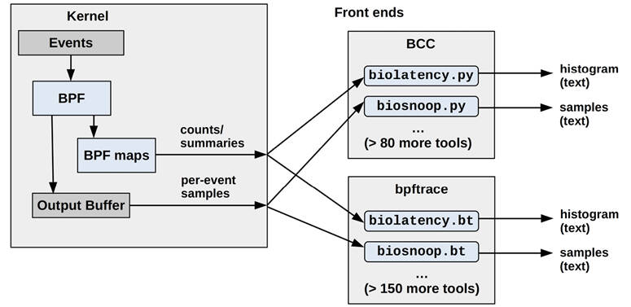
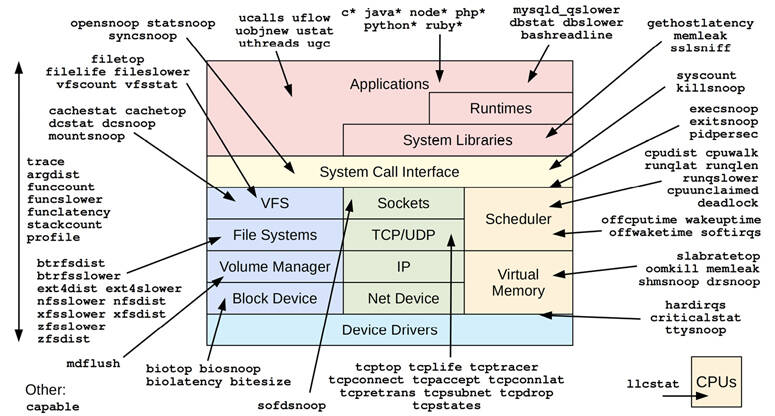
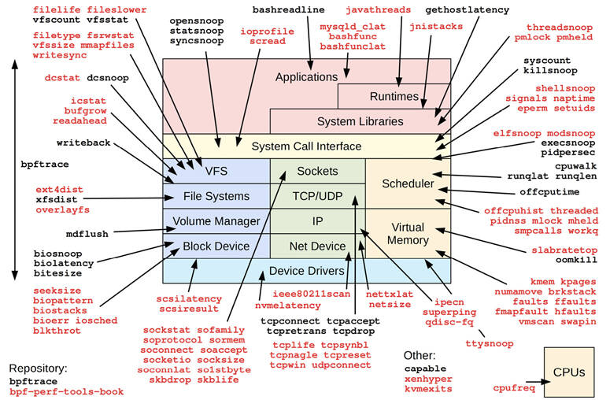

# Chapter 15

## BPF

This chapter describes the BCC and bpftrace tracing front ends for extended BPF. These front ends provide a collection of performance analysis tools, and these tools were used in previous chapters. The BPF technology was introduced in [Chapter 3](ch03.md), [Operating System](ch03.md), [Section 3.4.4](ch03.md), [Extended BPF](ch03.md). In summary, extended BPF is a kernel execution environment that can provide programmatic capabilities to tracers.

This chapter, along with [Chapter 13](ch13.md), [perf](ch13.md), and [Chapter 14](ch14.md), [Ftrace](ch14.md), are optional reading for those who wish to learn one or more system tracers in more detail.

Extended BPF tools can be used to answer questions such as:

- What is the latency of disk I/O, as a histogram?
- Is CPU scheduler latency high enough to cause problems?
- Are applications suffering file system latency?
- What TCP sessions are occurring and with what durations?
- What code paths are blocking and for how long?

What makes BPF different from other tracers is that it is programmable. It allows user-defined programs to be executed on events, programs that can perform filtering, save and retrieve information, calculate latency, perform in-kernel aggregation and custom summaries, and more. While other tracers may require dumping all events to user space and post-processing them, BPF allows such processing to occur efficiently in kernel context. This makes it practical to create performance tools that would otherwise cost too much overhead for production use.

This chapter has a major section for each recommended front end. Key sections are:

- [15.1: BCC](ch15.md)
  
  - [15.1.1: Installation](ch15.md)
  - [15.1.2: Tool Coverage](ch15.md)
  - [15.1.3: Single-Purpose Tools](ch15.md)
  - [15.1.4: Multi-Purpose Tools](ch15.md)
  - [15.1.5: One-Liners](ch15.md)
- [15.2: bpftrace](ch15.md)
  
  - [15.2.1: Installation](ch15.md)
  - [15.2.2: Tools](ch15.md)
  - [15.2.3: One-Liners](ch15.md)
  - [15.2.4: Programming](ch15.md)
  - [15.2.5: Reference](ch15.md)

The differences between BCC and bpftrace may be obvious from their usage in prior chapters: BCC is suited for complex tools, and bpftrace is suited for ad hoc custom programs. Some tools are implemented in both, as shown in [Figure 15.1](ch15.md).



Figure 15.1 BPF tracing front ends

Specific differences between BCC and bpftrace are summarized in [Table 15.1](ch15.md).

Table 15.1 **BCC versus bpftrace**

**Characteristic**

**BCC**

**bpftrace**

Number of tools by repository

&gt;80 (bcc)

&gt;30 (bpftrace)

&gt;120 (bpf-perf-tools-book)

Tool usage

Typically supports complex options (`-h`, `-P PID`, etc.) and arguments

Typically simple: no options, and zero or one argument

Tool documentation

Man pages, example files

Man pages, example files

Programming language

User-space: Python, Lua, C, or C++ Kernel-space: C

bpftrace

Programming difficulty

Difficult

Easy

Per-event output types

Anything

Text, JSON

Summary types

Anything

Counts, min, max, sum, avg, log2 histograms, linear histograms; by zero or more keys

Library support

Yes (e.g., Python import)

No

Average program length[1](ch15.md) (no comments)

228 lines

28 lines

[1](ch15.md)Based on the tools provided in the official repository and my BPF book repository.

Both BCC and bpftrace are in use at many companies including Facebook and Netflix. Netflix installs them by default on all cloud instances, and uses them for deeper analysis after cloud-wide monitoring and dashboards, specifically [\[Gregg 18e\]](ch15.md):

- **BCC**: Canned tools are used at the command line to analyze storage I/O, network I/O, and process execution, when needed. Some BCC tools are automatically executed by a graphical performance dashboard system to provide data for scheduler and disk I/O latency heat maps, off-CPU flame graphs, and more. Also, a custom BCC tool is always running as a daemon (based on tcplife(8)) logging network events to cloud storage for flow analysis.
- **bpftrace**: Custom bpftrace tools are developed when needed to understand kernel and application pathologies.

The following sections explain BCC tools, bpftrace tools, and bpftrace programming.

### 15.1 BCC

The BPF Compiler Collection (or “bcc” after the project and package names) is an open-source project containing a large collection of advanced performance analysis tools, as well as a framework for building them. BCC was created by Brenden Blanco; I’ve helped with its development and created many of the tracing tools.

As an example of a BCC tool, biolatency(8) shows the distribution of disk I/O latency as power-of-two histograms, and can break it down by I/O flags:

[Click here to view code image](ch15_images.md)

```
# biolatency.py -mF
Tracing block device I/O... Hit Ctrl-C to end.
^C

flags = Priority-Metadata-Read
     msecs               : count     distribution
         0 -> 1          : 90       |****************************************|

flags = Write
     msecs               : count     distribution
         0 -> 1          : 24       |****************************************|
         2 -> 3          : 0        |                                        |
         4 -> 7          : 8        |*************                           |

flags = ReadAhead-Read
     msecs               : count     distribution
         0 -> 1          : 3031     |****************************************|
         2 -> 3          : 10       |                                        |
         4 -> 7          : 5        |                                        |
         8 -> 15         : 3        |                                        |
```

This output shows a bi-model write distribution, and many I/O with flags “ReadAhead-Read”. This tool uses BPF to summarize the histograms in kernel space for efficiency, so the user-space component only needs to read the already-summarized histograms (the count columns) and print them.

These BCC tools typically have usage messages (`-h`), man pages, and examples files in the BCC repository:

[https://github.com/iovisor/bcc](https://github.com/iovisor/bcc)

This section summarizes BCC and its single- and multi-purpose performance analysis tools.

#### 15.1.1 Installation

Packages of BCC are available for many Linux distributions, including Ubuntu, Debian, RHEL, Fedora, and Amazon Linux, making installation trivial. Search for “bcc-tools” or “bpfcc-tools” or “bcc” (package maintainers have named it differently).

You can also build BCC from source. For the latest install and build instructions, check INSTALL.md in the BCC repository \[Iovisor 20b]. The INSTALL.md also lists kernel configuration requirements (which include CONFIG\_BPF=y, CONFIG\_BPF\_SYSCALL=y, CONFIG\_BPF\_EVENTS=y). BCC requires at least Linux 4.4 for some of the tools to work; for most of the tools, 4.9 or newer is required.

#### 15.1.2 Tool Coverage

BCC tracing tools are pictured in [Figure 15.2](ch15.md) (some are grouped using wildcards: e.g., `java*` is for all tools beginning with “java”).



Figure 15.2 BCC tools

Many are single-purpose tools shown with a single arrow head; some are multi-purpose tools listed on the left with a double arrow to show their coverage.

#### 15.1.3 Single-Purpose Tools

I developed many of these according to the same “do one job and do it well” philosophy as those in perf-tools in [Chapter 14](ch14.md). This design includes making their default output concise and often just sufficient. You can “just run biolatency” without needing to learn any command line options, and usually get just enough output to solve your problem without clutter. Options typically do exist for customization, such as biolatency(8) `-F` to breakdown by I/O flags, shown earlier.

A selection of single-purpose tools are described in [Table 15.2](ch15.md), including their location in this book if present. See the BCC repository for the full list [\[Iovisor 20a\]](ch15.md).

Table 15.2 **Selected single-purpose BCC tools**

**Tool**

**Description**

**Section**

biolatency(8)

Summarize block I/O (disk I/O) latency as a histogram

[9.6.6](ch09.md)

biotop(8)

Summarize block I/O by process

[9.6.8](ch09.md)

biosnoop(8)

Trace block I/O with latency and other details

[9.6.7](ch09.md)

bitesize(8)

Summarize block I/O size as process histograms

\-

btrfsdist(8)

Summarize btrfs operation latency as histograms

[8.6.13](ch08.md)

btrfsslower(8)

Trace slow btrfs operations

[8.6.14](ch08.md)

cpudist(8)

Summarize on- and off-CPU time per process as a histogram

[6.6.15](ch06.md), [16.1.7](ch16.md)

cpuunclaimed(8)

Show CPU that is unclaimed and idle despite demand

\-

criticalstat(8)

Trace long atomic critical kernel sections

\-

dbslower(8)

Trace database slow queries

\-

dbstat(8)

Summarize database query latency as a histogram

\-

drsnoop(8)

Trace direct memory reclaim events with PID and latency

[7.5.11](ch07.md)

execsnoop(8)

Trace new processes via execve(2) syscalls

[1.7.3](ch01.md), [5.5.5](ch05.md)

ext4dist(8)

Summarize ext4 operation latency as histograms

[8.6.13](ch08.md)

ext4slower(8)

Trace slow ext4 operations

[8.6.14](ch08.md)

filelife(8)

Trace the lifespan of short-lived files

\-

gethostlatency(8)

Trace DNS latency via resolver functions

\-

hardinqs(8)

Summarize hardirq event times

[6.6.19](ch06.md)

killsnoop(8)

Trace signals issued by the kill(2) syscall

\-

klockstat(8)

Summarize kernel mutex lock statistics

\-

llcstat(8)

Summarize CPU cache references and misses by process

\-

memleak(8)

Show outstanding memory allocations

\-

mysqld\_qslower(8)

Trace MySQL slow queries

\-

nfsdist(8)

Trace slow NFS operations

[8.6.13](ch08.md)

nfsslower(8)

Summarize NFS operation latency as histograms

[8.6.14](ch08.md)

offcputime(8)

Summarize off-CPU time by stack trace

[5.5.3](ch05.md)

offwaketime(8)

Summarize blocked time by off-CPU stack and waker stack

\-

oomkill(8)

Trace the out-of-memory (OOM) killer

\-

opensnoop(8)

Trace open(2)-family syscalls

[8.6.10](ch08.md)

profile(8)

Profile CPU usage using timed sampling of stack traces

[5.5.2](ch05.md)

runqlat(8)

Summarize run queue (scheduler) latency as a histogram

[6.6.16](ch06.md)

runqlen(8)

Summarize run queue length using timed sampling

[6.6.17](ch06.md)

runqslower(8)

Trace long run queue delays

\-

syncsnoop(8)

Trace sync(2)-family syscalls

\-

syscount(8)

Summarize syscall counts and latencies

[5.5.6](ch05.md)

tcplife(8)

Trace TCP sessions and summarize their lifespan

[10.6.9](ch10.md)

tcpretrans(8)

Trace TCP retransmits with details including kernel state

[10.6.11](ch10.md)

tcptop(8)

Summarize TCP send/recv throughput by host and PID

[10.6.10](ch10.md)

wakeuptime(8)

Summarize sleep to wakeup time by waker stack

\-

xfsdist(8)

Summarize xfs operation latency as histograms

[8.6.13](ch08.md)

xfsslower(8)

Trace slow xfs operations

[8.6.14](ch08.md)

zfsdist(8)

Summarize zfs operation latency as histograms

[8.6.13](ch08.md)

zfsslower(8)

Trace slow zfs operations

[8.6.14](ch08.md)

For examples of these, see previous chapters as well as the \*\_example.txt files in the BCC repository (many of which I also wrote). For the tools not covered in this book, also see [\[Gregg 19\]](ch15.md).

#### 15.1.4 Multi-Purpose Tools

The multi-purpose tools are listed on the left of [Figure 15.2](ch15.md). These support multiple event sources and can perform many roles, similar to perf(1), although this also makes them complex to use. They are described in [Table 15.3](ch15.md).

Table 15.3 **Multi-purpose perf-tools**

**Tool**

**Description**

**Section**

argdist(8)

Display function parameter values as a histogram or count

15.1.15

funccount(8)

Count kernel or user-level function calls

15.1.15

funcslower(8)

Trace slow kernel or user-level function calls

\-

funclatency(8)

Summarize function latency as a histogram

\-

stackcount(8)

Count stack traces that led to an event

15.1.15

trace(8)

Trace arbitrary functions with filters

15.1.15

To help you remember useful invocations, you can collect one-liners. I have provided some in the next section, similar to my one-liner sections for perf(1) and trace-cmd.

#### 15.1.5 One-Liners

The following one-liners trace system-wide until Ctrl-C is typed, unless otherwise specified. They are grouped by tool.

##### funccount(8)

Count VFS kernel calls:

```
funcgraph 'vfs_*'
```

Count TCP kernel calls:

```
funccount 'tcp_*'
```

Count TCP send calls per second:

```
funccount -i 1 'tcp_send*'
```

Show the rate of block I/O events per second:

```
funccount -i 1 't:block:*'
```

Show the rate of libc getaddrinfo() (name resolution) per second:

```
funccount -i 1 c:getaddrinfo
```

##### stackcount(8)

Count stack traces that created block I/O:

[Click here to view code image](ch15_images.md)

```
stackcount t:block:block_rq_insert
```

Count stack traces that led to sending IP packets, with responsible PID:

```
stackcount -P ip_output
```

Count stack traces that led to the thread blocking and moving off-CPU:

[Click here to view code image](ch15_images.md)

```
stackcount t:sched:sched_switch
```

##### trace(8)

Trace the kernel do\_sys\_open() function with the filename:

[Click here to view code image](ch15_images.md)

```
trace 'do_sys_open "%s", arg2'
```

Trace the return of the kernel function do\_sys\_open() and print the return value:

[Click here to view code image](ch15_images.md)

```
trace 'r::do_sys_open "ret: %d", retval'
```

Trace the kernel function do\_nanosleep() with mode and user-level stacks:

[Click here to view code image](ch15_images.md)

```
trace -U 'do_nanosleep "mode: %d", arg2'
```

Trace authentication requests via the pam library:

[Click here to view code image](ch15_images.md)

```
trace 'pam:pam_start "%s: %s", arg1, arg2'
```

##### argdist(8)

Summarize VFS reads by return value (size or error):

```
argdist -H 'r::vfs_read()'
```

Summarize libc read() by return value (size or error) for PID 1005:

[Click here to view code image](ch15_images.md)

```
argdist -p 1005 -H 'r:c:read()'
```

Count syscalls by syscall ID:

[Click here to view code image](ch15_images.md)

```
argdist.py -C 't:raw_syscalls:sys_enter():int:args->id'
```

Summarize the kernel function tcp\_sendmsg() size argument using counts:

[Click here to view code image](ch15_images.md)

```
argdist -C 'p::tcp_sendmsg(struct sock *sk, struct msghdr *msg, size_t size):u32:size'
```

Summarize tcp\_sendmsg() size as a power-of-two histogram:

[Click here to view code image](ch15_images.md)

```
argdist -H 'p::tcp_sendmsg(struct sock *sk, struct msghdr *msg, size_t size):u32:size'
```

Count the libc write() call for PID 181 by file descriptor:

[Click here to view code image](ch15_images.md)

```
argdist -p 181 -C 'p:c:write(int fd):int:fd'
```

Summarize reads by process where latency was &gt;100 μs:

[Click here to view code image](ch15_images.md)

```
argdist -C 'r::__vfs_read():u32:$PID:$latency > 100000
```

#### 15.1.6 Multi-Tool Example

As an example of using a multi-tool, the following shows the trace(8) tool tracing the kernel function do\_sys\_open(), and printing the second argument as a string:

[Click here to view code image](ch15_images.md)

```
# trace 'do_sys_open "%s", arg2'
PID     TID     COMM        FUNC             -
28887   28887   ls          do_sys_open      /etc/ld.so.cache
28887   28887   ls          do_sys_open      /lib/x86_64-linux-gnu/libselinux.so.1
28887   28887   ls          do_sys_open      /lib/x86_64-linux-gnu/libc.so.6
28887   28887   ls          do_sys_open      /lib/x86_64-linux-gnu/libpcre2-8.so.0
28887   28887   ls          do_sys_open      /lib/x86_64-linux-gnu/libdl.so.2
28887   28887   ls          do_sys_open      /lib/x86_64-linux-gnu/libpthread.so.0
28887   28887   ls          do_sys_open      /proc/filesystems
28887   28887   ls          do_sys_open      /usr/lib/locale/locale-archive
[...]
```

The trace syntax is inspired by printf(3), supporting a format string and arguments. In this case arg2, the second argument, was printed as a string because it contains the filename.

Both trace(8) and argdist(8) support syntax that allows many custom one-liners to be created. bpftrace, covered in the following sections, takes this further, providing a fully fledged language for writing one-line or multi-line programs.

#### 15.1.7 BCC vs. bpftrace

The differences were summarized at the start of this chapter. BCC is suited for custom and complex tools, which support a variety of arguments, or use a variety of libraries. bpftrace is well suited for one-liners or short tools that accept no arguments, or a single-integer argument. BCC allows the BPF program at the heart of the tracing tool to be developed in C, enabling full control. This comes at the cost of complexity: BCC tools can take ten times as long to develop as bpftrace tools, and can have ten times as many lines of code. Since developing a tool typically requires multiple iterations, I’ve found that it saves time to first develop tools in bpftrace, which is quicker, and then port them to BCC if needed.

The difference between BCC and bpftrace is like the difference between C programming and shell scripting, where BCC is like C programming (some of it *is* C programming) and bpftrace is like shell scripting. In my daily work I use many pre-built C programs (top(1), vmstat(1), etc.) and develop custom one-off shell scripts. Likewise, I also use many pre-built BCC tools, and develop custom one-off bpftrace tools.

I have provided material in this book to support this usage: many chapters show the BCC tools you can use, and the later sections in this chapter show how you can develop custom bpftrace tools.

#### 15.1.8 Documentation

Tools typically have a usage message to summarize their syntax. For example:

[Click here to view code image](ch15_images.md)

```
# funccount -h
usage: funccount [-h] [-p PID] [-i INTERVAL] [-d DURATION] [-T] [-r] [-D]
                 pattern

Count functions, tracepoints, and USDT probes

positional arguments:
  pattern               search expression for events

optional arguments:
  -h, --help            show this help message and exit
  -p PID, --pid PID     trace this PID only
  -i INTERVAL, --interval INTERVAL
                        summary interval, seconds
  -d DURATION, --duration DURATION
                        total duration of trace, seconds
  -T, --timestamp       include timestamp on output
  -r, --regexp          use regular expressions. Default is "*" wildcards
                        only.
  -D, --debug           print BPF program before starting (for debugging
                        purposes)
examples:
    ./funccount 'vfs_*'             # count kernel fns starting with "vfs"
    ./funccount -r '^vfs.*'         # same as above, using regular expressions
    ./funccount -Ti 5 'vfs_*'       # output every 5 seconds, with timestamps
    ./funccount -d 10 'vfs_*'       # trace for 10 seconds only
    ./funccount -p 185 'vfs_*'      # count vfs calls for PID 181 only
    ./funccount t:sched:sched_fork  # count calls to the sched_fork tracepoint
    ./funccount -p 185 u:node:gc*   # count all GC USDT probes in node, PID 185
    ./funccount c:malloc            # count all malloc() calls in libc
    ./funccount go:os.*             # count all "os.*" calls in libgo
    ./funccount -p 185 go:os.*      # count all "os.*" calls in libgo, PID 185
    ./funccount ./test:read*        # count "read*" calls in the ./test binary
```

Every tool also has a man page (man/man8/funccount.8) and an examples file (examples/funccount\_example.txt) in the bcc repository. The examples file contains output examples with commentary.

I have also created the following documentation in the BCC repository [\[Iovisor 20b\]](ch15.md):

- Tutorial for end users: docs/tutorial.md
- Tutorial for BCC developers: docs/tutorial\_bcc\_python\_developer.md
- Reference Guide: docs/reference\_guide.md

[Chapter 4](ch04.md) in my earlier book focuses on BCC [\[Gregg 19\]](ch15.md).

### 15.2 bpftrace

bpftrace is an open-source tracer built upon BPF and BCC, which provides not only a suite of performance analysis tools, but also a high-level language to help you develop new ones. The language has been designed to be simple and easy to learn. It is the awk(1) of tracing, and is based on awk(1). In awk(1), you write a program stanza to process an input line, and with bpftrace you write a program stanza to process an input event. bpftrace was created by Alastair Robertson, and I have become a major contributor.

As an example of bpftrace, the following one-liner shows the distribution of TCP receive message size by process name:

[Click here to view code image](ch15_images.md)

```
# bpftrace -e 'kr:tcp_recvmsg /retval >= 0/ { @recv_bytes[comm] = hist(retval); }'
Attaching 1 probe...
^C

@recv_bytes[sshd]:
[32, 64)               7 |@@@@@@@@@@@@@@@@@@@@@@@@@@@@@@@@@@@@@@@@@@@@@@@@@@@@|
[64, 128)              2 |@@@@@@@@@@@@@@                                      |
@recv_bytes[nodejs]:
[0]                   82 |@@@@@@@@@@@@@@@@@@@@@@@@@@                          |
[1]                  135 |@@@@@@@@@@@@@@@@@@@@@@@@@@@@@@@@@@@@@@@@@@@@        |
[2, 4)               153 |@@@@@@@@@@@@@@@@@@@@@@@@@@@@@@@@@@@@@@@@@@@@@@@@@@  |
[4, 8)                12 |@@@                                                 |
[8, 16)                6 |@                                                   |
[16, 32)              32 |@@@@@@@@@@                                          |
[32, 64)             158 |@@@@@@@@@@@@@@@@@@@@@@@@@@@@@@@@@@@@@@@@@@@@@@@@@@@@|
[64, 128)            155 |@@@@@@@@@@@@@@@@@@@@@@@@@@@@@@@@@@@@@@@@@@@@@@@@@@@ |
[128, 256)            14 |@@@@                                                |
```

This output shows nodejs processes that have a bi-modal receive size, with one mode roughly 0 to 4 bytes and another between 32 and 128 bytes.

Using a concise syntax, this bpftrace one-liner has used a kretprobe to instrument tcp\_recvmsg(), filtered for when the return value is positive (to exclude negative error codes), and populated a BPF map object called `@recv_bytes` with a histogram of the return value, saved using the process name (`comm`) as a key. When Ctrl-C is typed and bpftrace receives the signal (SIGINT) it ends and automatically prints out BPF maps. This syntax is explained in more detail in the following sections.

As well as enabling you to code your own one-liners, bpftrace ships with many ready-to-run tools in its repository:

[https://github.com/iovisor/bpftrace](https://github.com/iovisor/bpftrace)

This section summarizes bpftrace tools and the bpftrace programming language. This is based on my bpftrace material in [\[Gregg 19\]](ch15.md), which explores bpftrace in more depth.

#### 15.2.1 Installation

Packages of bpftrace are available for many Linux distributions, including Ubuntu, making installation trivial. Search for packages named “bpftrace”; they exist for Ubuntu, Fedora, Gentoo, Debian, OpenSUSE, and CentOS. RHEL 8.2 has bpftrace as a Technology Preview.

Apart from packages, there are also Docker images of bpftrace, bpftrace binaries that require no dependencies other than glibc, and instructions for building bpftrace from source. For documentation on these options see INSTALL.md in the bpftrace repository \[Iovisor 20a], which also lists kernel requirements (which include CONFIG\_BPF=y, CONFIG\_BPF\_SYSCALL=y, CONFIG\_BPF\_EVENTS=y). bpftrace requires Linux 4.9 or newer.

#### 15.2.2 Tools

bpftrace tracing tools are pictured in [Figure 15.3](ch15.md).



Figure 15.3 bpftrace tools

The tools in the bpftrace repository are shown in black. For my prior book, I developed many more bpftrace tools and released them as open source in the bpf-perf-tools-book repository: they are shown in red/gray [\[Gregg 19g\]](ch15.md).

#### 15.2.3 One-Liners

The following one-liners trace system-wide until Ctrl-C is typed, unless otherwise specified. Apart from their intrinsic usefulness, they can also serve as mini-examples of the bpftrace programming language. These are grouped by target. Longer lists of bpftrace one-liners can be found in each resource chapter.

##### CPUs

Trace new processes with arguments:

[Click here to view code image](ch15_images.md)

```
bpftrace -e 'tracepoint:syscalls:sys_enter_execve { join(args->argv); }'
```

Count syscalls by process:

[Click here to view code image](ch15_images.md)

```
bpftrace -e 'tracepoint:raw_syscalls:sys_enter { @[pid, comm] = count(); }'
```

Sample user-level stacks at 49 Hertz, for PID 189:

[Click here to view code image](ch15_images.md)

```
bpftrace -e 'profile:hz:49 /pid == 189/ { @[ustack] = count(); }'
```

##### Memory

Count process heap expansion (brk()) by code path:

[Click here to view code image](ch15_images.md)

```
bpftrace -e tracepoint:syscalls:sys_enter_brk { @[ustack, comm] = count(); }
```

Count user page faults by user-level stack trace:

[Click here to view code image](ch15_images.md)

```
bpftrace -e 'tracepoint:exceptions:page_fault_user { @[ustack, comm] =
    count(); }'
```

Count vmscan operations by tracepoint:

[Click here to view code image](ch15_images.md)

```
bpftrace -e 'tracepoint:vmscan:* { @[probe]++; }'
```

##### File Systems

Trace files opened via openat(2) with process name:

[Click here to view code image](ch15_images.md)

```
bpftrace -e 't:syscalls:sys_enter_openat { printf("%s %s\n", comm,
    str(args->filename)); }'
```

Show the distribution of read() syscall read bytes (and errors):

[Click here to view code image](ch15_images.md)

```
bpftrace -e 'tracepoint:syscalls:sys_exit_read { @ = hist(args->ret); }'
```

Count VFS calls:

[Click here to view code image](ch15_images.md)

```
bpftrace -e 'kprobe:vfs_* { @[probe] = count(); }'
```

Count ext4 tracepoint calls:

[Click here to view code image](ch15_images.md)

```
bpftrace -e 'tracepoint:ext4:* { @[probe] = count(); }'
```

##### Disk

Summarize block I/O size as a histogram:

[Click here to view code image](ch15_images.md)

```
bpftrace -e 't:block:block_rq_issue { @bytes = hist(args->bytes); }'
```

Count block I/O request user stack traces:

[Click here to view code image](ch15_images.md)

```
bpftrace -e 't:block:block_rq_issue { @[ustack] = count(); }'
```

Count block I/O type flags:

[Click here to view code image](ch15_images.md)

```
bpftrace -e 't:block:block_rq_issue { @[args->rwbs] = count(); }'
```

##### Networking

Count socket accept(2)s by PID and process name:

[Click here to view code image](ch15_images.md)

```
bpftrace -e 't:syscalls:sys_enter_accept* { @[pid, comm] = count(); }'
```

Count socket send/receive bytes by on-CPU PID and process name:

[Click here to view code image](ch15_images.md)

```
bpftrace -e 'kr:sock_sendmsg,kr:sock_recvmsg /retval > 0/ {
    @[pid, comm] = sum(retval); }'
```

TCP send bytes as a histogram:

[Click here to view code image](ch15_images.md)

```
bpftrace -e 'k:tcp_sendmsg { @send_bytes = hist(arg2); }'
```

TCP receive bytes as a histogram:

[Click here to view code image](ch15_images.md)

```
bpftrace -e 'kr:tcp_recvmsg /retval >= 0/ { @recv_bytes = hist(retval); }'
```

UDP send bytes as a histogram:

[Click here to view code image](ch15_images.md)

```
bpftrace -e 'k:udp_sendmsg { @send_bytes = hist(arg2); }'
```

##### Applications

Sum malloc() requested bytes by user stack trace (high overhead):

[Click here to view code image](ch15_images.md)

```
bpftrace -e 'u:/lib/x86_64-linux-gnu/libc-2.27.so:malloc { @[ustack(5)] =
    sum(arg0); }'
```

Trace kill() signals showing sender process name, target PID, and signal number:

[Click here to view code image](ch15_images.md)

```
bpftrace -e 't:syscalls:sys_enter_kill { printf("%s -> PID %d SIG %d\n",
    comm, args->pid, args->sig); }'
```

##### Kernel

Count system calls by syscall function:

[Click here to view code image](ch15_images.md)

```
bpftrace -e 'tracepoint:raw_syscalls:sys_enter {
    @[ksym(*(kaddr("sys_call_table") + args->id * 8))] = count(); }'
```

Count kernel function calls starting with “attach”:

[Click here to view code image](ch15_images.md)

```
bpftrace -e 'kprobe:attach* { @[probe] = count(); }'
```

Frequency count the third argument to vfs\_write() (the size):

[Click here to view code image](ch15_images.md)

```
bpftrace -e 'kprobe:vfs_write { @[arg2] = count(); }'
```

Time the kernel function vfs\_read() and summarize as a histogram:

[Click here to view code image](ch15_images.md)

```
bpftrace -e 'k:vfs_read { @ts[tid] = nsecs; } kr:vfs_read /@ts[tid]/ {
    @ = hist(nsecs - @ts[tid]); delete(@ts[tid]); }'
```

Count context switch stack traces:

[Click here to view code image](ch15_images.md)

```
bpftrace -e 't:sched:sched_switch { @[kstack, ustack, comm] = count(); }'
```

Sample kernel-level stacks at 99 Hertz, excluding idle:

[Click here to view code image](ch15_images.md)

```
bpftrace -e 'profile:hz:99 /pid/ { @[kstack] = count(); }'
```

#### 15.2.4 Programming

This section provides a short guide to using bpftrace and programming in the bpftrace language. The format of this section was inspired by the original paper for awk [\[Aho 78\]](ch15.md)[\[Aho 88\]](ch15.md), which covered that language in six pages. The bpftrace language itself is inspired by both awk and C, and by tracers including DTrace and SystemTap.

The following is an example of bpftrace programming: It measures the time in the vfs\_read() kernel function and prints the time, in microseconds, as a histogram.

[Click here to view code image](ch15_images.md)

```
#!/usr/local/bin/bpftrace

// this program times vfs_read()

kprobe:vfs_read
{
        @start[tid] = nsecs;
}

kretprobe:vfs_read
/@start[tid]/
{
        $duration_us = (nsecs - @start[tid]) / 1000;
        @us = hist($duration_us);
        delete(@start[tid]);
}
```

The following sections explain the components of this tool, and can be treated as a tutorial. [Section 15.2.5](ch15.md), [Reference](ch15.md), is a reference guide summary including probe types, tests, operators, variables, functions, and map types.

##### 1. Usage

The command

```
bpftrace -e program
```

will execute the program, instrumenting any events that it defines. The program will run until Ctrl-C, or until it explicitly calls `exit()`. A bpftrace program run as a `-e` argument is termed a *one-liner*. Alternatively, the program can be saved to a file and executed using:

```
bpftrace file.bt
```

The .bt extension is not necessary, but is helpful for later identification. By placing an interpreter line at the top of the file[2](ch15.md)

[2](ch15.md)Some people prefer using #!/usr/bin/env bpftrace, so that bpftrace can be found from $PATH. However, env(1) comes with various problems, and its usage in other projects has been reverted.

```
#!/usr/local/bin/bpftrace
```

the file can be made executable (`chmod a+x file.bt`) and run like any other program:

```
./file.bt
```

bpftrace must be executed by the root user (super-user).[3](ch15.md) For some environments, the root shell may be used to execute the program directly, whereas other environments may have a preference for running privileged commands via sudo(1):

```
sudo ./file.bt
```

[3](ch15.md)bpftrace checks for UID 0; a future update may check for specific privileges.

##### 2. Program Structure

A bpftrace program is a series of probes with associated actions:

```
probes { actions }
probes { actions }
...
```

When the probes fire, the associated action is executed. An optional filter expression can be included before the action:

```
probes /filter/ { actions }
```

The action only fires if the filter expression is true. This resembles the awk(1) program structure:

```
/pattern/ { actions }
```

awk(1) programming is also similar to bpftrace programming: Multiple action blocks can be defined, and they may execute in any order, triggered when their pattern, or probe + filter expression, is true.

##### 3. Comments

For bpftrace program files, single-line comments can be added with a “`//`” prefix:

```
// this is a comment
```

These comments will not be executed. Multi-line comments use the same format as those in C:

```
/*
 * This is a
 * multi-line comment.
 */
```

This syntax can also be used for partial-line comments (e.g., `/* comment */`).

##### 4. Probe Format

A probe begins with a probe type name and then a hierarchy of colon-delimited identifiers:

[Click here to view code image](ch15_images.md)

```
type:identifier1[:identifier2[...]]
```

The hierarchy is defined by the probe type. Consider these two examples:

```
kprobe:vfs_read
uprobe:/bin/bash:readline
```

The kprobe probe type instruments kernel function calls, and only needs one identifier: the kernel function name. The uprobe probe type instruments user-level function calls, and needs both the path to the binary and the function name.

Multiple probes can be specified with comma separators to execute the same actions. For example:

```
probe1,probe2,... { actions }
```

There are two special probe types that require no additional identifiers: BEGIN and END fire for the beginning and the end of the bpftrace program (just like awk(1)). For example, to print an informational message when tracing begins:

[Click here to view code image](ch15_images.md)

```
BEGIN { printf("Tracing. Hit Ctrl-C to end.\n"); }
```

To learn more about the probe types and their usage, see [Section 15.2.5](ch15.md), [Reference](ch15.md), under the heading 1. Probe Types.

##### 5. Probe Wildcards

Some probe types accept wildcards. The probe

```
kprobe:vfs_*
```

will instrument all kprobes (kernel functions) that begin with “vfs\_”.

Instrumenting too many probes may cost unnecessary performance overhead. To avoid hitting this by accident, bpftrace has a tunable maximum number of probes it will enable, set via the BPFTRACE\_MAX\_PROBES environment variable (it currently defaults to 512[4](ch15.md)).

[4](ch15.md)More than 512 currently makes bpftrace slow to start up and shut down, as it instruments them one by one. Future kernel work is planned to batch probe instrumentation. At that point, this limit can be greatly increased, or even removed.

You can test your wildcards before using them by running `bpftrace -l` to list the matched probes:

[Click here to view code image](ch15_images.md)

```
# bpftrace -l 'kprobe:vfs_*'
kprobe:vfs_fallocate
kprobe:vfs_truncate
kprobe:vfs_open
kprobe:vfs_setpos
kprobe:vfs_llseek
[…]
bpftrace -l 'kprobe:vfs_*' | wc -l
56
```

This matched 56 probes. The probe name is in quotes to prevent unintended shell expansion.

##### 6. Filters

Filters are Boolean expressions that gate whether an action is executed. The filter

```
/pid == 123/
```

will execute the action only if the pid built-in (process ID) is equal to 123.

If a test is not specified

```
/pid/
```

the filter will check that the contents are non-zero (`/pid/` is the same as `/pid != 0/`). Filters can be combined with Boolean operators, such as logical AND (`&&`). For example:

```
/pid > 100 && pid < 1000/
```

This requires that both expressions evaluate to “true.”

##### 7. Actions

An action can be a single statement or multiple statements separated by semicolons:

[Click here to view code image](ch15_images.md)

```
{ action one; action two; action three }
```

The final statement may also have a semicolon appended. The statements are written in the bpftrace language, which is similar to the C language, and can manipulate variables and execute bpftrace function calls. For example, the action

[Click here to view code image](ch15_images.md)

```
{ $x = 42; printf("$x is %d", $x); }
```

sets a variable, `$x`, to 42, and then prints it using `printf()`. For a summary of other available function calls, see [Section 15.2.5](ch15.md), [Reference](ch15.md), under headings 4. Functions and 5. Map Functions.

##### 8. Hello, World!

You should now understand the following basic program, which prints “Hello, World!” when bpftrace begins running:

[Click here to view code image](ch15_images.md)

```
# bpftrace -e 'BEGIN { printf("Hello, World!\n"); }'
Attaching 1 probe...
Hello, World!
^C
```

As a file, it could be formatted as:

```
#!/usr/local/bin/bpftrace

BEGIN
{
        printf("Hello, World!\n");
}
```

Spanning multiple lines with an indented action block is not necessary, but it improves readability.

##### 9 Functions

In addition to `printf()` for printing formatted output, other built-in functions include:

- **`exit()`** : Exits bpftrace
- **`str(char *)`** : Returns a string from a pointer
- **`system(format[, arguments ...])`** : Runs a command at the shell

The action

[Click here to view code image](ch15_images.md)

```
printf("got: %llx %s\n", $x, str($x)); exit();
```

will print the `$x` variable as a hex integer, and then treat it as a NULL-terminated character array pointer (char \*) and print it as a string, and then exit.

##### 10 Variables

There are three variable types: built-ins, scratch, and maps.

**Built-in variables** are pre-defined and provided by bpftrace, and are usually read-only sources of information. They include `pid` for the process id, `comm` for the process name, `nsecs` for a timestamp in nanoseconds, and `curtask` for the address of the current thread’s task\_struct.

**Scratch variables** can be used for temporary calculations and have the prefix “`$`”. Their name and type is set on their first assignment. The statements:

[Click here to view code image](ch15_images.md)

```
$x = 1;
$y = “hello”;
$z = (struct task_struct *)curtask;
```

declare `$x` as an integer, `$y` as a string, and `$z` as a pointer to a struct task\_struct. These variables can only be used in the action block in which they were assigned. If variables are referenced without an assignment, bpftrace prints an error (which can help you catch typos).

**Map variables** use the BPF map storage object and have the prefix “`@`”. They can be used for global storage, passing data between actions. The program:

```
probe1 { @a = 1; }
probe2 { $x = @a; }
```

assigns 1 to `@a` when probe1 fires, then assigns `@a` to `$x` when probe2 fires. If probe1 fired first and then probe2, `$x` would be set to 1; otherwise 0 (uninitialized).

A key can be provided with one or more elements, using maps as a hash table (an associative array). The statement

```
@start[tid] = nsecs;
```

is frequently used: the `nsecs` built-in is assigned to a map named `@start` and keyed on `tid`, the current thread ID. This allows threads to store custom timestamps that won’t be overwritten by other threads.

```
@path[pid, $fd] = str(arg0);
```

is an example of a multi-key map, one using both the `pid` builtin and the `$fd` variable as keys.

##### 11 Map Functions

Maps can be assigned to special functions. These functions store and print data in custom ways. The assignment

```
@x = count();
```

counts events, and when printed will print the count. This uses a per-CPU map, and `@x` becomes a special object of type count. The following statement also counts events:

```
@x++;
```

However, this uses a global CPU map, instead of a per-CPU map, to provide `@x` as an integer. This global integer type is sometimes necessary for some programs that require an integer and not a count, but bear in mind that there may be a small error margin due to concurrent updates.

The assignment

```
@y = sum($x);
```

sums the `$x` variable, and when printed will print the total. The assignment

```
@z = hist($x);
```

stores `$x` in a power-of-two histogram, and when printed will print bucket counts and an ASCII histogram.

Some map functions operate directly on a map. For example:

```
print(@x);
```

will print the `@x` map. This can be used, for example, to print map contents on an interval event. This is not used often because, for convenience, all maps are automatically printed when bpftrace terminates.[5](ch15.md)

[5](ch15.md)There is also less overhead in printing maps when bpftrace terminates, as at runtime the maps are experiencing updates, which can slow down the map walk routine.

Some map functions operate on a map key. For example:

```
delete(@start[tid]);
```

deletes the key-value pair from the `@start` map where the key is `tid`.

##### 12. Timing vfs\_read()

You have now learned the syntax needed to understand a more involved and practical example. This program, vfsread.bt, times the vfs\_read kernel function and prints out a histogram of its duration in microseconds (us):

[Click here to view code image](ch15_images.md)

```
#!/usr/local/bin/bpftrace

// this program times vfs_read()

kprobe:vfs_read
{
        @start[tid] = nsecs;
}

kretprobe:vfs_read
/@start[tid]/
{
        $duration_us = (nsecs - @start[tid]) / 1000;
        @us = hist($duration_us);
        delete(@start[tid]);
}
```

This times the duration of the vfs\_read() kernel function by instrumenting its start using a kprobe and storing a timestamp in a `@start` hash keyed on thread ID, and then instrumenting its end by using a kretprobe and calculating the delta as: now - start. A filter is used to ensure that the start time was recorded; otherwise, the delta calculation becomes bogus for vfs\_read() calls that were in progress when tracing begins, as the end is seen but not the start (the delta would become: now - 0).

Sample output:

[Click here to view code image](ch15_images.md)

```
# bpftrace vfsread.bt
Attaching 2 probes...
^C

@us:
[0]                   23 |@                                                   |
[1]                  138 |@@@@@@@@@                                           |
[2, 4)               538 |@@@@@@@@@@@@@@@@@@@@@@@@@@@@@@@@@@@@@               |
[4, 8)               744 |@@@@@@@@@@@@@@@@@@@@@@@@@@@@@@@@@@@@@@@@@@@@@@@@@@@@|
[8, 16)              641 |@@@@@@@@@@@@@@@@@@@@@@@@@@@@@@@@@@@@@@@@@@@@        |
[16, 32)             122 |@@@@@@@@                                            |
[32, 64)              13 |                                                    |
[64, 128)             17 |@                                                   |
[128, 256)             2 |                                                    |
[256, 512)             0 |                                                    |
[512, 1K)              1 |                                                    |
```

The program ran until Ctrl-C was entered; then it printed this output and terminated. This histogram map was named “us” as a way to include units with the output, since the map name is printed out. By giving maps meaningful names like “bytes” and “latency\_ns” you can annotate the output and make it self-explanatory.

This script can be customized as needed. Consider changing the `hist()` assignment line to:

[Click here to view code image](ch15_images.md)

```
@us[pid, comm] = hist($duration_us);
```

This stores one histogram per process ID and process name pair. With traditional system tools, like iostat(1) and vmstat(1), the output is fixed and cannot be easily customized. But with bpftrace, the metrics you see can be further broken down into parts and enhanced with metrics from other probes until you have the answers you need.

See [Chapter 8](ch08.md), [File Systems](ch08.md), [Section 8.6.15](ch08.md), [BPFtrace](ch08.md), heading VFS Latency Tracing, for an extended example that breaks down vfs\_read() latency by type: file system, socket, etc.

#### 15.2.5 Reference

The following is a summary of the main components of bpftrace programming: probe types, flow control, variables, functions, and map functions.

##### 1. Probe Types

[Table 15.4](ch15.md) lists available probe types. Many of these also have a shortcut alias, which help create shorter one-liners.

Table 15.4 **bpftrace probe types**

**Type**

**Shortcut**

**Description**

`tracepoint`

`t`

Kernel static instrumentation points

`usdt`

`U`

User-level statically defined tracing

`kprobe`

`k`

Kernel dynamic function instrumentation

`kretprobe`

`kr`

Kernel dynamic function return instrumentation

`kfunc`

`f`

Kernel dynamic function instrumentation (BPF based)

`kretfunc`

`fr`

Kernel dynamic function return instrumentation (BPF based)

`uprobe`

`u`

User-level dynamic function instrumentation

`uretprobe`

`ur`

User-level dynamic function return instrumentation

`software`

`s`

Kernel software-based events

`hardware`

`h`

Hardware counter-based instrumentation

`watchpoint`

`w`

Memory watchpoint instrumentation

`profile`

`p`

Timed sampling across all CPUs

`interval`

`i`

Timed reporting (from one CPU)

`BEGIN`

 

Start of bpftrace

`END`

 

End of bpftrace

Most of these probe types are interfaces to existing kernel technologies. [Chapter 4](ch04.md) explains how these technologies work: kprobes, uprobes, tracepoints, USDT, and PMCs (used by the hardware probe type). The kfunc/kretfunc probe type is a new low-overhead interface based on eBPF trampolines and BTF.

Some probes may fire frequently, such as for scheduler events, memory allocations, and network packets. To reduce overhead, try to solve your problems by using less-frequent events wherever possible. If you are unsure about probe frequency, you can measure it using bpftrace. For example, counting vfs\_read() kprobe calls for one second only:

[Click here to view code image](ch15_images.md)

```
# bpftrace -e 'k:vfs_read { @ = count(); } interval:s:1 { exit(); }'
```

I chose a short duration to minimize the overhead cost, in case it was significant. What I would consider high or low frequency depends on your CPU speed, count, and headroom, and the cost of the probe instrumentation. As a rough guide for the computers of today, I would consider less than 100k kprobe or tracepoint events per second to be low frequency.

###### Probe Arguments

Each probe type provides different types of arguments for further context on events. For example, tracepoints provide the fields from the format file using their field names in an `args` data structure. For example, the following instruments the syscalls:sys\_enter\_read tracepoint and uses the `args->count` argument to record a histogram of the count argument (requested size):

[Click here to view code image](ch15_images.md)

```
bpftrace -e 'tracepoint:syscalls:sys_enter_read { @req_bytes = hist(args->count); }'
```

These fields can be listed from the format file in /sys or from bpftrace using `-lv`:

[Click here to view code image](ch15_images.md)

```
# bpftrace -lv 'tracepoint:syscalls:sys_enter_read'
tracepoint:syscalls:sys_enter_read
    int __syscall_nr;
    unsigned int fd;
    char * buf;
    size_t count;
```

See the online “bpftrace Reference Guide” for a description of each probe type and its arguments [\[Iovisor 20c\]](ch15.md).

##### 2. Flow Control

There are three types of tests in bpftrace: filters, ternary operators, and if statements. These tests conditionally change the flow of the program based on Boolean expressions, which support those shown in [Table 15.5](ch15.md).

Table 15.5 **bpftrace Boolean expressions**

**Expression**

**Description**

**`==`**

Equal to

**`!=`**

Not equal to

**`>`**

Greater than

**`<`**

Less than

**`>=`**

Greater than or equal to

**`<=`**

Less than or equal to

**`&&`**

And

**`||`**

Inclusive or

Expressions may be grouped using parentheses.

###### Filter

Introduced earlier, these gate whether an action is executed. Format:

```
probe /filter/ { action }
```

Boolean operators may be used. The filter `/pid == 123/` only executes the action if the `pid` built-in equals 123.

###### Ternary Operators

A ternary operator is a three-element operator composed of a test and two outcomes. Format:

[Click here to view code image](ch15_images.md)

```
test ? true_statement : false_statement
```

As an example, you can use a ternary operator to find the absolute value of `$x`:

```
$abs = $x >= 0 ? $x : - $x;
```

###### If Statements

If statements have the following syntax:

[Click here to view code image](ch15_images.md)

```
if (test) { true_statements }
if (test) { true_statements } else { false_statements }
```

One use case is with programs that perform different actions on IPv4 than on IPv6. For example (for simplicity, this ignores families other than IPv4 and IPv6):

[Click here to view code image](ch15_images.md)

```
if ($inet_family == $AF_INET) {
    // IPv4
    ...
} else {
    // assume IPv6
    ...
}
```

`else if` statements are supported since bpftrace v0.10.0.[6](ch15.md)

[6](ch15.md)Thanks Daniel Xu (PR#1211).

###### Loops

bpftrace supports unrolled loops using `unroll()`. For Linux 5.3 and later kernels, `while()` loops are also supported[7](ch15.md):

[7](ch15.md)Thanks Bas Smit for adding the bpftrace logic (PR#1066).

```
while (test) {
    statements
}
```

This uses the kernel BPF loop support added in Linux 5.3.

###### Operators

An earlier section listed Boolean operators for use in tests. bpftrace also supports the operators shown in [Table 15.6](ch15.md).

Table 15.6 **bpftrace operators**

**Operator**

**Description**

`=`

Assignment

**`+`** , **`-`** , **`*`** , **`/`**

Addition, subtraction, multiplication, division (integers only)

**`++`** , **`--`**

Auto-increment, auto-decrement

**`&`** , **`|`** , **`^`**

Binary and, binary or, binary exclusive or

`!`

Logical not

**`<<`** , **`>>`**

Logical shift left, logical shift right

**`+=`** , **`-=`** , **`*=`** , **`/=`** , **`%=`** , **`&=`** , **`^=`** , **`<<=`** , **`>>=`**

Compound operators

These operators were modeled after similar operators in the C programming language.

##### 3. Variables

The built-in variables provided by bpftrace are usually for read-only access of information. Important built-in variables are listed in [Table 15.7](ch15.md).

Table 15.7 **bpftrace selected built-in variables**

**Built-in Variable**

**Type**

**Description**

`pid`

integer

Process ID (kernel tgid)

`tid`

integer

Thread ID (kernel pid)

`uid`

integer

User ID

`username`

string

Username

`nsecs`

integer

Timestamp, in nanoseconds

`elapsed`

integer

Timestamp, in nanoseconds, since bpftrace initialization

`cpu`

integer

Processor ID

`comm`

string

Process name

`kstack`

string

Kernel stack trace

`ustack`

string

User-level stack trace

`arg0, ..., argN`

integer

Arguments to some probe types

`args`

struct

Arguments to some probe types

`sarg0, ..., sargN`

integer

Stack-based arguments to some probe types

`retval`

integer

Return value for some probe types

`func`

string

Name of the traced function

`probe`

string

Full name of the current probe

`curtask`

struct/integer

Kernel task\_struct (either as a task\_struct or an unsigned 64-bit integer, depending on the availability of type info)

`cgroup`

integer

Default cgroup v2 ID for the current process (for comparisons with cgroupid())

`$1, ..., $N`

int, char *

Positional parameters for the bpftrace program

All integers are currently uint64. These variables all refer to the currently running thread, probe, function, and CPU when the probe fires.

Various builtins have been demonstrated earlier in this chapter: `retval`, `comm`, `tid`, and `nsecs`. See the online “bpftrace Reference Guide” for the full and updated list of built-in variables [\[Iovisor 20c\]](ch15.md).

##### 4. Functions

[Table 15.8](ch15.md) lists selected built-in functions for various tasks. Some of these have been used in earlier examples, such as `printf()`.

Table 15.8 **bpftrace selected built-in functions**

**Function**

**Description**

`printf(char *fmt [, ...])`

Prints formatted

`time(char *fmt)`

Prints formatted time

`join(char *arr[])`

Prints the array of strings, joined by a space character

`str(char *s [, int len])`

Returns the string from the pointer s, with an optional length limit

`buf(void *d [, int length])`

Returns a hexadecimal string version of the data pointer

`strncmp(char *s1, char *s2, int length)`

Compares two strings up to length characters

`sizeof(expression)`

Returns the size of the expression or data type

`kstack([int limit])`

Returns a kernel stack up to *limit* frames deep

`ustack([int limit])`

Returns a user stack up to *limit* frames deep

`ksym(void *p)`

Resolves the kernel address and returns the string symbol

`usym(void *p)`

Resolves the user-space address and returns the string symbol

`kaddr(char *name)`

Resolves the kernel symbol name to an address

`uaddr(char *name)`

Resolves the user-space symbol name to an address

`reg(char *name)`

Returns the value stored in the named register

`ntop([int af,] int addr)`

Returns a string representation of an IPv4/IPv6 address.

`cgroupid(char *path)`

Returns a cgroup ID for the given path (/sys/fs/cgroup/...)

`system(char *fmt [, ...])`

Executes a shell command

`cat(char *filename)`

Prints the contents of a file

`signal(char[] sig | u32 sig)`

Sends a signal to the current task (e.g., SIGTERM)

`override(u64 rc)`

Overrides a kprobe return value[8](ch15.md)

`exit()`

Exits bpftrace

[8](ch15.md)WARNING: Only use this if you know what you are doing: a small mistake could panic or corrupt the kernel.

Some of these functions are asynchronous: The kernel queues the event, and a short time later it is processed in user space. The asynchronous functions are `printf()`, `time()`, `cat()`, `join()`, and `system()`. The functions `kstack()`, `ustack()`, `ksym()`, and `usym()` record addresses synchronously, but do symbol translation asynchronously.

As an example, the following uses both the `printf()` and `str()` functions to show the filename of openat(2) syscalls:

[Click here to view code image](ch15_images.md)

```
# bpftrace -e 't:syscalls:sys_enter_open { printf("%s %s\n", comm,
    str(args->filename)); }'
Attaching 1 probe...
top /etc/ld.so.cache
top /lib/x86_64-linux-gnu/libprocps.so.7
top /lib/x86_64-linux-gnu/libtinfo.so.6
top /lib/x86_64-linux-gnu/libc.so.6
[...]
```

See the online “bpftrace Reference Guide” for the full and updated list of functions [\[Iovisor 20c\]](ch15.md).

##### 5. Map Functions

Maps are special hash table storage objects from BPF that can be used for different purposes—for example, as hash tables to store key/value pairs or for statistical summaries. bpftrace provides built-in functions for map assignment and manipulation, mostly for supporting statistical summary maps. The most important map functions are listed in [Table 15.9](ch15.md).

Table 15.9 **bpftrace selected map functions**

**Function**

**Description**

`count()`

Counts occurrences

`sum(int n)`

Sums the value

`avg(int n)`

Averages the value

`min(int n)`

Records the minimum value

`max(int n)`

Records the maximum value

`stats(int n)`

Returns the count, average, and total

`hist(int n)`

Prints a power-of-two histogram of values

`lhist(int n, const int min, const int max, int step)`

Prints a linear histogram of values

`delete(@m[key])`

Deletes the map key/value pair

`print(@m [, top [, div]])`

Prints the map, with optional limits and a divisor

`clear(@m)`

Deletes all keys from the map

`zero(@m)`

Sets all map values to zero

Some of these functions are asynchronous: The kernel queues the event, and a short time later it is processed in user space. The asynchronous actions are `print()`, `clear()`, and `zero()`. Bear this delay in mind when you are writing programs.

As another example of using a map function, the following uses `lhist()` to create a linear histogram of syscall read(2) sizes by process name, with a step size of one so that each file descriptor number can be seen independently:

[Click here to view code image](ch15_images.md)

```
# bpftrace -e 'tracepoint:syscalls:sys_enter_read {
    @fd[comm] = lhist(args->fd, 0, 100, 1); }'
Attaching 1 probe...
^C
[...]
@fd[sshd]:
[4, 5)                22 |                                                    |
[5, 6)                 0 |                                                    |
[6, 7)                 0 |                                                    |
[7, 8)                 0 |                                                    |
[8, 9)                 0 |                                                    |
[9, 10)                0 |                                                    |
[10, 11)               0 |                                                    |
[11, 12)               0 |                                                    |
[12, 13)            7760 |@@@@@@@@@@@@@@@@@@@@@@@@@@@@@@@@@@@@@@@@@@@@@@@@@@@@|
```

The output shows that on this system sshd processes were typically reading from file descriptor 12. The output uses set notation, where “`[`” means &gt;= and “`)`” means &lt; (aka a bounded left-closed, right-open interval).

See the online “bpftrace Reference Guide” for the full and updated list of map functions [\[Iovisor 20c\]](ch15.md).

#### 15.2.6 Documentation

There is more bpftrace in prior chapters of this book, in the following sections:

- [Chapter 5](ch05.md), [Applications](ch05.md), [Section 5.5.7](ch05.md)
- [Chapter 6](ch06.md), [CPUs](ch06.md), [Section 6.6.20](ch06.md)
- [Chapter 7](ch07.md), [Memory](ch07.md), [Section 7.5.13](ch07.md)
- [Chapter 8](ch08.md), [File Systems](ch08.md), [Section 8.6.15](ch08.md)
- [Chapter 9](ch09.md), [Disks](ch09.md), [Section 9.6.11](ch09.md)
- [Chapter 10](ch10.md), [Network](ch10.md), [Section 10.6.12](ch10.md)

There are also bpftrace examples in [Chapter 4](ch04.md), [Observability Tools](ch04.md), and [Chapter 11](ch11.md), [Cloud Computing](ch11.md).

In the bpftrace repository I have also created the following documentation:

- Reference Guide: docs/reference\_guide.md [\[Iovisor 20c\]](ch15.md)
- Tutorial docs/tutorial\_one\_liners.md [\[Iovisor 20d\]](ch15.md)

For much more on bpftrace, please refer to my earlier book *BPF Performance Tools* [\[Gregg 19\]](ch15.md) where [Chapter 5](ch05.md), [bpftrace](ch05.md), explores the programming language with many examples, and later chapters provide more bpftrace programs for the analysis of different targets.

Note that some bpftrace capabilities described in [\[Gregg 19\]](ch15.md) as “planned” have since been added to bpftrace and are included in this chapter. They are: while() loops, else-if statements, signal(), override(), and watchpoint events. Other additions that have been added to bpftrace are the kfunc probe type, buf(), and sizeof(). Check the release notes in the bpftrace repository for future additions, although not many more are planned: bpftrace already has enough capabilities for the 120+ published bpftrace tools.

### 15.3 References

**\[Aho 78]** Aho, A. V., Kernighan, B. W., and Weinberger, P. J., “Awk: A Pattern Scanning and Processing Language (Second Edition),” *Unix 7th Edition man pages*, 1978. Online at [http://plan9.bell-labs.com/7thEdMan/index.html](http://plan9.bell-labs.com/7thEdMan/index.html).

**\[Aho 88]** Aho, A. V., Kernighan, B. W., and Weinberger, P. J., *The AWK Programming Language*, Addison Wesley, 1988.

**\[Gregg 18e]** Gregg, B., “YOW! 2018 Cloud Performance Root Cause Analysis at Netflix,” [http://www.brendangregg.com/blog/2019-04-26/yow2018-cloud-performance-netflix.html](http://www.brendangregg.com/blog/2019-04-26/yow2018-cloud-performance-netflix.html), 2018.

**\[Gregg 19]** Gregg, B., *BPF Performance Tools: Linux System and Application Observability*, Addison-Wesley, 2019.

**\[Gregg 19g]** Gregg, B., “BPF Performance Tools (book): Tools,” [http://www.brendangregg.com/bpf-performance-tools-book.html#tools](http://www.brendangregg.com/bpf-performance-tools-book.html#tools), 2019.

**\[Iovisor 20a]** “bpftrace: High-level Tracing Language for Linux eBPF,” [https://github.com/iovisor/bpftrace](https://github.com/iovisor/bpftrace), last updated 2020.

**\[Iovisor 20b]** “BCC - Tools for BPF-based Linux IO Analysis, Networking, Monitoring, and More,” [https://github.com/iovisor/bcc](https://github.com/iovisor/bcc), last updated 2020.

**\[Iovisor 20c]** “bpftrace Reference Guide,” [https://github.com/iovisor/bpftrace/blob/master/docs/reference\_guide.md](https://github.com/iovisor/bpftrace/blob/master/docs/reference_guide.md), last updated 2020.

**\[Iovisor 20d]** Gregg, B., et al., “The bpftrace One-Liner Tutorial,” [https://github.com/iovisor/bpftrace/blob/master/docs/tutorial\_one\_liners.md](https://github.com/iovisor/bpftrace/blob/master/docs/tutorial_one_liners.md), last updated 2020.
